# 02 — Deterministische Pipeline-Orchestrierung

<!-- PROSE-FORMAL: formal.setup-preflight.state-machine, formal.setup-preflight.invariants, formal.setup-preflight.scenarios, formal.implementation.entities, formal.implementation.commands, formal.implementation.events, formal.implementation.state-machine, formal.implementation.invariants, formal.implementation.scenarios, formal.verify.state-machine, formal.verify.invariants, formal.verify.scenarios, formal.exploration.state-machine, formal.exploration.invariants, formal.exploration.scenarios, formal.story-workflow.state-machine, formal.story-workflow.commands, formal.story-workflow.events, formal.story-workflow.invariants, formal.story-workflow.scenarios -->

**Übersicht:** [00-uebersicht.md](00-uebersicht.md)

---

## 2. Deterministische Pipeline-Orchestrierung

Der gesamte Story-Lifecycle besteht aus der Erstellung einer Story und
ihrer Bearbeitung. Beide folgen einer festen Phasenfolge mit definierten
Ein- und Ausgaben. Kein Agent entscheidet über den Ablauf, der Ablauf
entscheidet, wann welcher Agent arbeiten darf.

Wichtig ist die Abgrenzung: Diese Pipeline beschreibt nur den
gebundenen Story-Workflow. Sie ist **nicht** das allgemeine
Betriebsmodell des registrierten Projekts. Ausserhalb eines expliziten
Story-Runs befindet sich das Projekt im freien `AI-Augmented`-Modus.
Dann darf der Mensch direkt mit Harness-Agents (Claude Code oder Codex
via Adapter, siehe FK-76) arbeiten, ohne dass
QA-Subflow-, Closure- oder Integrity-Pflichten aus dem Story-Workflow
anspringen.

Die Ablaufsteuerung wird in AK3 nicht nur fuer die Gesamtpipeline,
sondern einheitlich ueber alle Ebenen modelliert: Pipeline, Phase,
Komponente und Subschritt verwenden dieselben Kontrollflussbausteine
(Guards, Gates, Branching, Rueckspruenge, Yield-Points,
Execution-Policies, Overrides). Die Pipeline ist damit nur die oberste
Ebene einer gemeinsamen hierarchischen Prozesssprache, nicht ein
Sonderfall mit eigener Logik.

Eine Story durchlaeuft fuenf Zustaende im AK3-Story-Backend: Backlog,
Approved, In Progress, Done und Cancelled. Interne Zustaende wie
QA-Subflow-Fail, Eskalation oder Pause aendern den Story-Status nicht
(die Story bleibt "In Progress"), solange kein offizieller
administrativer Pfad wie Story-Split oder Story-Reset ausgefuehrt wird.
Wenn der Orchestrator einen internen Zustand nicht aufloesen kann,
wird an den Menschen eskaliert.

Die Schwere des Prozesses hängt vom Story-Typ ab. Implementierende
Stories (Implementation, Bugfix) durchlaufen die vollständige
Pipeline mit allen Guards, QA-Stufen und Gates. Konzept- und
Research-Stories produzieren Dokumente statt Code und durchlaufen einen
deutlich leichtgewichtigeren Pfad, der die meisten Gates umgeht.

Die konsolidierte Einordnung der Vertragsachsen liegt dabei nicht in
diesem Kapitel, sondern in FK-59:

- `story_type` und `implementation_contract` sind persistente
  Vertragsachsen
- `operating_mode` ist ein abgeleiteter Session-/Run-Zustand
- `mode` im gebundenen Story-Lauf bezeichnet fachlich nur den
  Intra-Run-Pfad (`execution_route`)
- `exit_class` ist nur unter `Cancelled` zulaessig

### 2.1 Story-Erstellung

Story-Lifecycle, Story-Erstellung (Konzeption, VektorDB-Abgleich,
Anforderungsverknüpfung, Repo-Affinität, Freigabe-Prozess),
Story-Feldschema (Modus-Ermittlung, Story-Attribute) und
Story-Größen-Definition sind in **DK-10 (Story-Lifecycle und
Story-Erstellung)** normiert.

### 2.2 Story-Bearbeitung

Nach erfolgter Freigabe durchläuft die Story die Bearbeitungs-Pipeline.
Der Ablauf unterscheidet sich grundlegend nach Story-Typ:

**Implementierende Stories** (Implementation, Bugfix) durchlaufen
die vollständige Pipeline mit Guards, QA-Stufen und Gates. Eine
deterministische, fail-closed Modus-Ermittlung (Details in
[23_modusermittlung_exploration_change_frame.md](../technical-design/23_modusermittlung_exploration_change_frame.md))
entscheidet zusätzlich, ob die Story direkt implementiert wird
(Execution Mode) oder zuerst eine Konzeptionsphase durchlaufen muss
(Exploration Mode).

**Konzept-Stories** produzieren Dokumente, keinen Code. Sie durchlaufen
einen leichtgewichtigen Pfad: Der Worker erstellt das Konzeptdokument,
prueft gegen die VektorDB auf Ueberschneidungen mit bestehenden Konzepten,
und das Ergebnis wird im definierten Ablageort gespeichert. Der
vollstaendige QA-Subflow (Structural Checks, E2E-Assertions,
Semantic Review) entfaellt, ebenso die Modus-Ermittlung und das
Integrity-Gate. Konzept-Stories haben eigene, leichtgewichtige
Qualitaetskriterien (Struktur, Vollstaendigkeit der Abschnitte,
Sparring-Nachweis).

**Research-Stories** sind reine Informationsbeschaffung. AgentKit
gewährleistet, dass der passende Skill geladen wird, der den Agenten
methodisch zu einem strukturierten Research befähigt (systematische
Suche, Quellenvielfalt, Bewertung der Ergebnisse). Das Ergebnis wird
im definierten Research-Ablageort gespeichert. Gates, Guards und
QA-Pipeline sind für Research-Stories nicht relevant.

```mermaid
flowchart TD
    classDef optional fill:#e0e0e0,stroke:#999,stroke-dasharray: 5 5,color:#555
    classDef exploration fill:#fff3cd,stroke:#d4a017,color:#333
    classDef lightweight fill:#d4edda,stroke:#28a745,color:#333

    START([Story freigegeben]) --> PREFLIGHT

    subgraph SETUP_PHASE [Setup-Phase]
        PREFLIGHT["Preflight-Gates"]
        PREFLIGHT -->|PASS| CONTEXT["Story-Context<br/>erfassen"]
        PREFLIGHT -->|FAIL| ABORT([Abbruch])
        CONTEXT --> TYPCHECK{"Story-Typ?"}
    end

    TYPCHECK -->|Konzept| CONCEPT_PATH
    TYPCHECK -->|Research| RESEARCH_PATH
    TYPCHECK -->|Implementation / Bugfix| WORKTREE

    CONCEPT_PATH["Konzept-Story:<br/>VektorDB-Abgleich,<br/>Dokument erstellen,<br/>leichtgewichtige Checks"]:::lightweight --> DONE
    RESEARCH_PATH["Research-Story:<br/>Skill laden,<br/>strukturierte Recherche,<br/>Ergebnis ablegen"]:::lightweight --> DONE

    WORKTREE["Worktree + Branch<br/>erstellen"] --> GUARDS["Guards aktivieren"]
    GUARDS --> ROUTING{"Modus-Ermittlung<br/>(fail-closed)"}

    ROUTING -->|Execution Mode| PLAN
    ROUTING -->|Exploration Mode| EXPLORE

    subgraph EXPLORE_PHASE ["Exploration-Phase (inkl. Exit-Gate)"]
        EXPLORE["Story verdichten,<br/>Änderungsfläche lokalisieren,<br/>Lösungsrichtung wählen"]:::exploration
        EXPLORE --> SELF_CONFORM["Selbst-Konformitätsprüfung<br/>gegen Referenzdokumente"]:::exploration
        SELF_CONFORM --> DOC_CHECK["Stufe 1: Dokumententreue-Prüfung<br/>(LLM-basiert, unabhängig)"]:::exploration
        DOC_CHECK -->|Konflikt| ESCALATE_DOC["ESCALATED:<br/>Mensch entscheidet<br/>→ neuer Run"]
        DOC_CHECK -->|PASS| DESIGN_REV["Stufe 2a: Design-Review<br/>(LLM via Evaluator)"]:::exploration
        DESIGN_REV --> PREMISE_CHECK["Prämissen-Challenge<br/>(LLM, fokussiert)"]:::exploration
        PREMISE_CHECK --> TRIGGER_EVAL["Trigger-Evaluation<br/>(deterministisch)"]:::exploration
        TRIGGER_EVAL -->|Trigger vorhanden| DESIGN_CHAL["Stufe 2b: Design-Challenge<br/>(LLM via Evaluator)"]:::exploration
        DESIGN_CHAL --> AGG["H1: Aggregation"]:::exploration
        TRIGGER_EVAL -->|Kein Trigger| AGG
        AGG --> CLASSIFY["H2: Nachklassifikation<br/>(Mandatsregelwerk)"]:::exploration
        CLASSIFY -->|Klasse 2| FEINDESIGN["J: Feindesign-Subprozess<br/>(KI entscheidet selbst)"]:::exploration
        FEINDESIGN --> DESIGN_REV
        CLASSIFY -->|Klasse 1/3/4| PAUSE_PO["PAUSED:<br/>Menschliche Klärung<br/>→ Resume derselben Phase"]
        PAUSE_PO --> DESIGN_REV
        CLASSIFY -->|PASS ohne Findings| FREEZE["Entwurfsartefakt<br/>einfrieren"]:::exploration
        FREEZE --> GATE_APPROVED["gate_status = APPROVED"]:::exploration
        GATE_APPROVED --> PLAN
        CLASSIFY -->|Nur Review-Findings| REMEDIATE["Draft nachbessern"]:::exploration
        REMEDIATE --> DESIGN_REV
        CLASSIFY -->|FAIL non-remediable| ESCALATE_DR["ESCALATED:<br/>Mensch entscheidet<br/>→ neuer Run"]
    end

    subgraph IMPL_PHASE ["Implementation-Phase (inkl. QA-Subflow als Exit-Gate)"]
        PLAN["Story in vertikale<br/>Inkremente schneiden"]
        PLAN --> IMPL_LOOP

        IMPL_LOOP["Pro Inkrement:<br/>Implementieren,<br/>lokal verifizieren,<br/>Drift pruefen, committen"]
        IMPL_LOOP --> REVIEW_CHECK{"Review<br/>faellig?"}
        REVIEW_CHECK -->|ja| LLM_REVIEW["Review durch<br/>Pflicht-Reviewer (LLM)"]
        LLM_REVIEW --> NEXT_INC
        REVIEW_CHECK -->|nein| NEXT_INC
        NEXT_INC{"Weitere<br/>Inkremente?"} -->|ja| IMPL_LOOP
        NEXT_INC -->|nein| FINAL_BUILD["Finaler Build +<br/>Gesamttest"]
        FINAL_BUILD --> HANDOVER["Handover-Paket<br/>erzeugen"]

        HEALTH_MON["Worker-Health-Monitor<br/>(Scoring + Intervention)"] -.->|ueberwacht<br/>kontinuierlich| IMPL_LOOP
        IMPL_LOOP -->|BLOCKED| BLOCKED_EXIT(["Worker meldet BLOCKED"])

        HANDOVER --> QA_SUBFLOW_ENTRY

        subgraph QA_SUBFLOW ["QA-Subflow (Capability VerifySystem; Umfang abhaengig von verify_context)"]
            QA_SUBFLOW_ENTRY["QA-Subflow-Eintritt<br/>(verify_context gesetzt)"]
            QA_SUBFLOW_ENTRY --> SCHICHT_1_ENTRY

            subgraph SCHICHT_1 [Schicht 1: Deterministische Checks]
                SCHICHT_1_ENTRY["Artefakt-Pruefung"]
                SCHICHT_1_ENTRY -->|PASS| DET_PAR{Parallel}
                SCHICHT_1_ENTRY -->|FAIL| FEEDBACK
                DET_PAR --> STRUCTURAL["Structural Checks"]
                DET_PAR --> RECURRING["Recurring Guards<br/>(Telemetrie)"]
                DET_PAR --> ARE_GATE["ARE-Gate"]:::optional
                STRUCTURAL --> DET_JOIN{Gate}
                RECURRING --> DET_JOIN
                ARE_GATE --> DET_JOIN
            end

            DET_JOIN -->|FAIL| FEEDBACK
            DET_JOIN -->|PASS| LLM_PAR

            subgraph SCHICHT_2 ["Schicht 2: LLM-Bewertungen (Skript, kein Agent)"]
                LLM_PAR{Parallel} --> QA_REVIEW["QA-Bewertung<br/>12 Checks<br/>(LLM A via Skript)"]
                LLM_PAR --> SEM_REVIEW["Semantic Review<br/>(LLM B via Skript)"]
                QA_REVIEW --> LLM_JOIN{Gate}
                SEM_REVIEW --> LLM_JOIN
            end

            LLM_JOIN -->|FAIL| FEEDBACK
            LLM_JOIN -->|PASS| ADV_START

            subgraph SCHICHT_3 ["Schicht 3: Adversarial Testing (Agent)"]
                ADV_START["Adversarial Agent<br/>holt Sparring-LLM<br/>fuer Edge-Case-Ideen"]
                ADV_START --> ADV_TEST["Tests schreiben<br/>und ausfuehren"]
                ADV_TEST --> ADV_RESULT{Befunde?}
            end

            ADV_RESULT -->|Fehler gefunden| FEEDBACK
            ADV_RESULT -->|kein Fehler| POLICY

            POLICY["Schicht 4:<br/>Policy-Evaluation"]
            POLICY -->|PASS| QA_SUBFLOW_PASS
            POLICY -->|FAIL| FEEDBACK

            FEEDBACK["Feedback an Worker:<br/>konkrete Maengelliste"] --> ROUND_CHECK{"Runde<br/>< max?"}
            ROUND_CHECK -->|ja| REMEDIATION["Remediation-Worker<br/>(Subflow-intern)<br/>Artefakte invalidiert,<br/>neuer QA-Zyklus"]
            REMEDIATION --> SCHICHT_1_ENTRY
            ROUND_CHECK -->|nein| ESCALATE_QA["ESCALATED:<br/>Mensch entscheidet<br/>-> neuer Run"]
            QA_SUBFLOW_PASS[QA-Subflow bestanden]
        end
    end

    QA_SUBFLOW_PASS --> CLOSURE

    subgraph CLOSURE_PHASE [Closure-Phase]
        CLOSURE["Integrity-Gate<br/>9 Dimensionen"]
        CLOSURE -->|FAIL| ESCALATE["ESCALATED:<br/>Mensch entscheidet<br/>→ neuer Run oder Override"]
        CLOSURE -->|PASS| MERGE["Branch mergen<br/>Worktree aufräumen"]
        MERGE --> CLOSE_ISSUE["Issue schließen<br/>Status: Done"]
        CLOSE_ISSUE --> METRICS["Metriken setzen<br/>QA-Runden, Durchlaufzeit"]
        METRICS --> REPORT["Execution Report<br/>erzeugen"]
        REPORT --> POSTFLIGHT["Postflight-Gates"]
    end

    POSTFLIGHT --> DONE([Story abgeschlossen])
```

| Darstellung | Bedeutung |
|-------------|-----------|
| Normale Box | Pflichtschritt (implementierende Stories) |
| Grüne Box | Leichtgewichtiger Pfad (Konzept / Research) |
| Gelbe Box | Exploration Mode (nur bei unreifen oder architekturwirksamen Stories) |
| Graue Box, gestrichelte Linie | Optionaler Schritt (nur bei verfügbarer ARE) |

`PAUSED` ist kein terminaler Zustand: Nach menschlicher Klärung wird
derselbe Run fortgesetzt. `ESCALATED` beendet dagegen nur den aktuellen
Run; die Story bleibt offen und wird nach menschlicher Intervention per
neuem Run oder bewusstem Override weiterbearbeitet. Eine bestaetigte
Scope-Explosion kann ausserhalb der Pipeline ueber `StorySplitService`
in den administrativen Endzustand `Cancelled` ueberfuehrt werden.

### Setup-Phase

Die Pipeline beginnt mit den Preflight-Gates. Acht Prüfungen stellen
sicher, dass die Voraussetzungen für die Story-Bearbeitung erfüllt sind:
Das Issue existiert, der Projektstatus ist korrekt ("Approved"),
alle Abhängigkeiten sind geschlossen, es gibt keine Reste aus vorherigen
Läufen (keine stale Telemetrie, kein existierender Story-Branch, kein
übrig gebliebener Worktree, keine Ausführungsartefakte). Scheitert eine
dieser Prüfungen, wird die Story nicht gestartet.

Nach bestandenem Preflight werden für alle Participating Repos der
Story isolierte Worktrees mit eigenen Feature-Branches erstellt. In
Multi-Repo-Projekten erhält jedes beteiligte Repository seinen eigenen
Worktree. Repos, die nicht als Participating Repo deklariert sind,
erhalten keinen Feature-Branch — der Worker arbeitet dort auf Main,
was durch den Branch-Guard überwacht wird. Der Story-Context wird aus
GitHub (Issue-Daten, Projekt-Metadaten, Story-Typ, Abhängigkeiten,
Participating Repos) erfasst und die Guards aktiviert:
Orchestrator-Guard, Branch-Guard, Prompt-Integrity-Guard und
Integrity-Guard sind ab diesem Zeitpunkt scharf geschaltet.

Am Ende der Setup-Phase steht die deterministische, fail-closed
Modus-Ermittlung. Für implementierende Stories gilt: Sobald ein
Exploration-Trigger greift, Pflichtfelder fehlen oder ein
VektorDB-Konflikt vorliegt, geht die Story in die Exploration-Phase.
Nur wenn kein Trigger greift und kein Konflikt vorliegt, geht sie
direkt in die Implementierung. Details zur Entscheidungsregel stehen in
[23_modusermittlung_exploration_change_frame.md](../technical-design/23_modusermittlung_exploration_change_frame.md).

### Phase-Transition-Enforcement

Die Pipeline erzwingt zur Laufzeit den definierten
Phasenübergangsgraphen. `run_phase()` prüft bei jedem Aufruf,
ob der Übergang von der letzten Phase zur aktuellen Phase gültig
ist. Ungültige Übergänge werden blockiert (fail-closed,
PIPELINE_ERROR). Die letzte bekannte Phase wird aus der
persistierten `phase_state_projection` gelesen. Ein eventueller
`phase-state.json`-Export ist nur eine Materialisierung derselben
Projektion.

**Graphen-Enforcement:** Der Phasenuebergangsgraph definiert die
erlaubten Uebergaenge zwischen den vier Top-Phasen:

| Von | Erlaubte Ziele |
|-----|----------------|
| setup | exploration, implementation |
| exploration | implementation |
| implementation | closure |
| closure | (Terminal — kein Folgezustand) |

Jeder Uebergang, der nicht im Graphen steht, wird abgelehnt. Ohne
vorherige `phase_state_projection` darf ausschliesslich die Setup-Phase
aufgerufen werden. Das Resume derselben Phase (z.B. Exploration nach
PAUSED, oder Implementation mit aktivem QA-Subflow) ist kein
Phasenuebergang und wird nicht blockiert.

> Output-QA ist interner Subflow innerhalb der Implementation-Phase
> (analog zum Exit-Gate der Exploration-Phase). Die Capability
> `VerifySystem` (BC verify-system) wird sowohl aus `ExplorationPhase`
> (Exit-Gate, FK-23 §23.5) als auch aus `ImplementationPhase`
> (QA-Subflow, FK-27) aufgerufen. Es gibt keinen Phasen-Wechsel
> `verify -> implementation` und kein `verify -> closure`. Siehe
> `concept/_meta/bc-cut-decisions.md` "Verify als Capability (Variante Y)".

**Status-Pruefung der Vorphase:** Die letzte Phase muss den
Status COMPLETED haben, bevor die naechste Phase starten darf. Der
QA-Subflow-Remediation-Loop ist Subflow-intern: Implementation
verlaesst den Phase-Knoten erst, wenn der QA-Subflow
`qa_cycle_status = pass` erreicht oder eskaliert — ein Subflow-FAIL
fuehrt also zu keinem Phasen-Wechsel, sondern zu einer
Subflow-Iteration innerhalb derselben Implementation-Phase.

**Semantische Vorbedingungen:** Zusaetzlich zum Graphen werden
modusabhaengige Bedingungen geprueft. Im Exploration Mode muss das
Exploration-Gate bestanden sein
(`payload.gate_status == ExplorationGateStatus.APPROVED`), bevor die
Implementation-Phase betreten werden darf. Die Closure-Phase
erfordert eine abgeschlossene Implementation-Phase
(Implementation COMPLETED), was insbesondere den Subflow-internen
PASS des QA-Subflows einschliesst. Defense-in-Depth: Sowohl beim
Phaseneintritt in `run_phase()` als auch beim Subflow-Eintritt wird
der Gate-Status unabhaengig voneinander geprueft.

**Fehlermeldungen:** Jede Ablehnung enthält diagnostisch
nützliche Informationen: Ausgangsphase, Zielphase, Status der
Ausgangsphase, erlaubte Übergänge und bei semantischen
Vorbedingungen den aktuellen Wert des fehlenden Feldes.

Referenz: FK-45 §45.2 (Phase-Transition-Enforcement, F-20-009).

### Exploration-Phase (nur im Exploration Mode)

Im Exploration Mode erzeugt der Worker ein prüffähiges Entwurfsartefakt.
Das ist kein Architekturdokument, sondern ein kompakter Change-Frame
mit sieben Bestandteilen:

1. **Ziel und Scope:** Was ändert sich fachlich, was ausdrücklich nicht?
2. **Betroffene Bausteine:** Welche Module, Services, APIs, Tabellen
   sind betroffen, welche bleiben unangetastet?
3. **Lösungsrichtung:** Welches Architekturmuster, wo wird die Änderung
   verankert, warum ist das die kleinste passende Lösung?
4. **Vertragsänderungen:** Neue oder geänderte Schnittstellen,
   Datenmodell-/Schema-Änderungen, Events, externe Integrationen.
5. **Konformitätsaussage:** Welche Referenzdokumente wurden
   berücksichtigt, wo ist der Entwurf konform, wo gibt es Abweichungen?
6. **Verifikationsskizze:** Welche Testebenen werden voraussichtlich
   nötig (Unit, Integration, E2E)?
7. **Offene Punkte:** Was ist entschieden, was ist Annahme, was braucht
   menschliche Freigabe?

Der Worker erarbeitet den Entwurf in einer festen Schrittfolge: Story
auf eine präzise Veränderungsabsicht verdichten, relevante
Referenzdokumente heranziehen (nur die für diese Story passenden,
nicht alles), die Änderungsfläche im bestehenden System lokalisieren,
eine Lösungsrichtung wählen und gegen Referenzdokumente auf
Konformität prüfen. Anschließend durchläuft der Entwurf den
Review-Zyklus: LLM-basierte Dokumententreue-Prüfung, Design-Review,
Prämissen-Challenge und ggf. Design-Challenge. Erst nach bestandenem
Gate wird das Artefakt eingefroren (Details zur Reihenfolge: FK-25
§25.4.2).

Der Worker gleicht den Entwurf bereits selbst gegen bestehende
Architektur ab. Die nachfolgende Dokumententreue-Prüfung ist damit
nicht die erste, sondern die zweite, unabhängige Konformitätsprüfung.

Mandatskritische Punkte werden nicht blind an den Menschen gegeben.
Stattdessen klassifiziert AgentKit die Findings nach vier Klassen:
Klasse 2 bleibt innerhalb des KI-Mandats und wird im
Feindesign-Subprozess autonom mit Multi-LLM-Beratung aufgelöst.
Nur Klasse 1 (fachliche Lücke / Normativ-Konflikt), Klasse 3
(Scope-Explosion) und Klasse 4 (Tragweiten-Überschreitung)
pausieren die Pipeline für menschliche Klärung.

Erst nach bestandener Prüfung, bestandener Nachklassifikation und
abgeschlossenem Feindesign-Fall geht die Story in die Implementierung.

**Mandatsprinzip:** Der Mensch legt normative Leitplanken fest (Fach-
und IT-Konzepte). Alles, was innerhalb dieser Leitplanken liegt und
keine neue fachliche Substanz erzeugt, entscheiden Agenten autonom.
Die Mandatsgrenze ist: Braucht die Entscheidung Wissen oder Autorität,
die nicht in Konzepten, Code und Story-Spezifikationen liegt? Wenn ja,
eskaliert der Agent an den Menschen. Wenn nein, löst der Agent das
Problem selbständig — bei Feindesign-Entscheidungen mit
modulübergreifender Wirkung unter Hinzuziehung externer LLMs in einem
agentengeführten Diskussionsprozess (nicht einmaliger Broadcast,
sondern iterativer Dialog mit Austausch von Gegenpositionen und
Kontextnachlieferung).

Technische Feindesign-Entscheidungen, die über die mittlere
Abstraktionsebene der IT-Konzepte hinausgehen — etwa die exakte
Semantik eines Schnittstellenvertrags oder die Zuordnung einer
Scope-Lücke zwischen zwei Stories — werden im Rahmen der Exploration
aufgelöst, nicht erst in der Implementierung. Denn diese Entscheidungen
haben Wirkung über die einzelne Methode hinaus und müssen daher in
einem abgesicherten Designentscheidungsprozess stattfinden.

Referenz: FK-25 (Mandatsgrenzen und Feindesign-Autonomie).

### Implementierung

Der Worker arbeitet im isolierten Worktree und unterliegt den aktiven
Guards. Die Implementierung ist der einzige nicht-deterministische
Schritt in der Pipeline, folgt aber einer definierten Methodik.

#### Inkrementelles Vorgehen

Der Worker schneidet die Story nicht nach technischen Schichten
(erst alle Models, dann alle Services, dann alle Controller), sondern
in vertikale Inkremente: jedes Inkrement ist ein fachlich lauffähiger
Teilstand. Beispiel: Ein Inkrement umfasst die Vertragsänderung,
die zugehörige Domänenlogik, die Persistenz und den Endpunkt für
genau einen fachlichen Aspekt der Story.

Pro Inkrement durchläuft der Worker vier Schritte:

1. **Implementieren:** Code für genau diesen Slice schreiben.
2. **Lokal verifizieren:** Kleinsten verlässlichen Check ausführen
   (Compile/Lint, betroffene Tests, nicht Full-Build). Der vollständige
   Build bleibt dem finalen Check vor Handover vorbehalten.
3. **Drift prüfen:** Überschreite ich den genehmigten Impact? Habe ich
   neue Strukturen eingeführt, die nicht im Entwurf stehen? Weiche
   ich vom Konzept ab? Wenn ja: Abweichung markieren und begründen.
   Wenn der Drift neue Strukturen (APIs, Datenmodelle) einführt oder
   den deklarierten Impact-Level überschreitet, muss die
   Dokumententreue-Prüfung erneut ausgelöst werden, bevor der Worker
   weiterarbeiten darf. Bei kleineren Abweichungen (anderes Pattern
   gewählt, Detailentscheidung anders als im Entwurf) reicht die
   Dokumentation der Abweichung im Handover-Paket.
4. **Committen:** Erst wenn der Slice intern konsistent und lokal
   grün ist.

#### Teststrategie

Der Worker wählt die Teststrategie nicht frei, sondern situativ nach
Regelwerk:

**TDD (Tests zuerst)** für deterministische Logik: Berechnungen,
Validierungsregeln, Mappings, Zustandsübergänge, Parser, Bugfix-
Reproduktionen. Tests als Anker gegen Halluzinationen: Der Worker
definiert zuerst, was korrekt ist, und implementiert dann dagegen.

**Test-After** für Integrations-Verdrahtung: Neue End-to-End-
Verkabelung, externe Integrationen, Framework-Konfiguration,
Migrationspfade. Hier muss erst die technische Lauffähigkeit
hergestellt werden, bevor sinnvolle Tests formuliert werden können.

**Unit-Tests** wenn Verhalten in Isolation beweisbar ist (Domänenlogik,
Entscheidungsregeln, Transformationen). **Integrationstests** wenn die
Wahrheit an einer echten Grenze sitzt (Datenbankzugriff, API-Vertrag,
Messaging, Berechtigungen). **E2E-Tests** wenn nur der vollständige
Ablauf die Story fachlich beweist (geschäftskritischer User-Flow,
Zusammenspiel mehrerer Schichten).

Vor Handover müssen beide Testarten (TDD und Test-After)
zusammengeführt sein. Kein Inkrement bleibt ungetestet.

#### Review durch konfigurierte LLMs

Der Worker holt sich während der Implementierung Review von weiteren
Modellen aus dem **LLM-Hub**. Die Reviewer sind nicht frei wählbar,
sondern in der Pipeline-Konfiguration als Pflicht-Reviewer hinterlegt.
Der Zweck dieser Reviews ist präventiv: Architektur-Drift früh erkennen,
blinde Flecken aufdecken, Seiteneffekte identifizieren.

Dieser Sparring-Review ist **AK3-mandatiert, aber agent-ausgeführt**:
*dass* er stattfindet, schreibt AK3 vor; die dialogische Durchführung
übernimmt der Agent direkt über das MCP-Interface des Hubs (FK-01 §1.1
Carve-out). Die Kontrolle erfolgt über die **Telemetrie** — das
Integrity-Gate prüft die konfigurierten `llm_roles` —, nicht über
Token-Durchleitung durch den Kern. Davon zu trennen sind die
**core-getriebenen** Schicht-2-Evaluationen (StructuredEvaluator), die
als AK3-Fachlogik über das Unified-REST-Interface des Hubs laufen.

Die Häufigkeit orientiert sich an der Story-Größe:

| Story-Größe | Review-Punkte |
|-------------|---------------|
| XS, S | Ein Review vor Handover |
| M | Ein Review nach dem ersten Inkrement, ein Review vor Handover |
| L, XL | Review nach jedem zweiten bis dritten Inkrement, plus Review vor Handover |

Die Reviews ersetzen nicht den QA-Subflow. Sie machen den Worker
produktiver, indem Probleme frueh sichtbar werden statt erst beim
finalen QA-Durchlauf.

#### Handover

Am Ende der Implementierung erzeugt der Worker ein Handover-Paket:
Was wurde geändert, welche Annahmen gelten, welche Tests existieren
bereits, welche Risiken sollte der QA-Agent gezielt prüfen. Dieses
Paket ist der Input fuer den QA-Subflow und gibt dem QA-Agenten
gezielte Ansatzpunkte statt einer blinden Suche.

#### Worker-Runaway-Prevention

Während der Implementation-Phase überwacht ein Worker-Health-Monitor
den laufenden Worker auf Anzeichen von Stagnation, Endlosschleifen
oder Constraint-Konflikten. Die Überwachung verhindert, dass ein
blockierter Worker unbegrenzt Ressourcen verbraucht, ohne
Fortschritte zu erzielen.

**Scoring-Modell:** Das Monitoring basiert auf einem gewichteten
Scoring-Modell (0–100 Punkte). Verschiedene Heuristiken tragen
unterschiedlich stark zum Score bei:

| Heuristik | Stärke | Was gemessen wird |
|-----------|--------|-------------------|
| Laufzeit vs. Erwartung | Stark | Normalisiert nach Story-Typ und -Größe |
| Repetitions-Muster | Stark | Wiederholte Tool-Aufrufe auf dieselbe Datei ohne Fortschritt |
| Hook/Commit-Konflikte | Sehr stark | Wiederholtes Scheitern am selben Hook-Reason |
| Fortschritts-Stagnation | Stark | Kein Commit, kein Manifest trotz grüner Tests |
| Tool-Call-Anzahl | Schwach | Nur als Verstärker, da problemabhängig |
| LLM-Assessment | Korrekturfaktor | Asynchroner Sidecar (Pflichtbestandteil), verschiebt Score um ±10 Punkte |

Das Scoring läuft deterministisch im Hook und ist nie auf eine
LLM-Antwort angewiesen. Der LLM-Assessment-Sidecar ist
Pflichtbestandteil der Architektur (immer gestartet, kein
Feature-Flag); sein asynchrones Ergebnis verfeinert die Bewertung
als Korrekturfaktor, ist aber nie Voraussetzung für eine
Intervention oder einen Hard Stop.

**Eskalationsleiter:** Der Score bestimmt die Reaktionsstufe:

| Score | Stufe | Reaktion |
|-------|-------|----------|
| < 50 | Normalbetrieb | Kein Eingriff |
| 50–69 | Warnung | LLM-Assessment anfordern, Hinweis an Worker |
| 70–84 | Soft-Intervention | Strukturierte Selbstdiagnose-Aufforderung an den Worker via PreToolUse-Hook |
| ≥ 85 | Hard Stop | Worker wird deterministisch gestoppt |

Bei der Soft-Intervention erhält der Worker eine strukturierte
Nachricht mit drei deklarierbaren Status: PROGRESSING (Fortschritt
belegen), BLOCKED (Constraint-Kollision melden) oder
SPARRING_NEEDED (externes LLM konsultieren). Nach der Intervention
wird das Verhalten über 4–5 weitere Tool-Calls beobachtet. Ohne
Verhaltensänderung steigt der Score weiter in Richtung Hard Stop.

**BLOCKED als Worker-Exit-Status:** Wenn der Worker eine unlösbare
Constraint-Kollision erkennt (z.B. Hook-Barriere, fehlende
Dependency), kann er über den Status `BLOCKED` im
`worker-manifest.json` sauber eskalieren. BLOCKED wird als
korrekte Worker-Leistung behandelt, nicht als Versagen. Der
Phase Runner erkennt `status: BLOCKED` und setzt den Phase-Status
auf ESCALATED mit `escalation_reason: "worker_blocked"`, sodass
der Orchestrator gezielt reagieren kann.

Details zum Scoring-Modell, zur Sidecar-Architektur und zur
Hook-Commit-Failure-Klassifikation siehe
[03-governance-und-guards.md](03-governance-und-guards.md).

### QA-Subflow innerhalb der Implementation-Phase

Vor Phasenabschluss durchlaeuft die Story einen QA-Subflow innerhalb
der Implementation-Phase (analog zum Exit-Gate der Exploration-Phase,
FK-23 §23.5). Der Subflow ruft die Capability `VerifySystem` (BC
verify-system) auf und besteht aus vier Schichten, die aufeinander
aufbauen. Nur ein einziger Agent (der Adversarial Testing Agent) hat
Dateisystem-Zugriff. Die LLM-basierten Bewertungen laufen als
deterministische Pipeline-Schritte, die LLMs ueber API/Pool als
Bewertungsfunktion aufrufen, nicht als eigenstaendige Agents.

`verify-system` ist ein Capability-Bounded-Context, kein Phase-Owner.
Er wird sowohl von `ExplorationPhase` (Exit-Gate) als auch von
`ImplementationPhase` (QA-Subflow nach Worker-Run) aufgerufen.

**Verify-Kontext, atomarer QA-Zyklus, vier QA-Subflow-Schichten
(Deterministische Checks, LLM-Bewertungen, Adversarial Testing,
Policy-Evaluation), Remediation-Schleife und Finding-Resolution sind
in [04-qualitaetssicherung.md](04-qualitaetssicherung.md) auf
Domain-Ebene normiert. Die technische Spezifikation liegt in FK-27
(QA-Subflow innerhalb Implementation: Schichten und QA-Zyklus),
FK-37 (Verify-Context als Subflow-internes Diskriminator-Feld),
FK-38 (Feedback und Remediation) und FK-34 (LLM-Evaluator und
Adversarial-Runtime).**

### Closure-Phase

Bevor eine Code-Story (impl/bugfix) gemergt werden kann, validiert das
Integrity-Gate in neun Dimensionen, dass der Prozess vollständig
durchlaufen wurde (normativer Owner: FK-35 §35.2; Dimension 9 prüft den
SonarQube-Green-Stand des integrierten Pre-Merge-Kandidaten). Dieses
Gate ist die letzte Verteidigungslinie gegen Prozessabkürzungen.
Scheitert es, wird an den Menschen eskaliert, nicht an einen Agenten.

Eskalation bedeutet konkret: Die Story bleibt im AK3-Story-Status
"In Progress", der Orchestrator stoppt die Bearbeitung dieser Story
und nimmt keine weiteren Aktionen vor. Der Mensch muss aktiv
intervenieren (Ursache klären, Story anpassen oder bewusst overriden).
Erst nach menschlicher Intervention kann die Story wieder in die
Pipeline eingespeist werden. Dasselbe Eskalationsverhalten gilt für
alle Eskalationspunkte im Ablauf (Dokumententreue-Konflikt,
Governance-Beobachtung stoppt den Prozess).

Die genaue Closure-Reihenfolge ist normativ in FK-29 §29.1a festgelegt
(diese Übersicht deferiert dorthin): Unter dem Merge-Serialisierungs-Lock
wird der letzte `main`-Stand in den Story-Branch integriert, der
integrierte Kandidat frisch per SonarQube vermessen (erzeugt die
Attestation), danach läuft das Integrity-Gate (das Dimension 9 gegen
genau diese frische Attestation prüft), und erst bei Gate-PASS folgen
Push und ff-Merge — alles innerhalb desselben Locks. Erst nach
erfolgreichem Merge und Worktree-Teardown wird das Issue geschlossen und
der Projektstatus auf "Done" gesetzt; danach werden Metriken erfasst
(QA-Runden, Durchlaufzeit, Abschlussdatum). Diese Reihenfolge stellt
sicher, dass ein Issue nie geschlossen wird, wenn der Merge scheitert,
und dass das Gate die Attestation verifiziert, die der Scan zuvor erzeugt
hat. Concept/Research-Stories haben keinen Branch und keinen Merge; für
sie entfällt der gesamte Block (FK-29 §29.1.1, §29.2).

Der frische SonarQube-Scan und die Dimension 9 (SonarQube-Green) gelten
fuer Code-Stories nur, wenn das `sonarqube_gate` **APPLICABLE** ist
(`sonarqube.available=true` **und** `mode != fast`; Applicability-Modell
normativ FK-33 §33.6.5). Bei bewusst abwesendem Sonar
(`sonarqube.available=false`) entfallen Scan und Dimension 9 ohne
Fail-Closed — alle uebrigen Closure-Pflichten (Lock, Dimensionen 1–8,
Push, ff-Merge) bleiben; bei `mode=fast` ersetzt das Sanity-Gate (Tests
gruen, Worktree clean, Pre-Merge-Rebase OK) den Scan und das
9-Dimensionen-Gate. Ein konfiguriert-aber-unerreichbares oder rotes
Sonar bleibt dagegen APPLICABLE und failt closed (abwesend ≠ kaputt).

Nach den Metriken wird ein Execution Report erzeugt: ein
konsolidierter Abschlussbericht, der den gesamten Story-Durchlauf
für den Menschen zusammenfasst. Der Bericht enthält eine
Zusammenfassungstabelle (Story-ID, Typ, Modus, Status, Dauer,
QA-Runden, Feedback-Runden, durchlaufene QA-Subflow-Schichten), bei
Scheitern eine Fehlerdiagnose (gescheiterte Phase, Hauptfehler,
Auslöser), den Gesundheitszustand aller Artefakte (welche
Datenquellen verfügbar vs. fehlend/ungültig), Structural-Check-
Ergebnisse, Policy-Verdict, Closure-Teilschritte,
Telemetrie-Ereigniszähler und ein Governance-Violations-Log.

Der Execution Report wird bei jedem Story-Abschluss erzeugt,
unabhängig davon, ob die Story erfolgreich abgeschlossen, eskaliert
oder gescheitert ist. Er degradiert graceful: Jede Datenquelle ist
optional, und der Ladestatus wird im Bericht dokumentiert. Der
Mensch liest den Bericht zur Übersicht und zum Audit, muss aber
nicht aktiv werden, solange die Story erfolgreich war.

Abschließend prüfen Postflight-Gates die Konsistenz des Endergebnisses:
Issue tatsächlich geschlossen, Metriken gesetzt, Telemetrie mit
Start- und Ende-Events vorhanden, Artefakte vollständig.

---

## Anhang A — Preflight-Checks (vollständiger Katalog)

> **Nicht-normative Zusammenfassung.** Die normative Quelle für die
> Preflight-Checks ist **FK-22 §22.3.1** (zehn Checks). Dieser Anhang
> spiegelt sie zur fachlichen Übersicht; bei Abweichungen gilt FK-22.

Die zehn Preflight-Checks stellen sicher, dass alle Voraussetzungen für
die Story-Bearbeitung erfüllt sind, bevor ein Worktree erstellt und ein
Agent gestartet wird. Scheitert ein Check, wird die Story nicht gestartet
(fail-closed). Referenz: Abschnitt 2.2, Setup-Phase.

| Check-ID | Was geprüft wird | PASS-Kriterium | FAIL-Kriterium |
|----------|-------------------|----------------|----------------|
| PRE-01 | Story existiert | AK3-Story-Service liefert die Story zur angefragten Story-ID zurueck | Story nicht gefunden, Service-Fehler oder ungültige Story-ID |
| PRE-02 | Story-Attribute konsistent | Die Story-Attribute (Story Type, Size, Module, etc.) sind im AK3-Story-Backend vorhanden und konsistent | Story-Attribute fehlen oder sind inkonsistent |
| PRE-03 | Status = "Approved" | Das Story-Statusfeld im AK3-Story-Backend hat den Wert "Approved" | Status ist "Backlog", "In Progress", "Done", "Cancelled" oder ein anderer Wert |
| PRE-04 | Abhängigkeiten in Status Done | Alle ueber den AK3-Story-Service registrierten Story-Dependencies (StoryDependency) haben den Status "Done" | Mindestens eine Dependency-Story ist noch nicht in Status Done |
| PRE-05 | Keine Ausführungsartefakte | Im Story-Verzeichnis existieren weder `worker-manifest.json` noch `protocol.md` | Mindestens eines der Artefakte existiert bereits (Hinweis auf einen vorherigen, nicht aufgeräumten Lauf) |
| PRE-06 | Saubere Telemetrie | Kein offener Lauf oder inkonsistentes `agent_start`/fehlendes terminales Telemetrie-Paar in `execution_events` bzw. `flow_executions` fuer `(project_key, story_id)` | Vorheriger Lauf fuer dieselbe Story ist telemetrisch oder runtime-seitig unvollstaendig |
| PRE-07 | Kein Story-Branch | Kein Branch mit dem Story-Branch-Namensschema für diese Story-ID existiert lokal oder remote | Branch existiert bereits (Hinweis auf einen vorherigen, nicht aufgeräumten Lauf) |
| PRE-08 | Kein staler Worktree | Kein Git-Worktree für diese Story-ID vorhanden | Worktree existiert bereits (Hinweis auf einen vorherigen, nicht aufgeräumten Lauf) |
| PRE-09 | Kein Scope-Overlap | Keine aktive parallele Story arbeitet an denselben Modulen/Pfaden (aktive Lock-Records + `StoryContext`-Scope vergleichen) | Parallele Story arbeitet an überlappenden Modulen — Merge-Konflikt vorprogrammiert (FK-22 §22.3.1 Check 9) |
| PRE-10 | Kein konflikthafter Story-Mode | Kein projektweit aktiver, konflikthafter Story-Mode (`fast` vs. `standard`); `mode_lock = null` oder gleicher Mode | Mode-Lock hält einen anderen Mode (FK-22 §22.3.1 Check 10, FK-24 §24.3.3) |

**Reihenfolge:** Die Checks laufen in der angegebenen Reihenfolge.
PRE-01 bis PRE-03 prüfen fachliche Voraussetzungen. PRE-04 prüft
Abhängigkeiten. PRE-05 bis PRE-08 prüfen technische Sauberkeit
(keine Reste aus vorherigen Läufen). PRE-09 und PRE-10 prüfen die
projektweite Parallelitäts-/Modus-Verträglichkeit. Es werden trotzdem
alle zehn Checks ausgeführt (nicht beim ersten Failure abbrechen),
damit der Mensch alle Probleme auf einmal sieht (FK-22 §22.3.2).

---

## Anhang B — Story-Feldschema

> Story-Attribute fuer die Modus-Ermittlung (Story-Typ,
> Konzept-Referenzen, Reifegrad, Change-Impact, Neue Strukturen,
> Externe Integrationen) und Story-Felder (Story-Groesse, Modul, Epic)
> sind in **DK-10 §10.3** normiert.

---

## Anhang C — Story-Groessen-Definition

> Story-Groessen-Definition (XS/S/M/L/XL) und Abgrenzungsregeln sind
> in **DK-10 §10.4** normiert.

---

## Anhang D — Artefakt-Schemata

Jede Story-Bearbeitung erzeugt Pflichtartefakte. Die folgenden
Definitionen beschreiben Speicherort, Pflichtfelder und
Validierungsregeln pro Artefakt. Referenz: Abschnitt 2.2
(Handover, QA-Subflow innerhalb Implementation-Phase).

### D.1 protocol.md (Implementierungsprotokoll)

| Eigenschaft | Wert |
|-------------|------|
| Speicherort | Story-Verzeichnis (`.agentkit/stories/<story-id>/protocol.md`) |
| Erzeuger | Worker-Agent, während der Implementierung fortlaufend ergänzt |
| Mindestgroesse | 50 Bytes (verhindert leere Stub-Dateien) |
| Format | Markdown |

**Pflichtabschnitte:**

| Abschnitt | Inhalt | Validierungsregel |
|-----------|--------|-------------------|
| Zusammenfassung | Einzeiler, was implementiert wurde | Nicht leer |
| Inkremente | Liste der vertikalen Slices mit je: Beschreibung, betroffene Dateien, lokaler Verifikationsstatus | Mindestens ein Inkrement |
| Abweichungen | Dokumentierte Abweichungen vom Konzept oder Entwurf mit Begründung | Abschnitt muss existieren, darf leer sein wenn keine Abweichungen |
| Offene Punkte | Bekannte Einschränkungen, technische Schulden, Folgearbeiten | Abschnitt muss existieren, darf leer sein |

### D.2 worker-manifest.json (Worker-Manifest)

| Eigenschaft | Wert |
|-------------|------|
| Speicherort | Story-Verzeichnis (`.agentkit/stories/<story-id>/worker-manifest.json`) |
| Erzeuger | Worker-Agent, nach Abschluss der Implementierung |
| Format | JSON, muss valide parsbar sein |

**Pflichtfelder:**

| Feld | Typ | Inhalt | Validierungsregel |
|------|-----|--------|-------------------|
| story_id | String | AK3-Story-ID | Muss mit der Story-ID des aktuellen Laufs übereinstimmen |
| changed_files | Array von Strings | Relative Pfade aller geänderten Dateien | Nicht leer, jeder Pfad muss einer tatsächlich geänderten Datei im Diff entsprechen |
| assumptions | Array von Strings | Annahmen, die der Worker während der Implementierung getroffen hat | Array muss existieren, darf leer sein |
| created_at | String (ISO 8601) | Zeitpunkt der Manifest-Erstellung | Gültiges ISO-8601-Datum, muss nach dem `agent_start`-Event liegen |

### D.3 Handover-Paket

| Eigenschaft | Wert |
|-------------|------|
| Speicherort | Story-Verzeichnis (`.agentkit/stories/<story-id>/handover.md`) |
| Erzeuger | Worker-Agent, am Ende des Worker-Runs vor Eintritt in den QA-Subflow innerhalb der Implementation-Phase |
| Format | Markdown |

**Pflichtabschnitte:**

| Abschnitt | Inhalt | Validierungsregel |
|-----------|--------|-------------------|
| Was wurde geändert | Fachliche Beschreibung der Änderungen, nicht nur Dateiliste | Nicht leer |
| Annahmen | Getroffene Annahmen, die der QA-Agent kennen muss | Abschnitt muss existieren, darf leer sein |
| Existierende Tests | Welche Tests der Worker geschrieben hat, welche Szenarien sie abdecken | Nicht leer (mindestens ein Test muss existieren) |
| Risiken für QA | Gezielte Hinweise, welche Bereiche der QA-Agent besonders prüfen sollte | Nicht leer (der Worker muss mindestens ein Risiko benennen) |

### D.4 Entwurfsartefakt (nur Exploration Mode)

| Eigenschaft | Wert |
|-------------|------|
| Speicherort | Story-Verzeichnis (`.agentkit/stories/<story-id>/design.md`) |
| Erzeuger | Worker-Agent, während der Exploration-Phase |
| Format | Markdown, strukturiert nach den sieben Bestandteilen |

**Pflichtbestandteile:**

| Nr. | Bestandteil | Inhalt | Validierungsregel |
|-----|-------------|--------|-------------------|
| 1 | Ziel und Scope | Was ändert sich fachlich, was ausdrücklich nicht | Nicht leer, muss sowohl Inklusion als auch Exklusion enthalten |
| 2 | Betroffene Bausteine | Module, Services, APIs, Tabellen, die betroffen sind, und solche, die unangetastet bleiben | Nicht leer |
| 3 | Lösungsrichtung | Architekturmuster, Verankerungspunkt, Begründung für die kleinste passende Lösung | Nicht leer |
| 4 | Vertragsänderungen | Neue oder geänderte Schnittstellen, Datenmodell-/Schema-Änderungen, Events, externe Integrationen | Abschnitt muss existieren, darf "Keine" enthalten wenn nicht zutreffend |
| 5 | Konformitätsaussage | Welche Referenzdokumente berücksichtigt wurden, Konformitätsstatus, Abweichungen | Nicht leer, muss mindestens ein Referenzdokument benennen |
| 6 | Verifikationsskizze | Erwartete Testebenen (Unit, Integration, E2E) | Nicht leer |
| 7 | Offene Punkte | Was entschieden ist, was Annahme ist, was menschliche Freigabe braucht | Abschnitt muss existieren, darf leer sein |

---

## Anhang F — Postflight-Checks (vollständiger Katalog)

Die sechs Postflight-Checks validieren nach der Closure die Konsistenz
des Endergebnisses. Sie laufen nach dem Merge und der
Worktree-Aufräumung. Ein FAIL in einem Postflight-Check verhindert
nicht rückwirkend die Closure, sondern erzeugt eine Warnung, die dem
Menschen zur Nacharbeit angezeigt wird. Referenz: Abschnitt 2.2,
Closure-Phase.

| Check-ID | Was geprüft wird | PASS-Kriterium | FAIL-Kriterium |
|----------|-------------------|----------------|----------------|
| POST-01 | Story-Status = Done | Der AK3-Story-Service liefert fuer die Story-ID den Status "Done" | Story-Status hat einen anderen Wert |
| POST-02 | Story-Lifecycle abgeschlossen | Die Story besitzt im AK3-Story-Backend ein gesetztes Closure-Timestamp (`completed_at`) | Story besitzt kein gesetztes Closure-Timestamp |
| POST-03 | Metriken gesetzt | Die Story-Metrikfelder "QA-Runden" und "Completed At" sind befüllt und enthalten gültige Werte | Mindestens eines der Felder ist leer oder enthält einen ungültigen Wert |
| POST-04 | Telemetrie vollständig | `execution_events` enthalten fuer `(project_key, story_id, run_id)` sowohl ein `agent_start`-Event als auch ein `agent_end`-Event | Eines oder beide Events fehlen, oder der Scope ist inkonsistent |
| POST-05 | Commit vorhanden | Mindestens ein Commit mit der Story-ID existiert im Main-Branch (nach dem Merge) | Kein Commit mit der Story-ID im Main-Branch gefunden |
| POST-06 | Story-Verzeichnis vollständig | Das Story-Verzeichnis enthält `protocol.md` und mindestens einen QA-Report (Datei mit Präfix `qa-` oder im Unterverzeichnis `qa/`) | `protocol.md` fehlt oder kein QA-Report vorhanden |

**Abgrenzung zu Preflight:** Preflight-Checks sind Eintrittsbedingungen
(blockieren den Start). Postflight-Checks sind Konsistenzprüfungen
(melden Inkonsistenzen nach Abschluss). Die Preflight-Checks der
nächsten Story prüfen implizit, ob die vorherige Story sauber
abgeschlossen wurde (PRE-05 bis PRE-08).
