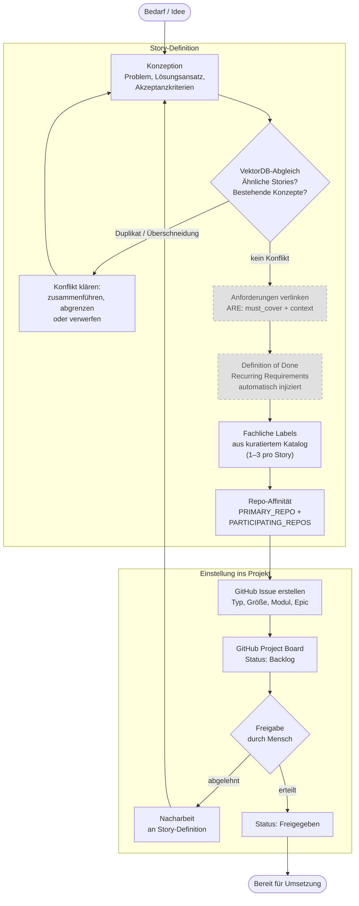

# 02 — Deterministische Pipeline-Orchestrierung

**Quelle:** Konsolidiert aus agentkit-domain-concept.md Kapitel 5 + Appendix A/B/C/D/F
**Datum:** 2026-04-02
**Übersicht:** [00-uebersicht.md](00-uebersicht.md)

---

## 2. Deterministische Pipeline-Orchestrierung

Der gesamte Story-Lifecycle besteht aus der Erstellung einer Story und
ihrer Bearbeitung. Beide folgen einer festen Phasenfolge mit definierten
Ein- und Ausgaben. Kein Agent entscheidet über den Ablauf, der Ablauf
entscheidet, wann welcher Agent arbeiten darf.

Die Ablaufsteuerung wird in AK3 nicht nur fuer die Gesamtpipeline,
sondern einheitlich ueber alle Ebenen modelliert: Pipeline, Phase,
Komponente und Subschritt verwenden dieselben Kontrollflussbausteine
(Guards, Gates, Branching, Rueckspruenge, Yield-Points,
Execution-Policies, Overrides). Die Pipeline ist damit nur die oberste
Ebene einer gemeinsamen hierarchischen Prozesssprache, nicht ein
Sonderfall mit eigener Logik.

Eine Story durchläuft vier Zustände im GitHub Project Board: Backlog,
Freigegeben, In Progress und Done. Interne Zustände wie Verify-Fail,
Eskalation oder Pause ändern den GitHub-Status nicht (die Story bleibt
"In Progress") und leben nur in der AgentKit-Telemetrie. Wenn der
Orchestrator einen internen Zustand nicht auflösen kann, wird an den
Menschen eskaliert.

Die Schwere des Prozesses hängt vom Story-Typ ab. Implementierende
Stories (Implementation, Bugfix) durchlaufen die vollständige
Pipeline mit allen Guards, QA-Stufen und Gates. Konzept- und
Research-Stories produzieren Dokumente statt Code und durchlaufen einen
deutlich leichtgewichtigeren Pfad, der die meisten Gates umgeht.

### 2.1 Story-Erstellung

Die Qualität der Umsetzung beginnt bei der Qualität der Story. Viele
Probleme, die in der Umsetzung auftreten (Scope Drift, redundante
Implementierungen, fehlende Anforderungen), lassen sich durch eine
strukturierte Erstellung verhindern. Die Story-Erstellung ist deshalb
kein informeller Vorgang, sondern ein eigener deterministischer Ablauf
mit Prüfpunkten.

| Darstellung | Bedeutung |
|-------------|-----------|
| Normale Box | Pflichtschritt |
| Graue Box, gestrichelte Linie | Optionaler Schritt (nur bei verfügbarer ARE) |

**Konzeption:** Der Auslöser ist ein fachlicher Bedarf oder eine Idee.
Ein Agent erstellt die Story-Definition mit Problemstellung,
Lösungsansatz und Akzeptanzkriterien. Bei komplexen Vorhaben geht dem
eine eigene Konzept-Story voraus, deren Ergebnis als Grundlage dient.

> **[Entscheidung 2026-04-08]** Element 22 — VektorDB-Abgleich ist immer aktiv. Keine Feature-Flag-Stufung.
> Siehe `stories/entscheidung-v2-ballast-bewertung.md`, Element 22.

**VektorDB-Abgleich:** Bevor die Story finalisiert wird, gleicht der
Agent den Inhalt gegen die Wissensbasis (VektorDB) ab. Gibt es bereits
Stories, die denselben oder einen ähnlichen Bereich adressieren? Gibt es
Konzepte, deren Festlegungen die neue Story berücksichtigen muss? Dieser
Abgleich verhindert, dass Agenten Dinge komplett neu erfinden, die in
anderer Form bereits umgesetzt oder bewusst verworfen wurden.

Der Abgleich arbeitet zweistufig: Erst filtert ein konfigurierbarer
Similarity-Schwellenwert (Startwert 0.7) den gröbsten Noise heraus.
Nur Treffer oberhalb des Schwellenwerts werden an ein LLM zur
semantischen Bewertung weitergereicht, maximal die Top 5. Das LLM
beurteilt, ob ein echter Konflikt oder eine relevante Überschneidung
vorliegt. Die vollständige Treffermenge (Anzahl Treffer gesamt, Anzahl
über Schwellenwert, Anzahl vom LLM als Konflikt bewertet) wird
protokolliert, damit der Schwellenwert über die Zeit anhand der
tatsächlichen False-Positive/False-Negative-Rate angepasst werden
kann.

**Anforderungen verlinken:** Wenn ARE verfügbar ist, werden die
relevanten Anforderungen mit der Story verknüpft. Wiederkehrende
Pflichtanforderungen (Qualitätschecks, Coding-Standards, Testpflichten)
werden automatisch injiziert und bilden die maschinenprüfbare Definition
of Done. Die Zuordnung der passenden Anforderungen erfolgt über die
Scope-Zuordnung (siehe Abschnitt 6.2 in [06-are-integration.md](06-are-integration.md)).

**Fachliche Labels zuweisen:** Der Agent wählt 1–3 thematische Labels
aus einem kuratierten Katalog. Labels sind fachliche
Themenkategorien (z.B. "Berichtserstellung", "Datenintegration",
"Benutzerverwaltung"), keine technischen Tags und keine Story-Typen.
Der Katalog wird vom Projektteam bewusst gepflegt. Agents dürfen
keine Labels ad hoc erfinden. Ein Label muss auf mindestens drei
Stories anwendbar sein, um seine Existenz im Katalog zu
rechtfertigen. Labels und Repos bedienen orthogonale Dimensionen:
Labels klassifizieren das fachliche Thema, Repos den technischen
Scope.

**Repo-Affinität ermitteln:** Bei Stories, die Code produzieren,
identifiziert der Agent anhand der betroffenen Dateipfade automatisch,
welche Repositories tangiert sind. Das Ergebnis sind zwei Felder:
PRIMARY_REPO (das Repository mit den meisten/wichtigsten Änderungen)
und PARTICIPATING_REPOS (alle Repositories mit mindestens einer
betroffenen Datei). Die Zuordnung erfolgt über Longest-Prefix-Match
der Dateipfade gegen die konfigurierten Repo-Pfade. Nur explizit
aufgeführte Dateien zählen als Evidenz, keine Erwähnungen in
Referenzen oder Logs. Beide Felder werden vollautomatisch durch den
Create-User-Story-Skill bestimmt und direkt als GitHub Project Fields
gesetzt — keine manuelle Prüfung oder Korrektur vorgesehen. Bei
Single-Repo-Projekten ist PRIMARY_REPO trivialerweise das einzige
Repo. Die Participating Repos steuern drei Aspekte der nachfolgenden
Pipeline: welche Repos einen Feature-Branch und Worktree erhalten,
welche ARE-Scopes für die Anforderungsverknüpfung gelten und wie der
Branch-Guard den Arbeitsbereich einschränkt.

**Freigabe durch den Menschen:** Die Story wird ins GitHub Project
eingestellt und erhält den Status "Backlog". Erst durch eine explizite
Freigabe durch den Menschen wechselt der Status auf "Approved". Die
Preflight-Gates der Umsetzungs-Pipeline prüfen diesen Status und lassen
nur freigegebene Stories durch. Kein Agent kann eigenständig entscheiden,
was implementiert wird.

### 2.2 Story-Bearbeitung

Nach erfolgter Freigabe durchläuft die Story die Bearbeitungs-Pipeline.
Der Ablauf unterscheidet sich grundlegend nach Story-Typ:

**Implementierende Stories** (Implementation, Bugfix) durchlaufen
die vollständige Pipeline mit Guards, QA-Stufen und Gates. Eine
deterministische, fail-closed Modus-Ermittlung (Details in
[23_modusermittlung_exploration_change_frame.md](../technical-design/23_modusermittlung_exploration_change_frame.md))
entscheidet zusätzlich, ob die Story direkt implementiert wird
(Execution Mode) oder zuerst eine Konzeptionsphase durchlaufen muss
(Exploration Mode).

**Konzept-Stories** produzieren Dokumente, keinen Code. Sie durchlaufen
einen leichtgewichtigen Pfad: Der Worker erstellt das Konzeptdokument,
prüft gegen die VektorDB auf Überschneidungen mit bestehenden Konzepten,
und das Ergebnis wird im definierten Ablageort gespeichert. Die
vollständige Verify-Pipeline (Structural Checks, E2E-Assertions,
Semantic Review) entfällt, ebenso die Modus-Ermittlung und das
Integrity-Gate. Konzept-Stories haben eigene, leichtgewichtige
Qualitätskriterien (Struktur, Vollständigkeit der Abschnitte,
Sparring-Nachweis).

**Research-Stories** sind reine Informationsbeschaffung. AgentKit
gewährleistet, dass der passende Skill geladen wird, der den Agenten
methodisch zu einem strukturierten Research befähigt (systematische
Suche, Quellenvielfalt, Bewertung der Ergebnisse). Das Ergebnis wird
im definierten Research-Ablageort gespeichert. Gates, Guards und
QA-Pipeline sind für Research-Stories nicht relevant.

```mermaid
flowchart TD
    classDef optional fill:#e0e0e0,stroke:#999,stroke-dasharray: 5 5,color:#555
    classDef exploration fill:#fff3cd,stroke:#d4a017,color:#333
    classDef lightweight fill:#d4edda,stroke:#28a745,color:#333

    START([Story freigegeben]) --> PREFLIGHT

    subgraph SETUP_PHASE [Setup-Phase]
        PREFLIGHT["Preflight-Gates"]
        PREFLIGHT -->|PASS| CONTEXT["Story-Context<br/>erfassen"]
        PREFLIGHT -->|FAIL| ABORT([Abbruch])
        CONTEXT --> TYPCHECK{"Story-Typ?"}
    end

    TYPCHECK -->|Konzept| CONCEPT_PATH
    TYPCHECK -->|Research| RESEARCH_PATH
    TYPCHECK -->|Implementation / Bugfix| WORKTREE

    CONCEPT_PATH["Konzept-Story:<br/>VektorDB-Abgleich,<br/>Dokument erstellen,<br/>leichtgewichtige Checks"]:::lightweight --> DONE
    RESEARCH_PATH["Research-Story:<br/>Skill laden,<br/>strukturierte Recherche,<br/>Ergebnis ablegen"]:::lightweight --> DONE

    WORKTREE["Worktree + Branch<br/>erstellen"] --> GUARDS["Guards aktivieren"]
    GUARDS --> ROUTING{"Modus-Ermittlung<br/>(fail-closed)"}

    ROUTING -->|Execution Mode| PLAN
    ROUTING -->|Exploration Mode| EXPLORE

    subgraph EXPLORE_PHASE ["Exploration-Phase (REF-034: inkl. Exit-Gate)"]
        EXPLORE["Story verdichten,<br/>Änderungsfläche lokalisieren,<br/>Lösungsrichtung wählen"]:::exploration
        EXPLORE --> SELF_CONFORM["Selbst-Konformitätsprüfung<br/>gegen Referenzdokumente"]:::exploration
        SELF_CONFORM --> DOC_CHECK["Stufe 1: Dokumententreue-Prüfung<br/>(LLM-basiert, unabhängig)"]:::exploration
        DOC_CHECK -->|Konflikt| ESCALATE_DOC["ESCALATED:<br/>Mensch entscheidet<br/>→ neuer Run"]
        DOC_CHECK -->|PASS| DESIGN_REV["Stufe 2a: Design-Review<br/>(LLM via Evaluator)"]:::exploration
        DESIGN_REV --> PREMISE_CHECK["Prämissen-Challenge<br/>(LLM, fokussiert)"]:::exploration
        PREMISE_CHECK --> TRIGGER_EVAL["Trigger-Evaluation<br/>(deterministisch)"]:::exploration
        TRIGGER_EVAL -->|Trigger vorhanden| DESIGN_CHAL["Stufe 2b: Design-Challenge<br/>(LLM via Evaluator)"]:::exploration
        DESIGN_CHAL --> AGG["H1: Aggregation"]:::exploration
        TRIGGER_EVAL -->|Kein Trigger| AGG
        AGG --> CLASSIFY["H2: Nachklassifikation<br/>(Mandatsregelwerk)"]:::exploration
        CLASSIFY -->|Klasse 2| FEINDESIGN["J: Feindesign-Subprozess<br/>(KI entscheidet selbst)"]:::exploration
        FEINDESIGN --> DESIGN_REV
        CLASSIFY -->|Klasse 1/3/4| PAUSE_PO["PAUSED:<br/>Menschliche Klärung<br/>→ Resume derselben Phase"]
        PAUSE_PO --> DESIGN_REV
        CLASSIFY -->|PASS ohne Findings| FREEZE["Entwurfsartefakt<br/>einfrieren"]:::exploration
        FREEZE --> GATE_APPROVED["gate_status = APPROVED"]:::exploration
        GATE_APPROVED --> PLAN
        CLASSIFY -->|Nur Review-Findings| REMEDIATE["Draft nachbessern"]:::exploration
        REMEDIATE --> DESIGN_REV
        CLASSIFY -->|FAIL non-remediable| ESCALATE_DR["ESCALATED:<br/>Mensch entscheidet<br/>→ neuer Run"]
    end

    subgraph IMPL_PHASE [Implementierung]
        PLAN["Story in vertikale<br/>Inkremente schneiden"]
        PLAN --> IMPL_LOOP

        IMPL_LOOP["Pro Inkrement:<br/>Implementieren,<br/>lokal verifizieren,<br/>Drift prüfen, committen"]
        IMPL_LOOP --> REVIEW_CHECK{"Review<br/>fällig?"}
        REVIEW_CHECK -->|ja| LLM_REVIEW["Review durch<br/>Pflicht-Reviewer (LLM)"]
        LLM_REVIEW --> NEXT_INC
        REVIEW_CHECK -->|nein| NEXT_INC
        NEXT_INC{"Weitere<br/>Inkremente?"} -->|ja| IMPL_LOOP
        NEXT_INC -->|nein| FINAL_BUILD["Finaler Build +<br/>Gesamttest"]
        FINAL_BUILD --> HANDOVER["Handover-Paket<br/>erzeugen"]

        HEALTH_MON["Worker-Health-Monitor<br/>(Scoring + Intervention)"] -.->|ueberwacht<br/>kontinuierlich| IMPL_LOOP
        IMPL_LOOP -->|BLOCKED| BLOCKED_EXIT(["Worker meldet BLOCKED"])
    end

    HANDOVER --> VERIFY

    subgraph VERIFY_PHASE ["Verify-Phase (Umfang abhängig von verify_context)"]

        subgraph SCHICHT_1 [Schicht 1: Deterministische Checks]
            VERIFY["Artefakt-Prüfung"]
            VERIFY -->|PASS| DET_PAR{Parallel}
            VERIFY -->|FAIL| FEEDBACK
            DET_PAR --> STRUCTURAL["Structural Checks"]
            DET_PAR --> RECURRING["Recurring Guards<br/>(Telemetrie)"]
            DET_PAR --> ARE_GATE["ARE-Gate"]:::optional
            STRUCTURAL --> DET_JOIN{Gate}
            RECURRING --> DET_JOIN
            ARE_GATE --> DET_JOIN
        end

        DET_JOIN -->|FAIL| FEEDBACK
        DET_JOIN -->|PASS| LLM_PAR

        subgraph SCHICHT_2 ["Schicht 2: LLM-Bewertungen (Skript, kein Agent)"]
            LLM_PAR{Parallel} --> QA_REVIEW["QA-Bewertung<br/>12 Checks<br/>(LLM A via Skript)"]
            LLM_PAR --> SEM_REVIEW["Semantic Review<br/>(LLM B via Skript)"]
            QA_REVIEW --> LLM_JOIN{Gate}
            SEM_REVIEW --> LLM_JOIN
        end

        LLM_JOIN -->|FAIL| FEEDBACK
        LLM_JOIN -->|PASS| ADV_START

        subgraph SCHICHT_3 ["Schicht 3: Adversarial Testing (Agent)"]
            ADV_START["Adversarial Agent<br/>holt Sparring-LLM<br/>für Edge-Case-Ideen"]
            ADV_START --> ADV_TEST["Tests schreiben<br/>und ausführen"]
            ADV_TEST --> ADV_RESULT{Befunde?}
        end

        ADV_RESULT -->|Fehler gefunden| FEEDBACK
        ADV_RESULT -->|kein Fehler| POLICY

        POLICY["Policy-Evaluation"]
        POLICY -->|PASS| EXIT_VERIFY
        POLICY -->|FAIL| FEEDBACK

        FEEDBACK["Feedback an Worker:<br/>konkrete Mängelliste"] --> ROUND_CHECK{"Runde<br/>< max?"}
        ROUND_CHECK -->|ja| REMEDIATION["Remediation Worker<br/>Artefakte invalidiert,<br/>neuer QA-Zyklus"]
        REMEDIATION --> VERIFY
        ROUND_CHECK -->|nein| ESCALATE_QA["ESCALATED:<br/>Mensch entscheidet<br/>→ neuer Run"]
        EXIT_VERIFY[Verify bestanden]
    end

    EXIT_VERIFY --> CLOSURE

    subgraph CLOSURE_PHASE [Closure-Phase]
        CLOSURE["Integrity-Gate<br/>7 Dimensionen"]
        CLOSURE -->|FAIL| ESCALATE["ESCALATED:<br/>Mensch entscheidet<br/>→ neuer Run oder Override"]
        CLOSURE -->|PASS| MERGE["Branch mergen<br/>Worktree aufräumen"]
        MERGE --> CLOSE_ISSUE["Issue schließen<br/>Status: Done"]
        CLOSE_ISSUE --> METRICS["Metriken setzen<br/>QA-Runden, Durchlaufzeit"]
        METRICS --> REPORT["Execution Report<br/>erzeugen"]
        REPORT --> POSTFLIGHT["Postflight-Gates"]
    end

    POSTFLIGHT --> DONE([Story abgeschlossen])
```

| Darstellung | Bedeutung |
|-------------|-----------|
| Normale Box | Pflichtschritt (implementierende Stories) |
| Grüne Box | Leichtgewichtiger Pfad (Konzept / Research) |
| Gelbe Box | Exploration Mode (nur bei unreifen oder architekturwirksamen Stories) |
| Graue Box, gestrichelte Linie | Optionaler Schritt (nur bei verfügbarer ARE) |

`PAUSED` ist kein terminaler Zustand: Nach menschlicher Klärung wird
derselbe Run fortgesetzt. `ESCALATED` beendet dagegen nur den aktuellen
Run; die Story bleibt offen und wird nach menschlicher Intervention per
neuem Run oder bewusstem Override weiterbearbeitet.

### Setup-Phase

Die Pipeline beginnt mit den Preflight-Gates. Acht Prüfungen stellen
sicher, dass die Voraussetzungen für die Story-Bearbeitung erfüllt sind:
Das Issue existiert, der Projektstatus ist korrekt ("Approved"),
alle Abhängigkeiten sind geschlossen, es gibt keine Reste aus vorherigen
Läufen (keine stale Telemetrie, kein existierender Story-Branch, kein
übrig gebliebener Worktree, keine Ausführungsartefakte). Scheitert eine
dieser Prüfungen, wird die Story nicht gestartet.

Nach bestandenem Preflight werden für alle Participating Repos der
Story isolierte Worktrees mit eigenen Feature-Branches erstellt. In
Multi-Repo-Projekten erhält jedes beteiligte Repository seinen eigenen
Worktree. Repos, die nicht als Participating Repo deklariert sind,
erhalten keinen Feature-Branch — der Worker arbeitet dort auf Main,
was durch den Branch-Guard überwacht wird. Der Story-Context wird aus
GitHub (Issue-Daten, Projekt-Metadaten, Story-Typ, Abhängigkeiten,
Participating Repos) erfasst und die Guards aktiviert:
Orchestrator-Guard, Branch-Guard, Prompt-Integrity-Guard und
Integrity-Guard sind ab diesem Zeitpunkt scharf geschaltet.

Am Ende der Setup-Phase steht die deterministische, fail-closed
Modus-Ermittlung. Für implementierende Stories gilt: Sobald ein
Exploration-Trigger greift, Pflichtfelder fehlen oder ein
VektorDB-Konflikt vorliegt, geht die Story in die Exploration-Phase.
Nur wenn kein Trigger greift und kein Konflikt vorliegt, geht sie
direkt in die Implementierung. Details zur Entscheidungsregel stehen in
[23_modusermittlung_exploration_change_frame.md](../technical-design/23_modusermittlung_exploration_change_frame.md).

### Phase-Transition-Enforcement

Die Pipeline erzwingt zur Laufzeit den definierten
Phasenübergangsgraphen. `run_phase()` prüft bei jedem Aufruf,
ob der Übergang von der letzten Phase zur aktuellen Phase gültig
ist. Ungültige Übergänge werden blockiert (fail-closed,
PIPELINE_ERROR). Die letzte bekannte Phase wird aus der
persistierten `phase_state_projection` gelesen. Ein eventueller
`phase-state.json`-Export ist nur eine Materialisierung derselben
Projektion.

**Graphen-Enforcement:** Der Phasenübergangsgraph definiert die
erlaubten Übergänge:

| Von | Erlaubte Ziele |
|-----|----------------|
| setup | exploration, implementation |
| exploration | implementation |
| implementation | verify |
| verify | implementation, closure, exploration |
| closure | (Terminal — kein Folgezustand) |

Jeder Übergang, der nicht im Graphen steht, wird abgelehnt. Ohne
vorherige `phase_state_projection` darf ausschließlich die Setup-Phase
aufgerufen werden. Das Resume derselben Phase (z.B. Exploration
nach PAUSED) ist kein Phasenübergang und wird nicht blockiert.

**Status-Prüfung der Vorphase:** Die letzte Phase muss den
Status COMPLETED haben, bevor die nächste Phase starten darf.
Ausnahme: Der Remediation-Pfad von `verify` zurück zu
`implementation` oder `exploration` ist auch bei Status PAUSED
erlaubt, da Verify-FAIL den Rückweg in die Remediation öffnet.
Von `verify` zu `closure` ist nur bei COMPLETED zulässig.

**Semantische Vorbedingungen:** Zusätzlich zum Graphen werden
modusabhängige Bedingungen geprüft. Im Exploration Mode muss das
Exploration-Gate bestanden sein
(`payload.gate_status == ExplorationGateStatus.APPROVED`), bevor die
Implementation-Phase betreten werden darf. Die Closure-Phase erfordert
eine abgeschlossene Verify-Phase. Defense-in-Depth: Sowohl beim
Phaseneintritt in `run_phase()` als auch in der Verify-Phase wird der
Gate-Status unabhängig voneinander geprüft.

**Fehlermeldungen:** Jede Ablehnung enthält diagnostisch
nützliche Informationen: Ausgangsphase, Zielphase, Status der
Ausgangsphase, erlaubte Übergänge und bei semantischen
Vorbedingungen den aktuellen Wert des fehlenden Feldes.

Referenz: FK-20 §20.3 (Phasenübergänge, F-20-009).

### Exploration-Phase (nur im Exploration Mode)

Im Exploration Mode erzeugt der Worker ein prüffähiges Entwurfsartefakt.
Das ist kein Architekturdokument, sondern ein kompakter Change-Frame
mit sieben Bestandteilen:

1. **Ziel und Scope:** Was ändert sich fachlich, was ausdrücklich nicht?
2. **Betroffene Bausteine:** Welche Module, Services, APIs, Tabellen
   sind betroffen, welche bleiben unangetastet?
3. **Lösungsrichtung:** Welches Architekturmuster, wo wird die Änderung
   verankert, warum ist das die kleinste passende Lösung?
4. **Vertragsänderungen:** Neue oder geänderte Schnittstellen,
   Datenmodell-/Schema-Änderungen, Events, externe Integrationen.
5. **Konformitätsaussage:** Welche Referenzdokumente wurden
   berücksichtigt, wo ist der Entwurf konform, wo gibt es Abweichungen?
6. **Verifikationsskizze:** Welche Testebenen werden voraussichtlich
   nötig (Unit, Integration, E2E)?
7. **Offene Punkte:** Was ist entschieden, was ist Annahme, was braucht
   menschliche Freigabe?

Der Worker erarbeitet den Entwurf in einer festen Schrittfolge: Story
auf eine präzise Veränderungsabsicht verdichten, relevante
Referenzdokumente heranziehen (nur die für diese Story passenden,
nicht alles), die Änderungsfläche im bestehenden System lokalisieren,
eine Lösungsrichtung wählen und gegen Referenzdokumente auf
Konformität prüfen. Anschließend durchläuft der Entwurf den
Review-Zyklus: LLM-basierte Dokumententreue-Prüfung, Design-Review,
Prämissen-Challenge und ggf. Design-Challenge. Erst nach bestandenem
Gate wird das Artefakt eingefroren (Details zur Reihenfolge: FK-25
§25.4.2).

Der Worker gleicht den Entwurf bereits selbst gegen bestehende
Architektur ab. Die nachfolgende Dokumententreue-Prüfung ist damit
nicht die erste, sondern die zweite, unabhängige Konformitätsprüfung.

Mandatskritische Punkte werden nicht blind an den Menschen gegeben.
Stattdessen klassifiziert AgentKit die Findings nach vier Klassen:
Klasse 2 bleibt innerhalb des KI-Mandats und wird im
Feindesign-Subprozess autonom mit Multi-LLM-Beratung aufgelöst.
Nur Klasse 1 (fachliche Lücke / Normativ-Konflikt), Klasse 3
(Scope-Explosion) und Klasse 4 (Tragweiten-Überschreitung)
pausieren die Pipeline für menschliche Klärung.

Erst nach bestandener Prüfung, bestandener Nachklassifikation und
abgeschlossenem Feindesign-Fall geht die Story in die Implementierung.

**Mandatsprinzip:** Der Mensch legt normative Leitplanken fest (Fach-
und IT-Konzepte). Alles, was innerhalb dieser Leitplanken liegt und
keine neue fachliche Substanz erzeugt, entscheiden Agenten autonom.
Die Mandatsgrenze ist: Braucht die Entscheidung Wissen oder Autorität,
die nicht in Konzepten, Code und Story-Spezifikationen liegt? Wenn ja,
eskaliert der Agent an den Menschen. Wenn nein, löst der Agent das
Problem selbständig — bei Feindesign-Entscheidungen mit
modulübergreifender Wirkung unter Hinzuziehung externer LLMs in einem
agentengeführten Diskussionsprozess (nicht einmaliger Broadcast,
sondern iterativer Dialog mit Austausch von Gegenpositionen und
Kontextnachlieferung).

Technische Feindesign-Entscheidungen, die über die mittlere
Abstraktionsebene der IT-Konzepte hinausgehen — etwa die exakte
Semantik eines Schnittstellenvertrags oder die Zuordnung einer
Scope-Lücke zwischen zwei Stories — werden im Rahmen der Exploration
aufgelöst, nicht erst in der Implementierung. Denn diese Entscheidungen
haben Wirkung über die einzelne Methode hinaus und müssen daher in
einem abgesicherten Designentscheidungsprozess stattfinden.

Referenz: FK-25 (Mandatsgrenzen und Feindesign-Autonomie).

### Implementierung

Der Worker arbeitet im isolierten Worktree und unterliegt den aktiven
Guards. Die Implementierung ist der einzige nicht-deterministische
Schritt in der Pipeline, folgt aber einer definierten Methodik.

#### Inkrementelles Vorgehen

Der Worker schneidet die Story nicht nach technischen Schichten
(erst alle Models, dann alle Services, dann alle Controller), sondern
in vertikale Inkremente: jedes Inkrement ist ein fachlich lauffähiger
Teilstand. Beispiel: Ein Inkrement umfasst die Vertragsänderung,
die zugehörige Domänenlogik, die Persistenz und den Endpunkt für
genau einen fachlichen Aspekt der Story.

Pro Inkrement durchläuft der Worker vier Schritte:

1. **Implementieren:** Code für genau diesen Slice schreiben.
2. **Lokal verifizieren:** Kleinsten verlässlichen Check ausführen
   (Compile/Lint, betroffene Tests, nicht Full-Build). Der vollständige
   Build bleibt dem finalen Check vor Handover vorbehalten.
3. **Drift prüfen:** Überschreite ich den genehmigten Impact? Habe ich
   neue Strukturen eingeführt, die nicht im Entwurf stehen? Weiche
   ich vom Konzept ab? Wenn ja: Abweichung markieren und begründen.
   Wenn der Drift neue Strukturen (APIs, Datenmodelle) einführt oder
   den deklarierten Impact-Level überschreitet, muss die
   Dokumententreue-Prüfung erneut ausgelöst werden, bevor der Worker
   weiterarbeiten darf. Bei kleineren Abweichungen (anderes Pattern
   gewählt, Detailentscheidung anders als im Entwurf) reicht die
   Dokumentation der Abweichung im Handover-Paket.
4. **Committen:** Erst wenn der Slice intern konsistent und lokal
   grün ist.

#### Teststrategie

Der Worker wählt die Teststrategie nicht frei, sondern situativ nach
Regelwerk:

**TDD (Tests zuerst)** für deterministische Logik: Berechnungen,
Validierungsregeln, Mappings, Zustandsübergänge, Parser, Bugfix-
Reproduktionen. Tests als Anker gegen Halluzinationen: Der Worker
definiert zuerst, was korrekt ist, und implementiert dann dagegen.

**Test-After** für Integrations-Verdrahtung: Neue End-to-End-
Verkabelung, externe Integrationen, Framework-Konfiguration,
Migrationspfade. Hier muss erst die technische Lauffähigkeit
hergestellt werden, bevor sinnvolle Tests formuliert werden können.

**Unit-Tests** wenn Verhalten in Isolation beweisbar ist (Domänenlogik,
Entscheidungsregeln, Transformationen). **Integrationstests** wenn die
Wahrheit an einer echten Grenze sitzt (Datenbankzugriff, API-Vertrag,
Messaging, Berechtigungen). **E2E-Tests** wenn nur der vollständige
Ablauf die Story fachlich beweist (geschäftskritischer User-Flow,
Zusammenspiel mehrerer Schichten).

Vor Handover müssen beide Testarten (TDD und Test-After)
zusammengeführt sein. Kein Inkrement bleibt ungetestet.

#### Review durch konfigurierte LLMs

Der Worker holt sich während der Implementierung Review von anderen
LLMs. Die Reviewer sind nicht frei wählbar, sondern in der
Pipeline-Konfiguration als Pflicht-Reviewer hinterlegt. Der Zweck
dieser Reviews ist präventiv: Architektur-Drift früh erkennen, blinde
Flecken aufdecken, Seiteneffekte identifizieren.

Die Häufigkeit orientiert sich an der Story-Größe:

| Story-Größe | Review-Punkte |
|-------------|---------------|
| XS, S | Ein Review vor Handover |
| M | Ein Review nach dem ersten Inkrement, ein Review vor Handover |
| L, XL | Review nach jedem zweiten bis dritten Inkrement, plus Review vor Handover |

Die Reviews ersetzen nicht die Verify-Phase. Sie machen den Worker
produktiver, indem Probleme früh sichtbar werden statt erst beim
finalen QA-Durchlauf.

#### Handover

Am Ende der Implementierung erzeugt der Worker ein Handover-Paket:
Was wurde geändert, welche Annahmen gelten, welche Tests existieren
bereits, welche Risiken sollte der QA-Agent gezielt prüfen. Dieses
Paket ist der Input für die Verify-Phase und gibt dem QA-Agenten
gezielte Ansatzpunkte statt einer blinden Suche.

#### Worker-Runaway-Prevention

Während der Implementation-Phase überwacht ein Worker-Health-Monitor
den laufenden Worker auf Anzeichen von Stagnation, Endlosschleifen
oder Constraint-Konflikten. Die Überwachung verhindert, dass ein
blockierter Worker unbegrenzt Ressourcen verbraucht, ohne
Fortschritte zu erzielen.

**Scoring-Modell:** Das Monitoring basiert auf einem gewichteten
Scoring-Modell (0–100 Punkte). Verschiedene Heuristiken tragen
unterschiedlich stark zum Score bei:

| Heuristik | Stärke | Was gemessen wird |
|-----------|--------|-------------------|
| Laufzeit vs. Erwartung | Stark | Normalisiert nach Story-Typ und -Größe |
| Repetitions-Muster | Stark | Wiederholte Tool-Aufrufe auf dieselbe Datei ohne Fortschritt |
| Hook/Commit-Konflikte | Sehr stark | Wiederholtes Scheitern am selben Hook-Reason |
| Fortschritts-Stagnation | Stark | Kein Commit, kein Manifest trotz grüner Tests |
| Tool-Call-Anzahl | Schwach | Nur als Verstärker, da problemabhängig |
| LLM-Assessment | Korrekturfaktor | Optionaler asynchroner Sidecar, verschiebt Score um ±10 Punkte |

> **[Entscheidung 2026-04-08]** Element 23 — LLM-Assessment-Sidecar ist Pflicht. Kein Feature-Flag. Der Sidecar ist keine optionale Erweiterung, sondern integraler Bestandteil der Produktionsarchitektur.
> Siehe `stories/entscheidung-v2-ballast-bewertung.md`, Element 23.

Das Scoring läuft deterministisch im Hook. Ein optionaler
asynchroner LLM-Assessment-Sidecar kann die Bewertung verfeinern,
ist aber nie Voraussetzung für eine Intervention oder einen
Hard Stop.

**Eskalationsleiter:** Der Score bestimmt die Reaktionsstufe:

| Score | Stufe | Reaktion |
|-------|-------|----------|
| < 50 | Normalbetrieb | Kein Eingriff |
| 50–69 | Warnung | LLM-Assessment anfordern, Hinweis an Worker |
| 70–84 | Soft-Intervention | Strukturierte Selbstdiagnose-Aufforderung an den Worker via PreToolUse-Hook |
| ≥ 85 | Hard Stop | Worker wird deterministisch gestoppt |

Bei der Soft-Intervention erhält der Worker eine strukturierte
Nachricht mit drei deklarierbaren Status: PROGRESSING (Fortschritt
belegen), BLOCKED (Constraint-Kollision melden) oder
SPARRING_NEEDED (externes LLM konsultieren). Nach der Intervention
wird das Verhalten über 4–5 weitere Tool-Calls beobachtet. Ohne
Verhaltensänderung steigt der Score weiter in Richtung Hard Stop.

**BLOCKED als Worker-Exit-Status:** Wenn der Worker eine unlösbare
Constraint-Kollision erkennt (z.B. Hook-Barriere, fehlende
Dependency), kann er über den Status `BLOCKED` im
`worker-manifest.json` sauber eskalieren. BLOCKED wird als
korrekte Worker-Leistung behandelt, nicht als Versagen. Der
Phase Runner erkennt `status: BLOCKED` und setzt den Phase-Status
auf ESCALATED mit `escalation_reason: "worker_blocked"`, sodass
der Orchestrator gezielt reagieren kann.

Details zum Scoring-Modell, zur Sidecar-Architektur und zur
Hook-Commit-Failure-Klassifikation siehe
[03-governance-und-guards.md](03-governance-und-guards.md).

### Verify-Phase

Nach der Implementierung durchläuft die Story die Verify-Phase. Sie
besteht aus vier Schichten, die aufeinander aufbauen. Nur ein einziger
Agent (der Adversarial Testing Agent) hat Dateisystem-Zugriff. Die
LLM-basierten Bewertungen laufen als deterministische Pipeline-Schritte,
die LLMs über API/Pool als Bewertungsfunktion aufrufen, nicht als
eigenständige Agents.

#### Verify-Kontext: Post-Implementation vs. Post-Remediation

Die Verify-Phase unterscheidet zwischen zwei Kontexten:

- **Verify nach Implementation** (`verify_context = "post_implementation"`):
  Vollständige 4-Schichten-QA mit allen Guards, LLM-Bewertungen,
  Adversarial Testing und Policy-Evaluation.

 - **Verify nach Remediation** (`verify_context = "post_remediation"`):
  Erneut vollständige 4-Schichten-QA. Nach einer Nachbesserung wird
  nicht nur ein Teil der Prüfung wiederholt, sondern der gesamte
  QA-Zyklus neu aufgesetzt.

Das Pipeline-Feld `mode` (gesetzt in der Setup-Phase) bleibt über den
gesamten Story-Lifecycle konstant und reicht nicht aus, um den
Verify-Kontext zu bestimmen. Eine Story im Exploration Mode hat
`mode = "exploration"` sowohl nach der ersten Implementation als auch
nach späteren Remediation-Schleifen. Der Verify-Kontext wird daher
über ein separates Feld `verify_context` ermittelt, das die letzte
abgeschlossene Phase vor dem Verify identifiziert.

**Entscheidungsregel:** `verify_context = "post_implementation"` löst
immer die volle 4-Schichten-QA aus, unabhängig davon, ob
`mode = "exploration"` oder `mode = "execution"`. Dasselbe gilt für
`verify_context = "post_remediation"`. Einen Structural-only-Pfad für
Implementation- und Bugfix-Stories gibt es nicht.

#### Atomarer QA-Zyklus

Jede Verify-Remediation-Iteration bildet einen atomaren QA-Zyklus
mit eigener Identität. Ein Zyklus hat drei Kenngrößen: eine
eindeutige Zyklus-ID, eine monoton steigende Rundennummer und eine
Evidenz-Epoche (Zeitstempel des letzten Code-/Artefaktstands). Die
Evidenz-Epoche ermöglicht nachgelagerten Prüfungen, veraltete
Artefakte zu erkennen.

Das Problem, das der atomare Zyklus löst: Ohne Zyklusidentität
könnten QA-Artefakte einer früheren Verify-Runde versehentlich in
die Bewertung einer späteren Runde nach Remediation einfließen. Ein
Worker könnte einen Mangel beheben, aber veraltete Semantic-Review-
oder Guardrail-Ergebnisse der vorherigen Runde würden bestehen
bleiben und ein falsches PASS oder FAIL liefern.

Wenn eine neue Runde beginnt (nach abgeschlossener Remediation),
werden alle zyklusbezogenen Artefakte invalidiert: Semantic-Review,
Guardrail-Ergebnisse, Policy-Entscheidungen, LLM-Review-Berichte,
QA-Bewertungen, Feedback-Listen und Adversarial-Ergebnisse. Jedes
Artefakt, dessen eingebettete Zyklus-ID nicht zum aktuellen Zyklus
passt, wird fail-closed als veraltet abgelehnt. Das stellt sicher,
dass jede Verify-Runde auf einem sauberen, in sich konsistenten
Evidenzstand operiert.

#### Schicht 1: Deterministische Checks (automatisiert)

Diese Checks laufen ohne LLM als Skripte oder Tool-Integrationen:

- **Artefakt-Prüfung:** Protocol existiert, Manifest valides JSON,
  deklarierte Dateien existieren, Commits auf dem Branch.
- **Structural Checks:** Build erfolgreich, Tests grün, Testabdeckung
  vorhanden, Commit-Hygiene, Security-Patterns (keine Secrets im Diff),
  keine deaktivierten Tests, keine TODOs im Produktivcode.
- **Recurring Guards:** Telemetrie-basierte Prozessprüfung (richtige
  Tools benutzt, verbotene Tools vermieden, Backend mit aktuellem Code,
  Operationsreihenfolge, Artefakt-Frische).
- **ARE-Gate:** Alle must_cover-Anforderungen haben Evidence (sofern
  ARE verfügbar).
- **Externe Tools:** SonarQube oder vergleichbare statische Analyse
  über die konfigurierbare Stage-Registry.

Scheitert eine dieser Prüfungen, geht die Story direkt zurück an den
Worker. Die nachfolgenden Schichten werden nicht gestartet.

#### Schicht 2: LLM-Bewertungen (parallel, kein Agent)

Zwei LLM-Bewertungen laufen parallel. Beide werden nicht von Agents
ausgeführt, sondern von deterministischen Python-Skripten, die LLMs
über API oder Browser-Pool aufrufen. Die Skripte liefern den
Bewertungskontext (Code-Diff, Story-Anforderungen, Konzept/Entwurf,
Handover-Paket) als strukturierten Input und fordern ein definiertes
JSON-Response-Schema ein.

**Response-Schema (für beide Bewertungen identisch):**

Jeder Check liefert drei Felder: Status (PASS, PASS_WITH_CONCERNS,
FAIL), einen Einzeiler als Kurzgrund und eine Description mit maximal
300 Zeichen. Kein Freitext, keine ausufernde Analyse. Wenn das LLM das Schema nicht exakt einhält, versucht ein
Regex-Fallback die relevanten Felder zu extrahieren. Scheitert das,
wird ein einmaliger Retry mit explizitem Hinweis auf das erwartete
Schema an das LLM gesendet. Scheitert auch der Retry, gilt der Check
als FAIL (fail-closed). Maximal zwei LLM-Aufrufe pro Check.

**Aggregationsregel:** Ein einzelnes FAIL in einem beliebigen Check
blockiert die Story (fail-closed). PASS_WITH_CONCERNS blockiert nicht,
fließt aber als Warnung in die Policy-Evaluation und wird im
Handover an den Adversarial Agent als Ansatzpunkt weitergegeben.

**QA-Bewertung** prüft die Implementierung gegen Anforderungen und
Konzept:

| Check | Was beurteilt wird |
|-------|--------------------|
| Akzeptanzkriterien erfüllt | Deckt die Implementierung das ab, was die Story verlangt? |
| Umsetzungstreue | Entspricht das Gebaute dem freigegebenen Entwurf/Konzept? |
| Scope-Einhaltung | Gibt es undokumentierten Scope Creep? |
| Impact-Violation | Überschreitet der tatsächliche Änderungsumfang den deklarierten Impact? |
| Architekturkonformität | Pattern-Wahl, Schichtentrennung, Boundary-Disziplin eingehalten? |
| Angemessenheit | Lösung weder over-engineered noch zu simpel? |
| Fehlerbehandlung | Werden Fehlerfälle sauber behandelt oder still verschluckt? |
| Berechtigungslogik | Kann über Zugriffspfade Mandantentrennung verletzt werden? |
| Stiller Datenverlust | Können Daten verloren gehen ohne expliziten Fehler? |
| Rückwärtskompatibilität | Brechen bestehende Consumer durch die Änderung? |
| Observability | Logging und Fehler-Sichtbarkeit an den richtigen Stellen? |
| Dokumentationsbedarf | Ist bestehende Doku durch die Änderung veraltet? |

**Semantic Review** bewertet auf einer höheren Abstraktionsebene die
systemische Angemessenheit nach Aggregation aller bisherigen Befunde.
Nicht die einzelnen Checks, sondern das Gesamtbild: Passt die Lösung
in den Systemkontext? Ist der Change im Verhältnis zum Problem
angemessen? Gibt es systemische Risiken, die die Einzelchecks nicht
sehen?

Beide Bewertungen laufen über unterschiedliche LLMs (konfigurierte
Pflicht-Reviewer) und kosten bei Nutzung der Browser-Pools kein
zusätzliches API-Budget.

#### Schicht 3: Adversarial Testing Agent (destruktiver Auftrag)

Der Adversarial Testing Agent ist der einzige echte Agent in der
Verify-Phase. Er hat Dateisystem-Zugriff, kann Tests schreiben und
ausführen, aber keinen Produktivcode editieren (Rollen-Scoping).

Sein Auftrag ist fundamental anders als die Bewertungen in Schicht 2:
Nicht "ist das korrekt?", sondern "kannst du mit Evidenz nachweisen,
dass es nicht robust ist?". Sein Gewinnkriterium ist umgekehrt: Er ist
erfolgreich, wenn er Fehler findet.

Der Agent hat die Pflicht, sich ein zweites LLM als Sparring-Partner
zu holen, um seinen Angriffsradius zu erweitern: Welche Edge Cases
könnte er übersehen? Welche Angriffsvektoren sind für genau diese
Implementierung besonders vielversprechend? Das zweite LLM liefert
Ideen, der Agent setzt sie um.

Was der Agent aktiv erzeugt:

- **Edge-Case-Tests:** Grenzwerte, leere Inputs, Maximalwerte,
  unerwartete Kombinationen, die der Worker nicht abgedeckt hat.
- **Gezielte E2E-/Integrationstests:** Aufwendigere Tests, die in
  der regulären Build-Pipeline zu teuer wären, aber im Kontext der
  Story-Absicherung bewusst durchgeführt werden.
- **Missbrauchsszenarien:** Wie kann ein Nutzer oder System die API
  in unerwarteter Weise belasten?
- **Ausfallszenarien:** Verhalten bei Timeouts, nicht erreichbaren
  Dependencies, partiellen Ausfällen.
- **Konkurrierende Zugriffe:** Parallele Operationen, die Race
  Conditions provozieren.

Bevor der Agent neue Tests schreibt, prüft er die vorhandene
Test-Suite. Wenn bereits Tests existieren, die eine hohe Abdeckung
und aussagekräftige Edge-Case-Behandlung bieten, schreibt er nicht
pauschal neue Tests, sondern bewertet zuerst, ob die bestehenden Tests
ausreichen. Nur wenn die vorhandenen Tests für unzureichend befunden
werden, erzeugt er gezielt ergänzende Tests. Das verhindert
Test-Suite-Bloat und spart Ressourcen.

Der Agent muss in jedem Fall mindestens einen Test ausführen (bestehend
oder neu erzeugt). Das ist der Nachweis, dass er tatsächlich getestet
hat und nicht nur behauptet, nichts gefunden zu haben. Wenn alle Tests
PASS ergeben, ist das ein valides Ergebnis (Angriffsversuche
gescheitert). Wenn Tests FAIL ergeben, liefert er eine Mängelliste
mit reproduzierbarer Evidenz.

Neu erzeugte Tests werden Teil der regulären Test-Suite und unterliegen
ab dann der normalen Code-Ownership. Es gibt keinen automatischen
Konsolidierungsmechanismus. Wenn die Test-Suite über die Zeit zu groß
wird und die Ausführungszeiten oder Kosten nicht mehr akzeptabel sind,
interveniert der Mensch und stößt eine gezielte Konsolidierung an.

#### Schicht 4: Policy-Evaluation und Remediation-Schleife

Die Ergebnisse aller drei vorherigen Schichten fließen in die
Policy-Evaluation, die über die konfigurierbare Stage-Registry
entscheidet, welche Stages blocking sind.

Bei Failures erhält der Worker eine konkrete Mängelliste. Ein
dedizierter Remediation-Worker wird gestartet, der ausschließlich die
identifizierten Mängel behebt. Nach abgeschlossener Remediation
beginnt ein neuer atomarer QA-Zyklus: Alle Artefakte des vorherigen
Zyklus werden invalidiert und die vollständige Vier-Schichten-Prüfung
läuft erneut von Grund auf.

**Finding-Resolution im Remediation-Zyklus:** Ab Runde 2 erhaelt
der Layer-2-Evaluator die konkreten Findings der Vorrunde direkt
aus den Review-Artefakten (nicht aus Worker-Zusammenfassungen) und
bewertet pro Finding: `fully_resolved`, `partially_resolved` oder
`not_resolved`. Closure blockiert bei offenem `partially_resolved`
oder `not_resolved`. Details siehe [04-qualitaetssicherung.md](04-qualitaetssicherung.md), §4.6.

Die Maximalzahl der Remediation-Runden ist konfigurierbar (Startwert:
3). Wird das Maximum erreicht, ohne dass die Verify-Phase bestanden
wird, wechselt die Story in den Status "Eskaliert". Der Orchestrator
stoppt die Bearbeitung, und der Mensch muss aktiv intervenieren. Die
Story kann erst nach menschlicher Intervention wieder in die Pipeline
eingespeist werden.

### Closure-Phase

Bevor eine Story geschlossen werden kann, validiert das Integrity-Gate
in sieben Dimensionen, dass der Prozess vollständig durchlaufen wurde.
Dieses Gate ist die letzte Verteidigungslinie gegen Prozessabkürzungen.
Scheitert es, wird an den Menschen eskaliert, nicht an einen Agenten.

Eskalation bedeutet konkret: Die Story bleibt im GitHub-Status
"In Progress", der Orchestrator stoppt die Bearbeitung dieser Story
und nimmt keine weiteren Aktionen vor. Der Mensch muss aktiv
intervenieren (Ursache klären, Story anpassen oder bewusst overriden).
Erst nach menschlicher Intervention kann die Story wieder in die
Pipeline eingespeist werden. Dasselbe Eskalationsverhalten gilt für
alle Eskalationspunkte im Ablauf (Dokumententreue-Konflikt,
Governance-Beobachtung stoppt den Prozess).

Nach bestandenem Integrity-Gate erfolgt die eigentliche Closure: Zuerst
wird der Branch gemergt und der Worktree aufgeräumt. Erst nach
erfolgreichem Merge wird das Issue geschlossen und der Projektstatus
auf "Done" gesetzt. Dann werden Metriken erfasst (QA-Runden,
Durchlaufzeit, Abschlussdatum). Diese Reihenfolge stellt sicher, dass
ein Issue nie geschlossen wird, wenn der Merge scheitert.

Nach den Metriken wird ein Execution Report erzeugt: ein
konsolidierter Abschlussbericht, der den gesamten Story-Durchlauf
für den Menschen zusammenfasst. Der Bericht enthält eine
Zusammenfassungstabelle (Story-ID, Typ, Modus, Status, Dauer,
QA-Runden, Feedback-Runden, durchlaufene Verify-Schichten), bei
Scheitern eine Fehlerdiagnose (gescheiterte Phase, Hauptfehler,
Auslöser), den Gesundheitszustand aller Artefakte (welche
Datenquellen verfügbar vs. fehlend/ungültig), Structural-Check-
Ergebnisse, Policy-Verdict, Closure-Teilschritte,
Telemetrie-Ereigniszähler und ein Governance-Violations-Log.

Der Execution Report wird bei jedem Story-Abschluss erzeugt,
unabhängig davon, ob die Story erfolgreich abgeschlossen, eskaliert
oder gescheitert ist. Er degradiert graceful: Jede Datenquelle ist
optional, und der Ladestatus wird im Bericht dokumentiert. Der
Mensch liest den Bericht zur Übersicht und zum Audit, muss aber
nicht aktiv werden, solange die Story erfolgreich war.

Abschließend prüfen Postflight-Gates die Konsistenz des Endergebnisses:
Issue tatsächlich geschlossen, Metriken gesetzt, Telemetrie mit
Start- und Ende-Events vorhanden, Artefakte vollständig.

---

## Anhang A — Preflight-Checks (vollständiger Katalog)

Die acht Preflight-Checks stellen sicher, dass alle Voraussetzungen für
die Story-Bearbeitung erfüllt sind, bevor ein Worktree erstellt und ein
Agent gestartet wird. Scheitert ein Check, wird die Story nicht gestartet
(fail-closed). Referenz: Abschnitt 2.2, Setup-Phase.

| Check-ID | Was geprüft wird | PASS-Kriterium | FAIL-Kriterium |
|----------|-------------------|----------------|----------------|
| PRE-01 | Issue existiert | `gh issue view` liefert gültigen Response mit Status 200 | Issue nicht gefunden, API-Fehler oder ungültige Issue-Nummer |
| PRE-02 | Story-ID im Projekt | Das Issue ist einem GitHub Project zugeordnet und hat eine gültige Projekt-Item-ID | Issue ist keinem Projekt zugeordnet oder die Zuordnung ist inkonsistent |
| PRE-03 | Status = "Approved" | Das Projektfeld "Status" hat den Wert "Approved" | Status ist "Backlog", "In Progress", "Done" oder ein anderer Wert |
| PRE-04 | Abhängigkeiten geschlossen | Alle im Issue referenzierten Abhängigkeiten (verlinkte Issues mit Dependency-Markierung) haben den Status "Done" oder "Closed" | Mindestens eine Abhängigkeit ist offen oder in Bearbeitung |
| PRE-05 | Keine Ausführungsartefakte | Im Story-Verzeichnis existieren weder `worker-manifest.json` noch `protocol.md` | Mindestens eines der Artefakte existiert bereits (Hinweis auf einen vorherigen, nicht aufgeräumten Lauf) |
| PRE-06 | Saubere Telemetrie | Kein offener Lauf oder inkonsistentes `agent_start`/fehlendes terminales Telemetrie-Paar in `execution_events` bzw. `flow_executions` fuer `(project_key, story_id)` | Vorheriger Lauf fuer dieselbe Story ist telemetrisch oder runtime-seitig unvollstaendig |
| PRE-07 | Kein Story-Branch | Kein Branch mit dem Story-Branch-Namensschema für diese Story-ID existiert lokal oder remote | Branch existiert bereits (Hinweis auf einen vorherigen, nicht aufgeräumten Lauf) |
| PRE-08 | Kein staler Worktree | Kein Git-Worktree für diese Story-ID vorhanden | Worktree existiert bereits (Hinweis auf einen vorherigen, nicht aufgeräumten Lauf) |

**Reihenfolge:** Die Checks laufen in der angegebenen Reihenfolge.
PRE-01 bis PRE-03 prüfen fachliche Voraussetzungen. PRE-04 prüft
Abhängigkeiten. PRE-05 bis PRE-08 prüfen technische Sauberkeit
(keine Reste aus vorherigen Läufen). Ein FAIL in einem frühen Check
macht die nachfolgenden Checks hinfällig.

---

## Anhang B — GitHub-Issue-Feldschema

### B.1 Felder für die Modus-Ermittlung

Die folgenden sechs Felder am GitHub-Issue bestimmen deterministisch,
ob eine implementierende Story im Execution Mode oder im Exploration
Mode bearbeitet wird. Referenz: Abschnitt 3.5 in [03-governance-und-guards.md](03-governance-und-guards.md).

| Feld | Typ | Erlaubte Werte | Default bei fehlendem Wert | Validierungsregel |
|------|-----|----------------|----------------------------|-------------------|
| Story-Typ | Enum | Implementation, Bugfix, Konzept, Research | Kein Default. Pflichtfeld, fehlendes Feld blockiert die Story-Erstellung. | Muss ein gültiger Enum-Wert sein. Konzept und Research durchlaufen eigene Pfade ohne Modus-Ermittlung. |
| `concept_paths` (aus Issue-Body `## Konzept-Referenzen`) | Pfadliste | Relative Pfade auf Konzeptdokumente im `concept/`-Verzeichnis | Leere Liste (keine Konzepte vorhanden). **Story-Typ-sensitiv:** Bei Implementation zählt eine leere Liste als Exploration. Bei Bugfix ist dieses Kriterium nicht execution-sperrend (FK 21.3.3, FK 22.8.1). | Wenn gesetzt: Mindestens ein referenziertes Dokument muss existieren und abrufbar sein. |
| Reifegrad | Enum | Goal Only, Solution Approach, Architecture Concept | Goal Only (fail-closed: fehlendes Feld zählt als niedrigster Reifegrad, also Exploration) | Muss ein gültiger Enum-Wert sein. "Solution Approach" oder "Architecture Concept" sind Execution-tauglich. "Goal Only" erzwingt Exploration. |
| Change-Impact | Enum | Local, Component, Cross-Component, Architecture Impact | Architecture Impact (fail-closed: fehlendes Feld zählt als höchster Impact, also Exploration) | Muss ein gültiger Enum-Wert sein. "Local" oder "Component" sind Execution-tauglich. "Cross-Component" oder "Architecture Impact" erzwingen Exploration. |
| Neue Strukturen | Boolean | true, false | true (fail-closed: fehlendes Feld bedeutet "neue Strukturen werden angenommen", also Exploration) | Bezieht sich auf neue APIs, Datenmodelle, Events oder Schnittstellen, die durch die Story eingeführt werden. |
| Externe Integrationen | Boolean | true, false | true (fail-closed: fehlendes Feld bedeutet "externe Integration wird angenommen", also Exploration) | Bezieht sich auf neue Anbindungen an externe Systeme, APIs oder Services, die bisher nicht integriert waren. |

**Entscheidungsregel:** Eine Story geht nur dann in den Execution Mode,
wenn alle sechs Kriterien in der Execution-Spalte stehen (siehe
Hauptkonzept Abschnitt 3.5 in [03-governance-und-guards.md](03-governance-und-guards.md), Kriterienkatalog). Steht auch nur ein
Kriterium in der Exploration-Spalte oder fehlt ein Feld, geht die Story
in den Exploration Mode. Der Default ist Exploration.

### B.2 Projektfelder

Die folgenden Felder sind organisatorische Metadaten am GitHub-Issue und
Project-Item. Sie steuern nicht den Modus, sondern die Prozessschwere,
das Routing und die Zuordnung.

| Feld | Typ | Erlaubte Werte | Default bei fehlendem Wert | Validierungsregel |
|------|-----|----------------|----------------------------|-------------------|
| Story-Groesse | Enum | XS, S, M, L, XL | Kein Default. Pflichtfeld, fehlendes Feld blockiert die Story-Erstellung. | Muss ein gültiger Enum-Wert sein. Bestimmt Review-Häufigkeit, erwartete Telemetrie-Schwellen und Timeout-Budgets (siehe Anhang C). |
| Modul | Enum | Projektspezifisch konfiguriert (z.B. core, api, auth, reporting) | Kein Default. Pflichtfeld. | Muss ein in der Projektkonfiguration definierter Modulname sein. Steuert die Kontext-Selektion (welche Regeln und Dokumentation geladen werden). |
| Epic | Link | Issue-Referenz auf ein Epic-Issue | Leer (kein Epic zugeordnet). Kein Pflichtfeld. | Wenn gesetzt: Das referenzierte Issue muss existieren. Dient der Gruppierung und dem Reporting, hat keinen Einfluss auf den Pipeline-Ablauf. |

---

## Anhang C — Story-Groessen-Definition

Die Story-Groesse bestimmt die Prozessschwere (Review-Häufigkeit,
Telemetrie-Erwartungswerte, Timeout-Budgets). Die Zuordnung erfolgt
bei der Story-Erstellung anhand objektiver Kriterien. Referenz:
Abschnitt 2.2 (Review-Punkte).

| Groesse | Geänderte Dateien | Betroffene Module | Erwartete Testebenen | Review-Punkte | Typische Merkmale |
|---------|-------------------|-------------------|----------------------|---------------|-------------------|
| XS | 1 bis 2 | 1 | Bestehende Tests ausreichend, kein neuer Test nötig | 1 (vor Handover) | Isolierte Änderung: Typo-Fix, Config-Anpassung, einzelne Feldkorrektur |
| S | 3 bis 10 | 1 | Wenige Unit-Tests, eventuell ein Integrationstest | 1 (vor Handover) | Änderung innerhalb eines Moduls: Bugfix mit begrenztem Scope, kleine Implementierungsergänzung |
| M | 10 bis 30 | 1 bis 2 | Unit-Tests und Integrationstests | 2 (nach erstem Inkrement, vor Handover) | Mehrere zusammenhängende Änderungen: neue Implementierung mit Persistenz, Umstrukturierung einer Komponente |
| L | 30 bis 80 | 2 bis 4 | Unit-Tests, Integrationstests, E2E-Tests | 3+ (nach jedem 2. bis 3. Inkrement, vor Handover) | Modulübergreifende Änderung: neuer fachlicher Ablauf, Integration eines externen Systems |
| XL | 80+ | 4+ | Unit-Tests, Integrationstests, E2E-Tests, umfangreiche Abdeckung | 3+ (nach jedem 2. bis 3. Inkrement, vor Handover) | Architekturwirksame Änderung: neues Subsystem, grundlegende Umstrukturierung, mehrere neue Schnittstellen |

**Abgrenzungsregeln:**

Bei Grenzfällen gilt die höhere Groesse. Eine Story mit 10 Dateien in
2 Modulen ist M, nicht S. Die Anzahl geänderter Dateien ist das
primäre Kriterium, die Anzahl betroffener Module das sekundäre. Wenn
die Kriterien in unterschiedliche Groessen fallen, entscheidet das
höhere Kriterium.

Die Groesse wird bei der Story-Erstellung geschätzt und nach Abschluss
als tatsächliche Groesse in den Workflow-Metriken festgehalten. Eine
systematische Abweichung zwischen geschätzter und tatsächlicher Groesse
ist ein Signal für die Qualität der Story-Erstellung.

---

## Anhang D — Artefakt-Schemata

Jede Story-Bearbeitung erzeugt Pflichtartefakte. Die folgenden
Definitionen beschreiben Speicherort, Pflichtfelder und
Validierungsregeln pro Artefakt. Referenz: Abschnitt 2.2
(Handover, Verify-Phase).

### D.1 protocol.md (Implementierungsprotokoll)

| Eigenschaft | Wert |
|-------------|------|
| Speicherort | Story-Verzeichnis (`.agentkit/stories/<story-id>/protocol.md`) |
| Erzeuger | Worker-Agent, während der Implementierung fortlaufend ergänzt |
| Mindestgroesse | 50 Bytes (verhindert leere Stub-Dateien) |
| Format | Markdown |

**Pflichtabschnitte:**

| Abschnitt | Inhalt | Validierungsregel |
|-----------|--------|-------------------|
| Zusammenfassung | Einzeiler, was implementiert wurde | Nicht leer |
| Inkremente | Liste der vertikalen Slices mit je: Beschreibung, betroffene Dateien, lokaler Verifikationsstatus | Mindestens ein Inkrement |
| Abweichungen | Dokumentierte Abweichungen vom Konzept oder Entwurf mit Begründung | Abschnitt muss existieren, darf leer sein wenn keine Abweichungen |
| Offene Punkte | Bekannte Einschränkungen, technische Schulden, Folgearbeiten | Abschnitt muss existieren, darf leer sein |

### D.2 worker-manifest.json (Worker-Manifest)

| Eigenschaft | Wert |
|-------------|------|
| Speicherort | Story-Verzeichnis (`.agentkit/stories/<story-id>/worker-manifest.json`) |
| Erzeuger | Worker-Agent, nach Abschluss der Implementierung |
| Format | JSON, muss valide parsbar sein |

**Pflichtfelder:**

| Feld | Typ | Inhalt | Validierungsregel |
|------|-----|--------|-------------------|
| story_id | String | GitHub-Issue-Nummer oder -Referenz | Muss mit der Story-ID des aktuellen Laufs übereinstimmen |
| changed_files | Array von Strings | Relative Pfade aller geänderten Dateien | Nicht leer, jeder Pfad muss einer tatsächlich geänderten Datei im Diff entsprechen |
| assumptions | Array von Strings | Annahmen, die der Worker während der Implementierung getroffen hat | Array muss existieren, darf leer sein |
| created_at | String (ISO 8601) | Zeitpunkt der Manifest-Erstellung | Gültiges ISO-8601-Datum, muss nach dem `agent_start`-Event liegen |

### D.3 Handover-Paket

| Eigenschaft | Wert |
|-------------|------|
| Speicherort | Story-Verzeichnis (`.agentkit/stories/<story-id>/handover.md`) |
| Erzeuger | Worker-Agent, am Ende der Implementierung vor Übergabe an die Verify-Phase |
| Format | Markdown |

**Pflichtabschnitte:**

| Abschnitt | Inhalt | Validierungsregel |
|-----------|--------|-------------------|
| Was wurde geändert | Fachliche Beschreibung der Änderungen, nicht nur Dateiliste | Nicht leer |
| Annahmen | Getroffene Annahmen, die der QA-Agent kennen muss | Abschnitt muss existieren, darf leer sein |
| Existierende Tests | Welche Tests der Worker geschrieben hat, welche Szenarien sie abdecken | Nicht leer (mindestens ein Test muss existieren) |
| Risiken für QA | Gezielte Hinweise, welche Bereiche der QA-Agent besonders prüfen sollte | Nicht leer (der Worker muss mindestens ein Risiko benennen) |

### D.4 Entwurfsartefakt (nur Exploration Mode)

| Eigenschaft | Wert |
|-------------|------|
| Speicherort | Story-Verzeichnis (`.agentkit/stories/<story-id>/design.md`) |
| Erzeuger | Worker-Agent, während der Exploration-Phase |
| Format | Markdown, strukturiert nach den sieben Bestandteilen |

**Pflichtbestandteile:**

| Nr. | Bestandteil | Inhalt | Validierungsregel |
|-----|-------------|--------|-------------------|
| 1 | Ziel und Scope | Was ändert sich fachlich, was ausdrücklich nicht | Nicht leer, muss sowohl Inklusion als auch Exklusion enthalten |
| 2 | Betroffene Bausteine | Module, Services, APIs, Tabellen, die betroffen sind, und solche, die unangetastet bleiben | Nicht leer |
| 3 | Lösungsrichtung | Architekturmuster, Verankerungspunkt, Begründung für die kleinste passende Lösung | Nicht leer |
| 4 | Vertragsänderungen | Neue oder geänderte Schnittstellen, Datenmodell-/Schema-Änderungen, Events, externe Integrationen | Abschnitt muss existieren, darf "Keine" enthalten wenn nicht zutreffend |
| 5 | Konformitätsaussage | Welche Referenzdokumente berücksichtigt wurden, Konformitätsstatus, Abweichungen | Nicht leer, muss mindestens ein Referenzdokument benennen |
| 6 | Verifikationsskizze | Erwartete Testebenen (Unit, Integration, E2E) | Nicht leer |
| 7 | Offene Punkte | Was entschieden ist, was Annahme ist, was menschliche Freigabe braucht | Abschnitt muss existieren, darf leer sein |

---

## Anhang F — Postflight-Checks (vollständiger Katalog)

Die sechs Postflight-Checks validieren nach der Closure die Konsistenz
des Endergebnisses. Sie laufen nach dem Merge und der
Worktree-Aufräumung. Ein FAIL in einem Postflight-Check verhindert
nicht rückwirkend die Closure, sondern erzeugt eine Warnung, die dem
Menschen zur Nacharbeit angezeigt wird. Referenz: Abschnitt 2.2,
Closure-Phase.

| Check-ID | Was geprüft wird | PASS-Kriterium | FAIL-Kriterium |
|----------|-------------------|----------------|----------------|
| POST-01 | Issue geschlossen | `gh issue view` zeigt den Status "Closed" | Issue ist noch offen oder hat einen anderen Status |
| POST-02 | Projektstatus = Done | Das Projektfeld "Status" hat den Wert "Done" | Status hat einen anderen Wert als "Done" |
| POST-03 | Metriken gesetzt | Die Projektfelder "QA-Runden" und "Completed At" sind befüllt und enthalten gültige Werte | Mindestens eines der Felder ist leer oder enthält einen ungültigen Wert |
| POST-04 | Telemetrie vollständig | `execution_events` enthalten fuer `(project_key, story_id, run_id)` sowohl ein `agent_start`-Event als auch ein `agent_end`-Event | Eines oder beide Events fehlen, oder der Scope ist inkonsistent |
| POST-05 | Commit vorhanden | Mindestens ein Commit mit der Story-ID existiert im Main-Branch (nach dem Merge) | Kein Commit mit der Story-ID im Main-Branch gefunden |
| POST-06 | Story-Verzeichnis vollständig | Das Story-Verzeichnis enthält `protocol.md` und mindestens einen QA-Report (Datei mit Präfix `qa-` oder im Unterverzeichnis `qa/`) | `protocol.md` fehlt oder kein QA-Report vorhanden |

**Abgrenzung zu Preflight:** Preflight-Checks sind Eintrittsbedingungen
(blockieren den Start). Postflight-Checks sind Konsistenzprüfungen
(melden Inkonsistenzen nach Abschluss). Die Preflight-Checks der
nächsten Story prüfen implizit, ob die vorherige Story sauber
abgeschlossen wurde (PRE-05 bis PRE-08).
