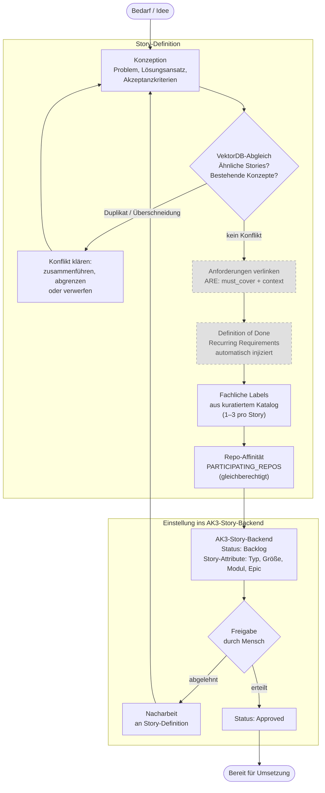

# 10 — Story-Lifecycle und Story-Erstellung

**Übersicht:** [00-uebersicht.md](00-uebersicht.md)

---

## 10.1 Story-Lifecycle im AK3-Story-Backend

Eine Story durchläuft fünf Zustände im AK3-Story-Backend: Backlog,
Approved, In Progress, Done und Cancelled. Interne Zustände wie
Verify-Fail, Eskalation oder Pause ändern den Story-Status nicht (die
Story bleibt "In Progress"), solange kein offizieller administrativer
Pfad wie Story-Split oder Story-Reset ausgeführt wird. Wenn der
Orchestrator einen internen Zustand nicht auflösen kann, wird an den
Menschen eskaliert.

Die Schwere des Prozesses hängt vom Story-Typ ab. Implementierende
Stories (Implementation, Bugfix) durchlaufen die vollständige
Pipeline mit allen Guards, QA-Stufen und Gates (DK-02). Konzept- und
Research-Stories produzieren Dokumente statt Code und durchlaufen einen
deutlich leichtgewichtigeren Pfad, der die meisten Gates umgeht.

Die konsolidierte Einordnung der Vertragsachsen liegt nicht in
diesem Kapitel, sondern in FK-59:

- `story_type` und `implementation_contract` sind persistente
  Vertragsachsen
- `operating_mode` ist ein abgeleiteter Session-/Run-Zustand
- `mode` im gebundenen Story-Lauf bezeichnet fachlich nur den
  Intra-Run-Pfad (`execution_route`)
- `exit_class` ist nur unter `Cancelled` zulaessig

## 10.2 Story-Erstellung

Die Qualität der Umsetzung beginnt bei der Qualität der Story. Viele
Probleme, die in der Umsetzung auftreten (Scope Drift, redundante
Implementierungen, fehlende Anforderungen), lassen sich durch eine
strukturierte Erstellung verhindern. Die Story-Erstellung ist deshalb
kein informeller Vorgang, sondern ein eigener deterministischer Ablauf
mit Prüfpunkten.

| Darstellung | Bedeutung |
|-------------|-----------|
| Normale Box | Pflichtschritt |
| Graue Box, gestrichelte Linie | Optionaler Schritt (nur bei verfügbarer ARE) |

**Konzeption:** Der Auslöser ist ein fachlicher Bedarf oder eine Idee.
Ein Agent erstellt die Story-Definition mit Problemstellung,
Lösungsansatz und Akzeptanzkriterien. Bei komplexen Vorhaben geht dem
eine eigene Konzept-Story voraus, deren Ergebnis als Grundlage dient.

> VektorDB-Abgleich ist immer aktiv. Keine Feature-Flag-Stufung.

**VektorDB-Abgleich:** Bevor die Story finalisiert wird, gleicht der
Agent den Inhalt gegen die Wissensbasis (VektorDB) ab. Gibt es bereits
Stories, die denselben oder einen ähnlichen Bereich adressieren? Gibt es
Konzepte, deren Festlegungen die neue Story berücksichtigen muss? Dieser
Abgleich verhindert, dass Agenten Dinge komplett neu erfinden, die in
anderer Form bereits umgesetzt oder bewusst verworfen wurden.

Der Abgleich arbeitet zweistufig: Erst filtert ein konfigurierbarer
Similarity-Schwellenwert (Startwert 0.7) den gröbsten Noise heraus.
Nur Treffer oberhalb des Schwellenwerts werden an ein LLM zur
semantischen Bewertung weitergereicht, maximal die Top 5. Das LLM
beurteilt, ob ein echter Konflikt oder eine relevante Überschneidung
vorliegt. Die vollständige Treffermenge (Anzahl Treffer gesamt, Anzahl
über Schwellenwert, Anzahl vom LLM als Konflikt bewertet) wird
protokolliert, damit der Schwellenwert über die Zeit anhand der
tatsächlichen False-Positive/False-Negative-Rate angepasst werden
kann.

**Anforderungen verlinken:** Wenn ARE verfügbar ist, werden die
relevanten Anforderungen mit der Story verknüpft. Wiederkehrende
Pflichtanforderungen (Qualitätschecks, Coding-Standards, Testpflichten)
werden automatisch injiziert und bilden die maschinenprüfbare Definition
of Done. Die Zuordnung der passenden Anforderungen erfolgt über die
Scope-Zuordnung (siehe Abschnitt 6.2 in [06-are-integration.md](06-are-integration.md)).

**Fachliche Labels zuweisen:** Der Agent wählt 1–3 thematische Labels
aus einem kuratierten Katalog. Labels sind fachliche
Themenkategorien (z.B. "Berichtserstellung", "Datenintegration",
"Benutzerverwaltung"), keine technischen Tags und keine Story-Typen.
Der Katalog wird vom Projektteam bewusst gepflegt. Agents dürfen
keine Labels ad hoc erfinden. Ein Label muss auf mindestens drei
Stories anwendbar sein, um seine Existenz im Katalog zu
rechtfertigen. Labels und Repos bedienen orthogonale Dimensionen:
Labels klassifizieren das fachliche Thema, Repos den technischen
Scope.

**Repo-Affinität ermitteln:** Bei Stories, die Code produzieren,
identifiziert der Agent anhand der betroffenen Dateipfade automatisch,
welche Repositories tangiert sind. Ergebnis ist das Feld
PARTICIPATING_REPOS — alle Repositories mit mindestens einer
betroffenen Datei. Es gibt keine fachliche Sonderrolle eines einzelnen
Repos; alle teilnehmenden Repos sind gleichberechtigt. Die Zuordnung
erfolgt über Longest-Prefix-Match der Dateipfade gegen die
konfigurierten Repo-Pfade. Nur explizit aufgeführte Dateien zählen
als Evidenz, keine Erwähnungen in Referenzen oder Logs. Das Feld
wird vollautomatisch durch den Create-User-Story-Skill bestimmt und
direkt als Story-Attribut im AK3-Story-Backend gesetzt — keine
manuelle Prüfung oder Korrektur vorgesehen. Die deterministische
Reihenfolge der Liste (z. B. nach Heatmap der Aenderungen sortiert)
legt zugleich den Spawn-Worktree fest: Der erste Eintrag ist der
Spawn-CWD-Anker des Workers (`participating_repos[0]`, FK-22 §22.6.4)
und traegt damit keine fachliche Sonderrolle, sondern nur eine
Spawn-Konvention. Bei Single-Repo-Projekten ist die Liste einelementig.
Die Participating Repos steuern drei Aspekte der nachfolgenden
Pipeline: welche Repos einen Feature-Branch und Worktree erhalten,
welche ARE-Scopes für die Anforderungsverknüpfung gelten und wie der
Branch-Guard den Arbeitsbereich einschränkt.

**Freigabe durch den Menschen:** Die Story wird im AK3-Story-Backend
angelegt und erhält den Status "Backlog". Erst durch eine explizite
Freigabe durch den Menschen wechselt der Status auf "Approved". Die
Preflight-Gates der Umsetzungs-Pipeline prüfen diesen Status und lassen
nur freigegebene Stories durch. Kein Agent kann eigenständig entscheiden,
was implementiert wird.

## 10.3 Story-Feldschema

### 10.3.1 Felder für die Modus-Ermittlung

Die folgenden sechs Story-Attribute im AK3-Story-Backend bestimmen deterministisch,
ob eine implementierende Story im Execution Mode oder im Exploration
Mode bearbeitet wird. Referenz: Abschnitt 3.5 in [03-governance-und-guards.md](03-governance-und-guards.md).

| Feld | Typ | Erlaubte Werte | Default bei fehlendem Wert | Validierungsregel |
|------|-----|----------------|----------------------------|-------------------|
| Story-Typ | Enum | Implementation, Bugfix, Konzept, Research | Kein Default. Pflichtfeld, fehlendes Feld blockiert die Story-Erstellung. | Muss ein gültiger Enum-Wert sein. Konzept und Research durchlaufen eigene Pfade ohne Modus-Ermittlung. |
| `concept_paths` (Story-Attribut Konzept-Referenzen) | Pfadliste | Relative Pfade auf Konzeptdokumente im konfigurierten `concepts_dir` (Default `concepts/`) | Leere Liste (keine Konzepte vorhanden). **Story-Typ-sensitiv:** Bei Implementation zählt eine leere Liste als Exploration. Bei Bugfix ist dieses Kriterium nicht execution-sperrend (FK 21.3.3, FK 22.8.1). | Wenn gesetzt: Mindestens ein referenziertes Dokument muss existieren und abrufbar sein. |
| Reifegrad | Enum | Goal Only, Solution Approach, Architecture Concept | Goal Only (fail-closed: fehlendes Feld zählt als niedrigster Reifegrad, also Exploration) | Muss ein gültiger Enum-Wert sein. "Solution Approach" oder "Architecture Concept" sind Execution-tauglich. "Goal Only" erzwingt Exploration. |
| Change-Impact | Enum | Local, Component, Cross-Component, Architecture Impact | Architecture Impact (fail-closed: fehlendes Feld zählt als höchster Impact, also Exploration) | Muss ein gültiger Enum-Wert sein. "Local" oder "Component" sind Execution-tauglich. "Cross-Component" oder "Architecture Impact" erzwingen Exploration. |
| Neue Strukturen | Boolean | true, false | true (fail-closed: fehlendes Feld bedeutet "neue Strukturen werden angenommen", also Exploration) | Bezieht sich auf neue APIs, Datenmodelle, Events oder Schnittstellen, die durch die Story eingeführt werden. |
| Externe Integrationen | Boolean | true, false | true (fail-closed: fehlendes Feld bedeutet "externe Integration wird angenommen", also Exploration) | Bezieht sich auf neue Anbindungen an externe Systeme, APIs oder Services, die bisher nicht integriert waren. |

**Entscheidungsregel:** Eine Story geht nur dann in den Execution Mode,
wenn alle sechs Kriterien in der Execution-Spalte stehen (siehe
Hauptkonzept Abschnitt 3.5 in [03-governance-und-guards.md](03-governance-und-guards.md), Kriterienkatalog). Steht auch nur ein
Kriterium in der Exploration-Spalte oder fehlt ein Feld, geht die Story
in den Exploration Mode. Der Default ist Exploration.

### 10.3.2 Projektfelder

Die folgenden Felder sind organisatorische Metadaten als Story-Attribute
im AK3-Story-Backend. Sie steuern nicht den Modus, sondern die Prozessschwere,
das Routing und die Zuordnung.

| Feld | Typ | Erlaubte Werte | Default bei fehlendem Wert | Validierungsregel |
|------|-----|----------------|----------------------------|-------------------|
| Story-Groesse | Enum | XS, S, M, L, XL | Kein Default. Pflichtfeld, fehlendes Feld blockiert die Story-Erstellung. | Muss ein gültiger Enum-Wert sein. Bestimmt Review-Häufigkeit, erwartete Telemetrie-Schwellen und Timeout-Budgets (siehe §10.4). |
| Modul | Enum | Projektspezifisch konfiguriert (z.B. core, api, auth, reporting) | Kein Default. Pflichtfeld. | Muss ein in der Projektkonfiguration definierter Modulname sein. Steuert die Kontext-Selektion (welche Regeln und Dokumentation geladen werden). |
| Epic | Link | AK3-Story-Referenz auf eine Epic-Story | Leer (kein Epic zugeordnet). Kein Pflichtfeld. | Wenn gesetzt: Die referenzierte AK3-Story muss existieren. Dient der Gruppierung und dem Reporting, hat keinen Einfluss auf den Pipeline-Ablauf. |

## 10.4 Story-Groessen-Definition

Die Story-Groesse bestimmt die Prozessschwere (Review-Häufigkeit,
Telemetrie-Erwartungswerte, Timeout-Budgets). Die Zuordnung erfolgt
bei der Story-Erstellung anhand objektiver Kriterien. Referenz:
DK-02 §2.2 (Review-Punkte).

| Groesse | Geänderte Dateien | Betroffene Module | Erwartete Testebenen | Review-Punkte | Typische Merkmale |
|---------|-------------------|-------------------|----------------------|---------------|-------------------|
| XS | 1 bis 2 | 1 | Bestehende Tests ausreichend, kein neuer Test nötig | 1 (vor Handover) | Isolierte Änderung: Typo-Fix, Config-Anpassung, einzelne Feldkorrektur |
| S | 3 bis 10 | 1 | Wenige Unit-Tests, eventuell ein Integrationstest | 1 (vor Handover) | Änderung innerhalb eines Moduls: Bugfix mit begrenztem Scope, kleine Implementierungsergänzung |
| M | 10 bis 30 | 1 bis 2 | Unit-Tests und Integrationstests | 2 (nach erstem Inkrement, vor Handover) | Mehrere zusammenhängende Änderungen: neue Implementierung mit Persistenz, Umstrukturierung einer Komponente |
| L | 30 bis 80 | 2 bis 4 | Unit-Tests, Integrationstests, E2E-Tests | 3+ (nach jedem 2. bis 3. Inkrement, vor Handover) | Modulübergreifende Änderung: neuer fachlicher Ablauf, Integration eines externen Systems |
| XL | 80+ | 4+ | Unit-Tests, Integrationstests, E2E-Tests, umfangreiche Abdeckung | 3+ (nach jedem 2. bis 3. Inkrement, vor Handover) | Architekturwirksame Änderung: neues Subsystem, grundlegende Umstrukturierung, mehrere neue Schnittstellen |

**Abgrenzungsregeln:**

Bei Grenzfällen gilt die höhere Groesse. Eine Story mit 10 Dateien in
2 Modulen ist M, nicht S. Die Anzahl geänderter Dateien ist das
primäre Kriterium, die Anzahl betroffener Module das sekundäre. Wenn
die Kriterien in unterschiedliche Groessen fallen, entscheidet das
höhere Kriterium.

Die Groesse wird bei der Story-Erstellung geschätzt und nach Abschluss
als tatsächliche Groesse in den Workflow-Metriken festgehalten. Eine
systematische Abweichung zwischen geschätzter und tatsächlicher Groesse
ist ein Signal für die Qualität der Story-Erstellung.
