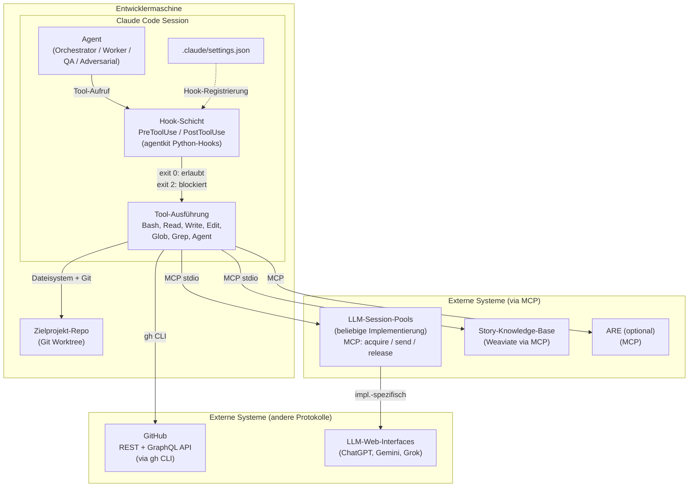
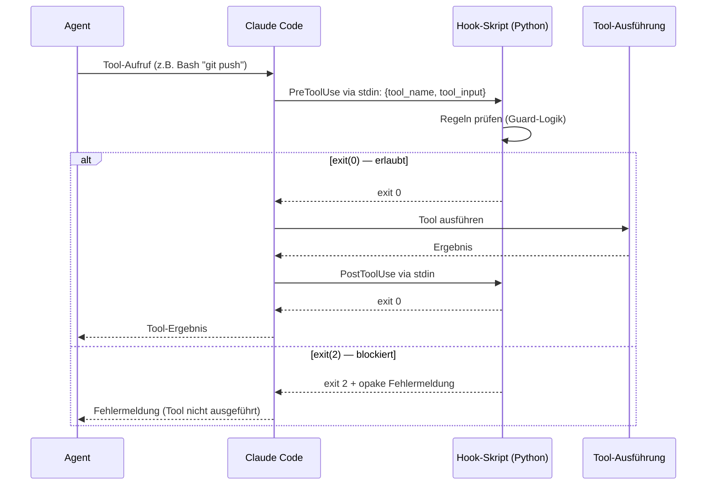
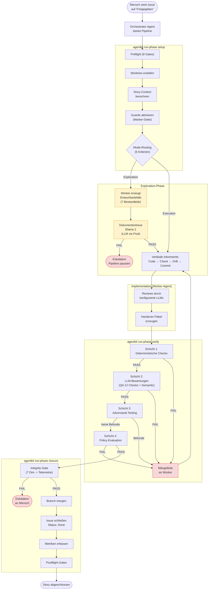
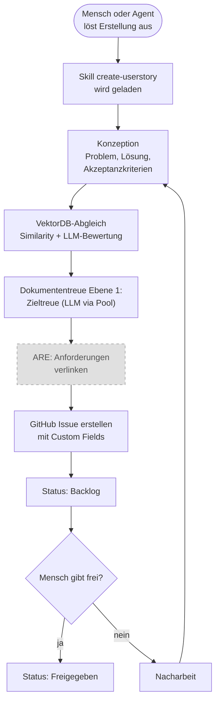

# 01 — Systemkontext und Architekturprinzipien

## 1.1 Zielbild

AgentKit ist ein Python-Paket (`agentkit`), das in ein Zielprojekt
installiert wird und dort den vollständigen Lifecycle KI-gesteuerter
Story-Umsetzung orchestriert. Es läuft nicht als eigenständiger Server,
sondern als Bibliothek und Hook-Schicht innerhalb von Claude-Code-
Sessions auf der Entwicklermaschine.

Das Zielbild: 1-2 Menschen steuern eine Flotte autonomer Agenten, die
98% der Konzeptions-, Implementierungs- und Absicherungsarbeit an
geschäftskritischen Systemen (250k+ LOC) leisten. Der Mensch ist
Stratege und Controller, kein klassischer Entwickler.

## 1.2 Systemgrenzen

### 1.2.1 Systemlandschaft




### 1.2.2 Komponentenzuordnung

**AgentKit-Kern** (wird entwickelt und ausgeliefert):

| Komponente | Typ | Technologie |
|------------|-----|-------------|
| `agentkit` Python-Paket | Bibliothek + CLI + Hooks | Python 3.14, Pydantic 2.7+, PyYAML 6+ |
| Rollenprompts + Skills | Markdown-Dateien | Deployt vom Installer |
| JSON Schemas | Artefakt-Validierung | JSON Schema Draft 2020-12 |

**Plattform** (Voraussetzung, nicht Teil von AgentKit):

| Komponente | Typ | Protokoll |
|------------|-----|-----------|
| Claude Code | Agent-Plattform | CLI + Hook-API (PreToolUse/PostToolUse) |
| Git | Versionskontrolle | CLI (`git`) |
| GitHub | Issue-/Projekt-Backend | REST + GraphQL via CLI (`gh`) |

**Externe Dienste** (via MCP, austauschbar):

| Dienst | Schnittstelle zu AgentKit | Anforderung |
|--------|--------------------------|-------------|
| LLM-Session-Pools | MCP-Tools: `{pool}_acquire`, `{pool}_send`, `{pool}_release`, `{pool}_health`, `{pool}_pool_status` | Mindestens 2 verschiedene LLM-Familien neben Claude. Die konkrete Implementierung (Browser-Automation, API, etc.) ist AgentKit egal — es zählt nur die MCP-Schnittstelle. |
| Story-Knowledge-Base | MCP-Tools: `story_search`, `story_list_sources`, `story_sync` | Aktuell: Weaviate (Docker) + FastMCP-Server. Austauschbar durch jede Implementierung mit gleicher MCP-Schnittstelle. |
| ARE (optional) | MCP-Tools (analog zu Weaviate-Wrapper). **Kein direkter DB-Zugriff.** | Python-Anwendung mit SQL-DB im Backend. Falls ARE nativ nur REST/FastAPI spricht, wird ein MCP-Wrapper als Adapter implementiert (wie bei Weaviate). |
| Zielprojekt | Dateisystem + Git | Beliebiger Tech-Stack |

**Referenz-Implementierung der LLM-Pools** (aktuell im Einsatz, nicht
Teil von AgentKit):

Die folgenden Implementierungen sind die aktuelle Referenz. Sie sind
austauschbar, solange die MCP-Schnittstelle (`acquire`/`send`/`release`)
eingehalten wird.

| Pool | Implementierung | Laufzeit |
|------|----------------|----------|
| `chatgpt-pool` | Python, FastAPI, Playwright | Native Windows, REST `:9100` |
| `gemini-pool` | Python, FastAPI, xdotool + Extension-Bridge | WSL2 Ubuntu, User `gemini`, REST `:9200`, VNC `:5900` |
| `grok-pool` | Python, FastAPI, xdotool + Extension-Bridge | WSL2 Ubuntu, User `grok`, REST `:9400`, VNC `:5901` |

Gemini und Grok laufen auf derselben WSL2-Instanz mit getrennten
Linux-Usern, X11-Displays und Ports.

### 1.2.3 Was AgentKit NICHT ist

- Kein CI/CD-System — es ersetzt keine Build-Pipeline, sondern
  orchestriert Agenten, die in einer solchen arbeiten.
- Kein zentraler Server — alles läuft lokal auf der Entwicklermaschine.
- Kein LLM-Anbieter — es nutzt Claude (via Claude Code), ChatGPT,
  Gemini und Grok als externe Dienste.
- Kein Testframework — es orchestriert Tests, schreibt aber selbst
  keine fachlichen Tests.
- Kein Projektmanagement-Tool — es nutzt GitHub Projects als Backend,
  ersetzt es aber nicht.

## 1.3 Architekturprinzipien

### P1: Fail-Closed

Jeder unbekannte Zustand ist ein Fehler. Konkret:

| Situation | Reaktion |
|-----------|----------|
| Fehlende Konfigurationsfelder | Default zugunsten des restriktiveren Pfads (z.B. Exploration Mode statt Execution Mode) |
| Ungültige JSON-Artefakte | Check = FAIL, nicht SKIP |
| LLM liefert kein gültiges JSON | Regex-Fallback → Retry → FAIL |
| Nicht erreichbares externes System | Abbruch mit Fehlercode, nicht stille Fortfahrt |
| Fehlende Telemetrie-Events | Integrity-Gate blockiert Closure |
| Unbekannter Story-Typ | Pipeline-Abbruch |

### P2: Plattform-Enforcement

Guards und Governance werden über die Hook-Schicht von Claude Code
durchgesetzt. Ein Agent kann seine eigenen Hooks nicht deaktivieren,
weil Hooks Teil der Plattforminfrastruktur sind, nicht Teil des
Agent-Codes.

**Technisch:** Hooks werden in `.claude/settings.json` registriert.
Claude Code ruft sie als externe Prozesse auf (`PreToolUse`,
`PostToolUse`). Der Hook-Prozess ist ein Python-Skript aus dem
`agentkit`-Paket, das über `sys.stdin` den Tool-Call empfängt und
über `sys.exit(0)` (erlauben) oder `sys.exit(2)` (blockieren)
antwortet.



### P3: Deterministisch wo möglich, LLM nur wo nötig

| Aufgabe | Mittel |
|---------|--------|
| Pipeline-Steuerung, Phasenwechsel, Mode-Routing | Deterministischer Python-Code |
| Structural Checks, Policy-Evaluation | Deterministischer Python-Code |
| Guard-Enforcement | Deterministischer Python-Code (Hooks) |
| Telemetrie-Erfassung, Metriken | Deterministischer Python-Code |
| Code-Implementierung | LLM als Agent (Dateisystem-Zugriff) |
| Adversarial Testing | LLM als Agent (eingeschränkter Dateisystem-Zugriff) |
| QA-Bewertung, Semantic Review | LLM als Bewertungsfunktion (kein Dateisystem) |
| Dokumententreue-Prüfung | LLM als Bewertungsfunktion (kein Dateisystem) |
| Governance-Adjudication | LLM als Bewertungsfunktion (kein Dateisystem) |

**LLM als Agent:** Claude-Code-Session mit Dateisystem-Zugriff.
Wird für Worker und Adversarial Agent eingesetzt.

**LLM als Bewertungsfunktion:** Deterministisches Python-Skript ruft
ein LLM über Browser-Pool (MCP) auf. Der Pool-Call (`chatgpt_send`,
`gemini_send`, `grok_send`) sendet einen strukturierten Prompt und
empfängt eine Textantwort, die als JSON geparst wird. Kein
Dateisystem-Zugriff. Kein autonomes Handeln. Das Skript validiert
die Antwort und entscheidet, die Pipeline entscheidet.

### P4: Rollentrennung durch technische Mittel

Rollentrennung ist nicht nur Prompt-Disziplin, sondern wird durch
technische Mechanismen erzwungen:

| Rolle | Technische Einschränkung | Mechanismus |
|-------|------------------------|-------------|
| Orchestrator | Darf nicht auf Codebase zugreifen | `orchestrator_guard.py` (PreToolUse-Hook) |
| Worker | Darf keine QA-Artefakte schreiben | `integrity.py` (PreToolUse-Hook) |
| QA-Agent (Bewertungsfunktion) | Hat keinen Dateisystem-Zugriff | Läuft als Pool-Call, nicht als Agent |
| Adversarial Agent | Darf nur Test-Dateien schreiben | CCAG-Regel oder dedizierter Guard |

### P5: Multi-LLM als Pflicht

Verschiedene Rollen werden von verschiedenen LLM-Familien bedient.
Das ist konfigurierte Pflicht, nicht optionale Ergänzung.

**Konfiguration** in `.story-pipeline.yaml`:

```yaml
multi_llm: true  # Pflicht, Default true

llm_roles:
  worker: "claude"                # Claude Code Session (immer Claude)
  qa_review: "chatgpt"            # Schicht 2: QA-Bewertung (12 Checks)
  semantic_review: "gemini"        # Schicht 2: Semantic Review
  adversarial_sparring: "grok"     # Schicht 3: Edge-Case-Ideen
  doc_fidelity: "gemini"           # Dokumententreue-Prüfung
  governance_adjudication: "gemini"   # Governance-Beobachtung
  story_creation_review: "chatgpt" # VektorDB-Konfliktbewertung
```

Das Integrity-Gate prüft bei Closure, dass alle konfigurierten
Pflicht-Reviewer tatsächlich aufgerufen wurden (Telemetrie-Nachweis).

### P6: Kontext-Selektion

Agenten erhalten nicht den gesamten verfügbaren Kontext, sondern nur
den für ihre aktuelle Aufgabe relevanten. Story-Metadaten (betroffene
Module, Story-Typ, Tech-Stack) selektieren automatisch die passenden
Regel- und Wissensabschnitte aus getaggten Sektionen der
Projektdokumentation. Irrelevante Abschnitte werden nicht in den
Prompt injiziert.

**Technisch:** Ein Manifest-Indexer scannt die Projektdokumentation
(CLAUDE.md, Konzepte, Guardrails) und erzeugt einen validierbaren
Index mit Pfad, Abschnittsanker, Tags und Gültigkeitsbereich. Der
Prompt-Builder arbeitet nur gegen diesen Index — nicht gegen
Inline-Tags in den Dokumenten selbst. Das verhindert Metadaten-Drift
und macht die Selektionsbasis zentral validierbar.

Das Ergebnis ist ein Kontextpaket pro Rolle, das dem Agent-Prompt
vorangestellt wird.

Details zur technischen Umsetzung in Kapitel 08 (Rollen, Prompts,
Kontext-Selektion).

### P7: Minimale Dependencies

Das `agentkit` Python-Paket (Python 3.14) hat drei Kern-Dependencies:

| Dependency | Version | Zweck |
|------------|---------|-------|
| `pyyaml` | ≥ 6.0 | YAML-Konfiguration parsen |
| `pydantic` | ≥ 2.7 | Datenmodelle validieren (frozen, strict) |
| `psutil` | ≥ 5.9 | Prozessmonitoring |

Optionale Dependencies:

| Dependency | Zweck | Feature-Flag |
|------------|-------|-------------|
| `weaviate-client` 4.9-5.0 | VektorDB-Anbindung | `features.vectordb: true` |
| `mcp[cli]` ≥ 1.2.0 | MCP-Server für Story-Knowledge-Base | `features.vectordb: true` |

Keine Datenbank-Treiber, keine Web-Frameworks, keine ML-Bibliotheken
im Kern. Externe Systeme werden über CLI-Tools (`gh`, `git`) oder
MCP-Protokoll angesprochen.

### P8: Datenformate

| Artefakttyp | Format | Begründung |
|-------------|--------|------------|
| Telemetrie-Events (Laufzeit) | SQLite (`_temp/agentkit.db`) | Atomare Writes, SQL-Queries für Integrity-Gate und Governance. `sqlite3` ist Teil der Python-Standardbibliothek. |
| Telemetrie-Events (Archiv) | JSONL (Export bei Closure) | Menschenlesbar, langfristige Archivierung |
| QA-Ergebnisse | JSON (stage-envelope) | Validierbar gegen JSON Schema |
| Pipeline-State | JSON | Zustandspersistenz zwischen Phasen |
| Konfiguration | YAML | Menschenlesbar, editierbar |
| Prompts | Markdown | Menschenlesbar, Template-fähig |
| Manifest | JSON | Maschinell prüfbar |

**Telemetrie-Prinzip:** Events werden zur Laufzeit in SQLite
geschrieben und über deterministische SQL-Queries abgefragt
(kein JSONL-Parsing durch Agents). Bei Closure wird die
Story-Telemetrie als JSONL exportiert (Audit-Trail).

**LLM-Call-Events:** Telemetrie-Events für externe LLM-Aufrufe
verwenden den generischen Event-Typ `llm_call` mit dem Feld `pool`
(Name des MCP-Servers, z.B. `chatgpt`, `gemini`, `grok`) und `role`
(konfigurierte Rolle aus `llm_roles`, z.B. `qa_review`,
`semantic_review`). Das Integrity-Gate prüft gegen die konfigurierten
Pflicht-Rollen, nicht gegen hardcoded Anbieternamen. Damit bleibt
die Pool-Abstraktion intakt — ein Wechsel des LLM-Providers erfordert
nur eine Konfigurationsänderung, keine Code-Änderung.

## 1.4 Trust Boundaries

### 1.4.1 Boundary-Modell

```
    ┌─── Zone 1: Plattform (Claude Code + Hooks) ──────────────────────────┐
    │   Nicht vom Agent kontrollierbar. Hook-Enforcement.                   │
    │                                                                      │
    │   ┌─── Zone 2: Pipeline-Orchestrierung ──────────────────────────┐   │
    │   │   Deterministischer Python-Code. Entscheidet.                │   │
    │   │                                                              │   │
    │   │   ┌─── Zone 3: Agent-Ausführung ────────────────────────┐    │   │
    │   │   │   LLM-gesteuert, nicht-deterministisch.             │    │   │
    │   │   │   Kann lügen, abkürzen, fabrizieren.                │    │   │
    │   │   │   Jede Behauptung wird durch Zone 1/2 verifiziert.  │    │   │
    │   │   └─────────────────────────────────────────────────────┘    │   │
    │   └──────────────────────────────────────────────────────────────┘   │
    │                                                                      │
    │   ┌─── Zone 4: Externe LLMs (Pools) ────────────────────────────┐   │
    │   │   Antworten nicht vertrauenswürdig.                         │   │
    │   │   Nur als Bewertungsfunktion. Pipeline entscheidet.         │   │
    │   └─────────────────────────────────────────────────────────────┘   │
    └──────────────────────────────────────────────────────────────────────┘
```

### 1.4.2 Trust-Regeln

| Regel | Bedeutung |
|-------|-----------|
| Zone 3 darf Zone 1 nicht umgehen | Agent kann Hooks nicht deaktivieren |
| Zone 3 darf Zone 2 nicht manipulieren | Agent kann Pipeline-State nicht direkt schreiben (QA-Artefakt-Schutz) |
| Zone 4 entscheidet nicht | LLM-Antworten werden geparst und validiert; die Pipeline entscheidet basierend auf dem Ergebnis |
| Trust-Klasse C ist nie blocking | Vom Agent selbst erzeugte Evidence (Screenshots, API-Logs) kann QA nicht bestehen/nicht blockieren |
| Opake Fehlermeldungen an Zone 3 | Guards geben dem Agent keine Details, warum er blockiert wurde |

## 1.5 Hauptlaufzeitpfade

### 1.5.1 Story-Bearbeitung (Hauptpfad)



### 1.5.2 Story-Erstellung (Nebenpfad)



## 1.6 Tech-Stack-Zusammenfassung

| Schicht | Technologie | Version | Protokoll |
|---------|-------------|---------|-----------|
| Agent-Plattform | Claude Code | aktuell | CLI + Hook-API |
| Hook-Sprache | Python | 3.14 | stdin/stdout, exit codes |
| Konfiguration | YAML | — | Dateisystem |
| Datenmodelle | Pydantic | 2.7+ | Python-Klassen |
| Telemetrie | JSONL | — | Dateisystem (append) |
| QA-Artefakte | JSON | — | Dateisystem + JSON Schema |
| VCS | Git | 2.30+ | CLI (`git`) |
| GitHub | GitHub API | REST v3 + GraphQL v4 | CLI (`gh`) |
| VektorDB | Weaviate | 1.25+ | gRPC + HTTP REST |
| Embedding | text2vec-transformers | — | Docker Sidecar |
| VektorDB-MCP | FastMCP | 1.2+ | stdio-Transport |
| LLM-Session-Pools | Beliebig (externe Infrastruktur) | — | MCP-Tools: `{pool}_acquire`, `{pool}_send`, `{pool}_release`. Implementierung ist AgentKit-agnostisch. |
| ARE (optional) | Python-Anwendung + SQL-DB | — | MCP-Tools oder FastAPI-Endpunkte. Kein direkter DB-Zugriff durch AgentKit. |
| Build/Test | projektspezifisch | — | via `mvn`, `pytest`, `jest` etc. |
| Linting/Typing | ruff, mypy | — | CLI |
| Tests | pytest | 8+ | pytest-Konventionen |
| Coverage | pytest-cov | — | 85% Minimum |

---

*FK-Referenzen: FK-04-005 bis FK-04-023 (Rollen, Multi-LLM),
FK-06-001 bis FK-06-006 (Fail-Closed-Prinzipien),
FK-07-004 bis FK-07-008 (Trust-Klassen),
FK-11-001 bis FK-11-009 (Installer/Tech-Stack)*
