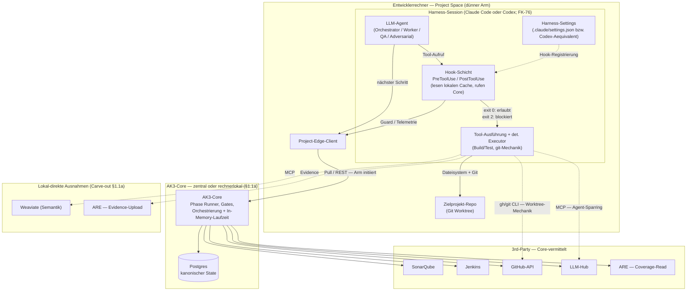
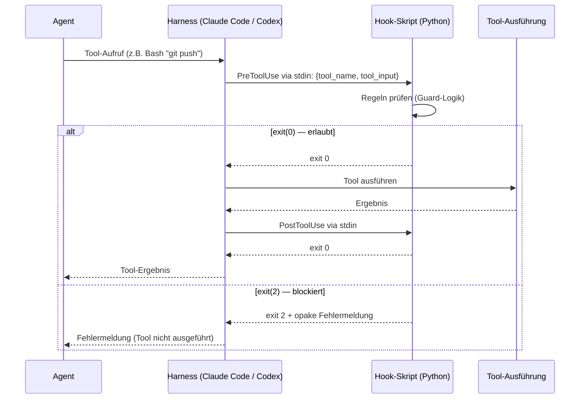
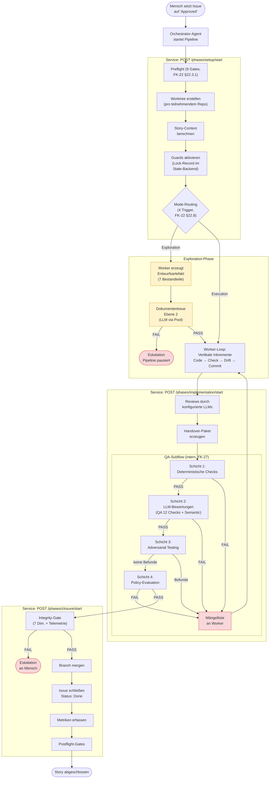
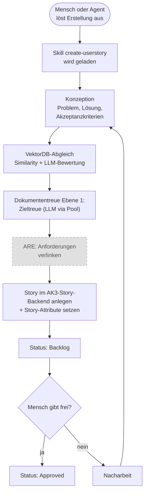

# 01 — Systemkontext und Architekturprinzipien

<!-- PROSE-FORMAL: formal.architecture-conformance.entities, formal.architecture-conformance.invariants, formal.state-storage.invariants, formal.truth-boundary-checker.invariants -->

## 1.1 Zielbild

AgentKit ist ein systemweit installiertes Python-Paket (`agentkit`),
das gegen Zielprojekte betrieben wird, ohne seine Laufzeitartefakte in
deren Repository zu deployen. Im Projekt liegen nur die
projektspezifische Konfiguration und die harness-spezifische Anbindung
(Claude Code, Codex; siehe FK-76 §76.5); der
kanonische Laufzeit- und Zustandsraum liegt außerhalb des Projekts in
einem zentralen State-Backend.

Das Zielbild: 1-2 Menschen steuern eine Flotte autonomer Agenten, die
98% der Konzeptions-, Implementierungs- und Absicherungsarbeit an
geschäftskritischen Systemen (250k+ LOC) leisten. Der Mensch ist
Stratege und Controller, kein klassischer Entwickler. Dieses
1-2-Verhältnis gilt pro Projekt; AK3 selbst ist als gemeinsam nutzbare,
zentral betreibbare Capability für Teams und mehrere Projekte ausgelegt
(§1.1a; DK-00 §1a).

## 1.1a Topologie und Betriebsmodell

Realisierung der fachlichen Leitplanke aus DK-00 §1a. AK3 trennt einen
zentralen, zustandsbehafteten **Core** von einem dünnen **lokalen Arm pro
Project Space** — dem git-Checkout eines Zielprojekts mit installiertem AK3
Project Bundle, Hooks und Project-Edge-Launcher (projektlokal, DK-08). Ein
Rechner kann mehrere Project Spaces tragen; ein Zielprojekt kann über mehrere
Project Spaces (Rechner/Entwickler) verteilt sein.

**Core (zentral, ein Dienst).** Der AK3-Core ist ein einzelner, langlebiger,
zustandsbehafteter Dienst — keine Sammlung kurzlebiger lokaler Prozesse. Er
hält die autoritative Laufzeit *einschließlich In-Memory-Zustand* (aktive
Runs, Sessions, in-flight Logs) **und** den kanonischen Postgres-Zustand. Die
deterministische Geschäfts- und Bewertungslogik — Phase Runner,
`StructuralChecker`-Steuerung, `PolicyEngine`, `IntegrityGate`,
Closure-Orchestrierung, Governance-Adjudication — ist Core-Logik (Zone 2,
§1.4).

**Begründung der Zentralisierung.** Ein Teil des Laufzeitzustands ist immer im
Speicher und noch nicht persistiert; „zentrale DB + N lokale Instanzen" teilt
nur den persistierten Teil und wird inkohärent. Zusammen mit dem Lifecycle
eines lebenden Systems (eine Version, nicht N) und dem Team-Betrieb (DK-00 §1a)
folgt: **eine autoritative Core-Instanz, nicht verteilte.**

**Mengenverhältnisse (multi-tenant).** Der Core bedient parallel mehrere
Zielprojekte über mehrere Project Spaces — inklusive desselben Zielprojekts,
das in mehreren Project Spaces gleichzeitig bearbeitet wird. Runtime- und
kanonischer Zustand werden je Story-Run geführt, der an genau einen Project
Space gebunden ist.

**Zwei Deployments, ein Contract.** Der Core läuft wahlweise rechnerlokal
(Einzel-Stratege) oder zentral auf einem dedizierten Server (Team) — reiner
Deployment-Schalter, identischer Arm↔Core-Contract.

**Lokaler Arm (pro Project Space, dünn, zustandslos, regelfrei).** Drei
Akteure, keiner trägt Geschäftsregeln:

| Akteur | Principal (FK-55) | Aufgabe |
|--------|-------------------|---------|
| LLM-Agent | `worker` / `orchestrator` | kreative Arbeit (Code, Konfliktauflösung, Design) — geliehene Intelligenz |
| Deterministischer Executor | `pipeline_deterministic` | fs/worktree-gebundene Mechanik (Build/Test, git), meldet Roh-Records — kein eigener Verstand |
| Hooks | Plattform (Zone 1) | Tool-Call-Enforcement, lesen lokalen Cache, rufen den Core |

Der Arm hält keinen kanonischen Zustand (§1.2.3) und keine Bewertungslogik.

**Lokalität der Installation.** Zwei Anteile mit unterschiedlicher Lokalität:
(a) der **Core** ist zentral betreibbar und wird vom Arm ausschließlich über
den Project-Edge-Client (REST) erreicht — Remoteness ist transparent, weil der
Client der Adapter ist; (b) die **agentenseitigen Assets** (Prompt-/
Skill-Bundles) und der **AK3-Client** (Project-Edge, Hook-Skripte) müssen auf
*jedem Entwicklerrechner lokal* vorliegen, weil der Agent-Harness sie
transparent als Dateien konsumiert — ein Remote-/HTTP-Zugriff ist für den
Harness nicht transparent (Harness-Transparenz-Constraint). Die kanonische
Quelle der Bundles ist zentral (versionierte Registry), die Materialisierung
erfolgt pro Rechner (Sync, `manifest-contract`-gepinnt, DK-08) — dasselbe
Muster „kanonisch zentral, lokal materialisiert" wie Edge-Bundle (FK-30) und
Permission-Export (FK-55). Der Project-Space-Symlink kollabiert nur die
Duplikation *innerhalb* eines Rechners (alle Project Spaces → eine rechnerweite
Bundle-Materialisierung); er verweist nie auf den entfernten Core. Die
drei Installationsebenen (zentral / Entwicklermaschine / Projektraum)
samt Bootstrap, Update und Uninstall sind in **FK-10 §10.2.0**
ausdetailliert; die Versionsverträge (Agent-Runtime, Skill-Bundle, Wire
`/v1`) in **FK-10 §10.2.7**.

**Kommandokanal — technisch unidirektional, fachlich bidirektional.** Die
Kommunikation geht *immer* vom Arm aus: der Orchestrator-Agent zieht über den
Project-Edge-Launcher den jeweils nächsten Schritt beim Core ab (Pull-Modell,
FK-45 §45.1.1); der Core antwortet mit einem fachlichen Response, der auch ein
Auftrag sein kann (z. B. „Merge-Konflikt auflösen"). **Der Core initiiert nie
zur Dev-Seite und hat keinen Dateisystem-Zugriff auf den Entwicklerrechner.**
Im Team-Deployment wird die Zone-2/Zone-3-Grenze (§1.4) damit zur Prozess- und
Netzgrenze und ist entsprechend härter.

**Drittsystem-Vermittlung (Carve-out).** Eine direkte Lokal→Infra-Kante
ist nur erlaubt, wenn der Aufruf (1) Eigenbedarf des Agents ist, (2)
agent-ausgeführtes LLM-Sparring ohne kanonische State-Mutation ist
(ggf. AK3-mandatiert und per Telemetrie/Guards nachgewiesen) oder (3)
fs/worktree-gebunden bzw. Bulk ist und Core-Vermittlung keinen
Kontrollgewinn bringt. Sonst Core-vermittelt:

| 3rd-Party | Core-vermittelt (AK3-mandatiert, Kontrollinteresse) | Lokal-direkt (Ausnahme) |
|-----------|------------------------------------------------------|-------------------------|
| Postgres | kanonischer State + Telemetrie | — |
| LLM-Hub | AK3-Bewertungs-/Adjudication-Calls | Agent-Sparring (MCP) |
| SonarQube / Jenkins | Konformitätsurteil / CI-Gate | Ad-hoc-Einsicht |
| GitHub | API-Metadaten + Autorität über Closure | git-Worktree-Mechanik (gh/git-CLI lokal) |
| ARE | Coverage-Read | Evidence-Upload |
| Weaviate | — | semantische Suche |

**D1/D2 als Ableitungen.** Dass die deterministische Logik serverseitig läuft
(D1) und die git-Mechanik lokal unter Core-Autorität (D2), folgt aus diesem
Betriebsmodell und ist keine eigenständige Entscheidung. Siehe
`concept/_meta/bc-cut-decisions.md` (Topologie & Betriebsmodell).

## 1.2 Systemgrenzen

### 1.2.1 Systemlandschaft




### 1.2.2 Komponentenzuordnung

**AgentKit-Kern** (wird entwickelt und ausgeliefert):

| Komponente | Typ | Technologie |
|------------|-----|-------------|
| `agentkit` Python-Paket | Bibliothek + CLI + Hooks | Python 3.14, Pydantic 2.7+, PyYAML 6+ |
| Rollenprompts + Skills | Paketressourcen / systemweite Bundles | Nicht im Projekt deployt |
| JSON Schemas | Artefakt-Validierung | JSON Schema Draft 2020-12 |

**Plattform** (Voraussetzung, nicht Teil von AgentKit):

| Komponente | Typ | Protokoll |
|------------|-----|-----------|
| Agent-Harness (Claude Code, Codex; FK-76) | Agent-Plattform | CLI + Hook-API (PreToolUse/PostToolUse), harness-spezifisch via Adapter normalisiert |
| Git | Versionskontrolle | CLI (`git`) |
| GitHub | Code-Backend (Repos, Branches, PRs) | CLI (`gh`) |

**Externe Dienste** (austauschbar). Vermittlung nach dem §1.1a-Carve-out:
AK3-mandatierte Bewertungs-/Adjudication-Aufrufe (LLM-Hub) und
ARE-Coverage-Reads laufen über den Core; die unten gezeigten MCP-Direktpfade
gelten für Agent-Eigenbedarf, agent-ausgeführtes LLM-Sparring und
read-mostly-Zugriffe (Weaviate, ARE-Evidence):

| Dienst | Schnittstelle zu AgentKit | Anforderung |
|--------|--------------------------|-------------|
| LLM-Hub | Befehlsvertrag in FK-11 §11.2.1 (REST + MCP) | Mindestens 2 verschiedene LLM-Familien neben Claude. Backend-Implementierung (Browser-Automation, API, etc.) ist AgentKit egal. |
| Story-Knowledge-Base | MCP-Tools: `story_search`, `story_list_sources`, `story_sync` | Beliebige Implementierung mit dieser MCP-Schnittstelle (z.B. Weaviate via FastMCP-Server). |
| ARE (optional) | MCP-Tools (analog zu Weaviate-Wrapper). **Kein direkter DB-Zugriff.** | Python-Anwendung mit SQL-DB im Backend. Falls ARE nativ nur REST/FastAPI spricht, wird ein MCP-Wrapper als Adapter implementiert (wie bei Weaviate). |
| Zielprojekt | Dateisystem + Git | Beliebiger Tech-Stack |

**Implementierung des LLM-Hubs:** Die konkrete Hub-Implementierung ist
nicht Teil von AgentKit und frei waehlbar — etwa Browser-Automation per
FastAPI/Playwright oder eine direkte API-Anbindung, jeweils nativ oder in
einer isolierten Laufzeit (z.B. WSL2). Massgeblich ist allein die
Einhaltung des Hub-Befehlsvertrags (FK-11 §11.2.1; AK3-Code via REST,
Agent-Sparring via MCP).

### 1.2.2a Fachliches Komponentenmodell

Fuer AK3 wird "Komponente" fachlich verstanden: als logisch
abgegrenztes Verantwortungsbuendel mit klarer Schnittstelle. Eine
Komponente ist **nicht** automatisch eine Python-Klasse, ein Modul
oder ein Prozess.

Der normative Komponentenschnitt von AK3 wird in FK-07 festgezogen.
Dieses Kapitel enthaelt nur die uebergeordneten Prinzipien:

| Regel | Bedeutung |
|-------|-----------|
| Verantwortung vor Technik | Komponenten werden nach fachlicher Aufgabe benannt, nicht nach Datei, Klasse oder Pipeline-Schritt |
| Ein Aufrufer, gekapselte Innenlogik | Wird ein Baustein ausschliesslich von genau einer Komponente genutzt und ist Teil ihres inneren Ablaufwissens, ist er Subkomponente |
| Mehrere Aufrufer, eigener Vertrag | Wird ein Baustein von mehreren Komponenten genutzt, ist er Top-Level-Komponente mit eigenem Vertrag |
| Adapter sind keine Fachkomponenten | HTTP, Hook-, MCP- und Projekt-Edge-Bausteine sind R-Code und nicht Teil des fachlichen Kerns |
| Persistenztreiber sind keine Fachkomponenten | `state_backend` ist technische Infrastruktur und keine fachliche Mitte |

**Leitende Top-Level-Familien von AK3:**

| Familie | Leitende Komponenten |
|---------|----------------------|
| Story-, Planungs- und Ausfuehrungskern | `StoryContextManager`, `ExecutionPlanningService`, `PipelineEngine`, `StoryExecutionLifecycleService`, `WorktreeManager` |
| Governance- und QA-Kern | `GuardSystem`, `CcagPermissionRuntime`, `ConformanceService`, `StageRegistry`, `GovernanceObserver`, `FailureCorpus` |
| Inhalts- und Runtime-Services | `ArtifactManager`, `PromptComposer`, `LlmEvaluator`, `TelemetryService`, `PhaseStateStore` |
| Analytics- und Produktoberflaeche | `KpiAnalyticsEngine`, `DashboardApplication` |
| Bootstrap und Projektbindung | `Installer` |

**Wichtige Abgrenzungen:**

| Abgrenzung | AK3-Regel |
|------------|-----------|
| `PipelineEngine` vs. Phasen | Die Engine ist Top-Level; die Phasen sind ihre Subkomponenten. `PreflightChecker`, `ModeResolver`, `StructuralChecker`, `PolicyEngine` und `IntegrityGate` sind wiederum phasennahe Subkomponenten |
| `ExecutionPlanningService` vs. `PipelineEngine` | Planung bestimmt `READY`, `blocked`, Wellen und Parallelisierungsbudgets; die `PipelineEngine` fuehrt nur bereits zugelassene Story-Runs aus |
| `StageRegistry` | Bleibt Top-Level, weil sie sowohl von der Capability `VerifySystem` (im QA-Subflow innerhalb der Implementation- und Exploration-Phase) als auch vom `FailureCorpus` genutzt wird; sie darf nicht in `VerifySystem` aufgehen |
| `GuardSystem` vs. `CcagPermissionRuntime` | CCAG ist **nicht** Teil des GuardSystems. Guards erzwingen harte Regeln; CCAG verwaltet lernfaehige, vom Menschen freigegebene Permission-Pfade |
| `PromptComposer` vs. Prompt-Integritaet | Der Composer assembliert Prompts. Sentinel-/Spawn-Integritaet und Governance-Escape-Erkennung gehoeren zum Guard-/Hook-System, nicht zum Composer |
| Externe Integrationen | GitHub, LLM-Hub, ARE und VectorDB bleiben getrennte Adapter; `IntegrationHub` ist kein normativer Top-Level-Baustein |

**Prozessvertrag pro Komponente:**

Alle nichttrivialen Ablaufanteile von AK3 werden ueber eine
einheitliche hierarchische Prozess-DSL modelliert (FK-20). Das gilt
nicht nur fuer die Gesamtpipeline, sondern auch fuer Komponenten und
ihre Subschritte.

| Vertragsbestandteil | Bedeutung |
|---------------------|-----------|
| `FlowDefinition` | Beschreibt Reihenfolge, Branching, Rueckspruenge und Yield-Points |
| `NodeDefinition` | Definiert atomare oder zusammengesetzte Ausfuehrungsschritte |
| `ExecutionPolicy` | Regelt, ob ein Knoten erneut laufen darf oder nach Erfolg uebersprungen wird |
| `OverridePolicy` | Regelt, welche CLI-/Mensch-Overrides zulaessig sind |
| Handler-Implementierung | Enthaelt die Fachlogik, I/O und Seiteneffekte des Knotens |

**Architekturregel:** Eine Komponente besitzt damit zwei klar getrennte
Vertraege:

- einen **Kontrollflussvertrag** in der gemeinsamen DSL
- einen **Ausfuehrungsvertrag** ihrer Schritt-Handler

Diese Trennung ist die Gegenmassnahme gegen neue imperative
God-Files: Kontrollfluss wird deklarativ und auditierbar modelliert,
Fachlogik bleibt lokal in der Komponente.

### 1.2.3 Was AgentKit NICHT ist

- Kein CI/CD-System — es ersetzt keine Build-Pipeline, sondern
  orchestriert Agenten, die in einer solchen arbeiten.
- Kein in das Zielprojekt eingebetteter AgentKit-Server — das
  Zielprojekt-Repo enthält keine AgentKit-Runtime. Die Runtime ist der
  zentrale Core (§1.1a), vom Projekt entkoppelt; er kann rechnerlokal oder
  auf einem dedizierten Server betrieben werden.
- Kein LLM-Anbieter — es nutzt LLMs ueber Harness-Sessions (Claude
  Code mit Anthropic-Modellen, Codex mit OpenAI-Modellen; FK-76)
  sowie ChatGPT, Gemini und Grok als externe Dienste.
- Kein Testframework — es orchestriert Tests, schreibt aber selbst
  keine fachlichen Tests.
- Kein eigenstaendiges Projektmanagement-Tool im Sinne klassischer
  Boards — Story-Verwaltung laeuft ueber das AK3-Story-Backend, nicht
  ueber externe Project-Boards.

## 1.3 Architekturprinzipien

### P1: Fail-Closed

Jeder unbekannte Zustand ist ein Fehler. Konkret:

| Situation | Reaktion |
|-----------|----------|
| Fehlende Konfigurationsfelder | Default zugunsten des restriktiveren Pfads (z.B. Exploration Mode statt Execution Mode) |
| Ungültige JSON-Artefakte | Check = FAIL, nicht SKIP |
| LLM liefert kein gültiges JSON | Regex-Fallback → Retry → FAIL |
| Nicht erreichbares externes System | Abbruch mit Fehlercode, nicht stille Fortfahrt |
| Fehlende Telemetrie-Events | Integrity-Gate blockiert Closure |
| Unbekannter Story-Typ | Pipeline-Abbruch |

### P2: Plattform-Enforcement

Guards und Governance werden über die Hook-Schicht des jeweiligen
Agent-Harness (Claude Code, Codex; FK-76) durchgesetzt. Ein Agent
kann seine eigenen Hooks nicht deaktivieren, weil Hooks Teil der
Plattforminfrastruktur des Harness sind, nicht Teil des Agent-Codes.

**Technisch:** Hooks werden harness-spezifisch ueber den jeweiligen
Harness-Adapter registriert (Claude Code: `.claude/settings.json`;
Codex: harness-eigenes Aequivalent). Der Harness ruft sie als externe
Prozesse auf (`PreToolUse`, `PostToolUse`). Der Hook-Prozess ist ein
Python-Skript aus dem `agentkit`-Paket, das über `sys.stdin` den
Tool-Call empfängt und über `sys.exit(0)` (erlauben) oder
`sys.exit(2)` (blockieren) antwortet. Der Adapter normalisiert
harness-spezifische Tool-Namen und Hook-Events auf das harness-neutrale
`HookEvent`-Schema (FK-76 §76.4).



### P3: Deterministisch wo möglich, LLM nur wo nötig

| Aufgabe | Mittel |
|---------|--------|
| Pipeline-Steuerung, Phasenwechsel, Mode-Routing | Deterministischer Python-Code |
| Structural Checks, Policy-Evaluation | Deterministischer Python-Code |
| Guard-Enforcement | Deterministischer Python-Code (Hooks) |
| Telemetrie-Erfassung, Metriken | Deterministischer Python-Code |
| Code-Implementierung | LLM als Agent (Dateisystem-Zugriff) |
| Adversarial Testing | LLM als Agent (eingeschränkter Dateisystem-Zugriff) |
| QA-Bewertung, Semantic Review | LLM als Bewertungsfunktion (kein Dateisystem) |
| Dokumententreue-Prüfung | LLM als Bewertungsfunktion (kein Dateisystem) |
| Governance-Adjudication | LLM als Bewertungsfunktion (kein Dateisystem) |

**LLM als Agent:** Harness-Session (Claude Code oder Codex; FK-76)
mit Dateisystem-Zugriff. Wird für Worker und Adversarial Agent
eingesetzt.

**LLM als Bewertungsfunktion:** Deterministische Core-Logik ruft ein LLM
über den zentralen LLM-Hub-Gateway des Core auf (§1.1a-Carve-out:
AK3-mandatierte Bewertung ist Core-vermittelt, nicht MCP-direkt vom
Entwicklerrechner). Der Aufruf sendet einen strukturierten Prompt und
empfängt eine Textantwort, die als JSON geparst wird. Kein
Dateisystem-Zugriff. Kein autonomes Handeln. Der Core validiert
die Antwort und entscheidet, die Pipeline entscheidet.

### P4: Rollentrennung durch technische Mittel

Rollentrennung ist nicht nur Prompt-Disziplin, sondern wird durch
technische Mechanismen erzwungen:

| Rolle | Technische Einschränkung | Mechanismus |
|-------|------------------------|-------------|
| Orchestrator | Darf nicht auf Codebase zugreifen | `orchestrator_guard.py` (PreToolUse-Hook) |
| Worker | Darf keine QA-Artefakte schreiben | `integrity.py` (PreToolUse-Hook) |
| QA-Agent (Bewertungsfunktion) | Hat keinen Dateisystem-Zugriff | Läuft als Pool-Call, nicht als Agent |
| Adversarial Agent | Darf nur Test-Dateien schreiben | CCAG-Regel oder dedizierter Guard |

### P5: Multi-LLM als Pflicht

Verschiedene Rollen werden von verschiedenen LLM-Familien bedient.
Das ist konfigurierte Pflicht, nicht optionale Ergänzung.

**Konfiguration** in `project.yaml`:

```yaml
multi_llm: true  # Pflicht, Default true

llm_roles:
  worker: "claude"                # Harness-Session (Claude Code oder Codex; FK-76). Wert ist die LLM-Familie, nicht der Harness-Eigenname.
  qa_review: "chatgpt"            # Schicht 2: QA-Bewertung (12 Checks)
  semantic_review: "gemini"        # Schicht 2: Semantic Review
  adversarial_sparring: "grok"     # Schicht 3: Edge-Case-Ideen
  doc_fidelity: "gemini"           # Dokumententreue-Prüfung
  governance_adjudication: "gemini"   # Governance-Beobachtung
  story_creation_review: "chatgpt" # VektorDB-Konfliktbewertung
```

Das Integrity-Gate prüft bei Closure, dass alle konfigurierten
Pflicht-Reviewer tatsächlich aufgerufen wurden (Telemetrie-Nachweis).

### P6: Kontext-Selektion

Agenten erhalten nicht den gesamten verfügbaren Kontext, sondern nur
den für ihre aktuelle Aufgabe relevanten. Story-Metadaten (betroffene
Module, Story-Typ, Tech-Stack) selektieren automatisch die passenden
Regel- und Wissensabschnitte aus getaggten Sektionen der
Projektdokumentation. Irrelevante Abschnitte werden nicht in den
Prompt injiziert.

**Technisch:** Ein Manifest-Indexer scannt die Projektdokumentation
(CLAUDE.md, Konzepte, Guardrails) und erzeugt einen validierbaren
Index mit Pfad, Abschnittsanker, Tags und Gültigkeitsbereich. Der
Prompt-Builder arbeitet nur gegen diesen Index — nicht gegen
Inline-Tags in den Dokumenten selbst. Das verhindert Metadaten-Drift
und macht die Selektionsbasis zentral validierbar.

Das Ergebnis ist ein Kontextpaket pro Rolle, das dem Agent-Prompt
vorangestellt wird.

Details zur technischen Umsetzung in Kapitel 08 (Rollen, Prompts,
Kontext-Selektion).

### P7: Minimale Dependencies

Das `agentkit` Python-Paket (Python 3.14) hat drei Kern-Dependencies:

| Dependency | Version | Zweck |
|------------|---------|-------|
| `pyyaml` | ≥ 6.0 | YAML-Konfiguration parsen |
| `pydantic` | ≥ 2.7 | Datenmodelle validieren (frozen, strict) |
| `psutil` | ≥ 5.9 | Prozessmonitoring |

Optionale Dependencies:

| Dependency | Zweck | Feature-Flag |
|------------|-------|-------------|
| `weaviate-client` 4.9-5.0 | VektorDB-Anbindung | `features.vectordb: true` |
| `mcp[cli]` ≥ 1.2.0 | MCP-Server für Story-Knowledge-Base | `features.vectordb: true` |

**Infrastruktur-Dependency:** Die systemweite AgentKit-Installation
setzt eine zentrale PostgreSQL-Instanz als State- und Analytics-Store
voraus. Der passende Treiber ist deshalb Teil der Runtime-
Implementierung, auch wenn er nicht zum minimalen Agenten-Kern gehört.
Postgres wird ausschließlich vom Core angesprochen. Weitere Drittsysteme
folgen dem Carve-out aus §1.1a: Core-vermittelt bei AK3-mandatiertem
Kontrollinteresse, lokal-direkt über CLI/MCP nur bei fs/worktree-Bindung,
Bulk-Evidenz oder Eigenbedarf des Agents.

### P8: Datenformate

| Artefakttyp | Format | Begründung |
|-------------|--------|------------|
| Telemetrie-Events (Laufzeit) | PostgreSQL | Kanonischer, projektunabhängiger Audit-Trail mit Berechtigungsgrenzen |
| Telemetrie-Events (Archiv) | Export/Bundle aus dem State-Backend | Menschenlesbar, langfristige Archivierung |
| QA-Ergebnisse | Strukturierte Records in PostgreSQL + optionale JSON-Exporte | Validierbar gegen JSON Schema, aber nicht dateibasiert kanonisch |
| Pipeline-State | Strukturierte Records in PostgreSQL | Zustandspersistenz zwischen Phasen mit Zugriffskontrolle |
| Konfiguration | YAML | Menschenlesbar, editierbar |
| Prompts | Markdown | Paketressourcen, versioniert mit AgentKit |
| Manifest/Installationsmetadaten | Service-Record + lokale Config-Version | Maschinell prüfbar ohne Projekt-Manifest |

**Telemetrie-Prinzip:** Events werden zur Laufzeit in das zentrale
PostgreSQL-Backend geschrieben und über deterministische Abfragen
ausgewertet. Exportformate wie JSONL sind Audit- oder
Untersuchungsformate, aber nie kanonischer Laufzeit-Speicher.

**LLM-Call-Events:** Telemetrie-Events für externe LLM-Aufrufe
verwenden den generischen Event-Typ `llm_call` mit dem Feld `pool`
(Name des MCP-Servers, z.B. `chatgpt`, `gemini`, `grok`) und `role`
(konfigurierte Rolle aus `llm_roles`, z.B. `qa_review`,
`semantic_review`). Das Integrity-Gate prüft gegen die konfigurierten
Pflicht-Rollen, nicht gegen hardcoded Anbieternamen. Damit bleibt
die Pool-Abstraktion intakt — ein Wechsel des LLM-Providers erfordert
nur eine Konfigurationsänderung, keine Code-Änderung.

## 1.4 Trust Boundaries

### 1.4.1 Boundary-Modell

```
    ┌─── Zone 1: Plattform (Harness — Claude Code / Codex; FK-76 — + Hooks) ─────────┐
    │   Nicht vom Agent kontrollierbar. Hook-Enforcement.                   │
    │                                                                      │
    │   ┌─── Zone 2: Pipeline-Orchestrierung ──────────────────────────┐   │
    │   │   Deterministischer Python-Code. Entscheidet.                │   │
    │   │                                                              │   │
    │   │   ┌─── Zone 3: Agent-Ausführung ────────────────────────┐    │   │
    │   │   │   LLM-gesteuert, nicht-deterministisch.             │    │   │
    │   │   │   Kann lügen, abkürzen, fabrizieren.                │    │   │
    │   │   │   Jede Behauptung wird durch Zone 1/2 verifiziert.  │    │   │
    │   │   └─────────────────────────────────────────────────────┘    │   │
    │   └──────────────────────────────────────────────────────────────┘   │
    │                                                                      │
    │   ┌─── Zone 4: Externe LLMs (Pools) ────────────────────────────┐   │
    │   │   Antworten nicht vertrauenswürdig.                         │   │
    │   │   Nur als Bewertungsfunktion. Pipeline entscheidet.         │   │
    │   └─────────────────────────────────────────────────────────────┘   │
    └──────────────────────────────────────────────────────────────────────┘
```

### 1.4.2 Trust-Regeln

| Regel | Bedeutung |
|-------|-----------|
| Zone 3 darf Zone 1 nicht umgehen | Agent kann Hooks nicht deaktivieren |
| Zone 3 darf Zone 2 nicht manipulieren | Agent kann Pipeline-State nicht direkt schreiben; State-Mutationen laufen nur über deterministische Services mit Rollenrechten |
| Zone 4 entscheidet nicht | LLM-Antworten werden geparst und validiert; die Pipeline entscheidet basierend auf dem Ergebnis |
| Trust-Klasse C ist nie blocking | Vom Agent selbst erzeugte Evidence (Screenshots, API-Logs) kann QA nicht bestehen/nicht blockieren |
| Opake Fehlermeldungen an Zone 3 | Guards geben dem Agent keine Details, warum er blockiert wurde |

## 1.5 Hauptlaufzeitpfade

### 1.5.1 Story-Bearbeitung (Hauptpfad)



### 1.5.2 Story-Erstellung (Nebenpfad)



## 1.6 Tech-Stack-Zusammenfassung

| Schicht | Technologie | Version | Protokoll |
|---------|-------------|---------|-----------|
| Agent-Plattform | Agent-Harness (Claude Code, Codex; FK-76) | — | CLI + Hook-API, harness-spezifisch via Adapter |
| Hook-Sprache | Python | 3.14 | stdin/stdout, exit codes |
| Konfiguration | YAML | — | Dateisystem |
| Datenmodelle | Pydantic | 2.7+ | Python-Klassen |
| Telemetrie-Events (Laufzeit) | PostgreSQL | — | Kanonischer State-Backend-Store (P8); JSONL ist Archiv-/Export-Format, kein kanonischer Laufzeitspeicher |
| QA-Artefakte | Strukturierte Records in PostgreSQL | — | Kanonisch im State-Backend (P8); optionale JSON-Exporte sind abgeleitetes Format, nicht dateibasiert kanonisch |
| VCS | Git | 2.30+ | CLI (`git`) |
| GitHub | GitHub API | REST v3 | git-Mechanik lokal via `gh`/`git`; API-Metadaten Core-vermittelt (§1.1a, D2) |
| VektorDB | Weaviate | 1.25+ | gRPC + HTTP REST |
| Embedding | text2vec-transformers | — | Docker Sidecar |
| VektorDB-MCP | FastMCP | 1.2+ | stdio-Transport |
| LLM-Hub | Beliebig (externe Infrastruktur) | — | Befehlsvertrag FK-11 §11.2.1. Implementierung ist AgentKit-agnostisch. |
| ARE (optional) | Python-Anwendung + SQL-DB | — | MCP-Tools oder FastAPI-Endpunkte. Kein direkter DB-Zugriff durch AgentKit. |
| Build/Test | projektspezifisch | — | via `mvn`, `pytest`, `jest` etc. |
| Linting/Typing | ruff, mypy | — | CLI |
| Tests | pytest | 8+ | pytest-Konventionen |
| Coverage | pytest-cov | — | 85% Minimum |

---

*FK-Referenzen: FK-04-005 bis FK-04-023 (Rollen, Multi-LLM),
FK-06-001 bis FK-06-006 (Fail-Closed-Prinzipien),
FK-07-004 bis FK-07-008 (Trust-Klassen),
FK-11-001 bis FK-11-009 (Installer/Tech-Stack)*
