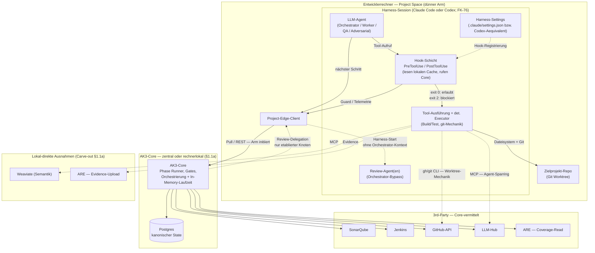
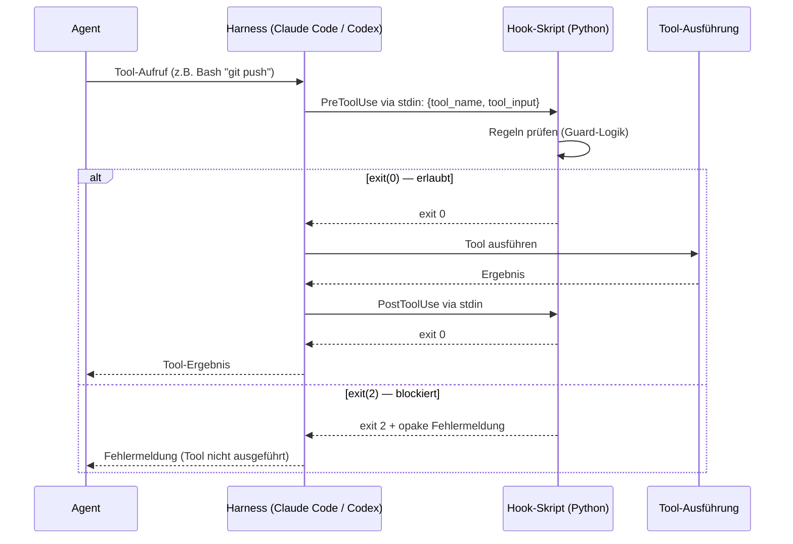
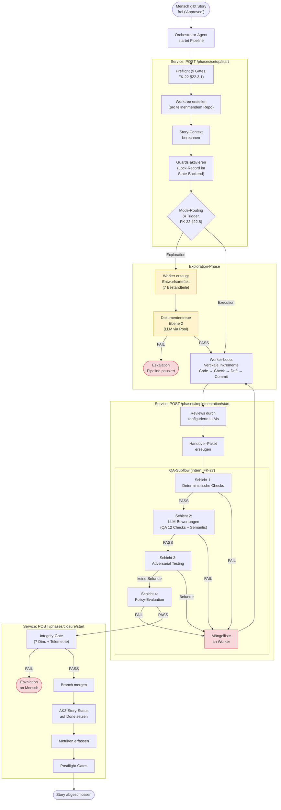
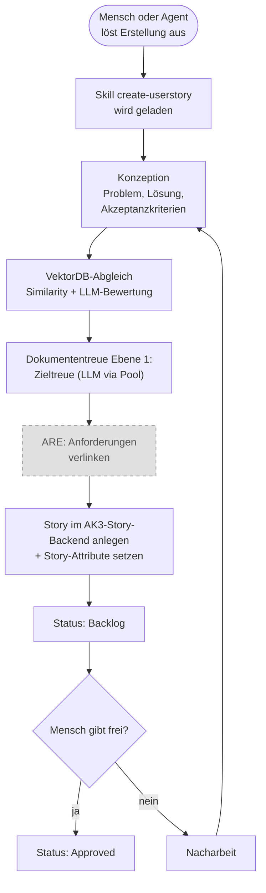

# 01 — Systemkontext und Architekturprinzipien

<!-- PROSE-FORMAL: formal.architecture-conformance.entities, formal.architecture-conformance.invariants, formal.state-storage.invariants, formal.truth-boundary-checker.invariants -->

## 1.1 Zielbild

AgentKit ist ein Framework aus **drei** getrennt ausgelieferten
Distributionen — der Edge-Distribution `agentkit-project-edge` auf dem
Entwicklerrechner, der Kern-Distribution `agentkit-backend` auf dem
zentralen Host und dem kleinen, von beiden importierten Vertragspaket
`agentkit-wire`. „AgentKit" ist der Name des Frameworks; **keine
Distribution und keine Importwurzel traegt den blossen Namen `agentkit`**
(FK-10 §10.1.0a). Es wird gegen Zielprojekte betrieben, ohne seine
Laufzeitartefakte in deren Repository zu deployen. Im Projekt liegen nur die
projektspezifische Konfiguration und die harness-spezifische Anbindung
(Claude Code, Codex; siehe FK-76 §76.5); der
kanonische Laufzeit- und Zustandsraum liegt außerhalb des Projekts in
einem zentralen State-Backend.

Das Zielbild: 1-2 Menschen steuern eine Flotte autonomer Agenten, die
98% der Konzeptions-, Implementierungs- und Absicherungsarbeit an
geschäftskritischen Systemen (250k+ LOC) leisten. Der Mensch ist
Stratege und Controller, kein klassischer Entwickler. Dieses
1-2-Verhältnis gilt pro Projekt; AK3 selbst ist als gemeinsam nutzbare,
zentral betreibbare Capability für Teams und mehrere Projekte ausgelegt
(§1.1a; DK-00 §1a).

## 1.1a Topologie und Betriebsmodell

Realisierung der fachlichen Leitplanke aus DK-00 §1a. AK3 trennt einen
zentralen, zustandsbehafteten **Core** von einem dünnen **lokalen Arm pro
Project Space** — dem git-Checkout eines Zielprojekts mit installiertem AK3
Project Bundle, Hooks und Project-Edge-Launcher (projektlokal, DK-08). Ein
Rechner kann mehrere Project Spaces tragen; ein Zielprojekt kann über mehrere
Project Spaces (Rechner/Entwickler) verteilt sein.

**Core (zentral, ein Dienst).** Der AK3-Core ist ein einzelner, langlebiger,
zustandsbehafteter Dienst — keine Sammlung kurzlebiger lokaler Prozesse. Er
hält die autoritative Laufzeit *einschließlich In-Memory-Zustand* (aktive
Runs, Sessions, in-flight Logs) **und** den kanonischen Postgres-Zustand. Die
deterministische Geschäfts- und Bewertungslogik — Phase Runner,
`StructuralChecker`-Steuerung, `PolicyEngine`, `IntegrityGate`,
Closure-Orchestrierung, Governance-Adjudication — ist Core-Logik (Zone 2,
§1.4).

**Begründung der Zentralisierung.** Ein Teil des Laufzeitzustands ist immer im
Speicher und noch nicht persistiert; „zentrale DB + N lokale Instanzen" teilt
nur den persistierten Teil und wird inkohärent. Zusammen mit dem Lifecycle
eines lebenden Systems (eine Version, nicht N) und dem Team-Betrieb (DK-00 §1a)
folgt: **eine autoritative Core-Instanz, nicht verteilte.**

**Mengenverhältnisse (multi-tenant).** Der Core bedient parallel mehrere
Zielprojekte über mehrere Project Spaces — inklusive desselben Zielprojekts,
das in mehreren Project Spaces gleichzeitig bearbeitet wird. Runtime- und
kanonischer Zustand werden je Story-Run geführt, der an genau einen Project
Space gebunden ist.

**Zwei Deployments, ein Contract.** Der Core läuft wahlweise rechnerlokal
(Einzel-Stratege) oder zentral auf einem dedizierten Server (Team) — reiner
Deployment-Schalter, identischer Arm↔Core-Contract.

**Lokaler Arm (pro Project Space, dünn, zustandslos, ohne eigene
Fachautoritaet).** Vier Akteure, keiner trägt eigene Geschäftsregeln:

| Akteur | Principal (FK-55) | Aufgabe |
|--------|-------------------|---------|
| LLM-Agent | `worker` / `orchestrator` | kreative Arbeit (Code, Konfliktauflösung, Design) — geliehene Intelligenz |
| Deterministischer Executor | `pipeline_deterministic` | fs/worktree-gebundene Mechanik (Build/Test, git), meldet Roh-Records — kein eigener Verstand |
| Hooks | Plattform (Zone 1) | Tool-Call-Enforcement: **fuehren die vom Core mandatierte, deterministische Guard-Evaluation lokal aus**, lesen lokale Read-Projektionen und rufen den Core |
| Project Edge | kein eigener Principal — handelt im Principal des Aufrufers (FK-55) | Relais beider Richtungen, lokale Story-Reconciliation und Credential-/Provider-Portaufloesung im Auftrag des Core |

**„Duenn" heisst regelfrei, nicht codefrei — eine Praezisierung, die den
Distributionsschnitt traegt.** Der Arm besitzt weder kanonischen Zustand
(§1.2.3) noch Bewertungs- oder Entscheidungsautoritaet: er erfindet keine
Regel, aendert keine, hebt keine auf und haelt kein zweites Urteil. Er
**fuehrt** aber sehr wohl Code aus, und zwar genau zwei Klassen davon:

1. **Deterministische Guard-Evaluation.** Ein Tool-Call muss lokal und in
   Millisekunden entschieden werden; ein Netz-Roundtrip pro Werkzeugaufruf
   ist kein zulaessiges Design. Die Guard-Engine ist deshalb
   Edge-ausgeliefert und laeuft im Hook-Prozess (FK-30, FK-10 §10.1.3).
   Ihre Regelbasis stammt aus dem zentral publizierten Edge-Bundle; sie
   erzeugt keine eigene. Sicherheitskritische Zustandsfragen (haelt ein
   Lock? ist eine Schwelle ueberschritten?) werden weiterhin am Core
   bestaetigt oder fail-closed blockiert.
2. **fs-/worktree-gebundene Mechanik**, die AK3 ausdruecklich mandatiert —
   git-/Worktree-Operationen, Evidence-Erhebung, Story-Reconciliation,
   Bundle-Materialisierung. Sie ist per Konstruktion nicht fernsteuerbar,
   weil sie am lokalen Dateisystem haengt.

Beides ist **mandatierte Ausfuehrung unter fremder Autoritaet**, keine
lokale Fachautoritaet. Genau diese Unterscheidung ist der Grund, warum es
eine eigene Edge-Distribution gibt und warum sie trotzdem duenn bleibt:
sie traegt Ausfuehrung, aber keinen Zustand und keine Urteilshoheit
(FK-10 §10.1.0a).

**Lokalität der Installation.** Zwei Anteile mit unterschiedlicher Lokalität:
(a) der **Core** ist zentral betreibbar und wird vom Arm ausschließlich über
den Project-Edge-Client (REST) erreicht — Remoteness ist transparent, weil der
Client der Adapter ist; (b) die **agentenseitigen Assets** (Prompt-/
Skill-Bundles) und der **AK3-Client** (Project-Edge, Hook-Skripte) müssen auf
*jedem Entwicklerrechner lokal* vorliegen, weil der Agent-Harness sie
transparent als Dateien konsumiert — ein Remote-/HTTP-Zugriff ist für den
Harness nicht transparent (Harness-Transparenz-Constraint). Die kanonische
Quelle der Bundles ist zentral (versionierte Registry), die Materialisierung
erfolgt pro Rechner (Sync, `manifest-contract`-gepinnt, DK-08) — dasselbe
Muster „kanonisch zentral, lokal materialisiert" wie das Edge-Bundle (FK-30).
Der Project-Space-Symlink kollabiert nur die
Duplikation *innerhalb* eines Rechners (alle Project Spaces → eine rechnerweite
Bundle-Materialisierung); er verweist nie auf den entfernten Core. Die
drei Installationsebenen (zentral / Entwicklermaschine / Projektraum)
samt Bootstrap, Update und Uninstall sind in **FK-10 §10.2.0**
ausdetailliert; die Versionsverträge (Agent-Runtime, Skill-Bundle, Wire
`/v1`) in **FK-10 §10.2.7**.

**Kommandokanal — transportseitig client-initiiert, fachlich bidirektional.**
Der Standardweg bleibt das Pull-Modell: Der Orchestrator-Agent zieht über den
Project-Edge-Launcher den jeweils nächsten Schritt beim Core ab (FK-45
§45.1.1); der Core antwortet mit einem fachlichen Response, der auch ein
Auftrag sein kann (z. B. „Merge-Konflikt auflösen"). **Der Core initiiert nie
gegenueber einem beliebigen Entwicklerrechner und hat keinen
Dateisystem-Zugriff auf den Entwicklerrechner.** Ausschliesslich gegenueber
einem durch einen vorherigen Project-Edge-Pull etablierten Knoten darf er eine
Delegation initiieren, ausschliesslich ueber Project Edge als Relais und
ausschliesslich fuer die bewusst am Orchestrator vorbeigefuehrte
Review-Beauftragung. Der Delegations- und Rueckmeldevertrag liegt in FK-91
§91.1b; die Harness-Anbindung des Relais in FK-76 §76.10. Im Team-Deployment
wird die Zone-2/Zone-3-Grenze (§1.4) damit zur Prozess- und Netzgrenze und ist
entsprechend härter.

**Drittsystem-Vermittlung (Carve-out).** Eine direkte Lokal→Infra-Kante
ist nur erlaubt, wenn der Aufruf (1) Eigenbedarf des Agents ist oder
(2) fs/worktree-gebunden bzw. Bulk ist und Core-Vermittlung keinen
Kontrollgewinn bringt. AK3-mandatierte Zugriffe auf den LLM-Hub laufen
immer Core-vermittelt über den FK-75-REST-Adapter. Harness-eigenes
Hub-Sparring per MCP ist Eigeninitiative von Codex/Claude Code und kein
AK3-Vertrag. Sonst Core-vermittelt:

| 3rd-Party | Core-vermittelt (AK3-mandatiert, Kontrollinteresse) | Lokal-direkt (Ausnahme) |
|-----------|------------------------------------------------------|-------------------------|
| Postgres | kanonischer State + Telemetrie | — |
| LLM-Hub | AK3-Bewertungs-/Adjudication-Calls via FK-75 | Harness-Eigenbedarf (MCP, außerhalb AK3) |
| SonarQube / Jenkins | Konformitätsurteil / CI-Gate | Ad-hoc-Einsicht |
| GitHub | — | git-Worktree-/Remote-Mechanik (gh/git-CLI lokal) |
| ARE | Coverage-Read | Evidence-Upload |
| Weaviate | — | semantische Suche |

**D1/D2 als Ableitungen.** Dass die deterministische Logik serverseitig läuft
(D1) und die git-Mechanik lokal unter Core-Autorität (D2), folgt aus diesem
Betriebsmodell und ist keine eigenständige Entscheidung. Siehe
`concept/_meta/bc-cut-decisions.md` (Topologie & Betriebsmodell).

## 1.2 Systemgrenzen

### 1.2.1 Systemlandschaft


```mermaid
graph TB
    subgraph DEV["Entwicklerrechner — Project Space (dünner Arm)"]

        subgraph CC["Harness-Session (Claude Code oder Codex; FK-76)"]
            AGENT["LLM-Agent<br/>(Orchestrator / Worker /<br/>QA / Adversarial)"]
            REVIEW["Review-Agent(en)<br/>(Orchestrator-Bypass)"]
            HOOKS["Hook-Schicht<br/>PreToolUse / PostToolUse<br/>(lesen lokalen Cache, rufen Core)"]
            TOOLS["Tool-Ausführung + det. Executor<br/>(Build/Test, git-Mechanik)"]
            SETTINGS["Harness-Settings<br/>(.claude/settings.json bzw. Codex-Aequivalent)"]

            AGENT -->|"Tool-Aufruf"| HOOKS
            HOOKS -->|"exit 0: erlaubt<br/>exit 2: blockiert"| TOOLS
            SETTINGS -.->|"Hook-Registrierung"| HOOKS
        end

        PE["Project-Edge-Client"]
        REPO["Zielprojekt-Repo<br/>(Git Worktree)"]
        TOOLS -->|"Dateisystem + Git"| REPO
        AGENT -->|"nächster Schritt"| PE
        HOOKS -->|"Guard / Telemetrie"| PE
    end

    subgraph CORE_BOX["AK3-Core — zentral oder rechnerlokal (§1.1a)"]
        CORE["AK3-Core<br/>Phase Runner, Gates,<br/>Orchestrierung + In-Memory-Laufzeit"]
        PG[("Postgres<br/>kanonischer State")]
        CORE --> PG
    end

    subgraph TP["3rd-Party — Core-vermittelt"]
        SONAR["SonarQube"]
        JENKINS["Jenkins"]
        GH["GitHub-API"]
        HUB["LLM-Hub"]
        ARER["ARE — Coverage-Read"]
    end

    subgraph DIRECT["Lokal-direkte Ausnahmen (Carve-out §1.1a)"]
        WV["Weaviate (Semantik)"]
        AREW["ARE — Evidence-Upload"]
    end

    PE -->|"Pull / REST — Arm initiiert"| CORE
    CORE -.->|"Review-Delegation<br/>nur etablierter Knoten"| PE
    PE -.->|"Harness-Start<br/>ohne Orchestrator-Kontext"| REVIEW
    CORE --> SONAR
    CORE --> JENKINS
    CORE --> GH
    CORE --> HUB
    CORE --> ARER
    TOOLS -.->|"MCP — Agent-Sparring"| HUB
    TOOLS -.->|"MCP"| WV
    TOOLS -.->|"Evidence"| AREW
    TOOLS -.->|"gh/git CLI — Worktree-Mechanik"| GH
```


### 1.2.2 Komponentenzuordnung

**AgentKit-Kern** (wird entwickelt und ausgeliefert):

| Komponente | Typ | Auslieferungsort | Technologie |
|------------|-----|------------------|-------------|
| `agentkit-project-edge` | Hook-Wrapper, Guard-Engine, Project-Edge-Client, Bediener-CLI, Installer, lokale MCP-Server | Entwicklerrechner (FK-10 §10.2.0 Ebene 2/3) | Python 3.14 |
| `agentkit-backend` | Pipeline, QA-Subflow, Governance-Adjudication, Closure, Control-Plane-HTTP, State-Backend, Frontend-Auslieferung | zentraler Core-Host (Ebene 1) | Python 3.14 |
| `agentkit-wire` | gemeinsames `/v1`-Vokabular, I/O-freies Blatt | mit beiden, nie allein | Python 3.14, Pydantic |
| Rollenprompts + Skills | Paketressourcen / systemweite Bundles | Nicht im Projekt deployt | — |
| JSON Schemas | Artefakt-Validierung | — | JSON Schema Draft 2020-12 |

Die drei Distributionen werden aus **einem** Repository gebaut und tragen
**dieselbe** Version (FK-10 §10.2.7). Der Distributionsschnitt selbst ist
in **FK-10 §10.1.0a** normiert; die maschinell erzwungenen Importgrenzen
in **FK-07 §7.9a**.

**Plattform** (Voraussetzung, nicht Teil von AgentKit):

| Komponente | Typ | Protokoll |
|------------|-----|-----------|
| Agent-Harness (Claude Code, Codex; FK-76) | Agent-Plattform | CLI + Hook-API (PreToolUse/PostToolUse), harness-spezifisch via Adapter normalisiert |
| Git | Versionskontrolle | CLI (`git`) |
| GitHub | Code-Backend (Repos, Branches, PRs) | CLI (`gh`) |

**Externe Dienste** (austauschbar). Vermittlung nach dem §1.1a-Carve-out:
AK3-mandatierte Bewertungs-/Adjudication-Aufrufe (LLM-Hub) und
ARE-Coverage-Reads laufen über den Core; die unten gezeigten MCP-Direktpfade
gelten für Agent-Eigenbedarf, agent-ausgeführtes LLM-Sparring und
read-mostly-Zugriffe (Weaviate, ARE-Evidence):

| Dienst | Schnittstelle zu AgentKit | Anforderung |
|--------|--------------------------|-------------|
| LLM-Hub | AK3-Zugriff ausschließlich über FK-75 (REST-Adapter) | Mindestens 2 verschiedene LLM-Familien neben Claude. Backend-Implementierung (Browser-Automation, API, etc.) ist AgentKit egal. |
| Story-Knowledge-Base | MCP-Tools: `story_search`, `story_list_sources`, `story_sync` | Beliebige Implementierung mit dieser MCP-Schnittstelle (z.B. Weaviate via FastMCP-Server). |
| ARE (optional) | MCP-Tools (analog zu Weaviate-Wrapper). **Kein direkter DB-Zugriff.** | Python-Anwendung mit SQL-DB im Backend. Falls ARE nativ nur REST/FastAPI spricht, wird ein MCP-Wrapper als Adapter implementiert (wie bei Weaviate). |
| Zielprojekt | Dateisystem + Git | Beliebiger Tech-Stack |

**Implementierung des LLM-Hubs:** Die konkrete Hub-Implementierung ist
nicht Teil von AgentKit und frei waehlbar — etwa Browser-Automation per
FastAPI/Playwright oder eine direkte API-Anbindung, jeweils nativ oder in
einer isolierten Laufzeit (z.B. WSL2). Massgeblich ist allein die
Einhaltung des Hub-Adaptervertrags (FK-75; AK3-Code ausschließlich via
REST). MCP-Nutzung durch Codex/Claude Code ist Harness-Eigenbedarf und
nicht Teil des AK3-Vertrags.

### 1.2.2a Fachliches Komponentenmodell

Fuer AK3 wird "Komponente" fachlich verstanden: als logisch
abgegrenztes Verantwortungsbuendel mit klarer Schnittstelle. Eine
Komponente ist **nicht** automatisch eine Python-Klasse, ein Modul
oder ein Prozess.

Der normative Komponentenschnitt von AK3 wird in FK-07 festgezogen.
Dieses Kapitel enthaelt nur die uebergeordneten Prinzipien:

| Regel | Bedeutung |
|-------|-----------|
| Verantwortung vor Technik | Komponenten werden nach fachlicher Aufgabe benannt, nicht nach Datei, Klasse oder Pipeline-Schritt |
| Ein Aufrufer, gekapselte Innenlogik | Wird ein Baustein ausschliesslich von genau einer Komponente genutzt und ist Teil ihres inneren Ablaufwissens, ist er Subkomponente |
| Mehrere Aufrufer, eigener Vertrag | Wird ein Baustein von mehreren Komponenten genutzt, ist er Top-Level-Komponente mit eigenem Vertrag |
| Adapter sind keine Fachkomponenten | HTTP, Hook-, MCP- und Projekt-Edge-Bausteine sind R-Code und nicht Teil des fachlichen Kerns |
| Persistenztreiber sind keine Fachkomponenten | `state_backend` ist technische Infrastruktur und keine fachliche Mitte |

**Leitende Top-Level-Familien von AK3:**

| Familie | Leitende Komponenten |
|---------|----------------------|
| Story-, Planungs- und Ausfuehrungskern | `StoryContextManager`, `ExecutionPlanningService`, `PipelineEngine`, `StoryExecutionLifecycleService`, `WorktreeManager` |
| Governance- und QA-Kern | `GuardSystem`, `CcagMatcherCatalog`, `ConformanceService`, `StageRegistry`, `GovernanceObserver`, `FailureCorpus` |
| Inhalts- und Runtime-Services | `ArtifactManager`, `PromptComposer`, `LlmEvaluator`, `TelemetryService`, `PhaseStateStore` |
| Analytics- und Produktoberflaeche | `KpiAnalyticsEngine`, `DashboardApplication` |
| Bootstrap und Projektbindung | `Installer` |

**Wichtige Abgrenzungen:**

| Abgrenzung | AK3-Regel |
|------------|-----------|
| `PipelineEngine` vs. Phasen | Die Engine ist Top-Level; die Phasen sind ihre Subkomponenten. `PreflightChecker`, `ModeResolver`, `StructuralChecker`, `PolicyEngine` und `IntegrityGate` sind wiederum phasennahe Subkomponenten |
| `ExecutionPlanningService` vs. `PipelineEngine` | Planung bestimmt `READY`, `blocked`, Wellen und Parallelisierungsbudgets; die `PipelineEngine` fuehrt nur bereits zugelassene Story-Runs aus |
| `StageRegistry` | Bleibt Top-Level, weil sie sowohl von der Capability `VerifySystem` (im QA-Subflow innerhalb der Implementation- und Exploration-Phase) als auch vom `FailureCorpus` genutzt wird; sie darf nicht in `VerifySystem` aufgehen |
| `GuardSystem` vs. `CcagMatcherCatalog` | Guards und Principal Capabilities erzwingen Regeln. CCAG bewahrt nur Hook-Registrierung und Matcher-Katalog und trifft keine Freigabeentscheidung |
| `PromptComposer` vs. Prompt-Integritaet | Der Composer assembliert Prompts. Sentinel-/Spawn-Integritaet und Governance-Escape-Erkennung gehoeren zum Guard-/Hook-System, nicht zum Composer |
| Externe Integrationen | GitHub, LLM-Hub, ARE und VectorDB bleiben getrennte Adapter; `IntegrationHub` ist kein normativer Top-Level-Baustein |

**Prozessvertrag pro Komponente:**

Alle nichttrivialen Ablaufanteile von AK3 werden ueber eine
einheitliche hierarchische Prozess-DSL modelliert (FK-20). Das gilt
nicht nur fuer die Gesamtpipeline, sondern auch fuer Komponenten und
ihre Subschritte.

| Vertragsbestandteil | Bedeutung |
|---------------------|-----------|
| `FlowDefinition` | Beschreibt Reihenfolge, Branching, Rueckspruenge und Yield-Points |
| `NodeDefinition` | Definiert atomare oder zusammengesetzte Ausfuehrungsschritte |
| `ExecutionPolicy` | Regelt, ob ein Knoten erneut laufen darf oder nach Erfolg uebersprungen wird |
| `OverridePolicy` | Regelt, welche CLI-/Mensch-Overrides zulaessig sind |
| Handler-Implementierung | Enthaelt die Fachlogik, I/O und Seiteneffekte des Knotens |

**Architekturregel:** Eine Komponente besitzt damit zwei klar getrennte
Vertraege:

- einen **Kontrollflussvertrag** in der gemeinsamen DSL
- einen **Ausfuehrungsvertrag** ihrer Schritt-Handler

Diese Trennung ist die Gegenmassnahme gegen neue imperative
God-Files: Kontrollfluss wird deklarativ und auditierbar modelliert,
Fachlogik bleibt lokal in der Komponente.

### 1.2.3 Was AgentKit NICHT ist

- Kein CI/CD-System — es ersetzt keine Build-Pipeline, sondern
  orchestriert Agenten, die in einer solchen arbeiten.
- Kein in das Zielprojekt eingebetteter AgentKit-Server — das
  Zielprojekt-Repo enthält keine AgentKit-Runtime. Die Runtime ist der
  zentrale Core (§1.1a), vom Projekt entkoppelt; er kann rechnerlokal oder
  auf einem dedizierten Server betrieben werden.
- Kein LLM-Anbieter — es nutzt LLMs ueber Harness-Sessions (Claude
  Code mit Anthropic-Modellen, Codex mit OpenAI-Modellen; FK-76)
  sowie ChatGPT, Gemini und Grok als externe Dienste.
- Kein Testframework — es orchestriert Tests, schreibt aber selbst
  keine fachlichen Tests.
- Kein eigenstaendiges Projektmanagement-Tool im Sinne klassischer
  Boards — Story-Verwaltung laeuft ueber das AK3-Story-Backend, nicht
  ueber externe Project-Boards.

## 1.3 Architekturprinzipien

### P1: Fail-Closed

Jeder unbekannte Zustand ist ein Fehler. Konkret:

| Situation | Reaktion |
|-----------|----------|
| Fehlende Konfigurationsfelder | Default zugunsten des restriktiveren Pfads (z.B. Exploration Mode statt Execution Mode) |
| Ungültige JSON-Artefakte | Check = FAIL, nicht SKIP |
| LLM liefert kein gültiges JSON | Regex-Fallback → Retry → FAIL |
| Nicht erreichbares externes System | Abbruch mit Fehlercode, nicht stille Fortfahrt |
| Fehlende Telemetrie-Events | Integrity-Gate blockiert Closure |
| Unbekannter Story-Typ | Pipeline-Abbruch |

### P2: Plattform-Enforcement

Guards und Governance werden über die Hook-Schicht des jeweiligen
Agent-Harness (Claude Code, Codex; FK-76) durchgesetzt. Ein Agent
kann seine eigenen Hooks nicht deaktivieren, weil Hooks Teil der
Plattforminfrastruktur des Harness sind, nicht Teil des Agent-Codes.

**Technisch:** Hooks werden harness-spezifisch ueber den jeweiligen
Harness-Adapter registriert (Claude Code: `.claude/settings.json`;
Codex: harness-eigenes Aequivalent). Der Harness ruft sie als externe
Prozesse auf (`PreToolUse`, `PostToolUse`). Der Hook-Prozess ist ein
Python-Skript aus dem `agentkit`-Paket, das über `sys.stdin` den
Tool-Call empfängt und über `sys.exit(0)` (erlauben) oder
`sys.exit(2)` (blockieren) antwortet. Der Adapter normalisiert
harness-spezifische Tool-Namen und Hook-Events auf das harness-neutrale
`HookEvent`-Schema (FK-76 §76.4).


```mermaid
sequenceDiagram
    participant A as Agent
    participant CC as Harness (Claude Code / Codex)
    participant H as Hook-Skript (Python)
    participant T as Tool-Ausführung

    A->>CC: Tool-Aufruf (z.B. Bash "git push")
    CC->>H: PreToolUse via stdin: {tool_name, tool_input}
    H->>H: Regeln prüfen (Guard-Logik)
    alt exit(0) — erlaubt
        H-->>CC: exit 0
        CC->>T: Tool ausführen
        T-->>CC: Ergebnis
        CC->>H: PostToolUse via stdin
        H-->>CC: exit 0
        CC-->>A: Tool-Ergebnis
    else exit(2) — blockiert
        H-->>CC: exit 2 + opake Fehlermeldung
        CC-->>A: Fehlermeldung (Tool nicht ausgeführt)
    end
```

### P3: Deterministisch wo möglich, LLM nur wo nötig

| Aufgabe | Mittel |
|---------|--------|
| Pipeline-Steuerung, Phasenwechsel, Mode-Routing | Deterministischer Python-Code |
| Structural Checks, Policy-Evaluation | Deterministischer Python-Code |
| Guard-Enforcement | Deterministischer Python-Code (Hooks) |
| Telemetrie-Erfassung, Metriken | Deterministischer Python-Code |
| Code-Implementierung | LLM als Agent (Dateisystem-Zugriff) |
| Adversarial Testing | LLM als Agent (eingeschränkter Dateisystem-Zugriff) |
| QA-Bewertung, Semantic Review | LLM als Bewertungsfunktion (kein Dateisystem) |
| Dokumententreue-Prüfung | LLM als Bewertungsfunktion (kein Dateisystem) |
| Governance-Adjudication | LLM als Bewertungsfunktion (kein Dateisystem) |

**LLM als Agent:** Harness-Session (Claude Code oder Codex; FK-76)
mit Dateisystem-Zugriff. Wird für Worker und Adversarial Agent
eingesetzt.

**LLM als Bewertungsfunktion:** Deterministische Core-Logik ruft ein LLM
über den zentralen LLM-Hub-Gateway des Core auf (§1.1a-Carve-out:
AK3-mandatierte Bewertung ist Core-vermittelt, nicht MCP-direkt vom
Entwicklerrechner). Der Aufruf sendet einen strukturierten Prompt und
empfängt eine Textantwort, die als JSON geparst wird. Kein
Dateisystem-Zugriff. Kein autonomes Handeln. Der Core validiert
die Antwort und entscheidet, die Pipeline entscheidet.

### P4: Rollentrennung durch technische Mittel

Rollentrennung ist nicht nur Prompt-Disziplin, sondern wird durch
technische Mechanismen erzwungen:

| Rolle | Technische Einschränkung | Mechanismus |
|-------|------------------------|-------------|
| Orchestrator | Darf nicht auf Codebase zugreifen | `orchestrator_guard.py` (PreToolUse-Hook) |
| Worker | Darf keine QA-Artefakte schreiben | `integrity.py` (PreToolUse-Hook) |
| QA-Agent (Bewertungsfunktion) | Hat keinen Dateisystem-Zugriff | Läuft als Pool-Call, nicht als Agent |
| Adversarial Agent | Darf nur Test-Dateien schreiben | dedizierter Guard |

### P5: Multi-LLM als Pflicht

Verschiedene Rollen werden von verschiedenen LLM-Familien bedient.
Das ist konfigurierte Pflicht, nicht optionale Ergänzung.

**Konfiguration** in `project.yaml`:

```yaml
multi_llm: true  # Pflicht, Default true

llm_roles:
  worker: "claude"                # Harness-Session (Claude Code oder Codex; FK-76). Wert ist die LLM-Familie, nicht der Harness-Eigenname.
  qa_review: "chatgpt"            # Schicht 2: QA-Bewertung (12 Checks)
  semantic_review: "gemini"        # Schicht 2: Semantic Review
  adversarial_sparring: "grok"     # Schicht 3: Edge-Case-Ideen
  doc_fidelity: "gemini"           # Dokumententreue-Prüfung
  governance_adjudication: "gemini"   # Governance-Beobachtung
  story_creation_review: "chatgpt" # VektorDB-Konfliktbewertung
```

Das Integrity-Gate prüft bei Closure, dass alle konfigurierten
Pflicht-Reviewer tatsächlich aufgerufen wurden (Telemetrie-Nachweis).

### P6: Kontext-Selektion

Agenten erhalten nicht den gesamten verfügbaren Kontext, sondern nur
den für ihre aktuelle Aufgabe relevanten. Story-Metadaten (betroffene
Module, Story-Typ, Tech-Stack) selektieren automatisch die passenden
Regel- und Wissensabschnitte aus getaggten Sektionen der
Projektdokumentation. Irrelevante Abschnitte werden nicht in den
Prompt injiziert.

**Technisch:** Ein Manifest-Indexer scannt die Projektdokumentation
(CLAUDE.md, Konzepte, Guardrails) und erzeugt einen validierbaren
Index mit Pfad, Abschnittsanker, Tags und Gültigkeitsbereich. Der
Prompt-Builder arbeitet nur gegen diesen Index — nicht gegen
Inline-Tags in den Dokumenten selbst. Das verhindert Metadaten-Drift
und macht die Selektionsbasis zentral validierbar.

Das Ergebnis ist ein Kontextpaket pro Rolle, das dem Agent-Prompt
vorangestellt wird.

Details zur technischen Umsetzung in Kapitel 08 (Rollen, Prompts,
Kontext-Selektion).

### P7: Minimale Dependencies — pro Distribution, nicht pro Repository

**Das Prinzip lautet nicht „wenige Pakete insgesamt", sondern „auf jeder
Maschine nur das, was sie ausfuehrt".** Eine gemeinsame Dependency-Menge
verletzt es auch dann, wenn sie kurz ist: sie installiert den
Postgres-Treiber auf einem Rechner, der die Datenbank nie sieht. Die
verbindliche Zuordnung — Abhaengigkeit fuer Abhaengigkeit, mit dem
gemessenen Importbereich als Beleg — steht in **FK-10 §10.2.12 E**. Hier
nur das Bild:

| Distribution | Runtime-Dependencies | Zweck |
|--------------|----------------------|-------|
| `agentkit-wire` | `pydantic` | Wire-Modelle validieren (frozen, strict). Einzige Drittabhaengigkeit des I/O-freien Blatts |
| `agentkit-project-edge` | `pyyaml`, `tomlkit`, `mcp` (≥ 1.2.0, < 2), `weaviate-client` (4.9–5.0), `tokenizers`, `psutil` — plus `pydantic` transitiv ueber `agentkit-wire` | lokale Konfiguration, Codex-Config-Merge, lokal gestartete MCP-Server, semantische Suche (Carve-out §1.1a), deterministische Chunk-Groesse, Prozessmonitoring der MCP-Registrierung |
| `agentkit-backend` | `pyyaml`, `psycopg[binary]`, `psycopg-pool`, `argon2-cffi`, `packaging` — plus `pydantic` transitiv | Konzept-Korpus lesen, kanonischer State, Credential-Hashing, Skill-Versionspolitik |

Die `mcp`-Grenze ist beidseitig: `mcp.server.fastmcp` gibt es erst ab
1.2.0, und 2.0 liefert weder `mcp.server.fastmcp` noch `mcp.types`; das
`cli`-Extra wird nicht gebraucht.

`packaging` steht heute in **keiner** Dependency-Deklaration und kommt nur
transitiv mit. Das faellt erst beim Schnitt auf: der Kern verlaesse sich
danach auf eine Quelle, die er nicht mehr mitzieht. Deshalb ist die
Sollmenge je Distribution **beidseitig** zu pruefen — Ueberschuss *und*
Fehlbestand (FK-07 §7.9a.2 Punkt 5d).

**Infrastruktur-Dependency:** AK3 setzt eine zentrale PostgreSQL-Instanz
als State- und Analytics-Store voraus. Der Treiber gehoert deshalb zur
**Kern**-Distribution und **nur** zu ihr; Postgres wird ausschliesslich vom
Core angesprochen (I1). Eine Ebene-2-Umgebung, in der `psycopg` vorhanden
ist, ist ein Fehlbetrieb und wird vom Gate aus FK-07 §7.9a blockierend
erkannt. Weitere Drittsysteme folgen dem Carve-out aus §1.1a:
Core-vermittelt bei AK3-mandatiertem Kontrollinteresse, lokal-direkt über
CLI/MCP nur bei fs/worktree-Bindung, Bulk-Evidenz oder Eigenbedarf des
Agents — und die zugehoerige Client-Bibliothek folgt dem, der den Aufruf
macht, nicht dem historischen Namensraum.

### P8: Datenformate

| Artefakttyp | Format | Begründung |
|-------------|--------|------------|
| Telemetrie-Events (Laufzeit) | PostgreSQL | Kanonischer, projektunabhängiger Audit-Trail mit Berechtigungsgrenzen |
| Telemetrie-Events (Archiv) | Export/Bundle aus dem State-Backend | Menschenlesbar, langfristige Archivierung |
| QA-Ergebnisse | Strukturierte Records in PostgreSQL + optionale JSON-Exporte | Validierbar gegen JSON Schema, aber nicht dateibasiert kanonisch |
| Pipeline-State | Strukturierte Records in PostgreSQL | Zustandspersistenz zwischen Phasen mit Zugriffskontrolle |
| Konfiguration | YAML | Menschenlesbar, editierbar |
| Prompts | Markdown | Paketressourcen, versioniert mit AgentKit |
| Manifest/Installationsmetadaten | Service-Record + lokale Config-Version | Maschinell prüfbar ohne Projekt-Manifest |

**Telemetrie-Prinzip:** Events werden zur Laufzeit in das zentrale
PostgreSQL-Backend geschrieben und über deterministische Abfragen
ausgewertet. Exportformate wie JSONL sind Audit- oder
Untersuchungsformate, aber nie kanonischer Laufzeit-Speicher.

**LLM-Call-Events:** Telemetrie-Events für externe LLM-Aufrufe
verwenden den generischen Event-Typ `llm_call` mit dem Feld `pool`
(Name des MCP-Servers, z.B. `chatgpt`, `gemini`, `grok`) und `role`
(konfigurierte Rolle aus `llm_roles`, z.B. `qa_review`,
`semantic_review`). Das Integrity-Gate prüft gegen die konfigurierten
Pflicht-Rollen, nicht gegen hardcoded Anbieternamen. Damit bleibt
die Pool-Abstraktion intakt — ein Wechsel des LLM-Providers erfordert
nur eine Konfigurationsänderung, keine Code-Änderung.

## 1.4 Trust Boundaries

### 1.4.1 Boundary-Modell

```
    ┌─── Zone 1: Plattform (Harness — Claude Code / Codex; FK-76 — + Hooks) ─────────┐
    │   Nicht vom Agent kontrollierbar. Hook-Enforcement.                   │
    │                                                                      │
    │   ┌─── Zone 2: Pipeline-Orchestrierung ──────────────────────────┐   │
    │   │   Deterministischer Python-Code. Entscheidet.                │   │
    │   │                                                              │   │
    │   │   ┌─── Zone 3: Agent-Ausführung ────────────────────────┐    │   │
    │   │   │   LLM-gesteuert, nicht-deterministisch.             │    │   │
    │   │   │   Kann lügen, abkürzen, fabrizieren.                │    │   │
    │   │   │   Jede Behauptung wird durch Zone 1/2 verifiziert.  │    │   │
    │   │   └─────────────────────────────────────────────────────┘    │   │
    │   └──────────────────────────────────────────────────────────────┘   │
    │                                                                      │
    │   ┌─── Zone 4: Externe LLMs (Pools) ────────────────────────────┐   │
    │   │   Antworten nicht vertrauenswürdig.                         │   │
    │   │   Nur als Bewertungsfunktion. Pipeline entscheidet.         │   │
    │   └─────────────────────────────────────────────────────────────┘   │
    └──────────────────────────────────────────────────────────────────────┘
```

### 1.4.2 Trust-Regeln

| Regel | Bedeutung |
|-------|-----------|
| Zone 3 darf Zone 1 nicht umgehen | Agent kann Hooks nicht deaktivieren |
| Zone 3 darf Zone 2 nicht manipulieren | Agent kann Pipeline-State nicht direkt schreiben; State-Mutationen laufen nur über deterministische Services mit Rollenrechten |
| Zone 4 entscheidet nicht | LLM-Antworten werden geparst und validiert; die Pipeline entscheidet basierend auf dem Ergebnis |
| Trust-Klasse C ist nie blocking | Vom Agent selbst erzeugte Evidence (Screenshots, API-Logs) kann QA nicht bestehen/nicht blockieren |
| Opake Fehlermeldungen an Zone 3 | Guards geben dem Agent keine Details, warum er blockiert wurde |

### 1.4.3 Maschinen- und Netzgrenze

Die Zonen sind **Vertrauens**grenzen. Quer dazu liegt eine
**Maschinen**grenze, die im Team-Deployment zugleich eine Netzgrenze ist.
Beide fallen nicht zusammen: Zone 1 (Hooks) laeuft auf dem
Entwicklerrechner, Zone 2 (Orchestrierung) im Kern.

| Zone | Maschine | Distribution |
|------|----------|--------------|
| 1 — Plattform: Harness | Entwicklerrechner | keine (Fremdplattform) |
| 1 — Plattform: Hooks und Guard-Engine | Entwicklerrechner | `agentkit-project-edge` |
| 2 — Pipeline-Orchestrierung | Core-Host | `agentkit-backend` |
| 3 — Agent-Ausfuehrung | Entwicklerrechner | keine (LLM im Harness) |
| 4 — Externe LLMs | extern | keine |

**Normative Regeln der Maschinengrenze:**

| Regel | Bedeutung |
|-------|-----------|
| Der Kern ist ausschliesslich ueber seinen geschuetzten HTTPS-Vertrag `/v1` erreichbar | Kein Dev-Prozess oeffnet DB, Dateisystem oder interne Ports des Kerns |
| Der Entwicklerrechner ist **nicht erreichbar** | Der Kern oeffnet nie eine Verbindung zu ihm und hat keinen Dateisystemzugriff auf ihn. Jede Kante wird vom Edge initiiert |
| Fachliche Rueckrichtung ≠ Netz-Rueckrichtung | Die Review-Delegation (§1.1a) ist die **Antwort** auf einen Project-Edge-Pull eines etablierten Knotens, keine eingehende Verbindung |
| Zone 1 traegt Ausfuehrung, nicht Autoritaet | Die lokale Guard-Engine wertet die zentral publizierte Regelbasis aus; sie erzeugt keine Regel und haelt keinen kanonischen Zustand (§1.1a, FK-30 §30.2.0) |
| Die Grenze ist installiert, nicht vereinbart | Was der Edge nicht importieren darf, liegt nicht auf seiner Maschine. Durchsetzung: FK-07 §7.9a |

## 1.5 Hauptlaufzeitpfade

### 1.5.1 Story-Bearbeitung (Hauptpfad)


```mermaid
flowchart TD
    classDef exploration fill:#fff3cd,stroke:#d4a017,color:#333
    classDef lightweight fill:#d4edda,stroke:#28a745,color:#333
    classDef fail fill:#f8d7da,stroke:#dc3545,color:#333

    START(["Mensch gibt Story<br/>frei ('Approved')"]) --> ORCH
    ORCH["Orchestrator-Agent<br/>startet Pipeline"] --> SETUP

    subgraph SETUP_PHASE ["Service: POST /phases/setup/start"]
        SETUP["Preflight (9 Gates,<br/>FK-22 §22.3.1)"] --> WT["Worktree erstellen<br/>(pro teilnehmendem Repo)"]
        WT --> CTX["Story-Context<br/>berechnen"]
        CTX --> GUARDS["Guards aktivieren<br/>(Lock-Record im<br/>State-Backend)"]
        GUARDS --> MODE{"Mode-Routing<br/>(4 Trigger,<br/>FK-22 §22.8)"}
    end

    MODE -->|Exploration| EXPLORE
    MODE -->|Execution| IMPL

    subgraph EXPLORE_PHASE ["Exploration-Phase"]
        EXPLORE["Worker erzeugt<br/>Entwurfsartefakt<br/>(7 Bestandteile)"]:::exploration
        EXPLORE --> DOCTREUE["Dokumententreue<br/>Ebene 2<br/>(LLM via Pool)"]:::exploration
        DOCTREUE -->|FAIL| ESC_E(["Eskalation<br/>Pipeline pausiert"]):::fail
        DOCTREUE -->|PASS| IMPL
    end

    subgraph IMPL_PHASE ["Service: POST /phases/implementation/start"]
        IMPL["Worker-Loop:<br/>Vertikale Inkremente<br/>Code → Check → Drift → Commit"]
        IMPL --> REVIEW["Reviews durch<br/>konfigurierte LLMs"]
        REVIEW --> HANDOVER["Handover-Paket<br/>erzeugen"]
        HANDOVER --> VERIFY

        subgraph QA_SUBFLOW ["QA-Subflow (intern, FK-27)"]
            VERIFY["Schicht 1:<br/>Deterministische Checks"]
            VERIFY -->|PASS| LLM_EVAL["Schicht 2:<br/>LLM-Bewertungen<br/>(QA 12 Checks + Semantic)"]
            LLM_EVAL -->|PASS| ADV["Schicht 3:<br/>Adversarial Testing"]
            ADV -->|keine Befunde| POLICY["Schicht 4:<br/>Policy-Evaluation"]
            VERIFY -->|FAIL| FEEDBACK
            LLM_EVAL -->|FAIL| FEEDBACK
            ADV -->|Befunde| FEEDBACK
            POLICY -->|FAIL| FEEDBACK
            FEEDBACK["Mängelliste<br/>an Worker"]:::fail --> IMPL
        end
    end

    POLICY -->|PASS| CLOSURE

    subgraph CLOSURE_PHASE ["Service: POST /phases/closure/start"]
        CLOSURE["Integrity-Gate<br/>(7 Dim. + Telemetrie)"]
        CLOSURE -->|FAIL| ESC_C(["Eskalation<br/>an Mensch"]):::fail
        CLOSURE -->|PASS| MERGE["Branch mergen"]
        MERGE --> CLOSE["AK3-Story-Status<br/>auf Done setzen"]
        CLOSE --> METRICS["Metriken erfassen"]
        METRICS --> POSTFLIGHT["Postflight-Gates"]
    end

    POSTFLIGHT --> DONE(["Story abgeschlossen"])
```

### 1.5.2 Story-Erstellung (Nebenpfad)


```mermaid
flowchart TD
    classDef optional fill:#e0e0e0,stroke:#999,stroke-dasharray: 5 5,color:#555

    TRIGGER(["Mensch oder Agent<br/>löst Erstellung aus"]) --> SKILL
    SKILL["Skill create-userstory<br/>wird geladen"] --> KONZEPT
    KONZEPT["Konzeption<br/>Problem, Lösung,<br/>Akzeptanzkriterien"] --> VEKTORDB
    VEKTORDB["VektorDB-Abgleich<br/>Similarity + LLM-Bewertung"] --> ZIELTREUE
    ZIELTREUE["Dokumententreue Ebene 1:<br/>Zieltreue (LLM via Pool)"] --> ARE
    ARE["ARE: Anforderungen<br/>verlinken"]:::optional --> STORY_BACKEND
    STORY_BACKEND["Story im AK3-Story-Backend anlegen<br/>+ Story-Attribute setzen"] --> BACKLOG
    BACKLOG["Status: Backlog"] --> FREIGABE
    FREIGABE{"Mensch gibt frei?"}
    FREIGABE -->|ja| FREI["Status: Approved"]
    FREIGABE -->|nein| REWORK["Nacharbeit"] --> KONZEPT
```

## 1.6 Tech-Stack-Zusammenfassung

| Schicht | Technologie | Version | Protokoll |
|---------|-------------|---------|-----------|
| Agent-Plattform | Agent-Harness (Claude Code, Codex; FK-76) | — | CLI + Hook-API, harness-spezifisch via Adapter |
| Hook-Sprache | Python | 3.14 | stdin/stdout, exit codes |
| Konfiguration | YAML | — | Dateisystem |
| Datenmodelle | Pydantic | 2.7+ | Python-Klassen |
| Telemetrie-Events (Laufzeit) | PostgreSQL | — | Kanonischer State-Backend-Store (P8); JSONL ist Archiv-/Export-Format, kein kanonischer Laufzeitspeicher |
| QA-Artefakte | Strukturierte Records in PostgreSQL | — | Kanonisch im State-Backend (P8); optionale JSON-Exporte sind abgeleitetes Format, nicht dateibasiert kanonisch |
| VCS | Git | 2.30+ | CLI (`git`) |
| GitHub | Remote-Git-Hosting | git/gh | Code-Repository-Remote; keine Story-Verwaltung |
| VektorDB | Weaviate | 1.25+ | gRPC + HTTP REST |
| Embedding | text2vec-transformers | — | Docker Sidecar |
| VektorDB-MCP | FastMCP (`mcp.server.fastmcp`) | ≥ 1.2, < 2 | stdio-Transport |
| LLM-Hub | Beliebig (externe Infrastruktur) | — | AK3-Adaptervertrag FK-75. Implementierung ist AgentKit-agnostisch. |
| ARE (optional) | Python-Anwendung + SQL-DB | — | MCP-Tools oder FastAPI-Endpunkte. Kein direkter DB-Zugriff durch AgentKit. |
| Build/Test | projektspezifisch | — | via `mvn`, `pytest`, `jest` etc. |
| Linting/Typing | ruff, mypy | — | CLI |
| Tests | pytest | 8+ | pytest-Konventionen |
| Coverage | pytest-cov | — | 85% Minimum |

---

*FK-Referenzen: FK-04-005 bis FK-04-023 (Rollen, Multi-LLM),
FK-06-001 bis FK-06-006 (Fail-Closed-Prinzipien),
FK-07-004 bis FK-07-008 (Trust-Klassen),
FK-11-001 bis FK-11-009 (Installer/Tech-Stack)*
