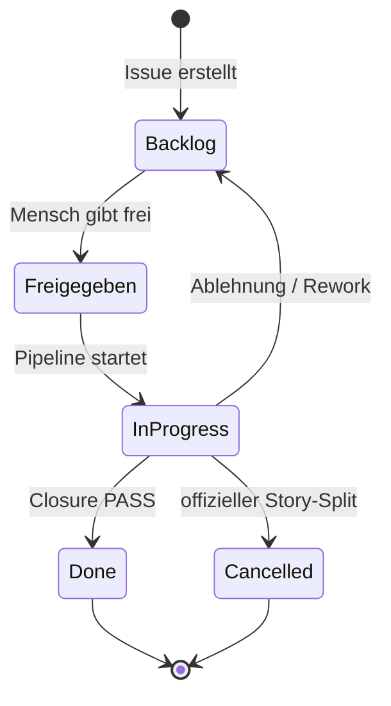
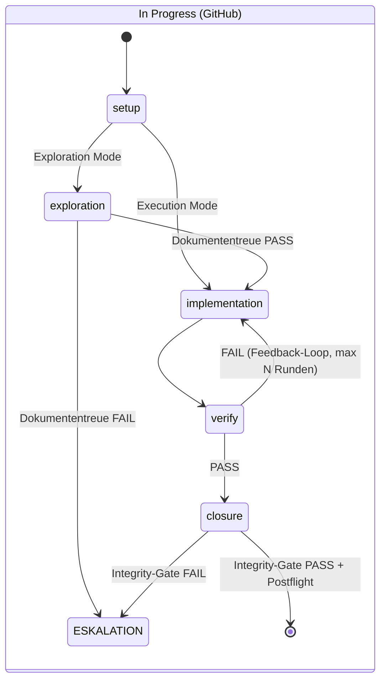
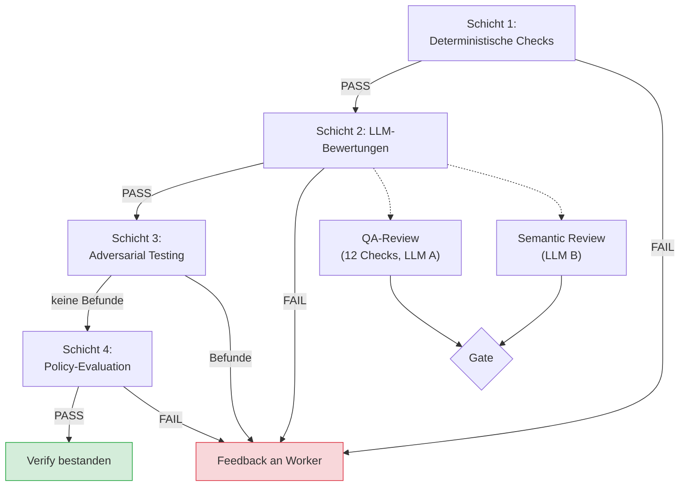
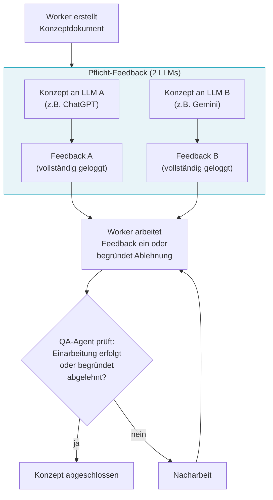
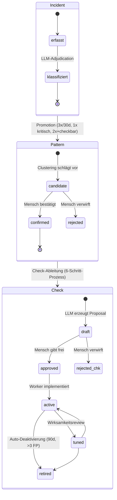
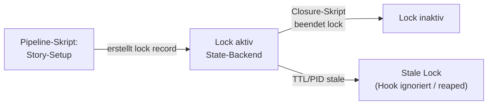

# 02 — Domänenmodell, Zustände und Artefakte

## 2.1 Kanonische Begriffe

Dieses Kapitel definiert die Begriffe, die im gesamten Feinkonzept
verwendet werden. Jeder Begriff hat eine exakte technische Bedeutung.

| Begriff | Definition | Technische Repräsentation |
|---------|-----------|--------------------------|
| **Story** | Kleinste planbare Arbeitseinheit. Entspricht einem GitHub Issue mit AgentKit Custom Fields. | GitHub Issue + Project Item |
| **Projekt** | Ein registriertes Zielprojekt, gegen das eine zentrale AgentKit-Installation arbeitet. | Projektregistrierung + lokale Projektkonfiguration |
| **Project-Key** | Mandanten-Schlüssel eines registrierten Projekts. Alle kanonischen Runtime- und Analytics-Records sind daran gebunden. | String, systemweit eindeutig |
| **Story-ID** | Eindeutiger Identifikator einer Story. Format: `{PREFIX}-{NNN}`, z.B. `ODIN-042`. | String, Regex: `[A-Z][A-Z0-9]+(?:-[A-Z][A-Z0-9]+)*-\d+` |
| **Story-Typ** | Klassifikation der Story. Bestimmt den Pipeline-Pfad. | Enum: `implementation`, `bugfix`, `concept`, `research` |
| **Story-Größe** | Geschätzter Umfang. Beeinflusst Review-Häufigkeit. | Enum: `XS`, `S`, `M`, `L`, `XL` |
| **Run** | Eine Ausführung der Pipeline für eine Story. Eine Story kann mehrere Runs haben (bei Retry/Rework). | `run_id` (UUID), erzeugt beim Setup. Technischer Ausführungsschlüssel neben `story_id`. |
| **Phase** | Ein Abschnitt des Pipeline-Ablaufs. | Enum: `setup`, `exploration`, `implementation`, `verify`, `closure` |
| **Stage** | Ein Prüfschritt innerhalb einer Phase. Typisiert mit Schicht, Story-Typ-Geltung und Blocking-Modus. | Typisiertes Objekt in Stage-Registry (siehe 2.9) |
| **Flow** | Hierarchisch interpretierbarer Ablaufvertrag. Kann Pipeline, Phase oder Komponente beschreiben. | `FlowDefinition` der Prozess-DSL |
| **Node / Schritt** | Atomarer oder zusammengesetzter Kontrollfluss-Knoten innerhalb eines Flows. | `NodeDefinition(kind="step" \| "gate" \| "yield" \| "branch" \| "subflow")` |
| **Guard** | Permanenter Hook-basierter Schutzmechanismus. Blockiert verbotene Aktionen. | Python-Skript, PreToolUse-Hook, exit(0)/exit(2) |
| **Gate** | Einmaliger oder mehrstufiger Prüfpunkt innerhalb eines Flows. Blockiert bei Failure den Fortschritt. | `Gate`-Knoten der Prozess-DSL + deterministischer Gate-Runner |
| **Execution Policy** | Regel, ob ein Schritt immer, nur einmal oder nur bis zum Erfolg ausgeführt werden darf. | Enum auf `NodeDefinition` |
| **Override** | Expliziter, auditierbarer Eingriff von Mensch/Orchestrator in den Ablauf. | Override-Record / CLI-Kommando, durch Engine ausgewertet |
| **Artefakt** | Maschinenlesbares Ergebnis eines Pipeline-Schritts. | Strukturierter Record im zentralen State-Backend; optional als JSON exportierbar |
| **Incident** | Einzelbeobachtung eines Agent-Fehlverhaltens. | JSONL-Eintrag in Failure Corpus |
| **Pattern** | Wiederkehrendes Muster über mehrere Incidents. | JSONL-Eintrag in Failure Corpus |
| **Check** | Deterministischer Guard, abgeleitet aus einem Pattern. | Python-Skript, registriert in Stage-Registry |
| **Entwurfsartefakt** | Kompakter Change-Frame mit 7 Bestandteilen. Entsteht in der Exploration-Phase. | JSON-Datei, validiert gegen Schema |
| **Handover-Paket** | Strukturierte Übergabe vom Worker an die Verify-Phase. | JSON-Datei, validiert gegen Schema |
| **Worker-Manifest** | Technische Deklaration der Worker-Ergebnisse. | JSON-Datei (`worker-manifest.json`) |
| **Protocol** | Menschenlesbares Protokoll der Story-Bearbeitung. | Markdown-Datei (`protocol.md`) |
| **Mängelliste** | Strukturierte Liste von Befunden aus der Verify-Phase. | JSON-Array mit Check-Ergebnissen |
| **Eskalation** | Pipeline-Stopp mit menschlicher Intervention. Story bleibt "In Progress". | Kein technisches Objekt; Pipeline-Halt + opake Meldung |

## 2.2 Zustandsmodelle

### 2.2.1 Story-Zustände (GitHub Project Board)

Vier Zustände im GitHub Project Board. Nur diese sind extern sichtbar.



**Technische Umsetzung:** Das `Status`-Feld ist ein Single-Select
Custom Field im GitHub Project V2. Werte: `Backlog`, `Freigegeben`,
`In Progress`, `Done`, `Cancelled`. Änderungen erfolgen via
GraphQL-Mutation:

```graphql
mutation {
  updateProjectV2ItemFieldValue(input: {
    projectId: $projectId
    itemId: $itemId
    fieldId: $statusFieldId
    value: { singleSelectOptionId: $optionId }
  }) { projectV2Item { id } }
}
```

### 2.2.2 Interne Pipeline-Zustände

Interne Zustände ändern den GitHub-Status NICHT. Die Story bleibt
"In Progress", solange kein offizieller administrativer Pfad
(`StorySplitService`, `StoryResetService`) ausgefuehrt wird. Interne
Zustände leben im zentralen State-Backend und in der Telemetrie.



**Normative Auslegung:** Die sichtbare State Machine ist die
Pipeline-Ebene eines groesseren hierarchischen Ablaufmodells. Dieselben
Konstrukte (Guards, Gates, Yield-Points, Rueckspruenge, Execution
Policies, Overrides) gelten auch innerhalb von Phasen und Komponenten.
Die Pipeline ist also kein Sonderfall, sondern die oberste
`FlowDefinition` des Systems.

> **[Entscheidung 2026-04-08]** Element 3 — NON_DETERMINISTIC_PHASE Konstanten entfallen in v3. Stattdessen `requires_llm: bool` pro Phase in der Phase-Config.
> Element 16 — PhaseState wird in v3 nach Ownership getrennt: StoryContext (langlebige Story-Semantik), PhaseStateCore (aktueller Laufzeitstatus), PhasePayload (diskriminierte Union pro Phase), RuntimeMetadata (nicht-fachliche Loader-/Guard-Infos). `mode`, `story_type` raus aus PhaseState, rein in StoryContext.
> Die fachliche Ausmodellierung steht jetzt in FK-17, die relationale Abbildung in FK-18.

**Pipeline-State-Record:** zentrale Runtime-Projektion
(`phase_state_projection`) im State-Backend.

> **[Hinweis 2026-04-08]** Das folgende JSON-Beispiel ist nur noch ein
> Legacy-Uebergangsbild fuer die fachliche Idee. Autoritativ sind jetzt
> FK-17 (Attributvertraege) und FK-18 (relationale Abbildung).

```json
{
  "schema_version": "3.0",
  "project_key": "odin-trading",
  "story_id": "PROJ-042",
  "run_id": "a1b2c3d4-e5f6-7890-abcd-ef1234567890",
  "phase": "verify",
  "status": "IN_PROGRESS",
  "started_at": "2026-03-16T14:00:00+01:00",
  "finished_at": "2026-03-16T14:23:01+01:00",
  "attempt": 2,
  "mode": "exploration",
  "verify_result": "RUN_SEMANTIC",
  "exploration_gate_status": "approved_for_implementation",
  "exploration_review_round": 0,
  "closure_completed": false,
  "closure_substates": {
    "integrity_gate_passed": false,
    "merge_completed": false,
    "issue_closed": false,
    "metrics_written": false,
    "postflight_passed": false
  },
  "feedback_rounds": 1,
  "max_feedback_rounds": 3,
  "agents_to_spawn": [],
  "errors": [],
  "warnings": [],
  "producer": { "type": "script", "name": "run-phase" }
}
```

**Neue Felder (REF-034):**

| Feld | Typ | Gültig in Phase | Bedeutung |
|------|-----|-----------------|-----------|
| `exploration_gate_status` | String | `exploration` | Fortschritt durch das Drei-Stufen-Gate am Ende der Exploration. Muss `"approved_for_implementation"` sein bevor Verify läuft. Gültige Werte: `""`, `"doc_compliance_passed"`, `"design_review_passed"`, `"design_review_failed"`, `"approved_for_implementation"` |
| `exploration_review_round` | Integer | `exploration` | Zähler für Design-Review-Remediation-Runden. Max 2 Runden, dann Eskalation. |

**Entfernt (REF-034):** `verify_result = "STRUCTURAL_ONLY_PASS"` ist kein gültiger Wert mehr.
Exploration-mode Stories durchlaufen nach der Implementation die volle 4-Schichten-Verify.

**Mandantenregel:** `story_id` ist kein systemweit ausreichender
Schlüssel. Kanonische Records im State-Backend werden immer mindestens
unter `(project_key, story_id, run_id?)` geführt.

### 2.2.2a Flow-Ausfuehrung, Node-Ledger und Overrides

Die Einheits-DSL aus FK-20 braucht einen kanonischen Laufzeitzustand,
damit `ExecutionPolicy`, Rueckspruenge und Overrides nicht implizit in
Handlern versteckt werden. Dieser Zustand gehoert fachlich zum
`PhaseStateStore`.

**Normative Aufteilung:**

- `StoryContext`: langlebige Story-Semantik wie `story_type`, `mode`,
  Konzept-Referenzen und Scope
- `PhaseStateCore`: aktueller Top-Level-Phasenstatus der Pipeline
- `FlowExecution`: aktueller Ausfuehrungszustand eines konkreten
  `FlowDefinition`-Versuchs
- `NodeExecution`: persistierte Node-Historie pro `node_id`
- `AttemptRecord`: append-only Historie eines Phasenversuchs
- `OverrideRecord`: auditierbarer Eingriff von Mensch/Orchestrator

```python
@dataclass(frozen=True)
class FlowExecution:
    project_key: str
    story_id: str
    run_id: str
    flow_id: str
    level: str              # pipeline | phase | component
    owner: str              # PipelineEngine, Installer, StageRegistry, ...
    parent_flow_id: str | None
    status: str             # READY | IN_PROGRESS | YIELDED | COMPLETED | FAILED | ABORTED
    current_node_id: str | None
    attempt_no: int
    started_at: datetime
    finished_at: datetime | None


@dataclass(frozen=True)
class NodeExecution:
    project_key: str
    story_id: str
    run_id: str
    flow_id: str
    node_id: str
    attempt_no: int
    outcome: str               # PASS | FAIL | SKIP | YIELD | BACKTRACK
    started_at: datetime
    finished_at: datetime | None
    resume_trigger: str | None
    backtrack_target: str | None


@dataclass(frozen=True)
class AttemptRecord:
    project_key: str
    story_id: str
    run_id: str
    phase: str
    attempt_no: int
    outcome: str               # COMPLETED | FAILED | ESCALATED | YIELDED | BLOCKED | SKIPPED
    failure_cause: str | None
    started_at: datetime
    ended_at: datetime


@dataclass(frozen=True)
class OverrideRecord:
    override_id: str
    project_key: str
    story_id: str
    run_id: str
    flow_id: str
    target_node_id: str | None
    override_type: str         # skip_node | force_gate_pass | force_gate_fail | jump_to | truncate_flow | freeze_retries
    actor_type: str            # human | orchestrator
    actor_id: str
    reason: str
    created_at: datetime
    consumed_at: datetime | None
```

**Semantik:**

1. `ExecutionPolicy` wird ausschliesslich gegen `NodeExecution`
   ausgewertet.
2. Rueckspruenge erhoehen `attempt_no` des betroffenen Flows, loeschen
   aber keine Historie.
3. Ein `subflow` erzeugt einen eigenen `FlowExecution`-Record mit
   `parent_flow_id`, nicht bloss einen Flag im Elternflow.
4. Overrides werden nie inline ausgefuehrt, sondern als
   `OverrideRecord` persistiert und erst bei der naechsten
   Engine-Auswertung konsumiert.
5. `story_id` allein reicht auch fuer diese Records nicht; der Scope
   ist immer mindestens `(project_key, story_id, run_id, flow_id)`.

### 2.2.3 Verify-Schicht-Zustände (implementierende Stories)

Die vollständige Verify-Pipeline mit vier Schichten gilt **nur für
implementierende Story-Typen** (Implementation, Bugfix). Jede
Schicht kann PASS oder FAIL ergeben.



**Zustandspersistenz:** Jede Schicht schreibt ihr Ergebnis als
separaten Artefakt-Record in das State-Backend; daraus können bei
Bedarf JSON-Exporte erzeugt werden:

| Schicht | Artefakt | Producer |
|---------|----------|----------|
| 1 | `structural.json` | `qa-structural-check` |
| 2 | `qa_review.json` | `qa-llm-review` |
| 2 | `semantic_review.json` | `qa-semantic-review` |
| 3 | `adversarial.json` | `qa-adversarial` |
| 4 | `decision.json` | `qa-policy-engine` |

### 2.2.4 Abweichende Abläufe nach Story-Typ

Nicht alle Story-Typen durchlaufen die vollständige Pipeline.
Die vier Schichten der Verify-Phase (2.2.3) sind der Ablauf für
implementierende Stories. Research- und Konzept-Stories nehmen
grundlegend andere Wege.

**Research-Stories** produzieren ein strukturiertes Rechercheergebnis,
keinen Code. Sie durchlaufen:
- Preflight-Gates (wie alle Stories)
- Skill-gesteuerte Recherche (kein Worktree, kein Branch)
- Leichtgewichtige Qualitätsprüfung (Struktur, Quellenvielfalt,
  Bewertungskriterien)
- Kein Exploration/Execution-Routing, keine Verify-Pipeline,
  kein Integrity-Gate

**Konzept-Stories** produzieren ein Konzeptdokument, keinen Code.
Sie durchlaufen:
- Preflight-Gates
- Konzepterstellung durch Worker-Agent
- VektorDB-Abgleich auf Überschneidungen mit bestehenden Konzepten
- **Pflicht-Feedback-Loop mit zwei LLMs** (siehe unten)
- Leichtgewichtige Qualitätsprüfung (Struktur, Vollständigkeit,
  Feedback-Einarbeitung)
- Kein Exploration/Execution-Routing, keine vollständige Verify-Pipeline,
  kein Integrity-Gate

#### Konzept-Story: Pflicht-Feedback-Loop

Konzept-Stories müssen vor Abschluss einen strukturierten
Feedback-Zyklus durchlaufen. Dieser ist nicht optional.



**Regeln:**

| Regel | Beschreibung |
|-------|-------------|
| Pflicht-LLMs | Mindestens 2 verschiedene LLM-Familien (konfiguriert in `llm_roles`) |
| Vollständiges Logging | Prompt und Response beider LLM-Calls werden vollständig in der Telemetrie protokolliert (nicht nur Aufrufzähler) |
| Keine blinde Übernahme | Es besteht keine Pflicht, alles einzuarbeiten — LLMs können auch Unsinn liefern |
| Begründungspflicht | Jeder Feedback-Punkt, der nicht eingearbeitet wird, muss im Konzeptdokument mit Begründung dokumentiert werden |
| QA-Prüfung | Ein QA-Agent (oder LLM-Bewertungsfunktion) prüft, ob zu jedem Feedback-Punkt eine Einarbeitung oder eine nachvollziehbare Begründung der Ablehnung vorliegt |
| Telemetrie-Nachweis | Die Telemetrie muss die Feedback-Calls vollständig protokollieren. Der Nachweis wird von der leichtgewichtigen QA-Prüfung (nicht vom Integrity-Gate, das Konzept-Stories nicht durchlaufen) ausgewertet. |

**Abgrenzung zum Verify-Prozess:** Dieser Feedback-Loop ist bewusst
leichtgewichtig. Er ersetzt nicht die 4-Schichten-Verify-Pipeline
der implementierenden Stories, sondern stellt sicher, dass Konzepte
mit Architektenbrille (bestehende Architektur, Systembestand) und
Business-Stakeholder-Brille (fachliche Korrektheit) gegengeprüft
werden, bevor sie zur Grundlage von Umsetzungs-Stories werden.

### 2.2.5 Failure-Corpus-Zustände

Der Failure Corpus hat ein eigenes Zustandsmodell für seine drei
Artefakttypen. Details in Kapitel 41, hier das Zustandsmodell als
Teil des Domänenmodells.



## 2.3 Identifikatoren und Korrelation

### 2.3.1 ID-Schema

| Entität | Format | Beispiel | Erzeugung |
|---------|--------|----------|-----------|
| Story-ID | `{PREFIX}-{NNN}` | `ODIN-042` | GitHub Issue Nummer + Projektprefix |
| Run-ID | UUID v4 | `a1b2c3d4-e5f6-...` | Phase Runner beim Setup |
| Issue-Nummer | Integer | `42` | GitHub (auto-increment) |
| Branch-Name | `story/{story_id}` | `story/ODIN-042` | Worktree-Setup |
| Story-Verzeichnis | `{story_id}_{slug}` | `ODIN-042_implement-broker-api` | Context-Berechnung |
| Story-Paket | `{story_id}_{slug}` | `ODIN-042_implement-broker-api` | Story-Export |
| Artefakt-Referenz | `artifact_id` | `art-structural-001` | Artifact Manager |
| Lock-Record | `(project_key, story_id, run_id, lock_type)` | `(odin, ODIN-042, run-123, qa_artifact_write)` | Pipeline-Skripte |
| Adversarial-Sandbox | `_temp/adversarial/{story_id}/` | `_temp/adversarial/ODIN-042/` | Phase Runner |
| Incident-ID | `FC-{YYYY}-{NNNN}` | `FC-2026-0017` | Failure Corpus |
| Pattern-ID | `FP-{NNNN}` | `FP-0003` | Failure Corpus |
| Check-ID | `CHK-{NNNN}` | `CHK-0012` | Failure Corpus |
| Checkpoint-Name | `cp_{nn}_{name}` | `cp_04_github_fields` | Installer |

### 2.3.2 Korrelation

Alle Artefakte und Events werden über zwei Schlüssel korreliert:

- **`story_id`** — fachlicher Schlüssel. Identifiziert die Story
  über alle Runs hinweg. Pflichtfeld in jedem Telemetrie-Event,
  jedem QA-Artefakt-Envelope, Teil des Branch-Namens, des
  Verzeichnisnamens und der zentralen Runtime-/Telemetry-Records.

- **`run_id`** — technischer Ausführungsschlüssel. Identifiziert
  einen einzelnen Pipeline-Durchlauf. Wird beim Setup als UUID
  erzeugt und in alle Events und Artefakte dieses Durchlaufs
  geschrieben. Ermöglicht:
  - Klare Trennung bei Retry/Rework (welche Events gehören zu
    welchem Versuch)
  - Recovery nach Absturz (Run-ID identifiziert den unterbrochenen
    Lauf)
  - Incident-Korrelation (welcher Run hat den Incident ausgelöst)
  - Forensik (alle Aktionen eines Laufs isoliert abrufbar)

Eine Story kann mehrere Runs haben. Ein Run gehört immer zu genau
einer Story.

## 2.4 Artefaktklassen und Ownership

### 2.4.1 Artefaktklassen

| Klasse | Erzeuger | Schutz | Beispiele |
|--------|----------|--------|-----------|
| **Worker-Artefakte** | Worker-Agent | Kein Schutz (Agent kann überschreiben) | `worker-manifest.json`, `protocol.md`, Quellcode |
| **QA-Artefakte** | Pipeline-Skripte, QA-Agenten | Schreibschutz via Lock-Record + Hook (2.7) | `structural.json`, `decision.json`, `semantic.json`, `closure.json`, `context.json` |
| **Pipeline-Artefakte** | Phase Runner, Preflight, Postflight | Implizit geschützt (nur Pipeline schreibt) | `phase_state_projection` / materialisierte Exporte wie `phase-state.json`, `preflight.json`, `postflight.json` |
| **Telemetrie** | `telemetry_service` | Zentrales State-Backend, optionaler Export bei Closure | `execution_events` (Laufzeit), Export-Bundle (Archiv) |
| **Governance-Artefakte** | Guards, Integrity-Gate | Log-only | `integrity-violations.log` |
| **Entwurfsartefakte** | Worker (Exploration) | Read-only nach Freeze | `entwurfsartefakt.json` |
| **Handover-Artefakte** | Worker (Implementation) | Kein Schutz | `handover.json` |
| **Adversarial-Test-Sandbox** | Adversarial Agent | Ephemer, nur in Sandbox-Pfad | `_temp/adversarial/{story_id}/` — Tests werden hier geschrieben und ausgeführt. Promotion ins Repo nur durch Pipeline-Skript (schema-valide, ausführbar, dedupliziert). |

### 2.4.2 Geschützte QA-Artefakte (vollständige Liste)

Diese Dateinamen sind durch den Integrity-Hook gegen Schreibzugriff
durch den Worker geschützt:

```python
PROTECTED_ARTIFACTS = [
    "structural.json",
    "semantic.json",
"qa_review.json",
"semantic_review.json",
    "adversarial.json",
    "decision.json",
    "closure.json",
    "context.json",
    "phase-state.json",
    "integrity-gate.json",
    "guardrail.json",
    "integrity-violations.log",
]
```

## 2.5 Artefakt-Envelope-Schema

Alle QA-Artefakte nutzen ein gemeinsames Envelope-Schema. Das
Envelope trägt Metadaten, die das Integrity-Gate validiert.

```json
{
  "schema_version": "3.0",
  "story_id": "PROJ-042",
  "run_id": "a1b2c3d4-e5f6-7890-abcd-ef1234567890",
  "stage": "qa_structural",
  "attempt": 1,
  "producer": {
    "type": "script",
    "name": "qa-structural-check"
  },
  "started_at": "2026-03-16T14:00:00+01:00",
  "finished_at": "2026-03-16T14:01:23+01:00",
  "status": "PASS",
  "...": "stage-spezifische Felder"
}
```

**Pflichtfelder:**

| Feld | Typ | Validierung |
|------|-----|-------------|
| `schema_version` | String | Muss `"3.0"` sein |
| `story_id` | String | Muss FK-Story-ID-Pattern matchen |
| `run_id` | String | UUID v4 |
| `stage` | String | Einer der definierten Stage-IDs |
| `attempt` | Integer | ≥ 1 |
| `producer.type` | String | `"script"` oder `"agent"` |
| `producer.name` | String | Bekannter Producer-Name |
| `started_at` | String | ISO 8601 mit Zeitzone |
| `finished_at` | String | ISO 8601, ≥ started_at |
| `status` | String | `PASS`, `FAIL`, `WARN`, `ERROR` |

**Mapping LLM-Check-Status zu Artefakt-Status:**

LLM-Bewertungen (QA-Review, Semantic Review, Dokumententreue) liefern
pro Check einen von drei Werten: `PASS`, `PASS_WITH_CONCERNS`, `FAIL`
(FK-05-159..166). Bei der Aggregation zum Artefakt-Envelope wird
`PASS_WITH_CONCERNS` auf `WARN` gemappt:

| LLM-Check-Status | Artefakt-Envelope-Status | Semantik |
|-------------------|--------------------------|----------|
| `PASS` | `PASS` | Check bestanden |
| `PASS_WITH_CONCERNS` | `WARN` | Grundsätzlich ok, aber Hinweise — blockiert nicht, fließt als Warnung in Policy + Adversarial (FK-05-165/166) |
| `FAIL` | `FAIL` | Check nicht bestanden — blockiert Story (FK-05-164) |

`ERROR` ist kein LLM-Ergebnis, sondern ein Infrastruktur-Fehler
(z.B. LLM nicht erreichbar, Schema-Parsing gescheitert nach Retry).

**Producer-Registry** (welcher Producer darf welches Artefakt schreiben):

| Artefakt | Erlaubter Producer |
|----------|-------------------|
| `structural.json` | `qa-structural-check` |
| `decision.json` | `qa-policy-engine` |
| `phase-state.json` | `run-phase` (Export der `phase_state_projection`) |
| `context.json` | `compute-story-context` (Export aus `StoryContext`) |
| `qa_review.json` | `qa-llm-review` |
| `semantic_review.json` | `qa-semantic-review` |
| `adversarial.json` | `qa-adversarial` |
| `closure.json` | `story-closure` |

Das Integrity-Gate prüft bei Closure, dass jedes Artefakt vom
richtigen Producer erzeugt wurde (Dimensionen 3, 4, 6).

## 2.6 Fachliche Invarianten (technisch durchgesetzt)

| Invariante | Durchsetzung | Mechanismus |
|------------|-------------|-------------|
| Ein Agent kann nicht entscheiden, was implementiert wird | Preflight prüft `Status == "Approved"` | `preflight.py` |
| Alle Änderungen auf Story-Branch isoliert | Branch-Guard blockiert Main-Operationen | `branch_guard.py` Hook |
| Orchestrator implementiert nicht | Orchestrator-Guard blockiert Codebase-Zugriff | `orchestrator_guard.py` Hook |
| Worker kann QA nicht manipulieren | Lock-Record-Mechanismus + CCAG blockiert Sub-Agents (siehe 2.7) | Lock-Record + CCAG-Regeln |
| LLM bewertet, Pipeline entscheidet | LLM-Antwort wird geparst; Pipeline wertet Status-Feld aus | `llm_evaluator.py` |
| Kein Issue-Close ohne Merge | Closure führt Merge vor Close durch | `closure.py` |
| Kein Issue-Close ohne Integrity-Gate | Integrity-Hook fängt `gh issue close` ab | `integrity.py` Hook |
| Multi-LLM ist Pflicht | Integrity-Gate prüft Telemetrie-Nachweise für alle Pflicht-Reviewer | `integrity.py` |
| Fehlende Felder → Exploration Mode | Mode-Router behandelt fehlendes Feld als Exploration-Kriterium | `mode_router.py` |
| GitHub-Felder sind Eingabe, nicht operative Wahrheit | Nach Setup wird `StoryContext` als autoritativer Snapshot im State-Backend persistiert. Optional kann daraus ein `context.json` exportiert werden. Ab da liest die Pipeline den Snapshot, nicht mehr GitHub. Enums validiert, Referenzen aufgelöst, abgeleitete Flags berechnet. | `context.py` → `story_contexts` / optional `context.json` |
| Maximal 2 LLM-Aufrufe pro Check | LLM-Evaluator begrenzt Retry auf 1 | `llm_evaluator.py` |
| Konzept-Feedback ist Pflicht | Telemetrie + QA-Agent prüfen Feedback-Einarbeitung | Konzept-Feedback-Loop (2.2.4) |
| Adversarial Agent schreibt nicht direkt ins Repo | Tests nur in Sandbox, Promotion durch Pipeline-Skript | Adversarial-Sandbox + Promotion-Skript |

## 2.7 Lock-Mechanismus für QA-Artefaktschutz

### 2.7.1 Prinzip: Hook + Lock-Record als Zusammenspiel

Lock-Records ersetzen keine Hooks — sie erweitern sie. Der Hook
(CCAG oder dedizierter PreToolUse-Hook) ist der Enforcement-Mechanismus.
Der Lock-Record ist der Zustandsträger, der dem Hook mitteilt, ob
gerade eine Sperre aktiv ist.

Dieses Muster ist bereits heute beim Preflight implementiert: Wenn der
Preflight fehlschlägt, schreibt das Preflight-Skript einen Lock-Record,
die den CCAG-Hook veranlasst, dem Orchestrator-Agent **sämtliche
Tool-Aufrufe** zu verbieten — die agentische Pipeline wird hart
angehalten. Derselbe Mechanismus wird für den QA-Artefakt-Schutz
angewendet.

### 2.7.2 Anwendung: QA-Artefakt-Schutz via zentralem Lock-Record

Das Tooling (Execute-User-Story-Skill bzw. Pipeline-Skripte) legt
bei Story-Start automatisch einen **zentralen Lock-Record** im
State-Backend an. Der Agent selbst weiß davon nichts und kann ihn
nicht beeinflussen.

**Lock-Record:** fachlich `qa_artifact_write_lock`

**Inhalt (logisch):**
```json
{
  "project_key": "odin-trading",
  "story_id": "PROJ-042",
  "run_id": "a1b2c3d4-e5f6-7890-abcd-ef1234567890",
  "lock_type": "qa_artifact_write",
  "created_at": "2026-03-16T14:00:00+01:00",
  "scope_refs": [
    "artifact_class:qa"
  ],
  "owner_principal": "pipeline_script",
  "owner_pid": 12345,
  "ttl_s": 86400
}
```

**Lebenszyklus:**



1. **Erstellung:** Das Setup-Skript (nicht der Agent) erstellt
   den Lock-Record als Teil der Guard-Aktivierung.
2. **Wirkung:** Hook prüft bei jedem Tool-Call von Sub-Agents,
   ob ein aktiver Lock-Record für die Story existiert.
   Wenn ja: Zugriff auf gesperrte QA-Artefakte wird blockiert.
3. **Beendigung:** Das Closure-Skript markiert oder entfernt den
   Lock-Record nach erfolgreichem Abschluss.
4. **Stale-Erkennung (zweistufig):**
   - **PID-Prüfung (primär):** Der Lock-Record enthält die PID des
     orchestrierenden Prozesses (`owner_pid`). Der Hook prüft vor
     der Blockade, ob der Prozess noch läuft (`os.kill(pid, 0)`).
     Ist der Prozess tot, gilt der Lock sofort als stale.
   - **TTL (Fallback):** Falls die PID-Prüfung nicht greift, wird
     der Lock nach `ttl_s` Sekunden als stale behandelt.

### 2.7.3 Scoping: Nur Sub-Agents gesperrt

Die Sperre gilt **nur für Sub-Agents** (Worker, QA, Adversarial),
nicht für den Hauptagenten oder Pipeline-Skripte:

| Akteur | Zugriff auf gesperrte QA-Pfade | Begründung |
|--------|-------------------------------|------------|
| Pipeline-Skripte (Python) | Erlaubt | Schreiben QA-Artefakte als Teil des deterministischen Ablaufs |
| Hauptagent (Orchestrator) | Erlaubt (lesen) | Muss QA-Ergebnisse auswerten, um Entscheidungen zu treffen |
| Sub-Agent (Worker) | **Blockiert** | Darf eigene QA-Ergebnisse nicht manipulieren |
| Sub-Agent (QA/Adversarial) | **Blockiert** | Dürfen nur über Pipeline-Skripte schreiben, nicht direkt |

### 2.7.4 CCAG-Regel

```yaml
# In .claude/ccag/rules/subagents.yaml
- id: qa-artifact-lock
  description: "Blockiert Sub-Agent-Zugriff auf QA-Verzeichnisse während Story-Umsetzung"
  scope: subagent
  condition:
    state_backend_has_active_lock: "qa_artifact_write"
  tools: [Write, Edit, Bash]
  block_scope: "artifact_class:qa"
  action: block
  message: "Operation not permitted."
```

### 2.7.5 Zusammenspiel Hook + Lock-Record

| Aspekt | Ohne Lock-Record | Mit Lock-Record |
|--------|----------------|---------------|
| Zustand | Kein Story-Lauf aktiv | Story-Umsetzung läuft |
| QA-Verzeichnisse | Frei zugänglich (normaler Alltag) | Durch Hook gesperrt für Sub-Agents |
| Hook-Verhalten | Hook prüft, findet keinen aktiven Lock, winkt durch | Hook prüft, findet aktiven Lock, blockiert |
| Wer steuert die Sperre | — | Pipeline-Tooling (nicht der Agent) |

**Bestehendes Muster (Preflight):**
Preflight schreibt bei Failure → zentraler `preflight_lock`-Record → CCAG-Hook
blockiert ALLE Tool-Aufrufe des Orchestrators → Pipeline komplett
angehalten.

**Neues Muster (QA-Artefakt-Schutz):**
Setup schreibt bei Story-Start → `qa_artifact_write_lock`-Record → Hook blockiert
Sub-Agent-Zugriff auf QA-Pfade → nur Pipeline-Skripte können
QA-Artefakte schreiben.

## 2.9 Typisierte Stage-Registry

Die Verify-Pipeline arbeitet fachlich in vier Schichten (FK 5.2).
Die Stage-Registry bildet diese Struktur typisiert ab statt als
freie String-IDs.

**Stage-Modell:**

```python
@dataclass(frozen=True)
class StageDefinition:
    id: str                     # z.B. "structural"
    layer: int                  # Verify-Schicht: 1, 2, 3, 4
    kind: str                   # "deterministic" | "llm_evaluation" | "agent" | "policy"
    applies_to: set[str]        # Story-Typen: {"implementation", "bugfix"}
    blocking: bool              # Blockiert bei FAIL
    trust_class: str | None     # "A", "B", "C" oder None
    producer: str               # Erlaubter Producer-Name
```

**Standard-Stages:**

| ID | Schicht | Kind | Gilt für | Blocking | Trust | Producer |
|----|---------|------|----------|----------|-------|----------|
| `structural` | 1 | deterministic | implementation, bugfix | ja | — | `qa-structural-check` |
| `qa_review` | 2 | llm_evaluation | implementation, bugfix | ja | — | `qa-llm-review` |
| `semantic_review` | 2 | llm_evaluation | implementation, bugfix | ja | — | `qa-semantic-review` |
| `adversarial` | 3 | agent | implementation, bugfix | nein | — | `qa-adversarial` |
| `policy` | 4 | policy | implementation, bugfix | ja | — | `qa-policy-engine` |
| `concept_feedback` | — | llm_evaluation | concept | ja | — | `qa-concept-feedback` |
| `research_quality` | — | deterministic | research | nein | — | `qa-research-check` |

Die Stage-Registry ersetzt die freien String-Listen in
`policy.required_stages`. Die Policy-Engine iteriert über die
Registry und wertet nur Stages aus, die für den aktuellen
Story-Typ gelten.

## 2.10 Aufgelöste Konflikte: Bestandscode vs. Fachkonzept

An mehreren Stellen implementiert der bestehende Code Funktionalität,
die im Fachkonzept nicht beschrieben ist oder ihm widerspricht. Diese
Konflikte wurden analysiert und entschieden.

### K-01: Meta-QA als eigenständige Phase → ENTFÄLLT

**Bestandscode:** Phase Runner hat `meta_qa` als 6. Phase nach Closure
mit eigenem Prompt und Agent-Spawn.

**FK-Aussage (6.6):** "Diese Beobachtung ist kein eigenständiger Agent,
sondern eine in die bestehende Infrastruktur eingebettete
Governance-Schicht." Prozessüberwachung erfolgt über Hooks und
Phasen-Skripte, nicht als separater Agent.

**Kernproblem:** Ein Agent, der den Orchestrator überwachen soll, wird
vom Orchestrator selbst gespawnt. Das funktioniert in der Praxis nicht,
weil der Orchestrator seine eigene Überwachung kontrolliert.

**Entscheidung:** Meta-QA als eigenständige Phase wird entfernt.
Die Prozessüberwachung wird stattdessen über zwei FK-konforme
Mechanismen umgesetzt:

1. **Hook-basierte Echtzeit-Sensorik** (FK 6.6): Hooks überwachen
   auch den Orchestrator — jede Aktion wird normalisiert, akkumuliert,
   bei Schwellenüberschreitung als Incident-Kandidat behandelt. Der
   Orchestrator kann seine eigenen Hooks nicht umgehen.
2. **Phasen-Skript-basierte Anomalie-Erkennung** (FK 6.6): Skripte
   prüfen Phasenfortschritt, Retry-Loops, Stagnation. Diese laufen
   unabhängig vom Orchestrator.

Was aus dem bestehenden Meta-QA-Code sinnvoll ist (Artefakt-
Vollständigkeitsprüfung, Prozess-Konsistenz), wird in die
Postflight-Gates (bereits im FK vorgesehen) und in die Governance-
Beobachtung (FK 6.6) überführt.

**Konsequenz für Pipeline-Phasen:** 5 statt 6 Phasen.
`setup → exploration? → implementation → verify → closure`

### K-02: Shadow Mode → ENTFERNT

**Bestandscode:** `shadow` Config-Sektion mit `enabled`,
`required_stories`, `cutover_timeout_weeks`.

**Entscheidung:** Komplett entfernen. Shadow Mode ist kein Teil
des Zielbilds. Die Config-Sektion, der zugehörige Code und die
Pydantic-Modelle werden gelöscht.

### K-03: E2E-Assertion-Engine → ZURÜCKBAUEN auf FK-Umfang

**Bestandscode:** Eigenständiges Subsystem mit Trust-Klassen-Registry,
Checker-Plugins, Scaffold, Assertion-Governance (manual_budget_percent).

**Kernproblem:** Die Engine hat die Frage "Wer erstellt wann die
Assertions?" nicht beantwortet:

- **Zum Zeitpunkt der Story-Erstellung** steht die konkrete
  Architektur und Umsetzung oft noch nicht fest. Deterministische
  Checks, die von der Lösungsarchitektur abhängen (Tabellennamen,
  API-Endpunkte, Spaltenstrukturen), können zu diesem Zeitpunkt
  nicht erstellt werden.
- **Was möglich ist:** Allgemeine Systemprüfungen (System fährt
  hoch, Smoketest möglich) und begrenzt domänenspezifische Checks
  aus Akzeptanzkriterien (fachliche Zustände abfragen).
- **Was nicht möglich ist:** Tiefe technische Assertions, die
  Implementierungsdetails voraussetzen.

**Entscheidung:** Die E2E-Assertion-Engine wird auf den FK-Umfang
zurückgebaut:

1. **Trust-Klassen (FK 7.2) bleiben.** Das Konzept A/B/C ist
   fachlich fundiert und wird in der Verify-Pipeline (Schicht 1)
   bei der Bewertung von Evidence angewendet.
2. **Allgemeine System-Assertions bleiben.** Systemstart, Health-
   Check, Smoketest — diese können vorab definiert werden.
3. **Die Checker-Registry und das Plugin-System werden vereinfacht.**
   Kein aufwändiges Scaffold, keine Assertion-Governance mit
   Budget-Prozent. Stattdessen: Structural Checks (Schicht 1)
   prüfen die allgemeinen Assertions als Teil des regulären
   Check-Katalogs.
4. **Story-spezifische fachliche Assertions** werden nicht vorab
   definiert, sondern entstehen als Teil der Verify-Phase
   (Schicht 2: LLM-Bewertung prüft Akzeptanzkriterien,
   Schicht 3: Adversarial Agent schreibt gezielte Tests).

**Konsequenz:** `assertion_governance` Config-Sektion wird
vereinfacht. `e2e_assertions` Feature-Flag bleibt, steuert aber
nur noch die allgemeinen System-Assertions, nicht ein eigenständiges
Subsystem.

---

*FK-Referenzen: FK-05-001 bis FK-05-010 (Zustände, Typen),
FK-05-041 bis FK-05-051 (Konzept/Research-Pfade),
FK-05-058 bis FK-05-069 (Preflight), FK-06-029 bis FK-06-034
(Artefaktschutz), FK-06-071 bis FK-06-094 (Integrity-Gate),
FK-08-001 bis FK-08-005 (Telemetrie-Grundlagen)*
