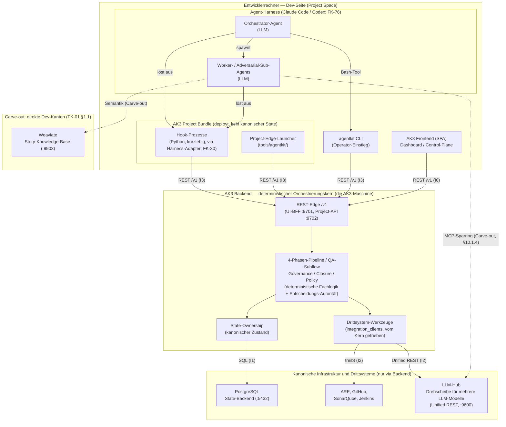
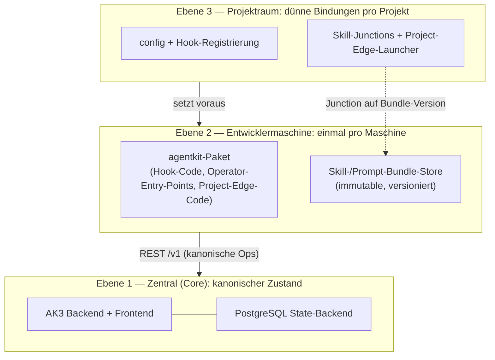
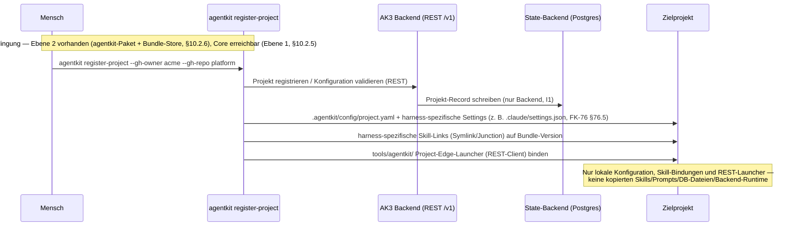

# 10 — Runtime, Deployment und Speicher

<!-- PROSE-FORMAL: formal.state-storage.entities, formal.state-storage.invariants, formal.skills-and-bundles.entities, formal.skills-and-bundles.invariants -->

## 10.1 Laufzeitkomponenten

### 10.1.0 Architektur-Leitbild: AK3 Backend als deterministischer Kern

Das **AK3 Backend** ist der **deterministische Orchestrierungs- und
Business-Kern** von AK3 — die Maschine, die Story-Ausführung,
Guardrails, QA, Telemetrie und Closure deterministisch orchestriert
(Kernauftrag, CLAUDE.md). Der Kern **besitzt** den kanonischen Zustand
(PostgreSQL ist sein Zustandsspeicher, nicht sein Zweck), **führt** die
4-Phasen-Pipeline, den QA-Subflow, Governance und Closure aus und
**treibt** die Drittsysteme (ARE, GitHub, SonarQube, Jenkins, LLM-Hub)
als untergeordnete Werkzeuge. Er ist **keine Durchreiche und keine
Service-Fassade**: Fachlogik, Kontrolle und Entscheidungs-Autorität
liegen im Kern, nicht in seinen Rändern.

**Dünn sind die Ränder, nicht der Kern.** Die Dev-Seite (Hook-Prozesse,
Project-Edge, CLI) und das Frontend sind **Clients/Edges**, die der Kern
über eine REST-API (`/v1`) bedient, überwacht und gated. Der **Harness**
(Claude Code / Codex; FK-76) ist die **Ausführungsfläche** für die
kreative Agentenarbeit (Implementierung durch LLM-Worker); der Kern
orchestriert, überwacht und prüft diese Arbeit — er ersetzt sie nicht
und delegiert seine Autorität nicht an sie. Intelligenz ist damit
zweigeteilt: generativ-kreativ in den Agenten, deterministisch-steuernd
und qualitätssichernd im Kern.

> **Begriffsabgrenzung.** „AK3 Backend" meint in diesem Dokument den
> **deterministischen AK3-Kern** (logischer zentraler Server). Das ist
> nicht zu verwechseln mit dem Python-Paket `agentkit.backend.*`, aus
> dem dieser Kern gebaut wird. Trust-Boundaries und Systemkontext sind
> normativ in **FK-01** verankert; FK-10 beschreibt deren Runtime-,
> Deployment- und Speicher-Realisierung.

**Normative Soll-Invarianten der Topologie (I1–I6):**

| ID | Invariante | Aussage |
|----|-----------|---------|
| **I1** | Postgres-Eigentum | Der Kern besitzt und beschreibt den kanonischen Zustand; PostgreSQL ist ausschließlich sein Speicher. Kein Dev-Prozess öffnet eine direkte DB-Verbindung. |
| **I2** | Drittsystem-Hoheit (AK3-verantwortete Vorgänge) | In von AK3 verantworteten Prozessen treibt **der Kern** ARE, GitHub, SonarQube, Jenkins und den LLM-Hub. Es geht **nicht** darum, dass die Dev-Seite Drittsysteme nie berührt — sondern dass sie es **innerhalb AK3-verantworteter Abläufe** nicht am Kern vorbei tut. |
| **I3** | Kanonische Ops nur via Kern | AK3-verantwortete kanonische Operationen (State, Gates, Phasenfortschritt) laufen ausschließlich per REST über den Kern — innerhalb dieser Vorgänge kein Bypass auf DB, Dienste oder kanonischen State. |
| **I4** | Direkt-Carve-out (FK-01 §1.1) | Direkter Dev→Infra-Zugriff ist auf den begrenzten **Carve-out** beschränkt: **Eigenbedarf des Agents** (z. B. Weaviate-Semantik, Ad-hoc-Einsicht, freiwilliges Harness-Sparring außerhalb AK3) oder von AK3 **explizit mandatierte** fs/worktree-gebundene Mechanik (z. B. `gh`/`git`). Katalog und Kriterien: FK-01 §1.1. |
| **I5** | Kein lokaler kanonischer State | Der Project Space hält nur das Bundle und projektlokale Konfiguration, keinen kanonischen Laufzeit-State. Lokale Laufzeitdateien sind ausschließlich Read-Projektionen. |
| **I6** | Frontend → Kern | Das AK3 Frontend spricht ausschließlich per REST mit dem Kern. |

Diese Invarianten sind **fail-closed**: Eine Dev-Komponente, die
**innerhalb eines AK3-verantworteten Vorgangs** DB, Drittsystem oder
kanonischen State am Kern vorbei berührt (außerhalb des Carve-out gemäß
FK-01 §1.1), ist ein Fehlbetrieb, kein Sollzustand.

**Abgrenzung — es geht um AK3-verantwortete Vorgänge.** I1–I6 binden,
was **AK3 verantwortet**: dort greift nur der Kern zu — bzw. der Agent
direkt, **wo AK3 ihm das Mandat für fs/worktree-gebundene Mechanik
erteilt**. Sie verbieten **nicht**, dass ein Harness-Agent im Carve-out
ein Drittsystem nutzt (freiwilliges Harness-Sparring §10.1.4,
Sonar/Jenkins-Einsicht, `gh`/`git`, ARE-Evidence). Hub-Sparring per MCP
ist Eigeninitiative des Harness-Agents, nicht AK3-mandatiert und nicht
Gate-relevant. FK-01 ist der normative Katalog dieser Kanten.

### 10.1.1 Prozesslandschaft

AgentKit besteht zur Laufzeit aus einer **dünnen Dev-Seite** (Bundle +
Harness im Project Space) und dem **zentralen AK3 Backend**, das DB und
Drittsysteme kapselt. Das Zielprojekt enthält keine kopierte
AgentKit-Runtime und keine kanonischen AgentKit-Zustandsdateien.



Durchgezogene Kanten sind AK3-verantwortete Standardpfade (über den
Kern). Gestrichelte Kanten sind direkter Dev-Zugriff im **Carve-out**
(außerhalb AK3-verantworteter Vorgänge oder von AK3 mandatiert); der
vollständige Katalog mit Zwei-Kriterien-Regel steht in **FK-01 §1.1**
(u. a. Weaviate-Semantik, Hub-Sparring per MCP, `gh`/`git`-Worktree-
Mechanik, Ad-hoc-Einsicht). Den LLM-Hub für **AK3-Bewertungen** treibt
der Kern über Unified REST (§10.1.4).

### 10.1.2 Prozesstypen

| Typ | Lebensdauer | Gestartet von | Rolle gegenüber dem Backend |
|-----|-------------|---------------|------------------------------|
| **AK3 Backend** (deterministischer Orchestrierungskern) | Dauerhaft | Zentrale Infrastruktur (`agentkit serve`) | Führt Pipeline/Verify/Closure/Governance aus und hält die Entscheidungs-Autorität; besitzt den kanonischen State (einzige Schreib-Autorität); treibt DB und Drittsystem-Werkzeuge |
| **Harness-Session** (Claude Code / Codex; FK-76) | Minuten bis Stunden | Mensch (CLI `claude` oder `codex`) | Orchestrator/Worker/Adversarial; ruft kanonische Operationen per REST über CLI/Project-Edge an |
| **Hook-Prozess** | Millisekunden | Harness (pro Tool-Call, via Harness-Adapter) | REST-Client des Backends; kein DB-/Drittsystem-Zugriff (I1/I2/I3) |
| **Project-Edge / CLI** | Sekunden bis Minuten | Agent via Bash-Tool oder Operator | Dünner REST-Client des Backends; keine eigene Fachlogik, keine zweite State-Quelle |
| **AK3 Frontend** | Dauerhaft (Browser-Session) | Mensch (`agentkit ui`) | REST-Client des Backends (I6) |
| **LLM-Hub** | Dauerhaft | Externe Infrastruktur | Drehscheibe (Provider) für mehrere LLM-Modelle; vom Kern über das Unified-REST-Interface getrieben (I2) |
| **MCP-Server** | Dauerhaft | Mensch oder Autostart | Story-Knowledge-Base Weaviate (Pflicht, I4), ARE (optional) |
| **Docker-Container** | Dauerhaft | `docker-compose up` | Weaviate + text2vec-transformers (Pflicht) |

### 10.1.3 Hook-Prozesse im Detail

Hooks sind die leistungskritischste Dev-Komponente. Sie werden bei
**jedem Tool-Call** als eigener Python-Prozess gestartet und müssen
schnell entscheiden — und tun das im Soll **ohne** direkten DB- oder
Drittsystem-Zugriff (I1/I2/I3).

**Lebenszyklus eines Hook-Aufrufs:**

1. Der Harness (Claude Code / Codex; FK-76) forkt einen Python-Prozess
2. Hook liest Tool-Call-Daten von `sys.stdin` (JSON)
3. Hook prüft Regeln (lokale Config + **Backend-REST-Lookups**, z. B.
   Guard-Counter, Run-/Lock-Status)
4. Hook meldet optional Telemetrie **per REST an das Backend**
5. Hook beendet sich: `exit(0)` = erlauben, `exit(2)` = blockieren

**Performance-/Latenz-Designregel.** Hooks müssen billig bleiben — nur
lokale, deterministische Operationen plus **eng begrenzte
Backend-REST-Aufrufe**. Keine LLM-Aufrufe, keine direkten DB-Verbindungen,
keine freien Netzwerk-Calls, keine aufwändigen Dateisystem-Scans.
Details in FK-30.

**Latenz-Strategie für den REST-Hop (DD-10B).** Der Millisekunden-Budget
des Hooks wird so gewahrt:

- Das Backend wird für Dev-Maschinen **ko-lokalisiert** (loopback) oder
  niedrig-latent angebunden; die Project-API (`:9702`) ist der
  maschinennahe Hook-/Edge-Endpunkt.
- **Sicherheitskritische Entscheidungen** (hält ein Lock? ist eine
  Guard-Schwelle überschritten? darf der Tool-Call passieren?) werden
  **am Backend bestätigt oder fail-closed blockiert** — niemals allein
  aus einer lokalen Projektion „erlaubt".
- Eine **lokale Read-Projektion** ist **nur** für **nicht-blockierende
  Statusanzeige** zulässig, mit definierter Max-TTL und **atomarer**
  Aktualisierung (materialisiert nach einem Backend-Call). Sie ist
  **niemals kanonisch** (I5) und nie Grundlage einer Erlaubnis-
  Entscheidung; bei stale/fehlend gilt Backend-Call oder fail-closed.
  Damit entsteht keine zweite operative Wahrheit.
- **Schreibende** Operationen (Telemetrie-Event, Counter-Inkrement,
  Lock-Mutation) gehen **immer** synchron ans Backend; ein nicht
  bestätigter Schreibpfad ist fail-closed (Tool-Call blockiert).

**Parallelität.** Der Harness ruft Hooks sequentiell auf (ein Hook pro
Tool-Call). Mehrere Sub-Agent-Sessions können parallel laufen, also
mehrere Hook-Prozesse gleichzeitig Backend-Requests stellen.
Konsistenz und Serialisierung sind Aufgabe des Backends, nicht des
Projekt-Dateisystems — präzise: Serialisierung erfolgt pro
deklariertem Objekt über durable Objekt-Mutation-Claims;
transaktionsgebundene DB-Locks decken nur Mutationen ab, die
vollständig in einer Transaktion liegen; Reads sind sperrenfrei
(§10.5.4).

### 10.1.4 LLM-Nutzung über den LLM-Hub (Unified REST)

AK3 bezieht alle LLM-Modelle über einen externen **LLM-Hub** — eine
**Drehscheibe (Provider) für verschiedene LLM-Modelle**. Welche Modelle
der Hub vorhält, ist für AK3 ohne Belang; entscheidend ist nur, dass der
Hub mehrere unterschiedliche Modelle hinter **einem einheitlichen
Interface** anbietet.

- AK3 nutzt den LLM-Hub ausschließlich über den FK-75-REST-Adapter.
  Das gilt für code-getriebene Bewertungsfunktionen ebenso wie für
  Adjudication- und Feindesign-Vorgänge.
- Der LLM-Hub ist ein Drittsystem-Werkzeug und wird für kanonische
  AK3-Bewertungs- und Adjudication-Vorgänge vom **AK3-Kern** über REST
  getrieben (I2). Es gibt keine direkte Dev→Hub-Kante und keine
  modellindividuellen Endpunkte für diese Vorgänge; der Kern adressiert
  immer dasselbe Hub-REST-Interface.
- LLM-getriebene AK3-Fachlogik (z. B. QA-Schicht-2-Bewertungen,
  Conflict-Adjudication, Governance-Adjudikator, Exploration-Fine-Design)
  läuft über genau diesen REST-Pfad und ist dadurch zentral
  auditierbar.

> **Abgrenzung Harness-Eigenbedarf.** Ein Harness-Agent (Claude Code /
> Codex) darf sich aus eigener Intention eine Zweitmeinung über
> harness-eigene Mechanismen holen. Dieser Pfad ist kein
> AK3-Architekturpfad, nicht AK3-mandatiert, nicht Gate-relevant und
> wird von AK3 nicht spezifiziert. Für AK3 zählt der REST-Pfad über
> FK-75.

## 10.2 Deployment-Modell

### 10.2.0 Die drei Installationsebenen (Dreifaltigkeit)

AK3 wird auf **drei klar getrennten Ebenen** installiert. Jede Ebene hat
eigenen Inhalt, eigenen Installationsweg sowie eigene Update- und
Uninstall-Semantik. Diese Trennung ist verbindlich; „der Installer" ohne
Qualifizierung meint immer **nur Ebene 3**.

| # | Ebene | Was liegt dort | Installationsweg | Update | Uninstall |
|---|-------|----------------|------------------|--------|-----------|
| **1** | **Zentral (Core)** | AK3 Backend + Frontend + Postgres-State-Backend | **Eigene Bootstrap-Routine mit manuellen Anteilen** (kein Checkpoint-Installer), §10.2.5 | Ops-getrieben (§10.2.8) | Core-Decommission = State-Stilllegung (§10.2.9) |
| **2** | **Entwicklermaschine** | systemweites `agentkit`-Paket (Hook-Code, Operator-Entry-Points, Project-Edge-Code) **+** immutable Skill-/Prompt-Bundle-Store | systemweite Paket- + Bundle-Installation, §10.2.6 | `agentkit update` zieht neue Paket-/Bundle-Version (§10.2.8) | Maschinen-Uninstall (§10.2.9) |
| **3** | **Projektraum** | dünne projektlokale Bindungen: config, Hook-Registrierung, Skill-Junctions, Project-Edge-Launcher | `agentkit register-project` (Checkpoint-Installer, FK-50), §10.2.1 | Re-Bind / Re-Run (FK-51) | Projekt-Detach (§10.2.9) |

**Abhängigkeitsrichtung:** Ebene 3 setzt Ebene 2 voraus; Ebene 2 setzt
für kanonische Operationen Ebene 1 voraus. **Kanonischer Zustand lebt
nur auf Ebene 1** (Postgres); Ebene 2 hält nur austauschbare,
versionierte Artefakte; Ebene 3 hält nur Bindungen/Config. Daraus folgt
die Uninstall-Grundregel (§10.2.9): **eine niedrigere Ebene darf beim
Entfernen niemals kanonischen Zustand einer höheren Ebene löschen.**



### 10.2.1 Ebene 3 — Projektraum-Registrierung (Checkpoint-Installer)

Dies ist **Ebene 3** der Dreifaltigkeit (§10.2.0). Das `agentkit`-Paket
liegt zu diesem Zeitpunkt bereits systemweit vor (Ebene 2, §10.2.6); der
Checkpoint-Installer (FK-50) registriert nun ein Zielprojekt **über das
Backend** und schreibt projektlokal nur Konfiguration und Bindungen —
keinen kanonischen State:



**Keine Docker-Abhängigkeit für AgentKit selbst.** Docker wird für
Pflicht-Infrastrukturdienste benötigt (Weaviate).

### 10.2.2 Laufzeitabhängigkeiten

| Abhängigkeit | Pflicht/Optional | Prüfung |
|-------------|-----------------|---------|
| Python 3.14 (Mindestanforderung) | Pflicht | Installer Checkpoint 1 |
| Git ≥ 2.30 | Pflicht | Installer Checkpoint 2 |
| Provider-CLI-Werkzeuge (z. B. `gh` bei GitHub) — nur im Provider-Adapter-Rahmen (FK-12 §12.1); die beauftragte Git-Mechanik des Project Edge nutzt die `git` CLI | Optional (provider-abhaengig) | Installer Checkpoint 2 (nur wenn Provider-Adapter sie erfordert) |
| AK3 Backend erreichbar (REST /v1) | Pflicht | Installer Checkpoint CP7 (State-Backend + Control-Plane erreichbar) |
| Agent-Harness (Claude Code oder Codex; FK-76) | Pflicht (mindestens einer) | Voraussetzung (nicht geprüft) |
| LLM-Hub (Unified REST) | Pflicht: Drehscheibe muss mind. zwei verschiedene LLM-Modelle zusätzlich zu Claude bereitstellen (Schicht 2 fordert verschiedene Modelle für QA-Review und Semantic Review) | Integrity-Gate bei Closure prüft konfigurierte `llm_roles` gegen Telemetrie |
| Weaviate + MCP-Wrapper | Pflicht | Installer Checkpoint 9 |
| ARE (MCP, **vom Backend** vermittelt) | Optional (`are: true`) | Installer prüft Erreichbarkeit des MCP-Servers |
| SonarQube (Community Build ≥ `min_version`, **vom Backend** vermittelt) | **Pflicht fuer codeproduzierende Projekte mit `sonarqube.available: true`** (`sonarqube.enabled: true`; impl/bugfix-Stories); Optional fuer reine Concept-/Research-Projekte **sowie fuer Projekte mit `sonarqube.available: false`** (dann ist das Gate NOT_APPLICABLE, FK-33 §33.6.5 — Betreiber akzeptiert bewusst keine Sonar-Durchsetzung) | Installer Checkpoint CP 10d (Verfuegbarkeit + Mindestversion + Creds) **plus Jenkins-basierter Branch-Plugin-Conformance-Self-Test** (FK-50); Gate-Semantik FK-33 §33.6.3 |
| └─ Community Branch Plugin | **Pflicht (Sub-Abhaengigkeit von SonarQube)** — Community Edition hat keine native Branch-Analyse; ohne Plugin ist das Green-Gate auf Branches/Pre-Merge nicht durchsetzbar (FK-33 §33.6.3) | Installer CP 10d: Plugin-Existenz + Mindestversion + Conformance-Self-Test ueber den konfigurierten Jenkins-Scanpfad (nur dann Trust-A-faehig) |

**LLM-Modell-Anforderung im Detail:**

AK3 fordert neben Claude mindestens ein weiteres, idealerweise zwei
weitere LLM-Modelle aus dem Hub. Welche konkreten Modelle der Hub
vorhält, ist austauschbar; maßgeblich ist allein die Rollen-Abdeckung:

| Verfügbare Modelle | Bewertung |
|--------------|-----------|
| Nur Claude | Unzulässig — Multi-LLM ist Pflicht |
| Claude + 1 Modell | Unzulässig — Schicht-2-Verify fordert zwei verschiedene Modelle für QA-Review und Semantic Review |
| Claude + 2 Modelle | Minimum — qa_review und semantic_review auf verschiedenen Modellen |
| Claude + ≥3 Modelle | Empfohlen — maximale Diversität |

Die `llm_roles`-Konfiguration in `project.yaml` ordnet Rollen konkreten
Hub-Modellen zu. Das Integrity-Gate prüft bei Closure, dass für jede
konfigurierte Rolle mindestens ein `llm_call`-Event mit dem zugeordneten
Modell in der Telemetrie vorliegt.

### 10.2.3 Der deterministische Kern liegt im Backend

AgentKit hat **keine kanonische projektlokale Runtime**. Die gesamte
deterministische Fachlogik (4-Phasen-Pipeline, QA-Subflow, Closure,
Governance, Policy) ist **der AK3-Kern** und läuft im Backend; sie ist
über REST (`/v1`) erreichbar, aber ihre Autorität wird nicht nach außen
delegiert. Projektseitig laufen nur:

- Kurzlebige Aufrufe des `agentkit`-Pakets — die Operator-Entry-Points
  und der Project-Edge-Launcher (dünne REST-Clients, keine eigene
  Fachlogik). „CLI" meint diese Paket-Entry-Points, kein separat
  installiertes Artefakt.
- Kurzlebige Hook-Prozesse (PreToolUse/PostToolUse; REST-Clients)
- Zugriff auf Projektcode und Projektkonfiguration

Der projektlokale **Project-Edge-Launcher** unter `tools/agentkit/` ist
ein Convenience-Einstieg für Agents. Er darf als Script oder natives
Executable materialisiert werden; auch ein Aufruf mit vorgeschaltetem
Interpreter, z. B. `python tools/agentkit/projectedge.py ...`, ist
zulässig, solange die fachlichen Subcommands und Parameter stabil und
einfach bleiben. Der Launcher ist **nur dünner Adapter** auf die
Control-Plane-REST-API des Backends; er ist keine projektlokale Runtime
und keine zweite Quelle für Zustand, Skills, Prompts, Fachlogik oder
Befehlssemantik.

Der kanonische AgentKit-Zustand liegt im zentralen **State-Backend**
(PostgreSQL), das **ausschließlich vom AK3 Backend** beschrieben wird
(I1). Es trennt Laufzeitdaten vom Projekt-Repository, stellt Retention
sicher und erzwingt Rollenrechte gegenüber Orchestrator und Worker.

### 10.2.4 Deployment-Topologie (Ko-Lokalisierung vs. Remote)

Das AK3 Backend ist ein **logisch zentraler** Service. Seine physische
Platzierung ist topologie-agnostisch:

- **Loopback-Ko-Lokalisierung:** Backend läuft auf derselben Dev-
  Maschine (z. B. `127.0.0.1`), erreichbar über die Control-Plane-Ports
  (§10.7). Default für Einzelplatz-Entwicklung; erfüllt die
  Hook-Latenzanforderung (DD-10B) am einfachsten.
- **Remote-Trennung:** Backend läuft auf einem separaten Host
  (zentraler Server) für mehrere Dev-Maschinen.

In **beiden** Fällen ist die **REST-/Trust-Boundary invariant**: Die
Dev-Seite spricht nur über `/v1` mit dem Backend (I3/I6), unabhängig
davon, wo das Backend physisch läuft. `project_root` ist dabei ein
rein backend-lokaler State-Anker (§10.2.4a); die Worktrees liegen in
beiden Topologien dev-lokal — Loopback-Ko-Lokalisierung ändert daran
nichts (§10.2.4a).

### 10.2.4a Worktree-Topologie: dev-lokal (Akteursmodell und Ausführungsort)

**Normative Topologie-Regel (PO-Entscheidung 2026-07-02):** Worktrees
leben im Projektverzeichnis, das physisch auf dem Dev-Rechner
existiert. **AgentKit darf niemals annehmen, dass es backend-seitig
physischen Zugriff auf einen Worktree hat.** Co-located Zugriff (etwa
in der Loopback-Installation, §10.2.4) ist Zufall der Installation,
kein Betriebsmodell — es gilt **ein** Modell für beide
Installationsformen. Begründung: Ein zentrales Backend mit
backend-lokalen Worktrees würde erzwingen, dass die Harnesse auf dem
Server laufen; Menschen könnten nie lokal arbeiten, und
Mehrentwickler-Parallelität (jeder Entwickler bearbeitet seine Stories
auf seiner Maschine) wäre unmöglich.

**Akteursmodell für physische Worktree-Operationen:** ausschließlich

1. der **Agent** (Codearbeit),
2. der **Project Edge** (führt vom Backend beauftragte, eng umrissene
   Kommandos lokal aus und meldet Ergebnisse; Auftragsvertrag:
   FK-91 §91.1b), oder
3. **niemand** — Designs ohne Worktree-Interaktion des Systems sind
   vorzuziehen.

Das Backend kennt Branch-Refs, SHAs und Edge-Meldungen — nie das
Dateisystem.

**Ausführungsort-Grundsatz:** Jede physische Git-/Worktree-Operation
eines AK3-verantworteten Ablaufs läuft entweder (a) als
**Edge-Auftrag** (Auftrag/Meldung über die Edge-Command-Queue,
FK-91 §91.1b), (b) über den **gepushten Stand** — Ref-Reads und
Push-Verifikation bevorzugt via provider-neutralem git-Protokoll
(`git ls-remote`, kein Worktree nötig), Compare/Change-Evidence über
den schmalen Provider-Adapter oder Edge-gemeldet (FK-12 §12.1,
Provider-Neutralität) — oder (c) **entfällt**. Backend-seitige
Subprocess-Git-Zugriffe, physische Worktree-Pfadableitungen und
Governance-Writes in Worktrees sind Fehlbetrieb, kein Sollzustand.

**workspace_locator-Trennung:** `project_root` ist ein **reiner
backend-lokaler State-Anker** (AK3-Laufzeitdaten); eine
Worktree-Anker-Rolle hat er nicht — sie entfällt ersatzlos. Physische
Worktree-Pfade sind ausschließlich die **Edge-gemeldeten
`worktree_roots`** der jeweiligen Session (FK-56 §56.8); das Backend
leitet niemals selbst Worktree-Pfade ab.

### 10.2.4b Pushed-only und Sync-Punkte (Hybrid)

**Pushed-only-Regel (PO-Entscheidung 2026-07-02):** Alles, was nicht
auf den Story-Branch committed **und** gepusht ist, ist für AgentKit
de facto nicht existent und niemals übernahmefähig.
Committed-aber-ungepusht ist rechnerlokal und zählt genauso wenig wie
uncommittete Änderungen. Das ist eine bewusste Designentscheidung mit
akzeptiertem **Verlustkorridor**: Bei einem Ownership-Transfer geht
Arbeit seit dem letzten Push aus AgentKit-Sicht verloren (Transfer-
und Quarantäne-Mechanik: FK-56 §56.13c/§56.13e). Das Übergabeobjekt
eines Transfers ist ein **SHA**, nie ein Dateizustand. Die Sync-Punkte
machen den Korridor klein und bekannt; sie heben ihn nicht auf.

**Sync-Punkte (Hybrid-Modell):** Der Edge pusht den Story-Branch an
definierten Punkten und meldet den Head-SHA ans Backend
(Branch-Ref-Meldung, FK-91 §91.1b):

- **Harte Push-Barrieren (Pflicht, fail-closed):** Phasen-Abschlüsse
  (`completion.push`, FK-33), QA-Zyklus-Grenzen, Yield-Points,
  Closure-Eintritt. Ohne erfolgreichen Push kein Phasen-Abschluss.
  Die Verifikation erfolgt als Edge-Erhebung **plus** serverseitige
  Verifikation gegen das Code-Backend (Ref-Read) — nie allein aus der
  lokalen Erhebung.
- **Opportunistische Pushes (best-effort, queued):** nach jedem
  AK3-registrierten Commit. Scheitern blockiert die lokale Arbeit
  nicht, ist aber sichtbarer Zustand (Push-Rückstand).

Die **Push-Frische** (letzter gemeldeter Head-SHA + Zeitpunkt) ist
Teil der Eigentumslage-Anzeige und des Takeover-Challenge
(FK-56 §56.13c). Kein Sync-Punkt löst je Ownership-Wirkungen aus —
Stille/Frische ist Information, nie Entscheidung (Kap. 02.7).

**WIP-Ref-Push ist verworfen:** Ein Push uncommitteter Stände als
eigener Ref würde Nicht-Existentes existent machen (Widerspruch zur
Pushed-only-Regel), kollidiert mit dem Branch-Guard (Ziel-Ref ungleich
`story/{story_id}`) und schafft Governance-Risiken (Secret-Leaks aus
uncommitteten Ständen, Ref-Hygiene).

Scheitert eine harte Push-Barriere dauerhaft (Remote nicht
erreichbar), läuft die lokale Arbeit weiter; der Phasen-Abschluss
bleibt fail-closed blockiert und der Push-Rückstand sichtbar.

### 10.2.5 Ebene 1 — Bootstrap des zentralen Core

Der zentrale Anteil (Backend + Frontend + Postgres-State-Backend) hat
**eine eigene Installationsroutine** — bewusst **ohne** den
hochentwickelten Checkpoint-Installer der Ebenen 2/3. Er wird mit
**manuellen Anteilen** zentral hochgezogen:

- **Voraussetzung (nicht durch AK3 provisioniert):** eine erreichbare
  PostgreSQL-Instanz auf 5432 (§10.7.1). AK3 startet/provisioniert sie
  nicht.
- **Operative Schritte (teils manuell):** `agentkit`-Paket auf dem
  Core-Host installieren → State-Backend-Schema anlegen/migrieren →
  Backend als Dienst starten (`agentkit serve --ui-bff`,
  `agentkit serve --project-api`) → Frontend bereitstellen
  (`agentkit ui`) → Erreichbarkeit verifizieren.
- **Topologie:** Loopback (Einzelplatz) oder dedizierter Server
  (Team) — §10.2.4; der Installationsweg ist in beiden Fällen derselbe.
- **Abgrenzung:** `agentkit register-project` (Ebene 3) **setzt einen
  laufenden Core voraus** (CP7) und installiert ihn nicht. Ein
  fehlender/nicht erreichbarer Core lässt CP7 fail-closed scheitern.

Für Ebene 1 gibt es bewusst keinen idempotenten Checkpoint-Engine-Lauf.
Normative Pflichtbestandteile sind die **DB-Migrationsschritte** und die
**Min-Client-Politik** (§10.2.7/§10.2.8); der übrige Ablauf ist
dokumentierter manueller Betrieb.

### 10.2.6 Ebene 2 — Provisionierung der Entwicklermaschine

Pro Entwicklermaschine liegt **genau einmal physisch** vor:

- das systemweite **`agentkit`-Paket** (`pip install agentkit`) — enthält
  Hook-Code, Operator-Entry-Points und den Project-Edge-Launcher-Code;
- der **Skill-/Prompt-Bundle-Store** — immutable, versioniert, mehrere
  Versionen nebeneinander (z. B. `…\bundles\<version>\<profile>\…`,
  FK-43).

Sinn der „einmal pro Maschine"-Regel: Aktualisieren heißt **eine**
physische Kopie pflegen, nicht N Projektkopien (§10.2.8). Projekte
(Ebene 3) verweisen per Junction auf eine **konkrete** Bundle-Version;
ein globales `current` gibt es nicht — so können parallele Projekte
unterschiedliche Versionen pinnen, ohne sich zu stören.

Die Provisionierung der Maschinen-Ebene ist **Voraussetzung** der
Projekt-Registrierung (Ebene 3); der Projekt-Installer installiert den
Store nicht, er bindet nur dagegen
(`installer.invariant.system_installation_precedes_project_registration`).

### 10.2.7 Versionsverträge und Kompatibilität

AK3 führt **drei operative Versions-Achsen** plus zwei Daten-Contracts:

| Achse | Geltung | Inhalt |
|-------|---------|--------|
| **Agent-Runtime** | Ebene 2 | ein SemVer des `agentkit`-Pakets (Hook-Code + Operator-Entry-Points + Project-Edge) |
| **Skill-/Prompt-Bundle** | Ebene 2→3 | immutable Version/Hash, pro Projekt gepinnt (FK-43/FK-44) |
| **Wire `/v1`** | Ebene 3↔1 | statische REST-Grenze; ein Bruch erzeugt `/v2`, keine In-Place-Änderung |
| `config_version` | Ebene 3 | Parse-Zeit-Contract der `project.yaml` (FK-03) |
| `schema_version` | Ebene 1 | Daten-Contract der Artefakte (FK-03/FK-18) |

`config_version`/`schema_version` sind **keine** Teilnehmer des
dev↔central-Handshakes; sie sind Parse- bzw. Daten-Contracts.

**dev↔central-Kompatibilität wird über das `/v1`-Interface verhandelt**
(Detailvertrag in FK-91): Jeder Dev→Backend-Request trägt die
Agent-Runtime-Version (und das gebundene Skill-Bundle); das Backend prüft
gegen ein unterstütztes Fenster `[min, max]` und antwortet mit
`recommended`/`blocked`-Hinweisen. Heute existiert nur der statische
`/v1`-Präfix ohne Aushandlung — dieser Handshake ist die normative
Ergänzung. Die Manifest-Autorität bleibt zentral (`project_registry`:
`registered_bundle_version` + `config_digest`); ein projektlokales
**Lockfile** ist erlaubt als **Config/Pinning** (kein Laufzeit-Anker,
daher kein Widerspruch zu §10.3.1).

### 10.2.8 Update (Treibermodell)

Deployment ist **nicht** einmalig. Das Treibermodell ist **hybrid**:

- **Der Core annonciert, die Dev-Maschine zieht und aktiviert selbst.**
  Das Backend teilt über `/v1` `min`/`recommended`/`blocked`-Versionen
  mit (Header bzw. Compat-Endpunkt, FK-91); die Aktualisierung führt die
  Dev-Maschine per `agentkit update` lokal aus (Paket- und/oder
  Bundle-Version). **Kein Server-Push von Executables** — das wäre
  Remote-Code-Ausführung über die Trust-Boundary, gerade für Hook-Code.
- **Kompatibilitätsreaktion (fail-closed by default):**
  - **ERROR / fail-closed (z. B. HTTP 426):** Agent-Runtime unter `min`
    oder in `blocked`; Wire nicht unterstützt; fehlender Handshake an
    Governance-/mutierenden Endpunkten; `config_version`/`schema_version`
    nicht lesbar; Skill-Hash/Signatur ungültig. **Ein Hook, der seine
    Kompatibilität nicht belegen kann, liefert kein PASS.**
  - **WARNING (Request läuft):** Runtime unter `recommended` aber im
    Fenster; veraltetes-aber-erlaubtes Skill-Bundle; migrierbare
    `config_version`.
- **Skills brechen nie hart** (außer Integritätsbruch): ein zentral als
  veraltet markiertes Skill-Bundle bricked ein Altprojekt nicht; der
  Core weist hin, blockiert aber nicht.
- **Re-Install-Pflicht:** Nach Paket-/Bundle-Update sind laufende
  Harness-Sessions **neu zu starten** (Two-Stage-Skill-Load, FK-43).
- **Ebene-1-Update:** Backend-/DB-Migration ist ops-getrieben und
  explizit; **vor** einem Core-Rollout wird die `min`-Client-Politik
  gesetzt, damit kein zu altes Dev-Paket gegen einen neuen Core läuft.

Per-Ebene-Treiber: Ebene 1 = Ops/Operator; Ebene 2 = Entwickler per
`agentkit update` (auf Server-Hinweis); Ebene 3 = deliberater
Re-Bind/Re-Run (FK-51).

### 10.2.9 Uninstall und Decommission

Entfernen erfolgt **pro Ebene** mit getrennten Verben. **Grundregel:
eine niedrigere Ebene löscht niemals kanonischen Zustand einer höheren.**

| Verb | Ebene | Entfernt | Bewahrt | Schutz |
|------|-------|----------|---------|--------|
| **Projekt-Detach** | 3 | Skill-Junctions, AK3-Hook-Registrierung (nur AK3-Blöcke), Project-Edge-Launcher, `.agentkit/`-Bindungen | Projektcode, fremde Hooks, **zentraler State des Projekts** | Junction nur via `unlink`/`rmdir` nach `isjunction`-Check, nie `rmtree` durch den Link (FK-43) |
| **Maschinen-Uninstall** | 2 | `agentkit`-Paket, Bundle-Store, Shims | gebundene Projekte (Repos) | Vor Entfernen einer Bundle-Version: gepinnte Projekte als **orphaned** warnen |
| **Core-Decommission** | 1 | Backend-/Frontend-Dienste, ggf. DB | — | **Destruktiv**: nur nach expliziter Bestätigung **und Pflicht-Export** des State-Backends (Audit-Trail, Closure-Records, QA-Ergebnisse) |
| **Projekt-Löschung** | 1 | kanonischer State eines Projekts (zentral) | — | **Destruktiv**: explizite Bestätigung **und Pflicht-Export** des projektbezogenen State (Audit/Closure/QA) vor der Löschung; nicht-destruktive Alternative bleibt **Archivierung** (DK-14) |

Footguns (verbindlich vermeiden): rekursives Löschen **durch** eine
Junction (zerstört den zentralen Store); verwaiste Hook-Registrierungen,
die auf entfernte Hooks zeigen (Harness-Session bricht) → Detach muss
AK3-Settings-Blöcke chirurgisch entfernen; Kopplung von DB-Volume-Löschung
an Dienst-Uninstall (`down -v`) ist verboten. Ephemeres Runtime-Cleanup
(Worktrees, Locks, Read-Projektionen) ist davon getrennt (§10.4.2) und
**kein** Uninstall.

### 10.2.10 Identität (dev↔central) und Offline-Verhalten

- **Identität / Auth:** Spricht die Dev-Maschine mit einem entfernten
  oder geteilten Core, authentifiziert sie sich gegenüber dem Backend.
  Der normative Vertrag (Mechanismus, Tenant-Scope, Credential-Ablage)
  ist in **FK-15 §15.10** geführt: Strategen-Login per Cookie-Session
  (UI-BFF), Thin-Client per Bearer-Token (Project-API). FK-10 hält nur
  die Ablage-Invariante fest: **Credentials liegen nie in der
  Versionsverwaltung** — das Strategen-Passwort maschinenweit
  (`~/.config/agentkit/…` o. ä.), das projektgebundene Thin-Client-Token
  projektlokal, aber gitignored und mit eingeschränkten Rechten
  (`.agentkit/credentials`, FK-15 §15.10.4). Ein gitignoredtes
  Credential ist projektlokale Konfiguration, kein kanonischer
  Laufzeit-State (I5).
- **Offline-Verhalten:** Ist der Core nicht erreichbar, sind kanonische
  Operationen **fail-closed** (§10.6.1): Hooks blockieren, CLI/Edge
  brechen ab. Lokale Read-Projektionen (§10.1.3) dürfen für reine
  Status-Ansicht gelesen werden, werden aber **nie zur Ersatzwahrheit**
  (I5). Einen Offline-Schreibpfad auf kanonischen Zustand gibt es nicht.

## 10.3 Verzeichnisstruktur

### 10.3.1 Minimale Zielprojekt-Registrierung

Die minimale Registrierung installiert nur die AgentKit-Bindungen, die
für ein bestehendes Zielprojekt erforderlich sind. Sie erzwingt keine
fachliche Projektstruktur für Source-Code, Konzepte, Eingaben oder
Guardrails. Dieser Modus ist der Default für Bestandsprojekte und für
Projekte mit eigener Soll-Struktur.

```
{projekt-root}/
├── .agentkit/                      # Harness-neutraler AK3-Konfigurationspfad
│   └── config/
│       └── project.yaml            # Projektspezifische AgentKit-Konfiguration
├── .claude/                        # Beispiel: Claude-Code-Adapter (FK-76)
│   ├── settings.json               # Hook-Registrierung (Claude Code)
│   └── skills/                     # Links (Symlink/Junction) auf systemweite Skill-Bundles (Claude Code)
├── .codex/                         # Beispiel: Codex-Adapter (FK-76)
│   └── config.toml                 # Hook-Registrierung (Codex)
│
└── <Projektdateien>                # Quellcode, Tests, Build-Dateien
```

> **CCAG-Permission-Konfiguration.** Permission-/Policy-**Regeln**
> sind projektlokale Konfiguration; ihr Ablageort ist in FK-42
> normiert. Permission-**Requests/Leases** sind hingegen kanonischer
> Laufzeit-State und liegen zentral im Backend-State (I5), nicht in
> einer projektlokalen DB. Siehe FK-42.

Der Installer registriert beide Harnesses parallel (FK-76 §76.7).
Die jeweils harness-spezifischen Verzeichnisse werden vom zugehörigen
Adapter beschrieben.

**Projektlokal weiterhin vorgesehen, aber nicht kanonisch:**
- harness-spezifische Skill-Links (z. B. `.claude/skills/` fuer Claude Code) als Link-Bindung (Symlink auf POSIX, Directory Junction auf Windows) auf systemweite, versionierte Bundles

**Nicht mehr im Projekt vorgesehen:**
- keine projektlokalen Telemetrie-DBs
- keine projektlokalen kanonischen CCAG-/Permission-DBs
- keine AgentKit-`_temp/`-Zustandsverzeichnisse als Source of Truth
- keine kopierten Prompt-/Skill-/Schema-Bundles
- kein Installations-Manifest als Laufzeitanker

### 10.3.1a Optionales Default-Zielprojekt-Scaffold

Für leere Neuprojekte kann der Installer zusätzlich ein binäres
Default-Scaffold anlegen. Die Entscheidung ist **an/aus**, keine
interaktive freie Ordnerauswahl. Das Scaffold ist **opt-in**: Wird es
nicht explizit aktiviert, entstehen die folgenden fachlichen Ordner
nicht automatisch.

```
{projekt-root}/
├── concepts/                       # Projektspezifische Konzepte und normative Soll-Dokumente
├── codebase/                       # Ablage externer oder separater Code-Repositories
│   ├── frontend/                   # optionales Repo, wenn beim Install angegeben
│   └── backend/                    # optionales Repo, wenn beim Install angegeben
├── temp/                           # Projektlokaler Arbeitsbereich ohne Persistenzanspruch
├── input/                          # Externe Beistellungen und Kundendokumente
│   └── _meetings/                  # Meeting-Unterlagen nach Datum und Titel
├── guardrails/                     # Projekt- und organisationsspezifische Guardrails
└── stories/                        # Lokaler Story-Export und projektnaher Story-Arbeitsraum
```

**Repository-Modus und Git-Regeln des Default-Scaffolds:**

- `concepts/`, `guardrails/`, `input/` und `stories/` sind
  persistente Projektinhalte und werden nicht automatisch ignoriert.
- `codebase/` wird **nur im Multi-Repo-Modus** im Root-Repository
  ignoriert. Darunter liegende Unterordner koennen dann eigenstaendige
  Git-Repositories sein und besitzen ihre eigene Versionierung.
- Im Single-Repo-Modus ist `codebase/` normaler, versionierter
  Source-Bereich des Root-Repositories und darf nicht in `.gitignore`
  eingetragen werden.
- `temp/` wird im Root-Repository ignoriert. Es ist für
  agenten- oder menschengetriebene Zwischenstände gedacht, die über
  mehrere Sessions nützlich sein können, aber keinen normativen
  Persistenzanspruch haben.
- Leere, versionierbare Scaffold-Ordner muessen durch einen neutralen
  Platzhalter (`.gitkeep`) materialisiert werden, damit die Default-
  Struktur auch in Git sichtbar bleibt. Das gilt fuer `concepts/`,
  `guardrails/`, `input/`, `input/_meetings/`, `stories/` und im
  Single-Repo-Modus fuer `codebase/`. `temp/` erhaelt keinen Platzhalter.

**Repository-Anbindung:** Der Installer muss beim Default-Scaffold den
Repository-Modus ermitteln: `single_repo` oder `multi_repo`. Im
Single-Repo-Modus zeigt `repositories[]` auf den im Root-Repository
versionierten Codebereich (normalerweise `codebase`). Der Installer
legt darunter keine sprach- oder framework-spezifischen Unterordner an.
Im Multi-Repo-Modus muss der Operator die einzubindenden Code-
Repositories explizit angeben, z. B. `frontend` und `backend`. Der
Installer schreibt diese Repositories als `repositories[]` mit Pfaden
unter `codebase/{repo-name}`. Er darf nur fuer diese explizit
angegebenen Repositories passende Unterordner anlegen und, wenn ein
Remote angegeben ist, in diese Zielordner klonen. Er erfindet keine
synthetischen Repo-Namen wie `app` und erzeugt kein Remote-Repository
ohne expliziten Auftrag. Bei Re-Runs werden bereits vorhandene gueltige
Repo-Ordner nicht veraendert, sondern uebersprungen. Nicht leerer
Zielpfad ohne erkennbaren Git-Repo-Zustand ist fail-closed.

**Guardrail-Auslieferung:** Projektübergreifende AgentKit-Guardrails
bleiben systemweit versioniert. Das Zielprojekt erhält nur
projektspezifische Guardrails oder explizit gebundene Projektionen
unter `guardrails/`. Ob diese Projektionen Kopien, Symlinks oder
Junctions sind, ist Installer-/Plattformdetail und wird nicht durch
ein eigenes `project.yaml`-Auflösungsfeld gesteuert. Autoritativ für
die projektlokale Suche sind `guardrails_dir` und `guardrails_pattern`;
autoritativ für projektübergreifende Guardrail-Bundles bleibt die
systemweite AgentKit-Installation.

### 10.3.2 Verzeichnis- und State-Ownership

Kanonischer Zustand wird **ausschließlich vom AK3 Backend**
geschrieben (I1). Dev-seitige Komponenten sind **Anforderer per REST**,
nicht Schreiber. Die folgende Tabelle nennt darum als „Schreiber" die
fachlich auslösende Rolle und in Klammern den tatsächlichen
Persistenz-Akteur.

| Bereich | Schreiber (Persistenz-Akteur) | Leser | Schutz |
|-------------|----------|-------|--------|
| State-Backend: Workflow-State | Pipeline-Fachlogik im Backend (Backend) | Orchestrator, QA, Status-Abfragen (REST) | Rollen- und Principal-basierte Rechte; kein Direkt-DB-Zugriff (I1) |
| State-Backend: Telemetrie | Hooks/Pipeline melden per REST (Backend) | Integrity-Gate, Postflight, Governance (REST) | Zentraler Audit-Trail; Append über Backend |
| State-Backend: Governance/Locks | Governance-Fachlogik im Backend (Backend) | Hooks (REST-Read, ggf. Read-Projektion) | Nur Backend mutiert; Dev-Seite nur lesend |
| State-Backend: CCAG Permission-Requests/Leases | Governance-Fachlogik im Backend (Backend) | Frontend-Inbox, Hooks (REST) | Kanonisch zentral (kein projektlokaler SQLite-Owner; FK-42) |
| State-Backend: Failure Corpus | Governance-Beobachtung, Pipeline (Backend) | Failure-Corpus-Engine (REST) | Append-only, permanent |
| Drittsystem-Zugriffe (ARE, GitHub, Sonar, Jenkins, LLM-Hub) | — | — | Kanonische AK3-Vorgänge über Backend-Adapter (I2); direkte Zugriffe nur im FK-01-Carve-out |
| Systemweite Skill-/Prompt-Bundles | AgentKit-Installer | Agents (read-only via Projekt-Link) | Versioniert, immutable pro Bundle-Version |
| harness-spezifische Skill-Links (z. B. `.claude/skills/` fuer Claude Code; FK-76) | Installer | Harness / Agents | Nur Link-Bindung (Symlink/Junction), kein kanonischer Inhalt |
| `.agentkit/config/project.yaml` | Mensch, Installer | Alle Pipeline-Komponenten | Menschlich editierbar |
| Lokale Read-Projektionen (z. B. `.agent-guard/`, `_temp/governance/`) | Project-Edge nach Backend-Call (Dev) | Hooks/Agents | **Nicht kanonisch** (I5); verwerfbar, kurze TTL |
| `concepts/` | Mensch, Konzept-Autor, freigegebene Agenten | Story-Creation, Retrieval, Review, Verify | Versionierter normativer Konzeptkorpus des Zielprojekts |
| `codebase/` im Single-Repo-Modus | Mensch, Implementierungs-Agenten, Build-Tools | Pipeline, CI, Verify, Agents | Versionierter Source-Bereich des Root-Repositories |
| `codebase/` im Multi-Repo-Modus | Mensch, Repo-Checkout/Bindung, Implementierungs-Agenten in Unter-Repos | Pipeline, CI, Verify, Agents | Root-Repo ignoriert `codebase/`; Unterordner sind eigene Repositories |
| `temp/` | Mensch, Agents | Mensch, Agents | Projektlokaler Arbeitsbereich ohne Persistenzanspruch; im Root-Repo ignoriert |
| `input/` | Mensch, Fachexperten, Projektassistenz | Mensch, Story-Creation, Retrieval nach expliziter Einbindung | Versionierte externe Beistellungen, soweit das Projekt sie persistieren darf |
| `input/_meetings/` | Mensch, Projektassistenz | Mensch, Story-Creation, Retrieval nach expliziter Einbindung | Versionierte Meeting-Unterlagen je Meeting; Datenschutz/Vertraulichkeit projektseitig prüfen |
| `guardrails/` | Mensch, Architekt, Installer bei expliziter Projektion | Agents, Review, Verify | Versionierte projektspezifische Guardrails oder gebundene Projektionen |
| `stories/` | Story-Creation, Mensch, Export-Prozesse | Mensch, Agents, Review | Versionierter Story-Export und projektnaher Story-Arbeitsraum |

## 10.4 Persistenz und Datenflüsse

### 10.4.1 Was wird wo gespeichert

Kanonische Datensätze werden vom AK3 Backend verwaltet; Dev-seitige
Prozesse lesen/schreiben sie über REST.

| Daten | Speicher (Schreib-Akteur) | Format | Lebensdauer |
|-------|---------|--------|-------------|
| Pipeline-Konfiguration | `.agentkit/config/project.yaml` (Mensch/Installer) | YAML | Permanent (projektweite Config) |
| Story-Zustände (extern sichtbar) | AK3-Story-Backend (Backend) | Story-Attribute | Permanent |
| Story-Zustände (intern) | State-Backend (Backend) | Strukturierte Records | Permanent mit Run-Historie |
| Story-Context (Snapshot) | State-Backend (Backend) | Strukturierte Records | Permanent / versioniert |
| QA-Ergebnisse | State-Backend (Backend) | Strukturierte Artefakt-Records | Permanent mit Retention-Regeln |
| Telemetrie (Laufzeit) | State-Backend (Backend; Dev meldet per REST) | DB-Events | Permanent |
| Telemetrie (Archiv) | Export-Service / Objektspeicher (Backend) | JSONL/Bundle | Export bei Closure oder Audit |
| Locks | State-Backend (Backend) | Lock-Records | Während Story-Lauf |
| CCAG Permission-Requests/Leases | State-Backend (Backend; FK-42) | Strukturierte Records | Request: bis Entscheidung; Lease: session-scoped |
| Failure Corpus | State-Backend / Artefaktspeicher (Backend) | JSONL + strukturierte Datensätze | Permanent, projektübergreifend |
| Lokale Read-Projektionen | Projekt-FS (Project-Edge) | JSON/Plaintext | Ephemer, nicht kanonisch (I5) |
| Konzept-Dokumente | `concepts/` | Markdown/Assets | Permanent |
| Source-Code im Single-Repo-Scaffold | `codebase/` | Projektsprachen und Build-Artefaktquellen | Permanent, durch Root-Repo versioniert |
| Multi-Repo-Ablage | `codebase/{repo-name}/` | Eigenständiges Git-Repository | Permanent im jeweiligen Unter-Repository; Root-Repo ignoriert `codebase/` |
| Projektlokaler Arbeitsbereich | `temp/` | Freie Arbeitsartefakte | Ephemer/ohne Persistenzanspruch; Root-Repo ignoriert |
| Externe Beistellungen | `input/` | Dateien nach Projektbedarf | Permanent, sofern rechtlich/fachlich versionierbar |
| Meeting-Unterlagen | `input/_meetings/{datum}_{titel}/` | Transkripte, Präsentationen, Notizen | Permanent, sofern rechtlich/fachlich versionierbar |
| Projektspezifische Guardrails | `guardrails/` | Markdown/Assets | Permanent |
| Story-Dokumentation | `stories/{story_id}_{slug}/` | Markdown + JSON | Permanent |
| Projektregistrierung | State-Backend (Backend) + lokale Config-Version | Record | Permanent |
| VektorDB-Inhalte | Weaviate (Docker Volume; I4-Direktzugriff) | Weaviate-intern | Permanent (reindexierbar) |

**Hinweis:** Die logische Tabellenfamilien- und Schluesselstruktur des
zentralen PostgreSQL-State-Backends steht in FK-18. FK-10 definiert nur
Speicherorte, Laufzeitrollen und Datenfluesse.

### 10.4.2 Cleanup-Strategie

| Was | Wann | Wie |
|-----|------|-----|
| Export-Bundles | Nach Story-Closure | Nach zentraler Retention-Policy archivierbar (Backend) |
| Locks | Closure (Backend) entfernt sie; sonst nur offizielle Pfade (Exit, Reset, Split, Ownership-Transfer) | Explizit statt automatisch: keine Stale-Freigabe via Lease/TTL; Stale-Anzeige bleibt als Information erlaubt |
| Lokale Read-Projektionen | Nach Run / bei TTL-Ablauf | Verwerfbar; jederzeit aus Backend rematerialisierbar |
| Ephemere Sandboxes außerhalb des Projekts | Nach Test-Promotion durch Pipeline | Automatisch löschbar |
| Worktree | Closure-Phase (teardown) | Edge-Auftrag `teardown_worktree` (§10.2.4a, FK-91 §91.1b): `git worktree remove` dev-lokal |
| Story-Branch | Closure-Phase (nach Merge) | Edge-Auftrag `teardown_worktree`: `git branch -d` dev-lokal |

**Kein kanonischer Audit-Trail im Projekt-Dateisystem.**
Audit- und QA-Daten leben zentral im Backend; lokale Dateien sind nur
verwerfbare Projektionen.

## 10.5 Locking und Parallelität

### 10.5.1 Parallelitätsszenarien

| Szenario | Möglich? | Mechanismus |
|----------|----------|-------------|
| Mehrere Stories parallel | Ja | Jede Story hat eigenen Worktree, eigene zentrale Locks und eigene Run-Records (Backend) |
| Mehrere Sub-Agents parallel | Ja (innerhalb einer Story) | Der Harness (Claude Code / Codex; FK-76) spawnt Sub-Agents als parallele Sessions |
| Mehrere Pipeline-Phasen parallel pro Story | Nein | Backend-seitiger Phase Runner steuert sequentiell |
| Mehrere Hook-Prozesse parallel | Ja | Verschiedene Sub-Agent-Sessions lösen gleichzeitig Hooks (REST-Clients) aus |

### 10.5.2 Konfliktzonen

| Konfliktzone | Risiko | Absicherung |
|-------------|--------|-------------|
| State-Backend-Telemetrie (mehrere Hooks melden gleichzeitig) | Write-Contention | Backend-seitige DB-Transaktionen / Serialisierung |
| Story-Locks | Falsche Zuordnung | Story-spezifische Lock-Records (Backend) |
| QA-Artefakte | Überschreiben durch falschen Prozess | Nur Backend-/Service-Principals dürfen mutieren |
| Git-Worktree | Branch-Konflikte | Jede Story hat eigenen Branch (`story/{story_id}`) |
| AK3-Story-Status | Race Condition bei parallelen Status-Updates | Backend aktualisiert Status nur bei Phasenwechsel (sequentiell pro Story) |

### 10.5.3 Idempotenz

Alle Pipeline-Schritte müssen idempotent sein:

| Schritt | Idempotenz-Garantie |
|--------|-------------------|
| Preflight | Prüft nur, ändert nichts. Wiederholbar. |
| Setup (Worktree) | Edge-Auftrag `provision_worktree` (§10.2.4a): prüft ob Worktree existiert, erstellt nur wenn nicht vorhanden. |
| Structural Checks | Liest nur, schreibt Ergebnis. Wiederholbar (überschreibt vorheriges Ergebnis). |
| LLM-Evaluator | Sendet an den LLM-Hub, schreibt Ergebnis. Wiederholbar (überschreibt). |
| Closure | Nicht pauschal idempotent — Closure hat sequentielle Seiteneffekte über verschiedene Systeme (Merge, Story-Close, Metriken, Postflight). Wird über persistierte Substates abgesichert: `integrity_passed`, `story_branch_pushed`, `merge_done`, `story_closed`, `metrics_written`, `postflight_done` (sechs Booleans, vollständige Liste in FK-29 §29.1.0). Bei Crash: Recovery setzt beim letzten bestätigten Substate wieder an. |
| Postflight | Prüft nur, ändert nichts. Wiederholbar. |

### 10.5.4 Objekt-Serialisierung und Ein-Writer-Betriebsannahme

Serialisierung erfolgt **pro deklariertem Objekt** (Deklarationspflicht:
FK-91 §91.1a Regel 13): das serialisierte Objekt ist die **Story**
`(project_key, story_id)`. Der Mechanismus ist eine **durable
Objekt-Mutation-Claim-Zeile** (`state-storage.entity.object-mutation-claim`),
die **vor dem Dispatch** erworben und bis Finalize/Abort gehalten wird — denn
Engine-Writes und Control-Plane-Finalisierung laufen in getrennten
DB-Transaktionen, die ein transaktionsgebundenes Lock nicht gemeinsam
umschließen kann. **Transaktionsgebundene Locks** (`SELECT … FOR
UPDATE`, `pg_advisory_xact_lock`) bleiben das Mittel der Wahl für
Mutationen, die vollständig in **einer** Transaktion liegen — das sind die
einzigen projektweit-atomaren Vorgänge (Mode-Lock, Story-Nummernvergabe; so
nutzt sie das `project_mode_lock` heute schon) und sie nehmen **keinen**
durablen Claim. Ein projektweites Serialisierungs-Sperrobjekt und
Mehr-Objekt-Lock-Sets gibt es nicht (keine Mutation braucht
whole-project-Exklusivität über einen Dispatch). **Reads nehmen niemals
Sperren.**

Objekt-Mutation-Claims und In-Flight-Operation-Claims sind
**instanzgebunden, nie wanduhrgebunden**: Jeder Claim trägt
`backend_instance_id` plus Boot-Inkarnation und wird nur über zwei
Wege aufgelöst — die Start-Rekonsiliierung der eigenen Instanz oder
den expliziten administrativen Abbruch
(`admin_abort_inflight_operation`, FK-91 §91.1a). Kein Lease, kein
TTL, keine PID-Heuristik (§10.4.2, §10.6.2).

**Betriebsannahme (normativ): genau eine aktive
Control-Plane-Writer-Instanz pro Datenbank.** Beim Serverstart — vor
Beginn der Request-Annahme — finalisiert die Instanz verwaiste Claims
**ihrer eigenen Identität aus früheren Inkarnationen** deterministisch
als gescheitert (Start-Rekonsiliierung): Der Server muss über seinen
eigenen Absturz nicht spekulieren; über das Schweigen eines Clients
schon. Die Persistenz-Invarianten dazu sind in
`formal.state-storage.invariants` normiert.

## 10.6 Fehlerbehandlung und Recovery

### 10.6.1 Absturz-Szenarien

| Szenario | Zustand nach Absturz | Recovery |
|----------|---------------------|---------|
| Harness-Session (Claude Code / Codex; FK-76) crashed | Worktree existiert, Lock aktiv (Backend), Telemetrie unvollständig | Lock und Bindung bleiben bestehen — kein automatischer Entzug (Kap. 02.7). UI/CLI zeigen den letzten API-Kontakt als Stale-Anzeige (Information, keine Diagnose). Mensch entscheidet explizit über Recovery: neuer Run mit neuer `run_id`, bestehender Worktree wird wiederverwendet. |
| AK3 Backend nicht erreichbar | Kanonische Operationen schlagen fehl | Fail-closed: Hooks blockieren (kein bestätigter Schreibpfad), CLI/Edge brechen ab. Read-Projektionen sind nur lesend und werden nicht zur Ersatzwahrheit. |
| Pipeline-Phase crashed (Backend) | QA-Artefakt möglicherweise unvollständig | Backend-Phase Runner kann Phase wiederholen. Idempotente Schritte. |
| Hook-Prozess crashed | Tool-Call wird blockiert (fail-closed: kein exit(0) = blockiert) | Der Harness behandelt Hook-Fehler als Blockade. Agent erhält Fehlermeldung. |
| LLM-Hub nicht erreichbar | Hub-Call schlägt fehl | Retry-Logik im LLM-Evaluator (1 Retry). Bei Scheitern: Check = FAIL (fail-closed). |
| Weaviate nicht erreichbar | VektorDB-Suche schlägt fehl | Story-Erstellung schlägt fehl (fail-closed). VektorDB ist Pflichtbestandteil der Infrastruktur (I4-Direktkante). |
| Git-Remote/GitHub nicht erreichbar | Push/Merge-Mechanik (Edge-Auftrag) schlägt fehl | Closure scheitert → Eskalation an Mensch; harte Push-Barrieren bleiben fail-closed blockiert (§10.2.4b). Story-Start und Story-Status kommen aus AK3, nicht aus GitHub. |

### 10.6.2 Recovery-Protokoll

Bei einem abgebrochenen Story-Run:

1. Mensch erkennt Problem (Stagnation, Fehlermeldung, Stale-Anzeige)
2. Mensch prüft Zustand: `agentkit status --story {story_id}` (REST) oder
   Backend-State-Eintrag des Runs
3. Locks und Bindungen bleiben bestehen — es gibt keine automatische
   Stale-Freigabe (kein Lease/TTL, keine PID-Prüfung als Auslöser).
   Die Stale-Anzeige (z. B. letzter API-Kontakt) ist reine Information;
   Inaktivität ist keine Diagnose (Kap. 02.7)
4. Mensch entscheidet explizit über den offiziellen Recovery-Pfad:
   Neuer Run mit `POST /phases/setup/start` (Aufruf-Parameter gemaess
   FK-91 §91.1a) oder Operator-CLI
   `agentkit run-phase setup --story {story_id}` (§91.1) — Preflight
   erkennt bestehenden Worktree/Branch; der bestehende Worktree wird
   wiederverwendet (explizit-administrative Entscheidung, kein
   Automatismus)
5. Alternativ: Manuelles Cleanup via
   `agentkit cleanup --story {story_id}` (Worktree, Branch, Locks, Artefakte)

## 10.7 Service-Port-Katalog

### 10.7.1 Uebersicht

Alle Services im Dunstkreis von AgentKit und seiner
Softwareentwicklungsumgebung sind im Portbereich 9000-9999
angesiedelt. Ausnahme bleibt die zentrale Datenbank auf ihrem
Standardport.

```
Portbereich-Schema:

  5432        PostgreSQL (Standardport, ausserhalb 9000er-Block)
  9100-9499   frei (vormals LLM-Pools; entfallen — LLM-Zugriff laeuft ueber den LLM-Hub)
  9500-9699   Reserviert (AK3); externer LLM-Hub hoert per Default auf :9600
  9700-9799   AgentKit-eigene Services (inkl. Backend-Control-Plane)
  9800-9899   Fachliche Integrationen
  9900-9999   DevOps- und Infrastruktur-Services
```

#### Standardport 5432 — verbindliche Belegung

Der PostgreSQL-Standardport 5432 ist **ausschliesslich** der **nativen,
auf dem Host installierten** PostgreSQL-Instanz vorbehalten — das ist die
**Produktions-State-Backend-DB** von AgentKit. **Nur das AK3 Backend**
verbindet sich mit dieser Instanz (I1). Sie ist **Voraussetzung** der
Erstinstallation: der Installer (FK-50, CP7) setzt ein **erreichbares**
zentrales State-Backend voraus und schreibt seinen Projekt-Record über
das Backend dort hinein — er **provisioniert die PostgreSQL-Instanz
selbst nicht** (Server/Rolle/DB sind operative Vorbedingung; fehlende
Erreichbarkeit laesst CP7 fail-closed scheitern). Sie ist die einzige DB,
die 5432 belegen darf.

- AgentKit startet/betreibt **keine eigene (Docker-)PostgreSQL auf 5432**.
  Ein Container, der 5432 belegt, ist ein Fehlbetrieb, kein Sollzustand.
- **Test-Datenbanken laufen ausschliesslich auf Nicht-Standard-(ephemeren)
  Ports** und niemals auf 5432 (siehe Test-Fixture
  `tests/fixtures/postgres_backend.py`: zufaelliger freier Port, wegwerfbar,
  plus Fail-closed-Ablehnung von 5432 als Testziel).
- Die produktive DSN (`AGENTKIT_STATE_DATABASE_URL`, Backend
  `AGENTKIT_STATE_BACKEND=postgres`) zeigt auf diese native 5432-Instanz;
  Konfigurationsvorlage in `.env.example`. **Die DSN hält ausschließlich
  das Backend**; Dev-Komponenten erhalten keine DB-Credentials (I1).

### 10.7.2 Service-Tabelle

| Port | Service | Kategorie | Protokoll | Pflicht/Optional | Autostart |
|------|---------|-----------|-----------|-----------------|-----------|
| 5432 | PostgreSQL / zentrales DBMS (**native Host-Instanz, exklusiv**; Produktions-State-Backend; nur Backend verbindet; Tests nutzen Nicht-Standard-Ports) | Dateninfrastruktur | TCP | Pflicht (State-Backend) | Zentraler Dienst |
| 9600 | LLM-Hub (Drehscheibe für mehrere LLM-Modelle; vom Kern über Unified REST getrieben, I2) | LLM-Provider | Unified REST (HTTP/JSON) | Pflicht (mind. 2 Modelle zusätzlich zu Claude) | Externe Infrastruktur |
| 9700 | AgentKit UI | AgentKit | HTTP (SPA) | Optional | `agentkit ui` |
| 9701 | AK3 Backend — UI-BFF (REST) | AgentKit (Backend) | HTTP/JSON | Optional (Pflicht wenn UI laeuft) | `agentkit serve --ui-bff` |
| 9702 | AK3 Backend — Project-API (REST) | AgentKit (Backend) | HTTP/JSON | **Pflicht** (Kern-Endpunkt für Hooks/Edge/CLI; I3) | `agentkit serve --project-api` |
| 9800 | ARE Server (via Backend vermittelt) | Fachliche Integration | MCP | Optional (FK-40) | Manuell |
| 9900 | Jenkins (Web-UI, via Backend vermittelt) | CI/CD | HTTP | Optional (externe Stage-Registry, FK-33) | Docker Compose |
| 9901 | SonarQube (inkl. Community Branch Plugin, via Backend vermittelt) | Code-Qualitaet | HTTP | **Pflicht fuer codeproduzierende Projekte mit `sonarqube.available: true`** (`sonarqube.enabled: true`, FK-33 §33.6.3); sonst Optional (auch bei `available: false` → Gate NOT_APPLICABLE, FK-33 §33.6.5) | Systemdienst (Installer CP 10d) |
| 9902 | Jenkins (Agent-Port) | CI/CD | TCP | Optional (Jenkins-Agent-Kommunikation) | Docker Compose |
| 9903 | Weaviate (VektorDB, **direkte Dev-Kante I4**) | Dateninfrastruktur | HTTP + gRPC | Pflicht (FK-13) | Docker Compose |

### 10.7.3 Designregeln

- **LLM-Hub**: externe LLM-Drehscheibe, von AK3-Code ausschließlich
  über den FK-75-REST-Adapter (Default :9600) angesprochen — identisch
  für alle Modelle. Harness-eigene Zweitmeinungen liegen außerhalb AK3.
  Modellindividuelle bzw. Hub-interne Ports sind Hub-Deploymentdetail
  und kein Teil des AK3-Port-Katalogs.
- **AgentKit-Services / Backend-Control-Plane**: 9700-9799. UI (9700)
  ist die SPA; **UI-BFF (9701) und Project-API (9702) sind die zwei
  REST-Endpunkte des AK3 Backends** — UI-BFF für das Frontend (I6),
  Project-API als maschinennaher Kern-Endpunkt für Hooks,
  Project-Edge und CLI (I3). Kuenftige Backend-Services nehmen den
  naechsten freien Port in diesem Bereich.
- **Fachliche Integrationen**: 9800-9899. ARE und kuenftige
  externe Fachservices — **nur über das Backend** angesprochen (I2).
- **DevOps/Infra**: 9900-9999. Jenkins, SonarQube (über Backend, I2),
  Weaviate (direkte Dev-Kante, I4) und kuenftige Infrastruktur-Services.
- **State-Backend/DB**: Kanonischer Laufzeitzustand und Audit-Trail.
  **Direkter Agenten- und Dev-Zugriff ist verboten** (I1); jeder Zugriff
  läuft über das AK3 Backend.

### 10.7.4 Konfiguration

Die Ports sind konfigurierbar:

| Service | Konfigurationsort | Default |
|---------|-------------------|---------|
| LLM-Hub | `project.yaml` → Hub-REST-Endpunkt (Unified REST; Schema in FK-03) | http://127.0.0.1:9600 |
| UI | `agentkit ui --port N` | 9700 |
| UI-BFF (Backend) | `agentkit serve --ui-bff --port N` | 9701 |
| Project-API (Backend) | `agentkit serve --project-api --port N` | 9702 |
| ARE | `project.yaml` → `are.base_url` | 9800 |
| Weaviate | `project.yaml` → `vectordb.url` | 9903 |
| Jenkins | `project.yaml` → Stage-Registry `external_tools` | 9900 (Jenkins Agent: 9902) |
| SonarQube | `project.yaml` → `sonarqube.base_url` (FK-03 `sonarqube`-Stanza) | 9901 |
| PostgreSQL | Umgebungsvariable oder Connection-String (nur Backend) | 5432 |

---

*FK-Referenzen: FK-01 (Systemkontext/Trust-Boundaries),
FK-05-067 (Worktree-Isolation),
FK-06-004/005 (Hook-Enforcement ueber Plattform),
FK-08-002 (JSONL pro Story),
FK-11-001 bis FK-11-009 (Installation/Checkpoints),
FK-18 (relationales State-Backend-Schema),
FK-30 (Hook→Backend-Kommunikation),
FK-42 (CCAG zentraler Owner),
FK-91 (REST-/Service-API)*
