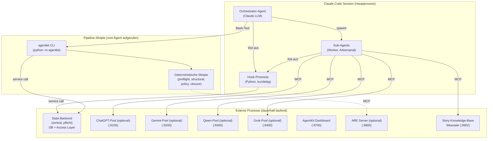
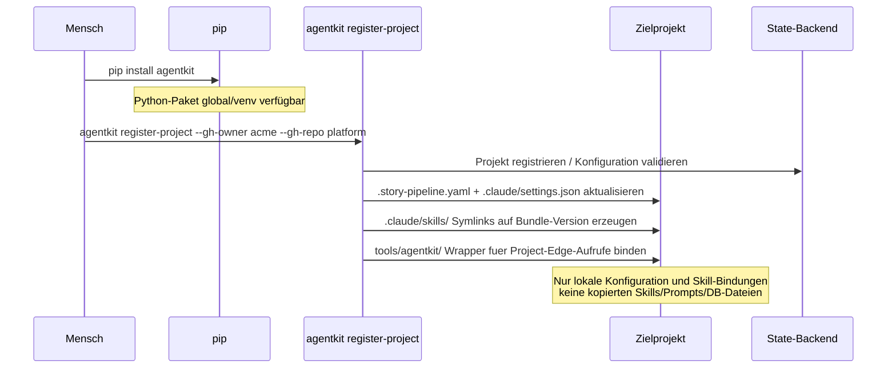

# 10 — Runtime, Deployment und Speicher

<!-- PROSE-FORMAL: formal.state-storage.entities, formal.state-storage.invariants, formal.skills-and-bundles.entities, formal.skills-and-bundles.invariants -->

## 10.1 Laufzeitkomponenten

AgentKit besteht zur Laufzeit aus lokalen Ausführungsprozessen und
einem zentralen State-Backend. Das Zielprojekt enthält keine
deployste AgentKit-Runtime und keine kanonischen AgentKit-
Zustandsdateien.

### 10.1.1 Prozesslandschaft



### 10.1.2 Prozesstypen

| Typ | Lebensdauer | Gestartet von | Beispiele |
|-----|-------------|---------------|-----------|
| **Claude-Code-Session** | Minuten bis Stunden | Mensch (CLI `claude`) | Orchestrator, Worker, Adversarial |
| **Hook-Prozess** | Millisekunden | Claude Code (pro Tool-Call) | `branch_guard.py`, `integrity.py`, `hook.py` |
| **Pipeline-Skript** | Sekunden bis Minuten | Agent via Bash-Tool | `agentkit run-phase`, `agentkit structural` |
| **State-Backend** | Dauerhaft | Zentrale Infrastruktur | Workflow-State, Telemetrie, Artefakt-Metadaten |
| **MCP-Server** | Dauerhaft | Mensch oder Autostart | LLM-Pools (optional, mind. 1), Story-Knowledge-Base (Pflicht), ARE (optional) |
| **Docker-Container** | Dauerhaft | `docker-compose up` | Weaviate + text2vec-transformers (Pflicht) |

### 10.1.3 Hook-Prozesse im Detail

Hooks sind die leistungskritischste Komponente. Sie werden bei
**jedem Tool-Call** als eigener Python-Prozess gestartet und müssen
schnell entscheiden.

**Lebenszyklus eines Hook-Aufrufs:**

1. Claude Code forkt einen Python-Prozess
2. Hook liest Tool-Call-Daten von `sys.stdin` (JSON)
3. Hook prüft Regeln (lokale Config + State-Backend-Lookups)
4. Hook schreibt optional Telemetrie (State-Backend)
5. Hook beendet sich: `exit(0)` = erlauben, `exit(2)` = blockieren

**Performance-Designregel:** Hooks müssen billig sein — nur lokale,
deterministische Operationen plus eng begrenzte State-Backend-
Operationen (z.B. Event-Write, Run-Lookup, Lock-Check). Keine
LLM-Aufrufe, keine freien Netzwerk-Calls, keine aufwändigen
Dateisystem-Scans. Details in Kap. 30.4.

**Parallelität:** Claude Code ruft Hooks sequentiell auf (ein Hook
pro Tool-Call). Mehrere Sub-Agent-Sessions können aber parallel
laufen, was bedeutet: Mehrere Hook-Prozesse können gleichzeitig in
das State-Backend schreiben. Konsistenz und Serialisierung sind
Aufgabe des Backends, nicht des Projekt-Dateisystems.

## 10.2 Deployment-Modell

### 10.2.1 Installation

AgentKit wird als Python-Paket systemweit installiert. Der Installer
registriert anschließend ein Zielprojekt und schreibt nur die
projektlokale Konfiguration:



**Keine Docker-Abhängigkeit für AgentKit selbst.** Docker wird für
Pflicht-Infrastrukturdienste benötigt (Weaviate).

### 10.2.2 Laufzeitabhängigkeiten

| Abhängigkeit | Pflicht/Optional | Prüfung |
|-------------|-----------------|---------|
| Python 3.14 | Pflicht | Installer Checkpoint 1 |
| Git ≥ 2.30 | Pflicht | Installer Checkpoint 2 |
| `gh` CLI | Pflicht | Installer Checkpoint 2 |
| Claude Code | Pflicht | Voraussetzung (nicht geprüft) |
| LLM-Pools (MCP) | Pflicht: mind. 2 verschiedene Pools zusätzlich zu Claude (Schicht 2 fordert verschiedene LLMs für QA-Review und Semantic Review) | Integrity-Gate bei Closure prüft konfigurierte `llm_roles` gegen Telemetrie |
| Weaviate + MCP-Wrapper | Pflicht | Installer Checkpoint 9 |
| ARE (MCP) | Optional (`are: true`) | Installer prüft Erreichbarkeit des MCP-Servers |

**LLM-Pool-Anforderung im Detail:**

Das FK fordert neben Claude mindestens ein weiteres LLM, idealerweise
zwei (FK-06-090). Jeder Pool ist optional, aber die Summe muss die
`llm_roles`-Konfiguration bedienen können:

| Konfiguration | Pools nötig | Bewertung |
|--------------|------------|-----------|
| Nur Claude (kein Pool) | 0 | Unzulässig — Multi-LLM ist Pflicht |
| Claude + 1 Pool | 1 | Unzulässig — Schicht 2 Verify fordert zwei verschiedene LLMs für QA-Review und Semantic Review |
| Claude + 2 Pools (z.B. ChatGPT + Gemini) | 2 | Minimum — qa_review und semantic_review auf verschiedenen Pools |
| Claude + 3 Pools (ChatGPT + Gemini + Grok) | 3 | Empfohlen — maximale Diversität |

Die `llm_roles`-Konfiguration in `.story-pipeline.yaml` ordnet Rollen
konkreten Pools zu. Das Integrity-Gate prüft bei Closure, dass für
jede konfigurierte Rolle mindestens ein `llm_call`-Event mit dem
zugeordneten Pool in der Telemetrie vorliegt.

### 10.2.3 Zentrales State-Backend statt Projektzustand

AgentKit hat keine projektlokale Runtime. Alles Projektseitige läuft als:
- Kurzlebige CLI-Aufrufe (Pipeline-Skripte)
- Kurzlebige offizielle Project-Edge-Client-Aufrufe
- Kurzlebige Hook-Prozesse (PreToolUse/PostToolUse)
- Zugriff auf Projektcode und Projektkonfiguration

Der kanonische AgentKit-Zustand liegt in einem zentralen
State-Backend. Dieses trennt Laufzeitdaten vom Projekt-Repository,
stellt Retention sicher und erzwingt Rollenrechte gegenüber
Orchestrator und Worker.

## 10.3 Verzeichnisstruktur

### 10.3.1 Zielprojekt nach Installation

```
{projekt-root}/
├── .story-pipeline.yaml            # Projektspezifische AgentKit-Konfiguration
├── .claude/
│   ├── settings.json               # Hook-Registrierung
│   ├── skills/                     # Projektlokale Symlink-Bindungen auf systemweite Skill-Bundles
│   └── ccag/
│       └── rules/                  # Projektbezogene Permission-/Policy-Konfiguration
│
├── stories/                        # Projektdokumentation / Story-Arbeitsraum
├── concepts/                       # Projektspezifische Konzepte
├── _guardrails/                    # Projektspezifische Guardrails
└── <Projektdateien>                # Quellcode, Tests, Build-Dateien
```

**Projektlokal weiterhin vorgesehen, aber nicht kanonisch:**
- `.claude/skills/` als Symlink-Bindung auf systemweite, versionierte Bundles

**Nicht mehr im Projekt vorgesehen:**
- keine projektlokalen Telemetrie-DBs
- keine AgentKit-`_temp/`-Zustandsverzeichnisse als Source of Truth
- keine kopierten Prompt-/Skill-/Schema-Bundles
- kein Installations-Manifest als Laufzeitanker

### 10.3.2 Verzeichnis-Ownership

| Verzeichnis | Schreiber | Leser | Schutz |
|-------------|----------|-------|--------|
| State-Backend: Workflow-State | Pipeline-Skripte | Orchestrator, QA, Status-Abfragen | Rollen- und Principal-basierte Rechte |
| State-Backend: Telemetrie | Hook-Prozesse + Pipeline-Skripte | Integrity-Gate, Postflight, Governance | Zentraler Audit-Trail |
| State-Backend: Governance/Locks | Pipeline-Skripte | Hooks | Nur deterministische Komponenten schreiben |
| State-Backend: Failure Corpus | Governance-Beobachtung, Pipeline | Failure-Corpus-Engine | Append-only, permanent |
| Systemweite Skill-/Prompt-Bundles | AgentKit-Installer | Agents (read-only via Projekt-Symlink) | Versioniert, immutable pro Bundle-Version |
| `.claude/skills/` | Installer | Claude Code / Agents | Nur Symlink-Bindung, kein kanonischer Inhalt |
| `.story-pipeline.yaml` | Mensch, Installer | Alle Pipeline-Komponenten | Menschlich editierbar |

## 10.4 Persistenz und Datenflüsse

### 10.4.1 Was wird wo gespeichert

| Daten | Speicher | Format | Lebensdauer |
|-------|---------|--------|-------------|
| Pipeline-Konfiguration | `.story-pipeline.yaml` | YAML | Permanent (projektweite Config) |
| Story-Zustände (extern) | GitHub Project Board | Custom Fields | Permanent |
| Story-Zustände (intern) | State-Backend | Strukturierte Records | Permanent mit Run-Historie |
| Story-Context (Snapshot) | State-Backend | Strukturierte Records | Permanent / versioniert |
| QA-Ergebnisse | State-Backend | Strukturierte Artefakt-Records | Permanent mit Retention-Regeln |
| Telemetrie (Laufzeit) | State-Backend | DB-Events | Permanent |
| Telemetrie (Archiv) | Export-Service / Objektspeicher | JSONL/Bundle | Export bei Closure oder Audit |
| Locks | State-Backend | Lock-Records | Während Story-Lauf |
| Failure Corpus | State-Backend / Artefaktspeicher | JSONL + strukturierte Datensätze | Permanent, projektübergreifend |
| Konzept-Dokumente | `concepts/` | Markdown | Permanent |
| Story-Dokumentation | `stories/{story_id}_{slug}/` | Markdown + JSON | Permanent |
| Projektregistrierung | State-Backend + lokale Config-Version | Record | Permanent |
| VektorDB-Inhalte | Weaviate (Docker Volume) | Weaviate-intern | Permanent (reindexierbar) |

**Hinweis:** Die logische Tabellenfamilien- und Schluesselstruktur des
zentralen PostgreSQL-State-Backends steht in FK-18. FK-10 definiert nur
Speicherorte, Laufzeitrollen und Datenfluesse.

### 10.4.2 Cleanup-Strategie

| Was | Wann | Wie |
|-----|------|-----|
| Export-Bundles | Nach Story-Closure | Nach zentraler Retention-Policy archivierbar |
| Locks | Closure-Skript entfernt sie | Automatisch bei Closure; stale Locks via Lease/TTL |
| Ephemere Sandboxes außerhalb des Projekts | Nach Test-Promotion durch Pipeline | Automatisch löschbar |
| Worktree | Closure-Phase (teardown) | `git worktree remove` |
| Story-Branch | Closure-Phase (nach Merge) | `git branch -d` |

**Kein kanonischer Audit-Trail im Projekt-Dateisystem.**
Audit- und QA-Daten leben zentral; lokale Exporte sind nur Kopien.

## 10.5 Locking und Parallelität

### 10.5.1 Parallelitätsszenarien

| Szenario | Möglich? | Mechanismus |
|----------|----------|-------------|
| Mehrere Stories parallel | Ja | Jede Story hat eigenen Worktree, eigene zentrale Locks und eigene Run-Records |
| Mehrere Sub-Agents parallel | Ja (innerhalb einer Story) | Claude Code spawnt Sub-Agents als parallele Sessions |
| Mehrere Pipeline-Skripte parallel | Nein | Phase Runner steuert sequentiell |
| Mehrere Hook-Prozesse parallel | Ja | Verschiedene Sub-Agent-Sessions lösen gleichzeitig Hooks aus |

### 10.5.2 Konfliktzonen

| Konfliktzone | Risiko | Absicherung |
|-------------|--------|-------------|
| State-Backend-Telemetrie (mehrere Hooks schreiben gleichzeitig) | Write-Contention | DB-Transaktionen / service-seitige Serialisierung |
| Story-Locks | Falsche Zuordnung | Story-spezifische Lease-/Lock-Records |
| QA-Artefakte | Überschreiben durch falschen Prozess | Nur Pipeline-/Service-Principals dürfen mutieren |
| Git-Worktree | Branch-Konflikte | Jede Story hat eigenen Branch (`story/{story_id}`) |
| GitHub-Issue-Status | Race Condition bei parallelen Status-Updates | Pipeline aktualisiert Status nur bei Phasenwechsel (sequentiell pro Story) |

### 10.5.3 Idempotenz

Alle Pipeline-Skripte müssen idempotent sein:

| Skript | Idempotenz-Garantie |
|--------|-------------------|
| Preflight | Prüft nur, ändert nichts. Wiederholbar. |
| Setup (Worktree) | Prüft ob Worktree existiert, erstellt nur wenn nicht vorhanden. |
| Structural Checks | Liest nur, schreibt Ergebnis. Wiederholbar (überschreibt vorheriges Ergebnis). |
| LLM-Evaluator | Sendet an Pool, schreibt Ergebnis. Wiederholbar (überschreibt). |
| Closure | Nicht pauschal idempotent — Closure hat sequentielle Seiteneffekte über verschiedene Systeme (Merge, Issue-Close, Metriken, Postflight). Wird über persistierte Substates abgesichert: `integrity_passed`, `merge_done`, `issue_closed`, `metrics_written`, `postflight_done`. Bei Crash: Recovery setzt beim letzten bestätigten Substate wieder an. |
| Postflight | Prüft nur, ändert nichts. Wiederholbar. |

## 10.6 Fehlerbehandlung und Recovery

### 10.6.1 Absturz-Szenarien

| Szenario | Zustand nach Absturz | Recovery |
|----------|---------------------|---------|
| Claude-Code-Session crashed | Worktree existiert, Lock aktiv, Telemetrie unvollständig | PID-basierte Lock-Erkennung (Kap. 02.7). Neuer Run mit neuer `run_id`, bestehender Worktree wird wiederverwendet. |
| Pipeline-Skript crashed | QA-Artefakt möglicherweise unvollständig | Phase Runner kann Phase wiederholen. Idempotente Skripte. |
| Hook-Prozess crashed | Tool-Call wird blockiert (fail-closed: kein exit(0) = blockiert) | Claude Code behandelt Hook-Fehler als Blockade. Agent erhält Fehlermeldung. |
| LLM-Pool nicht erreichbar | Pool-Call schlägt fehl | Retry-Logik im LLM-Evaluator (1 Retry). Bei Scheitern: Check = FAIL (fail-closed). |
| Weaviate nicht erreichbar | VektorDB-Suche schlägt fehl | Story-Erstellung schlägt fehl (fail-closed). VektorDB ist Pflichtbestandteil der Infrastruktur. |
| GitHub nicht erreichbar | API-Calls schlagen fehl | Preflight scheitert → Story startet nicht. Closure scheitert → Eskalation an Mensch. |

### 10.6.2 Recovery-Protokoll

Bei einem abgebrochenen Story-Run:

1. Mensch erkennt Problem (Stagnation, Fehlermeldung, Lock-Timeout)
2. Mensch prüft Zustand: `agentkit status --story {story_id}` oder
   State-Backend-Eintrag des Runs
3. Stale Locks werden via PID-Prüfung automatisch erkannt
4. Neuer Run mit `agentkit run-phase setup --story {story_id}` —
   Preflight erkennt bestehenden Worktree/Branch und kann
   konfigurierbar damit umgehen (abbrechen oder wiederverwenden)
5. Alternativ: Manuelles Cleanup via
   `agentkit cleanup --story {story_id}` (Worktree, Branch, Locks, Artefakte)

## 10.7 Service-Port-Katalog

### 10.7.1 Uebersicht

Alle Services im Dunstkreis von AgentKit und seiner
Softwareentwicklungsumgebung sind im Portbereich 9000-9999
angesiedelt. Ausnahme bleibt die zentrale Datenbank auf ihrem
Standardport.

```
Portbereich-Schema:

  5432        PostgreSQL (Standardport, ausserhalb 9000er-Block)
  9100-9400   LLM-Pools (MCP-Server, Browser-Automation)
  9500-9699   Reserviert (frei fuer kuenftige LLM-Pools oder Services)
  9700-9799   AgentKit-eigene Services
  9800-9899   Fachliche Integrationen
  9900-9999   DevOps- und Infrastruktur-Services
```

### 10.7.2 Service-Tabelle

| Port | Service | Kategorie | Protokoll | Pflicht/Optional | Autostart |
|------|---------|-----------|-----------|-----------------|-----------|
| 5432 | PostgreSQL / zentrales DBMS | Dateninfrastruktur | TCP | Pflicht (State-Backend) | Zentraler Dienst |
| 9100 | ChatGPT Pool | LLM-Pool | MCP (HTTP+SSE) | Optional (mind. 1 Pool Pflicht) | Windows Startup `.pyw` |
| 9200 | Gemini Pool | LLM-Pool | MCP (HTTP+SSE) | Optional | Windows Startup `.pyw` |
| 9300 | Qwen Pool | LLM-Pool | MCP (HTTP+SSE) | Optional | Windows Startup `.pyw` |
| 9400 | Grok Pool | LLM-Pool | MCP (HTTP+SSE) | Optional | Windows Startup `.pyw` |
| 9700 | AgentKit KPI Dashboard | AgentKit | HTTP (Chart.js SPA) | Optional | `agentkit dashboard` |
| 9800 | ARE Server | Fachliche Integration | MCP | Optional (FK-40) | Manuell |
| 9900 | Jenkins (Web-UI) | CI/CD | HTTP | Optional (externe Stage-Registry, FK-33) | Docker Compose |
| 9901 | SonarQube | Code-Qualitaet | HTTP | Optional (externe Stage-Registry, FK-33) | Systemdienst |
| 9902 | Jenkins (Agent-Port) | CI/CD | TCP | Optional (Jenkins-Agent-Kommunikation) | Docker Compose |
| 9903 | Weaviate (VektorDB) | Dateninfrastruktur | HTTP + gRPC | Pflicht (FK-13) | Docker Compose |

### 10.7.3 Designregeln

- **LLM-Pools**: 9100-9400 (ein Port pro Pool, aufsteigend).
  Neue Pools erhalten den naechsten freien Port in diesem Bereich.
- **AgentKit-Services**: 9700-9799. Aktuell nur Dashboard.
  Kuenftige AgentKit-eigene Services (z.B. Analytics-API) hier.
- **Fachliche Integrationen**: 9800-9899. ARE und kuenftige
  externe Fachservices.
- **DevOps/Infra**: 9900-9999. Jenkins, SonarQube, Weaviate
  und kuenftige Infrastruktur-Services.
- **State-Backend/DB**: Kanonischer Laufzeitzustand und Audit-Trail.
  Direkter Agentenzugriff ist verboten; Zugriffe laufen ueber
  deterministische AgentKit-Komponenten.

### 10.7.4 Konfiguration

Die Ports sind konfigurierbar:

| Service | Konfigurationsort | Default |
|---------|-------------------|---------|
| LLM-Pools | MCP-Server-Konfiguration in `.claude/settings.json` + Pool-Startup-Skripte | 9100/9200/9300/9400 |
| Dashboard | `agentkit dashboard --port N` | 9700 |
| ARE | `.story-pipeline.yaml` → `are.base_url` | 9800 |
| Weaviate | `.story-pipeline.yaml` → `vectordb.url` | 9903 |
| Jenkins/SonarQube | `.story-pipeline.yaml` → Stage-Registry `external_tools` | 9900/9901 (Jenkins Agent: 9902) |
| PostgreSQL | Umgebungsvariable oder Connection-String (spaeter) | 5432 |

---

*FK-Referenzen: FK-05-067 (Worktree-Isolation),
FK-06-004/005 (Hook-Enforcement ueber Plattform),
FK-08-002 (JSONL pro Story),
FK-11-001 bis FK-11-009 (Installation/Checkpoints)*
