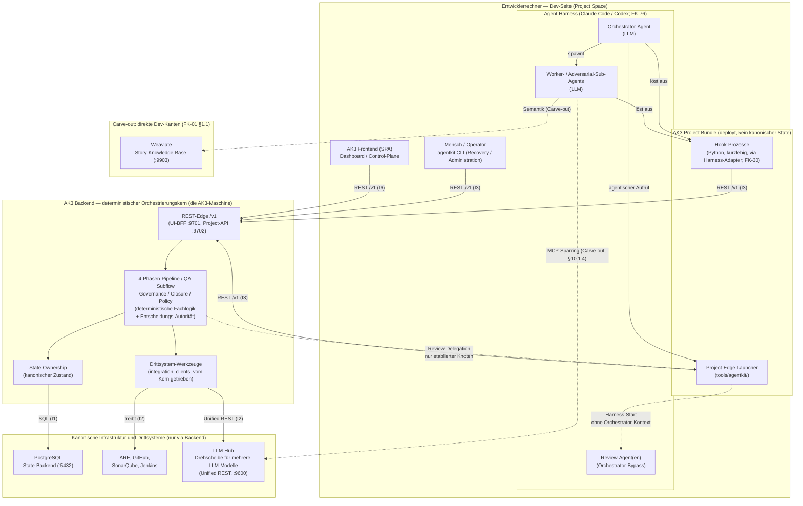
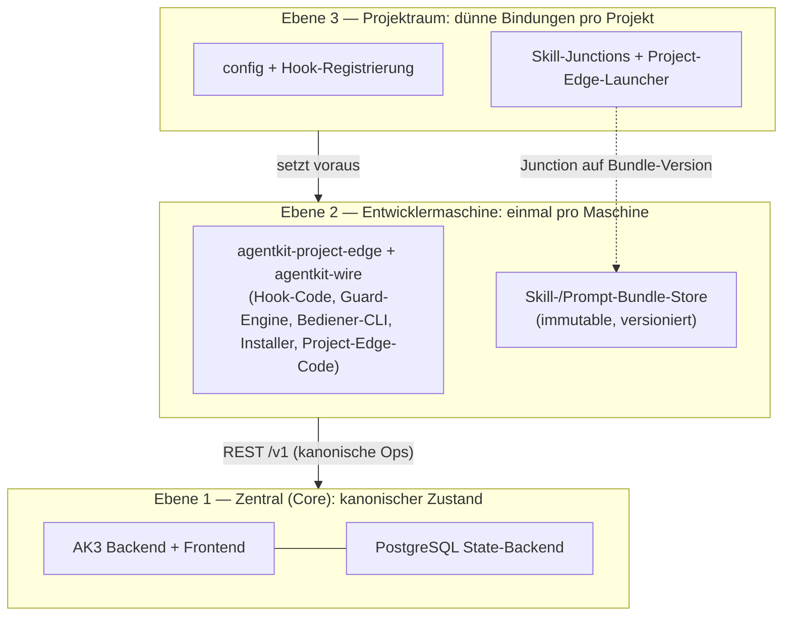

# 10 — Runtime, Deployment und Speicher

<!-- PROSE-FORMAL: formal.state-storage.entities, formal.state-storage.invariants, formal.skills-and-bundles.entities, formal.skills-and-bundles.invariants -->

## 10.1 Laufzeitkomponenten

### 10.1.0 Architektur-Leitbild: AK3 Backend als deterministischer Kern

Das **AK3 Backend** ist der **deterministische Orchestrierungs- und
Business-Kern** von AK3 — die Maschine, die Story-Ausführung,
Guardrails, QA, Telemetrie und Closure deterministisch orchestriert
(Kernauftrag, CLAUDE.md). Der Kern **besitzt** den kanonischen Zustand
(PostgreSQL ist sein Zustandsspeicher, nicht sein Zweck), **führt** die
4-Phasen-Pipeline, den QA-Subflow, Governance und Closure aus und
**treibt** die Drittsysteme (ARE, GitHub, SonarQube, Jenkins, LLM-Hub)
als untergeordnete Werkzeuge. Er ist **keine Durchreiche und keine
Service-Fassade**: Fachlogik, Kontrolle und Entscheidungs-Autorität
liegen im Kern, nicht in seinen Rändern.

**Dünn sind die Ränder, nicht der Kern.** Die Dev-Seite (Hook-Prozesse,
Project-Edge, CLI) und das Frontend sind **Clients/Edges**, die der Kern
über eine REST-API (`/v1`) bedient, überwacht und gated. Der **Harness**
(Claude Code / Codex; FK-76) ist die **Ausführungsfläche** für die
kreative Agentenarbeit (Implementierung durch LLM-Worker); der Kern
orchestriert, überwacht und prüft diese Arbeit — er ersetzt sie nicht
und delegiert seine Autorität nicht an sie. Intelligenz ist damit
zweigeteilt: generativ-kreativ in den Agenten, deterministisch-steuernd
und qualitätssichernd im Kern.

> **Begriffsabgrenzung.** „AK3 Backend" meint in diesem Dokument den
> **deterministischen AK3-Kern** (logischer zentraler Server). Das ist
> nicht zu verwechseln mit dem Python-Paket `agentkit.backend.*`, aus
> dem dieser Kern gebaut wird. Trust-Boundaries und Systemkontext sind
> normativ in **FK-01** verankert; FK-10 beschreibt deren Runtime-,
> Deployment- und Speicher-Realisierung.

**Normative Soll-Invarianten der Topologie (I1–I6):**

| ID | Invariante | Aussage |
|----|-----------|---------|
| **I1** | Postgres-Eigentum | Der Kern besitzt und beschreibt den kanonischen Zustand; PostgreSQL ist ausschließlich sein Speicher. Kein Dev-Prozess öffnet eine direkte DB-Verbindung. |
| **I2** | Drittsystem-Hoheit (AK3-verantwortete Vorgänge) | In von AK3 verantworteten Prozessen treibt **der Kern** ARE, GitHub, SonarQube, Jenkins und den LLM-Hub. Es geht **nicht** darum, dass die Dev-Seite Drittsysteme nie berührt — sondern dass sie es **innerhalb AK3-verantworteter Abläufe** nicht am Kern vorbei tut. |
| **I3** | Kanonische Ops nur via Kern | AK3-verantwortete kanonische Operationen (State, Gates, Phasenfortschritt) laufen ausschließlich per REST über den Kern — innerhalb dieser Vorgänge kein Bypass auf DB, Dienste oder kanonischen State. |
| **I4** | Direkt-Carve-out (FK-01 §1.1) | Direkter Dev→Infra-Zugriff ist auf den begrenzten **Carve-out** beschränkt: **Eigenbedarf des Agents** (z. B. Weaviate-Semantik, Ad-hoc-Einsicht, freiwilliges Harness-Sparring außerhalb AK3) oder von AK3 **explizit mandatierte** fs/worktree-gebundene Mechanik (z. B. `gh`/`git`). Katalog und Kriterien: FK-01 §1.1. |
| **I5** | Kein lokaler kanonischer State | Der Project Space hält nur das Bundle und projektlokale Konfiguration, keinen kanonischen Laufzeit-State. Lokale Laufzeitdateien sind ausschließlich Read-Projektionen. |
| **I6** | Frontend → Kern | Das AK3 Frontend spricht ausschließlich per REST mit dem Kern. |

Diese Invarianten sind **fail-closed**: Eine Dev-Komponente, die
**innerhalb eines AK3-verantworteten Vorgangs** DB, Drittsystem oder
kanonischen State am Kern vorbei berührt (außerhalb des Carve-out gemäß
FK-01 §1.1), ist ein Fehlbetrieb, kein Sollzustand.

**Abgrenzung — es geht um AK3-verantwortete Vorgänge.** I1–I6 binden,
was **AK3 verantwortet**: dort greift nur der Kern zu — bzw. der Agent
direkt, **wo AK3 ihm das Mandat für fs/worktree-gebundene Mechanik
erteilt**. Sie verbieten **nicht**, dass ein Harness-Agent im Carve-out
ein Drittsystem nutzt (freiwilliges Harness-Sparring §10.1.4,
Sonar/Jenkins-Einsicht, `gh`/`git`, ARE-Evidence). Hub-Sparring per MCP
ist Eigeninitiative des Harness-Agents, nicht AK3-mandatiert und nicht
Gate-relevant. FK-01 ist der normative Katalog dieser Kanten.

### 10.1.0a Distributionszielbild: Edge, Kern und Vertragspaket

> **Normative Grundlage.** Product-Owner-Entscheidung vom 2026-08-03,
> `concept/_meta/decisions/2026-08-03-edge-und-kern-sind-zwei-distributionen.md`.
> Dieses Kapitel ist der autoritative Ort des Distributionsschnitts; FK-01
> besitzt die Trust-Boundaries, FK-30 die lokal ausgefuehrte Guard-Engine,
> FK-07 die maschinell erzwungenen Importgrenzen.

AK3 wird in **genau drei** Distributionen ausgeliefert. Der Schnitt folgt
dem **Laufzeitbesitzer**, nicht dem historischen Namespace: was auf dem
Entwicklerrechner ausgefuehrt wird, gehoert in das Edge-Artefakt — auch
dann, wenn es heute unter `backend/` liegt.

| Merkmal | **Edge** | **Kern** | **Vertragspaket** |
|---|---|---|---|
| Distributionsname | `agentkit-project-edge` | `agentkit-backend` | `agentkit-wire` |
| Importwurzel | `agentkit_project_edge` | `agentkit_backend` | `agentkit_wire` |
| Prozesse | Hook-Prozess (pro Tool-Call), Project-Edge-Launcher, Edge-Command-Loop, Bediener-CLI, lokal gestartete MCP-Server, Installer-Laeufe | Backend-Writer (`agentkit-backend serve`), Frontend-Auslieferung (`agentkit-backend ui`), Migrations-/Decommission-Laeufe | keine — reines Bibliotheksartefakt |
| Lebensdauer | Millisekunden (Hook) bis Minuten (Installer, Command-Loop); MCP-Server dauerhaft | dauerhaft | n/a |
| Startakteur | Agent-Harness, Zielprojekt-Launcher, Mensch/Bediener | zentrale Infrastruktur/Ops | n/a |
| Netzrichtung | ausschliesslich **ausgehend** zum Kern (`/v1` ueber HTTPS) sowie die Carve-out-Kanten aus FK-01 §1.1a | **eingehend** von Edge und Frontend; ausgehend zu DB und Drittsystemen | keine |
| State-Ownership | keiner. Nur Bindungen, Config und Read-Projektionen mit Max-TTL (I5) | **alleiniger** Eigentuemer des kanonischen Zustands (I1) | keiner |
| Lokale Engine | ja — deterministische Guard-Evaluation, fs-/worktree-gebundene Mechanik, Story-Reconciliation, Credential-/Provider-Portaufloesung | ja — Pipeline, QA-Subflow, Policy, Closure, Governance-Adjudication | nein — I/O-freies Blatt |
| Deployment-Ebene (§10.2.0) | Ebene 2 (Entwicklermaschine) + Ebene 3 (Projektbindung) | Ebene 1 (zentral) | mit beiden, nie allein |

**Namensregel (normativ, aus F1 der PO-Entscheidung).** „AgentKit" ist der
Name des **Frameworks**, nicht eines Artefakts. **Keine Distribution und
keine Importwurzel traegt den blossen Namen `agentkit`.** Die Importwurzel
ist mechanisch aus dem Distributionsnamen abgeleitet: Bindestriche werden zu
Unterstrichen, sonst nichts. Der Grund ist nicht Aesthetik: AK2 liefert ein
**regulaeres** Paket namens `agentkit` aus, und ein regulaeres Paket verdeckt
gleichnamige Namespace-Portionen vollstaendig. Behielte AK3 `agentkit.*`,
waere der Kollisionszustand auf genau der Maschine reproduziert, auf der er
entstanden ist — dem Entwicklerrechner, der beide Generationen traegt. Damit
ist der AK2-Namenskonflikt **aufgeloest** und nicht laenger nur isoliert.

**Vertragspaket — Umfang und Grenze.** `agentkit-wire` enthaelt **genau**
das Vokabular, das beide Seiten auf dem Draht sprechen: die Request-/
Response-/Fehlermodelle der `/v1`-Grenze und die auf dem Draht
transportierten Aufzaehlungstypen. Es ist ein **I/O-freies Blatt**: keine
Dateisystem-, Netz-, Datenbank- oder Prozesszugriffe, keine
AK3-Fachlogik, keine Importe aus Edge oder Kern, und ausser der
Validierungsbibliothek keine Drittabhaengigkeit. Es ist **kein Ablageort
fuer geteilten Code**. Ein Typ, den nur eine Seite braucht — lokale
Config-, Hook-, Guard- oder Provider-Typen — gehoert zu seinem
ausfuehrenden Besitzer, auch wenn die andere Seite ihn heute zufaellig
importiert. Hilfsfunktionen (`utils.io` und Vergleichbares) sind **kein**
Wire-Vokabular; sie werden dort dupliziert oder verortet, wo sie
ausgefuehrt werden, nicht ins Vertragspaket gehoben.

**Ein Repository, eine Version (F2).** Alle drei Artefakte werden aus
diesem Repository gebaut und tragen **dieselbe** Version, gebunden an den
Repository-Stand. Es gibt keine unabhaengigen SemVer-Reihen, keinen
Kompatibilitaetsbereich und keine Versionsmatrix — eine Matrix waere genau
die durch `CLAUDE.md` ausnahmslos verbotene Kompatibilitaetsschicht. Die
Drahtebene deckt der `/v1/compat`-Handshake ab (§10.2.7, FK-91).

**Deployment-Folge der Nichterreichbarkeit.** Die Nichterreichbarkeit
des Entwicklerrechners ist **nicht** hier normiert: sie gehoert FK-01
§1.1a/§1.4.3 (Trust Boundaries), und FK-10 verweist darauf, statt sie ein
zweites Mal zu behaupten. Fuer den Distributionsschnitt folgt daraus genau
eine Aussage, und die ist eine Deployment-Aussage:

> Weil jede Kante vom Edge initiiert wird, braucht die Edge-Distribution
> **keinen Listener** und die Kern-Distribution **keinen Client**. Ein
> Edge-Artefakt, das einen Port oeffnet, oder ein Kern-Artefakt, das einen
> Entwicklerrechner adressiert, ist ein Schnittfehler — unabhaengig davon,
> ob die Trust Boundary es zusaetzlich verbietet.

**Die Grenze ist maschinell wahr, nicht konventionell.** Was der Edge
nicht importieren darf, ist auf dem Entwicklerrechner **nicht
installiert**. Eine Konvention, die erst auffaellt, wenn jemand sie
verletzt, ist keine Grenze. Die durchsetzenden Invarianten und das
blockierende Gate liegen in FK-07 §7.9a und
`formal.architecture-conformance.*`.

### 10.1.1 Prozesslandschaft

AgentKit besteht zur Laufzeit aus einer **dünnen Dev-Seite** (Bundle +
Harness im Project Space) und dem **zentralen AK3 Backend**, das DB und
Drittsysteme kapselt. Das Zielprojekt enthält keine kopierte
AgentKit-Runtime und keine kanonischen AgentKit-Zustandsdateien.

Die Dev-Seite wird vollstaendig aus der Edge-Distribution
`agentkit-project-edge` (plus `agentkit-wire`) ausgeliefert, der zentrale
Teil vollstaendig aus `agentkit-backend` (plus `agentkit-wire`). Getrennt
sind die **Umgebungen**, nicht die Rechner: derselbe Host darf beide
Artefakte tragen — die Loopback-Ko-Lokalisierung (§10.2.4) und die
Einzelplatzentwicklung setzen das voraus —, aber nie in derselben
Python-Umgebung (§10.2.0).


```mermaid
graph TB
    subgraph DEV["Entwicklerrechner — Dev-Seite (Project Space)"]
        subgraph BUNDLE["AK3 Project Bundle (deployt, kein kanonischer State)"]
            HOOKS["Hook-Prozesse<br/>(Python, kurzlebig, via Harness-Adapter; FK-30)"]
            EDGE["Project-Edge-Launcher<br/>(tools/agentkit/)"]
        end
        subgraph HARNESS["Agent-Harness (Claude Code / Codex; FK-76)"]
            ORCH["Orchestrator-Agent<br/>(LLM)"]
            SUBAGENTS["Worker- / Adversarial-Sub-Agents<br/>(LLM)"]
            REVIEW["Review-Agent(en)<br/>(Orchestrator-Bypass)"]
        end
        CLI["Mensch / Operator<br/>agentkit CLI (Recovery / Administration)"]
        UI["AK3 Frontend (SPA)<br/>Dashboard / Control-Plane"]
    end

    subgraph CENTRAL["AK3 Backend — deterministischer Orchestrierungskern (die AK3-Maschine)"]
        CORE["4-Phasen-Pipeline / QA-Subflow<br/>Governance / Closure / Policy<br/>(deterministische Fachlogik + Entscheidungs-Autorität)"]
        STATEOWN["State-Ownership<br/>(kanonischer Zustand)"]
        ADAPT["Drittsystem-Werkzeuge<br/>(integration_clients, vom Kern getrieben)"]
        REST["REST-Edge /v1<br/>(UI-BFF :9701, Project-API :9702)"]
        REST --> CORE
        CORE --> STATEOWN
        CORE --> ADAPT
    end
    subgraph INFRA["Kanonische Infrastruktur und Drittsysteme (nur via Backend)"]
        PG["PostgreSQL<br/>State-Backend (:5432)"]
        TP["ARE, GitHub,<br/>SonarQube, Jenkins"]
        HUB["LLM-Hub<br/>Drehscheibe für mehrere LLM-Modelle<br/>(Unified REST, :9600)"]
    end
    subgraph DIRECT["Carve-out: direkte Dev-Kanten (FK-01 §1.1)"]
        WEAVIATE["Weaviate<br/>Story-Knowledge-Base (:9903)"]
    end

    ORCH -->|"spawnt"| SUBAGENTS
    ORCH -->|"löst aus"| HOOKS
    SUBAGENTS -->|"löst aus"| HOOKS
    ORCH -->|"agentischer Aufruf"| EDGE
    HOOKS -->|"REST /v1 (I3)"| REST
    EDGE -->|"REST /v1 (I3)"| REST
    CLI -->|"REST /v1 (I3)"| REST
    UI -->|"REST /v1 (I6)"| REST
    CORE -.->|"Review-Delegation<br/>nur etablierter Knoten"| EDGE
    EDGE -.->|"Harness-Start<br/>ohne Orchestrator-Kontext"| REVIEW
    STATEOWN -->|"SQL (I1)"| PG
    ADAPT -->|"treibt (I2)"| TP
    ADAPT -->|"Unified REST (I2)"| HUB
    SUBAGENTS -.->|"Semantik (Carve-out)"| WEAVIATE
    SUBAGENTS -.->|"MCP-Sparring (Carve-out, §10.1.4)"| HUB
```

Durchgezogene Kanten sind AK3-verantwortete Standardpfade (über den Kern); die
gestrichelten Dev-Kanten zu Weaviate und LLM-Hub sind der Carve-out aus FK-01 §1.1.
Die gestrichelte Review-Kante bildet fachlich AK3 → Project Edge → Harness ab;
physisch bleibt sie ein Pull des lokalen Project Edge aus der bestehenden Bindung,
ohne direkte Backend-Verbindung zum Harness. FK-01 §1.1a besitzt die
Etablierungsgrenze, FK-76 §76.10 die Relais-Topologie und FK-91 §91.1b den
Wire-Vertrag. Agentische Aufrufe laufen nur ueber Project Edge; die CLI bleibt
menschliche Recovery nach FK-45 §45.4. AK3-Hub-Bewertungen laufen via Unified REST.

### 10.1.2 Prozesstypen

Die Spalte **Distribution** benennt das Artefakt, aus dem der Prozess
ausgeliefert wird (§10.1.0a). Sie ist Teil des normativen Schnitts: ein
Prozess mit Distribution „Edge" darf keinen Kern-Code importieren und
umgekehrt.

| Typ | Distribution | Maschine | Lebensdauer | Gestartet von | Rolle gegenüber dem Backend |
|-----|--------------|----------|-------------|---------------|------------------------------|
| **AK3 Backend** (deterministischer Orchestrierungskern) | `agentkit-backend` | zentral (Server oder Loopback-Host) | Dauerhaft | Zentrale Infrastruktur (`agentkit-backend serve`) | Führt Pipeline/Verify/Closure/Governance aus und hält die Entscheidungs-Autorität; besitzt den kanonischen State (einzige Schreib-Autorität); treibt DB und Drittsystem-Werkzeuge |
| **Harness-Session** (Claude Code / Codex; FK-76) | — (Plattform, nicht AK3) | Entwicklerrechner | Minuten bis Stunden | Mensch (Orchestrator/Worker/Adversarial via CLI `claude` oder `codex`); Project Edge ueber die Harness-Anbindung (Review-Rueckdelegation) | Orchestrator/Worker/Adversarial/Review; ruft kanonische Operationen per REST ausschliesslich über Project Edge auf und empfaengt Rueckdelegationen ueber dessen Harness-Anbindung |
| **Hook-Prozess** | `agentkit-project-edge` | Entwicklerrechner | Millisekunden | Harness (pro Tool-Call, via Harness-Adapter) | REST-Client des Backends; kein DB-/Drittsystem-Zugriff (I1/I2/I3). Fuehrt die Guard-Evaluation **lokal** aus (§10.1.3, FK-30) |
| **Project Edge** | `agentkit-project-edge` | Entwicklerrechner | Sekunden bis Minuten | Agent-Harness oder projektlokaler Edge-Command-Loop | Dünner REST-Client des Backends und einziges Relais beider Richtungen; keine eigene Fachlogik, keine zweite State-Quelle |
| **Bediener-CLI** (`agentkit-project-edge`) | `agentkit-project-edge` | Entwicklerrechner | Sekunden bis Minuten | Mensch / Operator | Menschlicher und administrativer Recovery-Adapter auf die REST-API; kein Agenten-Aufrufweg, keine eigene Fachlogik, keine zweite State-Quelle |
| **Installer-Lauf** (Ebene 2/3) | `agentkit-project-edge` | Entwicklerrechner | Sekunden bis Minuten | Mensch / Operator | Registriert, verifiziert, aktualisiert und loest Projektbindungen; materialisiert Hook- und MCP-Registrierung lokal |
| **AK3 Frontend** | `agentkit-backend` | zentral ausgeliefert, im Browser gerendert | Dauerhaft (Browser-Session) | Mensch (`agentkit-backend ui`) | REST-Client des Backends (I6) |
| **LLM-Hub** | — (Drittsystem) | extern | Dauerhaft | Externe Infrastruktur | Drehscheibe (Provider) für mehrere LLM-Modelle; vom Kern über das Unified-REST-Interface getrieben (I2) |
| **MCP-Server** (Story-Knowledge-Base, ARE) | `agentkit-project-edge` | Entwicklerrechner | Dauerhaft | Harness oder Autostart | Story-Knowledge-Base Weaviate (Pflicht, I4), ARE (optional). Der Prozess laeuft lokal; `weaviate-client` und `mcp` sind damit **Edge**-Abhaengigkeiten (F3) |
| **Docker-Container** | — (Drittsystem) | Betreiber-Infrastruktur | Dauerhaft | `docker-compose up` | Weaviate + text2vec-transformers (Pflicht) |

Das Vertragspaket `agentkit-wire` erscheint in dieser Tabelle nicht: es
startet keinen Prozess. Es wird von Edge- und Kern-Prozessen importiert und
hat weder Lebensdauer noch Startakteur.

### 10.1.3 Hook-Prozesse im Detail

Hooks sind die leistungskritischste Dev-Komponente. Sie werden bei
**jedem Tool-Call** als eigener Python-Prozess gestartet und müssen
schnell entscheiden — und tun das im Soll **ohne** direkten DB- oder
Drittsystem-Zugriff (I1/I2/I3).

**Lebenszyklus eines Hook-Aufrufs:**

1. Der Harness (Claude Code / Codex; FK-76) forkt einen Python-Prozess
2. Hook liest Tool-Call-Daten von `sys.stdin` (JSON)
3. Hook prüft Regeln (lokale Config + **Backend-REST-Lookups**, z. B.
   Guard-Counter, Run-/Lock-Status)
4. Hook meldet optional Telemetrie **per REST an das Backend**
5. Hook beendet sich: `exit(0)` = erlauben, `exit(2)` = blockieren

**Performance-/Latenz-Designregel.** Hooks müssen billig bleiben — nur
lokale, deterministische Operationen plus **eng begrenzte
Backend-REST-Aufrufe**. Keine LLM-Aufrufe, keine direkten DB-Verbindungen,
keine freien Netzwerk-Calls, keine aufwändigen Dateisystem-Scans.
Details in FK-30.

**Latenz-Strategie für den REST-Hop (DD-10B).** Der Millisekunden-Budget
des Hooks wird so gewahrt:

- Das Backend wird für Dev-Maschinen **ko-lokalisiert** (loopback) oder
  niedrig-latent angebunden; die Project-API (`:9702`) ist der
  maschinennahe Hook-/Edge-Endpunkt.
- **Sicherheitskritische Entscheidungen** (hält ein Lock? ist eine
  Guard-Schwelle überschritten? darf der Tool-Call passieren?) werden
  **am Backend bestätigt oder fail-closed blockiert** — niemals allein
  aus einer lokalen Projektion „erlaubt".
- Eine **lokale Read-Projektion** ist **nur** für **nicht-blockierende
  Statusanzeige** zulässig, mit definierter Max-TTL und **atomarer**
  Aktualisierung (materialisiert nach einem Backend-Call). Sie ist
  **niemals kanonisch** (I5) und nie Grundlage einer Erlaubnis-
  Entscheidung; bei stale/fehlend gilt Backend-Call oder fail-closed.
  Damit entsteht keine zweite operative Wahrheit.
- **Schreibende** Operationen (Telemetrie-Event, Counter-Inkrement,
  Lock-Mutation) gehen **immer** synchron ans Backend; ein nicht
  bestätigter Schreibpfad ist fail-closed (Tool-Call blockiert).

**Was der Hook-Prozess ausliefern darf (normativ).** Der Hook wird aus
`agentkit-project-edge` (plus `agentkit-wire`) gestartet und importiert
**ausschliesslich** diese beiden Importwurzeln. Die Guard-Engine — die
harness-neutrale Auswertung eines Tool-Calls — ist **Edge-Code** und
laeuft im Hook-Prozess; das ist keine Ausnahme vom duennen Rand, sondern
seine Aufgabe (§10.1.0a, FK-01 §1.1a, FK-30). Kanonischer Zustand bleibt
davon unberuehrt: der Hook liest und schreibt ihn ausschliesslich per REST
(I1/I3).

Daraus folgt fail-closed: **kein als kern-only klassifizierter Import und
keine kern-only Drittabhaengigkeit darf im Hook-Prozess ladbar sein.** Nicht
„wird nicht benutzt" — **nicht installiert** (§10.1.0a, FK-07 §7.9a).

> **Ist-Befund, gemessen am 2026-08-07** (AG3-208 AC 7, wegwerfbare leere
> venv auf Windows, Python 3.14.3, heutiges Einzel-Wheel `agentkit-0.1.0`):
> Ein **echter** `agentkit-hook-claude`-Prozess mit realem stdin laedt
> **294 `agentkit.*`-Module aus 23 Backend-Subpaketen**, darunter das
> vollstaendige `verify_system` (SonarQube-Gate, LLM-Evaluator,
> Adversarial-Orchestrator, Policy-Engine), `state_backend.store`,
> `control_plane` und `story_creation`. Die Installation des einen Wheels
> zieht **56 Distributionen** in die Umgebung, darunter `psycopg`,
> `psycopg-binary`, `psycopg-pool`, `weaviate-client`, `tokenizers`,
> `uvicorn` und `starlette` — auf einer Maschine, die die Datenbank nie
> sieht. Die heutige Grenze existiert also nicht; sie ist die Motivation
> dieses Kapitels, nicht sein Zustand. **Praezisierung gegen eine
> kursierende Behauptung:** `psycopg` wird im Hook-Prozess *nicht*
> importiert (der Import in
> `state_backend/store/control_plane_writer_lease.py` steht unter
> `TYPE_CHECKING`) — es ist **installiert**, nicht geladen. Gemessen **ohne
> Allowlist** (`sys.modules` abzueglich `sys.stdlib_module_names` und
> `agentkit`) laedt der Hooklauf genau **9** Nicht-stdlib-Top-Level-Module:
> `annotated_types`, `cython_runtime`, `pydantic`, `pydantic_core`,
> `pywin32_bootstrap`, `pywin32_system32`, `typing_extensions`,
> `typing_inspection`, `yaml`. Die Angriffs- und Wartungsflaeche entsteht
> damit durch die **Anwesenheit** von 56 Distributionen auf einer Maschine,
> die die Datenbank nie sieht — nicht durch den Ladevorgang. Das ist der
> schwaechere, aber vollstaendig belegte Befund.

**Parallelität.** Der Harness ruft Hooks sequentiell auf (ein Hook pro
Tool-Call). Mehrere Sub-Agent-Sessions können parallel laufen, also
mehrere Hook-Prozesse gleichzeitig Backend-Requests stellen.
Konsistenz und Serialisierung sind Aufgabe des Backends, nicht des
Projekt-Dateisystems — präzise: Serialisierung erfolgt pro
deklariertem Objekt über durable Objekt-Mutation-Claims;
transaktionsgebundene DB-Locks decken nur Mutationen ab, die
vollständig in einer Transaktion liegen; Reads sind sperrenfrei
(§10.5.4).

### 10.1.4 LLM-Nutzung über den LLM-Hub (Unified REST)

AK3 bezieht alle LLM-Modelle über einen externen **LLM-Hub** — eine
**Drehscheibe (Provider) für verschiedene LLM-Modelle**. Welche Modelle
der Hub vorhält, ist für AK3 ohne Belang; entscheidend ist nur, dass der
Hub mehrere unterschiedliche Modelle hinter **einem einheitlichen
Interface** anbietet.

- AK3 nutzt den LLM-Hub ausschließlich über den FK-75-REST-Adapter.
  Das gilt für code-getriebene Bewertungsfunktionen ebenso wie für
  Adjudication- und Feindesign-Vorgänge.
- Der LLM-Hub ist ein Drittsystem-Werkzeug und wird für kanonische
  AK3-Bewertungs- und Adjudication-Vorgänge vom **AK3-Kern** über REST
  getrieben (I2). Es gibt keine direkte Dev→Hub-Kante und keine
  modellindividuellen Endpunkte für diese Vorgänge; der Kern adressiert
  immer dasselbe Hub-REST-Interface.
- LLM-getriebene AK3-Fachlogik (z. B. QA-Schicht-2-Bewertungen,
  Conflict-Adjudication, Governance-Adjudikator, Exploration-Fine-Design)
  läuft über genau diesen REST-Pfad und ist dadurch zentral
  auditierbar.

> **Abgrenzung Harness-Eigenbedarf.** Ein Harness-Agent (Claude Code /
> Codex) darf sich aus eigener Intention eine Zweitmeinung über
> harness-eigene Mechanismen holen. Dieser Pfad ist kein
> AK3-Architekturpfad, nicht AK3-mandatiert, nicht Gate-relevant und
> wird von AK3 nicht spezifiziert. Für AK3 zählt der REST-Pfad über
> FK-75.

## 10.2 Deployment-Modell

### 10.2.0 Die drei Installationsebenen (Dreifaltigkeit)

AK3 wird auf **drei klar getrennten Ebenen** installiert. Jede Ebene hat
eigenen Inhalt, eigenen Installationsweg sowie eigene Update- und
Uninstall-Semantik. Diese Trennung ist verbindlich; „der Installer" ohne
Qualifizierung meint immer **nur Ebene 3**.

| # | Ebene | Was liegt dort | Installationsweg | Update | Uninstall |
|---|-------|----------------|------------------|--------|-----------|
| **1** | **Zentral (Core)** | `agentkit-backend` + `agentkit-wire` + Frontend-Auslieferung + Postgres-State-Backend | **Eigene Bootstrap-Routine mit manuellen Anteilen** (kein Checkpoint-Installer), §10.2.5 | Ops-getrieben (§10.2.8) | Core-Decommission = State-Stilllegung (§10.2.9) |
| **2** | **Entwicklermaschine** | dedizierte, vom Installer erzeugte AK3-Python-Umgebung mit **genau** `agentkit-project-edge` + `agentkit-wire` und deren deklarierten Abhaengigkeiten **+** immutable Skill-/Prompt-Bundle-Store | isolierte Paket- + Bundle-Installation, §10.2.6 | `agentkit-project-edge update` zieht neue Paket-/Bundle-Version (§10.2.8) | Maschinen-Uninstall (§10.2.9) |
| **3** | **Projektraum** | dünne projektlokale Bindungen: config, Hook-Registrierung, Skill-Junctions, Project-Edge-Launcher | `agentkit-project-edge register-project` (Checkpoint-Installer, FK-50), §10.2.1 | Re-Bind / Re-Run (FK-51) | Projekt-Detach (§10.2.9) |

**Distributionsregel der Ebenen (normativ).** Ebene 1 traegt `agentkit-backend`,
Ebene 2 traegt `agentkit-project-edge`; `agentkit-wire` liegt auf beiden.
**Keine Ebene-2-Umgebung enthaelt `agentkit-backend`, und keine
Ebene-1-Umgebung enthaelt `agentkit-project-edge`.**

**Die Einheit der Trennung ist die Umgebung, nicht die Hardware.** Ein
Rechner darf beide Ebenen tragen — die Loopback-Ko-Lokalisierung
(§10.2.4) und die Einzelplatz-Entwicklung setzen das voraus, und dieses
Repository selbst wird so entwickelt. Verboten ist ausschliesslich, beide
Artefakte in **dieselbe** Python-Umgebung zu installieren: Der
Loopback-Core ist Ebene 1 in einer eigenen, isolierten Umgebung, nicht
Ebene 2 mit zusaetzlichem Kern-Inhalt. Was das Gate prueft, ist deshalb
eine Umgebung (`sys.prefix` samt aufgeloester Distributionsmenge), nie
ein Host.

**Abhängigkeitsrichtung:** Ebene 3 setzt Ebene 2 voraus; Ebene 2 setzt
für kanonische Operationen Ebene 1 voraus. **Kanonischer Zustand lebt
nur auf Ebene 1** (Postgres); Ebene 2 hält nur austauschbare,
versionierte Artefakte; Ebene 3 hält nur Bindungen/Config. Daraus folgt
die Uninstall-Grundregel (§10.2.9): **eine niedrigere Ebene darf beim
Entfernen niemals kanonischen Zustand einer höheren Ebene löschen.**


```mermaid
graph TB
    subgraph L1["Ebene 1 — Zentral (Core): kanonischer Zustand"]
        BE["AK3 Backend + Frontend"]
        PG["PostgreSQL State-Backend"]
        BE --- PG
    end
    subgraph L2["Ebene 2 — Entwicklermaschine: einmal pro Maschine"]
        PKG["agentkit-project-edge + agentkit-wire<br/>(Hook-Code, Guard-Engine, Bediener-CLI, Installer, Project-Edge-Code)"]
        STORE["Skill-/Prompt-Bundle-Store<br/>(immutable, versioniert)"]
    end
    subgraph L3["Ebene 3 — Projektraum: dünne Bindungen pro Projekt"]
        CFG["config + Hook-Registrierung"]
        LINKS["Skill-Junctions + Project-Edge-Launcher"]
    end

    L3 -->|"setzt voraus"| L2
    L2 -->|"REST /v1 (kanonische Ops)"| L1
    LINKS -.->|"Junction auf Bundle-Version"| STORE
```

### 10.2.1 Ebene 3 — Projektraum-Registrierung (Checkpoint-Installer)

Dies ist **Ebene 3** der Dreifaltigkeit (§10.2.0). Die Edge-Distribution
`agentkit-project-edge` (plus `agentkit-wire`) liegt bereits in der
dedizierten Maschinen-Umgebung vor (Ebene 2, §10.2.6); der
Checkpoint-Installer (FK-50) registriert nun ein Zielprojekt **über das
Backend** und schreibt projektlokal nur Konfiguration und Bindungen —
keinen kanonischen State:

```mermaid
sequenceDiagram
    participant ADM as Backend-Admin
    participant DEV as Client-Bediener
    participant INS as agentkit-project-edge register-project
    participant BE as AK3 Backend (REST /v1)
    participant STATE as State-Backend (Postgres)
    participant PROJ as Zielprojekt

    Note over ADM,BE: Projektkontext besteht kernseitig vor der Tokenausstellung (FK-15 §15.10.4)
    ADM->>BE: agentkit-project-edge auth issue-token (Strategen-Session; Klartext nur im Admin-Terminal)
    ADM-->>DEV: Token ausserhalb AK3 uebergeben
    DEV->>INS: agentkit-project-edge auth store-token --project-root ... (HTTPS-Pruefung + atomare Credential-Publikation)
    Note over DEV,INS: Vorbedingung — Ebene 2 vorhanden, Core erreichbar und aktive Projekt-Credential vorhanden
    DEV->>INS: agentkit-project-edge register-project --gh-owner acme --gh-repo platform
    INS->>BE: Projekt registrieren / Konfiguration validieren (Bearer, REST)
    BE->>STATE: Projekt-Record schreiben (nur Backend, I1)
    INS->>BE: Dritt-System-Referenzen validieren (Bearer, REST /v1)
    Note over INS,BE: Dev sendet nur token_env-Referenzen; Backend loest Secrets auf und probt Sonar/Jenkins/ARE
    INS->>PROJ: .agentkit/config/project.yaml + harness-spezifische Settings (z. B. .claude/settings.json, FK-76 §76.5)
    INS->>PROJ: harness-spezifische Skill-Links (Symlink/Junction) auf Bundle-Version
    INS->>PROJ: tools/agentkit/ Project-Edge-Launcher (REST-Client) binden
    Note over INS,BE: register-project liest kein Strategenpasswort und erzeugt keine temporaere Strategen-Session
    Note over PROJ: Nur lokale Konfiguration, Credential, Skill-Bindungen und REST-Launcher —<br/>keine kopierten Skills/Prompts/DB-Dateien/Backend-Runtime
```

**Keine Docker-Abhängigkeit für AgentKit selbst.** Docker wird für
Pflicht-Infrastrukturdienste benötigt (Weaviate).

Der Erstlauf ist damit rollengetrennt: Der kernseitige Projektkontext ist die
Vorbedingung der adminseitigen Tokenausstellung. Der Client-Bediener publiziert
das ausgehaendigte Token mit `agentkit-project-edge auth store-token` **vor**
`register-project`. CP7, CP10d und jeder weitere Installer-Aufruf verwenden nur
diese aktive Projekt-Credential. Ein fehlendes oder ungueltiges Credential
blockiert vor dem ersten Installer-Netzwerkaufruf; eine Strategen-Session ist
kein Ersatzpfad.

### 10.2.2 Laufzeitabhängigkeiten

| Abhängigkeit | Pflicht/Optional | Prüfung |
|-------------|-----------------|---------|
| Python gemaess `[project].requires-python` in `pyproject.toml` (alleinige numerische Quelle; tool-spezifische Overrides wie `tool.ruff.target-version` sind verboten) | Pflicht | Installer und Werkzeuge leiten ihre Zielversion aus dieser Deklaration ab; ein deterministisches Gate weist eine zweite Quelle zurueck |
| Git ≥ 2.30 | Pflicht | Installer Checkpoint 2 |
| Provider-CLI-Werkzeuge (z. B. `gh` bei GitHub) — nur im Provider-Adapter-Rahmen (FK-12 §12.1); die beauftragte Git-Mechanik des Project Edge nutzt die `git` CLI | Optional (provider-abhaengig) | Installer Checkpoint 2 (nur wenn Provider-Adapter sie erfordert) |
| AK3 Backend erreichbar (REST /v1) | Pflicht | Installer Checkpoint CP7 (State-Backend + Control-Plane erreichbar) |
| Agent-Harness (Claude Code oder Codex; FK-76) | Pflicht (mindestens einer) | Voraussetzung (nicht geprüft) |
| LLM-Hub (Unified REST) | Pflicht: Drehscheibe muss mind. zwei verschiedene LLM-Modelle zusätzlich zu Claude bereitstellen (Schicht 2 fordert verschiedene Modelle für QA-Review und Semantic Review) | Integrity-Gate bei Closure prüft konfigurierte `llm_roles` gegen Telemetrie |
| Weaviate + MCP-Wrapper | Pflicht | Installer Checkpoint 9 |
| ARE (MCP, **vom Backend** vermittelt) | Optional (`features.are: true`) | CP 10d ruft den authentifizierten ARE-Health-Read ueber den Backend-Service auf; kein Dev-seitiger ARE-Reachability-Client |
| SonarQube (Community Build ≥ `min_version`, **vom Backend** vermittelt) | **Pflicht fuer codeproduzierende Projekte mit `sonarqube.available: true`** (`sonarqube.enabled: true`; impl/bugfix-Stories); Optional fuer reine Concept-/Research-Projekte **sowie fuer Projekte mit `sonarqube.available: false`** (dann ist das Gate NOT_APPLICABLE, FK-33 §33.6.5 — Betreiber akzeptiert bewusst keine Sonar-Durchsetzung) | Installer CP 10d konsumiert synchron den Backend-Entscheid fuer Erreichbarkeit, Mindestversion, Token-Rolle und Plugin-Praesenz. Der schwere Jenkins-basierte Branch-Plugin-Conformance-Self-Test ist eine explizite on-demand `202`-Operation, niemals implizit in Register/Verify (FK-50); Gate-Semantik FK-33 §33.6.3 bleibt unveraendert. |
| └─ Community Branch Plugin | **Pflicht (Sub-Abhaengigkeit von SonarQube)** — Community Edition hat keine native Branch-Analyse; ohne Plugin ist das Green-Gate auf Branches/Pre-Merge nicht durchsetzbar (FK-33 §33.6.3) | Installer CP 10d: Backend-prueft Plugin-Existenz + Mindestversion. Trust-A-Conformance wird separat on-demand ueber den konfigurierten Jenkins-Scanpfad geprueft. |

**LLM-Modell-Anforderung im Detail:**

AK3 fordert neben Claude mindestens ein weiteres, idealerweise zwei
weitere LLM-Modelle aus dem Hub. Welche konkreten Modelle der Hub
vorhält, ist austauschbar; maßgeblich ist allein die Rollen-Abdeckung:

| Verfügbare Modelle | Bewertung |
|--------------|-----------|
| Nur Claude | Unzulässig — Multi-LLM ist Pflicht |
| Claude + 1 Modell | Unzulässig — Schicht-2-Verify fordert zwei verschiedene Modelle für QA-Review und Semantic Review |
| Claude + 2 Modelle | Minimum — qa_review und semantic_review auf verschiedenen Modellen |
| Claude + ≥3 Modelle | Empfohlen — maximale Diversität |

Die `llm_roles`-Konfiguration in `project.yaml` ordnet Rollen konkreten
Hub-Modellen zu. Das Integrity-Gate prüft bei Closure, dass für jede
konfigurierte Rolle mindestens ein `llm_call`-Event mit dem zugeordneten
Modell in der Telemetrie vorliegt.

### 10.2.3 Der deterministische Kern liegt im Backend

AgentKit hat **keine kanonische projektlokale Runtime**. Die gesamte
deterministische Fachlogik (4-Phasen-Pipeline, QA-Subflow, Closure,
Governance, Policy) ist **der AK3-Kern** und läuft im Backend; sie ist
über REST (`/v1`) erreichbar, aber ihre Autorität wird nicht nach außen
delegiert. Projektseitig laufen nur:

- Kurzlebige Aufrufe der Edge-Distribution `agentkit-project-edge` — die
  Bediener-Entry-Points und der Project-Edge-Launcher (dünne REST-Clients
  fuer kanonische Operationen). „CLI" meint diese Entry-Points der
  Edge-Distribution; ein zusaetzliches, separat installiertes Artefakt
  fuer die CLI gibt es nicht.
- Kurzlebige Hook-Prozesse (PreToolUse/PostToolUse; REST-Clients fuer
  kanonischen Zustand) sowie Zugriff auf Projektcode und Projektkonfiguration

**Praezisierung gegen eine haeufige Fehllesung.** „Keine kanonische
projektlokale Runtime" heisst: keine **Fachautoritaet** und **kein
kanonischer Zustand** auf dem Entwicklerrechner. Es heisst **nicht**, dass
dort kein Code ausser einem HTTP-Aufruf laeuft. Der Edge fuehrt die
deterministische Guard-Evaluation, die fs-/worktree-gebundene Mechanik, die
Story-Reconciliation und die lokale Credential-/Provider-Portaufloesung
tatsaechlich aus — im Auftrag und unter der Autoritaet des Kerns
(§10.1.0a, FK-01 §1.1a, FK-30). Diese Ausfuehrung ist der Grund, warum es
eine Edge-Distribution gibt; sie waere ueber den Netzweg weder
millisekundenschnell noch dateisystemnah moeglich.

Der projektlokale **Project-Edge-Launcher** unter `tools/agentkit/` ist
ein Convenience-Einstieg für Agents. Er darf als Script oder natives
Executable materialisiert werden; auch ein Aufruf mit vorgeschaltetem
Interpreter, z. B.
`<absolute-ak3-interpreter> tools/agentkit/projectedge.py ...`, ist
zulässig, solange die fachlichen Subcommands und Parameter stabil und
einfach bleiben. Der Launcher ist **nur dünner Adapter** auf die
Control-Plane-REST-API des Backends; er ist keine projektlokale Runtime
und keine zweite Quelle für Zustand, Skills, Prompts, Fachlogik oder
Befehlssemantik.

Alle installierten AK3-Paket-Einsprungpunkte — CLI, Installer, Git-Hooks,
MCP-Server und Harness-Hooks — verwenden denselben zentral aufgeloesten,
absoluten Interpreter der dedizierten Umgebung. Ein nacktes `python`/`python3`
aus `PATH` und eine eigene `sys.executable`-Ableitung an einem solchen
Paket-Einsprungpunkt sind unzulaessig. Die Interpreter-Aufloesung prueft
fail-closed, dass eine virtuelle Umgebung aktiv ist und deren `pyvenv.cfg`
`include-system-site-packages = false` ausweist. Der duenne, projektlokale
Project-Edge-Launcher aus dem unmittelbar vorhergehenden Absatz ist kein
installierter Paket-Einsprungpunkt und behaelt dessen eigenen Launcher-Vertrag.

Der kanonische AgentKit-Zustand liegt im zentralen **State-Backend**
(PostgreSQL), das **ausschließlich vom AK3 Backend** beschrieben wird
(I1). Es trennt Laufzeitdaten vom Projekt-Repository, stellt Retention
sicher und erzwingt Rollenrechte gegenüber Orchestrator und Worker.

### 10.2.4 Deployment-Topologie (Ko-Lokalisierung vs. Remote)

Das AK3 Backend ist ein **logisch zentraler** Service. Seine physische
Platzierung ist topologie-agnostisch:

- **Loopback-Ko-Lokalisierung:** Backend läuft auf derselben Dev-
  Maschine (z. B. `127.0.0.1`), erreichbar über die Control-Plane-Ports
  (§10.7). Default für Einzelplatz-Entwicklung; erfüllt die
  Hook-Latenzanforderung (DD-10B) am einfachsten.
- **Remote-Trennung:** Backend läuft auf einem separaten Host
  (zentraler Server) für mehrere Dev-Maschinen.

In **beiden** Fällen ist die **REST-/Trust-Boundary invariant**: Die
Dev-Seite spricht nur über `/v1` mit dem Backend (I3/I6), unabhängig
davon, wo das Backend physisch läuft. `project_root` ist dabei ein
rein backend-lokaler State-Anker (§10.2.4a); die Worktrees liegen in
beiden Topologien dev-lokal — Loopback-Ko-Lokalisierung ändert daran
nichts (§10.2.4a).

### 10.2.4a Worktree-Topologie: dev-lokal (Akteursmodell und Ausführungsort)

**Normative Topologie-Regel (PO-Entscheidung 2026-07-02):** Worktrees
leben im Projektverzeichnis, das physisch auf dem Dev-Rechner
existiert. **AgentKit darf niemals annehmen, dass es backend-seitig
physischen Zugriff auf einen Worktree hat.** Co-located Zugriff (etwa
in der Loopback-Installation, §10.2.4) ist Zufall der Installation,
kein Betriebsmodell — es gilt **ein** Modell für beide
Installationsformen. Begründung: Ein zentrales Backend mit
backend-lokalen Worktrees würde erzwingen, dass die Harnesse auf dem
Server laufen; Menschen könnten nie lokal arbeiten, und
Mehrentwickler-Parallelität (jeder Entwickler bearbeitet seine Stories
auf seiner Maschine) wäre unmöglich.

**Akteursmodell für physische Worktree-Operationen:** ausschließlich

1. der **Agent** (Codearbeit),
2. der **Project Edge** (führt vom Backend beauftragte, eng umrissene
   Kommandos lokal aus und meldet Ergebnisse; Auftragsvertrag:
   FK-91 §91.1b), oder
3. **niemand** — Designs ohne Worktree-Interaktion des Systems sind
   vorzuziehen.

Das Backend kennt Branch-Refs, SHAs und Edge-Meldungen — nie das
Dateisystem.

**Ausführungsort-Grundsatz:** Jede physische Git-/Worktree-Operation
eines AK3-verantworteten Ablaufs läuft entweder (a) als
**Edge-Auftrag** (Auftrag/Meldung über die Edge-Command-Queue,
FK-91 §91.1b), (b) über den **gepushten Stand** — Ref-Reads und
Push-Verifikation bevorzugt via provider-neutralem git-Protokoll
(`git ls-remote`, kein Worktree nötig), Compare/Change-Evidence über
den schmalen Provider-Adapter oder Edge-gemeldet (FK-12 §12.1,
Provider-Neutralität) — oder (c) **entfällt**. Backend-seitige
Subprocess-Git-Zugriffe, physische Worktree-Pfadableitungen und
Governance-Writes in Worktrees sind Fehlbetrieb, kein Sollzustand.

**workspace_locator-Trennung:** `project_root` ist ein **reiner
backend-lokaler State-Anker** (AK3-Laufzeitdaten); eine
Worktree-Anker-Rolle hat er nicht — sie entfällt ersatzlos. Physische
Worktree-Pfade sind ausschließlich die **Edge-gemeldeten
`worktree_roots`** der jeweiligen Session (FK-56 §56.8); das Backend
leitet niemals selbst Worktree-Pfade ab.

### 10.2.4b Pushed-only und Sync-Punkte (Hybrid)

**Pushed-only-Regel (PO-Entscheidung 2026-07-02):** Alles, was nicht
auf den Story-Branch committed **und** gepusht ist, ist für AgentKit
de facto nicht existent und niemals übernahmefähig.
Committed-aber-ungepusht ist rechnerlokal und zählt genauso wenig wie
uncommittete Änderungen. Das ist eine bewusste Designentscheidung mit
akzeptiertem **Verlustkorridor**: Bei einem Ownership-Transfer geht
Arbeit seit dem letzten Push aus AgentKit-Sicht verloren (Transfer-
und Quarantäne-Mechanik: FK-56 §56.13c/§56.13e). Das Übergabeobjekt
eines Transfers ist ein **SHA**, nie ein Dateizustand. Die Sync-Punkte
machen den Korridor klein und bekannt; sie heben ihn nicht auf.

**Sync-Punkte (Hybrid-Modell):** Der Edge pusht den Story-Branch an
definierten Punkten und meldet den Head-SHA ans Backend
(Branch-Ref-Meldung, FK-91 §91.1b):

- **Harte Push-Barrieren (Pflicht, fail-closed):** Phasen-Abschlüsse
  (`completion.push`, FK-33), QA-Zyklus-Grenzen, Yield-Points,
  Closure-Eintritt. Ohne erfolgreichen Push kein Phasen-Abschluss.
  Die Entscheidungsgrundlage ist der konkrete, an DIESE
  Grenz-Instanz gebundene Head `H` je beteiligtem Repo: Die Barriere
  passt genau dann, wenn der Edge fuer diese Grenze `H` als gepusht
  meldet **und** der backend-eigene Ref-Read (`ls-remote` auf
  `story/{story_id}`) denselben `H` bestaetigt. Die Verifikation ist
  damit ein zweistufiges hartes UND je Repo — nie allein aus der
  lokalen Erhebung und nie aus der running-latest Push-Frische.
- **Opportunistische Pushes (best-effort, queued):** nach jedem
  AK3-registrierten Commit. Scheitern blockiert die lokale Arbeit
  nicht, ist aber sichtbarer Zustand (Push-Rückstand).

Die harte Barriere ist ein **begrenzter Wartepunkt**, keine
Backend-Momentaufnahme vor dem Push: Der Backend autorisiert den Push
ueber das Online-Ownership-Gate, der Edge pusht mit der
Dienst-Identitaet und kehrt mit der Branch-Ref-Meldung zurueck; erst
diese bestaetigende Rueckkehr plus Server-Ref-Read loest die Barriere
auf.

Jede Grenz-Ueberquerung bindet eine Grenz-Instanz
(`boundary_id` + Epoch) an das erwartete `H`. In der V1-haertung
bestimmt der Edge `H` unmittelbar vor dem Push (`rev-parse HEAD`),
pusht genau dieses `H` und prueft danach `HEAD == H`. Jede
produktive Mutation (neuer AK3-registrierter Commit) nach
Grenz-Eintritt invalidiert die Bindung mechanisch: neue Epoch, neues
erwartetes `H`; Ergebnisse aus alten Boundary- oder
Ownership-Epochen koennen die Barriere nie nachtraeglich passfaehig
machen.

Das Barriere-Ergebnis ist ein **persistierter Verdict** je
Grenz-Instanz und Repo (Postgres-only, K5) und die operative Single
Source of Truth. Der strukturelle `completion.push`-Check (FK-33),
das QA-Zyklus-Gate und die Push-Verifikation vor Merge (SOLL-190,
§12.4.3) lesen diesen Verdict, statt die Verifikation eigenstaendig
neu abzuleiten. Wer eine frische Pruefung braucht, fordert eine neue
Grenz-Instanz an.

Bleibt die bestaetigende Rueckkehr innerhalb der Schranke aus oder
steckt ein offener Auftrag, bleibt die Barriere fail-closed
blockiert: sichtbarer Push-Rueckstand, Eskalation an den Menschen,
kein stiller Durchlass und kein Endlos-Hang. Superseded oder aus
veralteter Ownership-/Grenz-Epoch stammende Ergebnisse werden
gefenct und koennen eine Grenze nie rueckwirkend erfuellen.

Die **Push-Frische** (letzter gemeldeter Head-SHA + Zeitpunkt) ist
Teil der Eigentumslage-Anzeige und des Takeover-Challenge
(FK-56 §56.13c). Kein Sync-Punkt löst je Ownership-Wirkungen aus —
Stille/Frische ist Information, nie Entscheidung (Kap. 02.7).

**WIP-Ref-Push ist verworfen:** Ein Push uncommitteter Stände als
eigener Ref würde Nicht-Existentes existent machen (Widerspruch zur
Pushed-only-Regel), kollidiert mit dem Branch-Guard (Ziel-Ref ungleich
`story/{story_id}`) und schafft Governance-Risiken (Secret-Leaks aus
uncommitteten Ständen, Ref-Hygiene).

Scheitert eine harte Push-Barriere dauerhaft (Remote nicht
erreichbar), läuft die lokale Arbeit weiter; der Phasen-Abschluss
bleibt fail-closed blockiert und der Push-Rückstand sichtbar.

### 10.2.5 Ebene 1 — Bootstrap des zentralen Core

Der zentrale Anteil (Backend + Frontend + Postgres-State-Backend) hat
**eine eigene Installationsroutine** — bewusst **ohne** den
hochentwickelten Checkpoint-Installer der Ebenen 2/3. Er wird mit
**manuellen Anteilen** zentral hochgezogen:

- **Voraussetzung (nicht durch AK3 provisioniert):** eine erreichbare
  PostgreSQL-Instanz auf 5432 (§10.7.1). AK3 startet/provisioniert sie
  nicht.
- **TLS-Quelle:** Der Operator provisioniert Zertifikat und privaten Schluessel
  vor dem Start aus der Host-PKI. Fuer einen lokalen Wegwerf-/Entwicklungs-Core
  darf er sie explizit mit OpenSSL erzeugen, z. B. mit
  `mkdir var/core-tls` und danach
  `openssl req -x509 -newkey rsa:2048 -nodes -days 1 -keyout var/core-tls/core-key.pem -out var/core-tls/core-cert.pem -subj "/CN=127.0.0.1" -addext "subjectAltName=IP:127.0.0.1"`.
  Der private Schluessel ist owner-only zu schuetzen; eine fehlende oder
  unlesbare TLS-Datei blockiert den Start.
- **Operative Schritte (teils manuell):** `agentkit-backend` (plus
  `agentkit-wire`) auf dem Core-Host installieren → State-Backend-Schema anlegen/migrieren →
  **einen** Backend-Writer mit beiden Listenern starten
  (`agentkit-backend serve --ui-host 127.0.0.1 --ui-port 9701 --project-host 127.0.0.1 --project-port 9702 --certfile var/core-tls/core-cert.pem --keyfile var/core-tls/core-key.pem`)
  → Frontend bereitstellen
  (`agentkit-backend ui`) → Erreichbarkeit verifizieren.
- **Kollisionsfreier Wegwerf-Realitaetsnachweis:** Wenn die Defaultports auf dem
  Pruefhost bereits durch einen installierten Core belegt sind, verwendet der
  Nachweis dieselbe Zertifikatsquelle hostname-validierend auf freien
  Testports: `agentkit-backend serve --ui-host 127.0.0.1 --ui-port 19701 --project-host 127.0.0.1 --project-port 19702 --certfile var/core-tls/core-cert.pem --keyfile var/core-tls/core-key.pem`;
  danach muessen
  `curl --cacert var/core-tls/core-cert.pem https://127.0.0.1:19701/healthz` und
  `curl --cacert var/core-tls/core-cert.pem https://127.0.0.1:19702/healthz`
  jeweils `200` liefern. Die Testports sind kein neuer Default.
- **Topologie:** Loopback (Einzelplatz) oder dedizierter Server
  (Team) — §10.2.4; der Installationsweg ist in beiden Fällen derselbe.
- **Abgrenzung:** `agentkit-project-edge register-project` (Ebene 3) **setzt einen
  laufenden Core voraus** (CP7) und installiert ihn nicht. Ein
  fehlender/nicht erreichbarer Core lässt CP7 fail-closed scheitern.

Für Ebene 1 gibt es bewusst keinen idempotenten Checkpoint-Engine-Lauf.
Normative Pflichtbestandteile sind die **DB-Migrationsschritte** und die
**Min-Client-Politik** (§10.2.7/§10.2.8); der übrige Ablauf ist
dokumentierter manueller Betrieb.

### 10.2.6 Ebene 2 — Provisionierung der Entwicklermaschine

Pro Entwicklermaschine liegt **genau einmal physisch** vor:

- eine dedizierte, vom AK3-Installer erzeugte **virtuelle Python-Umgebung** —
  sie enthaelt **genau** `agentkit-project-edge` und `agentkit-wire` samt
  deren vollstaendigen deklarierten Abhaengigkeiten — Hook-Code,
  Guard-Engine, Bediener-Entry-Points, Installer und
  Project-Edge-Launcher-Code. `agentkit-backend` und jede als kern-only
  klassifizierte Abhaengigkeit sind in dieser Umgebung **nicht**
  installiert; ihre Anwesenheit ist ein Fehlbetrieb und wird vom Gate aus
  FK-07 §7.9a blockierend erkannt;
- der **Skill-/Prompt-Bundle-Store** — immutable, versioniert, mehrere
  Versionen nebeneinander (z. B. `…\bundles\<version>\<profile>\…`,
  FK-43).

Eine Source-Paketinstallation, die von einem nicht-virtuellen Interpreter
gestartet wird, darf weder AK3 noch eine `.pth`-/Metadaten-Datei noch eine seiner
Abhaengigkeiten in System- oder Benutzer-`site-packages` schreiben. Stattdessen
erzeugt der In-Tree-Build-/Install-Einstieg die dedizierte Umgebung, installiert
AK3 samt deklarierten Abhaengigkeiten dorthin und beendet den urspruenglichen
globalen Installationsaufruf anschliessend mit ERROR. Die Fehlermeldung nennt
Isolationsgrund, Zielpfad und ausfuehrbare CLI.

Eine bereits sichtbare gleichnamige Fremd- oder Alt-Distribution darf diesen
Bootstrap nicht blockieren. Die Paketgrenze ordnet Installationsmetadaten
deshalb dem gerade importierten Paket ueber den aufgezeichneten Wheel-Dateipfad
oder die standardisierte Editable-`direct_url.json`-Quelle zu; der Name
`agentkit` allein ist kein Provenienznachweis. Nur Metadaten, die genau diese
Importquelle besitzen, aktivieren die Runtime-Grenze. Damit bleibt der
In-Tree-PEP-517-Einstieg auch bei einer vorhandenen gleichnamigen Distribution
ladefaehig und kann die dedizierte Umgebung herstellen.

Bei der direkten Installation eines bereits gebauten Wheels wird ein
PEP-517-Build-Backend protokollbedingt nicht aufgerufen; das Wheel kann den
Schreibvorgang von Paket und Abhaengigkeiten daher nicht vor dessen Ausfuehrung
verweigern. Die paketweite Importgrenze und alle deklarierten Console-
Entry-Points verweigern danach jedoch jede AK3-Nutzung ausserhalb einer
isolierten Umgebung mit demselben benannten Grund und zulaessigen Weg. Eine
virtuelle Umgebung gilt dabei nicht allein wegen abweichender Prefixe als
isoliert: jede installierte AK3-Distribution durchlaeuft die vollstaendige
zentrale Pruefung einschliesslich
`pyvenv.cfg: include-system-site-packages = false`. Damit bleibt auch ein ueber
`venv --system-site-packages` sichtbares globales Wheel unbenutzbar. Diese
protokollbedingte Grenze und das absichtliche Umleitungsverhalten sind in
`META-DEC-2026-08-04-INSTALLATIONSISOLATION` begruendet.

Eine bereits vorhandene, brauchbare Umgebung wird wiederverwendet und nicht
ersetzt. Fehlt sie, wird sie erzeugt. Ist sie vorhanden, aber unbrauchbar —
insbesondere ohne `pyvenv.cfg`, ohne Interpreter/Pip, mit sichtbaren
System-Site-Packages, falschem Prefix oder zu alter Python-Version — wird sie
mit benanntem Grund fail-closed abgelehnt und weder repariert noch ersetzt.
Die Isolation ist dauerhaft: auch nach der Aufloesung des AK2-Namenskonflikts
duerfen AK3 und seine Drittbibliotheken die fremde Entwicklermaschine nicht
kontaminieren.

Sinn der „einmal pro Maschine"-Regel: Aktualisieren heißt **eine**
physische Kopie pflegen, nicht N Projektkopien (§10.2.8). Projekte
(Ebene 3) verweisen per Junction auf eine **konkrete** Bundle-Version;
ein globales `current` gibt es nicht — so können parallele Projekte
unterschiedliche Versionen pinnen, ohne sich zu stören.

Die Provisionierung der Maschinen-Ebene ist **Voraussetzung** der
Projekt-Registrierung (Ebene 3); der Projekt-Installer installiert den
Store nicht, er bindet nur dagegen
(`installer.invariant.system_installation_precedes_project_registration`).

### 10.2.7 Versionsverträge und Kompatibilität

AK3 führt **drei operative Versions-Achsen** plus zwei Daten-Contracts:

| Achse | Geltung | Inhalt |
|-------|---------|--------|
| **Agent-Runtime** | Ebene 2 | ein SemVer, gebunden an den Repository-Stand und **fuer alle drei Distributionen identisch** (`agentkit-project-edge`, `agentkit-backend`, `agentkit-wire`). Die Dev-Maschine meldet die Version ihrer Edge-Distribution; sie ist zugleich die Version des Vertragspakets |
| **Skill-/Prompt-Bundle** | Ebene 2→3 | immutable Version/Hash, pro Projekt gepinnt (FK-43/FK-44) |
| **Wire `/v1`** | Ebene 3↔1 | statische REST-Grenze; ein Bruch erzeugt `/v2`, keine In-Place-Änderung |
| `config_version` | Ebene 3 | Parse-Zeit-Contract der `project.yaml` (FK-03) |
| `schema_version` | Ebene 1 | Daten-Contract der Artefakte (FK-03/FK-18) |

`config_version`/`schema_version` sind **keine** Teilnehmer des
dev↔central-Handshakes; sie sind Parse- bzw. Daten-Contracts.

**Eine Version fuer drei Artefakte (F2, normativ).** `agentkit-project-edge`,
`agentkit-backend` und `agentkit-wire` werden aus **einem** Repository
gebaut und **synchron** mit **derselben** Version veroeffentlicht. Der
Distributionsschnitt fuegt der obigen Tabelle deshalb **keine** vierte
Achse hinzu. Es gibt insbesondere **nicht**:

- unabhaengige SemVer-Reihen je Artefakt,
- einen Kompatibilitaetsbereich zwischen Edge- und Kern-Version,
- eine Versionsmatrix.

Eine solche Matrix waere genau die durch `CLAUDE.md`
(„KEINE KOMPATIBILITAETSSCHICHTEN") ausnahmslos verbotene
Kompatibilitaetsschicht. Die einzige verhandelte Grenze bleibt die
Drahtebene: der `/v1`-Handshake mit `min`/`recommended`/`blocked`
(FK-91). Ein Edge, dessen Version ausserhalb des vom Kern gefuehrten
Fensters liegt, wird fail-closed abgewiesen — nicht ueber eine
Uebersetzungsschicht bedient.

**dev↔central-Kompatibilität wird über das `/v1`-Interface verhandelt**
(Detailvertrag in FK-91): Jeder Dev→Backend-Request trägt die
Agent-Runtime-Version (und das gebundene Skill-Bundle); das Backend prüft
gegen ein unterstütztes Fenster `[min, max]` und antwortet mit
`recommended`/`blocked`-Hinweisen. Heute existiert nur der statische
`/v1`-Präfix ohne Aushandlung — dieser Handshake ist die normative
Ergänzung. Die Manifest-Autorität bleibt zentral (`project_registry`:
`registered_bundle_version` + `config_digest`); ein projektlokales
**Lockfile** ist erlaubt als **Config/Pinning** (kein Laufzeit-Anker,
daher kein Widerspruch zu §10.3.1).

### 10.2.8 Update (Treibermodell)

Deployment ist **nicht** einmalig. Das Treibermodell ist **hybrid**:

- **Der Core annonciert, die Dev-Maschine zieht und aktiviert selbst.**
  Das Backend teilt über `/v1` `min`/`recommended`/`blocked`-Versionen
  mit (Header bzw. Compat-Endpunkt, FK-91); die Aktualisierung führt die
  Dev-Maschine per `agentkit-project-edge update` lokal aus (Paket- und/oder
  Bundle-Version). **Kein Server-Push von Executables** — das wäre
  Remote-Code-Ausführung über die Trust-Boundary, gerade für Hook-Code.
- **Kompatibilitätsreaktion (fail-closed by default):**
  - **ERROR / fail-closed (z. B. HTTP 426):** Agent-Runtime unter `min`
    oder in `blocked`; Wire nicht unterstützt; fehlender Handshake an
    Governance-/mutierenden Endpunkten; `config_version`/`schema_version`
    nicht lesbar; Skill-Hash/Signatur ungültig. **Ein Hook, der seine
    Kompatibilität nicht belegen kann, liefert kein PASS.**
  - **WARNING (Request läuft):** Runtime unter `recommended` aber im
    Fenster; veraltetes-aber-erlaubtes Skill-Bundle; migrierbare
    `config_version`.
- **Skills brechen nie hart** (außer Integritätsbruch): ein zentral als
  veraltet markiertes Skill-Bundle bricked ein Altprojekt nicht; der
  Core weist hin, blockiert aber nicht.
- **Re-Install-Pflicht:** Nach Paket-/Bundle-Update sind laufende
  Harness-Sessions **neu zu starten** (Two-Stage-Skill-Load, FK-43).
- **Ebene-1-Update:** Backend-/DB-Migration ist ops-getrieben und
  explizit; **vor** einem Core-Rollout wird die `min`-Client-Politik
  gesetzt, damit kein zu altes Dev-Paket gegen einen neuen Core läuft.

Per-Ebene-Treiber: Ebene 1 = Ops/Operator; Ebene 2 = Entwickler per
`agentkit-project-edge update` (auf Server-Hinweis); Ebene 3 = deliberater
Re-Bind/Re-Run (FK-51).

### 10.2.9 Uninstall und Decommission

Entfernen erfolgt **pro Ebene** mit getrennten Verben. **Grundregel:
eine niedrigere Ebene löscht niemals kanonischen Zustand einer höheren.**

| Verb | Ebene | Entfernt | Bewahrt | Schutz |
|------|-------|----------|---------|--------|
| **Projekt-Detach** | 3 | Skill-Junctions, AK3-Hook-Registrierung (nur AK3-Blöcke), Project-Edge-Launcher, `.agentkit/`-Bindungen | Projektcode, fremde Hooks, **zentraler State des Projekts** | Junction nur via `unlink`/`rmdir` nach `isjunction`-Check, nie `rmtree` durch den Link (FK-43) |
| **Maschinen-Uninstall** | 2 | dedizierte AK3-Python-Umgebung, Bundle-Store, Shims | gebundene Projekte (Repos), fremde System-/Benutzer-`site-packages` | Vor Entfernen einer Bundle-Version: gepinnte Projekte als **orphaned** warnen; ein fehlgeschlagener umgeleiteter globaler Installationsaufruf erzeugt keinen globalen Uninstall-Eintrag |
| **Core-Decommission** | 1 | Backend-/Frontend-Dienste, ggf. DB | — | **Destruktiv**: nur nach expliziter Bestätigung **und Pflicht-Export** des State-Backends (Audit-Trail, Closure-Records, QA-Ergebnisse) |
| **Projekt-Löschung** | 1 | kanonischer State eines Projekts (zentral) | — | **Destruktiv**: explizite Bestätigung **und Pflicht-Export** des projektbezogenen State (Audit/Closure/QA) vor der Löschung; nicht-destruktive Alternative bleibt **Archivierung** (DK-14) |

Footguns (verbindlich vermeiden): rekursives Löschen **durch** eine
Junction (zerstört den zentralen Store); verwaiste Hook-Registrierungen,
die auf entfernte Hooks zeigen (Harness-Session bricht) → Detach muss
AK3-Settings-Blöcke chirurgisch entfernen; Kopplung von DB-Volume-Löschung
an Dienst-Uninstall (`down -v`) ist verboten. Ephemeres Runtime-Cleanup
(Worktrees, Locks, Read-Projektionen) ist davon getrennt (§10.4.2) und
**kein** Uninstall.

### 10.2.10 Identität (dev↔central) und Offline-Verhalten

- **Identität / Auth:** Spricht die Dev-Maschine mit einem entfernten
  oder geteilten Core, authentifiziert sie sich gegenüber dem Backend.
  Der normative Vertrag (Mechanismus, Tenant-Scope, Credential-Ablage)
  ist in **FK-15 §15.10** geführt: Strategen-Login per Cookie-Session
  (UI-BFF), Thin-Client per Bearer-Token (Project-API). FK-10 hält nur
  die Ablage-Invariante fest: **Credentials liegen nie in der
  Versionsverwaltung** — das Strategen-Passwort maschinenweit
  (`~/.config/agentkit/…` o. ä.), das projektgebundene Thin-Client-Token
  projektlokal, aber gitignored und mit eingeschränkten Rechten
  (`.agentkit/credentials`, FK-15 §15.10.4). Ein gitignoredtes
  Credential ist projektlokale Konfiguration, kein kanonischer
  Laufzeit-State (I5).
- **Offline-Verhalten:** Ist der Core nicht erreichbar, sind kanonische
  Operationen **fail-closed** (§10.6.1): Hooks blockieren, CLI/Edge
  brechen ab. Lokale Read-Projektionen (§10.1.3) dürfen für reine
  Status-Ansicht gelesen werden, werden aber **nie zur Ersatzwahrheit**
  (I5). Einen Offline-Schreibpfad auf kanonischen Zustand gibt es nicht.

### 10.2.11 Entry-Point- und Namensvertrag

Fuer **jedes** Console-Script und **jedes** CLI-Verb ist festgelegt, welche
Distribution es ausliefert und auf welcher Maschine es laeuft. Es gibt
**keinen** Alias, Shim, Re-Export und keinen Zeitraum, in dem zwei Wege
nebeneinander funktionieren.

**Der blosse Name `agentkit` wird als Console-Script zurueckgezogen.** Er
gehoerte im heutigen Stand zu einer CLI, die Laptop- und Kern-Verben
mischte; unter dem Distributionsschnitt haette er zwei Besitzer, und genau
das ist auf einem Rechner, der zusaetzlich AK2 traegt, der Kollisionsfall
aus F1. Ein Kompatibilitaets-Alias ist ausgeschlossen.

| Console-Script | Distribution | Maschine | Zweck |
|---|---|---|---|
| `agentkit-project-edge` | `agentkit-project-edge` | Entwicklerrechner | Bediener- und Projekt-CLI (alle Verben der Edge-Zeile unten) |
| `agentkit-hook-claude` | `agentkit-project-edge` | Entwicklerrechner | Hook-Wrapper Claude Code (FK-30, FK-76) |
| `agentkit-hook-codex` | `agentkit-project-edge` | Entwicklerrechner | Hook-Wrapper Codex (FK-30, FK-76) |
| `agentkit-story-mcp` | `agentkit-project-edge` | Entwicklerrechner | Story-Knowledge-Base-MCP-Server (FK-13 §13.4) |
| `agentkit-are-mcp` | `agentkit-project-edge` | Entwicklerrechner | ARE-MCP-Wrapper (optional, `features.are: true`) |
| `agentkit-backend` | `agentkit-backend` | Core-Host | Kern-CLI (`serve`, `ui`, `decommission`) |

**Zuordnungsregel: der vollstaendige Kommandopfad entscheidet.** Nicht
das Verb — 34 der 35 Verben entscheiden zwar direkt, `auth` aber gerade
nicht. Massgeblich ist deshalb der Pfad aus Verb **und** Unterverb.

Die heutige Einheits-CLI fuehrt 35 Verben. **Vier Kommandopfade** liegen
im Kern (`serve`, `ui`, `decommission`, `auth bootstrap`), alle uebrigen
sind Bediener-/Projekt-Pfade und laufen als REST-Clients auf dem
Entwicklerrechner:

| Distribution | Verben |
|---|---|
| `agentkit-backend` | `serve`, `ui`, `decommission`, **`auth bootstrap`** |
| `agentkit-project-edge` | `auth {login, rotate-password, issue-token, store-token, revoke-token}`, `register-project`, `verify-project`, `upgrade-project`, `update`, `detach`, `doctor`, `run-story`, `run-phase`, `resume`, `recover-story`, `admin-abort`, `cleanup`, `reset-escalation`, `override-integrity`, `status`, `query-state`, `query-telemetry`, `weekly-review`, `export-telemetry`, `watch-worker`, `split-story`, `reset-story`, `exit-story`, `takeover-request`, `takeover-confirm`, `export-story-md`, `repair-story-md`, `evidence`, `failure-corpus`, `hook-errors`, `concept` |

**`auth bootstrap` ist der vierte Kern-Kommandopfad (Entscheidung, begruendet).**
Das Verb-Wort `auth` ist das einzige, das sich auf beide Distributionen
verteilt. Das ist kein Versehen, sondern folgt aus einer bereits
bestehenden Norm: FK-91 §91.1 fuehrt `auth bootstrap` als **einzige
Nicht-API-Ausnahme** — es initialisiert das Strategenpasswort einmalig
**direkt beim lokalen Credential-Owner der Core-Maschine**, verlangt ein
interaktives Terminal, und „eine anonyme HTTP-Entsprechung existiert
nicht". Der Code loest das ein: `backend/cli/auth_commands.py:336`
schreibt ueber `StrategistCredentialStore` lokal in den Kern-Zustand.

Damit sind alle drei denkbaren Zuordnungen bis auf eine ausgeschlossen:

| Zuordnung | Warum ausgeschlossen |
|---|---|
| Edge-Verb wie die uebrigen `auth`-Unterverben | Es waere das einzige Edge-Verb, das kanonischen Kern-Zustand **lokal** schreibt — ein I1-/I5-Verstoss. Und es liefe auf der falschen Maschine: der Credential-Owner liegt beim Kern |
| Neuer HTTP-Vertrag | Ein anonymer Endpunkt, der das Passwort setzt, mit dem man sich spaeter authentifiziert, ist ein offenes Tor. FK-91 schliesst ihn ausdruecklich aus |
| Eigener, dritter Befehl | Erzeugt ein viertes Console-Script fuer genau ein Verb — mehr Oberflaeche ohne Gewinn |

Bleibt: **`agentkit-backend auth bootstrap`**, ausgefuehrt auf dem
Core-Host. Das ist keine neue Entscheidung, sondern die Anwendung von
FK-91 §91.1/§91.1a auf den Distributionsschnitt. Die Aussage in §10.2.11
weiter unten — „der Backend-Admin ist eine Rolle, keine Maschine" —
gilt fuer die fuenf **REST**-Unterverben und ausdruecklich **nicht** fuer
`bootstrap`.

**Warum die Bediener-Verben Edge sind.** Sie sind duenne REST-Clients auf
`/v1` ohne eigene Fachautoritaet (§10.2.3, FK-45 §45.4) und werden von
einem Menschen an einem Entwicklerrechner ausgefuehrt. Sie brauchen den
Kern als Gegenueber, nicht als Mitinstallation. `serve`, `ui` und
`decommission` sind dagegen Ebene-1-Operationen: sie starten den Writer,
liefern das Frontend aus oder legen den Kern still.

**Der Backend-Admin ist eine Rolle, keine Maschine — mit genau einer
Ausnahme.** Die administrativen `auth`-Unterverben `login`,
`rotate-password`, `issue-token`, `store-token` und `revoke-token` sind
REST-Aufrufe gegen den Kern und liegen deshalb in der Edge-CLI. Fuer sie
braucht der Core-Host keinen Client: eine lokale Ausfuehrung am
`/v1`-Vertrag vorbei waere ein I3-Verstoss. Wer administriert, benutzt
insoweit dieselbe Edge-Distribution wie jeder andere Bediener — mit
anderen Rechten, nicht mit anderem Code.

`auth bootstrap` faellt **nicht** darunter. Es ist per FK-91 §91.1 die
einzige Nicht-API-Operation, laeuft auf dem Core-Host und gehoert zur
Kern-CLI (Begruendung oben bei der Verb-Zuordnung).

**Der Platzhalter `<absolute-agentkit-wrapper>` wird zurueckgezogen
(normativ).** Der Korpus benutzt ihn an 162 Stellen in 49 Dateien fuer
den absoluten Pfad „des" CLI-Wrappers neben dem zentral aufgeloesten
Interpreter. Unter zwei ausfuehrbaren Artefakten kann ein Platzhalter
nicht mehr eindeutig sein; er ist **ungueltig**, nicht umgedeutet. An
seine Stelle treten:

| Platzhalter | Bezeichnet | Distribution |
|---|---|---|
| `<absolute-agentkit-project-edge-wrapper>` | Bediener- und Projekt-CLI | `agentkit-project-edge` |
| `<absolute-agentkit-backend-wrapper>` | Kern-CLI | `agentkit-backend` |
| `<absolute-agentkit-hook-claude-wrapper>` | Hook-Wrapper Claude Code | `agentkit-project-edge` |
| `<absolute-agentkit-hook-codex-wrapper>` | Hook-Wrapper Codex | `agentkit-project-edge` |

**Warum nicht einfach umdeuten.** Ein zentraler Satz „der alte
Platzhalter bedeutet ab sofort die Edge-CLI" haette die 162 Vorkommen
nicht korrigiert, sondern aus bisher **mehrdeutigen** Kommandos
**ausdruecklich falsche** gemacht — `<absolute-agentkit-wrapper> serve`
ist ein Kern-Verb und waere damit dem Edge zugeschrieben worden. Die
Aufloesungsregel ist deshalb nicht „ein Platzhalter, eine Distribution",
sondern: **der vollstaendige Kommandopfad entscheidet**, gemaess der
Tabelle oben. Bis der
Text nachgezogen ist, gilt jede verbleibende Fundstelle als **veraltet**,
nicht als gueltig.

Der Umfang, gemessen ueber `concept/`: **162 Vorkommen auf 157 Zeilen in
49 Dateien**; 18 dieser Dateien liegen unter `concept/formal-spec/`
(15 `commands.md`, 3 `README.md`) und unterliegen dem Prosa-Formal-Audit.
Das Nachziehen ist mechanisch, aber weder trivial noch Teil dieser Story
und als eigener Auftrag erteilt (AG3-236).

**Elf Kommandopfade ohne Entsprechung — die Vollstaendigkeitsaussage
praezisiert.** Die Tabelle oben ist vollstaendig ueber die
**implementierte** CLI-Oberflaeche (35 Verben, erhoben aus `--help` des
heutigen Wheels und gegen den Dispatcher `cli/main.py` geprueft). Der
Konzeptkorpus nennt daneben elf Kommandopfade, die es nicht gibt und die
deshalb **keiner** Distribution zugeordnet werden koennen:

| Kommandopfad | Fundstellen | Disposition |
|---|---|---|
| `dashboard` | FK-60, FK-62, FK-63, `formal.telemetry-analytics.commands`, FK-91 §91.1 | vermutlich Vorlaeufer von `ui`; zu entscheiden |
| `resolve-conflict` | FK-04, FK-55, `formal.principal-capabilities.commands`, FK-91 §91.1 | nicht im Dispatcher |
| `structural` | FK-03, FK-33, `formal.deterministic-checks.commands` | nicht im Dispatcher |
| `policy` | FK-33, `formal.deterministic-checks.commands` | nicht im Dispatcher |
| `stages` | FK-33 | nicht im Dispatcher |
| `migrate` | FK-18 | nicht im Dispatcher |
| `install` | FK-03 | vermutlich Vorlaeufer von `register-project` |
| `backend health` | FK-04 | nicht im Dispatcher |
| `approve-integration-manifest` | FK-91 §91.1 (Kap. 57) | nicht im Dispatcher |
| `amend-integration-manifest` | FK-91 §91.1 (Kap. 57) | nicht im Dispatcher |
| `guard-status` | FK-91 §91.1 (Kap. 56) | nicht im Dispatcher |

Die Zahl ist gegen `cli/main.py` nachgezaehlt, nicht geschaetzt: elf
verschiedene Kommandopfade, davon acht aus Platzhalter-Fundstellen und
drei zusaetzlich aus dem FK-91-Katalog.

Das ist **vorbestehende Drift** zwischen Konzept und CLI, die der
Distributionsschnitt nur sichtbar macht. Sie wird hier benannt und nicht
stillschweigend zugeordnet: ein Verb einer Distribution zuzuweisen, das
es nicht gibt, waere ein heimatloser Eintrag mit erfundenem Eigentuemer.
Owner der Entscheidung „implementieren oder aus dem Konzept entfernen"
ist der Product Owner. Eine einzige Fundstelle ist **kein** Defekt:
`<absolute-agentkit-wrapper> serve-control-plane` im Decision Record
`2026-08-02-port-9702-…` steht dort in einem Satz, der das Verb
ausdruecklich fuer abgeschafft erklaert.

**Zwei heute unbelegte Zusagen — als Defekt benannt, nicht mitgeschleppt.**

1. Der Story-Knowledge-MCP wird als `<ak3-interpreter> -m
   agentkit.backend.vectordb.engine` registriert
   (`backend/core_types/mcp_server_registration.py`), also ueber einen
   Modulpfad im Kern-Namensraum. Unter dem Distributionsschnitt braucht er
   einen eigenen Entry Point in der Edge-Distribution
   (`agentkit-story-mcp`).
2. `agentkit-are-mcp` wird als Wrapper-Kommando registriert und beim
   Detach als AK3-Eigentum erkannt, hat aber in `[project.scripts]`
   **keinen Eintrag** — das Kommando existiert nach der Installation
   nicht. Der Entry-Point-Vertrag oben schliesst diese Luecke normativ;
   die Umsetzung gehoert zu AG3-209.

### 10.2.12 Artefakt-Ownership-Matrix

Grundlage der Zuordnung ist der **Laufzeitbesitzer**, nicht der
historische Namensraum.

**Die Grenze verlaeuft symbolgenau — das ist die Regel, nicht die
Ausnahme.** Ein ganzes Modul einer Distribution zuzuweisen ist nur dort
zulaessig, wo **gemessen** ist, dass es keine Belange mischt. Wo es
mischt, erbt die Zieldistribution alles, was das Modul sonst noch tut.
Das Vertragspaket ist deshalb **kein Umetikettieren bestehender Module**:
es ist neuer Code, in den Symbole **wandern**.

### B0 — Zaehleinheit, Kriterium, und was daraus folgt

Drei aufeinanderfolgende unabhaengige Reviews haben je eine Zuweisung
widerlegt, die ohne Messung getroffen worden war — zuletzt `cli` als
„vollstaendig Edge", zehn Zeilen nachdem dasselbe Kapitel vier
Kern-Kommandopfade darin benannte. Die Wurzel war nicht die einzelne
falsche Zeile, sondern eine fehlende Festlegung: **ohne Zaehleinheit ist
„das Modul mischt keine Belange" nicht pruefbar.** Die Vormessung mischte
13 Module, 33 importierte Symbole, 63 Klassen und fuer ein Paket gar
keine Zahl — vier Einheiten in einer Tabelle.

AG3-237 hat beides festgelegt und danach gemessen. Beides steht
normativ in `formal.architecture-conformance.entities`
(`distribution_counting_unit`, `distribution_mixing_freedom_criterion`)
und bindet `symbol_boundary_is_the_rule`:

| Festlegung | Inhalt |
|---|---|
| **Zaehleinheit** | das **oeffentliche Modul-Symbol** (Name auf Modulebene ohne fuehrenden Unterstrich), aggregiert je **Modul**. Begruendung: genau auf diesen beiden Granularitaeten arbeiten die Gate-Checks — `wire_surface_matches_symbol_boundaries` vergleicht Symbole, `source_graph` und `wheel_reachability` loesen ueber Modulpraefixe auf. Kleiner als ein Symbol laesst sich nichts ausliefern, groesser als ein Modul nichts schneiden |
| **Mischungsfreiheit** | eine Praefixzuweisung ist zulaessig, wenn kein Modul des Pakets **direkt** einen Anker der anderen Seite importiert und keine Drittdistribution der anderen Seite deklariert. Anker sind ausschliesslich die Zuordnungen der Abschnitte A, C und E — nichts aus den 44 Subpaketen ist Anker; ihre Zugehoerigkeit ist Ergebnis der Messung, nie ihre Eingabe |
| **Wirkungsweise** | das Kriterium ist ein **Veto**, keine Wahl. Es kann eine Zuweisung verbieten; es kann keine Seite bestimmen. Die Seite waehlt der Entry-Point-Vertrag (§10.2.11) zusammen mit I1/I3/I5 |

**Warum direkt und nicht transitiv.** Transitive Ankererreichbarkeit
vermischt zwei verschiedene Defekte mit zwei verschiedenen Heilmitteln.
Ein Modul, das selbst beide Seiten importiert, mischt Belange und muss
symbolgenau geschnitten werden. Ein Modul, das beide Seiten nur ueber
andere Backend-Module *erreicht*, hat irgendwo auf dem Pfad eine
verbotene Kante — und das Heilmittel ist, diese Kante zu entfernen, nicht
dieses Modul zu schneiden. Gemessen am 2026-08-07: **drei** Module mischen
direkt, waehrend die transitive Erreichbarkeit **222** markiert. Haette
das Kriterium transitiv gemessen, waeren 219 Schnitte spezifiziert
worden, die niemand braucht.

**Die belastbare Zahl.** `backend/` fuehrt **955 Module in 44 unmittelbaren
Subpaketen plus dem Wurzelmodul `exceptions.py`** mit zusammen **3838
oeffentlichen Modul-Symbolen** (AST, 2026-08-07, ueber alle 1042 Module
unter `src/agentkit/`). Die Zahl „rund 150" aus der Vormessung war ein
Startwert; sie zaehlte vier Bereiche in vier Einheiten.

**Was heute die Grenze ueberquert.** **181** oeffentliche Backend-Symbole
werden von der jeweils anderen Seite importiert und sind Vertragsvokabular
(Pydantic-Modell, Enum, Konstante, Ausnahme). Verhalten (Klasse mit Logik,
Funktion) gehoert nie ins Vertragspaket — seine Ueberquerung ist der
Fehler, nicht der Vertrag.

Auf Modulebene sind das **347 Grenzverletzungen**, 297 Edge→Kern und 50
Kern→Edge. **Die Zaehleinheit ist ausdruecklich das eindeutige geordnete
Paar (importierendes Modul → importiertes Modul)** — die Einheit, die der
Gate-Check `source_graph` unter `forbidden_edges_with_locator` meldet.
Zwei andere Zaehlungen desselben Sachverhalts liefern andere Zahlen und
sind hier **nicht** gemeint: 724 Tupel (Importer, Ziel, Symbol, Zeile) und
725 rohe AST-Import-Vorkommen. **Beide Zahlen sind ueberholt** und stehen
hier nur noch, um die Einheit von der Paarzaehlung abzugrenzen: mit dem
Wechsel von `core_types.mcp_server_registration` zur Edge-Distribution
entfallen 28 Importvorkommen, und die symbolbezogenen Zahlen sind nicht
nachgezogen worden. Neu abgeleitet werden sie von AG3-209 zusammen mit der
Symbolpopulation; **die Paarzahl 347 ist davon nicht betroffen** und gegen
die veroeffentlichten Praefixe nachgerechnet. Zwei frueher genannte Zahlen sind ersetzt:
696 (Runde 1, keine definierte Einheit) und 340 (Runde 2, beruhte auf einem
stillschweigenden Ausschluss der drei symbolgeschnittenen Module und war
damit nicht nachrechenbar). Es gibt **keinen** Ausschluss: alle 347 Paare
stehen einzeln in `distribution_boundary_violations.pairs`.

**Diese 347 Kanten sind kein Bestandteil des Klassifikationsbeweises.**
Eine Kante `edge→core` beweist nicht, dass eine Zugehoerigkeit unbekannt
waere — sie beweist, dass jemand eine bekannte Grenze verletzt. Sie als
Vorbedingung der Klassifikation zu fuehren hiesse, die Klassifikation
durch ihre eigenen Verstoesse unschliessbar zu machen. Sie sind die
Arbeitsliste, die AG3-209 abzuraeumen hat; der Gate-Check `source_graph`
ist der Nachweis. Ihre Ursache ist benennbar: die Bediener-Verben sind
heute **In-Process-Aufrufer** statt der duennen `/v1`-REST-Clients, die
§10.2.3 verlangt.

Die Zuordnungen der Abschnitte A, C, D und E bleiben gueltig; Abschnitt B
ist mit AG3-237 **geschlossen** und steht unten.

**A — Deployment Units unter `src/agentkit/` (Ist-Inventar, gemessen 2026-08-07).**

| Einheit | Umfang (Ist) | Besitzer | Begruendung |
|---|---|---|---|
| `backend/` | 955 Python-Module, **44** Subpakete plus das Wurzelmodul `exceptions.py` | **modulweise geteilt** — siehe B | Der Name ist historisch. Guard-Engine, Installer, Bediener-CLI, Story-Reconciliation und MCP-Server liegen dort, laufen aber auf dem Entwicklerrechner |
| `frontend/` | 0 Python-Module, TS/React-Baum | **Kern** | Wird vom Kern ausgeliefert (`agentkit-backend ui`) und spricht ausschliesslich REST mit ihm (I6). Kein Edge-Prozess laedt Frontend-Assets |
| `harness_client/` | 25 Module | **Edge** | Hook-Adapter und Project-Edge-Client; laufen ausnahmslos auf dem Entwicklerrechner |
| `integration_clients/` | 24 Module, 8 Adapter | **adapterweise geteilt** — siehe C | Wer den Adapter treibt, besitzt ihn (I2 bzw. Carve-out FK-01 §1.1a) |
| `bundles/` | 30 Module, 132 Dateien | **Edge** | Alles darunter wird auf dem Entwicklerrechner materialisiert: Zielprojekt-Scaffold, Skill-Junctions, Project-Edge-Launcher. Konsumenten sind `installer/`, `skills/bundle_store` und der Codex-Adapter |
| `concepts/` | 7 Module (Parser, Chunking, Tokenizer, Frontmatter) | **Edge** | Einzige Konsumenten sind `backend/vectordb` (MCP-Server + Ingest) und `backend/story_creation` — beide Edge |
| `resources/` | Tokenizer-Asset | **Edge** | Wird ausschliesslich von `concepts/tokenizer.py` geladen |
| `shared/` | **leeres Verzeichnis** | **entfaellt** | Kein Inhalt, kein Besitzer, keine Deployment Unit. Es wird mit dem Schnitt entfernt, nicht umgehaengt |
| Paket-Root (`__init__.py`, `py.typed`) | 2 Dateien | **je Distribution ein eigener Root** | Es gibt keinen gemeinsamen Paket-Root mehr. Jede Distribution bringt den Root ihrer eigenen Importwurzel mit; die Versionskonstante folgt dem gemeinsamen Repository-Stand (§10.2.7) |

**B — `backend/`: die Zuordnung aller 44 Subpakete, gemessen.** Die
maschinenlesbare Fassung mit dem Messbeleg je Paket steht als
`distribution_membership_evidence` in
`formal.architecture-conformance.entities`. Vier Klassen, disjunkt,
nachgerechnet:

| Klasse | Zahl | Inhalt |
|---|---|---|
| Praefix, mischungsfrei, **Kern** | **36** | `artifacts`, `auth`, `boundary`, `code_backend`, `concept_catalog`, `config`, `control_plane`, `control_plane_http`, `core_types`, `execution_planning`, `exploration`, `integration_stabilization`, `kpi_analytics`, `phase_state_store`, `pipeline_engine`, `process`, `project`, `project_management`, `project_ops`, `prompt_runtime`, `requirements_coverage`, `schemas`, `skills`, `state_backend`, `story`, `story_context_manager`, `story_exit`, `story_reset`, `story_split`, `task_management`, `telemetry_service`, `utils`, `verify_system`, `workers` |
| Praefix, mischungsfrei, **Edge** | **1** | `vectordb` |
| Praefix + benannte **Modulausnahmen** | **7** | `bootstrap`, `core_types`, `failure_corpus`, `governance`, `implementation`, `installer`, `telemetry` |
| Praefix + Modulausnahmen + **Symbolschnitt in einem Modul** | **2** | `cli`, `story_creation` |
| **Summe** | **44** | plus die beiden Wurzelmodule `exceptions.py` und `backend/__init__.py` = **46 Eintraege**, die zusammen 955 von 955 Modulen decken |

Die Summe ist eine **Klassifikation**, keine Mengenaddition: jede Klasse
ist durch das Kriterium aus B0 definiert, und jeder der 46 Eintraege
traegt seinen eigenen Messbeleg. `backend/__init__.py` steht dabei als
`module_members`, nicht als Praefix — null oeffentliche Symbole ist kein
Grund fuer eine Auslassung, und ein Praefix `agentkit.backend` waere unter
longest-match-wins die wiederhergestellte Auffangregel. Die Zeilen, ueber die drei Reviewrunden
gestritten haben, sind damit entschieden:

| Subpaket | Zuordnung | Beleg |
|---|---|---|
| `governance/` | **Kern**, mit vier Edge-Modulausnahmen | `PolicyEngine`, `IntegrityGate`, `principal_capabilities/`, `setup_preflight_gate/` und `locks` sind Kern-Logik (FK-01 §1.1a). **Vier** Module sind namentlich ausgenommen — drei ueber einen direkten Edge-Anker (`governance.runner`, `governance.guard_evaluation`, `governance.rest_edge`), das vierte per E3-Wahl: `governance.default_hook_definitions` baut die Hook-Definitionen, die der Installer auf dem Entwicklerrechner materialisiert (`installer/ccag_settings.py:32`). **Korrektur gegen Runde 2:** dort stand, es bleibe Kern, weil es „die kanonische Default-Menge" baue — dafuer gibt es keine normative Aussage; das war eine Umdeutung des Gegenbeweises und ist zurueckgezogen. Ankerausnahme und Grenzverletzung bleiben zwei verschiedene Dinge, aber hier lag eine Fehlzuordnung vor, keine Grenzverletzung |
| `installer/` | **Edge**, mit sieben Kern-Modulen | `register-project`, `verify-project` und `upgrade-project` sind Edge-Kommandopfade (§10.2.11) und schreiben den Entwicklerrechner. Sieben Module treiben Jenkins, SonarQube oder ARE und sind damit Kern-Anker (Abschnitt C): die sechs `integration_checkpoints`-Module und `installer.third_party_clients`. Die 15 HTTP-Modelle, `ProjectRegistration`, `RuntimeProfile` und `CheckpointStatus` sind `/v1`-Nutzlast und wandern ins Vertragspaket |
| `cli/` | **Edge**, mit zwei Symbolschnitten | 31 der 35 Kommandopfade sind Edge (§10.2.11). `cli.auth_commands` traegt beide Anker direkt (`auth bootstrap` schreibt lokal in `backend.auth.credentials`), `cli.lifecycle` traegt drei Kern-Verben (`serve`, `ui`, `decommission`) neben zwei Edge-Verben. Beides steht als `distribution_symbol_boundaries` |
| `control_plane/` | **Kern** | Kein Modul importiert direkt einen Edge-Anker; drei importieren den Writer-Lease. Aus `control_plane.models` wandern 52 der 68 oeffentlichen Symbole ins Vertragspaket, die uebrigen 16 bleiben Kern — deshalb ist das Paket Kern und **nicht** Wire |
| `failure_corpus/` | **Kern**, mit zwei Edge-Modulen | Der Korpus ist kanonischer Zustand. `failure_corpus.cli` und `failure_corpus.writer_client` sprechen den Project-Edge-Client und sind namentlich ausgenommen |
| `bootstrap/` | **Kern**, mit einem Symbolschnitt | Der Composition Root verdrahtet die Kern-Laufzeit. `bootstrap.composition_project` traegt beide Anker direkt; der Schnitt steht als `distribution_symbol_boundaries` |
| `implementation/` | **Kern**, mit einem Edge-Modul | `implementation.worker_health.rest_repository` spricht den Governance-Client |
| `telemetry/` | **Kern**, mit einem Edge-Modul | Kanonische Telemetrie ist Kern-Zustand; `telemetry.rest_emitter` ist der Edge-seitige Emitter |
| `closure/` | **Kern**, ohne Ausnahme | `closure.runtime_ports` traegt **keinen** Anker: `backend.vectordb` liegt innerhalb `backend/` und ist nach der korrigierten Ankerdefinition kein Anker. Die Runde-2-Aussage „Edge-Modul" ist damit **zurueckgezogen** — das Modul ist Kern, sein einziger Importer ist der Kern-Composition-Root (`composition_closure.py:427`), und es enthaelt weitere kernseitige Closure-Ports. Dass es die VektorDB-Laufzeit im Kern aufbaut, bleibt die benannte Luecke aus Abschnitt C, Eigentuemer Product Owner |
| `core_types/mcp_server_registration` | **Edge** (Modulausnahme im Kern-Praefix `core_types`, E3) | Anker ist §10.1.0a oben: der Schnitt folgt dem **Laufzeitbesitzer**, nicht dem historischen Namespace — „auch dann, wenn es heute unter `backend/` liegt". Das Modul beschreibt lokal gestartete MCP-Server mit konkreten Kommando-, Argument- und Environment-Shapes (`mcp_server_registration.py:121-145,233-248`); alle sechs produktiven Importeure sind Edge, ein Kern-Importeur existiert nicht. **Zwei zurueckgezogene Ableitungen:** die E2-Ableitung aus Runde 3 (E2 verlangt einen implementierten Console-Script-Kommandopfad; dieses Modul implementiert keinen) und die Kern-Zuordnung aus Runde 4, deren Anker FK-76 §76.9 ausschliesslich Importrichtungen normiert und ueber Foundations oder Distributionen nichts sagt — jene Formulierung stammte aus dem Modul-Docstring, nicht aus dem Konzept. Die Unterscheidung „Vertrag **ueber** einen Prozess" gegen „dessen Implementierung" bleibt richtig; sie widerlegt die E2-Ableitung, traegt aber keine Kernzuordnung |
| `code_backend/` | **Kern** | Der Port wird bei AK3-getriebenen Vorgaengen vom Kern aufgeloest (I2). Die frueher hier stehende Formulierung „restliches `code_backend/` nicht gemessen" bei gleichzeitigem „bleibt Kern" ist ersetzt: alle 3 Module sind gemessen und keines beruehrt einen Edge-Anker |
| `config/` | **Kern**, `loader`/`validators` zusaetzlich **dupliziert** | Kein Modul beruehrt einen Anker. `config/models.py` und `config/defaults.py` werden symbolgenau geschnitten (siehe Abschnitt D). `config/loader.py` und `config/validators.py` liest **jede** Seite: der Edge `project.yaml` auf dem Entwicklerrechner, der Kern seine eigene Konfiguration. Sie tun I/O und sind damit kein Wire-Vokabular — es gilt dieselbe Regel wie fuer `utils/io` in Abschnitt D: das Quellmodul gehoert dem Kern, und die Edge-Distribution bringt ihre **eigene Kopie** unter ihrer eigenen Importwurzel mit. Die Zugehoerigkeitsfunktion bleibt dadurch disjunkt, weil die Kopie ein anderes Modul ist. Der Kern parst `project.yaml` **nicht** vom Entwicklerrechner: er erhaelt die validierte Konfiguration ueber `/v1` (I5, FK-07 §7.4.6) |
| `utils/io` | **Kern**, dupliziert | Triviale Hilfsfunktionen, kein Wire-Vokabular. Jede Distribution fuehrt ihre eigene Kopie; ein gemeinsames Utility-Paket waere der Abstellraum, den §10.1.0a verbietet |

**Gegenkanten Kern→Edge — nachgemessen.** Die frueher hier stehende
Aussage, die 46 Importstellen entstuenden „ausnahmslos in Modulen, die
nach dieser Matrix ohnehin zum Edge gehoeren", berief sich auf eine
Matrix, die es zu dem Zeitpunkt nicht gab. Die Messung vom 2026-08-07
gegen die jetzt geschlossene Zuordnung ergibt **50 Kern→Edge-Kanten** und
**297 Edge→Kern-Kanten**, zusammen **347** eindeutige Modulpaare. Sie sind
Arbeitsliste, nicht Rechtfertigung: nach dem Schnitt darf aus dem Kern **keine**
Edge-Distribution transitiv erreichbar sein, und aus dem Edge kein Kern;
jede verbleibende Kante ist ein Fehler, kein Sonderfall (FK-07 §7.9a).
Eine Zahl ist keine Arbeitsliste. Auf den Gate-Report kann sich diese
Liste nicht berufen — **das Packaging-Gate existiert noch nicht**, es ist
Liefergegenstand von AG3-209. Die 347 Paare stehen deshalb **einzeln** in
`distribution_boundary_violations.pairs` der Formal-Spec, je mit
importierendem Modul, importiertem Modul und Richtung.

**Ein Edge→Kern-Durchgriff, der ein Codedefekt ist.**
`governance/hook_event_inputs.py:46` importiert `build_skills` aus
`bootstrap/composition_root`. Das ist eine einzelne, lazy Importkante —
Die Richtung ist **Edge→Kern**: `governance.runner` ist Edge und importiert
das als Kern klassifizierte `hook_event_inputs`, das bei `:46` den
Composition Root nachzieht. Ueber diese Kante erreicht der Hook-Prozess den gesamten Kern
(`verify_system`, `pipeline_engine`, `state_backend`). Sie ist der Grund,
warum eine reine Entry-Point-Erreichbarkeitsmessung auf dem heutigen
Graphen 735 von 955 Backend-Modulen als „beidseitig" ausweist und damit
nichts unterscheidet. Behebung gehoert zu AG3-209.

**C — `integration_clients/`.**

| Adapter | Besitzer | Begruendung |
|---|---|---|
| `github/` | **Kern** | I2: in AK3-verantworteten Vorgaengen treibt der Kern GitHub. Die lokale `git`-/`gh`-Worktree-Mechanik des Edge ist CLI-Aufruf, nicht dieser Adapter |
| `jenkins/` | **Kern** | Stage-Registry und CI-Gate sind Kern-Urteile (FK-33) |
| `sonar/` | **Kern** | Konformitaetsurteil und Green-Gate liegen im Kern (FK-33 §33.6) |
| `multi_llm_hub/` | **Kern** | AK3-mandatierte Bewertungen laufen ausschliesslich Core-vermittelt ueber FK-75 (I2) |
| `llm_pools/` | **Kern** | derselbe Pfad; kein Edge-Konsument |
| `are/` | **Kern** | Coverage-Read ist Core-vermittelt (§10.2.2). Der Evidence-Upload des Agents ist Carve-out und laeuft ueber den MCP-Wrapper, nicht ueber diesen Adapter |
| `vectordb/` | **Edge** | FK-01 §1.1a fuehrt Weaviate ausschliesslich als lokal-direkte Kante; der MCP-Server laeuft lokal (F3) |
| `mcp/` | **Edge** | gemeinsame Client-Mechanik der lokal gestarteten MCP-Server |

> **Benannte Luecke, Owner Product Owner.**
> `backend/closure/runtime_ports.py` baut heute die VektorDB-Laufzeit **im
> Kern** zusammen und synchronisiert den Corpus. Das widerspricht
> FK-01 §1.1a, das Weaviate ausschliesslich als lokal-direkte Kante fuehrt.
> Genau eine der beiden Aussagen kann stimmen. AG3-208 legalisiert die
> Abweichung **nicht** und deutet sie nicht um: der Corpus-Sync wird
> entweder ein Edge-ausgefuehrtes Kommando, oder FK-01 §1.1a braucht eine
> Entscheidung des Product Owners. Bis dahin bleibt der Befund sichtbar.

**D — Vertragspaket `agentkit-wire`: was hineingehoert und was nicht.**

**Das Vertragspaket ist kein Umetikettieren bestehender Module.** Es
besteht aus **13 neuen Modulen** unter `agentkit_wire`, in die **118
Symbole wandern**. Deshalb traegt die Wire-Distribution **kein einziges**
`agentkit.backend.*`-Praefix mehr. Die vollstaendige Liste steht als
`wire_target_modules` in `formal.architecture-conformance.entities`.

| Zielmodul | Symbole | Herkunft |
|---|---|---|
| `agentkit_wire.control_plane_mutations` | 23 | `control_plane.models` |
| `agentkit_wire.edge_commands` | 23 | `control_plane.models` |
| `agentkit_wire.failure_corpus` | 15 | `core_types.failure_corpus`, `failure_corpus.http_models`, `failure_corpus.pattern`, `failure_corpus.top`, `failure_corpus.types` |
| `agentkit_wire.installer_registration` | 15 | `installer.http_models`, `installer.registration` |
| `agentkit_wire.project_config` | 11 | `config.defaults`, `config.models` |
| `agentkit_wire.third_party_validation` | 8 | `control_plane.third_party_models` |
| `agentkit_wire.story_lifecycle` | 6 | `story_exit.http_models`, `story_reset.http_models`, `story_split.http_models` |
| `agentkit_wire.telemetry_ingest` | 5 | `control_plane.models`, `telemetry.contract.results`, `telemetry.events` |
| `agentkit_wire.verify_evidence` | 4 | `core_types.verify_evidence` |
| `agentkit_wire.worker_health` | 3 | `control_plane.models` |
| `agentkit_wire.errors` | 2 | `exceptions` |
| `agentkit_wire.governance_registration` | 2 | `governance.hook_registration` |
| `agentkit_wire.operating_mode` | 1 | `core_types.operating_mode` |
| **Summe** | **118** | |

**Ein Symbol wandert nur, wenn seine transitive Huelle mitwandert.** Das
ist die Regel, die in Runde 1 gefehlt hat, und ihr Fehlen war kein
Formfehler: die dortige Behauptung, die bekannten Wire-Regel-Verstoesse
laegen saemtlich in den zurueckbleibenden Symbolen, war **falsch**.
Gemessen gegen die Huelle jedes einzelnen Symbols schliessen **28** der
123 urspruenglich ausgewaehlten Symbole nicht — darunter `HookEvent`
(benutzt `pathlib.Path` und den Edge-Typ `FreshnessClass`),
`ProjectRegistration`, `RegisterProjectStateRequest` und
`SkillBindingWriteRequest` (`Path`-Felder), `AgentHealthState` (haengt an
nicht mitwandernden Worker-Health-Typen) und `ReconciliationEvidence`
(importiert Kern **und** Edge und traegt Validierungsverhalten).

Die Pruefung muss bis zum **Fixpunkt** laufen: ein Symbol, dessen Huelle
ein in einem frueheren Durchlauf zurueckgestelltes Symbol erreicht, ist
erneut zu pruefen. Gemessen brauchte das fuenf Durchlaeufe, und acht der
28 fielen erst in Durchlauf 2 bis 5.

Die 28 stehen als `wire_deferred_symbols` mit je einem benannten
Huellen-Blocker. Sie wandern **nicht**; AG3-209 zerlegt sie zuerst —
`Path`-Felder werden zu Zeichenketten, die im Kern validiert werden, und
Verhalten verlaesst den Nutzlast-Typ. Schweigen darueber waere der Fehler
aus Runde 1.

**Auch `ProjectConfig` ist davon betroffen (Abschnitt A3).** Die Aussage,
das Konfigurationsschema lasse sich mit `ProjectConfig` und fuenf
Untermodellen verschieben, ist gemessen falsch: die Huelle zieht
`RepositoryConfig`, `PipelineConfig`, `PolicyConfig`, `AreConfig`,
`OrchestratorGuardConfig` und weitere nach und traegt `pathlib` bis in
die Blaetter. `ProjectConfig` und `VectorDbConfig` (letzteres ueber
`urllib`) sind deshalb zurueckgestellt; aus `config/models` wandern heute
nur `JenkinsConfig`, `SonarQubeConfig` mit seinen drei Untermodellen,
`TelemetryConfig` und `SUPPORTED_CONFIG_VERSION`. `split_required` bleibt
damit **`true`** — die Grenze verlaeuft innerhalb des Moduls, wie
§10.2.12 immer gesagt hat.

**Die Arithmetik der 181.** 95 Symbole wandern als Wurzelsymbole, 28 sind
zurueckgestellt, 58 sind ausgeschlossen — zusammen 181. Die
Huellenschliessung zieht weitere 23 modul-interne Datentypen nach, die
selbst keine Grenzueberquerer sind; Endbestand **118**. Drei Namen der
Rohkandidatenliste sind nach der Zaehleinheit gar keine Symbole und
tauchen nirgends auf: `agentkit.__version__` liegt ausserhalb von
`backend/`, `_AGENT_TOOL` und `_MANIFEST_SKILL_PROOF_KEY` tragen einen
fuehrenden Unterstrich.

Ausdruecklich **nicht** aufgenommen:

| Inhalt | Besitzer stattdessen | Warum nicht |
|---|---|---|
| `governance.*` **bis auf zwei Symbole**: `PrincipalKind`, `Operation`, `evaluate_pre_tool_use`, `GuardVerdict`, `GovernanceGuard`, `GuardDecision`, `HookEvent`, `ViolationType`, `GuardDecisionOutcome`, `HookRegistrationError`, `RegistrationResult`, `HookId`, `PRE_HOOK_IDS`, `POST_HOOK_IDS`, `SUPPORTED_HOOK_IDS`, `SUPPORTED_PHASES` | **Edge bzw. Kern, je nach Modul** | Kein Draht-Vokabular. **Drei Korrekturen in Folge:** AG3-208 sagte „nichts aus `governance.*` ist Wire" (gemessen falsch); Runde 1 sagte zwoelf Symbole (zu weit); Runde 2 sagte sieben (immer noch zu weit). Belegt sind **zwei**: `/v1/governance-hooks` uebertraegt `HookDefinition` mit seiner typisierten Abhaengigkeit `HookEventName`. `HookId` und die vier Hook-ID-Konstanten sind lokale Dispatch- und Validierungslogik (`governance/hook_ids.py:5`), keine Vertragsfelder. Die Response fuehrt nur Zeichenketten, und `HookRegistrationError` wird clientseitig rekonstruiert statt uebertragen |
| `code_backend.provider_port`-Credential-Typen | **Edge** | lokale Portaufloesung, kein Draht-Vokabular |
| `utils.io` | **beide, dupliziert** | Hilfsfunktion, kein Vertrag |
| `state_backend.*`, `verify_system.*`, `pipeline_engine.*` | **Kern** | ausfuehrende Fachlogik |
| beliebiger „Code, den beide gerade brauchen" | — | Das Vertragspaket ist ein I/O-freies Blatt und kein Ablageort. Wer etwas hineingeben will, das keine `/v1`-Nutzlast ist, verortet es beim ausfuehrenden Besitzer |

**20 Module verlieren Symbole an das Vertragspaket — und keines wird
dadurch selbst zum Vertragspaket.** Eine Modulpraefix-Regel kann „dieses
Symbol ja, jenes nein" nicht ausdruecken. Die vollstaendige Fassung steht
als `distribution_symbol_boundaries` in
`formal.architecture-conformance.entities`; sie ist die **Spezifikation
des Schnitts** fuer AG3-209 und je Modul mit Symbolzahl und Zielmodul
belegt. Sechs der 20 loesen sich dabei vollstaendig auf — auch das ist ein
Symbolzug und keine Praefixumwidmung: das Zielmodul ist ein anderes und
heisst anders.

Vier weitere Module tragen einen Schnitt, der **nicht** ins Vertragspaket
fuehrt, sondern Edge- von Kern-Verhalten trennt (`cli.auth_commands`,
`cli.lifecycle`, `bootstrap.composition_project`,
`story_creation.runtime_factory`); auch sie stehen dort.

Zwei Beispiele, an denen sich die Regel entschieden hat:

| Modul | Nur diese Symbole gehen ins Vertragspaket | Der Rest gehoert zu |
|---|---|---|
| `backend/exceptions.py` (22 Klassen) | `AgentKitError` (Basisklasse, sonst haengt die Ableitung in der Luft), `ControlPlaneApiError` | **Kern** — die uebrigen 20 fachlichen Ausnahmen. `ConfigError`, `GuardError` und `InstallationError` werden dabei **nicht** Edge, sondern bleiben wie alle anderen im Kern-Praefix `agentkit.backend.exceptions`; ihre heutige Edge-Nutzung ist eine der 297 Edge→Kern-Kanten und wird von AG3-209 aufgeloest, nicht durch eine zweite Zuordnung legalisiert |
| `backend/config/models.py` (24 oeffentliche Symbole) | `JenkinsConfig`, `SonarQubeConfig` + 3 Untermodelle, `TelemetryConfig`, `SUPPORTED_CONFIG_VERSION` — **nicht** `ProjectConfig` und **nicht** `VectorDbConfig`, deren Huellen nicht schliessen | **Kern** — der Rest, darunter die gesamte `pathlib`-Mechanik. `split_required` ist hier **`true`**; die Gegenaussage `split_required: false` aus AG3-208 ist ersetzt |

**Ein Wire→Kern-Durchgriff, der mitgeschnitten werden muss.**
`config/models.py:1004` laedt zur Validierungszeit dynamisch
`agentkit.backend.verify_system.stage_registry`, um `policy.stage_overrides`
gegen bekannte Stage-IDs zu pruefen (FK-33 §33.2.4). Das ist nach dem
Schnitt eine **Vertragspaket→Kern**-Kante und damit verboten — und weil
sie dynamisch ist, faengt eine reine Importgraph-Analyse sie nicht. Der
Zielzustand: das Schema validiert **Form**, nicht **Registry-Zugehoerigkeit**;
die Pruefung gegen den Stage-Katalog gehoert dorthin, wo der Katalog lebt
— in den Kern, beim Annehmen der Konfiguration ueber `/v1`. Umsetzung
AG3-209; das Gate prueft dynamische Modulladungen im Vertragspaket
ausdruecklich mit (§7.9a).

**E — Runtime-Abhaengigkeiten (`[project.dependencies]`).** Jede
Abhaengigkeit folgt ihrem Laufzeitbesitzer. Belege sind die gemessenen
Importbereiche (2026-08-07, AST ueber alle 1042 Module).

Die Sollmenge einer Distribution umfasst **alle direkten
Paketabhaengigkeiten**, nicht nur Drittbibliotheken: Edge und Kern
deklarieren beide zusaetzlich `agentkit-wire`. Ohne diese Festlegung
waere eine korrekte Metadatei zugleich vorgeschrieben und ueberschuessig
(FK-07 §7.9a.2 Punkt 5b gegen 5d).

| Abhaengigkeit | Besitzer | Beleg (Importbereich) |
|---|---|---|
| `pydantic` | **alle drei, je eigenstaendig deklariert** | Gemessen 2026-08-07: Edge und Kern importieren `pydantic` **direkt** (u. a. `harness_client/harness_adapters/claude_code_models.py:8`, `backend/execution_planning/scheduling.py:34`; 8 bzw. 134 Dateien). Eine transitive Versorgung ueber `agentkit-wire` waere nach der eigenen Definition — `runtime_dependencies` meint **alle direkten** Paketabhaengigkeiten — ein Fehlbestand. Fuer das Vertragspaket bleibt es die **einzige** zulaessige Drittabhaengigkeit |
| `pyyaml` | **Edge und Kern, je eigenstaendig deklariert** | Edge: `config/loader`, `installer/*`, `concepts/frontmatter`. Kern: `concept_catalog`, `utils/io`. Beide brauchen sie unabhaengig voneinander; das erzeugt keine Kopplung und keinen gemeinsamen Code. Die abschliessende Menge zulaessiger Doppeldeklarationen steht als `dual_declared_dependencies` in der Formal-Spec (heute `pydantic`, `pyyaml`) |
| `psycopg`, `psycopg-pool` | **Kern** | ausschliesslich `backend/state_backend/postgres_store` (9 + 1 Importstellen). Auf dem Entwicklerrechner **nicht installiert** |
| `argon2-cffi` | **Kern** | ausschliesslich `backend/auth/credentials.py` |
| `weaviate-client` | **Edge** | ausschliesslich `integration_clients/vectordb/weaviate_adapter.py`; F3 traegt diese Last bewusst, damit die semantische Suche nicht ueber den Netzweg laeuft |
| `mcp` | **Edge** | `backend/vectordb/mcp_server.py` (lokaler Server) und `backend/installer/mcp_conformance` (lokale Registrierungspruefung) |
| `tokenizers` | **Edge** | ausschliesslich `agentkit/concepts/tokenizer.py`, das nur der lokale Ingest nutzt |
| `tomlkit` | **Edge** | ausschliesslich `harness_client/harness_adapters/codex_config_toml.py` |
| `psutil` | **Edge** | ausschliesslich `backend/installer/mcp_conformance/process.py` |
| `packaging` | **Kern** | ausschliesslich `backend/skills/version_policy.py:7` (`from packaging.version import InvalidVersion, Version`); `skills` ist Kern. **Heute nicht deklariert:** `packaging` steht in keiner `[project.dependencies]` und kommt nur transitiv ueber `huggingface-hub`/`hatchling` mit. Nach dem Schnitt zoege der Kern seine transitive Quelle nicht mehr mit — ein Kern-Wheel waere ohne eine notwendige Laufzeitabhaengigkeit baubar. Die Deklaration ist Pflichtbestandteil von AG3-209 |

**Kern-only-Menge (normativ).** `psycopg`, `psycopg-binary`, `psycopg-pool`,
`argon2-cffi` und die Distribution `agentkit-backend` selbst duerfen in
einer Ebene-2-Umgebung **nicht** vorhanden sein. Der Nachweis ist der
Clean-Edge-Installationslauf aus FK-07 §7.9a.

## 10.3 Verzeichnisstruktur

### 10.3.1 Minimale Zielprojekt-Registrierung

Die minimale Registrierung installiert nur die AgentKit-Bindungen, die
für ein bestehendes Zielprojekt erforderlich sind. Sie erzwingt keine
fachliche Projektstruktur für Source-Code, Konzepte, Eingaben oder
Guardrails. Dieser Modus ist der Default für Bestandsprojekte und für
Projekte mit eigener Soll-Struktur.

```
{projekt-root}/
├── .agentkit/                      # Harness-neutraler AK3-Konfigurationspfad
│   └── config/
│       └── project.yaml            # Projektspezifische AgentKit-Konfiguration
├── .claude/                        # Beispiel: Claude-Code-Adapter (FK-76)
│   ├── settings.json               # Hook-Registrierung (Claude Code)
│   └── skills/                     # Links (Symlink/Junction) auf systemweite Skill-Bundles (Claude Code)
├── .codex/                         # Beispiel: Codex-Adapter (FK-76)
│   └── config.toml                 # Hook-Registrierung (Codex)
│
└── <Projektdateien>                # Quellcode, Tests, Build-Dateien
```

Der Installer registriert beide Harnesses parallel (FK-76 §76.7).
Die jeweils harness-spezifischen Verzeichnisse werden vom zugehörigen
Adapter beschrieben.

**Projektlokal weiterhin vorgesehen, aber nicht kanonisch:**
- harness-spezifische Skill-Links (z. B. `.claude/skills/` fuer Claude Code) als Link-Bindung (Symlink auf POSIX, Directory Junction auf Windows) auf systemweite, versionierte Bundles

**Nicht mehr im Projekt vorgesehen:**
- keine projektlokalen Telemetrie-DBs
- keine projektlokalen kanonischen Permission-DBs
- keine AgentKit-`_temp/`-Zustandsverzeichnisse als Source of Truth
- keine kopierten Prompt-/Skill-/Schema-Bundles
- kein Installations-Manifest als Laufzeitanker

### 10.3.1a Optionales Default-Zielprojekt-Scaffold

Für leere Neuprojekte kann der Installer zusätzlich ein binäres
Default-Scaffold anlegen. Die Entscheidung ist **an/aus**, keine
interaktive freie Ordnerauswahl. Das Scaffold ist **opt-in**: Wird es
nicht explizit aktiviert, entstehen die folgenden fachlichen Ordner
nicht automatisch.

```
{projekt-root}/
├── concepts/                       # Projektspezifische Konzepte und normative Soll-Dokumente
├── codebase/                       # Ablage externer oder separater Code-Repositories
│   ├── frontend/                   # optionales Repo, wenn beim Install angegeben
│   └── backend/                    # optionales Repo, wenn beim Install angegeben
├── temp/                           # Projektlokaler Arbeitsbereich ohne Persistenzanspruch
├── input/                          # Externe Beistellungen und Kundendokumente
│   └── _meetings/                  # Meeting-Unterlagen nach Datum und Titel
├── guardrails/                     # Projekt- und organisationsspezifische Guardrails
└── stories/                        # Lokaler Story-Export und projektnaher Story-Arbeitsraum
```

**Repository-Modus und Git-Regeln des Default-Scaffolds:**

- `concepts/`, `guardrails/`, `input/` und `stories/` sind
  persistente Projektinhalte und werden nicht automatisch ignoriert.
- `codebase/` wird **nur im Multi-Repo-Modus** im Root-Repository
  ignoriert. Darunter liegende Unterordner koennen dann eigenstaendige
  Git-Repositories sein und besitzen ihre eigene Versionierung.
- Im Single-Repo-Modus ist `codebase/` normaler, versionierter
  Source-Bereich des Root-Repositories und darf nicht in `.gitignore`
  eingetragen werden.
- `temp/` wird im Root-Repository ignoriert. Es ist für
  agenten- oder menschengetriebene Zwischenstände gedacht, die über
  mehrere Sessions nützlich sein können, aber keinen normativen
  Persistenzanspruch haben.
- Leere, versionierbare Scaffold-Ordner muessen durch einen neutralen
  Platzhalter (`.gitkeep`) materialisiert werden, damit die Default-
  Struktur auch in Git sichtbar bleibt. Das gilt fuer `concepts/`,
  `guardrails/`, `input/`, `input/_meetings/`, `stories/` und im
  Single-Repo-Modus fuer `codebase/`. `temp/` erhaelt keinen Platzhalter.

**Repository-Anbindung:** Der Installer muss beim Default-Scaffold den
Repository-Modus ermitteln: `single_repo` oder `multi_repo`. Im
Single-Repo-Modus zeigt `repositories[]` auf den im Root-Repository
versionierten Codebereich (normalerweise `codebase`). Der Installer
legt darunter keine sprach- oder framework-spezifischen Unterordner an.
Im Multi-Repo-Modus muss der Operator die einzubindenden Code-
Repositories explizit angeben, z. B. `frontend` und `backend`. Der
Installer schreibt diese Repositories als `repositories[]` mit Pfaden
unter `codebase/{repo-name}`. Er darf nur fuer diese explizit
angegebenen Repositories passende Unterordner anlegen und, wenn ein
Remote angegeben ist, in diese Zielordner klonen. Er erfindet keine
synthetischen Repo-Namen wie `app` und erzeugt kein Remote-Repository
ohne expliziten Auftrag. Bei Re-Runs werden bereits vorhandene gueltige
Repo-Ordner nicht veraendert, sondern uebersprungen. Nicht leerer
Zielpfad ohne erkennbaren Git-Repo-Zustand ist fail-closed.

**Guardrail-Auslieferung:** Projektübergreifende AgentKit-Guardrails
bleiben systemweit versioniert. Das Zielprojekt erhält nur
projektspezifische Guardrails oder explizit gebundene Projektionen
unter `guardrails/`. Ob diese Projektionen Kopien, Symlinks oder
Junctions sind, ist Installer-/Plattformdetail und wird nicht durch
ein eigenes `project.yaml`-Auflösungsfeld gesteuert. Autoritativ für
die projektlokale Suche sind `guardrails_dir` und `guardrails_pattern`;
autoritativ für projektübergreifende Guardrail-Bundles bleibt die
systemweite AgentKit-Installation.

### 10.3.2 Verzeichnis- und State-Ownership

Kanonischer Zustand wird **ausschließlich vom AK3 Backend**
geschrieben (I1). Dev-seitige Komponenten sind **Anforderer per REST**,
nicht Schreiber. Die folgende Tabelle nennt darum als „Schreiber" die
fachlich auslösende Rolle und in Klammern den tatsächlichen
Persistenz-Akteur.

| Bereich | Schreiber (Persistenz-Akteur) | Leser | Schutz |
|-------------|----------|-------|--------|
| State-Backend: Workflow-State | Pipeline-Fachlogik im Backend (Backend) | Orchestrator, QA, Status-Abfragen (REST) | Rollen- und Principal-basierte Rechte; kein Direkt-DB-Zugriff (I1) |
| State-Backend: Telemetrie | Hooks/Pipeline melden per REST (Backend) | Integrity-Gate, Postflight, Governance (REST) | Zentraler Audit-Trail; Append über Backend |
| State-Backend: Governance/Locks | Governance-Fachlogik im Backend (Backend) | Hooks (REST-Read, ggf. Read-Projektion) | Nur Backend mutiert; Dev-Seite nur lesend |
| State-Backend: Failure Corpus | Governance-Beobachtung, Pipeline (Backend) | Failure-Corpus-Engine (REST) | Append-only, permanent |
| Drittsystem-Zugriffe (ARE, GitHub, Sonar, Jenkins, LLM-Hub) | — | — | Kanonische AK3-Vorgänge über Backend-Adapter (I2); direkte Zugriffe nur im FK-01-Carve-out |
| Systemweite Skill-/Prompt-Bundles | AgentKit-Installer | Agents (read-only via Projekt-Link) | Versioniert, immutable pro Bundle-Version |
| harness-spezifische Skill-Links (z. B. `.claude/skills/` fuer Claude Code; FK-76) | Installer | Harness / Agents | Nur Link-Bindung (Symlink/Junction), kein kanonischer Inhalt |
| `.agentkit/config/project.yaml` | Mensch, Installer | Alle Pipeline-Komponenten | Menschlich editierbar |
| Lokale Read-Projektionen (z. B. `.agent-guard/`, `_temp/governance/`) | Project-Edge nach Backend-Call (Dev) | Hooks/Agents | **Nicht kanonisch** (I5); verwerfbar, kurze TTL |
| `concepts/` | Mensch, Konzept-Autor, freigegebene Agenten | Story-Creation, Retrieval, Review, Verify | Versionierter normativer Konzeptkorpus des Zielprojekts |
| `codebase/` im Single-Repo-Modus | Mensch, Implementierungs-Agenten, Build-Tools | Pipeline, CI, Verify, Agents | Versionierter Source-Bereich des Root-Repositories |
| `codebase/` im Multi-Repo-Modus | Mensch, Repo-Checkout/Bindung, Implementierungs-Agenten in Unter-Repos | Pipeline, CI, Verify, Agents | Root-Repo ignoriert `codebase/`; Unterordner sind eigene Repositories |
| `temp/` | Mensch, Agents | Mensch, Agents | Projektlokaler Arbeitsbereich ohne Persistenzanspruch; im Root-Repo ignoriert |
| `input/` | Mensch, Fachexperten, Projektassistenz | Mensch, Story-Creation, Retrieval nach expliziter Einbindung | Versionierte externe Beistellungen, soweit das Projekt sie persistieren darf |
| `input/_meetings/` | Mensch, Projektassistenz | Mensch, Story-Creation, Retrieval nach expliziter Einbindung | Versionierte Meeting-Unterlagen je Meeting; Datenschutz/Vertraulichkeit projektseitig prüfen |
| `guardrails/` | Mensch, Architekt, Installer bei expliziter Projektion | Agents, Review, Verify | Versionierte projektspezifische Guardrails oder gebundene Projektionen |
| `stories/` | Story-Creation, Mensch, Export-Prozesse | Mensch, Agents, Review | Versionierter Story-Export und projektnaher Story-Arbeitsraum |

## 10.4 Persistenz und Datenflüsse

### 10.4.1 Was wird wo gespeichert

Kanonische Datensätze werden vom AK3 Backend verwaltet; Dev-seitige
Prozesse lesen/schreiben sie über REST.

| Daten | Speicher (Schreib-Akteur) | Format | Lebensdauer |
|-------|---------|--------|-------------|
| Pipeline-Konfiguration | `.agentkit/config/project.yaml` (Mensch/Installer) | YAML | Permanent (projektweite Config) |
| Story-Zustände (extern sichtbar) | AK3-Story-Backend (Backend) | Story-Attribute | Permanent |
| Story-Zustände (intern) | State-Backend (Backend) | Strukturierte Records | Permanent mit Run-Historie |
| Story-Context (Snapshot) | State-Backend (Backend) | Strukturierte Records | Permanent / versioniert |
| QA-Ergebnisse | State-Backend (Backend) | Strukturierte Artefakt-Records | Permanent mit Retention-Regeln |
| Telemetrie (Laufzeit) | State-Backend (Backend; Dev meldet per REST) | DB-Events | Permanent |
| Telemetrie (Archiv) | Export-Service / Objektspeicher (Backend) | JSONL/Bundle | Export bei Closure oder Audit |
| Locks | State-Backend (Backend) | Lock-Records | Während Story-Lauf |
| Failure Corpus | State-Backend / Artefaktspeicher (Backend) | JSONL + strukturierte Datensätze | Permanent, projektübergreifend |
| Lokale Read-Projektionen | Projekt-FS (Project-Edge) | JSON/Plaintext | Ephemer, nicht kanonisch (I5) |
| Konzept-Dokumente | `concepts/` | Markdown/Assets | Permanent |
| Source-Code im Single-Repo-Scaffold | `codebase/` | Projektsprachen und Build-Artefaktquellen | Permanent, durch Root-Repo versioniert |
| Multi-Repo-Ablage | `codebase/{repo-name}/` | Eigenständiges Git-Repository | Permanent im jeweiligen Unter-Repository; Root-Repo ignoriert `codebase/` |
| Projektlokaler Arbeitsbereich | `temp/` | Freie Arbeitsartefakte | Ephemer/ohne Persistenzanspruch; Root-Repo ignoriert |
| Externe Beistellungen | `input/` | Dateien nach Projektbedarf | Permanent, sofern rechtlich/fachlich versionierbar |
| Meeting-Unterlagen | `input/_meetings/{datum}_{titel}/` | Transkripte, Präsentationen, Notizen | Permanent, sofern rechtlich/fachlich versionierbar |
| Projektspezifische Guardrails | `guardrails/` | Markdown/Assets | Permanent |
| Story-Dokumentation | `stories/{story_id}_{slug}/` | Markdown + JSON | Permanent |
| Projektregistrierung | State-Backend (Backend) + lokale Config-Version | Record | Permanent |
| VektorDB-Inhalte | Weaviate (Docker Volume; I4-Direktzugriff) | Weaviate-intern | Permanent (reindexierbar) |

**Hinweis:** Die logische Tabellenfamilien- und Schluesselstruktur des
zentralen PostgreSQL-State-Backends steht in FK-18. FK-10 definiert nur
Speicherorte, Laufzeitrollen und Datenfluesse.

### 10.4.2 Cleanup-Strategie

| Was | Wann | Wie |
|-----|------|-----|
| Export-Bundles | Nach Story-Closure | Nach zentraler Retention-Policy archivierbar (Backend) |
| Locks | Closure (Backend) entfernt sie; sonst nur offizielle Pfade (Exit, Reset, Split, Ownership-Transfer) | Explizit statt automatisch: keine Stale-Freigabe via Lease/TTL; Stale-Anzeige bleibt als Information erlaubt |
| Lokale Read-Projektionen | Nach Run / bei TTL-Ablauf | Verwerfbar; jederzeit aus Backend rematerialisierbar |
| Ephemere Sandboxes außerhalb des Projekts | Nach Test-Promotion durch Pipeline | Automatisch löschbar |
| Worktree | Closure-Phase (teardown) | Edge-Auftrag `teardown_worktree` (§10.2.4a, FK-91 §91.1b): `git worktree remove` dev-lokal |
| Story-Branch | Closure-Phase (nach Merge) | Edge-Auftrag `teardown_worktree`: `git branch -d` dev-lokal |

**Kein kanonischer Audit-Trail im Projekt-Dateisystem.**
Audit- und QA-Daten leben zentral im Backend; lokale Dateien sind nur
verwerfbare Projektionen.

## 10.5 Locking und Parallelität

### 10.5.1 Parallelitätsszenarien

| Szenario | Möglich? | Mechanismus |
|----------|----------|-------------|
| Mehrere Stories parallel | Ja | Jede Story hat eigenen Worktree, eigene zentrale Locks und eigene Run-Records (Backend) |
| Mehrere Sub-Agents parallel | Ja (innerhalb einer Story) | Der Harness (Claude Code / Codex; FK-76) spawnt Sub-Agents als parallele Sessions |
| Mehrere Pipeline-Phasen parallel pro Story | Nein | Backend-seitiger Phase Runner steuert sequentiell |
| Mehrere Hook-Prozesse parallel | Ja | Verschiedene Sub-Agent-Sessions lösen gleichzeitig Hooks (REST-Clients) aus |

### 10.5.2 Konfliktzonen

| Konfliktzone | Risiko | Absicherung |
|-------------|--------|-------------|
| State-Backend-Telemetrie (mehrere Hooks melden gleichzeitig) | Write-Contention | Backend-seitige DB-Transaktionen / Serialisierung |
| Story-Locks | Falsche Zuordnung | Story-spezifische Lock-Records (Backend) |
| QA-Artefakte | Überschreiben durch falschen Prozess | Nur Backend-/Service-Principals dürfen mutieren |
| Git-Worktree | Branch-Konflikte | Jede Story hat eigenen Branch (`story/{story_id}`) |
| AK3-Story-Status | Race Condition bei parallelen Status-Updates | Backend aktualisiert Status nur bei Phasenwechsel (sequentiell pro Story) |

### 10.5.3 Idempotenz

Alle Pipeline-Schritte müssen idempotent sein:

| Schritt | Idempotenz-Garantie |
|--------|-------------------|
| Preflight | Prüft nur, ändert nichts. Wiederholbar. |
| Setup (Worktree) | Edge-Auftrag `provision_worktree` (§10.2.4a): prüft ob Worktree existiert, erstellt nur wenn nicht vorhanden. |
| Structural Checks | Liest nur, schreibt Ergebnis. Wiederholbar (überschreibt vorheriges Ergebnis). |
| LLM-Evaluator | Sendet an den LLM-Hub, schreibt Ergebnis. Wiederholbar (überschreibt). |
| Closure | Nicht pauschal idempotent — Closure hat sequentielle Seiteneffekte über verschiedene Systeme (Merge, Story-Close, Metriken, Postflight). Wird über persistierte Substates abgesichert: `integrity_passed`, `story_branch_pushed`, `merge_done`, `story_closed`, `metrics_written`, `postflight_done` (sechs Booleans, vollständige Liste in FK-29 §29.1.0). Bei Crash: Recovery setzt beim letzten bestätigten Substate wieder an. |
| Postflight | Prüft nur, ändert nichts. Wiederholbar. |

### 10.5.4 Objekt-Serialisierung und Ein-Writer-Betriebsannahme

Serialisierung erfolgt **pro deklariertem Objekt** (Deklarationspflicht:
FK-91 §91.1a Regel 13): das serialisierte Objekt ist die **Story**
`(project_key, story_id)`. Der Mechanismus ist eine **durable
Objekt-Mutation-Claim-Zeile** (`state-storage.entity.object-mutation-claim`),
die **vor dem Dispatch** erworben und bis Finalize/Abort gehalten wird — denn
Engine-Writes und Control-Plane-Finalisierung laufen in getrennten
DB-Transaktionen, die ein transaktionsgebundenes Lock nicht gemeinsam
umschließen kann. **Transaktionsgebundene Locks** (`SELECT … FOR
UPDATE`, `pg_advisory_xact_lock`) bleiben das Mittel der Wahl für
Mutationen, die vollständig in **einer** Transaktion liegen — das sind die
einzigen projektweit-atomaren Vorgänge (Mode-Lock, Story-Nummernvergabe; so
nutzt sie das `project_mode_lock` heute schon) und sie nehmen **keinen**
durablen Claim. Ein projektweites Serialisierungs-Sperrobjekt und
Mehr-Objekt-Lock-Sets gibt es nicht (keine Mutation braucht
whole-project-Exklusivität über einen Dispatch). **Reads nehmen niemals
Sperren.**

Objekt-Mutation-Claims und In-Flight-Operation-Claims sind
**instanzgebunden, nie wanduhrgebunden**: Jeder Claim trägt
`backend_instance_id` plus Boot-Inkarnation und wird nur über zwei
Wege aufgelöst — die Start-Rekonsiliierung der eigenen Instanz oder
den expliziten administrativen Abbruch
(`admin_abort_inflight_operation`, FK-91 §91.1a). Kein Lease, kein
TTL, keine PID-Heuristik (§10.4.2, §10.6.2).

**Erzwungener Betriebsvertrag (normativ): genau eine aktive
Control-Plane-Writer-Instanz pro Datenbank.** Der eine Prozess betreibt UI-BFF
und Project-API als zwei HTTPS-Listener unter derselben Boot-Identitaet. Vor
jeder Aenderung der Boot-Inkarnation erwirbt er einen datenbankweiten,
sessiongebundenen Lebensdauer-Lock. Ein zweiter Prozess wird ohne Warten und mit
dem Grund `ControlPlaneWriterAlreadyActive` abgewiesen; er darf weder die
Inkarnation erhoehen noch Reconciliation ausfuehren. Verliert der aktive Prozess
die Lock-Session, scheitert zugleich jede in ihm laufende oder weitere
State-Operation: alle vom aktiven Writer ausgefuehrten Store-/Repository-
Zugriffe werden durch dieselbe Lock-Session serialisiert. Ein
applikationseigener Liveness-Monitor prueft die Lease in
kurzem, begrenztem Intervall aktiv ueber genau diese reservierte Session; er
wartet nicht darauf, dass ein spaeterer Request den Verlust sichtbar macht.
Jeder angenommene Request haelt zusaetzlich einen
Request-Lebensdauer-Fence, prueft die Lease am Eintritt, unmittelbar vor
nichttransaktionalen Auth-Wirkungen und vor dem Antwortabschluss. Erkannter
Lease-Verlust liefert keine Erfolgsantwort, beendet beide Listener und laesst
den Writer-Prozess fehlschlagen. Beim geordneten Shutdown werden angenommene
Handler und bereits angenommene asynchrone Writer-Arbeit vollstaendig gedraint,
bevor die Session freigegeben wird. Eine `202`-Antwort beendet daher nur den
HTTP-Request, nicht die Writer-Arbeit: deren Future bleibt bis zur terminalen
Claim-Finalisierung Teil des Writer-Lebenszyklus. Bei Lease-Verlust werden
weitere Submits und Finalisierungen gesperrt; ein spaeter zurueckkehrender
Executor darf weder auf eine Pool-Verbindung ausweichen noch late committen.

Diese Lease ist eine erzwungene Server-Eintrittsbedingung, keine kooperative
Kompositionsoption: Die produktive Serve-Grenze bindet keinen der beiden
Sockets, solange die ihr uebergebene Anwendung nicht nachweislich genau ihre
aktive sessiongebundene Writer-Lease haelt. Das gilt ebenso fuer injizierte
Anwendungen und Startup-Hooks. Der Anwendungsdefault verlangt die Lease;
leasefreie In-Prozess-Anwendungen sind ausschliesslich eine direkte Testnaht und
werden von der produktiven Serve-Grenze abgewiesen.

**BEHOBENER VERSTOSS — Stand 2026-08-05, AG3-214 Runde 4:**
`agentkit-project-edge register-project` und `agentkit-project-edge upgrade-project` bauten im separaten
CLI-Prozess produktive State-Backend-Repositories und schrieben damit ohne
Writer-Lease. Betroffen waren `project_registry`, `projects`, Skill-Bindings
und Governance-Hook-Registrierungen. Die damaligen produktiven Locator waren
`src/agentkit/backend/cli/installer_commands.py` in `_cmd_register_project` und
`_cmd_upgrade_project`, `src/agentkit/backend/installer/runner.py` in
`_resolve_registration_repo`, `_resolve_project_repo`, `_bind_resolved_skills`,
`_register_default_governance_hooks` und `_run_cp7_state_backend_registration`
sowie `src/agentkit/backend/installer/upgrade/entry.py` in
`run_checkpoint_upgrade` und `src/agentkit/backend/installer/upgrade/engine.py`
in `up_04_migrate_hooks`. Beide CLI-Verben setzen nun einen erreichbaren,
lease-haltenden Core und die aktive Projekt-Credential voraus. Noch vor der
ersten lokalen Installations- oder Upgrade-Wirkung prueft ein
authentisierter HTTPS-Read die Writer-Bereitschaft. CP 7 konvergiert
`project_registry` und `projects` als ein Writer-Kommando; CP 8 persistiert
jeden Skill-Binding-Lifecycle und CP 9/UP 04 jede Hook-Registrierung ueber
projektgeskoppte Writer-Routen. Das vom CLI vor Transport offengelegte Root-
`op_id` erzeugt stabile, wirkungsspezifische Child-Claims unter demselben
Body-Hash-, Replay-, Mismatch- und In-Flight-Vertrag wie die uebrigen
Control-Plane-Mutationen. Der CLI-Prozess konstruiert dafuer kein produktives
State-Backend-Repository; ein unerreichbarer Writer endet benannt fail-closed,
ohne lokalen Fallback.
Die Vorbedingung liegt insbesondere vor dem Anlegen des Credential-Verzeichnisses
oder der persistenten `credentials.lock` sowie vor jeder Bereinigung eines
Pending-Credential-Sidecars. Die Readiness-Pruefung selbst liest die vorhandene
aktive Credential und ein etwaiges Sidecar nur; bei Unerreichbarkeit bleibt der
gesamte lokale Projektbaum bytegleich.

Jeder Listener-Bind
ist exklusiv; eine bereits belegte Adresse blockiert den gesamten Zwei-Listener-
Start, statt den Port mit einem fremden Prozess zu teilen. Beim Serverstart — vor
Beginn der Request-Annahme — klassifiziert die Instanz verwaiste Claims **ihrer
eigenen Identität aus früheren Inkarnationen**. Claims ohne nachgewiesene
Engine-Schreibwirkung werden deterministisch als `failed`, Claims mit
nachgewiesener partieller Engine-Schreibwirkung als `repair` finalisiert. Das
gilt auch fuer die drei generisch geschuetzten Auth-Arten Tokenanlage,
Tokenwiderruf und Passwortrotation: Sie schreiben keine Engine-Phasen- oder
Flow-Daten und ihr Claim endet deshalb beim Neustart ohne Admin-Eingriff als
`failed`. Dieser Ledger-Status behauptet nicht, dass eine ausserhalb der
Ledger-Transaktion publizierte Credential-Wirkung rueckgaengig gemacht wurde;
er schliesst den verwaisten Claim und verhindert eine erneute Ausfuehrung unter
derselben `op_id`. Ein Retry derselben `op_id` liefert deshalb
`409 operation_conflict`. Die
Persistenz-Invarianten dazu sind in
`formal.state-storage.invariants` normiert.

## 10.6 Fehlerbehandlung und Recovery

### 10.6.1 Absturz-Szenarien

| Szenario | Zustand nach Absturz | Recovery |
|----------|---------------------|---------|
| Harness-Session (Claude Code / Codex; FK-76) crashed | Worktree existiert, Lock aktiv (Backend), Telemetrie unvollständig | Lock und Bindung bleiben bestehen — kein automatischer Entzug (Kap. 02.7). UI/CLI zeigen den letzten API-Kontakt als Stale-Anzeige (Information, keine Diagnose). Mensch entscheidet explizit über Recovery: neuer Run mit neuer `run_id`, bestehender Worktree wird wiederverwendet. |
| AK3 Backend nicht erreichbar | Kanonische Operationen schlagen fehl | Fail-closed: Hooks blockieren (kein bestätigter Schreibpfad), CLI/Edge brechen ab. Read-Projektionen sind nur lesend und werden nicht zur Ersatzwahrheit. |
| Pipeline-Phase crashed (Backend) | QA-Artefakt möglicherweise unvollständig | Backend-Phase Runner kann Phase wiederholen. Idempotente Schritte. |
| Hook-Prozess crashed | Tool-Call wird blockiert (fail-closed: kein exit(0) = blockiert) | Der Harness behandelt Hook-Fehler als Blockade. Agent erhält Fehlermeldung. |
| LLM-Hub nicht erreichbar | Hub-Call schlägt fehl | Retry-Logik im LLM-Evaluator (1 Retry). Bei Scheitern: Check = FAIL (fail-closed). |
| Weaviate nicht erreichbar | VektorDB-Suche schlägt fehl | Story-Erstellung schlägt fehl (fail-closed). VektorDB ist Pflichtbestandteil der Infrastruktur (I4-Direktkante). |
| Git-Remote/GitHub nicht erreichbar | Push/Merge-Mechanik (Edge-Auftrag) schlägt fehl | Closure scheitert → Eskalation an Mensch; harte Push-Barrieren bleiben fail-closed blockiert (§10.2.4b). Story-Start und Story-Status kommen aus AK3, nicht aus GitHub. |

### 10.6.2 Recovery-Protokoll

Bei einem abgebrochenen Story-Run:

1. Mensch erkennt Problem (Stagnation, Fehlermeldung, Stale-Anzeige)
2. Mensch prüft Zustand: `agentkit-project-edge status --story {story_id}` (REST) oder
   Backend-State-Eintrag des Runs
3. Locks und Bindungen bleiben bestehen — es gibt keine automatische
   Stale-Freigabe (kein Lease/TTL, keine PID-Prüfung als Auslöser).
   Die Stale-Anzeige (z. B. letzter API-Kontakt) ist reine Information;
   Inaktivität ist keine Diagnose (Kap. 02.7)
4. Mensch entscheidet explizit über den offiziellen Recovery-Pfad:
   Neuer Run mit `POST /phases/setup/start` (Aufruf-Parameter gemaess
   FK-91 §91.1a) oder Operator-CLI
   `agentkit-project-edge run-phase setup --story {story_id}` (§91.1) — Preflight
   erkennt bestehenden Worktree/Branch; der bestehende Worktree wird
   wiederverwendet (explizit-administrative Entscheidung, kein
   Automatismus)
5. Alternativ: Manuelles Cleanup via
   `agentkit-project-edge cleanup --story {story_id}` (Worktree, Branch, Locks, Artefakte)

## 10.7 Service-Port-Katalog

### 10.7.1 Uebersicht

Alle Services im Dunstkreis von AgentKit und seiner
Softwareentwicklungsumgebung sind im Portbereich 9000-9999
angesiedelt. Ausnahme bleibt die zentrale Datenbank auf ihrem
Standardport.

```
Portbereich-Schema:

  5432        PostgreSQL (Standardport, ausserhalb 9000er-Block)
  9100-9499   frei (vormals LLM-Pools; entfallen — LLM-Zugriff laeuft ueber den LLM-Hub)
  9500-9699   Reserviert (AK3); externer LLM-Hub hoert per Default auf :9600
  9700-9799   AgentKit-eigene Services (inkl. Backend-Control-Plane)
  9800-9899   Fachliche Integrationen
  9900-9999   DevOps- und Infrastruktur-Services
```

#### Standardport 5432 — verbindliche Belegung

Der PostgreSQL-Standardport 5432 ist **ausschliesslich** der **nativen,
auf dem Host installierten** PostgreSQL-Instanz vorbehalten — das ist die
**Produktions-State-Backend-DB** von AgentKit. **Nur das AK3 Backend**
verbindet sich mit dieser Instanz (I1). Sie ist **Voraussetzung** der
Erstinstallation: der Installer (FK-50, CP7) setzt ein **erreichbares**
zentrales State-Backend voraus und schreibt seinen Projekt-Record über
das Backend dort hinein — er **provisioniert die PostgreSQL-Instanz
selbst nicht** (Server/Rolle/DB sind operative Vorbedingung; fehlende
Erreichbarkeit laesst CP7 fail-closed scheitern). Sie ist die einzige DB,
die 5432 belegen darf.

- AgentKit startet/betreibt **keine eigene (Docker-)PostgreSQL auf 5432**.
  Ein Container, der 5432 belegt, ist ein Fehlbetrieb, kein Sollzustand.
- **Test-Datenbanken laufen ausschliesslich auf Nicht-Standard-(ephemeren)
  Ports** und niemals auf 5432 (siehe Test-Fixture
  `tests/fixtures/postgres_backend.py`: zufaelliger freier Port, wegwerfbar,
  plus Fail-closed-Ablehnung von 5432 als Testziel).
- Die produktive DSN (`AGENTKIT_STATE_DATABASE_URL`, Backend
  `AGENTKIT_STATE_BACKEND=postgres`) zeigt auf diese native 5432-Instanz;
  Konfigurationsvorlage in `.env.example`. **Die DSN hält ausschließlich
  das Backend**; Dev-Komponenten erhalten keine DB-Credentials (I1).

### 10.7.2 Service-Tabelle

| Port | Service | Kategorie | Protokoll | Pflicht/Optional | Autostart |
|------|---------|-----------|-----------|-----------------|-----------|
| 5432 | PostgreSQL / zentrales DBMS (**native Host-Instanz, exklusiv**; Produktions-State-Backend; nur Backend verbindet; Tests nutzen Nicht-Standard-Ports) | Dateninfrastruktur | TCP | Pflicht (State-Backend) | Zentraler Dienst |
| 9600 | LLM-Hub (Drehscheibe für mehrere LLM-Modelle; vom Kern über Unified REST getrieben, I2) | LLM-Provider | Unified REST (HTTP/JSON) | Pflicht (mind. 2 Modelle zusätzlich zu Claude) | Externe Infrastruktur |
| 9700 | AgentKit UI | AgentKit | HTTP (SPA) | Optional | `agentkit-backend ui` |
| 9701 | AK3 Backend — UI-BFF (REST) | AgentKit (Backend) | HTTPS/JSON | **Pflicht als Listener des gemeinsamen Writer-Prozesses** (die SPA auf 9700 bleibt optional) | gemeinsamer Prozess `agentkit-backend serve --certfile … [--keyfile …]` |
| 9702 | AK3 Backend — Project-API (REST) | AgentKit (Backend) | HTTPS/JSON | **Pflicht** (Kern-Endpunkt für Hooks/Edge/CLI; I3) | gemeinsamer Prozess `agentkit-backend serve --certfile … [--keyfile …]` |
| 9800 | ARE Server (via Backend vermittelt) | Fachliche Integration | MCP | Optional (FK-40) | Manuell |
| 9900 | Jenkins (Web-UI, via Backend vermittelt) | CI/CD | HTTP | Optional (externe Stage-Registry, FK-33) | Docker Compose |
| 9901 | SonarQube (inkl. Community Branch Plugin, via Backend vermittelt) | Code-Qualitaet | HTTP | **Pflicht fuer codeproduzierende Projekte mit `sonarqube.available: true`** (`sonarqube.enabled: true`, FK-33 §33.6.3); sonst Optional (auch bei `available: false` → Gate NOT_APPLICABLE, FK-33 §33.6.5) | Systemdienst (Installer CP 10d) |
| 9902 | Jenkins (Agent-Port) | CI/CD | TCP | Optional (Jenkins-Agent-Kommunikation) | Docker Compose |
| 9903 | Weaviate (VektorDB, **direkte Dev-Kante I4**) | Dateninfrastruktur | HTTP + gRPC | Pflicht (FK-13) | Docker Compose |

### 10.7.3 Designregeln

- **LLM-Hub**: externe LLM-Drehscheibe, von AK3-Code ausschließlich
  über den FK-75-REST-Adapter (Default :9600) angesprochen — identisch
  für alle Modelle. Harness-eigene Zweitmeinungen liegen außerhalb AK3.
  Modellindividuelle bzw. Hub-interne Ports sind Hub-Deploymentdetail
  und kein Teil des AK3-Port-Katalogs.
- **AgentKit-Services / Backend-Control-Plane**: 9700-9799. UI (9700)
  ist die SPA; **UI-BFF (9701) und Project-API (9702) sind die zwei
  REST-Endpunkte des AK3 Backends** — UI-BFF für das Frontend (I6),
  Project-API als maschinennaher Kern-Endpunkt für Hooks,
  Project-Edge und CLI (I3). Kuenftige Backend-Services nehmen den
  naechsten freien Port in diesem Bereich.
- **Fachliche Integrationen**: 9800-9899. ARE und kuenftige
  externe Fachservices — **nur über das Backend** angesprochen (I2).
- **DevOps/Infra**: 9900-9999. Jenkins, SonarQube (über Backend, I2),
  Weaviate (direkte Dev-Kante, I4) und kuenftige Infrastruktur-Services.
- **State-Backend/DB**: Kanonischer Laufzeitzustand und Audit-Trail.
  **Direkter Agenten- und Dev-Zugriff ist verboten** (I1); jeder Zugriff
  läuft über das AK3 Backend.

### 10.7.4 Konfiguration

Die Ports sind konfigurierbar:

| Service | Konfigurationsort | Default |
|---------|-------------------|---------|
| LLM-Hub | `project.yaml` → Hub-REST-Endpunkt (Unified REST; Schema in FK-03) | http://127.0.0.1:9600 |
| UI | `agentkit-backend ui --port N` | 9700 |
| UI-BFF (Backend) | `agentkit-backend serve --ui-host H --ui-port N --certfile CERT [--keyfile KEY]` | 9701 |
| Project-API (Backend) | `agentkit-backend serve --project-host H --project-port N --certfile CERT [--keyfile KEY]` | 9702 |
| ARE | `project.yaml` → `are.base_url` | 9800 |
| Weaviate | `project.yaml` → `vectordb.url` | 9903 |
| Jenkins | `project.yaml` → Stage-Registry `external_tools` | 9900 (Jenkins Agent: 9902) |
| SonarQube | `project.yaml` → `sonarqube.base_url` (FK-03 `sonarqube`-Stanza) | 9901 |
| PostgreSQL | Umgebungsvariable oder Connection-String (nur Backend) | 5432 |

---

*FK-Referenzen: FK-01 (Systemkontext/Trust-Boundaries),
FK-05-067 (Worktree-Isolation),
FK-06-004/005 (Hook-Enforcement ueber Plattform),
FK-08-002 (JSONL pro Story),
FK-11-001 bis FK-11-009 (Installation/Checkpoints),
FK-18 (relationales State-Backend-Schema),
FK-30 (Hook→Backend-Kommunikation),
FK-42 (CCAG-Matcher-Katalog),
FK-91 (REST-/Service-API)*
