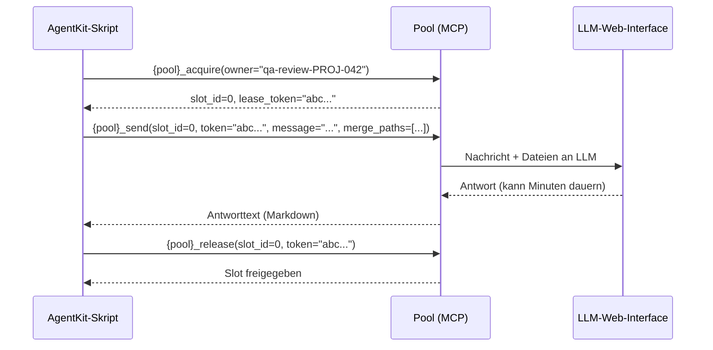
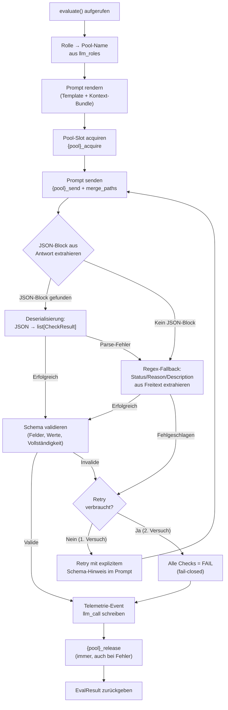

# 11 — LLM-Provider, Browser-Pools und Prompt-Execution

## 11.1 Zwei Einsatzarten von LLMs

AgentKit setzt LLMs in zwei fundamental verschiedenen Modi ein
(FK 4.1). Diese Unterscheidung ist architektonisch tragend und
bestimmt den gesamten technischen Aufbau dieses Kapitels.

| Modus | Wer steuert | Dateisystem | Einsatz |
|-------|------------|-------------|---------|
| **LLM als Agent** | Claude Code (Agent-Plattform) | Ja — liest, schreibt, führt aus | Worker, Adversarial Agent |
| **LLM als Bewertungsfunktion** | Deterministisches Python-Skript | Nein — kein Dateisystem-Zugriff | QA-Bewertung, Semantic Review, Dokumententreue, Governance-Adjudication, Konzept-Feedback |

**LLM als Agent** wird von Claude Code gesteuert. AgentKit hat hier
keinen direkten Einfluss auf den LLM-Aufruf selbst — es steuert
nur den Rahmen (Prompts, Guards, Telemetrie).

**LLM als Bewertungsfunktion** wird vollständig von AgentKit-
Python-Skripten gesteuert. Das Skript baut den Prompt, ruft das
LLM über einen Browser-Pool auf, empfängt die Antwort, validiert
sie und entscheidet. Das LLM hat keinen Dateisystem-Zugriff und
kein autonomes Handeln.

### 11.1.1 Spawn-Contract: Agent vs. LlmEvaluator

Die Unterscheidung zwischen Agent und Bewertungsfunktion (§11.1)
bestimmt, wie eine Rolle technisch realisiert wird. Dieser
Spawn-Contract ist eine architektonische Grenzregel — er definiert
verbindlich, welche Rollen einen Claude-Agent-Spawn erhalten und
welche direkt über den LlmEvaluator geroutet werden.

**Rollen ohne Dateisystem-Zugriff → LlmEvaluator (kein Agent-Spawn):**

Rollen, die ausschließlich Text bewerten — ohne Dateien zu lesen,
zu schreiben oder auszuführen — werden über `LlmEvaluator.evaluate()`
direkt an den konfigurierten MCP-Pool geroutet. Das konfigurierte
LLM wird deterministisch gesteuert: strukturierter Input, definiertes
JSON-Response-Schema, kein autonomes Handeln.

Betroffene Rollen:
- QA-Bewertung (`qa_review`)
- Semantic Review (`semantic_review`)
- Dokumententreue (`doc_fidelity`)
- Governance-Adjudication (`governance_adjudication`)
- Design-Review (`design_review`)
- Design-Challenge (`design_challenge`)

**Rollen mit Dateisystem-Zugriff → Claude-Agent-Spawn:**

Rollen, die autonom mit der Codebase arbeiten müssen — Code lesen,
schreiben, Tests ausführen — spawnen einen Claude-Agent.

Betroffene Rollen:
- Worker (`worker`)
- Adversarial Agent (`adversarial_sparring` — schreibt und
  führt Tests aus)

**Warum kein Agent als Proxy für Bewertungsfunktionen:**

Ein Claude-Agent als Proxy für eine Bewertungsfunktion ist
architektonisch falsch. Der Agent wäre unnötige Indirektion:
höhere Kosten (Claude-Agent-Spawn statt direktem Pool-Call),
geringere Steuerbarkeit (autonomes Agieren statt deterministischem
Skript) und kein funktionaler Nutzen (die Rolle braucht keinen
Dateisystem-Zugriff). Wenn eine Rolle nur Text bewerten soll,
muss die Bewertung deterministisch gesteuert werden.

**Konsequenz für die Verify-Pipeline:**

Layer-2-Reviews (QA-Review, Semantic Review, Design-Review,
Design-Challenge) laufen synchron über den LlmEvaluator innerhalb
des Phase Runners, nicht als gespawnte Agents. Das eliminiert
`agents_to_spawn`-Einträge für Layer 2 und macht die
Verify-Pipeline deterministischer:

- Layer 1 (deterministisch) → Layer 2 (LlmEvaluator, synchron)
  → Layer 3 (Agent-Spawn) → Layer 4 (deterministisch)
- Kein PAUSED/Resume-Zyklus für Layer-2-Reviews
- Der Orchestrator muss Layer-2-Reviews nicht spawnen und
  resumieren — sie sind ein interner Schritt des Phase Runners

**Diversitätsregel (§11.3.2):** Die Diversitätsanforderung gilt
unverändert. `qa_review` und `semantic_review` MÜSSEN verschiedene
Pools nutzen. Dies wird durch die Config-Validierung erzwungen.

*Referenz: DK-01 §1.1 "LLM-Role-Routing und Spawn-Contract"*

## 11.2 LLM-Pool-Abstraktion

### 11.2.1 MCP-Schnittstellenvertrag

AgentKit definiert einen abstrakten Schnittstellenvertrag für
LLM-Session-Pools. Jede Implementierung, die diesen Vertrag über
MCP erfüllt, ist als Pool einsetzbar.

**Pflicht-Tools:**

| MCP-Tool | Semantik | Parameter | Rückgabe |
|----------|---------|-----------|---------|
| `{pool}_acquire` | Slot anfordern (nicht-blockierend) | `owner: str` | `slot_id`, `lease_token`, oder `queued`/`rejected` |
| `{pool}_send` | Nachricht senden, auf Antwort warten (blockierend) | `slot_id`, `token`, `message`, `merge_paths?`, `file_paths?` | Antworttext (Markdown) |
| `{pool}_release` | Slot freigeben | `slot_id`, `token` | Bestätigung |
| `{pool}_health` | Lebendigkeit prüfen | — | `"ok"` oder Fehler |
| `{pool}_pool_status` | Pool-Übersicht | — | Slot-Status, Queue, System |

**Optionale Tools:**

| MCP-Tool | Semantik |
|----------|---------|
| `{pool}_pool_reset` | Kompletter Pool-Reset (Notfall) |
| `{pool}_shutdown` | Graceful Shutdown |

`{pool}` ist der konfigurierte Pool-Name (z.B. `chatgpt`, `gemini`,
`grok`). Der Name wird in `.story-pipeline.yaml` unter `llm_roles`
referenziert.

**Browser-Pool vs. API:** Das FK erlaubt LLM-Aufrufe "über API oder
Browser-Pool" (FK 4.1). Die MCP-Schnittstellenanforderung ist
implementierungsagnostisch — ein Pool kann intern einen Browser
steuern oder eine API aufrufen. AgentKit ist das egal, solange die
MCP-Tools die obige Signatur einhalten. Die aktuelle Referenz-
Implementierung nutzt Browser-Pools (kostenlos, kein API-Key).
Ein API-basierter Pool wäre eine gleichwertige Alternative.

### 11.2.2 Datei-Handling

Alle Pools müssen zwei Datei-Strategien unterstützen:

| Strategie | Dateitypen | Verhalten | Limit |
|-----------|-----------|-----------|-------|
| `merge_paths` | Textdateien (.py, .md, .java, .json, .yaml, ...) | Serverseitig zu einer Datei zusammengefasst, als ein Upload gesendet | Kein Limit (werden gemergt) |
| `file_paths` | Binärdateien (.png, .pdf, .xlsx, ...) | Einzeln hochgeladen | Max 9 pro Send (bzw. 10 ohne merge_paths) |

**Regel:** Alle Textdateien immer in einem einzigen `send`-Call
über `merge_paths`. Nie auf mehrere Sends aufteilen.

### 11.2.3 Acquire/Send/Release-Protokoll



**Fehlerbehandlung im Protokoll:**

| Situation | Reaktion des Skripts |
|-----------|---------------------|
| `acquire` → `queued` | Warten (geschätzte Zeit), erneut `acquire` mit gleichem Owner |
| `acquire` → `rejected` | Pool voll. Retry nach Cooldown oder Abbruch. |
| `send` → Timeout | Release versuchen. Neuer Slot. Retry (max 1). |
| `send` → `lease_expired` (410) | Slot wurde wegen Inaktivität freigegeben. Neuer Acquire nötig. |
| `send` → Login-Fehler (500) | Mensch muss einloggen. Pipeline pausiert mit Hinweis. |
| Jeder Fehler | Release im `finally`-Block. Slot nie offen lassen. |

## 11.3 Modellzuordnung pro Rolle

### 11.3.1 Konfiguration

In `.story-pipeline.yaml` (Kap. 03):

```yaml
llm_roles:
  worker: claude                    # Immer Claude (Agent-Plattform)
  qa_review: chatgpt                # Schicht 2: 12 QA-Checks
  semantic_review: gemini            # Schicht 2: Systemische Bewertung
  adversarial_sparring: grok         # Schicht 3: Edge-Case-Ideen
  doc_fidelity: gemini               # Dokumententreue-Prüfung
  governance_adjudication: gemini   # Governance-Beobachtung
  story_creation_review: chatgpt     # VektorDB-Konfliktbewertung
  concept_feedback_1: chatgpt        # Konzept-Feedback LLM A
  concept_feedback_2: gemini         # Konzept-Feedback LLM B
  design_review: chatgpt             # Exploration: Design-Qualitätsbewertung
  design_challenge: grok             # Exploration: Schwachstellen-Analyse
```

### 11.3.2 Diversitätsregel

Das FK fordert, dass verschiedene LLM-Familien verschiedene Rollen
bedienen (FK-04-019). Die Validierung in `config.py` stellt sicher:

- `worker` ist immer `claude` (Agent-Plattform, nicht änderbar)
- `qa_review` und `semantic_review` müssen verschiedene Pools sein
  (Schicht 2 fordert zwei parallele Bewertungen durch verschiedene LLMs)
- `concept_feedback_1` und `concept_feedback_2` müssen verschiedene
  Pools sein (Konzept-Feedback fordert 2 verschiedene LLM-Familien)
- Mindestens 2 verschiedene Nicht-Claude-Pools müssen in der
  Gesamtkonfiguration vorkommen (empfohlen, nicht erzwungen)

### 11.3.3 Auflösung zur Laufzeit

Wenn ein Pipeline-Skript ein LLM aufrufen will:

1. Rolle bestimmen (z.B. `qa_review`)
2. Pool-Name aus `llm_roles` lesen (z.B. `chatgpt`)
3. MCP-Tool-Prefix ableiten: `chatgpt_acquire`, `chatgpt_send`, ...
4. Acquire/Send/Release ausführen
5. Telemetrie-Event schreiben: `llm_call` mit `pool` und `role`

## 11.4 LLM-Evaluator: Das zentrale Pattern

### 11.4.1 Verantwortung

Der LLM-Evaluator ist das zentrale Python-Modul für alle
"LLM als Bewertungsfunktion"-Aufrufe. Er kapselt das gesamte
Acquire/Send/Release-Protokoll, die Antwort-Validierung und die
Retry-Logik.

### 11.4.2 Schnittstelle

```python
@dataclass(frozen=True)
class CheckResult:
    check_id: str           # z.B. "ac_fulfilled"
    status: str             # PASS | PASS_WITH_CONCERNS | FAIL
    reason: str             # Einzeiler
    description: str        # Max 300 Zeichen

@dataclass(frozen=True)
class EvalResult:
    checks: list[CheckResult]
    raw_response: str       # Vollständige LLM-Antwort (für Logging)
    retry_used: bool        # Wurde ein Retry benötigt?
    pool: str               # Welcher Pool wurde verwendet
    role: str               # Welche Rolle

class LlmEvaluator:
    def __init__(self, config: PipelineConfig): ...

    def evaluate(
        self,
        role: str,                  # z.B. "qa_review"
        prompt_template: Path,      # Prompt-Markdown
        context: dict,              # Story-Daten, Diff, Konzept etc.
        expected_checks: list[str], # IDs der erwarteten Checks
        story_id: str,
        run_id: str,
    ) -> EvalResult: ...
```

### 11.4.3 Interner Ablauf



### 11.4.4 Dreistufige Antwort-Verarbeitung

Die Antwort eines LLMs über Browser-Pool ist unstrukturiert
(Markdown-Text). AgentKit erzwingt strukturierte Antworten über
drei Stufen:

**Stufe 1: Prompt-Template mit JSON-Antwort-Vorgabe**

Jedes Prompt-Template enthält ein explizites Antwortformat mit
JSON-Code-Block. Das LLM wird angewiesen, ausschließlich in diesem
Format zu antworten:

```markdown
Antworte AUSSCHLIESSLICH mit einem JSON-Array im folgenden Format.
Kein Text davor, kein Text danach. Nur der JSON-Block:

```json
[
  {
    "check_id": "ac_fulfilled",
    "status": "PASS | PASS_WITH_CONCERNS | FAIL",
    "reason": "Einzeiler-Begründung",
    "description": "Max 300 Zeichen Beschreibung"
  }
]
```
```

**Stufe 2: JSON-Deserialisierung**

Der Evaluator sucht in der LLM-Antwort nach einem JSON-Code-Block
(eingeleitet durch ` ```json ` oder `[{`). Der gefundene Block wird
durch einen Standard-JSON-Deserialisierer geparst und in eine
`list[CheckResult]` umgewandelt. Das ist der Normalfall.

**Stufe 3: Regex-Fallback (letztes Mittel)**

Nur wenn Stufe 2 scheitert (kein JSON-Block gefunden oder
Parse-Fehler), versucht ein Regex-Fallback die Felder `status`,
`reason` und `description` aus dem Freitext zu extrahieren. Das
ist ein Robustheits-Fallback, kein Regelfall. Er greift z.B. wenn
ein LLM den JSON-Block in Erklärungstext einbettet statt isoliert
zurückzugeben.

**Scheitern alle drei Stufen → Retry (einmalig)**

Der Retry-Prompt enthält einen expliziten Hinweis auf das erwartete
Schema und die Aufforderung, nur JSON ohne Begleittext zu liefern.
Scheitert auch der Retry → alle Checks = FAIL (fail-closed).

### 11.4.4 Regeln (aus FK)

| Regel | Umsetzung | FK-Referenz |
|-------|-----------|-------------|
| Max 2 LLM-Aufrufe pro Check | 1 Versuch + max 1 Retry | FK-05-163 |
| JSON-Response-Schema erzwungen | 3 Felder: Status, Kurzgrund, Description (max 300 Zeichen) | FK-05-158 |
| Regex-Fallback bei Schema-Verletzung | Regex sucht nach Status/Reason/Description in Freitext | FK-05-160 |
| Retry mit Schema-Hinweis | Zweiter Prompt enthält expliziten Hinweis auf erwartetes Schema | FK-05-161 |
| Fail-closed bei Retry-Scheitern | Alle Checks des Aufrufs werden als FAIL gewertet | FK-05-162 |
| Kein Freitext, keine ausufernde Analyse | Description max 300 Zeichen, darüber wird abgeschnitten | FK-05-159 |
| Ein FAIL blockiert Story | Aggregation: ein einziges FAIL in irgendeinem Check → Story blockiert | FK-05-164 |
| PASS_WITH_CONCERNS blockiert nicht | Fließt als Warnung in Policy + Ansatzpunkt für Adversarial | FK-05-165/166 |
| Release immer im finally-Block | Slot wird bei jedem Ausgang freigegeben | Protokoll-Pflicht |

### 11.4.5 Prompt-Rendering

Der Evaluator rendert Prompts aus Markdown-Templates. Die Templates
liegen in `prompts/` und verwenden Platzhalter:

```markdown
# QA-Bewertung für Story {{story_id}}

## Kontext
{{story_description}}

## Code-Diff
{{diff}}

## Konzept/Entwurf
{{concept_content}}

## Handover-Paket
{{handover_content}}

## Aufgabe
Bewerte die Implementierung anhand der folgenden 12 Checks.
Antworte AUSSCHLIESSLICH im folgenden JSON-Format:

```json
[
  {
    "check_id": "ac_fulfilled",
    "status": "PASS",
    "reason": "Einzeiler-Begründung",
    "description": "Max 300 Zeichen Beschreibung"
  },
  ...
]
```

Status-Werte: PASS, PASS_WITH_CONCERNS, FAIL
```

Die Platzhalter werden vom Evaluator aus dem `context`-Dict befüllt.
Fehlende Platzhalter → Fehler (fail-closed, kein stilles Ignorieren).

**Kontext-Bundles statt monolithischem Merge:**

Der Evaluator sendet nicht alle verfügbaren Textdateien als einen
undifferenzierten Merge. Stattdessen werden pro Rolle feste
Kontext-Bundles zusammengestellt, die nur die für diese Bewertung
relevanten Informationen enthalten:

| Bundle | Inhalt | Verwendet von |
|--------|--------|--------------|
| `story_spec` | Story-Beschreibung, Akzeptanzkriterien, Typ, Größe | Alle Evaluator-Rollen |
| `diff_summary` | Git-Diff der Implementierung | QA-Review, Semantic Review, Umsetzungstreue |
| `concept_excerpt` | Relevante Abschnitte aus Konzept/Entwurf | QA-Review, Entwurfstreue, Umsetzungstreue |
| `handover` | Handover-Paket des Workers | QA-Review, Adversarial |
| `arch_references` | Architektur-/Strategiedokumente (gefiltert durch Kontext-Selektion P6) | Dokumententreue alle Ebenen |
| `evidence_manifest` | Vorhandene Test-/QA-Ergebnisse | Semantic Review |

Jedes Bundle hat ein implizites Token-Limit. Überlange Inhalte
werden mit dokumentiertem Kürzungsprotokoll (Anfang + Ende
beibehalten, Mitte kürzen, Hinweis auf Kürzung im Prompt)
behandelt. Das stellt sicher, dass die Signalqualität für den
jeweiligen Bewertungskontext optimiert ist — konsistent mit
der Kontext-Selektion (P6).

### 11.4.6 Vollständiges Logging

Für jeden LLM-Evaluator-Aufruf wird protokolliert:

**In der Telemetrie-DB (PostgreSQL):**
```sql
INSERT INTO execution_events (
    project_key, story_id, run_id, event_id, event_type, occurred_at,
    source_component, severity, payload
)
VALUES (
    'odin-trading', 'PROJ-042', 'a1b2...', 'evt-001', 'llm_call', '...',
    'llm_evaluator', 'info',
    '{"pool":"chatgpt","role":"qa_review","retry":false,"check_count":12,"status":"PASS"}'
);
```

**Im QA-Artefakt** (z.B. `qa_review.json`):
- Vollständiger gerenderter Prompt (für Reproduzierbarkeit)
- Vollständige LLM-Antwort (roh)
- Geparste CheckResults
- Retry-Info (wurde Retry gebraucht, warum)
- Timestamps (start, end)

## 11.5 Zwei technische Primitive für LLM-Aufrufe

AgentKit hat zwei verschiedene Aufrusmuster für LLMs als
Bewertungsfunktion. Sie lösen verschiedene Probleme und haben
verschiedene Fehlerbilder.

### 11.5.1 StructuredEvaluator (CheckResult-basiert)

Für Einmalbewertungen mit strukturierter JSON-Antwort. Nutzt das
dreistufige Antwort-Verarbeitungspattern (11.4.4). Liefert
`list[CheckResult]`.

| Einsatzstelle | Rolle (`llm_roles`) | Erwartete Checks | Prompt-Template | Auslöser |
|--------------|--------------------|-----------------|--------------------|----------|
| **Verify Schicht 2: QA-Bewertung** | `qa_review` | 12 Checks (FK-05-168 bis FK-05-179) | `prompts/qa-semantic.md` | Phase Runner nach Schicht 1 PASS |
| **Verify Schicht 2: Semantic Review** | `semantic_review` | 1 Check (systemische Angemessenheit) | `prompts/qa-semantic-review.md` | Parallel zu QA-Bewertung |
| **Exploration: Design-Review** | `design_review` | 1 Check (Design-Qualität) | `prompts/design-review.md` | Phase Runner nach Exploration (Stufe 2a) |
| **Exploration: Design-Challenge** | `design_challenge` | 1 Check (Schwachstellen-Analyse) | `prompts/design-challenge.md` | Phase Runner nach Design-Review (Stufe 2b) |
| **Dokumententreue Ebene 1: Zieltreue** | `story_creation_review` | 1 Check (Strategie-Konformität) | `prompts/doc-fidelity-goal.md` | Story-Erstellungs-Skill |
| **Dokumententreue Ebene 2: Entwurfstreue** | `doc_fidelity` | 1 Check (Architektur-Konformität) | `prompts/doc-fidelity-design.md` | Phase Runner nach Exploration |
| **Dokumententreue Ebene 3: Umsetzungstreue** | `doc_fidelity` | 1 Check (Implementierung = Konzept) | `prompts/doc-fidelity-impl.md` | Phase Runner in Verify |
| **Dokumententreue Ebene 4: Rückkopplungstreue** | `doc_fidelity` | 1 Check (Doku aktuell?) | `prompts/doc-fidelity-feedback.md` | Phase Runner vor Closure |
| **Governance-Adjudication** | `governance_adjudication` | 1 Check (Incident-Klassifikation) | `prompts/governance-adjudication.md` | Governance-Beobachtung bei Schwellenüberschreitung |
| **VektorDB-Konfliktbewertung** | `story_creation_review` | 1 Check (Duplikat/Überschneidung) | `prompts/vectordb-conflict.md` | Story-Erstellungs-Skill nach VektorDB-Abgleich |
| **Failure Corpus: Invariante schärfen** | konfigurierbar | 1 Check (geschärfte Regel) | `prompts/fc-sharpen-invariant.md` | Check-Ableitung Schritt 1 |
| **Failure Corpus: Check-Proposal** | konfigurierbar | 1 Check (Proposal) | `prompts/fc-check-proposal.md` | Check-Ableitung Schritt 3 |

### 11.5.2 DialogueRunner (Freiformat, mehrturnig)

Für Sparring- und Feedback-Dialoge, bei denen die inhaltliche
Antwort verarbeitet werden muss, nicht ein strukturiertes
Prüfergebnis. Eigenes Transcript-Schema, Turn-Limits, separates
Logging.

```python
@dataclass(frozen=True)
class DialogueTurn:
    role: str           # "agentkit" oder "llm"
    content: str        # Vollständiger Text
    ts: str             # ISO 8601

@dataclass(frozen=True)
class DialogueResult:
    transcript: list[DialogueTurn]  # Vollständiger Dialog
    pool: str
    role: str
    turn_count: int

class DialogueRunner:
    def __init__(self, config: PipelineConfig): ...

    def run(
        self,
        role: str,              # z.B. "concept_feedback_1"
        prompt_template: Path,
        context: dict,
        story_id: str,
        run_id: str,
        max_turns: int = 3,     # Begrenzung der Dialogrunden
    ) -> DialogueResult: ...
```

**Unterschiede zum StructuredEvaluator:**

| Aspekt | StructuredEvaluator | DialogueRunner |
|--------|-------------------|---------------|
| Antwortformat | JSON (CheckResult) | Freitext (Markdown) |
| Turns | 1 (+ max 1 Retry) | 1-N (konfigurierbar) |
| Validierung | Schema-Validierung, Regex-Fallback | Keine Schema-Validierung |
| Logging | CheckResults + Roh-Antwort | Vollständiger Transcript (Prompt + Response pro Turn) |
| Fail-Modus | Fail-closed (FAIL bei Parse-Fehler) | Kein automatisches FAIL — der QA-Agent bewertet den Transcript |

| Einsatzstelle | Rolle (`llm_roles`) | Prompt-Template | Auslöser |
|--------------|--------------------|--------------------|----------|
| **Konzept-Feedback LLM A** | `concept_feedback_1` | `prompts/concept-feedback.md` | Konzept-Story Pflicht-Loop |
| **Konzept-Feedback LLM B** | `concept_feedback_2` | `prompts/concept-feedback.md` | Konzept-Story Pflicht-Loop |
| **Failure Corpus: Invariante schärfen** | konfigurierbar | 1 Check (geschärfte Regel) | `prompts/fc-sharpen-invariant.md` | Check-Ableitung Schritt 1 |
| **Failure Corpus: Check-Proposal** | konfigurierbar | 1 Check (Proposal) | `prompts/fc-check-proposal.md` | Check-Ableitung Schritt 3 |

**Konzept-Feedback** ist der einzige Einsatzfall, der nicht das
CheckResult-Schema verwendet. Hier wird der volle Antworttext
geloggt, weil das Feedback inhaltlich verarbeitet werden muss
(Einarbeitung oder begründete Ablehnung).

## 11.6 Timeout- und Budget-Strategie

### 11.6.1 Timeouts

| Operation | Timeout | Begründung |
|-----------|---------|------------|
| `{pool}_acquire` | 30 Sekunden | Nicht-blockierend; bei `queued` Retry nach geschätzter Wartezeit |
| `{pool}_send` | 2400 Sekunden (40 Min) | LLMs können bei großen Inputs lange brauchen |
| `{pool}_release` | 10 Sekunden | Sollte sofort gehen |
| Acquire-Retry (bei `queued`) | Max 5 Versuche | Danach Abbruch mit Fehler |
| Gesamter Evaluator-Aufruf | 2500 Sekunden | Send-Timeout + Overhead |

### 11.6.2 Kosten-Budget

Browser-Pool-Aufrufe sind kostenlos (kein API-Key, Browser-Session).
Es gibt daher kein monetäres Budget. Aber:

| Budget | Limit | Config-Pfad | Durchsetzung |
|--------|-------|-------------|-------------|
| Web-Calls (Research-Stories) | 200 pro Story | `telemetry.web_call_budget` | Budget-Hook blockiert bei Überschreitung |
| LLM-Aufrufe pro Check | 2 (1 + 1 Retry) | Fest im Code | LLM-Evaluator |
| LLM-Aufrufe pro Verify-Durchlauf | Nicht begrenzt | — | Schicht 2 + 3 bestimmen die Anzahl |
| Pool-Slots pro AgentKit-Aufruf | 1 (sequentiell) | — | Acquire/Release-Protokoll |

### 11.6.3 Rate-Limiting

AgentKit selbst hat kein Rate-Limiting. Die Pools regeln das
intern (Slot-Pool-Architektur mit Queue). Wenn alle Slots belegt
sind, wartet der Evaluator in der Acquire-Queue.

## 11.7 Parallele LLM-Bewertungen

Schicht 2 der Verify-Phase fordert zwei parallele LLM-Bewertungen
(FK-05-153): QA-Bewertung (LLM A) und Semantic Review (LLM B).

Gemäß dem Spawn-Contract (§11.1.1) laufen diese Reviews **synchron
innerhalb des Phase Runners** über den LlmEvaluator — nicht als
gespawnte Claude-Agents. Der Phase Runner ruft
`LlmEvaluator.evaluate()` direkt auf, wartet auf das Ergebnis und
fährt fort. Es gibt keine `agents_to_spawn`-Einträge für Layer-2-
Reviews und keinen PAUSED/Resume-Zyklus.

### 11.7.1 Technische Umsetzung

```python
import concurrent.futures

def run_verify_layer2(evaluator: LlmEvaluator, ctx: VerifyContext) -> Layer2Result:
    """Layer-2-Reviews: synchron im Phase Runner, kein Agent-Spawn."""
    with concurrent.futures.ThreadPoolExecutor(max_workers=2) as pool:
        future_qa = pool.submit(
            evaluator.evaluate,
            role="qa_review",
            prompt_template=Path("prompts/qa-semantic.md"),
            context=ctx.to_dict(),
            expected_checks=QA_CHECK_IDS,  # 12 Check-IDs
            story_id=ctx.story_id,
            run_id=ctx.run_id,
        )
        future_sem = pool.submit(
            evaluator.evaluate,
            role="semantic_review",
            prompt_template=Path("prompts/qa-semantic-review.md"),
            context=ctx.to_dict(),
            expected_checks=["systemic_adequacy"],
            story_id=ctx.story_id,
            run_id=ctx.run_id,
        )

    qa_result = future_qa.result()
    sem_result = future_sem.result()

    # Aggregation: Ein FAIL blockiert
    all_checks = qa_result.checks + sem_result.checks
    has_fail = any(c.status == "FAIL" for c in all_checks)
    concerns = [c for c in all_checks if c.status == "PASS_WITH_CONCERNS"]

    return Layer2Result(
        status="FAIL" if has_fail else "PASS",
        checks=all_checks,
        concerns=concerns,  # Weitergabe an Adversarial als Ansatzpunkte
    )
```

Beide Aufrufe acquiren jeweils einen eigenen Pool-Slot (verschiedene
Pools, verschiedene Owner-Namen). Es gibt keine Slot-Konflikte.

Die Diversitätsregel (§11.3.2) wird durch die parallele Ausführung
auf verschiedenen Pools strukturell erzwungen: `qa_review` und
`semantic_review` müssen verschiedene Pools nutzen, was gleichzeitig
Slot-Konflikte innerhalb eines einzelnen Pools ausschließt.

## 11.8 Adversarial-Sparring-Protokoll

Der Adversarial Agent (Schicht 3) ist ein Claude-Code-Sub-Agent,
kein LLM-Evaluator-Aufruf. Aber er hat die **Pflicht**, ein
zweites LLM als Sparring-Partner zu holen (FK-05-189).

### 11.8.1 Ablauf

1. Phase Runner spawnt Adversarial Agent mit Prompt
   `adversarial-testing.md`
2. Agent liest Implementierung + Handover + Concerns aus Schicht 2
3. **Agent entwickelt eigenständig Edge Cases** — analysiert die
   Implementierung, identifiziert Schwachstellen, Grenzwerte,
   Fehlerpfade, Race Conditions, Missbrauchsszenarien
4. Agent schreibt erste Tests in Sandbox
   (`_temp/adversarial/{story_id}/`) und führt sie aus
5. **Danach Sparring:** Agent ruft konfigurierten Sparring-Pool auf
   (`{adversarial_sparring}_acquire` → `send` → `release`),
   beschreibt was er bereits getestet hat und fragt gezielt:
   "Welche Edge Cases habe ich übersehen?"
6. Sparring-LLM liefert zusätzliche Ideen, die der Agent selbst
   nicht gefunden hat
7. Agent setzt die Sparring-Ideen in weitere Tests um, führt sie aus
8. Ergebnis: Mängelliste oder "keine Befunde"

**Wichtig:** Der Adversarial Agent ist kein passiver Umsetzer von
Sparring-Input. Er ist selbst ein kompetenter Tester, der die
Implementierung eigenständig angreift. Das Sparring ist eine
**Erweiterung seines Angriffsradius** — es liefert die blinden
Flecken, die er selbst hat, nicht den gesamten Testplan.

### 11.8.2 Telemetrie

| Event | Wann |
|-------|------|
| `llm_call` mit `role=adversarial_sparring` | Agent ruft Sparring-Pool auf |
| `adversarial_test_created` | Agent schreibt Test-Datei in Sandbox |
| `adversarial_test_executed` | Agent führt Test aus |

Das Integrity-Gate prüft, dass mindestens ein
`adversarial_sparring`-Call in der Telemetrie vorliegt
(Pflicht-Nachweis).

---

*FK-Referenzen: FK-04-005 bis FK-04-011 (LLM-Einsatzarten),
FK-04-018 bis FK-04-020 (Multi-LLM-Pflicht, Rollenzuordnung),
FK-05-153 bis FK-05-166 (Schicht 2: parallele LLM-Bewertungen,
Response-Schema, Retry, Aggregation),
FK-05-184 bis FK-05-191 (Adversarial + Sparring-Pflicht),
FK-06-090/091 (Multi-LLM-Nachweis im Integrity-Gate)*
