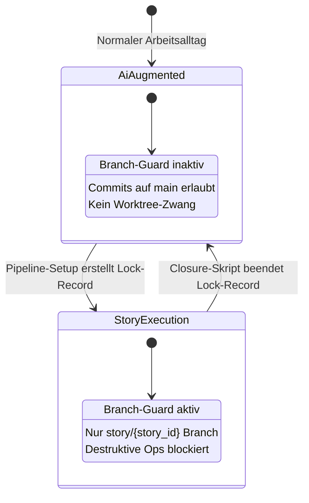
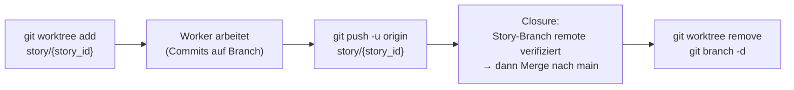

# 12 — GitHub-Integration und Repo-Operationen

<!-- PROSE-FORMAL: formal.story-creation.state-machine, formal.story-creation.commands, formal.story-creation.invariants, formal.story-closure.state-machine, formal.story-closure.commands, formal.story-closure.invariants, formal.story-closure.scenarios, formal.story-split.commands, formal.story-split.invariants -->

## 12.1 GitHub als Code-Backend

GitHub dient AgentKit als externes Code-Backend fuer Repositories,
Branches, Pull Requests und Merge:

| Zweck | GitHub-Feature | Zugriff |
|-------|---------------|--------|
| Code-Verwaltung | Repositories | `git` CLI (lokal) + `gh` CLI (remote) |

AgentKit betreibt keinen eigenen GitHub-Adapter oder REST-Client.
Alle GitHub-Interaktionen laufen über die `gh`/`git` CLI, die
Authentifizierung, Token-Handling und Retry selbst übernimmt.

### 12.1.1 Abgrenzung zur Story-Autoritaet

Story-Identitaet, Story-Status, Board-Sichten und Story-Detaildaten
liegen ausschliesslich im **AK3-Story-Backend** (siehe FK-17 / FK-18
fuer Datenmodell und Persistenz, FK-91 fuer die Control-Plane-API).
GitHub ist nicht die Wahrheitsquelle fuer Story-Lifecycle und enthaelt
kein Story-Tracking. GitHub bleibt ausschliesslich:

- Repository-Backend fuer Code-Operationen
- Branch-/PR-Mechanik fuer Story-Branches `story/{story_id}`

Statuswechsel, Story-Attribute, Closure-Metriken, Dependencies und
administrative Operationen werden ueber den AK3-Story-Service
ausgefuehrt, nicht ueber GitHub-Mechanik.

### 12.1.2 Fehlerbehandlung bei GitHub-Ausfällen

| Situation | Betrifft | Reaktion |
|-----------|---------|---------|
| GitHub nicht erreichbar bei Push (Closure) | `git push origin story/{story_id}` scheitert | Closure FAIL → Eskalation. Merge wurde nicht gestartet (Closure-Substates). |
| Rate Limiting (403) | Alle API-Calls | Retry mit Backoff (1s, 2s, 4s). Max 3 Retries. Danach FAIL. |
| Token abgelaufen | Alle API-Calls | `gh auth status` prüfen. Mensch muss `gh auth login` ausführen. |

## 12.4 Branching-Protokoll

### 12.4.1 Zwei Betriebsmodi

AgentKit unterscheidet zwei grundlegend verschiedene Arbeitsweisen
mit dem Agent-Harness (Claude Code, Codex; FK-76). Der
Branch-Guard muss beide unterstützen.

**AI-Augmented-Modus (kein Story-Lauf aktiv):**

Der Mensch arbeitet interaktiv mit dem Harness — kleinere Änderungen,
Konzeptanpassungen, explorative Aufgaben. Kein Orchestrator, keine
Pipeline, keine Guards. Der Harness committet direkt auf `main`.
Das ist der normale Arbeitsalltag.

**Story-Execution-Modus (Pipeline aktiv):**

Die Story-Umsetzungs-Pipeline läuft. Der Orchestrator steuert
Worker und QA-Agents. Alle Änderungen müssen auf dem Story-Branch
stattfinden. Destruktive Git-Operationen werden blockiert.

**Technische Umsetzung:**

Der Branch-Guard nutzt denselben Lock-Record-Mechanismus wie der
QA-Artefakt-Schutz (Kap. 02.7): Er ist nur aktiv, wenn ein
Story-Execution-Lock-Record existiert.

| Zustand | Lock-Record | Branch-Guard | Erlaubt |
|---------|-----------|-------------|---------|
| AI-Augmented | Kein aktiver Story-Lock | **Inaktiv** | Commits auf `main`, freies Arbeiten |
| Story-Execution | Aktiver Lock-Record `(project_key, story_id, run_id, lock_type)` | **Aktiv** | Nur Commits auf `story/{story_id}`, destruktive Ops blockiert |



Damit ist sichergestellt, dass:
- Im normalen Arbeitsalltag keine unnötigen Einschränkungen gelten
- Sobald die Story-Pipeline startet, die vollen Guardrails greifen
- Der Übergang automatisch über den Lock-Record gesteuert wird,
  nicht über manuelle Konfiguration
- Der Agent den Branch-Guard nicht selbst aktivieren oder
  deaktivieren kann (Pipeline-Tooling steuert den Lock-Record)

### 12.4.2 Branch-Namenskonvention

| Branch-Typ | Format | Beispiel | Betriebsmodus |
|-----------|--------|---------|--------------|
| Main-Branch | `main` | `main` | AI-Augmented (direkte Commits) |
| Story-Branch | `story/{story_id}` | `story/ODIN-042` | Story-Execution (isoliert) |

Ein Branch = eine Story. Keine generischen Branch-Prefixes, keine
Ticket-Nummern über die Story-ID hinaus.

### 12.4.3 Branch-Lebenszyklus (Story-Execution)



**Normative Klarstellung:** Closure darf nicht auf nur lokal
vorhandenen Commits arbeiten. Vor jedem Merge muss der aktuelle
Story-Branch in allen beteiligten Repos erfolgreich auf den Remote
gepusht worden sein. Erst danach darf der Merge nach `main`
beginnen.

### 12.4.4 Commit-Konventionen (Story-Execution)

| Regel | Durchsetzung | Nur bei Story-Execution |
|-------|-------------|------------------------|
| Story-ID im Commit-Trailer | Structural Check `branch.commit_trailers` | Ja |
| Commits nur auf Story-Branch | Branch-Guard blockiert Main-Push | Ja (Guard inaktiv im AI-Augmented-Modus) |
| Kein Force-Push | Branch-Guard blockiert `--force` | Ja |

**Commit-Trailer-Format:**

```
feat: implement broker API integration

Story-ID: ODIN-042
```

Der Structural Check prüft, ob die Story-ID im letzten Commit
enthalten ist (als Trailer oder im Commit-Body).

## 12.5 Worktree-Management

### 12.5.1 Worktree-Erstellung (Setup-Phase)

```python
def setup_worktree(story_id: str, base_ref: str = "main") -> WorktreeResult:
    """
    1. git fetch origin (non-fatal bei Fehler)
    2. Prüfe: Branch story/{story_id} darf nicht existieren
    3. Prüfe: Worktree-Pfad darf nicht existieren
    4. git worktree add worktrees/{story_id} -b story/{story_id} {base_ref}
    5. Schreibe optionalen .agent-guard/lock.json-Export im Worktree
    6. Bei Fehler: Best-effort Cleanup
    """
```

Bei Multi-Repo-Stories wird `setup_worktree` pro teilnehmendem Repo
aufgerufen (FK-22 §22.6.2 `setup_worktrees`). Branch-Name
`story/{story_id}` ist identisch in allen teilnehmenden Repos.

**Worktree-Pfad:** `worktrees/{story_id}` (relativ zum Projekt-Root)

**`.agent-guard/lock.json`** im Worktree:

```json
{
  "project_key": "odin-trading",
  "story_id": "ODIN-042",
  "run_id": "a1b2c3d4-...",
  "branch": "story/ODIN-042",
  "created_at": "2026-03-17T10:00:00+01:00"
}
```

Diese Datei ist nur ein lokaler Control-Plane-Export fuer Worktree-
Tooling. Der Branch-Guard aktiviert sich kanonisch ueber den
zentralen Lock-Record.

### 12.5.2 Worktree-Merge (Closure-Phase)

**Ordnung defers_to FK-29:** Die *Reihenfolge* der Closure-Schritte —
insbesondere dass der latest `main` zuerst in den Story-Branch
integriert, der integrierte Kandidat **frisch** per SonarQube vermessen
(commit-gebundene Attestation), das Integrity-Gate (inkl. Dimension 9)
**nach** dem Scan und **vor** Push/Merge ausgewertet, und der gesamte
Block **innerhalb des Merge-Serialisierungs-Locks** ausgefuehrt wird —
ist normativ in **FK-29 §29.1a** (Pre-Merge-Scan-und-Merge-Block)
festgelegt. Der Sonar-Scan und die Dimension 9 gelten nur im
APPLICABLE-Fall des `sonarqube_gate` (FK-33 §33.6.5); bei abwesendem
Sonar (`sonarqube.available=false`) bzw. `mode=fast` entfallen sie (ohne
Fail-Closed bzw. ersetzt durch das Sanity-Gate), waehrend die uebrigen
Git-Mechaniken und der Merge-Lock unveraendert greifen. FK-12 ownt
ausschliesslich die einzelnen **Git-Mechaniken**, die FK-29 in dieser
Ordnung aufruft; FK-12 schreibt **keine** eigene Closure-Sequenz mehr vor.

Git-Primitiven, die FK-29 §29.1a in der dort definierten Reihenfolge
nutzt (alle innerhalb des Merge-Locks, gegen den gepushten,
gruen-vermessenen Story-Branch):

```python
def merge_worktree(story_id: str, *, merge_policy: str = "ff_only") -> MergeResult:
    """Git-Mechaniken; Reihenfolge/Gating siehe FK-29 §29.1a (defers_to).

    Primitiven (NICHT die Ablauf-Ordnung — die ownt FK-29):
    - git fetch origin; integrate origin/main -> story/{story_id}
    - git clean -xfd  (sauberer, reproduzierbar vermessener Tree)
    - git push origin story/{story_id}                 # finaler Integrationsstand
    - git merge --ff-only story/{story_id}              # merge_policy == "ff_only"
      oder git merge --no-ff story/{story_id}           # merge_policy == "no_ff"
      jeweils compare-and-swap/lease gegen locked_sha (FK-29 §29.1a Punkt 7)
    - git push origin main
    - Bei Push- oder Merge-Fehler: FAIL -> Eskalation (FK-29 closure-verdict)
    """
```

Der frueher hier beschriebene Ablauf „push -> checkout/pull main ->
merge -> push main" ist durch FK-29 §29.1a abgeloest: der Push des
Story-Branch liegt **innerhalb** des Locks nach gruener Messung, und es
gibt kein separates `checkout/pull main` mehr, weil `main` ueber ein
ff-only CAS/Lease-Update gegen `locked_sha` aktualisiert wird.

Bei Multi-Repo-Stories wird die Merge-Mechanik nicht pro Repo
einzeln in dieser Reihenfolge entschieden, sondern als atomare
Per-Repo-Pre-Merge-Scan-und-Merge-Bloecke ueber alle teilnehmenden
Repos (FK-29 §29.1.6 mit `pre_merge_sha`-Rollback und per-Repo-Lock).
Die obigen Primitiven beschreiben nur den Single-Repo-Fall.

**Vorgeschriebene Merge-Policy:**

- Standard: `ff_only`
- Offizieller Fallback: `no_ff`

Wenn der Story-Branch nicht fast-forward-fähig ist, darf die Pipeline
nicht in manuelle Git-Recovery ausweichen. Der normative Recovery-Pfad
ist ein erneuter Closure-Lauf mit offizieller Merge-Policy
`no_ff`. Manuelle Rebases, Force-Pushes oder Guard-Umgehungen sind
nicht Teil des Sollprozesses.

**Vorgeschriebener Remote-Stand:** Der Merge nach `main` arbeitet
immer gegen den bereits gepushten Story-Branch. Closure ist damit
nicht nur ein lokaler Merge-Ablauf, sondern ein Remote-synchroner
Integrationsschritt.

### 12.5.3 Worktree-Teardown (Closure-Phase)

```python
def teardown_worktree(story_id: str) -> None:
    """
    1. git worktree remove worktrees/{story_id} --force
    2. git branch -d story/{story_id}
    3. .agent-guard/lock.json wird mit Worktree gelöscht
    """
```

Wird nur nach erfolgreichem Merge aufgerufen (Closure-Substates).
Bei Multi-Repo-Stories wird `teardown_worktree` pro teilnehmendem
Repo aufgerufen; idempotent.

## 12.6 Multi-Repo-Unterstützung

### 12.6.1 Konfiguration

In `project.yaml` werden teilnehmende Repos unter `repositories[]`
konfiguriert (siehe FK-10 `project.yaml`-Schema):

```yaml
repositories:
  - name: backend
    path: "."
    language: python
    test_command: "pytest"
    build_command: "ruff check"
  - name: frontend
    path: "../trading-ui"
    language: typescript
    test_command: "npm test"
    build_command: "npm run build"
  - name: wiki
    path: "../trading-wiki"
    language: markdown
```

[Entscheidung 2026-05-04 — Repo-Identifikation] Identifikator ist
der Repo-`name` (String). Es gibt keinen separaten Repo-Schluessel.
`participating_repos` einer Story (FK-22 §22.6.1) referenziert die
Namen aus dieser Liste.

### 12.6.2 Auswirkungen auf Pipeline

| Aspekt | Single-Repo | Multi-Repo |
|--------|------------|-----------|
| Worktree | 1 Worktree | 1 Worktree pro teilnehmendem Repo |
| Branch | 1 Branch `story/{story_id}` | 1 Branch pro Repo, gleicher Name |
| Structural Checks | 1 Durchlauf | 1 Durchlauf pro Repo |
| Merge | 1 Push + 1 Merge | Atomare Gruen-und-FF-Mergbarkeits-Barriere (alle Repos, ohne Push) VOR dem ersten Push; danach N Pushes + N Merges, die Cross-Remote NICHT transaktional atomar sind — partieller Push eskaliert (ESCALATED) mit kompensierender Recovery (FK-29 §29.1.6) |
| Scope-Erkennung | Aus Diff | Aus Diff pro Repo |

**Multi-Repo-Closure (praezise Garantie statt Pseudo-Atomicity):** Die
Closure garantiert eine **atomare Gruen-und-FF-Mergbarkeits-Barriere**
ueber **alle** teilnehmenden Repos, **bevor** auf irgendeinem Repo ein
Push beginnt: kein `main` wird sichtbar veraendert, solange nicht alle
Repos gruen **und** ff-mergebar sind. Cross-Remote-Push ueber mehrere
Git-Hosts ist hingegen **nicht** transaktional atomar; faellt ein Push
in Repo k aus, nachdem 1..k-1 bereits remote gepusht wurden, ist der
partielle Main-Zustand **kein** stiller Abschluss, sondern ein
**eskalierter** Endzustand (ESCALATED) mit dokumentierter kompensierender
Recovery (FK-29 §29.1.6, §29.1.6.3). Closure-Substates tracken
Push- und Merge-Status pro Repo ueber `ClosurePayload.multi_repo`
(FK-39 §39.2.3). Worker-Modell und Spawn-Worktree siehe FK-22 §22.6.4.

## 12.7 GitHub-Operationen in der Pipeline

### 12.7.1 Übersicht: Wann wird GitHub kontaktiert

| Phase | Operation | GitHub-Feature | Richtung |
|-------|----------|---------------|---------|
| **Setup** | Story-Branch `story/{story_id}` anlegen, Worktree mounten | Repository | Schreiben (lokal) |
| **Worker** | Commits, ggf. Push auf Story-Branch | Repository Remote | Schreiben |
| **Closure** | Story-Branch auf Remote pushen, Merge nach `main` | Repository Remote | Schreiben |

Story-Status, Story-Attribute, Story-Erstellung, Story-Closure-Status
und Closure-Metriken laufen ueber das AK3-Story-Backend
(FK-17/FK-18/FK-91), nicht ueber GitHub.

### 12.7.2 Kein Webhook/Polling

AgentKit verwendet kein Webhook- oder Polling-basiertes
Event-System von GitHub. Alle Interaktionen sind synchrone
Request/Response-Aufrufe, ausgelöst durch Pipeline-Schritte.

Der Orchestrator-Agent entscheidet, welche Story als nächstes
bearbeitet wird, indem er das AK3-Story-Backend nach freigegebenen
(`Approved`) Stories abfragt. Das ist eine Agent-Entscheidung, kein
automatisierter Trigger.

---

*FK-Referenzen: FK-05-003 (5 Story-Zustände),
FK-05-031/032 (Backlog→Approved),
FK-05-059/060 (Preflight: Story existiert, Status Approved),
FK-05-067 (Worktree mit eigenem Branch),
FK-05-223/224 (Merge vor Closure-Status Done),
FK-06-010 bis FK-06-016 (Branch-Guard-Regeln)*
