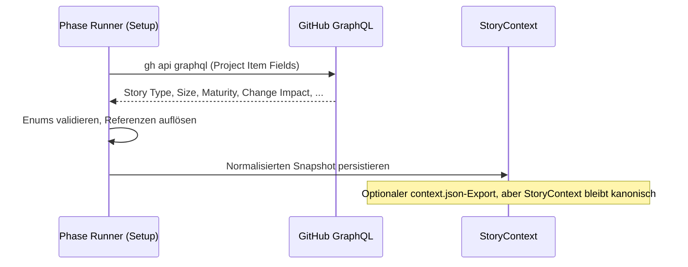
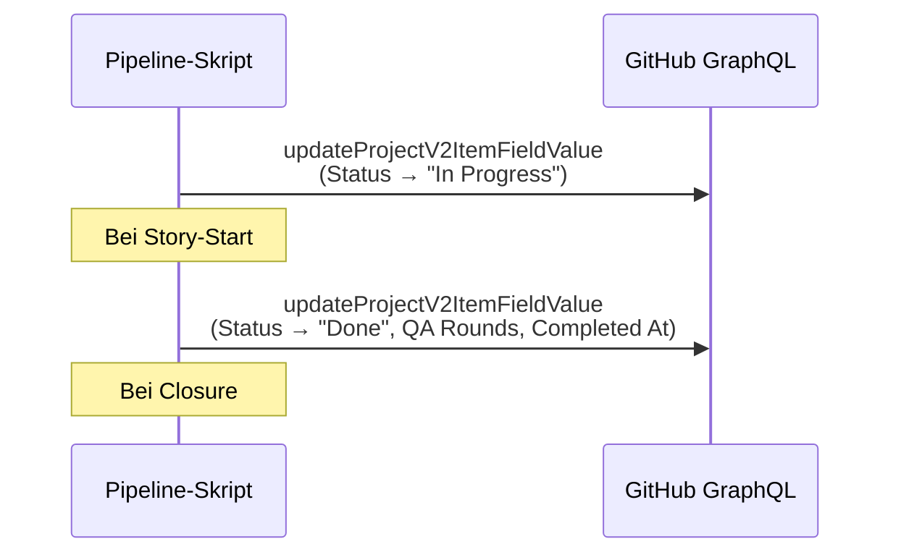
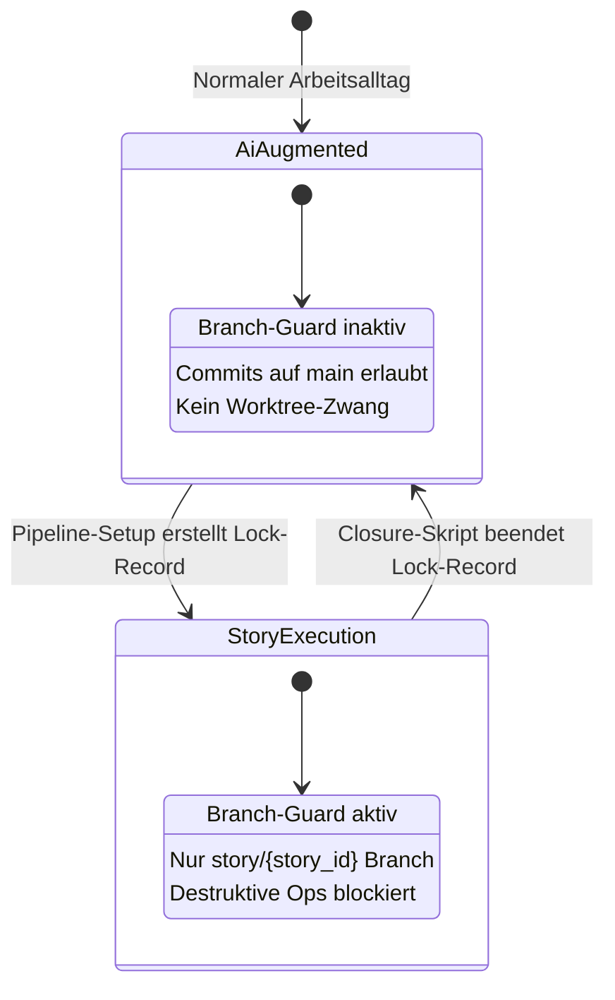
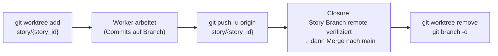

# 12 — GitHub-Integration und Repo-Operationen

<!-- PROSE-FORMAL: formal.story-creation.state-machine, formal.story-creation.commands, formal.story-creation.invariants, formal.story-closure.state-machine, formal.story-closure.commands, formal.story-closure.invariants, formal.story-closure.scenarios, formal.story-split.commands, formal.story-split.invariants -->

## 12.1 GitHub als Backend

GitHub dient AgentKit als externes Backend für drei Zwecke:

| Zweck | GitHub-Feature | Zugriff |
|-------|---------------|--------|
| Story-Verwaltung | Issues | `gh issue` CLI |
| Projekt-Steuerung | Projects V2 (Custom Fields) | GraphQL API via `gh api graphql` |
| Code-Verwaltung | Repositories | `git` CLI (lokal) + `gh` CLI (remote) |

AgentKit betreibt keinen eigenen GitHub-Adapter oder REST-Client.
Alle GitHub-Interaktionen laufen über die `gh` CLI, die
Authentifizierung, Token-Handling und Retry selbst übernimmt.

## 12.2 GitHub Project V2: Custom Fields

### 12.2.1 Feldkatalog

Der Installer (Checkpoint 4) stellt sicher, dass diese Custom Fields
im GitHub Project V2 existieren. Er prüft den bestehenden Zustand
und erstellt nur fehlende Fields/Options. Bereits vorhandene Fields
werden nicht verändert oder überschrieben (Idempotenz).

| Feld | Typ | Werte | Setzung | Gelesen von |
|------|-----|-------|---------|-------------|
| `Status` | Single Select | Backlog, Approved, In Progress, Done, Cancelled | Mensch (Freigabe), Pipeline (In Progress, Done), administrative Services (Cancelled) | Preflight, Closure, Story-Split |
| `Story ID` | Text | z.B. `ODIN-042` | Story-Erstellung | Alle Pipeline-Schritte |
| `Story Type` | Single Select | implementation, bugfix, concept, research | Story-Erstellung | Mode-Router, Phase Runner, Structural Checks |
| `Size` | Single Select | XS, S, M, L, XL, XXL | Story-Erstellung | Worker (Review-Häufigkeit) |
| `Change Impact` | Single Select | Local, Component, Cross-Component, Architecture Impact | Story-Erstellung | Mode-Router (Trigger 2), Impact-Violation-Check |
| `New Structures` | Single Select | true, false | Story-Erstellung | Mode-Router (Trigger 3) |
| `Concept Quality` | Single Select | High, Medium, Low | Story-Erstellung | Mode-Router (Trigger 4) — Pflichtfeld, Default: High |
| `QA Rounds` | Number | 0-N | Closure | Postflight, Metriken |
| `Completed At` | Text | YYYY-MM-DD | Closure | Postflight, Metriken |
| `Module` | Text | Modulname(n) | Story-Erstellung | Kontext-Selektion |
| `Epic` | Text | Epic-Name | Story-Erstellung | VektorDB-Filter, Gruppierung |

REF-032 + Remediation: `Maturity`, `External Integrations` und `Requires Exploration`
wurden entfernt. `Concept Quality` ersetzt alle drei als neues Pflichtfeld (Default: High).

### 12.2.2 Feld-Zugriff: Nur einmalig bei Setup

GitHub Custom Fields werden **ausschließlich einmalig** während der
Setup-Phase gelesen und als `StoryContext` im State-Backend
persistiert (siehe Kap. 03, Konfigurationshierarchie). Optional
kann daraus ein `context.json` exportiert werden. Ab da liest die
Pipeline nur noch den Snapshot, nie mehr GitHub.

**Lese-Ablauf:**



**Schreib-Ablauf** (nur bei Statuswechseln und Metriken):



Administrative Services duerfen zusaetzlich `Status -> "Cancelled"`
setzen, wenn eine Story ueber den offiziellen Story-Split-Pfad
kontrolliert beendet wird.

### 12.2.3 GraphQL-Mutations

**Status setzen:**

```graphql
mutation UpdateStatus($projectId: ID!, $itemId: ID!, $fieldId: ID!, $optionId: String!) {
  updateProjectV2ItemFieldValue(input: {
    projectId: $projectId
    itemId: $itemId
    fieldId: $fieldId
    value: { singleSelectOptionId: $optionId }
  }) {
    projectV2Item { id }
  }
}
```

**Metriken setzen (Number-Feld):**

```graphql
mutation UpdateMetric($projectId: ID!, $itemId: ID!, $fieldId: ID!, $value: Float!) {
  updateProjectV2ItemFieldValue(input: {
    projectId: $projectId
    itemId: $itemId
    fieldId: $fieldId
    value: { number: $value }
  }) {
    projectV2Item { id }
  }
}
```

**Metriken setzen (Text-Feld):**

```graphql
mutation UpdateText($projectId: ID!, $itemId: ID!, $fieldId: ID!, $value: String!) {
  updateProjectV2ItemFieldValue(input: {
    projectId: $projectId
    itemId: $itemId
    fieldId: $fieldId
    value: { text: $value }
  }) {
    projectV2Item { id }
  }
}
```

Die `fieldId` und `optionId` Werte stammen aus dem Installations-
Manifest (`.installed-manifest.json`), das beim Installer-Checkpoint 4
die IDs der erzeugten Fields und Options speichert.

### 12.2.4 Fehlerbehandlung bei GitHub-Ausfällen

| Situation | Betrifft | Reaktion |
|-----------|---------|---------|
| GitHub nicht erreichbar bei Preflight | `gh issue view` scheitert | Preflight FAIL → Story startet nicht |
| GitHub nicht erreichbar bei Setup (Fields lesen) | GraphQL-Query scheitert | Setup FAIL → Story startet nicht |
| GitHub nicht erreichbar bei Closure (Status setzen) | GraphQL-Mutation scheitert | Closure FAIL → Eskalation an Mensch. Issue wird nicht geschlossen. |
| GitHub nicht erreichbar bei Issue-Close | `gh issue close` scheitert | Closure FAIL → Eskalation. Merge war ggf. schon erfolgreich (Closure-Substates). |
| Rate Limiting (403) | Alle API-Calls | Retry mit Backoff (1s, 2s, 4s). Max 3 Retries. Danach FAIL. |
| Token abgelaufen | Alle API-Calls | `gh auth status` prüfen. Mensch muss `gh auth login` ausführen. |

## 12.3 Issue-Management

### 12.3.1 Issue-Erstellung (Story-Erstellung)

Issues werden vom Story-Erstellungs-Skill erstellt:

```bash
gh issue create \
  --repo "{owner}/{repo}" \
  --title "{story_title}" \
  --body "{story_body}" \
  --label "{story_type}"
```

Nach Erstellung wird das Issue dem GitHub Project hinzugefügt und
die Custom Fields gesetzt (Status: Backlog, Story ID, Story Type,
Size, etc.).

### 12.3.2 Issue-Body-Konventionen

Der Issue-Body enthält strukturierte Sektionen, die von der Pipeline
geparst werden:

| Sektion | Heading | Geparst von | Zweck |
|---------|---------|-------------|-------|
| Abhängigkeiten | `## Abhängigkeiten` | Preflight | `#NNN`-Referenzen auf Dependency-Issues |
| Konzept-Referenzen | `## Konzept-Referenzen` | Context-Berechnung | Pfade zu Konzept-Dokumenten |
| Guardrail-Referenzen | `## Guardrail-Referenzen` | Context-Berechnung | Pfade zu Guardrail-Dokumenten |
| Akzeptanzkriterien | `## Akzeptanzkriterien` | Worker, QA-Bewertung | Fachliche Anforderungen |

**Parsing-Regeln:**
- Sektionen werden über Regex `##\s*{heading}` identifiziert
- Dependency-Referenzen: `#(\d+)` im Sektionstext
- Pfad-Referenzen: Zeilen mit relativen Pfaden
- Fehlendes Heading → leere Liste (kein Fehler)

### 12.3.3 Issue-Status-Abfrage

```bash
# Issue-Details
gh issue view {issue_nr} --repo {owner}/{repo} --json number,title,state,labels,body

# Project-Item mit Custom Fields
gh project item-list {project_number} --owner {owner} --format json \
  | jq '.items[] | select(.content.number == {issue_nr})'
```

### 12.3.4 Issue schließen (Closure)

```bash
# Erfolgreiche Lieferung
gh issue close {issue_nr} --repo {owner}/{repo} --reason completed

# Kontrollierte Beendigung ohne Lieferung (Story-Split)
gh issue close {issue_nr} --repo {owner}/{repo} --reason "not planned"
```

`completed` wird nur nach erfolgreichem Merge aufgerufen
(Closure-Substates, Kap. 10). `not planned` ist fuer den offiziellen
administrativen Story-Split-Pfad reserviert. Wenn der Close scheitert,
bleibt die Story "In Progress" und wird an den Menschen eskaliert.

## 12.4 Branching-Protokoll

### 12.4.1 Zwei Betriebsmodi

AgentKit unterscheidet zwei grundlegend verschiedene Arbeitsweisen
mit Claude Code. Der Branch-Guard muss beide unterstützen.

**AI-Augmented-Modus (kein Story-Lauf aktiv):**

Der Mensch arbeitet interaktiv mit Claude Code — kleinere Änderungen,
Konzeptanpassungen, explorative Aufgaben. Kein Orchestrator, keine
Pipeline, keine Guards. Claude Code committet direkt auf `main`.
Das ist der normale Arbeitsalltag.

**Story-Execution-Modus (Pipeline aktiv):**

Die Story-Umsetzungs-Pipeline läuft. Der Orchestrator steuert
Worker und QA-Agents. Alle Änderungen müssen auf dem Story-Branch
stattfinden. Destruktive Git-Operationen werden blockiert.

**Technische Umsetzung:**

Der Branch-Guard nutzt denselben Lock-Record-Mechanismus wie der
QA-Artefakt-Schutz (Kap. 02.7): Er ist nur aktiv, wenn ein
Story-Execution-Lock-Record existiert.

| Zustand | Lock-Record | Branch-Guard | Erlaubt |
|---------|-----------|-------------|---------|
| AI-Augmented | Kein aktiver Story-Lock | **Inaktiv** | Commits auf `main`, freies Arbeiten |
| Story-Execution | Aktiver Lock-Record `(project_key, story_id, run_id, lock_type)` | **Aktiv** | Nur Commits auf `story/{story_id}`, destruktive Ops blockiert |



Damit ist sichergestellt, dass:
- Im normalen Arbeitsalltag keine unnötigen Einschränkungen gelten
- Sobald die Story-Pipeline startet, die vollen Guardrails greifen
- Der Übergang automatisch über den Lock-Record gesteuert wird,
  nicht über manuelle Konfiguration
- Der Agent den Branch-Guard nicht selbst aktivieren oder
  deaktivieren kann (Pipeline-Tooling steuert den Lock-Record)

### 12.4.2 Branch-Namenskonvention

| Branch-Typ | Format | Beispiel | Betriebsmodus |
|-----------|--------|---------|--------------|
| Main-Branch | `main` | `main` | AI-Augmented (direkte Commits) |
| Story-Branch | `story/{story_id}` | `story/ODIN-042` | Story-Execution (isoliert) |

Ein Branch = eine Story. Keine generischen Branch-Prefixes, keine
Ticket-Nummern über die Story-ID hinaus.

### 12.4.3 Branch-Lebenszyklus (Story-Execution)



**Normative Klarstellung:** Closure darf nicht auf nur lokal
vorhandenen Commits arbeiten. Vor jedem Merge muss der aktuelle
Story-Branch in allen beteiligten Repos erfolgreich auf den Remote
gepusht worden sein. Erst danach darf der Merge nach `main`
beginnen.

### 12.4.4 Commit-Konventionen (Story-Execution)

| Regel | Durchsetzung | Nur bei Story-Execution |
|-------|-------------|------------------------|
| Story-ID im Commit-Trailer | Structural Check `branch.commit_trailers` | Ja |
| Commits nur auf Story-Branch | Branch-Guard blockiert Main-Push | Ja (Guard inaktiv im AI-Augmented-Modus) |
| Kein Force-Push | Branch-Guard blockiert `--force` | Ja |

**Commit-Trailer-Format:**

```
feat: implement broker API integration

Story-ID: ODIN-042
```

Der Structural Check prüft, ob die Story-ID im letzten Commit
enthalten ist (als Trailer oder im Commit-Body).

## 12.5 Worktree-Management

### 12.5.1 Worktree-Erstellung (Setup-Phase)

```python
def setup_worktree(story_id: str, base_ref: str = "main") -> WorktreeResult:
    """
    1. git fetch origin (non-fatal bei Fehler)
    2. Prüfe: Branch story/{story_id} darf nicht existieren
    3. Prüfe: Worktree-Pfad darf nicht existieren
    4. git worktree add worktrees/{story_id} -b story/{story_id} {base_ref}
    5. Schreibe optionalen .agent-guard/lock.json-Export im Worktree
    6. Bei Fehler: Best-effort Cleanup
    """
```

**Worktree-Pfad:** `worktrees/{story_id}` (relativ zum Projekt-Root)

**`.agent-guard/lock.json`** im Worktree:

```json
{
  "project_key": "odin-trading",
  "story_id": "ODIN-042",
  "run_id": "a1b2c3d4-...",
  "branch": "story/ODIN-042",
  "created_at": "2026-03-17T10:00:00+01:00"
}
```

Diese Datei ist nur ein lokaler Control-Plane-Export fuer Worktree-
Tooling. Der Branch-Guard aktiviert sich kanonisch ueber den
zentralen Lock-Record.

### 12.5.2 Worktree-Merge (Closure-Phase)

```python
def merge_worktree(story_id: str, *, merge_policy: str = "ff_only") -> MergeResult:
    """
    1. git push origin story/{story_id}
    2. git checkout main (im Hauptrepo, nicht im Worktree)
    3. git pull origin main
    4. git merge --ff-only story/{story_id}   # merge_policy == "ff_only"
       oder
       git merge --no-ff story/{story_id}     # merge_policy == "no_ff"
    5. git push origin main
    6. Bei Push- oder Merge-Fehler: FAIL → Eskalation
    """
```

**Vorgeschriebene Merge-Policy:**

- Standard: `ff_only`
- Offizieller Fallback: `no_ff`

Wenn der Story-Branch nicht fast-forward-fähig ist, darf die Pipeline
nicht in manuelle Git-Recovery ausweichen. Der normative Recovery-Pfad
ist ein erneuter Closure-Lauf mit offizieller Merge-Policy
`no_ff`. Manuelle Rebases, Force-Pushes oder Guard-Umgehungen sind
nicht Teil des Sollprozesses.

**Vorgeschriebener Remote-Stand:** Der Merge nach `main` arbeitet
immer gegen den bereits gepushten Story-Branch. Closure ist damit
nicht nur ein lokaler Merge-Ablauf, sondern ein Remote-synchroner
Integrationsschritt.

### 12.5.3 Worktree-Teardown (Closure-Phase)

```python
def teardown_worktree(story_id: str) -> None:
    """
    1. git worktree remove worktrees/{story_id} --force
    2. git branch -d story/{story_id}
    3. .agent-guard/lock.json wird mit Worktree gelöscht
    """
```

Wird nur nach erfolgreichem Merge aufgerufen (Closure-Substates).

## 12.6 Multi-Repo-Unterstützung

### 12.6.1 Konfiguration

In `.story-pipeline.yaml` können mehrere Repos konfiguriert werden:

```yaml
features:
  multi_repo: true

repos:
  - id: backend
    path: "."
    type: backend
  - id: frontend
    path: "../trading-ui"
    type: frontend
  - id: wiki
    path: "../trading-wiki"
    type: wiki
```

### 12.6.2 Auswirkungen auf Pipeline

| Aspekt | Single-Repo | Multi-Repo |
|--------|------------|-----------|
| Worktree | 1 Worktree | 1 Worktree pro betroffenes Repo |
| Branch | 1 Branch `story/{story_id}` | 1 Branch pro Repo, gleicher Name |
| Structural Checks | 1 Durchlauf | 1 Durchlauf pro Repo |
| Merge | 1 Push + 1 Merge | N Pushes + N Merges (alle oder keiner) |
| Scope-Erkennung | Aus Diff | Aus Diff pro Repo + Repo-Typ |

**Atomarer Multi-Repo-Closure:** Alle beteiligten Repos werden zuerst
auf ihren Story-Branch-Remote gepusht und danach mit derselben
Merge-Policy (`ff_only` oder `no_ff`) integriert. Bei Push- oder
Merge-Fehler in einem Repo: Eskalation, kein partieller Abschluss.
Die Closure-Substates tracken Push- und Merge-Status pro Repo.

## 12.7 GitHub-Operationen in der Pipeline

### 12.7.1 Übersicht: Wann wird GitHub kontaktiert

| Phase | Operation | GitHub-Feature | Richtung |
|-------|----------|---------------|---------|
| **Story-Erstellung** | Issue erstellen + Fields setzen | Issues + Project V2 | Schreiben |
| **Preflight** | Issue existiert? Status = Freigegeben? Dependencies geschlossen? | Issues + Project V2 | Lesen |
| **Setup** | Custom Fields lesen → `StoryContext` / optional `context.json`-Export | Project V2 | Lesen |
| **Setup** | Status → "In Progress" | Project V2 | Schreiben |
| **Closure** | Story-Branch auf Remote pushen | Repository Remote | Schreiben |
| **Closure** | Issue schließen | Issues | Schreiben |
| **Closure** | Status → "Done", QA Rounds, Completed At | Project V2 | Schreiben |
| **Story-Split** | Ausgangs-Story → `Cancelled`, Issue-Close `not planned`, Nachfolger-Issues anlegen | Issues + Project V2 | Schreiben |
| **Postflight** | Issue geschlossen? Metriken gesetzt? | Issues + Project V2 | Lesen |

### 12.7.2 Kein Webhook/Polling

AgentKit verwendet kein Webhook- oder Polling-basiertes
Event-System von GitHub. Alle Interaktionen sind synchrone
Request/Response-Aufrufe, ausgelöst durch Pipeline-Schritte.

Der Orchestrator-Agent entscheidet, welche Story als nächstes
bearbeitet wird, indem er das Project Board liest
(`gh project item-list`) und eine freigegebene Story auswählt.
Das ist eine Agent-Entscheidung, kein automatisierter Trigger.

---

*FK-Referenzen: FK-05-003 (4 GitHub-Zustände),
FK-05-031/032 (Backlog→Freigegeben),
FK-05-059/060 (Preflight: Issue existiert, Status Freigegeben),
FK-05-067 (Worktree mit eigenem Branch),
FK-05-223/224 (Merge vor Close),
FK-06-010 bis FK-06-016 (Branch-Guard-Regeln),
FK-11-002 (GitHub-Projekt-Setup mit Custom Fields)*
