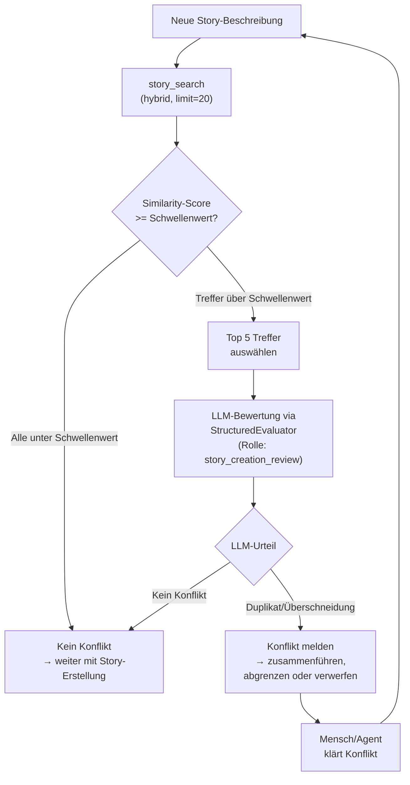

# 13 — Retrieval, VektorDB und Wissenszugriff

## 13.1 Zweck und Einsatzstellen

Die VektorDB dient der semantischen Suche über den Wissensbestand
des Projekts. Sie ist ein Pflichtbestandteil der AgentKit-Infrastruktur.
Die VektorDB ermöglicht bei Story-Erstellung und Exploration die
automatische Suche nach Duplikaten, Überschneidungen und relevanten
Konzepten.

### 13.1.1 Einsatzstellen in der Pipeline

| Einsatzstelle | Was gesucht wird | Ergebnis | FK-Referenz |
|--------------|-----------------|---------|-------------|
| **Story-Erstellung** | Ähnliche Stories, bestehende Konzepte, die die neue Story berücksichtigen muss | Duplikat-/Überschneidungswarnung → LLM-Konfliktbewertung | FK-05-015 bis FK-05-023 |
| **Exploration-Phase** | Bestehende Architektur- und Konzeptdokumente für den Entwurf | Referenzdokumente für Entwurfsartefakt | FK-05-084 |
| **Konzept-Stories** | Überschneidungen mit bestehenden Konzepten | Duplikatwarnung vor Konzepterstellung | FK-05-042 |
| **Kontext-Selektion (P6)** | Relevante Regeln und Wissensabschnitte für eine Rolle | Gefiltertes Kontextpaket für Agent-Prompt | FK-04-021 bis FK-04-023 |

> **[Entscheidung 2026-04-08]** Element 22 — VektorDB-Abgleich ist immer aktiv. Keine Feature-Flag-Stufung.
> Siehe `stories/entscheidung-v2-ballast-bewertung.md`, Element 22.

## 13.2 Technologie-Stack

| Komponente | Technologie | Konfiguration |
|------------|------------|---------------|
| VektorDB | Weaviate 1.25+ | Docker-Container, HTTP `:9903`, gRPC `:50051` |
| Embedding-Modell | text2vec-transformers | Docker-Sidecar, automatisch von Weaviate gestartet |
| MCP-Wrapper | Python, FastMCP | stdio-Transport, registriert in `.mcp.json` |
| Client-Library | weaviate-client 4.9-5.0 | Python, Pflicht-Dependency |

**Docker-Compose** (in `userstory/vectordb/docker-compose.yaml`):

```yaml
services:
  weaviate:
    image: semitechnologies/weaviate:1.25.0
    ports:
      - "127.0.0.1:9903:8080"   # HTTP REST (localhost-only)
      - "127.0.0.1:50051:50051"  # gRPC (localhost-only)
    environment:
      QUERY_DEFAULTS_LIMIT: 25
      DEFAULT_VECTORIZER_MODULE: text2vec-transformers
      ENABLE_MODULES: text2vec-transformers
      TRANSFORMERS_INFERENCE_API: http://t2v-transformers:8080
      CLUSTER_HOSTNAME: node1

  t2v-transformers:
    image: semitechnologies/transformers-inference:sentence-transformers-all-MiniLM-L6-v2
    environment:
      ENABLE_CUDA: 0  # CPU-only
```

## 13.3 Datenmodell

### 13.3.1 Weaviate-Collection: `StoryContext`

| Property | Typ | Vektorisiert | Beschreibung |
|----------|-----|-------------|-------------|
| `content` | TEXT | Ja | Chunk-Text (der suchbare Inhalt) |
| `story_id` | TEXT | Nein | Story-Identifikator |
| `title` | TEXT | Ja | Story- oder Dokumenttitel |
| `status` | TEXT | Nein | Backlog / Freigegeben / In Progress / Done |
| `story_type` | TEXT | Nein | implementation / bugfix / concept / research |
| `module` | TEXT | Nein | Betroffenes Modul |
| `epic` | TEXT | Nein | Zugehöriges Epic |
| `source_type` | TEXT | Nein | issue / concept / research |
| `source_file` | TEXT | Nein | Dateipfad oder `github:#42` |
| `section_heading` | TEXT | Ja | Abschnitts-Überschrift |
| `content_hash` | TEXT | Nein | SHA-256 für Change-Detection |
| `project_id` | TEXT | Nein | Projekt-Identifikator (Multi-Projekt) |

### 13.3.2 Datenquellen

| Quelle | Source-Type | Ingestion-Trigger |
|--------|-----------|-------------------|
| GitHub Issues (Body) | `issue` | `story_sync` MCP-Tool (manuell oder periodisch) |
| Konzept-Dokumente (`concepts/`) | `concept` | `story_sync` MCP-Tool |
| Research-Ergebnisse (`stories/*/`) | `research` | `story_sync` MCP-Tool |
| Architektur-Dokumente | `concept` | `story_sync` MCP-Tool |

### 13.3.3 Chunking-Strategie

Dokumente werden in Chunks aufgeteilt, die jeweils einer
sinnvollen Sektion entsprechen:

| Regel | Beschreibung |
|-------|-------------|
| Split an Markdown-Headings | `##` und `###` erzeugen neue Chunks |
| Section-Heading beibehalten | Jeder Chunk weiß, zu welcher Sektion er gehört |
| Max Chunk-Größe | ~1000 Tokens (abhängig vom Embedding-Modell) |
| Overlap | Kein Overlap — Sektionen sind semantisch geschlossen |
| Metadaten pro Chunk | `story_id`, `title`, `source_type`, `source_file`, `section_heading`, `content_hash` |

**Change-Detection:** Beim Re-Sync wird der `content_hash`
(SHA-256 über den Chunk-Text) verglichen. Unveränderte Chunks
werden nicht neu indiziert.

## 13.4 MCP-Server: Story-Knowledge-Base

### 13.4.1 MCP-Tools

Der MCP-Server exponiert drei Tools:

**`story_search`** — Semantische Suche

| Parameter | Typ | Pflicht | Beschreibung |
|-----------|-----|---------|-------------|
| `query` | String | Ja | Suchtext (natürlichsprachig) |
| `search_mode` | String | Nein | `hybrid` (Default), `vector`, `keyword` |
| `project_id` | String | Nein | Projektfilter |
| `status` | String | Nein | Statusfilter (z.B. "Done") |
| `story_type` | String | Nein | Typfilter (z.B. "concept") |
| `limit` | Integer | Nein | Max Ergebnisse (Default: 10) |

**Rückgabe:** Liste von Treffern mit `story_id`, `title`, `status`,
`story_type`, `source_type`, `module`, `epic`, `section_heading`,
`score`, `snippet`.

**`story_list_sources`** — Verfügbare Datenquellen auflisten

Liefert Übersicht über indizierte Source-Types und Projekte.

**`story_sync`** — Inkrementelle Indexierung

| Parameter | Typ | Pflicht | Beschreibung |
|-----------|-----|---------|-------------|
| `project_id` | String | Ja | Projekt-Identifikator |
| `full_reindex` | Boolean | Nein | Kompletter Neuaufbau (Default: false) |

Liest GitHub Issues (via `gh`) und lokale Markdown-Dateien,
chunked sie, vergleicht Hashes, indiziert neue/geänderte Chunks.

### 13.4.2 Suchmodi

| Modus | Technik | Stärke | Schwäche |
|-------|---------|--------|----------|
| `hybrid` | BM25 + Vektor-Similarity, gewichtete Kombination | Bester Allround-Modus | Leicht langsamer |
| `vector` | Nur Embedding-basierte Similarity | Semantische Ähnlichkeit | Übersieht Keyword-Matches |
| `keyword` | Nur BM25 (Keyword-Match) | Exakte Begriffe | Keine Synonyme/Umschreibungen |

**Default:** `hybrid` — empfohlen für alle Einsatzstellen.

### 13.4.3 Registrierung

Der MCP-Server wird bei Installation (Checkpoint 9) in
`.mcp.json` registriert:

```json
{
  "mcpServers": {
    "story-knowledge-base": {
      "type": "stdio",
      "command": "python",
      "args": ["{agentkit_path}/userstory/vectordb/mcp_server.py"],
      "env": {
        "PROJECT_ID": "{project_prefix}",
        "WEAVIATE_HOST": "localhost",
        "WEAVIATE_HTTP_PORT": "9903",
        "WEAVIATE_GRPC_PORT": "50051",
        "GH_REPO": "{gh_owner}/{gh_repo}"
      }
    }
  }
}
```

## 13.5 Zweistufiger Abgleich bei Story-Erstellung

Das FK fordert einen zweistufigen Abgleich (FK-05-017 bis FK-05-023):
erst Similarity-Schwellenwert-Filter, dann LLM-semantische Bewertung.

### 13.5.1 Ablauf



### 13.5.2 Konfiguration

| Parameter | Default | Config-Pfad |
|-----------|---------|-------------|
| Similarity-Schwellenwert | 0.7 | `vectordb.similarity_threshold` |
| Max LLM-Kandidaten | 5 | `vectordb.max_llm_candidates` |
| Suchlimit (Vorfilter) | 20 | fest im Code |
| Such-Modus | `hybrid` | fest im Code |

### 13.5.3 Protokollierung

Jeder Abgleich wird protokolliert (FK-05-022):

```json
{
  "total_hits": 47,
  "above_threshold": 8,
  "sent_to_llm": 5,
  "llm_conflicts": 1,
  "threshold_used": 0.7,
  "search_mode": "hybrid"
}
```

Diese Daten dienen der Anpassung des Schwellenwerts über die Zeit
anhand der tatsächlichen False-Positive/False-Negative-Rate
(FK-05-023).

## 13.6 Kontext-Selektion über VektorDB

Die VektorDB unterstützt die Kontext-Selektion (P6) als eine
von zwei möglichen Quellen. Der Manifest-Indexer (Kap. 08) ist
die primäre Quelle für getaggte Dokumentabschnitte. Die VektorDB
ergänzt dies um semantische Suche — wenn der Manifest-Index
allein nicht ausreicht, kann die VektorDB relevante Abschnitte
nach Ähnlichkeit finden.

**Ablauf:**

1. Story-Metadaten (Module, Typ, Tech-Stack) bestimmen
   Filterkriterien
2. Manifest-Index liefert getaggte Abschnitte (deterministisch)
3. VektorDB-Suche liefert semantisch ähnliche
   Abschnitte, die kein Tag-Match haben
4. Ergebnis: Kontextpaket als Kontext-Bundle (Kap. 11)

## 13.7 Indexierung und Aktualisierung

### 13.7.1 Wann wird indiziert

| Trigger | Methode | Vollständig/Inkrementell |
|---------|--------|------------------------|
| Installation (Checkpoint 9) | `story_sync(full_reindex=true)` | Vollständig |
| Manuell (Agent oder Mensch) | `story_sync` MCP-Tool | Inkrementell (Hash-basiert) |
| Story-Closure (Postflight) | `story_sync` automatisch, async | Inkrementell |

**Automatischer Sync bei Closure:** Nach erfolgreichem Integrity-Gate
wird in der Postflight-Phase ein asynchroner, nicht-blockierender
`story_sync`-Aufruf ausgelöst (Fire-and-Forget). Das stellt sicher,
dass frisch geschlossene Stories und Konzepte für nachfolgende
Story-Erstellungen und Exploration-Phasen suchbar sind.

Der Sync in der Closure-Phase ist asynchron. Wenn Weaviate bei
Closure nicht erreichbar ist, wird ein Fehler protokolliert.
Die VektorDB ist Pflichtbestandteil der Infrastruktur.

### 13.7.2 Re-Indexierung

Bei `full_reindex=true`:
1. Alle bestehenden Chunks des Projekts in Weaviate löschen
2. GitHub Issues neu abrufen (via `gh`)
3. Lokale Markdown-Dateien neu scannen
4. Alles chunken und indizieren

**Dauer:** Abhängig von Projektgröße. Typisch 2-10 Minuten für
100-500 Stories/Dokumente.

## 13.8 VektorDB-Ausfallverhalten

Die VektorDB ist ein Pflichtbestandteil. Ihr Ausfall blockiert die
Pipeline — Weaviate muss erreichbar sein, bevor eine Story gestartet
oder erstellt werden kann. Ist Weaviate nicht erreichbar, wird die
betroffene Operation mit einem Fehler abgebrochen (fail-closed).

## 13.9 ConceptContext — Schema-Erweiterung für Konzeptdokumente

### 13.9.1 Hintergrund

Ein Stichproben-Audit von 5 User Stories zeigte, dass alle 5
unvollständige Konzept-Referenzen hatten (REF-026). Sechs
systematische Fehler-Muster wurden identifiziert: fehlende
benachbarte Konzepte, ignorierte Appendices, fehlende Fundament-
Konzepte, unerkannte Konflikte, unvollständige Intra-Dokument-
Referenzen und nicht verfolgte Authority-Deferrals.

Die Lösung erweitert die bestehende `StoryContext`-Collection um
konzeptspezifische Properties und stellt zwei neue MCP-Tools bereit.

### 13.9.2 Design-Entscheidung: Eine Collection, zwei Tools

Die `StoryContext`-Collection wird um optionale, konzeptspezifische
Properties erweitert. Es wird KEINE separate Collection angelegt.

**Begründung:** Weaviate optimiert Ähnlichkeitssuche in einem
dichten Vektorraum. Zwei Collections würden die Vektorräume
isolieren und Cross-Domain-Suche (Story ↔ Konzept) verhindern.
Die API-Trennung erfolgt auf Tool-Ebene (`concept_search` vs.
`story_search`), nicht auf Storage-Ebene.

`story_search` bleibt unverändert (Backward Compatibility).

### 13.9.3 Neue Properties in `StoryContext`

| Property | Typ | Vektorisiert | Beschreibung |
|----------|-----|:---:|-------------|
| `concept_id` | TEXT | Nein | Kanonischer Identifikator (z.B. "TK-07") |
| `is_appendix` | BOOL | Nein | Hauptdokument vs. Appendix |
| `parent_concept_id` | TEXT | Nein | Companion-Beziehung (Appendix → Hauptdokument) |
| `defers_to` | TEXT[] | Nein | Authority-Deferral-Ziele (ID-Liste, Discovery-Hint) |
| `authority_over` | TEXT[] | Nein | Scopes, für die dieses Konzept autoritativ ist |
| `section_number` | TEXT | Nein | Kapitel-/Abschnittsnummer (z.B. "2.4") |
| `normative_rules` | TEXT | Nein | Extrahierte Regeln für deterministische Konflikterkennung |
| `concept_status` | TEXT | Nein | active / draft / archived |

Alle neuen Properties sind optional und nicht-vektorisiert. Sie
werden nur bei `source_type="concept"` befüllt. Bestehende
Properties und Vektorisierungsregeln (§13.3.1) bleiben unverändert.

**`defers_to` und `authority_over` als flache TEXT[]:**
In der VectorDB bewusst flach modelliert (nur ID-Listen als
Discovery-Hints und für Filterung). Die vollständige, qualifizierte
Modellierung (z.B. "TK-04 defers_to TK-07 FOR visual_tokens")
erfolgt im `concept_graph.json` (§13.9.8). VectorDB ist keine
Graph-DB — Weaviate kann keine Joins und keine transitive
Traversierung.

**`normative_rules` nicht vektorisiert:**
Der Regelinhalt ist bereits im `content`-Feld enthalten und wird
dort vektorisiert. Separate Vektorisierung von `normative_rules`
würde Doppelgewichtung verursachen. Das Feld dient der
deterministischen Konfliktprüfung im App-Layer.

### 13.9.4 Konzeptspezifisches Chunking

Chunking-Strategie für Konzeptdokumente ist identisch mit §13.3.3
(Split bei `##` und `###`, max ~1000 Tokens, kein Overlap).

**Appendix-Behandlung:**
- Appendix-Dokumente werden erkannt via Frontmatter `doc_kind: appendix`
- Jeder Appendix-Chunk trägt `is_appendix=true` und `parent_concept_id`
- Appendix-Chunks sind eigenständig discoverable UND über
  `parent_concept_id` mit dem Hauptdokument verknüpft

**Metadaten-Extraktion pro Chunk:**
- `concept_id`, `module`, `is_appendix`, `parent_concept_id`:
  Aus Frontmatter (§13.9.6)
- `section_number`: Generiert aus Heading-Hierarchie
- `defers_to`, `authority_over`: Aus Frontmatter (flache ID-Listen)
- `normative_rules`: Aus speziellem Markdown-Abschnitt extrahiert
- `content_hash`: SHA-256 über Chunk-Text (wie §13.3.3)
- `concept_status`: Aus Frontmatter `status`

### 13.9.5 MCP-Tools für Konzepte

**`concept_search`** — Semantische Suche über Konzeptdokumente

| Parameter | Typ | Pflicht | Beschreibung |
|-----------|-----|:---:|-------------|
| `query` | String | Ja | Suchtext (natürlichsprachig) |
| `search_mode` | String | Nein | `hybrid` (Default), `vector`, `keyword` |
| `project_id` | String | Nein | Projektfilter |
| `concept_id` | String | Nein | Filter auf spezifisches Konzept |
| `module` | String | Nein | Modulfilter |
| `is_appendix` | Boolean | Nein | Nur Appendices / nur Core / beides |
| `concept_status` | String | Nein | `active` (Default), `draft`, `archived` |
| `limit` | Integer | Nein | Max Ergebnisse (Default: 10) |

**Rückgabe:** `concept_id`, `title`, `module`, `section_heading`,
`section_number`, `is_appendix`, `parent_concept_id`, `defers_to`,
`authority_over`, `normative_rules`, `concept_status`, `score`,
`snippet`.

**Default-Filter:** `concept_status=active`. Draft und archived
müssen explizit angefragt werden.

Intern filtert `concept_search` die `StoryContext`-Collection auf
`source_type="concept"` und projiziert die konzeptspezifischen
Properties.

**`concept_sync`** — Indexierung von Konzeptdokumenten

| Parameter | Typ | Pflicht | Beschreibung |
|-----------|-----|:---:|-------------|
| `project_id` | String | Ja | Projekt-Identifikator |
| `full_reindex` | Boolean | Nein | Kompletter Neuaufbau (Default: false) |
| `concept_path` | String | Nein | Pfad zu spezifischem Konzeptdokument |

Liest Konzeptdokumente mit Frontmatter, chunked sie, und führt
einen inkrementellen Hash-basierten Upsert durch (wie `story_sync`).
**Vorbedingung:** `concept_validate` muss ohne Errors durchlaufen
sein. Ungültige Konzepte werden nicht indiziert.

### 13.9.6 Frontmatter-Spezifikation

Jedes Konzeptdokument muss einen YAML-Frontmatter-Block enthalten:

```yaml
---
concept_id: TK-07
title: Error Routing und MitigationPolicy
module: error-routing
status: active                        # active | draft | archived
doc_kind: core                        # core | appendix
parent_concept_id:                    # Pflicht bei doc_kind=appendix
authority_over:
  - scope: error-routing
  - scope: mitigation-policy
defers_to:
  - target: TK-01
    scope: state-schema
    reason: BasePipelineState ist Fundament
supersedes: []
superseded_by:
tags: [routing, policy, error-handling]
---
```

**Pflichtfelder:** `concept_id`, `title`, `status`, `doc_kind`.
Bei `doc_kind=appendix` ist `parent_concept_id` Pflicht.

Im Frontmatter sind `authority_over` und `defers_to` qualifiziert
(mit scope/reason), weil das Frontmatter die Source of Truth für
den deterministischen `concept_graph` ist. In der VectorDB werden
sie als flache ID-Listen gespeichert (§13.9.3).

**Parsing:** Deterministisch aus YAML, kein LLM-Parsing. Fehlendes
oder ungültiges Frontmatter führt zu Validierungsfehler (§13.9.7).

### 13.9.7 Validierungs-Suite: `concept_validate`

Deterministische Suite zur Prüfung der Corpus-Integrität.
Die Validierung ist das primäre Quality-Gate — nicht die VectorDB.

**Architektur:**

1. Parse — Alle Konzeptdateien laden, Frontmatter parsen
2. Graph — Candidate Corpus als DAG aufbauen
3. Validate — Schema, Referenzen, Zyklen, Authority, Konsistenz
4. Output — `concept_validation.json` + Exit-Code

**Blockierende Checks (Errors):**

| Code | Prüfung |
|------|---------|
| `E-SCHEMA-001` | Frontmatter fehlt oder YAML nicht parsebar |
| `E-SCHEMA-002` | Pflichtfelder fehlen (concept_id, title, status, doc_kind) |
| `E-SCHEMA-003` | status/doc_kind nicht in erlaubten Werten |
| `E-SCHEMA-004` | doc_kind=appendix ohne parent_concept_id |
| `E-ID-001` | Doppelte concept_id im aktiven Corpus |
| `E-ID-002` | concept_id passt nicht zur Dateinamens-Konvention |
| `E-REF-001` | defers_to.target existiert nicht im Corpus |
| `E-REF-002` | parent_concept_id existiert nicht oder ist kein core-Dokument |
| `E-REF-003` | superseded_by existiert nicht |
| `E-CYCLE-001` | Zyklus in defers_to-Graph (gleicher Scope) |
| `E-CYCLE-002` | Zyklus in superseded_by-Kette |
| `E-AUTH-001` | Zwei aktive Konzepte claimen authority_over für denselben Scope |
| `E-AUTH-002` | authority_over-Scope verschwindet ohne Nachfolger (bei Restructuring) |
| `E-CHUNK-001` | Sektion überschreitet Max-Token-Limit |

**Warnungen (non-blocking):**

| Code | Prüfung |
|------|---------|
| `W-BIDIR-001` | A defers_to B, aber B hat kein authority_over für relevanten Scope |
| `W-CONTENT-001` | H1 im Body weicht von Frontmatter-title ab |
| `W-CONTENT-002` | Body erwähnt TK-*/AF-* die nicht im Frontmatter-Graph stehen |
| `W-CONTENT-003` | Frontmatter defers_to gesetzt, aber Body erwähnt Ziel nicht |
| `W-ORPHAN-001` | Aktives Konzept ohne ein-/ausgehende Beziehungen |
| `W-SCOPE-001` | Fundamentaler Scope ohne aktiven Authority-Owner |

**Exit-Codes:** 0 = valid, 1 = warnings only, 2 = errors, 3 = internal failure.

**Ausgabeformat:** `concept_validation.json` mit `status`, `corpus_revision`,
`errors[]`, `warnings[]`, `graph{}` (concept_count, active_count, acyclic).

### 13.9.8 INDEX.yaml und concept_graph.json

Ein gemeinsamer Parser erzeugt aus dem Konzept-Corpus zwei
deterministische Artefakte:

**INDEX.yaml** — Strukturelle Topologie:

```yaml
corpus_revision: "sha256:..."
generated_at: "2026-04-04T14:30:00Z"
parser_version: "1.0.0"
concepts:
  - concept_id: TK-07
    title: Error Routing und MitigationPolicy
    module: error-routing
    status: active
    doc_kind: core
    file: _concept/technical-design/07_error_routing.md
    sections:
      - number: "1"
        heading: "Zweck und Einsatzstellen"
    appendices:
      - concept_id: TK-07-A
        file: _concept/technical-design/07a_appendix.md
    authority_over:
      - scope: error-routing
    defers_to:
      - target: TK-01
        scope: state-schema
```

**concept_graph.json** — Deterministischer Beziehungsgraph:

```json
{
  "corpus_revision": "sha256:...",
  "nodes": {
    "TK-07": {"status": "active", "module": "error-routing", "doc_kind": "core"}
  },
  "edges": [
    {"source": "TK-07", "target": "TK-01", "type": "defers_to", "scope": "state-schema"},
    {"source": "TK-07", "target": "TK-07-A", "type": "parent_of_appendix"}
  ]
}
```

**Konsistenz:** Beide Artefakte tragen dieselbe `corpus_revision`
(`SHA-256(sorted(alle Datei-Hashes) + parser_version)`).
Nur ein validierter Graph (§13.9.7) wird persistiert.

### 13.9.9 Corpus-Build-Lifecycle

Der Concept-Corpus hat einen eigenen Build-Lifecycle, unabhängig
von der Story-Pipeline. 80% der Konzepte entstehen außerhalb von
User Stories (in Mensch-Agent-Collaboration), daher ist der
Git-Commit der universelle Touchpoint.

**Drei Schutzringe:**

| Ring | Wann | Tool | Härte |
|------|------|------|-------|
| 1. Authoring Guard | Während Arbeit | `concept lint --changed` | Soft (Feedback) |
| 2. Commit Gate | Beim git commit | `concept validate --staged` | Hard (Block bei Errors, Warnings angezeigt) |
| 3. Corpus Build | Nach Commit / CI | `concept validate --corpus --strict` | Hard (CI-Fail) |

**Ring 1 — Authoring Guard:**
Agent oder Mensch ruft `concept lint --changed` oder
`concept lint <file>` auf. Für Bulk-Restructuring:
`concept doctor --summary` zeigt einen Corpus-Diff-Bericht
(neue Scopes, gewechselte Scope-Owner, gebrochene Referenzen,
verwaiste Appendices). Nicht blockierend.

**Ring 2 — Commit Gate:**
Pre-Commit-Hook (§30.5.3) erkennt Konzeptänderungen in staged
Files. Baut einen **Candidate Corpus** aus staged Files (neuer
Zustand) + ungeänderten Files (aktueller Stand). Validierung
erfolgt immer gegen den Gesamtzustand, nie dateiweise gegen den
alten Rest-Corpus. Bei Errors: Commit blockiert. Bei nur
Warnings: Commit erlaubt, Summary wird angezeigt.

**Ring 3 — Corpus Build:**
`concept validate --corpus --strict` in CI prüft den gesamten
Corpus. `--strict` behandelt Warnings als Errors. Danach
`concept build` erzeugt `concept_graph.json` und `INDEX.yaml`.
`concept sync` (VectorDB-Synchronisierung).

**Verantwortlichkeit und Trigger für Corpus-Build und VectorDB-Sync:**

Die Erzeugung der deterministischen Artefakte (INDEX.yaml,
concept_graph.json) und die VectorDB-Indexierung haben jeweils
einen zugewiesenen Verantwortlichen und einen definierten Trigger.
Ohne diese Zuweisung wäre die Infrastruktur zwar vorhanden, aber
kein Prozessschritt würde sie nutzen.

| Artefakt / Aktion | Verantwortlicher | Trigger | Befähigung |
|--------------------|-----------------|---------|------------|
| INDEX.yaml + concept_graph.json | **Post-Commit-Hook** (§30.5.4a) | Automatisch nach jedem Commit mit `_concept/`-Änderungen | Pfadbasiertes Dispatching erkennt `_concept/`; `concept build` ist deterministisch, kein LLM, ~1s Laufzeit |
| VectorDB-Sync (Erstindizierung) | **Installer** (CP 9a) | Einmalig bei Installation/Upgrade | Checkpoint-Engine (VektorDB ist Pflicht) |
| VectorDB-Sync (laufend) | **Post-Commit-Hook** (§30.5.4a) | Nach `concept build` | `concept build --sync`; bei VectorDB-Ausfall: Fehler protokolliert |
| VectorDB-Sync (manuell) | **Operator / Agent** | CLI `concept sync` oder MCP-Tool | Expliziter Aufruf |
| Freshness-Gate | **create-userstory Skill** | Vor Story-Erstellung | Vergleicht `corpus_revision` gegen Datei-Stand; Hard Stop bei Stale |

**Kernprinzip:** Der Post-Commit-Hook ist der universelle Trigger
für die Artefakt-Aktualisierung. Er stellt sicher, dass nach jedem
Commit der Corpus-Stand konsistent ist — ohne dass ein Mensch oder
Agent daran denken muss. Der Hook ist deterministisch (kein LLM),
schnell (~1s), und führt den VectorDB-Sync als Pflichtschritt durch.

Der Pre-Commit-Hook (Ring 2) bleibt ausschließlich für die
Validierung zuständig — er erzeugt keine Artefakte.

**Trigger für VectorDB-Sync (Legacy-Kompatibilität):**

| Trigger | Methode | Voll/Inkrementell |
|---------|--------|-------------------|
| Installation (CP 9) | `concept_sync(full_reindex=true)` | Vollständig |
| Manuell | `concept_sync` MCP-Tool oder CLI | Inkrementell (Hash-basiert) |
| Nach Corpus Build | Post-Commit-Hook via `concept build --sync` | Inkrementell |

**Change-Detection:** Content-Hash auf Datei-Ebene (SHA-256 über
gesamtes Dokument) entscheidet ob Re-Chunking nötig ist. Chunk-Hash
(SHA-256 pro Chunk) für inkrementellen Upsert.

**Update-Strategie:** Full-Replace mit Shadow-Replace pro Dokument:
1. Neue Chunks schreiben (deterministische UUIDs)
2. Validierung
3. Alte Chunks löschen

**Freshness-Indikator:** `corpus_revision` (nicht mtime — Datei-
system-Timestamps sind bei Git-Operationen unzuverlässig).

### 13.9.10 Archiv-Handling

`concept_status`-Feld mit Werten `active`, `draft`, `archived`.
Archivierte Konzepte bleiben im Index (historische Referenzierbar-
keit). `concept_search` filtert standardmäßig auf `active`.

Pfad `_concept/archiv/` → automatisch `concept_status=archived`.
Ergänzende Frontmatter-Felder: `superseded_by`, `supersedes`.

### 13.9.11 Authority-Auflösung (Ranking-Policy)

Die VectorDB liefert semantische Treffer. Die Authority-Auflösung
erfolgt im App-Layer (ConceptGraphResolver) mit deterministischen
Regeln:

1. Direkter `authority_over`-Match schlägt adjacenten Match
2. Scoped Deferral schlägt generische lokale Erwähnung
3. Appendix kann für Interface-/Test-Detail höher ranken als Core
4. Archived/Draft-Konzepte erhalten Abzug
5. Module-Match boosted nur ohne stärkeren Cross-Module-Authority

### 13.9.12 Ausfallverhalten

Konsistent mit §13.8:

| Situation | Verhalten |
|-----------|----------|
| VectorDB nicht erreichbar | Betroffene Operation wird abgebrochen (fail-closed) |
| `concept_graph.json` fehlt/stale | `create-userstory` Hard Stop |
| `concept_validate` findet Errors | Commit blockiert, Sync blockiert |

**Kernregel:** VectorDB ist Pflicht (§13.8). Normvalidierung
(Authority, Deferrals, Zyklen via concept_graph) muss
deterministisch hart bleiben.

### 13.9.13 Concept Excludes (`.conceptignore`)

Nicht alle Markdown-Dateien im Konzeptverzeichnis sind
Konzeptdokumente mit Frontmatter. Beispiele: Recherche-Notizen,
ARE-Requirements, temporäre Entwürfe. Solche Dateien würden ohne
Exclude-Mechanismus die Validierung blockieren (E-SCHEMA-001) und
irrtümlich in VectorDB und INDEX.yaml landen.

**Kanonischer Ort:** `{concept_dir}/.conceptignore`

Die Datei liegt direkt im Konzept-Root-Verzeichnis des jeweiligen
Projekts (z.B. `concepts/.conceptignore`).

**Format:** Zeilenbasiert, analog zu `.gitignore`:

```
# Kommentarzeilen beginnen mit #
# Leerzeilen werden ignoriert

# Einzelne Datei (relativ zu concept_dir)
are-requirements.md

# Glob-Pattern mit Wildcard
are*requirements.md

# Ganzes Unterverzeichnis rekursiv (alle Tiefen)
research/**

# Alle Dateien in einem Verzeichnis (nicht rekursiv)
drafts/*.md
```

**Pattern-Semantik** (`.gitignore`-Konventionen):
- Patterns sind Glob-Ausdrücke relativ zum Konzept-Root-Verzeichnis.
- `*` matcht beliebige Zeichen innerhalb eines Pfadsegments (nicht `/`).
- `**` matcht null oder mehr Pfadsegmente (inkl. `/`).
- `?` matcht genau ein Zeichen (nicht `/`).
- `research/**` — matcht alles unter `research/` (direkte Kinder + beliebig tief).
- `research/**/*` — matcht nur in Unterverzeichnissen von `research/`, NICHT direkte Kinder.
- `*.md` — matcht `foo.md`, NICHT `sub/foo.md`.
- Führende/nachfolgende Whitespace wird entfernt.
- Leere Zeilen und Zeilen mit `#` am Anfang werden ignoriert.

**Wirkungsbereich:**

| Operation | Wirkung |
|-----------|---------|
| `concept validate` (Ring 2 + 3) | Excluded Dateien werden nicht geparst und nicht validiert |
| `concept build` (INDEX.yaml, concept_graph.json) | Excluded Dateien erscheinen nicht in den Artefakten |
| `concept sync` (VectorDB) | Excluded Dateien werden nicht chunked und nicht indiziert |
| `concept lint` | Excluded Dateien werden übersprungen |
| Pre-Commit-Hook (§30.5.3) | Staged Dateien, die auf der Exclude-Liste stehen, werden nicht validiert |
| Post-Commit-Hook (§30.5.4a) | Corpus Build überspringt excludierte Dateien |

**Implementierung:** Zentral in `discover_concept_files()` im Parser-
Modul (`agentkit/concepts/parser.py`). Alle Konsumenten
(Validation, Index-Builder, Graph-Builder, VectorDB-Sync) nutzen
diese Funktion — die Exclude-Logik propagiert automatisch.

**Kein Fallback bei fehlender Datei:** Existiert keine
`.conceptignore`-Datei, werden alle `.md`-Dateien verarbeitet
(bisheriges Verhalten). Die Datei ist optional.

**Kein Caching:** Die `.conceptignore`-Datei wird bei jeder
Discovery-Operation neu gelesen. Die Datei ist klein (< 1 KB
typisch), der I/O-Overhead vernachlässigbar.

---

*FK-Referenzen: FK-04-021 bis FK-04-023 (Kontext-Selektion),
FK-05-015 bis FK-05-023 (VektorDB-Abgleich bei Story-Erstellung),
FK-05-042 (Konzept-Stories VektorDB-Abgleich),
FK-05-084 (Exploration: relevante Referenzdokumente)*
