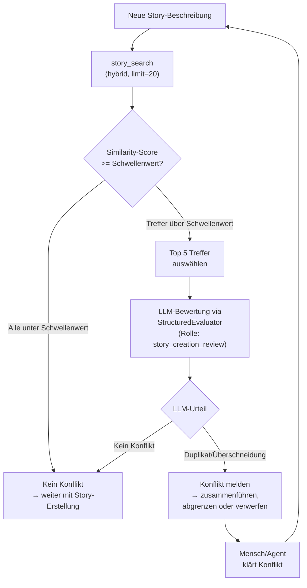

# 13 — Retrieval, VektorDB und Wissenszugriff

## 13.1 Zweck und Einsatzstellen

Die VektorDB dient der semantischen Suche über den Wissensbestand
des Projekts. Sie ist ein Pflichtbestandteil der AgentKit-Infrastruktur.
Die VektorDB ermöglicht bei Story-Erstellung und Exploration die
automatische Suche nach Duplikaten, Überschneidungen und relevanten
Konzepten.

### 13.1.1 Einsatzstellen in der Pipeline

| Einsatzstelle | Was gesucht wird | Ergebnis | FK-Referenz |
|--------------|-----------------|---------|-------------|
| **Story-Erstellung** | Ähnliche Stories, bestehende Konzepte, die die neue Story berücksichtigen muss | Duplikat-/Überschneidungswarnung → LLM-Konfliktbewertung | FK-05-015 bis FK-05-023 |
| **Exploration-Phase** | Bestehende Architektur- und Konzeptdokumente für den Entwurf | Referenzdokumente für Entwurfsartefakt | FK-05-084 |
| **Konzept-Stories** | Überschneidungen mit bestehenden Konzepten | Duplikatwarnung vor Konzepterstellung | FK-05-042 |
| **Kontext-Selektion (P6)** | Relevante Regeln und Wissensabschnitte für eine Rolle | Gefiltertes Kontextpaket für Agent-Prompt | FK-04-021 bis FK-04-023 |

> VektorDB-Abgleich ist immer aktiv. Keine Feature-Flag-Stufung.
> Der Konfigschluessel `features.vectordb` ist damit nur noch ein
> **deprecateter Migrations-Konfigschluessel**: In einem unterstuetzten
> Zielprojekt ist `features.vectordb: false` ein harter Konfigurationsfehler,
> kein Abschaltpfad. Die Code-seitige Entfernung des Optionalitaetszweigs im
> Installer (§13.7.1, FK-50 CP 10/10a) ist mit AG3-176 umgesetzt: der
> Checkpoint-Graph kennt keinen `branch_vectordb_enabled`-Knoten mehr, und
> `features.vectordb: false` wird vor CP 1 mit dem Grund `vectordb_required`
> abgewiesen.

## 13.2 Technologie-Stack

| Komponente | Technologie | Konfiguration |
|------------|------------|---------------|
| VektorDB | Weaviate 1.25+ | Docker-Container, HTTP `:9903`, gRPC `:50051` |
| Embedding-Modell | text2vec-transformers | Docker-Sidecar, automatisch von Weaviate gestartet |
| MCP-Wrapper | Python, FastMCP | stdio-Transport, registriert in `.mcp.json` |
| Client-Library | weaviate-client 4.9-5.0 | Python, Pflicht-Dependency |

**Docker-Compose** (in `vectordb/docker-compose.yaml`):

```yaml
services:
  weaviate:
    image: semitechnologies/weaviate:1.25.0
    ports:
      - "127.0.0.1:9903:8080"   # HTTP REST (localhost-only)
      - "127.0.0.1:50051:50051"  # gRPC (localhost-only)
    environment:
      QUERY_DEFAULTS_LIMIT: 25
      DEFAULT_VECTORIZER_MODULE: text2vec-transformers
      ENABLE_MODULES: text2vec-transformers
      TRANSFORMERS_INFERENCE_API: http://t2v-transformers:8080
      CLUSTER_HOSTNAME: node1

  t2v-transformers:
    image: semitechnologies/transformers-inference:sentence-transformers-all-MiniLM-L6-v2
    environment:
      ENABLE_CUDA: 0  # CPU-only
```

**Tokenizer-Bereitstellung (fail-closed):** Das Modell
`sentence-transformers/all-MiniLM-L6-v2` wird mit einer **gepinnten Modell- und
Tokenizer-Revision** betrieben. Der Tokenizer (`tokenizer.json` samt Vokabular)
wird als **versioniertes Package-Asset** ausgeliefert — analog zu den
versionierten, unveraenderlichen Bundle-Assets (FK-43) — mit einem **gebundenen
Digest** (SHA-256). Vor Nutzung wird der Digest gegen den gepinnten Sollwert
geprueft. **Fail-closed:** Fehlt das Asset oder weicht der Digest ab, bricht der
Lauf hart ab (§13.8). Es gibt **keine** Laufzeit-Netzabholung des Tokenizers und
**keinen** zeichenbasierten Ersatz — ein stiller Fallback auf schlechtere
Tokenisierung ist unzulaessig.

## 13.3 Datenmodell

### 13.3.1 Weaviate-Collection: `StoryContext`

| Property | Typ | Vektorisiert | Beschreibung |
|----------|-----|-------------|-------------|
| `content` | TEXT | Ja | Chunk-Text (der suchbare Inhalt) |
| `story_id` | TEXT | Nein | Story-Identifikator |
| `title` | TEXT | Ja | Story- oder Dokumenttitel |
| `status` | TEXT | Nein | Backlog / Approved / In Progress / Done / Cancelled |
| `story_type` | TEXT | Nein | implementation / bugfix / concept / research |
| `module` | TEXT | Nein | Betroffenes Modul |
| `epic` | TEXT | Nein | Zugehöriges Epic |
| `source_type` | TEXT | Nein | story / concept / research |
| `source_file` | TEXT | Nein | Dateipfad (z.B. `stories/ODIN-042/story.md`) |
| `section_heading` | TEXT | Ja | Abschnitts-Überschrift |
| `content_hash` | TEXT | Nein | SHA-256 für Change-Detection |
| `project_id` | TEXT | Nein | Projekt-Identifikator (Multi-Projekt) |
| `owning_generation` | INT | Nein | Quell-Generation, die diese Objektversion geschrieben hat (§13.9.9, D9); Ordnungsbedingung des zerstoerenden Deletes |

**`owning_generation` ist kein zweiter Besitz-Wahrheitstraeger.** Autoritativ
bleibt der Claim-Datensatz (§13.9.9): er entscheidet, **wer** eine Quelle haelt.
Das Feld traegt nur die **Ordnung** — die Generation, unter der die Objektversion
geschrieben wurde — und bindet den zerstoerenden Loeschschritt storage-seitig an
„nachweislich aeltere Generation". Es ist numerisch (die Bedingung ist ein
Vergleich, keine Gleichheit), geht nicht in die Einbettung ein und ist nicht Teil
der Rueckgabefelder der Werkzeuge (§13.4.1/§13.9.5).

### 13.3.2 Datenquellen

| Quelle | Source-Type | Ingestion-Trigger |
|--------|-----------|-------------------|
| Story-Artefakte (`stories/*/story.md`) | `story` | `story_sync` MCP-Tool (manuell oder periodisch) |
| Konzept-Dokumente (`concepts/`) | `concept` | `concept_sync` MCP-Tool (§13.9.5) |
| Research-Ergebnisse (`stories/*/`) | `research` | `story_sync` MCP-Tool |
| Architektur-Dokumente | `concept` | `concept_sync` MCP-Tool (§13.9.5) |

Massgeblich ist die spezifischere Tool-Trennung in §13.9.5: Konzept- und
Architekturquellen (`source_type="concept"`) laufen ueber `concept_sync` /
`concept_search`, Story- und Research-Quellen ueber `story_sync` /
`story_search`. Die fruehere pauschale `story_sync`-Nennung fuer Konzeptquellen
war eine Vereinfachung vor Einfuehrung der konzeptspezifischen Tools (§13.9.2:
„Trennung auf Tool-Ebene").

### 13.3.3 Chunking-Strategie

Dokumente werden in Chunks aufgeteilt, die jeweils einer
sinnvollen Sektion entsprechen:

| Regel | Beschreibung |
|-------|-------------|
| Split an Markdown-Headings | `##` und `###` erzeugen neue Chunks |
| Section-Heading beibehalten | Jeder Chunk weiß, zu welcher Sektion er gehört |
| Max Chunk-Größe | ~1000 Tokens (abhängig vom Embedding-Modell) |
| Overlap | Kein Overlap — Sektionen sind semantisch geschlossen |
| Metadaten pro Chunk | `story_id`, `title`, `source_type`, `source_file`, `section_heading`, `content_hash` |

**Change-Detection:** Beim Re-Sync wird der `content_hash`
(SHA-256 über den Chunk-Text) verglichen. Unveränderte Chunks
werden nicht neu indiziert.

## 13.4 MCP-Server: Story-Knowledge-Base

### 13.4.1 MCP-Tools

Der MCP-Server exponiert drei Tools:

**`story_search`** — Semantische Suche

| Parameter | Typ | Pflicht | Beschreibung |
|-----------|-----|---------|-------------|
| `query` | String | Ja | Suchtext (natürlichsprachig) |
| `search_mode` | String | Nein | `hybrid` (Default), `vector`, `keyword` |
| `project_id` | String | Nein | Projektfilter |
| `status` | String | Nein | Statusfilter (z.B. "Done") |
| `story_type` | String | Nein | Typfilter (z.B. "concept") |
| `limit` | Integer | Nein | Max Ergebnisse (Default: 10) |

**Rückgabe:** Liste von Treffern mit `story_id`, `title`, `status`,
`story_type`, `source_type`, `module`, `epic`, `section_heading`,
`score`, `snippet`.

**`story_list_sources`** — Verfügbare Datenquellen auflisten

| Parameter | Typ | Pflicht | Beschreibung |
|-----------|-----|---------|-------------|
| `project_id` | String | Nein | Gebundenes Projekt (D2): fehlt der Parameter, gilt das gebundene Projekt aus der Umgebung; ein **identischer** Wert wird akzeptiert; ein **abweichender** Wert wird benannt abgewiesen. Die Umgebung ist die einzige Autoritaet — der Parameter kann das Projekt nicht wechseln. |

Liefert je indiziertem Source-Type **eine** Zeile.

| Rückgabefeld | Typ | Bedeutung |
|-----------|-----|-------------|
| `project_id` | String | Projekt, auf das die Zeile sich bezieht |
| `source_type` | String | Source-Type dieser Zeile |
| `producer` | String | Erzeuger dieses Source-Types (§13.3.2) |
| `source_count` | Integer | Anzahl indizierter Quelldateien |
| `chunk_count` | Integer | **Physische** Anzahl indizierter Chunks — nicht die autoritative Teilmenge |
| `last_revision` | String | `corpus_revision` der **letzten abgeschlossenen** Synchronisierung dieses Source-Types; leer, wenn keine existiert |
| `stale_chunk_count` | Integer | Anzahl der Chunks, die dem **exakten Prädikat unten** entsprechen. **Nicht** „alle nicht-autoritativen Chunks": eine **höhere** Generation gehört ebenfalls nicht zur autoritativen und wird bewusst **nicht** gezählt (§13.9.9) |

Die Shape ist eine **Mindest-Shape** (D1): sie darf um belegbare Kennzahlen
erweitert werden, nie verkleinert. Für Eingaben gilt weiter die strikte
Regelung — unbekannte Argumente werden benannt abgewiesen, Abwesenheit und
explizites `null` sind verschieden, und es wird nichts stillschweigend
umgedeutet.

`stale_chunk_count` ist der **Erkennbarkeitspfad** des in §13.9.9
ratifizierten Restvertrags. Die Kennzahl ist ein **exaktes Prädikat**, je Zeile
gegen die autoritative Generation **ihrer** Quelle (§13.9.9):

| Klasse | Zeilenklasse | gezählt | Abhilfe |
|---|---|---|---|
| **A** | Generation vorhanden und ordenbar, **strikt kleiner** als die autoritative | ja | Sync der Quelle **entfernt** sie (geordneter Delete) |
| **B** | **keine** Generation: Property **fehlt oder ist `null`** (Bestand vor §13.3.1) | ja | Sync der Quelle **konvergiert** sie (IS-NULL-Bedingung) |
| **C** | Generation **vorhanden, aber nicht ordenbar**: nicht-integer, boolesch, **0** oder negativ | ja | **Kein** Sync-Fall: der Sync **weist sie benannt ab** und laeuft nicht durch — eskalieren |
| — | Generation **groesser** als die autoritative | **nein** | laufender, noch nicht publizierter Sync — kein Rest |
| — | Quelle **ohne** abgeschlossene Synchronisierung | **nein** (nicht beurteilt) | keine Bezugsgroesse; eine erfundene waere geraten |

**Fehlend und `null` sind dieselbe Klasse (B), nicht zwei.** An dieser Grenze sind
sie nicht unterscheidbar — ein Lesevorgang liefert fuer beide dasselbe —, und die
storage-seitige IS-NULL-Bedingung, die solche Zeilen konvergiert, erfasst genau
beide. Eine Unterscheidung in der Prosa wuerde etwas zusagen, das kein Code
einhalten kann. (Das ist **nicht** die Eingabe-Strenge des Werkzeugvertrags: dort
sind Abwesenheit und explizites `null` verschieden. Hier geht es um einen
**gespeicherten Property-Wert**, nicht um ein Aufruf-Argument.)

Beide Konsumenten — der Sync, der entscheidet was er loeschen darf, und diese
Auflistung, die entscheidet was sie melden muss — klassifizieren ueber **dieselbe
eine Leiter**. Andernfalls koennte der Vertrag fuer einen von beiden nicht wahr sein.

Deshalb gilt: **`> 0` ist ein handlungspflichtiger Befund, aber kein Beweis fuer
einen Uebernahme-Rest.** Welche der drei gezaehlten Klassen vorliegt, ist zu
diagnostizieren — nur A und B loest ein Sync auf, C braucht eine Eskalation
(FK-04 §4.5.14).

**`story_sync`** — Inkrementelle Indexierung

| Parameter | Typ | Pflicht | Beschreibung |
|-----------|-----|---------|-------------|
| `project_id` | String | Ja | Projekt-Identifikator |
| `full_reindex` | Boolean | Nein | Kompletter Neuaufbau (Default: false) |

Liest die exportierten `story.md`-Dateien aus dem Story-Verzeichnis
und die lokalen Research-Quellen, chunked sie, vergleicht Hashes,
indiziert neue/geänderte Chunks. Konzept- und Architekturquellen gehören
**nicht** hierher, sondern in `concept_sync` (§13.9.5, Beschluss
2026-07-21 „VektorDB-Kantenschaerfung").

### 13.4.2 Suchmodi

| Modus | Technik | Stärke | Schwäche |
|-------|---------|--------|----------|
| `hybrid` | BM25 + Vektor-Similarity, gewichtete Kombination | Bester Allround-Modus | Leicht langsamer |
| `vector` | Nur Embedding-basierte Similarity | Semantische Ähnlichkeit | Übersieht Keyword-Matches |
| `keyword` | Nur BM25 (Keyword-Match) | Exakte Begriffe | Keine Synonyme/Umschreibungen |

**Default:** `hybrid` — empfohlen für alle Einsatzstellen.

### 13.4.3 Registrierung

Der MCP-Server wird bei Installation (Checkpoint 10) in
`.mcp.json` registriert (FK-50 ist Checkpoint-Autoritaet: CP 10):

```json
{
  "mcpServers": {
    "story-knowledge-base": {
      "type": "stdio",
      "command": "python",
      "args": ["-m", "agentkit.backend.vectordb.engine"],
      "cwd": "{project_root}",
      "env": {
        "PROJECT_ID": "{project_prefix}",
        "WEAVIATE_HTTP_ENDPOINT": "{weaviate_http_endpoint}",
        "WEAVIATE_GRPC_ENDPOINT": "{weaviate_grpc_endpoint}",
        "AGENTKIT_CONCEPTS_DIR": "{project_root}/{concepts_dir}",
        "AGENTKIT_STORIES_DIR": "{project_root}/{wiki_stories_dir}"
      }
    }
  }
}
```

**Normative Praezisierung des Registrierungsvertrags** (AG3-175; Decision Record
`2026-07-28-vectordb-endpoint-consolidation.md`):

- **Ausfuehrbares Modul.** Registriert wird `-m agentkit.backend.vectordb.engine`.
  `vectordb.mcp_server` ist ein **Bibliotheksmodul**: als `-m` ausgefuehrt laeuft
  sein Modulrumpf und endet mit Exit 0, ohne zu serven — der
  MCP-Conformance-Check (FK-50 §50.3 CP 10) wertet das korrekt als
  `mcp_process_exited`. Der stdio-Einstiegspunkt ist `engine.main`.
- **Endpunkte statt Host+Port.** Die Registrierung traegt
  `WEAVIATE_HTTP_ENDPOINT` und `WEAVIATE_GRPC_ENDPOINT` als **vollstaendige
  Werte**. Host/Port-Bestandteile sind kein Vertragsbestandteil: das Zerlegen ist
  Konsumentensache (eine Implementierung, `vectordb.endpoints`), und das
  Zusammensetzen aus Teilen wuerde das Schema erfinden — genau der
  synthetisierte Endpunkt, den D2 verbietet.
- **`AGENTKIT_CONCEPTS_DIR` ist Pflicht und hat keinen Default.** Fehlt er,
  beendet sich der Server fail-closed (N20/D2: ein Default hat den Server einmal
  auf AK3s eigenen Entwicklungskorpus gezeigt).
  `AGENTKIT_STORIES_DIR` ist technisch optional, wird aber **explizit** registriert:
  sein Default loest gegen die Prozess-`cwd` auf, und `cwd` darf nach D2 keine
  zweite Konfigurationsquelle sein.
- **`cwd`** ist die Containment-Grenze der registrierten Prozessausfuehrung und
  immer der Zielprojekt-Root — nie eine Konfigurationsquelle.
- **`GH_REPO` entfaellt.** Der Server liest den Wert nicht.

## 13.5 Zweistufiger Abgleich bei Story-Erstellung

Das FK fordert einen zweistufigen Abgleich (FK-05-017 bis FK-05-023):
erst Similarity-Schwellenwert-Filter, dann LLM-semantische Bewertung.

### 13.5.1 Ablauf


```mermaid
flowchart TD
    INPUT["Neue Story-Beschreibung"] --> SEARCH["story_search<br/>(hybrid, limit=20)"]
    SEARCH --> FILTER{"Similarity-Score<br/>>= Schwellenwert?"}

    FILTER -->|"Alle unter Schwellenwert"| CLEAR["Kein Konflikt<br/>→ weiter mit Story-Erstellung"]
    FILTER -->|"Treffer über Schwellenwert"| TOP5["Top 5 Treffer<br/>auswählen"]

    TOP5 --> LLM["LLM-Bewertung via<br/>StructuredEvaluator<br/>(Rolle: story_creation_review)"]

    LLM --> RESULT{"LLM-Urteil"}
    RESULT -->|"Kein Konflikt"| CLEAR
    RESULT -->|"Duplikat/Überschneidung"| CONFLICT["Konflikt melden<br/>→ zusammenführen,<br/>abgrenzen oder verwerfen"]

    CONFLICT --> RESOLVE["Mensch/Agent<br/>klärt Konflikt"]
    RESOLVE --> INPUT
```

### 13.5.2 Konfiguration

| Parameter | Default | Config-Pfad |
|-----------|---------|-------------|
| Similarity-Schwellenwert | 0.7 | `vectordb.similarity_threshold` |
| Max LLM-Kandidaten | 5 | `vectordb.max_llm_candidates` |
| Suchlimit (Vorfilter) | 20 | fest im Code |
| Such-Modus | `hybrid` | fest im Code |

### 13.5.3 Protokollierung

Jeder Abgleich wird protokolliert (FK-05-022):

```json
{
  "total_hits": 47,
  "above_threshold": 8,
  "sent_to_llm": 5,
  "llm_conflicts": 1,
  "threshold_used": 0.7,
  "search_mode": "hybrid"
}
```

Diese Daten dienen der Anpassung des Schwellenwerts über die Zeit
anhand der tatsächlichen False-Positive/False-Negative-Rate
(FK-05-023).

## 13.6 Kontext-Selektion über VektorDB

Die VektorDB unterstützt die Kontext-Selektion (P6) als eine
von zwei möglichen Quellen. Der Manifest-Indexer (Kap. 08) ist
die primäre Quelle für getaggte Dokumentabschnitte. Die VektorDB
ergänzt dies um semantische Suche — wenn der Manifest-Index
allein nicht ausreicht, kann die VektorDB relevante Abschnitte
nach Ähnlichkeit finden.

**Ablauf:**

1. Story-Metadaten (Module, Typ, Tech-Stack) bestimmen
   Filterkriterien
2. Manifest-Index liefert getaggte Abschnitte (deterministisch)
3. VektorDB-Suche liefert semantisch ähnliche
   Abschnitte, die kein Tag-Match haben
4. Ergebnis: Kontextpaket als Kontext-Bundle (Kap. 11)

## 13.7 Indexierung und Aktualisierung

### 13.7.1 Wann wird indiziert

| Trigger | Methode | Vollständig/Inkrementell |
|---------|--------|------------------------|
| Installation (Checkpoint 10a) | `story_sync(full_reindex=true)` | Vollständig |
| Manuell (Agent oder Mensch) | `story_sync` MCP-Tool | Inkrementell (Hash-basiert) |
| Story-Closure (Postflight) | `story_sync` automatisch, async | Inkrementell |

**Automatischer Sync bei Closure:** Nach erfolgreichem Integrity-Gate
wird in der Postflight-Phase ein asynchroner, nicht-blockierender
`story_sync`-Aufruf ausgelöst (Fire-and-Forget). Das stellt sicher,
dass frisch geschlossene Stories und Konzepte für nachfolgende
Story-Erstellungen und Exploration-Phasen suchbar sind.

Der Sync in der Closure-Phase ist asynchron. Wenn Weaviate bei
Closure nicht erreichbar ist, wird ein Fehler protokolliert.
Die VektorDB ist Pflichtbestandteil der Infrastruktur.

### 13.7.2 Re-Indexierung

Bei `full_reindex=true`:
1. Alle bestehenden Chunks des Projekts in Weaviate löschen
2. Story-Artefakte (`stories/*/story.md`) neu scannen
3. Lokale Markdown-Dateien (Konzepte, Architektur, Research) neu scannen
4. Alles chunken und indizieren

**Dauer:** Abhängig von Projektgröße. Typisch 2-10 Minuten für
100-500 Stories/Dokumente.

## 13.8 VektorDB-Ausfallverhalten

Die VektorDB ist ein Pflichtbestandteil. Ihr Ausfall blockiert die
Pipeline — Weaviate muss erreichbar sein, bevor eine Story gestartet
oder erstellt werden kann. Ist Weaviate nicht erreichbar, wird die
betroffene Operation mit einem Fehler abgebrochen (fail-closed).

## 13.9 ConceptContext — Schema-Erweiterung für Konzeptdokumente

### 13.9.1 Hintergrund

Ein Stichproben-Audit von 5 User Stories zeigte, dass alle 5
unvollständige Konzept-Referenzen hatten. Sechs
systematische Fehler-Muster wurden identifiziert: fehlende
benachbarte Konzepte, ignorierte Appendices, fehlende Fundament-
Konzepte, unerkannte Konflikte, unvollständige Intra-Dokument-
Referenzen und nicht verfolgte Authority-Deferrals.

Die Lösung erweitert die bestehende `StoryContext`-Collection um
konzeptspezifische Properties und stellt zwei neue MCP-Tools bereit.

### 13.9.2 Design-Entscheidung: Eine Collection, zwei Tools

Die `StoryContext`-Collection wird um optionale, konzeptspezifische
Properties erweitert. Es wird KEINE separate Collection angelegt.

**Begründung:** Weaviate optimiert Ähnlichkeitssuche in einem
dichten Vektorraum. Zwei Collections würden die Vektorräume
isolieren und Cross-Domain-Suche (Story ↔ Konzept) verhindern.
Die API-Trennung erfolgt auf Tool-Ebene (`concept_search` vs.
`story_search`), nicht auf Storage-Ebene.

`story_search` bleibt unverändert (Backward Compatibility).

### 13.9.3 Neue Properties in `StoryContext`

| Property | Typ | Vektorisiert | Beschreibung |
|----------|-----|:---:|-------------|
| `concept_id` | TEXT | Nein | Kanonischer Identifikator (z.B. "TK-07") |
| `is_appendix` | BOOL | Nein | Hauptdokument vs. Appendix |
| `parent_concept_id` | TEXT | Nein | Companion-Beziehung (Appendix → Hauptdokument) |
| `defers_to` | TEXT[] | Nein | Authority-Deferral-Ziele (ID-Liste, Discovery-Hint) |
| `authority_over` | TEXT[] | Nein | Scopes, für die dieses Konzept autoritativ ist |
| `section_number` | TEXT | Nein | Kapitel-/Abschnittsnummer (z.B. "2.4") |
| `normative_rules` | TEXT | Nein | Extrahierte Regeln für deterministische Konflikterkennung |
| `concept_status` | TEXT | Nein | active / draft / archived |

Alle neuen Properties sind optional und nicht-vektorisiert. Sie
werden nur bei `source_type="concept"` befüllt. Bestehende
Properties und Vektorisierungsregeln (§13.3.1) bleiben unverändert.

**`defers_to` und `authority_over` als flache TEXT[]:**
In der VectorDB bewusst flach modelliert (nur ID-Listen als
Discovery-Hints und für Filterung). Die vollständige, qualifizierte
Modellierung (z.B. "TK-04 defers_to TK-07 FOR visual_tokens")
erfolgt im `concept_graph.json` (§13.9.8). VectorDB ist keine
Graph-DB — Weaviate kann keine Joins und keine transitive
Traversierung.

**`normative_rules` nicht vektorisiert:**
Der Regelinhalt ist bereits im `content`-Feld enthalten und wird
dort vektorisiert. Separate Vektorisierung von `normative_rules`
würde Doppelgewichtung verursachen. Das Feld dient der
deterministischen Konfliktprüfung im App-Layer.

### 13.9.4 Konzeptspezifisches Chunking

Chunking-Strategie für Konzeptdokumente ist identisch mit §13.3.3
(Split bei `##` und `###`, max ~1000 Tokens, kein Overlap).

**Appendix-Behandlung:**
- Appendix-Dokumente werden erkannt via Frontmatter `doc_kind: appendix`
- Jeder Appendix-Chunk trägt `is_appendix=true` und `parent_concept_id`
- Appendix-Chunks sind eigenständig discoverable UND über
  `parent_concept_id` mit dem Hauptdokument verknüpft

**Metadaten-Extraktion pro Chunk:**
- `concept_id`, `module`, `is_appendix`, `parent_concept_id`:
  Aus Frontmatter (§13.9.6)
- `section_number`: Generiert aus Heading-Hierarchie
- `defers_to`, `authority_over`: Aus Frontmatter (flache ID-Listen)
- `normative_rules`: Aus speziellem Markdown-Abschnitt extrahiert
- `content_hash`: SHA-256 über Chunk-Text (wie §13.3.3)
- `concept_status`: Aus Frontmatter `status`

### 13.9.5 MCP-Tools für Konzepte

**`concept_search`** — Semantische Suche über Konzeptdokumente

| Parameter | Typ | Pflicht | Beschreibung |
|-----------|-----|:---:|-------------|
| `query` | String | Ja | Suchtext (natürlichsprachig) |
| `search_mode` | String | Nein | `hybrid` (Default), `vector`, `keyword` |
| `project_id` | String | Nein | Projektfilter |
| `concept_id` | String | Nein | Filter auf spezifisches Konzept |
| `module` | String | Nein | Modulfilter |
| `authority_scope` | String | Nein | `authority_over`-Scope, zu dem Zustaendigkeit gefragt wird; Ranking-Eingang der Regeln 1/2 (§13.9.11), kein Filter |
| `is_appendix` | Boolean | Nein | Nur Appendices / nur Core / beides |
| `concept_status` | Liste[String] | Nein | Statusmenge der Ergebnisse; Default `["active"]`; zulaessig `active`, `draft`, `archived` |
| `limit` | Integer | Nein | Max Ergebnisse (Default: 10) |

**Rückgabe:** `concept_id`, `title`, `module`, `section_heading`,
`section_number`, `is_appendix`, `parent_concept_id`, `defers_to`,
`authority_over`, `normative_rules`, `concept_status`, `score`,
`snippet`.

**Default-Filter:** `concept_status=["active"]`. Draft und archived
müssen explizit angefragt werden.

**Gemischte Statusmengen (D8).** `concept_status` ist eine **Liste**;
mehrere Status duerfen gleichzeitig angefragt werden („zeig mir alles zu
Thema X, Gueltiges zuerst"). Der Filter wird als echte Mengen-Bedingung
im Transport ausgewertet, nicht clientseitig nachgefiltert. Innerhalb
einer gemischten Menge ordnet Regel 4 der Authority-Auflösung
(§13.9.11): Aktive stehen vor Draft und Archived. **Fail-closed, keine
Koerzierung:** eine leere Liste, ein unbekannter Wert, ein Duplikat, ein
falscher Elementtyp und ein **blosser String** statt einer Liste sind
Validierungsfehler; es gibt keine stille Normalisierung.

**`authority_scope` ist Ranking-Eingang, kein Filter.** Der Wert
schraenkt die Treffermenge nicht ein; er benennt den Scope, gegen den
die Authority-Auflösung (§13.9.11) rankt. `module` („wo ein Dokument
liegt") und `authority_scope` („wofuer es zustaendig ist") sind
verschiedene Eingaenge: `authority_scope` wird **nie** aus `module`
abgeleitet. Fehlt der Parameter, bleiben die Regeln 1/2 wirkungslos
und die Regeln 3/4/5 gelten unveraendert.

Intern filtert `concept_search` die `StoryContext`-Collection auf
`source_type="concept"` und projiziert die konzeptspezifischen
Properties.

**`concept_sync`** — Indexierung von Konzeptdokumenten

| Parameter | Typ | Pflicht | Beschreibung |
|-----------|-----|:---:|-------------|
| `project_id` | String | Ja | Projekt-Identifikator |
| `full_reindex` | Boolean | Nein | Kompletter Neuaufbau (Default: false) |
| `concept_path` | String | Nein | Pfad zu spezifischem Konzeptdokument |

Liest Konzeptdokumente mit Frontmatter, chunked sie, und führt
einen inkrementellen Hash-basierten Upsert durch (wie `story_sync`).
**Vorbedingung:** `concept_validate` muss ohne Errors durchlaufen
sein. Ungültige Konzepte werden nicht indiziert.

### 13.9.6 Frontmatter-Spezifikation

Jedes Konzeptdokument muss einen YAML-Frontmatter-Block enthalten:

```yaml
---
concept_id: TK-07
title: Error Routing und MitigationPolicy
module: error-routing
status: active                        # active | draft | archived
doc_kind: core                        # core | appendix
parent_concept_id:                    # Pflicht bei doc_kind=appendix
authority_over:
  - scope: error-routing
  - scope: mitigation-policy
defers_to:
  - target: TK-01
    scope: state-schema
    reason: BasePipelineState ist Fundament
supersedes: []
superseded_by:
tags: [routing, policy, error-handling]
---
```

**Pflichtfelder:** `concept_id`, `title`, `status`, `doc_kind`.
Bei `doc_kind=appendix` ist `parent_concept_id` Pflicht.

Im Frontmatter sind `authority_over` und `defers_to` qualifiziert
(mit scope/reason), weil das Frontmatter die Source of Truth für
den deterministischen `concept_graph` ist. In der VectorDB werden
sie als flache ID-Listen gespeichert (§13.9.3).

**Parsing:** Deterministisch aus YAML, kein LLM-Parsing. Fehlendes
oder ungültiges Frontmatter führt zu Validierungsfehler (§13.9.7).

### 13.9.7 Validierungs-Suite: `concept_validate`

Deterministische Suite zur Prüfung der Corpus-Integrität.
Die Validierung ist das primäre Quality-Gate — nicht die VectorDB.

**Architektur:**

1. Parse — Alle Konzeptdateien laden, Frontmatter parsen
2. Graph — Candidate Corpus als DAG aufbauen
3. Validate — Schema, Referenzen, Zyklen, Authority, Konsistenz
4. Output — `concept_validation.json` + Exit-Code

**Blockierende Checks (Errors):**

| Code | Prüfung |
|------|---------|
| `E-SCHEMA-001` | Frontmatter fehlt oder YAML nicht parsebar |
| `E-SCHEMA-002` | Pflichtfelder fehlen (concept_id, title, status, doc_kind) |
| `E-SCHEMA-003` | status/doc_kind nicht in erlaubten Werten |
| `E-SCHEMA-004` | doc_kind=appendix ohne parent_concept_id |
| `E-ID-001` | Doppelte concept_id im aktiven Corpus |
| `E-ID-002` | concept_id passt nicht zur Dateinamens-Konvention |
| `E-REF-001` | defers_to.target existiert nicht im Corpus |
| `E-REF-002` | parent_concept_id existiert nicht oder ist kein core-Dokument |
| `E-REF-003` | superseded_by existiert nicht |
| `E-CYCLE-001` | Zyklus in defers_to-Graph (gleicher Scope) |
| `E-CYCLE-002` | Zyklus in superseded_by-Kette |
| `E-AUTH-001` | Zwei aktive Konzepte claimen authority_over für denselben Scope |
| `E-AUTH-002` | authority_over-Scope verschwindet ohne Nachfolger (bei Restructuring) |
| `E-CHUNK-001` | Sektion überschreitet Max-Token-Limit |

**Warnungen (non-blocking):**

| Code | Prüfung |
|------|---------|
| `W-BIDIR-001` | A defers_to B, aber B hat kein authority_over für relevanten Scope |
| `W-CONTENT-001` | H1 im Body weicht von Frontmatter-title ab |
| `W-CONTENT-002` | Body erwähnt TK-*/AF-* die nicht im Frontmatter-Graph stehen |
| `W-CONTENT-003` | Frontmatter defers_to gesetzt, aber Body erwähnt Ziel nicht |
| `W-ORPHAN-001` | Aktives Konzept ohne ein-/ausgehende Beziehungen |
| `W-SCOPE-001` | Fundamentaler Scope ohne aktiven Authority-Owner |

**Exit-Codes:** 0 = valid, 1 = warnings only, 2 = errors, 3 = internal failure.

**Ausgabeformat:** `concept_validation.json` mit `status`, `corpus_revision`,
`errors[]`, `warnings[]`, `graph{}` (concept_count, active_count, acyclic).

### 13.9.8 INDEX.yaml und concept_graph.json

Ein gemeinsamer Parser erzeugt aus dem Konzept-Corpus zwei
deterministische Artefakte:

**INDEX.yaml** — Strukturelle Topologie:

```yaml
corpus_revision: "sha256:..."
generated_at: "2026-04-04T14:30:00Z"
parser_version: "1.0.0"
concepts:
  - concept_id: TK-07
    title: Error Routing und MitigationPolicy
    module: error-routing
    status: active
    doc_kind: core
    file: concept/technical-design/07_error_routing.md
    sections:
      - number: "1"
        heading: "Zweck und Einsatzstellen"
    appendices:
      - concept_id: TK-07-A
        file: concept/technical-design/07a_appendix.md
    authority_over:
      - scope: error-routing
    defers_to:
      - target: TK-01
        scope: state-schema
```

**concept_graph.json** — Deterministischer Beziehungsgraph:

```json
{
  "corpus_revision": "sha256:...",
  "nodes": {
    "TK-07": {"status": "active", "module": "error-routing", "doc_kind": "core"}
  },
  "edges": [
    {"source": "TK-07", "target": "TK-01", "type": "defers_to", "scope": "state-schema"},
    {"source": "TK-07", "target": "TK-07-A", "type": "parent_of_appendix"}
  ]
}
```

**Konsistenz:** Beide Artefakte tragen dieselbe `corpus_revision`
(`SHA-256(sorted(alle Datei-Hashes) + parser_version)`).
Nur ein validierter Graph (§13.9.7) wird persistiert.

### 13.9.9 Corpus-Build-Lifecycle

Der Concept-Corpus hat einen eigenen Build-Lifecycle, unabhängig
von der Story-Pipeline. 80% der Konzepte entstehen außerhalb von
User Stories (in Mensch-Agent-Collaboration), daher ist der
Git-Commit der universelle Touchpoint.

**Drei Schutzringe:**

| Ring | Wann | Tool | Härte |
|------|------|------|-------|
| 1. Authoring Guard | Während Arbeit | `concept lint --changed` | Soft (Feedback) |
| 2. Commit Gate | Beim git commit | `concept validate --staged` | Hard (Block bei Errors, Warnings angezeigt) |
| 3. Corpus Build | Nach Commit / CI | `concept validate --corpus --strict` | Hard (CI-Fail) |

**Ring 1 — Authoring Guard:**
Agent oder Mensch ruft `concept lint --changed` oder
`concept lint <file>` auf. Für Bulk-Restructuring:
`concept doctor --summary` zeigt einen Corpus-Diff-Bericht
(neue Scopes, gewechselte Scope-Owner, gebrochene Referenzen,
verwaiste Appendices). Nicht blockierend.

**Ring 2 — Commit Gate:**
Pre-Commit-Hook (§30.5.3) erkennt Konzeptänderungen in staged
Files. Baut einen **Candidate Corpus** aus staged Files (neuer
Zustand) + ungeänderten Files (aktueller Stand). Validierung
erfolgt immer gegen den Gesamtzustand, nie dateiweise gegen den
alten Rest-Corpus. Bei Errors: Commit blockiert. Bei nur
Warnings: Commit erlaubt, Summary wird angezeigt.

**Ring 3 — Corpus Build:**
`concept validate --corpus --strict` in CI prüft den gesamten
Corpus. `--strict` behandelt Warnings als Errors. Danach
`concept build` erzeugt `concept_graph.json` und `INDEX.yaml`.
`concept sync` (VectorDB-Synchronisierung).

**Verantwortlichkeit und Trigger für Corpus-Build und VectorDB-Sync:**

Die Erzeugung der deterministischen Artefakte (INDEX.yaml,
concept_graph.json) und die VectorDB-Indexierung haben jeweils
einen zugewiesenen Verantwortlichen und einen definierten Trigger.
Ohne diese Zuweisung wäre die Infrastruktur zwar vorhanden, aber
kein Prozessschritt würde sie nutzen.

| Artefakt / Aktion | Verantwortlicher | Trigger | Befähigung |
|--------------------|-----------------|---------|------------|
| INDEX.yaml + concept_graph.json | **Post-Commit-Hook** (§30.5.4a) | Automatisch nach jedem Commit mit Änderungen unter dem konfigurierten `concepts_dir` | Pfadbasiertes Dispatching erkennt `concepts_dir`; `concept build` ist deterministisch, kein LLM, ~1s Laufzeit |
| VectorDB-Sync (Erstindizierung) | **Installer** (CP 10a) | Einmalig bei Installation/Upgrade | Checkpoint-Engine (VektorDB ist Pflicht) |
| VectorDB-Sync (laufend) | **Post-Commit-Hook** (§30.5.4a) | Nach `concept build` | Zwei getrennte Aufrufe: erst `concept build`, danach `concept sync` ohne `--full`; ein Build- oder Syncfehler publiziert keine neue Freshness |
| VectorDB-Sync (manuell) | **Operator / Agent** | CLI `concept sync` oder MCP-Tool | Expliziter Aufruf |
| Freshness-Gate | **create-userstory Skill** | Vor Story-Erstellung | Vergleicht `corpus_revision` gegen Datei-Stand; Hard Stop bei Stale |

**Kernprinzip:** Der Post-Commit-Hook ist der universelle Trigger
für die Artefakt-Aktualisierung. Er stellt sicher, dass nach jedem
Commit der Corpus-Stand konsistent ist — ohne dass ein Mensch oder
Agent daran denken muss. Der Hook ist deterministisch (kein LLM),
schnell (~1s), und führt den VectorDB-Sync als Pflichtschritt durch.

Der Pre-Commit-Hook (Ring 2) bleibt ausschließlich für die
Validierung zuständig — er erzeugt keine Artefakte.

**Trigger für VectorDB-Sync:**

| Trigger | Methode | Voll/Inkrementell |
|---------|--------|-------------------|
| Installation (CP 10a) | `concept_sync(full_reindex=true)` | Vollständig |
| Manuell | `concept_sync` MCP-Tool oder CLI | Inkrementell (Hash-basiert) |
| Nach Corpus Build | Post-Commit-Hook: `concept build`, danach `concept sync` ohne `--full` | Inkrementell |

**CP-10a-Receipt-Vertrag (normativ, Single Source of Truth):** Die
Erstindizierung ruft `story_sync(full_reindex=true)` und danach
`concept_sync(full_reindex=true)` auf. Erst nach Erfolg beider Producer wird je
ein strikt typisiertes Receipt publiziert.

Ablageort (relativ zum Zielprojekt, nicht zum Repo-Root):
`.agentkit/receipts/vectordb/story_sync.json` und
`.agentkit/receipts/vectordb/concept_sync.json`.

Feldschema — strikt, unveraenderlich, keine Zusatzfelder:

| Feld | Typ | Constraint |
|------|-----|------------|
| `project_id` | String | Projekt-Identifikator des Laufs |
| `tool` | Enum | genau `story_sync` oder `concept_sync` |
| `source_types` | String-Tupel | fest je Tool: `story_sync` = (`story`, `research`), `concept_sync` = (`concept`) |
| `discovered` | Integer | >= 0, im Korpus vorgefundene Quellen |
| `unchanged` | Integer | >= 0, hash-identisch uebersprungen |
| `upserted` | Integer | >= 0, neu geschrieben oder ersetzt |
| `deleted` | Integer | >= 0, entfernte Alt-Chunks verschwundener Quellen |
| `failed` | Integer | >= 0; ein Receipt mit `failed > 0` wird nie publiziert |
| `empty_corpus` | Boolean | true, wenn der Korpus nach dem Lauf keine Quelle enthaelt |
| `start_revision` | String | `end_revision` des vorherigen Receipts; beim Erstlauf leer |
| `end_revision` | String | `corpus_revision` nach abgeschlossenem Lauf |
| `status` | Enum | ausschliesslich `success` — ein Receipt existiert nur fuer einen erfolgreichen Lauf |

**Empty Corpus.** Ein leerer Korpus ist **Erfolg**, kein Fehler. „Null-Zaehler"
betrifft dabei die Entdeckungsseite: `discovered`, `unchanged` und `upserted`
sind null. `deleted` **darf positiv sein** — ein zuvor nichtleerer, jetzt leerer
Korpus loescht seine Alt-Chunks, und genau dieser Uebergang muss sich im Receipt
abbilden. Ein Receipt mit `empty_corpus=true`, `discovered=0` und `deleted>0`
ist vertragskonform.

**Reihenfolge: erst abschliessen, dann belegen.** Der Abschluss der Generation
wird **vor** dem Schreiben der Receipts committet. Ein Receipt darf nur einen
Zustand beschreiben, der tatsaechlich erreicht wurde; ein vorab geschriebener
Beleg ist von einem echten nicht unterscheidbar, sobald der Abschluss scheitert
oder unklar bleibt. Vor einem geklaerten Commit traegt die Receipt-Datei
deshalb weiterhin den **letzten bewiesenen** Stand, nie einen Kandidaten.

**Publikationsfenster (Intent-Fence).** Der gesamte Abschnitt „Commit **und**
beide Receipts schreiben" wird durch eine durable Markierung neben den Receipts
eingezaeunt. Sie entsteht **vor** dem Commit und verschwindet erst, wenn beide
Dateien geschrieben sind.

Die Reihenfolge ist wesentlich: eine Markierung, die erst **nach** dem Commit
entstuende, koennte genau die Luecke nicht abdecken, fuer die sie existiert —
ein Abbruch dazwischen hinterliesse fortgeschrittenen Korpus, alte Receipts und
keinerlei Spur.

Daraus folgt, was die Markierung aussagt: ihre Anwesenheit behauptet **nicht**,
dass der Korpus fortgeschritten ist. Sie behauptet, dass der eingezaeunte
Abschnitt nicht zu Ende gefuehrt wurde und deshalb **niemand beweisen kann**, ob
Beleg und Korpus zusammenpassen. Genau das macht das Paar fuer Leser
transaktional — nicht die Schreiboperation, die nur je Datei atomar ist.

Der Zaun wird nur in zwei Faellen wieder entfernt: nach vollstaendiger
Publikation beider Receipts, oder wenn der Commit **definitiv nicht** erfolgt
ist und die exakten vorherigen Bytes restauriert wurden — dann stimmen Korpus
und Beleg wieder ueberein. Bei unbekanntem Ausgang bleibt er bewusst stehen.

**Teilfehler.** Scheitert der zweite Write, werden die exakten vorherigen Bytes
beider Dateien restauriert; scheitert auch die Restauration, wird das ehrlich
gemeldet und nicht als Rollback ausgegeben. In beiden Faellen — und ebenso bei
einem Prozessabbruch an beliebiger Stelle im eingezaeunten Abschnitt — bleibt
der Zaun stehen.

Ist der Korpus dabei bereits fortgeschritten, wird er **nicht** zurueckgerollt.
Dieser Rest ist bewusst gewaehlt und wird nicht stillschweigend getragen:
solange der Zaun steht, bricht jeder Leser fail-closed ab, und der naechste Lauf
publiziert nach. Die Einzaeunung ist dabei bewusst konservativ — ein Abbruch
**vor** dem Commit hinterlaesst einen Zaun ueber einem konsistenten Zustand.
Lieber ein Lauf zu viel als eine Evidenz zu viel.

**Unbekannter Abschluss-Ausgang.** Endet der Abschluss mit unbekanntem Ausgang
(`commit_outcome_unknown`, Bounded-Window), wird **kein** Receipt publiziert und
**nichts** zurueckgerollt: die vorhandenen Receipts bleiben unveraendert der
letzte bewiesene Stand, das durable Recovery-Journal bleibt erhalten, und der
Ausgang ist **vor der naechsten Korpus-Mutation** aufzuloesen. Weder eine
Erfolgs- noch eine Rollback-Behauptung ist zulaessig — beides waere eine Aussage
ueber einen Zustand, den niemand beobachtet hat.

**Lesen ist an den Ausgang gebunden.** Ein Leser darf die lokalen Receipts nur
dann als aktuellen Nachweis werten, wenn **weder** ein Publikationsfenster offen
ist **noch** fuer das Projekt ein unbekannter Abschluss-Ausgang aussteht; sonst
bricht das Verify fail-closed ab. Nach Aufloesung des Ausgangs — in beide
Richtungen — und nach geschlossenem Fenster sind die Dateien wieder gueltige
Evidenz fuer den Stand, den sie beschreiben. Eine Norm, die nur beim Schreiben
durchgesetzt wird, ist keine.

FK-50 (CP 10a) fuehrt dieses Schema nicht erneut, sondern verweist hierher.

**Change-Detection:** Content-Hash auf Datei-Ebene (SHA-256 über
gesamtes Dokument) entscheidet ob Re-Chunking nötig ist. Chunk-Hash
(SHA-256 pro Chunk) für inkrementellen Upsert.

**Update-Strategie:** Full-Replace mit Shadow-Replace pro Dokument. Der Replace
ist **nicht** transaktional atomar — Weaviate garantiert das nicht nativ —,
sondern **generationskonsistent mit kurzem Umschaltfenster**:
1. Neue Generation der Chunks schreiben (deterministische UUIDs)
2. Validierung
3. Alte Generation der Chunks löschen

Waehrend des kurzen Umschaltfensters zwischen Schritt 1 und 3 koennen
nebenlaeufige Leser einen Uebergangsstand sehen. Der Abschluss der Umschaltung
wird ueber `corpus_revision` markiert. An dieser Stelle gibt es **keinen**
transaktionalen CAS-Mechanismus und **keinen** Generations-Zeiger; die
Konsistenzgarantie ist bewusst auf „generationskonsistent mit kurzem
Umschaltfenster" abgeschwaecht (PO-Entscheidung).

**Quell-Generation (D9/N37).** Jede Quelle `(project_id, source_file)` traegt
eine **persistente, streng monoton steigende Generation**. **Jede** Akquisition
des Claims — normale Uebernahme *und* administrativer Reclaim — vergibt per
konditionalem Create die naechste Nummer, und eine normale Freigabe **erhaelt die
Leiterposition** (sie setzt nur eine Freigabe-Markierung). Ein uebernehmender
Besitzer haelt damit zwangslaeufig eine **hoehere** Generation als der Halter, den
er ueberholt. Ohne diese Persistenz gaebe es keine entscheidbare Ordnungsaussage
darueber, welche Generation eine Objektversion geschrieben hat.

**Besitzwechsel waehrend eines offenen Fensters (D9).** Der Claim wird nur durch
einen **ausdruecklichen administrativen Reclaim** uebernommen. Ein solcher Reclaim
kann zwischen einer Besitzpruefung und der darauf folgenden Mutation liegen; eine
vorgelagerte Pruefung kann dieses Fenster grundsaetzlich nicht schliessen. Deshalb
gilt:

- Jede geschriebene Objektversion traegt in `owning_generation` (§13.3.1) die
  Generation, unter der sie geschrieben wurde.
- Der **zerstoerende** Schritt (Loeschen alter bzw. verschwundener Chunks) ist
  **storage-seitig** an „Generation des Objekts **strikt kleiner** als die
  Generation des loeschenden Claims" gebunden. Die Bedingung vergleicht gegen die
  **eigene** Generation des Loeschenden, nicht gegen einen gelesenen Wert: eine
  Gleichheit gegen den beobachteten Wert schliesst nur das Intervall zwischen
  Lesen und Loeschen und belegt **nicht**, zu welcher Generation der Wert gehoert.
  Ein ueberholter Halter kann damit — in **beiden** Wettlauf-Reihenfolgen —
  strukturell nicht loeschen, was eine neuere Generation geschrieben hat. Es gibt
  an dieser Stelle **keine** vorgelagerte Ersatzpruefung.
- Die **Completion** ist an dieselbe Generation gebunden: gueltig-massgeblich ist
  die Completion mit der **hoechsten Generation** der Quelle, nicht die mit der
  hoechsten Position. Ein ueberholter Schreiber, der nach dem neueren Besitzer
  publiziert, kann daher weder die gemeldete Frische zuruecknehmen noch die
  gueltige Completion des neueren Besitzers verdraengen. Insert-only allein
  genuegte dafuer nicht: es verhindert das Ueberschreiben, nicht das Anhaengen.
- Der **Chunk-Write** bleibt unbewacht: Pre-Write-Fence und Upsert sind getrennte
  Operationen, also kann ein ueberholter Halter danach noch Objekte **seiner**
  (niedrigeren) Generation anhaengen. Die frueher hier notierte Begruendung, das sei
  idempotent, weil derselbe Inhalt unter derselben UUID lande, ist **falsch**: bei
  **geaendertem** Inhalt entstehen **andere** UUIDs, die von der neueren Generation
  nicht ueberschrieben werden - es sind zusaetzliche, eigene Zeilen.
- Der **erforderliche Abschluss-Delete** liest deshalb unmittelbar **vor** der
  Completion frisch und laeuft **vor** dem Receipt: die gemeldete Frische rueckt nie
  vor einem zerstoerenden Schritt vor, der noch nicht stattgefunden hat.

**Ratifizierter Restvertrag (Variante (c), PO-Entscheidung 2026-07-26).** Der
Abschluss-Delete entfernt genau die Zeilen, die seine **Beobachtungsgrenze** erfasst
hat. Diese Grenze ist **nicht** der Zeitpunkt des Loeschens, sondern der **paginierte
Lesevorgang** davor: Lesen und Loeschen sind getrennte Operationen, und eine
Paginierung ist **kein Snapshot**. Nicht erfasst sind daher

- Zeilen, die **nach** dem Abschluss-Delete eintreffen, und
- Zeilen, die **waehrend** des paginierten Lesens eintreffen und nicht in dessen
  Kandidatenmenge gelangen (z. B. weil ihre Seite bereits gelesen war).

Ein einzelner endlicher Durchgang kann ein spaeter oder nebenlaeufig eintreffendes
Schreiben nicht abdecken; er verkleinert das Fenster auf den **Regelfall** und
schliesst es nicht. Genau dafuer **bleibt** der Abschluss-Delete erhalten — der
Vertrag ergaenzt ihn, er ersetzt ihn nicht.

Damit gilt folgender **ratifizierter** Vertrag (Decision Record
`concept/_meta/decisions/2026-07-26-post-completion-stale-chunk-contract.md`):

- **Zugesichert:** Ein ueberholter Halter kann Daten einer neueren Generation **nie
  loeschen** (storage-seitige Ordnungsbedingung, in beiden Wettlauf-Reihenfolgen
  belegt), und die gemeldete Frische kann **nie zurueckgedreht** werden (Completions
  sind insert-only, positionsgebunden und nach Generation geordnet).
- **Nicht zugesichert:** die Abwesenheit zusaetzlicher, veralteter Zeilen zwischen dem
  Abschluss-Delete und dem naechsten Sync derselben Quelle. Es wird **keine**
  transaktionale Atomizitaet und **keine** zeitliche Schranke behauptet — auch kein
  „nur kurz": der Zeitpunkt des naechsten Syncs ist nicht begrenzt.
- **Wirkung:** Nach Stillstand, administrativem Reclaim und wiederanlaufendem
  Zombie-Schreiber koennen Zeilen einer niedrigeren Generation neben den aktuellen
  liegen und vom Retrieval mitgeliefert werden, waehrend `corpus_revision` den neueren
  Stand meldet. Die Abfrageoberflaeche filtert sie **nicht**.
- **Erkennbarkeit — tragende Bedingung des Vertrags:** `story_list_sources` meldet je
  Source-Type `stale_chunk_count` (§13.4.1). **Autoritativ** ist die Generation der
  Completion mit der **hoechsten Generation** dieser Quelle. Die Kennzahl zaehlt die
  Zeilen des **exakten Praedikats** aus §13.4.1 — sie ist **nicht** „alle
  nicht-autoritativen Zeilen": gezaehlt wird eine Zeile, deren Generation vorhanden,
  ordenbar und **strikt kleiner** als die autoritative ist (Klasse A, der
  Uebernahme-Rest), eine Zeile **ohne** Generation, also mit fehlender **oder**
  `null`-Property (Klasse B, Bestand vor §13.3.1), und eine Zeile mit **vorhandener,
  aber nicht ordenbarer** Generation — nicht-integer, boolesch, 0 oder negativ
  (Klasse C). **Nicht** gezaehlt wird eine Zeile einer **hoeheren** Generation
  (laufender, noch nicht publizierter Sync) — sie gehoert ebenfalls nicht zur
  autoritativen Generation, ist aber kein Rest —, und eine Quelle **ohne**
  abgeschlossene Synchronisierung wird **nicht beurteilt**.
  **`> 0` ist damit ein handlungspflichtiger Befund, aber kein Beweis fuer einen
  Uebernahme-Rest:** Klasse A und B loest ein Sync der Quelle auf, **C nicht** — dort
  weist der Sync die Zeile benannt ab (N43) und braucht eine Eskalation. Welche Klasse
  vorliegt, ist zu diagnostizieren (FK-04 §4.5.14). Ein
  Rest, den niemand bemerken kann, waere ein verschwiegener Rest (FAIL-CLOSED,
  SEVERITY-SEMANTIK) — aber eine Kennzahl, die mehr behauptet als sie belegt, waere
  derselbe Fehler mit umgekehrtem Vorzeichen. Deshalb ist die Meldung Bestandteil des
  Vertrags **und** ihr Prädikat Teil der Zusage.
- **Aufraeumweg — deterministisch und bereits vorhanden:** Der naechste Sync derselben
  Quelle entfernt die Zeilen der Klasse A ueber die Generationsordnung und konvergiert
  die der Klasse B. Es fehlt nicht das Mittel, sondern der **Ausloeser**.
  Der Ausloeser ist deshalb eine **Betriebspflicht**: nach jedem administrativen
  Reclaim ist ein Sync der betroffenen Quelle zu fahren (Runbook FK-04 §4.5.14).
  Fuer Klasse **C** gibt es diesen Weg ausdruecklich **nicht** — sie ist ein benannter
  Fehler und wird nie auf Verdacht geraten.
- **Bewusst offen gehalten:** Ein Autoritaetsfilter auf der Abfrageoberflaeche bleibt
  spaeter entscheidbar, ist hier aber **nicht** getroffen: er kostet einen zusaetzlichen
  Lesezugriff bei **jeder** Suchanfrage und eine mit der Quellenzahl wachsende
  Filterbreite — eine Dauerlast auf dem meistgenutzten Pfad des Systems fuer eine
  Vier-fach-Koinzidenz. Die Messungen liegen in
  `stories/AG3-177-stale-chunk-visibility-after-takeover/design.md`; die
  Neubewertungsbedingungen im Decision Record. Ausgeschlossen bleibt allein die
  **Sichtbarkeit** der Generation auf der Abfrageoberflaeche (§13.9.5), nicht ihre
  interne Nutzung.


**Konvergenz vorbestehender Zeilen.** Zeilen, die vor Einfuehrung von
`owning_generation` (§13.3.1) geschrieben wurden, tragen keine Generation und sind
damit gegen keine Generation ordenbar. Ein Sync wuerde sie fail-closed abweisen und
bei jedem Retry identisch scheitern — der Korpus koennte nie konvergieren. Deshalb
gilt: der **haltende** Besitzer einer Quelle raeumt deren ungestempelte Zeilen
explizit auf. Zeilen, die zur neuen Generation gehoeren, werden durch den Upsert
ohnehin ersetzt (und damit gestempelt); die uebrigen werden unter einer
**IS-NULL-Bedingung** entfernt, die strukturell keine gestempelte Zeile treffen
kann. Eine Zeile mit **vorhandener, aber unbrauchbarer** Generation wird **nicht**
geraten: sie ist ein benannter Fehler. Fremde Inhalte werden dabei nie in eine
Generation uebernommen.

**Freshness-Indikator:** `corpus_revision` (nicht mtime — Datei-
system-Timestamps sind bei Git-Operationen unzuverlässig).

### 13.9.10 Archiv-Handling

`concept_status`-Feld mit Werten `active`, `draft`, `archived`.
Archivierte Konzepte bleiben im Index (historische Referenzierbar-
keit). `concept_search` filtert standardmäßig auf `["active"]`.

Der Statusfilter ist eine **Menge** (§13.9.5, D8): mehrere Status
duerfen zusammen angefragt werden, die Ergebnismenge ist dann gemischt,
und Regel 4 der Authority-Auflösung (§13.9.11) ordnet innerhalb dieser
Menge. Der Default bleibt ausschliesslich `active` — Draft und Archived
erscheinen nur, wenn sie explizit angefragt werden.

Pfad `{concepts_dir}/archiv/` → automatisch `concept_status=archived`.
Ergänzende Frontmatter-Felder: `superseded_by`, `supersedes`.

### 13.9.11 Authority-Auflösung (Ranking-Policy)

Die VectorDB liefert semantische Treffer. Die Authority-Auflösung
erfolgt im App-Layer (ConceptGraphResolver) mit deterministischen
Regeln:

1. Direkter `authority_over`-Match schlägt adjacenten Match
2. Scoped Deferral schlägt generische lokale Erwähnung
3. Appendix kann für Interface-/Test-Detail höher ranken als Core
4. Archived/Draft-Konzepte erhalten Abzug
5. Module-Match boosted nur ohne stärkeren Cross-Module-Authority

**Bezugsgroesse der Regeln 1 und 2:** Beide ranken gegen den
`authority_scope` aus §13.9.5 — den Scope, zu dem der Aufrufer
Zustaendigkeit erfragt. Regel 1 greift, wenn ein Dokument diesen Scope
in `authority_over` fuehrt; Regel 2 greift fuer das **Ziel** eines auf
diesen Scope qualifizierten `defers_to`. Der Scope ist ein expliziter
Eingang und wird **nie** aus `module` abgeleitet. Ohne `authority_scope`
greifen die Regeln 1 und 2 nicht; die Regeln 3, 4 und 5 bleiben
unveraendert wirksam. Die normative Praezedenz der Regeln 1, 2 und 4 ist
nicht durch Aehnlichkeitswerte ueberstimmbar; die Regeln 3 und 5 wirken
nur innerhalb gleicher Praezedenz.

**Wirkungsbereich der Regel 4 (D8):** Der Abzug fuer Draft und Archived
wirkt innerhalb **gemischter Statusmengen** — also dann, wenn
`concept_status` (§13.9.5) mehr als einen Status anfragt. Bei der
Default-Anfrage (`["active"]`) ist die Ergebnismenge statushomogen und
Regel 4 aendert folgerichtig keine Reihenfolge. Der Abzug ist eine
Praezedenz-Stufe: kein Aehnlichkeitswert hebt ein Draft- oder
Archived-Dokument ueber ein aktives.

### 13.9.12 Ausfallverhalten

Konsistent mit §13.8:

| Situation | Verhalten |
|-----------|----------|
| VectorDB nicht erreichbar | Betroffene Operation wird abgebrochen (fail-closed) |
| `concept_graph.json` fehlt/stale | `create-userstory` Hard Stop |
| `concept_validate` findet Errors | Commit blockiert, Sync blockiert |

**Kernregel:** VectorDB ist Pflicht (§13.8). Normvalidierung
(Authority, Deferrals, Zyklen via concept_graph) muss
deterministisch hart bleiben.

### 13.9.13 Concept Excludes (`.conceptignore`)

Nicht alle Markdown-Dateien im Konzeptverzeichnis sind
Konzeptdokumente mit Frontmatter. Beispiele: Recherche-Notizen,
ARE-Requirements, temporäre Entwürfe. Solche Dateien würden ohne
Exclude-Mechanismus die Validierung blockieren (E-SCHEMA-001) und
irrtümlich in VectorDB und INDEX.yaml landen.

**Kanonischer Ort:** `{concept_dir}/.conceptignore`

Die Datei liegt direkt im Konzept-Root-Verzeichnis des jeweiligen
Projekts (z.B. `concepts/.conceptignore`).

**Format:** Zeilenbasiert, analog zu `.gitignore`:

```
# Kommentarzeilen beginnen mit #
# Leerzeilen werden ignoriert

# Einzelne Datei (relativ zu concept_dir)
are-requirements.md

# Glob-Pattern mit Wildcard
are*requirements.md

# Ganzes Unterverzeichnis rekursiv (alle Tiefen)
research/**

# Alle Dateien in einem Verzeichnis (nicht rekursiv)
drafts/*.md
```

**Pattern-Semantik** (`.gitignore`-Konventionen):
- Patterns sind Glob-Ausdrücke relativ zum Konzept-Root-Verzeichnis.
- `*` matcht beliebige Zeichen innerhalb eines Pfadsegments (nicht `/`).
- `**` matcht null oder mehr Pfadsegmente (inkl. `/`).
- `?` matcht genau ein Zeichen (nicht `/`).
- `research/**` — matcht alles unter `research/` (direkte Kinder + beliebig tief).
- `research/**/*` — matcht nur in Unterverzeichnissen von `research/`, NICHT direkte Kinder.
- `*.md` — matcht `foo.md`, NICHT `sub/foo.md`.
- Führende/nachfolgende Whitespace wird entfernt.
- Leere Zeilen und Zeilen mit `#` am Anfang werden ignoriert.

**Wirkungsbereich:**

| Operation | Wirkung |
|-----------|---------|
| `concept validate` (Ring 2 + 3) | Excluded Dateien werden nicht geparst und nicht validiert |
| `concept build` (INDEX.yaml, concept_graph.json) | Excluded Dateien erscheinen nicht in den Artefakten |
| `concept sync` (VectorDB) | Excluded Dateien werden nicht chunked und nicht indiziert |
| `concept lint` | Excluded Dateien werden übersprungen |
| Pre-Commit-Hook (§30.5.3) | Staged Dateien, die auf der Exclude-Liste stehen, werden nicht validiert |
| Post-Commit-Hook (§30.5.4a) | Corpus Build überspringt excludierte Dateien |

**Implementierung:** Zentral in `discover_concept_files()` im Parser-
Modul (`agentkit/concepts/parser.py`). Alle Konsumenten
(Validation, Index-Builder, Graph-Builder, VectorDB-Sync) nutzen
diese Funktion — die Exclude-Logik propagiert automatisch.

**Kein Fallback bei fehlender Datei:** Existiert keine
`.conceptignore`-Datei, werden alle `.md`-Dateien verarbeitet
(bisheriges Verhalten). Die Datei ist optional.

**Kein Caching:** Die `.conceptignore`-Datei wird bei jeder
Discovery-Operation neu gelesen. Die Datei ist klein (< 1 KB
typisch), der I/O-Overhead vernachlässigbar.

---

*FK-Referenzen: FK-04-021 bis FK-04-023 (Kontext-Selektion),
FK-05-015 bis FK-05-023 (VektorDB-Abgleich bei Story-Erstellung),
FK-05-042 (Konzept-Stories VektorDB-Abgleich),
FK-05-084 (Exploration: relevante Referenzdokumente)*
