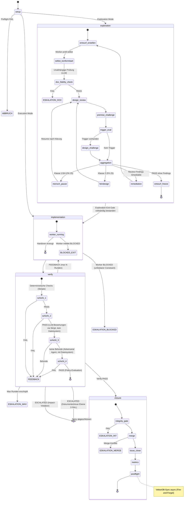
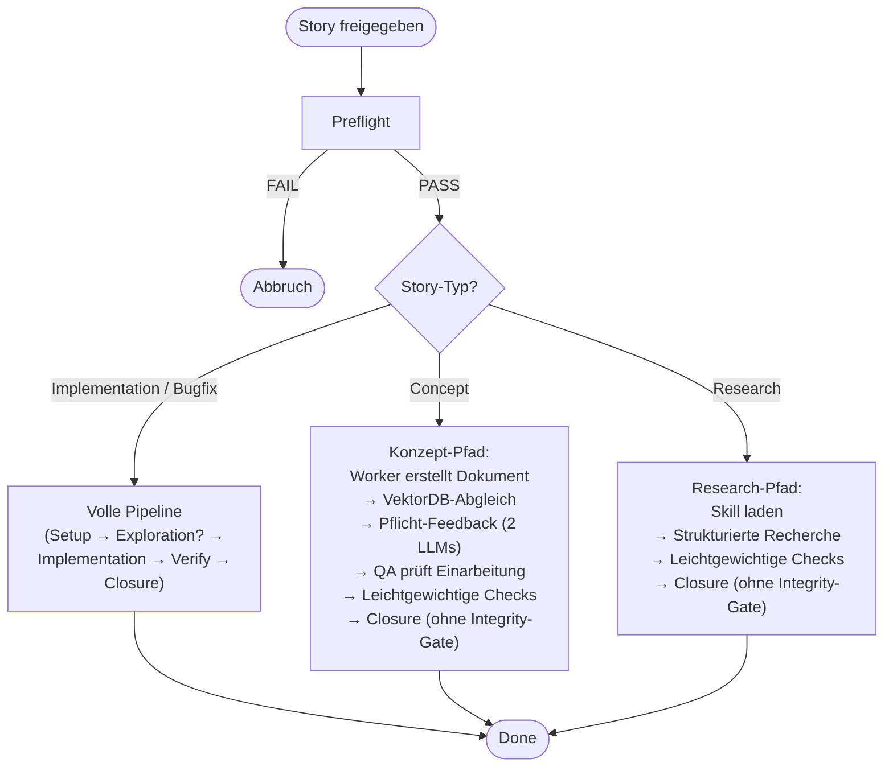
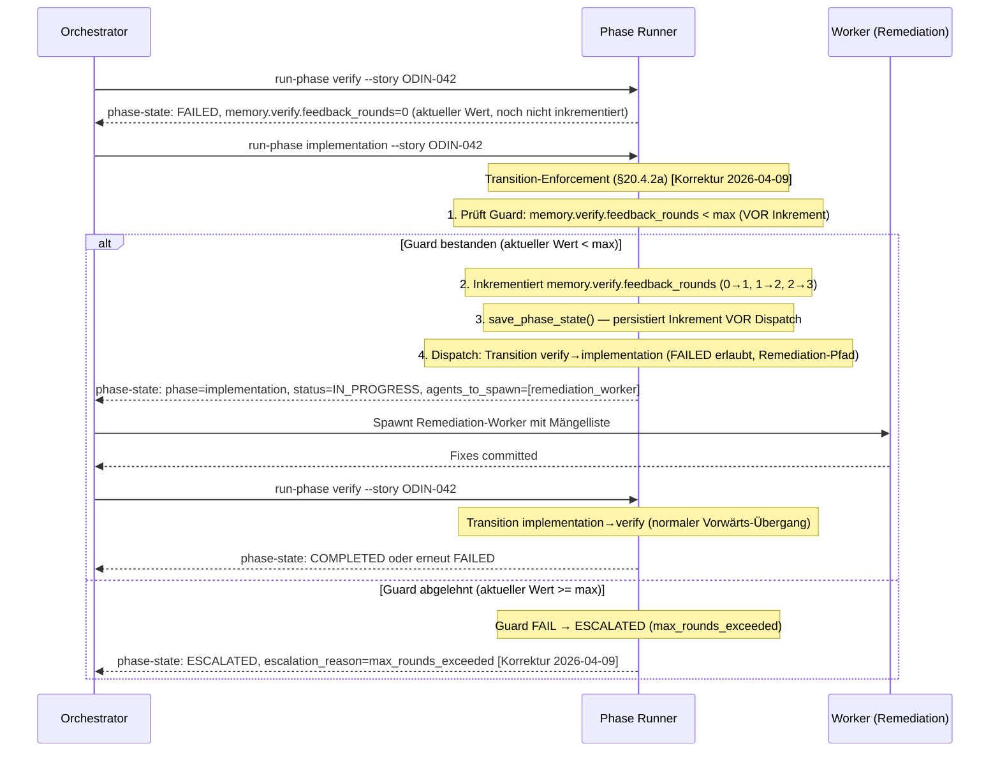

# 20 — Workflow-Engine und State Machine

<!-- PROSE-FORMAL: formal.setup-preflight.entities, formal.setup-preflight.state-machine, formal.setup-preflight.invariants, formal.setup-preflight.scenarios, formal.implementation.entities, formal.implementation.state-machine, formal.implementation.commands, formal.implementation.events, formal.implementation.invariants, formal.implementation.scenarios, formal.verify.entities, formal.verify.state-machine, formal.verify.commands, formal.verify.events, formal.verify.invariants, formal.verify.scenarios, formal.story-workflow.state-machine, formal.story-workflow.commands, formal.story-workflow.events, formal.story-workflow.invariants, formal.story-workflow.scenarios, formal.story-reset.invariants -->

## 20.1 Grundprinzip

Die Pipeline-Orchestrierung folgt einem zentralen Grundsatz des FK
(FK-05-002): **Kein Agent entscheidet über den Ablauf; der Ablauf
entscheidet, wann welcher Agent arbeiten darf.**

Technisch bedeutet das: Der Phase Runner ist ein deterministisches
Python-Skript, das den Story-Lifecycle als State Machine steuert.
Er wird vom Orchestrator-Agent über die CLI aufgerufen, aber der
Orchestrator hat keinen Einfluss auf die Phasenlogik selbst. Der
Phase Runner entscheidet über Phasenwechsel, Feedback-Loops und
Eskalation.

### 20.1.1 Komponentenschnitt

Im fachlichen Komponentenmodell aus FK-01 ist die Workflow-Engine die
Top-Level-Komponente `PipelineEngine`. Der Phase Runner ist ihre
deterministische Laufzeitimplementierung.

| Ebene | Zugehoerigkeit | Verantwortung |
|-------|----------------|---------------|
| `PipelineEngine` | Top-Level-Komponente | State Machine, Transition-Guards, Feedback-/Review-Loops, Eskalation |
| `SetupPhase`, `ExplorationPhase`, `ImplementationPhase`, `VerifyPhase`, `ClosurePhase` | Subkomponenten der `PipelineEngine` | Innere Fachlogik je Phase |
| `PreflightChecker`, `ModeResolver` | Subkomponenten von `SetupPhase` | Vorbedingungen und Modusermittlung |
| `StructuralChecker`, `PolicyEngine` | Subkomponenten von `VerifyPhase` | Layer-1-Pruefung und finale Aggregation |
| `IntegrityGate` | Subkomponente von `ClosurePhase` | Vorbedingung fuer Merge/Abschluss |

**Abgrenzung:** Der vollstaendige Story-Reset ist **keine**
Subkomponente der `PipelineEngine`. Er ist eine separate
Top-Level-Komponente `StoryResetService`, weil er keinen normalen
Story-Run fortsetzt, sondern eine menschlich autorisierte
Recovery-Operation ausserhalb des Pipeline-Kontrollflusses ist.

Dasselbe gilt fuer `StorySplitService`: Auch ein Story-Split ist
keine normale Phasenfortsetzung, sondern eine administrative
Operation ausserhalb des Pipeline-Kontrollflusses. Er beendet bei
Scope-Explosion die ueberdehnte Ausgangs-Story kontrolliert und legt
deren Nachfolger an.

### 20.1.2 Einheitliche Prozess-DSL

AK3 verwendet fuer die Ablaufmodellierung **eine einzige hierarchische
Prozess-DSL**. Dieselben Sprachkonstrukte gelten fuer die komplette
Pipeline, fuer einzelne Phasen, fuer fachliche Komponenten und fuer
deren Subschritte. Es gibt **kein zweites Kontrollflussmodell** auf
Komponentenebene.

**Abgrenzung:** Die in FK-28 definierte Request-DSL bleibt eine
fachspezifische Nachforderungssprache fuer Reviewer. Sie ist **nicht**
Teil der hier beschriebenen Kontrollfluss-DSL.

| Ebene | DSL-Sicht | Typischer Owner | Zweck |
|-------|-----------|-----------------|-------|
| Pipeline | `FlowDefinition(level="pipeline")` | `PipelineEngine` | Gesamtablauf einer Story |
| Phase | `FlowDefinition(level="phase")` | `SetupPhase`, `VerifyPhase`, ... | Ablauf innerhalb einer Phase |
| Komponente | `FlowDefinition(level="component")` | `StageRegistry`, `Installer`, `GuardSystem`, ... | Innere Kontrolllogik einer Komponente |
| Subschritt | `NodeDefinition(kind="step")` oder `subflow` | jeweilige Komponente | Atomarer oder zusammengesetzter Ausfuehrungsschritt |

Die DSL modelliert **Kontrollfluss**, nicht Fachinhalt. Fachlogik,
I/O, Artefaktproduktion und Seiteneffekte bleiben in den
Schritt-Handlern der jeweiligen Komponente implementiert. Die DSL
beschreibt dagegen:

- Reihenfolge
- Fallunterscheidungen
- Wiederholungen und Rueckspruenge
- Gates und Yield-Points
- Once-only-/Until-success-Semantik
- manuelle oder orchestratorseitige Overrides

### 20.1.3 Kernkonstrukte der Prozess-DSL

| Konstrukt | Bedeutung | Typische Felder |
|-----------|-----------|-----------------|
| `FlowDefinition` | Vollstaendiger Ablaufvertrag einer Pipeline, Phase oder Komponente | `flow_id`, `level`, `owner`, `nodes`, `edges`, `hooks` |
| `NodeDefinition` | Knoten im Ablaufgraph | `node_id`, `kind`, `handler_ref`, `execution_policy`, `override_policy` |
| `EdgeRule` | Gerichtete Kante zwischen zwei Knoten | `source`, `target`, `when`, `priority`, `resume_policy` |
| `Guard` | Seiteneffektfreie Vorbedingung / Entscheidungsbedingung | `name`, `reads`, `predicate` |
| `Gate` | Mehrstufiger Pruefpunkt mit Aggregationsregel | `id`, `stages`, `final_aggregation`, `max_remediation_rounds` |
| `YieldPoint` | Typisierte Pause mit Resume-Triggern | `status`, `resume_triggers`, `required_artifacts` |
| `ExecutionPolicy` | Wiederholungs- und Skip-Semantik eines Knotens | `ALWAYS`, `ONCE_PER_RUN`, `ONCE_PER_STORY`, `UNTIL_SUCCESS`, `SKIP_AFTER_SUCCESS` |
| `RetryPolicy` | Begrenzung und Ziel von Wiederholungen | `max_attempts`, `backtrack_target`, `cooldown_policy` |
| `OverridePolicy` | Erlaubte manuelle Eingriffe | `allow_skip`, `allow_force_pass`, `allow_jump`, `allow_truncate` |

**Node-Klassen:** Die DSL verwendet auf allen Ebenen dieselben
Knotentypen:

| `kind` | Semantik |
|--------|----------|
| `step` | Atomarer Ausfuehrungsschritt mit konkretem Handler |
| `gate` | Qualitaets-/Freigabepunkt mit Stage-Aggregation |
| `yield` | Pause bis externer Trigger / Mensch / Orchestrator resumiert |
| `branch` | Fallunterscheidung; ausgehende Kanten werden ueber Guards gewaehlt |
| `subflow` | Eingebetteter Ablauf, der wieder dieselbe DSL benutzt |

**Normative Regel:** Komponenten modellieren ihre Subschritte als
`subflow` + `step`-Kombinationen. Imperative Einzelschritt-Logik in
beliebigen Python-Dateien ohne expliziten DSL-Vertrag ist fuer
nichttriviale Ablaufteile nicht zulaessig.

### 20.1.4 Fallunterscheidung, Wiederholung und Ruecksprung

Die DSL muss dieselben generischen Ablaufmuster auf allen Ebenen
abbilden koennen:

| Muster | Normative Modellierung |
|--------|------------------------|
| Fallunterscheidung | `branch`-Node oder mehrere `EdgeRule`s mit Guards; erste passende Kante gewinnt nach `priority` |
| Wiederholung | Explizite Rueckkante auf frueheren `node_id` + `RetryPolicy` |
| Gezielter Ruecksprung | Ruecksprung erfolgt immer auf **explizite** `node_id`s, nie auf implizite "minus 2 Schritte" ohne DSL-Kante |
| Remediation-Loop | Rueckkante + `max_attempts` + persistierter Zaehler im Laufzeitstate |
| Einmalige Schritte | `ExecutionPolicy = ONCE_PER_RUN` oder `ONCE_PER_STORY` |
| Nur bis Erfolg wiederholen | `ExecutionPolicy = UNTIL_SUCCESS` |
| Nach Erfolg ueberspringen | `ExecutionPolicy = SKIP_AFTER_SUCCESS` |

Damit gilt auch fuer Rueckspruenge aus spaeteren Phasen oder
Komponenten: Wenn der Ablauf erneut vorwaerts durchlaufen wird,
entscheidet **nicht** der Handler ad hoc, welche Schritte erneut
laufen, sondern die DSL zusammen mit dem persistierten
Execution-Ledger.

### 20.1.5 Overrides und manuelle Eingriffe

Overrides sind ein normierter Teil der Ablaufsteuerung und werden
nicht als ad-hoc-Sonderlogik in einzelnen Komponenten modelliert.

| Override | Semantik |
|----------|----------|
| `skip_node` | Knoten wird fuer diesen Run bewusst uebergangen |
| `force_gate_pass` / `force_gate_fail` | Gate-Entscheidung wird manuell gesetzt |
| `jump_to` | Ausfuehrung springt auf einen expliziten `node_id` |
| `truncate_flow` | Restlicher Teil eines Subflows wird bewusst abgeschnitten |
| `freeze_retries` | Weitere Rueckspruenge / Wiederholungen werden fuer diesen Ast unterbunden |

**Regeln:**

1. Overrides duerfen nur durch Mensch oder Orchestrator via CLI
   beantragt werden, nie durch Worker.
2. Jeder Override wird als auditierbarer Override-Record persistiert
   und von der Engine ausgewertet.
3. Ob ein Override zulaessig ist, entscheidet die `OverridePolicy`
   des betroffenen Knotens oder Flows.
4. Auch ein Override mutiert den Zustand nicht direkt; die Engine
   wendet ihn deterministisch bei der naechsten Auswertung an.

**Abgrenzung zum Story-Reset:** Ein vollstaendiger Story-Reset ist
kein Override. Er ersetzt keinen Knotenentscheid und springt nicht im
laufenden Flow, sondern beendet die korrupt gewordene Umsetzung
administrativ und schafft einen neuen sauberen Startzustand.

### 20.1.6 Evolution der bestehenden Workflow-DSL

Die bereits implementierte Workflow-DSL unter
`agentkit.process.language` ist die **erste Auspraegung** der
hierarchischen Prozess-DSL und wird nicht verworfen, sondern
verallgemeinert.

| Heutiger Begriff | Zielbegriff in der Einheits-DSL | Rolle |
|------------------|----------------------------------|-------|
| `WorkflowDefinition` | `FlowDefinition` | Ablaufvertrag auf beliebiger Ebene |
| `PhaseDefinition` | `NodeDefinition(kind="subflow")` oder phasenbezogene Spezialisierung | Zusammengesetzter Knoten |
| `TransitionRule` | `EdgeRule` | Kante im Ablaufgraph |
| `GuardFn` | `Guard` | Bedingung |
| `Gate` | `Gate` | unveraendert, aber nicht mehr nur phasenbezogen |
| `YieldPoint` | `YieldPoint` | unveraendert, aber auf allen Ebenen nutzbar |

**Konsequenz fuer AK3:** Die Pipeline bleibt phasenorientiert
modelliert. Komponenten fuehren jedoch **dieselbe** Sprache fuer ihre
eigenen Subschritte. Dadurch werden Kontrollfluss-Semantik, Override-
Verhalten und Wiederholungslogik systemweit vereinheitlicht.

### 20.1.7 Ausfuehrungsvertrag fuer Knoten

Die Einheits-DSL definiert den Kontrollfluss. Damit Komponenten
andockbar bleiben, ohne die Engine zu unterlaufen, gilt fuer alle
ausfuehrbaren Knoten ein gemeinsamer Handler-Vertrag.

| Vertragsteil | Bedeutung |
|--------------|-----------|
| `StepExecutionContext` | Immutable Laufzeitansicht auf `project_key`, `story_id`, `run_id`, `flow_id`, `node_id`, `StoryContext`, `PhaseState`, aktive Overrides und lesbare Artefakt-Handles |
| `StepHandler` | Deterministische oder agentische Implementierung eines `step`-Knotens; fuehrt Fachlogik aus, mutiert aber den globalen State nicht direkt |
| `StepResult` | Rueckgabe eines Knotens: `outcome`, `produced_artifacts`, `emitted_events`, `requested_yield`, `diagnostics` |
| `SubflowProvider` | Liefert fuer `subflow`-Knoten die untergeordnete `FlowDefinition` plus Handler-Registry |
| `GateRunner` | Fuehrt `gate`-Knoten aus und aggregiert Stage-Ergebnisse gemaess Gate-Vertrag |

**Normative Regeln:**

1. Schritt-Handler schreiben den globalen Ablaufstate nicht direkt.
   Sie liefern `StepResult`; die Engine wendet daraus den
   Zustandsuebergang an.
2. Rueckspruenge, Wiederholungen, Skips und Overrides duerfen nicht
   im Handler versteckt implementiert werden; sie muessen ueber die
   DSL-Kanten, Policies und Override-Records sichtbar sein.
3. Ein `subflow`-Knoten darf nur ueber einen `SubflowProvider` neue
   Knoten einbringen. Dynamisch zusammengebaute implizite Python-Loops
   ausserhalb der DSL sind nicht zulaessig.
4. Agentische Schritte sind erlaubt, aber nur als Handler eines
   expliziten `step`-Knotens. Auch sie sind an `ExecutionPolicy`,
   `RetryPolicy` und `OverridePolicy` gebunden.

**Folge fuer die Komponentenmodellierung:** Jede nichttriviale
Komponente liefert kuenftig mindestens:

- eine `FlowDefinition` fuer ihren internen Ablauf
- eine Handler-Registry fuer ihre `step`-Knoten
- einen klaren Satz lesbarer Inputs und produzierter Artefakte

Damit werden Komponenten zu expliziten, auditierbaren
Ausfuehrungseinheiten derselben Sprache, statt ihre innere
Kontrolllogik in frei formulierten Python-Dateien zu verstecken.

## 20.2 Phasenmodell

### 20.2.1 Fünf Phasen

| Phase | Typ | Zweck | Akteur |
|-------|-----|-------|--------|
| `setup` | Deterministisch | Preflight, Worktree, Context, Guards, Mode-Routing | Pipeline-Skript |
| `exploration` | Agent-gesteuert | Entwurfsartefakt erzeugen, Dokumententreue prüfen | Worker-Agent + LLM-Evaluator |
| `implementation` | Agent-gesteuert | Code/Konzept/Research umsetzen | Worker-Agent |
| `verify` | Deterministisch + LLM | 4-Schichten-QA | Pipeline-Skripte + LLM-Evaluator + Adversarial Agent |
| `closure` | Deterministisch | Integrity-Gate, Merge, Issue-Close, Metriken, Postflight | Pipeline-Skript |

### 20.2.1a StoryResetService

Der `StoryResetService` ist die administrative Recovery-Komponente fuer
Faelle, in denen ein eskalierter Story-Run nicht mehr ueber den
normalen Workflow repariert oder weitergefuehrt werden kann.

| Aspekt | Regel |
|--------|-------|
| Ausloeser | nur ausdruecklicher menschlicher CLI-Befehl |
| Erlaubender Vorzustand | typischerweise `ESCALATED`, nie automatischer Trigger |
| Initiator | Mensch; Orchestrator darf nur empfehlen oder dokumentieren |
| Wirkung | Purge von Runtime-State, Read Models, Analytics-Ableitungen, story-bezogenen Sperren und ephemeren Arbeitsartefakten |
| Ergebnis | Story verbleibt als fachliche Arbeitseinheit, aber die bisherige korrupt gewordene Umsetzung verschwindet vollstaendig |

**Normative Regel:** `PipelineEngine` darf niemals selbststaendig einen
vollstaendigen Story-Reset ausfuehren. Sie darf hoechstens in einen
eskalierten Zustand uebergehen und damit den Menschen zu einer
Entscheidung zwingen.

### 20.2.2 State Machine



> [Terminologie-Hinweis 2026-04-09] **ABBRUCH in Diagrammen = `status: ESCALATED` im State-Modell:** Die Mermaid-Diagramme verwenden `ABBRUCH` und `ABORT` als Beschriftung für den Preflight-FAIL-Terminalknoten. Im v3-Zustandsmodell entspricht dies `status: ESCALATED` mit `escalation_reason: "preflight_fail"`. Es gibt keinen separaten Status `ABBRUCH` — der Begriff ist ausschließlich eine Darstellungshilfe in den Diagrammen.

> [Korrektur 2026-04-09] **Kein Rücksprung verify → exploration:**
> Die ursprüngliche Transition `verify --> exploration : Impact-Violation
> (Exploration Mode)` wurde entfernt. Impact-Violation in Verify bedeutet
> Implementierungsversagen und führt zu `status: ESCALATED`. Es gibt
> keinen automatischen Rücksprung von Verify oder Implementation in die
> Exploration-Phase. Der Mensch entscheidet nach Eskalation über nächste
> Schritte (ggf. neue Exploration mit neuem Mandat als neuer Pipeline-Lauf).
> Exploration-interne Remediation (max 3 Runden) bleibt davon unberührt.

> [Korrektur 2026-04-09] **Exploration-Exit-Gate:** Die Transition
> `exploration --> implementation` erfordert den vollständigen Ablauf
> gemäß FK-23 und FK-25: Dokumententreue, Design-Review,
> Prämissen-Challenge, optionale Design-Challenge, H1-Aggregation,
> H2-Nachklassifikation und ggf. Feindesign-Subprozess. Erst wenn
> der Draft alle Prüfungen bestanden hat, eingefroren wurde und
> `payload.gate_status: APPROVED` erreicht ist, darf die
> Implementation-Phase betreten werden.

### 20.2.3 Abweichende Pfade nach Story-Typ

Die State Machine gilt in voller Ausprägung nur für
**implementierende Story-Typen** (Implementation, Bugfix).
Konzept- und Research-Stories nehmen Abkürzungen:



**Was Konzept- und Research-Stories NICHT durchlaufen:**
- Keine Modus-Ermittlung (Execution/Exploration)
- Kein Worktree/Branch (arbeiten direkt auf Main — AI-Augmented-Modus)
- Keine 4-Schichten-Verify-Pipeline
- Kein Integrity-Gate
- Kein Adversarial Testing

**Was Konzept-Stories zusätzlich durchlaufen:**
- VektorDB-Abgleich auf Überschneidungen mit bestehenden Konzepten
- Pflicht-Feedback-Loop mit 2 verschiedenen LLMs (Kap. 02.2.4)
- QA-Prüfung der Feedback-Einarbeitung

> **[Entscheidung 2026-04-08]** Element 13 — `_guard_failure` und `_loaded_from_file` werden als RuntimeMetadata uebernommen (nicht als Felder auf PhaseState). `_loaded_from_file` wird veredelt zu `origin` (NEW | LOADED). `_guard_failure` verhindert Persistierung von invalidem State.
> Element 13b — `_recovered_from_context` Flag entfaellt. Konzepte verbieten automatische State-Rekonstruktion. Fehlendes `phase-state.json` → nur `setup` erlaubt. Korrupt → PIPELINE_ERROR. Recovery nur als bewusste Mensch-Aktion (§20.7.2).
> Element 16 — PhaseState-Restructuring: Ownership-Trennung in StoryContext (langlebige Story-Semantik), PhaseStateCore (aktueller Laufzeitstatus), PhasePayload (diskriminierte Union pro Phase), RuntimeMetadata (nicht-fachliche Loader-/Guard-Infos). `mode`, `story_type` → raus aus PhaseState, rein in StoryContext. QA-Zyklus-Felder → VerifyState. Exploration-Gate-Felder → ExplorationState. Closure-Substates → ClosureState. Detailkonzept wird separat ausgearbeitet.
> Siehe `stories/entscheidung-v2-ballast-bewertung.md`, Elemente 13, 13b, 16.

> **[Korrektur 2026-04-09]** Element 13 — Präzisierung: `guard_failure` wird **nicht** als Feld in `RuntimeMetadata` modelliert. `RuntimeMetadata` enthält ausschließlich `origin: PhaseOrigin` (NEW | LOADED). Das durable Signal für Guard-Failures ist `AttemptRecord.failure_cause: FailureCause` (StrEnum). Siehe §20.3.4.
>
> **[Ergänzung 2026-04-09]** Das Detailkonzept zu Element 16 liegt nun vollständig vor (Designwizard R1+R2 vom 2026-04-09). Die ausgearbeiteten Entscheidungen sind in FK-20 eingetragen: PhaseEnvelope + RuntimeMetadata (§20.3.3), AttemptRecord-Typisierung (§20.3.4), PhaseMemory mit Carry-Forward (§20.3.7), PauseReason StrEnum (§20.6.2a), PhasePayload Discriminated Union mit ExplorationPayload, VerifyPayload, ClosurePayload (FK-27 §27.3a, FK-23 §23.5).
>
> [Korrektur 2026-04-09: SetupPayload und ImplementationPayload existieren nicht. Nur Exploration (ExplorationPayload), Verify (VerifyPayload) und Closure (ClosurePayload) haben typed Payloads. Setup und Implementation haben payload: null.]

## 20.3 Phase-State-Persistenz

### 20.3.1 Vierschichtiges State-Modell [Entscheidung 2026-04-09]

Der Phase-State folgt einer vierschichtigen Architektur. Die
oberste Schicht (`PhaseEnvelope`) ist ein frozen Dataclass, der
**nie als Ganzes persistiert** wird. Nur die `state`-Schicht wird
als `phase_state_projection` im State-Backend persistiert; ein
`phase-state.json` ist nur ihr materialisierter Export. Die
`runtime`-Schicht ist ephemer und existiert ausschließlich im Speicher
des laufenden Phase-Runner-Prozesses.

```
PhaseEnvelope (frozen dataclass, nie persistiert als Ganzes)
├── state: PhaseState          ← wird als `phase_state_projection` persistiert
│   ├── PhaseStateCore          (story_id, phase, status, pause_reason, …)
│   ├── payload: PhasePayload   (discriminated union, phase-spezifische Durable Fields)
│   └── memory: PhaseMemory     (phasenübergreifende Zähler, carry-forward)
└── runtime: RuntimeMetadata    ← ephemer, NICHT persistiert
    └── origin: PhaseOrigin     (NEW | LOADED)
```

> [Korrektur 2026-04-09: RuntimeMetadata enthält ausschliesslich origin: PhaseOrigin — guard_failure/retry_count/elapsed_seconds entfernt.]

**Persistierung:** Nur `PhaseState` (= `PhaseStateCore` +
`payload` + `memory`) wird zentral als `phase_state_projection`
persistiert. Ein `_temp/qa/{story_id}/phase-state.json` ist nur ein
Export dieser Projektion. `RuntimeMetadata` wird **nie** auf Platte
oder in den Store geschrieben — sie existiert nur in-memory für die
Dauer eines `run-phase`-Aufrufs.

**Normative Leseregel:** Alle spaeteren Verweise in diesem Dokument
auf `phase-state.json` meinen den Export der kanonischen
`phase_state_projection`, nicht eine eigenstaendige Wahrheit.

**Abgrenzung ephemer vs. durable:** Durable Fehlerinformation
(die einen Crash überleben muss) wird über `AttemptRecord` erfasst
(siehe §20.3.4).

> [Korrektur 2026-04-09: RuntimeMetadata enthält ausschliesslich origin: PhaseOrigin — guard_failure/retry_count/elapsed_seconds entfernt.]

#### Phase-State-Datei (phase-state.json)

> **[Hinweis 2026-04-08, aktualisiert 2026-04-09]** Dieses Beispiel zeigt die aktualisierte v3-Struktur. Das Detailkonzept ist ausgearbeitet (§20.3.1ff., 2026-04-09). Siehe `stories/entscheidung-v2-ballast-bewertung.md`, Element 16.

```json
{
  "schema_version": "4.0",
  "story_id": "ODIN-042",
  "run_id": "a1b2c3d4-e5f6-7890-abcd-ef1234567890",
  "phase": "verify",
  "status": "IN_PROGRESS",
  "mode": "exploration",
  "story_type": "implementation",
  "attempt": 2,
  "started_at": "2026-03-17T10:00:00+01:00",
  "phase_entered_at": "2026-03-17T11:00:00+01:00",
  "pause_reason": null,
  "escalation_reason": null,
  "agents_to_spawn": [
    {
      "type": "adversarial",
      "prompt_file": "prompts/adversarial-testing.md",
      "model": "opus"
    }
  ],
  "errors": [],
  "warnings": [],
  "producer": { "type": "script", "name": "run-phase" },

  "payload": {
    "type": "verify",
    "verify_context": "POST_IMPLEMENTATION"
  },

  "memory": {
    "exploration": {
      "review_rounds": 0
    },
    "verify": {
      "feedback_rounds": 1
    }
  }
}
```

[Entscheidung 2026-04-09] Gegenüber dem früheren flachen v2-Modell
(schema_version 3.0) wurden folgende Felder in die richtige Schicht
überführt:
- `verify_context` → `payload.verify_context` (VerifyPayload)
- `feedback_rounds` → `memory.verify.feedback_rounds` (PhaseMemory)
- `verify_layer` → entfernt (ephemerer Fortschritt, nicht durable;
  wird bei Resume aus den vorhandenen Artefakten rekonstruiert)
- `closure_substates` → `payload.progress` (ClosurePayload)
- `exploration_gate_status` → `payload.gate_status` (ExplorationPayload)
- `exploration_review_round` → `memory.exploration.review_rounds` (PhaseMemory)

[Korrektur 2026-04-09] Im JSON-Beispiel oben wurde `"verify_context":
"post_implementation"` (lowercase v2-String) auf `"POST_IMPLEMENTATION"`
korrigiert. Korrekte Serialisierung des `VerifyContext`-StrEnum ist
Uppercase (`POST_IMPLEMENTATION`, `POST_REMEDIATION`).

### 20.3.2 Schlüsselfelder nach Schicht [Entscheidung 2026-04-09]

> **[Hinweis 2026-04-08, aktualisiert 2026-04-09]** Diese Feldliste zeigt die v3-Schichtstruktur. Das Detailkonzept ist ausgearbeitet (§20.3.1ff., 2026-04-09). Siehe `stories/entscheidung-v2-ballast-bewertung.md`, Element 16.

#### PhaseStateCore (immer vorhanden)

| Feld | Typ | Beschreibung |
|------|-----|-------------|
| `schema_version` | String | Versionsnummer des State-Schemas (aktuell `"4.0"`) |
| `story_id` | String | Eindeutige Story-ID (z.B. `"ODIN-042"`) |
| `run_id` | String (UUID) | Eindeutige ID des aktuellen Pipeline-Durchlaufs |
| `phase` | Enum | Aktuelle Phase: setup, exploration, implementation, verify, closure |
| `status` | Enum | IN_PROGRESS, COMPLETED, FAILED, ESCALATED, PAUSED |
| `mode` | Enum | execution, exploration (nach Mode-Routing gesetzt). Für Concept/Research-Stories immer `"execution"` — diese Story-Typen unterstützen keinen Exploration Mode; der Phase Runner setzt `mode = "execution"` ohne Mode-Routing-Prüfung. |
| `story_type` | Enum | implementation, bugfix, concept, research |
| `attempt` | Integer | Aktueller Durchlauf (beginnt bei 1) |
| `started_at` | ISO-8601 | Zeitstempel des Pipeline-Starts |
| `phase_entered_at` | ISO-8601 | Zeitstempel des Eintritts in die aktuelle Phase |
| `pause_reason` | PauseReason \| null | Grund bei `status: PAUSED`. Erlaubte Werte: siehe PauseReason-StrEnum unten. Wire-Format (in `phase-state.json`): serialisierter StrEnum-Wert in Lowercase (`"awaiting_design_review"`, `"awaiting_design_challenge"`, `"governance_incident"`). Enum-Member-Namen (`AWAITING_DESIGN_REVIEW` etc.) sind nur in Python-Code zu verwenden. [Entscheidung 2026-04-09] |
| `escalation_reason` | String \| null | REF-042: Grund bei `status: ESCALATED`. Werte: `"worker_blocked"`, `"max_rounds_exceeded"`, `"preflight_fail"`, `"integrity_fail"`, `"merge_fail"`, `"doc_fidelity_fail"`, `"impact_violation"`, `"design_review_rejected"`, `"governance_violation"`. [Entscheidung 2026-04-09: `doc_fidelity_fail` und `impact_violation` ergänzt — waren in §20.6.1 beschrieben, fehlten aber in der Werte-Liste.] [Entscheidung 2026-04-09: `design_review_rejected` ergänzt — Exploration Design-Review FAIL non-remediable oder Rundenlimit überschritten.] [Korrektur 2026-04-09: `governance_violation` ergänzt — Governance-Beobachtung harter Verstoß (Secrets, Governance-Manipulation), führt zu sofortigem ESCALATED-Stopp (§20.6.1).] |
| `agents_to_spawn` | Array | Agents, die der Orchestrator als nächstes spawnen soll |
| `errors` | Array | Fehlerliste des aktuellen Durchlaufs |
| `warnings` | Array | Warnungen des aktuellen Durchlaufs |
| `producer` | Object | Identifikation des schreibenden Prozesses |

> [Hinweis 2026-04-09: mode und story_type sind in StoryContext (context.json) die primäre Quelle (Element 16). PhaseStateCore enthält sie als denormalisierte Kopie — der Phase Runner liest sie aus phase-state.json ohne separaten context.json-Load. Keine inhaltliche Abweichung von Element 16.]

> **[Entscheidung 2026-04-09]** Die Felder `feedback_rounds`, `max_feedback_rounds`, `exploration_gate_status`, `verify_context`, `verify_layer`, `closure_substates` aus der v2-Tabelle entfallen aus dem flachen `PhaseStateCore`. Sie werden in die neue Schichtstruktur überführt: `ExplorationPayload.gate_status`, `VerifyPayload.verify_context`, `ClosurePayload.progress` (PhasePayload) sowie `PhaseMemory.verify.feedback_rounds`, `PhaseMemory.exploration.review_rounds` (PhaseMemory). Siehe §20.3.3, §20.3.7. [Hinweis: §20.3.5 existiert nicht als separater Abschnitt — PhasePayload ist in §20.3.2 (Feldtabelle) und §20.3.3 (PhaseEnvelope/Python-Definitionen) dokumentiert.]

> **[Entscheidung 2026-04-09]** Zwei getrennte Zählerfelder entfallen aus dem flachen `PhaseStateCore` und werden in `PhaseMemory` überführt: (1) `exploration_review_round` (Exploration-Remediation-Zähler) → `memory.exploration.review_rounds` (`ExplorationPhaseMemory`); (2) `feedback_rounds` (Verify-Remediation-Zähler) → `memory.verify.feedback_rounds` (`VerifyPhaseMemory`). Beide Zähler werden per Carry-Forward über Phasenwechsel mitgeführt. Kein Zusammenhang zwischen den beiden Zählern — `exploration_review_round` betrifft Design-Review-Runden, `feedback_rounds` betrifft Verify→Implementation-Zyklen. Verweis auf Designwizard R1+R2 vom 2026-04-09. Siehe §20.3.7.

#### PauseReason (StrEnum) [Entscheidung 2026-04-09]

Das Feld `pause_reason` akzeptiert ausschließlich einen der drei
definierten Werte. Jeder andere String ist ungültig und wird vom
Phase Runner mit einem Validierungsfehler abgewiesen.

```python
class PauseReason(StrEnum):
    AWAITING_DESIGN_REVIEW = "awaiting_design_review"
    AWAITING_DESIGN_CHALLENGE = "awaiting_design_challenge"
    GOVERNANCE_INCIDENT = "governance_incident"
```

| Wert | Wann gesetzt | Beschreibung |
|------|-------------|-------------|
| `AWAITING_DESIGN_REVIEW` | Exploration-Phase | Entwurfsartefakt liegt vor und wartet auf Design-Review (Mensch oder Review-Agent). Pipeline pausiert, bis Review-Ergebnis vorliegt. |
| `AWAITING_DESIGN_CHALLENGE` | Exploration-Phase | Design-Review hat Einwände erhoben (Design-Challenge). Pipeline pausiert, bis der Challenge-Prozess abgeschlossen ist. |
| `GOVERNANCE_INCIDENT` | Jede Phase | Governance-Observer hat einen kritischen Incident erkannt (kein harter Verstoß). Pipeline pausiert sofort, Mensch muss intervenieren und den Incident klären. |

**Abgrenzung:** `PAUSED` mit einem PauseReason ist ein
**vorübergehender** Zustand — die Pipeline kann nach Klärung
fortgesetzt werden (`agentkit resume`). `ESCALATED` ist ein
**dauerhafter** Stopp der aktuellen Iteration — Ursache muss
behoben werden, bevor ein neuer Run gestartet wird.

#### PhasePayload (discriminated union, phase-spezifisch)

Das `payload`-Feld enthält eine discriminated union, gesteuert über
`payload.type`. Je nach aktiver Phase enthält es unterschiedliche
Durable Contract Fields:

| Phase | Payload-Typ | Felder | Beschreibung |
|-------|-------------|--------|-------------|
| exploration | `ExplorationPayload` | `gate_status: ExplorationGateStatus` | Fortschritt durch das Exit-Gate. Werte: `PENDING`, `APPROVED`, `REJECTED` |
| verify | `VerifyPayload` | `verify_context: VerifyContext` | QA-Tiefe: `POST_IMPLEMENTATION` (volle 4-Schichten-QA) oder `POST_REMEDIATION` (Nachprüfung nach Remediation). Wird vom Phase Runner vor dem Verify gesetzt. Siehe DK-02 §Verify-Kontext. |
| closure | `ClosurePayload` | `progress: ClosureProgress` | Fortschritt der Closure-Substates: `integrity_passed`, `merge_done`, `issue_closed`, `metrics_written`, `postflight_done` (je `bool`). [Hinweis: Für Concept/Research-Stories ohne Worktree/Branch werden `integrity_passed` und `merge_done` vom Phase Handler direkt auf `true` gesetzt (kein Branch vorhanden = nichts zu prüfen/mergen). Detaillierte Closure-Logik in FK-27 §27.10.] |
| setup, implementation | — | — | Kein Payload erforderlich (`payload: null`) |

#### PhaseMemory (phasenübergreifend, carry-forward)

`memory` enthält Zähler, die über Phase-Transitionen hinweg
mitgeführt werden. Sie werden von der Engine inkrementiert,
**nicht** von den Phase-Handlern.

| Pfad | Typ | Beschreibung |
|------|-----|-------------|
| `memory.exploration.review_rounds` | Integer | Zähler für Design-Review-Remediation-Runden (max 3). Wird von der Engine inkrementiert, NICHT vom Handler. |
| `memory.verify.feedback_rounds` | Integer | Anzahl Verify→Implementation-Zyklen (max 3). Wird von der Engine inkrementiert, NICHT vom Handler. |

> [Hinweis 2026-04-09] **Typnamen vs. Feldpfade:** Die Memory-Felder
> werden in FK-20 über ihren Feldpfad referenziert (z.B.
> `memory.exploration.review_rounds`). FK-23 verwendet stattdessen den
> Typnamen `ExplorationPhaseMemory.review_rounds`. Das ist kein
> Widerspruch: `memory.exploration` ist vom Typ `ExplorationPhaseMemory`,
> `memory.verify` ist vom Typ `VerifyPhaseMemory`. Die Kurzform
> `ExplorationPhaseMemory.review_rounds` in FK-23 referenziert denselben
> Feldpfad wie `memory.exploration.review_rounds` in FK-20.

**Max-Werte:** Die Maximalwerte (`max_feedback_rounds` etc.)
kommen aus der Pipeline-Config (`policy.max_feedback_rounds`),
nicht aus dem State. Der State zählt nur den Ist-Wert.

#### RuntimeMetadata (ephemer, NICHT persistiert)

| Feld | Typ | Beschreibung |
|------|-----|-------------|
| `origin` | PhaseOrigin | Herkunft des States: `NEW` (frisch erzeugt) oder `LOADED` (aus `phase-state.json` geladen). Ephemer — wird nie auf Platte geschrieben. |

> [Korrektur 2026-04-09: RuntimeMetadata enthält ausschliesslich origin: PhaseOrigin — guard_failure/retry_count/elapsed_seconds entfernt.]

### 20.3.3 PhaseEnvelope und RuntimeMetadata

> **[Entscheidung 2026-04-09]** `PhaseEnvelope` wird als Execution Container eingeführt. RuntimeMetadata ist eine eigenständige frozen Dataclass. Persistenzgrenze: nur `state` wird geschrieben. `load_phase_state()` gibt `PhaseEnvelope | None` zurück. Verweis auf Designwizard R1+R2 vom 2026-04-09.

`PhaseEnvelope` ist ein **frozen Dataclass** (nicht Pydantic) und dient als Laufzeit-Container für eine Phase-Ausführung:

```python
@dataclass(frozen=True)
class RuntimeMetadata:
    origin: PhaseOrigin  # NEW | LOADED

@dataclass(frozen=True)
class PhaseEnvelope:
    state: PhaseState
    runtime: RuntimeMetadata
```

`PhaseOrigin` ist ein StrEnum mit den Werten `NEW` (frisch erzeugter State) und `LOADED` (aus `phase-state.json` geladen).

**Scope-Regel — welche Methoden welche Typen nehmen:**

| Methode / Funktion | Signatur-Typ | Begründung |
|--------------------|-------------|------------|
| `run_phase()`, `resume_phase()`, `_process_handler_result()` | `PhaseEnvelope` | Execution-Pfad, Laufzeit-Kontext relevant |
| Guards (`can_enter_phase`, `evaluate_transitions`, Guard-Funktionen) | `PhaseState` | Reine Zustandsprüfung, kein Laufzeit-Kontext nötig |
| Handler-Signaturen | `(ctx: StoryContext, state: PhaseState)` | Handler arbeiten nur mit fachlichem Zustand |

> [Hinweis 2026-04-09: run_phase() gibt nach außen PhaseState zurück (envelope.state); intern wird der vollständige PhaseEnvelope (state + runtime) verwendet. Kein Widerspruch — PhaseEnvelope.state ist vom Typ PhaseState.]

**Persistenzgrenze:** `save_phase_state(envelope.state)` — nur `state` wird geschrieben, nie der Envelope. `RuntimeMetadata` ist ephemer und überlebt keinen Prozess-Neustart.

**Erzeugen neuer States:** Die Engine erzeugt neue States immer als:
```python
PhaseEnvelope(
    state=new_state,
    runtime=RuntimeMetadata(origin=PhaseOrigin.NEW)
)
```

**`load_phase_state()` gibt `PhaseEnvelope | None` zurück:**
- Datei vorhanden → `PhaseEnvelope(state=loaded_state, runtime=RuntimeMetadata(origin=PhaseOrigin.LOADED))`
- Datei fehlt → `None` (nur `setup` erlaubt, §20.4.2a)

### 20.3.4 AttemptRecord und Write-Ordering [Entscheidung 2026-04-09]

> **[Entscheidung 2026-04-09]** `AttemptRecord` bekommt typisierte `AttemptOutcome` und `FailureCause` StrEnums. Write-Ordering: AttemptRecord wird VOR `save_phase_state` geschrieben (crash-safety). Verweis auf Designwizard R1+R2 vom 2026-04-09.

Jeder Phase-Durchlauf erzeugt einen `AttemptRecord` — einen
dauerhaften Eintrag in der Phasen-History, der unabhängig vom
Phase-State existiert und einen Crash überleben muss.

#### AttemptRecord-Struktur

```python
@dataclass(frozen=True)
class AttemptRecord:
    run_id: str              # UUID des Pipeline-Durchlaufs
    phase: str               # Phase, in der der Versuch stattfand
    attempt: int             # Versuchsnummer (1-basiert)
    outcome: AttemptOutcome  # Ergebnis des Versuchs
    failure_cause: FailureCause | None  # Nur bei FAILED/BLOCKED/ESCALATED
    started_at: str          # ISO-8601 Zeitstempel
    ended_at: str            # ISO-8601 Zeitstempel
    detail: str | None       # Optionale Freitextbeschreibung
```

#### AttemptOutcome (StrEnum)

`AttemptRecord` dokumentiert jeden Phasen-Durchlauf im Audit-Log. Ab v3 sind `outcome` und `failure_cause` typisiert:

| Wert | Bedeutung |
|------|-----------|
| `COMPLETED` | Phase-Versuch erfolgreich abgeschlossen |
| `FAILED` | Phase-Versuch fehlgeschlagen (Remediation möglich) |
| `ESCALATED` | Phase-Versuch eskaliert (menschliche Intervention nötig) |
| `SKIPPED` | Phase wurde übersprungen (z.B. Exploration bei Execution Mode) |
| `YIELDED` | Phase in PAUSED-Zustand übergegangen (wartet auf externen Trigger) |
| `BLOCKED` | Phase durch Guard oder Precondition blockiert |

#### FailureCause (StrEnum)

| Wert | Bedeutung |
|------|-----------|
| `GUARD_REJECTED` | Transition-Guard hat den Phaseneintritt abgelehnt |
| `STRUCTURAL_CHECK_FAIL` | Verify Schicht 1 (deterministisch) fehlgeschlagen |
| `SEMANTIC_REVIEW_FAIL` | Verify Schicht 2 (LLM-Review) fehlgeschlagen |
| `ADVERSARIAL_FINDING` | Verify Schicht 3 (Adversarial) hat Befunde |
| `POLICY_FAIL` | Verify Schicht 4 (Policy Engine) hat FAIL entschieden |
| `WORKER_BLOCKED` | Worker meldet unlösbaren Constraint |
| `INTEGRITY_FAIL` | Integrity-Gate in Closure fehlgeschlagen |
| `MERGE_FAIL` | Merge-Konflikt in Closure |
| `PREFLIGHT_FAIL` | Preflight-Checks in Setup fehlgeschlagen |
| `MAX_ROUNDS_EXCEEDED` | Feedback-Runden-Limit erreicht |
| `TIMEOUT` | Phase hat Zeitlimit überschritten |
| `GUARD_FAILED` | Guard-Funktion selbst hat eine unerwartete Exception geworfen (technischer Fehler, kein deliberates Reject) |
| `HANDLER_EXCEPTION` | Unerwartete Exception im Phase-Handler |
| `PRECONDITION_FAILED` | Semantische Precondition nicht erfüllt (§20.4.2a) |
| `HANDLER_REPORTED_FAILED` | Handler hat explizit FAILED zurückgemeldet |
| `HANDLER_REPORTED_ESCALATED` | Handler hat explizit ESCALATED zurückgemeldet |

`failure_cause: FailureCause | None` — nur gesetzt wenn `outcome` in (`FAILED`, `BLOCKED`, `ESCALATED`).

#### Write-Ordering (Crash-Safety)

> **WICHTIG:** Der `AttemptRecord` wird **VOR** `save_phase_state()` auf die Platte geschrieben. Diese Reihenfolge gilt für **phasenabschließende Saves** (COMPLETED, FAILED, ESCALATED, PAUSED). Ausnahme: Intermediate Saves (z.B. `save_phase_state()` für den `feedback_rounds`-Inkrement im Remediation-Übergang, §20.4.2a) sind keine Phasenabschlüsse — für sie ist kein eigener AttemptRecord nötig, da der Attempt noch aktiv läuft.

**Begründung:** Bei einem Crash zwischen den beiden Schreibvorgängen
ist der schlimmste Fall, dass ein AttemptRecord existiert, aber der
Phase-State noch den alten Zustand zeigt. Das ist sicher: Beim
Recovery kann der Phase Runner den AttemptRecord lesen und erkennen,
dass der letzte Versuch nicht sauber abgeschlossen wurde. Der
umgekehrte Fall (State aktualisiert, aber kein AttemptRecord) wäre
gefährlich, weil die History dann eine Lücke hätte.

**Ablauf:**

1. Phase-Handler führt seine Arbeit aus
2. `write_attempt_record(record)` → schreibt in `_temp/qa/{story_id}/attempt-history.jsonl` (append)
3. `save_phase_state(state)` → schreibt `phase-state.json` (atomic replace)

**Abgrenzung ephemer vs. durable:**

| Feld | Schicht | Persistiert? | Zweck |
|------|---------|-------------|-------|
| `RuntimeMetadata.origin` | RuntimeMetadata | Nein (ephemer) | Herkunft des States (NEW / LOADED) — nur in-memory für die Dauer eines `run-phase`-Aufrufs |
| `AttemptRecord.failure_cause` | AttemptRecord (History) | Ja (durable) | Permanente Aufzeichnung der Fehlerursache, überlebt Crashes |

> [Korrektur 2026-04-09: RuntimeMetadata enthält ausschliesslich origin: PhaseOrigin — guard_failure/retry_count/elapsed_seconds entfernt.]

Wenn ein Guard den Phaseneintritt **deliberat ablehnt** (Guard-Funktion gibt `False` zurück), wird er als `AttemptRecord` mit `failure_cause = GUARD_REJECTED` in die History geschrieben, bevor der Phase-State aktualisiert wird. Wenn die Guard-Funktion selbst eine **unerwartete Exception** wirft (technischer Fehler), wird `failure_cause = GUARD_FAILED` verwendet.

### 20.3.6 Lese-/Schreibprotokoll

| Wer liest | Wann | Zweck |
|-----------|------|-------|
| Orchestrator-Skill | Nach jeder Phase | Entscheidet welchen Agent als nächstes spawnen |
| Phase Runner | Bei Phasenanfang | Weiß wo er weitermachen muss |
| Integrity-Gate | Bei Closure | Prüft ob Verify durchlaufen wurde |

| Wer schreibt | Wann | Was |
|-------------|------|-----|
| Phase Runner | Bei jedem Phasenwechsel | `PhaseStateCore`: phase, status, timestamps |
| Phase Runner | Bei Payload-Wechsel | `payload`: z.B. `verify_context` beim Verify-Eintritt, `progress` bei Closure-Substates |
| Phase Runner (Engine) | Bei Feedback-Loop / Review-Loop | `memory.verify.feedback_rounds++` bzw. `memory.exploration.review_rounds++` — Inkrement erfolgt NACH bestandenem Guard-Check, VOR der Transition (siehe §20.4.2a). [Entscheidung 2026-04-09] |
| AttemptRecord-Writer | Vor jedem **phasenabschließenden** `save_phase_state` (COMPLETED/FAILED/ESCALATED/PAUSED) — nicht vor Intermediate Saves (z.B. feedback_rounds-Inkrement, §20.4.2a) | AttemptRecord in History-Datei (siehe §20.3.4) |

**Nur der Phase Runner schreibt.** Der Orchestrator liest und
reagiert, manipuliert aber nie direkt den Phase-State.

### 20.3.7 PhaseMemory — phasenübergreifende Laufzeitzähler

> **[Entscheidung 2026-04-09]** `PhaseMemory` wird als vierte Schicht in `PhaseState` eingeführt. `exploration_review_round` entfällt von `PhaseStateCore` und wird in `memory.exploration.review_rounds` (`ExplorationPhaseMemory`) überführt. `feedback_rounds` ist ein separates Feld in `memory.verify.feedback_rounds` (`VerifyPhaseMemory`) und betrifft Verify-Remediation-Runden — kein Zusammenhang mit `exploration_review_round`. Carry-Forward bei jedem Phasenwechsel. Verweis auf Designwizard R1+R2 vom 2026-04-09.
>
> [Korrektur 2026-04-09: review_round → memory.exploration.review_rounds (nicht feedback_rounds). feedback_rounds = Verify-Remediation-Zähler in memory.verify.feedback_rounds.]

`PhaseMemory` ist eine persistierte Schicht in `PhaseState` für phasenspezifische Zähler und Akkumulatoren, die über Phasenwechsel hinweg erhalten bleiben:

```python
class VerifyPhaseMemory(BaseModel):
    feedback_rounds: int = 0  # Anzahl Verify→Remediation→Implementation→Verify-Zyklen

class ExplorationPhaseMemory(BaseModel):
    review_rounds: int = 0  # Exploration-Remediation-Zyklen (max 3)

class PhaseMemory(BaseModel):
    verify: VerifyPhaseMemory = Field(default_factory=VerifyPhaseMemory)
    exploration: ExplorationPhaseMemory = Field(default_factory=ExplorationPhaseMemory)
```

**Exploration-Remediation-Zähler:** Die Exploration-Phase erlaubt maximal 3 Remediation-Runden — gleiches Prinzip wie Verify. Die Engine inkrementiert `phase_memory.exploration.review_rounds` beim Wiedereintritt in die Exploration-Phase für eine neue Remediation-Runde (PAUSED → exploration re-entry), NICHT beim Übergang exploration→implementation. `exploration_review_round` aus v2 war kein Artefakt, sondern wird als `ExplorationPhaseMemory.review_rounds` in die neue PhaseMemory-Schicht überführt.

> [Korrektur 2026-04-09: Inkrementzeitpunkt review_rounds korrigiert — increment bei Wiedereintritt in Exploration (nach PAUSED), nicht bei exploration→implementation.]

**Semantik:** `PhaseMemory` zählt kumulativ über den gesamten Story-Lifecycle. Wenn Verify nach einer Remediation erneut betreten wird, ist `payload` (VerifyPayload) frisch — aber `phase_memory.verify.feedback_rounds` enthält den kumulierten Zähler aller bisherigen Remediation-Zyklen.

**Carry-Forward-Mechanismus:** Die Engine trägt `PhaseMemory` bei JEDEM Phasenwechsel mit. Neue Phase-States erben die `PhaseMemory` aus dem vorigen State unverändert.

**Inkrementierungszeitpunkt:** Die Engine inkrementiert `phase_memory.verify.feedback_rounds` beim Übergang `verify → implementation` (Remediation-Pfad), **bevor** der neue Implementation-State erzeugt wird.

**Abgrenzung zu anderen Schichten:**

| Schicht | Scope | Lebensdauer | Typischer Inhalt |
|---------|-------|-------------|-----------------|
| `PhasePayload` | Pro aktiver Phase | Durable (Teil von `phase-state.json`, überlebt Crashes); wird beim Phaseneintritt frisch gesetzt und bei Re-Entry der gleichen Phase überschrieben | Phase-spezifische Felder (z.B. `gate_status`, `verify_context`) |
| `PhaseMemory` | Phasenübergreifend | Persistent, Carry-Forward | Kumulierte Zähler (z.B. `feedback_rounds`) |
| `AttemptRecord` | Pro Attempt-Ereignis | Unveränderlich (Audit) | Outcome, Fehlerursache, Timestamps |

**Persistenz:** `PhaseMemory` wird als Teil von `phase-state.json` persistiert. Sie überlebt Crashes und Prozess-Neustarts — das ist ihr Hauptzweck.

## 20.4 Phase Runner: CLI-Schnittstelle

### 20.4.1 Aufrufkonvention

```bash
agentkit run-phase {phase} --story {story_id} [--config {path}]
```

Der Orchestrator-Skill ruft den Phase Runner für jede Phase
einzeln auf. Der Phase Runner führt die Phase aus, aktualisiert
den Phase-State und beendet sich. Der Orchestrator liest dann
den Phase-State und entscheidet, was als nächstes passiert.

### 20.4.2 Phasen-Dispatch

```python
def run_phase(phase: str, story_id: str, config: PipelineConfig) -> PhaseState:
    # Intern arbeitet run_phase() mit PhaseEnvelope (state + runtime);
    # der Rückgabewert PhaseState ist envelope.state (persistierbarer Teil).
    envelope = load_or_create_phase_state(story_id)  # gibt PhaseEnvelope zurück
    # Handler bekommen nur envelope.state (PhaseState), nicht den Envelope
    match phase:
        case "setup":
            return _phase_setup(envelope.state, story_id, config)
        case "exploration":
            return _phase_exploration(envelope.state, story_id, config)
        case "implementation":
            return _phase_implementation(envelope.state, story_id, config)
        case "verify":
            return _phase_verify(envelope.state, story_id, config)
        case "closure":
            return _phase_closure(envelope.state, story_id, config)
        case _:
            raise ValueError(f"Unknown phase: {phase}")
```

**Hinweis:** Vor dem Dispatch greift die
Phase-Transition-Enforcement (§20.4.2a). `_phase_verify()`
wertet zusätzlich `payload.verify_context` aus, um die
QA-Tiefe zu bestimmen: Bei `POST_REMEDIATION` laufen die
Checks auf Basis der Remediation-Ergebnisse, bei
`POST_IMPLEMENTATION` die volle 4-Schichten-QA.
[Entscheidung 2026-04-09] `verify_context` ist kein
Top-Level-Feld mehr, sondern Teil des `VerifyPayload`
(siehe §20.3.2, PhasePayload). `_phase_implementation()`
erkennt `status: BLOCKED` im `worker-manifest.json` und
setzt den Phase-Status auf ESCALATED mit
`escalation_reason: "worker_blocked"`. Siehe §20.3.2 für
die Felddefinitionen, DK-02 §Verify-Kontext für die
Entscheidungsregeln.

### 20.4.2a Phase-Transition-Enforcement

`run_phase()` prüft bei jedem Aufruf den Phasenübergang gegen
den bestehenden `PHASE_TRANSITION_GRAPH`, bevor die Phase-Funktion
dispatched wird. Die Validierung ist fail-closed: ein ungültiger
Übergang führt zu ESCALATED, die Phase wird nicht betreten.

**Ablauf der Transition-Validierung:**

1. `run_phase()` liest das `phase`-Feld aus der persistierten
   `phase-state.json` als `from_phase` und das `status`-Feld
   als `from_status`.
2. **Resume derselben Phase:** Wenn `from_phase == to_phase`
   (z.B. Exploration nach PAUSED — awaiting_design_review),
   ist das kein Phasenübergang. Der Transition-Graph wird
   nicht konsultiert, der Aufruf wird durchgelassen.
3. **Graphen-Enforcement:** Bei `from_phase != to_phase` wird
   `is_valid_phase_transition(from_phase, to_phase)` aufgerufen.
   Ist der Übergang nicht im Graphen → PIPELINE_ERROR, Status
   ESCALATED.
4. **Status-Prüfung der Vorphase:** Die Vorphase muss COMPLETED
   sein. Ausnahmen:
   - **Remediation-Pfad** (`verify` → `implementation`): auch bei
     `from_status: FAILED` erlaubt, sofern
     `memory.verify.feedback_rounds < policy.max_feedback_rounds`.
     Verify hat FAIL zurückgeliefert, der Remediation-Worker
     bessert die Implementation nach. [Entscheidung 2026-04-09]
   - **Resume-Pfad**: `PAUSED` → Fortsetzung derselben Phase
     (wird bereits in Schritt 2 behandelt, kein Phasenübergang).
   - `ESCALATED` ist ein **Endzustand** — keine weitere Transition
     erlaubt. Mensch muss erst `reset-escalation` ausführen.
   - Von `verify` zu `closure` ausschließlich bei COMPLETED.
   [Korrektur 2026-04-09: `exploration` aus der Ausnahmeliste
   entfernt — kein Rücksprung von verify zu exploration, siehe
   Entscheidung 2026-04-09 in §20.2.2.]
5. **Erstaufruf ohne State-Datei:** Existiert keine
   `phase-state.json`, darf ausschließlich `setup` aufgerufen
   werden. Jede andere Phase → PIPELINE_ERROR.

**Semantische Preconditions (zusätzlich zum Graphen):**

Der Graph allein reicht nicht aus. Modusabhängige Bedingungen
werden nach der Graphen-Validierung geprüft:

- `mode="exploration"` + `phase="implementation"` +
  **Transition von `exploration`** (erster Eintritt):
  `payload.gate_status` muss `APPROVED` sein
  [Entscheidung 2026-04-09: Feld in ExplorationPayload verschoben].
  Ohne bestandenes Exploration-Gate wird die
  Implementation-Phase nicht betreten. Defense-in-Depth: Diese
  Prüfung ergänzt den bestehenden Guard in `_phase_verify()`,
  der als zweite Verteidigungslinie erhalten bleibt.
  [Entscheidung 2026-04-09] **Nicht bei Remediation:** Bei der
  Transition `verify → implementation` (Remediation-Pfad) wird
  `payload.gate_status` NICHT erneut geprüft. Das Gate wurde
  bereits beim ersten Eintritt in die Implementation-Phase
  bestanden und liegt in der History. Eine erneute Prüfung wäre
  semantisch falsch, da der ExplorationPayload nach dem
  Phasenwechsel zu Implementation nicht mehr aktiv ist.

> **[Entscheidung 2026-04-09]** Der Gate-String `"approved_for_implementation"` ist ein v2-Artefakt. In v3 wird `ExplorationPayload.gate_status == ExplorationGateStatus.APPROVED` geprüft. Der Guard `exploration_gate_approved` liest diesen Wert aus dem Payload der aktuellen Phase. Siehe FK-23 §23.5.0.

- `phase="closure"`:
  - Bei Implementation/Bugfix-Stories: Verify muss mit Status COMPLETED
    abgeschlossen sein. Ohne abgeschlossene Verify-Phase darf
    Closure nicht starten.
  - Bei Concept/Research-Stories: Keine Verify-Precondition — diese
    Stories haben keine Verify-Phase (§20.2.3).

  > [Korrektur 2026-04-09: Closure-Precondition Story-Type-abhängig — Concept/Research haben keine Verify-Phase (§20.2.3).]

**Diagnostische Fehlermeldungen:**

Jede Ablehnung enthält: `from_phase`, `to_phase`, `from_status`,
die erlaubten Übergänge und bei semantischen Preconditions den
aktuellen Wert des fehlenden Feldes. Der Orchestrator und der
menschliche Reviewer können aus der Meldung ablesen, was falsch
ist und welcher Schritt als nächstes korrekt wäre.

```python
# Pseudocode — Transition-Enforcement in run_phase()
def run_phase(phase: str, story_id: str, config: PipelineConfig) -> PhaseState:
    if phase not in _VALID_PHASES:
        raise ValueError(...)

    # --- Transition-Enforcement ---
    ps_path = qa_dir / "phase-state.json"

    if ps_path.exists():
        persisted = json.loads(ps_path.read_text(encoding="utf-8"))
        from_phase = persisted.get("phase", "")
        from_status = persisted.get("status", "")

        # Resume derselben Phase ist kein Übergang
        if from_phase != phase:
            if not is_valid_phase_transition(from_phase, phase):
                # PIPELINE_ERROR: ungültiger Übergang
                ...

            # Status-Prüfung der Vorphase [Entscheidung 2026-04-09]
            is_remediation = (from_phase == "verify" and phase == "implementation")
            if is_remediation:
                # Remediation-Pfad: FAILED erlaubt (Verify hat FAIL geliefert)
                # [Entscheidung 2026-04-09] Guard-Check VOR Inkrement:
                # feedback_rounds enthält den aktuellen Wert (noch nicht inkrementiert).
                # Prüfung bei 0, 1, 2 → allow (3 zulässige Runden).
                # Prüfung bei 3 → deny (max erreicht).
                # Inkrement erfolgt NACH bestandenem Guard, VOR der Transition.
                memory = persisted.get("memory", {})
                rounds = memory.get("verify", {}).get("feedback_rounds", 0)
                max_rounds = config.policy.max_feedback_rounds
                if from_status != "FAILED" or rounds >= max_rounds:
                    # PIPELINE_ERROR: kein gültiger Remediation-Übergang
                    ...
                # Guard bestanden → Inkrement JETZT (nach Check, vor Transition)
                memory["verify"]["feedback_rounds"] = rounds + 1
                # [Korrektur 2026-04-09] Persistierung VOR Transition —
                # ohne diesen Schritt würde load_or_create_phase_state()
                # den Inkrement überschreiben.
                save_phase_state(story_id, persisted)
            elif from_status != "COMPLETED":
                # Normale Vorwärts-Transition: nur aus COMPLETED
                ...

        # Semantische Preconditions [Entscheidung 2026-04-09: Payload-Pfad]
        # [Entscheidung 2026-04-09] gate_status-Check nur bei exploration→implementation
        # (erster Eintritt), NICHT bei verify→implementation (Remediation).
        is_first_entry = (from_phase == "exploration")
        if phase == "implementation" and persisted.get("mode") == "exploration" and is_first_entry:
            payload = persisted.get("payload", {})
            gate = payload.get("gate_status", "PENDING")
            if gate != "APPROVED":
                # PIPELINE_ERROR: Gate nicht bestanden
                ...
        # [Entscheidung 2026-04-09] Der Gate-String "approved_for_implementation" ist ein v2-Artefakt.
        # In v3 wird ExplorationPayload.gate_status == ExplorationGateStatus.APPROVED geprüft.
        # Der Guard exploration_gate_approved liest diesen Wert aus dem Payload der aktuellen Phase.
        if phase == "closure":
            # Verify muss COMPLETED sein
            ...
    else:
        # Keine State-Datei: nur setup erlaubt
        if phase != "setup":
            # PIPELINE_ERROR
            ...
    # --- Ende Transition-Enforcement ---

    # [Korrektur 2026-04-09] load_or_create_phase_state() gibt PhaseEnvelope zurück.
    # Liest hier den BEREITS PERSISTIERTEN State (inkl. ggf. inkrementiertem
    # feedback_rounds). Im Remediation-Pfad wurde save_phase_state()
    # oben bereits aufgerufen — der Inkrement ist auf Platte und wird
    # hier korrekt zurückgelesen. Kein Datenverlust.
    envelope = load_or_create_phase_state(story_id)
    # Dispatch zur Phase-Funktion (Handler bekommt envelope.state) ...
```

**Nicht blockierte Pfade:**

- PAUSED→Resume derselben Phase (z.B. Exploration wird nach
  Design-Review-Completion erneut aufgerufen)
- Verify→Implementation (Remediation nach Verify-FAIL)

[Korrektur 2026-04-09] Der Pfad Verify→Exploration
(Impact-Violation im Exploration Mode) wurde entfernt.
Impact-Violation führt zu `status: ESCALATED`, nicht zu einem
Rücksprung in die Exploration-Phase. Siehe Entscheidung
2026-04-09 in §20.2.2.

Referenz: DK-02 §Phase-Transition-Enforcement, FK-23 §23.4
(Exploration-Gate-Semantik).

### 20.4.3 Phasen-Ergebnisse und Orchestrator-Reaktion

| Phase | Ergebnis im Phase-State | Orchestrator reagiert |
|-------|------------------------|----------------------|
| `setup` COMPLETED | `mode: execution` oder `exploration`, `agents_to_spawn: [worker]` | Spawnt Worker (oder Exploration-Worker bei Exploration Mode) |
| `setup` ESCALATED | `escalation_reason: "preflight_fail"`, `errors: [...]` | Eskalation an Mensch — Preflight-Checks fehlgeschlagen, kein automatischer Remediation-Pfad (§20.6.1). |
| `exploration` COMPLETED | `agents_to_spawn: [worker]` | Spawnt Implementation-Worker |
| `exploration` PAUSED | `pause_reason: "awaiting_design_review"` oder `"awaiting_design_challenge"` | Orchestrator wartet auf externe Klärung (Design-Review bzw. Design-Challenge). Resume nach Abschluss via `agentkit resume`. [Entscheidung 2026-04-09: PAUSED-Ergebnis ergänzt — Exploration nutzt PAUSED zentral für Design-Review und Design-Challenge.] |
| `exploration` ESCALATED | `escalation_reason: "doc_fidelity_fail"` oder `"design_review_rejected"` | Eskalation an Mensch. Auslöser: (1) Dokumententreue FAIL (doc_fidelity_fail), (2) Design-Review FAIL non-remediable oder Rundenlimit überschritten (gate_status = REJECTED → design_review_rejected). [Entscheidung 2026-04-09: Design-Review-Terminalpfad gemäß FK-23 §23.5 Stufe 2c ergänzt; `errors`-Feld durch `escalation_reason` ersetzt für Konsistenz mit anderen ESCALATED-Zeilen.] |
| `implementation` COMPLETED | `agents_to_spawn: []` | Ruft `run-phase verify` auf |
| `implementation` ESCALATED | `escalation_reason: "worker_blocked"`, Blocker-Details aus `worker-manifest.json` | Eskalation an Mensch. Worker hat unlösbaren Constraint gemeldet (z.B. Hook-Barriere, fehlende Dependency). |
| `verify` COMPLETED | `status: COMPLETED` | Ruft `run-phase closure` auf |
| `verify` FAILED | `status: FAILED`, `agents_to_spawn: []` | [Korrektur 2026-04-09] Verify liefert FAILED mit aktuellem (nicht-inkrementiertem) `memory.verify.feedback_rounds`. Orchestrator ruft `run-phase implementation` auf — der **Phase Runner (Engine)** prüft dabei den Guard (Pre-Check VOR Inkrement), inkrementiert `feedback_rounds` nach bestandenem Guard, persistiert via `save_phase_state()` und führt die Transition `verify → implementation` aus. Verify selbst spawnt keinen Agent — der Remediation-Worker wird in der Implementation-Phase gespawnt (nach dem Phasenwechsel). Implementation-Phase liefert `agents_to_spawn: [remediation_worker]`. Nach Abschluss: `run-phase verify` (normaler Vorwärts-Übergang implementation→verify). |
| `verify` ESCALATED | `escalation_reason: "max_rounds_exceeded"` / `"doc_fidelity_fail"` / `"impact_violation"` | Eskalation an Mensch. Auslöser: (1) Max Feedback-Runden erschöpft, (2) Dokumententreue Ebene 3 FAIL (Umsetzungstreue), (3) Impact-Violation (Issue-Metadaten falsch deklariert). [Entscheidung 2026-04-09: Beschreibung um Dokumententreue-FAIL und Impact-Violation erweitert — waren in §20.6.1 dokumentiert, fehlten in der Übersichtstabelle.] |
| `closure` COMPLETED | `payload.progress: {alle true}` | Story ist Done |
| `closure` ESCALATED | `escalation_reason: "integrity_fail"` oder `"merge_fail"` | Eskalation an Mensch. [Korrektur 2026-04-09: `errors`-Feld durch `escalation_reason` ersetzt für Konsistenz mit anderen ESCALATED-Zeilen.] |

## 20.5 Feedback-Loop

### 20.5.1 Mechanismus

Wenn die Verify-Phase scheitert, transitiert die Engine zurück
in die Implementation-Phase (echter Phase-Wechsel
`verify (FAILED) → implementation (IN_PROGRESS)`). Der
Remediation-Worker läuft innerhalb der Implementation-Phase
und erhält eine strukturierte Mängelliste als Input.



> [Korrektur 2026-04-09] **Sequenzdiagramm korrigiert:** Die
> ursprüngliche Version zeigte den Remediation-Pfad ohne
> Phase-Wechsel: Orchestrator spawnte Remediation-Worker direkt
> und rief danach `run-phase verify` auf, ohne dazwischen
> `run-phase implementation` auszuführen. Das korrekte Modell
> (konsistent mit der State Machine §20.2.2 und der
> Transition-Enforcement §20.4.2a) ist:
> 1. Verify gibt FAILED zurück (mit aktuellem, nicht-inkrementiertem
>    `memory.verify.feedback_rounds`-Wert)
> 2. Engine prüft Guard: `memory.verify.feedback_rounds <
>    policy.max_feedback_rounds` (Pre-Check VOR Inkrement)
>    [Entscheidung 2026-04-09]
> 3. Guard bestanden → Engine inkrementiert
>    `memory.verify.feedback_rounds` (NACH Guard-Check,
>    carry-forward über Phase-Transitionen) und persistiert
>    via `save_phase_state()` VOR der Transition
>    [Korrektur 2026-04-09]
> 4. Orchestrator ruft `run-phase implementation` auf — echter
>    Phase-Wechsel `verify (FAILED) → implementation (IN_PROGRESS)`
> 5. Implementation-Phase läuft mit Remediation-Worker
>    (Remediation-Prompt, nicht Original-Worker-Prompt)
> 6. Implementation abgeschlossen → Orchestrator ruft
>    `run-phase verify` auf (normaler Vorwärts-Übergang
>    `implementation → verify`)
> 7. Verify läuft erneut
>
> `VerifyPhaseMemory.feedback_rounds` überlebt die Phase-Wechsel
> via carry-forward in PhaseMemory — das ist der Zweck der
> PhaseMemory-Schicht (§20.3.2).

> [Korrektur 2026-04-09] **Ownership-Klarstellung Guard-Check
> und Inkrement:** Guard-Prüfung (`feedback_rounds < max`),
> Inkrement (`feedback_rounds++`) und Persistierung
> (`save_phase_state()`) sind ausschließlich Aufgaben des
> **Phase Runner (Engine)**, nicht des Orchestrators. Der
> Orchestrator liest den Phase-State und reagiert darauf (z.B.
> ruft `run-phase implementation` auf), aber er mutiert den
> State nie direkt. Dieses Prinzip ist in §20.3.6 normativ
> festgelegt ("Nur der Phase Runner schreibt") und folgt aus
> dem Determinismus-Grundsatz (§20.1): Ablaufsteuerung,
> Guard-Logik und State-Mutationen laufen deterministisch im
> Phase Runner — der Orchestrator ist Konsument, nicht Produzent
> des Phase-State.

### 20.5.2 Mängelliste

Die Mängelliste wird aus den Verify-Ergebnissen zusammengestellt
und dem Remediation-Worker als Kontext übergeben:

```json
{
  "story_id": "ODIN-042",
  "run_id": "a1b2...",
  "feedback_round": 1,
  "findings": [
    {
      "source": "structural",
      "check_id": "build.test_execution",
      "status": "FAIL",
      "detail": "3 Tests failed: test_broker_api, test_rate_limit, test_auth"
    },
    {
      "source": "llm_review",
      "check_id": "error_handling",
      "status": "FAIL",
      "reason": "Timeout-Fehler bei Broker-API wird still verschluckt",
      "description": "BrokerClient.send() fängt TimeoutException, loggt aber nicht und gibt null zurück."
    },
    {
      "source": "adversarial",
      "check_id": "edge_case_1",
      "status": "FAIL",
      "reason": "Race Condition bei parallelen Orders",
      "description": "Zwei gleichzeitige Orders für dasselbe Instrument erzeugen inkonsistenten State."
    }
  ]
}
```

### 20.5.3 Konfiguration

| Parameter | Default | Config-Pfad |
|-----------|---------|-------------|
| Max Feedback-Runden | 3 | `policy.max_feedback_rounds` |

Nach Erreichen des Limits: Pipeline stoppt, Story bleibt
"In Progress", Eskalation an Mensch.

## 20.6 Eskalation

> **[Entscheidung 2026-04-08, aktualisiert 2026-04-09]** Die ursprünglich 11 Eskalations-Trigger wurden auf 12 Einträge erweitert (Ergänzung: Design-Review-Gate FAIL, Impact-Violation Exploration Mode, Governance-Incident als PAUSED-Trigger). FK-20 §20.6.1 und FK-35 §35.4.2 sind normativ. Kein Trigger ist redundant.
> Siehe `stories/entscheidung-v2-ballast-bewertung.md`, Element 17.

### 20.6.1 Eskalations- und Pause-Punkte

Die folgende Tabelle listet alle Auslöser, die die Pipeline stoppen. Spalte „Status" zeigt, ob der Zustand `ESCALATED` (dauerhafter Stopp, erfordert manuellen Reset) oder `PAUSED` (temporär, Resume nach Klärung) ist.

| Auslöser | Phase | Status | Reaktion |
|----------|-------|--------|---------|
| Preflight FAIL | setup | ESCALATED (`escalation_reason: "preflight_fail"`) | Story startet nicht. Kein automatischer Remediation-Pfad. Mensch muss Voraussetzungen klären. |
| Dokumententreue Ebene 2 FAIL (Entwurfstreue) | exploration | ESCALATED (`escalation_reason: "doc_fidelity_fail"`) | Pipeline wird eskaliert. Mensch muss Konflikt mit Architektur klären. [Korrektur 2026-04-09: War fälschlich als PAUSED dokumentiert.] |
| Design-Review-Gate FAIL non-remediable oder Rundenlimit überschritten | exploration | ESCALATED (`escalation_reason: "design_review_rejected"`) | `gate_status: REJECTED` → Pipeline eskaliert. Mensch muss Entwurf klären oder Story neu aufsetzen. [Entscheidung 2026-04-09: Terminalpfad gemäß FK-23 §23.5 Stufe 2c.] |
| Dokumententreue Ebene 3 FAIL (Umsetzungstreue) | verify | ESCALATED (`escalation_reason: "doc_fidelity_fail"`) | Pipeline wird eskaliert. Worker hat vom Konzept abgewichen, Mensch entscheidet. [Korrektur 2026-04-09: War fälschlich als PAUSED dokumentiert.] |
| Impact-Violation (Execution Mode) | verify | ESCALATED (`escalation_reason: "impact_violation"`) | Issue-Metadaten waren falsch deklariert. Mensch entscheidet über nächste Schritte. |
| Impact-Violation (Exploration Mode) | verify | ESCALATED (`escalation_reason: "impact_violation"`) | Kein automatischer Rücksprung in Exploration. Mensch entscheidet (ggf. neue Exploration mit neuem Mandat). [Korrektur 2026-04-09: War fälschlich als Rücksprung dokumentiert.] |
| Worker BLOCKED (unlösbarer Constraint) | implementation | ESCALATED (`escalation_reason: "worker_blocked"`) | Worker hat über `worker-manifest.json` unlösbaren Constraint gemeldet (z.B. Hook-Barriere, fehlende Dependency). Mensch löst externen Constraint. |
| Max Feedback-Runden erschöpft | verify | ESCALATED (`escalation_reason: "max_rounds_exceeded"`) | Pipeline stoppt. Mensch muss entscheiden: Story anpassen, Anforderungen lockern, oder manuell fixen. |
| Integrity-Gate FAIL | closure | ESCALATED (`escalation_reason: "integrity_fail"`) | Pipeline stoppt. Mensch prüft Audit-Log (`integrity-violations.log`). |
| Merge-Konflikt | closure | ESCALATED (`escalation_reason: "merge_fail"`) | Pipeline stoppt. Worker muss rebasen oder Mensch löst Konflikt. |
| Scope-Explosion (Klasse 3) | exploration | PAUSED (`pause_reason` durch H2-Routing) | Mensch prueft Split-Befund. Standardpfad: `agentkit split-story` statt Weiterarbeit im selben Story-Vertrag. |
| Governance-Beobachtung: kritischer Incident | jede | **PAUSED** (`pause_reason: GOVERNANCE_INCIDENT`) | Pipeline pausiert sofort — kein ESCALATED. Mensch muss intervenieren, dann Resume via `agentkit resume`. Siehe §20.6.2a. |
| Governance-Beobachtung: harter Verstoß (Secrets, Governance-Manipulation) | jede | ESCALATED (`escalation_reason: "governance_violation"`) | Sofortiger dauerhafter Stopp, kein LLM-Adjudication nötig. |

### 20.6.2 Eskalationsverhalten (einheitlich)

Bei jeder **ESCALATED**-Eskalation (nicht PAUSED — `GOVERNANCE_INCIDENT` führt zu PAUSED, siehe §20.6.2a) gilt dasselbe Verhalten (FK-05-218 bis FK-05-222):

1. Story bleibt im GitHub-Status "In Progress"
2. Phase-State wird auf `status: ESCALATED` gesetzt
3. Orchestrator stoppt die Bearbeitung dieser Story
4. Orchestrator nimmt keine weiteren Aktionen für diese Story vor
5. Mensch muss aktiv intervenieren
6. Erst nach menschlicher Intervention kann die Story wieder
   in die Pipeline eingespeist werden

**PAUSED vs. ESCALATED:** [Korrektur 2026-04-09: PAUSED-Tabelle
auf alle drei PauseReasons erweitert; Abgrenzung zu ESCALATED
präzisiert.]

> **[Entscheidung 2026-04-08, ausgearbeitet 2026-04-09]** Element 20 — Yield/Resume-Funktionalitaet wird beibehalten. String-basierte `pause_reason` wird ersetzt durch `PauseReason` StrEnum + typisierte Resume-Handler. Detailkonzept ausgearbeitet (§20.6.2a, 2026-04-09): `PauseReason` hat genau 3 Werte (AWAITING_DESIGN_REVIEW, AWAITING_DESIGN_CHALLENGE, GOVERNANCE_INCIDENT). Resume-Trigger sind pro PauseReason definiert.
> Siehe `stories/entscheidung-v2-ballast-bewertung.md`, Element 20.

> **[Entscheidung 2026-04-09]** `PauseReason` ist ein typisiertes StrEnum das den freien String `pause_reason: str` auf PhaseState ersetzt. Drei Werte sind definiert; ESCALATED-Gründe gehen nicht in PauseReason sondern in das separate Feld `escalation_reason`. Verweis auf Designwizard R1+R2 vom 2026-04-09.

### 20.6.2a PauseReason — typisiertes StrEnum

`PauseReason` ersetzt den freien String `pause_reason: str` auf `PhaseStateCore`. Das StrEnum hat genau drei Werte:

| Wert | Phase | Semantik | Resume-Trigger |
|------|-------|----------|----------------|
| `awaiting_design_review` | exploration | Exploration-Entwurf liegt vor, Stufe 2 Design-Review Gate wartet auf Prüfung durch Review-Agent / Mensch bei offenen Punkten | `design_approved`, `design_rejected` |
| `awaiting_design_challenge` | exploration | Design-Review hat Risikotrigger erkannt, Adversarial Challenge läuft / ausstehend | `challenge_resolved` |
| `governance_incident` | jede | Governance-Beobachtung mit `severity: critical` und `confidence >= 0.8` (FK-35 §35.3) — Pipeline hält sofort an | `agentkit resume --story {story_id}` nach menschlicher Prüfung |

**Abgrenzung zu `escalation_reason`:** ESCALATED-Gründe (`worker_blocked`, `max_rounds_exceeded`, `integrity_fail`, `merge_fail`) sind keine Pause-Zustände — die Pipeline ist permanent gestoppt, nicht vorübergehend angehalten. Sie werden im separaten Feld `escalation_reason` (§20.3.2) geführt und sind nicht Teil von `PauseReason`.

**Resume-Mechanismus:** Jeder `PauseReason`-Wert hat typisierte Resume-Trigger. Der Phase Runner prüft beim Resume-Aufruf, ob der erwartete Trigger-Typ vorliegt, bevor die Phase weitergeführt wird.

| Status | PauseReason / Auslöser | Phase | Bedeutung | Resume |
|--------|----------------------|-------|-----------|--------|
| `PAUSED` | `AWAITING_DESIGN_REVIEW` | exploration | Entwurfsartefakt wartet auf Design-Review. Pipeline pausiert, bis Review-Ergebnis vorliegt. | `agentkit resume --story {id}` (nach Review-Abschluss) |
| `PAUSED` | `AWAITING_DESIGN_CHALLENGE` | exploration | Design-Review hat Einwände erhoben. Pipeline pausiert, bis Challenge-Prozess abgeschlossen. | `agentkit resume --story {id}` (nach Challenge-Klärung) |
| `PAUSED` | `GOVERNANCE_INCIDENT` | jede | Governance-Observer hat kritischen Incident erkannt. Pipeline pausiert sofort, Mensch muss intervenieren. | `agentkit resume --story {id}` (nach Incident-Klärung) |
| `ESCALATED` | Preflight FAIL, Worker BLOCKED, Integrity-Gate FAIL, Max Runden, Merge-Konflikt, Gate-FAIL nach max Runden | setup, impl., verify, closure | Pipeline ist dauerhaft gestoppt für diese Iteration. Mensch muss Ursache klären und ggf. neuen Run starten. | `agentkit reset-escalation --story {id}` → neuer Run |

**Technisch:** Der Phase-State mit `status: ESCALATED` oder `PAUSED`
verhindert, dass der Orchestrator die nächste Phase aufruft.

> **[Entscheidung 2026-04-08]** Element 7 — CrashScenario / CRASH_SCENARIO_CATALOG entfaellt als eigene Runtime-Datenstruktur in v3. Die Recovery-Logik (§20.7) existiert separat und bleibt bestehen. Die Szenario-Informationen bleiben in den Konzeptdokumenten (hier §20.7.1).
> Siehe `stories/entscheidung-v2-ballast-bewertung.md`, Element 7.

## 20.7 Recovery

### 20.7.1 Szenarien

| Szenario | Phase-State | Recovery |
|----------|------------|---------|
| Agent-Session crashed mitten in Implementation | `phase: implementation, status: IN_PROGRESS` | Neuer Run mit neuer `run_id`. Worktree existiert noch, Commits sind da. Orchestrator spawnt neuen Worker, der die Arbeit fortsetzt. |
| Phase Runner crashed mitten in Verify | `phase: verify, status: IN_PROGRESS` | `run-phase verify` erneut aufrufen. Schicht 1 hat bereits `structural.json` geschrieben (idempotent). Fortschritt wird aus vorhandenen Artefakten rekonstruiert. [Entscheidung 2026-04-09: `verify_layer` entfernt — ephemerer Fortschritt, nicht durable.] |
| Closure crashed nach Merge aber vor Issue-Close | `payload.progress: {merge_done: true, issue_closed: false}` | `run-phase closure` erneut aufrufen. Merge wird übersprungen (bereits gemergt). Issue-Close wird ausgeführt. [Entscheidung 2026-04-09: `closure_substates` → `payload.progress` (ClosurePayload).] |
| Mensch will eskalierten Run fortsetzen | `status: ESCALATED` | Mensch setzt Phase-State zurück: `agentkit reset-escalation --story {story_id}`. Dann neuer Run. |

### 20.7.2 Run-ID und Retry

Jeder Pipeline-Durchlauf bekommt eine eigene `run_id` (UUID).
Bei Recovery (neuer Versuch nach Crash) wird eine neue `run_id`
erzeugt. Die alte `run_id` bleibt in der Telemetrie erhalten
für Forensik.

**Kein automatischer Retry.** Der Phase Runner versucht nicht
selbstständig, eine gescheiterte Phase zu wiederholen. Recovery
ist immer eine bewusste Entscheidung — entweder des Orchestrators
(bei Verify-Failure → Feedback-Loop) oder des Menschen (bei
Eskalation).

> **[Entscheidung 2026-04-08]** Element 8 — Scheduling Policies (3 Klassen) entfallen als Runtime-Datenstrukturen in v3. Die Scheduling-Informationen bleiben in der Konzeptdokumentation (hier §20.8). Reines Doku-Artefakt ohne Verhalten.
> Siehe `stories/entscheidung-v2-ballast-bewertung.md`, Element 8.

## 20.8 Scheduling und Priorisierung

### 20.8.1 Kein automatisches Scheduling

AgentKit hat keinen Scheduler. Der Orchestrator-Agent entscheidet,
welche Story als nächstes bearbeitet wird, indem er das GitHub
Project Board liest und eine freigegebene Story auswählt. Das ist
eine Agent-Entscheidung, die im Orchestrator-Prompt beschrieben
wird, kein deterministischer Mechanismus.

### 20.8.2 Parallelisierung

Mehrere Stories können parallel bearbeitet werden (Kap. 10.5.1):
- Jede Implementation/Bugfix-Story hat eigenen Worktree, eigene Telemetrie, eigene Locks. Concept/Research-Stories arbeiten direkt auf main (kein Worktree/Branch, §20.2.3).
- Der Orchestrator kann mehrere Worker-Agents parallel spawnen
- Der Phase Runner arbeitet pro Story sequentiell

**Pipeline-übergreifende Koordination via Scope-Overlap-Check.**
Wenn zwei Stories denselben Code-Bereich betreffen, erkennt der
Preflight-Scope-Overlap-Check (FK-22 §22.3.1, Check 9) dies
vor dem Start der zweiten Story. Die Story bleibt im Backlog
bis die parallele Story gemergt ist. Zusätzlich greift beim Merge
die FF-only-Prüfung als zweite Verteidigungslinie.

---

*FK-Referenzen: FK-05-001/002 (feste Phasenfolge, Ablauf entscheidet),
FK-05-007 bis FK-05-010 (Prozessschwere nach Story-Typ),
FK-05-037 bis FK-05-057 (Story-Bearbeitung, Typ-Routing),
FK-05-209 bis FK-05-214 (Policy-Evaluation, Feedback-Loop),
FK-05-215 bis FK-05-232 (Closure-Sequenz, Eskalation),
FK-06-040 bis FK-06-055 (Execution/Exploration Mode)*
