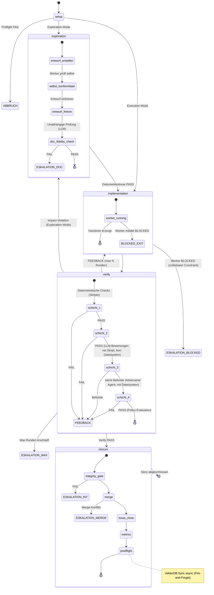
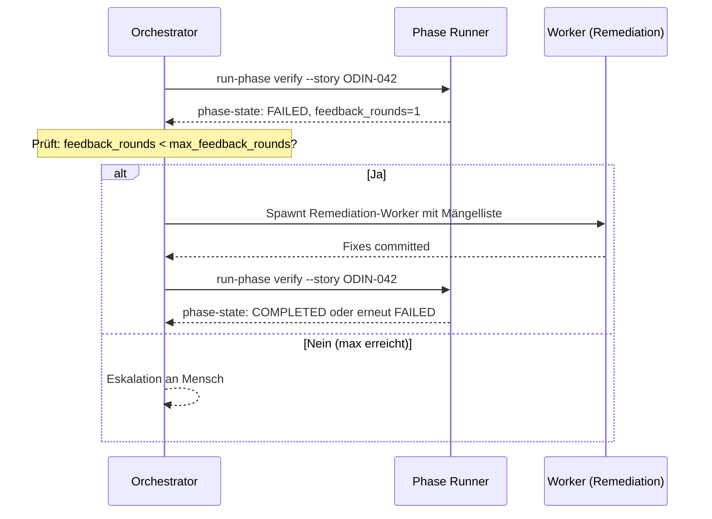

# 20 — Workflow-Engine und State Machine

## 20.1 Grundprinzip

Die Pipeline-Orchestrierung folgt einem zentralen Grundsatz des FK
(FK-05-002): **Kein Agent entscheidet über den Ablauf; der Ablauf
entscheidet, wann welcher Agent arbeiten darf.**

Technisch bedeutet das: Der Phase Runner ist ein deterministisches
Python-Skript, das den Story-Lifecycle als State Machine steuert.
Er wird vom Orchestrator-Agent über die CLI aufgerufen, aber der
Orchestrator hat keinen Einfluss auf die Phasenlogik selbst. Der
Phase Runner entscheidet über Phasenwechsel, Feedback-Loops und
Eskalation.

## 20.2 Phasenmodell

### 20.2.1 Fünf Phasen

| Phase | Typ | Zweck | Akteur |
|-------|-----|-------|--------|
| `setup` | Deterministisch | Preflight, Worktree, Context, Guards, Mode-Routing | Pipeline-Skript |
| `exploration` | Agent-gesteuert | Entwurfsartefakt erzeugen, Dokumententreue prüfen | Worker-Agent + LLM-Evaluator |
| `implementation` | Agent-gesteuert | Code/Konzept/Research umsetzen | Worker-Agent |
| `verify` | Deterministisch + LLM | 4-Schichten-QA | Pipeline-Skripte + LLM-Evaluator + Adversarial Agent |
| `closure` | Deterministisch | Integrity-Gate, Merge, Issue-Close, Metriken, Postflight | Pipeline-Skript |

### 20.2.2 State Machine



### 20.2.3 Abweichende Pfade nach Story-Typ

Die State Machine gilt in voller Ausprägung nur für
**implementierende Story-Typen** (Implementation, Bugfix).
Konzept- und Research-Stories nehmen Abkürzungen:


**Was Konzept- und Research-Stories NICHT durchlaufen:**
- Keine Modus-Ermittlung (Execution/Exploration)
- Kein Worktree/Branch (arbeiten direkt auf Main — AI-Augmented-Modus)
- Keine 4-Schichten-Verify-Pipeline
- Kein Integrity-Gate
- Kein Adversarial Testing

**Was Konzept-Stories zusätzlich durchlaufen:**
- VektorDB-Abgleich auf Überschneidungen mit bestehenden Konzepten
- Pflicht-Feedback-Loop mit 2 verschiedenen LLMs (Kap. 02.2.4)
- QA-Prüfung der Feedback-Einarbeitung

> **[Entscheidung 2026-04-08]** Element 13 — `_guard_failure` und `_loaded_from_file` werden als RuntimeMetadata uebernommen (nicht als Felder auf PhaseState). `_loaded_from_file` wird veredelt zu `origin` (NEW | LOADED). `_guard_failure` verhindert Persistierung von invalidem State.
> Element 13b — `_recovered_from_context` Flag entfaellt. Konzepte verbieten automatische State-Rekonstruktion. Fehlendes `phase-state.json` → nur `setup` erlaubt. Korrupt → PIPELINE_ERROR. Recovery nur als bewusste Mensch-Aktion (§20.7.2).
> Element 16 — PhaseState-Restructuring: Ownership-Trennung in StoryContext (langlebige Story-Semantik), PhaseStateCore (aktueller Laufzeitstatus), PhasePayload (diskriminierte Union pro Phase), RuntimeMetadata (nicht-fachliche Loader-/Guard-Infos). `mode`, `story_type` → raus aus PhaseState, rein in StoryContext. QA-Zyklus-Felder → VerifyState. Exploration-Gate-Felder → ExplorationState. Closure-Substates → ClosureState. Detailkonzept wird separat ausgearbeitet.
> Siehe `stories/entscheidung-v2-ballast-bewertung.md`, Elemente 13, 13b, 16.

## 20.3 Phase-State-Persistenz

### 20.3.1 Phase-State-Datei

Der aktuelle Zustand der Pipeline wird pro Story persistiert in
`_temp/qa/{story_id}/phase-state.json`:

> **[Hinweis 2026-04-08]** Dieses Beispiel zeigt noch die flache PhaseState-Struktur aus v2. In v3 wird PhaseState in StoryContext + PhaseStateCore + PhasePayload (diskriminierte Union) + RuntimeMetadata aufgeteilt. Detailkonzept ausstehend. Siehe `stories/entscheidung-v2-ballast-bewertung.md`, Element 16.

```json
{
  "schema_version": "3.0",
  "story_id": "ODIN-042",
  "run_id": "a1b2c3d4-e5f6-7890-abcd-ef1234567890",
  "phase": "verify",
  "status": "IN_PROGRESS",
  "mode": "exploration",
  "story_type": "implementation",
  "verify_context": "post_implementation",
  "attempt": 2,
  "feedback_rounds": 1,
  "max_feedback_rounds": 3,
  "started_at": "2026-03-17T10:00:00+01:00",
  "phase_entered_at": "2026-03-17T11:00:00+01:00",
  "agents_to_spawn": [
    {
      "type": "adversarial",
      "prompt_file": "prompts/adversarial-testing.md",
      "model": "opus"
    }
  ],
  "verify_layer": 2,
  "closure_substates": {
    "integrity_passed": false,
    "merge_done": false,
    "issue_closed": false,
    "metrics_written": false,
    "postflight_done": false
  },
  "errors": [],
  "warnings": [],
  "producer": { "type": "script", "name": "run-phase" }
}
```

### 20.3.2 Schlüsselfelder

> **[Hinweis 2026-04-08]** Diese Feldliste zeigt noch die flache PhaseState-Struktur aus v2. In v3 wird PhaseState in StoryContext + PhaseStateCore + PhasePayload (diskriminierte Union) + RuntimeMetadata aufgeteilt. Detailkonzept ausstehend. Siehe `stories/entscheidung-v2-ballast-bewertung.md`, Element 16.

| Feld | Typ | Beschreibung |
|------|-----|-------------|
| `phase` | Enum | Aktuelle Phase: setup, exploration, implementation, verify, closure |
| `status` | Enum | IN_PROGRESS, COMPLETED, FAILED, ESCALATED, PAUSED |
| `mode` | Enum | execution, exploration (nach Mode-Routing gesetzt) |
| `story_type` | Enum | implementation, bugfix, concept, research |
| `attempt` | Integer | Aktueller Durchlauf (beginnt bei 1) |
| `feedback_rounds` | Integer | Anzahl Verify→Implementation-Zyklen |
| `max_feedback_rounds` | Integer | Aus Config (Default: 3) |
| `verify_layer` | Integer | Aktuelle Schicht in der Verify-Phase (1-4) |
| `exploration_gate_status` | String | REF-034: Fortschritt durch das Drei-Stufen-Exit-Gate der Exploration-Phase. Nur in `phase=exploration` gesetzt. Werte: `""` / `"doc_compliance_passed"` / `"design_review_passed"` / `"design_review_failed"` / `"approved_for_implementation"` |
| `exploration_review_round` | Integer | REF-034: Zähler für Design-Review-Remediation-Runden (max 2). |
| `verify_context` | String | REF-036: Bestimmt die QA-Tiefe der Verify-Phase. Werte: `"post_exploration"` (nur Structural Checks, Schicht 1) oder `"post_implementation"` (volle 4-Schichten-QA). Wird vom Phase Runner vor dem Verify gesetzt, basierend auf der letzten abgeschlossenen Phase vor dem Verify-Eintritt. Siehe DK-02 §Verify-Kontext. |
| `escalation_reason` | String (optional) | REF-042: Grund der Eskalation bei `status: ESCALATED`. Werte: `"worker_blocked"` (Worker meldet unlösbaren Constraint via `worker-manifest.json`), `"max_rounds_exceeded"` (Feedback-Runden-Limit erreicht), `"preflight_fail"`, `"integrity_fail"`, `"merge_fail"`. Ermöglicht dem Orchestrator eine differenzierte Reaktion auf den Eskalationsgrund. |
| `closure_substates` | Object | Fortschritt innerhalb der Closure-Phase (Kap. 10) |
| `agents_to_spawn` | Array | Agents, die der Orchestrator als nächstes spawnen soll |

### 20.3.3 Lese-/Schreibprotokoll

| Wer liest | Wann | Zweck |
|-----------|------|-------|
| Orchestrator-Skill | Nach jeder Phase | Entscheidet welchen Agent als nächstes spawnen |
| Phase Runner | Bei Phasenanfang | Weiß wo er weitermachen muss |
| Integrity-Gate | Bei Closure | Prüft ob Verify durchlaufen wurde |

| Wer schreibt | Wann | Was |
|-------------|------|-----|
| Phase Runner | Bei jedem Phasenwechsel | Phase, Status, Timestamps |
| Phase Runner | Bei Verify-Schicht-Wechsel | verify_layer |
| Phase Runner | Bei Feedback-Loop | feedback_rounds++ |
| Phase Runner | Bei Closure-Substates | closure_substates aktualisiert |

**Nur der Phase Runner schreibt.** Der Orchestrator liest und
reagiert, manipuliert aber nie direkt den Phase-State.

## 20.4 Phase Runner: CLI-Schnittstelle

### 20.4.1 Aufrufkonvention

```bash
agentkit run-phase {phase} --story {story_id} [--config {path}]
```

Der Orchestrator-Skill ruft den Phase Runner für jede Phase
einzeln auf. Der Phase Runner führt die Phase aus, aktualisiert
den Phase-State und beendet sich. Der Orchestrator liest dann
den Phase-State und entscheidet, was als nächstes passiert.

### 20.4.2 Phasen-Dispatch

```python
def run_phase(phase: str, story_id: str, config: PipelineConfig) -> PhaseState:
    state = load_or_create_phase_state(story_id)

    match phase:
        case "setup":
            return _phase_setup(state, story_id, config)
        case "exploration":
            return _phase_exploration(state, story_id, config)
        case "implementation":
            return _phase_implementation(state, story_id, config)
        case "verify":
            return _phase_verify(state, story_id, config)
        case "closure":
            return _phase_closure(state, story_id, config)
        case _:
            raise ValueError(f"Unknown phase: {phase}")
```

**Hinweis:** Vor dem Dispatch greift die
Phase-Transition-Enforcement (§20.4.2a). `_phase_verify()`
wertet zusätzlich das Feld `verify_context` aus, um die
QA-Tiefe zu bestimmen: Bei `verify_context = "post_exploration"`
laufen nur die Structural Checks (Schicht 1), bei
`verify_context = "post_implementation"` die volle
4-Schichten-QA. `_phase_implementation()` erkennt
`status: BLOCKED` im `worker-manifest.json` und setzt den
Phase-Status auf ESCALATED mit
`escalation_reason: "worker_blocked"`. Siehe §20.3.2 für
die Felddefinitionen, DK-02 §Verify-Kontext für die
Entscheidungsregeln.

### 20.4.2a Phase-Transition-Enforcement

`run_phase()` prüft bei jedem Aufruf den Phasenübergang gegen
den bestehenden `PHASE_TRANSITION_GRAPH`, bevor die Phase-Funktion
dispatched wird. Die Validierung ist fail-closed: ein ungültiger
Übergang führt zu ESCALATED, die Phase wird nicht betreten.

**Ablauf der Transition-Validierung:**

1. `run_phase()` liest das `phase`-Feld aus der persistierten
   `phase-state.json` als `from_phase` und das `status`-Feld
   als `from_status`.
2. **Resume derselben Phase:** Wenn `from_phase == to_phase`
   (z.B. Exploration nach PAUSED — awaiting_design_review),
   ist das kein Phasenübergang. Der Transition-Graph wird
   nicht konsultiert, der Aufruf wird durchgelassen.
3. **Graphen-Enforcement:** Bei `from_phase != to_phase` wird
   `is_valid_phase_transition(from_phase, to_phase)` aufgerufen.
   Ist der Übergang nicht im Graphen → PIPELINE_ERROR, Status
   ESCALATED.
4. **Status-Prüfung der Vorphase:** Die Vorphase muss COMPLETED
   sein. Ausnahme: Der Remediation-Pfad von `verify` zurück zu
   `implementation` oder `exploration` ist auch bei PAUSED
   erlaubt. Von `verify` zu `closure` nur bei COMPLETED.
5. **Erstaufruf ohne State-Datei:** Existiert keine
   `phase-state.json`, darf ausschließlich `setup` aufgerufen
   werden. Jede andere Phase → PIPELINE_ERROR.

**Semantische Preconditions (zusätzlich zum Graphen):**

Der Graph allein reicht nicht aus. Modusabhängige Bedingungen
werden nach der Graphen-Validierung geprüft:

- `mode="exploration"` + `phase="implementation"`:
  `exploration_gate_status` muss `"approved_for_implementation"`
  sein. Ohne bestandenes Exploration-Gate wird die
  Implementation-Phase nicht betreten. Defense-in-Depth: Diese
  Prüfung ergänzt den bestehenden Guard in `_phase_verify()`,
  der als zweite Verteidigungslinie erhalten bleibt.
- `phase="closure"`: Verify muss mit Status COMPLETED
  abgeschlossen sein. Ohne abgeschlossene Verify-Phase darf
  Closure nicht starten.

**Diagnostische Fehlermeldungen:**

Jede Ablehnung enthält: `from_phase`, `to_phase`, `from_status`,
die erlaubten Übergänge und bei semantischen Preconditions den
aktuellen Wert des fehlenden Feldes. Der Orchestrator und der
menschliche Reviewer können aus der Meldung ablesen, was falsch
ist und welcher Schritt als nächstes korrekt wäre.

```python
# Pseudocode — Transition-Enforcement in run_phase()
def run_phase(phase: str, story_id: str, config: PipelineConfig) -> PhaseState:
    if phase not in _VALID_PHASES:
        raise ValueError(...)

    # --- Transition-Enforcement ---
    ps_path = qa_dir / "phase-state.json"

    if ps_path.exists():
        persisted = json.loads(ps_path.read_text(encoding="utf-8"))
        from_phase = persisted.get("phase", "")
        from_status = persisted.get("status", "")

        # Resume derselben Phase ist kein Übergang
        if from_phase != phase:
            if not is_valid_phase_transition(from_phase, phase):
                # PIPELINE_ERROR: ungültiger Übergang
                ...
            if from_status not in ("COMPLETED", "PAUSED"):
                # Vorphase nicht abgeschlossen
                ...

        # Semantische Preconditions
        if phase == "implementation" and persisted.get("mode") == "exploration":
            gate = persisted.get("exploration_gate_status", "")
            if gate != "approved_for_implementation":
                # PIPELINE_ERROR: Gate nicht bestanden
                ...
        if phase == "closure":
            # Verify muss COMPLETED sein
            ...
    else:
        # Keine State-Datei: nur setup erlaubt
        if phase != "setup":
            # PIPELINE_ERROR
            ...
    # --- Ende Transition-Enforcement ---

    state = load_or_create_phase_state(story_id)
    # Dispatch zur Phase-Funktion ...
```

**Nicht blockierte Pfade:**

- PAUSED→Resume derselben Phase (z.B. Exploration wird nach
  Design-Review-Completion erneut aufgerufen)
- Verify→Implementation (Remediation nach Verify-FAIL)
- Verify→Exploration (Design-Überarbeitung nach
  Impact-Violation im Exploration Mode)

Referenz: DK-02 §Phase-Transition-Enforcement, FK-23 §23.4
(Exploration-Gate-Semantik).

### 20.4.3 Phasen-Ergebnisse und Orchestrator-Reaktion

| Phase | Ergebnis im Phase-State | Orchestrator reagiert |
|-------|------------------------|----------------------|
| `setup` COMPLETED | `mode: execution` oder `exploration`, `agents_to_spawn: [worker]` | Spawnt Worker (oder Exploration-Worker bei Exploration Mode) |
| `setup` FAILED | `errors: [...]` | Eskalation an Mensch |
| `exploration` COMPLETED | `agents_to_spawn: [worker]` | Spawnt Implementation-Worker |
| `exploration` ESCALATED | `errors: [doc_fidelity_fail]` | Eskalation an Mensch |
| `implementation` COMPLETED | `agents_to_spawn: []` | Ruft `run-phase verify` auf |
| `implementation` ESCALATED | `escalation_reason: "worker_blocked"`, Blocker-Details aus `worker-manifest.json` | Eskalation an Mensch. Worker hat unlösbaren Constraint gemeldet (z.B. Hook-Barriere, fehlende Dependency). |
| `verify` COMPLETED | `status: COMPLETED` | Ruft `run-phase closure` auf |
| `verify` FAILED | `feedback_rounds++`, `agents_to_spawn: [remediation_worker]` | Spawnt Remediation-Worker, dann erneut `run-phase verify` |
| `verify` ESCALATED | `feedback_rounds >= max` | Eskalation an Mensch (max Runden erschöpft) |
| `closure` COMPLETED | `closure_substates: {alle true}` | Story ist Done |
| `closure` ESCALATED | `errors: [integrity_fail / merge_fail]` | Eskalation an Mensch |

## 20.5 Feedback-Loop

### 20.5.1 Mechanismus

Wenn die Verify-Phase scheitert, geht die Story zurück in die
Implementation-Phase. Der Worker erhält eine strukturierte
Mängelliste als Input.



### 20.5.2 Mängelliste

Die Mängelliste wird aus den Verify-Ergebnissen zusammengestellt
und dem Remediation-Worker als Kontext übergeben:

```json
{
  "story_id": "ODIN-042",
  "run_id": "a1b2...",
  "feedback_round": 1,
  "findings": [
    {
      "source": "structural",
      "check_id": "build.test_execution",
      "status": "FAIL",
      "detail": "3 Tests failed: test_broker_api, test_rate_limit, test_auth"
    },
    {
      "source": "llm_review",
      "check_id": "error_handling",
      "status": "FAIL",
      "reason": "Timeout-Fehler bei Broker-API wird still verschluckt",
      "description": "BrokerClient.send() fängt TimeoutException, loggt aber nicht und gibt null zurück."
    },
    {
      "source": "adversarial",
      "check_id": "edge_case_1",
      "status": "FAIL",
      "reason": "Race Condition bei parallelen Orders",
      "description": "Zwei gleichzeitige Orders für dasselbe Instrument erzeugen inkonsistenten State."
    }
  ]
}
```

### 20.5.3 Konfiguration

| Parameter | Default | Config-Pfad |
|-----------|---------|-------------|
| Max Feedback-Runden | 3 | `policy.max_feedback_rounds` |

Nach Erreichen des Limits: Pipeline stoppt, Story bleibt
"In Progress", Eskalation an Mensch.

## 20.6 Eskalation

> **[Entscheidung 2026-04-08]** Alle 11 Eskalations-Trigger werden beibehalten. FK-20 §20.6.1 und FK-35 §35.4.2 sind normativ. Kein Trigger ist redundant.
> Siehe `stories/entscheidung-v2-ballast-bewertung.md`, Element 17.

### 20.6.1 Eskalationspunkte

| Auslöser | Phase | Reaktion |
|----------|-------|---------|
| Preflight FAIL | setup | Story startet nicht. Mensch muss Voraussetzungen klären. |
| Dokumententreue Ebene 2 FAIL (Entwurfstreue) | exploration | Pipeline pausiert. Mensch muss Konflikt mit Architektur klären. |
| Dokumententreue Ebene 3 FAIL (Umsetzungstreue) | verify | Pipeline pausiert. Worker hat vom Konzept abgewichen, Mensch entscheidet. |
| Impact-Violation (Execution Mode) | verify | Pipeline stoppt. Issue-Metadaten waren falsch deklariert. Mensch muss korrigieren. |
| Impact-Violation (Exploration Mode) | verify | Story geht zurück in Exploration-Phase (Entwurf nicht eingehalten). |
| Worker BLOCKED (unlösbarer Constraint) | implementation | Pipeline stoppt. Worker hat über `worker-manifest.json` einen unlösbaren Constraint gemeldet (z.B. Hook-Barriere, fehlende Dependency). Phase-Status: ESCALATED mit `escalation_reason: "worker_blocked"`. Mensch löst den externen Constraint. |
| Max Feedback-Runden erschöpft | verify | Pipeline stoppt. Mensch muss entscheiden: Story anpassen, Anforderungen lockern, oder manuell fixen. |
| Integrity-Gate FAIL | closure | Pipeline stoppt. Mensch prüft Audit-Log (`integrity-violations.log`). |
| Merge-Konflikt | closure | Pipeline stoppt. Worker muss rebasen (neuer Feedback-Loop) oder Mensch löst Konflikt. |
| Governance-Beobachtung: kritischer Incident | jede | Pipeline pausiert sofort. Mensch muss intervenieren. |
| Governance-Beobachtung: harter Verstoß (Secrets, Governance-Manipulation) | jede | Sofortiger Stopp, kein LLM-Adjudication nötig. |

### 20.6.2 Eskalationsverhalten (einheitlich)

Bei jeder Eskalation gilt dasselbe Verhalten (FK-05-218 bis FK-05-222):

1. Story bleibt im GitHub-Status "In Progress"
2. Phase-State wird auf `status: ESCALATED` gesetzt
3. Orchestrator stoppt die Bearbeitung dieser Story
4. Orchestrator nimmt keine weiteren Aktionen für diese Story vor
5. Mensch muss aktiv intervenieren
6. Erst nach menschlicher Intervention kann die Story wieder
   in die Pipeline eingespeist werden

**PAUSED vs. ESCALATED:**

> **[Entscheidung 2026-04-08]** Element 20 — Yield/Resume-Funktionalitaet wird beibehalten. String-basierte `pause_reason` wird ersetzt durch `PauseReason` StrEnum + typisierte Resume-Handler. `resume_handler_for(reason: PauseReason) -> ResumeHandler` oder Workflow-Modell mit Yield-Definitionen + `resume_triggers`. Detailkonzept offen, zusammen mit Element 16 auszuarbeiten.
> Siehe `stories/entscheidung-v2-ballast-bewertung.md`, Element 20.

| Status | Auslöser | Bedeutung | Resume |
|--------|---------|-----------|--------|
| `PAUSED` | Governance-Beobachtung: kritischer Incident | Pipeline ist vorübergehend angehalten. Kann vom Menschen nach Prüfung wieder aufgenommen werden. | `agentkit resume --story {story_id}` |
| `ESCALATED` | Preflight FAIL, Worker BLOCKED, Integrity-Gate FAIL, Max Runden, Merge-Konflikt | Pipeline ist dauerhaft gestoppt für diese Iteration. Mensch muss Ursache klären und ggf. neuen Run starten. | `agentkit reset-escalation --story {story_id}` → neuer Run |

**Technisch:** Der Phase-State mit `status: ESCALATED` oder `PAUSED`
verhindert, dass der Orchestrator die nächste Phase aufruft.

> **[Entscheidung 2026-04-08]** Element 7 — CrashScenario / CRASH_SCENARIO_CATALOG entfaellt als eigene Runtime-Datenstruktur in v3. Die Recovery-Logik (§20.7) existiert separat und bleibt bestehen. Die Szenario-Informationen bleiben in den Konzeptdokumenten (hier §20.7.1).
> Siehe `stories/entscheidung-v2-ballast-bewertung.md`, Element 7.

## 20.7 Recovery

### 20.7.1 Szenarien

| Szenario | Phase-State | Recovery |
|----------|------------|---------|
| Agent-Session crashed mitten in Implementation | `phase: implementation, status: IN_PROGRESS` | Neuer Run mit neuer `run_id`. Worktree existiert noch, Commits sind da. Orchestrator spawnt neuen Worker, der die Arbeit fortsetzt. |
| Phase Runner crashed mitten in Verify | `phase: verify, verify_layer: 2` | `run-phase verify` erneut aufrufen. Schicht 1 hat bereits `structural.json` geschrieben (idempotent). Schicht 2 wird neu ausgeführt. |
| Closure crashed nach Merge aber vor Issue-Close | `closure_substates: {merge_done: true, issue_closed: false}` | `run-phase closure` erneut aufrufen. Merge wird übersprungen (bereits gemergt). Issue-Close wird ausgeführt. |
| Mensch will eskalierten Run fortsetzen | `status: ESCALATED` | Mensch setzt Phase-State zurück: `agentkit reset-escalation --story {story_id}`. Dann neuer Run. |

### 20.7.2 Run-ID und Retry

Jeder Pipeline-Durchlauf bekommt eine eigene `run_id` (UUID).
Bei Recovery (neuer Versuch nach Crash) wird eine neue `run_id`
erzeugt. Die alte `run_id` bleibt in der Telemetrie erhalten
für Forensik.

**Kein automatischer Retry.** Der Phase Runner versucht nicht
selbstständig, eine gescheiterte Phase zu wiederholen. Recovery
ist immer eine bewusste Entscheidung — entweder des Orchestrators
(bei Verify-Failure → Feedback-Loop) oder des Menschen (bei
Eskalation).

> **[Entscheidung 2026-04-08]** Element 8 — Scheduling Policies (3 Klassen) entfallen als Runtime-Datenstrukturen in v3. Die Scheduling-Informationen bleiben in der Konzeptdokumentation (hier §20.8). Reines Doku-Artefakt ohne Verhalten.
> Siehe `stories/entscheidung-v2-ballast-bewertung.md`, Element 8.

## 20.8 Scheduling und Priorisierung

### 20.8.1 Kein automatisches Scheduling

AgentKit hat keinen Scheduler. Der Orchestrator-Agent entscheidet,
welche Story als nächstes bearbeitet wird, indem er das GitHub
Project Board liest und eine freigegebene Story auswählt. Das ist
eine Agent-Entscheidung, die im Orchestrator-Prompt beschrieben
wird, kein deterministischer Mechanismus.

### 20.8.2 Parallelisierung

Mehrere Stories können parallel bearbeitet werden (Kap. 10.5.1):
- Jede Story hat eigenen Worktree, eigene Telemetrie, eigene Locks
- Der Orchestrator kann mehrere Worker-Agents parallel spawnen
- Der Phase Runner arbeitet pro Story sequentiell

**Pipeline-übergreifende Koordination via Scope-Overlap-Check.**
Wenn zwei Stories denselben Code-Bereich betreffen, erkennt der
Preflight-Scope-Overlap-Check (FK-22 §22.3.1, Check 9) dies
vor dem Start der zweiten Story. Die Story bleibt im Backlog
bis die parallele Story gemergt ist. Zusätzlich greift beim Merge
die FF-only-Prüfung als zweite Verteidigungslinie.

---

*FK-Referenzen: FK-05-001/002 (feste Phasenfolge, Ablauf entscheidet),
FK-05-007 bis FK-05-010 (Prozessschwere nach Story-Typ),
FK-05-037 bis FK-05-057 (Story-Bearbeitung, Typ-Routing),
FK-05-209 bis FK-05-214 (Policy-Evaluation, Feedback-Loop),
FK-05-215 bis FK-05-232 (Closure-Sequenz, Eskalation),
FK-06-040 bis FK-06-055 (Execution/Exploration Mode)*
