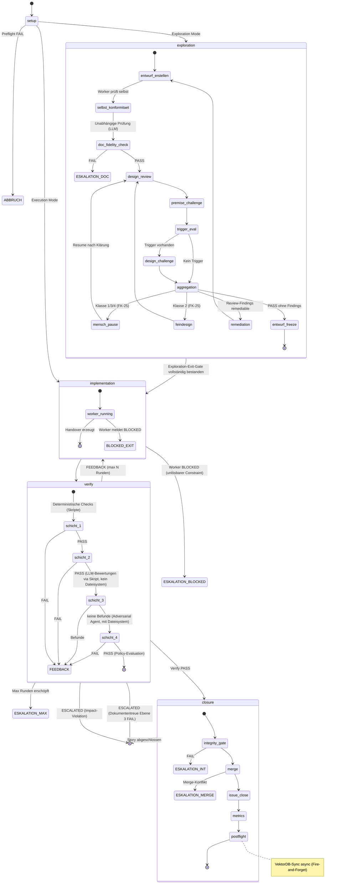

# 20 — Workflow-Engine und State Machine

<!-- PROSE-FORMAL: formal.story-workflow.state-machine, formal.story-workflow.commands, formal.story-workflow.events, formal.story-workflow.invariants, formal.story-workflow.scenarios, formal.story-reset.invariants -->

## 20.1 Grundprinzip

Die Pipeline-Orchestrierung folgt einem zentralen Grundsatz des FK
(FK-05-002): **Kein Agent entscheidet über den Ablauf; der Ablauf
entscheidet, wann welcher Agent arbeiten darf.**

Technisch bedeutet das: Der Phase Runner ist ein deterministisches
Python-Skript, das den Story-Lifecycle als State Machine steuert.
Er wird vom Orchestrator-Agent über die CLI aufgerufen, aber der
Orchestrator hat keinen Einfluss auf die Phasenlogik selbst. Der
Phase Runner entscheidet über Phasenwechsel, Feedback-Loops und
Eskalation.

### 20.1.1 Komponentenschnitt

Im fachlichen Komponentenmodell aus FK-01 ist die Workflow-Engine die
Top-Level-Komponente `PipelineEngine`. Der Phase Runner ist ihre
deterministische Laufzeitimplementierung.

| Ebene | Zugehoerigkeit | Verantwortung |
|-------|----------------|---------------|
| `PipelineEngine` | Top-Level-Komponente | State Machine, Transition-Guards, Feedback-/Review-Loops, Eskalation |
| `SetupPhase`, `ExplorationPhase`, `ImplementationPhase`, `VerifyPhase`, `ClosurePhase` | Subkomponenten der `PipelineEngine` | Innere Fachlogik je Phase |
| `PreflightChecker`, `ModeResolver` | Subkomponenten von `SetupPhase` | Vorbedingungen und Modusermittlung |
| `StructuralChecker`, `PolicyEngine` | Subkomponenten von `VerifyPhase` | Layer-1-Pruefung und finale Aggregation |
| `IntegrityGate` | Subkomponente von `ClosurePhase` | Vorbedingung fuer Merge/Abschluss |

**Abgrenzung:** Der vollstaendige Story-Reset ist **keine**
Subkomponente der `PipelineEngine`. Er ist eine separate
Top-Level-Komponente `StoryResetService`, weil er keinen normalen
Story-Run fortsetzt, sondern eine menschlich autorisierte
Recovery-Operation ausserhalb des Pipeline-Kontrollflusses ist.

Dasselbe gilt fuer `StorySplitService`: Auch ein Story-Split ist
keine normale Phasenfortsetzung, sondern eine administrative
Operation ausserhalb des Pipeline-Kontrollflusses. Er beendet bei
Scope-Explosion die ueberdehnte Ausgangs-Story kontrolliert und legt
deren Nachfolger an.

### 20.1.2 Einheitliche Prozess-DSL

AK3 verwendet fuer die Ablaufmodellierung **eine einzige hierarchische
Prozess-DSL**. Dieselben Sprachkonstrukte gelten fuer die komplette
Pipeline, fuer einzelne Phasen, fuer fachliche Komponenten und fuer
deren Subschritte. Es gibt **kein zweites Kontrollflussmodell** auf
Komponentenebene.

**Abgrenzung:** Die in FK-28 definierte Request-DSL bleibt eine
fachspezifische Nachforderungssprache fuer Reviewer. Sie ist **nicht**
Teil der hier beschriebenen Kontrollfluss-DSL.

| Ebene | DSL-Sicht | Typischer Owner | Zweck |
|-------|-----------|-----------------|-------|
| Pipeline | `FlowDefinition(level="pipeline")` | `PipelineEngine` | Gesamtablauf einer Story |
| Phase | `FlowDefinition(level="phase")` | `SetupPhase`, `VerifyPhase`, ... | Ablauf innerhalb einer Phase |
| Komponente | `FlowDefinition(level="component")` | `StageRegistry`, `Installer`, `GuardSystem`, ... | Innere Kontrolllogik einer Komponente |
| Subschritt | `NodeDefinition(kind="step")` oder `subflow` | jeweilige Komponente | Atomarer oder zusammengesetzter Ausfuehrungsschritt |

Die DSL modelliert **Kontrollfluss**, nicht Fachinhalt. Fachlogik,
I/O, Artefaktproduktion und Seiteneffekte bleiben in den
Schritt-Handlern der jeweiligen Komponente implementiert. Die DSL
beschreibt dagegen:

- Reihenfolge
- Fallunterscheidungen
- Wiederholungen und Rueckspruenge
- Gates und Yield-Points
- Once-only-/Until-success-Semantik
- manuelle oder orchestratorseitige Overrides

### 20.1.3 Kernkonstrukte der Prozess-DSL

| Konstrukt | Bedeutung | Typische Felder |
|-----------|-----------|-----------------|
| `FlowDefinition` | Vollstaendiger Ablaufvertrag einer Pipeline, Phase oder Komponente | `flow_id`, `level`, `owner`, `nodes`, `edges`, `hooks` |
| `NodeDefinition` | Knoten im Ablaufgraph | `node_id`, `kind`, `handler_ref`, `execution_policy`, `override_policy` |
| `EdgeRule` | Gerichtete Kante zwischen zwei Knoten | `source`, `target`, `when`, `priority`, `resume_policy` |
| `Guard` | Seiteneffektfreie Vorbedingung / Entscheidungsbedingung | `name`, `reads`, `predicate` |
| `Gate` | Mehrstufiger Pruefpunkt mit Aggregationsregel | `id`, `stages`, `final_aggregation`, `max_remediation_rounds` |
| `YieldPoint` | Typisierte Pause mit Resume-Triggern | `status`, `resume_triggers`, `required_artifacts` |
| `ExecutionPolicy` | Wiederholungs- und Skip-Semantik eines Knotens | `ALWAYS`, `ONCE_PER_RUN`, `ONCE_PER_STORY`, `UNTIL_SUCCESS`, `SKIP_AFTER_SUCCESS` |
| `RetryPolicy` | Begrenzung und Ziel von Wiederholungen | `max_attempts`, `backtrack_target`, `cooldown_policy` |
| `OverridePolicy` | Erlaubte manuelle Eingriffe | `allow_skip`, `allow_force_pass`, `allow_jump`, `allow_truncate` |

**Node-Klassen:** Die DSL verwendet auf allen Ebenen dieselben
Knotentypen:

| `kind` | Semantik |
|--------|----------|
| `step` | Atomarer Ausfuehrungsschritt mit konkretem Handler |
| `gate` | Qualitaets-/Freigabepunkt mit Stage-Aggregation |
| `yield` | Pause bis externer Trigger / Mensch / Orchestrator resumiert |
| `branch` | Fallunterscheidung; ausgehende Kanten werden ueber Guards gewaehlt |
| `subflow` | Eingebetteter Ablauf, der wieder dieselbe DSL benutzt |

**Normative Regel:** Komponenten modellieren ihre Subschritte als
`subflow` + `step`-Kombinationen. Imperative Einzelschritt-Logik in
beliebigen Python-Dateien ohne expliziten DSL-Vertrag ist fuer
nichttriviale Ablaufteile nicht zulaessig.

### 20.1.4 Fallunterscheidung, Wiederholung und Ruecksprung

Die DSL muss dieselben generischen Ablaufmuster auf allen Ebenen
abbilden koennen:

| Muster | Normative Modellierung |
|--------|------------------------|
| Fallunterscheidung | `branch`-Node oder mehrere `EdgeRule`s mit Guards; erste passende Kante gewinnt nach `priority` |
| Wiederholung | Explizite Rueckkante auf frueheren `node_id` + `RetryPolicy` |
| Gezielter Ruecksprung | Ruecksprung erfolgt immer auf **explizite** `node_id`s, nie auf implizite "minus 2 Schritte" ohne DSL-Kante |
| Remediation-Loop | Rueckkante + `max_attempts` + persistierter Zaehler im Laufzeitstate |
| Einmalige Schritte | `ExecutionPolicy = ONCE_PER_RUN` oder `ONCE_PER_STORY` |
| Nur bis Erfolg wiederholen | `ExecutionPolicy = UNTIL_SUCCESS` |
| Nach Erfolg ueberspringen | `ExecutionPolicy = SKIP_AFTER_SUCCESS` |

Damit gilt auch fuer Rueckspruenge aus spaeteren Phasen oder
Komponenten: Wenn der Ablauf erneut vorwaerts durchlaufen wird,
entscheidet **nicht** der Handler ad hoc, welche Schritte erneut
laufen, sondern die DSL zusammen mit dem persistierten
Execution-Ledger.

### 20.1.5 Overrides und manuelle Eingriffe

Overrides sind ein normierter Teil der Ablaufsteuerung und werden
nicht als ad-hoc-Sonderlogik in einzelnen Komponenten modelliert.

| Override | Semantik |
|----------|----------|
| `skip_node` | Knoten wird fuer diesen Run bewusst uebergangen |
| `force_gate_pass` / `force_gate_fail` | Gate-Entscheidung wird manuell gesetzt |
| `jump_to` | Ausfuehrung springt auf einen expliziten `node_id` |
| `truncate_flow` | Restlicher Teil eines Subflows wird bewusst abgeschnitten |
| `freeze_retries` | Weitere Rueckspruenge / Wiederholungen werden fuer diesen Ast unterbunden |

**Regeln:**

1. Overrides duerfen nur durch Mensch oder Orchestrator via CLI
   beantragt werden, nie durch Worker.
2. Jeder Override wird als auditierbarer Override-Record persistiert
   und von der Engine ausgewertet.
3. Ob ein Override zulaessig ist, entscheidet die `OverridePolicy`
   des betroffenen Knotens oder Flows.
4. Auch ein Override mutiert den Zustand nicht direkt; die Engine
   wendet ihn deterministisch bei der naechsten Auswertung an.

**Abgrenzung zum Story-Reset:** Ein vollstaendiger Story-Reset ist
kein Override. Er ersetzt keinen Knotenentscheid und springt nicht im
laufenden Flow, sondern beendet die korrupt gewordene Umsetzung
administrativ und schafft einen neuen sauberen Startzustand.

### 20.1.6 Evolution der bestehenden Workflow-DSL

Die bereits implementierte Workflow-DSL unter
`agentkit.process.language` ist die **erste Auspraegung** der
hierarchischen Prozess-DSL und wird nicht verworfen, sondern
verallgemeinert.

| Heutiger Begriff | Zielbegriff in der Einheits-DSL | Rolle |
|------------------|----------------------------------|-------|
| `WorkflowDefinition` | `FlowDefinition` | Ablaufvertrag auf beliebiger Ebene |
| `PhaseDefinition` | `NodeDefinition(kind="subflow")` oder phasenbezogene Spezialisierung | Zusammengesetzter Knoten |
| `TransitionRule` | `EdgeRule` | Kante im Ablaufgraph |
| `GuardFn` | `Guard` | Bedingung |
| `Gate` | `Gate` | unveraendert, aber nicht mehr nur phasenbezogen |
| `YieldPoint` | `YieldPoint` | unveraendert, aber auf allen Ebenen nutzbar |

**Konsequenz fuer AK3:** Die Pipeline bleibt phasenorientiert
modelliert. Komponenten fuehren jedoch **dieselbe** Sprache fuer ihre
eigenen Subschritte. Dadurch werden Kontrollfluss-Semantik, Override-
Verhalten und Wiederholungslogik systemweit vereinheitlicht.

### 20.1.7 Ausfuehrungsvertrag fuer Knoten

Die Einheits-DSL definiert den Kontrollfluss. Damit Komponenten
andockbar bleiben, ohne die Engine zu unterlaufen, gilt fuer alle
ausfuehrbaren Knoten ein gemeinsamer Handler-Vertrag.

| Vertragsteil | Bedeutung |
|--------------|-----------|
| `StepExecutionContext` | Immutable Laufzeitansicht auf `project_key`, `story_id`, `run_id`, `flow_id`, `node_id`, `StoryContext`, `PhaseState`, aktive Overrides und lesbare Artefakt-Handles |
| `StepHandler` | Deterministische oder agentische Implementierung eines `step`-Knotens; fuehrt Fachlogik aus, mutiert aber den globalen State nicht direkt |
| `StepResult` | Rueckgabe eines Knotens: `outcome`, `produced_artifacts`, `emitted_events`, `requested_yield`, `diagnostics` |
| `SubflowProvider` | Liefert fuer `subflow`-Knoten die untergeordnete `FlowDefinition` plus Handler-Registry |
| `GateRunner` | Fuehrt `gate`-Knoten aus und aggregiert Stage-Ergebnisse gemaess Gate-Vertrag |

**Normative Regeln:**

1. Schritt-Handler schreiben den globalen Ablaufstate nicht direkt.
   Sie liefern `StepResult`; die Engine wendet daraus den
   Zustandsuebergang an.
2. Rueckspruenge, Wiederholungen, Skips und Overrides duerfen nicht
   im Handler versteckt implementiert werden; sie muessen ueber die
   DSL-Kanten, Policies und Override-Records sichtbar sein.
3. Ein `subflow`-Knoten darf nur ueber einen `SubflowProvider` neue
   Knoten einbringen. Dynamisch zusammengebaute implizite Python-Loops
   ausserhalb der DSL sind nicht zulaessig.
4. Agentische Schritte sind erlaubt, aber nur als Handler eines
   expliziten `step`-Knotens. Auch sie sind an `ExecutionPolicy`,
   `RetryPolicy` und `OverridePolicy` gebunden.

**Folge fuer die Komponentenmodellierung:** Jede nichttriviale
Komponente liefert kuenftig mindestens:

- eine `FlowDefinition` fuer ihren internen Ablauf
- eine Handler-Registry fuer ihre `step`-Knoten
- einen klaren Satz lesbarer Inputs und produzierter Artefakte

Damit werden Komponenten zu expliziten, auditierbaren
Ausfuehrungseinheiten derselben Sprache, statt ihre innere
Kontrolllogik in frei formulierten Python-Dateien zu verstecken.

## 20.2 Phasenmodell

### 20.2.1 Fünf Phasen

| Phase | Typ | Zweck | Akteur |
|-------|-----|-------|--------|
| `setup` | Deterministisch | Preflight, Worktree, Context, Guards, Mode-Routing | Pipeline-Skript |
| `exploration` | Agent-gesteuert | Entwurfsartefakt erzeugen, Dokumententreue prüfen | Worker-Agent + LLM-Evaluator |
| `implementation` | Agent-gesteuert | Code/Konzept/Research umsetzen | Worker-Agent |
| `verify` | Deterministisch + LLM | 4-Schichten-QA | Pipeline-Skripte + LLM-Evaluator + Adversarial Agent |
| `closure` | Deterministisch | Integrity-Gate, Merge, Issue-Close, Metriken, Postflight | Pipeline-Skript |

### 20.2.1a StoryResetService

Der `StoryResetService` ist die administrative Recovery-Komponente fuer
Faelle, in denen ein eskalierter Story-Run nicht mehr ueber den
normalen Workflow repariert oder weitergefuehrt werden kann.

| Aspekt | Regel |
|--------|-------|
| Ausloeser | nur ausdruecklicher menschlicher CLI-Befehl |
| Erlaubender Vorzustand | typischerweise `ESCALATED`, nie automatischer Trigger |
| Initiator | Mensch; Orchestrator darf nur empfehlen oder dokumentieren |
| Wirkung | Purge von Runtime-State, Read Models, Analytics-Ableitungen, story-bezogenen Sperren und ephemeren Arbeitsartefakten |
| Ergebnis | Story verbleibt als fachliche Arbeitseinheit, aber die bisherige korrupt gewordene Umsetzung verschwindet vollstaendig |

**Normative Regel:** `PipelineEngine` darf niemals selbststaendig einen
vollstaendigen Story-Reset ausfuehren. Sie darf hoechstens in einen
eskalierten Zustand uebergehen und damit den Menschen zu einer
Entscheidung zwingen.

### 20.2.2 State Machine

> [Terminologie-Hinweis 2026-04-09] **ABBRUCH in Diagrammen = `status: ESCALATED` im State-Modell:** Die Mermaid-Diagramme verwenden `ABBRUCH` und `ABORT` als Beschriftung für den Preflight-FAIL-Terminalknoten. Im v3-Zustandsmodell entspricht dies `status: ESCALATED` mit `escalation_reason: "preflight_fail"`. Es gibt keinen separaten Status `ABBRUCH` — der Begriff ist ausschließlich eine Darstellungshilfe in den Diagrammen.

> [Korrektur 2026-04-09] **Kein Rücksprung verify → exploration:**
> Die ursprüngliche Transition `verify --> exploration : Impact-Violation
> (Exploration Mode)` wurde entfernt. Impact-Violation in Verify bedeutet
> Implementierungsversagen und führt zu `status: ESCALATED`. Es gibt
> keinen automatischen Rücksprung von Verify oder Implementation in die
> Exploration-Phase. Der Mensch entscheidet nach Eskalation über nächste
> Schritte (ggf. neue Exploration mit neuem Mandat als neuer Pipeline-Lauf).
> Exploration-interne Remediation (max 3 Runden) bleibt davon unberührt.

> [Korrektur 2026-04-09] **Exploration-Exit-Gate:** Die Transition
> `exploration --> implementation` erfordert den vollständigen Ablauf
> gemäß FK-23 und FK-25: Dokumententreue, Design-Review,
> Prämissen-Challenge, optionale Design-Challenge, H1-Aggregation,
> H2-Nachklassifikation und ggf. Feindesign-Subprozess. Erst wenn
> der Draft alle Prüfungen bestanden hat, eingefroren wurde und
> `payload.gate_status: APPROVED` erreicht ist, darf die
> Implementation-Phase betreten werden.

### 20.2.3 Abweichende Pfade nach Story-Typ

Die State Machine gilt in voller Ausprägung nur für
**implementierende Story-Typen** (Implementation, Bugfix).
Konzept- und Research-Stories nehmen Abkürzungen:

**Was Konzept- und Research-Stories NICHT durchlaufen:**
- Keine Modus-Ermittlung (Execution/Exploration)
- Kein Worktree/Branch (arbeiten direkt auf Main — AI-Augmented-Modus)
- Keine 4-Schichten-Verify-Pipeline
- Kein Integrity-Gate
- Kein Adversarial Testing

**Was Konzept-Stories zusätzlich durchlaufen:**
- VektorDB-Abgleich auf Überschneidungen mit bestehenden Konzepten
- Pflicht-Feedback-Loop mit 2 verschiedenen LLMs (FK-02 §02.2.4)
- QA-Prüfung der Feedback-Einarbeitung

> **[Entscheidung 2026-04-08]** Element 16 — PhaseState-Restructuring: Ownership-Trennung in StoryContext (langlebige Story-Semantik), PhaseStateCore (aktueller Laufzeitstatus), PhasePayload (diskriminierte Union pro Phase), RuntimeMetadata (nicht-fachliche Loader-/Guard-Infos). `mode`, `story_type` → raus aus PhaseState, rein in StoryContext. QA-Zyklus-Felder → VerifyState. Exploration-Gate-Felder → ExplorationState. Closure-Substates → ClosureState. Detailkonzept ist in FK-39 ausgearbeitet.
> Siehe `stories/entscheidung-v2-ballast-bewertung.md`, Element 16.

> **[Ergänzung 2026-04-09]** Das Detailkonzept zu Element 16 liegt vollständig vor (Designwizard R1+R2 vom 2026-04-09). Die ausgearbeiteten Entscheidungen sind in **FK-39 (Phase-State-Persistenz)** eingetragen: PhaseEnvelope + RuntimeMetadata (FK-39 §39.3), AttemptRecord-Typisierung (FK-39 §39.4), PhaseMemory mit Carry-Forward (FK-39 §39.5), PauseReason StrEnum (FK-39 §39.2.2), PhasePayload Discriminated Union mit ExplorationPayload, VerifyPayload, ClosurePayload (FK-37 §37.1, FK-23 §23.5, FK-29 §29.1.0).

## 20.3 Phase-State-Persistenz

> Phase-State-Modell, PhaseEnvelope, PhasePayload (discriminated union),
> PhaseMemory (carry-forward), AttemptRecord, PauseReason und das
> Lese-/Schreibprotokoll sind in **FK-39 (Phase-State-Persistenz und
> Phase-Envelope-Modell)** normiert.

## 20.4 Phase Runner: CLI-Schnittstelle

> CLI-Aufrufkonvention (`agentkit run-phase ...`), Phasen-Dispatch,
> Phase-Transition-Enforcement (Graphen- und Status-Validierung,
> semantische Preconditions, Remediation-Pfad mit Guard-Check vor
> Inkrement) und die Tabelle "Phasen-Ergebnisse und Orchestrator-Reaktion"
> sind in **FK-45 (Phase Runner CLI und Phase-Transition-Enforcement)**
> normiert.

## 20.5 Feedback-Loop

### 20.5.1 Mechanismus

Wenn die Verify-Phase scheitert, transitiert die Engine zurück
in die Implementation-Phase (echter Phase-Wechsel
`verify (FAILED) → implementation (IN_PROGRESS)`). Der
Remediation-Worker läuft innerhalb der Implementation-Phase
und erhält eine strukturierte Mängelliste als Input.

> [Korrektur 2026-04-09] **Sequenzdiagramm korrigiert:** Die
> ursprüngliche Version zeigte den Remediation-Pfad ohne
> Phase-Wechsel: Orchestrator spawnte Remediation-Worker direkt
> und rief danach `run-phase verify` auf, ohne dazwischen
> `run-phase implementation` auszuführen. Das korrekte Modell
> (konsistent mit der State Machine §20.2.2 und der
> Transition-Enforcement FK-45 §45.2) ist:
> 1. Verify gibt FAILED zurück (mit aktuellem, nicht-inkrementiertem
>    `memory.verify.feedback_rounds`-Wert)
> 2. Engine prüft Guard: `memory.verify.feedback_rounds <
>    policy.max_feedback_rounds` (Pre-Check VOR Inkrement)
>    [Entscheidung 2026-04-09]
> 3. Guard bestanden → Engine inkrementiert
>    `memory.verify.feedback_rounds` (NACH Guard-Check,
>    carry-forward über Phase-Transitionen) und persistiert
>    via `save_phase_state()` VOR der Transition
>    [Korrektur 2026-04-09]
> 4. Orchestrator ruft `run-phase implementation` auf — echter
>    Phase-Wechsel `verify (FAILED) → implementation (IN_PROGRESS)`
> 5. Implementation-Phase läuft mit Remediation-Worker
>    (Remediation-Prompt, nicht Original-Worker-Prompt)
> 6. Implementation abgeschlossen → Orchestrator ruft
>    `run-phase verify` auf (normaler Vorwärts-Übergang
>    `implementation → verify`)
> 7. Verify läuft erneut
>
> `VerifyPhaseMemory.feedback_rounds` überlebt die Phase-Wechsel
> via carry-forward in PhaseMemory — das ist der Zweck der
> PhaseMemory-Schicht (FK-39 §39.5).

> [Korrektur 2026-04-09] **Ownership-Klarstellung Guard-Check
> und Inkrement:** Guard-Prüfung (`feedback_rounds < max`),
> Inkrement (`feedback_rounds++`) und Persistierung
> (`save_phase_state()`) sind ausschließlich Aufgaben des
> **Phase Runner (Engine)**, nicht des Orchestrators. Der
> Orchestrator liest den Phase-State und reagiert darauf (z.B.
> ruft `run-phase implementation` auf), aber er mutiert den
> State nie direkt. Dieses Prinzip ist in FK-39 §39.6 normativ
> festgelegt ("Nur der Phase Runner schreibt") und folgt aus
> dem Determinismus-Grundsatz (§20.1): Ablaufsteuerung,
> Guard-Logik und State-Mutationen laufen deterministisch im
> Phase Runner — der Orchestrator ist Konsument, nicht Produzent
> des Phase-State.

### 20.5.2 Mängelliste

Format und Felder der Mängelliste (`feedback.json`) sind in
**FK-38 §38.1.2** normiert. Der Remediation-Worker (FK-26 §26.2.3)
erhält diese Datei als Input.

### 20.5.3 Konfiguration

| Parameter | Default | Config-Pfad |
|-----------|---------|-------------|
| Max Feedback-Runden | 3 | `policy.max_feedback_rounds` |

Nach Erreichen des Limits: Pipeline stoppt, Story bleibt
"In Progress", Eskalation an Mensch.

## 20.6 Eskalation

> **[Entscheidung 2026-04-08, aktualisiert 2026-04-09]** Die ursprünglich 11 Eskalations-Trigger wurden auf 12 Einträge erweitert (Ergänzung: Design-Review-Gate FAIL, Impact-Violation Exploration Mode, Governance-Incident als PAUSED-Trigger). FK-20 §20.6.1 und FK-35 §35.4.2 sind normativ. Kein Trigger ist redundant.
> Siehe `stories/entscheidung-v2-ballast-bewertung.md`, Element 17.

### 20.6.1 Eskalations- und Pause-Punkte

Die folgende Tabelle listet alle Auslöser, die die Pipeline stoppen. Spalte „Status" zeigt, ob der Zustand `ESCALATED` (dauerhafter Stopp, erfordert manuellen Reset) oder `PAUSED` (temporär, Resume nach Klärung) ist.

| Auslöser | Phase | Status | Reaktion |
|----------|-------|--------|---------|
| Preflight FAIL | setup | ESCALATED (`escalation_reason: "preflight_fail"`) | Story startet nicht. Kein automatischer Remediation-Pfad. Mensch muss Voraussetzungen klären. |
| Dokumententreue Ebene 2 FAIL (Entwurfstreue) | exploration | ESCALATED (`escalation_reason: "doc_fidelity_fail"`) | Pipeline wird eskaliert. Mensch muss Konflikt mit Architektur klären. [Korrektur 2026-04-09: War fälschlich als PAUSED dokumentiert.] |
| Design-Review-Gate FAIL non-remediable oder Rundenlimit überschritten | exploration | ESCALATED (`escalation_reason: "design_review_rejected"`) | `gate_status: REJECTED` → Pipeline eskaliert. Mensch muss Entwurf klären oder Story neu aufsetzen. [Entscheidung 2026-04-09: Terminalpfad gemäß FK-23 §23.5 Stufe 2c.] |
| Dokumententreue Ebene 3 FAIL (Umsetzungstreue) | verify | ESCALATED (`escalation_reason: "doc_fidelity_fail"`) | Pipeline wird eskaliert. Worker hat vom Konzept abgewichen, Mensch entscheidet. [Korrektur 2026-04-09: War fälschlich als PAUSED dokumentiert.] |
| Impact-Violation (Execution Mode) | verify | ESCALATED (`escalation_reason: "impact_violation"`) | Issue-Metadaten waren falsch deklariert. Mensch entscheidet über nächste Schritte. |
| Impact-Violation (Exploration Mode) | verify | ESCALATED (`escalation_reason: "impact_violation"`) | Kein automatischer Rücksprung in Exploration. Mensch entscheidet (ggf. neue Exploration mit neuem Mandat). [Korrektur 2026-04-09: War fälschlich als Rücksprung dokumentiert.] |
| Worker BLOCKED (unlösbarer Constraint) | implementation | ESCALATED (`escalation_reason: "worker_blocked"`) | Worker hat über `worker-manifest.json` unlösbaren Constraint gemeldet (z.B. Hook-Barriere, fehlende Dependency). Mensch löst externen Constraint. |
| Max Feedback-Runden erschöpft | verify | ESCALATED (`escalation_reason: "max_rounds_exceeded"`) | Pipeline stoppt. Mensch muss entscheiden: Story anpassen, Anforderungen lockern, oder manuell fixen. |
| Integrity-Gate FAIL | closure | ESCALATED (`escalation_reason: "integrity_fail"`) | Pipeline stoppt. Mensch prüft Audit-Log (`integrity-violations.log`). |
| Merge-Konflikt | closure | ESCALATED (`escalation_reason: "merge_fail"`) | Pipeline stoppt. Worker muss rebasen oder Mensch löst Konflikt. |
| Scope-Explosion (Klasse 3) | exploration | PAUSED (`pause_reason` durch H2-Routing) | Mensch prueft Split-Befund. Standardpfad: `agentkit split-story` statt Weiterarbeit im selben Story-Vertrag. |
| Governance-Beobachtung: kritischer Incident | jede | **PAUSED** (`pause_reason: GOVERNANCE_INCIDENT`) | Pipeline pausiert sofort — kein ESCALATED. Mensch muss intervenieren, dann Resume via `agentkit resume`. Siehe FK-39 §39.2.2. |
| Governance-Beobachtung: harter Verstoß (Secrets, Governance-Manipulation) | jede | ESCALATED (`escalation_reason: "governance_violation"`) | Sofortiger dauerhafter Stopp, kein LLM-Adjudication nötig. |

### 20.6.2 Eskalationsverhalten (einheitlich)

Bei jeder **ESCALATED**-Eskalation (nicht PAUSED — `GOVERNANCE_INCIDENT` führt zu PAUSED, siehe FK-39 §39.2.2) gilt dasselbe Verhalten (FK-05-218 bis FK-05-222):

1. Story bleibt im GitHub-Status "In Progress"
2. Phase-State wird auf `status: ESCALATED` gesetzt
3. Orchestrator stoppt die Bearbeitung dieser Story
4. Orchestrator nimmt keine weiteren Aktionen für diese Story vor
5. Mensch muss aktiv intervenieren
6. Erst nach menschlicher Intervention kann die Story wieder
   in die Pipeline eingespeist werden

**PAUSED vs. ESCALATED:** Pause-Zustände (`PAUSED` mit einem
PauseReason) sind vorübergehend — Resume nach Klärung via
`agentkit resume`. ESCALATED ist dauerhafter Stopp der aktuellen
Iteration — Ursache muss behoben werden, bevor ein neuer Run
gestartet wird. Definition der drei PauseReason-Werte und
der Resume-Trigger in **FK-39 §39.2.2**.

| Status | PauseReason / Auslöser | Phase | Bedeutung | Resume |
|--------|----------------------|-------|-----------|--------|
| `PAUSED` | `AWAITING_DESIGN_REVIEW` | exploration | Entwurfsartefakt wartet auf Design-Review. Pipeline pausiert, bis Review-Ergebnis vorliegt. | `agentkit resume --story {id}` (nach Review-Abschluss) |
| `PAUSED` | `AWAITING_DESIGN_CHALLENGE` | exploration | Design-Review hat Einwände erhoben. Pipeline pausiert, bis Challenge-Prozess abgeschlossen. | `agentkit resume --story {id}` (nach Challenge-Klärung) |
| `PAUSED` | `GOVERNANCE_INCIDENT` | jede | Governance-Observer hat kritischen Incident erkannt. Pipeline pausiert sofort, Mensch muss intervenieren. | `agentkit resume --story {id}` (nach Incident-Klärung) |
| `ESCALATED` | Preflight FAIL, Worker BLOCKED, Integrity-Gate FAIL, Max Runden, Merge-Konflikt, Gate-FAIL nach max Runden | setup, impl., verify, closure | Pipeline ist dauerhaft gestoppt für diese Iteration. Mensch muss Ursache klären und ggf. neuen Run starten. | `agentkit reset-escalation --story {id}` → neuer Run |

**Technisch:** Der Phase-State mit `status: ESCALATED` oder `PAUSED`
verhindert, dass der Orchestrator die nächste Phase aufruft.

> **[Entscheidung 2026-04-08]** Element 7 — CrashScenario / CRASH_SCENARIO_CATALOG entfaellt als eigene Runtime-Datenstruktur in v3. Die Recovery-Logik (§20.7) existiert separat und bleibt bestehen. Die Szenario-Informationen bleiben in den Konzeptdokumenten (hier §20.7.1).
> Siehe `stories/entscheidung-v2-ballast-bewertung.md`, Element 7.

## 20.7 Recovery

### 20.7.1 Szenarien

| Szenario | Phase-State | Recovery |
|----------|------------|---------|
| Agent-Session crashed mitten in Implementation | `phase: implementation, status: IN_PROGRESS` | Neuer Run mit neuer `run_id`. Worktree existiert noch, Commits sind da. Orchestrator spawnt neuen Worker, der die Arbeit fortsetzt. |
| Phase Runner crashed mitten in Verify | `phase: verify, status: IN_PROGRESS` | `run-phase verify` erneut aufrufen. Schicht 1 hat bereits `structural.json` geschrieben (idempotent). Fortschritt wird aus vorhandenen Artefakten rekonstruiert. [Entscheidung 2026-04-09: `verify_layer` entfernt — ephemerer Fortschritt, nicht durable.] |
| Closure crashed nach Merge aber vor Issue-Close | `payload.progress: {merge_done: true, issue_closed: false}` | `run-phase closure` erneut aufrufen. Merge wird übersprungen (bereits gemergt). Issue-Close wird ausgeführt. [Entscheidung 2026-04-09: `closure_substates` → `payload.progress` (ClosurePayload).] |
| Mensch will eskalierten Run fortsetzen | `status: ESCALATED` | Mensch setzt Phase-State zurück: `agentkit reset-escalation --story {story_id}`. Dann neuer Run. |

### 20.7.2 Run-ID und Retry

Jeder Pipeline-Durchlauf bekommt eine eigene `run_id` (UUID).
Bei Recovery (neuer Versuch nach Crash) wird eine neue `run_id`
erzeugt. Die alte `run_id` bleibt in der Telemetrie erhalten
für Forensik.

**Kein automatischer Retry.** Der Phase Runner versucht nicht
selbstständig, eine gescheiterte Phase zu wiederholen. Recovery
ist immer eine bewusste Entscheidung — entweder des Orchestrators
(bei Verify-Failure → Feedback-Loop) oder des Menschen (bei
Eskalation).

> **[Entscheidung 2026-04-08]** Element 8 — Scheduling Policies (3 Klassen) entfallen als Runtime-Datenstrukturen in v3. Die Scheduling-Informationen bleiben in der Konzeptdokumentation (hier §20.8). Reines Doku-Artefakt ohne Verhalten.
> Siehe `stories/entscheidung-v2-ballast-bewertung.md`, Element 8.

## 20.8 Scheduling und Priorisierung

### 20.8.1 Kein automatisches Scheduling

AgentKit hat keinen Scheduler. Der Orchestrator-Agent entscheidet,
welche Story als nächstes bearbeitet wird, indem er das GitHub
Project Board liest und eine freigegebene Story auswählt. Das ist
eine Agent-Entscheidung, die im Orchestrator-Prompt beschrieben
wird, kein deterministischer Mechanismus.

### 20.8.2 Parallelisierung

Mehrere Stories können parallel bearbeitet werden (FK-10 §10.5.1):
- Jede Implementation/Bugfix-Story hat eigenen Worktree, eigene Telemetrie, eigene Locks. Concept/Research-Stories arbeiten direkt auf main (kein Worktree/Branch, §20.2.3).
- Der Orchestrator kann mehrere Worker-Agents parallel spawnen
- Der Phase Runner arbeitet pro Story sequentiell

**Pipeline-übergreifende Koordination via Scope-Overlap-Check.**
Wenn zwei Stories denselben Code-Bereich betreffen, erkennt der
Preflight-Scope-Overlap-Check (FK-22 §22.3.1, Check 9) dies
vor dem Start der zweiten Story. Die Story bleibt im Backlog
bis die parallele Story gemergt ist. Zusätzlich greift beim Merge
die FF-only-Prüfung als zweite Verteidigungslinie.

---

*FK-Referenzen: FK-05-001/002 (feste Phasenfolge, Ablauf entscheidet),
FK-05-007 bis FK-05-010 (Prozessschwere nach Story-Typ),
FK-05-037 bis FK-05-057 (Story-Bearbeitung, Typ-Routing),
FK-05-209 bis FK-05-214 (Policy-Evaluation, Feedback-Loop),
FK-05-215 bis FK-05-232 (Closure-Sequenz, Eskalation),
FK-06-040 bis FK-06-055 (Execution/Exploration Mode)*

**Querverweise:**
- FK-39 — Phase-State-Persistenz: PhaseEnvelope, PhasePayload (discriminated union), PhaseMemory (carry-forward), AttemptRecord, PauseReason-Enum, Lese-/Schreibprotokoll
- FK-45 — Phase Runner CLI: `agentkit run-phase`, Phasen-Dispatch, Phase-Transition-Enforcement, Orchestrator-Reaktionstabelle
- FK-38 — Verify-Feedback und Dokumententreue-Schleife: Mängelliste-Format, Mandatory-Target-Rückkopplung, Ebene 3 und 4
- FK-35 — Integrity-Gate, Governance-Beobachtung und Eskalation
- FK-23 — Modusermittlung und Exploration: ExplorationPayload, gate_status, Design-Review-Gate
- FK-37 — Verify-Context: VerifyPayload, verify_context, integration_stabilization-Vertragsprofil
- FK-29 — Closure-Sequence: ClosurePayload, ClosureProgress, Substate-Recovery
- FK-53 — StoryResetService: Vollständiger Story-Reset-Pfad
- FK-54 — StorySplitService: Scope-Explosion und Successor-Stories
