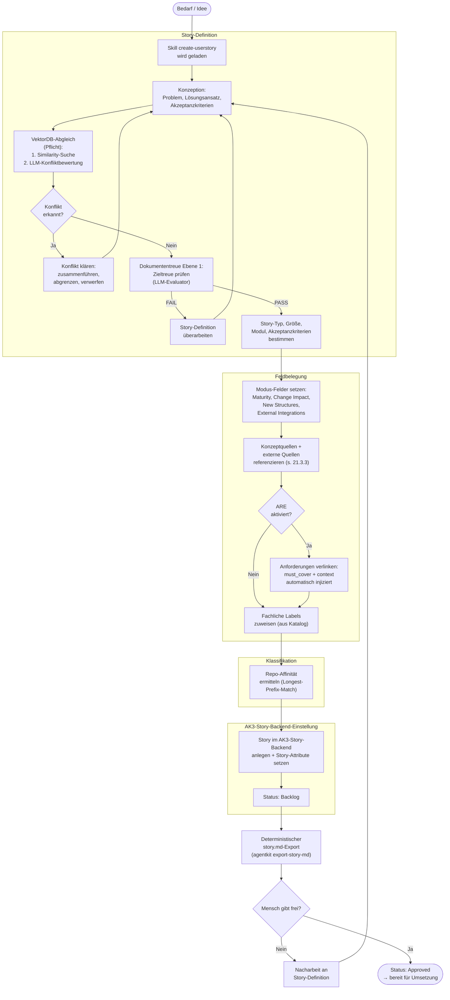

# 21 — Story-Creation-Pipeline

<!-- PROSE-FORMAL: formal.story-creation.entities, formal.story-creation.state-machine, formal.story-creation.commands, formal.story-creation.events, formal.story-creation.invariants, formal.story-creation.scenarios -->

## 21.1 Zweck und Abgrenzung

Die Story-Erstellung ist der erste deterministische Ablauf im
Story-Lifecycle (FK 5.1). Sie stellt sicher, dass Stories nicht
ad hoc erzeugt werden, sondern strukturiert, gegen den
Wissensbestand geprüft und vom Menschen freigegeben.

**Abgrenzung zur Story-Bearbeitung:** Die Story-Erstellung endet
mit dem Status "Approved" im AK3-Story-Backend. Ab da übernimmt
die Bearbeitungs-Pipeline (Kap. 20, 22-25). Die Erstellung ist
ein eigenständiger Ablauf, der unabhängig von der Bearbeitung
funktioniert.

**Abgrenzung zum Story-Split:** Wenn eine laufende Story wegen
`Scope-Explosion` neu geschnitten wird, erzeugt `StorySplitService`
die Nachfolger-Stories zwar ueber denselben fachlichen Vertrag wie
dieses Kapitel, aber als administrative Systemoperation statt als
freies Agentenhandeln.

**Abgrenzung zur Planungsdomäne:** Story-Erstellung beantwortet nicht,
welche Story als naechstes ausgefuehrt werden soll. Sie liefert aber
die fruehen Planungsmetadaten fuer FK-70, damit spaeter
Abhaengigkeiten, Gates, Readiness und Scheduling belastbar berechnet
werden koennen.

**Technische Umsetzung:** Die Story-Erstellung ist primär
skill-gesteuert (`create-userstory`), nicht pipeline-gesteuert.
Der Skill führt den Agent durch die Schritte. Deterministische
Prüfungen (VektorDB-Abgleich, Zieltreue) werden über Python-
Skripte und den LLM-Evaluator (Kap. 11) eingebettet.

## 21.2 Ablauf

### 21.2.1 Gültige Auslöser

Jeder rohe Geschäftsbedarf oder jede Idee ist ein gültiger
Auslöser für die Story-Erstellung — nicht nur strukturierte
Anforderungen oder formalisierte Eingaben (FK-21-037). Ein
informeller Satz wie "Wir brauchen eine bessere Fehlerbehandlung
beim Broker-Adapter" ist ausreichend; der Erstellungsprozess
strukturiert diesen Bedarf in das Story-Format. Der Skill
`create-userstory` führt den Agent durch Konzeption, Prüfung und
Feldbelegung, unabhängig davon, wie ausgearbeitet der ursprüngliche
Auslöser war.



## 21.3 Konzeption

### 21.3.1 Story-Bestandteile

Der Skill leitet den Agent an, folgende Bestandteile zu erarbeiten:

| Bestandteil | Pflicht | Beschreibung |
|-------------|---------|-------------|
| Problemstellung | Ja | Was ist das Problem? Warum muss es gelöst werden? |
| Lösungsansatz | Ja | Wie soll das Problem gelöst werden? (Grob, nicht Implementierungsdetail) |
| Akzeptanzkriterien | Ja | Wann gilt die Story als erledigt? Prüfbare Aussagen. |
| Betroffene Module | Ja | Welche Teile des Systems sind betroffen? |
| Abhängigkeiten | Nein | Welche anderen Stories müssen vorher abgeschlossen sein? (Story-IDs, ueber AK3-Story-Service-Dependencies abgebildet) |
| Planungsmetadaten | Ja, soweit bereits bekannt | Repos, externe Voraussetzungen, menschliche Gates, Sammel- oder Endgate-Rolle, Parallelisierungs- und Konflikthinweise fuer FK-70 |
| Konzeptquellen | Story-Typ-abhängig (s. 21.3.3) | Pfade zu Konzeptdokumenten im `concept/`-Verzeichnis des Zielprojekts |
| Externe autoritäre Quellen | Nein | Referenzen auf externe Systeme (URLs, Jira-Artikel, OpenAPI-Specs etc.) |
| Guardrail-Referenzen | Nein | Pfade zu relevanten Guardrail-Dokumenten |

**Normative Regel:** Story-Erstellung darf Planungsmetadaten spaeter
verfeinern, aber nicht ignorieren. Wenn Abhaengigkeiten, Human-Gates
oder externe Voraussetzungen bei Erstellung bereits bekannt sind,
muessen sie in die Planungsdomäne von FK-70 eingespeist werden statt
nur in Freitextfeldern zu verbleiben.

### 21.3.2 Konzept-Stories als Vorstufe

Bei komplexen Vorhaben geht der eigentlichen Implementation-Story eine
Konzept-Story voraus (FK-05-014). Das Ergebnis der Konzept-Story
wird als Konzeptquelle in der Implementation-Story referenziert
(s. 21.3.3). Die Verfügbarkeit und Reife der Konzepte beeinflusst die
Modus-Ermittlung: Eine Implementation-Story mit gültigen
Konzeptquellen und ausreichender Konzeptreife geht in den Execution
Mode (Kap. 22.8, 23). Fehlen Konzepte oder sind sie für den konkreten
Scope zu grob, setzt der Story-Ersteller `Requires Exploration = true`
(s. 21.3.3, 21.6.2). Für Bugfix-Stories sind Konzeptquellen nicht
execution-sperrend — ein rein technischer Bug ohne Konzeptbezug geht
direkt in Execution (Kap. 22.8.1, Kriterium #2).

### 21.3.3 Quellen-Typen und Referenzierung

Der Story-Ersteller kann drei Typen autoritärer Quellen referenzieren:

| Quellen-Typ | Ort | Beispiele | AgentKit-Verantwortung |
|-------------|-----|-----------|------------------------|
| **Konzeptquellen** | `concept/`-Verzeichnis des Zielprojekts | Fachkonzept.md, Feinkonzept.md, Muster-Layout.html, Design-System-Assets | Deterministisch auflösen und dem Reviewer als Teil des Bundles liefern |
| **Externe autoritäre Quellen** | URL, externes System | Jira-Anforderungen, OpenAPI-Spec-URL, Schnittstellen-Dokumentation externer Komponenten | Referenz an Reviewer weiterreichen; Zugriff muss zur Laufzeit durch den Reviewer erfolgen |
| **Explorations-Konzept** | Story-Artefakt (aus vorgelagerter Exploration) | Technisches Feinkonzept für den konkreten Implementierungsscope | Entsteht erst zur Laufzeit; qualitätsgesichert, aber subordiniert zu Primärkonzepten (s. FK 24.5.3) |

**Konzeptquellen** sind Dateien im `concept/`-Verzeichnis des
Zielprojekts. Der `concept/`-Ordner ist nicht auf Markdown
beschränkt — HTML-Dateien (z.B. Muster-Layouts,
Design-System-Referenzen), JSON-Schemas, YAML-Configs und andere
Assets sind legitime Konzeptartefakte.

**Externe autoritäre Quellen** sind Referenzen auf Informationen
außerhalb des Projektverzeichnisses: URLs zu OpenAPI-Specs,
Jira-Artikeln, Schnittstellendokumentationen externer Systeme etc.
AgentKit kann die Erreichbarkeit dieser Quellen nicht deterministisch
garantieren — der Reviewer muss selbst prüfen, wie er auf die Quelle
zugreift.

**Beide Quellen-Typen haben bindende Wirkung:** Gegen referenzierte
Quellen darf nicht verstoßen werden, unabhängig davon ob AgentKit sie
deterministisch liefern kann oder nicht.

#### Referenzformat

- **Konzeptquellen**: Relative Pfade zum Projektroot (z.B.
  `concept/broker-api-concept.md`). Es werden immer ganze Dokumente
  referenziert, keine einzelnen Kapitel — bei der Weitergabe an
  LLM-Reviewer wird stets das vollständige Dokument gesendet.
- **Externe Quellen**: Vollständige URLs oder system-spezifische
  Identifier (z.B. `https://api.example.com/openapi.yaml`,
  `JIRA:PROJ-123`).

#### Validierung bei Story-Erstellung

Konzeptquellen werden bei der Story-Erstellung deterministisch
validiert:

- Existiert die referenzierte Datei unter dem angegebenen Pfad?
- Ist die Datei nicht leer?
- Nicht auflösbare Referenzen → harter Fehler, keine stille Akzeptanz.

Externe Quellen werden **nicht** zur Erstellungszeit validiert
(Erreichbarkeit kann sich ändern, Systeme können temporär nicht
verfügbar sein).

#### Governance bei nicht-erreichbaren externen Quellen

Externe autoritäre Quellen haben bindende Wirkung. Wenn eine
referenzierte externe Quelle zur Laufzeit nicht erreichbar ist,
gilt folgende Regel:

- **Keine harte Pipeline-Blockade** auf Transport-Ebene. Eine
  temporäre Netzwerkstörung darf die Pipeline nicht anhalten.
- **Fail-closed auf Claim-Ebene:** Ein Check, der die externe
  autoritäre Quelle für eine fachliche Aussage benötigt, darf
  ohne Zugriff auf diese Quelle **nicht als erfüllt bewertet**
  werden. Der Reviewer dokumentiert die Nichterreichbarkeit als
  unresolved evidence gap.
- Das Gap wird in `context_sufficiency.json` als offener Befund
  geführt und ggf. an den Menschen eskaliert.

#### Story-Typ-Differenzierung

| Story-Typ | Konzeptquellen | Concept Quality | Exploration |
|-----------|----------------|-----------------|-------------|
| **Research** | Nicht als formale Eingangsreferenz vorgesehen | N/A (kein Pflichtfeld) | N/A (keine Exploration) |
| **Concept** | Optional — ein Feinkonzept kann auf einem Fachkonzept aufbauen | N/A (kein Pflichtfeld) | N/A (Story IST Konzeptarbeit) |
| **Implementation** | Empfohlen; Story-Ersteller bewertet Verfügbarkeit und Reife | High/Medium/Low (Pflicht) | Trigger 1 (keine Pfade) oder Trigger 4 (Low) |
| **Bugfix** | Optional — Bug kann konzeptbezogen sein oder rein technisch | High/Medium/Low (Pflicht) | Trigger 4 (Low) möglich, aber selten |

REF-032 + Remediation: `Requires Exploration` wurde entfernt. `Concept Quality`
(Pflichtfeld mit Werten High/Medium/Low, Default: High) steuert Exploration als
Trigger 4 des 4-Trigger-Modells (Kap. 22). Fehlende Konzept-Pfade lösen Trigger 1 aus.

**`Concept Quality=Low` bei Implementation:** Wenn keine Konzepte vorliegen
(lean/schnelle Entwicklung) oder die vorhandenen Konzepte für den konkreten
Scope zu grob sind, setzt der Story-Ersteller `Concept Quality=Low`. Die
Exploration übersetzt dann das Grobkonzept in ein technisches Feinkonzept.
Zusätzlich löst Trigger 1 (fehlende valide Konzept-Pfade) automatisch Exploration aus.

**Qualitätssicherung der Einschätzung:** Die Bewertung, ob Konzepte
ausreichend vorliegen und ob Exploration nötig ist, ist eine
nicht-deterministische Ermessensentscheidung des Story-Erstellers.
Die Absicherung erfolgt über die obligatorische Peer-Review jeder
Story vor Freigabe.

> **[Entscheidung 2026-04-08]** Element 22 — VektorDB-Abgleich ist immer aktiv. Keine Feature-Flag-Stufung.
> Siehe `stories/entscheidung-v2-ballast-bewertung.md`, Element 22.

## 21.4 VektorDB-Abgleich

### 21.4.1 Zweistufiger Ablauf (FK-05-017 bis FK-05-023)

Vollständig beschrieben in Kap. 13.5. Hier die Integration in
den Story-Erstellungsablauf:

**Schritt 1: Similarity-Suche**

Der Skill ruft das MCP-Tool `story_search` auf:

```
story_search(
  query="{story_beschreibung}",
  search_mode="hybrid",
  project_id="{project_prefix}",
  limit=20
)
```

**Schritt 2: Schwellenwert-Filter**

Treffer mit Similarity-Score < `vectordb.similarity_threshold`
(Default: 0.7) werden verworfen. Nur Treffer darüber kommen in
die nächste Stufe. Maximal Top 5 (`vectordb.max_llm_candidates`).

**Schritt 3: LLM-Konfliktbewertung**

Wenn Treffer über dem Schwellenwert vorliegen, wird der
StructuredEvaluator (Kap. 11) aufgerufen:

```
evaluator.evaluate(
  role="story_creation_review",
  prompt_template=Path("prompts/vectordb-conflict.md"),
  context={
    "new_story": story_beschreibung,
    "candidates": top_5_treffer,
  },
  expected_checks=["conflict_assessment"],
  story_id=story_id,
  run_id=run_id,
)
```

**Ergebnis:** PASS (kein Konflikt) oder FAIL (Duplikat/Überschneidung
erkannt → Agent muss Konflikt klären).

### 21.4.2 Protokollierung

Jeder Abgleich wird protokolliert (FK-05-022):

```json
{
  "total_hits": 47,
  "above_threshold": 8,
  "sent_to_llm": 5,
  "llm_conflicts": 1,
  "threshold_used": 0.7,
  "search_mode": "hybrid"
}
```

Wird im Story-Verzeichnis abgelegt. Dient der Anpassung des
Schwellenwerts über die Zeit (FK-05-023).

### 21.4.3 VektorDB-Ausfallverhalten

Die VektorDB ist Pflicht für die Story-Erstellung. Wenn Weaviate
nicht erreichbar ist, wird die Story-Erstellung abgebrochen
(fail-closed). Kein Fallback ohne VektorDB.

## 21.5 Dokumententreue Ebene 1: Zieltreue

### 21.5.1 Prüfung (FK-06-056)

Nach dem VektorDB-Abgleich prüft der StructuredEvaluator die
Zieltreue:

**Frage:** Passt die Absicht der neuen Story zur Strategie? Kollidiert
das Vorhaben mit bestehenden Leitplanken?

```
evaluator.evaluate(
  role="story_creation_review",
  prompt_template=Path("prompts/doc-fidelity-goal.md"),
  context={
    "story_description": story_beschreibung,
    "strategy_docs": relevante_strategiedokumente,
    "architecture_docs": relevante_architekturdokumente,
  },
  expected_checks=["goal_fidelity"],
  story_id=story_id,
  run_id=run_id,
)
```

### 21.5.2 Referenzdokument-Identifikation

Welche Strategie- und Architekturdokumente herangezogen werden,
hängt vom Projekt ab. Zwei Quellen:

1. **Manifest-Index** (Kap. 01 P6): Getaggte Dokumente mit
   `@agentkit:scope=strategy` oder `@agentkit:scope=architecture`
2. **Konfiguration:** `guardrails_dir` und `guardrails_pattern` in
   `project.yaml` definieren den Suchpfad

### 21.5.3 Bei FAIL

Die Story-Definition muss überarbeitet werden. Der Agent geht
zurück zur Konzeption und passt Problemstellung, Lösungsansatz
oder Scope an, bis die Zieltreue PASS ergibt.

## 21.6 Feldbelegung

### 21.6.1 Story-Metadaten

Der Skill ermittelt die Story-Attribute fuer die Story:

| Feld | Ermittlung |
|------|-----------|
| `Story ID` | Nächste freie ID im Projekt (Format: `{PREFIX}-{NNN}`) |
| `Story Type` | Agent bestimmt aus Problemstellung (implementation/bugfix/concept/research) |
| `Size` | Agent schätzt (XS/S/M/L/XL) basierend auf Scope und Komplexität |
| `Module` | Agent bestimmt aus betroffenen Systembereichen |
| `Epic` | Agent ordnet dem passenden Epic zu (wenn vorhanden) |

### 21.6.2 Modus-Ermittlungsfelder

Diese Felder beeinflussen die spätere Modus-Ermittlung (Kap. 22/23).
Sie werden bei der Story-Erstellung gesetzt, nicht bei der
Bearbeitung:

| Feld | Ermittlung |
|------|-----------|
| `Change Impact` | Agent bewertet: Local, Component, Cross-Component, Architecture Impact |
| `New Structures` | Agent prüft: Werden neue APIs, Datenmodelle, Services eingeführt? (true/false) |
| `Concept Quality` | Agent bewertet: High (vollständige Konzepte), Medium (lückenhaft), Low (keine oder zu grobe Konzepte). Pflichtfeld, Default: High. |

REF-032 + Remediation: `Maturity`, `External Integrations` und `Requires Exploration`
wurden entfernt. `Concept Quality` (High/Medium/Low) ist das neue Pflichtfeld.

**Qualität dieser Felder:** Die Modus-Ermittlung ist fail-closed
(Kap. 22/23). Wenn der Agent ein Feld falsch einschätzt (z.B. Impact
"Local" obwohl komponentenübergreifend), wird das spätestens im
Impact-Violation-Check im QA-Subflow innerhalb der Implementation-Phase erkannt. Falsche
Einschätzung in Richtung "zu niedrig" führt dann zu Eskalation.

## 21.7 ARE-Integration

### 21.7.1 Andock-Punkt 1: Anforderungen verlinken (FK-09-015)

Wenn `features.are: true`:

1. ARE-MCP-Server wird nach wiederkehrenden Pflichtanforderungen
   für den Scope der Story abgefragt
2. Wiederkehrende Pflichtanforderungen (Qualitätschecks,
   Coding-Standards, Testpflichten) werden automatisch mit der
   Story verknüpft
3. Story-spezifische Anforderungen werden vom Agent explizit
   zugeordnet
4. Die verknüpften Anforderungen bilden die maschinenprüfbare
   Definition of Done

### 21.7.2 Scope-Ermittlung für ARE-Anforderungen

Die ARE-Scope-Ermittlung nutzt eine zweistufige Prioritätslogik:

1. **Primär: Participating Repos** — Aus der Repo-Affinität (21.9)
   werden die beteiligten Repos über eine konfigurierbare
   Repo→Scope-Tabelle in ARE-Scopes übersetzt.
2. **Fallback: Module-Feld** — Wenn keine Repo-Affinität vorliegt
   (z.B. bei Docs/Root-Repos ohne direkte Dateipfade), wird das
   Module-Feld der Story über eine Module→Scope-Tabelle in
   ARE-Scopes übersetzt.

Details zur Scope-Auflösung und den Konfigurationstabellen siehe
FK 40 (ARE-Integration).

### 21.7.3 Fallback ohne ARE

Ohne ARE: Keine maschinelle Anforderungsvollständigkeit. Definition
of Done wird über statische Checklisten im Story-Template abgebildet,
deren Einhaltung der Semantic Review und der Mensch bewerten
(FK-09-020/021).

## 21.8 Fachliche Labels zuweisen

### 21.8.1 Prinzip

Der Agent ordnet jeder Story 1–3 fachliche Labels aus einem
kuratierten Katalog zu. Labels sind **Themenkategorien** (z.B.
"Berichtserstellung", "Datenintegration", "Qualitätssicherung"),
die den fachlichen Schwerpunkt der Story beschreiben.

**Abgrenzung:** Labels sind weder Story-Typen (implementation,
bugfix, concept, research), noch Epics, noch technische Tags.
Sie klassifizieren ausschließlich das fachliche Thema. Labels und
Repos sind orthogonal zueinander: Labels klassifizieren das
fachliche Thema, Repos klassifizieren den technischen Scope.

### 21.8.2 Label-Katalog

Die verfügbaren Labels sind in der Datei `story-labels.md`
definiert, die vom Installer im Projekt-Root deployt wird. Der
Katalog wird vom Projektteam gepflegt; Agents konsumieren ihn
ausschließlich lesend.

**Katalog-Disziplin:**
- Keine Ad-hoc-Erfindung von Labels durch den Agent
- Auswahl ausschließlich aus dem Katalog
- Ein Label rechtfertigt seine Katalog-Existenz nur, wenn es auf
  mindestens 3 Stories anwendbar ist
- Neue Labels werden vom Projektteam nach Bedarf ergänzt

### 21.8.3 Technische Umsetzung

Die ausgewählten Labels werden als Story-Attribut im AK3-Story-Backend
gesetzt. Der Skill ruft den AK3-Story-Service auf und uebergibt
`story_type` und die fachlichen Labels als strukturierte Felder der
Story (kein freies Body-Parsing).

*FK-Referenz: Domänenkonzept 5.1 "Fachliche Labels zuweisen"*

## 21.9 Repo-Affinität ermitteln

### 21.9.1 Prinzip

Der Agent analysiert die im Story-Body unter "Betroffene Dateien"
aufgelisteten Dateipfade und leitet daraus die Repo-Zugehörigkeit
ab. Nur explizit als betroffene Dateien gelistete Pfade zählen als
Evidenz — Pfade aus Logs, Beispielen oder Referenzen werden nicht
berücksichtigt (Strong Evidence Only).

### 21.9.2 Longest-Prefix-Match

Jeder gelistete Pfad wird per Longest-Prefix-Match gegen die in
`project.yaml` konfigurierten Repo-Pfade abgeglichen.

**Ergebnis:**
- **PARTICIPATING_REPOS:** Alle Repos mit mindestens einer
  betroffenen Datei. Die Liste ist deterministisch sortiert
  (z. B. nach Treffer-Heatmap absteigend, dann lexikographisch);
  alle Repos sind fachlich gleichberechtigt. Der erste Eintrag
  dient ausschliesslich als Spawn-CWD-Anker (FK-22 §22.6.4) und
  traegt keine fachliche Sonderrolle.

Der Wert wird als Story-Attribut im AK3-Story-Backend gespeichert.
Der Mensch kann die vorgeschlagene Affinität überprüfen und
korrigieren.

### 21.9.3 Sonderfall Root/Docs-Repos

Für Root- und Dokumentations-Repos, bei denen keine direkten
Dateipfade unter "Betroffene Dateien" gelistet sind, wird der
Scope indirekt über das Module-Feld der Story abgeleitet.

### 21.9.4 Downstream-Effekte

Die Repo-Affinität beeinflusst nachgelagerte Pipeline-Phasen:

| Effekt | Beschreibung | FK-Referenz |
|--------|-------------|-------------|
| Feature-Branches/Worktrees | PARTICIPATING_REPOS bestimmt, für welche Repos Feature-Branches angelegt und Worktrees vorbereitet werden | FK 22 |
| ARE-Scope-Ableitung | Participating Repos werden über die Repo→Scope-Tabelle in ARE-Scopes übersetzt (primäre Quelle für Scope-Ermittlung in 21.7.2) | FK 40 |
| Branch Guard | Workspace-Einschränkung auf die beteiligten Repos | — |

### 21.9.5 Technische Funktion

```python
def resolve_repo_affinity(
    story_body: str,
    pipeline_config: PipelineConfig,
) -> RepoAffinityResult:
    """Ermittelt PARTICIPATING_REPOS aus Story-Body.

    1. Extrahiert Dateipfade aus ## Betroffene Dateien
    2. Longest-Prefix-Match gegen pipeline_config.repos
    3. Zählt Treffer pro Repo
    4. PARTICIPATING_REPOS = alle Repos mit >= 1 Treffer,
       deterministisch sortiert (Treffer absteigend, dann
       lexikographisch). Erster Eintrag = Spawn-CWD-Anker
       (FK-22 §22.6.4), keine fachliche Sonderrolle.
    """
```

*FK-Referenzen: Domänenkonzept 5.1 "Repo-Affinität ermitteln";
FK 22 (Worktrees); FK 40 (ARE-Scopes)*

## 21.10 Story-Anlage im AK3-Story-Backend

### 21.10.1 Story-Felder

Die Story wird als typisierte Entity im AK3-Story-Backend angelegt.
Die fachlichen Bestandteile (siehe 21.3.1) werden als strukturierte
Story-Attribute gesetzt — kein Free-Text-Body, kein Body-Parsing
nachgelagerter Stages:

| Feldgruppe | Inhalt |
|------------|--------|
| Problemstellung | strukturiertes Story-Attribut |
| Lösungsansatz | strukturiertes Story-Attribut |
| Akzeptanzkriterien | Liste typisierter AC-Eintraege |
| Abhaengigkeiten | Liste von Story-IDs ueber StoryDependency-Repository |
| Konzeptquellen | Liste von Pfaden, deterministisch validiert (21.3.3) |
| Externe Quellen | Liste von URLs/Identifiern |
| Guardrail-Referenzen | Liste von Pfaden |
| Definition of Done | strukturierte Liste; bei aktivem ARE durch `must_cover` ergaenzt/ersetzt |

**DoD-Eintraege:** Werden immer gesetzt, unabhängig von ARE. Bei
aktivem ARE werden die statischen Checklisten-Punkte durch die
maschinenprüfbaren `must_cover`-Anforderungen ergänzt oder ersetzt.
Ohne ARE dient die statische Checkliste als Fallback für den
Semantic Review und den Menschen (FK-09-020/021).

### 21.10.2 Story-Backend-Einstellung

Der Skill ruft den AK3-Story-Service auf und legt die Story mit
allen ermittelten Attributen an: Story Type, Size, Module, Change
Impact, New Structures, Concept Quality, Epic, PARTICIPATING_REPOS,
Labels, Akzeptanzkriterien, Konzeptquellen, externe Quellen,
Guardrail-Referenzen, Dependencies (siehe FK-91).
Dependencies werden ueber das StoryDependency-Repository registriert,
nicht ueber Free-Text-Referenzen.

### 21.10.3 Status: Backlog

Nach Erstellung steht die Story auf "Backlog". Sie ist **nicht
automatisch freigegeben**. Der Mensch muss den Status explizit
auf "Approved" setzen, bevor die Bearbeitungs-Pipeline die
Story aufgreifen kann (FK-05-032 bis FK-05-034).

## 21.11 Deterministischer story.md-Export

### 21.11.1 Zweck und Prinzip

Nach der Story-Anlage im AK3-Story-Backend wird eine lokale
`story.md` im Story-Verzeichnis
(`stories/{story_id}_{slug}/story.md`) abgelegt. Diese Datei dient
zwei Zwecken:

1. **VektorDB-Indizierung:** Die Story Knowledge Base (Kap. 13)
   indiziert `story.md`-Dateien für die semantische Suche
   (`story_search`).
2. **Git-versioniertes Archiv:** Audit-Trail der Story-Definitionen,
   nachvollziehbar über Git-History.

**Kernprinzip: story.md ist kein LLM-Produkt.** Die Datei wird
deterministisch aus den Story-Attributen im AK3-Story-Backend
exportiert — per Python-Modul, nicht per Agent-Kreativität. Damit
ist garantiert, dass `story.md` exakt die im Backend hinterlegten
Attribute widerspiegelt, unabhängig davon, welcher Agent die Story
erstellt hat.

### 21.11.2 Mechanismus

Der Export ist ein CLI-Befehl des AgentKit-Python-Pakets:

```bash
agentkit export-story-md \
  --story-id "{story_id}" \
  --story-dir "{story_verzeichnis}"
```

**Interner Ablauf:**

1. Story-Attribute ueber den AK3-Story-Service laden (Story-ID)
2. YAML-Frontmatter erzeugen (Metadaten)
3. Story-Title als H1-Heading
4. Strukturierte Story-Attribute (Problemstellung, Loesungsansatz,
   AC, Dependencies, Konzeptquellen, externe Quellen,
   Guardrail-Referenzen, DoD) deterministisch in Markdown rendern
5. Als `story.md` schreiben
6. Validierung: Datei > 500 Bytes, Frontmatter vorhanden

**Python-Modul:** `agentkit.story_creation.story_md_export`

```python
@dataclass(frozen=True)
class StoryMdExportResult:
    success: bool
    story_md_path: str
    file_size_bytes: int
    error: str

def export_story_md(
    story_id: str,
    story_dir: Path,
) -> StoryMdExportResult:
    """Deterministischer Export einer AK3-Story als story.md.

    1. Story-Attribute ueber AK3-Story-Service laden
    2. YAML-Frontmatter erzeugen
    3. story.md schreiben
    4. Validierung
    """
```

### 21.11.3 YAML-Frontmatter

```yaml
---
story_id: BB2-005
labels:
  - story
exported_at: "2026-03-23T14:30:00+01:00"
---
```

Felder:

| Feld | Quelle | Pflicht |
|------|--------|---------|
| `story_id` | Parameter | Ja |
| `labels` | Story-Attribute (Labels-Liste) | Ja |
| `exported_at` | `datetime.now(timezone.utc).isoformat()` | Ja |

### 21.11.4 VectorDB-Indizierung und Concept-Corpus-Prüfung

Die VektorDB ist Pflichtbestandteil (Kap. 13.8). Der Export-Befehl
führt nach dem Schreiben der `story.md` eine Weaviate-Indizierung
durch. Weaviate muss erreichbar sein — ist es nicht, schlägt der
Export fehl.

**Preflight-Prüfung:** Vor der Story-Erstellung werden im Skill
(Step 0) zwei Checks durchgeführt:

1. **Weaviate-Readiness** (Pflichtprüfung):

```bash
python -m agentkit.vectordb.wait_for_weaviate --timeout 10
```

Exit 0 → Weaviate bereit, VektorDB-Suche verfügbar.
Exit 1 → **Fehler** (VektorDB nicht erreichbar). Die Story-
Erstellung wird abgebrochen (fail-closed). Die VektorDB ist
Pflichtbestandteil (Kap. 13.8).

2. **Concept-Corpus-Freshness** (Kap. 13.9.9, immer aktiv):

Prüft ob ein valider `concept_graph.json` existiert und ob dessen
`corpus_revision` zum aktuellen Dateistand der Konzeptdokumente
passt. Bei fehlendem, stalem oder invalidem Graph → **STOP**
mit Hinweis "rebuild concept corpus first"
(`agentkit concept build`). Der Concept-Graph ist deterministisch
und unabhängig von der VektorDB — er muss immer verfügbar sein.

**Indizierung im Export:** Der `agentkit export-story-md`-Befehl
führt nach dem story.md-Schreiben automatisch eine inkrementelle
Weaviate-Synchronisierung durch (`build_closure_sync_fn` /
`build_closure_sync_request` aus Kap. 13). Dabei werden
Story-Title, Problemstellung, Loesungsansatz und Metadaten
(Story-Type, Module, Epic) als Chunks in die
`StoryContext`-Collection geschrieben.

**Bei Fehler der Indizierung:** VectorDB-Indizierungsfehler sind
ein harter Blocker (fail-closed). Der Export schlägt fehl und
der Agent muss den Fehler melden. Die VektorDB ist
Pflichtbestandteil (Kap. 13.8) — ein Indizierungsfehler darf
nicht als Warning toleriert oder als Nachholpfad aufgeschoben
werden.

**Bei Fehler des Exports selbst** (story.md nicht geschrieben):
Der Export-Befehl gibt FAIL zurück. Die Story existiert dann
bereits im AK3-Story-Backend (Steps 1-6 waren erfolgreich), aber
die lokale `story.md` ist unvollständig.
Der Agent muss den Fehler melden und darf nicht fortfahren.

### 21.11.5 Validierung

Nach dem Schreiben wird die Datei validiert:

| Prüfung | Schwelle | Reaktion bei Fehler |
|---------|---------|-------------------|
| Datei existiert | — | FAIL |
| Dateigröße | > 500 Bytes | FAIL (Story-Inhalt zu kurz → Warnung) |
| YAML-Frontmatter | `story_id`, `exported_at` vorhanden | FAIL |

Die Validierung ist bewusst minimal gehalten — sie prüft das
Export-Artefakt, nicht den fachlichen Inhalt der Story (das ist
Aufgabe des Story-Erstellungsprozesses in den Schritten davor).

### 21.11.6 Repair-Funktion

Für bestehende Stories mit fehlerhafter oder fehlender `story.md`
existiert ein Batch-Repair-Befehl:

```bash
agentkit repair-story-md
```

**Ablauf:**

1. Scannt alle `stories/{prefix}-*/story.md`-Verzeichnisse
2. Ermittelt Story-ID aus Verzeichnisname
3. Validiert bestehende `story.md`
4. Bei Fehler: Führt `export_story_md()` aus
5. Report: N geprüft, M repariert, K Fehler

### 21.11.7 Integration in den Story-Erstellungs-Skill

Der `create-userstory`-Skill ruft nach der Story-Backend-Einstellung
den Export als CLI-Befehl auf:

```
agentkit export-story-md --story-id "$STORY_ID" --story-dir "$STORY_DIR"
```

Der Agent schreibt story.md **nicht** selbst per Write-Tool. Der
Skill-Text enthält die explizite Anweisung, den CLI-Befehl zu
verwenden. Damit ist die Determinismus-Garantie auf Skill-Ebene
verankert.

## 21.12 VektorDB-Konflikt erzwingt Exploration Mode

Wenn der VektorDB-Abgleich einen Konflikt erkannt hat, der
geklärt wurde (Story wurde angepasst, nicht verworfen), wird ein
Flag an der Story gesetzt, das die spätere Modus-Ermittlung
beeinflusst (FK-06-055):

**Ein erkannter VektorDB-Konflikt erzwingt den Exploration Mode**,
auch wenn alle sechs Kriterien auf Execution stehen. Das stellt
sicher, dass die Story vor der Implementierung einen expliziten
Entwurf durchläuft, der die Abgrenzung zu den bestehenden
Stories/Konzepten dokumentiert.

**Technisch:** Ein zusätzliches Story-Attribut
`vectordb_conflict_resolved: true` im AK3-Story-Backend. Die Modus-Ermittlung
(Kap. 23) prüft dieses Flag.

## 21.13 Story-Erstellungs-Guard

### 21.13.1 Zweck

Ein PreToolUse-Hook verhindert, dass Agents Stories direkt am
AK3-Story-Service vorbei anlegen, ohne den Story-Erstellungs-Skill
zu verwenden (FK-05-011).

### 21.13.2 Mechanismus

Der Hook erkennt direkte Story-Backend-Mutations-Aufrufe und
blockiert sie mit opaker Fehlermeldung. Der Agent muss stattdessen
den Skill `create-userstory` verwenden, der die strukturierte
Erstellung mit VektorDB-Abgleich und Zieltreue-Prüfung durchsetzt.

**Ausnahme:** Pipeline-Skripte (Zone 2) dürfen den AK3-Story-Service
direkt zur Story-Anlage aufrufen — z.B. für automatisch erzeugte
Failure-Corpus-Check-Implementierungs-Stories (Kap. 41) oder für
offizielle Nachfolger-Stories im Story-Split-Pfad (Kap. 54).

---

*FK-Referenzen: FK-05-011 bis FK-05-036 (Story-Erstellung komplett),
FK-05-015 bis FK-05-023 (VektorDB-Abgleich),
FK-21-038 bis FK-21-042 (Deterministischer story.md-Export + VectorDB-Indizierung),
FK-06-055 (VektorDB-Konflikt erzwingt Exploration),
FK-06-056 (Zieltreue-Prüfung),
FK-09-015 (ARE Andock-Punkt 1),
FK-09-020/021 (Fallback ohne ARE),
Domänenkonzept 5.1 (Fachliche Labels zuweisen, Repo-Affinität ermitteln),
FK 22 (Worktrees), FK 40 (ARE-Scopes)*
