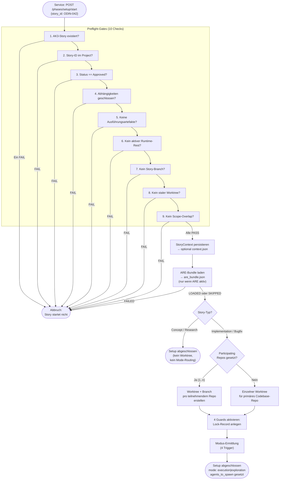

# 22 — Setup, Preflight, Worktree und Guard-Aktivierung

<!-- PROSE-FORMAL: formal.setup-preflight.entities, formal.setup-preflight.state-machine, formal.setup-preflight.commands, formal.setup-preflight.events, formal.setup-preflight.invariants, formal.setup-preflight.scenarios -->

## 22.1 Zweck

Die Setup-Phase ist der erste Schritt jeder Story-Bearbeitung.
Sie stellt sicher, dass alle Voraussetzungen erfüllt sind, bevor
ein Agent mit der eigentlichen Arbeit beginnt. Scheitert ein
Preflight-Check, wird die Story nicht gestartet — fail-closed,
kein "trotzdem versuchen".

Die Setup-Phase ist vollständig deterministisch. Kein LLM ist
beteiligt. Alles läuft als Python-Skript über den Phase Runner.

## 22.2 Ablauf



## 22.3 Preflight-Gates

### 22.3.1 Die zehn Checks

| # | Check | Was geprüft wird | Wie | FAIL-Grund |
|---|-------|-----------------|-----|-----------|
| 1 | `story_exists` | Story-ID existiert im AK3-Story-Backend und ist abrufbar | AK3-Story-Service abfragen | Story nicht gefunden (gelöscht? falsche Story-ID?) |
| 2 | `story_attributes_consistent` | Story-Attribute (Story Type, Size, Module, etc.) sind vorhanden und konsistent | AK3-Story-Service abfragen | Story-Attribute fehlen oder sind inkonsistent |
| 3 | `status_approved` | Story-Status im AK3-Story-Backend ist "Approved" | AK3-Story-Service abfragen | Status ist Backlog, In Progress, Done oder Cancelled |
| 4 | `dependencies_done` | Alle Dependencies (`StoryDependency`) der Story haben Status Done | AK3-Story-Service-Dependency-Liste lesen, fuer jede referenzierte Story den Status pruefen | Mindestens eine Dependency-Story ist noch nicht in Status Done |
| 5 | `no_execution_artifacts` | Keine Reste aus vorherigen Läufen **oder** vorheriger Run sauber abgeschlossen | Prüfe `artifact_records` und `phase_state_projection` fuer die Story. Bei unabgeschlossenem Run: FAIL. Bei sauber abgeschlossenem Run: Exporte archiviertbar, kein Blocker. | Artefakte eines unabgeschlossenen vorherigen Laufs gefunden |
| 6 | `no_active_runtime_residue` | Keine aktiven Runtime-Reste eines vorherigen Runs | Prüfe kanonische Runtime-Zustände (`flow_executions`, aktive Lock-Records, `phase_state_projection`) für die Story. Telemetrie in `execution_events` ist **kein** Start-Gate; sie darf nur diagnostisch herangezogen werden. Bei aktivem oder inkonsistentem Runtime-Zustand: FAIL. | Aktiver oder inkonsistenter Runtime-Zustand eines vorherigen Runs vorhanden |
| 7 | `no_story_branch` | Kein Branch `story/{story_id}` existiert **oder** Branch gehört zu abgeschlossenem Run | `git rev-parse --verify story/{story_id}`. Bei Existenz: prüfe ob zugehöriger Run abgeschlossen. Bei abgestürztem Run: FAIL (Mensch muss entscheiden: Cleanup oder Recovery). | Branch eines unaufgeräumten Runs vorhanden |
| 8 | `no_stale_worktree` | Kein Worktree für diese Story **oder** Worktree gehört zu abgeschlossenem Run | `git worktree list --porcelain` + Suche nach Story-ID. Logik analog zu Check 7. | Worktree eines unaufgeräumten Runs vorhanden |
| 9 | `no_scope_overlap` | Keine aktive parallele Story arbeitet an denselben Modulen/Pfaden | Aktive Lock-Records und deren `StoryContext` im State-Backend lesen und Scope ueber `scope_keys`/`repo_bindings` vergleichen. Bei Ueberschneidung: FAIL. | Parallele Story arbeitet an überlappenden Modulen — Merge-Konflikt vorprogrammiert |
| 10 | `no_competing_story_mode_active` | Kein konflikthafter Story-Mode (FK-24 §24.3.3) ist projektweit aktiv | Projektweiten `mode_lock` der Control Plane lesen. Erlaubt: `mode_lock = null` oder `mode_lock.mode = gewuenschter Mode`. FAIL: Mode-Lock haelt einen anderen Mode (`fast` waehrend `standard` aktiv ist oder umgekehrt). | Fast und Standard sind fachlich ausschliesslich; aktive Stories des anderen Modus muessen erst Done/Cancelled sein |

### 22.3.2 Fail-closed

Jeder einzelne Check-Failure führt zum Abbruch. Es werden trotzdem
alle 10 Checks ausgeführt (nicht beim ersten Failure abbrechen),
damit der Mensch alle Probleme auf einmal sieht.

### 22.3.3 Ergebnis

```python
@dataclass(frozen=True)
class PreflightResult:
    passed: bool
    checks: list[dict]  # {id, passed, detail}
    errors: list[str]
    warnings: list[str]
```

Das Ergebnis wird in `_temp/qa/{story_id}/preflight.json`
geschrieben (Envelope-Format).

### 22.3.4 Cleanup-Hinweise bei Failure

Wenn Checks 5-8 scheitern (Reste aus vorherigen Läufen), gibt
der Preflight dem Menschen konkrete Hinweise:

```
Preflight FAILED:
- no_execution_artifacts: worker-manifest.json exists in _temp/qa/ODIN-042/
  → Cleanup: agentkit cleanup --story ODIN-042
- no_story_branch: Branch story/ODIN-042 exists
  → Cleanup: git branch -d story/ODIN-042
```

Der Agent sieht diese Hinweise nicht (er sieht nur den Phase-State
mit `status: FAILED`). Der Mensch kann sie im Preflight-Artefakt
lesen.

## 22.4 Story-Context-Berechnung

### 22.4.1 Ablauf

Nach bestandenem Preflight wird der Story-Context aus dem
AK3-Story-Backend (Story-Attribute, Konzept-/Guardrail-Referenzen,
externe Quellen, Dependencies) gelesen und als autoritativer
Snapshot persistiert (Kap. 03, Konfigurationshierarchie):

```python
def compute_story_context(story_id: str, config: PipelineConfig) -> StoryContext:
    # 1. Story-Attribute aus AK3-Story-Backend holen
    story = ak3_story_service.get(story_id)

    # 2. Story-Typ ermitteln
    story_type = story.story_type

    # 3. Native Story-Attribute lesen (kein Body-Parsing)
    concept_paths = story.concept_sources
    external_sources = story.external_sources
    guardrail_paths = story.guardrail_paths
    dependencies = ak3_story_service.list_dependencies(story_id)

    # 4. Story-Verzeichnis ableiten
    slug = slugify(story.title)
    story_dir = f"{config.wiki_stories_dir}/{story_id}_{slug}"

    # 5. Context-Objekt zusammenbauen
    return StoryContext(
        story_id=story_id,
        run_id=generate_uuid(),
        story_dir=Path(story_dir),
        story_type=story_type,
        size=story.size or "M",
        scope=detect_scope(story),
        maturity=story.maturity or "",
        change_impact=story.change_impact or "",
        new_structures=bool(story.new_structures),
        concept_quality=story.concept_quality or "",
        concept_paths=concept_paths,
        external_sources=external_sources,
        guardrail_paths=guardrail_paths,
        vectordb_conflict=bool(story.vectordb_conflict_resolved),
    )
```

### 22.4.2 Persistenz: StoryContext + optionaler Export

Der Context wird kanonisch als `StoryContext` im State-Backend
persistiert. Optional kann ein JSON-Export in
`_temp/qa/{story_id}/context.json` materialisiert werden.

```json
{
  "schema_version": "3.0",
  "story_id": "ODIN-042",
  "run_id": "a1b2c3d4-...",
  "stage": "context",
  "producer": { "type": "script", "name": "compute-story-context" },
  "started_at": "...",
  "finished_at": "...",
  "status": "PASS",
  "story": {
    "id": "ODIN-042",
    "title": "Implement broker API integration",
    "status": "Approved"
  },
  "story_type": "implementation",
  "size": "M",
  "scope": "backend",
  "maturity": "Solution Approach",
  "change_impact": "Component",
  "new_structures": false,
  "concept_quality": "Medium",
  "concept_paths": ["concepts/broker-api-concept.md"],
  "external_sources": ["https://api.partner.com/openapi.yaml"],
  "guardrail_paths": ["guardrails/api-design-rules.md"],
  "vectordb_conflict": false
}
```

**Ab hier ist `StoryContext` die einzige Wahrheit.** Keine
nachfolgende Phase liest die Story-Attribute erneut; `context.json`
ist nur der Export dieses Snapshots.

### 22.4.3 Story-Status auf "In Progress" setzen

Nach erfolgreicher Context-Berechnung setzt der AK3-Story-Service den
Story-Status auf "In Progress".

## 22.4b ARE-Bundle-Laden

### 22.4b.1 Zweck

Nach der Context-Berechnung und vor der Story-Typ-Weiche lädt das
Setup-Skript (wenn `features.are: true`) den ARE-Bundle für die Story.
Dieser Schritt ist deterministisch und läuft ohne LLM-Beteiligung.

Der Bundle wird als Content-Plane-Artefakt persistiert und ist für
Worker und QA-Agent beim Start verfügbar. Der Orchestrator-Agent
erhält den Bundle-Inhalt nicht — er liest nur das Ergebnis-Signal
im Phase-State (FK 4.5, FK 9.3).

### 22.4b.2 Ablauf

```python
def load_are_bundle(story_id: str, config: PipelineConfig) -> AreBundleResult:
    """Lädt ARE-Bundle und persistiert ihn als Content-Plane-Artefakt.

    Bei FAILED: Setup-Skript schreibt status=FAILED in Phase-State und bricht ab.
    Der Orchestrator-Agent beobachtet diesen Zustand — er lädt nicht nach.
    Bei SKIPPED (ARE inaktiv): kein Fehler, kein Artefakt.
    """
    if not config.features.are:
        return AreBundleResult(status="SKIPPED", requirement_count=0)

    try:
        requirements = are_mcp.call("are_load_context", story_id=story_id)
    except AreMcpError as exc:
        return AreBundleResult(status="FAILED", error=str(exc))

    bundle_path = Path(f"_temp/qa/{story_id}/are_bundle.json")
    bundle_path.parent.mkdir(parents=True, exist_ok=True)
    try:
        bundle_path.write_text(json.dumps({
            "schema_version": "1.0",
            "story_id": story_id,
            "fetched_at": now_iso(),
            "must_cover": requirements,
        }, ensure_ascii=False, indent=2))
    except OSError as exc:
        return AreBundleResult(status="FAILED", error=str(exc))

    return AreBundleResult(status="LOADED", requirement_count=len(requirements))
```

### 22.4b.3 Ergebnis im Phase-State

Das Ergebnis wird in das Phase-State-Steuerungsartefakt eingetragen:

```json
{
  "are_bundle": {
    "status": "LOADED",
    "requirement_count": 12
  }
}
```

Mögliche Status:

| Status | Bedeutung | Folgeaktion |
|--------|-----------|-------------|
| `LOADED` | Bundle erfolgreich geladen und persistiert | Setup läuft weiter |
| `SKIPPED` | ARE nicht aktiviert | Setup läuft weiter, kein Artefakt |
| `FAILED` | ARE nicht erreichbar oder Schreibfehler | **Setup-Skript bricht ab**, schreibt `are_bundle.status=FAILED` in Phase-State |

**Stopppunkt:** Bei `FAILED` bricht das Setup-Skript selbst ab — es ist
nicht der Orchestrator-Agent, der stoppt. Der Orchestrator-Agent liest
den Phase-State und sieht `status: FAILED`; er startet keinen Worker
und beschafft den Bundle nicht eigenständig nach.

## 22.4c SonarQube-main-Green-Vorbedingung

### 22.4c.1 Zweck

Codeproduzierende Stories (`implementation`, `bugfix`) duerfen nur auf
einem **gruenen `main`** aufsetzen. Bevor ein Worktree fuer eine solche
Story erstellt wird, prueft das Setup-Skript deterministisch, ob der
aktuelle `main` *fuer sich* gruen ist. Das ist der erste der drei
Lifecycle-Gate-Punkte der `sonarqube_gate`-Capability (FK-33 §33.6.3,
Punkt 1); die QA-Subflow-Messung des Branch (Punkt 2) und die
Closure-Pre-Merge-Messung (Punkt 3) liegen in FK-27 bzw. FK-29/FK-35.

Dieser Schritt ist deterministisch und laeuft ohne LLM-Beteiligung. Die
Gate-Semantik selbst (Green-Definition, Overall-Code-Invariante,
Attestation, Accepted-Ledger) ist nicht hier modelliert, sondern wird
aus FK-33 bezogen; Setup ist nur **Aufrufer**, kein Owner der
Gate-Logik.

**Story-Typ-Geltung:** Nur `implementation` und `bugfix`. Concept- und
Research-Stories durchlaufen diese Vorbedingung nicht — sie erhalten
keinen Worktree (§22.5.1) und veraendern keinen analysierten Fachcode.

**Applicability-Vorbedingung (FK-33 §33.6.5):** Die green-main-Vorbedingung
greift nur, wenn die `sonarqube_gate`-Capability an diesem Lifecycle-Punkt
**APPLICABLE** ist — also Sonar verfuegbar (`sonarqube.available == true`,
FK-03), `mode != fast` (Story-Attribut `mode` aus FK-24 §24.3.4; projektweit
`mode_lock != fast` aus §24.3.3) und Story-Typ impl/bugfix. Andernfalls ist
sie **NOT_APPLICABLE** und wird uebersprungen (Status `SKIPPED`):
- **Sonar nicht verfuegbar** (`sonarqube.available == false`, auch fuer
  codeproduzierende Projekte zulaessig): kein Read der main-Attestation, kein
  fail-closed — Setup laeuft weiter ohne green-main-Pruefung.
- **`mode == fast`** (Story-Attribut `mode` aus FK-24 §24.3.4; projektweit
  `mode_lock == fast` aus §24.3.3): die green-main-Vorbedingung wird nicht
  ausgewertet (Mode-Profil Fast, FK-24); Konflikt-Auffang uebernimmt der
  Pre-Merge-Rebase im Closure (FK-29).

Davon strikt abzugrenzen ist das *konfiguriert-aber-unerreichbare* Sonar
(`available == true`, Server/Branch-Plugin nicht erreichbar): das bleibt
APPLICABLE und **fail-closed** (§22.4c.3, „abwesend ≠ kaputt", FK-33 §33.6.5).
**Re-Entry:** Wechselt ein Projekt von Sonar-unverfuegbar → verfuegbar oder
startet eine strikte Story nach Fast-Modus-Technikschuld, stellt zuerst der
bestehende Cleanup-Remediation-Worker (§22.4c.3) `main` gruen her; danach gilt
die green-main-Vorbedingung wieder normal (FK-33 §33.6.5).

### 22.4c.2 Pruefung (Read der main-Attestation, kein Live-Read)

Das Setup-Skript liest die **commit-gebundene main-Attestation** der
`sonarqube_gate`-Capability (FK-33 §33.6.3) — nie einen blossen
„ist Projekt X gerade gruen?"-Read ueber den `projectKey`. Gruen gilt
genau dann, wenn **beide** Bedingungen erfuellt sind:

1. **Attestation gruen:** Quality Gate OK auf der
   **Overall-Code-Invariante** (keine offenen, nicht-akzeptierten Issues
   im gesamten analysierten Scope, nicht nur New Code), gelesen per
   `analysisId` (nicht per `projectKey`).
2. **Revision-Match:** `sonar_last_analyzed_revision == git main HEAD`.
   Ein gruener Status fuer einen veralteten Commit ist wertlos; ohne
   Revision-Match gilt die Attestation als **stale** und damit als
   Vorbedingungs-FAIL.

```python
def check_main_green_precondition(
    story_type: str, project: Project, sonar: SonarGate
) -> MainGreenResult:
    """Setup-Vorbedingung: ist der aktuelle main fuer sich gruen?

    Nur fuer codeproduzierende Stories (implementation, bugfix).
    Liest die commit-gebundene main-Attestation (FK-33 §33.6.3) und
    gleicht die analysierte Revision gegen den aktuellen main-HEAD ab.
    """
    if story_type not in ("implementation", "bugfix"):
        return MainGreenResult(status="SKIPPED")
    # Applicability zuerst (FK-33 §33.6.5): bewusst-abwesendes Sonar oder
    # fast -> NOT_APPLICABLE/SKIPPED (kein fail-closed). Konfiguriert-aber-
    # unerreichbares Sonar bleibt APPLICABLE und faellt unten fail-closed.
    if not sonar.is_applicable(project):  # available==false OR mode==fast
        return MainGreenResult(status="SKIPPED")

    main_head = git_rev_parse("main", project.path)
    attestation = sonar.read_main_attestation(project)  # QG per analysisId

    if attestation is None or attestation.quality_gate_status != "OK":
        return MainGreenResult(status="RED", main_head=main_head)
    if attestation.last_analyzed_revision != main_head:
        return MainGreenResult(status="STALE", main_head=main_head,
                               analyzed_revision=attestation.last_analyzed_revision)

    return MainGreenResult(status="GREEN", main_head=main_head)
```

### 22.4c.3 Fail-closed mit aktivem Cleanup-Vorschlag (nicht stumm)

Ist `main` rot oder die Attestation stale, wird Setup **fail-closed
verweigert** — die Story wird nicht gestartet. Das ist aber **kein
stilles Liegenlassen** (Verstoss gegen ZERO DEBT waere genau das):
Das Setup-Skript schreibt einen **aktiven, schuldfreien Vorschlag** in
das Phase-State-Ergebnis, einen **eigenstaendigen
Cleanup-Remediation-Worker ausserhalb des Story-Scopes** zu starten, der
`main` wieder gruen macht.

**Schuldfreie Rahmung (normativ):** Der Vorschlag adressiert nicht „wer
hat den roten `main` verursacht", sondern „wer kann das sinnvoll
beackern". So setzt jede Story auf gruenem `main` auf, und **kein Worker
wird gezwungen, scope-fremde Alt-Issues zu schultern**. Der
Cleanup-Worker laeuft als eigene Story/eigener Run mit eigenem Scope; er
ist nicht Teil der gerade gestarteten Story.

```json
{
  "phase": "setup",
  "status": "FAILED",
  "sonarqube_main_green": {
    "status": "RED",
    "main_head": "a1b2c3d4",
    "cleanup_proposal": {
      "action": "start_independent_cleanup_worker",
      "scope": "out_of_story",
      "framing": "blame_free",
      "rationale": "main muss fuer sich gruen sein, bevor eine neue Story aufsetzt (Broken-Window). Vorschlag: eigenstaendiger Cleanup-Remediation-Worker ausserhalb dieses Story-Scopes."
    }
  }
}
```

| Status | Bedeutung | Folgeaktion |
|--------|-----------|-------------|
| `GREEN` | main-Attestation OK + Revision-Match | Setup laeuft weiter (Worktree-Erstellung) |
| `SKIPPED` | Concept/Research — kein Worktree, kein Fachcode; **oder** `sonarqube_gate` NOT_APPLICABLE (Sonar nicht verfuegbar / `mode=fast`, FK-33 §33.6.5) | Setup laeuft weiter |
| `RED` | Quality Gate nicht OK auf Overall-Code-Invariante | **Setup fail-closed**, aktiver Cleanup-Vorschlag |
| `STALE` | gruene Attestation, aber `last_analyzed_revision != main HEAD` | **Setup fail-closed**, aktiver Cleanup-Vorschlag (main neu vermessen lassen) |

**Reihenfolge:** Diese Vorbedingung wird nach der Story-Typ-Weiche
(§22.5) fuer implementierende Stories und **vor** der Worktree-Erstellung
(§22.6) geprueft — ein roter `main` darf gar nicht erst zu einem
Worktree fuehren.

## 22.5 Story-Typ-Weiche

### 22.5.1 Konzept- und Research-Stories

Für Konzept- und Research-Stories endet die Setup-Phase hier. Es
werden **kein Worktree, kein Branch, keine Guards und keine
Modus-Ermittlung** durchgeführt. Diese Story-Typen arbeiten im
AI-Augmented-Modus direkt auf `main` (Kap. 12.4.1).

**Research-Ergebnis-Persistenz (FK-22-048):** Das Ergebnis einer
Research-Story muss in einem definierten, persistenten
Speicherort abgelegt werden — nicht ausschließlich im Kontext des
Agents. Als Speicherort gilt das Story-Verzeichnis
(`{wiki_stories_dir}/{story_id}_{slug}/`) mit einer strukturierten
Ergebnisdatei (z.B. `research-result.md`). Diese Persistenz
stellt sicher, dass das Rechercheergebnis für nachfolgende
Story-Bearbeitungen und Konzept-Stories abrufbar bleibt, ohne
dass der Research-Agent noch einmal ausgeführt werden muss.

Der Phase-State wird gesetzt:

> Das folgende JSON-Beispiel zeigt die fachliche Idee in vereinfachter,
> flacher Form. Die normative Struktur ist die nach Ownership getrennte
> (StoryContext, PhaseStateCore, PhasePayload, RuntimeMetadata);
> autoritativ sind FK-17 und FK-18.

```json
{
  "phase": "setup",
  "status": "COMPLETED",
  "mode": null,
  "story_type": "concept",
  "agents_to_spawn": [
    { "type": "worker-concept", "prompt_file": "prompts/worker-concept.md" }
  ]
}
```

Der Orchestrator liest den Phase-State und spawnt den
entsprechenden Worker (Concept oder Research).

### 22.5.2 Implementierende Stories

Für Implementation und Bugfix geht die Setup-Phase weiter
mit Worktree-Erstellung, Guard-Aktivierung und Modus-Ermittlung.

## 22.6 Worktree-Erstellung (Multi-Repo)

### 22.6.1 Teilnehmende Repos

Nach bestandenem Preflight werden Worktrees für **alle
teilnehmenden Repos** erstellt — nicht nur für ein einzelnes
Repository. Die Liste der teilnehmenden Repos stammt aus dem
Story-Attribut `Participating Repos` im AK3-Story-Backend, das bei der
Story-Erstellung gesetzt wird (FK 21). Jedes teilnehmende Repo
erhält einen eigenen Feature-Branch (`story/{story_id}`).

**Nicht-teilnehmende Repos** erhalten keinen Feature-Branch. Der
Worker operiert dort auf `main` (lesend, ohne Commits).

Implementation- und Bugfix-Stories haben mindestens einen
teilnehmenden Repo. Concept- und Research-Stories durchlaufen
diese Phase nicht (§22.5.1) und erhalten keinen Worktree.

Alle teilnehmenden
Repos sind **gleichberechtigt**. Es gibt **keine ausgezeichnete
Sonderrolle** eines einzelnen Repos. Identifiziert wird ein Repo
ausschliesslich ueber seinen Repo-Namen aus
`project.repositories[].name` (FK-10 §project.yaml); ein eigener
Repo-Schluessel oder eine Repo-ID wird nicht eingefuehrt.
`participating_repos` ist eine flache Liste von Repo-Namen.

### 22.6.2 Ablauf

```python
def setup_worktrees(story_id: str, context: StoryContext,
                    project: Project,
                    base_ref: str = "main") -> list[WorktreeResult]:
    """Erstellt Worktrees fuer alle teilnehmenden Repos.

    Alle teilnehmenden Repos sind gleichberechtigt — keine Primary-Rolle.
    Repo-Namen werden gegen project.repositories aufgeloest.
    """
    results: list[WorktreeResult] = []
    repo_lookup = {r.name: r for r in project.repositories}

    for repo_name in context.participating_repos:
        repo = repo_lookup[repo_name]  # KeyError -> Setup FAIL
        result = setup_worktree(story_id, repo, base_ref)
        results.append(result)

    return results


def setup_worktree(story_id: str, repo: RepoEntry,
                   base_ref: str = "main") -> WorktreeResult:
    # 1. Remote aktualisieren (non-fatal)
    git_fetch_origin(repo.path)

    # 2. Guard: Branch darf nicht existieren (bereits in Preflight geprueft)
    assert not git_has_branch(f"story/{story_id}", repo.path)

    # 3. Guard: Worktree-Pfad darf nicht existieren
    worktree_path = repo.path / f"worktrees/{story_id}"
    assert not worktree_path.exists()

    # 4. Worktree + Branch erstellen
    git_worktree_add(worktree_path, f"story/{story_id}", base_ref,
                     cwd=repo.path)

    return WorktreeResult(
        success=True,
        worktree_path=worktree_path,
        repo_name=repo.name,
        branch=f"story/{story_id}",
    )
```

### 22.6.3 Worktree-Pfad

| Element | Wert |
|---------|------|
| Pfad | `{repo.path}/worktrees/{story_id}` (pro teilnehmendem Repo) |
| Branch | `story/{story_id}` (identisch in allen teilnehmenden Repos) |
| Base | `main` (oder konfigurierbar) |
| `.agent-guard/lock.json` | Optionaler Worktree-Export des lokal publizierten Edge-Bundles; wird nicht ad hoc im Worktree erfunden |
| Nicht-teilnehmende Repos | Kein Worktree, kein Feature-Branch — Worker arbeitet auf `main` |

### 22.6.4 Worker-Modell bei Multi-Repo

Ein einziger
Worker pro Story, auch bei N teilnehmenden Repos. Der Worker erhaelt
beim Spawn eine **Worktree-Map** als Kontext (Repo-Name -> Worktree-Pfad)
und wechselt CWD pro Tool-Call zwischen Worktrees, soweit fachlich noetig.

**Spawn-Worktree:** Der erste Eintrag in `participating_repos` dient als
deterministischer Start-CWD. Er hat keine fachliche Sonderrolle — keine
ausgezeichnete Repo-Rolle, keine asymmetrische Berechtigung gegenueber
den anderen Worktrees. Nur ein technischer Einstiegspunkt fuer den
Worker-Spawn.

Begruendung (Multi-Worker abgewaehlt):
- **Cognitive Load:** ein Worker hat den vollstaendigen Story-Kontext.
  Interface-Aenderung in Repo A und Aufrufer-Anpassung in Repo B koennen
  konsistent im selben mentalen Modell gehalten werden. N Worker
  brauechten ein explizites Coordination-Protokoll, das es nicht gibt.
- **Atomicity der Aenderungen:** CWD-Wechsel per Tool-Call ist kein
  Atomicity-Problem auf Aenderungsebene. Die einzige garantierte
  Atomicity entsteht bei Closure als atomare Gruen-und-FF-Mergbarkeits-
  Barriere vor dem ersten Push; der Cross-Remote-Push selbst ist nicht
  transaktional atomar, ein partieller Push eskaliert mit kompensierender
  Saga-Recovery (FK-29 §29.1.6, §29.1.6.3).
- **Handover-Konsistenz:** ein Worker-Manifest ueber alle Repos ist
  einfacher zu validieren als N Manifests, die spaeter aggregiert werden
  muessten.
- **Recovery:** ein Checkpoint-Schema, ein Resume-Pfad. Bei Worker-Crash
  reicht der per-Worktree-Checkpoint-State.

Nicht-teilnehmende Repos sind dem Worker bekannt (lesender Zugriff auf
`main` zulaessig), erscheinen aber nicht in der Worktree-Map.

## 22.7 Guard-Aktivierung

### 22.7.1 Lock-Record anlegen

Das Setup-Skript (nicht der Agent) erstellt den Lock-Record als
notwendige Bedingung fuer das Story-Regime. Er allein aktiviert die
Guards noch nicht; massgeblich bleibt die spaetere
Modus-Aufloesung aus Run-Bindung + Lock + Worktree-Match.

Zusätzlich gilt:

- der lokale Projektzustand wird nicht markerbasiert frei
  fortgeschrieben
- der offizielle lokale `Project Edge Client` publiziert nach dem
  zentralen Zustandswechsel ein komplettes Edge-Bundle unter
  `_temp/governance/current.json` und
  `_temp/governance/bundles/{export_version}/...`
- optionale Worktree-Exporte wie `.agent-guard/lock.json` sind nur
  sekundaere Projektionen dieses Bundles

```python
def activate_guards(project_key: str, story_id: str, run_id: str) -> None:
    # 1. Kanonischen Lock-Record im State-Backend anlegen
    state_backend.create_lock_record(
        project_key=project_key,
        story_id=story_id,
        run_id=run_id,
        lock_type="story_execution",
    )

    # 2. Lokales Edge-Bundle ueber den offiziellen Projektpfad publizieren
    project_edge_client.materialize_runtime_bundle(
        project_key=project_key, story_id=story_id, run_id=run_id
    )

    # 3. QA-Verzeichnis erstellen
    qa_dir = Path(f"_temp/qa/{story_id}")
    qa_dir.mkdir(parents=True, exist_ok=True)
```

### 22.7.2 Was der Lock-Record vorbereitet

Der Lock-Record ist notwendige Vorbedingung fuer die storygebundenen
Guards (FK 6.0). Ob sie fuer den aktuellen Hook-Call wirklich gelten,
entscheidet die Mode-Resolution.
Das Integrity-Gate ist kein Guard, sondern ein einmaliger
Prüfpunkt vor Closure — es wird nicht durch den Lock-Record
aktiviert, sondern durch den Phase Runner in der Closure-Phase
aufgerufen.

| Guard | Ohne Lock-Record | Mit Lock-Record |
|-------|----------------|---------------|
| Branch-Guard | Inaktiv (AI-Augmented) | Aktiv: nur Story-Branch, kein Main-Push |
| QA-Artefakt-Schutz | Inaktiv | Aktiv: Sub-Agents können QA-Pfade nicht schreiben |
| Orchestrator-Guard | Inaktiv | Aktiv: Orchestrator kann Codebase nicht lesen/schreiben |
| Prompt-Integrity-Guard | Aktiv (Governance-Escape, Spawn-Schema) | Aktiv (+ Template-Integritätsprüfung) |
| Immer-aktive Regeln | Aktiv (Force-Push, Hard-Reset, Secrets) | Aktiv |

**Orchestrator-Guard:** Wird durch denselben Lock-Record gesteuert
wie Branch-Guard und QA-Schutz. Kanonisch bleibt der Lock-Record im
State-Backend. Lokal lesen Hooks und Guards das aktuelle
Edge-Bundle ueber `_temp/governance/current.json`; lokale Exporte sind
nur Materialisierung, nicht kanonische Aktivierung. Ein Lock allein ist
auch hier nicht hinreichend; die Session muss zusaetzlich an denselben
Run gebunden sein.

### 22.7.3 Wer kann Guards deaktivieren

Nur das Closure-Skript (Pipeline-Zone 2) beendet den Lock-Record.
Kein Agent kann sie manipulieren — der Pfad
`_temp/governance/locks/` ist durch den Governance-Selbstschutz
(Kap. 15.7.1) geschützt.

## 22.8 Modus-Ermittlung

### 22.8.1 Vier Trigger

Die Modus-Ermittlung liest die Felder aus `StoryContext`
(optional ueber dessen `context.json`-Export, nicht aus GitHub).

**Vorbedingung**: Nur `implementation`- und `bugfix`-Stories erreichen
diese Funktion. Concept- und Research-Stories werden vorher durch die
Story-Typ-Weiche (§22.5) ausgeschleust.

Jeder der vier Trigger ist **unabhängig** — ein einziger Trigger reicht
für Exploration Mode. Nur wenn kein Trigger auslöst, wird Execution Mode
zurückgegeben.

```python
def determine_mode(context: StoryContext, *, project_root: Path) -> str:
    """Returns 'execution' or 'exploration'.  4-trigger model."""

    # Nicht-implementierende Story-Typen: kein Exploration-Check
    if context.story_type not in ("implementation", "bugfix"):
        return "execution"

    # Sonderfall: VektorDB-Konflikt erzwingt Exploration
    if context.vectordb_conflict:
        return "exploration"

    # Trigger 1: Keine validen Konzept-Referenzen → Exploration + WARNING
    if not _has_valid_concept_paths(context.concept_paths, project_root=project_root):
        logger.warning("no valid concept reference — Exploration (Trigger 1)")
        return "exploration"

    # Trigger 2: Change Impact == "Architecture Impact" → Exploration + INFO
    if context.change_impact == "Architecture Impact":
        logger.info("change_impact=Architecture Impact — Exploration (Trigger 2)")
        return "exploration"

    # Trigger 3: Neue Strukturen → Exploration + INFO
    if context.new_structures:
        logger.info("new_structures=True — Exploration (Trigger 3)")
        return "exploration"

    # Trigger 4: Concept Quality == "Low" → Exploration + INFO
    if context.concept_quality == "Low":
        logger.info("concept_quality=Low — Exploration (Trigger 4)")
        return "exploration"

    # Kein Trigger → Execution Mode
    return "execution"
```

**`_has_valid_concept_paths`:** Prüft ob mindestens ein Pfad in
`concept_paths` nicht leer ist, das referenzierte Dokument existiert
und abrufbar ist, und der Pfad innerhalb von `project_root` liegt
(Sandbox-Guard). Ein leerer String, ein ungültiger Pfad oder ein nicht
existierendes Dokument zählt als "kein gültiges Konzept".

**`project_root`-Parameter:** Der Sandbox-Guard in
`_has_valid_concept_paths` benötigt das tatsächliche Projekt-Root (nicht
das CWD). Der Phase Runner übergibt immer explizit `project_root`. Wird
kein `project_root` übergeben, fällt der Guard auf CWD zurück und loggt
eine WARNING.

### 22.8.2 Entscheidungsregel

| Situation | Ergebnis |
|-----------|---------|
| Kein Trigger aktiv | Execution Mode |
| Mindestens 1 Trigger aktiv | Exploration Mode |
| Keine validen Konzept-Pfade (Trigger 1) | Exploration + WARNING |
| Change Impact = Architecture Impact (Trigger 2) | Exploration + INFO |
| New Structures = True (Trigger 3) | Exploration + INFO |
| Concept Quality = Low (Trigger 4) | Exploration + INFO |
| Unbekannter Feldwert (Change Impact / Concept Quality) | Exploration + WARNING |
| VektorDB-Konflikt (`vectordb_conflict_resolved` an der AK3-Story) | Exploration (erzwungen, vor Trigger-Auswertung) |

### 22.8.2b Bewusst nicht im Modell enthaltene Kriterien

Das 4-Trigger-Modell verzichtet bewusst auf die folgenden Kriterien:

| Kriterium | Grund |
|-----------|-------|
| `Requires Exploration` (Boolean-Flag) | Durch `Concept Quality = Low` abgedeckt |
| `External Integrations` (Boolean) | Redundant zu Trigger 2 (Change Impact) und Trigger 3 (New Structures) |
| Maturity-Kriterium in der Modus-Ermittlung | Redundant zu `Concept Quality`; das Story-Attribut `Maturity` bleibt im AK3-Story-Backend für andere Zwecke bestehen |

### 22.8.3 Ergebnis im Phase-State

> Die folgenden JSON-Beispiele zeigen die fachliche Idee in vereinfachter,
> flacher Form. Die normative Struktur ist die nach Ownership getrennte
> (StoryContext, PhaseStateCore, PhasePayload, RuntimeMetadata);
> autoritativ sind FK-17 und FK-18.

```json
{
  "phase": "setup",
  "status": "COMPLETED",
  "mode": "exploration",
  "agents_to_spawn": [
    {
      "type": "worker-exploration",
      "prompt_file": "prompts/worker-exploration.md",
      "model": "opus"
    }
  ]
}
```

Bei Execution Mode:
```json
{
  "mode": "execution",
  "agents_to_spawn": [
    {
      "type": "worker-implementation",
      "prompt_file": "prompts/worker-implementation.md",
      "model": "opus"
    }
  ]
}
```

## 22.9 Telemetrie in der Setup-Phase

Die Setup-Phase schreibt keine Agent-Events (es läuft kein Agent).
Sie erzeugt folgende Artefakte:

| Artefakt | Datei | Producer | Artefaktklasse |
|----------|-------|----------|----------------|
| Preflight-Ergebnis | `_temp/qa/{story_id}/preflight.json` | `preflight-check` | Control-Plane |
| Story-Context | `_temp/qa/{story_id}/context.json` | `compute-story-context` | Content-Plane-Export |
| ARE-Bundle | `_temp/qa/{story_id}/are_bundle.json` | `load-are-bundle` | Content-Plane |
| Phase-State | `_temp/qa/{story_id}/phase-state.json` | `run-phase` | Control-Plane-Export |
| Edge-Bundle-Pointer | `_temp/governance/current.json` | offizieller lokaler Project Edge Client | Control-Plane-Export |
| Edge-Bundle | `_temp/governance/bundles/{export_version}/...` | offizieller lokaler Project Edge Client | Control-Plane-Export |
| Worktree-Lock-Export | `worktrees/{story_id}/.agent-guard/lock.json` | offizieller lokaler Project Edge Client | Sekundaere Projektion |
| State-Backend | zentrale PostgreSQL-Instanz | Migration/Bootstrap | Kanonische Runtime-Persistenz |

Content-Plane-Artefakte (`context.json`-Export, `are_bundle.json`) sind für den
Orchestrator-Agenten durch den Orchestrator-Guard blockiert (Kap. 31.2).
Der Orchestrator liest ausschließlich die `phase_state_projection`
bzw. deren `phase-state.json`-Export sowie die publizierten
Control-Plane-Exporte unter `_temp/governance/`.

## 22.10 Fehlerbehandlung

| Fehler | Phase | Reaktion |
|--------|-------|---------|
| Preflight-Check scheitert | Preflight | Story startet nicht. Phase-State: FAILED. Mensch muss Voraussetzungen klären. |
| GitHub nicht erreichbar | Context-Berechnung | Setup FAIL. Mensch muss Netzwerk/Auth prüfen. |
| Worktree-Erstellung scheitert | Worktree | Setup FAIL. Best-effort Cleanup (Branch löschen wenn erstellt). |
| Lock-Record kann nicht angelegt werden | Guard-Aktivierung | Setup FAIL. State-Backend-/Berechtigungsproblem prüfen. |
| Modus-Ermittlung: unbekannter Feldwert | Modus-Ermittlung | Exploration Mode (fail-closed). Kein Fehler, nur Warnung. |
| ARE nicht erreichbar (bei `features.are: true`) | ARE-Bundle-Laden | Setup FAIL. Phase-State enthält `are_bundle.status: FAILED`. Orchestrator-Agent verweigert Worker-Start. Mensch muss ARE-Verbindung prüfen. |
| `main` rot oder Attestation stale (impl/bugfix) | SonarQube-main-Green-Vorbedingung (§22.4c) | Setup fail-closed verweigert. Phase-State enthält `sonarqube_main_green.status: RED`/`STALE` mit aktivem, schuldfreiem Cleanup-Vorschlag (§22.4c.3). Kein Worker wird gezwungen, scope-fremde Alt-Issues zu schultern; der Mensch entscheidet ueber einen eigenstaendigen Cleanup-Remediation-Worker. |
| SonarQube/Branch-Plugin nicht erreichbar (impl/bugfix) | SonarQube-main-Green-Vorbedingung (§22.4c) | Setup FAIL (fail-closed). Die Attestation kann nicht gelesen werden — unklare Vorbedingung wird nicht grosszuegig toleriert. Mensch muss SonarQube-Verfuegbarkeit pruefen (Installer-Checkpoint FK-50, Laufzeit-Abhaengigkeit FK-10 §10.2.2). |

---

*FK-Referenzen: FK-05-052 bis FK-05-073 (Setup-Phase komplett),
FK-05-058 bis FK-05-066 (Preflight-Checks 1-9; Check 10 Mode-Konflikt aus FK-24 §24.3.3 nachgezogen),
FK-05-067 bis FK-05-069 (Worktree, Context, Guards),
FK-05-070 bis FK-05-073 (Modus-Ermittlung)*
