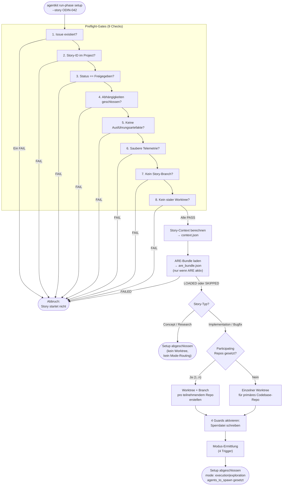

# 22 — Setup, Preflight, Worktree und Guard-Aktivierung

## 22.1 Zweck

Die Setup-Phase ist der erste Schritt jeder Story-Bearbeitung.
Sie stellt sicher, dass alle Voraussetzungen erfüllt sind, bevor
ein Agent mit der eigentlichen Arbeit beginnt. Scheitert ein
Preflight-Check, wird die Story nicht gestartet — fail-closed,
kein "trotzdem versuchen".

Die Setup-Phase ist vollständig deterministisch. Kein LLM ist
beteiligt. Alles läuft als Python-Skript über den Phase Runner.

## 22.2 Ablauf



## 22.3 Preflight-Gates

### 22.3.1 Die neun Checks

| # | Check | Was geprüft wird | Wie | FAIL-Grund |
|---|-------|-----------------|-----|-----------|
| 1 | `issue_exists` | GitHub Issue existiert und ist abrufbar | `gh issue view {issue_nr} --json number,state` | Issue nicht gefunden (gelöscht? falsche Nummer?) |
| 2 | `story_in_project` | Story-ID existiert als Item im GitHub Project | `gh project item-list` + Filter auf Story-ID | Issue nicht im Project eingestellt |
| 3 | `status_freigegeben` | Project-Item-Status ist "Approved" | GraphQL-Query auf Status-Feld | Status ist Backlog, In Progress oder Done |
| 4 | `dependencies_closed` | Alle referenzierten Dependency-Issues sind geschlossen | Issue-Body parsen (`## Dependencies`), jede `#NNN`-Referenz via `gh issue view` prüfen | Mindestens eine Dependency ist noch offen |
| 5 | `no_execution_artifacts` | Keine Reste aus vorherigen Läufen **oder** vorheriger Run sauber abgeschlossen | Prüfe ob `_temp/qa/{story_id}/` Artefakte enthält. Wenn ja: prüfe ob `phase-state.json` Status `COMPLETED` oder `ESCALATED` (+ explizit reset) hat. Bei unabgeschlossenem Run: FAIL. Bei sauber abgeschlossenem Run: Artefakte archivierbar, kein Blocker. | Artefakte eines unabgeschlossenen vorherigen Laufs gefunden |
| 6 | `clean_telemetry` | Keine Events eines aktiven, unabgeschlossenen Runs in der SQLite-DB | Query: `SELECT COUNT(*) FROM events WHERE story_id = ? AND event_type = 'agent_start' AND NOT EXISTS (SELECT 1 FROM events e2 WHERE e2.story_id = events.story_id AND e2.run_id = events.run_id AND e2.event_type = 'agent_end')`. Bei unabgeschlossenem Run: FAIL. Bei abgeschlossenen Runs: kein Problem (neue `run_id` trennt Events). | Events eines aktiv laufenden oder abgestürzten Runs vorhanden |
| 7 | `no_story_branch` | Kein Branch `story/{story_id}` existiert **oder** Branch gehört zu abgeschlossenem Run | `git rev-parse --verify story/{story_id}`. Bei Existenz: prüfe ob zugehöriger Run abgeschlossen. Bei abgestürztem Run: FAIL (Mensch muss entscheiden: Cleanup oder Recovery). | Branch eines unaufgeräumten Runs vorhanden |
| 8 | `no_stale_worktree` | Kein Worktree für diese Story **oder** Worktree gehört zu abgeschlossenem Run | `git worktree list --porcelain` + Suche nach Story-ID. Logik analog zu Check 7. | Worktree eines unaufgeräumten Runs vorhanden |
| 9 | `no_scope_overlap` | Keine aktive parallele Story arbeitet an denselben Modulen/Pfaden | Aktive Story-Marker in `_temp/governance/active/` lesen, deren `context.json` Module vergleichen mit den Modulen der neuen Story. Bei Pfad-Überschneidung: FAIL (Story bleibt in Backlog bis parallele Story gemergt). | Parallele Story arbeitet an überlappenden Modulen — Merge-Konflikt vorprogrammiert |

### 22.3.2 Fail-closed

Jeder einzelne Check-Failure führt zum Abbruch. Es werden trotzdem
alle 8 Checks ausgeführt (nicht beim ersten Failure abbrechen),
damit der Mensch alle Probleme auf einmal sieht.

### 22.3.3 Ergebnis

```python
@dataclass(frozen=True)
class PreflightResult:
    passed: bool
    checks: list[dict]  # {id, passed, detail}
    errors: list[str]
    warnings: list[str]
```

Das Ergebnis wird in `_temp/qa/{story_id}/preflight.json`
geschrieben (Envelope-Format).

### 22.3.4 Cleanup-Hinweise bei Failure

Wenn Checks 5-8 scheitern (Reste aus vorherigen Läufen), gibt
der Preflight dem Menschen konkrete Hinweise:

```
Preflight FAILED:
- no_execution_artifacts: worker-manifest.json exists in _temp/qa/ODIN-042/
  → Cleanup: agentkit cleanup --story ODIN-042
- no_story_branch: Branch story/ODIN-042 exists
  → Cleanup: git branch -d story/ODIN-042
```

Der Agent sieht diese Hinweise nicht (er sieht nur den Phase-State
mit `status: FAILED`). Der Mensch kann sie im Preflight-Artefakt
lesen.

## 22.4 Story-Context-Berechnung

### 22.4.1 Ablauf

Nach bestandenem Preflight wird der Story-Context aus GitHub
gelesen und als autoritativer Snapshot persistiert (Kap. 03,
Konfigurationshierarchie):

```python
def compute_story_context(story_id: str, config: PipelineConfig) -> StoryContext:
    # 1. Issue-Daten holen
    issue = gh_issue_view(story_id, config)

    # 2. Project-Item-Daten holen (Custom Fields)
    item = gh_project_item(story_id, config)

    # 3. Story-Typ ermitteln
    story_type = item.get("Story Type") or derive_from_labels(issue.labels)

    # 4. Issue-Body parsen
    concept_paths = parse_section(issue.body, "Konzept-Referenzen")
    external_sources = parse_section(issue.body, "Externe Quellen")
    guardrail_paths = parse_section(issue.body, "Guardrail-Referenzen")
    dependencies = parse_section(issue.body, "Abhängigkeiten")

    # 5. Story-Verzeichnis ableiten
    slug = slugify(issue.title)
    story_dir = f"{config.wiki_stories_dir}/{story_id}_{slug}"

    # 6. Context-Objekt zusammenbauen
    return StoryContext(
        story_id=story_id,
        run_id=generate_uuid(),
        issue_nr=issue.number,
        story_dir=Path(story_dir),
        story_type=story_type,
        size=item.get("Size", "M"),
        scope=detect_scope(issue),
        maturity=item.get("Maturity", ""),
        change_impact=item.get("Change Impact", ""),
        new_structures=item.get("New Structures", "false") == "true",
        concept_quality=item.get("Concept Quality", ""),
        concept_paths=concept_paths,
        external_sources=external_sources,
        guardrail_paths=guardrail_paths,
        project_item_id=item.id,
        vectordb_conflict=has_label(issue, "vectordb-conflict-resolved"),
    )
```

### 22.4.2 Persistenz: context.json

Der Context wird als JSON in `_temp/qa/{story_id}/context.json`
geschrieben (Envelope-Format mit Producer `compute-story-context`).

```json
{
  "schema_version": "3.0",
  "story_id": "ODIN-042",
  "run_id": "a1b2c3d4-...",
  "stage": "context",
  "producer": { "type": "script", "name": "compute-story-context" },
  "started_at": "...",
  "finished_at": "...",
  "status": "PASS",
  "issue": {
    "number": 42,
    "title": "Implement broker API integration",
    "state": "OPEN",
    "labels": ["story"],
    "body": "..."
  },
  "story_type": "implementation",
  "size": "M",
  "scope": "backend",
  "maturity": "Solution Approach",
  "change_impact": "Component",
  "new_structures": false,
  "concept_quality": "Medium",
  "concept_paths": ["concept/broker-api-concept.md"],
  "external_sources": ["https://api.partner.com/openapi.yaml"],
  "guardrail_paths": ["_guardrails/api-design-rules.md"],
  "vectordb_conflict": false
}
```

**Ab hier ist `context.json` die einzige Wahrheit.** Keine
nachfolgende Phase liest GitHub-Custom-Fields erneut (Kap. 03).

### 22.4.3 GitHub-Status auf "In Progress" setzen

Nach erfolgreicher Context-Berechnung wird der Project-Status
auf "In Progress" gesetzt:

```bash
gh api graphql -f query='mutation { updateProjectV2ItemFieldValue(...) }'
```

## 22.4b ARE-Bundle-Laden

### 22.4b.1 Zweck

Nach der Context-Berechnung und vor der Story-Typ-Weiche lädt das
Setup-Skript (wenn `features.are: true`) den ARE-Bundle für die Story.
Dieser Schritt ist deterministisch und läuft ohne LLM-Beteiligung.

Der Bundle wird als Content-Plane-Artefakt persistiert und ist für
Worker und QA-Agent beim Start verfügbar. Der Orchestrator-Agent
erhält den Bundle-Inhalt nicht — er liest nur das Ergebnis-Signal
im Phase-State (FK 4.5, FK 9.3).

### 22.4b.2 Ablauf

```python
def load_are_bundle(story_id: str, config: PipelineConfig) -> AreBundleResult:
    """Lädt ARE-Bundle und persistiert ihn als Content-Plane-Artefakt.

    Bei FAILED: Setup-Skript schreibt status=FAILED in Phase-State und bricht ab.
    Der Orchestrator-Agent beobachtet diesen Zustand — er lädt nicht nach.
    Bei SKIPPED (ARE inaktiv): kein Fehler, kein Artefakt.
    """
    if not config.features.are:
        return AreBundleResult(status="SKIPPED", requirement_count=0)

    try:
        requirements = are_mcp.call("are_load_context", story_id=story_id)
    except AreMcpError as exc:
        return AreBundleResult(status="FAILED", error=str(exc))

    bundle_path = Path(f"_temp/qa/{story_id}/are_bundle.json")
    bundle_path.parent.mkdir(parents=True, exist_ok=True)
    try:
        bundle_path.write_text(json.dumps({
            "schema_version": "1.0",
            "story_id": story_id,
            "fetched_at": now_iso(),
            "must_cover": requirements,
        }, ensure_ascii=False, indent=2))
    except OSError as exc:
        return AreBundleResult(status="FAILED", error=str(exc))

    return AreBundleResult(status="LOADED", requirement_count=len(requirements))
```

### 22.4b.3 Ergebnis im Phase-State

Das Ergebnis wird in das Phase-State-Steuerungsartefakt eingetragen:

```json
{
  "are_bundle": {
    "status": "LOADED",
    "requirement_count": 12
  }
}
```

Mögliche Status:

| Status | Bedeutung | Folgeaktion |
|--------|-----------|-------------|
| `LOADED` | Bundle erfolgreich geladen und persistiert | Setup läuft weiter |
| `SKIPPED` | ARE nicht aktiviert | Setup läuft weiter, kein Artefakt |
| `FAILED` | ARE nicht erreichbar oder Schreibfehler | **Setup-Skript bricht ab**, schreibt `are_bundle.status=FAILED` in Phase-State |

**Stopppunkt:** Bei `FAILED` bricht das Setup-Skript selbst ab — es ist
nicht der Orchestrator-Agent, der stoppt. Der Orchestrator-Agent liest
den Phase-State und sieht `status: FAILED`; er startet keinen Worker
und beschafft den Bundle nicht eigenständig nach.

## 22.5 Story-Typ-Weiche

### 22.5.1 Konzept- und Research-Stories

Für Konzept- und Research-Stories endet die Setup-Phase hier. Es
werden **kein Worktree, kein Branch, keine Guards und keine
Modus-Ermittlung** durchgeführt. Diese Story-Typen arbeiten im
AI-Augmented-Modus direkt auf `main` (Kap. 12.4.1).

**Research-Ergebnis-Persistenz (FK-22-048):** Das Ergebnis einer
Research-Story muss in einem definierten, persistenten
Speicherort abgelegt werden — nicht ausschließlich im Kontext des
Agents. Als Speicherort gilt das Story-Verzeichnis
(`{wiki_stories_dir}/{story_id}_{slug}/`) mit einer strukturierten
Ergebnisdatei (z.B. `research-result.md`). Diese Persistenz
stellt sicher, dass das Rechercheergebnis für nachfolgende
Story-Bearbeitungen und Konzept-Stories abrufbar bleibt, ohne
dass der Research-Agent noch einmal ausgeführt werden muss.

Der Phase-State wird gesetzt:
```json
{
  "phase": "setup",
  "status": "COMPLETED",
  "mode": null,
  "story_type": "concept",
  "agents_to_spawn": [
    { "type": "worker-concept", "prompt_file": "prompts/worker-concept.md" }
  ]
}
```

Der Orchestrator liest den Phase-State und spawnt den
entsprechenden Worker (Concept oder Research).

### 22.5.2 Implementierende Stories

Für Implementation und Bugfix geht die Setup-Phase weiter
mit Worktree-Erstellung, Guard-Aktivierung und Modus-Ermittlung.

## 22.6 Worktree-Erstellung (Multi-Repo)

### 22.6.1 Teilnehmende Repos

Nach bestandenem Preflight werden Worktrees für **alle
teilnehmenden Repos** erstellt — nicht nur für ein einzelnes
Repository. Die Liste der teilnehmenden Repos stammt aus dem
GitHub-Project-Custom-Field `Participating Repos`, das bei der
Story-Erstellung gesetzt wird (FK 21). Jedes teilnehmende Repo
erhält einen eigenen Feature-Branch (`story/{story_id}`).

**Nicht-teilnehmende Repos** erhalten keinen Feature-Branch. Der
Worker operiert dort auf `main` (lesend, ohne Commits).

Wenn keine teilnehmenden Repos gesetzt sind (Konzept-/Research-
Stories ohne Code-Änderungen), wird ein einzelner Worktree für
das primäre Codebase-Repo erstellt.

### 22.6.2 Ablauf

```python
def setup_worktrees(story_id: str, context: StoryContext,
                    base_ref: str = "main") -> list[WorktreeResult]:
    """Erstellt Worktrees für alle teilnehmenden Repos."""
    results: list[WorktreeResult] = []

    repos = context.participating_repos or [context.primary_repo]

    for repo in repos:
        result = setup_worktree(story_id, repo, base_ref)
        results.append(result)

    return results


def setup_worktree(story_id: str, repo: RepoRef,
                   base_ref: str = "main") -> WorktreeResult:
    # 1. Remote aktualisieren (non-fatal)
    git_fetch_origin(repo.path)

    # 2. Guard: Branch darf nicht existieren (bereits in Preflight geprüft)
    assert not git_has_branch(f"story/{story_id}", repo.path)

    # 3. Guard: Worktree-Pfad darf nicht existieren
    worktree_path = repo.path / f"worktrees/{story_id}"
    assert not worktree_path.exists()

    # 4. Worktree + Branch erstellen
    git_worktree_add(worktree_path, f"story/{story_id}", base_ref,
                     cwd=repo.path)

    # 5. Branch-Guard-Context im Worktree schreiben
    agent_guard = worktree_path / ".agent-guard" / "context.json"
    agent_guard.parent.mkdir(parents=True, exist_ok=True)
    agent_guard.write_text(json.dumps({
        "story_id": story_id,
        "repo": repo.name,
        "branch": f"story/{story_id}",
        "created_at": now_iso(),
    }))

    return WorktreeResult(
        success=True,
        worktree_path=worktree_path,
        repo=repo.name,
        branch=f"story/{story_id}",
    )
```

### 22.6.3 Worktree-Pfad

| Element | Wert |
|---------|------|
| Pfad | `{repo.path}/worktrees/{story_id}` (pro teilnehmendem Repo) |
| Branch | `story/{story_id}` (identisch in allen teilnehmenden Repos) |
| Base | `main` (oder konfigurierbar) |
| `.agent-guard/context.json` | Im Worktree, aktiviert Branch-Guard, enthält `repo`-Feld |
| Nicht-teilnehmende Repos | Kein Worktree, kein Feature-Branch — Worker arbeitet auf `main` |

## 22.7 Guard-Aktivierung

### 22.7.1 Sperrdatei schreiben

Das Setup-Skript (nicht der Agent) erstellt die Sperrdatei, die
alle zustandsabhängigen Guards aktiviert (Kap. 02.7):

```python
def activate_guards(story_id: str, run_id: str) -> None:
    # 1. Story-Execution-Marker (pro Story, nicht global)
    marker_dir = Path("_temp/governance/active")
    marker_dir.mkdir(parents=True, exist_ok=True)
    marker_path = marker_dir / f"{story_id}.active"
    marker_path.write_text(json.dumps({
        "story_id": story_id,
        "run_id": run_id,
        "activated_at": now_iso(),
    }))

    # 2. QA-Lock (aktiviert QA-Artefakt-Schutz + Branch-Guard)
    lock_dir = Path(f"_temp/governance/locks/{story_id}")
    lock_dir.mkdir(parents=True, exist_ok=True)
    lock_file = lock_dir / "qa-lock.json"
    lock_file.write_text(json.dumps({
        "story_id": story_id,
        "run_id": run_id,
        "locked_at": now_iso(),
        "locked_paths": [f"_temp/qa/{story_id}/"],
        "owner_pid": os.getpid(),
        "ttl_s": 86400,
    }))

    # 3. QA-Verzeichnis erstellen
    qa_dir = Path(f"_temp/qa/{story_id}")
    qa_dir.mkdir(parents=True, exist_ok=True)
```

### 22.7.2 Was die Sperrdatei aktiviert

Die Sperrdatei aktiviert die vier permanenten Guards (FK 6.0).
Das Integrity-Gate ist kein Guard, sondern ein einmaliger
Prüfpunkt vor Closure — es wird nicht durch die Sperrdatei
aktiviert, sondern durch den Phase Runner in der Closure-Phase
aufgerufen.

| Guard | Ohne Sperrdatei | Mit Sperrdatei |
|-------|----------------|---------------|
| Branch-Guard | Inaktiv (AI-Augmented) | Aktiv: nur Story-Branch, kein Main-Push |
| QA-Artefakt-Schutz | Inaktiv | Aktiv: Sub-Agents können QA-Pfade nicht schreiben |
| Orchestrator-Guard | Inaktiv | Aktiv: Orchestrator kann Codebase nicht lesen/schreiben |
| Prompt-Integrity-Guard | Aktiv (Governance-Escape, Spawn-Schema) | Aktiv (+ Template-Integritätsprüfung) |
| Immer-aktive Regeln | Aktiv (Force-Push, Hard-Reset, Secrets) | Aktiv |

**Orchestrator-Guard:** Wird durch dieselbe Sperrdatei gesteuert
wie Branch-Guard und QA-Schutz. Prüft ob die Story-Execution-
Marker-Datei (`.story-execution-active`) existiert. Wenn ja:
blockiert Codebase-Zugriff für den Orchestrator (konfigurierte
Pfade aus `.story-pipeline.yaml`, Kap. 03).

### 22.7.3 Wer kann Guards deaktivieren

Nur das Closure-Skript (Pipeline-Zone 2) entfernt die Sperrdatei.
Kein Agent kann sie manipulieren — der Pfad
`_temp/governance/locks/` ist durch den Governance-Selbstschutz
(Kap. 15.7.1) geschützt.

## 22.8 Modus-Ermittlung

### 22.8.1 Vier Trigger (REF-032)

Die Modus-Ermittlung liest die Custom Fields aus `context.json`
(nicht aus GitHub — der Context ist der autoritative Snapshot).

**Vorbedingung**: Nur `implementation`- und `bugfix`-Stories erreichen
diese Funktion. Concept- und Research-Stories werden vorher durch die
Story-Typ-Weiche (§22.5) ausgeschleust.

Jeder der vier Trigger ist **unabhängig** — ein einziger Trigger reicht
für Exploration Mode. Nur wenn kein Trigger auslöst, wird Execution Mode
zurückgegeben.

```python
def determine_mode(context: StoryContext, *, project_root: Path) -> str:
    """Returns 'execution' or 'exploration'.  REF-032: 4-trigger model."""

    # Nicht-implementierende Story-Typen: kein Exploration-Check
    if context.story_type not in ("implementation", "bugfix"):
        return "execution"

    # Sonderfall: VektorDB-Konflikt erzwingt Exploration
    if context.vectordb_conflict:
        return "exploration"

    # Trigger 1: Keine validen Konzept-Referenzen → Exploration + WARNING
    if not _has_valid_concept_paths(context.concept_paths, project_root=project_root):
        logger.warning("no valid concept reference — Exploration (Trigger 1)")
        return "exploration"

    # Trigger 2: Change Impact == "Architecture Impact" → Exploration + INFO
    if context.change_impact == "Architecture Impact":
        logger.info("change_impact=Architecture Impact — Exploration (Trigger 2)")
        return "exploration"

    # Trigger 3: Neue Strukturen → Exploration + INFO
    if context.new_structures:
        logger.info("new_structures=True — Exploration (Trigger 3)")
        return "exploration"

    # Trigger 4: Concept Quality == "Low" → Exploration + INFO
    if context.concept_quality == "Low":
        logger.info("concept_quality=Low — Exploration (Trigger 4)")
        return "exploration"

    # Kein Trigger → Execution Mode
    return "execution"
```

**`_has_valid_concept_paths`:** Prüft ob mindestens ein Pfad in
`concept_paths` nicht leer ist, das referenzierte Dokument existiert
und abrufbar ist, und der Pfad innerhalb von `project_root` liegt
(Sandbox-Guard). Ein leerer String, ein ungültiger Pfad oder ein nicht
existierendes Dokument zählt als "kein gültiges Konzept".

**`project_root`-Parameter:** Der Sandbox-Guard in
`_has_valid_concept_paths` benötigt das tatsächliche Projekt-Root (nicht
das CWD). Der Phase Runner übergibt immer explizit `project_root`. Wird
kein `project_root` übergeben, fällt der Guard auf CWD zurück und loggt
eine WARNING (REF-032 Bug-Fix).

### 22.8.2 Entscheidungsregel

| Situation | Ergebnis |
|-----------|---------|
| Kein Trigger aktiv | Execution Mode |
| Mindestens 1 Trigger aktiv | Exploration Mode |
| Keine validen Konzept-Pfade (Trigger 1) | Exploration + WARNING |
| Change Impact = Architecture Impact (Trigger 2) | Exploration + INFO |
| New Structures = True (Trigger 3) | Exploration + INFO |
| Concept Quality = Low (Trigger 4) | Exploration + INFO |
| Unbekannter Feldwert (Change Impact / Concept Quality) | Exploration + WARNING |
| VektorDB-Konflikt (Flag am Issue) | Exploration (erzwungen, vor Trigger-Auswertung) |

### 22.8.2b Abgeschaffte Kriterien (REF-032)

Die folgenden Felder und Kriterien wurden in REF-032 entfernt:

| Entfernt | Grund |
|----------|-------|
| `Requires Exploration` (GitHub Boolean) | Ersetzt durch `Concept Quality = Low` |
| `External Integrations` (GitHub Boolean) | Redundant zu Trigger 2 (Change Impact) und Trigger 3 (New Structures) |
| Maturity-Kriterium in `_determine_mode` | Redundant zu `Concept Quality`; das Feld `Maturity` bleibt in GitHub für andere Zwecke bestehen |

### 22.8.3 Ergebnis im Phase-State

```json
{
  "phase": "setup",
  "status": "COMPLETED",
  "mode": "exploration",
  "agents_to_spawn": [
    {
      "type": "worker-exploration",
      "prompt_file": "prompts/worker-exploration.md",
      "model": "opus"
    }
  ]
}
```

Bei Execution Mode:
```json
{
  "mode": "execution",
  "agents_to_spawn": [
    {
      "type": "worker-implementation",
      "prompt_file": "prompts/worker-implementation.md",
      "model": "opus"
    }
  ]
}
```

## 22.9 Telemetrie in der Setup-Phase

Die Setup-Phase schreibt keine Agent-Events (es läuft kein Agent).
Sie erzeugt folgende Artefakte:

| Artefakt | Datei | Producer | Artefaktklasse |
|----------|-------|----------|----------------|
| Preflight-Ergebnis | `_temp/qa/{story_id}/preflight.json` | `preflight-check` | Control-Plane |
| Story-Context | `_temp/qa/{story_id}/context.json` | `compute-story-context` | Content-Plane |
| ARE-Bundle | `_temp/qa/{story_id}/are_bundle.json` | `load-are-bundle` | Content-Plane |
| Phase-State | `_temp/qa/{story_id}/phase-state.json` | `run-phase` | Control-Plane |
| Sperrdatei | `_temp/governance/locks/{story_id}/qa-lock.json` | `run-phase` | Control-Plane |
| SQLite-DB (Tabelle sichergestellt) | `_temp/agentkit.db` | (CREATE TABLE IF NOT EXISTS) | — |

Content-Plane-Artefakte (`context.json`, `are_bundle.json`) sind für den
Orchestrator-Agenten durch den Orchestrator-Guard blockiert (Kap. 31.2).
Der Orchestrator liest ausschließlich `phase-state.json`.

## 22.10 Fehlerbehandlung

| Fehler | Phase | Reaktion |
|--------|-------|---------|
| Preflight-Check scheitert | Preflight | Story startet nicht. Phase-State: FAILED. Mensch muss Voraussetzungen klären. |
| GitHub nicht erreichbar | Context-Berechnung | Setup FAIL. Mensch muss Netzwerk/Auth prüfen. |
| Worktree-Erstellung scheitert | Worktree | Setup FAIL. Best-effort Cleanup (Branch löschen wenn erstellt). |
| Sperrdatei kann nicht geschrieben werden | Guard-Aktivierung | Setup FAIL. Dateisystem-Berechtigungen prüfen. |
| Modus-Ermittlung: unbekannter Feldwert | Modus-Ermittlung | Exploration Mode (fail-closed). Kein Fehler, nur Warnung. |
| ARE nicht erreichbar (bei `features.are: true`) | ARE-Bundle-Laden | Setup FAIL. Phase-State enthält `are_bundle.status: FAILED`. Orchestrator-Agent verweigert Worker-Start. Mensch muss ARE-Verbindung prüfen. |

---

*FK-Referenzen: FK-05-052 bis FK-05-073 (Setup-Phase komplett),
FK-05-058 bis FK-05-066 (8 Preflight-Checks),
FK-05-067 bis FK-05-069 (Worktree, Context, Guards),
FK-05-070 bis FK-05-073 (Modus-Ermittlung),
REF-032 (4-Trigger-Modell, ersetzt FK-06-044 bis FK-06-055)*
