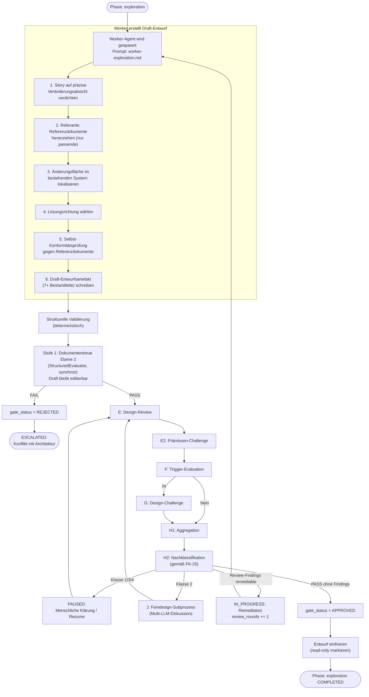

# 23 — Modusermittlung, Exploration und Change-Frame

<!-- PROSE-FORMAL: formal.exploration.entities, formal.exploration.state-machine, formal.exploration.commands, formal.exploration.events, formal.exploration.invariants, formal.exploration.scenarios -->

## 23.1 Zweck

Nicht jede implementierende Story braucht denselben Ablauf. Eine
Story mit detailliertem Architekturkonzept kann direkt implementiert
werden. Eine Story, die nur ein Ziel beschreibt, braucht erst einen
prüffähigen Entwurf, bevor Code geschrieben wird. Die Modus-
Ermittlung entscheidet deterministisch, welcher Fall vorliegt.

Die Exploration-Phase erzeugt diesen Entwurf — das Entwurfsartefakt
(Change-Frame). Es wird gegen bestehende Architektur geprüft
(Dokumententreue Ebene 2), bevor die Implementierung beginnt.

**Geltungsbereich:** Nur implementierende Story-Typen (Implementation,
Bugfix). Konzept- und Research-Stories durchlaufen
weder Modus-Ermittlung noch Exploration-Phase (Kap. 20.2.3).

## 23.2 Modus-Ermittlung

Die technische Umsetzung der Modusentscheidung ist in
Kap. 22.8 vollständig beschrieben (Code, Entscheidungsregel,
Fehlerbehandlung). Dieses Kapitel fokussiert auf das, was nach
der Entscheidung passiert.

### 23.2.1 Zusammenfassung der Entscheidungsregel

| Ergebnis | Bedingung |
|----------|----------|
| **Execution Mode** | Kein Exploration-Trigger aus Kap. 22.8 greift UND kein VektorDB-Konflikt liegt vor |
| **Exploration Mode** | Mindestens 1 Exploration-Trigger greift ODER ein Pflichtfeld fehlt ODER ein VektorDB-Konflikt liegt vor |

**Default:** Exploration Mode (fail-closed).

### 23.2.2 Was nach dem Modus passiert

| Modus | Nächste Phase | Agent |
|-------|-------------|-------|
| Execution | `implementation` direkt | Worker mit `worker-implementation.md` |
| Exploration | `exploration` | Worker mit `worker-exploration.md` |

## 23.3 Exploration-Phase

### 23.3.1 Ablauf

Die Exploration-Phase endet erst, wenn ein dreistufiges Exit-Gate vollständig
bestanden wurde. Die Phase ist erst `COMPLETED` wenn
`ExplorationPayload.gate_status == ExplorationGateStatus.APPROVED`.



Der Draft wird nicht vor
der unabhängigen Prüfung eingefroren. Dokumententreue, Review,
Prämissen-Challenge, Design-Challenge, Nachklassifikation und
gegebenenfalls Feindesign laufen auf einem noch editierbaren Draft.
Der Freeze markiert das bestandene Ergebnis, nicht den Prüfgegenstand.

### 23.3.2 Feste Schrittfolge des Workers

Der Worker-Exploration-Prompt gibt eine feste Schrittfolge vor
(FK-05-083). Der Worker arbeitet sie sequentiell ab:

| Schritt | Was der Worker tut | Output |
|---------|-------------------|--------|
| 1. Verdichten | Story-Beschreibung auf eine präzise Veränderungsabsicht komprimieren | 1-2 Sätze im Entwurfsartefakt (Ziel und Scope) |
| 2. Referenzdokumente | Passende Architektur-, Strategie-, Konzeptdokumente identifizieren — nicht alles, nur das Relevante | Liste der berücksichtigten Dokumente |
| 3. Änderungsfläche | Im bestehenden System lokalisieren: welche Module, Services, APIs, Tabellen sind betroffen | Betroffene Bausteine im Entwurfsartefakt |
| 4. Lösungsrichtung | Architekturmuster wählen, Verankerungsort bestimmen, begründen warum das die kleinste passende Lösung ist | Lösungsrichtung im Entwurfsartefakt |
| 5. Selbst-Konformität | Eigenen Entwurf gegen die Referenzdokumente abgleichen — wo konform, wo Abweichungen | Konformitätsaussage im Entwurfsartefakt |
| 6. Schreiben | Entwurfsartefakt mit allen 7 Bestandteilen erzeugen | `change_frame.json` |

**Wichtig:** Der Worker gleicht den Entwurf bereits selbst gegen
bestehende Architektur ab (Schritt 5). Die nachfolgende
Dokumententreue-Prüfung (Ebene 2) ist damit die **zweite,
unabhängige** Konformitätsprüfung, nicht die erste (FK-05-087).

## 23.4 Entwurfsartefakt (Change-Frame)

### 23.4.1 Sieben Bestandteile (FK-05-075 bis FK-05-082)

```json
{
  "schema_version": "3.0",
  "story_id": "ODIN-042",
  "run_id": "a1b2c3d4-...",
  "created_at": "2026-03-17T10:30:00+01:00",
  "frozen": true,

  "goal_and_scope": {
    "changes": "Integration of the broker API for real-time price data",
    "does_not_change": "Existing REST API for historical data remains unchanged"
  },

  "affected_building_blocks": {
    "affected": [
      "trading-engine/broker-client",
      "trading-engine/market-data-service",
      "api-gateway/websocket-endpoint"
    ],
    "untouched": [
      "trading-engine/order-management",
      "reporting-service",
      "user-management"
    ]
  },

  "solution_direction": {
    "pattern": "Adapter pattern for broker integration",
    "anchoring": "New BrokerAdapter in the trading-engine module",
    "rationale": "The adapter isolates broker specifics; existing services remain untouched. Smallest fitting solution because only the data interface is abstracted, not the entire trading logic."
  },

  "contract_changes": {
    "interfaces": [
      "New WebSocket endpoint /ws/market-data for real-time prices"
    ],
    "data_model": [
      "New entity MarketQuote (symbol, bid, ask, timestamp)"
    ],
    "events": [
      "New domain event MarketDataReceived"
    ],
    "external_integrations": [
      "Broker API via REST (authentication via API key)"
    ]
  },

  "conformance_statement": {
    "reference_documents": [
      "concepts/api-design-guidelines.md",
      "concepts/trading-architecture.md"
    ],
    "conformant": [
      "WebSocket endpoint follows the API design guidelines (naming, versioning)",
      "Adapter pattern is consistent with the existing broker abstraction"
    ],
    "deviations": [
      "MarketQuote as its own entity instead of extending ExistingPriceData — rationale: different lifecycle and granularity"
    ]
  },

  "verification_sketch": {
    "unit": "BrokerAdapter logic, MarketQuote mapping, event creation",
    "integration": "WebSocket endpoint against mock broker, persistence of MarketQuote",
    "e2e": "Full flow: broker delivers price -> WebSocket pushes to client"
  },

  "open_points": {
    "decided": [
      "Adapter pattern instead of direct integration",
      "WebSocket instead of polling for real-time data"
    ],
    "assumptions": [
      "Broker API supports WebSocket streaming (not yet verified)",
      "Maximum latency 500ms for price data acceptable"
    ],
    "approval_needed": [
      "Introduction of a new entity MarketQuote — architecture impact?"
    ]
  }
}
```

### 23.4.2 JSON Schema

Das Schema `change_frame.schema.json` validiert:

| Feld | Typ | Pflicht | Validierung |
|------|-----|---------|-------------|
| `schema_version` | String | Ja | `"3.0"` |
| `story_id` | String | Ja | Story-ID-Pattern |
| `run_id` | String | Ja | UUID |
| `created_at` | String | Ja | ISO 8601 |
| `frozen` | Boolean | Ja | Nach Freeze: `true` |
| `goal_and_scope` | Object | Ja | `changes` + `does_not_change` nicht leer |
| `affected_building_blocks` | Object | Ja | `affected` mind. 1 Eintrag |
| `solution_direction` | Object | Ja | Alle 3 Felder nicht leer |
| `contract_changes` | Object | Ja | Mind. 1 der 4 Arrays nicht leer (oder explizit "keine") |
| `conformance_statement` | Object | Ja | `reference_documents` mind. 1 |
| `verification_sketch` | Object | Ja | Mind. 1 Testebene beschrieben |
| `open_points` | Object | Ja | Alle 3 Arrays vorhanden (dürfen leer sein) |

### 23.4.3 Freeze-Mechanismus

Der Freeze findet **nach** bestandenem Exit-Gate statt, nicht direkt
nach dem ersten Schreiben des Artefakts. Während Dokumententreue,
Review, Challenge, Nachklassifikation und Feindesign bleibt der
Entwurf editierbar.

Nach bestandenem Gate wird das Entwurfsartefakt eingefroren:

1. `frozen: true` im JSON gesetzt
2. Datei wird in `_temp/qa/{story_id}/change_frame.json`
   geschrieben
3. Ab hier darf der Worker das Artefakt nicht mehr ändern — der
   QA-Artefakt-Schutz (Lock-Record + Hook) verhindert
   Schreibzugriffe auf `_temp/qa/`

**Kein technischer Read-Only-Schutz auf Dateisystemebene.** Der
Schutz läuft über den Hook-Mechanismus (Kap. 02.7), nicht über
Dateiberechtigungen.

## 23.5 Exploration Exit-Gate: Drei-Stufen-Modell

### 23.5.0 ExplorationPayload — durable Contract Fields

`ExplorationPayload` ist die phasenspezifische Payload für die Exploration-Phase (diskriminierte Union, FK-39 §39.2.3):

```python
class ExplorationGateStatus(StrEnum):
    PENDING = "pending"      # Gate noch nicht vollständig bestanden
    APPROVED = "approved"    # Alle Stufen bestanden — bereit für Implementation
    REJECTED = "rejected"    # Gate endgültig abgelehnt (Eskalation)

class ExplorationPayload(BaseModel):
    phase_type: Literal["exploration"]
    gate_status: ExplorationGateStatus = ExplorationGateStatus.PENDING
```

`gate_status` hat Transition-Relevanz: `can_enter_phase("implementation")` prüft `gate_status == APPROVED`. Ohne `APPROVED` wird die Implementation-Phase nicht betreten (Defense-in-Depth, FK-45 §45.2).

**Nicht in ExplorationPayload:** `design_artifact_path` — ableitbar aus der Story-Verzeichniskonvention (`_temp/qa/{story_id}/change_frame.json`), kein orchestrierungsvertragliches Feld.

**Granulare Gate-Stufen:** Granulare Zwischenstufen des Gate-Durchlaufs werden nicht auf einzelne StrEnum-Werte abgebildet. Die Zwischenzustände während des Gate-Durchlaufs sind Implementierungsdetail des Phase Handlers, nicht Teil des persistierten Contracts. Der Contract kennt nur das Endergebnis: `PENDING | APPROVED | REJECTED`.

Das Ende der Exploration-Phase ist ein dreistufiges Exit-Gate.
`ExplorationPayload.gate_status` (Typ: `ExplorationGateStatus` StrEnum)
verfolgt den Fortschritt im `phase-state.json`:

| Wert | Bedeutung |
|------|-----------|
| `ExplorationGateStatus.PENDING` | Gate noch nicht gestartet oder Zwischenstufe (Stufe 1 bestanden, Design-Review läuft) |
| `ExplorationGateStatus.APPROVED` | Alle Stufen bestanden — bereit für Implementation |
| `ExplorationGateStatus.REJECTED` | Gate endgültig abgelehnt — tritt ein bei: (a) Stufe-1-FAIL (Architekturkonflikt), (b) Stufe-2c FAIL non-remediable, (c) Rundenlimit erreicht (`review_rounds ≥ 3`), (d) menschliche Ablehnung im HUMAN-Knoten — Eskalation. |

Zwischenstände
(z.B. "Stufe 1 bestanden, Stufe 2 steht aus") werden durch `PENDING` abgebildet, da
sie keine eigenständige Gate-Entscheidung darstellen. Die Detailinformation, welche
Stufe zuletzt bestanden wurde, ergibt sich aus den vorhandenen QA-Artefakten
(`doc_fidelity.json`, `design-review.json`).

Die Anzahl gelaufener Design-Review-Remediation-Runden wird in
`ExplorationPhaseMemory.review_rounds` (Integer) in der PhaseMemory-Schicht
verfolgt — nicht im Phase-State-Core selbst.
Maximum: 3 Runden, dann Eskalation an Mensch.

### Trennung Dokumententreue vs. Design-Review

| Dimension | Dokumententreue Ebene 2 (Stufe 1) | Design-Review (Stufe 2a) |
|-----------|-----------------------------------|--------------------------|
| **Kernfrage** | Darf man das so? | Taugt der Plan? |
| **Prüfgegenstände** | Architekturkonformität, Referenzbindungen | Innere Konsistenz, Vollständigkeit, Machbarkeit |
| **Ausführung** | StructuredEvaluator (deterministisch) | LLM-Review-Agent (unabhängig vom Worker) |
| **Ergebnis** | PASS / FAIL (binär) | PASS / PASS_WITH_CONCERNS / FAIL |
| **Bei FAIL** | Eskalation an Mensch (`gate_status = REJECTED` → ESCALATED) | Remediation wenn remediable und `round < 3` (max 3 Runden, `ExplorationPhaseMemory.review_rounds`); bei non-remediable oder `round ≥ 3`: `gate_status = REJECTED` → ESCALATED |
| **Verboten** | Qualitätskritik | Architekturregeln neu erfinden |

### 23.5.1 Stufe 1: Dokumententreue Ebene 2: Entwurfstreue

### 23.5.2 Prüfung (FK-06-057)

Vor dem Freeze prüft der StructuredEvaluator (Kap. 11) die
Entwurfstreue auf dem Draft-Entwurf — unabhängig vom Worker, der den
Entwurf erstellt hat:

**Frage:** Ist der geplante Lösungsweg mit bestehender Architektur
und Konzepten vereinbar?

```python
evaluator.evaluate(
    role="doc_fidelity",
    prompt_template=Path("prompts/doc-fidelity-design.md"),
    context={
        "change_frame": change_frame_json,
        "reference_documents": load_reference_documents(change_frame),
        "story_description": context.story_description,
    },
    expected_checks=["design_fidelity"],
    story_id=context.story_id,
    run_id=context.run_id,
)
```

### 23.5.2a Referenzdokument-Identifikation

Die Referenzdokumente werden aus zwei Quellen ermittelt:

1. **Vom Worker deklariert:** Das Entwurfsartefakt enthält
   `konformitaetsaussage.referenzdokumente` — die Dokumente, die
   der Worker selbst berücksichtigt hat.
2. **Vom System ergänzt:** Der Manifest-Index (Kap. 01 P6)
   identifiziert zusätzliche relevante Dokumente basierend auf
   den betroffenen Modulen und dem Story-Typ. Damit werden
   Dokumente einbezogen, die der Worker möglicherweise übersehen hat.

Beide Listen werden dem LLM als Kontext-Bundle übergeben
(Kap. 11, `arch_references`).

### 23.5.3 Ergebnis

| Status | Bedeutung | Reaktion |
|--------|-----------|---------|
| PASS | Entwurf ist konform mit bestehender Architektur | Weiter zu Review-/Challenge-Zyklus und Nachklassifikation |
| FAIL | Entwurf kollidiert mit bestehender Architektur | Eskalation an Mensch (`status: ESCALATED`) |

**Wichtig:** Stufe 1 entscheidet nur über Architekturkonformität.
Offene technische Feindesign-Fragen oder offene menschliche
Entscheidungspunkte werden nicht hier eskaliert, sondern erst im
Review-Zyklus durch H2 gemäß FK-25 klassifiziert.

## 23.6 Übergang zur Implementation

### 23.6.1 Bei Exploration Mode

Nach bestandenem vollständigem Exit-Gate
(`payload.gate_status == ExplorationGateStatus.APPROVED`):

1. Phase-State: `phase: exploration, status: COMPLETED`,
   `payload.gate_status: ExplorationGateStatus.APPROVED`
2. Phase Runner setzt `agents_to_spawn` auf Worker-Implementation
3. `agents_to_spawn` enthält auch:
   - `required_acceptance_criteria`: Aus `required_in_impl`-Concerns
     des Design-Reviews — verbindliche Akzeptanzkriterien
   - `advisory_context`: Aus `advisory`-Concerns — Kontext ohne Pflicht
4. Orchestrator spawnt Worker mit `worker-implementation.md`
5. Worker hat Zugriff auf:
   - Das eingefrorene Entwurfsartefakt als verbindliche Vorgabe
   - `design-review.json` mit Review- und Challenge-Befunden

- Die Exploration endet erst nach erfolgreichem Design-Review-Gate
- Verify läuft nach Implementation immer mit der vollen 4-Schichten-Pipeline
  (auch für exploration-mode Stories)
- `design-review.json` ist ein Pflichtartefakt für Exploration-Mode-Stories

Der Worker darf vom Entwurf abweichen, aber nur mit expliziter
Markierung und Begründung (FK-05-101). Wenn die Abweichung
neue Strukturen einführt oder den Impact-Level überschreitet,
muss der Worker die Implementierung korrigieren (Selbstkorrektur)
oder `status: BLOCKED` melden (-> `status: ESCALATED`). Eine erneute
Dokumententreue-Prüfung aus der Implementation heraus findet nicht
statt (siehe §23.7.3).

### 23.6.2 Bei Execution Mode

Keine Exploration-Phase. Der Worker startet direkt mit
`worker-implementation.md`. Die Dokumententreue wird als
Umsetzungstreue (Ebene 3) nach dem Worker-Run im QA-Subflow
innerhalb der Implementation-Phase geprueft (FK-06-058).

## 23.7 Drift-Erkennung während Implementation

### 23.7.1 Drift-Prüfung pro Inkrement (FK-05-100 bis FK-05-103)

Der Worker prüft bei jedem Inkrement, ob er vom genehmigten
Entwurf abweicht:

| Drift-Art | Erkennung | Reaktion |
|-----------|-----------|---------|
| Neue Strukturen (APIs, Datenmodelle) nicht im Entwurf | Worker erkennt selbst | **Signifikanter Drift**: Worker muss Implementierung korrigieren (Selbstkorrektur) oder BLOCKED melden |
| Deklarierter Impact-Level überschritten | Worker erkennt selbst | **Signifikanter Drift**: Worker muss Implementierung korrigieren (Selbstkorrektur) oder BLOCKED melden |
| Anderes Pattern gewählt als im Entwurf | Worker erkennt selbst | Normale Drift: Dokumentation der Abweichung im Handover-Paket reicht |
| Detailentscheidung anders als im Entwurf | Worker erkennt selbst | Normale Drift: Dokumentation im Handover-Paket reicht |

### 23.7.2 Telemetrie

Jede Drift-Prüfung erzeugt ein Telemetrie-Event in `execution_events`:

| event_type | payload |
|-----------|---------|
| `drift_check` | `{"result": "ok"}` |
| `drift_check` | `{"result": "drift", "drift_type": "new_structure", "description": "Neue Entity MarketQuoteHistory nicht im Entwurf"}` |

### 23.7.3 Reaktion bei signifikantem Drift

Wenn der Worker während der Implementierung signifikanten Drift
erkennt (neue Strukturen oder Impact-Überschreitung), hat er genau
zwei Handlungsoptionen. Ein automatischer Rücksprung von der
Implementation in die Exploration-Phase findet **nicht** statt —
weder durch den Worker noch durch den Orchestrator.

**Option A — Selbstkorrektur:**

1. Worker erkennt, dass die Implementierung vom genehmigten
   Exploration-Design oder den Fach-/IT-Konzepten abweicht
2. Worker korrigiert die Implementierung selbständig, sodass sie
   mit dem Exploration-Design und den Konzepten übereinstimmt
3. Worker dokumentiert den erkannten Drift und die Korrektur im
   Handover-Paket
4. Implementierung läuft normal weiter

**Option B — BLOCKED melden:**

1. Worker stellt fest, dass das Exploration-Design und die
   Fach-/IT-Konzepte widersprüchlich oder nicht umsetzbar sind —
   eine konforme Implementierung ist unmöglich
2. Worker meldet `status: BLOCKED` mit Begründung in
   `worker-manifest.json`
3. Der ImplementationHandler signalisiert ESCALATED via HandlerResult;
   PhaseExecutor reagiert generisch (FK-20). Die Eskalations-Infrastruktur
   (PAUSED/ESCALATED, Resume-Ablauf) ist in FK-35 definiert.
4. Mensch entscheidet ueber naechste Schritte (z.B. neues
   Explorationsmandat, Konzeptanpassung, Story-Verwurf).

**Hinweis:** Der Aufruf zur erneuten Exploration-Phase erfolgt ueber
das aufrufende BC (Boundary-Control). Eine Abweichung von Exploration-
Design oder Konzepten ist ein Implementierungsversagen, kein Grund
fuer erneute Exploration.

Jede Drift-Prüfung erzeugt weiterhin ein Telemetrie-Event (§23.7.2).

## 23.8 Impact-Violation-Check im QA-Subflow

### 23.8.1 Mechanismus (FK-06-064 bis FK-06-068)

Im QA-Subflow innerhalb der Implementation-Phase (Schicht 1, als
Structural Check) wird der tatsaechliche Impact gegen den deklarierten
Impact verglichen:

```python
def check_impact_violation(context: StoryContext, git: GitOperations) -> StructuralCheck:
    declared_impact = context.change_impact  # aus StoryContext / context.json-Export

    # Tatsächlichen Impact aus Diff ableiten
    changed_files = git.diff_stat(context.base_ref)
    changed_modules = extract_modules(changed_files)
    new_apis = detect_new_endpoints(changed_files)
    schema_changes = detect_schema_changes(changed_files)

    actual_impact = classify_impact(
        module_count=len(changed_modules),
        has_new_apis=bool(new_apis),
        has_schema_changes=bool(schema_changes),
    )

    if impact_exceeds(actual_impact, declared_impact):
        return StructuralCheck(
            id="impact.violation",
            status="FAIL",
            severity="BLOCKING",
            detail=f"Declared: {declared_impact}, Actual: {actual_impact}",
        )
    return StructuralCheck(id="impact.violation", status="PASS", ...)
```

### 23.8.2 Impact-Klassifikation

| Tatsächlicher Impact | Bedingung |
|---------------------|----------|
| Lokal | 1 Modul geändert, keine neuen APIs, keine Schema-Änderungen |
| Komponente | 1 Modul geändert, neue APIs oder Schema-Änderungen |
| Komponentenübergreifend | Mehrere Module geändert |
| Architekturwirksam | Neue externe Integrationen, neue Services, grundlegende Strukturänderungen |

### 23.8.3 Reaktion bei Violation

Eine Impact-Violation ist ein Implementierungsversagen, kein
Explorationsfehler. Ein automatischer Rücksprung in die Exploration-Phase findet nicht
statt — weder für Exploration-Mode- noch für Execution-Mode-Stories. Beide Modi
eskalieren an den Menschen, der über die nächsten Schritte entscheidet: Implementierung
nachbessern, neue Exploration mit neuem Mandat starten oder Story verwerfen.

| Story-Modus | Reaktion | FK-Referenz |
|-------------|---------|-------------|
| Exploration Mode | `status: ESCALATED` — Eskalation an Mensch (Implementierung hat genehmigten Entwurf verletzt) | FK-06-067 |
| Execution Mode | `status: ESCALATED` — Eskalation an Mensch (tatsächlicher Impact überschreitet Deklaration) | FK-06-068 |

---

*FK-Referenzen: FK-05-040 (Modus-Ermittlung),
FK-05-074 bis FK-05-091 (Exploration-Phase komplett),
FK-05-100 bis FK-05-103 (Drift-Prüfung),
FK-06-040 bis FK-06-055 (Execution/Exploration Mode, Kriterienkatalog),
FK-06-057 (Entwurfstreue),
FK-06-064 bis FK-06-068 (Impact-Violation-Check),
FK-06-069/070 (Konzept-Überschreibungsschutz)*
