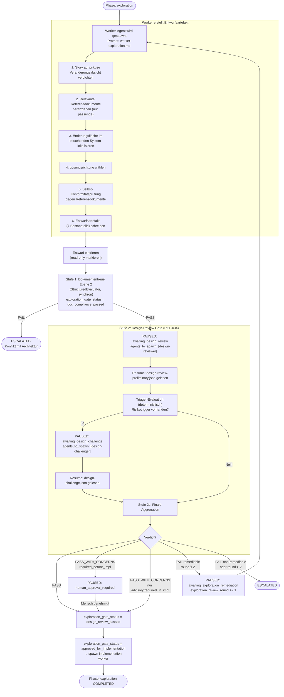

# 23 — Modusermittlung, Exploration und Change-Frame

## 23.1 Zweck

Nicht jede implementierende Story braucht denselben Ablauf. Eine
Story mit detailliertem Architekturkonzept kann direkt implementiert
werden. Eine Story, die nur ein Ziel beschreibt, braucht erst einen
prüffähigen Entwurf, bevor Code geschrieben wird. Die Modus-
Ermittlung entscheidet deterministisch, welcher Fall vorliegt.

Die Exploration-Phase erzeugt diesen Entwurf — das Entwurfsartefakt
(Change-Frame). Es wird gegen bestehende Architektur geprüft
(Dokumententreue Ebene 2), bevor die Implementierung beginnt.

**Geltungsbereich:** Nur implementierende Story-Typen (Implementation,
Bugfix). Konzept- und Research-Stories durchlaufen
weder Modus-Ermittlung noch Exploration-Phase (Kap. 20.2.3).

## 23.2 Modus-Ermittlung

Die technische Umsetzung der 6-Kriterien-Entscheidung ist in
Kap. 22.8 vollständig beschrieben (Code, Entscheidungsregel,
Fehlerbehandlung). Dieses Kapitel fokussiert auf das, was nach
der Entscheidung passiert.

### 23.2.1 Zusammenfassung der Entscheidungsregel

| Ergebnis | Bedingung |
|----------|----------|
| **Execution Mode** | Alle 6 Kriterien stehen auf Execution UND kein VektorDB-Konflikt |
| **Exploration Mode** | Mindestens 1 Kriterium steht auf Exploration ODER fehlendes Feld ODER VektorDB-Konflikt |

**Default:** Exploration Mode (fail-closed).

### 23.2.2 Was nach dem Modus passiert

| Modus | Nächste Phase | Agent |
|-------|-------------|-------|
| Execution | `implementation` direkt | Worker mit `worker-implementation.md` |
| Exploration | `exploration` | Worker mit `worker-exploration.md` |

## 23.3 Exploration-Phase

### 23.3.1 Ablauf

Die Exploration-Phase endet erst, wenn ein dreistufiges Exit-Gate vollständig
bestanden wurde (REF-034). Die Phase ist erst `COMPLETED` wenn
`exploration_gate_status == "approved_for_implementation"`.



### 23.3.2 Feste Schrittfolge des Workers

Der Worker-Exploration-Prompt gibt eine feste Schrittfolge vor
(FK-05-083). Der Worker arbeitet sie sequentiell ab:

| Schritt | Was der Worker tut | Output |
|---------|-------------------|--------|
| 1. Verdichten | Story-Beschreibung auf eine präzise Veränderungsabsicht komprimieren | 1-2 Sätze im Entwurfsartefakt (Ziel und Scope) |
| 2. Referenzdokumente | Passende Architektur-, Strategie-, Konzeptdokumente identifizieren — nicht alles, nur das Relevante | Liste der berücksichtigten Dokumente |
| 3. Änderungsfläche | Im bestehenden System lokalisieren: welche Module, Services, APIs, Tabellen sind betroffen | Betroffene Bausteine im Entwurfsartefakt |
| 4. Lösungsrichtung | Architekturmuster wählen, Verankerungsort bestimmen, begründen warum das die kleinste passende Lösung ist | Lösungsrichtung im Entwurfsartefakt |
| 5. Selbst-Konformität | Eigenen Entwurf gegen die Referenzdokumente abgleichen — wo konform, wo Abweichungen | Konformitätsaussage im Entwurfsartefakt |
| 6. Schreiben | Entwurfsartefakt mit allen 7 Bestandteilen erzeugen | `entwurfsartefakt.json` |

**Wichtig:** Der Worker gleicht den Entwurf bereits selbst gegen
bestehende Architektur ab (Schritt 5). Die nachfolgende
Dokumententreue-Prüfung (Ebene 2) ist damit die **zweite,
unabhängige** Konformitätsprüfung, nicht die erste (FK-05-087).

## 23.4 Entwurfsartefakt (Change-Frame)

### 23.4.1 Sieben Bestandteile (FK-05-075 bis FK-05-082)

```json
{
  "schema_version": "3.0",
  "story_id": "ODIN-042",
  "run_id": "a1b2c3d4-...",
  "created_at": "2026-03-17T10:30:00+01:00",
  "frozen": true,

  "ziel_und_scope": {
    "aendert_sich": "Integration der Broker-API für Echtzeit-Kursdaten",
    "aendert_sich_nicht": "Bestehende REST-API für historische Daten bleibt unverändert"
  },

  "betroffene_bausteine": {
    "betroffen": [
      "trading-engine/broker-client",
      "trading-engine/market-data-service",
      "api-gateway/websocket-endpoint"
    ],
    "unangetastet": [
      "trading-engine/order-management",
      "reporting-service",
      "user-management"
    ]
  },

  "loesungsrichtung": {
    "muster": "Adapter-Pattern für Broker-Anbindung",
    "verankerung": "Neuer BrokerAdapter im trading-engine Modul",
    "begruendung": "Adapter isoliert Broker-Spezifika, bestehende Services bleiben unberührt. Kleinste passende Lösung, weil nur die Datenschnittstelle abstrahiert wird, nicht die gesamte Trading-Logik."
  },

  "vertragsaenderungen": {
    "schnittstellen": [
      "Neuer WebSocket-Endpoint /ws/market-data für Echtzeit-Kurse"
    ],
    "datenmodell": [
      "Neue Entity MarketQuote (symbol, bid, ask, timestamp)"
    ],
    "events": [
      "Neues Domain-Event MarketDataReceived"
    ],
    "externe_integrationen": [
      "Broker-API via REST (Authentifizierung über API-Key)"
    ]
  },

  "konformitaetsaussage": {
    "referenzdokumente": [
      "concepts/api-design-guidelines.md",
      "concepts/trading-architecture.md"
    ],
    "konform": [
      "WebSocket-Endpoint folgt den API-Design-Guidelines (Naming, Versionierung)",
      "Adapter-Pattern ist konsistent mit bestehender Broker-Abstraktion"
    ],
    "abweichungen": [
      "MarketQuote als eigene Entity statt Erweiterung von ExistingPriceData — begründet: unterschiedliche Lifecycle und Granularität"
    ]
  },

  "verifikationsskizze": {
    "unit": "BrokerAdapter-Logik, MarketQuote-Mapping, Event-Erzeugung",
    "integration": "WebSocket-Endpoint gegen Mock-Broker, Persistenz von MarketQuote",
    "e2e": "Vollständiger Flow: Broker liefert Kurs → WebSocket pushed an Client"
  },

  "offene_punkte": {
    "entschieden": [
      "Adapter-Pattern statt direkter Integration",
      "WebSocket statt Polling für Echtzeit-Daten"
    ],
    "annahmen": [
      "Broker-API unterstützt WebSocket-Streaming (noch nicht verifiziert)",
      "Maximale Latenz 500ms für Kursdaten akzeptabel"
    ],
    "freigabe_noetig": [
      "Einführung einer neuen Entity MarketQuote — Architektur-Impact?"
    ]
  }
}
```

### 23.4.2 JSON Schema

Das Schema `entwurfsartefakt.schema.json` validiert:

| Feld | Typ | Pflicht | Validierung |
|------|-----|---------|-------------|
| `schema_version` | String | Ja | `"3.0"` |
| `story_id` | String | Ja | Story-ID-Pattern |
| `run_id` | String | Ja | UUID |
| `created_at` | String | Ja | ISO 8601 |
| `frozen` | Boolean | Ja | Nach Freeze: `true` |
| `ziel_und_scope` | Object | Ja | `aendert_sich` + `aendert_sich_nicht` nicht leer |
| `betroffene_bausteine` | Object | Ja | `betroffen` mind. 1 Eintrag |
| `loesungsrichtung` | Object | Ja | Alle 3 Felder nicht leer |
| `vertragsaenderungen` | Object | Ja | Mind. 1 der 4 Arrays nicht leer (oder explizit "keine") |
| `konformitaetsaussage` | Object | Ja | `referenzdokumente` mind. 1 |
| `verifikationsskizze` | Object | Ja | Mind. 1 Testebene beschrieben |
| `offene_punkte` | Object | Ja | Alle 3 Arrays vorhanden (dürfen leer sein) |

### 23.4.3 Freeze-Mechanismus

Nach Fertigstellung wird das Entwurfsartefakt eingefroren:

1. `frozen: true` im JSON gesetzt
2. Datei wird in `_temp/qa/{story_id}/entwurfsartefakt.json`
   geschrieben
3. Ab hier darf der Worker das Artefakt nicht mehr ändern — der
   QA-Artefakt-Schutz (Sperrdatei + Hook) verhindert
   Schreibzugriffe auf `_temp/qa/`

**Kein technischer Read-Only-Schutz auf Dateisystemebene.** Der
Schutz läuft über den Hook-Mechanismus (Kap. 02.7), nicht über
Dateiberechtigungen.

## 23.5 Exploration Exit-Gate: Drei-Stufen-Modell (REF-034)

Das Ende der Exploration-Phase ist ein dreistufiges Exit-Gate.
`phase-state.json` verfolgt den Fortschritt über das Feld
`exploration_gate_status`:

| Wert | Bedeutung |
|------|-----------|
| `""` (leer) | Gate noch nicht gestartet |
| `"doc_compliance_passed"` | Stufe 1 (Dokumententreue Ebene 2) bestanden |
| `"design_review_passed"` | Stufe 2c Aggregation PASS oder PASS_WITH_CONCERNS |
| `"design_review_failed"` | Stufe 2c FAIL — Remediation läuft |
| `"approved_for_implementation"` | Alle Stufen bestanden — bereit für Implementation |

Zusätzlich verfolgt `exploration_review_round` (Integer) wie viele
Design-Review-Remediation-Runden bereits gelaufen sind.
Maximum: 2 Runden, dann Eskalation an Mensch.

### Trennung Dokumententreue vs. Design-Review

| Dimension | Dokumententreue Ebene 2 (Stufe 1) | Design-Review (Stufe 2a) |
|-----------|-----------------------------------|--------------------------|
| **Kernfrage** | Darf man das so? | Taugt der Plan? |
| **Prüfgegenstände** | Architekturkonformität, Referenzbindungen | Innere Konsistenz, Vollständigkeit, Machbarkeit |
| **Ausführung** | StructuredEvaluator (deterministisch) | LLM-Review-Agent (unabhängig vom Worker) |
| **Ergebnis** | PASS / FAIL (binär) | PASS / PASS_WITH_CONCERNS / FAIL |
| **Bei FAIL** | Eskalation an Mensch | Remediation (max 2 Runden) |
| **Verboten** | Qualitätskritik | Architekturregeln neu erfinden |

### 23.5.1 Stufe 1: Dokumententreue Ebene 2: Entwurfstreue

### 23.5.2 Prüfung (FK-06-057)

Nach dem Freeze prüft der StructuredEvaluator (Kap. 11) die
Entwurfstreue — unabhängig vom Worker, der den Entwurf erstellt hat:

**Frage:** Ist der geplante Lösungsweg mit bestehender Architektur
und Konzepten vereinbar?

```python
evaluator.evaluate(
    role="doc_fidelity",
    prompt_template=Path("prompts/doc-fidelity-design.md"),
    context={
        "entwurfsartefakt": entwurf_json,
        "referenzdokumente": lade_referenzdokumente(entwurf),
        "story_description": context.story_description,
    },
    expected_checks=["design_fidelity"],
    story_id=context.story_id,
    run_id=context.run_id,
)
```

### 23.5.2 Referenzdokument-Identifikation

Die Referenzdokumente werden aus zwei Quellen ermittelt:

1. **Vom Worker deklariert:** Das Entwurfsartefakt enthält
   `konformitaetsaussage.referenzdokumente` — die Dokumente, die
   der Worker selbst berücksichtigt hat.
2. **Vom System ergänzt:** Der Manifest-Index (Kap. 01 P6)
   identifiziert zusätzliche relevante Dokumente basierend auf
   den betroffenen Modulen und dem Story-Typ. Damit werden
   Dokumente einbezogen, die der Worker möglicherweise übersehen hat.

Beide Listen werden dem LLM als Kontext-Bundle übergeben
(Kap. 11, `arch_references`).

### 23.5.3 Ergebnis

| Status | Bedeutung | Reaktion |
|--------|-----------|---------|
| PASS | Entwurf ist konform mit bestehender Architektur | Prüfe `offene_punkte.freigabe_noetig` (siehe unten), dann weiter zu Implementation |
| PASS_WITH_CONCERNS | Entwurf ist grundsätzlich konform, aber es gibt Hinweise | Wie PASS, Concerns werden an Worker weitergegeben |
| FAIL | Entwurf kollidiert mit bestehender Architektur | Eskalation an Mensch. Pipeline pausiert. |

**Gate für freigabepflichtige Entscheidungen:**

Wenn das Entwurfsartefakt `offene_punkte.freigabe_noetig` mit
nicht-leerer Liste enthält, **pausiert die Pipeline** auch bei
Dokumententreue PASS. Der Mensch muss die offenen Punkte
freigeben (z.B. "Einführung einer neuen Entity — akzeptabel?"),
bevor die Implementation beginnen darf.

Phase-State: `status: PAUSED`, `pause_reason: "human_approval_required"`.
Resume: `agentkit resume --story {id}` nach menschlicher Prüfung.

**Bei FAIL:** Der Phase-State wird auf `status: ESCALATED` gesetzt.
Der Mensch muss den Konflikt klären — z.B. das Konzept anpassen,
die Architektur-Leitplanken lockern, oder die Story verwerfen.
Erst nach menschlicher Intervention kann die Story erneut in die
Pipeline eingespeist werden.

## 23.6 Übergang zur Implementation

### 23.6.1 Bei Exploration Mode (REF-034)

Nach bestandenem vollständigem Exit-Gate
(`exploration_gate_status = "approved_for_implementation"`):

1. Phase-State: `phase: exploration, status: COMPLETED`,
   `exploration_gate_status: "approved_for_implementation"`
2. Phase Runner setzt `agents_to_spawn` auf Worker-Implementation
3. `agents_to_spawn` enthält auch:
   - `required_acceptance_criteria`: Aus `required_in_impl`-Concerns
     des Design-Reviews — verbindliche Akzeptanzkriterien
   - `advisory_context`: Aus `advisory`-Concerns — Kontext ohne Pflicht
4. Orchestrator spawnt Worker mit `worker-implementation.md`
5. Worker hat Zugriff auf:
   - Das eingefrorene Entwurfsartefakt als verbindliche Vorgabe
   - `design-review.json` mit Review- und Challenge-Befunden

**Neu gegenüber früherem Zustand:**
- Die Exploration endet erst nach erfolgreichem Design-Review-Gate
- `STRUCTURAL_ONLY_PASS` wurde entfernt — Verify läuft nach Implementation
  immer mit der vollen 4-Schichten-Pipeline (auch für exploration-mode Stories)
- `design-review.json` ist ein Pflichtartefakt für Exploration-Mode-Stories

Der Worker darf vom Entwurf abweichen, aber nur mit expliziter
Markierung und Begründung (FK-05-101). Wenn die Abweichung
neue Strukturen einführt oder den Impact-Level überschreitet,
muss die Dokumententreue-Prüfung erneut ausgelöst werden
(FK-05-102).

### 23.6.2 Bei Execution Mode

Keine Exploration-Phase. Der Worker startet direkt mit
`worker-implementation.md`. Die Dokumententreue wird als
Umsetzungstreue (Ebene 3) nach der Implementierung in der
Verify-Phase geprüft (FK-06-058).

## 23.7 Drift-Erkennung während Implementation

### 23.7.1 Drift-Prüfung pro Inkrement (FK-05-100 bis FK-05-103)

Der Worker prüft bei jedem Inkrement, ob er vom genehmigten
Entwurf abweicht:

| Drift-Art | Erkennung | Reaktion |
|-----------|-----------|---------|
| Neue Strukturen (APIs, Datenmodelle) nicht im Entwurf | Worker erkennt selbst | **Erneute Dokumententreue-Prüfung** muss ausgelöst werden, bevor der Worker weiterarbeiten darf |
| Deklarierter Impact-Level überschritten | Worker erkennt selbst | **Erneute Dokumententreue-Prüfung** |
| Anderes Pattern gewählt als im Entwurf | Worker erkennt selbst | Dokumentation der Abweichung im Handover-Paket reicht |
| Detailentscheidung anders als im Entwurf | Worker erkennt selbst | Dokumentation im Handover-Paket reicht |

### 23.7.2 Telemetrie

Jede Drift-Prüfung erzeugt ein Telemetrie-Event in der SQLite-DB:

| event_type | payload |
|-----------|---------|
| `drift_check` | `{"result": "ok"}` |
| `drift_check` | `{"result": "drift", "drift_type": "new_structure", "description": "Neue Entity MarketQuoteHistory nicht im Entwurf"}` |

### 23.7.3 Erneute Dokumententreue-Prüfung bei signifikantem Drift

Wenn der Worker signifikanten Drift erkennt (neue Strukturen oder
Impact-Überschreitung):

1. Worker markiert den Drift im Handover-Paket
2. Worker meldet Drift an den Orchestrator
3. Orchestrator ruft `agentkit run-phase exploration --story {id}`
   erneut auf — **ohne** das Entwurfsartefakt neu zu erzeugen,
   nur die Dokumententreue-Prüfung wird wiederholt
4. Bei PASS: Worker darf weiterarbeiten
5. Bei FAIL: Eskalation an Mensch

## 23.8 Impact-Violation-Check in der Verify-Phase

### 23.8.1 Mechanismus (FK-06-064 bis FK-06-068)

In der Verify-Phase (Schicht 1, als Structural Check) wird der
tatsächliche Impact gegen den deklarierten Impact verglichen:

```python
def check_impact_violation(context: StoryContext, git: GitOperations) -> StructuralCheck:
    declared_impact = context.change_impact  # aus context.json

    # Tatsächlichen Impact aus Diff ableiten
    changed_files = git.diff_stat(context.base_ref)
    changed_modules = extract_modules(changed_files)
    new_apis = detect_new_endpoints(changed_files)
    schema_changes = detect_schema_changes(changed_files)

    actual_impact = classify_impact(
        module_count=len(changed_modules),
        has_new_apis=bool(new_apis),
        has_schema_changes=bool(schema_changes),
    )

    if impact_exceeds(actual_impact, declared_impact):
        return StructuralCheck(
            id="impact.violation",
            status="FAIL",
            severity="BLOCKING",
            detail=f"Declared: {declared_impact}, Actual: {actual_impact}",
        )
    return StructuralCheck(id="impact.violation", status="PASS", ...)
```

### 23.8.2 Impact-Klassifikation

| Tatsächlicher Impact | Bedingung |
|---------------------|----------|
| Lokal | 1 Modul geändert, keine neuen APIs, keine Schema-Änderungen |
| Komponente | 1 Modul geändert, neue APIs oder Schema-Änderungen |
| Komponentenübergreifend | Mehrere Module geändert |
| Architekturwirksam | Neue externe Integrationen, neue Services, grundlegende Strukturänderungen |

### 23.8.3 Reaktion bei Violation

| Story-Modus | Reaktion | FK-Referenz |
|-------------|---------|-------------|
| Exploration Mode | Story geht zurück in Exploration-Phase (Entwurf nicht eingehalten) | FK-06-067 |
| Execution Mode | Eskalation an Mensch (Issue-Metadaten waren falsch deklariert) | FK-06-068 |

---

*FK-Referenzen: FK-05-040 (Modus-Ermittlung),
FK-05-074 bis FK-05-091 (Exploration-Phase komplett),
FK-05-100 bis FK-05-103 (Drift-Prüfung),
FK-06-040 bis FK-06-055 (Execution/Exploration Mode, Kriterienkatalog),
FK-06-057 (Entwurfstreue),
FK-06-064 bis FK-06-068 (Impact-Violation-Check),
FK-06-069/070 (Konzept-Überschreibungsschutz)*
