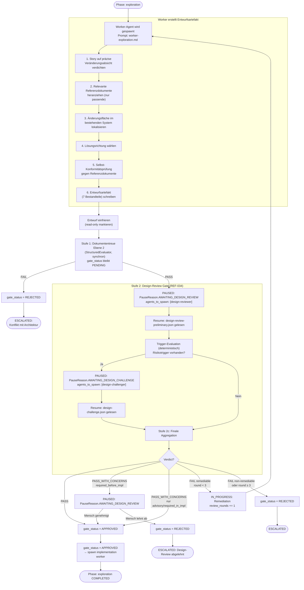

# 23 — Modusermittlung, Exploration und Change-Frame

## 23.1 Zweck

Nicht jede implementierende Story braucht denselben Ablauf. Eine
Story mit detailliertem Architekturkonzept kann direkt implementiert
werden. Eine Story, die nur ein Ziel beschreibt, braucht erst einen
prüffähigen Entwurf, bevor Code geschrieben wird. Die Modus-
Ermittlung entscheidet deterministisch, welcher Fall vorliegt.

Die Exploration-Phase erzeugt diesen Entwurf — das Entwurfsartefakt
(Change-Frame). Es wird gegen bestehende Architektur geprüft
(Dokumententreue Ebene 2), bevor die Implementierung beginnt.

**Geltungsbereich:** Nur implementierende Story-Typen (Implementation,
Bugfix). Konzept- und Research-Stories durchlaufen
weder Modus-Ermittlung noch Exploration-Phase (Kap. 20.2.3).

## 23.2 Modus-Ermittlung

Die technische Umsetzung der 6-Kriterien-Entscheidung ist in
Kap. 22.8 vollständig beschrieben (Code, Entscheidungsregel,
Fehlerbehandlung). Dieses Kapitel fokussiert auf das, was nach
der Entscheidung passiert.

### 23.2.1 Zusammenfassung der Entscheidungsregel

| Ergebnis | Bedingung |
|----------|----------|
| **Execution Mode** | Alle 6 Kriterien stehen auf Execution UND kein VektorDB-Konflikt |
| **Exploration Mode** | Mindestens 1 Kriterium steht auf Exploration ODER fehlendes Feld ODER VektorDB-Konflikt |

**Default:** Exploration Mode (fail-closed).

### 23.2.2 Was nach dem Modus passiert

| Modus | Nächste Phase | Agent |
|-------|-------------|-------|
| Execution | `implementation` direkt | Worker mit `worker-implementation.md` |
| Exploration | `exploration` | Worker mit `worker-exploration.md` |

## 23.3 Exploration-Phase

### 23.3.1 Ablauf

Die Exploration-Phase endet erst, wenn ein dreistufiges Exit-Gate vollständig
bestanden wurde (REF-034). Die Phase ist erst `COMPLETED` wenn
`ExplorationPayload.gate_status == ExplorationGateStatus.APPROVED`.
[Entscheidung 2026-04-09] Gate-Status verwendet `ExplorationGateStatus` StrEnum statt String-Literale.



[Hinweis 2026-04-09] Korrekturen im Mermaid-Diagramm gegenüber Vorgängerversion:
- Gate-Status-Werte verwenden `ExplorationGateStatus` StrEnum (`PENDING`, `APPROVED`, `REJECTED`) statt String-Literale (`doc_compliance_passed`, `design_review_passed`, `approved_for_implementation`).
- `human_approval_required` ersetzt durch `PauseReason.AWAITING_DESIGN_REVIEW` — Mensch muss Exploration-Ergebnis freigeben.
- `awaiting_exploration_remediation` war fälschlich als PAUSED modelliert. Remediation ist ein aktiver Zustand (`IN_PROGRESS`), kein Pause-Zustand. Korrigiert zu `IN_PROGRESS: Remediation`.
- Remediation-Rundenlimit von 2 auf 3 angehoben (`ExplorationPhaseMemory.review_rounds`, max 3).

[Korrektur 2026-04-09: gate_status = REJECTED wird vor ESCALATED-Transition gesetzt — konsistent mit Contract-Definition in §23.5.0.]

[Korrektur 2026-04-09] Off-by-one im Remediation-Limit: Die Bedingung `round ≤ 3` / `round > 3`
war fehlerhaft — bei `review_rounds == 3` (bereits 3 Runden gelaufen) haette `≤ 3` eine vierte
Remediation-Runde erlaubt, was "max 3 Runden" widerspricht. Korrigiert zu `round < 3` (erlaubt
Remediation bei 0, 1, 2 gelaufenen Runden — nach Inkrement also max Runde 3) und `round ≥ 3`
(Eskalation ab 3 gelaufenen Runden). Semantik: `review_rounds` wird VOR der Pruefung gelesen;
der Inkrement `+= 1` erfolgt erst im Remediation-Pfad. Damit sind exakt 3 Remediation-Runden moeglich.

[Hinweis 2026-04-09] Feldpfade im Mermaid-Diagramm: Die Kurzform `gate_status` im Diagramm
referenziert den kanonischen Feldpfad `ExplorationPayload.gate_status` (Typ: `ExplorationGateStatus`
StrEnum). Der alte v2-Name `exploration_gate_status` ist obsolet und darf nicht mehr verwendet werden.

[Korrektur 2026-04-09] Gate-Zustandslogik im Mermaid-Diagramm: Stufe 1 (Dokumententreue Ebene 2)
setzt `payload.gate_status` **nicht** auf `APPROVED`. Der Status bleibt `PENDING`, solange das
dreistufige Gate nicht vollständig bestanden ist. Die korrekte Semantik:
- `PENDING` = Gate noch nicht vollständig abgeschlossen (auch wenn Stufe 1 und/oder Stufe 2 bereits bestanden)
- `APPROVED` = Vollständiges Gate bestanden (alle Stufen OK, ggf. menschliche Freigabe erhalten)
- `REJECTED` = Gate endgültig abgelehnt — tritt ein bei: (a) Stufe-1-FAIL (Architekturkonflikt), (b) Stufe-2c FAIL non-remediable, (c) Rundenlimit erreicht (review_rounds ≥ 3), (d) menschliche Ablehnung im HUMAN-Knoten
Der Wechsel zu `APPROVED` erfolgt erst am Knoten `GATE_PASS` bzw. `APPROVED` im Diagramm — also nach vollständigem Durchlauf aller Stufen.

[Korrektur 2026-04-09: design_rejected-Pfad aus HUMAN-Knoten ergänzt — PauseReason.AWAITING_DESIGN_REVIEW hat zwei Resume-Trigger: design_approved und design_rejected.]

### 23.3.2 Feste Schrittfolge des Workers

Der Worker-Exploration-Prompt gibt eine feste Schrittfolge vor
(FK-05-083). Der Worker arbeitet sie sequentiell ab:

| Schritt | Was der Worker tut | Output |
|---------|-------------------|--------|
| 1. Verdichten | Story-Beschreibung auf eine präzise Veränderungsabsicht komprimieren | 1-2 Sätze im Entwurfsartefakt (Ziel und Scope) |
| 2. Referenzdokumente | Passende Architektur-, Strategie-, Konzeptdokumente identifizieren — nicht alles, nur das Relevante | Liste der berücksichtigten Dokumente |
| 3. Änderungsfläche | Im bestehenden System lokalisieren: welche Module, Services, APIs, Tabellen sind betroffen | Betroffene Bausteine im Entwurfsartefakt |
| 4. Lösungsrichtung | Architekturmuster wählen, Verankerungsort bestimmen, begründen warum das die kleinste passende Lösung ist | Lösungsrichtung im Entwurfsartefakt |
| 5. Selbst-Konformität | Eigenen Entwurf gegen die Referenzdokumente abgleichen — wo konform, wo Abweichungen | Konformitätsaussage im Entwurfsartefakt |
| 6. Schreiben | Entwurfsartefakt mit allen 7 Bestandteilen erzeugen | `entwurfsartefakt.json` |

**Wichtig:** Der Worker gleicht den Entwurf bereits selbst gegen
bestehende Architektur ab (Schritt 5). Die nachfolgende
Dokumententreue-Prüfung (Ebene 2) ist damit die **zweite,
unabhängige** Konformitätsprüfung, nicht die erste (FK-05-087).

## 23.4 Entwurfsartefakt (Change-Frame)

### 23.4.1 Sieben Bestandteile (FK-05-075 bis FK-05-082)

```json
{
  "schema_version": "3.0",
  "story_id": "ODIN-042",
  "run_id": "a1b2c3d4-...",
  "created_at": "2026-03-17T10:30:00+01:00",
  "frozen": true,

  "ziel_und_scope": {
    "aendert_sich": "Integration der Broker-API für Echtzeit-Kursdaten",
    "aendert_sich_nicht": "Bestehende REST-API für historische Daten bleibt unverändert"
  },

  "betroffene_bausteine": {
    "betroffen": [
      "trading-engine/broker-client",
      "trading-engine/market-data-service",
      "api-gateway/websocket-endpoint"
    ],
    "unangetastet": [
      "trading-engine/order-management",
      "reporting-service",
      "user-management"
    ]
  },

  "loesungsrichtung": {
    "muster": "Adapter-Pattern für Broker-Anbindung",
    "verankerung": "Neuer BrokerAdapter im trading-engine Modul",
    "begruendung": "Adapter isoliert Broker-Spezifika, bestehende Services bleiben unberührt. Kleinste passende Lösung, weil nur die Datenschnittstelle abstrahiert wird, nicht die gesamte Trading-Logik."
  },

  "vertragsaenderungen": {
    "schnittstellen": [
      "Neuer WebSocket-Endpoint /ws/market-data für Echtzeit-Kurse"
    ],
    "datenmodell": [
      "Neue Entity MarketQuote (symbol, bid, ask, timestamp)"
    ],
    "events": [
      "Neues Domain-Event MarketDataReceived"
    ],
    "externe_integrationen": [
      "Broker-API via REST (Authentifizierung über API-Key)"
    ]
  },

  "konformitaetsaussage": {
    "referenzdokumente": [
      "concepts/api-design-guidelines.md",
      "concepts/trading-architecture.md"
    ],
    "konform": [
      "WebSocket-Endpoint folgt den API-Design-Guidelines (Naming, Versionierung)",
      "Adapter-Pattern ist konsistent mit bestehender Broker-Abstraktion"
    ],
    "abweichungen": [
      "MarketQuote als eigene Entity statt Erweiterung von ExistingPriceData — begründet: unterschiedliche Lifecycle und Granularität"
    ]
  },

  "verifikationsskizze": {
    "unit": "BrokerAdapter-Logik, MarketQuote-Mapping, Event-Erzeugung",
    "integration": "WebSocket-Endpoint gegen Mock-Broker, Persistenz von MarketQuote",
    "e2e": "Vollständiger Flow: Broker liefert Kurs → WebSocket pushed an Client"
  },

  "offene_punkte": {
    "entschieden": [
      "Adapter-Pattern statt direkter Integration",
      "WebSocket statt Polling für Echtzeit-Daten"
    ],
    "annahmen": [
      "Broker-API unterstützt WebSocket-Streaming (noch nicht verifiziert)",
      "Maximale Latenz 500ms für Kursdaten akzeptabel"
    ],
    "freigabe_noetig": [
      "Einführung einer neuen Entity MarketQuote — Architektur-Impact?"
    ]
  }
}
```

### 23.4.2 JSON Schema

Das Schema `entwurfsartefakt.schema.json` validiert:

| Feld | Typ | Pflicht | Validierung |
|------|-----|---------|-------------|
| `schema_version` | String | Ja | `"3.0"` |
| `story_id` | String | Ja | Story-ID-Pattern |
| `run_id` | String | Ja | UUID |
| `created_at` | String | Ja | ISO 8601 |
| `frozen` | Boolean | Ja | Nach Freeze: `true` |
| `ziel_und_scope` | Object | Ja | `aendert_sich` + `aendert_sich_nicht` nicht leer |
| `betroffene_bausteine` | Object | Ja | `betroffen` mind. 1 Eintrag |
| `loesungsrichtung` | Object | Ja | Alle 3 Felder nicht leer |
| `vertragsaenderungen` | Object | Ja | Mind. 1 der 4 Arrays nicht leer (oder explizit "keine") |
| `konformitaetsaussage` | Object | Ja | `referenzdokumente` mind. 1 |
| `verifikationsskizze` | Object | Ja | Mind. 1 Testebene beschrieben |
| `offene_punkte` | Object | Ja | Alle 3 Arrays vorhanden (dürfen leer sein) |

### 23.4.3 Freeze-Mechanismus

Nach Fertigstellung wird das Entwurfsartefakt eingefroren:

1. `frozen: true` im JSON gesetzt
2. Datei wird in `_temp/qa/{story_id}/entwurfsartefakt.json`
   geschrieben
3. Ab hier darf der Worker das Artefakt nicht mehr ändern — der
   QA-Artefakt-Schutz (Sperrdatei + Hook) verhindert
   Schreibzugriffe auf `_temp/qa/`

**Kein technischer Read-Only-Schutz auf Dateisystemebene.** Der
Schutz läuft über den Hook-Mechanismus (Kap. 02.7), nicht über
Dateiberechtigungen.

## 23.5 Exploration Exit-Gate: Drei-Stufen-Modell (REF-034)

> **[Entscheidung 2026-04-09]** Das Feld `gate_status` (Typ: `ExplorationGateStatus`) auf `ExplorationPayload` (diskriminierte Union, §20.3) ersetzt den v2-String `exploration_gate_status`. `ExplorationGateStatus` ist ein StrEnum: `PENDING | APPROVED | REJECTED`. Hat Transition-Relevanz: Guards prüfen `gate_status == APPROVED` für den Eintritt in die Implementation-Phase. `design_artifact_path` kommt nicht in ExplorationPayload (ableitbar aus Story-Verzeichniskonvention). Verweis auf Designwizard R1+R2 vom 2026-04-09.

### 23.5.0 ExplorationPayload — durable Contract Fields

`ExplorationPayload` ist die phasenspezifische Payload für die Exploration-Phase (diskriminierte Union, §20.3):

```python
class ExplorationGateStatus(StrEnum):
    PENDING = "pending"      # Gate noch nicht vollständig bestanden
    APPROVED = "approved"    # Alle Stufen bestanden — bereit für Implementation
    REJECTED = "rejected"    # Gate endgültig abgelehnt (Eskalation)

class ExplorationPayload(BaseModel):
    phase_type: Literal["exploration"]
    gate_status: ExplorationGateStatus = ExplorationGateStatus.PENDING
```

`gate_status` hat Transition-Relevanz: `can_enter_phase("implementation")` prüft `gate_status == APPROVED`. Ohne `APPROVED` wird die Implementation-Phase nicht betreten (Defense-in-Depth, §20.4.2a).

**Nicht in ExplorationPayload:** `design_artifact_path` — ableitbar aus der Story-Verzeichniskonvention (`_temp/qa/{story_id}/entwurfsartefakt.json`), kein orchestrierungsvertragliches Feld.

**Granulare Gate-Stufen:** Die v2-Werte `doc_compliance_passed`, `design_review_passed`, `design_review_failed` werden nicht auf einzelne StrEnum-Werte abgebildet. Die Zwischenzustände während des Gate-Durchlaufs sind Implementierungsdetail des Phase Handlers, nicht Teil des persistierten Contracts. Der Contract kennt nur das Endergebnis: `PENDING | APPROVED | REJECTED`.

Das Ende der Exploration-Phase ist ein dreistufiges Exit-Gate.
`ExplorationPayload.gate_status` (Typ: `ExplorationGateStatus` StrEnum)
verfolgt den Fortschritt im `phase-state.json`:

| Wert | Bedeutung |
|------|-----------|
| `ExplorationGateStatus.PENDING` | Gate noch nicht gestartet oder Zwischenstufe (Stufe 1 bestanden, Design-Review läuft) |
| `ExplorationGateStatus.APPROVED` | Alle Stufen bestanden — bereit für Implementation |
| `ExplorationGateStatus.REJECTED` | Gate endgültig abgelehnt — tritt ein bei: (a) Stufe-1-FAIL (Architekturkonflikt), (b) Stufe-2c FAIL non-remediable, (c) Rundenlimit erreicht (`review_rounds ≥ 3`), (d) menschliche Ablehnung im HUMAN-Knoten — Eskalation. [Korrektur 2026-04-09: Stufe-1-FAIL und menschliche Ablehnung ergänzt] |

[Entscheidung 2026-04-09] Die bisherigen String-Literale (`doc_compliance_passed`,
`design_review_passed`, `design_review_failed`, `approved_for_implementation`) sind
durch das `ExplorationGateStatus` StrEnum mit genau 3 Werten ersetzt. Zwischenstände
(z.B. "Stufe 1 bestanden, Stufe 2 steht aus") werden durch `PENDING` abgebildet, da
sie keine eigenständige Gate-Entscheidung darstellen. Die Detailinformation, welche
Stufe zuletzt bestanden wurde, ergibt sich aus den vorhandenen QA-Artefakten
(`doc-fidelity.json`, `design-review.json`).

Die Anzahl gelaufener Design-Review-Remediation-Runden wird in
`ExplorationPhaseMemory.review_rounds` (Integer) in der PhaseMemory-Schicht
verfolgt — nicht mehr im Phase-State selbst.
Maximum: 3 Runden, dann Eskalation an Mensch.

> **[Entscheidung 2026-04-09]** `exploration_review_round` aus v2 ist kein Artefakt, sondern wird als `PhaseMemory.exploration.review_rounds` in die neue PhaseMemory-Schicht überführt (max 3 Remediation-Runden). Die Engine verwaltet diesen Zähler als Carry-Forward analog zu `phase_memory.verify.feedback_rounds`. Siehe FK-20 §20.3.7.

### Trennung Dokumententreue vs. Design-Review

| Dimension | Dokumententreue Ebene 2 (Stufe 1) | Design-Review (Stufe 2a) |
|-----------|-----------------------------------|--------------------------|
| **Kernfrage** | Darf man das so? | Taugt der Plan? |
| **Prüfgegenstände** | Architekturkonformität, Referenzbindungen | Innere Konsistenz, Vollständigkeit, Machbarkeit |
| **Ausführung** | StructuredEvaluator (deterministisch) | LLM-Review-Agent (unabhängig vom Worker) |
| **Ergebnis** | PASS / FAIL (binär) | PASS / PASS_WITH_CONCERNS / FAIL |
| **Bei FAIL** | Eskalation an Mensch (`gate_status = REJECTED` → ESCALATED) | Remediation wenn remediable und `round < 3` (max 3 Runden, `ExplorationPhaseMemory.review_rounds`); bei non-remediable oder `round ≥ 3`: `gate_status = REJECTED` → ESCALATED [Entscheidung 2026-04-09] |
| **Verboten** | Qualitätskritik | Architekturregeln neu erfinden |

### 23.5.1 Stufe 1: Dokumententreue Ebene 2: Entwurfstreue

### 23.5.2 Prüfung (FK-06-057)

Nach dem Freeze prüft der StructuredEvaluator (Kap. 11) die
Entwurfstreue — unabhängig vom Worker, der den Entwurf erstellt hat:

**Frage:** Ist der geplante Lösungsweg mit bestehender Architektur
und Konzepten vereinbar?

```python
evaluator.evaluate(
    role="doc_fidelity",
    prompt_template=Path("prompts/doc-fidelity-design.md"),
    context={
        "entwurfsartefakt": entwurf_json,
        "referenzdokumente": lade_referenzdokumente(entwurf),
        "story_description": context.story_description,
    },
    expected_checks=["design_fidelity"],
    story_id=context.story_id,
    run_id=context.run_id,
)
```

### 23.5.2a Referenzdokument-Identifikation

Die Referenzdokumente werden aus zwei Quellen ermittelt:

1. **Vom Worker deklariert:** Das Entwurfsartefakt enthält
   `konformitaetsaussage.referenzdokumente` — die Dokumente, die
   der Worker selbst berücksichtigt hat.
2. **Vom System ergänzt:** Der Manifest-Index (Kap. 01 P6)
   identifiziert zusätzliche relevante Dokumente basierend auf
   den betroffenen Modulen und dem Story-Typ. Damit werden
   Dokumente einbezogen, die der Worker möglicherweise übersehen hat.

Beide Listen werden dem LLM als Kontext-Bundle übergeben
(Kap. 11, `arch_references`).

### 23.5.3 Ergebnis

[Korrektur 2026-04-09] Tabelle korrigiert: `PASS_WITH_CONCERNS` entfernt (gehört zu
Stufe 2, nicht zu Stufe 1 — Stufe 1 ist der StructuredEvaluator, der binär urteilt,
vgl. Trenntabelle in §23.5). Reaktion bei PASS korrigiert: nach Stufe 1 folgt
Stufe 2 (Design-Review-Gate), nicht direkt die Implementation. Beschreibung des
`freigabe_noetig`-Blocks präzisiert bezüglich Zusammenspiel mit Stufe 2.

| Status | Bedeutung | Reaktion |
|--------|-----------|---------|
| PASS | Entwurf ist konform mit bestehender Architektur | Weiter zu Stufe 2: Design-Review-Gate |
| FAIL | Entwurf kollidiert mit bestehender Architektur | Eskalation an Mensch (`status: ESCALATED`) |

**Gate für freigabepflichtige Entscheidungen:**

Wenn das Entwurfsartefakt `offene_punkte.freigabe_noetig` eine
nicht-leere Liste enthält, wird dies **nach Stufe 1 PASS erkannt**,
aber die Pipeline pausiert **nicht** sofort. Stufe 2 (Design-Review-Gate)
läuft trotzdem vollständig durch — das Design-Review kann die
freigabepflichtigen Punkte in seine Bewertung einbeziehen.

Die Pause tritt ein, wenn das dreistufige Gate insgesamt zu einem
Zustand führt, der menschliche Freigabe erfordert:
- Stufe 2 ergibt `PASS_WITH_CONCERNS` mit `required_before_impl`-Concerns, oder
- `offene_punkte.freigabe_noetig` enthält Punkte, die weder durch das
  Design-Review aufgelöst noch als unbedenklich eingestuft wurden.

In beiden Fällen: Phase-State `status: PAUSED`,
`pause_reason: PauseReason.AWAITING_DESIGN_REVIEW` (Python-Code) bzw. `"awaiting_design_review"` (Wire-Format in phase-state.json — lowercase serialisierter StrEnum-Wert).
Resume: `agentkit resume --story {id}` nach menschlicher Prüfung.
[Entscheidung 2026-04-09] `human_approval_required` ersetzt durch `PauseReason.AWAITING_DESIGN_REVIEW` (StrEnum). Der Mensch muss das Exploration-Ergebnis freigeben.

> **[Entscheidung 2026-04-08, ausgearbeitet 2026-04-09]** Element 20 — `pause_reason` wird in v3 durch `PauseReason` StrEnum ersetzt. Typisierte Resume-Handler statt String-basierter Reason. Detailkonzept ausgearbeitet (FK-20 §20.6.2a, 2026-04-09): PauseReason hat genau 3 Werte (AWAITING_DESIGN_REVIEW, AWAITING_DESIGN_CHALLENGE, GOVERNANCE_INCIDENT). Exploration-spezifische Werte und Resume-Trigger folgen unmittelbar unten.
> Siehe `stories/entscheidung-v2-ballast-bewertung.md`, Element 20.

> **[Entscheidung 2026-04-09]** Für die Exploration-Phase gelten die PauseReason-Werte `PauseReason.AWAITING_DESIGN_REVIEW` und `PauseReason.AWAITING_DESIGN_CHALLENGE`. `AWAITING_DESIGN_REVIEW` wird in zwei Kontexten verwendet: (1) **Agent-basiert** (PAUSED_DR im Diagramm): Pipeline wartet auf Abschluss des Design-Review-Agents; Resume erfolgt systemgesteuert wenn `design-review-preliminary.json` verfügbar ist — kein manueller Trigger. (2) **Mensch-basiert** (HUMAN-Knoten): Pipeline wartet auf menschliche Freigabe; Resume-Trigger: `design_approved` (→ GATE_PASS) oder `design_rejected` (→ REJECTED → ESCALATED). `AWAITING_DESIGN_CHALLENGE`: Resume-Trigger `challenge_resolved`. Kein eigener Pause-Wert für `human_approval_required` — dieser Fall wird über `AWAITING_DESIGN_REVIEW` (Kontext 2) abgedeckt. Verweis auf Designwizard R1+R2 vom 2026-04-09.

**Bei FAIL:** Der Phase-State wird auf `status: ESCALATED` gesetzt.
Der Mensch muss den Konflikt klären — z.B. das Konzept anpassen,
die Architektur-Leitplanken lockern, oder die Story verwerfen.
Erst nach menschlicher Intervention kann die Story erneut in die
Pipeline eingespeist werden.

## 23.6 Übergang zur Implementation

### 23.6.1 Bei Exploration Mode (REF-034)

Nach bestandenem vollständigem Exit-Gate
(`payload.gate_status == ExplorationGateStatus.APPROVED`):
[Entscheidung 2026-04-09] Gate-Status verwendet `ExplorationPayload.gate_status` (`ExplorationGateStatus` StrEnum).

1. Phase-State: `phase: exploration, status: COMPLETED`,
   `payload.gate_status: ExplorationGateStatus.APPROVED`
2. Phase Runner setzt `agents_to_spawn` auf Worker-Implementation
3. `agents_to_spawn` enthält auch:
   - `required_acceptance_criteria`: Aus `required_in_impl`-Concerns
     des Design-Reviews — verbindliche Akzeptanzkriterien
   - `advisory_context`: Aus `advisory`-Concerns — Kontext ohne Pflicht
4. Orchestrator spawnt Worker mit `worker-implementation.md`
5. Worker hat Zugriff auf:
   - Das eingefrorene Entwurfsartefakt als verbindliche Vorgabe
   - `design-review.json` mit Review- und Challenge-Befunden

**Neu gegenüber früherem Zustand:**
- Die Exploration endet erst nach erfolgreichem Design-Review-Gate
- `STRUCTURAL_ONLY_PASS` wurde entfernt — Verify läuft nach Implementation
  immer mit der vollen 4-Schichten-Pipeline (auch für exploration-mode Stories)
- `design-review.json` ist ein Pflichtartefakt für Exploration-Mode-Stories

Der Worker darf vom Entwurf abweichen, aber nur mit expliziter
Markierung und Begründung (FK-05-101). Wenn die Abweichung
neue Strukturen einführt oder den Impact-Level überschreitet,
muss der Worker die Implementierung korrigieren (Selbstkorrektur)
oder `status: BLOCKED` melden (-> `status: ESCALATED`). Eine erneute
Dokumententreue-Prüfung aus der Implementation heraus findet nicht
statt (siehe §23.7.3). [Korrektur 2026-04-09]

### 23.6.2 Bei Execution Mode

Keine Exploration-Phase. Der Worker startet direkt mit
`worker-implementation.md`. Die Dokumententreue wird als
Umsetzungstreue (Ebene 3) nach der Implementierung in der
Verify-Phase geprüft (FK-06-058).

## 23.7 Drift-Erkennung während Implementation

### 23.7.1 Drift-Prüfung pro Inkrement (FK-05-100 bis FK-05-103)

Der Worker prüft bei jedem Inkrement, ob er vom genehmigten
Entwurf abweicht:

| Drift-Art | Erkennung | Reaktion |
|-----------|-----------|---------|
| Neue Strukturen (APIs, Datenmodelle) nicht im Entwurf | Worker erkennt selbst | **Signifikanter Drift**: Worker muss Implementierung korrigieren (Selbstkorrektur) oder BLOCKED melden [Entscheidung 2026-04-09] |
| Deklarierter Impact-Level überschritten | Worker erkennt selbst | **Signifikanter Drift**: Worker muss Implementierung korrigieren (Selbstkorrektur) oder BLOCKED melden [Entscheidung 2026-04-09] |
| Anderes Pattern gewählt als im Entwurf | Worker erkennt selbst | Normale Drift: Dokumentation der Abweichung im Handover-Paket reicht |
| Detailentscheidung anders als im Entwurf | Worker erkennt selbst | Normale Drift: Dokumentation im Handover-Paket reicht |

### 23.7.2 Telemetrie

Jede Drift-Prüfung erzeugt ein Telemetrie-Event in der SQLite-DB:

| event_type | payload |
|-----------|---------|
| `drift_check` | `{"result": "ok"}` |
| `drift_check` | `{"result": "drift", "drift_type": "new_structure", "description": "Neue Entity MarketQuoteHistory nicht im Entwurf"}` |

### 23.7.3 Reaktion bei signifikantem Drift [Entscheidung 2026-04-09]

Wenn der Worker während der Implementierung signifikanten Drift
erkennt (neue Strukturen oder Impact-Überschreitung), hat er genau
zwei Handlungsoptionen. Ein automatischer Rücksprung von der
Implementation in die Exploration-Phase findet **nicht** statt —
weder durch den Worker noch durch den Orchestrator.

**Option A — Selbstkorrektur:**

1. Worker erkennt, dass die Implementierung vom genehmigten
   Exploration-Design oder den Fach-/IT-Konzepten abweicht
2. Worker korrigiert die Implementierung selbständig, sodass sie
   mit dem Exploration-Design und den Konzepten übereinstimmt
3. Worker dokumentiert den erkannten Drift und die Korrektur im
   Handover-Paket
4. Implementierung läuft normal weiter

**Option B — BLOCKED melden:**

1. Worker stellt fest, dass das Exploration-Design und die
   Fach-/IT-Konzepte widersprüchlich oder nicht umsetzbar sind —
   eine konforme Implementierung ist unmöglich
2. Worker meldet `status: BLOCKED` mit Begründung in
   `worker-manifest.json`
3. Der Phase Runner (`_phase_implementation()`) erkennt das
   BLOCKED-Signal im Worker-Output (`worker-manifest.json`) und
   setzt selbst `status: ESCALATED` mit
   `escalation_reason: "worker_blocked"` im Phase-State.
   Der Orchestrator triggert lediglich `run-phase implementation` —
   die State-Mutation erfolgt ausschließlich durch den Phase Runner
   (FK-20). [Korrektur 2026-04-09]
4. Mensch entscheidet über nächste Schritte (z.B. neues
   Explorationsmandat, Konzeptanpassung, Story-Verwurf)

**Verboten:** `agentkit run-phase exploration` aus der
Implementierung heraus aufrufen. Eine Abweichung von Exploration-
Design oder Konzepten ist ein Implementierungsversagen, kein Grund
für erneute Exploration.

Jede Drift-Prüfung erzeugt weiterhin ein Telemetrie-Event (§23.7.2).

## 23.8 Impact-Violation-Check in der Verify-Phase

### 23.8.1 Mechanismus (FK-06-064 bis FK-06-068)

In der Verify-Phase (Schicht 1, als Structural Check) wird der
tatsächliche Impact gegen den deklarierten Impact verglichen:

```python
def check_impact_violation(context: StoryContext, git: GitOperations) -> StructuralCheck:
    declared_impact = context.change_impact  # aus context.json

    # Tatsächlichen Impact aus Diff ableiten
    changed_files = git.diff_stat(context.base_ref)
    changed_modules = extract_modules(changed_files)
    new_apis = detect_new_endpoints(changed_files)
    schema_changes = detect_schema_changes(changed_files)

    actual_impact = classify_impact(
        module_count=len(changed_modules),
        has_new_apis=bool(new_apis),
        has_schema_changes=bool(schema_changes),
    )

    if impact_exceeds(actual_impact, declared_impact):
        return StructuralCheck(
            id="impact.violation",
            status="FAIL",
            severity="BLOCKING",
            detail=f"Declared: {declared_impact}, Actual: {actual_impact}",
        )
    return StructuralCheck(id="impact.violation", status="PASS", ...)
```

### 23.8.2 Impact-Klassifikation

| Tatsächlicher Impact | Bedingung |
|---------------------|----------|
| Lokal | 1 Modul geändert, keine neuen APIs, keine Schema-Änderungen |
| Komponente | 1 Modul geändert, neue APIs oder Schema-Änderungen |
| Komponentenübergreifend | Mehrere Module geändert |
| Architekturwirksam | Neue externe Integrationen, neue Services, grundlegende Strukturänderungen |

### 23.8.3 Reaktion bei Violation

[Entscheidung 2026-04-09] Eine Impact-Violation ist ein Implementierungsversagen, kein
Explorationsfehler. Ein automatischer Rücksprung in die Exploration-Phase findet nicht
statt — weder für Exploration-Mode- noch für Execution-Mode-Stories. Beide Modi
eskalieren an den Menschen, der über die nächsten Schritte entscheidet: Implementierung
nachbessern, neue Exploration mit neuem Mandat starten oder Story verwerfen.

| Story-Modus | Reaktion | FK-Referenz |
|-------------|---------|-------------|
| Exploration Mode | `status: ESCALATED` — Eskalation an Mensch (Implementierung hat genehmigten Entwurf verletzt) | FK-06-067 |
| Execution Mode | `status: ESCALATED` — Eskalation an Mensch (tatsächlicher Impact überschreitet Deklaration) | FK-06-068 |

---

*FK-Referenzen: FK-05-040 (Modus-Ermittlung),
FK-05-074 bis FK-05-091 (Exploration-Phase komplett),
FK-05-100 bis FK-05-103 (Drift-Prüfung),
FK-06-040 bis FK-06-055 (Execution/Exploration Mode, Kriterienkatalog),
FK-06-057 (Entwurfstreue),
FK-06-064 bis FK-06-068 (Impact-Violation-Check),
FK-06-069/070 (Konzept-Überschreibungsschutz)*
