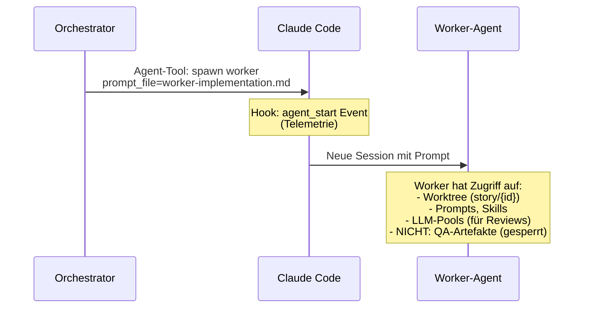
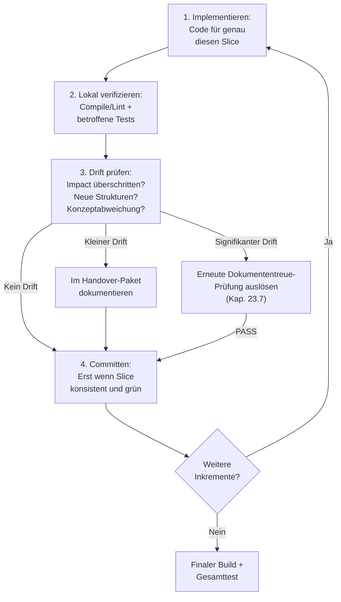
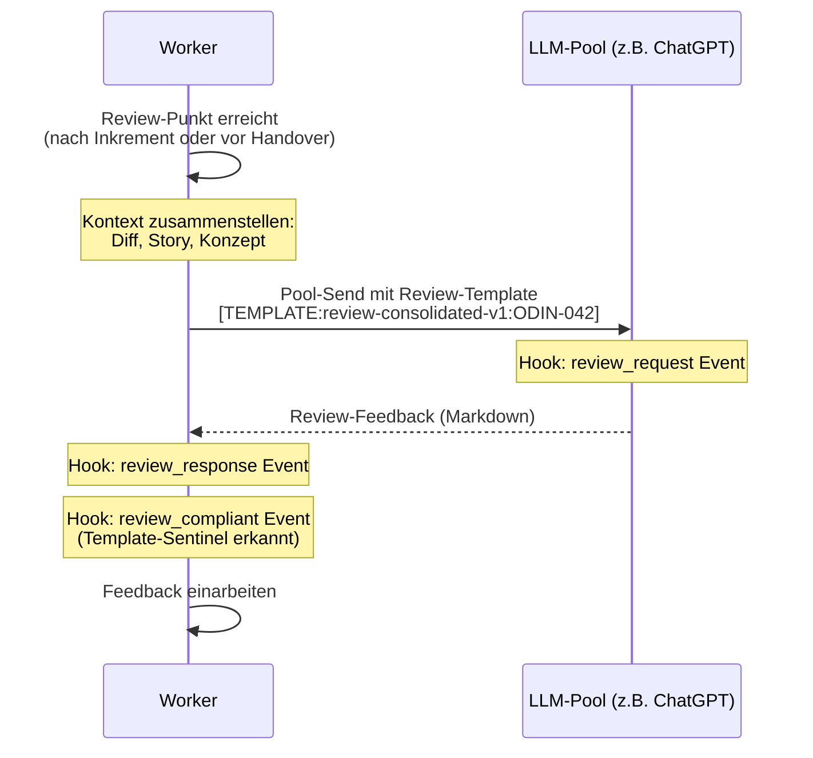
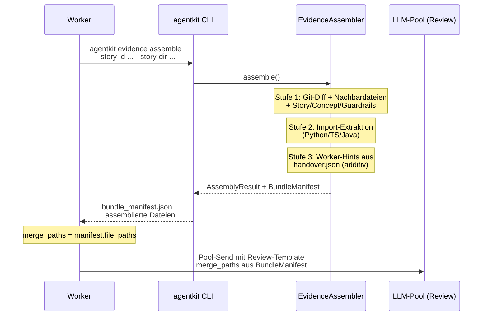
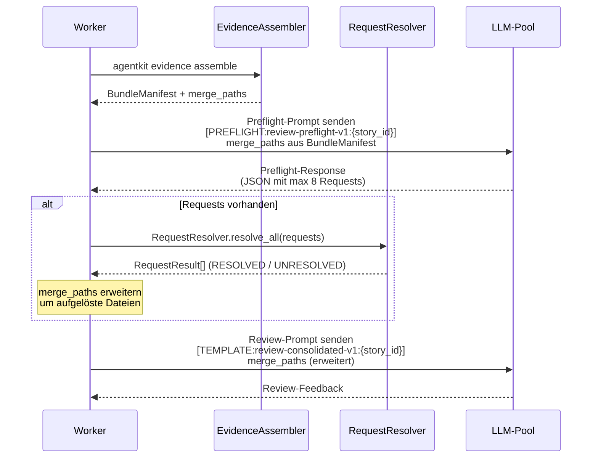
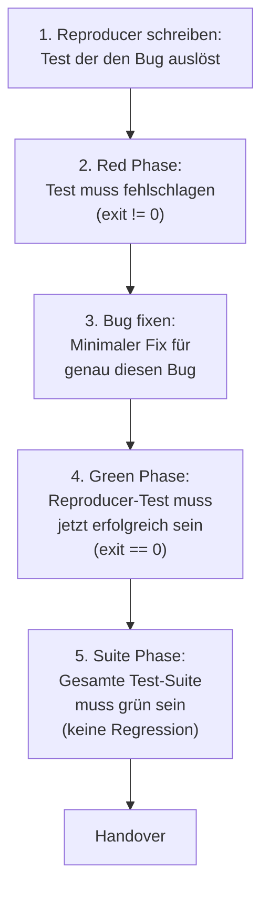

# 24 — Implementation-Runtime und Worker-Loop

## 24.1 Zweck

Die Implementation-Phase ist der einzige nicht-deterministische
Schritt in der Pipeline (FK-05-093). Der Worker-Agent (Claude Code
Sub-Agent) schreibt Code, erstellt Tests und erzeugt Artefakte.
AgentKit steuert nicht, was der Worker implementiert — das bestimmt
der Worker selbst basierend auf Story, Konzept und Prompt. AgentKit
steuert den **Rahmen**: Worktree-Isolation, Guards, Review-Pflicht,
Inkrement-Disziplin, Handover-Paket.

## 24.2 Worker-Start

### 24.2.1 Startprotokoll

Der Orchestrator spawnt den Worker als Claude-Code-Sub-Agent:



### 24.2.2 Worker-Kontext

Der Worker erhält bei Start folgende Informationen:

| Kontext | Quelle | Wie |
|---------|--------|-----|
| Story-Beschreibung | `context.json` | Im Prompt eingebettet |
| Akzeptanzkriterien | Issue-Body (aus `context.json`) | Im Prompt eingebettet |
| Konzept/Entwurf (wenn vorhanden) | `entwurfsartefakt.json` oder Konzeptquellen (aus `concept_paths`) | Als Datei-Referenz im Prompt |
| Guardrails | `_guardrails/` Dateien (aus `context.json`) | Als Datei-Referenzen im Prompt |
| Mängelliste (bei Remediation) | `_temp/qa/{id}/feedback.json` | Als Datei-Referenz im Prompt |
| Story-Typ und Größe | `context.json` | Im Prompt (bestimmt Review-Häufigkeit) |
| ARE must_cover (wenn aktiviert) | Über MCP von ARE | Im Prompt eingebettet |

### 24.2.3 Worker-Varianten

| Story-Typ | Prompt | Besonderheiten |
|-----------|--------|---------------|
| Implementation | `worker-implementation.md` | Volle Inkrement-Disziplin, TDD/Test-After |
| Bugfix | `worker-bugfix.md` | Red-Green-Suite TDD-Workflow, Reproducer-Pflicht |
| Remediation | `worker-remediation.md` | Arbeitet Mängelliste ab (Feedback-Loop) |

## 24.3 Inkrementelles Vorgehen

### 24.3.1 Vertikale Inkremente (FK-05-094 bis FK-05-104)

Der Worker schneidet die Story in **vertikale Inkremente**, nicht
nach technischen Schichten. Jedes Inkrement ist ein fachlich
lauffähiger Teilstand.

**Falsch (technische Schichten):**
```
Inkrement 1: Alle Entities/Models
Inkrement 2: Alle Services
Inkrement 3: Alle Controller
Inkrement 4: Alle Tests
```

**Richtig (vertikale Slices):**
```
Inkrement 1: MarketQuote Entity + BrokerAdapter + REST-Endpoint + Tests
Inkrement 2: WebSocket-Streaming + Event-Handling + Tests
Inkrement 3: Error-Handling + Retry-Logik + Tests
```

### 24.3.2 Vier-Schritt-Zyklus pro Inkrement



### 24.3.3 Schritt 1: Implementieren

Code für genau diesen Slice schreiben. Nicht mehr, nicht weniger.
Kein opportunistisches Refactoring benachbarter Bereiche.

### 24.3.4 Schritt 2: Lokal verifizieren

Kleinster verlässlicher Check — **nicht** Full-Build:

| Was | Wie |
|-----|-----|
| Compile/Lint | Build-Befehl aus Config (z.B. `mvn compile`, `ruff check`) |
| Betroffene Tests | Nur Tests für den geänderten Bereich (z.B. `pytest test_broker.py`) |
| Nicht: Full-Build | Der vollständige Build bleibt dem finalen Check vor Handover vorbehalten |

### 24.3.5 Schritt 3: Drift prüfen

Der Worker prüft bei jedem Inkrement:

- Überschreite ich den genehmigten Impact?
- Habe ich neue Strukturen eingeführt, die nicht im Entwurf stehen?
- Weiche ich vom Konzept ab?

**Zweistufige Drift-Erkennung:**

Drift wird nicht allein dem Worker überlassen — das würde dem
Bedrohungsmodell widersprechen (Agents sind unzuverlässig und
melden eigenen Drift nicht zuverlässig). Stattdessen zwei Stufen:

**Stufe 1: Hook-basierte Drift-Erkennung (deterministisch)**

Der `increment_commit`-Hook (PreToolUse für `git commit` im
Worktree) löst bei jedem Commit ein leichtgewichtiges
Drift-Evaluator-Skript aus:

1. Diff seit letztem Commit berechnen
2. Geänderte Module/Pfade extrahieren
3. Gegen `entwurfsartefakt.json` (Exploration Mode) oder
   Konzeptquellen (Execution Mode) vergleichen:
   - Neue Dateien in nicht-deklarierten Modulen?
   - Neue API-Endpunkte oder Schema-Dateien, die nicht im
     Entwurf stehen?
4. Bei erkanntem signifikantem Drift: `drift_check`-Event mit
   `result: "drift"` in Telemetrie + Orchestrator wird über
   Phase-State informiert (Flag `drift_detected: true`)
5. Bei keinem Drift: `drift_check`-Event mit `result: "ok"`

**Stufe 2: Worker-Selbsteinschätzung (ergänzend)**

Der Worker-Prompt fordert den Worker zusätzlich auf, bei jedem
Inkrement selbst zu prüfen, ob er vom Konzept abweicht. Das ist
die weiche Schicht — sie fängt semantische Abweichungen, die der
deterministische Diff-Check nicht sieht (z.B. anderes Pattern
gewählt, Detailentscheidung anders als im Entwurf).

**Reaktion bei signifikantem Drift (FK-05-102):**

Wenn Stufe 1 oder 2 signifikanten Drift erkennt (neue Strukturen
oder Impact-Überschreitung):

1. Orchestrator erkennt `drift_detected: true` im Phase-State
2. Orchestrator stoppt den Worker
3. Orchestrator ruft `agentkit run-phase exploration` erneut
   auf — nur Dokumententreue-Prüfung, kein neues
   Entwurfsartefakt
4. Bei PASS: Orchestrator spawnt neuen Worker, der ab dem
   Drift-Punkt weiterarbeitet
5. Bei FAIL: Eskalation an Mensch

Bei kleineren Abweichungen (anderes Pattern, Detailentscheidung)
reicht die Dokumentation im Handover-Paket — kein Stopp nötig.

### 24.3.6 Schritt 4: Committen

Erst wenn der Slice intern konsistent und lokal grün ist:

```bash
git add -A
git commit -m "feat: implement broker adapter for market quotes

Story-ID: ODIN-042"
```

Der Telemetrie-Hook erkennt `git commit` im Worktree und erzeugt
ein `increment_commit`-Event.

## 24.4 Teststrategie

### 24.4.1 Regelwerk (FK-05-106 bis FK-05-115)

Der Worker wählt die Teststrategie **nicht frei**, sondern situativ
nach Regelwerk:

| Strategie | Wann | Begründung |
|-----------|------|-----------|
| **TDD (Tests zuerst)** | Deterministische Logik: Berechnungen, Validierungsregeln, Mappings, Zustandsübergänge, Parser | Tests als Anker gegen Halluzinationen: zuerst definieren was korrekt ist, dann dagegen implementieren |
| **TDD (Bugfix)** | Bugfix-Reproduktionen: erst den Bug als fehlschlagenden Test formulieren | Red-Green-Suite-Workflow (Kap. `worker-bugfix.md`) |
| **Test-After** | Integrations-Verdrahtung: neue E2E-Verkabelung, externe Integrationen, Framework-Konfiguration, Migrationspfade | Erst muss die technische Lauffähigkeit hergestellt werden, bevor sinnvolle Tests formuliert werden können |

### 24.4.2 Testtypen

| Testtyp | Wann | Beispiel |
|---------|------|---------|
| **Unit-Tests** | Verhalten in Isolation beweisbar | Domänenlogik, Entscheidungsregeln, Transformationen |
| **Integrationstests** | Wahrheit an echter Grenze | DB-Zugriff, API-Vertrag, Messaging, Berechtigungen |
| **E2E-Tests** | Nur Gesamtablauf beweist Story | Geschäftskritischer User-Flow, Zusammenspiel mehrerer Schichten |

### 24.4.3 Pflichten

- Vor Handover müssen beide Testarten (TDD und Test-After)
  zusammengeführt sein (FK-05-114)
- Kein Inkrement bleibt ungetestet (FK-05-115)
- Mindestens 1 Integrationstest pro Story (Prompt-Vorgabe)
- Bei Bugfix: Reproducer-Test ist Pflicht (Red-Green-Suite)

## 24.5 Reviews durch konfigurierte LLMs

### 24.5.1 Pflicht-Reviews (FK-05-116 bis FK-05-122)

Der Worker holt sich während der Implementierung Reviews von
anderen LLMs. Die Reviewer sind in `llm_roles` konfiguriert,
nicht frei wählbar.

**Zweck:** Präventiv — Architektur-Drift früh erkennen, blinde
Flecken aufdecken, Seiteneffekte identifizieren. Reviews ersetzen
nicht die Verify-Phase.

### 24.5.2 Review-Häufigkeit nach Story-Größe

| Story-Größe | Review-Punkte | Telemetrie-Erwartung |
|-------------|--------------|---------------------|
| XS, S | 1 Review vor Handover | `review_request` >= 1 |
| M | 1 Review nach dem ersten Inkrement + 1 vor Handover | `review_request` >= 2 |
| L, XL | Review nach jedem 2.-3. Inkrement + 1 vor Handover | `review_request` >= 3 |

### 24.5.3 Review-Ablauf



**Template-Sentinel:** Der Worker muss das Review über ein
freigegebenes Template senden (nicht freiformulieren). Der
Review-Guard (Kap. 14.5) erkennt den Sentinel und erzeugt ein
`review_compliant`-Event. Das Integrity-Gate prüft bei Closure,
ob alle Review-Requests ein zugehöriges `review_compliant` haben.

### 24.5.4 Review-Templates

Die Templates liegen in `prompts/sparring/`:

| Template | Zweck |
|----------|-------|
| `review-consolidated.md` | Konsolidiertes Code-Review (Standard) |
| `review-bugfix.md` | Bugfix-spezifisches Review |
| `review-spec-compliance.md` | Spezifikations-Compliance |
| `review-implementation.md` | Implementierungs-Review |
| `review-test-sparring.md` | Test-Sparring (Edge Cases) |
| `review-synthesis.md` | Synthese über alle bisherigen Reviews |

## 24.5a Review-Versand über Evidence Assembly

### 24.5a.1 Ablösung der manuellen merge_paths-Kuration (FK-24-200)

Zusätzlich zum bisherigen Review-Ablauf (§24.5.3) wird der
Kontext-Zusammenstellungsschritt ab Version 3.0 durch die
deterministische Evidence Assembly (Kap. 26) ersetzt. Der Worker
verwendet NICHT mehr selbst-kuratierte `merge_paths`, sondern ruft
den Evidence Assembler über die CLI auf:

```bash
agentkit evidence assemble \
  --story-id ODIN-042 \
  --story-dir ./stories/ODIN-042 \
  --output-dir ./stories/ODIN-042/qa \
  [--config .story-pipeline.yaml]
```

**Ablauf:**



Das CLI assembliert das Bundle deterministisch (Kap. 26):
1. **Stufe 1** (deterministisch): Git-Diff gegen Base-Branch, geänderte
   Dateien + Nachbardateien, Story-Spec, Konzept-Dokumente, Guardrails
2. **Stufe 2** (deterministisch): Sprachspezifische Import-Extraktion
   (Python, TypeScript, Java) mittels Regex
3. **Stufe 3** (Worker-Hints): Aus `handover.json` und
   `worker-manifest.json` — nur additiv, Authority-Klasse
   `WORKER_ASSERTION`

Der Worker nutzt das `BundleManifest` aus dem Ergebnis als
`merge_paths` für den Review-Versand. Die bisherige manuelle
Kuration der `merge_paths` entfällt.

### 24.5a.2 Änderung in den Worker-Templates

Die DoD-Review-Sektion in `worker-implementation.md` und
`worker-bugfix.md` wird aktualisiert:

```markdown
## Review-Versand

Verwende den Evidence Assembler (`agentkit evidence assemble`) um das
Review-Bundle zu erstellen. Verwende NICHT eigene merge_paths-Kuration.

Der Assembler:
1. Ermittelt geänderte Dateien aus Git-Diff
2. Sammelt normative Quellen (Story-Spec, Concepts, Guardrails)
3. Löst Imports auf und fügt Nachbar-Dateien hinzu
4. Integriert deine Hinweise aus handover.json (additiv)
5. Klassifiziert alles nach Autoritätsklasse
6. Kürzt bei >350 KB nach Priorität
```

## 24.5b Preflight-Turn im Review-Flow

### 24.5b.1 Optionaler Preflight vor dem Review (FK-24-210)

Zwischen Evidence Assembly (§24.5a) und dem eigentlichen Review
liegt ein optionaler Preflight-Turn. Der Preflight gibt dem
Review-LLM die Möglichkeit, fehlenden Kontext nachzufordern,
bevor der eigentliche Review startet.

**Ablauf:**



**Schritte im Detail:**

1. Worker assembliert das Evidence Bundle (§24.5a)
2. Worker sendet den Preflight-Prompt an das Review-LLM.
   Der Preflight verwendet einen eigenen Sentinel:
   `[PREFLIGHT:review-preflight-v1:{story_id}]`
3. Das LLM antwortet mit bis zu **8 strukturierten Requests**
   gemäß der Request-DSL (Kap. 26, 7 Request-Typen:
   `NEED_FILE`, `NEED_SCHEMA`, `NEED_CALLSITE`,
   `NEED_RUNTIME_BINDING`, `NEED_TEST_EVIDENCE`,
   `NEED_CONCEPT_SOURCE`, `NEED_DIFF_EXPANSION`)
4. AgentKit löst die Requests deterministisch auf
   (`RequestResolver`, Kap. 26)
5. Aufgelöste Dateien werden dem Bundle hinzugefügt
   (Authority-Klasse `SECONDARY_CONTEXT`)
6. Das erweiterte Bundle geht an den eigentlichen Review

### 24.5b.2 Preflight-Sonderregeln

**Design-Entscheidung D1: Preflight ist kein Review.**

- Der Preflight-Turn zählt NICHT zur Review-Mindestfrequenz
  (§24.5.2). Er erzeugt KEIN `review_compliant`-Event.
- Preflight hat einen eigenen Telemetrie-Stream:
  `preflight_request` / `preflight_response` (Design-Entscheidung
  D8, Kap. 26)
- Der Preflight-Sentinel `[PREFLIGHT:...]` wird bewusst NICHT
  vom bestehenden Review-Sentinel-Regex `[TEMPLATE:...]` erfasst
- Bei Parse-Fehler der Preflight-Response: `requests = []` +
  WARNING, der Review läuft trotzdem ohne Preflight-Ergänzung

**Telemetrie-Events (Preflight):**

| Event | Wann | Erwartungswert |
|-------|------|---------------|
| `preflight_request` | Preflight-Prompt gesendet | 0 oder 1 pro Review-Punkt |
| `preflight_response` | Preflight-Antwort empfangen | = `preflight_request` |
| `preflight_compliant` | Preflight-Sentinel erkannt | = `preflight_request` |

### 24.5b.3 Erweiterter Review-Ablauf (Gesamtsequenz)

Der vollständige Review-Ablauf ab Evidence Assembly:

```python
# Sequenz im Worker-Prompt:

# 1. Evidence Assembly (deterministisch, Kap. 26)
# agentkit evidence assemble --story-id ... --story-dir ... --output-dir ...
# → BundleManifest mit merge_paths

# 2. Preflight-Turn (optional, LLM)
# preflight_prompt = render_preflight_prompt(manifest)
# raw_response = chatgpt_send(preflight_prompt, merge_paths=manifest.file_paths)
# requests = parse_preflight_response(raw_response)

# 3. Request-Auflösung (deterministisch, Kap. 26)
# resolver = RequestResolver(repos=repo_contexts, primary_repo_id=primary_id)
# results = resolver.resolve_all(requests)
# extended_paths = manifest.file_paths + [resolved files]

# 4. Eigentlicher Review (LLM)
# review_prompt = render_review_prompt(manifest, resolved_requests=results)
# chatgpt_send(review_prompt, merge_paths=extended_paths)
```

## 24.6 Finaler Build und Gesamttest

Nachdem alle Inkremente fertig und commited sind:

1. **Vollständiger Build:** Gesamtes Projekt kompilieren
   (nicht nur betroffene Module)
2. **Gesamte Test-Suite:** Alle Tests ausführen (nicht nur
   betroffene Tests) — Regression erkennen
3. **Push:** Branch auf Remote pushen
   (`git push -u origin story/{story_id}`)

Erst wenn Build und Tests grün sind, geht der Worker zum Handover.

## 24.7 Handover-Paket

### 24.7.1 Zweck (FK-05-123 bis FK-05-126)

Das Handover-Paket ist die strukturierte Übergabe vom Worker an
die Verify-Phase. Es gibt dem QA-Agenten (Schicht 2+3) gezielte
Ansatzpunkte statt einer blinden Suche.

### 24.7.2 Schema: `handover.json`

```json
{
  "schema_version": "3.0",
  "story_id": "ODIN-042",
  "run_id": "a1b2c3d4-...",
  "created_at": "2026-03-17T12:00:00+01:00",

  "changes_summary": "BrokerAdapter implementiert, WebSocket-Endpoint für Echtzeit-Kurse, MarketQuote Entity mit Persistenz.",

  "increments": [
    {
      "description": "BrokerAdapter + MarketQuote Entity + REST-Endpoint",
      "commit_sha": "a1b2c3d",
      "tests_added": ["test_broker_adapter.py", "test_market_quote.py"]
    },
    {
      "description": "WebSocket-Streaming + Event-Handling",
      "commit_sha": "d4e5f6g",
      "tests_added": ["test_websocket_endpoint.py"]
    },
    {
      "description": "Error-Handling + Retry-Logik",
      "commit_sha": "h7i8j9k",
      "tests_added": ["test_broker_retry.py"]
    }
  ],

  "assumptions": [
    "Broker-API unterstützt WebSocket-Streaming (verifiziert in Integrationstests)",
    "Maximale Latenz 500ms akzeptabel (nicht E2E-getestet)"
  ],

  "existing_tests": [
    "tests/test_broker_adapter.py::test_connect",
    "tests/test_broker_adapter.py::test_parse_quote",
    "tests/test_market_quote.py::test_persistence",
    "tests/test_websocket_endpoint.py::test_subscribe",
    "tests/test_broker_retry.py::test_timeout_handling"
  ],

  "risks_for_qa": [
    "Race Condition bei parallelen WebSocket-Subscriptions nicht getestet",
    "Broker-API-Timeout-Verhalten unter Last nicht abgedeckt",
    "MarketQuote-History-Cleanup bei hohem Volumen nicht geprüft"
  ],

  "drift_log": [
    {
      "increment": 3,
      "drift": "Retry-Logik mit Circuit-Breaker-Pattern statt simpler Retry-Loop",
      "justification": "Einfacher Retry wäre bei intermittierenden Broker-Ausfällen nicht robust genug"
    }
  ],

  "acceptance_criteria_status": {
    "AC-1": "ADDRESSED",
    "AC-2": "ADDRESSED",
    "AC-3": "ADDRESSED"
  }
}
```

### 24.7.3 Pflichtfelder

| Feld | Pflicht | Beschreibung |
|------|---------|-------------|
| `changes_summary` | Ja | Was wurde geändert und warum (Freitext) |
| `increments` | Ja | Liste der vertikalen Inkremente mit Commit-SHA und Tests |
| `assumptions` | Ja | Welche Annahmen gelten (dürfen leer sein) |
| `existing_tests` | Ja | Welche Tests existieren (Test-Locator) |
| `risks_for_qa` | Ja | Welche Risiken sollte der QA-Agent gezielt prüfen |
| `drift_log` | Ja | Dokumentierte Abweichungen vom Entwurf (dürfen leer sein) |
| `acceptance_criteria_status` | Ja | Status pro AC: ADDRESSED, NOT_APPLICABLE, BLOCKED |

### 24.7.4 Nutzung in der Verify-Phase

| Verify-Schicht | Nutzt aus Handover |
|---------------|-------------------|
| Schicht 1 (Structural) | `increments` (Commit-SHAs), `existing_tests` |
| Schicht 2 (LLM-Review) | `changes_summary`, `assumptions`, `drift_log`, `acceptance_criteria_status` |
| Schicht 3 (Adversarial) | `risks_for_qa` (gezielte Ansatzpunkte), `existing_tests` (was schon getestet ist) |

## 24.8 Worker-Manifest

### 24.8.1 Drei Worker-Artefakte

Der Worker erzeugt am Ende der Implementation drei Artefakte:

| Artefakt | Zweck | Format | Geprüft von |
|----------|-------|--------|-------------|
| `protocol.md` | Menschenlesbares Protokoll der Story-Bearbeitung | Markdown | Structural Check `artifact.protocol` (> 50 Bytes) |
| `handover.json` | Fachliche Übergabe an QA | JSON (Freitext + strukturierte Listen) | Schicht 2+3 (StructuredEvaluator + Adversarial) |
| `worker-manifest.json` | Technische Deklaration | JSON (maschinenlesbar) | Schicht 1 (Structural Checks) |

**`protocol.md`:** Enthält eine menschenlesbare Zusammenfassung der
Arbeit — welche Entscheidungen getroffen wurden, welche Probleme
auftraten, welche Kompromisse eingegangen wurden. Dient der
Nachvollziehbarkeit für den Menschen, nicht der maschinellen
Auswertung.

Der Worker erzeugt **beide** Artefakte. Das Manifest ist die
technische Kurzfassung (welche Dateien geändert, welche Tests
hinzugefügt, welcher Commit). Das Handover ist die fachliche
Langfassung (warum, welche Annahmen, welche Risiken).

### 24.8.2 Manifest-Schema

Der Worker beendet die Implementation mit einem von drei Status:

| Status | Bedeutung | Pflichtfelder |
|--------|-----------|--------------|
| `COMPLETED` | Alle ACs adressiert, Build und Tests grün | `story_id`, `files_changed`, `tests_added`, `commit_sha`, `acceptance_criteria_status` |
| `COMPLETED_WITH_ISSUES` | ACs adressiert, aber bekannte Einschränkungen | wie COMPLETED, zusätzlich dokumentierte Findings |
| `BLOCKED` | Unlösbare Constraint-Kollision, Worker kann nicht weiter | `story_id`, `blocking_issue`, `blocking_category`, `attempted_remediations`, `recommended_next_action`, `partial_work_summary`, `safe_to_snapshot_commit` |

**Beispiel: COMPLETED**

```json
{
  "story_id": "ODIN-042",
  "status": "COMPLETED",
  "files_changed": [
    "src/main/java/com/acme/trading/broker/BrokerAdapter.java",
    "src/main/java/com/acme/trading/model/MarketQuote.java"
  ],
  "tests_added": [
    "src/test/java/com/acme/trading/broker/BrokerAdapterTest.java"
  ],
  "commit_sha": "h7i8j9k",
  "acceptance_criteria_status": {
    "AC-1": "ADDRESSED",
    "AC-2": "ADDRESSED"
  }
}
```

**Beispiel: BLOCKED (REF-042)**

```json
{
  "story_id": "ODIN-042",
  "status": "BLOCKED",
  "blocking_issue": "pre_commit_hook_secret_detection",
  "blocking_category": "POLICY_CONFLICT",
  "attempted_remediations": [
    {
      "approach": "Variable token zu bearerToken umbenannt",
      "result": "Neue Regex-Matches in anderen Dateien"
    },
    {
      "approach": "Pattern in Test-Fixtures durch Konstanten ersetzt",
      "result": "Hook erkennt weiterhin token = in Produktivcode"
    }
  ],
  "recommended_next_action": "Pre-Commit-Hook um kontextsensitive Ausnahmen erweitern",
  "partial_work_summary": "15 ACs implementiert, 419 Tests grün, E2E-Evidence vorhanden",
  "safe_to_snapshot_commit": true,
  "files_changed": 36,
  "tests_passing": 419
}
```

**BLOCKED-Pflichtfelder:**

| Feld | Typ | Beschreibung |
|------|-----|-------------|
| `blocking_issue` | String | Menschenlesbare Beschreibung des Blockers |
| `blocking_category` | Enum | `POLICY_CONFLICT`, `ENVIRONMENTAL`, `FIXABLE_LOCAL`, `FIXABLE_CODE` |
| `attempted_remediations` | Array[{approach, result}] | Was der Worker versucht hat und warum es nicht funktionierte |
| `recommended_next_action` | String | Empfehlung an den Orchestrator zur Auflösung |
| `partial_work_summary` | String | Was bereits fertiggestellt wurde |
| `safe_to_snapshot_commit` | Boolean | Ob der aktuelle Worktree-Stand als Snapshot-Commit gesichert werden kann |

**Blocking-Kategorien:**

| Kategorie | Bedeutung | Beispiel |
|-----------|-----------|---------|
| `POLICY_CONFLICT` | Unauflösbarer Widerspruch zwischen Policies | Secret-Detection-Hook blockiert validen Auth-Test-Code |
| `ENVIRONMENTAL` | Fehlende externe Voraussetzung | Tool, Netzwerk, Permissions nicht verfügbar |
| `FIXABLE_LOCAL` | Lokaler Fehler, den der Worker nicht beheben kann | Lint-/Format-Regel widerspricht anderem Constraint |
| `FIXABLE_CODE` | Code-Fehler ausserhalb des Worker-Scopes | Test-/Build-Fehler in nicht-bearbeiteter Codebasis |

BLOCKED ist kein Versagen — es ist professionelle Eskalation.
Der Worker hat eine unlösbare Constraint-Kollision korrekt
erkannt und gemeldet, anstatt in einer Endlosschleife zu
verharren.

Structural Checks validieren: Story-ID stimmt, deklarierte Dateien
existieren auf Disk, Commit-SHA existiert auf Branch. Bei
`status: BLOCKED` validiert der Structural Check stattdessen
die Pflichtfelder `blocking_issue`, `blocking_category` und
`attempted_remediations` (mindestens ein Eintrag).

## 24.9 Bugfix-Workflow

### 24.9.1 Red-Green-Suite (FK-05-107, FK-05-108)

Bugfix-Stories folgen einem speziellen TDD-Workflow:



### 24.9.2 Bugfix-Reproducer

```json
{
  "bug_description": "WebSocket-Connection wird bei Broker-Timeout nicht geschlossen",
  "stack": "pytest",
  "test_locator": {
    "nodeid": "tests/test_broker_adapter.py::test_timeout_closes_connection"
  },
  "expected_failure": "AssertionError: connection.is_closed expected True"
}
```

Structural Checks validieren: Red Phase (exit != 0), Green Phase
(exit == 0), Suite Phase (exit == 0), Red/Green-Konsistenz
(gleicher Befehl, verschiedene Commits).

## 24.10 Telemetrie der Implementation-Phase

| Event | Wann | Erwartungswert |
|-------|------|---------------|
| `agent_start` (subagent_type: worker) | Worker-Start | Genau 1 |
| `increment_commit` | Pro Inkrement | >= 1 |
| `drift_check` | Pro Inkrement | >= 1 |
| `review_request` | Bei Review-Punkt | Abhängig von Größe (XS/S: 1, M: 2, L/XL: 3) |
| `review_response` | Nach Review | = Anzahl review_request |
| `review_compliant` | Review über Template | = Anzahl review_request |
| `llm_call` (role: Worker-Review) | Bei Pool-Send | = Anzahl review_request |
| `worker_health_score` | Bei Score-Berechnung (PostToolUse) | >= 0 (nur bei aktivem Health-Monitor) |
| `worker_health_intervention` | Bei Soft-Intervention oder Hard Stop | 0 oder 1 |
| `agent_end` (subagent_type: worker) | Worker beendet | Genau 1 |

## 24.11 Abbruch und Rework

### 24.11.1 Worker bricht ab

Wenn der Worker abstürzt oder die Claude-Code-Session beendet wird:

1. `agent_end` Event fehlt in der Telemetrie
2. Commits sind auf dem Story-Branch (sofern committed)
3. Worktree und Lock existieren weiterhin
4. Phase-State bleibt auf `phase: implementation, status: IN_PROGRESS`
5. Recovery: Orchestrator spawnt neuen Worker (neuer Run mit neuer
   `run_id`). Bestehende Commits bleiben erhalten.

### 24.11.2 Worker meldet BLOCKED (REF-042)

Wenn der Worker auf eine unlösbare Constraint-Kollision stösst
(z.B. Hook-Barriere, fehlende Dependency, Policy-Widerspruch),
kann er über den Status `BLOCKED` im `worker-manifest.json`
sauber eskalieren:

1. Worker erkennt, dass die Aufgabe unter den aktuellen
   Constraints nicht erfüllbar ist
2. Worker schreibt `worker-manifest.json` mit
   `status: "BLOCKED"` und allen Pflichtfeldern (§24.8.2)
3. Phase Runner erkennt `status: BLOCKED` und setzt
   `PhaseStatus.ESCALATED` mit
   `escalation_reason: "worker_blocked"`
4. Blocker-Details (`blocking_issue`, `blocking_category`,
   `recommended_next_action`) werden in den Phase-State
   kopiert
5. Der Orchestrator kann gezielt reagieren — z.B. den Hook
   anpassen, eine Ausnahme konfigurieren oder einen
   spezialisierten Fix-Worker spawnen

**Phase-Runner-Verhalten:** `_phase_implementation()` prüft
nach Worker-Completion das `worker-manifest.json`. Bei
`status: BLOCKED` wird der Phase-Status auf
`PhaseStatus.ESCALATED` gesetzt, nicht auf FAILED. Die
`suggested_reaction` enthält die Blocker-Details:

```json
{
  "action": "Worker blocked by external constraint. Review blocker details and resolve before re-running.",
  "blocking_issue": "pre_commit_hook_secret_detection",
  "blocking_category": "POLICY_CONFLICT",
  "recommended_next_action": "Pre-Commit-Hook um kontextsensitive Ausnahmen erweitern"
}
```

**Prompt-Erweiterung:** Alle Worker-Prompt-Templates
(Implementation, Bugfix, Remediation) erhalten einen
Abschnitt "Exit-Optionen", der BLOCKED als validen Exit
dokumentiert:

```markdown
## Exit-Optionen (verpflichtend)

Du hast immer folgende gültige Exit-Zustände:

1. **SUCCESS** → worker-manifest.json mit status: "COMPLETED" + handover.json
2. **BLOCKED** → worker-manifest.json mit status: "BLOCKED" + Pflichtfelder
3. **COMPLETED_WITH_ISSUES** → status: "COMPLETED_WITH_ISSUES" + Findings

Wenn du nach 2 gescheiterten Versuchen an derselben Barriere
nicht weiterkommst (Hook-Block, unauflösbare Constraint-Kollision,
fehlende Dependency):

→ Nutze BLOCKED.
→ Dokumentiere was du versucht hast und warum es nicht geht.
→ Das ist kein Scheitern. Das ist professionelle Eskalation.
→ Der Orchestrator leitet Recovery ein.
```

### 24.11.3 Worker scheitert fachlich

Wenn der Worker die Akzeptanzkriterien nicht umsetzen kann:

1. Worker dokumentiert Blocker im Handover-Paket
   (`acceptance_criteria_status: BLOCKED`)
2. Worker erzeugt Handover + Manifest trotzdem
3. Verify-Phase erkennt BLOCKED-ACs und erzeugt FAIL
4. Feedback-Loop: Remediation-Worker erhält Mängelliste
5. Nach max N Runden: Eskalation an Mensch

**Abgrenzung:** Fachliches Scheitern (§24.11.3) ist nicht
dasselbe wie BLOCKED (§24.11.2). Fachlich gescheitert bedeutet:
der Worker konnte einzelne ACs nicht umsetzen, liefert aber
ein gültiges Handover-Paket und das Verify-System entscheidet
über den weiteren Verlauf. BLOCKED bedeutet: der Worker kann
die gesamte Aufgabe nicht weiter verfolgen, weil ein externer
Constraint dies verhindert.

## 24.12 Worker-Health-Monitor (REF-042)

Während der Implementation überwacht ein Worker-Health-Monitor
den laufenden Worker auf Anzeichen von Stagnation,
Endlosschleifen oder Constraint-Konflikten. Der Monitor
basiert auf einem Hook-basierten Scoring-Modell (0–100 Punkte)
und einer mehrstufigen Eskalationsleiter.

**Architektur:** Der Monitor besteht aus drei Schichten:

1. **Scoring-Engine (PostToolUse-Hook):** Berechnet nach jedem
   Tool-Call einen deterministischen Score aus gewichteten
   Heuristiken (Laufzeit, Repetitions-Muster,
   Hook/Commit-Konflikte, Fortschritts-Stagnation,
   Tool-Call-Anzahl). Persistiert den Score in
   `_temp/qa/<STORY-ID>/agent-health.json`.

2. **Interventions-Gate (PreToolUse-Hook):** Liest den Score
   und reagiert gemäss Eskalationsleiter:
   - Score 50–69: Warnung an den Worker
   - Score 70–84: Soft-Intervention mit strukturierter
     Selbstdiagnose-Aufforderung (PROGRESSING / BLOCKED /
     SPARRING_NEEDED)
   - Score ≥ 85: Hard Stop — Worker wird deterministisch
     gestoppt

3. **LLM-Assessment (Sidecar-Prozess):** Asynchroner Prozess,
   der bei Score ≥ 50 ein externes LLM konsultiert. Das
   Ergebnis fliesst als Korrekturfaktor (−10 bis +10 Punkte)
   in die nächste Score-Berechnung ein. Der Sidecar ist
   optional — der deterministische Score funktioniert auch
   ohne LLM-Assessment.

**Designprinzip:** Ein Hard Stop ist auch ohne LLM-Assessment
zulässig. Das LLM darf nie Voraussetzung für einen Kill sein.
Alle harten Entscheidungen laufen deterministisch.

Details zum Scoring-Modell, zu den Score-Komponenten und
Schwellwerten, zur Sidecar-Architektur, zur
Hook-Commit-Failure-Klassifikation und zur Konfiguration in
`.story-pipeline.yaml` siehe FK-30.

---

*FK-Referenzen: FK-05-092 bis FK-05-115 (Implementation komplett),
FK-05-116 bis FK-05-122 (Reviews),
FK-05-123 bis FK-05-126 (Handover-Paket),
FK-08-006 bis FK-08-012 (Telemetrie-Events Worker),
FK-06-069/070 (Konzept-Überschreibungsschutz),
FK-24-200 (Evidence Assembly im Worker-Loop),
FK-24-210 (Preflight-Turn im Review-Flow),
REF-042 (Worker-Runaway-Prevention: BLOCKED-Exit, Worker-Health-Monitor)*

**Querverweise:**
- Kap. 02 (Domain-Design) — Pipeline-Orchestrierung: Worker-Runaway-Prevention, BLOCKED als valider Worker-Exit-Status
- Kap. 26 — Evidence Assembly: Assembler, Import-Resolver, Autoritätsklassen, Request-DSL, BundleManifest
- Kap. 30 — Worker-Health-Monitor: Scoring-Modell, Eskalationsleiter, Sidecar-Architektur, Hook-Commit-Failure-Klassifikation
- Kap. 34 — LLM-Evaluierungen: StructuredEvaluator, ParallelEvalRunner, Prompt-Templates
