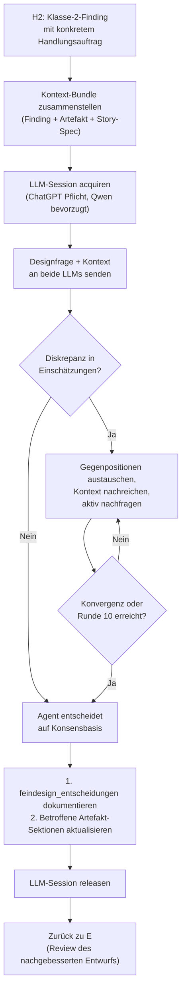

# 25 — Mandatsgrenzen, Eskalationsklassen und Feindesign-Autonomie

## 25.1 Zweck

Die Exploration-Phase (FK-23) erzeugt ein Entwurfsartefakt auf
mittlerer Abstraktionsebene. Die technischen Feinkonzepte, auf denen
User-Stories basieren, lösen nicht alle Implementierungsdetails auf.
Zwischen dem mittleren Abstraktionsniveau des Entwurfs und den
konkreten Klassen-, Schema- und Schnittstellenentscheidungen der
Implementierung gibt es eine Lücke: Designentscheidungen mit
Wirkung über die einzelne Methode oder Story hinaus.

Ohne dieses Konzept fallen solche Entscheidungen in eine von zwei
Fallen: Sie landen ungeplant im Implementation-Worker (der sie ohne
abgesicherten Prozess trifft) oder sie eskalieren an den Menschen
(der für rein technische Entscheidungen innerhalb des normativen
Rahmens nicht gebraucht wird).

Dieses Konzept definiert:

1. **Mandatsgrenzen:** Was darf die Exploration autonom entscheiden,
   was muss an den Menschen eskaliert werden?
2. **Eskalationsklassen:** Vier Klassen mit unterschiedlichem
   Entscheidungsträger (Mensch vs. Agent).
3. **Feindesign-Subprozess:** Wie werden technische Feindesign-
   Entscheidungen innerhalb des Mandats getroffen — wer, auf Basis
   welcher Informationen, mit welcher Qualitätssicherung?
4. **Scope-Explosion-Erkennung:** Quantitative Schwellen für die
   Erkennung signifikanter Umfangsvergrößerungen.

## 25.2 Mandatsprinzip

Der Mensch legt normative Leitplanken fest — Fachkonzepte (DK-*) und
technische Feinkonzepte (FK-*). Alles, was innerhalb dieser
Leitplanken liegt und keine neue fachliche Substanz erzeugt, sollen
Agenten autonom entscheiden.

Die zentrale Frage an jeder Entscheidungsstelle ist:

> Braucht diese Entscheidung Wissen oder Autorität, die nicht in
> Konzepten, Code und Story-Spezifikationen enthalten ist?

Ja → Mensch entscheidet. Nein → Agent entscheidet.

### 25.2.1 Normative Quellen (Mandatsrahmen)

Der Agent darf alle Entscheidungen treffen, die durch folgende
Quellen gedeckt sind:

| Quelle | Beispiel |
|--------|---------|
| Fachkonzepte (DK-*) | Domänenmodell, Pipeline-Regeln, Governance-Prinzipien |
| Technische Feinkonzepte (FK-*) | Architekturprinzipien, Schnittstellenspezifikationen, Schema-Definitionen |
| Bestehender Code | Implementierte Konventionen, bestehende API-Signaturen |
| Story-Spezifikation | Akzeptanzkriterien, deklarierter Scope, Wirksamkeitsgrad |
| Entwurfsartefakt (Change-Frame) | Lösungsrichtung, Vertragsänderungen, Konformitätsaussage |

### 25.2.2 Mandatsgrenzen (explizit)

Der Agent darf **nicht** autonom entscheiden, wenn:

1. **Fachliches Neuland:** Die Entscheidung erzeugt fachliche
   Substanz, die in keinem Konzept vorgezeichnet ist (z.B. konkrete
   Positionsbezeichnungen, die vom Fachbereich validiert werden müssen).
2. **Scope-Sprengung:** Der Implementierungsumfang übersteigt den
   deklarierten Story-Scope signifikant (→ Klasse 3, §25.3).
3. **Tragweiten-Überschreitung:** Die notwendige Änderung übersteigt
   den deklarierten Wirksamkeitsgrad der Story (→ Klasse 4, §25.3).
4. **Normativ-Konflikt:** Die Entscheidung widerspricht einem
   bestehenden Fach- oder IT-Konzept und kann nicht innerhalb des
   Konzeptrahmens aufgelöst werden.

## 25.3 Eskalationsklassen

Vier Klassen mit differenziertem Entscheidungsträger:

### Klasse 1 — Fachliche Lücke oder Normativ-Konflikt

**Auslöser:** Zwei Varianten:

(a) Fehlende Fachkonzepte, fehlende Domänendaten. Das benötigte
Wissen existiert nicht im System.

(b) Normative Quellen (FK-*/DK-*, freigegebener Code) widersprechen
sich untereinander, und der Widerspruch ist innerhalb des
Konzeptrahmens nicht auflösbar. Hier fehlt nicht Fachwissen, sondern
menschliche Autorität zur Präzedenzentscheidung.

**Erkennung:** Exploration stellt fest, dass normative Quellen an
einer für die Designentscheidung kritischen Stelle inkonsistent,
unvollständig oder widersprüchlich sind und die Auflösung entweder
fachliches Domänenwissen erfordert (Variante a) oder eine
Präzedenzentscheidung zwischen widersprüchlichen normativen Quellen
(Variante b), die nicht aus dem Systemkontext ableitbar ist.

**Entscheidungsträger:** Mensch.

**Reaktion:** `status: PAUSED`, `escalation_class: "domain_gap"`
(Variante a) oder `escalation_class: "normative_conflict"` (Variante b).
PAUSED statt ESCALATED, weil die Pipeline nach menschlicher Klärung
fortsetzbar ist. Story bleibt in Exploration. Mensch klärt die
fachliche Frage bzw. entscheidet die Präzedenz, passt ggf. das
Fachkonzept an. Resume startet Exploration erneut.

**Beispiel:** "Konkrete Kernpositionen für ausgleichsruecklage —
die tatsächlichen Positionsbezeichnungen sind fachbereichsseitig zu
validieren."

### Klasse 2 — Technische Feindesign-Entscheidung

**Auslöser:** Unaufgelöste technische Details innerhalb des
normativen Rahmens. Keine fachlichen Lücken, keine Scope-Sprengung,
keine Tragweiten-Überschreitung. Die Antwort liegt in den bestehenden
Quellen — sie muss nur ausdetailliert werden.

**Typische Fälle:**
- Schnittstellensemantik zwischen Producer- und Consumer-Story
  (Return-Value-Struktur, Key-Naming, State-Merge-Verhalten)
- Schema-Ausprägungen auf Feldebene (Typen, Nullable, Constraints),
  wenn das Schema über die Komponente hinaus wirkt
- Scope-Zuordnung bei Story-übergreifenden Vertragsänderungen
  (wer definiert den Vertrag, wer konsumiert ihn?)
- Inkonsistenzen zwischen Feinkonzept-Parameternamen und bestehender
  Codebasis bei semantisch äquivalenten Bezeichnern
- Klassendesign mit modulübergreifender Wirkung (nicht methodenlokale
  Implementierungsentscheidungen)

**Erkennung:** Der Feindesign-Subprozess (§25.5, Schritt J) wird
ausgelöst, wenn die Nachklassifikation (H2) in Review-Findings
unaufgelöste technische Details identifiziert, die:

1. Wirkung über die einzelne Methode hinaus haben, **und**
2. durch normative Quellen gedeckt (nicht widersprochen) sind, **und**
3. kein neues Domänenwissen erfordern

**Entscheidungsträger:** Agent mit Multi-LLM-Beratung (§25.5).

**Reaktion:** Kein PAUSED, kein ESCALATED. Die Exploration löst das
Problem im Feindesign-Subprozess auf und dokumentiert die Entscheidung
im Entwurfsartefakt.

**Beispiel:** "Der validate_and_inject_config()-Vertrag ist
unspezifiziert. BB2-119 (Producer) definiert den Callable, BB2-121
(Consumer) nutzt ihn. Da BB2-119 zuerst implementiert wird, muss der
Vertrag in BB2-119 vollständig spezifiziert werden."

### Klasse 3 — Scope-Explosion

**Auslöser:** Der Implementierungsumfang wächst signifikant über den
deklarierten Story-Scope hinaus. Die Story muss neu geschnitten werden.

**Erkennung:** Quantitative Indikatoren beim Vergleich des
Entwurfsartefakts mit der Story-Spezifikation:

| Indikator | Schwelle | Gewicht |
|-----------|----------|---------|
| Neue Klassen/Module gegenüber Story-Spezifikation | > 50% mehr als erwartet | Hoch |
| Neue Schnittstellen (APIs, Events) nicht in Story | > 2 ungeplante | Hoch |
| Betroffene Bausteine vs. deklarierte Affected Modules | > 50% mehr | Mittel |
| Vertragsänderungen betreffen nicht-deklarierte Module | Jede | Hoch |

Die Schwellen sind Richtwerte. Der Exploration-Worker aggregiert
die Indikatoren zu einer Gesamteinschätzung. Zwei oder mehr
Indikatoren mit Gewicht "Hoch" lösen Klasse 3 aus.

**Entscheidungsträger:** Mensch (Story-Split-Entscheidung).

**Reaktion:** `status: PAUSED`, `escalation_class: "scope_explosion"`.
Dem Menschen wird die Gegenüberstellung (erwartet vs. festgestellt)
vorgelegt. Der normative Standardpfad ist anschliessend **nicht**
freies Weiterschreiben an derselben Story, sondern ein offizieller
Story-Split ueber `StorySplitService` (FK-54): Ausgangs-Story wird
kontrolliert beendet, Nachfolger-Stories werden neu angelegt.

### Klasse 4 — Tragweiten-Überschreitung

**Auslöser:** Die notwendige Änderung überschreitet den deklarierten
Wirksamkeitsgrad der Story. Bestehende Schnittstellen oder
Implementierungen müssen außerhalb des Story-Scopes angepasst werden.

**Erkennung:** Vergleich der festgestellten Tragweite mit dem
deklarierten Wirksamkeitsgrad (`change_impact` aus Story-Metadaten):

| Deklariert (DK-02 Enum) | Festgestellt | Gedeckt? |
|------------------------|-------------|----------|
| `Component` | Bleibt in Komponente | Ja — kein Klasse-4-Auslöser |
| `Component` | Erfordert Schnittstellenänderung an anderer Komponente (`Cross-Component`) | Nein → Klasse 4 |
| `Cross-Component` | Schnittstellenumbau über Modulgrenzen | Ja — gedeckt |
| `Cross-Component` | Fundamentaler Paradigmenwechsel (`Architecture Impact`) | Nein → Klasse 4 |
| `Architecture Impact` | Anwendungsweiter Umbau | Ja — gedeckt |

**Entscheidungsträger:** Mensch.

**Reaktion:** `status: PAUSED`, `escalation_class: "impact_exceeded"`.
Dem Menschen wird die Diskrepanz zwischen deklariertem und
festgestelltem Wirksamkeitsgrad vorgelegt.

**Explizite Klarstellung:** Eine als `Cross-Component` oder
`Architecture Impact` deklarierte Refactoring-Story hat das Mandat
für Schnittstellenänderungen innerhalb ihres Wirksamkeitsgrads.
Klasse 4 greift nur bei Überschreitung der deklarierten Stufe.

## 25.4 Einordnung in den Exploration-Ablauf

Die Klassifikation findet an zwei Stellen im bestehenden
Ablaufmodell (FK-23 §23.3) statt:

### 25.4.1 Mandatsklassifikation — Regelwerk und Natur

Die Mandatsklassifikation ist ein LLM-gestützter semantischer
Prozess, kein deterministischer Algorithmus. Die Eingangsfragen
("Fehlt hier Domänenwissen?", "Sprengt das den Scope?",
"Überschreitet das die deklarierte Tragweite?") erfordern
semantisches Verständnis des Kontexts.

Klasse 3 und 4 haben deterministische Teilberechnungen
(quantitative Indikatoren aus Artefakt vs. Story-Spec, ordinaler
Impact-Vergleich), aber diese arbeiten auf nicht-deterministischen
Eingangsdaten: die Story-Spec ist eine grobe Absichtserklärung,
keine exakte KPI-Vorgabe, und das Artefakt enthält Einschätzungen
des Workers, keine gemessenen Fakten. Die Berechnungen sind
Signale, keine Beweise.

Klasse 1 und die Abgrenzung Klasse 2 vs. methodenlokal sind
durchgehend semantische Einschätzungen.

**Prüfreihenfolge (fail-closed):** Die restriktivste Klasse wird
zuerst geprüft, damit kein Fall zu früh als autonom aufgelöst wird:

```
Für jede unaufgelöste Designentscheidung:
  1. Klasse 1: Fehlt Domänenwissen, oder widersprechen sich
     normative Quellen unauflösbar?
     → Ja: Eskalation Mensch (domain_gap / normative_conflict)
  2. Klasse 3: Sprengt die Entscheidung den Story-Scope?
     → Ja: Eskalation Mensch (scope_explosion)
  3. Klasse 4: Übersteigt die festgestellte Tragweite den
     deklarierten Wirksamkeitsgrad?
     → Ja: Eskalation Mensch (impact_exceeded)
  4. Klasse 2: Liegt sie innerhalb des normativen Rahmens und
     hat methodenübergreifende Wirkung?
     → Ja: Feindesign-Subprozess auslösen (§25.5)
  5. Sonst: Methodenlokale Detailentscheidung
     → Delegation an Implementation-Worker (§23.7.1)
```

**Zeitpunkt:** Die Klassifikation findet NICHT während der
Worker-Schritte A1–A6 statt. Der Worker erstellt das Artefakt —
die Probleme darin werden erst durch die Review-Kette sichtbar.
Die Klassifikation erfolgt in Schritt H2 (Nachklassifikation),
auf Basis konkreter Findings aus den Reviews.

### 25.4.2 Exploration-Ablauf mit korrigierter Freeze-Position

Der Freeze (C) verschiebt sich hinter den Review/Challenge-Zyklus.
Das Artefakt wird erst eingefroren, wenn es Review und Challenge
bestanden hat — nicht vorher. Ein Draft einzufrieren und dann zu
reviewen erzeugt einen Widerspruch: der Review soll Probleme finden,
aber das Artefakt ist bereits als final markiert.

Zusätzlich wird ein neuer Schritt E2 (Prämissen-Challenge) als
eigenständiger fokussierter Prüfschritt eingefügt.

Korrigierter Ablauf:

| Schritt | Was | Typ |
|---------|-----|-----|
| A | Worker erstellt Artefakt (A1–A6) | LLM |
| B | Validierung (strukturell) | deterministisch |
| D | Doc Fidelity Stufe 1 | LLM |
| E | Design-Review | LLM |
| E2 | Prämissen-Challenge | LLM |
| F | Trigger-Evaluation | deterministisch |
| G | Design-Challenge (adversarial, bedingt bei Trigger) | LLM |
| H1 | Aggregation (Verdicts zusammenführen) | deterministisch |
| H2 | Nachklassifikation (Mandatsregelwerk auf Findings) | LLM-gestützt (§25.4.1) |
| → | Klasse 1/3/4: Eskalation an Mensch | |
| → | Nur Review-Findings: Remediation zurück zu E (max. 3 Runden) | |
| J | Feindesign-Subprozess (bei Klasse-2-Findings) | LLM (§25.5) |
| → | Nach J: zurück zu E (Review des nachgebesserten Entwurfs) | |
| → | PASS ohne Findings: weiter zu C | |
| C | Freeze — erst nach bestandenem Gate | deterministisch |
| I | Freigabe-Gate | deterministisch |

**E2 — Prämissen-Challenge:** Eigenständiger Prüfschritt mit genau
einem fokussierten Auftrag: Für jede wesentliche Designentscheidung
im Artefakt prüfen, ob sie getroffen wurde, weil sie nachweislich
die beste Lösung ist — oder weil bestehende Strukturen, Abläufe oder
Konventionen unreflektiert als gegeben angenommen wurden.

Konkrete Prüffragen:
- Wurde für jede Designentscheidung die Alternative "bestehende
  Struktur/Konvention ändern" mindestens geprüft?
- Gibt es Constraints, die der Worker als gegeben behandelt hat,
  die aber selbst Gestaltungsspielraum haben?
- Wo wurde innerhalb eines Rahmens optimiert, obwohl der Rahmen
  selbst verschiebbar gewesen wäre?

**Abgrenzung zu den Nachbarschritten:**
- **E (Design-Review):** Ist das Artefakt fachlich und technisch
  korrekt innerhalb seiner eigenen Logik?
- **E2 (Prämissen-Challenge):** Sind die Prämissen selbst richtig
  gewählt?
- **G (Design-Challenge):** Adversariales Sparring — wo kann das
  Design brechen, welche Edge Cases?

Drei verschiedene Denkrichtungen, drei fokussierte Aufträge.

### 25.4.3 Nachklassifikation im Review-Zyklus

Das Design-Review (E), die Prämissen-Challenge (E2) und der
Design-Challenger (G) liefern Findings — offene Punkte, Schwächen,
Widersprüche. Diese Findings sind der konkrete Handlungsauftrag für
die Nachklassifikation.

Die Nachklassifikation (H2) wendet das Mandatsregelwerk (§25.4.1)
auf jedes Finding an. Sie ist ein LLM-gestützter Schritt: das
Regelwerk (fail-closed 1→3→4→2→methodenlokal) gibt die Reihenfolge
vor, aber die Einordnung jedes einzelnen Findings in eine Klasse
erfordert semantisches Verständnis. Klasse 3 und 4 werden durch
quantitative Indikatoren unterstützt (Signale, keine Beweise),
Klasse 1 und die Abgrenzung Klasse 2 vs. methodenlokal sind rein
semantisch.

Da das Artefakt zu diesem Zeitpunkt noch nicht eingefroren ist,
können Nachbesserungen direkt eingearbeitet werden.

**Differenziertes Routing nach Klassifikationsergebnis:**

| Klasse | Routing | Ziel |
|--------|---------|------|
| 1 (Domain Gap / Normativ-Konflikt) | Eskalation an Mensch | PAUSED |
| 3 (Scope-Explosion) | Eskalation an Mensch | PAUSED |
| 4 (Tragweiten-Überschreitung) | Eskalation an Mensch | PAUSED |
| 2 (Feindesign) | Feindesign-Subprozess (J) | J → E |
| Methodenlokal | Delegation an Implementation-Worker | Kein Handlungsbedarf |
| Nur Review-Findings (kein Mandats-Thema) | Remediation-Worker | E |

**Feindesign-Routing (Klasse 2):** Die konkreten Klasse-2-Findings
aus H2 sind der Handlungsauftrag für J. Der Feindesign-Worker
empfängt nicht vage Anweisungen, sondern spezifische Findings mit
Kontext: welche Designentscheidung, warum unaufgelöst, welche
Artefakt-Sektionen betroffen. Nach J geht der nachgebesserte
Entwurf zurück in die Review-Kette (E), weil die Nachbesserungen
geprüft werden müssen.

## 25.5 Feindesign-Subprozess — Schritt J (Klasse 2)

Der Feindesign-Subprozess (Schritt J) wird durch konkrete
Klasse-2-Findings aus der Nachklassifikation (H2) ausgelöst — nicht
spekulativ während der Artefakt-Erstellung (A). Zum Zeitpunkt von A
sind die Probleme noch nicht sichtbar; sie werden erst durch die
Review-Kette (E, E2, G) aufgedeckt und in H2 klassifiziert.

**Trigger:** Klasse-2-Findings aus H2, mit konkretem
Handlungsauftrag (welche Designentscheidung, warum unaufgelöst,
betroffene Artefakt-Sektionen).

**Zwei Outputs:** J hat nicht nur eine Diskussion zu führen,
sondern das Artefakt konsistent nachzubessern:
1. `feindesign_entscheidungen` — Diskussionsprotokoll (§25.5.5)
2. Aktualisierte Artefakt-Bestandteile — die betroffenen Sektionen
   (vertragsaenderungen, betroffene_bausteine, loesungsrichtung
   etc.) mit den Konsequenzen der Entscheidung

Nach J geht der Entwurf zurück in die Review-Kette (E).

**Zentrale Architekturentscheidung:** Der Feindesign-Subprozess wird
vom Claude Code Agent geführt, nicht von AgentKit orchestriert. Der
Agent akquiriert externe LLMs, führt eine echte Diskussion mit ihnen,
reicht Kontext nach und iteriert bis zur Konvergenz. AgentKit
überwacht den Prozess via Telemetrie und Hub-Abfragen, steuert ihn
aber nicht.

Begründung: Initiale Review-Einschätzungen divergieren häufig. Durch
Austausch von Gegenpositionen und Nachreichen fehlenden Kontexts
werden die meisten Diskrepanzen abgeräumt — oft alle, mindestens die
Mehrzahl. Dieses Ringen um die beste Lösung erfordert einen iterativen
Dialog, keinen einmaligen Broadcast.

### 25.5.1 Ablauf



**Rundenlimit:** Maximal 10 Runden (Send-Aufrufe pro LLM). Nach
Runde 10 terminiert der Agent die Diskussion, trifft die Entscheidung
auf Basis des erreichten Standes und dokumentiert verbleibende
Diskrepanzen.

### 25.5.2 Rollen und Verantwortung

| Rolle | Wer | Aufgabe |
|-------|-----|---------|
| **Lead & Entscheider** | Claude (Exploration-Worker) | Führt die Diskussion, liefert Kontext proaktiv, entscheidet final |
| **Berater 1 (Pflicht)** | ChatGPT | Unabhängige Einschätzung, Gegenpositionen, Rückfragen |
| **Berater 2 (bevorzugt)** | Qwen, ersatzweise ein anderes verfügbares LLM | Zweite unabhängige Einschätzung, Gegenpositionen, Rückfragen |

**LLM-Besetzung:** ChatGPT ist Pflicht-Teilnehmer. Qwen ist
bevorzugter zweiter Berater; steht Qwen nicht zur Verfügung, kann
ein anderes verfügbares LLM (Gemini, Grok) als Ersatz eingesetzt
werden. Steht kein zweites LLM zur Verfügung, gilt die
Nicht-Erreichbarkeits-Regel (§25.5.4): Abbruch, Eskalation an
den Menschen.

Claude führt, entscheidet und verantwortet. Die externen LLMs
beraten — Claude übernimmt oder verwirft deren Empfehlungen
begründet.

**Diskussionspflicht bei Diskrepanz:** Wenn die initialen
Einschätzungen divergieren, ist der Agent verpflichtet:

1. Gegenpositionen an die jeweils andere Seite weiterzugeben
2. Fehlenden Kontext nachzureichen (Konzeptdokumente, Codeausschnitte,
   bestehende Schnittstellen) — per `merge_paths` über den Hub
3. Aktiv nachzufragen: "Was brauchst du, um besser urteilen zu können?"
4. Zu iterieren, bis Konvergenz entsteht oder das Rundenlimit greift

Bei Residual-Dissens nach Konvergenzversuch entscheidet der Agent als
Lead und dokumentiert die abweichenden Positionen mit Begründung.

### 25.5.3 Kontext-Bundle

Der Agent stellt den externen LLMs proaktiv folgenden Kontext bereit.
Die Story-Vorlage (DK-02 §Issue-Schema) liefert bereits ein reiches
Informationsangebot:

| Bestandteil | Quelle aus Story-Vorlage |
|-------------|-------------------------|
| Business-Kontext und Begründung | `context` |
| Exakte Abgrenzung | `scope.in_scope`, `scope.out_of_scope` |
| Testbare Kriterien | `acceptance_criteria` |
| Deklarierte Klassen und Änderungen | `technical_details.new_classes`, `technical_details.changed_classes` |
| Normative Konzeptreferenzen | `concept_references.included` (mit Kapitel und Begründung) |
| Bekannte Konflikte | `concept_references.conflicts` |
| Deklarierte Tragweite | `mode_determination.change_impact` |
| Bekannte Pitfalls | `notes_for_implementer` |

Zusätzlich aus dem Exploration-Prozess:

| Bestandteil | Quelle |
|-------------|--------|
| Die konkrete Designfrage | Vom Worker formuliert |
| Relevante Konzeptabschnitte | Aus FK-*/DK-* (per `merge_paths` hochgeladen) |
| Betroffener bestehender Code | Schnittstellen, Signaturen, Schemas aus dem Repository |
| Das bisherige Entwurfsartefakt | Aus dem laufenden Exploration-Prozess |
| Cross-Story-Kontext | Andere Stories, die dieselbe Schnittstelle betreffen |

Der Agent entscheidet, welche Teile für die spezifische Designfrage
relevant sind, und reicht bei Bedarf während der Diskussion weitere
Dokumente und Codeausschnitte nach.

### 25.5.4 AgentKit-Überwachung (deterministisch)

AgentKit überwacht den Feindesign-Subprozess auf zwei Ebenen:

**Echtzeit-Enforcement via Hook:**

Der bestehende Hook-Mechanismus zählt `llm_send`-Aufrufe pro
Session-ID. Nach 10 Sends an dasselbe LLM wird der nächste Send
blockiert. Der Hook benötigt nur die `session_id` aus dem Request,
kein Response-Parsing.

**Post-hoc-Verifikation via Hub-Session-Summary:**

Nach Abschluss des Subprozesses fragt AgentKit den Hub ab:
`llm_session_stats(session_id)` → liefert pro LLM: Anzahl
gesendeter Messages, ob das LLM geantwortet hat, Session-Status.

Dies ist eine read-only-Auskunft. Der Hub reportet Fakten, die er
nativ kennt. Keine Enforcement-Logik im Hub.

**Prüfregeln (AgentKit entscheidet):**

| Prüfung | Datenquelle | Reaktion bei Verletzung |
|---------|-------------|------------------------|
| Jedes akquirierte LLM hat mindestens 1x geantwortet | Hub Session-Summary | Abbruch des Subprozesses, Klasse-2-Entscheidung wird nicht getroffen |
| Rundenlimit (10) eingehalten | Hook (Echtzeit) | Blockiert weitere Sends |
| Session korrekt released | Hub Session-Summary | Warning in Telemetrie |

**Anforderung an den Multi-LLM Hub:** Neuer Endpoint
`llm_session_stats(session_id)` — liefert strukturierte Statistik
pro LLM (Message-Counts, Response-Status). Read-only, keine
Enforcement-Logik.

**Nicht-Erreichbarkeit:** Wenn ein LLM nicht antwortet (Hub meldet
keine Response), wird der Feindesign-Subprozess abgebrochen. Die
Klasse-2-Entscheidung kann ohne Multi-Perspektiven-Absicherung nicht
autonom getroffen werden. Die Entscheidung wird an den Menschen
eskaliert: `status: PAUSED`,
`escalation_class: "infra_unavailable"`,
`escalation_reason: "Multi-LLM-Quorum nicht erreichbar"`.
Dies ist ein eigener Eskalationscode — kein Rückfall auf `domain_gap`
oder `normative_conflict`, da die Ursache operativ, nicht fachlich ist.

### 25.5.5 Entscheidungsprotokoll

Jede Klasse-2-Entscheidung wird im Entwurfsartefakt unter einem
neuen Abschnitt `feindesign_entscheidungen` dokumentiert:

```json
{
  "feindesign_entscheidungen": [
    {
      "id": "FD-001",
      "frage": "Wie erkennt validate_artifacts den terminal_fail-Rückgabewert?",
      "kontext": "BB2-119 (Producer) definiert validate_and_inject_config(), BB2-121 (Consumer) ruft es auf.",
      "entscheidung": "Rückgabe-Dict enthält immer 'run_status'-Key. Bei terminal_fail ist run_status der einzige Key (keine partiellen State-Deltas).",
      "begruendung": "Konsistent mit bestehendem State-Management-Pattern in pipeline/graph.py. Minimale Schnittstelle, Consumer muss nur einen Key prüfen.",
      "normative_basis": ["FK-20 §20.3 (State-Management)", "FK-26 §26.2 (Worker-Runtime)"],
      "diskussion": {
        "runden": 3,
        "konsens_erreicht": true,
        "chatgpt_position": "run_status als einziger Key bei Fehler — Separation of Concerns.",
        "gemini_position": "Initial: Alle Deltas plus run_status. Nach Diskussion revidiert: einziger Key konsistenter mit bestehendem Pattern.",
        "residual_dissens": null
      },
      "tragweite": "cross-story",
      "betroffene_stories": ["BB2-119", "BB2-121"]
    }
  ]
}
```

### 25.5.6 Qualitätssicherung

Die Feindesign-Entscheidungen durchlaufen die reguläre QA-Kette
des Exploration Exit-Gates:

1. **Stufe 1 (Dokumententreue):** Prüft, ob die Entscheidungen
   mit normativen Konzepten konform sind.
2. **Stufe 2a (Design-Review):** Prüft innere Konsistenz der
   Entscheidungen mit dem restlichen Entwurf.
3. **Stufe 2b (Design-Challenge):** Kann Feindesign-Entscheidungen
   adversarial angreifen.

Keine separate QA-Schleife, sondern Integration in das bestehende
Exit-Gate.

## 25.6 Scope-Explosion-Erkennung

### 25.6.1 Erkennungszeitpunkt

Die Scope-Explosion-Indikatoren werden als Teil der
Nachklassifikation (H2, §25.4.3) berechnet — also NACH dem
Review-Zyklus, nicht davor. Zu diesem Zeitpunkt liegt sowohl das
vollständige Artefakt als auch die Review-Findings vor. Die
quantitativen Indikatoren sind deterministische Teilberechnungen auf
nicht-deterministischen Eingangsdaten und dienen als Signale für die
LLM-gestützte Klassifikation (§25.4.1).

### 25.6.2 Prüflogik (deterministisch)

Die Prüfung arbeitet auf den vorhandenen Feldern der Story-Vorlage
(DK-02 §Issue-Schema). Kein zusätzliches Pflichtfeld nötig.

Mapping Story-Vorlage → Scope-Explosion-Input:

| Story-Vorlage-Feld | Scope-Explosion-Input |
|--------------------|----------------------|
| `module` | Deklariertes Hauptmodul |
| `technical_details.new_classes[].module` | Deklarierte neue Module |
| `technical_details.changed_classes` | Deklarierte Änderungen |
| `scope.in_scope` | Deklarierter Umfang |
| `mode_determination.new_structures` | Erwartete neue Strukturen |

```python
def check_scope_explosion(
    artifact: DesignArtifact,
    story_spec: StorySpec,
) -> ScopeExplosionResult:
    """Vergleicht Entwurfsartefakt mit Story-Spezifikation.

    Liefert PASS oder EXPLODED mit Detailbericht.
    """
    indicators = []

    # Deklarierte Module aus Story-Vorlage ableiten:
    # story.module + alle module-Einträge aus new_classes
    # (changed_classes hat kein module-Feld, fließt in Indikator 2 ein)
    declared_modules = {story_spec.module}
    declared_modules |= {c.module for c in story_spec.technical_details.new_classes}
    actual_modules = set(artifact.betroffene_bausteine.betroffen)

    # Indikator 1: Betroffene Bausteine vs. deklariert
    new_modules = actual_modules - declared_modules
    module_growth = len(new_modules) / max(len(declared_modules), 1)
    if module_growth > 0.5:
        indicators.append(ScopeIndicator("module_growth", "high", module_growth))

    # Indikator 2: Ungeplante Schnittstellen
    # Deklarierte Klassen (neu + geändert) als Anhaltspunkt für
    # erwartete Vertragsmenge
    declared_change_count = (
        len(story_spec.technical_details.new_classes)
        + len(story_spec.technical_details.changed_classes)
    )
    actual_contracts = count_artifact_contracts(artifact)
    unplanned = actual_contracts - declared_change_count
    if unplanned > 2:
        indicators.append(ScopeIndicator("unplanned_contracts", "high", unplanned))

    # Indikator 3: Vertragsänderungen an nicht-deklarierten Modulen
    for change in artifact.vertragsaenderungen:
        if affects_undeclared_module(change, declared_modules):
            indicators.append(ScopeIndicator("cross_module_contract", "high", change))

    # Aggregation: 2+ Indikatoren mit Gewicht "high" = Explosion
    high_count = sum(1 for i in indicators if i.weight == "high")
    if high_count >= 2:
        return ScopeExplosionResult(status="EXPLODED", indicators=indicators)
    return ScopeExplosionResult(status="PASS", indicators=indicators)
```

### 25.6.3 Reaktion bei Explosion

Scope-Explosion ist Klasse 3 — Eskalation an den Menschen.
Phase-State: `status: PAUSED`, `escalation_class: "scope_explosion"`.

Dem Menschen wird eine Gegenüberstellung vorgelegt:

| Dimension | Story-Spezifikation | Entwurfsartefakt |
|-----------|--------------------|--------------------|
| Betroffene Module | {deklariert} | {festgestellt} |
| Schnittstellen | {deklariert} | {festgestellt} |
| Neue Strukturen | {erwartet} | {gefunden} |

## 25.7 Tragweiten-Vergleich (Klasse 4)

### 25.7.1 Prüflogik (deterministisch)

Der Vergleich nutzt das bestehende Feld `change_impact` aus den
Story-Metadaten (DK-02 §Issue-Schema, FK-21). Die kanonische
Impact-Enum ist in DK-02 definiert:

| Stufe | Enum-Wert (DK-02) | Semantik |
|-------|-------------------|----------|
| 1 | `Local` | Änderung innerhalb einer Klasse/Funktion, keine Außenwirkung |
| 2 | `Component` | Änderung betrifft ein Modul/Package, keine modulübergreifenden Verträge |
| 3 | `Cross-Component` | Schnittstellenänderungen betreffen andere Module als deklariert |
| 4 | `Architecture Impact` | Strukturelle Änderungen an systemweiten Querschnittsbelangen |

Die festgestellte Tragweite wird aus dem Entwurfsartefakt abgeleitet
und auf dieselbe Enum abgebildet.

```python
# Kanonische Enum-Werte aus DK-02 §Issue-Schema
IMPACT_LEVELS = ["Local", "Component", "Cross-Component", "Architecture Impact"]

def check_impact_exceedance(
    artifact: DesignArtifact,
    declared_impact: str,
) -> bool:
    """True wenn die festgestellte Tragweite den deklarierten
    Wirksamkeitsgrad überschreitet."""
    actual = assess_actual_impact(artifact)
    return IMPACT_LEVELS.index(actual) > IMPACT_LEVELS.index(declared_impact)
```

### 25.7.2 Reaktion bei Überschreitung

Klasse 4 — Eskalation an den Menschen. Phase-State:
`status: PAUSED`, `escalation_class: "impact_exceeded"`.

## 25.8 Telemetrie

Jede Mandatsentscheidung erzeugt ein Telemetrie-Event:

| Event-Typ | Felder | Wann |
|-----------|--------|------|
| `mandate_classification` | `escalation_class`, `decision_summary`, `story_id`, `run_id` | Bei jeder Klassifikation (1–4) |
| `fine_design_decision` | `decision_id`, `question`, `decision`, `llm_responses`, `normative_basis`, `story_id` | Bei jeder Klasse-2-Entscheidung |
| `scope_explosion_check` | `status`, `indicators`, `story_id` | Nach Scope-Prüfung |
| `impact_exceedance_check` | `declared`, `actual`, `exceeded`, `story_id` | Nach Tragweiten-Vergleich |

Persistenz: `execution_events` im zentralen PostgreSQL-State-Backend.

## 25.9 Orchestrator-Sichtbarkeit

Der Orchestrator (Claude Code) sieht:

| Was | Wie | Wann |
|-----|-----|------|
| Klasse-1/3/4-Eskalationen | `status: PAUSED` mit `escalation_class` | Sofort (Pipeline pausiert, resumable nach menschlicher Klärung) |
| Klasse-2-Entscheidungen | Nicht sichtbar (Background, innerhalb Worker-Lauf) | — |
| Feindesign-Ergebnisse | Im fertigen Entwurfsartefakt, Abschnitt `feindesign_entscheidungen` | Nach Worker-Completion |
| Scope-Prüfung | Telemetrie-Event | Nach Prüfung |

Klasse-2-Entscheidungen laufen im Worker-Kontext ab. Der
Orchestrator wird nicht unterbrochen. Das Ergebnis fließt in das
Entwurfsartefakt ein und durchläuft die normale QA-Kette des
Exit-Gates.

## 25.10 Erweiterung des Entwurfsartefakt-Schemas

Das Entwurfsartefakt (FK-23 §23.4) erhält einen optionalen achten
Bestandteil:

| # | Bestandteil | Pflicht | Wann befüllt |
|---|-------------|---------|-------------|
| 1–7 | Bestehende Bestandteile (FK-23 §23.4.1) | Ja | Immer |
| 8 | `feindesign_entscheidungen` | Nein | Nur wenn Klasse-2-Entscheidungen getroffen wurden |

Schema: Siehe §25.5.5 (Entscheidungsprotokoll).

Wenn keine Klasse-2-Entscheidungen nötig waren, fehlt der Abschnitt
oder ist eine leere Liste. Die Artefakt-Validierung (FK-23 §23.4)
akzeptiert beides.

---

*FK-Referenzen: FK-23 (Exploration-Phase, Change-Frame, Exit-Gate),
FK-35 §35.4 (Eskalationsinfrastruktur),
FK-11 (StructuredEvaluator, LLM-Beratung),
FK-02 (Domänenmodell, Story-Typen),
FK-20 §20.3 (State-Management, Phase-Transitions),
FK-21 (Story-Creation, Wirksamkeitsgrad),
DK-02 (Mandatsprinzip, Issue-Schema mit kanonischer Change-Impact-Enum),
DK-03 §3.9 (Eskalationsklassen).
Externe Abhängigkeit: Multi-LLM Hub — neuer Endpoint
`llm_session_stats(session_id)` für Post-hoc-Verifikation (§25.5.4).*
