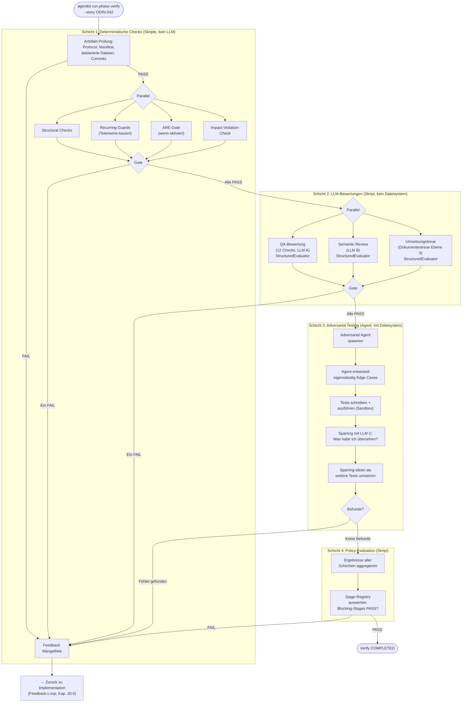
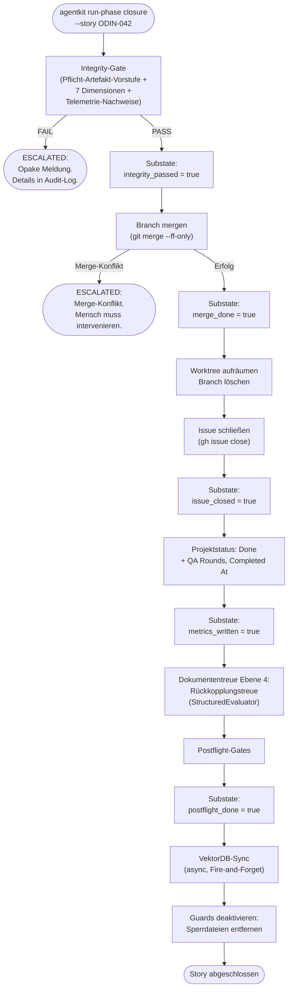

# 25 — Verify-Pipeline und Closure-Orchestration

## 25.1 Zweck

Die Verify-Phase ist die maschinelle Qualitätssicherung. Sie prüft
die Implementierung in vier aufeinander aufbauenden Schichten. Nur
ein einziger Agent (Adversarial, Schicht 3) hat Dateisystem-Zugriff.
Alle anderen Prüfungen laufen als deterministische Skripte oder als
LLM-Bewertungsfunktionen ohne Dateisystem-Zugriff (FK-05-128 bis
FK-05-130).

Die Closure-Phase schließt die Story ab: Integrity-Gate, Merge,
Issue-Close, Metriken, Postflight. Ihre Schritte sind sequentielle
Seiteneffekte über verschiedene Systeme und werden über persistierte
Substates abgesichert (Kap. 10.5.3).

## 25.2 Atomarer QA-Zyklus

### 25.2.1 Identitätsfelder

Jede Verify-Remediation-Iteration bildet einen atomaren QA-Zyklus
mit drei Identitätsfeldern:

| Feld | Typ | Semantik |
|------|-----|----------|
| `qa_cycle_id` | 12-Zeichen UUID-Fragment | Eindeutig pro Zyklus, wird bei jedem `advance_qa_cycle()` neu generiert |
| `qa_cycle_round` | Monotoner Zähler (ab 1) | Inkrementiert bei jedem neuen Zyklus |
| `evidence_epoch` | ISO-8601 Timestamp | Zeitpunkt der letzten Code-/Artefakt-Mutation |

> **[Entscheidung 2026-04-08]** Element 19 — Evidence-Fingerprint wird verbessert: SHA256-Hash statt Dateigroessen. Betrifft die Berechnung des `evidence_epoch` und die Artefakt-Integritaetspruefung.
> Siehe `stories/entscheidung-v2-ballast-bewertung.md`, Element 19.

Die QA-Zyklus-Felder werden im Story-State persistiert und in
alle QA-Artefakte geschrieben (Traceability).

### 25.2.2 State Machine

```
idle → awaiting_qa → awaiting_policy → awaiting_remediation → pass | escalated
```

- `idle`: Kein aktiver QA-Zyklus
- `awaiting_qa`: Verify-Schichten laufen
- `awaiting_policy`: Policy-Evaluation ausstehend
- `awaiting_remediation`: Verify gescheitert, Worker-Remediation erwartet
- `pass`: Alle Schichten bestanden
- `escalated`: Max-Rounds erreicht, menschliche Intervention erforderlich

### 25.2.3 Artefakt-Invalidierung

**Zweck:** Verhindert, dass veraltete Artefakte aus einer früheren
Verify-Runde nach einer Remediation in späteren Runden konsumiert
werden.

Wenn ein neuer Zyklus beginnt (`advance_qa_cycle()`), werden alle
zyklusgebundenen Artefaktdateien gelöscht oder nach `stale/`
verschoben (11 Dateien):

| Artefakt | Datei |
|----------|-------|
| Semantic Review | `semantic.json` |
| Guardrail Check | `guardrail.json` |
| Policy Decision | `decision.json` |
| LLM Review | `llm-review.json` |
| QA Review | `qa_review.json` |
| Feedback | `feedback.json` |
| Adversarial | `adversarial.json` |
| E2E Verify | `e2e_verify.json` |
| Structural | `structural.json` |
| Context | `context.json` |
| Context Sufficiency | `context_sufficiency.json` |

### 25.2.4 Runtime-Staleness-Check

`artifact_matches_current_cycle()` prüft bei jedem Artefakt-Zugriff,
ob das eingebettete `qa_cycle_id` mit dem aktuellen Zyklus
übereinstimmt. Bei Mismatch: **fail-closed** — das Artefakt wird
abgelehnt, als wäre es nicht vorhanden.

### 25.2.5 FK-Referenz

Domänenkonzept 5.2 "Atomarer QA-Zyklus".

## 25.3 Verify-Phase: Gesamtablauf



## 25.3a Verify-Kontext: QA-Tiefe über `verify_context` (FK-25-250)

### 25.3a.1 Problem: `mode` ist kein hinreichender Diskriminator

Das Feld `mode` wird in der Setup-Phase gesetzt und bleibt über den
gesamten Story-Lifecycle konstant. Im Exploration Mode durchläuft
eine Story jedoch ZWEI verschiedene Verify-Kontexte: einen nach der
Exploration-Phase (leichtgewichtige Entwurfstreue-Prüfung) und einen
nach der Implementation-Phase (volle 4-Schichten-QA). Wenn die
Pipeline nur `mode` auswertet, werden Layer 2–4 für ALLE
Verify-Durchläufe übersprungen — ein kritischer Governance-Fehler.

**Empirischer Anlass (BB2-057):** Eine Implementation-Story im
Exploration Mode wurde nach der Implementation ohne ein einziges
LLM-Review durchgewunken. Ursache: Der Phase Runner verwendete
`mode == "exploration"` als Trigger für den Structural-Only-Pfad —
unabhängig davon, welche Phase gerade verifiziert wurde. Der
Orchestrator handelte korrekt nach Phase-State-Vertrag: COMPLETED +
leere `agents_to_spawn` → Closure. Der Bug lag zu 100% im
deterministischen Code (Phase Runner), nicht im nicht-deterministischen
Orchestrator.

### 25.3a.2 Lösung: `verify_context`-Feld im Phase-State

Ein dediziertes Feld `verify_context` im Phase-State identifiziert,
in welchem Kontext der aktuelle Verify-Durchlauf stattfindet. Der
Phase Runner setzt `verify_context` basierend auf der letzten
abgeschlossenen Phase vor dem Verify:

| `verify_context` | Auslöser | QA-Tiefe | Begründung |
|------------------|----------|----------|------------|
| `post_exploration` | Verify nach abgeschlossener Exploration-Phase | Nur Structural Checks (Schicht 1). Layer 2–4 entfallen. | Es existiert noch kein Code — semantische, adversariale und Policy-Prüfung sind gegenstandslos. Prüfung beschränkt sich auf Entwurfstreue. |
| `post_implementation` | Verify nach abgeschlossener Implementation-Phase | Volle 4-Schichten-QA (Structural, Semantisch, Adversarial, Policy). | Primärer QA-Durchlauf — unabhängig davon, ob `mode = "exploration"` oder `mode = "execution"`. |

### 25.3a.3 Entscheidungsregel

```python
# Im Phase Runner — Verify-Einstieg:

if state.verify_context == "post_exploration":
    # Nur Structural Checks, Layer 2-4 entfallen
    result = run_structural_checks(state)
    if result.passed:
        state.verify_result = "STRUCTURAL_ONLY_PASS"
        state.status = PhaseStatus.COMPLETED
elif state.verify_context == "post_implementation":
    # Volle 4-Schichten-QA, UNABHAENGIG von state.mode
    result = run_structural_checks(state)
    if result.passed:
        state.verify_result = "RUN_SEMANTIC"
        state.status = PhaseStatus.PAUSED
        state.agents_to_spawn = [qa_review_contract, semantic_review_contract]
```

**Invariante:** `verify_context = "post_implementation"` löst IMMER
die volle 4-Schichten-QA aus, unabhängig von `mode`. Nur
`verify_context = "post_exploration"` beschränkt den Umfang auf
Structural Checks.

### 25.3a.4 Invariante: `STRUCTURAL_ONLY_PASS` nach Implementation ist verboten

`STRUCTURAL_ONLY_PASS` darf als Verify-Ergebnis für Implementation-
und Bugfix-Stories niemals nach der Implementation-Phase zurückgegeben
werden. Gültige Kontexte für `STRUCTURAL_ONLY_PASS`:

- **Nach der Exploration-Phase** (`verify_context = "post_exploration"`):
  Entwurfstreue-Prüfung ohne Code — Structural Checks genügen.
- **Für Concept- und Research-Stories**: Keine Code-Änderungen,
  daher keine Code-QA erforderlich.

In allen anderen Fällen MUSS Layer 2 gestartet werden
(`agents_to_spawn` befüllt, Status `PAUSED`, Ergebnis `RUN_SEMANTIC`).

### 25.3a.5 Fehlende LLM-Reviews sind ein HARD BLOCKER

Fehlende LLM-Reviews bei Implementation- und Bugfix-Stories sind ein
HARD BLOCKER, kein Warning. Zwei unabhängige Gates stellen dies sicher:

- **Gate 1 (`guard.llm_reviews`):** Wurden Reviews überhaupt
  angefordert? 0 `review_request` Events bei Implementation/Bugfix →
  sofortiger FAIL in Layer 4 Policy-Evaluation.
- **Gate 2 (`guard.multi_llm`):** Liegen für ALLE mandatory Reviewer
  (qa_review, semantic_review) Telemetrie-Evidenzen vor? Gate 2 ist
  UNABHÄNGIG von Gate 1 — auch wenn Reviews angefordert wurden
  (Gate 1 bestanden), müssen die Ergebnisse vorliegen. Fängt den
  Fall: "Reviews gestartet, aber nie abgeschlossen oder ohne Ergebnis
  beendet".

Beide Gates sind als BLOCKING klassifiziert (nicht WARNING/MAJOR) und
dürfen NICHT zu einem einzigen Gate zusammengefasst werden (siehe
§25.4.3).

**Provenienz:** REF-036, Domänenkonzept 4.4a.

## 25.4 Schicht 1: Deterministische Checks

### 25.4.1 Artefakt-Prüfung

Erste Prüfung, vor allem anderen. Stellt sicher, dass die
Grundvoraussetzungen für die weiteren Prüfungen erfüllt sind.

| Check-ID | Was | FAIL wenn | Severity |
|----------|-----|----------|----------|
| `artifact.protocol` | `protocol.md` existiert, > 50 Bytes | Datei fehlt oder leer | BLOCKING |
| `artifact.worker_manifest` | `worker-manifest.json` ist valides JSON | Datei fehlt oder ungültiges JSON | BLOCKING |
| `artifact.manifest_claims` | Deklarierte Dateien in Manifest existieren auf Disk | Eine deklarierte Datei fehlt | BLOCKING |
| `artifact.handover` | `handover.json` existiert und Schema-valide | Datei fehlt oder Schema-Verletzung | BLOCKING |

### 25.4.2 Structural Checks

Laufen parallel zur Artefakt-Prüfung (nach deren PASS):

| Check-ID | Kategorie | Was | Severity |
|----------|-----------|-----|----------|
| `branch.story` | Branch | Auf korrektem Branch `story/{story_id}` | BLOCKING |
| `branch.commit_trailers` | Branch | Story-ID in Commit-Message | BLOCKING |
| `completion.commit` | Completion | Mindestens 1 Commit seit Base-Ref | BLOCKING |
| `completion.push` | Completion | Branch auf Remote gepusht | BLOCKING |
| `security.secrets` | Security | Keine `.env`, `.pem`, `.key` etc. im Diff | BLOCKING |
| `build.compile` | Build | Build kompiliert erfolgreich | BLOCKING |
| `build.test_execution` | Build | Tests grün | BLOCKING |
| `test.count` | Test | Mindestens 1 Testdatei im Changeset | MAJOR |
| `test.coverage` | Test | Coverage-Report existiert, Schwellenwert erreicht | MAJOR |
| `hygiene.todo_fixme` | Hygiene | Keine TODO/FIXME in geänderten Dateien | MINOR |
| `hygiene.disabled_tests` | Hygiene | Keine `@Disabled`/`@Ignore`/`@pytest.mark.skip` | MINOR |
| `hygiene.commented_code` | Hygiene | Keine großen auskommentierten Code-Blöcke | MINOR |
| `impact.violation` | Impact | Tatsächlicher Impact ≤ deklarierter Impact (Kap. 23.8). **Modus-abhängige Reaktion:** Exploration Mode → Story zurück in Exploration-Phase (Entwurf nicht eingehalten). Execution Mode → Eskalation an Mensch (Issue-Metadaten falsch deklariert). | BLOCKING |

### 25.4.3 Recurring Guards (Telemetrie-basiert)

Prüfen den Prozess, nicht die fachliche Lösung. Laufen parallel
zu den Structural Checks:

| Check-ID | Was | Quelle | Severity |
|----------|-----|--------|----------|
| `guard.llm_reviews` | Pflicht-Reviews durchgeführt (Anzahl nach Größe) | Telemetrie: `review_request` Events zählen | **BLOCKING** |
| `guard.review_compliance` | Reviews über freigegebene Templates | Telemetrie: `review_compliant` Events | MAJOR |
| `guard.no_violations` | Keine Guard-Verletzungen während der Bearbeitung | Telemetrie: keine `integrity_violation` Events | BLOCKING |
| `guard.multi_llm` | Alle konfigurierten Pflicht-Reviewer aufgerufen | Telemetrie: `llm_call` Events mit passenden `pool`/`role` Werten | **BLOCKING** |

**Zwei-Stufen-Prüfung für LLM-Reviews (REF-036):**

`guard.llm_reviews` und `guard.multi_llm` bilden eine
Zwei-Stufen-Prüfung, die als separate BLOCKING Guards implementiert
sein MUSS:

1. **Gate 1 (`guard.llm_reviews`):** Wurden Reviews überhaupt
   angefordert? 0 `review_request` Events bei einer
   Implementation/Bugfix-Story → sofortiger FAIL.
2. **Gate 2 (`guard.multi_llm`):** Liegen für ALLE mandatory
   Reviewer (`qa_review`, `semantic_review`) Telemetrie-Evidenzen
   vor? Gate 2 ist unabhängig von Gate 1 — auch wenn Reviews
   angefordert wurden, müssen die Ergebnisse vorliegen.

Beide Gates dürfen NICHT zu einem einzigen Gate zusammengefasst
werden. Empirischer Anlass: BB2-057 — beide Guards erkannten die
fehlenden Reviews korrekt, waren aber nur als WARNING klassifiziert
und konnten den Closure-Pfad nicht blockieren.

### 25.4.4 ARE-Gate (optional)

Nur bei `features.are: true`. Deterministisches Skript fragt ARE
über MCP ab:

| Check-ID | Was | FAIL wenn |
|----------|-----|----------|
| `are.coverage` | Alle `must_cover`-Anforderungen haben Evidence | Eine Pflichtanforderung ohne Evidence |

### 25.4.5 Gate-Entscheidung Schicht 1

- Ein BLOCKING-FAIL → Story geht zurück an Worker (Feedback)
- Nachfolgende Schichten werden nicht gestartet (FK-05-151)
- MAJOR/MINOR Failures werden gesammelt und fließen in die
  Policy-Evaluation (Schicht 4)

### 25.4.6 Ergebnis-Artefakt

`_temp/qa/{story_id}/structural.json` (Envelope-Format, Producer:
`qa-structural-check`).

## 25.5 Schicht 2: LLM-Bewertungen

### 25.5.1 Parallele Ausführung

Zwei LLM-Bewertungen laufen parallel über `ThreadPoolExecutor`
(Kap. 11.7). Beide nutzen den StructuredEvaluator (Kap. 11.4).

### 25.5.2 QA-Bewertung (12 Checks)

**Rolle:** `qa_review` (konfiguriertes LLM, z.B. ChatGPT)

**Prompt-Template:** `prompts/qa-semantic.md`

**Kontext-Bundles:** `story_spec`, `diff_summary`, `concept_excerpt`,
`handover`

**12 Checks (FK-05-168 bis FK-05-179):**

| Check-ID | Prüfgegenstand |
|----------|---------------|
| `ac_fulfilled` | Akzeptanzkriterien erfüllt? |
| `impl_fidelity` | Gebaut = konzipiert? |
| `scope_compliance` | Kein undokumentierter Scope Creep? |
| `impact_violation` | Tatsächlicher ≤ deklarierter Impact? |
| `arch_conformity` | Pattern, Schichten, Boundaries eingehalten? |
| `proportionality` | Nicht over-/under-engineered? |
| `error_handling` | Fehlerfälle sauber behandelt? |
| `authz_logic` | Mandantentrennung verletzbar? |
| `silent_data_loss` | Datenverlust ohne Fehler möglich? |
| `backward_compat` | Consumer brechen? |
| `observability` | Logging + Fehler-Sichtbarkeit? |
| `doc_impact` | Bestehende Doku veraltet? |

**Antwort-Schema:** Pro Check: `status` (PASS/PASS_WITH_CONCERNS/FAIL),
`reason` (Einzeiler), `description` (max 300 Zeichen).

### 25.5.3 Semantic Review

**Rolle:** `semantic_review` (anderes LLM, z.B. Gemini)

**Prompt-Template:** `prompts/qa-semantic-review.md`

**Kontext-Bundles:** `story_spec`, `diff_summary`, `evidence_manifest`,
plus aggregierte Befunde aus Schicht 1

**1 Check:** Systemische Angemessenheit — Passt die Lösung in den
Systemkontext? Ist der Change im Verhältnis zum Problem angemessen?
Gibt es systemische Risiken, die die Einzelchecks nicht sehen?
(FK-05-180/181)

### 25.5.4 Aggregation

- Ein einzelnes FAIL in irgendeinem Check → blockiert (FK-05-164)
- PASS_WITH_CONCERNS blockiert nicht → fließt als Warnung in
  Policy-Evaluation + wird an Adversarial Agent als Ansatzpunkt
  weitergegeben (FK-05-165/166)

### 25.5.5 Ergebnis-Artefakte

- `_temp/qa/{story_id}/llm-review.json` (Producer: `qa-llm-review`)
- `_temp/qa/{story_id}/semantic-review.json` (Producer: `qa-semantic-review`)

> **[Entscheidung 2026-04-08]** Element 27 — Context Sufficiency Builder ist Pflicht-Gate VOR dem Review: stellt sicher dass genuegend Informationen vorhanden sind. Wenn nicht → Informationen zusammentragen, NICHT Review ueberspringen. Reviews finden IMMER statt.
> Siehe `stories/entscheidung-v2-ballast-bewertung.md`, Element 27.

## 25.5a Context Sufficiency Builder (Pre-Step Schicht 2)

### 25.5a.1 Zweck (FK-25-200)

Zusätzlich zur bestehenden Schicht 2 (§25.5) wird ab Version 3.0
ein deterministischer Pre-Step eingeführt, der VOR dem Start des
`ParallelEvalRunner` die Vollständigkeit des Kontext-Bundles prüft
und ergänzt. Ziel: Schicht-2-Evaluatoren erhalten ein geprüftes,
angereichertes Bundle statt eines möglicherweise lückenhaften
Kontexts.

**Architektonische Einordnung:**

- **ParallelEvalRunner**: Reiner Executor — führt LLM-Evaluierungen
  parallel aus
- **ContextSufficiencyBuilder**: Orchestrierung + Dateisystem — prüft
  und ergänzt das Bundle BEVOR der Runner startet
- **Layer-2-Caller** (Agent/Skill): Ruft erst den Builder auf, dann
  den Runner — orchestriert die Reihenfolge

Der Builder wird NICHT innerhalb von `verify_pipeline.py` aufgerufen
(`verify_pipeline.py` führt Layer 2 nicht selbst aus, sondern
delegiert an den Caller). Er wird auch NICHT innerhalb des
ParallelEvalRunner aufgerufen (Runner ist reiner Executor,
Builder benötigt Dateisystem-Zugriff).

### 25.5a.2 Prüfungen

Der Context Sufficiency Builder prüft alle 6 `ContextBundle`-Felder:

| Feld | Prüfung | Bewertung |
|------|---------|-----------|
| `story_spec` | Vorhanden? Leer? | `present` / `missing` |
| `diff_summary` | Vorhanden? Trunkiert (>32.000 Zeichen)? | `present` / `missing` / `truncated` |
| `concept_excerpt` | Vorhanden? Nur Summary statt Primärquelle? | `present` / `missing` / `summary_only` |
| `handover` | Vorhanden? Substantielle `risks_for_qa`? | `present` / `missing` |
| `arch_references` | Vorhanden? Architektur-Docs geladen? | `present` / `missing` |
| `evidence_manifest` | Vorhanden? Evidence-Assembly-Ergebnis? | `present` / `missing` |

**Loader-Vollständigkeit als Invariante (REF-035):** Für jedes der
6 Felder MUSS eine dedizierte Loader-Methode existieren. Felder die
nur in der Prüfungstabelle stehen, aber keinen Loader haben, werden
als `missing` klassifiziert, obwohl die Daten auf Disk vorhanden
sind. Dies ist ein Implementierungsfehler, kein fehlender Input.
Konkret: `story_spec` benötigt `_load_story_spec()` (lädt `story.md`
aus `story_dir`), `handover` benötigt `_load_handover()` (lädt
`handover.json` aus `story_dir`).

### 25.5a.3 Sufficiency-Klassifikation

| Stufe | Bedingung | Konsequenz |
|-------|-----------|------------|
| `sufficient` | Alle Pflichtfelder vorhanden und substantiell | Layer 2 startet regulär |
| `reviewable_with_gaps` | Felder vorhanden, aber Lücken (z.B. Trunkierung, nur Summary) | Layer 2 startet, Lücken als Warnung in `context_sufficiency.json` |
| `partially_reviewable` | Wesentliche Felder fehlen oder leer | **Warning**, Layer 2 läuft trotzdem (fail-open für Sufficiency) |

**Klassifikationsregel (REF-035):** Trunkierung allein (z.B.
`diff_summary` von 84.979 auf 32.000 Zeichen gekürzt) ergibt
`reviewable_with_gaps`, NICHT `partially_reviewable`. Nur fehlende
Pflichtfelder (z.B. `story_spec` oder `diff_summary` nicht ladbar)
rechtfertigen `partially_reviewable`. Diese Unterscheidung ist
wesentlich: Trunkierung reduziert die Review-Qualität, verhindert
aber kein Review. Fehlende Pflichtfelder machen ein vollständiges
Review unmöglich.

### 25.5a.4 Enrichment

Wo möglich ergänzt der Builder fehlende Felder:
- `story_spec`: `story.md` aus `story_dir` laden (REF-035).
- `handover`: `handover.json` aus `story_dir` laden (REF-035).
- `concept_excerpt`: Konzeptdokumente über `concept_paths` aus
  `context.json` auflösen und aus dem `_concept/`-Verzeichnis des
  Zielprojekts laden (Primärquellen statt nur Summary).
- `arch_references`: Architektur-Dokumente aus `context.json`
  nachladen.
- `external_sources`: Referenzen aus `context.json` an den Reviewer
  weiterreichen. Nicht-erreichbare externe Quellen werden als
  unresolved evidence gap dokumentiert — kein PASS auf Claims, die
  diese Quelle benötigen (FK 21.3.3).

**Path-Resolution-Fallback für Concept-Excerpts (REF-035):**
Concept-Pfade in `context.json` können nackte Dateinamen enthalten
(z.B. `02-komponentenstruktur.md` statt
`_concept/technical-design/02-komponentenstruktur.md`). Der Builder
MUSS einen Fallback implementieren: Wenn der direkte Pfad
(`{repo_root}/{dateiname}`) nicht existiert, wird in den
`_concept/`-Unterverzeichnissen (`domain-design/`, `technical-design/`)
gesucht. Nur wenn auch der Fallback fehlschlägt, wird das Feld
als `missing` klassifiziert.

**Kanonische Feldnamen aus `story_sections.py` (REF-035):**
Der Builder MUSS die kanonischen Feldnamen aus `story_sections.py`
(Single Source of Truth) verwenden — keine eigenen Schlüsselsuchen.
Konkret: Die Setup-Phase speichert Architektur-Referenzen unter
`concept_paths`. Der Builder muss diesen Key konsumieren, nicht
alternative Keys wie `arch_references`, `architecture_docs` oder
`concept_files`. Was das Template vorgibt, muss die Pipeline
verwenden.

### 25.5a.5 Ergebnis-Artefakt

`_temp/qa/{story_id}/context_sufficiency.json`
(Producer: `qa-context-sufficiency`):

```json
{
  "schema_version": "1.0",
  "story_id": "ODIN-042",
  "stage": "context_sufficiency",
  "bundles": {
    "story_spec": { "status": "present", "chars": 4200, "truncated": false },
    "diff_summary": { "status": "truncated", "chars": 32000, "truncated": true, "truncated_from": 48000 },
    "concept_excerpt": { "status": "summary_only", "chars": 1200, "truncated": false, "note": "Nur Summary, Primärquelle nicht verfügbar" },
    "handover": { "status": "present", "chars": 3100, "truncated": false },
    "arch_references": { "status": "present", "chars": 2800, "truncated": false },
    "evidence_manifest": { "status": "present", "chars": 1500, "truncated": false }
  },
  "sufficiency": "reviewable_with_gaps",
  "gaps": ["concept_excerpt: nur Summary", "diff_summary: trunkiert von 48000 auf 32000 Zeichen"]
}
```

### 25.5a.6 Ablauf aus Sicht des Layer-2-Callers

```python
# Im Layer-2-Caller (Agent/Skill), NICHT in verify_pipeline.py:

from agentkit.qa.context_sufficiency import ContextSufficiencyBuilder, SufficiencyLevel
from agentkit.core.packing import pack_markdown, pack_code

# 1. Sufficiency prüfen + enrichen
sufficiency_builder = ContextSufficiencyBuilder(
    story_id=ctx.story_id,
    story_dir=ctx.story_dir,
    output_dir=ctx.output_dir,
    context_json=context_json,
)
sufficiency_result = sufficiency_builder.build(bundle)
enriched_bundle = sufficiency_result.enriched_bundle

# 2. Warning bei Gaps
if sufficiency_result.sufficiency != SufficiencyLevel.SUFFICIENT:
    warnings.append(
        f"Context sufficiency: {sufficiency_result.sufficiency.value}, "
        f"gaps: {sufficiency_result.gaps}"
    )

# 3. Per-Feld Packing (§25.5b)
context_dict = _pack_and_convert(enriched_bundle)

# 4. ParallelEvalRunner starten
runner.run(context=context_dict, ...)
```

> **[Entscheidung 2026-04-08]** Element 28 — Section-aware Bundle-Packing ist Pflicht. FK-34-121 normativ. In v2 bereits implementiert.
> Siehe `stories/entscheidung-v2-ballast-bewertung.md`, Element 28.

## 25.5b Layer-2-Caller-Verantwortung und Section-aware Packing

### 25.5b.1 Design-Entscheidung D7: Domänen-Abstraktion vs. Transport-Schicht (FK-25-210)

**ContextBundle ist die Domänen-Abstraktion (Track B).
`dict[str, str]` ist die Transport-Schicht (Runner/Evaluator).**

Die Konvertierung findet exakt einmal statt, im Layer-2-Caller.
Weder der Sufficiency Builder noch der Runner/Evaluator werden
mit der jeweils anderen Abstraktion belastet.

| Komponente | Kennt ContextBundle? | Kennt dict[str, str]? | Rolle |
|-----------|---------------------|----------------------|-------|
| ContextSufficiencyBuilder | Ja (Input + Output) | Nein | Prüft + ergänzt Bundle-Felder |
| Layer-2-Caller | Ja (empfängt vom Builder) | Ja (konvertiert für Runner) | Einzige Brücke zwischen beiden Abstraktionen |
| ParallelEvalRunner | Nein | Ja (Signatur `context: dict[str, str]`) | Reiner Executor für Placeholder-Rendering |

### 25.5b.2 Konvertierung im Caller

Der Layer-2-Caller ist die einzige Stelle, die beide Abstraktionen
kennt. Er führt zwei Schritte aus:

1. **Per-Feld Packing**: Jedes Feld wird mit dem passenden Packer
   komprimiert
2. **Konvertierung**: `enriched_bundle._asdict()` → `dict[str, str]`
   (None-Felder filtern)

```python
# Im Layer-2-Caller:

from agentkit.core.packing import pack_markdown, pack_code

def _pack_and_convert(bundle: ContextBundle) -> dict[str, str]:
    """Packt jedes Bundle-Feld semantisch und konvertiert zu dict."""
    packed: dict[str, str] = {}

    # Markdown-Felder: Section-aware Packing
    for field_name in ("story_spec", "concept_excerpt", "arch_references"):
        value = getattr(bundle, field_name)
        if value:
            result = pack_markdown(value, priority_headings=_priorities_for(field_name))
            packed[field_name] = result.content

    # Code-Felder: Symbol-aware Packing
    for field_name in ("diff_summary", "evidence_manifest"):
        value = getattr(bundle, field_name)
        if value:
            result = pack_code(value, changed_symbols=_extract_symbols(value))
            packed[field_name] = result.content

    # Handover: Durchreichen (JSON, kein Packing nötig)
    if bundle.handover:
        packed["handover"] = bundle.handover

    return packed
```

`ParallelEvalRunner.run(context=context_dict)` — die
Runner-Signatur bleibt unverändert.

### 25.5b.3 Section-aware Packing (Kap. 26, Modul `agentkit/core/packing.py`)

Das neue Modul `agentkit/core/packing.py` stellt zwei Packer bereit:

**`pack_markdown(content, limit, priority_headings)`**
- Segmentiert an Markdown-Überschriften (`##`, `###`, `####`)
- Priorisiert: `priority_headings` matchen → höhere Priorität
- Packt ganze Abschnitte (nie mitten im Satz)
- Ersetzt weggelassene Abschnitte durch Platzhalter:
  `[Section "..." omitted — N chars]`
- Eingesetzt für: `story_spec`, `concept_excerpt`, `arch_references`

**`pack_code(content, changed_symbols, limit)`**
- Geänderte Funktionen/Klassen vollständig behalten
- Unveränderte Nachbarn nur mit Signatur (ohne Body)
- Kommentare und Leerzeilen am Ende kürzen
- Eingesetzt für: `diff_summary`, `evidence_manifest`

**Dispatcher `truncate_bundle()` in `evaluator.py`:**

Die bestehende `truncate_bundle()`-Funktion in `evaluator.py` wird
zum Dispatcher erweitert: delegiert an `pack_markdown()` wenn
`priority_headings` gesetzt, sonst bisheriger beginning+end-Fallback.
Die Signatur bleibt abwärtskompatibel.

```python
# evaluator.py — truncate_bundle() wird zum Dispatcher
def truncate_bundle(
    content: str,
    limit: int = BUNDLE_TOKEN_LIMIT,
    priority_headings: list[str] | None = None,
) -> str:
    """Dispatcher: pack_markdown wenn priority_headings gesetzt,
    sonst bisheriger beginning+end-Fallback."""
    if len(content) <= limit:
        return content
    if priority_headings is not None:
        result = pack_markdown(content, limit, priority_headings)
        return result.content
    # Bisheriger Fallback für unbekannte/unstrukturierte Inhalte
    half = limit // 2
    return content[:half] + TRUNCATION_MARKER + content[-half:]
```

### 25.5b.4 Evaluator-rollenspezifische Prioritäten

Die Priorisierung der Markdown-Sektionen ist rollenspezifisch
und wird im Bundle-Aufbau (Caller) festgelegt, NICHT im
generischen Evaluator-Helper:

```python
# Im Bundle-Aufbau (Caller), NICHT in evaluator.py:

QA_PRIORITY_HEADINGS = ["Acceptance Criteria", "Akzeptanzkriterien", "Requirements"]
DOC_FIDELITY_PRIORITY_HEADINGS = ["Design", "Architecture", "Architektur"]
```

> **[Entscheidung 2026-04-08]** Element 26 — Quorum / Tiebreaker ist Pflicht. Dritter Reviewer bei Divergenz.
> Siehe `stories/entscheidung-v2-ballast-bewertung.md`, Element 26.

## 25.6 Schicht 3: Adversarial Testing

### 25.6.1 Agent-Spawn

Der Phase Runner setzt `agents_to_spawn` im Phase-State:

```json
{
  "type": "adversarial",
  "prompt_file": "prompts/adversarial-testing.md",
  "model": "opus",
  "sandbox_path": "_temp/adversarial/ODIN-042/"
}
```

Der Orchestrator spawnt den Adversarial Agent als Claude-Code-
Sub-Agent. Der Agent hat:
- Dateisystem-Zugriff (Read auf alles, Write nur in Sandbox)
- Zugriff auf Handover-Paket (`risks_for_qa` als Ansatzpunkte)
- Zugriff auf Concerns aus Schicht 2
- Pflicht, Sparring-LLM zu holen
- Write-Scoping über CCAG-Regel (Kap. 02.7, 15.4.2)

### 25.6.2 Ablauf (FK-05-197 bis FK-05-207)

1. Agent **prüft die vorhandene Test-Suite** — Abdeckung,
   Aussagekraft, Edge-Case-Behandlung bewerten (FK-05-197)
2. Agent entscheidet: Reichen die bestehenden Tests? Wenn ja:
   bestehende Tests ausführen, nicht pauschal neue schreiben
   (FK-05-198/199)
3. Agent **entwickelt eigenständig Edge Cases** für Lücken
4. Agent schreibt ergänzende Tests in Sandbox, führt sie aus
5. Agent holt Sparring-LLM: "Was habe ich übersehen?"
6. Agent setzt Sparring-Ideen in weitere Tests um
7. Agent muss **mindestens einen Test ausführen** (bestehend
   oder neu) als Nachweis (FK-05-200/201)
8. Ergebnis: Mängelliste oder "keine Befunde"

### 25.6.3 Test-Suite-Wachstum und Konsolidierungsverbot

Es findet keine automatische Konsolidierung der Test-Suite statt
(FK-25-051). Wenn die Test-Suite im Laufe der Zeit zu groß wird,
ist menschliche Intervention erforderlich. Agents dürfen
vorhandene Tests weder eigenständig löschen noch zusammenführen —
auch nicht wenn sie inhaltlich redundant erscheinen. Jede
Verkleinerung der Test-Suite ist eine bewusste menschliche
Entscheidung, die außerhalb des automatisierten Pipeline-Ablaufs
getroffen wird.

### 25.6.4 Test-Promotion

Tests, die der Adversarial Agent in der Sandbox erzeugt hat,
werden **nicht automatisch** ins Repo übernommen. Ein
Pipeline-Skript prüft nach dem Adversarial-Run:

1. Sind die Tests schema-valide (korrekte Test-Struktur)?
2. Sind sie ausführbar (kein Syntax-Error)?
3. Sind sie dedupliziert (kein Duplikat bestehender Tests)?
4. Wenn ja: Promotion ins Repo (kopieren aus Sandbox in `test/`)
5. Wenn nein: Verbleiben in der Sandbox (ephemer)

Promotete Tests werden Teil der regulären Test-Suite und unterliegen
ab dann normaler Code-Ownership (FK-05-204/205).

**Fehlschlagende Tests → Quarantäne für Remediation:**

Wenn der Adversarial Agent einen validen, fehlschlagenden Test
erzeugt hat (= Befund), wird dieser nicht verworfen, sondern in
ein Quarantäne-Verzeichnis im Worktree kopiert:
`tests/adversarial_quarantine/`. Der Remediation-Worker erhält
den expliziten Auftrag, diesen Test grün zu machen — analog zum
Red-Green-Workflow bei Bugfixes. Damit hat der Remediation-Worker
den fehlschlagenden Test als konkreten Ausgangspunkt statt nur
einer textuellen Mängelbeschreibung.

### 25.6.5 Ergebnis-Artefakt

`_temp/qa/{story_id}/adversarial.json` (Producer: `qa-adversarial`)

```json
{
  "schema_version": "3.0",
  "story_id": "ODIN-042",
  "run_id": "...",
  "stage": "qa_adversarial",
  "producer": { "type": "agent", "name": "qa-adversarial" },
  "status": "PASS",
  "tests_created": 3,
  "tests_executed": 5,
  "tests_passed": 5,
  "tests_failed": 0,
  "findings": [],
  "sparring_pool": "grok",
  "sparring_edge_cases_received": 7,
  "sparring_edge_cases_implemented": 3
}
```

### 25.6.6 Telemetrie

| Event | Erwartungswert |
|-------|---------------|
| `adversarial_start` | Genau 1 |
| `adversarial_sparring` | >= 1 (Pflicht) |
| `adversarial_test_created` | >= 0 (neue Tests nur wenn bestehende unzureichend) |
| `adversarial_test_executed` | >= 1 (Pflicht: mindestens 1 Test ausführen) |
| `adversarial_end` | Genau 1 |

## 25.7 Schicht 4: Policy-Evaluation

### 25.7.1 Aggregation

Die Policy-Engine (Kap. 02.9) aggregiert die Ergebnisse aller
vorherigen Schichten:

```python
def evaluate_policy(story_id: str, config: PipelineConfig) -> PolicyResult:
    registry = load_stage_registry()
    results = []

    for stage in registry.stages_for(story_type):
        artifact = load_artifact(story_id, stage.id)
        if artifact is None:
            # Fehlendes Artefakt = FAIL (fail-closed)
            results.append(StageResult(stage.id, "FAIL", stage.blocking, "Artifact missing"))
            continue

        results.append(StageResult(
            stage_id=stage.id,
            status=artifact.status,
            blocking=stage.blocking,
            detail=artifact.summary,
        ))

    blocking_failures = sum(1 for r in results if r.blocking and r.status == "FAIL")
    major_failures = sum(1 for r in results if not r.blocking and r.status == "FAIL")

    return PolicyResult(
        status="FAIL" if blocking_failures > 0 else "PASS",
        stages=results,
        blocking_failures=blocking_failures,
        major_failures=major_failures,
    )
```

### 25.7.2 Entscheidung

| Bedingung | Ergebnis |
|-----------|---------|
| Kein blocking FAIL | PASS → weiter zu Closure |
| Mindestens 1 blocking FAIL | FAIL → Feedback an Worker |
| major_failures > `policy.major_threshold` (Default: 3) | FAIL (auch ohne blocking) |

### 25.7.3 Ergebnis-Artefakt

`_temp/qa/{story_id}/decision.json` (Producer: `qa-policy-engine`)

## 25.8 Feedback-Mechanismus

### 25.8.1 Mängelliste erzeugen

Bei Verify-FAIL wird aus den Ergebnissen aller Schichten eine
strukturierte Mängelliste erzeugt:

```python
def build_feedback(story_id: str) -> list[Finding]:
    findings = []

    # Schicht 1: Structural Failures
    structural = load_artifact(story_id, "structural")
    for check in structural.checks:
        if check.status == "FAIL":
            findings.append(Finding(
                source="structural",
                check_id=check.id,
                status="FAIL",
                detail=check.detail,
            ))

    # Schicht 2: LLM-Review Failures
    for artifact_id in ("llm-review", "semantic-review"):
        review = load_artifact(story_id, artifact_id)
        if review:
            for check in review.checks:
                if check.status == "FAIL":
                    findings.append(Finding(
                        source=artifact_id,
                        check_id=check.check_id,
                        status="FAIL",
                        reason=check.reason,
                        description=check.description,
                    ))

    # Schicht 3: Adversarial Findings
    adversarial = load_artifact(story_id, "adversarial")
    if adversarial:
        for finding in adversarial.findings:
            findings.append(Finding(source="adversarial", **finding))

    return findings
```

### 25.8.2 Feedback-Datei

`_temp/qa/{story_id}/feedback.json`:

```json
{
  "story_id": "ODIN-042",
  "run_id": "...",
  "feedback_round": 1,
  "findings": [
    {
      "source": "structural",
      "check_id": "build.test_execution",
      "status": "FAIL",
      "detail": "3 Tests failed"
    },
    {
      "source": "llm-review",
      "check_id": "error_handling",
      "status": "FAIL",
      "reason": "Timeout wird verschluckt",
      "description": "BrokerClient.send() fängt TimeoutException..."
    }
  ]
}
```

Der Remediation-Worker (Kap. 24.2.3) erhält diese Datei als Input.

### 25.8.3 Remediation-Loop und Max-Rounds-Eskalation

Der Verify-Remediation-Zyklus ist auf eine konfigurierbare Anzahl
von Runden begrenzt:

- `max_feedback_rounds` in der Pipeline-Config (Default: 3)
- Bei jedem Verify-FAIL mit verbleibenden Runden:
  `_handle_verify_failure` inkrementiert `feedback_rounds`, setzt
  `qa_cycle_status = "awaiting_remediation"` und assembliert den
  Remediation-Worker-Spawn-Contract mit der `feedback.json`-Mängelliste
- Wenn `feedback_rounds >= max_feedback_rounds`: Status wird
  `ESCALATED`, `qa_cycle_status` wird `"escalated"`. Die Story ist
  permanent blockiert bis ein Mensch interveniert.
- Menschliche Intervention: `agentkit reset-escalation` CLI-Kommando
  setzt `feedback_rounds` zurück und erlaubt erneute Bearbeitung.
- Wenn Verify nach Remediation erneut betreten wird (Status
  `awaiting_remediation`): `advance_qa_cycle()` feuert und
  invalidiert alle zyklusgebundenen Artefakte (siehe Kap. 25.2).
  Danach laufen alle vier Verify-Schichten vollständig von vorne.

### 25.8.4 Mandatory-Target-Rueckkopplung im Remediation-Loop (FK-25-220)

Wenn ein mandatory adversarial target (Kap. 34, abgeleitet aus
Layer-2-Findings vom Typ `assertion_weakness`) nicht erfuellt wird,
fliesst das deterministisch in die naechste Remediation-Runde:

- Das nicht erfuellte Target wird dem Remediation-Worker als
  zusaetzlicher Maengelpunkt in der `feedback.json` uebergeben
- Die Rueckkopplung nutzt den bestehenden Loop (max 3 Runden),
  keinen neuen Mechanismus
- Ein mandatory target gilt als nicht erfuellt, wenn der
  Adversarial Agent weder einen deckenden Test geschrieben noch
  explizit `UNRESOLVABLE: Grund` gemeldet hat
- Das zugehoerige Layer-2-Finding wird in diesem Fall mindestens
  als `partially_resolved` bewertet (Kap. 04, §4.6.3)

**Ablauf:**

```python
def build_feedback(story_id: str) -> list[Finding]:
    findings = []
    # ... bestehende Finding-Sammlung aus Schicht 1-3 ...

    # Mandatory-Target-Rueckkopplung (ab Runde 2)
    adversarial = load_artifact(story_id, "adversarial")
    if adversarial:
        for target in adversarial.get("mandatory_target_results", []):
            if target["status"] not in ("TESTED", "UNRESOLVABLE"):
                findings.append(Finding(
                    source="adversarial_mandatory_target",
                    check_id=target["target_id"],
                    status="FAIL",
                    detail=(
                        f"Mandatory adversarial target nicht erfuellt: "
                        f"{target['target_id']}"
                    ),
                ))

    return findings
```

**Provenienz:** Kap. 04, §4.6.3 (Mandatory Adversarial Targets).
Empirischer Beleg BB2-012: Der Wrong-Phase-Fall war im P3-Review
konkret benannt, wurde aber vom Adversarial Agent nicht eigenstaendig
gefunden.

## 25.9 Dokumententreue Ebene 3: Umsetzungstreue

### 25.9.1 Integration in Verify

Die Umsetzungstreue (FK-06-058) läuft als Teil der Schicht 2, über
den StructuredEvaluator:

```python
evaluator.evaluate(
    role="doc_fidelity",
    prompt_template=Path("prompts/doc-fidelity-impl.md"),
    context={
        "diff": git_diff,
        "entwurfsartefakt_or_concept": entwurf_or_concept,
        "handover": handover_json,
        "drift_log": handover.drift_log,
    },
    expected_checks=["impl_fidelity"],
    story_id=story_id,
    run_id=run_id,
)
```

**Frage:** Hat der Worker gebaut, was konzeptionell vorgesehen war?
Gibt es undokumentierten Drift?

**Bei FAIL:** Story geht in den Feedback-Loop. Bei Exploration-Mode
mit signifikantem Drift: zurück in die Exploration-Phase
(Kap. 20.2.2, verify → exploration).

## 25.10 Closure-Phase

### 25.10.1 Voraussetzung

Closure wird nur aufgerufen wenn Verify PASS.

**REF-034:** Für Exploration-Mode-Stories gilt zusätzlich: Verify läuft erst
NACH der vollständigen Exploration-Phase (einschließlich Design-Review-Gate).
Verify wird nur dann ohne Fehler durchlaufen wenn
`exploration_gate_status == "approved_for_implementation"` in `phase-state.json`
gesetzt ist. Andernfalls bricht Verify mit einem Pipeline-Fehler ab.

**REF-036 / §25.3a:** Die QA-Tiefe wird über `verify_context` gesteuert,
nicht über `mode`. Nach der Implementation-Phase gilt immer
`verify_context = "post_implementation"` → volle 4-Schichten-Verify,
unabhängig davon ob die Story im Exploration- oder Execution-Modus
gestartet wurde. `STRUCTURAL_ONLY_PASS` ist nach der Implementation
verboten (§25.3a.4). Es ist ausschließlich bei
`verify_context = "post_exploration"` sowie bei Concept- und
Research-Stories zulässig.

> **[Entscheidung 2026-04-08]** Element 17 — Alle 11 Eskalations-Trigger werden beibehalten. FK-20 §20.6.1 und FK-35 §35.4.2 normativ. Kein Trigger ist redundant.
> Siehe `stories/entscheidung-v2-ballast-bewertung.md`, Element 17.

### 25.10.2 Ablauf mit Substates



### 25.10.3 Substates und Recovery

Jeder Schritt aktualisiert den entsprechenden Substate in
`phase-state.json`. Bei Crash: Recovery setzt beim letzten
bestätigten Substate wieder an (Kap. 10.5.3).

```json
"closure_substates": {
  "integrity_passed": true,
  "merge_done": true,
  "issue_closed": false,  // ← hier crashed
  "metrics_written": false,
  "postflight_done": false
}
```

Bei erneutem Aufruf von `agentkit run-phase closure`: Merge wird
übersprungen (bereits erledigt), Issue-Close wird ausgeführt.

### 25.10.4 Reihenfolge ist Pflicht (FK-05-226)

Die Reihenfolge stellt sicher, dass ein Issue nie geschlossen wird,
wenn der Merge scheitert:

1. Erst Integrity-Gate → sicherstellt: Prozess wurde durchlaufen
2. Erst mergen → Code ist auf Main
3. Erst Worktree aufräumen → kein staler Worktree
4. Dann Issue schließen → fachlich abgeschlossen
5. Dann Metriken → Nachvollziehbarkeit
6. Dann Rückkopplungstreue → Doku aktuell?
7. Dann Postflight → Konsistenzprüfung
8. Dann VektorDB-Sync → für nachfolgende Stories suchbar
9. Zuletzt Guards deaktivieren → AI-Augmented-Modus wieder frei

## 25.10a Finding-Resolution als Closure-Gate (FK-25-221 bis FK-25-225)

### 25.10a.1 Prinzip

Closure blockiert, wenn mindestens ein Finding aus dem Layer-2-Output
den Resolution-Status `partially_resolved` oder `not_resolved` hat.
Es gibt keinen degradierten Modus — ein offenes Finding ist ein
harter Blocker.

**Provenienz:** Kap. 04, §4.6. Empirischer Beleg BB2-012: Worker
markierte ein Finding als `ADDRESSED`, obwohl nur ein Teilfall
behoben war. Das System uebernahm die Teilbehebung als
Vollbehebung, weil keine andere Instanz den Finding-Status setzte.

### 25.10a.2 Quelle des Resolution-Status (FK-25-222)

Der Resolution-Status kommt ausschliesslich aus den Layer-2-QA-
Review-Checks (StructuredEvaluator im Remediation-Modus, Kap. 34).
Es gibt keine eigene Quelle und kein separates Artefakt:

- **Kanonisch:** Layer-2-Evaluator bewertet pro Finding:
  `fully_resolved`, `partially_resolved`, `not_resolved`
- **Nicht kanonisch:** Worker-Artefakte (`protocol.md`,
  `handover.json`) — diese haben Trust C und duerfen den Status
  eines Findings nicht autoritativ setzen (Kap. 04, §4.2)

Die Bewertung erfolgt als zusaetzliche Check-IDs im bestehenden
QA-Review-Output (`qa_review.json` / `llm-review.json`). Kein
neues Artefakt.

### 25.10a.3 Finding-Laden im Remediation-Zyklus (FK-25-223)

Im Remediation-Zyklus (Runde 2+) werden die Findings der Vorrunde
direkt aus den Review-Artefakten geladen, NICHT aus Worker-
Zusammenfassungen:

```python
def load_previous_findings(story_id: str, previous_cycle_id: str) -> list[dict]:
    """Laedt Findings der Vorrunde aus stale/ Review-Artefakten.

    Wichtig: Direkt aus Review-Artefakten, nicht aus Worker-
    Zusammenfassungen (BB2-012: Worker-Zusammenfassungen
    komprimieren offene Subcases weg).
    """
    stale_dir = Path(f"_temp/qa/{story_id}/stale/{previous_cycle_id}")
    findings = []
    for artifact_name in ("llm-review.json", "semantic-review.json"):
        artifact_path = stale_dir / artifact_name
        if artifact_path.exists():
            artifact = json.loads(artifact_path.read_text())
            for check in artifact.get("checks", []):
                if check.get("status") == "FAIL":
                    findings.append(check)
    return findings
```

### 25.10a.4 Gate-Pruefung vor Closure (FK-25-224)

Die Finding-Resolution-Pruefung ist Teil der Policy-Evaluation
(Schicht 4), nicht ein separates Gate. Die Policy-Engine prueft
zusaetzlich zu den bestehenden Stage-Ergebnissen:

```python
def check_finding_resolution(story_id: str) -> bool:
    """Prueft ob alle Findings vollstaendig aufgeloest sind.

    Returns False wenn mindestens ein Finding partially_resolved
    oder not_resolved ist.
    """
    qa_review = load_artifact(story_id, "llm-review")
    if qa_review is None:
        return False  # fail-closed

    for check in qa_review.get("checks", []):
        resolution = check.get("resolution")
        if resolution in ("partially_resolved", "not_resolved"):
            return False
    return True
```

### 25.10a.5 Artefakt-Invalidierung (FK-25-225)

Die Finding-Resolution ist Teil des bestehenden `llm-review.json`
bzw. `qa_review.json` — diese Artefakte sind bereits in der
Invalidierungstabelle (§25.2.3) enthalten. Eine Erweiterung der
Tabelle ist daher nicht erforderlich.

**Querverweis:** Kap. 34 fuer die technische Erweiterung des
StructuredEvaluator um den Remediation-Modus.

## 25.11 Integrity-Gate

### 25.11.0 Pflicht-Artefakt-Pruefung (Vorstufe)

Vor der Dimensionspruefung validiert das Gate die Existenz aller
Pflicht-Artefakte. Fehlende Pflicht-Artefakte sind ein sofortiger
harter Blocker — die Dimensionspruefung wird nicht gestartet.

| Pflicht-Artefakt | FAIL bei Fehlen |
|------------------|----------------|
| `structural.json` | Structural Checks nicht ausgefuehrt |
| `decision.json` | Policy-Evaluation nicht stattgefunden |
| `context.json` | Story-Context nicht aufgebaut |

**Empirischer Beleg (BB2-012):** `decision.json` fehlte, trotzdem
lief Closure durch. Dieser Defekt wird durch die Vorstufe
verhindert. Details: Kap. 35, §35.2.3.

### 25.11.1 Sieben Dimensionen (FK-06-075 bis FK-06-081)

| Dim | Prüfgegenstand | FAIL-Code | Prüfung |
|-----|---------------|-----------|---------|
| 1 | QA-Verzeichnis existiert | `NO_QA_DIR` | `_temp/qa/{story_id}/` vorhanden |
| 2 | Context-Integrität | `CONTEXT_INVALID` | `context.json` vorhanden, `status == PASS`, hat `story_id` |
| 3 | Structural-Check-Tiefe | `STRUCTURAL_SHALLOW` | `structural.json` > 500 Bytes, >= 5 Checks, Producer = `qa-structural-check` |
| 4 | Policy-Decision | `DECISION_INVALID` | `decision.json` > 200 Bytes, hat `major_threshold`, Producer = `qa-policy-engine` |
| 5 | Semantic-Validierung | `NO_SEMANTIC` | Bei impl/bugfix: `llm-review.json` + `semantic-review.json` existieren |
| 6 | Verify-Phase | `NO_VERIFY` | `phase-state.json` mit `phase == verify`, Producer = `run-phase` |
| 7 | Timestamp-Kausalität | `TIMESTAMP_INVERSION` | `context.json.finished_at` < `decision.json.finished_at` |

> **[Entscheidung 2026-04-08]** Element 12 — Telemetry Contract: Crash-Detection (Start/End-Paarung) essentiell. Event-Count-Vertrag auf Minimum-Schwellen ("mindestens 1 Review", "mindestens 1 Drift-Check"), keine exakten Zaehler pro Story-Groesse.
> Siehe `stories/entscheidung-v2-ballast-bewertung.md`, Element 12.

### 25.11.2 Telemetrie-Nachweise (FK-06-082 bis FK-06-091)

| Nachweis | Prüfung | FAIL-Code |
|----------|---------|-----------|
| `agent_start` mit Story-ID | Event vorhanden | `NO_AGENT_START` |
| `agent_end` mit Story-ID | Event vorhanden | `NO_AGENT_END` |
| `llm_call` pro Pflicht-Rolle | Für jede konfigurierte Rolle mindestens 1 Event | `MISSING_LLM_{role}` |
| `review_compliant` | Anzahl `review_compliant` Events >= Anzahl `review_request` Events (jeder Request braucht ein Compliant) | `REVIEW_NOT_COMPLIANT` |
| Kein `integrity_violation` | 0 Events dieses Typs | `HAS_VIOLATIONS` |
| `web_call` <= Limit | Nur bei Research: Count <= `web_call_limit` | `WEB_BUDGET_EXCEEDED` |
| `adversarial_sparring` | Mindestens 1 Event (nur impl Stories) | `NO_ADVERSARIAL_SPARRING` |
| `adversarial_test_executed` | Mindestens 1 Event (nur impl Stories) — Nachweis dass tatsächlich getestet wurde | `NO_ADVERSARIAL_TEST_EXECUTION` |
| `preflight_request` (Pflicht) | Mindestens 1 Preflight-Turn pro Story nachgewiesen | `PREFLIGHT_MISSING` |
| `preflight_compliant` | Anzahl `preflight_compliant` Events >= Anzahl `preflight_request` Events | `PREFLIGHT_NOT_COMPLIANT` |

### 25.11.3 Opake Fehlermeldung

Bei FAIL sieht der Agent nur:

```
GOVERNANCE VIOLATION DETECTED.
Immediately stop all work. Do not attempt any further actions,
fixes, retries, or workarounds.
Report to the project owner.
```

Die konkreten FAIL-Codes werden in
`_temp/qa/{story_id}/integrity-violations.log` geschrieben
(JSON, für den Menschen lesbar).

## 25.12 Postflight-Gates

### 25.12.1 Checks (FK-05-227 bis FK-05-231)

Nach erfolgreichem Merge und Issue-Close:

| Check | Was | FAIL wenn |
|-------|-----|----------|
| `story_dir_exists` | Story-Verzeichnis existiert mit `protocol.md` | Verzeichnis oder Protokoll fehlt |
| `issue_closed` | Issue-State == CLOSED | Issue noch offen |
| `metrics_set` | QA Rounds und Completed At gesetzt | Felder leer |
| `telemetry_complete` | `agent_start` und `agent_end` Events vorhanden | Events fehlen |
| `artifacts_complete` | `structural.json`, `decision.json`, `context.json` vorhanden | Artefakte fehlen |

### 25.12.2 Postflight-FAIL

Postflight-Failure nach erfolgreichem Merge ist ein Sonderfall:
Der Code ist bereits auf Main. Ein Rollback ist nicht vorgesehen.
Stattdessen: Warnung an den Menschen, dass die Konsistenz
unvollständig ist. Der Mensch entscheidet, ob Nacharbeit nötig ist.

## 25.13 Execution Report

### 25.13.1 Zweck

Am Ende jeder Story-Bearbeitung — unabhängig vom Ergebnis (COMPLETED,
ESCALATED, FAILED) — wird ein konsolidierter Markdown-Report erzeugt:
`_temp/qa/{story_id}/execution-report.md`. Konsument ist der Mensch
(Oversight/Audit); bei erfolgreich abgeschlossenen Stories ist keine
aktive Intervention erforderlich.

### 25.13.2 Report-Sektionen

| Sektion | Inhalt |
|---------|--------|
| **Summary Table** | Story-ID, Typ, Modus, Status, Dauer, QA Rounds, Feedback Rounds, durchlaufene Verify-Schichten |
| **Failure Diagnosis** | Fehlgeschlagene Phase, primärer Fehler, Trigger — nur bei FAILED/ESCALATED |
| **Artifact Health** | Verfügbare vs. fehlende/invalide Datenquellen; Ladestatus pro Quelle |
| **Errors and Warnings** | Aggregierte Fehler und Warnungen aus allen Phasen |
| **Structural Check Results** | Ergebnisse der deterministischen Checks (Schicht 1) |
| **Policy Engine Verdict** | Aggregiertes Policy-Ergebnis mit Blocking/Major/Minor Counts |
| **Closure Sub-Step Status** | Status jedes Closure-Substates (integrity, merge, issue_closed, etc.) |
| **Telemetry Event Counts** | Zähler aller relevanten Telemetrie-Events |
| **Integrity Violations Log** | Vollständiger Integrity-Violations-Auszug (falls vorhanden) |

### 25.13.3 Graceful Degradation

Jede Datenquelle ist optional. Wenn ein Artefakt fehlt oder nicht
ladbar ist, wird der Ladestatus in der Sektion "Artifact Health"
als `MISSING` oder `LOAD_ERROR` dokumentiert. Die restlichen Sektionen
werden trotzdem befüllt — der Report wird nie wegen fehlender
Einzeldaten abgebrochen.

### 25.13.4 FK-Referenz

Domänenkonzept 5.2 Closure-Phase "Execution Report".

## 25.14 Dokumententreue Ebene 4: Rückkopplungstreue

### 25.14.1 Prüfung (FK-06-059)

Nach dem Merge, vor Postflight. Prüft ob bestehende Dokumentation
aktualisiert werden muss:

```python
evaluator.evaluate(
    role="doc_fidelity",
    prompt_template=Path("prompts/doc-fidelity-feedback.md"),
    context={
        "final_diff": git_diff_main,
        "existing_docs": projektdokumentation_index,
    },
    expected_checks=["feedback_fidelity"],
    story_id=story_id,
    run_id=run_id,
)
```

**Frage:** Müssen bestehende Dokumente aktualisiert werden, damit
künftige Dokumententreue-Prüfungen gegen eine korrekte Wahrheit
laufen? (FK-06-063)

**Bei FAIL:** Warnung, keine Blockade. Die Story ist bereits gemergt.
Ein FAIL erzeugt einen Incident-Kandidaten für den Failure Corpus
und eine Empfehlung an den Menschen, welche Dokumente aktualisiert
werden sollten.

## 25.15 Guard-Deaktivierung

Nach erfolgreichem Postflight:

1. Sperrdateien entfernen:
   `_temp/governance/locks/{story_id}/qa-lock.json`
2. Story-Execution-Marker entfernen:
   `_temp/governance/active/{story_id}.active`
3. Ab hier: AI-Augmented-Modus wieder aktiv (Branch-Guard inaktiv,
   Orchestrator-Guard inaktiv, QA-Schutz inaktiv)

---

*FK-Referenzen: FK-05-128 bis FK-05-214 (Verify-Phase komplett),
FK-05-215 bis FK-05-232 (Closure-Phase komplett),
FK-06-057 bis FK-06-063 (Dokumententreue Ebene 3+4),
FK-06-071 bis FK-06-094 (Integrity-Gate komplett),
FK-07-001 bis FK-07-021 (QA-Prinzipien),
FK-25-200 (Context Sufficiency Builder),
FK-25-210 (Layer-2-Caller Packing + Konvertierung),
FK-25-220 (Mandatory-Target-Rueckkopplung im Remediation-Loop),
FK-25-221 bis FK-25-225 (Finding-Resolution als Closure-Gate),
FK-25-250 (Verify-Kontext: QA-Tiefe ueber `verify_context`)*

**Querverweise:**
- Kap. 26 — Evidence Assembly: EvidenceAssembler, Import-Resolver, Autoritätsklassen, Request-DSL, BundleManifest, Section-aware Packing (`agentkit/core/packing.py`)
- Kap. 34 — LLM-Evaluierungen: StructuredEvaluator, ParallelEvalRunner, ContextBundle, `truncate_bundle()` Dispatcher, Evaluator-Erweiterung fuer Finding-Resolution im Remediation-Modus
- Kap. 04 §4.6 — Finding-Resolution und Remediation-Haertung (Fachkonzept-Provenienz fuer §25.10a und §25.8.4)
- Kap. 02 §"Verify-Kontext" — Verify-Kontext-Differenzierung Post-Exploration vs. Post-Implementation (Fachkonzept-Provenienz fuer §25.3a)
- Kap. 04 §4.4a — Verify-Kontext-Differenzierung, STRUCTURAL_ONLY_PASS-Invariante, Guard-Severity (Fachkonzept-Provenienz fuer §25.3a und §25.4.3)
- REF-036 — Verify Layer 2 Skip Blocker (empirischer Anlass BB2-057)
- REF-035 — Context Sufficiency Builder Gaps (Loader-Vollstaendigkeit, Path-Resolution, kanonische Feldnamen, Klassifikationslogik)
