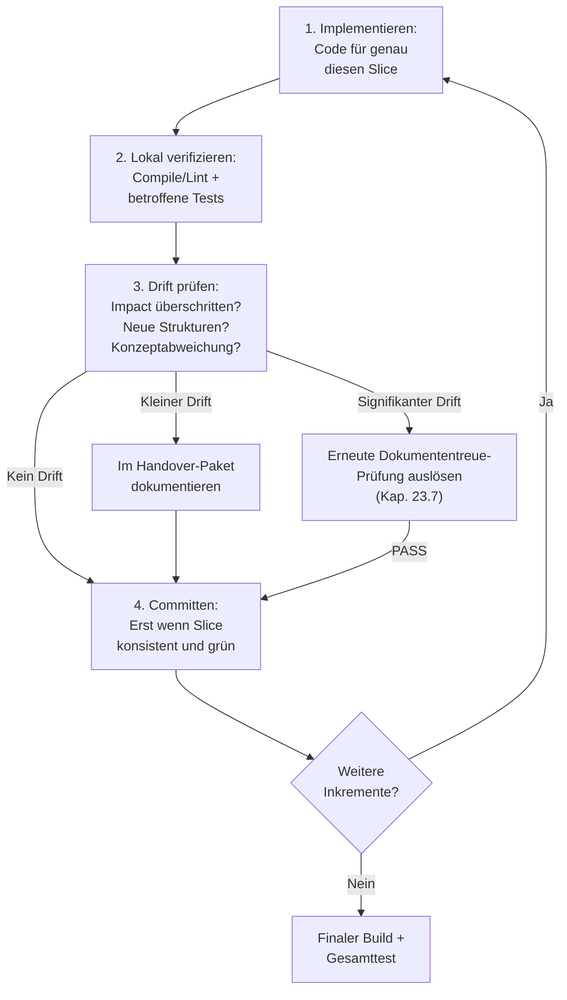
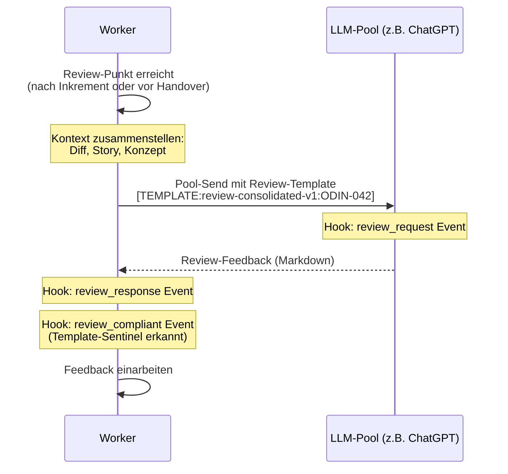
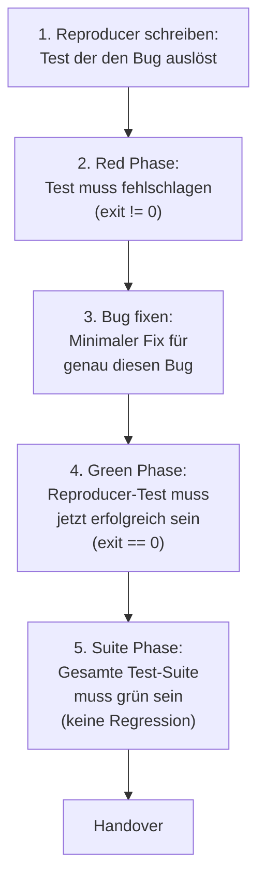

# 26 — Implementation-Runtime und Worker-Loop

## 26.1 Zweck

Die Implementation-Phase ist der einzige nicht-deterministische
Schritt in der Pipeline (FK-05-093). Der Worker-Agent (Claude Code
Sub-Agent) schreibt Code, erstellt Tests und erzeugt Artefakte.
AgentKit steuert nicht, was der Worker implementiert — das bestimmt
der Worker selbst basierend auf Story, Konzept und Prompt. AgentKit
steuert den **Rahmen**: Worktree-Isolation, Guards, Review-Pflicht,
Inkrement-Disziplin, Handover-Paket.

> **[Entscheidung 2026-04-08]** Element 2 — SpawnReason wird als StrEnum in `core/types.py` konsolidiert. Werte: `INITIAL`, `PAUSED_RETRY`, `REMEDIATION`. Betrifft den Worker-Start (§26.2) und die Worker-Varianten (§26.2.3).
> Siehe `stories/entscheidung-v2-ballast-bewertung.md`, Element 2.

## 26.2 Worker-Start

### 26.2.1 Startprotokoll

Der Orchestrator spawnt den Worker als Sub-Agent ueber den
konfigurierten Harness (Claude Code oder Codex; siehe FK-30 §30.11
Multi-Harness):

```mermaid
sequenceDiagram
    participant O as Orchestrator
    participant H as Harness
    participant W as Worker-Agent

    O->>H: Spawn worker<br/>prompt_file=worker-implementation.md
    Note over H: Hook: agent_start Event<br/>(Telemetrie)
    H->>W: Neue Session mit Prompt
    Note over W: Worker hat Zugriff auf:<br/>- Worktree-Map (Repo-Name -> Worktree-Pfad,<br/>  einer pro teilnehmendem Repo;<br/>  FK-22 §22.6.4)<br/>- Prompts, Skills<br/>- LLM-Pools (für Reviews)<br/>- NICHT: QA-Artefakte (gesperrt)
```

Bei Multi-Repo-Stories (`participating_repos` mit |N| >= 2) erhaelt
der Worker eine Worktree-Map als Spawn-Vertrag; der erste Eintrag
in `participating_repos` ist der deterministische Spawn-CWD ohne
fachliche Sonderrolle. Schreiben in nicht-teilnehmende Repos ist
verboten (FK-22 §22.6.1).

> **[Entscheidung 2026-04-08]** Element 9 — WorkerContextItem / WORKER_CONTEXT_SPEC wird als Runtime-Gate in `prompting/workers` uebernommen. `WorkerContextItemKey` als StrEnum. Registry mit `key`, `source`, `required_when`, `applies_to`. Aufrufkette: `resolve_worker_context()` → `validate_worker_context()` → `compose_worker_prompt()`. Getrennt von Workflow-DSL (Phasenlogik ≠ Spawn-Vertrag).
> Siehe `stories/entscheidung-v2-ballast-bewertung.md`, Element 9.

### 26.2.2 Worker-Kontext

Der Worker erhält bei Start folgende Informationen:

| Kontext | Quelle | Wie |
|---------|--------|-----|
| Story-Beschreibung | `context.json` | Im Prompt eingebettet |
| Akzeptanzkriterien | Story-Attribut `acceptance_criteria` (aus `context.json`) | Im Prompt eingebettet |
| Konzept/Entwurf (wenn vorhanden) | `entwurfsartefakt.json` oder Konzeptquellen (aus `concept_paths`) | Als Datei-Referenz im Prompt |
| Guardrails | `_guardrails/` Dateien (aus `context.json`) | Als Datei-Referenzen im Prompt |
| Mängelliste (bei Remediation) | `_temp/qa/{story_id}/feedback.json` | Als Datei-Referenz im Prompt |
| Story-Typ und Größe | `context.json` | Im Prompt (bestimmt Review-Häufigkeit) |
| ARE must_cover (wenn aktiviert) | Über MCP von ARE | Im Prompt eingebettet |
| Worktree-Map (bei Multi-Repo) | `participating_repos` aus `context.json` plus aufgeloeste Worktree-Pfade | Tabelle im Prompt; erster Eintrag ist Spawn-CWD |

### 26.2.3 Worker-Varianten

| Story-Typ | Prompt | Besonderheiten |
|-----------|--------|---------------|
| Implementation | `worker-implementation.md` | Volle Inkrement-Disziplin, TDD/Test-After |
| Bugfix | `worker-bugfix.md` | Red-Green-Suite TDD-Workflow, Reproducer-Pflicht |
| Remediation | `worker-remediation.md` | Arbeitet Mängelliste ab (Feedback-Loop) |

### 26.2.4 Spezialfall `implementation_contract=integration_stabilization`

Fuer diesen Vertrag gelten vor dem produktiven Worker-Start zusaetzlich:

- Exploration ist bereits erfolgreich abgeschlossen
- ein freigegebenes `integration_scope_manifest` liegt vor
- der Guard-Export fuer `seam_allowlist` und `stabilization_budget`
  ist materialisiert

Der Worker arbeitet dann **nicht frei quer durch das Projekt**,
sondern nur innerhalb der durch das Manifest freigegebenen
Cross-Scope-Flaechen.

## 26.3 Inkrementelles Vorgehen

### 26.3.1 Vertikale Inkremente (FK-05-094 bis FK-05-104)

Der Worker schneidet die Story in **vertikale Inkremente**, nicht
nach technischen Schichten. Jedes Inkrement ist ein fachlich
lauffähiger Teilstand.

[Klarstellung 2026-05-04 — Inkremente bei Multi-Repo] Inkremente
sind Worker-internes Strukturierungs-Pattern, kein fachlicher
Vertrag. Bei Multi-Repo-Stories darf ein vertikales Inkrement
mehrere teilnehmende Repos beruehren (z. B. API-Aenderung in einem
Repo plus Aufrufer-Anpassung im anderen) und entsprechend N Commits
in N Worktrees enthalten. Die fachliche Atomicity-Garantie
entsteht aus der Closure-Atomar-Eigenschaft (FK-29 §29.1.6) und der
QA-Bewertung der Story als Ganzes — nicht aus dem einzelnen
Inkrement.

**Falsch (technische Schichten):**
```
Inkrement 1: Alle Entities/Models
Inkrement 2: Alle Services
Inkrement 3: Alle Controller
Inkrement 4: Alle Tests
```

**Richtig (vertikale Slices):**
```
Inkrement 1: MarketQuote Entity + BrokerAdapter + REST-Endpoint + Tests
Inkrement 2: WebSocket-Streaming + Event-Handling + Tests
Inkrement 3: Error-Handling + Retry-Logik + Tests
```

> **[Entscheidung 2026-04-08]** Element 4 — IncrementStep / INCREMENT_CYCLE wird als StrEnum + geordnetes Tupel uebernommen. Exakt wie FK-26 spezifiziert. Beschreibungen als Enum-Property, nicht als separate Dicts.
> Siehe `stories/entscheidung-v2-ballast-bewertung.md`, Element 4.

### 26.3.2 Vier-Schritt-Zyklus pro Inkrement



### 26.3.3 Schritt 1: Implementieren

Code für genau diesen Slice schreiben. Nicht mehr, nicht weniger.
Kein opportunistisches Refactoring benachbarter Bereiche.

### 26.3.4 Schritt 2: Lokal verifizieren

Kleinster verlässlicher Check — **nicht** Full-Build:

| Was | Wie |
|-----|-----|
| Compile/Lint | `build_command` der vom Inkrement berührten Repos aus `project.repositories[]` (z. B. `mvn compile`, `ruff check`) |
| Betroffene Tests | Nur Tests für den geänderten Bereich, mit `test_command` der berührten Repos (z. B. `pytest test_broker.py`) |
| Nicht: Full-Build | Der vollständige Build bleibt dem finalen Check vor Handover vorbehalten |

[Klarstellung 2026-05-04 — Multi-Repo lokal verifizieren] Bei
Multi-Repo-Inkrementen werden `build_command` und `test_command` nur
fuer die im Inkrement **berührten** Repos durchlaufen, nicht fuer
alle teilnehmenden Repos. Cross-Repo-Brueche, die ein Inkrement nicht
offensichtlich trifft, werden beim finalen Gesamttest vor Handover
(§26.6) erkannt — der laeuft ueber **alle teilnehmenden Repos**.

### 26.3.5 Schritt 3: Drift prüfen

Der Worker prüft bei jedem Inkrement:

- Überschreite ich den genehmigten Impact?
- Habe ich neue Strukturen eingeführt, die nicht im Entwurf stehen?
- Weiche ich vom Konzept ab?

**Zweistufige Drift-Erkennung:**

Drift wird nicht allein dem Worker überlassen — das würde dem
Bedrohungsmodell widersprechen (Agents sind unzuverlässig und
melden eigenen Drift nicht zuverlässig). Stattdessen zwei Stufen:

**Stufe 1: Hook-basierte Drift-Erkennung (deterministisch)**

Der `increment_commit`-Hook (PreToolUse für `git commit` im
Worktree) löst bei jedem Commit ein leichtgewichtiges
Drift-Evaluator-Skript aus:

1. Diff seit letztem Commit berechnen
2. Geänderte Module/Pfade extrahieren
3. Gegen `entwurfsartefakt.json` (Exploration Mode) oder
   Konzeptquellen (Execution Mode) vergleichen:
   - Neue Dateien in nicht-deklarierten Modulen?
   - Neue API-Endpunkte oder Schema-Dateien, die nicht im
     Entwurf stehen?
4. Bei erkanntem signifikantem Drift: `drift_check`-Event mit
   `result: "drift"` in Telemetrie + Orchestrator wird über
   Phase-State informiert (Flag `drift_detected: true`)
5. Bei keinem Drift: `drift_check`-Event mit `result: "ok"`

**Stufe 2: Worker-Selbsteinschätzung (ergänzend)**

Der Worker-Prompt fordert den Worker zusätzlich auf, bei jedem
Inkrement selbst zu prüfen, ob er vom Konzept abweicht. Das ist
die weiche Schicht — sie fängt semantische Abweichungen, die der
deterministische Diff-Check nicht sieht (z.B. anderes Pattern
gewählt, Detailentscheidung anders als im Entwurf).

**Reaktion bei signifikantem Drift (FK-05-102):**

Wenn Stufe 1 oder 2 signifikanten Drift erkennt (neue Strukturen
oder Impact-Überschreitung):

1. Orchestrator erkennt `drift_detected: true` im Phase-State
2. Orchestrator stoppt den Worker
3. Orchestrator ruft `agentkit run-phase exploration` erneut
   auf — nur Dokumententreue-Prüfung, kein neues
   Entwurfsartefakt
4. Bei PASS: Orchestrator spawnt neuen Worker, der ab dem
   Drift-Punkt weiterarbeitet
5. Bei FAIL: Eskalation an Mensch

Bei kleineren Abweichungen (anderes Pattern, Detailentscheidung)
reicht die Dokumentation im Handover-Paket — kein Stopp nötig.

**Vertragsspezifische Erweiterung fuer `integration_stabilization`:**

Der Drift-Check prueft nicht nur gegen Story-Spec und Entwurfsartefakt,
sondern gegen:

- `story.md`
- `integration_scope_manifest`
- `allowed_repos_paths`
- `allowed_contract_changes`

Wird eine produktive Surface ausserhalb dieses Manifests beruehrt,
ist das kein normaler Drift, sondern ein harter Befund
`undeclared_surface` mit Reaktion:

- `PAUSED.integration_replan_required`
- oder Rueckfuehrung in `scope_explosion`

je nach Mandatsklassifikation.

### 26.3.7 Stabilisierungsschleife fuer systemische Integrationsstories

Bei `implementation_contract=integration_stabilization` darf der Worker
mehrere budgetierte Schleifen durchlaufen:

1. Integrationsziel bzw. E2E-Fall ausfuehren
2. Defekt innerhalb der genehmigten Seams beheben
3. lokal klein pruefen
4. erneuten Integrations-Verify anstossen

Die Schleife ist kein freier Dauerlauf. Sie bleibt an das im Manifest
freigegebene `stabilization_budget` gebunden.

### 26.3.6 Schritt 4: Committen

Erst wenn der Slice intern konsistent und lokal grün ist:

```bash
git add -A
git commit -m "feat: implement broker adapter for market quotes

Story-ID: ODIN-042"
```

Der Telemetrie-Hook erkennt `git commit` im Worktree und erzeugt
ein `increment_commit`-Event.

## 26.4 Teststrategie

### 26.4.1 Regelwerk (FK-05-106 bis FK-05-115)

Der Worker wählt die Teststrategie **nicht frei**, sondern situativ
nach Regelwerk:

| Strategie | Wann | Begründung |
|-----------|------|-----------|
| **TDD (Tests zuerst)** | Deterministische Logik: Berechnungen, Validierungsregeln, Mappings, Zustandsübergänge, Parser | Tests als Anker gegen Halluzinationen: zuerst definieren was korrekt ist, dann dagegen implementieren |
| **TDD (Bugfix)** | Bugfix-Reproduktionen: erst den Bug als fehlschlagenden Test formulieren | Red-Green-Suite-Workflow (Kap. `worker-bugfix.md`) |
| **Test-After** | Integrations-Verdrahtung: neue E2E-Verkabelung, externe Integrationen, Framework-Konfiguration, Migrationspfade | Erst muss die technische Lauffähigkeit hergestellt werden, bevor sinnvolle Tests formuliert werden können |

### 26.4.2 Testtypen

| Testtyp | Wann | Beispiel |
|---------|------|---------|
| **Unit-Tests** | Verhalten in Isolation beweisbar | Domänenlogik, Entscheidungsregeln, Transformationen |
| **Integrationstests** | Wahrheit an echter Grenze | DB-Zugriff, API-Vertrag, Messaging, Berechtigungen |
| **E2E-Tests** | Nur Gesamtablauf beweist Story | Geschäftskritischer User-Flow, Zusammenspiel mehrerer Schichten |

### 26.4.3 Pflichten

- Vor Handover müssen beide Testarten (TDD und Test-After)
  zusammengeführt sein (FK-05-114)
- Kein Inkrement bleibt ungetestet (FK-05-115)
- Mindestens 1 Integrationstest pro Story (Prompt-Vorgabe)
- Bei Bugfix: Reproducer-Test ist Pflicht (Red-Green-Suite)

## 26.5 Reviews durch konfigurierte LLMs

> **[Entscheidung 2026-04-08]** Element 25 — LLM-Pool-basierte Reviews sind Pflicht. Immer ueber LLM-Pools. Kein Claude-Sub-Agent-Fallback.
> Siehe `stories/entscheidung-v2-ballast-bewertung.md`, Element 25.

### 26.5.1 Pflicht-Reviews (FK-05-116 bis FK-05-122)

Der Worker holt sich während der Implementierung Reviews von
anderen LLMs. Die Reviewer sind in `llm_roles` konfiguriert,
nicht frei wählbar.

**Zweck:** Praeventiv — Architektur-Drift frueh erkennen, blinde
Flecken aufdecken, Seiteneffekte identifizieren. Reviews ersetzen
nicht den QA-Subflow.

### 26.5.2 Review-Mindestfrequenz

| Metrik | Minimum-Schwelle |
|--------|-----------------|
| `review_request` | Mindestens 1 pro Story |
| `drift_check` | Mindestens 1 pro Story |

> **[Entscheidung 2026-04-08]** Element 10 — ReviewFlowModel / ReviewFlowStep entfaellt als Runtime-Datenstruktur in v3. Der Review-Ablauf beschreibt Worker-Verhalten, keine Runtime-Steuerung. Die Sequenz gehoert in das Prompt-Template.
> Siehe `stories/entscheidung-v2-ballast-bewertung.md`, Element 10.

### 26.5.3 Review-Ablauf



**Template-Sentinel:** Der Worker muss das Review über ein
freigegebenes Template senden (nicht freiformulieren). Der
Review-Guard (Kap. 68.5) erkennt den Sentinel und erzeugt ein
`review_compliant`-Event. Das Integrity-Gate prüft bei Closure,
ob alle Review-Requests ein zugehöriges `review_compliant` haben.

> **[Entscheidung 2026-04-08]** Element 5 — ReviewTemplate / REVIEW_TEMPLATE_REGISTRY wird als StrEnum + Registry uebernommen. Felder: `template`, `filename`, `applies_to`. Felder `description` und `use_case` entfallen (nicht programmatisch genutzt).
> Siehe `stories/entscheidung-v2-ballast-bewertung.md`, Element 5.

### 26.5.4 Review-Templates

Die Templates liegen in `prompts/sparring/`:

| Template | Zweck |
|----------|-------|
| `review-consolidated.md` | Konsolidiertes Code-Review (Standard) |
| `review-bugfix.md` | Bugfix-spezifisches Review |
| `review-spec-compliance.md` | Spezifikations-Compliance |
| `review-implementation.md` | Implementierungs-Review |
| `review-test-sparring.md` | Test-Sparring (Edge Cases) |
| `review-synthesis.md` | Synthese über alle bisherigen Reviews |

## 26.5a Review-Versand ueber Evidence Assembly

> Ab Version 3.0 wird der Review-Versand des Workers ueber die
> Komponente `EvidenceAssembler` (`agentkit.verify_system.evidence_assembler`)
> abgewickelt (CLI: `agentkit evidence assemble`).
> Der Worker kuratiert keine `merge_paths` mehr selbst; das
> deterministisch assemblierte BundleManifest liefert die
> `merge_paths` fuer den Review-Versand. Details: **FK-28**.

## 26.5b Preflight-Turn im Review-Flow

> Vor dem eigentlichen Review laeuft ein Pflicht-Preflight-Turn,
> in dem das Review-LLM ueber die Request-DSL fehlenden Kontext
> nachfordern darf (max 8 strukturierte Requests). Der
> Preflight-Sentinel `[PREFLIGHT:review-preflight-v1:{story_id}]`
> ist bewusst vom Review-Sentinel `[TEMPLATE:...]` getrennt.
> Telemetrie-Events: `preflight_request`, `preflight_response`,
> `preflight_compliant`. Die `EvidenceAssembler`-Schnittstelle
> (`agentkit.verify_system.evidence_assembler`) ist normativ in
> **FK-28** beschrieben. Details: **FK-47**.

## 26.6 Finaler Build und Gesamttest

Nachdem alle Inkremente fertig und commited sind:

1. **Vollständiger Build:** Gesamtes Projekt kompilieren
   (nicht nur betroffene Module). Bei Multi-Repo: `build_command`
   **aller teilnehmenden Repos** aus `project.repositories[]`
   durchlaufen.
2. **Gesamte Test-Suite:** Alle Tests ausführen (nicht nur
   betroffene Tests) — Regression erkennen. Bei Multi-Repo:
   `test_command` **aller teilnehmenden Repos** durchlaufen. Diese
   Stufe ist die Sicherheits-Klammer fuer Cross-Repo-Brueche, die
   waehrend der Inkrement-Pruefung (§26.3.4) nicht erfasst wurden.
3. **Push:** Story-Branch auf Remote pushen. Bei Multi-Repo: pro
   teilnehmendem Repo (`git push -u origin story/{story_id}` in
   jedem Worktree).

Erst wenn Build und Tests in **allen** teilnehmenden Repos grün
sind, geht der Worker zum Handover.

## 26.7 Handover-Paket

### 26.7.1 Zweck (FK-05-123 bis FK-05-126)

Das Handover-Paket ist die strukturierte Uebergabe vom Worker an
den QA-Subflow innerhalb der Implementation-Phase. Es gibt dem
QA-Agenten (Schicht 2+3) gezielte Ansatzpunkte statt einer blinden
Suche.

### 26.7.2 Schema: `handover.json`

```json
{
  "schema_version": "3.0",
  "story_id": "ODIN-042",
  "run_id": "a1b2c3d4-...",
  "created_at": "2026-03-17T12:00:00+01:00",

  "changes_summary": "BrokerAdapter implementiert, WebSocket-Endpoint für Echtzeit-Kurse, MarketQuote Entity mit Persistenz.",

  "increments": [
    {
      "description": "BrokerAdapter + MarketQuote Entity + REST-Endpoint",
      "commit_sha": "a1b2c3d",
      "tests_added": ["test_broker_adapter.py", "test_market_quote.py"]
    },
    {
      "description": "WebSocket-Streaming + Event-Handling",
      "commit_sha": "d4e5f6g",
      "tests_added": ["test_websocket_endpoint.py"]
    },
    {
      "description": "Error-Handling + Retry-Logik",
      "commit_sha": "h7i8j9k",
      "tests_added": ["test_broker_retry.py"]
    }
  ],

  "assumptions": [
    "Broker-API unterstützt WebSocket-Streaming (verifiziert in Integrationstests)",
    "Maximale Latenz 500ms akzeptabel (nicht E2E-getestet)"
  ],

  "existing_tests": [
    "tests/test_broker_adapter.py::test_connect",
    "tests/test_broker_adapter.py::test_parse_quote",
    "tests/test_market_quote.py::test_persistence",
    "tests/test_websocket_endpoint.py::test_subscribe",
    "tests/test_broker_retry.py::test_timeout_handling"
  ],

  "risks_for_qa": [
    "Race Condition bei parallelen WebSocket-Subscriptions nicht getestet",
    "Broker-API-Timeout-Verhalten unter Last nicht abgedeckt",
    "MarketQuote-History-Cleanup bei hohem Volumen nicht geprüft"
  ],

  "drift_log": [
    {
      "increment": 3,
      "drift": "Retry-Logik mit Circuit-Breaker-Pattern statt simpler Retry-Loop",
      "justification": "Einfacher Retry wäre bei intermittierenden Broker-Ausfällen nicht robust genug"
    }
  ],

  "acceptance_criteria_status": {
    "AC-1": "ADDRESSED",
    "AC-2": "ADDRESSED",
    "AC-3": "ADDRESSED"
  }
}
```

### 26.7.3 Pflichtfelder

| Feld | Pflicht | Beschreibung |
|------|---------|-------------|
| `changes_summary` | Ja | Was wurde geändert und warum (Freitext) |
| `increments` | Ja | Liste der vertikalen Inkremente mit Commit-SHA und Tests |
| `assumptions` | Ja | Welche Annahmen gelten (dürfen leer sein) |
| `existing_tests` | Ja | Welche Tests existieren (Test-Locator) |
| `risks_for_qa` | Ja | Welche Risiken sollte der QA-Agent gezielt prüfen |
| `drift_log` | Ja | Dokumentierte Abweichungen vom Entwurf (dürfen leer sein) |
| `acceptance_criteria_status` | Ja | Status pro AC: ADDRESSED, NOT_APPLICABLE, BLOCKED |

### 26.7.4 Nutzung im QA-Subflow

| QA-Subflow-Schicht | Nutzt aus Handover |
|--------------------|--------------------|
| Schicht 1 (Structural) | `increments` (Commit-SHAs), `existing_tests` |
| Schicht 2 (LLM-Review) | `changes_summary`, `assumptions`, `drift_log`, `acceptance_criteria_status` |
| Schicht 3 (Adversarial) | `risks_for_qa` (gezielte Ansatzpunkte), `existing_tests` (was schon getestet ist) |

## 26.8 Worker-Manifest

> **[Entscheidung 2026-04-08]** Element 11 — WorkerArtifactDescriptor / REGISTRY wird uebernommen. `WorkerArtifactKind` als StrEnum. Registry mit `kind`, `filename`, `format`, `min_size`. `checked_by` entfaellt. Falls Routing noetig: `required_checks: frozenset[ArtifactCheck]` statt freier String.
> Siehe `stories/entscheidung-v2-ballast-bewertung.md`, Element 11.

### 26.8.1 Drei Worker-Artefakte

Der Worker erzeugt am Ende der Implementation drei Artefakte:

| Artefakt | Zweck | Format | Geprüft von |
|----------|-------|--------|-------------|
| `protocol.md` | Menschenlesbares Protokoll der Story-Bearbeitung | Markdown | Structural Check `artifact.protocol` (> 50 Bytes) |
| `handover.json` | Fachliche Übergabe an QA | JSON (Freitext + strukturierte Listen) | Schicht 2+3 (StructuredEvaluator + Adversarial) |
| `worker-manifest.json` | Technische Deklaration | JSON (maschinenlesbar) | Schicht 1 (Structural Checks) |

**`protocol.md`:** Enthält eine menschenlesbare Zusammenfassung der
Arbeit — welche Entscheidungen getroffen wurden, welche Probleme
auftraten, welche Kompromisse eingegangen wurden. Dient der
Nachvollziehbarkeit für den Menschen, nicht der maschinellen
Auswertung.

Der Worker erzeugt **beide** Artefakte. Das Manifest ist die
technische Kurzfassung (welche Dateien geändert, welche Tests
hinzugefügt, welcher Commit). Das Handover ist die fachliche
Langfassung (warum, welche Annahmen, welche Risiken).

### 26.8.2 Manifest-Schema

Der Worker beendet die Implementation mit einem von drei Status:

| Status | Bedeutung | Pflichtfelder |
|--------|-----------|--------------|
| `COMPLETED` | Alle ACs adressiert, Build und Tests grün | `story_id`, `files_changed`, `tests_added`, `commit_sha`, `acceptance_criteria_status` |
| `COMPLETED_WITH_ISSUES` | ACs adressiert, aber bekannte Einschränkungen | wie COMPLETED, zusätzlich dokumentierte Findings |
| `BLOCKED` | Unlösbare Constraint-Kollision, Worker kann nicht weiter | `story_id`, `blocking_issue`, `blocking_category`, `attempted_remediations`, `recommended_next_action`, `partial_work_summary`, `safe_to_snapshot_commit` |

**Beispiel: COMPLETED**

```json
{
  "story_id": "ODIN-042",
  "status": "COMPLETED",
  "files_changed": [
    "src/main/java/com/acme/trading/broker/BrokerAdapter.java",
    "src/main/java/com/acme/trading/model/MarketQuote.java"
  ],
  "tests_added": [
    "src/test/java/com/acme/trading/broker/BrokerAdapterTest.java"
  ],
  "commit_sha": "h7i8j9k",
  "acceptance_criteria_status": {
    "AC-1": "ADDRESSED",
    "AC-2": "ADDRESSED"
  }
}
```

**Beispiel: BLOCKED (REF-042)**

```json
{
  "story_id": "ODIN-042",
  "status": "BLOCKED",
  "blocking_issue": "pre_commit_hook_secret_detection",
  "blocking_category": "POLICY_CONFLICT",
  "attempted_remediations": [
    {
      "approach": "Variable token zu bearerToken umbenannt",
      "result": "Neue Regex-Matches in anderen Dateien"
    },
    {
      "approach": "Pattern in Test-Fixtures durch Konstanten ersetzt",
      "result": "Hook erkennt weiterhin token = in Produktivcode"
    }
  ],
  "recommended_next_action": "Pre-Commit-Hook um kontextsensitive Ausnahmen erweitern",
  "partial_work_summary": "15 ACs implementiert, 419 Tests grün, E2E-Evidence vorhanden",
  "safe_to_snapshot_commit": true,
  "files_changed": 36,
  "tests_passing": 419
}
```

**BLOCKED-Pflichtfelder:**

| Feld | Typ | Beschreibung |
|------|-----|-------------|
| `blocking_issue` | String | Menschenlesbare Beschreibung des Blockers |
| `blocking_category` | Enum | `POLICY_CONFLICT`, `ENVIRONMENTAL`, `FIXABLE_LOCAL`, `FIXABLE_CODE` |
| `attempted_remediations` | Array[{approach, result}] | Was der Worker versucht hat und warum es nicht funktionierte |
| `recommended_next_action` | String | Empfehlung an den Orchestrator zur Auflösung |
| `partial_work_summary` | String | Was bereits fertiggestellt wurde |
| `safe_to_snapshot_commit` | Boolean | Ob der aktuelle Worktree-Stand als Snapshot-Commit gesichert werden kann |

**Blocking-Kategorien:**

| Kategorie | Bedeutung | Beispiel |
|-----------|-----------|---------|
| `POLICY_CONFLICT` | Unauflösbarer Widerspruch zwischen Policies | Secret-Detection-Hook blockiert validen Auth-Test-Code |
| `ENVIRONMENTAL` | Fehlende externe Voraussetzung | Tool, Netzwerk, Permissions nicht verfügbar |
| `FIXABLE_LOCAL` | Lokaler Fehler, den der Worker nicht beheben kann | Lint-/Format-Regel widerspricht anderem Constraint |
| `FIXABLE_CODE` | Code-Fehler ausserhalb des Worker-Scopes | Test-/Build-Fehler in nicht-bearbeiteter Codebasis |

BLOCKED ist kein Versagen — es ist professionelle Eskalation.
Der Worker hat eine unlösbare Constraint-Kollision korrekt
erkannt und gemeldet, anstatt in einer Endlosschleife zu
verharren.

Structural Checks validieren: Story-ID stimmt, deklarierte Dateien
existieren auf Disk, Commit-SHA existiert auf Branch. Bei
`status: BLOCKED` validiert der Structural Check stattdessen
die Pflichtfelder `blocking_issue`, `blocking_category` und
`attempted_remediations` (mindestens ein Eintrag).

## 26.9 Bugfix-Workflow

### 26.9.1 Red-Green-Suite (FK-05-107, FK-05-108)

Bugfix-Stories folgen einem speziellen TDD-Workflow:



### 26.9.2 Bugfix-Reproducer

```json
{
  "bug_description": "WebSocket-Connection wird bei Broker-Timeout nicht geschlossen",
  "stack": "pytest",
  "test_locator": {
    "nodeid": "tests/test_broker_adapter.py::test_timeout_closes_connection"
  },
  "expected_failure": "AssertionError: connection.is_closed expected True"
}
```

Structural Checks validieren: Red Phase (exit != 0), Green Phase
(exit == 0), Suite Phase (exit == 0), Red/Green-Konsistenz
(gleicher Befehl, verschiedene Commits).

> **[Entscheidung 2026-04-08]** Element 12 — Telemetry Contract: Crash-Detection (Start/End-Paarung) ist essentiell. Event-Count-Vertrag auf Minimum-Schwellen ("mindestens 1 Review", "mindestens 1 Drift-Check"), keine exakten Zaehler pro Story-Groesse.
> Siehe `stories/entscheidung-v2-ballast-bewertung.md`, Element 12.

## 26.10 Telemetrie der Implementation-Phase

Die folgenden Events werden von der Implementation-Phase ausgeloest.
Schema-Owner und EventTypeId-Registrierung liegen in BC 9
(telemetry-and-events); kein Prefix-Konflikt mit implementation-phase.
Die Tabelle dokumentiert die fachlichen Erwartungswerte pro Story-Lauf.

| Event | Wann | Erwartungswert |
|-------|------|---------------|
| `agent_start` (subagent_type: worker) | Worker-Start | Genau 1 |
| `increment_commit` | Pro Inkrement | >= 1 |
| `drift_check` | Pro Inkrement | >= 1 |
| `review_request` | Bei Review-Punkt | Mindestens 1 pro Story |
| `review_response` | Nach Review | = Anzahl review_request |
| `review_compliant` | Review ueber Template | = Anzahl review_request |
| `llm_call` (role: Worker-Review) | Bei Pool-Send | = Anzahl review_request |
| `worker_health_score` | Bei Score-Berechnung (PostToolUse) | >= 0 |
| `worker_health_intervention` | Bei Soft-Intervention oder Hard Stop | 0 oder 1 |
| `agent_end` (subagent_type: worker) | Worker beendet | Genau 1 |

## 26.11 Abbruch und Rework

### 26.11.1 Worker bricht ab

Wenn der Worker abstürzt oder die Claude-Code-Session beendet wird:

1. `agent_end` Event fehlt in der Telemetrie
2. Commits sind auf dem Story-Branch (sofern committed)
3. Worktree und Lock existieren weiterhin
4. Phase-State bleibt auf `phase: implementation, status: IN_PROGRESS`
5. Recovery: Orchestrator spawnt neuen Worker (neuer Run mit neuer
   `run_id`). Bestehende Commits bleiben erhalten.

### 26.11.2 Worker meldet BLOCKED (REF-042)

Wenn der Worker auf eine unloesbare Constraint-Kollision stoesst
(z.B. Hook-Barriere, fehlende Dependency, Policy-Widerspruch),
kann er ueber den Status `BLOCKED` im `worker-manifest.json`
sauber eskalieren:

1. Worker erkennt, dass die Aufgabe unter den aktuellen
   Constraints nicht erfuellbar ist
2. Worker schreibt `worker-manifest.json` mit
   `status: "BLOCKED"` und allen Pflichtfeldern (§26.8.2)
3. `ImplementationHandler` (`agentkit.implementation`) liest
   `worker-manifest.json`, erkennt `status: BLOCKED` und gibt
   `HandlerResult.ESCALATED` zurueck
4. `PhaseExecutor` (`agentkit.pipeline_engine.phase_executor`)
   empfaengt `HandlerResult.ESCALATED` und setzt den
   Phase-State auf `PhaseStatus.ESCALATED` mit
   `escalation_reason: "worker_blocked"` — generisch,
   ohne implementation-phase-spezifische Logik
5. Blocker-Details (`blocking_issue`, `blocking_category`,
   `recommended_next_action`) liegen im `HandlerResult`
   und werden vom `PhaseExecutor` in den Phase-State
   uebernommen
6. Der Orchestrator kann gezielt reagieren — z.B. den Hook
   anpassen, eine Ausnahme konfigurieren oder einen
   spezialisierten Fix-Worker spawnen

**Grenze BC 6 / BC 1:** `ImplementationHandler` erkennt den
fachlichen BLOCKED-Zustand und signalisiert ihn als
`HandlerResult.ESCALATED`. Den Re-Run-Mechanismus und die
generische Phase-Zustandssteuerung verantwortet ausschliesslich
`PhaseExecutor` (BC 1 — pipeline-framework). Implementation-phase
modelliert keinen Re-Run-Mechanismus.

**HandlerResult-Payload:** Die `suggested_reaction` enthaelt
die Blocker-Details:

```json
{
  "action": "Worker blocked by external constraint. Review blocker details and resolve before re-running.",
  "blocking_issue": "pre_commit_hook_secret_detection",
  "blocking_category": "POLICY_CONFLICT",
  "recommended_next_action": "Pre-Commit-Hook um kontextsensitive Ausnahmen erweitern"
}
```

**Prompt-Erweiterung:** Alle Worker-Prompt-Templates
(Implementation, Bugfix, Remediation) erhalten einen
Abschnitt "Exit-Optionen", der BLOCKED als validen Exit
dokumentiert:

```markdown
## Exit-Optionen (verpflichtend)

Du hast immer folgende gültige Exit-Zustände:

1. **SUCCESS** → worker-manifest.json mit status: "COMPLETED" + handover.json
2. **BLOCKED** → worker-manifest.json mit status: "BLOCKED" + Pflichtfelder
3. **COMPLETED_WITH_ISSUES** → status: "COMPLETED_WITH_ISSUES" + Findings

Wenn du nach 2 gescheiterten Versuchen an derselben Barriere
nicht weiterkommst (Hook-Block, unauflösbare Constraint-Kollision,
fehlende Dependency):

→ Nutze BLOCKED.
→ Dokumentiere was du versucht hast und warum es nicht geht.
→ Das ist kein Scheitern. Das ist professionelle Eskalation.
→ Der Orchestrator leitet Recovery ein.
```

### 26.11.3 Worker scheitert fachlich

Wenn der Worker die Akzeptanzkriterien nicht umsetzen kann:

1. Worker dokumentiert Blocker im Handover-Paket
   (`acceptance_criteria_status: BLOCKED`)
2. Worker erzeugt Handover + Manifest trotzdem
3. QA-Subflow erkennt BLOCKED-ACs und erzeugt FAIL
4. Subflow-interner Feedback-Loop: Remediation-Worker erhaelt Maengelliste
5. Nach max N Runden: Eskalation an Mensch

**Abgrenzung:** Fachliches Scheitern (§26.11.3) ist nicht
dasselbe wie BLOCKED (§26.11.2). Fachlich gescheitert bedeutet:
der Worker konnte einzelne ACs nicht umsetzen, liefert aber
ein gültiges Handover-Paket und das Verify-System entscheidet
über den weiteren Verlauf. BLOCKED bedeutet: der Worker kann
die gesamte Aufgabe nicht weiter verfolgen, weil ein externer
Constraint dies verhindert.

> **[Entscheidung 2026-04-08]** Element 23 — LLM-Assessment-Sidecar (Schicht 3 des Health-Monitors) ist Pflicht. Kein Feature-Flag.
> Siehe `stories/entscheidung-v2-ballast-bewertung.md`, Element 23.

## 26.12 Worker-Health-Monitor (REF-042)

> Der Worker-Health-Monitor (Scoring-Engine im PostToolUse-Hook,
> Interventions-Gate im PreToolUse-Hook, LLM-Assessment-Sidecar,
> Hook-Commit-Failure-Klassifikation, Persistenz-Artefakte und
> Konfiguration) ist normativ in **FK-49 (Worker-Health-Monitor)**
> beschrieben.

---

*FK-Referenzen: FK-05-092 bis FK-05-115 (Implementation komplett),
FK-05-116 bis FK-05-122 (Reviews),
FK-05-123 bis FK-05-126 (Handover-Paket),
FK-08-006 bis FK-08-012 (Telemetrie-Events Worker),
FK-06-069/070 (Konzept-Überschreibungsschutz),
FK-26-200 (Evidence Assembly im Worker-Loop),
FK-26-210 (Preflight-Turn im Review-Flow),
REF-042 (Worker-Runaway-Prevention: BLOCKED-Exit, Worker-Health-Monitor)*

**Querverweise:**
- Kap. 02 (Domain-Design) — Pipeline-Orchestrierung: Worker-Runaway-Prevention, BLOCKED als valider Worker-Exit-Status
- Kap. 28 — Evidence Assembly: Assembler, Import-Resolver, Autoritätsklassen, Request-DSL, BundleManifest
- Kap. 30 — Worker-Health-Monitor: Scoring-Modell, Eskalationsleiter, Sidecar-Architektur, Hook-Commit-Failure-Klassifikation
- Kap. 34 — LLM-Evaluierungen: StructuredEvaluator, ParallelEvalRunner, Prompt-Templates
