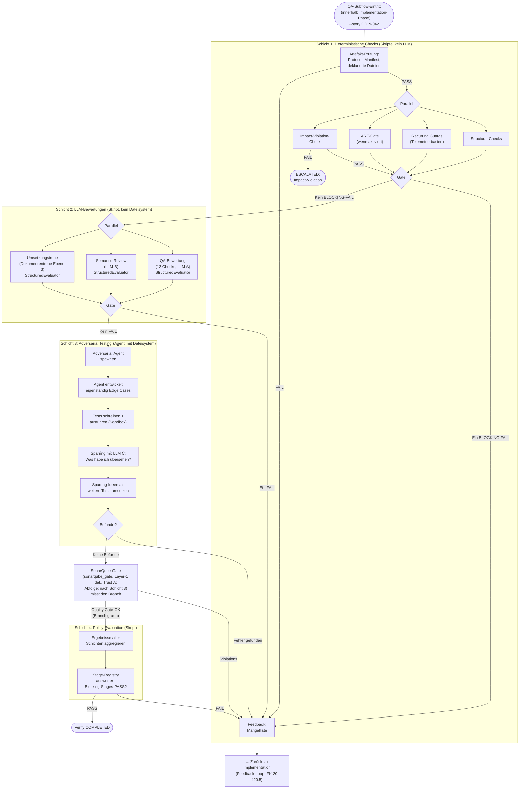

# 27 — QA-Subflow innerhalb Implementation: Schichten und QA-Zyklus

<!-- PROSE-FORMAL: formal.deterministic-checks.entities, formal.deterministic-checks.state-machine, formal.deterministic-checks.commands, formal.deterministic-checks.events, formal.deterministic-checks.invariants, formal.deterministic-checks.scenarios, formal.implementation.entities, formal.implementation.invariants, formal.verify.entities, formal.verify.state-machine, formal.verify.commands, formal.verify.events, formal.verify.invariants, formal.verify.scenarios -->

> Output-QA ist ein interner Subflow innerhalb der
> Implementation-Phase (analog zum Exit-Gate der Exploration-Phase,
> FK-23 §23.5). Die in diesem Dokument beschriebenen 4 Schichten
> (Layer 1 Structural, Layer 2 LLM, Layer 3 Adversarial, Layer 4
> Policy), der QA-Zyklus, die Artefakt-Invalidierung und der
> Remediation-Loop sind die fachliche Mechanik dieses Subflows. Die
> Capability `VerifySystem` (BC verify-system) liefert
> `run_qa_subflow(...) -> PolicyVerdict` und wird sowohl von
> `ExplorationPhase` (Exit-Gate) als auch von `ImplementationPhase`
> (Output-QA) aufgerufen. Siehe `concept/_meta/bc-cut-decisions.md`
> "Verify als Capability (Variante Y)".

## 27.1 Zweck

Der QA-Subflow ist die maschinelle Qualitaetssicherung der
Implementation-Phase. Er prueft die Implementierung in vier
aufeinander aufbauenden Schichten und laeuft als interner Subflow
innerhalb der `implementation`-Top-Phase, nicht als eigene
Phasenstufe.

Fuer `implementation_contract=integration_stabilization` bleibt der
QA-Subflow voll aktiv, erhaelt aber zusaetzlich ein dediziertes
`stability_gate` ueber Manifest, Integrationszielmatrix und
Stabilisierungsbudget.

Dateisystem-Zugriff nach Layer:
- **Schicht 1 (Skripte)**: Lese-Zugriff — Artefakt-Existenzprüfung, Build-Ergebnisse, JSON-Validierung (FK-05-128 bis FK-05-130).
- **Schicht 2 Pre-Step (ContextSufficiencyBuilder)**: Lese-Zugriff — lädt Kontext-Artefakte aus dem Story-Verzeichnis (FK-37 §37.2).
- **Schicht 2 LLM-Bewertungen**: Kein direkter Dateisystem-Zugriff — die LLM-Evaluatoren erhalten gebundelte Kontext-Daten vom ContextSufficiencyBuilder; kein eigenes Dateisystem-Lesen.
- **Schicht 3 (Adversarial Agent)**: Lese-Zugriff auf alles + Schreib-Zugriff auf Sandbox-Pfad (`_temp/adversarial/{story_id}/`).

Closure ist nicht mehr Teil dieses Dokuments. Closure-Sequenz, Integrity-Gate-Aufruf,
Merge, Story-Close, Postflight, Execution Report und Guard-Deaktivierung sind
in FK-29 normiert. Verify-Context-Steuerung, Context-Bundle-Vorbereitung und
Section-aware Packing liegen in FK-37. Feedback-Mechanik, Umsetzungstreue und
Rückkopplungstreue liegen in FK-38.

**Abgrenzung:** Ein vollstaendiger Story-Reset ist kein Schritt der
Verify- oder Closure-Phase. Wenn Verify oder Closure in einen harten,
nicht ueber den offiziellen Workflow reparierbaren Fehler laufen,
eskaliert die Pipeline. Erst danach kann der Mensch ueber die CLI
einen `StoryResetService` ausloesen.

## 27.2 Atomarer QA-Zyklus

### 27.2.1 Identitätsfelder

Jede QA-Subflow-Remediation-Iteration bildet einen atomaren QA-Zyklus
mit vier Identitätsfeldern:

| Feld | Typ | Semantik |
|------|-----|----------|
| `qa_cycle_id` | 12-Zeichen UUID-Fragment | Eindeutig pro Zyklus, wird bei jedem `advance_qa_cycle()` neu generiert |
| `qa_cycle_round` | Monotoner Zähler (ab 1) | Inkrementiert bei jedem neuen Zyklus |
| `evidence_epoch` | ISO-8601 Timestamp | Zeitpunkt der letzten Code-/Artefakt-Mutation |
| `evidence_fingerprint` | SHA256-Hash (Hex-String) | SHA256 der relevanten Artefakte — inhaltliche Integritätsprüfung; separates Feld, `evidence_epoch` bleibt Timestamp |

Die QA-Zyklus-Felder werden im Story-State persistiert und in
alle QA-Artefakte geschrieben (Traceability).

### 27.2.2 State Machine

```
idle → awaiting_qa → awaiting_policy → pass
                  ↓
           awaiting_remediation → (nächster Zyklus)
                  ↓
              escalated  (direkter Pfad: impact.violation oder max_rounds)
```

- `idle`: Kein aktiver QA-Zyklus
- `awaiting_qa`: QA-Subflow-Schichten laufen (Schicht 1–3)
- `awaiting_policy`: Policy-Evaluation (Schicht 4) ausstehend
- `pass`: Policy-Evaluation bestanden → QA-Subflow PASS (Implementation-Phase kann COMPLETED erreichen; kein Umweg über `awaiting_remediation`)
- `awaiting_remediation`: QA-Subflow gescheitert, Worker-Remediation erwartet
- `escalated`: Direkter Übergang aus `awaiting_qa` bei `impact.violation` (vor Policy-Evaluation); oder aus `awaiting_remediation` bei `max_rounds_exceeded`

### 27.2.3 Artefakt-Invalidierung

**Zweck:** Verhindert, dass veraltete Artefakte aus einer früheren
QA-Subflow-Runde nach einer Remediation in späteren Runden
konsumiert werden.

Wenn ein neuer Zyklus beginnt (`advance_qa_cycle()`), werden alle
zyklusgebundenen Artefaktdateien gelöscht oder nach `stale/`
verschoben (11 Dateien).

| Artefakt | Datei |
|----------|-------|
| Semantic Review | `semantic_review.json` |
| Guardrail Check | `guardrail.json` | <!-- Kein aktiver Producer in §27.5 definiert. Artefakt verbleibt in der Invalidierungs-Liste für den Fall, dass es aus einem früheren Zyklus noch existiert. -->
| Policy Decision | `decision.json` |
| LLM Review (QA-Bewertung) | `qa_review.json` |
| Umsetzungstreue | `doc_fidelity.json` |
| Feedback | `feedback.json` |
| Adversarial | `adversarial.json` |
| SonarQube-Gate | `sonarqube_gate.json` | <!-- [Ergänzung] sonarqube_gate (FK-33 §33.2.2, Abfolge nach Schicht 3, §27.6a) ist zyklusgebunden: jede Remediation aendert Fachcode → die commit-gebundene Attestation der Vorrunde wird ungueltig und nach stale/ verschoben. -->
| E2E Verify | `e2e_verify.json` | <!-- Kein aktiver Producer in §27.5 definiert; reserviert für eine zukünftige End-to-End-Integritätsprüfung. Artefakt verbleibt in der Invalidierungs-Liste für den Fall, dass es aus einem früheren Zyklus noch existiert. -->
| Structural | `structural.json` |
| Context | `context.json` | <!-- context.json ist keine Löschung — es wird vor Schicht 2 vom Phase Runner neu aufgebaut (rebuild pre-step), um dem Context Sufficiency Builder (FK-37 §37.2.6) ein aktuelles Artefakt zu liefern. Ohne diesen Rebuild wäre der Remediation-Re-Entry-Pfad nicht implementierbar. Der Eintrag in der Invalidierungs-Liste bedeutet: altes context.json wird nach stale/ verschoben, dann neu erzeugt. -->
| Context Sufficiency | `context_sufficiency.json` |

### 27.2.4 Runtime-Staleness-Check

`artifact_matches_current_cycle()` prüft bei jedem Artefakt-Zugriff,
ob das eingebettete `qa_cycle_id` mit dem aktuellen Zyklus
übereinstimmt. Bei Mismatch: **fail-closed** — das Artefakt wird
abgelehnt, als wäre es nicht vorhanden.

### 27.2.5 FK-Referenz

Domänenkonzept 5.2 "Atomarer QA-Zyklus".

## 27.2a Eskalation versus Story-Reset

Verify oder Closure koennen in `ESCALATED` enden, wenn Standardpfade
wie Remediation, offizieller Closure-Retry oder `--no-ff`-Fallback den
Sachverhalt nicht mehr sauber beherrschen.

**Normative Regeln:**

1. `ESCALATED` fuehrt nicht automatisch zu einem Story-Reset.
2. Der Orchestrator darf einen Reset nur empfehlen oder dokumentieren.
3. Die Ausfuehrung eines vollstaendigen Resets erfolgt ausschliesslich
   durch einen menschlichen CLI-Befehl gegen den `StoryResetService`.
4. Vor einem Reset muss die bisherige Umsetzung als korrupt oder
   fachlich unbrauchbar bewertet sein; ein Reset ist kein Routinepfad
   fuer gewoehnliche QA-Subflow-Fails.

## 27.3 QA-Subflow innerhalb Implementation-Phase: Gesamtablauf



[Hinweis: Für concept/research-Stories entfallen Finding-Resolution-Gate und Integrity-Gate vollstaendig. Closure-Substates und Ablauf: siehe FK-29 §29.1.1 und §29.2.1.]

[Hinweis: Das Flowchart zeigt den **logischen** Ablauf. Schicht 3 (Adversarial) ist kein synchroner Inline-Schritt — der Phase Runner setzt `agents_to_spawn` und der Orchestrator spawnt den Adversarial-Agenten extern (§27.6.1). Der Gesamtfluss (S2G → Schicht 3 → S4) beschreibt die fachliche Reihenfolge, nicht den mechanischen Ablauf.]

## 27.4 Schicht 1: Deterministische Checks

### 27.4.1 Artefakt-Prüfung

Erste Prüfung, vor allem anderen. Stellt sicher, dass die
Grundvoraussetzungen für die weiteren Prüfungen erfüllt sind.

| Check-ID | Was | FAIL wenn | Severity |
|----------|-----|----------|----------|
| `artifact.protocol` | `protocol.md` existiert, > 50 Bytes | Datei fehlt oder leer | BLOCKING |
| `artifact.worker_manifest` | `worker-manifest.json` ist valides JSON | Datei fehlt oder ungültiges JSON | BLOCKING |
| `artifact.manifest_claims` | Deklarierte Dateien in Manifest existieren auf Disk | Eine deklarierte Datei fehlt | BLOCKING |
| `artifact.handover` | `handover.json` existiert und Schema-valide | Datei fehlt oder Schema-Verletzung | BLOCKING |

### 27.4.2 Structural Checks

Laufen sequenziell nach erfolgreichem Artefakt-Check (§27.4.1 PASS),
dann parallel zueinander (gemeinsam mit Recurring Guards §27.4.3, ARE-Gate §27.4.4
und Impact-Check — alle vier parallel nach Artefakt-Prüfungs-PASS):

| Check-ID | Kategorie | Was | Severity |
|----------|-----------|-----|----------|
| `branch.story` | Branch | Auf korrektem Branch `story/{story_id}` | BLOCKING |
| `branch.commit_trailers` | Branch | Story-ID in Commit-Message | BLOCKING |
| `completion.commit` | Completion | Mindestens 1 Commit seit Base-Ref | BLOCKING |
| `completion.push` | Completion | Branch auf Remote gepusht | BLOCKING |
| `security.secrets` | Security | Keine `.env`, `.pem`, `.key` etc. im Diff | BLOCKING |
| `build.compile` | Build | Build kompiliert erfolgreich | BLOCKING |
| `build.test_execution` | Build | Tests grün | BLOCKING |
| `test.count` | Test | Mindestens 1 Testdatei im Changeset | MAJOR |
| `test.coverage` | Test | Coverage-Report existiert, Schwellenwert erreicht | MAJOR |
| `hygiene.todo_fixme` | Hygiene | Keine TODO/FIXME in geänderten Dateien | MINOR |
| `hygiene.disabled_tests` | Hygiene | Keine `@Disabled`/`@Ignore`/`@pytest.mark.skip` | MINOR |
| `hygiene.commented_code` | Hygiene | Keine großen auskommentierten Code-Blöcke | MINOR |
| `impact.violation` | Impact | Tatsächlicher Impact ≤ deklarierter Impact (FK-23 §23.8). **Reaktion:** Impact-Violation → ESCALATED (Eskalation an Mensch, kein Rücksprung zur Exploration-Phase). | BLOCKING |

### 27.4.3 Recurring Guards (Telemetrie-basiert)

Prüfen den Prozess, nicht die fachliche Lösung. Laufen parallel
zu den Structural Checks:

| Check-ID | Was | Quelle | Severity |
|----------|-----|--------|----------|
| `guard.llm_reviews` | Pflicht-Reviews durchgeführt (mindestens 1 `review_request`-Event; kein größenabhängiger exakter Zähler — konsistent mit FK-35 §35.2.5 Minimum-Schwellen-Vertrag der Telemetrie-Korrelation) | Telemetrie: `review_request` Events zählen | **BLOCKING** |
| `guard.review_compliance` | Reviews über freigegebene Templates | Telemetrie: `review_compliant` Events | MAJOR |
| `guard.no_violations` | Keine Guard-Verletzungen während der Bearbeitung | Telemetrie: keine `integrity_violation` Events | BLOCKING |
| `guard.multi_llm` | Alle konfigurierten Pflicht-Reviewer mit Ergebnis abgeschlossen | Telemetrie: `llm_call_complete` Events mit passenden `pool`/`role` Werten. **`llm_call_complete` darf erst nach erfolgreichem Schreiben des Review-Artefakts (§27.5.5) emittiert werden** — nicht bei bloßer API-Antwort. Fängt "Review gestartet, nie abgeschlossen" (FK-37 §37.1.6). | **BLOCKING** |

**Zwei-Stufen-Prüfung für LLM-Reviews:**

`guard.llm_reviews` und `guard.multi_llm` bilden eine
Zwei-Stufen-Prüfung, die als separate BLOCKING Guards implementiert
sein MUSS:

1. **Gate 1 (`guard.llm_reviews`):** Wurden Reviews überhaupt
   angefordert? 0 `review_request` Events bei einer
   Implementation/Bugfix-Story → sofortiger FAIL.
2. **Gate 2 (`guard.multi_llm`):** Liegen für ALLE mandatory
   Reviewer (`qa_review`, `semantic_review`, `doc_fidelity`) Telemetrie-Evidenzen
   vor? Gate 2 ist unabhängig von Gate 1 — auch wenn Reviews
   angefordert wurden, müssen die Ergebnisse vorliegen.

Beide Gates dürfen NICHT zu einem einzigen Gate zusammengefasst
werden. Empirischer Anlass: BB2-057 — beide Guards erkannten die
fehlenden Reviews korrekt, waren aber nur als WARNING klassifiziert
und konnten den Closure-Pfad nicht blockieren.

### 27.4.4 ARE-Gate (optional)

Nur bei `features.are: true`. Deterministisches Skript fragt ARE
über MCP ab:

| Check-ID | Was | FAIL wenn |
|----------|-----|----------|
| `are.coverage` | Alle `must_cover`-Anforderungen haben Evidence | Eine Pflichtanforderung ohne Evidence |

### 27.4.5 Gate-Entscheidung Schicht 1

- Ein BLOCKING-FAIL → Story geht zurück an Worker (Feedback). **Ausnahme:** `impact.violation` (BLOCKING) führt direkt zu ESCALATED — kein Feedback-Loop, kein Worker-Rückgabe (§27.4.2).
- Nachfolgende Schichten werden nicht gestartet (FK-05-151)
- MAJOR/MINOR Failures werden gesammelt und fließen in die
  Policy-Evaluation (Schicht 4)

### 27.4.6 Ergebnis-Artefakt

`_temp/qa/{story_id}/structural.json` (Envelope-Format, Producer:
`qa-structural-check`).

## 27.5 Schicht 2: LLM-Bewertungen

### 27.5.1 Parallele Ausführung

Drei LLM-Bewertungen laufen parallel über `ThreadPoolExecutor`
(Kap. 11.7). Alle nutzen den StructuredEvaluator (Kap. 11.4).

### 27.5.2 QA-Bewertung (12 Checks)

**Rolle:** `qa_review` (konfiguriertes LLM, z.B. ChatGPT)

**Prompt-Template:** `prompts/qa-semantic.md`

**Kontext-Bundles:** `story_spec`, `diff_summary`, `concept_excerpt`,
`handover`

**12 Checks (FK-05-168 bis FK-05-179):**

| Check-ID | Prüfgegenstand |
|----------|---------------|
| `ac_fulfilled` | Akzeptanzkriterien erfüllt? |
| `impl_fidelity` | Gebaut = konzipiert? |
| `scope_compliance` | Kein undokumentierter Scope Creep? |
| `impact_violation` | Tatsächlicher ≤ deklarierter Impact? |
| `arch_conformity` | Pattern, Schichten, Boundaries eingehalten? |
| `proportionality` | Nicht over-/under-engineered? |
| `error_handling` | Fehlerfälle sauber behandelt? |
| `authz_logic` | Mandantentrennung verletzbar? |
| `silent_data_loss` | Datenverlust ohne Fehler möglich? |
| `backward_compat` | Consumer brechen? |
| `observability` | Logging + Fehler-Sichtbarkeit? |
| `doc_impact` | Bestehende Doku veraltet? |

**Antwort-Schema:** Pro Check: `status` (PASS/PASS_WITH_CONCERNS/FAIL),
`reason` (Einzeiler), `description` (max 300 Zeichen).

### 27.5.3 Semantic Review

**Rolle:** `semantic_review` (anderes LLM, z.B. Gemini)

**Prompt-Template:** `prompts/qa-semantic-review.md`

**Kontext-Bundles:** `story_spec`, `diff_summary`, `evidence_manifest`,
plus aggregierte Befunde aus Schicht 1

**1 Check:** Systemische Angemessenheit — Passt die Lösung in den
Systemkontext? Ist der Change im Verhältnis zum Problem angemessen?
Gibt es systemische Risiken, die die Einzelchecks nicht sehen?
(FK-05-180/181)

### 27.5.4 Aggregation

- Ein einzelnes FAIL in irgendeinem Check → blockiert (FK-05-164)
- PASS_WITH_CONCERNS blockiert nicht → fließt als Warnung in
  Policy-Evaluation + wird an Adversarial Agent als Ansatzpunkt
  weitergegeben (FK-05-165/166)

### 27.5.5 Ergebnis-Artefakte

- `_temp/qa/{story_id}/qa_review.json` (Producer: `qa-llm-review`)
- `_temp/qa/{story_id}/semantic_review.json` (Producer: `qa-semantic-review`)
- `_temp/qa/{story_id}/doc_fidelity.json` (Producer: `qa-doc-fidelity`)

> Context Sufficiency Builder ist Pflicht-Gate VOR dem Review: stellt sicher dass genuegend Informationen vorhanden sind. Wenn nicht → Informationen zusammentragen, NICHT Review ueberspringen. Reviews finden IMMER statt.

Detailausgliederungen aus dieser Schicht 2:

- Context-Bundle-Vorbereitung, Sufficiency-Klassifikation und
  Ablauf in `_run_layer2_parallel()`: **FK-37 §37.2**
- Konvertierung `ContextBundle → dict[str, str]` und Section-aware
  Packing: **FK-37 §37.3**
- Verify-Context-Steuerung (`IMPLEMENTATION_INITIAL` /
  `IMPLEMENTATION_REMEDIATION`) und HARD-BLOCKER-Garantie für fehlende
  LLM-Reviews: **FK-37 §37.1**
- Umsetzungstreue (Dokumententreue Ebene 3) und ihre Eingliederung
  in Schicht 2: **FK-38 §38.2**

## 27.6 Schicht 3: Adversarial Testing

### 27.6.1 Agent-Spawn

Der Phase Runner setzt `agents_to_spawn` im Phase-State:

```json
{
  "type": "adversarial",
  "prompt_file": "prompts/adversarial-testing.md",
  "model": "opus",
  "sandbox_path": "_temp/adversarial/ODIN-042/",
  "inputs": {
    "handover": "stories/ODIN-042/handover.json",
    "layer2_concerns": [
"_temp/qa/ODIN-042/qa_review.json",
"_temp/qa/ODIN-042/semantic_review.json",
"_temp/qa/ODIN-042/doc_fidelity.json"
    ]
  }
}
```

Der Orchestrator spawnt den Adversarial Agent als Harness-Sub-Agent
(Claude Code oder Codex; FK-76). Der Agent hat:
- Dateisystem-Zugriff (Read auf alles, Write nur in Sandbox)
- Zugriff auf Handover-Paket (`inputs.handover`, `risks_for_qa` als Ansatzpunkte)
- Zugriff auf Concerns aus Schicht 2 (`inputs.layer2_concerns`, PASS_WITH_CONCERNS als Ansatzpunkte)
- Pflicht, Sparring-LLM zu holen
- Write-Scoping über CCAG-Regel (FK-42 §42.2.4, FK-15 §15.4.2)

### 27.6.2 Ablauf (FK-05-197 bis FK-05-207)

1. Agent **prüft die vorhandene Test-Suite** — Abdeckung,
   Aussagekraft, Edge-Case-Behandlung bewerten (FK-05-197)
2. Agent entscheidet: Reichen die bestehenden Tests? Wenn ja:
   bestehende Tests ausführen, nicht pauschal neue schreiben
   (FK-05-198/199)
3. Agent **entwickelt eigenständig Edge Cases** für Lücken
4. Agent schreibt ergänzende Tests in Sandbox, führt sie aus
5. Agent holt Sparring-LLM: "Was habe ich übersehen?"
6. Agent setzt Sparring-Ideen in weitere Tests um
7. Agent muss **mindestens einen Test ausführen** (bestehend
   oder neu) als Nachweis (FK-05-200/201)
8. Ergebnis: Mängelliste oder "keine Befunde"

### 27.6.3 Test-Suite-Wachstum und Konsolidierungsverbot

Es findet keine automatische Konsolidierung der Test-Suite statt
(FK-27-051). Wenn die Test-Suite im Laufe der Zeit zu groß wird,
ist menschliche Intervention erforderlich. Agents dürfen
vorhandene Tests weder eigenständig löschen noch zusammenführen —
auch nicht wenn sie inhaltlich redundant erscheinen. Jede
Verkleinerung der Test-Suite ist eine bewusste menschliche
Entscheidung, die außerhalb des automatisierten Pipeline-Ablaufs
getroffen wird.

### 27.6.4 Test-Promotion

Tests, die der Adversarial Agent in der Sandbox erzeugt hat,
werden **nicht unkonditioniert** ins Repo übernommen. Ein
Pipeline-Skript prüft nach dem Adversarial-Run:

1. Sind die Tests schema-valide (korrekte Test-Struktur)?
2. Sind sie ausführbar (kein Syntax-Error)?
3. Sind sie dedupliziert (kein Duplikat bestehender Tests)?
4. Wenn ja: Promotion ins Repo (kopieren aus Sandbox in `test/`)
5. Wenn nein: Verbleiben in der Sandbox (ephemer)

Promotete Tests werden Teil der regulären Test-Suite und unterliegen
ab dann normaler Code-Ownership (FK-05-204/205).

**Fehlschlagende Tests → Quarantäne für Remediation:**

Wenn der Adversarial Agent einen validen, fehlschlagenden Test
erzeugt hat (= Befund), wird dieser nicht verworfen, sondern in
ein Quarantäne-Verzeichnis im Worktree kopiert:
`tests/adversarial_quarantine/`. Der Remediation-Worker erhält
den expliziten Auftrag, diesen Test grün zu machen — analog zum
Red-Green-Workflow bei Bugfixes. Damit hat der Remediation-Worker
den fehlschlagenden Test als konkreten Ausgangspunkt statt nur
einer textuellen Mängelbeschreibung.

### 27.6.5 Ergebnis-Artefakt

`_temp/qa/{story_id}/adversarial.json` (Producer: `qa-adversarial`)

```json
{
  "schema_version": "3.0",
  "story_id": "ODIN-042",
  "run_id": "...",
  "stage": "qa_adversarial",
  "producer": { "type": "agent", "name": "qa-adversarial" },
  "status": "PASS",
  "tests_created": 3,
  "tests_executed": 5,
  "tests_passed": 5,
  "tests_failed": 0,
  "findings": [],
  "sparring_pool": "grok",
  "sparring_edge_cases_received": 7,
  "sparring_edge_cases_implemented": 3,
  "mandatory_target_results": [
    {
      "target_id": "target-uuid-1",
      "status": "TESTED"
    }
  ]
}
```

### 27.6.6 Telemetrie

| Event | Erwartungswert |
|-------|---------------|
| `adversarial_start` | Genau 1 |
| `adversarial_sparring` | >= 1 (Pflicht) |
| `adversarial_test_created` | >= 0 (neue Tests nur wenn bestehende unzureichend) |
| `adversarial_test_executed` | >= 1 (Pflicht: mindestens 1 Test ausführen) |
| `adversarial_end` | Genau 1 |

## 27.6a SonarQube-Gate (Abfolge: nach Schicht 3, vor Schicht 4)

### 27.6a.1 Einordnung

**Applicability zuerst (FK-33 §33.6.5):** An diesem Gate-Punkt wird **vor**
der Gruen/Rot-Bewertung die Anwendbarkeit des `sonarqube_gate` aufgeloest.
Nur im **APPLICABLE**-Fall laeuft das Gate wie unten beschrieben. Bei
**NOT_APPLICABLE (Sonar nicht verfuegbar, `sonarqube.available == false`)**
wird die Sonar-Stage **uebersprungen (SKIP, kein fail-closed)** und der
`StageExecutionPlan` geht direkt zur Policy-Evaluation (Schicht 4) — die
uebrigen QS-Schichten bleiben unveraendert. Bei **NOT_APPLICABLE (`mode ==
fast`)** gilt §27.6a.4 (Schicht-1-Tests-gruen-Floor statt Sonar-Gate).
Davon strikt abzugrenzen ist das *konfiguriert-aber-unerreichbare/rote/stale*
Sonar (`available == true`): das bleibt **APPLICABLE** und blockt
**fail-closed** („abwesend ≠ kaputt", FK-33 §33.6.5).

Im **APPLICABLE**-Fall laeuft nach der Adversarial-Stage (Schicht 3) und
**vor** der Policy-Evaluation (Schicht 4) das `sonarqube_gate` auf dem
**Story-Branch**. Es ist der zweite der drei Lifecycle-Gate-Punkte der
Capability (FK-33 §33.6.3, Punkt 2; Setup-Vorbedingung in FK-22 §22.4c,
Closure-Pre-Merge in FK-29/FK-35).

Das `sonarqube_gate` ist klassifikatorisch eine **Layer-1-Stage
(deterministisch, Trust-Klasse A, blocking)**, wird in der
Ausfuehrungs**abfolge** des QA-Subflows aber bewusst nach Schicht 3
eingehaengt. Die Layer-vs-Abfolge-Begruendung — jede vorgelagerte
Remediation (Layer 1/2/3) aendert Fachcode und kann neue Violations
erzeugen, daher ist die Sonar-Messung der **finale deterministische
Konvergenz-Schritt** — wird **nicht** hier dupliziert, sondern liegt
normativ in **FK-33 §33.6.3 und §33.8.3**. An der Menge der QS-Schichten
aendert sich nichts; es kommt nur ein Abfolge-Schritt hinzu.

### 27.6a.2 Gate und Remediation-Loop

- **Green-Definition, Attestation, Accepted-Ledger:** FK-33 §33.6.3 /
  §33.6.4 (Owner). Gruen = Quality Gate OK auf der
  Overall-Code-Invariante (keine offenen, nicht-akzeptierten Issues im
  gesamten Scope); bewusst `Accepted`-Issues (Accepted nach FK-27 §27.6b)
  zaehlen nicht.
- **Rot → Remediation:** Hat das Gate Violations, geht die Story in den
  bestehenden Remediation-Loop des QA-Subflows zurueck (Feedback →
  zurueck zu Implementation, FK-20 §20.5). Die QA-Zyklus-Semantik bleibt
  unveraendert: `advance_qa_cycle()` invalidiert die zyklusgebundenen
  Artefakte (§27.2.3), `max_feedback_rounds` (FK-03 §3.4.2, Default 3)
  greift; Erschoepfung fuehrt zu `escalated`
  (`max_rounds_exceeded`, §27.2.2). Der `sonarqube_gate`-Lauf gehoert in
  denselben `verify_context`-gesteuerten Subflow-Durchlauf
  (`IMPLEMENTATION_INITIAL` / `IMPLEMENTATION_REMEDIATION`, FK-37 §37.1) wie die
  uebrigen Schichten.
- **Gruen → Schicht 4:** Erst wenn der Branch gruen ist, materialisiert
  der `StageExecutionPlan` die Policy-Evaluation. Die Policy-Engine
  aggregiert das `sonarqube_gate`-Ergebnis als blocking Trust-A-Stage mit
  (FK-33 §33.8.2).

### 27.6a.3 Ergebnis-Artefakt

`_temp/qa/{story_id}/sonarqube_gate.json` (Envelope-Format, Producer:
`qa-sonarqube-gate`, Stage-ID `sonarqube_gate` aus FK-33 §33.2.2). Das
Artefakt traegt die commit-gebundene Attestation (FK-33 §33.6.3:
`commit_sha`, `tree_hash`, `analysisId`/`ceTaskId`, QG-/Profile-Hash,
Tool-Versionen) und ist — wie die uebrigen zyklusgebundenen Artefakte —
in der Invalidierung bei `advance_qa_cycle()` enthalten.

### 27.6a.4 `mode=fast`: Schicht-1-Floor, kein Sonar-Gate

Im `mode=fast` (Mode-Profil Fast, FK-24 §24.3.4) entfaellt der gesamte
QA-Subflow ausser einem **harten Tests-gruen-Floor**: Schicht 1 degeneriert
auf „Build + Tests gruen" (nicht abschaltbar), die Schichten 2–4 entfallen,
und das `sonarqube_gate` ist an diesem Lifecycle-Punkt **NOT_APPLICABLE**
(FK-33 §33.6.5) — es wird nicht ausgewertet. Begruendung: Der Mensch reviewt
das Inhaltliche selbst; die fachliche Tabelle der OUT/MOD-Substeps liegt
kanonisch in FK-24 §24.3.4 (keine Duplikation hier).

## 27.6b Accept-Self-Assessment (synchroner, worker-initiierter Schritt)

<!-- PROSE-FORMAL: formal.sonar-accept-application.entities, formal.sonar-accept-application.commands, formal.sonar-accept-application.events, formal.sonar-accept-application.state-machine, formal.sonar-accept-application.scenarios, formal.sonar-accept-application.invariants -->

### 27.6b.1 Einordnung und Abgrenzung

Das **Accept-Self-Assessment** ist der **fachliche Owner-Schritt** fuer die
bewusste Einzelfall-Akzeptanz einer SonarQube-Regel (World 2 des
Zwei-Welten-Modells: gegen ein bewusst justierbares Scope-/Issue-Urteil, nicht
gegen das feste Regelkatalog-Baseline der World 1). FK-33 §33.6.4 ownt nur die
**Gate-Semantik** „`Accepted` zaehlt gruen", den **Reconciler-Vertrag** und das
**Ledger-Schema**; **wie** eine Akzeptanz zustande kommt, ist hier definiert und
wird von FK-33 §33.6.4 und FK-35 §35.2.4a per Referenz konsumiert (Single
Source of Truth — keine zweite Beschreibung des Verfahrens).

Der Schritt ist bewusst **lean** gehalten: keine manipulationssichere,
kryptografische oder „Festungs"-Mechanik. Die einzige strukturelle Kontrolle
ist, dass der Worker **keine** Sonar-Admin-Rechte hat — den `Accepted`-Schalter
setzt ausschliesslich AK3 (§27.6b.4).

**Abgrenzung zum Haupt-QA-Pass:** Das Accept-Self-Assessment ist **nicht** der
QA-Review (Schicht 2, §27.5: Korrektheit) und **nicht** das Adversarial-Testing
(Schicht 3, §27.6: Break-it). Es ist ein **eigenstaendiger, vom Worker selbst
ausgeloester** Schritt, den der Worker **jederzeit waehrend seiner Arbeit** vor
dem finalen Verify anstossen kann (ein Self-Assessment **vor** dem finalen
SonarQube-Gate, §27.6a). Es nutzt zwar die LLM-Ressourcen des verify-system,
darf aber die beiden Haupt-QA-Bewertungen (Reviewer/Adversarial) nicht mit der
Accept-Entscheidung belasten.

### 27.6b.2 Ablauf (synchron, Quorum = Worker + 2 LLMs, Einstimmigkeit)

1. **Worker-Request (synchron):** Der Worker richtet eine synchrone Anfrage an
   eine AK3-Schnittstelle des verify-system („darf das akzeptiert werden?") und
   liefert mindestens: die **Sonar-Regel** (`rule_key`), die **Code-Datei**
   (`file_path`) bzw. Klasse, in der das Issue erhoben wurde, sowie seine
   **Begruendung** (`rationale`).
2. **Zwei unabhaengige LLMs:** AK3 befragt **zwei verschiedene Modelle** mit
   **demselben** Prompt aus **einem** Prompt-Template. Einzige injizierte
   Variable ist die **Worker-Begruendung plus der Issue-Kontext**. Der Prompt
   ist **nicht** skeptisch/adversarial formuliert; er stellt das **Ziel** in den
   Mittelpunkt: hochwertige Software, ein faires, konstruktives Ringen um die
   Frage „was hebt die Softwarequalitaet?" — **weder** kuenstliches Sonar-Gruen
   **noch** reflexhafte Ablehnung. Zwei verschiedene Modelle mit demselben
   zielorientierten Prompt sind die Unabhaengigkeitsgrundlage (nicht zwei
   skeptische Gegen-Gutachten).
3. **Votum je LLM:** Jedes LLM liefert **yes/no + Begruendung**.
4. **Beide yes → Accepted:** Stimmen **beide** LLMs zu, setzt **AK3** das Issue
   auf `Accepted` (der Worker hat keine Admin-Rechte — AK3 kippt den Schalter;
   das ist die gesamte Kontrolle). AK3 schreibt den Ledger-Eintrag gemaess dem
   FK-33 §33.6.4 Ledger-Schema (Owner FK-33; hier nicht feldweise wiederholt).
5. **Mindestens ein no → sofortiges Feedback:** Lehnt **eines** der LLMs ab,
   gehen **beide** Begruendungen **unmittelbar** als Feedback an den Worker
   zurueck; er bessert/refactored **jetzt** (synchrones, sofortiges Feedback
   vermeidet einen erzwungenen separaten Remediation-Zyklus).

**Quorum:** Der vorschlagende Worker (seine Begruendung ist seine Stimme) plus
die zwei LLMs; **Einstimmigkeit**. **Kein** Akteur akzeptiert sich selbst — der
Worker kann den Schalter nicht kippen, AK3 tut es nur bei beidseitigem yes.

### 27.6b.3 Failure-Corpus-Signal (leicht)

AK3 zaehlt **ueber alle Stories hinweg** (nie pro Einzelstory), wie haeufig eine
Sonar-Regel akzeptiert wird. Ueberschreitet der Anteil der Stories, die
mindestens ein Issue einer Regel akzeptieren, einen **konfigurierbaren
Schwellwert**, wird die Regel zum **Signal an den Failure-Corpus** („Regel/
Profil/Scope vermutlich fehlkonfiguriert"). Der Schwellwert ist ein
Config-Wert (`sonarqube.accept_frequency_fc_threshold`, Default in FK-03
§3.4.2) — er wird hier nur referenziert, nicht zweitkopiert. Die
Signal-Mechanik und die Verankerung im Corpus liegen bei FK-41 §41.10; das
leichte Prozess-Fidelity-Signal kann auch vom Integrity-Gate geschrieben werden
(FK-35 §35.2.4a).

### 27.6b.4 Schnittstelle und Owner

Die Request-Schnittstelle gehoert dem verify-system (Capability `VerifySystem`).
Das `Accepted`-Setzen ist eine **AK3-Aktion mit scoped Admin-Token** (FK-33
§33.6.4 Reconciler-Vertrag) — der Worker bleibt ohne Admin-Rechte. Der
Lebenszyklus eines Accept-Antrags (`requested → pending → accepted | rejected`,
Einstimmigkeitsregel) ist formal im dedizierten Kontext
`formal.sonar-accept-application.*` (Kommandos `apply`/`approve`/`reject`,
State-Machine, Invarianten) normiert.

## 27.7 Schicht 4: Policy-Evaluation

### 27.7.1 Aggregation

Die Policy-Engine (FK-33 §33.7.1) aggregiert die Ergebnisse aller
vorherigen Schichten:

```python
def evaluate_policy(story_id: str, story_type: str, config: PipelineConfig) -> PolicyResult:
    """story_type: "implementation" | "bugfix" | "concept" | "research" (steuert aktive Stages)."""
    registry = load_stage_registry()
    results = []

    for stage in registry.stages_for(story_type):
        # StageResult.severity: Literal["BLOCKING", "MAJOR", "MINOR"]
        # BLOCKING → severity="BLOCKING" (zählt in blocking_failures bei FAIL)
        # MAJOR    → severity="MAJOR"    (zählt in major_failures bei FAIL)
        # MINOR    → severity="MINOR"    (zählt NICHT in major/blocking_failures)
        artifact = load_artifact(story_id, stage.id)
        if artifact is None:
            # Fehlendes Artefakt = FAIL (fail-closed)
            results.append(StageResult(stage.id, "FAIL", stage.severity, "Artifact missing"))
            continue

        results.append(StageResult(
            stage_id=stage.id,
            status=artifact.status,
            severity=stage.severity,  # "BLOCKING" | "MAJOR" | "MINOR"
            detail=artifact.summary,
        ))

    blocking_failures = sum(1 for r in results if r.severity == "BLOCKING" and r.status == "FAIL")
    major_failures = sum(1 for r in results if r.severity == "MAJOR" and r.status == "FAIL")
    minor_failures = sum(1 for r in results if r.severity == "MINOR" and r.status == "FAIL")
    major_threshold = config.policy.get("major_threshold", 3)

    # §27.7.2: Entscheidungsregel
    if blocking_failures > 0 or major_failures > major_threshold:
        status = "FAIL"
    else:
        status = "PASS"

    # Finding-Resolution (FK-29 §29.2) ist ein separates Closure-Gate — kein Teil der Policy-Evaluation.
    return PolicyResult(
        status=status,
        stages=results,
        blocking_failures=blocking_failures,
        major_failures=major_failures,
        minor_failures=minor_failures,  # Quelle für Execution Report (FK-29 §29.4.2)
        major_threshold=major_threshold,
    )
```

### 27.7.2 Entscheidung

| Bedingung | Ergebnis |
|-----------|---------|
| Kein blocking FAIL UND `major_failures <= policy.major_threshold` | PASS → weiter zu Closure |
| Mindestens 1 blocking FAIL | FAIL → Feedback an Worker |
| `major_failures > policy.major_threshold` (Default: 3) | FAIL (auch ohne blocking FAIL) |

### 27.7.3 Ergebnis-Artefakt

`_temp/qa/{story_id}/decision.json` (Producer: `qa-policy-engine`)

---

*FK-Referenzen: FK-05-128 bis FK-05-214 (QA-Subflow komplett),
FK-06-057 bis FK-06-058 (Dokumententreue Ebene 3 — Detail in FK-38),
FK-07-001 bis FK-07-021 (QA-Prinzipien),
FK-27-051 (Konsolidierungsverbot Test-Suite)*

**Querverweise:**
- FK-29 — Closure-Sequence: Finding-Resolution-Gate, Integrity-Gate-Aufruf, Merge, Postflight, Execution Report, Guard-Deaktivierung
- FK-37 — Verify-Context und QA-Bundle-Vorbereitung: QaContext, ContextSufficiencyBuilder, Section-aware Packing, HARD-BLOCKER-Garantie
- FK-38 — Verify-Feedback und Dokumententreue-Schleife: Feedback-Mechanismus, Mandatory-Target-Rückkopplung, Umsetzungstreue (Ebene 3), Rückkopplungstreue (Ebene 4)
- FK-35 — Integrity-Gate (Definitions-Owner), 9 Dimensionen und Eskalation
- FK-28 — Evidence Assembly: EvidenceAssembler, Import-Resolver, Autoritätsklassen, Request-DSL, BundleManifest, Section-aware Packing-Modul (`agentkit/core/packing.py`)
- FK-34 — LLM-Evaluierungen: StructuredEvaluator, ParallelEvalRunner, ContextBundle, `truncate_bundle()` Dispatcher, Evaluator-Erweiterung fuer Finding-Resolution im Remediation-Modus
- DK-04 §4.4a — Verify-Kontext-Differenzierung, Guard-Severity (Fachkonzept-Provenienz fuer FK-37 §37.1 und §27.4.3)
