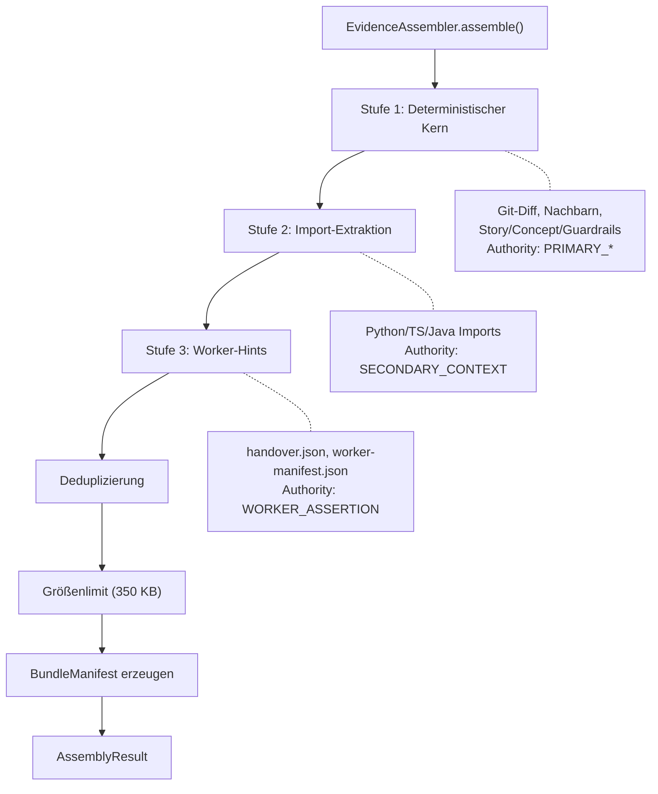
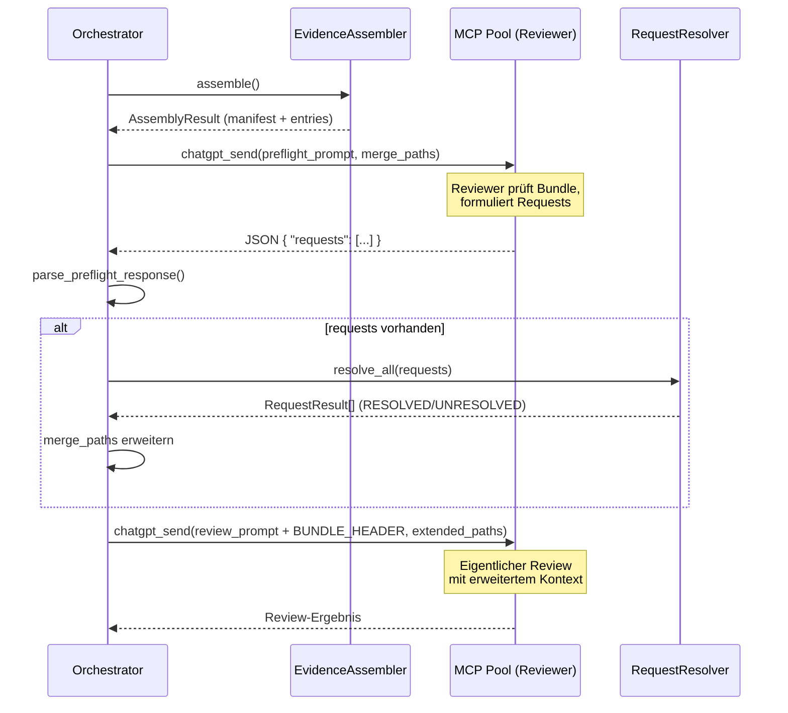
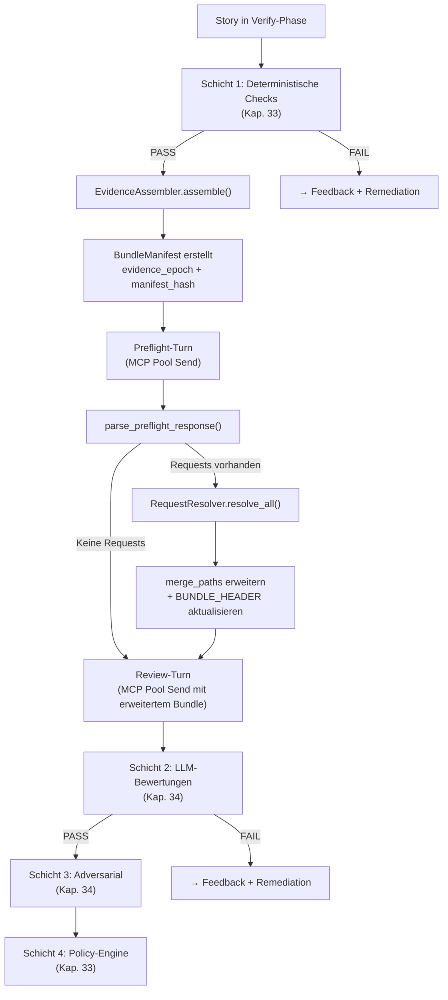

# 28 — Evidence Assembly und Review-Vorbereitung

## 28.1 Zweck

Die Evidence Assembly ist der deterministische Vorbereitungsschritt
für alle LLM-basierten Reviews in der Verify-Phase (Schicht 2,
Kap. 34). Sie ersetzt die bisher vom Worker selbst kuratierte
`merge_paths`-Liste durch einen maschinell assemblierten,
klassifizierten und auditierbaren Evidenz-Körper.

Das Kernproblem: Worker-Agenten entscheiden heute eigenständig,
welche Dateien ein Reviewer sieht. Das erzeugt zwei systematische
Risiken:

1. **Selektive Evidenz**: Der Worker kann — bewusst oder unbewusst —
   Dateien weglassen, die Schwächen seiner Implementierung aufdecken
   würden.
2. **Kontextlücken**: Der Worker kennt den Informationsbedarf des
   Reviewers nicht im Voraus. Fehlende Nachbardateien, Schemas oder
   Konfigurationen führen zu oberflächlichen Reviews.

Die Evidence Assembly löst beide Probleme durch drei Mechanismen:

- **Deterministischer Assembler** (Stufe 1+2): Sammelt Evidenz
  regelbasiert aus Git-Diff, Imports und normativen Quellen —
  unabhängig vom Worker.
- **Worker-Hints** (Stufe 3): Der Worker darf Dateien vorschlagen,
  diese werden aber als niedrigste Autoritätsklasse markiert.
- **Preflight-Turn** (Request-DSL): Der Reviewer kann vor dem
  eigentlichen Review strukturiert fehlende Informationen anfordern.

Dieses Kapitel beschreibt die Package-Struktur, alle Klassen und
Signaturen, die Import-Resolution, die Request-DSL, die
CLI-Registrierung und die Integration in den bestehenden
Review-Flow.

## 28.2 Package-Struktur (`agentkit/evidence/`)

Komplett neues Package für Evidence Assembly, Import Resolution
und Request-DSL. Keine neuen externen Abhängigkeiten — alle Module
nutzen ausschließlich Python-stdlib (`re`, `pathlib`, `json`,
`subprocess`, `enum`, `dataclasses`) und `pydantic` (bestehende
Dependency).

```
agentkit/evidence/
├── __init__.py
├── assembler.py          # Evidence Assembler (Stufe 1 + 3)
├── import_resolver.py    # Sprachspezifische Import-Extraktion (Stufe 2)
├── authority.py          # Autoritätsklassen + BundleEntry-Modell
├── request_resolver.py   # DSL-Request-Auflösung (7 Typen)
├── request_types.py      # Pydantic-Modelle für Request-DSL
└── bundle_manifest.py    # BundleManifest (Zusammenfassung des assemblierten Bundles)
```

| Modul | Verantwortung | Abhängigkeiten |
|-------|---------------|----------------|
| `assembler.py` | Orchestriert die 3-Stufen-Assembly | `authority.py`, `import_resolver.py`, `bundle_manifest.py`, `core/git.py` |
| `import_resolver.py` | Regex-basierte Import-Extraktion (Python, TS, Java) | Nur stdlib (`re`, `pathlib`, `json`) |
| `authority.py` | `AuthorityClass` (IntEnum), `BundleEntry` (Dataclass) | `import_resolver.py` (für `ConfidenceLabel`) |
| `request_types.py` | Pydantic-Modelle: `RequestType`, `ReviewerRequest`, `RequestResult` | `pydantic` |
| `request_resolver.py` | Deterministische Auflösung der 7 Request-Typen | `request_types.py`, `core/git.py` |
| `bundle_manifest.py` | `BundleManifest` mit Prompt-Header-Rendering | `authority.py` |

## 28.3 Evidence Assembler

### 28.3.1 3-Stufen-Architektur

Der Evidence Assembler arbeitet in drei sequentiellen Stufen mit
aufsteigender Unsicherheit:



| Stufe | Quelle | Autoritätsklasse | Unsicherheit |
|-------|--------|-----------------|--------------|
| 1 — Deterministischer Kern | Git-Diff, Nachbardateien, Story-Spec, Concepts, Guardrails, YAML/JSON-Configs | `PRIMARY_IMPLEMENTATION` / `PRIMARY_NORMATIVE` | Keine — alles deterministisch aus Git und Filesystem |
| 2 — Import-Extraktion | Regex-basierte Import-Auflösung für Python, TypeScript, Java | `SECONDARY_CONTEXT` | Gering — Regex kann False Positives erzeugen, Confidence Labels quantifizieren das |
| 3 — Worker-Hints | `handover.json` und `worker-manifest.json` | `WORKER_ASSERTION` | Hoch — Worker-Claims sind ungeprüft, niedrigste Beweiskraft |

> **[Entscheidung 2026-04-08]** Element 15 — Multi-Repo Worktree Logic ist Produktionsanforderung. `worktree_paths` (Dict: repo-id → Pfad) + `primary_repo_id` im Spawn-Vertrag. Runtime-Anforderung fuer Multi-Repo-Zielprojekte.
> Siehe `stories/entscheidung-v2-ballast-bewertung.md`, Element 15.

### 28.3.2 Multi-Repo-Contract (`RepoContext`) (FK-28-001)

AgentKit unterstützt Multi-Repo-Stories (mehrere Repositories in
einem Arbeitspaket). Der Evidence Assembler operiert daher nicht
auf einer einzelnen `repo_root: Path`, sondern auf einem Repo-Set.

```python
# agentkit/evidence/assembler.py
from __future__ import annotations

from dataclasses import dataclass
from pathlib import Path

from agentkit.core.git import GitOperations


@dataclass(frozen=True)
class RepoContext:
    """Kontext für ein einzelnes Repo im Assembly-Prozess.

    Args:
        repo_id: Eindeutige Kennung (z.B. "app", "docs", "frontend").
        repo_path: Worktree-Pfad oder Repository-Root.
        git: Bereits instanziierte GitOperations (single-repo per design).
        git_base_branch: Branch gegen den der Diff berechnet wird.
        role: Semantische Rolle ("app" | "docs" | "frontend" | "infra").
        affected: Ob dieses Repo von der Story betroffen ist (aus StoryContext bzw. dessen `context.json`-Export).
    """
    repo_id: str
    repo_path: Path
    git: GitOperations
    git_base_branch: str
    role: str
    affected: bool
```

**Design-Begründung:**

1. `GitOperations` ist absichtlich Single-Repo (Kap. 12). Ein
   `_git()`-Call ist auf ein Repo gescoped. Multi-Repo-Koordination
   gehört in die Orchestrierungsschicht — nicht in `git.py`.

2. Der Assembler iteriert über das Repo-Set:
   - Stufe 1: `_collect_changed_files()` läuft **pro Repo** und
     aggregiert die Ergebnisse.
   - Stufe 2: `ImportResolver` wird **pro Repo** instanziiert
     (jeweils mit dessen `repo_path`).
   - Stufe 3: Worker-Hints aus `handover.json` referenzieren Pfade,
     die gegen das Repo-Set aufgelöst werden.

3. **Priorisierung bei Multi-Repo:**
   - Primary-Repo-Dateien haben höhere Priorität als
     Secondary-Repo-Dateien bei gleicher `AuthorityClass`.
   - Repos mit `affected=false` werden nur für Import-Auflösung
     herangezogen, nicht für Diff-Collection.

4. **Single-Repo-Kompatibilität:** Stories ohne `worktree_paths`
im `StoryContext` bzw. dessen `context.json`-Export erzeugen ein Repo-Set mit einem einzigen
   Eintrag. Der Assembler behandelt beides uniform.

### 28.3.3 Stufe 1: Deterministischer Kern

Stufe 1 sammelt alle Evidenz, die ohne Heuristik aus dem
Dateisystem und Git ableitbar ist.

**Datenquellen pro Repo:**

| Kategorie | Methode | Authority | Beschreibung |
|-----------|---------|-----------|--------------|
| Geänderte Dateien | `_collect_changed_files()` | `PRIMARY_IMPLEMENTATION` | `git diff --name-only {base} HEAD` |
| Modul-Nachbarn | `_collect_module_neighbors()` | `SECONDARY_CONTEXT` | `__init__.py`, `schemas.py`, `protocols.py`, `config.py`, `types.py` im selben und übergeordneten Verzeichnis |
| Normative Quellen | `_collect_normative_sources()` | `PRIMARY_NORMATIVE` | Story-Spec, Concept-Docs, Guardrails aus `StoryContext` / `.story-pipeline.yaml` |
| YAML/JSON-Configs | `_collect_yaml_json_configs()` | `SECONDARY_CONTEXT` | Konfigurationsdateien im selben Modul wie geänderte Dateien |

**Diff-Basis-Ermittlung (D4, FK-28-002):**

Die Diff-Basis wird nicht hart an `"main"` festgetackert, sondern
aus dem Story-Kontext ermittelt:

```python
def _resolve_base(self, repo_ctx: RepoContext) -> str:
    """Ermittelt die korrekte Diff-Basis aus dem Story-Kontext.

    Auflösungsreihenfolge:
1. StoryContext / `context.json`-Export → `base_branch` (explizite Überschreibung)
    2. RepoContext.git_base_branch (aus Pipeline-Config)
    3. Idealerweise git merge-base für Rebase-Sicherheit
    """
    explicit = self._context_json.get("base_branch")
    if explicit:
        return explicit
    return repo_ctx.git_base_branch
```

**Nachbardateien-Heuristik:**

Für jede geänderte Datei werden strukturelle Nachbarn im selben
und im übergeordneten Verzeichnis gesammelt:

```python
NEIGHBOR_PATTERNS: tuple[str, ...] = (
    "__init__.py",
    "schemas.py",
    "protocols.py",
    "config.py",
    "types.py",
    "models.py",
    "constants.py",
)

def _collect_module_neighbors(
    self,
    changed_files: list[Path],
    repo_path: Path,
) -> list[Path]:
    """Sammelt strukturelle Nachbarn geänderter Dateien."""
    neighbors: set[Path] = set()
    seen_dirs: set[Path] = set()
    for changed in changed_files:
        for directory in (changed.parent, changed.parent.parent):
            if directory in seen_dirs or not directory.is_relative_to(repo_path):
                continue
            seen_dirs.add(directory)
            for pattern in NEIGHBOR_PATTERNS:
                candidate = directory / pattern
                if candidate.exists() and candidate not in changed_files:
                    neighbors.add(candidate)
    return sorted(neighbors)
```

### 28.3.4 Stufe 2: Sprachspezifische Import-Extraktion

Stufe 2 delegiert an den `ImportResolver` (Sektion 26.4). Pro Repo
wird eine Instanz erzeugt, die alle Imports der geänderten Dateien
auflöst.

```python
def _stage2_imports(self) -> list[BundleEntry]:
    """Delegiert an ImportResolver für Python/TS/Java."""
    entries: list[BundleEntry] = []
    for repo_id, repo_ctx in self._repos.items():
        if not repo_ctx.affected:
            continue
        resolver = ImportResolver(
            repos={rid: rc.repo_path for rid, rc in self._repos.items()},
        )
        for changed_file in self._changed_files_by_repo.get(repo_id, []):
            resolved = resolver.resolve(changed_file)
            for imp in resolved:
                if imp.target_file not in self._seen_paths:
                    self._seen_paths.add(imp.target_file)
                    content = imp.target_file.read_text(encoding="utf-8", errors="replace")
                    entries.append(BundleEntry(
                        repo_id=repo_id,
                        path=imp.target_file.relative_to(repo_ctx.repo_path),
                        authority=AuthorityClass.SECONDARY_CONTEXT,
                        confidence=imp.confidence,
                        reason=f"Import aus {imp.source_file.name}: {imp.import_statement}",
                        size=len(content.encode("utf-8")),
                        content=content,
                    ))
    return entries
```

### 28.3.5 Stufe 3: Worker-Hints

Stufe 3 liest `handover.json` und `worker-manifest.json` und
extrahiert vom Worker vorgeschlagene Dateien. Diese erhalten die
niedrigste Autoritätsklasse `WORKER_ASSERTION`.

```python
def _stage3_worker_hints(self) -> list[BundleEntry]:
    """Liest handover.json + worker-manifest.json, markiert als WORKER_ASSERTION."""
    ...

def _check_self_reference(self, hint_path: Path) -> bool:
    """Warnt wenn Worker Dateien vorschlägt, die er selbst geändert hat.

    Self-Referencing ist ein Warnsignal: der Worker versucht
    möglicherweise, den Reviewer mit seinen eigenen Änderungen
    als 'Kontext' zu lenken.
    """
    ...
```

**Worker-Hint-Regeln:**

1. Hints sind rein **additiv** — sie können keine Stufe-1/2-Dateien
   entfernen oder herabstufen.
2. Dateien, die bereits im Bundle sind (aus Stufe 1 oder 2), werden
   nicht dupliziert — das Hint wird ignoriert.
3. Dateien, die der Worker selbst geändert hat, erzeugen ein
   WARNING (Self-Reference-Check).

> **[Entscheidung 2026-04-08]** Element 28 — Section-aware Bundle-Packing ist Pflicht. FK-34-121 normativ. Die Priorisierung und das Bundle-Packing muessen section-aware erfolgen.
> Siehe `stories/entscheidung-v2-ballast-bewertung.md`, Element 28.

### 28.3.6 Bundle-Größenlimit und Priorisierung (FK-28-003)

Das Bundle hat ein hartes Limit von **350 KB** (unkomprimiert).
Bei Überschreitung wird nach Autoritätsklasse und innerhalb einer
Klasse nach Confidence priorisiert.

```python
BUNDLE_SIZE_LIMIT = 350 * 1024  # 350 KB unkomprimiert

def _enforce_size_limit(
    self,
    entries: list[BundleEntry],
) -> tuple[list[BundleEntry], bool]:
    """Kürzt bei >350KB nach Priorität:

    Reihenfolge (höchste Priorität zuerst):
    1. PRIMARY_NORMATIVE
    2. PRIMARY_IMPLEMENTATION
    3. SECONDARY_CONTEXT
    4. WORKER_ASSERTION

    Innerhalb einer Klasse:
    - Geänderte Dateien > direkte Imports > Heuristik-Treffer
    - Primary-Repo > Secondary-Repo (bei Multi-Repo)
    """
    sorted_entries = sorted(entries, key=lambda e: e.sort_key)
    included: list[BundleEntry] = []
    total_size = 0
    truncated = False
    for entry in sorted_entries:
        if total_size + entry.size <= BUNDLE_SIZE_LIMIT:
            included.append(entry)
            total_size += entry.size
        else:
            truncated = True
            self._warnings.append(
                f"Bundle truncated: {entry.path} ({entry.authority.name}) "
                f"excluded ({entry.size} bytes)"
            )
    return included, truncated
```

**Vollständige Klasse `EvidenceAssembler`:**

```python
# agentkit/evidence/assembler.py
from __future__ import annotations

from dataclasses import dataclass
from pathlib import Path

from agentkit.evidence.authority import AuthorityClass, BundleEntry
from agentkit.evidence.bundle_manifest import BundleManifest
from agentkit.evidence.import_resolver import ImportResolver


BUNDLE_SIZE_LIMIT = 350 * 1024  # 350 KB unkomprimiert


@dataclass(frozen=True)
class AssemblyResult:
    """Ergebnis der Evidence-Assembly."""
    entries: list[BundleEntry]
    manifest: BundleManifest
    total_size: int
    truncated: bool
    warnings: list[str]


class EvidenceAssembler:
    """Assembliert Review-Bundles aus deterministischen Quellen + Worker-Hints.

    Drei Stufen:
      1. Deterministischer Kern (Git-Diff + Nachbardateien + Story/Concept/Guardrails)
      2. Sprachspezifische Import-Extraktion (delegiert an ImportResolver)
      3. Worker-Hinweise aus handover.json/worker-manifest.json (nur additiv)

    Args:
        repos: Repo-Set mit RepoContext pro Repository.
        primary_repo_id: ID des primären Repos (höhere Priorität).
        story_dir: Verzeichnis der Story-Artefakte.
context_json: Geladener `context.json`-Export eines `StoryContext`.
        pipeline_config: Geladene .story-pipeline.yaml.
    """

    def __init__(
        self,
        repos: dict[str, RepoContext],
        primary_repo_id: str,
        story_dir: Path,
        context_json: dict,
        pipeline_config: dict,
    ) -> None: ...

    def assemble(self) -> AssemblyResult:
        """Hauptmethode: Führt alle 3 Stufen aus und liefert das Bundle."""
        entries: list[BundleEntry] = []
        entries += self._stage1_deterministic()
        entries += self._stage2_imports()
        entries += self._stage3_worker_hints()
        entries = self._deduplicate(entries)
        entries, truncated = self._enforce_size_limit(entries)
        manifest = BundleManifest.from_entries(
            entries=entries,
            truncated=truncated,
            warnings=self._warnings,
        )
        return AssemblyResult(
            entries=entries,
            manifest=manifest,
            total_size=sum(e.size for e in entries),
            truncated=truncated,
            warnings=self._warnings,
        )

    # --- Stufe 1: Deterministischer Kern ---

    def _stage1_deterministic(self) -> list[BundleEntry]:
        """Git-Diff → geänderte Dateien + Nachbarn + Story/Concept/Guardrails."""
        ...

    def _collect_changed_files(self, repo_ctx: RepoContext) -> list[Path]:
        """Git diff --name-only gegen base branch, pro Repo."""
        ...

    def _collect_module_neighbors(
        self, changed_files: list[Path], repo_path: Path,
    ) -> list[Path]:
        """Strukturelle Nachbarn im selben und übergeordneten Verzeichnis."""
        ...

    def _collect_normative_sources(self) -> list[Path]:
"""Story-Spec, Concept-Docs, Guardrails aus StoryContext/context-export/pipeline-config."""
        ...

    def _collect_yaml_json_configs(
        self, changed_files: list[Path], repo_path: Path,
    ) -> list[Path]:
        """YAML/JSON-Configs im selben Modul wie geänderte Dateien."""
        ...

    # --- Stufe 2: Import-Extraktion ---

    def _stage2_imports(self) -> list[BundleEntry]:
        """Delegiert an ImportResolver für Python/TS/Java, pro Repo."""
        ...

    # --- Stufe 3: Worker-Hints ---

    def _stage3_worker_hints(self) -> list[BundleEntry]:
        """Liest handover.json + worker-manifest.json, markiert als WORKER_ASSERTION."""
        ...

    def _check_self_reference(self, hint_path: Path) -> bool:
        """Warnt wenn Worker Dateien vorschlägt, die er selbst geändert hat."""
        ...

    # --- Bundle-Management ---

    def _deduplicate(self, entries: list[BundleEntry]) -> list[BundleEntry]:
        """Entfernt Duplikate. Bei gleicher Datei gewinnt die höhere Authority."""
        ...

    def _enforce_size_limit(
        self, entries: list[BundleEntry],
    ) -> tuple[list[BundleEntry], bool]:
        """Kürzt bei >350KB nach Priorität."""
        ...
```

**Benötigte Git-Erweiterungen** (`agentkit/core/git.py`):

`GitOperations` hat aktuell keine `diff()`-Methode. Für den
Assembler werden drei neue Methoden benötigt, die den bestehenden
`_git()`-Mechanismus nutzen:

```python
# Erweiterung in agentkit/core/git.py

def diff_name_only(self, base: str = "main") -> list[str]:
    """Gibt Liste geänderter Dateien zurück (relativ zum Repo-Root)."""
    result = self._git("diff", "--name-only", base, "HEAD")
    return [line.strip() for line in result.stdout.splitlines() if line.strip()]

def diff_stat(self, base: str = "main") -> str:
    """Gibt diff --stat zurück (Zusammenfassung der Änderungen)."""
    result = self._git("diff", "--stat", base, "HEAD")
    return result.stdout

def diff_full(self, base: str = "main", paths: list[str] | None = None) -> str:
    """Gibt vollständigen Diff zurück, optional auf bestimmte Pfade beschränkt."""
    cmd = ["diff", base, "HEAD"]
    if paths:
        cmd += ["--"] + paths
    result = self._git(*cmd)
    return result.stdout
```

**Hinweis:** `checks_impact.py` (Kap. 33) nutzt bereits
`git diff --name-only` via subprocess-Direktaufruf. Nach
Implementierung der neuen Methoden wird `checks_impact.py` auf
`GitOperations.diff_name_only()` umgestellt.

## 28.4 Import-Resolver

Der Import-Resolver ist das zentrale Modul für Stufe 2 der
Evidence Assembly. Er arbeitet ausschließlich mit Regex und
Dateisystem-Operationen — kein AST-Framework, keine externen
Abhängigkeiten.

### 28.4.1 Python-Resolver

**Regex-Pattern:**

```python
PY_IMPORT = re.compile(
    r'^(?:from\s+([\w.]+)\s+import|import\s+([\w.]+))',
    re.MULTILINE,
)
```

**Auflösungsstrategie:**

1. Extrahiere alle `from X import Y` und `import X` Statements.
2. Konvertiere Dotted-Path zu Dateipfad relativ zum Repo-Root
   (z.B. `agentkit.core.git` → `agentkit/core/git.py`).
3. Prüfe: Existiert die Zieldatei?
   - Ja → `RESOLVED_IMPORT`
   - Nein, aber Package-`__init__.py` existiert → `RESOLVED_IMPORT`
     (auf das Package)
   - Nein → Verwerfen (wahrscheinlich stdlib oder Third-Party)

```python
def _resolve_python(self, source: Path) -> list[ResolvedImport]:
    """from X import Y / import X → Dateipfade.

    Sucht zuerst im Source-Repo, dann cross-repo.
    Stdlib- und Third-Party-Imports werden verworfen
    (keine Datei im Repo-Set → kein Treffer).
    """
    content = source.read_text(encoding="utf-8", errors="replace")
    results: list[ResolvedImport] = []
    for match in PY_IMPORT.finditer(content):
        module_path = match.group(1) or match.group(2)
        if not module_path:
            continue
        # Dotted-Path → Dateipfad
        parts = module_path.split(".")
        for repo_id, repo_path in self._repos.items():
            # Versuch 1: als Modul-Datei
            candidate = repo_path / Path(*parts).with_suffix(".py")
            if candidate.exists():
                results.append(ResolvedImport(
                    source_file=source,
                    target_file=candidate,
                    import_statement=match.group(0),
                    confidence=ConfidenceLabel.RESOLVED_IMPORT,
                ))
                break
            # Versuch 2: als Package (__init__.py)
            candidate_pkg = repo_path / Path(*parts) / "__init__.py"
            if candidate_pkg.exists():
                results.append(ResolvedImport(
                    source_file=source,
                    target_file=candidate_pkg,
                    import_statement=match.group(0),
                    confidence=ConfidenceLabel.RESOLVED_IMPORT,
                ))
                break
    return results
```

### 28.4.2 TypeScript-Resolver (inkl. JS/JSX/TSX)

**6 Pattern-Klassen:**

```python
# Static Import: import { X } from 'path' / import X from 'path'
TS_STATIC_IMPORT = re.compile(
    r'''import\s+(?:type\s+)?'''
    r'''(?:\{[^}]*\}|[\w*]+(?:\s*,\s*\{[^}]*\})?)\s+from\s+['"]([^'"]+)['"]''',
    re.MULTILINE,
)

# Side-Effect Import: import 'path'
TS_SIDE_EFFECT = re.compile(
    r'''import\s+['"]([^'"]+)['"]''',
    re.MULTILINE,
)

# Re-Export: export * from 'path' / export { X } from 'path'
TS_REEXPORT = re.compile(
    r'''export\s+(?:\*|\{[^}]*\})\s+from\s+['"]([^'"]+)['"]''',
    re.MULTILINE,
)

# CommonJS Require: require('path') / import X = require('path')
TS_REQUIRE = re.compile(
    r'''(?:import\s+\w+\s*=\s*)?require\s*\(\s*['"]([^'"]+)['"]\s*\)''',
    re.MULTILINE,
)

# Dynamic Import: import('path')
TS_DYNAMIC = re.compile(
    r'''import\s*\(\s*['"]([^'"]+)['"]\s*\)''',
    re.MULTILINE,
)
```

**Auflösungsstrategie:**

```python
def _resolve_typescript(self, source: Path) -> list[ResolvedImport]:
    """6 Pattern-Klassen für TS/JS/TSX/JSX."""
    content = source.read_text(encoding="utf-8", errors="replace")
    results: list[ResolvedImport] = []

    patterns = [
        (TS_STATIC_IMPORT, ConfidenceLabel.RESOLVED_IMPORT),
        (TS_SIDE_EFFECT, ConfidenceLabel.RESOLVED_IMPORT),
        (TS_REEXPORT, ConfidenceLabel.RESOLVED_IMPORT),
        (TS_REQUIRE, ConfidenceLabel.RESOLVED_IMPORT),
        (TS_DYNAMIC, ConfidenceLabel.UNRESOLVED_DYNAMIC),
    ]
    for pattern, default_confidence in patterns:
        for match in pattern.finditer(content):
            specifier = match.group(1)
            resolved = self._resolve_ts_specifier(specifier, source)
            if resolved:
                confidence = default_confidence
                # Alias-Auflösung hat eigenes Label
                if self._is_alias(specifier, source):
                    confidence = ConfidenceLabel.RESOLVED_ALIAS
                results.append(ResolvedImport(
                    source_file=source,
                    target_file=resolved,
                    import_statement=match.group(0),
                    confidence=confidence,
                ))
    return results
```

**Specifier-Auflösung:**

```python
def _resolve_ts_specifier(self, specifier: str, source: Path) -> Path | None:
    """Alias-Auflösung → Kandidatenliste → erste existierende Datei.

    Auflösungsreihenfolge:
    1. Prüfe ob relativer Pfad (./ oder ../)
    2. Prüfe tsconfig/jsconfig paths (Alias-Match)
    3. Kandidaten: .ts, .tsx, .js, .jsx, .d.ts, /index.ts, /index.tsx
    4. Prüfe ob Barrel (index.ts) → eine Ebene tief folgen
    """
    ...

def _load_tsconfig(self, source: Path) -> dict | None:
    """Nächstes tsconfig.json/jsconfig.json aufwärts suchen, cached."""
    ...

def _resolve_barrel(
    self, barrel_file: Path, named_import: str | None,
) -> list[ResolvedImport]:
    """export * from / export {...} from → eine Ebene tief."""
    ...
```

**Barrel-Auflösung:** Wenn ein Specifier auf eine `index.ts`
(Barrel) zeigt, wird das Barrel **eine Ebene tief** gefolgt, um
die eigentlichen Quelldateien zu finden. Re-Exports in der Barrel
erhalten `ConfidenceLabel.BARREL_CONTEXT`.

### 28.4.3 Java-Resolver (inkl. Spring-Heuristiken)

**Regex-Patterns:**

```python
# Standard-Import
JAVA_IMPORT = re.compile(
    r'^import\s+(?:static\s+)?([\w.]+(?:\.\*)?)\s*;',
    re.MULTILINE,
)

# Package-Deklaration
JAVA_PACKAGE = re.compile(
    r'^package\s+([\w.]+)\s*;',
    re.MULTILINE,
)

# Spring-Annotations mit Scan-Konfiguration
SPRING_SCAN = re.compile(
    r'@(?:SpringBootApplication|ComponentScan|Import|EntityScan|EnableJpaRepositories)'
    r'\s*\(([^)]*)\)',
    re.MULTILINE | re.DOTALL,
)
```

**4 Import-Formen:**

| Form | Beispiel | Auflösung |
|------|---------|-----------|
| Expliziter Import | `import com.acme.Foo;` | `com/acme/Foo.java` (Maven/Gradle-Konvention) |
| Star-Import | `import com.acme.*;` | Alle `.java`-Dateien im Package |
| Static Import | `import static com.acme.Foo.BAR;` | `com/acme/Foo.java` |
| Same-Package-Referenz | `extends BaseService` | Package-Index-Lookup |

**Package-Index:**

Der Java-Resolver baut einmal pro Assembly einen repoweiten
Package-Index auf (gecached):

```python
def _build_java_package_index(self) -> dict[str, list[Path]]:
    """Repoweiter package → Dateien-Index. Einmal pro Assembly gecached.

    Scannt alle .java-Dateien, extrahiert das package-Statement,
    und baut einen Index auf: package_name → [datei1.java, datei2.java]
    """
    index: dict[str, list[Path]] = {}
    for repo_path in self._repos.values():
        for java_file in repo_path.rglob("*.java"):
            content = java_file.read_text(encoding="utf-8", errors="replace")
            match = JAVA_PACKAGE.search(content)
            if match:
                package = match.group(1)
                index.setdefault(package, []).append(java_file)
    return index
```

**Spring-Heuristiken:**

```python
def _resolve_spring_annotations(self, source: Path) -> list[ResolvedImport]:
    """Erkennt @SpringBootApplication, @ComponentScan, @Import,
    @EntityScan, @EnableJpaRepositories.

    Auflösung:
    - Ohne scanBasePackages: Base-Package der annotierten Klasse
    - Mit scanBasePackages: Die angegebenen Packages
    - Alle Dateien in den Scan-Packages → SPRING_SCAN_HEURISTIC
    """
    ...
```

**Same-Package-Heuristik:**

```python
def _resolve_same_package(
    self, source: Path, package: str,
) -> list[ResolvedImport]:
    """Typnamen in extends/implements/Felder gegen Package-Index matchen.

    Erkennt Referenzen auf Klassen im selben Package, die ohne
    expliziten Import nutzbar sind (Java-Spezifikation).
    Confidence: SAME_PACKAGE_HEURISTIC.
    """
    ...
```

### 28.4.4 Confidence Labels (FK-28-004)

Jeder aufgelöste Import erhält ein Confidence Label, das die
Zuverlässigkeit der Auflösung quantifiziert:

```python
class ConfidenceLabel(StrEnum):
    """Zuverlässigkeit der Auflösung — bestimmt die Priorisierung
    bei Bundle-Größen-Überschreitung."""
    RESOLVED_IMPORT = "RESOLVED_IMPORT"             # Direkter Import, Datei existiert
    RESOLVED_ALIAS = "RESOLVED_ALIAS"               # Über tsconfig-Alias aufgelöst
    BARREL_CONTEXT = "BARREL_CONTEXT"                # Über Barrel/Index-Datei aufgelöst
    SAME_PACKAGE_HEURISTIC = "SAME_PACKAGE_HEURISTIC"  # Java Same-Package-Referenz
    SPRING_SCAN_HEURISTIC = "SPRING_SCAN_HEURISTIC"    # Spring Component Scan
    UNRESOLVED_DYNAMIC = "UNRESOLVED_DYNAMIC"          # Dynamic Import — nicht auflösbar
```

**Priorisierungstabelle:**

| Label | Priorität | Beschreibung |
|-------|-----------|--------------|
| `RESOLVED_IMPORT` | 5 (höchste) | Expliziter Import, Zieldatei existiert |
| `RESOLVED_ALIAS` | 4 | Über Alias aufgelöst (tsconfig paths) |
| `BARREL_CONTEXT` | 3 | Über Barrel/Index eine Ebene tief gefolgt |
| `SAME_PACKAGE_HEURISTIC` | 2 | Java-Referenz im selben Package |
| `SPRING_SCAN_HEURISTIC` | 1 | Spring Component Scan (breiteste Heuristik) |
| `UNRESOLVED_DYNAMIC` | 0 (niedrigste) | Dynamic Import — wird gesammelt, aber niedrig priorisiert |

```python
CONFIDENCE_PRIORITY: dict[ConfidenceLabel, int] = {
    ConfidenceLabel.RESOLVED_IMPORT: 5,
    ConfidenceLabel.RESOLVED_ALIAS: 4,
    ConfidenceLabel.BARREL_CONTEXT: 3,
    ConfidenceLabel.SAME_PACKAGE_HEURISTIC: 2,
    ConfidenceLabel.SPRING_SCAN_HEURISTIC: 1,
    ConfidenceLabel.UNRESOLVED_DYNAMIC: 0,
}
```

**Vollständiges Klassen-Design:**

```python
# agentkit/evidence/import_resolver.py
from __future__ import annotations

import json
import re
from dataclasses import dataclass
from enum import StrEnum
from pathlib import Path


class ConfidenceLabel(StrEnum):
    """Zuverlässigkeit der Auflösung."""
    RESOLVED_IMPORT = "RESOLVED_IMPORT"
    RESOLVED_ALIAS = "RESOLVED_ALIAS"
    BARREL_CONTEXT = "BARREL_CONTEXT"
    SAME_PACKAGE_HEURISTIC = "SAME_PACKAGE_HEURISTIC"
    SPRING_SCAN_HEURISTIC = "SPRING_SCAN_HEURISTIC"
    UNRESOLVED_DYNAMIC = "UNRESOLVED_DYNAMIC"


@dataclass(frozen=True)
class ResolvedImport:
    """Ein aufgelöster Import mit Confidence-Label."""
    source_file: Path       # Datei die den Import enthält
    target_file: Path       # Aufgelöste Zieldatei
    import_statement: str   # Originaler Import-String
    confidence: ConfidenceLabel


class ImportResolver:
    """Sprachspezifische Import-Extraktion.

    Erkennt die Sprache anhand der Dateiendung und delegiert
    an den passenden Resolver. Multi-Repo: sucht zuerst im
    Source-Repo, dann cross-repo.

    Args:
        repos: Mapping repo_id → repo_path.
            Import-Auflösung braucht nur Dateisystem-Zugriff,
            kein Git, kein Branch, keine Rolle.
    """

    LANGUAGE_MAP: dict[str, str] = {
        ".py": "_resolve_python",
        ".ts": "_resolve_typescript",
        ".tsx": "_resolve_typescript",
        ".js": "_resolve_typescript",
        ".jsx": "_resolve_typescript",
        ".java": "_resolve_java",
    }

    def __init__(self, repos: dict[str, Path]) -> None:
        self._repos = repos
        self._tsconfig_cache: dict[Path, dict] = {}
        self._java_package_index: dict[str, list[Path]] | None = None

    def resolve(self, source_file: Path) -> list[ResolvedImport]:
        """Löst alle Imports einer Datei auf."""
        suffix = source_file.suffix
        handler_name = self.LANGUAGE_MAP.get(suffix)
        if handler_name is None:
            return []
        handler = getattr(self, handler_name)
        return handler(source_file)

    # --- Python ---
    def _resolve_python(self, source: Path) -> list[ResolvedImport]: ...

    # --- TypeScript (+ JS/JSX/TSX) ---
    def _resolve_typescript(self, source: Path) -> list[ResolvedImport]: ...
    def _load_tsconfig(self, source: Path) -> dict | None: ...
    def _resolve_ts_specifier(self, specifier: str, source: Path) -> Path | None: ...
    def _resolve_barrel(
        self, barrel_file: Path, named_import: str | None,
    ) -> list[ResolvedImport]: ...

    # --- Java ---
    def _resolve_java(self, source: Path) -> list[ResolvedImport]: ...
    def _build_java_package_index(self) -> dict[str, list[Path]]: ...
    def _resolve_java_import(self, import_stmt: str) -> Path | None: ...
    def _resolve_same_package(
        self, source: Path, package: str,
    ) -> list[ResolvedImport]: ...
    def _resolve_spring_annotations(self, source: Path) -> list[ResolvedImport]: ...
```

## 28.5 Autoritätsklassen und BundleEntry

### 28.5.1 AuthorityClass (4 Stufen) (FK-28-005)

Jede Datei im Review-Bundle erhält eine Autoritätsklasse, die
ihre Beweiskraft im Review-Prozess bestimmt:

```python
class AuthorityClass(IntEnum):
    """Autoritätsklassen, geordnet nach Priorität (höher = wichtiger).

    Die numerische Ordnung wird für die Priorisierung bei
    Bundle-Größen-Überschreitung verwendet.
    """
    WORKER_ASSERTION = 0     # Vom Worker vorgeschlagene Dateien (niedrigste Beweiskraft)
    SECONDARY_CONTEXT = 1    # Nachbardateien, Import-Ziele
    PRIMARY_IMPLEMENTATION = 2  # Geänderte Dateien (Prüfgegenstand)
    PRIMARY_NORMATIVE = 3    # Autoritative Quellen: Story-Spec, Concepts, Guardrails
```

**Semantik der Klassen:**

| Klasse | Herkunft | Beweiskraft | Review-Rolle |
|--------|----------|-------------|-------------|
| `PRIMARY_NORMATIVE` | Story-Spec, Concept-Docs, Guardrails, Architektur-Referenzen | Höchste | Die autoritativen Referenzen, gegen die geprüft wird |
| `PRIMARY_IMPLEMENTATION` | Geänderte Dateien aus Git-Diff | Hoch | Der Prüfgegenstand selbst |
| `SECONDARY_CONTEXT` | Nachbardateien, Import-Ziele, Configs | Mittel | Kontext für Verifikation (nicht-autoritativ) |
| `WORKER_ASSERTION` | Worker-Hints aus handover.json | Niedrigste | Ungeprüfte Worker-Claims — mit Vorsicht behandeln |

### 28.5.2 BundleEntry-Datenmodell (FK-28-006)

```python
# agentkit/evidence/authority.py
from __future__ import annotations

from dataclasses import dataclass
from enum import IntEnum
from pathlib import Path

from agentkit.evidence.import_resolver import ConfidenceLabel


@dataclass(frozen=True)
class BundleEntry:
    """Ein Eintrag im Review-Bundle mit Autoritätsklassifikation.

    Multi-Repo-fähig: repo_id identifiziert das Quell-Repository.

    Attributes:
        repo_id: Quell-Repository-ID.
        path: Dateipfad relativ zum jeweiligen Repo-Root.
        authority: Autoritätsklasse (bestimmt Beweiskraft und Priorität).
        confidence: Confidence-Label aus Import-Resolution (None für Stufe 1+3).
        reason: Menschenlesbare Begründung, warum diese Datei im Bundle ist.
        size: Dateigröße in Bytes.
        content: Dateiinhalt (geladen).
    """
    repo_id: str
    path: Path
    authority: AuthorityClass
    confidence: ConfidenceLabel | None
    reason: str
    size: int
    content: str

    @property
    def sort_key(self) -> tuple[int, int]:
        """Für Priorisierung: (authority descending, confidence descending).

        Nutzt eine explizite Ranking-Tabelle statt hash() für
        deterministische und semantisch korrekte Sortierung.
        """
        conf_rank = (
            CONFIDENCE_PRIORITY.get(self.confidence, 0)
            if self.confidence else 0
        )
        return (-self.authority.value, -conf_rank)
```

### 28.5.3 BundleManifest (FK-28-007)

Das `BundleManifest` ist die Zusammenfassung des assemblierten
Bundles. Es wird als JSON-Artefakt geschrieben und als Header
in den Review-Prompt eingefügt.

```python
# agentkit/evidence/bundle_manifest.py
from __future__ import annotations

import hashlib
from dataclasses import dataclass
from datetime import datetime, timezone
from pathlib import Path

from agentkit.evidence.authority import AuthorityClass, BundleEntry


@dataclass(frozen=True)
class BundleManifest:
    """Zusammenfassung des assemblierten Bundles.

    Wird als Header in den Review-Prompt eingefügt und
    als JSON-Artefakt geschrieben.

    Attributes:
        entries: Alle BundleEntry-Objekte.
        total_size: Gesamtgröße in Bytes.
        truncated: Ob das Bundle gekürzt wurde.
        warnings: Warnungen während der Assembly.
        evidence_epoch: ISO 8601 Timestamp der Assembly (D2).
        manifest_hash: SHA-256 über sortierte Dateipfade + Größen (D2).
    """
    entries: list[BundleEntry]
    total_size: int
    truncated: bool
    warnings: list[str]
    evidence_epoch: str
    manifest_hash: str

    @staticmethod
    def from_entries(
        entries: list[BundleEntry],
        truncated: bool,
        warnings: list[str],
    ) -> BundleManifest:
        """Factory-Methode: Berechnet evidence_epoch und manifest_hash."""
        epoch = datetime.now(timezone.utc).isoformat()
        hash_input = "|".join(
            f"{e.repo_id}:{e.path}:{e.size}"
            for e in sorted(entries, key=lambda e: (e.repo_id, str(e.path)))
        )
        manifest_hash = hashlib.sha256(hash_input.encode()).hexdigest()
        return BundleManifest(
            entries=entries,
            total_size=sum(e.size for e in entries),
            truncated=truncated,
            warnings=warnings,
            evidence_epoch=epoch,
            manifest_hash=manifest_hash,
        )

    @property
    def file_paths(self) -> list[Path]:
        """Alle Dateipfade im Bundle — für merge_paths-Nutzung."""
        return [entry.path for entry in self.entries]

    def render_prompt_header(self) -> str:
        """Erzeugt den strukturierten Bundle-Header für den Review-Prompt.

        Format:
        ## Bundle-Inhalt
        ### PRIMARY_NORMATIVE (autoritative Quellen — höchste Beweiskraft)
        - datei.md (Grund)
        ...
        """
        sections: dict[AuthorityClass, list[str]] = {}
        for entry in self.entries:
            sections.setdefault(entry.authority, []).append(
                f"- {entry.path.name} ({entry.reason})"
            )
        lines = ["## Bundle-Inhalt\n"]
        labels = {
            AuthorityClass.PRIMARY_NORMATIVE:
                "PRIMARY_NORMATIVE (autoritative Quellen — höchste Beweiskraft)",
            AuthorityClass.PRIMARY_IMPLEMENTATION:
                "PRIMARY_IMPLEMENTATION (geänderte Dateien — Prüfgegenstand)",
            AuthorityClass.SECONDARY_CONTEXT:
                "SECONDARY_CONTEXT (Nachbarquellen — für Verifikation)",
            AuthorityClass.WORKER_ASSERTION:
                "WORKER_ASSERTION (Worker-Claims — niedrigste Beweiskraft)",
        }
        for auth_class in sorted(labels.keys(), key=lambda x: -x.value):
            if auth_class in sections:
                lines.append(f"### {labels[auth_class]}")
                lines.extend(sections[auth_class])
                lines.append("")
        lines.append(f"Evidence-Epoch: {self.evidence_epoch}")
        lines.append(f"Manifest-Hash: {self.manifest_hash[:16]}...")
        return "\n".join(lines)
```

### 28.5.4 Evidence-Epoch (D2) (FK-28-008)

Jedes assemblierte Bundle erhält eine eingefrorene
Evidenz-Identität, bestehend aus:

| Feld | Typ | Zweck |
|------|-----|-------|
| `evidence_epoch` | `str` (ISO 8601) | Zeitpunkt der Assembly — Audit-Bindung |
| `manifest_hash` | `str` (SHA-256) | Deterministische Prüfsumme über Inhalt — Integritätsnachweis |

Diese Werte werden in das Manifest-Artefakt geschrieben und in
Preflight-Response, Review-Response und Divergenz-Telemetrie
(Kap. 14) referenziert. So ist nachvollziehbar, auf welcher
Evidenzbasis jeder Reviewer gearbeitet hat.

**Hash-Berechnung:**

```python
hash_input = "|".join(
    f"{e.repo_id}:{e.path}:{e.size}"
    for e in sorted(entries, key=lambda e: (e.repo_id, str(e.path)))
)
manifest_hash = hashlib.sha256(hash_input.encode()).hexdigest()
```

Der Hash ist deterministisch: gleiche Dateien in gleicher
Zusammensetzung erzeugen denselben Hash, unabhängig von der
Reihenfolge der Assembly-Stufen.

## 28.6 Request-DSL und Preflight-Turn

### 28.6.1 7 Request-Typen (FK-28-009)

Die Request-DSL definiert 7 strukturierte Typen, mit denen ein
Reviewer fehlende Informationen anfordern kann:

```python
# agentkit/evidence/request_types.py
from __future__ import annotations

from enum import StrEnum
from pydantic import BaseModel, Field


class RequestType(StrEnum):
    NEED_FILE = "NEED_FILE"
    NEED_SCHEMA = "NEED_SCHEMA"
    NEED_CALLSITE = "NEED_CALLSITE"
    NEED_RUNTIME_BINDING = "NEED_RUNTIME_BINDING"
    NEED_TEST_EVIDENCE = "NEED_TEST_EVIDENCE"
    NEED_CONCEPT_SOURCE = "NEED_CONCEPT_SOURCE"
    NEED_DIFF_EXPANSION = "NEED_DIFF_EXPANSION"


class ReviewerRequest(BaseModel):
    """Ein einzelner strukturierter Request vom Reviewer."""
    type: RequestType
    target: str = Field(description="Pfad, Symbol, Pattern oder Command")
    region: str | None = Field(
        default=None,
        description="Nur für NEED_DIFF_EXPANSION: Methode oder Codebereich",
    )
    reason: str = Field(description="Warum der Reviewer diese Information braucht")


class RequestResult(BaseModel):
    """Ergebnis der deterministischen Auflösung eines Requests."""
    request: ReviewerRequest
    status: str = Field(description="RESOLVED | UNRESOLVED | TIMEOUT | ERROR")
    content: str | None = Field(default=None, description="Aufgelöster Inhalt")
    file_path: str | None = Field(default=None, description="Pfad der gefundenen Datei")
    duration_ms: int = 0
```

**Request-Typ-Dokumentation:**

| Typ | Target | Auflösung | Timeout |
|-----|--------|-----------|---------|
| `NEED_FILE` | Pfad oder Glob-Pattern | Exakter Match, dann Glob, dann `rg --files` | — |
| `NEED_SCHEMA` | Symbol-Name (Klasse, Interface, Type) | `rg 'class {symbol}\|interface {symbol}\|type {symbol}'` | — |
| `NEED_CALLSITE` | Funktions-/Methodenname | `rg '{symbol}\('` | — |
| `NEED_RUNTIME_BINDING` | Config-Key | `rg '{target}' -g '*.yaml' -g '*.yml' -g '*.json' -g '*.env'` | — |
| `NEED_TEST_EVIDENCE` | Test-Command (z.B. `pytest pfad/`) | `subprocess.run` mit cwd=repo_root | 30s |
| `NEED_CONCEPT_SOURCE` | Dokument-Abschnitt | Heading-Match in `_concept/` und `stories/` | — |
| `NEED_DIFF_EXPANSION` | Datei + Region | `git diff` mit erweitertem Kontext für spezifische Region | — |

### 28.6.2 RequestResolver (Multi-Repo) (FK-28-010)

Der `RequestResolver` bekommt den vollen `RepoContext`, weil
verschiedene Request-Typen unterschiedliche Context-Felder
benötigen:

| Request-Typ | Benötigte RepoContext-Felder |
|-------------|------------------------------|
| `NEED_DIFF_EXPANSION` | `git` (für `diff_full()`), `git_base_branch` |
| `NEED_FILE` / `NEED_SCHEMA` / `NEED_CALLSITE` | `repo_path`, Priorisierung über `primary_repo_id` |
| `NEED_RUNTIME_BINDING` | `repo_path`, `affected` (nur affected Repos durchsuchen) |
| `NEED_TEST_EVIDENCE` | `repo_path` (als cwd für subprocess) |
| `NEED_CONCEPT_SOURCE` | Nur `story_dir` (repo-unabhängig) |

```python
# agentkit/evidence/request_resolver.py
from __future__ import annotations

import json
import logging
import subprocess
from pathlib import Path

from agentkit.evidence.assembler import RepoContext
from agentkit.evidence.request_types import (
    RequestResult, RequestType, ReviewerRequest,
)

logger = logging.getLogger(__name__)

REQUEST_TIMEOUT_S = 30  # Timeout pro Request
MAX_REQUESTS = 8        # Max 8 Requests pro Reviewer


def parse_preflight_response(raw_response: str) -> list[ReviewerRequest]:
    """Parst die Preflight-Antwort des Reviewers (JSON mit requests-Array).

    Bei Parse-Fehler: leere Liste + WARNING. Der Review läuft dann
    ohne Preflight-Ergänzung weiter.
    """
    try:
        data = json.loads(raw_response)
        raw_requests = data.get("requests", [])
        return [ReviewerRequest(**r) for r in raw_requests[:MAX_REQUESTS]]
    except (json.JSONDecodeError, KeyError, TypeError, ValueError) as exc:
        logger.warning("Preflight-Response konnte nicht geparst werden: %s", exc)
        return []


class RequestResolver:
    """Löst Review-DSL-Requests deterministisch auf.

    Jeder Request-Typ hat eine eigene Auflösungsstrategie.
    Multi-Repo: sucht über alle Repos, Primary-Repo hat Vorrang
    bei Mehrdeutigkeit.

    Args:
        repos: Repo-Set mit vollem RepoContext (Git, Branch, Role, Affected).
        primary_repo_id: ID des primären Repos (Vorrang bei Mehrdeutigkeit).
    """

    def __init__(
        self,
        repos: dict[str, RepoContext],
        primary_repo_id: str,
    ) -> None:
        self._repos = repos
        self._primary_repo_id = primary_repo_id

    def resolve_all(self, requests: list[ReviewerRequest]) -> list[RequestResult]:
        """Löst bis zu MAX_REQUESTS Requests auf."""
        results: list[RequestResult] = []
        for req in requests[:MAX_REQUESTS]:
            result = self._resolve_single(req)
            results.append(result)
        return results

    def _resolve_single(self, req: ReviewerRequest) -> RequestResult:
        """Dispatch auf den passenden Handler."""
        handlers: dict[RequestType, ...] = {
            RequestType.NEED_FILE: self._resolve_file,
            RequestType.NEED_SCHEMA: self._resolve_schema,
            RequestType.NEED_CALLSITE: self._resolve_callsite,
            RequestType.NEED_RUNTIME_BINDING: self._resolve_runtime_binding,
            RequestType.NEED_TEST_EVIDENCE: self._resolve_test_evidence,
            RequestType.NEED_CONCEPT_SOURCE: self._resolve_concept_source,
            RequestType.NEED_DIFF_EXPANSION: self._resolve_diff_expansion,
        }
        handler = handlers.get(req.type)
        if handler is None:
            return RequestResult(
                request=req,
                status="ERROR",
                content=f"Unknown type: {req.type}",
            )
        return handler(req)

    def _resolve_file(self, req: ReviewerRequest) -> RequestResult:
        """Exakter Pfad oder Glob-Pattern → Dateiinhalt.

        Auflösungsreihenfolge:
        1. Exakter Match: repo_root / target (Primary-Repo zuerst)
        2. Glob: repo_root.glob(target)
        3. Fallback: rg --files | grep target
        """
        ...

    def _resolve_schema(self, req: ReviewerRequest) -> RequestResult:
        """Symbol-Name → class/interface/type Definition finden.

        Sucht: rg 'class {symbol}|interface {symbol}|type {symbol}'
        über alle Repos (Primary zuerst).
        """
        ...

    def _resolve_callsite(self, req: ReviewerRequest) -> RequestResult:
        """Symbol-Name → Aufrufer finden.

        Sucht: rg '{symbol}\\(' über alle Repos.
        """
        ...

    def _resolve_runtime_binding(self, req: ReviewerRequest) -> RequestResult:
        """Config-Key → Bindung in YAML/JSON/.env suchen.

        Sucht: rg '{target}' -g '*.yaml' -g '*.yml' -g '*.json' -g '*.env'
        Priorisiert affected=True Repos.
        """
        ...

    def _resolve_test_evidence(self, req: ReviewerRequest) -> RequestResult:
        """Test-Command ausführen und Ergebnis zurückgeben.

        subprocess.run mit timeout=REQUEST_TIMEOUT_S, cwd=repo_root.
        """
        ...

    def _resolve_concept_source(self, req: ReviewerRequest) -> RequestResult:
        """Konzeptdokument-Abschnitt suchen.

        Heading-Match in _concept/ und stories/ per Regex.
        """
        ...

    def _resolve_diff_expansion(self, req: ReviewerRequest) -> RequestResult:
        """Erweiterten Diff-Kontext für eine bestimmte Region.

        Nutzt git.diff_full() mit Kontextzeilen für
        spezifische Datei/Region.
        """
        ...
```

### 28.6.3 Mehrdeutigkeitsregel (D3) (FK-28-011)

Strikte Auflösungspolitik für alle 7 Request-Typen — kein stilles
Heuristik-Picking bei Mehrdeutigkeit:

| Treffer | Verhalten | Begründung |
|---------|-----------|------------|
| 1 Treffer | `RESOLVED` — Inhalt wird aufgenommen | Eindeutig |
| Mehrere Treffer | `UNRESOLVED` mit Kandidatenliste — Reviewer sieht die Kandidaten, muss selbst entscheiden | Determinismus: der Resolver wählt bei Mehrdeutigkeit NICHT eigenständig aus |
| 0 Treffer | `UNRESOLVED` — kein Inhalt | Datei existiert nicht oder Pattern hat kein Match |

Diese Regel gilt auch für den Import-Resolver (Stufe 2): Bei
mehreren Kandidaten für denselben Import-Specifier wird der Import
als `UNRESOLVED_DYNAMIC` markiert.

### 28.6.4 Preflight-Turn-Architektur (FK-28-012)

Der Preflight-Turn ist ein eigenständiger Kommunikationsschritt
zwischen dem Orchestrator und einem LLM-Reviewer **vor** dem
eigentlichen Review. Er läuft NICHT über den bestehenden
`LlmEvaluator`/`StructuredEvaluator` (Kap. 11), sondern als
direkter MCP-Pool-Call.



**Ablauf im Detail:**

```
1. evidence = EvidenceAssembler(repos, primary_repo_id, ...).assemble()
2. manifest = evidence.manifest
3. preflight_prompt = render_preflight_prompt(manifest)
4. raw_response = chatgpt_send(preflight_prompt, merge_paths=manifest.file_paths)
5. requests = parse_preflight_response(raw_response)
   # Bei Parse-Fehler: requests=[] + WARNING, Review läuft trotzdem weiter
6. IF requests:
     results = RequestResolver(repos, primary_repo_id).resolve_all(requests)
     extended_paths = manifest.file_paths + [
         Path(r.file_path) for r in results if r.status == "RESOLVED"
     ]
7. review_prompt = render_review_prompt(manifest, resolved_requests=results)
8. chatgpt_send(review_prompt, merge_paths=extended_paths)
9. → Reviewer führt Review durch
```

**Fehlertoleranz:**

- Parse-Fehler in der Preflight-Response → `requests=[]` + WARNING.
  Der Review läuft ohne Preflight-Ergänzung weiter.
- Alle Requests UNRESOLVED → Review läuft mit Original-Bundle weiter.
  Der Reviewer wird über die unauflösbaren Requests informiert.
- Timeout bei `NEED_TEST_EVIDENCE` → `status="TIMEOUT"`, andere
  Requests werden trotzdem aufgelöst.

### 28.6.5 Prompt-Template: `review-preflight.md` (FK-28-013)

Neues Template unter `userstory/prompts/sparring/review-preflight.md`:

```markdown
# Review Preflight — Context Sufficiency Check

Du erhältst ein Review-Bundle mit klassifiziertem Kontext.
Bevor du den eigentlichen Review durchführst, prüfe ob dir
Informationen fehlen, um die Änderungen korrekt bewerten zu können.

{{BUNDLE_MANIFEST_HEADER}}

## Dein Auftrag

Prüfe die angehängten Dateien und beantworte:

1. Hast du genug Kontext, um die Änderungen gegen die Story-Spezifikation
   und die Architektur-Referenzen zu verifizieren?

2. Falls nicht: Formuliere **max 8 strukturierte Requests** im folgenden
   JSON-Format:

```json
{
  "requests": [
    {"type": "NEED_FILE", "target": "pfad/oder/pattern", "reason": "Warum"},
    {"type": "NEED_SCHEMA", "target": "SymbolName", "reason": "Warum"},
    {"type": "NEED_CALLSITE", "target": "funktionsname", "reason": "Warum"},
    {"type": "NEED_RUNTIME_BINDING", "target": "config_key", "reason": "Warum"},
    {"type": "NEED_TEST_EVIDENCE", "target": "pytest pfad/", "reason": "Warum"},
    {"type": "NEED_CONCEPT_SOURCE", "target": "Dok-Abschnitt", "reason": "Warum"},
    {"type": "NEED_DIFF_EXPANSION", "target": "datei.py", "region": "methode", "reason": "Warum"}
  ]
}
```

3. Falls du genug Kontext hast, antworte mit:

```json
{"requests": []}
```

**Wichtig:**
- Fordere nur Informationen an, die du NICHT aus den angehängten Dateien
  ableiten kannst.
- Achte auf die Autoritätsklassen: PRIMARY_NORMATIVE-Quellen sind
  die autoritativen Referenzen, WORKER_ASSERTION hat die niedrigste
  Beweiskraft.
```

**Sentinel-Isolation:**

Das Preflight-Template erhält einen **eigenen Sentinel** mit anderem
Präfix als die Review-Templates:

```
[PREFLIGHT:review-preflight-v1:{story_id}]
```

Der bestehende `_REVIEW_SENTINEL`-Regex in `hook.py` und
`review_guard.py` (Kap. 30) matcht `[TEMPLATE:...]`. Der
Preflight-Sentinel mit `[PREFLIGHT:...]` wird bewusst NICHT von
diesem Regex erfasst. Damit stört der Preflight-Turn nicht die
bestehenden Review-Invarianten (Kap. 14, Kap. 35).

## 28.7 CLI-Surface

### 28.7.1 `agentkit evidence assemble` (FK-28-014)

Worker-Templates referenzieren `agentkit evidence assemble` als
CLI-Command. AgentKit CLI nutzt manuelles argparse-Subparser-Wiring
(Kap. 43). Der neue Command wird als Subparser registriert.

**Command-Signatur:**

```
agentkit evidence assemble \
  --story-id ODIN-042 \
  --story-dir ./stories/ODIN-042 \
  --output-dir ./stories/ODIN-042/qa \
  [--config .story-pipeline.yaml]
```

**Parameter:**

| Parameter | Pflicht | Beschreibung |
|-----------|---------|--------------|
| `--story-id` | Ja | Story-ID für Telemetrie und Artefakt-Benennung |
| `--story-dir` | Ja | Verzeichnis der Story-Artefakt-Exporte (enthaelt optional `context.json`) |
| `--output-dir` | Ja | Zielverzeichnis für `bundle_manifest.json` und assemblierte Dateien |
| `--config` | Nein | Pfad zur `.story-pipeline.yaml` (Default: `.story-pipeline.yaml` im Repo-Root) |

**Handler-Logik:**

```python
# In agentkit/cli.py — Neuer Subparser

def _register_evidence_commands(subparsers) -> None:
    """Registriert den 'evidence' Subparser mit Sub-Subcommand 'assemble'."""
    evidence_parser = subparsers.add_parser("evidence", help="Evidence Assembly Commands")
    evidence_sub = evidence_parser.add_subparsers(dest="evidence_command")

    assemble_parser = evidence_sub.add_parser(
        "assemble",
        help="Assembliert das Review-Bundle aus deterministischen Quellen",
    )
    assemble_parser.add_argument("--story-id", required=True)
    assemble_parser.add_argument("--story-dir", required=True, type=Path)
    assemble_parser.add_argument("--output-dir", required=True, type=Path)
    assemble_parser.add_argument("--config", type=Path, default=None)
    assemble_parser.set_defaults(func=_handle_evidence_assemble)


def _handle_evidence_assemble(args) -> int:
    """Handler für 'agentkit evidence assemble'.

1. Lädt `context.json`-Export aus `--story-dir` oder nutzt direkt `StoryContext`
2. Baut RepoContext-Set aus `repos[]` + `worktree_paths`
    3. Instanziiert EvidenceAssembler mit Multi-Repo-API
    4. Ruft assemble() auf
    5. Schreibt bundle_manifest.json in --output-dir
    6. Gibt Exit-Code 0 bei Erfolg, 1 bei Fehler zurück
    """
    ...
```

**Begründung für CLI-Variante (statt reiner Python-API):**

1. Konsistent mit bestehenden Commands (`structural`, `policy`,
   `verify`) — einheitliche Nutzungsschnittstelle.
2. Nutzbar in Worker-Prompts UND manuell/debugging.
3. Testbar über Integrationstests mit subprocess.

## 28.8 Integration in den Review-Flow

### 28.8.1 Ablauf: Assembly → Preflight → Resolution → Review (FK-28-015)

Der vollständige Review-Flow mit Evidence Assembly:



**Zeitliche Einordnung:**

Die Evidence Assembly läuft **nach** Schicht 1 (deterministische
Checks) und **vor** Schicht 2 (LLM-Bewertungen). Sie ist selbst
ein deterministischer Schritt — kein LLM beteiligt. Der
Preflight-Turn ist der erste LLM-Kontakt im Review-Flow.

### 28.8.2 Worker-Template-Aenderungen (FK-28-016)

`worker-implementation.md` und `worker-bugfix.md` erhalten in
der DoD-Review-Sektion:

```markdown
## Review-Versand

Verwende den Evidence Assembler (`agentkit evidence assemble`) um das
Review-Bundle zu erstellen. Verwende NICHT eigene merge_paths-Kuration.

Der Assembler:
1. Ermittelt geänderte Dateien aus Git-Diff
2. Sammelt normative Quellen (Story-Spec, Concepts, Guardrails)
3. Löst Imports auf und fügt Nachbar-Dateien hinzu
4. Integriert deine Hinweise aus handover.json (additiv)
5. Klassifiziert alles nach Autoritätsklasse
6. Kürzt bei >350 KB nach Priorität
```

### 28.8.3 Bestehende Review-Template-Erweiterungen (FK-28-017)

Alle Review-Templates in `userstory/prompts/sparring/` erhalten
den `{{BUNDLE_MANIFEST_HEADER}}`-Platzhalter, der vom Evidence
Assembler befüllt wird. Das ersetzt die bisherige unstrukturierte
Einleitung.

**Betroffene Templates:**

| Template | Aenderung |
|----------|----------|
| `review-consolidated.md` | `{{BUNDLE_MANIFEST_HEADER}}` einfügen |
| `review-spec-compliance.md` | `{{BUNDLE_MANIFEST_HEADER}}` einfügen |
| `review-implementation.md` | `{{BUNDLE_MANIFEST_HEADER}}` einfügen |
| `review-test-sparring.md` | `{{BUNDLE_MANIFEST_HEADER}}` einfügen |
| `review-synthesis.md` | `{{BUNDLE_MANIFEST_HEADER}}` einfügen |

**Prompt-Header nach Preflight erweitern (D5, FK-28-018):**

Nach dem Preflight-Turn und der Request-Auflösung wird der
Prompt-Header für den eigentlichen Review um einen neuen
Abschnitt erweitert:

```markdown
### Nachgereichte Reviewer-Requests

Die folgenden Dateien wurden auf deine Preflight-Anfrage nachgeliefert:

| Request | Status | Datei |
|---------|--------|-------|
| NEED_FILE: utils/helpers.py | RESOLVED | utils/helpers.py (SECONDARY_CONTEXT) |
| NEED_SCHEMA: ConfigModel | RESOLVED | core/config.py (SECONDARY_CONTEXT) |
| NEED_CALLSITE: process_event | UNRESOLVED (nicht auflösbar) | — |
```

Aufgelöste Dateien erhalten die Autoritätsklasse
`SECONDARY_CONTEXT`. Es wird keine neue Autoritätsklasse
eingeführt. UNRESOLVED-Requests werden dem Reviewer explizit
als "nicht auflösbar" mitgeteilt.

## 28.9 Test-Strategie (FK-28-019)

| Modul | Testart | Schwerpunkt | Fixture |
|-------|---------|-------------|---------|
| `import_resolver.py` | Unit-Tests mit echten Dateistrukturen | Regex-Patterns für alle 3 Sprachen, Alias-Auflösung, Barrel-Folgen, Spring-Heuristiken | `tmp_path`-Fixtures mit Dateistrukturen pro Sprache |
| `assembler.py` | Integrationstests mit Git-Repo-Fixture | Stufe 1 Vollständigkeit, 350 KB Limit, Priorisierung, Worker-Hint-Warnung, **Multi-Repo-Fixture** | `@pytest.mark.requires_git`, echtes Git-Repo mit Commits |
| `authority.py` | Unit-Tests | Sortierung (explizite CONFIDENCE_PRIORITY-Tabelle), `BundleEntry.sort_key` | Keine externen Fixtures |
| `bundle_manifest.py` | Unit-Tests | `file_paths`-Property, `render_prompt_header()`, `evidence_epoch`/`manifest_hash`-Berechnung | Keine externen Fixtures |
| `request_resolver.py` | Unit + Integration | Alle 7 Request-Typen, Timeout-Handling, UNRESOLVED-Verhalten, Mehrdeutigkeitsregel (D3) | `tmp_path`, `@pytest.mark.requires_git` |
| `request_resolver.py` (`parse_preflight_response`) | Unit-Tests | Valides JSON, invalides JSON → leere Liste + WARNING, Randfälle (leerer String, None, kein `requests`-Key) | Keine externen Fixtures |
| `git.py` (Erweiterung) | Unit-Tests | `diff_name_only`, `diff_stat`, `diff_full` | `@pytest.mark.requires_git` |

**Multi-Repo-Test-Fixture:**

Für Integrationstests des Assemblers wird eine Fixture benötigt,
die mehrere Git-Repos mit Commits, Branches und Dateien aufbaut:

```python
@pytest.fixture
def multi_repo_fixture(tmp_path: Path) -> dict[str, RepoContext]:
    """Erstellt zwei Git-Repos (primary + secondary) mit Commits.

    primary/
      ├── src/main.py  (geändert)
      ├── src/utils.py (Nachbar)
      └── config.yaml
    secondary/
      ├── lib/shared.py
      └── lib/types.py
    """
    ...
```

**Coverage-Erwartung:** Alle neuen Module >= 85%
(`fail_under = 85` in `pyproject.toml`).

## 28.10 Design-Entscheidungen

### 28.10.1 D2: Evidence-Epoch als Audit-Bindung (FK-28-020)

**Entscheidung:** Jedes assemblierte Bundle erhält eine eingefrorene
Evidenz-Identität (`evidence_epoch` + `manifest_hash`).

**Begründung:**

- Nachvollziehbarkeit: Review-Ergebnisse sind an eine konkrete
  Evidenzbasis gebunden. Wenn sich das Bundle zwischen Preflight
  und Review ändert (z.B. durch parallele Commits), ist das
  erkennbar.
- Audit-Compliance: Die Verify-Phase muss nachweisen können, auf
  welcher Basis ein PASS/FAIL entstanden ist.
- Divergenz-Analyse: Wenn zwei Reviewer auf demselben
  `manifest_hash` unterschiedliche Ergebnisse liefern, ist die
  Divergenz inhaltlich (nicht evidenzbasiert).

**Alternative verworfen:** Kein Evidence-Epoch — Review-Ergebnisse
wären nicht an eine Evidenzbasis gebunden, Divergenz-Ursachen
wären nicht unterscheidbar.

### 28.10.2 D3: Resolver-Mehrdeutigkeitsregel (FK-28-021)

**Entscheidung:** Bei mehreren Treffern für einen Request wird
`UNRESOLVED` mit Kandidatenliste zurückgegeben. Der Resolver wählt
bei Mehrdeutigkeit NICHT eigenständig aus.

**Begründung:**

- Determinismus: Eine Heuristik ("nimm den ersten Treffer") würde
  von der Datei-Reihenfolge abhängen, die zwischen Systemen
  variieren kann.
- Transparenz: Der Reviewer sieht die Kandidaten und kann selbst
  entscheiden, welche Datei relevant ist.
- Sicherheit: Falsches Heuristik-Picking könnte den Reviewer in
  die Irre führen.

**Alternative verworfen:** "Nearest-File"-Heuristik (nächste Datei
zum geänderten Code gewinnt) — nicht sprachübergreifend definierbar,
potentiell irreführend.

### 28.10.3 D4: Diff-Basis aus Story-Kontext (FK-28-022)

**Entscheidung:** Die Diff-Basis wird nicht hart an `"main"`
festgetackert, sondern aus dem Story-Kontext ermittelt:
1. `StoryContext` / `context.json`-Export → `base_branch` (explizite Überschreibung)
2. `RepoContext.git_base_branch` (aus Pipeline-Config)
3. `git merge-base` für Rebase-Sicherheit

**Begründung:**

- Release-Branches: Stories gegen `release/v2.x` müssen den Diff
  gegen den Release-Branch berechnen, nicht gegen `main`.
- Rebase-Sicherheit: `git merge-base` liefert die korrekte
  Verzweigungsbasis auch nach Rebases.
- Konfigurierbarkeit: Verschiedene Repos im selben Arbeitspaket
  können unterschiedliche Base-Branches haben.

**Alternative verworfen:** Hardcoded `"main"` — funktioniert nicht
für Release-Branches und Multi-Branch-Workflows.

### 28.10.4 D5: Prompt-Header nach Preflight erweitern (FK-28-023)

**Entscheidung:** Nach dem Preflight-Turn wird der Review-Prompt
um einen Abschnitt "Nachgereichte Reviewer-Requests" erweitert.
Aufgelöste Dateien erhalten `SECONDARY_CONTEXT` — keine neue
Autoritätsklasse.

**Begründung:**

- Transparenz: Der Reviewer sieht explizit, welche seiner Requests
  aufgelöst wurden und welche nicht.
- Keine Authority-Inflation: Eine fünfte Autoritätsklasse
  (z.B. `REVIEWER_REQUESTED`) würde die Priorisierungslogik
  verkomplizieren ohne semantischen Mehrwert.
- UNRESOLVED-Sichtbarkeit: Der Reviewer muss wissen, dass
  bestimmte Informationen nicht verfügbar sind — damit er seine
  Bewertung entsprechend einschränkt.

**Alternative verworfen:** Eigene Autoritätsklasse
`REVIEWER_REQUESTED` — würde die 4-Stufen-Hierarchie durchbrechen
und die Priorisierung in `_enforce_size_limit()` verkomplizieren.
