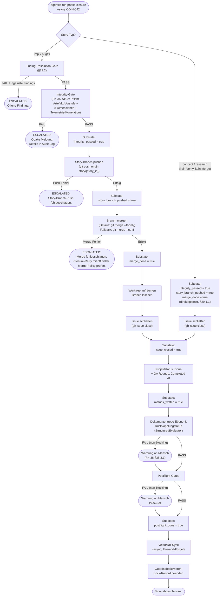

# 29 — Closure-Sequence

<!-- PROSE-FORMAL: formal.story-closure.entities, formal.story-closure.state-machine, formal.story-closure.commands, formal.story-closure.events, formal.story-closure.invariants, formal.story-closure.scenarios, formal.story-workflow.state-machine, formal.story-workflow.invariants, formal.story-workflow.scenarios -->

## 29.1 Closure-Phase

### 29.1.0 ClosurePayload — durable Contract Fields

> **[Entscheidung 2026-04-09]** `ClosurePayload` führt `ClosureProgress` als typisiertes Objekt mit granularen Booleans. Granularität ist notwendig, weil "nach Merge vor Issue-Close" als Recovery-Zustand eindeutig identifizierbar sein muss. Ein grobes `current_substate`-Enum würde diese Eindeutigkeit nicht liefern. Verweis auf Designwizard R1+R2 vom 2026-04-09.

`ClosurePayload` ist die phasenspezifische Payload für die Closure-Phase (diskriminierte Union, FK-39 §39.2.3):

```python
class ClosureProgress(BaseModel):
    integrity_passed: bool = False
    story_branch_pushed: bool = False
    merge_done: bool = False
    issue_closed: bool = False
    metrics_written: bool = False
    postflight_done: bool = False

class ClosurePayload(BaseModel):
    phase_type: Literal["closure"]
    progress: ClosureProgress = Field(default_factory=ClosureProgress)
```

`ClosureProgress` hat Recovery-Relevanz: Jedes Boolean entspricht einem abgeschlossenen Closure-Substate. Bei Crash und Wiederaufnahme (§29.1.3) überspringt der Phase Runner alle Schritte, deren Boolean bereits `true` ist.

**Granularität:** Die Einzelbooleans sind notwendig, weil Closure-Substates nicht zurückgerollt werden können (Merge ist irreversibel, Issue-Close ist ein GitHub-Seiteneffekt). Ein einziges `current_substate`-Enum würde den Zustand "nach Merge, vor Issue-Close" nicht eindeutig von "vor Merge" unterscheiden.

### 29.1.1 Voraussetzung

Closure wird nur aufgerufen wenn Verify PASS. **Ausnahme: Concept- und Research-Stories** durchlaufen keine Verify-Phase — für diese Story-Typen wird Closure direkt nach der Implementation-Phase aufgerufen. `integrity_passed` und `merge_done` werden für Concept/Research direkt auf `true` gesetzt (kein Worktree, kein Branch-Merge, FK-20 §20.8.2).

**REF-034:** Für Exploration-Mode-Stories gilt: Verify läuft erst NACH der vollständigen Exploration-Phase (einschließlich Design-Review-Gate). Das Design-Review-Gate (`ExplorationGateStatus.APPROVED`) wird durch den Phase-Runner-Guard am Übergang `exploration → implementation` erzwungen (FK-20 §20.4.2a). Wenn Verify erreicht wird, ist `APPROVED` durch die State-Machine-Invariante garantiert — kein erneuter Payload-Zugriff aus der Verify-Phase nötig. [Korrektur 2026-04-09: Direkte Referenz auf `ExplorationPayload.gate_status` aus der Verify-Phase entfernt — ExplorationPayload ist nicht der aktive Payload in der Verify-Phase (aktiv: VerifyPayload). Die Garantie stammt aus dem Transition-Guard, nicht aus einem Laufzeit-Check in Verify.]

**REF-036 / FK-37 §37.1:** Die QA-Tiefe wird über `verify_context` gesteuert,
nicht über `mode`. Nach der Implementation-Phase gilt
`verify_context = VerifyContext.POST_IMPLEMENTATION`, nach einer
Remediation-Runde `verify_context = VerifyContext.POST_REMEDIATION` —
beide lösen die volle 4-Schichten-Verify aus, unabhängig davon ob
die Story im Exploration- oder Execution-Modus gestartet wurde.
[Korrektur 2026-04-09: `STRUCTURAL_ONLY_PASS` und `post_exploration`
entfernt — Verify läuft immer mit voller Pipeline (FK-37 §37.1.5).]

> **[Entscheidung 2026-04-08]** Element 17 — Alle 11 Eskalations-Trigger werden beibehalten. FK-20 §20.6.1 und FK-35 §35.4.2 normativ. Kein Trigger ist redundant.
> Siehe `stories/entscheidung-v2-ballast-bewertung.md`, Element 17.

### 29.1.2 Ablauf mit Substates



### 29.1.3 Substates und Recovery

[Entscheidung 2026-04-09: `closure_substates` ersetzt durch
`ClosurePayload.progress` (Typ `ClosureProgress`). Die Bool-
Felder liegen jetzt unter `payload.progress.*` im Phase-State.]

Die sechs ClosureProgress-Booleans markieren die kritischen
Checkpoints mit Crash-Recovery-Relevanz. Weitere Schritte
(Finding-Resolution-Gate, VectorDB-Sync, Guards-Off) werden nicht
separat im Progress-Feld verfolgt — Finding-Resolution ist eine
Vorstufe, VectorDB-Sync und Guards-Off sind idempotente
Fire-and-Forget-Operationen. Bei Crash: Recovery setzt beim letzten
bestätigten Fortschrittsfeld wieder an (FK-10 §10.5.3).

```python
class ClosureProgress(BaseModel):
    integrity_passed: bool = False
    story_branch_pushed: bool = False
    merge_done: bool = False
    issue_closed: bool = False
    metrics_written: bool = False
    postflight_done: bool = False

class ClosurePayload(BaseModel):
    progress: ClosureProgress
```

Im Phase-State (`phase-state.json`):

```json
"payload": {
  "progress": {
    "integrity_passed": true,
    "story_branch_pushed": true,
    "merge_done": true,
    "issue_closed": false,
    "metrics_written": false,
    "postflight_done": false
  }
}
```

Zugriff: `payload.progress.integrity_passed`,
`payload.progress.story_branch_pushed`,
`payload.progress.merge_done` etc.

Bei erneutem Aufruf von `agentkit run-phase closure`:

- Story-Branch-Push wird übersprungen, wenn
  `payload.progress.story_branch_pushed == true`
- Merge wird übersprungen, wenn
  `payload.progress.merge_done == true`
- Issue-Close wird ausgeführt, wenn
  `payload.progress.issue_closed == false`

Teardown (Worktree aufräumen, Branch löschen) ist idempotent — er wird bei jedem Recovery-Lauf mit `merge_done == true && issue_closed == false` erneut ausgeführt. Ein eigenes `teardown_done`-Feld ist nicht erforderlich, da ein fehlgeschlagener oder bereits erledigter Teardown keinen Datenverlust verursacht.

### 29.1.4 Reihenfolge ist Pflicht (FK-05-226)

Die Reihenfolge stellt sicher, dass ein Issue nie geschlossen wird,
wenn der Merge scheitert:

1. Erst Finding-Resolution-Gate (§29.2) → sicherstellt: alle Findings vollständig aufgelöst
2. Erst Integrity-Gate (FK-35 §35.2) → sicherstellt: Prozess wurde durchlaufen
3. Erst Story-Branch pushen → Remote enthält den finalen Integrationsstand
4. Erst mergen → Code ist auf Main
5. Erst Worktree aufräumen → kein staler Worktree
6. Dann Issue schließen → fachlich abgeschlossen
7. Dann Metriken → Nachvollziehbarkeit
8. Dann Rückkopplungstreue (FK-38 §38.3) → Doku aktuell?
9. Dann Postflight → Konsistenzprüfung
10. Dann VektorDB-Sync → für nachfolgende Stories suchbar
11. Zuletzt Guards deaktivieren → AI-Augmented-Modus wieder frei

### 29.1.5 Merge-Policy

Closure kennt zwei offizielle Merge-Policies:

| Merge-Policy | Bedeutung | Verwendung |
|--------------|-----------|-----------|
| `ff_only` | Merge ohne Merge-Commit | Default |
| `no_ff` | Merge mit explizitem Merge-Commit | Offizieller Fallback-/Recovery-Pfad |

**Verbotene Recovery:** Manuelle Rebases, Force-Pushes oder
Guard-Umgehungen sind kein zulässiger Closure-Fix.

**Zulässige Recovery:** Ein dokumentierter Closure-Retry mit der
offiziellen Merge-Policy `no_ff`.

## 29.2 Finding-Resolution als Closure-Gate (FK-27-221 bis FK-27-225)

### 29.2.1 Prinzip

Closure blockiert, wenn mindestens ein Finding aus dem Layer-2-Output
den Resolution-Status `partially_resolved` oder `not_resolved` hat.
Es gibt keinen degradierten Modus — ein offenes Finding ist ein
harter Blocker.

**Ausnahme Concept/Research:** Für Concept- und Research-Stories
entfallen Finding-Resolution-Gate UND Integrity-Gate vollständig (kein
Layer-2-QA, kein Verify, kein Merge). `integrity_passed` und `merge_done`
werden direkt auf `true` gesetzt; der Closure-Ablauf startet effektiv
bei `issue_closed` (§29.1.2 Concept/Research-Pfad im Flowchart).

**Provenienz:** DK-04 §4.6. Empirischer Beleg BB2-012: Worker
markierte ein Finding als `ADDRESSED`, obwohl nur ein Teilfall
behoben war. Das System uebernahm die Teilbehebung als
Vollbehebung, weil keine andere Instanz den Finding-Status setzte.

### 29.2.2 Quelle des Resolution-Status (FK-27-222)

Der Resolution-Status kommt ausschliesslich aus den Layer-2-QA-
Review-Checks (StructuredEvaluator im Remediation-Modus, FK-34).
Es gibt keine eigene Quelle und kein separates Artefakt:

- **Kanonisch:** Layer-2-Evaluator bewertet pro Finding:
  `fully_resolved`, `partially_resolved`, `not_resolved`
- **Nicht kanonisch:** Worker-Artefakte (`protocol.md`,
  `handover.json`) — diese haben Trust C und duerfen den Status
  eines Findings nicht autoritativ setzen (DK-04 §4.2)

Die Bewertung erfolgt als zusaetzliche Check-IDs in den bestehenden
Layer-2-Artefakten (`qa_review.json`, `semantic_review.json`, `doc_fidelity.json`, FK-27 §27.5.5). Kein
neues Artefakt.

### 29.2.3 Finding-Laden im Remediation-Zyklus (FK-27-223)

Im Remediation-Zyklus (Runde 2+) werden die Findings der Vorrunde
direkt aus den Review-Artefakten geladen, NICHT aus Worker-
Zusammenfassungen:

```python
def load_previous_findings(story_id: str, previous_cycle_id: str) -> list[dict]:
    """Laedt Findings der Vorrunde aus stale/ Review-Artefakten.

    Wichtig: Direkt aus Review-Artefakten, nicht aus Worker-
    Zusammenfassungen (BB2-012: Worker-Zusammenfassungen
    komprimieren offene Subcases weg).
    """
    stale_dir = Path(f"_temp/qa/{story_id}/stale/{previous_cycle_id}")
    findings = []
    for artifact_name in ("qa_review.json", "semantic_review.json", "doc_fidelity.json"):
        artifact_path = stale_dir / artifact_name
        if artifact_path.exists():
            artifact = json.loads(artifact_path.read_text())
            for check in artifact.get("checks", []):
                if check.get("status") == "FAIL":
                    findings.append(check)
    return findings
```

### 29.2.4 Gate-Pruefung vor Closure (FK-27-224)

[Korrektur 2026-04-09: Die Finding-Resolution-Pruefung laeuft als
**Closure-Gate** (§29.2.1), nicht als Teil der Policy-Evaluation
(Schicht 4). Policy-Evaluation prueft auf BLOCKING-Failures und
major_threshold — Finding-Resolution ist ein eigenstaendiger
Vorstufen-Check am Beginn der Closure-Phase, konsistent mit dem
Abschnittstitel "Finding-Resolution als Closure-Gate" und FK-27 §27.7.1.]

Die Finding-Resolution-Pruefung laeuft als Closure-Gate (§29.2.1)
— vor dem Integrity-Gate, am Beginn der Closure-Phase. Sie prueft
alle drei Layer-2-Artefakte:

```python
# [Korrektur 2026-04-09] Alle drei Layer-2-Artefakte pruefen (FK-27 §27.5.5),
# konsistent mit §29.2.3 und FK-38 §38.1.1.
def check_finding_resolution(story_id: str) -> bool:
    """Prueft ob alle Findings vollstaendig aufgeloest sind.

    Returns False wenn mindestens ein Finding partially_resolved
    oder not_resolved ist.
    """
for artifact_id in ("qa_review", "semantic_review", "doc_fidelity"):
        review = load_artifact(story_id, artifact_id)
        if review is None:
            return False  # fail-closed

        for check in review.get("checks", []):
            resolution = check.get("resolution")
            # Design-Invariante: Erstlauf (Runde 1, kein Remediation) → keine Checks haben
            # ein resolution-Feld → Gate gibt True zurück → Closure nicht blockiert.
            # Ab Runde 2 (Remediation-Modus, §29.2.2): Checks haben resolution-Feld →
            # Gate wird aktiv. fail-closed für unbekannte/problematische Werte.
            if resolution is None:
                continue  # kein Remediation-Check, nicht prüfen
            if resolution not in ("fully_resolved", "not_applicable"):
                return False
    return True
```

### 29.2.5 Artefakt-Invalidierung (FK-27-225)

Die Finding-Resolution ist Teil der bestehenden Layer-2-Artefakte
`qa_review.json`, `semantic_review.json` und `doc_fidelity.json` (FK-27 §27.5.5) — alle drei
Artefakte sind bereits in der Invalidierungstabelle (FK-27 §27.2.3)
enthalten. Eine Erweiterung der Tabelle ist daher nicht erforderlich.

**Querverweis:** FK-34 fuer die technische Erweiterung des
StructuredEvaluator um den Remediation-Modus.

## 29.3 Postflight-Gates

### 29.3.1 Checks (FK-05-227 bis FK-05-231)

Nach erfolgreichem Merge und Issue-Close (für Concept/Research: nach
`merge_done = true` und `issue_closed = true`, §29.1.1):

| Check | Was | FAIL wenn |
|-------|-----|----------|
| `story_dir_exists` | Story-Verzeichnis existiert mit `protocol.md` | Verzeichnis oder Protokoll fehlt |
| `issue_closed` | Issue-State == CLOSED | Issue noch offen |
| `metrics_set` | QA Rounds und Completed At gesetzt | Felder leer |
| `telemetry_complete` | `agent_start` und `agent_end` Events vorhanden | Events fehlen |
| `artifacts_complete` | Bei impl/bugfix: `structural.json`, `decision.json`, `context.json` vorhanden. Bei concept/research: nur `context.json` Pflicht (`structural.json` und `decision.json` entfallen — kein Verify). | Pflicht-Artefakte fehlen |

### 29.3.2 Postflight-FAIL

Postflight-Failure nach erfolgreichem Merge ist ein Sonderfall:
Der Code ist bereits auf Main. Ein Rollback ist nicht vorgesehen.
Stattdessen: Warnung an den Menschen, dass die Konsistenz
unvollständig ist. Der Mensch entscheidet, ob Nacharbeit nötig ist.

## 29.4 Execution Report

### 29.4.1 Zweck

Am Ende jeder Story-Bearbeitung — unabhängig vom Ergebnis (COMPLETED,
ESCALATED, FAILED) — wird ein konsolidierter Markdown-Report erzeugt:
`_temp/qa/{story_id}/execution-report.md`. Konsument ist der Mensch
(Oversight/Audit); bei erfolgreich abgeschlossenen Stories ist keine
aktive Intervention erforderlich.

### 29.4.2 Report-Sektionen

| Sektion | Inhalt |
|---------|--------|
| **Summary Table** | Story-ID, Typ, Modus, Status, Dauer, QA Rounds, Feedback Rounds, durchlaufene Verify-Schichten |
| **Failure Diagnosis** | Fehlgeschlagene Phase, primärer Fehler, Trigger — nur bei FAILED/ESCALATED |
| **Artifact Health** | Verfügbare vs. fehlende/invalide Datenquellen; Ladestatus pro Quelle |
| **Errors and Warnings** | Aggregierte Fehler und Warnungen aus allen Phasen |
| **Structural Check Results** | Ergebnisse der deterministischen Checks (Schicht 1) |
| **Policy Engine Verdict** | Aggregiertes Policy-Ergebnis mit Blocking/Major/Minor Counts |
| **Closure Sub-Step Status** | Status jedes `ClosureProgress`-Feldes (`payload.progress.integrity_passed`, `payload.progress.story_branch_pushed`, `payload.progress.merge_done`, `payload.progress.issue_closed`, `payload.progress.metrics_written`, `payload.progress.postflight_done`) [Entscheidung 2026-04-09] |
| **Telemetry Event Counts** | Zähler aller relevanten Telemetrie-Events |
| **Integrity Violations Log** | Vollständiger Integrity-Violations-Auszug (falls vorhanden) |

### 29.4.3 Graceful Degradation

Jede Datenquelle ist optional. Wenn ein Artefakt fehlt oder nicht
ladbar ist, wird der Ladestatus in der Sektion "Artifact Health"
als `MISSING` oder `LOAD_ERROR` dokumentiert. Die restlichen Sektionen
werden trotzdem befüllt — der Report wird nie wegen fehlender
Einzeldaten abgebrochen.

### 29.4.4 FK-Referenz

Domänenkonzept 5.2 Closure-Phase "Execution Report".

## 29.5 Guard-Deaktivierung

Nach erfolgreichem Postflight:

1. Lock-Record im State-Backend beenden und optionale Lock-Exporte entfernen:
   `_temp/governance/locks/{story_id}/qa-lock.json`
   sowie `.agent-guard/lock.json` in betroffenen Worktrees
2. Ab hier: AI-Augmented-Modus wieder aktiv (Branch-Guard inaktiv,
   Orchestrator-Guard inaktiv, QA-Schutz inaktiv)
