# 29 — Closure-Sequence

<!-- PROSE-FORMAL: formal.story-closure.entities, formal.story-closure.state-machine, formal.story-closure.commands, formal.story-closure.events, formal.story-closure.invariants, formal.story-closure.scenarios, formal.story-workflow.state-machine, formal.story-workflow.invariants, formal.story-workflow.scenarios -->

## 29.1 Closure-Phase

### 29.1.0 ClosurePayload — durable Contract Fields

`ClosurePayload` ist die phasenspezifische Payload für die Closure-Phase (diskriminierte Union, FK-39 §39.2.3):

```python
class ClosureProgress(BaseModel):
    integrity_passed: bool = False
    story_branch_pushed: bool = False
    merge_done: bool = False
    story_closed: bool = False
    metrics_written: bool = False
    postflight_done: bool = False

class ClosurePayload(BaseModel):
    phase_type: Literal["closure"]
    progress: ClosureProgress = Field(default_factory=ClosureProgress)
```

`ClosureProgress` hat Recovery-Relevanz: Jedes Boolean entspricht einem abgeschlossenen Closure-Substate. Bei Crash und Wiederaufnahme (§29.1.3) überspringt der Phase Runner alle Schritte, deren Boolean bereits `true` ist.

**Granularität:** Die Einzelbooleans sind notwendig, weil Closure-Substates nicht zurückgerollt werden können (Merge ist irreversibel, der Story-Status-Wechsel auf Done ist ein authoritativer Backend-Seiteneffekt). Ein einziges `current_substate`-Enum würde den Zustand "nach Merge, vor Story-Closed" nicht eindeutig von "vor Merge" unterscheiden.

### 29.1.1 Voraussetzung

Closure wird nur aufgerufen, wenn die Implementation-Phase mit
COMPLETED endet. Das schliesst den intern in der Implementation-Phase
durchlaufenen QA-Subflow (FK-27, ehemals "Verify-Phase") ein:
Implementation kann nur dann mit COMPLETED enden, wenn der QA-Subflow
mit `qa_cycle_status = pass` abgeschlossen wurde. **Ausnahme: Concept-
und Research-Stories** durchlaufen keinen QA-Subflow — fuer diese
Story-Typen wird Closure direkt nach der Implementation-Phase
aufgerufen. `integrity_passed`, `story_branch_pushed` und `merge_done`
werden fuer Concept/Research direkt auf `true` gesetzt (kein QA-Subflow,
kein Pre-Merge-Scan; FK-20 §20.8.2). Concept/Research-Stories haben **keinen** Worktree und **keinen**
`story/{story_id}`-Branch und arbeiten **direkt auf `main`** (FK-20 §20.8.2,
FK-22 §22.5.1). Fuer sie ist `story_branch_pushed` **nicht anwendbar (N/A)**
und wird im Recovery-Sinn als „nichts zu pushen" uebersprungen; das Boolean
wird der Einheitlichkeit der `ClosureProgress`-Struktur halber auf `true`
gesetzt, ohne dass ein Branch-Push stattfindet. Der gesamte Pre-Merge-Scan-und-Merge-
Block, das SonarQube-Green-Gate und die Integrity-Gate-Dimension 9 sind
**ausschliesslich fuer impl/bugfix** (§29.1a, §29.2; FK-22 §22.4c; FK-10
§10.5.3; FK-39 §39.2.3). Der Recovery-Algorithmus (§29.1.3) braucht damit
genau eine Story-Typ-Fallunterscheidung: code-Stories durchlaufen den
gesperrten Block, non-code-Stories nicht.

**Exploration-Mode-Stories:** Der QA-Subflow laeuft
innerhalb der Implementation-Phase, also NACH der vollstaendigen
Exploration-Phase (einschliesslich Design-Review-Gate). Das
Design-Review-Gate (`ExplorationGateStatus.APPROVED`) wird durch den
Phase-Runner-Guard am Uebergang `exploration -> implementation`
erzwungen (FK-20 §20.4.2a). Wenn Closure erreicht wird, ist `APPROVED`
durch die State-Machine-Invariante garantiert — kein erneuter
Payload-Zugriff noetig.

**QA-Tiefe (FK-37 §37.1):** Die QA-Tiefe wird ueber `verify_context`
gesteuert, nicht ueber `mode`. Nach Worker-Run innerhalb der
Implementation-Phase gilt `verify_context = QaContext.IMPLEMENTATION_INITIAL`,
nach einer Subflow-internen Remediation-Iteration
`verify_context = QaContext.IMPLEMENTATION_REMEDIATION` — beide loesen den
vollen 4-Schichten-QA-Subflow aus, unabhaengig davon, ob die Story im
Exploration- oder Execution-Modus gestartet wurde. `verify_context`
ist Subflow-internes Diskriminator-Feld auf `ImplementationPayload`
(FK-39 §39.2.3).

### 29.1.2 Ablauf mit Substates

```mermaid
flowchart TD
    START(["Service: POST /phases/closure/start<br/>{story_id: ODIN-042}"]) --> STYPE{Story-Typ?}

    STYPE -->|"impl / bugfix"| FR
    STYPE -->|"concept / research<br/>(kein QA-Subflow, kein Merge)"| CR_SUB1["Substate:<br/>integrity_passed = true<br/>story_branch_pushed = true<br/>merge_done = true<br/>(direkt gesetzt, §29.1.1)"]
    CR_SUB1 --> CLOSE_CR["Story-Status: Done<br/>(AK3-Story-Service)"]
    CLOSE_CR --> SUB3

    FR["Finding-Resolution-Gate<br/>(§29.2)"]
    FR -->|"FAIL: Ungelöste Findings"| ESC_FR(["ESCALATED:<br/>Offene Findings."])
    FR -->|PASS| PMB_LOCK

    PMB_LOCK["Pre-Merge-Scan-und-Merge-Block (§29.1a)<br/>acquire merge-lock (locked_sha := origin/main)<br/>fetch + assert origin/main == locked_sha<br/>integrate main → story/{story_id}<br/>clean workspace (git clean -xfd)"]
    PMB_LOCK --> PUSH_SB["Story-/Pre-Merge-Ref pushen<br/>(Jenkins-erreichbar, nicht main)<br/>innerhalb des Locks"]
    PUSH_SB -->|Push-Fehler| ESC_P(["ESCALATED:<br/>Story-/Pre-Merge-Ref-Push fehlgeschlagen.<br/>kein ff-Update auf main."])
    PUSH_SB -->|Erfolg| SUB_PUSH["Substate:<br/>story_branch_pushed = true"]
    SUB_PUSH --> PMB_SCAN["Build/Test/Coverage via Jenkins +<br/>full integrated-candidate Sonar scan via Jenkins<br/>wait by ceTaskId · apply ledger (FK-33 §33.6.4)<br/>verify QG by analysisId (Overall-Code)<br/>→ erzeugt commit-gebundene Attestation"]
    PMB_SCAN -->|"rot (main-Drift)"| ESC_RED(["Remediation-Loop (§29.1a.4)<br/>→ Retry mit neuem locked_sha<br/>dauerhaft rot/nicht-ff: ESCALATED"])
    PMB_SCAN -->|"gruen"| PMB_TREE["assert tree_hash(scan) == tree_hash(merge)"]

    PMB_TREE --> INTEGRITY["Integrity-Gate (innerhalb des Locks)<br/>(agentkit.backend.governance.integrity_gate;<br/>FK-35 §35.2: Pflicht-Artefakt-Vorstufe +<br/>9 Dimensionen inkl. Dim. 9 SonarQube-Green<br/>= verifiziert die frische Attestation +<br/>Telemetrie-Korrelation)"]
    INTEGRITY -->|FAIL| ESC_I(["ESCALATED:<br/>Opake Meldung.<br/>Details in Audit-Log."])
    INTEGRITY -->|PASS| SUB1["Substate:<br/>integrity_passed = true"]

    SUB1 --> MERGE["ff-only update main<br/>(compare-and-swap/lease gegen locked_sha)<br/>Fallback-Policy: no_ff (dok. Retry, §29.1.5)"]
    MERGE -->|"CAS-Fehler / Merge-Fehler"| ESC_M(["ESCALATED:<br/>Block neu aufsetzen oder<br/>Closure-Retry mit offizieller Merge-Policy."])
    MERGE -->|Erfolg| PMB_POST["post-merge reconcile/verify<br/>(Ledger erneut gegen main, FK-33 §33.6.4)<br/>release merge-lock"]
    PMB_POST --> SUB2["Substate:<br/>merge_done = true"]

    SUB2 --> TEARDOWN["Worktree aufräumen<br/>Branch löschen"]
    TEARDOWN --> CLOSE["Story-Status: Done<br/>(AK3-Story-Service)"]
    CLOSE --> SUB3["Substate:<br/>story_closed = true"]

    SUB3 --> STATUS["Projektstatus: Done<br/>+ QA Rounds, Completed At"]
    STATUS --> SUB4["Substate:<br/>metrics_written = true"]

    SUB4 --> DOCTREUE4["Dokumententreue Ebene 4:<br/>Rückkopplungstreue<br/>(agentkit.backend.verify_system.llm_evaluator;<br/>StructuredEvaluator, FK-34)"]
    DOCTREUE4 -->|"FAIL (non-blocking)"| WARN_DT(["Warnung an Mensch<br/>(FK-38 §38.3.1)"])
    DOCTREUE4 -->|"PASS"| POSTFLIGHT["Postflight-Gates"]
    WARN_DT --> POSTFLIGHT
    POSTFLIGHT -->|"FAIL (non-blocking)"| WARN_PF(["Warnung an Mensch<br/>(§29.3.2)"])
    POSTFLIGHT -->|"PASS"| SUB5["Substate:<br/>postflight_done = true"]
    WARN_PF --> SUB5

    SUB5 --> VDBSYNC["VektorDB-Sync<br/>(async, Fire-and-Forget)"]
    VDBSYNC --> GUARDS_OFF["Guards deaktivieren:<br/>Governance.deactivate_locks(story_id)<br/>(agentkit.backend.governance)"]
    GUARDS_OFF --> DONE(["Story abgeschlossen"])
```



### 29.1.3 Substates und Recovery

Die sechs ClosureProgress-Booleans markieren die kritischen
Checkpoints mit Crash-Recovery-Relevanz. Weitere Schritte
(Finding-Resolution-Gate, VectorDB-Sync, Guards-Off) werden nicht
separat im Progress-Feld verfolgt — Finding-Resolution ist eine
Vorstufe, VectorDB-Sync und Guards-Off sind idempotente
Fire-and-Forget-Operationen. Bei Crash: Recovery setzt beim letzten
bestätigten Fortschrittsfeld wieder an (FK-10 §10.5.3).

```python
class ClosureProgress(BaseModel):
    integrity_passed: bool = False
    story_branch_pushed: bool = False
    merge_done: bool = False
    story_closed: bool = False
    metrics_written: bool = False
    postflight_done: bool = False

class ClosurePayload(BaseModel):
    progress: ClosureProgress
```

Im Phase-State (`phase-state.json`):

```json
"payload": {
  "progress": {
    "integrity_passed": true,
    "story_branch_pushed": true,
    "merge_done": true,
    "story_closed": false,
    "metrics_written": false,
    "postflight_done": false
  }
}
```

Zugriff: `payload.progress.integrity_passed`,
`payload.progress.story_branch_pushed`,
`payload.progress.merge_done` etc.

Bei erneutem Aufruf (Service: `POST /phases/closure/start` oder Operator-CLI `agentkit run-phase closure`):

- Story-Branch-Push wird übersprungen, wenn
  `payload.progress.story_branch_pushed == true`
- Merge wird übersprungen, wenn
  `payload.progress.merge_done == true`
- Story-Status-Wechsel auf Done wird ausgeführt, wenn
  `payload.progress.story_closed == false`

Teardown (Worktree aufräumen, Branch löschen) ist idempotent — er wird bei jedem Recovery-Lauf mit `merge_done == true && story_closed == false` erneut ausgeführt. Ein eigenes `teardown_done`-Feld ist nicht erforderlich, da ein fehlgeschlagener oder bereits erledigter Teardown keinen Datenverlust verursacht.

**Der gesperrte Pre-Merge-Scan-und-Merge-Block hat nur explizite,
durable Recovery-Punkte.** Nicht jeder interne Schritt wird im
`ClosureProgress` verfolgt. Durabel sind genau der Candidate-/Story-Ref-
Push (`story_branch_pushed`), der bestandene Integrity-Gate-Punkt
(`integrity_passed`) und der abgeschlossene Merge (`merge_done`).
Crasht der Lauf **innerhalb** des Locks **vor** dem Push, ist
`story_branch_pushed == false`: der gesamte Block wird beim Recovery mit
einem **frischen `locked_sha`** neu aufgesetzt. Crasht der Lauf nach dem
Push, aber vor `integrity_passed`, scannt und gatet Recovery den bereits
Jenkins-erreichbaren Ref erneut; vorher wird fail-closed geprueft, dass
dieser Ref noch den aktuellen `origin/main` enthaelt. Crasht der Lauf
nach `integrity_passed`, aber vor `merge_done`, wird die frische,
commit-gebundene Attestation nicht erneut erzeugt; Recovery setzt mit
dem ff-/CAS-Merge fort. Kein Recovery-Pfad tritt semantisch erneut in
den Implementation-QA-Subflow ein.

### 29.1.4 Reihenfolge ist Pflicht (FK-05-226)

Die Reihenfolge stellt sicher, dass eine Story nie auf Done gesetzt
wird, wenn der Merge scheitert. Fuer impl/bugfix-Stories gilt die
folgende kanonische Closure-Reihenfolge:

1. Erst Finding-Resolution-Gate (§29.2) → sicherstellt: alle Findings vollständig aufgelöst
2. Erst Pre-Merge-Scan-und-Merge-Block (§29.1a) **unter dem Merge-Serialisierungs-Lock** — in dieser strikten internen Reihenfolge:
   a. Lock erwerben (`locked_sha := origin/main`), `fetch`, `assert origin/main == locked_sha`
   b. latest `main` in den Story-Branch integrieren, Workspace säubern (`git clean -xfd`)
   c. integrierten Candidate auf einen Jenkins-erreichbaren Story-/Pre-Merge-Ref pushen (nicht `main`), `progress.story_branch_pushed = true`
   d. Build / Test / Coverage auf exakt diesem Ref und `commit_sha`
   e. **Integrated-Candidate-Sonar-Scan** durch Jenkins (Single-Match-Ledger, QG per `analysisId`, Overall-Code) → **erzeugt die commit-gebundene Attestation**; `tree_hash(scan) == tree_hash(merge)`
   f. **Integrity-Gate** (FK-35 §35.2, Dimensionen 1–9) → Dimension 9 `SonarQube-Green` **verifiziert genau die in Schritt e erzeugte frische Attestation** (FK-35 §35.2.4a) und vermisst nicht neu
   g. ff-only Update von `main` (compare-and-swap/lease gegen `locked_sha`)
   h. post-merge Reconcile (Ledger erneut gegen `main`, FK-33 §33.6.4), Lock freigeben
3. Erst Worktree aufräumen → kein staler Worktree
4. Dann Story-Status auf Done setzen (AK3-Story-Service) → fachlich abgeschlossen
5. Dann Metriken → Nachvollziehbarkeit
6. Dann Rückkopplungstreue (FK-38 §38.3) → Doku aktuell?
7. Dann Postflight → Konsistenzprüfung
8. Dann VektorDB-Sync → für nachfolgende Stories suchbar
9. Zuletzt Guards deaktivieren → AI-Augmented-Modus wieder frei

**Kausalitaet:** Das Integrity-Gate sitzt
bewusst **innerhalb** des gesperrten Blocks **nach** dem Scan (Schritt
2.e) und **vor** dem ff-Merge nach `main` (Schritt 2.g). Grund: Dimension 9 verifiziert die
commit-gebundene Attestation des integrierten Kandidaten; diese
existiert erst, nachdem der Jenkins-Scan in Schritt 2.e gelaufen ist. Der
Story-/Pre-Merge-Ref-Push liegt dagegen **vor** Build/Test/Sonar, weil Jenkins
den zu bauenden und zu scannenden Candidate sonst nicht auschecken kann. Dieser
Push macht `main` nicht sichtbar; das Gate bleibt damit das letzte Gate vor dem
Merge nach `main`. Ref-Push und ff-Merge liegen **innerhalb** des
Merge-Serialisierungs-Locks, weil der gruene Sonar-Zustand und der
gemergte `main` denselben `tree_hash` tragen muessen (FK-33 §33.6.3).

**Story-Typ-Geltung:** Schritt 2 (Pre-Merge-Scan-und-Merge-Block inkl.
Integrity-Gate-Dimension 9 und SonarQube-Green-Gate) gilt **nur fuer
impl/bugfix**. Concept/Research-Stories haben keinen Branch und mergen
nicht (§29.1.1, §29.2): fuer sie entfallen Finding-Resolution-Gate,
Integrity-Gate und der gesamte gesperrte Block; der Ablauf startet
effektiv bei Schritt 4 (Story-Status auf Done).

**Applicability-Geltung innerhalb impl/bugfix (FK-33 §33.6.5):** Die
Schritte 2.d (Integrated-Candidate-Sonar-Scan) und der Sonar-Anteil von
2.e (Dimension 9) gelten zusaetzlich nur, wenn das `sonarqube_gate`
**APPLICABLE** ist (`sonarqube.available=true` **und** `mode != fast`).
Bei bewusst abwesendem Sonar (`sonarqube.available=false`) entfallen Scan
und Dimension 9 ohne Fail-Closed; die Dimensionen 1–8 und alle uebrigen
Schritte bleiben. Bei `mode=fast` ersetzt das **Sanity-Gate** (§29.1a.6)
den Scan und das 9-Dimensionen-IntegrityGate. Die genaue
Drei-Pfad-Aufloesung ist normativ in §29.1a.1 festgelegt; ein
konfiguriert-aber-unerreichbares/rotes Sonar (`available=true`) bleibt
APPLICABLE und failt closed (abwesend ≠ kaputt).

### 29.1.5 Merge-Policy

Closure kennt zwei offizielle Merge-Policies:

| Merge-Policy | Bedeutung | Verwendung |
|--------------|-----------|-----------|
| `ff_only` | Merge ohne Merge-Commit | Default |
| `no_ff` | Merge mit explizitem Merge-Commit | Offizieller Fallback-/Recovery-Pfad |

**Verbotene Recovery:** Manuelle Rebases, Force-Pushes oder
Guard-Umgehungen sind kein zulässiger Closure-Fix.

**Zulässige Recovery:** Ein dokumentierter Closure-Retry mit der
offiziellen Merge-Policy `no_ff`.

### 29.1.6 Multi-Repo-Closure (Atomicity)

Bei Stories mit mehreren teilnehmenden Repos
(`participating_repos` mit |N| >= 2, FK-22 §22.6) gilt eine **praezise**
Garantie statt einer Garantie, die das System gar nicht halten kann:

- **Was garantiert ist (atomare Gruen-Barriere):** Kein `main` irgendeines
  teilnehmenden Repos wird sichtbar veraendert, bevor **alle** Repos die
  Gruen-**und**-FF-Mergbarkeits-Barriere (Stufe 1, ohne Push) bestanden
  haben. Ein nicht-gruener oder nicht-ff-faehiger Repo blockiert die
  gesamte Closure (ESCALATED), bevor ueberhaupt ein Push beginnt.
- **Was NICHT garantiert werden kann (ehrlicher Caveat):** Cross-Remote-
  Push ueber mehrere Git-Hosts ist **nicht transaktional atomar**. Ist die
  Gruen-Barriere bestanden und beginnt die Push-Stufe, kann ein
  Push-Fehler in Repo k (nachdem 1..k-1 bereits remote gepusht wurden)
  einen **partiellen Main-Zustand** hinterlassen, der **nicht** still als
  atomar weginterpretiert wird, sondern **eskaliert** (ESCALATED, Mensch
  entscheidet) und ueber dokumentierte **kompensierende Recovery**
  (§29.1.6.3) behandelt wird.

Eine partial-pushed Story ist daher ein **eskalierter** (nicht stiller,
nicht „atomar gutgeschriebener") Endzustand.

#### 29.1.6.1 Sequenz

Die Reihenfolge aus §29.1.4 gilt unveraendert; im **Single-Repo**-Fall
sind Scan, Push und ff-Merge **ein** gesperrter Block (§29.1a, ein
Merge-Serialisierungs-Lock). Im **Multi-Repo**-Fall wird dieser Block
**bewusst aufgeteilt**: die Gruen-und-FF-Mergbarkeits-**Barriere** (pro
Repo, **ohne** Push) wird von der eigentlichen Push-/Merge-Stufe
getrennt — genau **weil** Cross-Remote-Push nicht atomar ist und kein
`main` sichtbar werden darf, bevor **alle** Repos die Barriere bestanden
haben. Der Teardown (§29.1.4 Schritt 4) wird ebenfalls zu einer Stufe
ueber alle Repos. Die nachfolgenden Stufen 1-5 sind die Multi-Repo-
Auspraegung dieser Schritte aus der Single-Repo-Sequenz; alles nach
Teardown (Story-Closed, Metriken, Rueckkopplungstreue, Postflight,
VektorDB-Sync, Guards-Off; §29.1.4 Schritte 5-10) laeuft pro-Story und
ist nicht multi-repo-aufgespalten. Jeder teilnehmende Repo wird dabei
auf seinem integrierten Pre-Merge-Stand applicability-aufgeloest gruen
vermessen (§29.1a) und auf ff-Mergbarkeit geprueft, **bevor** auf
irgendeinem Repo ein Push beginnt; ein nicht-gruener oder nicht-ff-faehiger
Repo blockiert die gesamte Closure (ESCALATED). „Gruen vermessen" meint im
**APPLICABLE**-Fall (`sonarqube.available true` UND nicht `mode==fast`,
FK-33 §33.6.5) den Integrated-Candidate-Sonar-Scan plus Dimension 9; bei
**deliberately absent Sonar** (`sonarqube.available false`) entfaellt der
Sonar-Scan/Dim 9 und die Barriere stuetzt sich pro Repo auf die
Integrity-Gate-Dimensionen 1-8 ohne Sonar (kein Fail-Closed); unter
**`mode==fast`** ersetzt das Sanity-Gate (Tests gruen, Worktree sauber,
Pre-Merge-Rebase ok) den Scan und das Neun-Dimensionen-Gate. Ein
konfiguriertes-aber-nicht-erreichbares oder rotes Sonar (`available true`)
bleibt APPLICABLE und faellt fail-closed (absent ist nicht broken).

1. **Stufe 1 — Pre-Merge-Gruen-und-FF-Mergbarkeits-Barriere (pro Repo,
   ohne Push):** fuer **jedes** teilnehmende Repo wird unter dem
   **pro-Repo** Merge-Serialisierungs-Lock geprueft — **aber noch nichts
   gepusht und nichts auf `main` sichtbar gemacht**: `locked_sha`
   festhalten, latest `main` integrieren, Workspace saeubern,
   Build/Test, sowie der lokale ff-Mergebarkeits-Check gegen den jeweils
   aktuellen `origin/main`. Der **APPLICABLE**-Anteil dieser Barriere
   (`sonarqube.available true` UND nicht `mode==fast`) umfasst zusaetzlich
   den **Integrated-Candidate-Sonar-Scan** (erzeugt die commit-gebundene
   Attestation pro Repo), `tree_hash(scan) == tree_hash(merge)` und
   **Integrity-Gate-Dimension 9**, die die frische Per-Repo-Attestation
   verifiziert (FK-35 §35.2.4a). In den **NOT_APPLICABLE**-Faellen entfaellt
   dieser Sonar-Anteil: bei `sonarqube.available false` traegt die Barriere
   pro Repo nur die Integrity-Gate-Dimensionen 1-8 (kein Sonar-Scan, keine
   Dim 9, kein Fail-Closed), unter `mode==fast` ersetzt das Sanity-Gate den
   Scan und das Neun-Dimensionen-Gate. Ein konfiguriertes-aber-nicht-
   erreichbares oder rotes Sonar (`available true`) bleibt APPLICABLE und
   faellt fail-closed.
   Diese Stufe ist **nicht** der „vollstaendige Pre-Merge-Scan-und-Merge-
   Block" (Push und ff-Merge sind die spaeteren Stufen 2-4); sie ist die
   reine Gruen-und-FF-Mergbarkeits-**Barriere**. Auch ein einziger roter
   Kandidat oder ein nicht-ff-faehiger Repo blockiert die **gesamte**
   Closure (ESCALATED, kein Push, kein Merge auf irgendeinem Repo). Eine
   **Barriere** verlangt, dass **ALLE** teilnehmenden Repos gruen **und**
   ff-faehig sind, bevor in Stufe 2 ueberhaupt ein Push beginnt — so wird
   kein einziger `main` sichtbar, bevor alle Repos die Barriere bestehen
   (Cross-Repo-Atomicity der Gruen-Vorbedingung).
2. **Stufe 2 — Push der Jenkins-erreichbaren Story-/Pre-Merge-Refs
   (innerhalb der jeweiligen Repo-Locks):** alle Candidate-Refs werden mit dem
   integrierten Stand gepusht, bevor Jenkins Build/Test/Sonar ausfuehrt. `main`
   wird dadurch nicht veraendert. Erst nach Erfolg in **allen**
   teilnehmenden Repos wird `payload.progress.story_branch_pushed =
   true` gesetzt. Bei Push-Fehler in Repo k werden bereits gepushte
   Branches nicht ausgerollt (Push ist remote-irreversibel ohne
   force-push), die Closure escaliert mit Hinweis auf den
   partial-push-Zustand.
3. **Stufe 3 — lokal-atomarer FF-Merge:** alle teilnehmenden
   Worktrees fuehren `git merge --ff-only` (CAS/Lease gegen den jeweils
   gelockten `locked_sha`) lokal aus. Vor jedem Merge wird der
   `pre_merge_sha` des Ziel-Branches festgehalten. Wenn Merge in Repo k
   fehlschlaegt, werden alle bereits lokal gemergten Repos via
   `git reset --hard <pre_merge_sha>` zurueckgesetzt (lokale
   Atomicity-Garantie). Closure escaliert.
4. **Stufe 4 — Push-zu-main + Per-Repo-Post-Merge-Reconcile:** alle
   gemergten Hauptbranches werden gepusht; je Repo wird der
   Accepted-Ledger erneut gegen `main` reconciled (FK-33 §33.6.4) und
   der pro-Repo Merge-Lock freigegeben. Bei Push-Fehler in Repo k
   bleiben Repos 1..k-1 permanent auf den Remotes; Repos k..N werden
   lokal zurueckgesetzt; Closure escaliert mit explizitem
   **Partial-Push-State** (siehe §29.1.6.3).
5. **Stufe 5 — Teardown:** Worktrees aller teilnehmenden Repos werden
   aufgeraeumt, Story-Branches lokal geloescht. Idempotent.

`payload.progress.merge_done = true` wird gesetzt, sobald Stufe 4
(Push-zu-main) fuer **alle** teilnehmenden Repos PASS gemeldet hat —
also **vor** dem Teardown (Stufe 5). Damit ist `merge_done` konsistent
mit der Recovery-Regel aus §29.1.3 (Teardown wird bei
`merge_done == true && story_closed == false` erneut ausgefuehrt) und
mit der Single-Repo-Sequenz (§29.1.2), in der `merge_done` direkt nach
dem post-merge Reconcile und vor dem Worktree-Teardown gesetzt wird.
Ein einzelner Repo-Push-Fehler in Stufe 4 verhindert das Setzen von
`merge_done`. Der nachgelagerte Teardown (Stufe 5) ist idempotent und
hat keine Recovery-Relevanz fuer `merge_done`.

#### 29.1.6.2 ClosureProgress bei Multi-Repo

Die sechs `ClosureProgress`-Booleans (§29.1.0) bleiben pro-Story, nicht
pro-Repo. Recovery-Granularitaet auf Repo-Ebene wird ueber separate
Substate-Felder im `ClosurePayload.multi_repo`-Block dokumentiert:

```python
class MultiRepoClosureState(BaseModel):
    pre_merge_check_passed: list[str] = Field(default_factory=list)
    pushed_repos: list[str] = Field(default_factory=list)
    merged_repos: list[str] = Field(default_factory=list)
    rolled_back_repos: list[str] = Field(default_factory=list)
    failed_repo: str | None = None
```

Diese Liste wird NUR fuer Multi-Repo-Stories gefuehrt; bei
Single-Repo-Stories bleibt das Feld leer und wird ignoriert.

#### 29.1.6.3 Partial-Push-State (Stufe 4 Failure)

Cross-Remote-Atomicity ueber mehrere Git-Hosts ist nicht erreichbar.
Wenn in Stufe 4 (Push-zu-main) Repo k push-failed, nachdem Repos
1..k-1 bereits auf `origin/main` gepusht wurden, ist der Zustand
nicht mehr automatisch rueckgaengig zu machen. Closure setzt:

- `closure_verdict = ESCALATED`
- `multi_repo.pushed_repos = [r1, ..., r_{k-1}]`
- `multi_repo.failed_repo = r_k`
- Repos `r_{k+1}..r_N` werden lokal via `git reset --hard <pre_merge_sha>`
  zurueckgesetzt (nicht gepusht, nicht gemerged auf Remote)

Der Mensch entscheidet:

a) **Force-revert** der bereits gepushten Repos via dokumentiertem
   `git revert <merge_sha>` + Push (kein force-push), oder
b) **Closure-Retry** der verbleibenden Repos, sobald die Ursache
   behoben ist (typischerweise temporaerer Remote-Fehler).

Beide Pfade sind dokumentierte Recovery-Operationen und keine
Guard-Umgehung.

#### 29.1.6.4 Implementations-Anker

Die AK2-Implementierung (`agentkit.worktree.merge.merge_story_multi_repo`
mit `pre_merge_sha`-Rollback) ist die fachliche Vorlage. Die
Multi-Repo-Closure gehoert zum BC `story-closure` und respektiert die
ClosureProgress-Granularitaet aus §29.1.0.

## 29.1a Pre-Merge-Scan-und-Merge-Block (SonarQube-Green, FK-33-Punkt-3)

### 29.1a.1 Zweck

**Applicability zuerst (FK-33 §33.6.5):** Auch dieser dritte Lifecycle-Gate-Punkt
loest **vor** der Gruen/Rot-Bewertung die Anwendbarkeit des `sonarqube_gate`
auf. Es entstehen drei Pfade:

- **APPLICABLE** (`sonarqube.available == true` UND `mode != fast` UND Story-Typ
  impl/bugfix): der vollstaendige Pre-Merge-Scan-und-Merge-Block laeuft **wie
  unten beschrieben unveraendert** — Integrated-Candidate-Scan, Ledger,
  Dimension 9, fail-closed bei Rot/stale/unerreichbar.
- **NOT_APPLICABLE (Sonar nicht verfuegbar, `sonarqube.available == false`)**:
  **nur** der Sonar-Anteil entfaellt — der `full integrated-candidate Sonar
  scan`, `wait by ceTaskId`, `apply exception ledger`, `verify QG by
  analysisId`, der `tree_hash(scan) == tree_hash(merge)`-Assert und die
  **Integrity-Gate-Dimension 9** (SonarQube-Green) werden uebersprungen (SKIP,
  **kein fail-closed**). **Alle uebrigen Closure-Pflichten bleiben
  unveraendert bestehen:** Merge-Serialisierungs-Lock (§29.1a.2), Fetch- und
  `locked_sha`-Drift-Assert, `git clean -xfd` + leeres Working-Tree, Build /
  Test / Coverage (Layer-1-Determinismus), die **Integrity-Gate-Dimensionen
  1–8** (FK-35 §35.2), Story-Branch-Push innerhalb des Locks, ff-only-Merge mit
  CAS/Lease, sowie Finding-Resolution-Gate (§29.2) und Doc-Fidelity-Pflichten.
  Davon strikt abzugrenzen ist das *konfiguriert-aber-unerreichbare/rote/stale*
  Sonar (`available == true`): das bleibt **APPLICABLE** und blockt
  **fail-closed** („abwesend ≠ kaputt", FK-33 §33.6.5).
- **NOT_APPLICABLE (`mode == fast`)**: es gilt §29.1a.6 (Sanity-Gate statt
  9-Dimensionen-IntegrityGate, Pre-Merge-Rebase, Eskalation bei Konflikt).

Der dritte Lifecycle-Gate-Punkt der `sonarqube_gate`-Capability (FK-33
§33.6.3, Punkt 3) liegt hier: im **APPLICABLE**-Fall wird unmittelbar vor dem
Merge der letzte `main`-Stand in den Story-Branch integriert und der
**integrierte Kandidaten-Zustand frisch neu vermessen**. Nur wenn dieser integrierte
Zustand gruen ist, wird ff-only auf `main` gemerged — damit gilt nach
dem Merge „`main` == vermessener Zustand" und `main` bleibt gruen
(Broken-Window). Ein QA-Subflow-gruener Branch (§27.6a) allein genuegt
nicht: zwischen Branch-Messung und Merge kann `main` weitergewandert
sein und neue Violations einschleppen (main-Drift).

Die Gate-Semantik (Green-Definition, Overall-Code-Invariante,
Attestation, Accepted-Ledger + Single-Match-Reconciler) ist **nicht
hier**, sondern in **FK-33 §33.6.3/§33.6.4** modelliert; Closure ist
Aufrufer.

**Ausfuehrungsort (FK-10 §10.2.4a):** Der gesamte Block wird vom
**Project Edge** ausgefuehrt — die Closure beauftragt ihn ueber die
Edge-Command-Queue (Auftragsart `merge_local`, FK-91 §91.1b) und
konsumiert die Ergebnis-Meldung. **Vertraglich aendert sich dadurch
nichts:** Kandidatenbildung, Merge-Serialisierungs-Lock,
`locked_sha`-CAS, `pre_merge_sha`-Rollback und die Multi-Repo-Stufen
(§29.1.6) gelten unveraendert; nur der Ausfuehrungsort der
Git-Mechanik wandert vom Backend zum Edge. Die Code-Backend-API wird
ausschliesslich lesend und verifizierend genutzt (Ref-Reads, Compare,
serverseitige Push-Verifikation; FK-12 §12.1). Ein Merge ueber einen
Code-Backend-Adapter — also ohne lokalen Worktree — ist ein eigener,
spaeterer Strang und nur zulaessig, wenn der Adapter
exact-old-head-CAS, Kandidatenbildung/Gruen-Barriere und
Multi-Repo-Kompensation nachweislich abbildet
(FK-29-Aequivalenznachweis). Wird die Closure auf einer anderen
Maschine fortgesetzt (Cross-Fall), provisioniert der ausfuehrende
Edge vor `merge_local` zuerst einen sauberen Worktree aus dem
massgeblichen gepushten Stand (FK-22 §22.6.2). Die Integrity-Gate-Dimension 9 (FK-35 §35.2.4a) verifiziert
die hier erzeugte Attestation — sie vermisst nicht selbst neu.

### 29.1a.2 Merge-Serialisierungs-Lock (ein Merge zur Zeit)

Der gesamte Block laeuft unter dem **Merge-Serialisierungs-Lock**: pro
`main` darf zu jedem Zeitpunkt nur **ein** Pre-Merge-Scan-und-Merge-Block
laufen. Andernfalls koennten zwei parallel scannende Stories beide gruen
sein, aber nach Verschachtelung ihrer Merges einen roten `main`
hinterlassen. Der zum Lock-Zeitpunkt festgehaltene `main`-Stand ist
`locked_sha`.

### 29.1a.3 Strikte Sequenz innerhalb des Locks

```text
acquire merge-lock (locked_sha := origin/main HEAD)
  -> git fetch origin
  -> assert origin/main == locked_sha            (sonst: Lock-Drift → erneut)
  -> integrate main into story branch            (merge/rebase main → story/{story_id})
  -> clean workspace: git clean -xfd; assert git status --porcelain leer
  -> push story/pre-merge ref for the integrated candidate (not main)
  -> build / test / coverage via Jenkins on that ref + commit_sha
  -> full integrated-candidate Sonar scan via Jenkins
  -> wait by ceTaskId (Compute Engine fertig)
  -> apply exception ledger (Single-Match-Reconciler, FK-33 §33.6.4)
  -> verify QG by analysisId (Overall-Code-Invariante)
  -> assert tree_hash(scan) == tree_hash(merge)   (gemessener == zu mergender Zustand)
  -> Integrity-Gate (FK-35 §35.2, Dim 1-9)        (Dim 9 verifiziert die frische Attestation; kein Re-Scan)
  -> ff-only update main (compare-and-swap / lease gegen locked_sha)
  -> post-merge reconcile/verify (Ledger erneut gegen main, FK-33 §33.6.4)
  -> release merge-lock
```

**Normative Punkte:**

1. **Assert `origin/main == locked_sha`** nach dem Fetch: ist `main`
   zwischen Lock-Akquise und Fetch gewandert (z.B. ausserhalb des
   Locks), wird der Block mit dem neuen Stand neu aufgesetzt — es wird
   nie gegen einen veralteten Stand vermessen.
2. **Clean workspace ist Pflicht:** `git clean -xfd` und ein leeres
   `git status --porcelain` stellen sicher, dass der Sonar-Scan exakt den
   committeten Tree vermisst (kein verschmutzter Worktree). Andernfalls
   waere die Attestation nicht auf einen reproduzierbaren `tree_hash`
   bindbar.
3. **Wait by `ceTaskId`:** SonarQube verarbeitet Scanner-Ergebnisse
   asynchron (Compute Engine). Closure wartet auf den Abschluss ueber den
   `ceTaskId` und liest das Quality Gate dann per `analysisId` — nie ein
   blosser `projectKey`-Live-Read (FK-33 §33.6.3).
4. **Single-Match-Reconciler:** bewusste Ausnahmen aus dem
   versionierten Accepted-Ledger werden deterministisch angewendet —
   nur wenn **genau EIN** aktuelles Issue auf den Ledger-Eintrag matcht;
   bei 0 oder >1 Matches fail-closed (FK-33 §33.6.4). Der Reconciler
   laeuft sowohl auf den finalen integrierten Scan als auch **nach dem
   Merge erneut gegen `main`**.
5. **`tree_hash(scan) == tree_hash(merge)`:** vor dem ff-Update wird
   verifiziert, dass der vermessene Tree exakt dem zu mergenden Tree
   entspricht — so kann zwischen gruener Messung und Merge kein anderer
   Stand untergeschoben werden.
5a. **Integrity-Gate innerhalb des Locks, nach dem Scan:** unmittelbar
   nach der gruenen `tree_hash`-Verifikation und **vor** dem
   `main`-Update laeuft das Integrity-Gate (FK-35 §35.2,
   Dimensionen 1–9). Dimension 9 (`SonarQube-Green`, FK-35 §35.2.4a)
   verifiziert genau die in diesem Lock-Durchlauf erzeugte
   commit-gebundene Attestation und fuehrt **keinen** eigenen Scan aus.
   Das Gate liegt bewusst **nach** dem Scan (die Attestation muss
   existieren, bevor sie verifiziert werden kann) und bleibt zugleich
   das letzte Gate **vor** dem Merge nach `main`; bei FAIL escaliert Closure
   (`ESCALATED`), kein ff-Update auf `main`. Erst bei Gate-PASS wird
   `payload.progress.integrity_passed = true` gesetzt.
6. **Story-/Pre-Merge-Ref-Push innerhalb des Locks:** `git push origin
   <candidate>:<story/premerge-ref>` liegt **innerhalb** des Merge-Locks, vor
   Build/Test/Sonar und vor dem ff-Update auf `main`. Der gepushte Ref traegt
   exakt den spaeter vermessenen Integrationsstand und ist die Quelle, die
   Jenkins auscheckt. Nach erfolgreichem Push wird
   `payload.progress.story_branch_pushed = true` gesetzt
   (Checkpoint, §29.1.0). Bei Push-Fehler escaliert Closure
   (`ESCALATED`, kein ff-Update auf `main`).
7. **ff-only mit compare-and-swap/lease:** `main` wird nur dann
   fast-forward aktualisiert, wenn der Remote-`main` weiterhin auf
   `locked_sha` steht (atomare CAS/Lease). Schlaegt die CAS fehl (jemand
   anderes hat gemerged), wird der Block neu aufgesetzt.

### 29.1a.4 Rot durch main-Drift → Remediation-Loop, dann Retry

Ist der integrierte Kandidat **rot** (typischerweise weil frischer
`main`-Code mit dem Story-Branch zu neuen Violations fuehrt — main-Drift),
gilt: **kein Merge**. Die Story geht in einen Remediation-Loop zurueck
(analog §27.6a / FK-20 §20.5), bis der integrierte Stand gruen ist; dann
wird der Pre-Merge-Scan-und-Merge-Block erneut durchlaufen (neuer
`locked_sha`-Stand, da `main` inzwischen gewandert sein kann). Die
Closure-Verdict-Semantik bleibt unveraendert: bleibt der Block dauerhaft
nicht gruen oder ist der Merge nicht ff-faehig, escaliert Closure
(`ESCALATED`, §29.1.0 closure-verdict).

### 29.1a.5 Verhaeltnis zu Push/Merge und Multi-Repo

Push des Story-Branch (Remote enthaelt den finalen Integrationsstand) und
der ff-Merge aus der bisherigen Sequenz (§29.1.2) sind jetzt **Teil
dieses Blocks** und liegen innerhalb des Merge-Locks. Bei Multi-Repo
(§29.1.6) gilt der Lock und der Pre-Merge-Scan-und-Merge-Block **pro
teilnehmendem Repo**; die Atomicity-Stufen (§29.1.6.1) bleiben
unveraendert, jede Stufe arbeitet auf dem jeweils integrierten,
gruen-vermessenen Stand.

### 29.1a.6 `mode=fast`: Sanity-Gate statt 9-Dimensionen-IntegrityGate

Im `mode=fast` (Mode-Profil Fast, FK-24 §24.3.4) ist das `sonarqube_gate`
an diesem Closure-Lifecycle-Punkt **NOT_APPLICABLE** (FK-33 §33.6.5): Der
Integrated-Candidate-Sonar-Scan und die 9-Dimensionen-Integrity-Gate-Pruefung
(inkl. Dimension 9 SonarQube-Green, FK-35 §35.2.4a) entfallen. An ihre Stelle
tritt das **Sanity-Gate** — Tests gruen, Worktree clean, Pre-Merge-Rebase auf
`main` OK — als Pflicht-Vorbedingung des Merges. Der Merge erfolgt per
**Pre-Merge-Rebase auf `main` statt unter dem 9-Dim-gesperrten Block**; bei
Rebase-Konflikt **Eskalation an den Menschen** (der die Fast-Story ohnehin
aktiv begleitet). Die kanonische OUT/MOD-Tabelle liegt in FK-24 §24.3.4
(keine Duplikation hier).

## 29.2 Finding-Resolution als Closure-Gate (FK-27-221 bis FK-27-225)

### 29.2.1 Prinzip

Closure blockiert, wenn mindestens ein Finding aus dem Layer-2-Output
den Resolution-Status `partially_resolved` oder `not_resolved` hat.
Es gibt keinen degradierten Modus — ein offenes Finding ist ein
harter Blocker.

**Ausnahme Concept/Research:** Fuer Concept- und Research-Stories
entfallen Finding-Resolution-Gate UND Integrity-Gate vollstaendig (kein
Layer-2-QA, kein QA-Subflow, kein Pre-Merge-Scan). `integrity_passed`,
`story_branch_pushed` und `merge_done` werden direkt auf `true` gesetzt
(§29.1.1); der Closure-Ablauf startet effektiv bei `story_closed`
(§29.1.2 Concept/Research-Pfad im Flowchart).

**Provenienz:** DK-04 §4.6. Empirischer Beleg BB2-012: Worker
markierte ein Finding als `ADDRESSED`, obwohl nur ein Teilfall
behoben war. Das System uebernahm die Teilbehebung als
Vollbehebung, weil keine andere Instanz den Finding-Status setzte.

### 29.2.2 Quelle des Resolution-Status (FK-27-222)

Der Resolution-Status kommt ausschliesslich aus den Layer-2-QA-
Review-Checks (`agentkit.backend.verify_system.llm_evaluator`,
`StructuredEvaluator` im Remediation-Modus, FK-34).
Es gibt keine eigene Quelle und kein separates Artefakt:

- **Kanonisch:** Layer-2-Evaluator (`agentkit.backend.verify_system.llm_evaluator`)
  bewertet pro Finding: `fully_resolved`, `partially_resolved`, `not_resolved`
- **Nicht kanonisch:** Worker-Artefakte (`protocol.md`,
  `handover.json`) — diese haben Trust C und duerfen den Status
  eines Findings nicht autoritativ setzen (DK-04 §4.2)

Die Bewertung erfolgt als zusaetzliche Check-IDs in den bestehenden
Layer-2-Artefakten (`qa_review.json`, `semantic_review.json`, `doc_fidelity.json`, FK-27 §27.5.5). Kein
neues Artefakt.

### 29.2.3 Finding-Laden im Remediation-Zyklus (FK-27-223)

Im Remediation-Zyklus (Runde 2+) werden die Findings der Vorrunde
direkt aus den Review-Artefakten geladen, NICHT aus Worker-
Zusammenfassungen:

```python
def load_previous_findings(story_id: str, previous_cycle_id: str) -> list[dict]:
    """Laedt Findings der Vorrunde aus stale/ Review-Artefakten.

    Wichtig: Direkt aus Review-Artefakten, nicht aus Worker-
    Zusammenfassungen (BB2-012: Worker-Zusammenfassungen
    komprimieren offene Subcases weg).
    """
    stale_dir = Path(f"_temp/qa/{story_id}/stale/{previous_cycle_id}")
    findings = []
    for artifact_name in ("qa_review.json", "semantic_review.json", "doc_fidelity.json"):
        artifact_path = stale_dir / artifact_name
        if artifact_path.exists():
            artifact = json.loads(artifact_path.read_text())
            for check in artifact.get("checks", []):
                if check.get("status") == "FAIL":
                    findings.append(check)
    return findings
```

### 29.2.4 Gate-Pruefung vor Closure (FK-27-224)

Die Finding-Resolution-Pruefung laeuft als Closure-Gate (§29.2.1)
— vor dem Integrity-Gate, am Beginn der Closure-Phase. Sie prueft
alle drei Layer-2-Artefakte:

```python
# Alle drei Layer-2-Artefakte pruefen (FK-27 §27.5.5),
# konsistent mit §29.2.3 und FK-38 §38.1.1.
def check_finding_resolution(story_id: str) -> bool:
    """Prueft ob alle Findings vollstaendig aufgeloest sind.

    Returns False wenn mindestens ein Finding partially_resolved
    oder not_resolved ist.
    """
for artifact_id in ("qa_review", "semantic_review", "doc_fidelity"):
        review = load_artifact(story_id, artifact_id)
        if review is None:
            return False  # fail-closed

        for check in review.get("checks", []):
            resolution = check.get("resolution")
            # Design-Invariante: Erstlauf (Runde 1, kein Remediation) → keine Checks haben
            # ein resolution-Feld → Gate gibt True zurück → Closure nicht blockiert.
            # Ab Runde 2 (Remediation-Modus, §29.2.2): Checks haben resolution-Feld →
            # Gate wird aktiv. fail-closed für unbekannte/problematische Werte.
            if resolution is None:
                continue  # kein Remediation-Check, nicht prüfen
            if resolution not in ("fully_resolved", "not_applicable"):
                return False
    return True
```

### 29.2.5 Artefakt-Invalidierung (FK-27-225)

Die Finding-Resolution ist Teil der bestehenden Layer-2-Artefakte
`qa_review.json`, `semantic_review.json` und `doc_fidelity.json` (FK-27 §27.5.5) — alle drei
Artefakte sind bereits in der Invalidierungstabelle (FK-27 §27.2.3)
enthalten. Eine Erweiterung der Tabelle ist daher nicht erforderlich.

**Querverweis:** FK-34 fuer die technische Erweiterung des
StructuredEvaluator um den Remediation-Modus.

## 29.3 Postflight-Gates

### 29.3.1 Checks (FK-05-227 bis FK-05-231)

Nach erfolgreichem Merge und Story-Status-Wechsel auf Done (für
Concept/Research: nach `merge_done = true` und `story_closed = true`,
§29.1.1):

| Check | Was | FAIL wenn |
|-------|-----|----------|
| `story_dir_exists` | Story-Verzeichnis existiert mit `protocol.md` | Verzeichnis oder Protokoll fehlt |
| `story_closed` | AK3-Story-Status == Done | Story noch nicht geschlossen |
| `metrics_set` | QA Rounds und Completed At gesetzt | Felder leer |
| `telemetry_complete` | `agent_start` und `agent_end` Events vorhanden | Events fehlen |
| `artifacts_complete` | Bei impl/bugfix: `structural.json`, `decision.json`, `context.json` vorhanden. Bei concept/research: nur `context.json` Pflicht (`structural.json` und `decision.json` entfallen — kein QA-Subflow). | Pflicht-Artefakte fehlen |

### 29.3.2 Postflight-FAIL

Postflight-Failure nach erfolgreichem Merge ist ein Sonderfall:
Der Code ist bereits auf Main. Ein Rollback ist nicht vorgesehen.
Stattdessen: Warnung an den Menschen, dass die Konsistenz
unvollständig ist. Der Mensch entscheidet, ob Nacharbeit nötig ist.

## 29.4 Execution Report

### 29.4.1 Zweck

Am Ende jeder Story-Bearbeitung — unabhängig vom Ergebnis (COMPLETED,
ESCALATED, FAILED) — wird ein konsolidierter Markdown-Report erzeugt:
`_temp/qa/{story_id}/execution-report.md`. Konsument ist der Mensch
(Oversight/Audit); bei erfolgreich abgeschlossenen Stories ist keine
aktive Intervention erforderlich.

**Aufrufpfad bei FAILED in fruehen Phasen (Entscheidung):**
Wenn eine Story in einer fruehen Phase (z.B. Setup oder Implementation)
mit FAILED endet ohne Closure regulaer zu erreichen, ruft
`pipeline-framework.PipelineEngine` die ClosureSequence-Top dennoch
auf — im Skip-Modus: `ClosureProgress`-Felder bleiben auf `false`, der
`ExecutionReport` wird trotzdem erzeugt (Graceful Degradation, §29.4.3).
Modul: `agentkit.backend.closure.execution_report` (`ExecutionReport`, intern in
BC 7). Begruendung: Single-Owner fuer alle Closure-Anteile;
pipeline-framework bleibt orchestrierend statt fachlich.
`ExecutionReport` ist deshalb NICHT `sub_exposed` und wird nicht von
`agentkit.backend.pipeline_engine` direkt aufgerufen.

### 29.4.2 Report-Sektionen

| Sektion | Inhalt |
|---------|--------|
| **Summary Table** | Story-ID, Typ, Modus, Status, Dauer, QA Rounds, Feedback Rounds, durchlaufene QA-Subflow-Schichten |
| **Failure Diagnosis** | Fehlgeschlagene Phase, primärer Fehler, Trigger — nur bei FAILED/ESCALATED |
| **Artifact Health** | Verfügbare vs. fehlende/invalide Datenquellen; Ladestatus pro Quelle |
| **Errors and Warnings** | Aggregierte Fehler und Warnungen aus allen Phasen |
| **Structural Check Results** | Ergebnisse der deterministischen Checks (Schicht 1) |
| **Policy Engine Verdict** | Aggregiertes Policy-Ergebnis mit Blocking/Major/Minor Counts |
| **Closure Sub-Step Status** | Status jedes `ClosureProgress`-Feldes (`payload.progress.integrity_passed`, `payload.progress.story_branch_pushed`, `payload.progress.merge_done`, `payload.progress.story_closed`, `payload.progress.metrics_written`, `payload.progress.postflight_done`) |
| **Telemetry Event Counts** | Zähler aller relevanten Telemetrie-Events |
| **Integrity Violations Log** | Vollständiger Integrity-Violations-Auszug (falls vorhanden) |

### 29.4.3 Graceful Degradation

Jede Datenquelle ist optional. Wenn ein Artefakt fehlt oder nicht
ladbar ist, wird der Ladestatus in der Sektion "Artifact Health"
als `MISSING` oder `LOAD_ERROR` dokumentiert. Die restlichen Sektionen
werden trotzdem befüllt — der Report wird nie wegen fehlender
Einzeldaten abgebrochen.

### 29.4.4 FK-Referenz

Domänenkonzept 5.2 Closure-Phase "Execution Report".

## 29.5 Guard-Deaktivierung

Nach erfolgreichem Postflight ruft Closure `Governance.deactivate_locks(story_id)`
(`agentkit.backend.governance`, Top-Surface). Die Lock-Record-Verwaltung gehoert
ausschliesslich zum Governance-BC; Closure haelt keinen eigenen Lock-Sub.

`Governance.deactivate_locks` fuehrt intern aus:

1. Lock-Record im State-Backend beenden und optionale Lock-Exporte entfernen:
   `_temp/governance/locks/{story_id}/qa-lock.json`
   sowie `.agent-guard/lock.json` in betroffenen Worktrees
2. Ab hier: AI-Augmented-Modus wieder aktiv (Branch-Guard inaktiv,
   Orchestrator-Guard inaktiv, QA-Schutz inaktiv)

Closure selbst enthaelt keine Lock-Logik — der Aufruf ist ein einzelner
Delegationsschritt an `agentkit.backend.governance.integrity_gate` (IntegrityGate-Aufruf
in §29.1.2) und `agentkit.backend.governance` (Guard-Deaktivierung hier).

## 29.6 Schema-Owner-Cut: StoryMetric und WorkflowMetric

**Owner: story-closure BC (agentkit.backend.closure.post_merge_finalization)**

Analog zum Schema-Owner-Cut in FK-69 §69.6-69.8 fuer telemetry-and-events gilt:

| Schema | Owner | Modul | Schreibzeitpunkt |
|--------|-------|-------|-----------------|
| `StoryMetric` | story-closure | `agentkit.backend.closure.post_merge_finalization` | Ende der Closure-Phase (Substate `metrics_written = true`) |
| `WorkflowMetric` | story-closure | `agentkit.backend.closure.post_merge_finalization` | Ende der Closure-Phase (Substate `metrics_written = true`) |

`PostMergeFinalization` definiert die Schema-Struktur und schreibt die Werte
via `Telemetry.write_projection` (Top-Surface von `agentkit.backend.telemetry`).
Die Persistenz-Schicht (Projektionstabellen) liegt bei telemetry-and-events —
Schema-Ownership und Schreibverantwortung liegen bei story-closure.

Lesezugriff auf `StoryMetric`/`WorkflowMetric` erfolgt ausschliesslich
ueber `Telemetry.read_projection` (sub_exposed, `agentkit.backend.telemetry.projection_accessor`).
Direktes Lesen der Projektionstabellen durch andere BCs ist nicht zulaessig.
