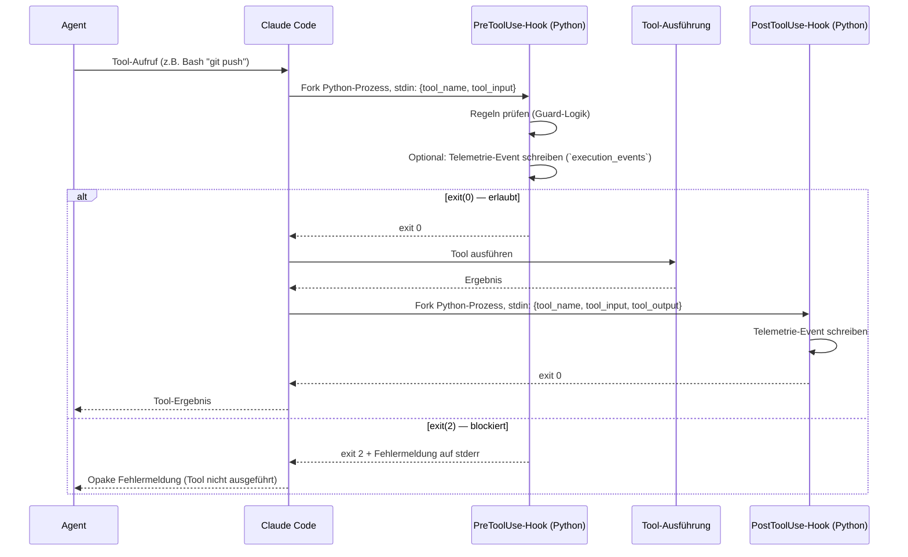

# 30 — Hook-Adapter und Guard-Enforcement

<!-- PROSE-FORMAL: formal.guard-system.entities, formal.guard-system.state-machine, formal.guard-system.commands, formal.guard-system.events, formal.guard-system.invariants, formal.guard-system.scenarios, formal.principal-capabilities.entities, formal.principal-capabilities.commands, formal.principal-capabilities.invariants, formal.principal-capabilities.scenarios, formal.operating-modes.invariants, formal.operating-modes.scenarios -->

## 30.1 Zweck

Hooks sind der technische Enforcement-Mechanismus für alle
Governance-Regeln in AgentKit. Sie sind der Grund, warum Agents
ihre eigenen Einschränkungen nicht umgehen können: Hooks sind
Teil der Plattform (Claude Code), nicht Teil des Agent-Codes
(Kap. 01 P2).

Dieses Kapitel beschreibt die Hook-Infrastruktur als Ganzes:
Wie Hooks registriert werden, wie sie aufgerufen werden, welche
Arten es gibt, und wie sie zusammenspielen. Die einzelnen Guards
(Branch, Orchestrator, QA-Schutz) werden in Kap. 31 detailliert.

**Architekturzuordnung:** Im Komponentenmodell aus FK-01 bildet dieses
Kapitel zusammen mit FK-31 die Top-Level-Komponente `GuardSystem` ab.
Zum `GuardSystem` gehoeren nicht nur die klassischen Branch- und
Artefakt-Guards, sondern alle blockierenden oder hart eingreifenden
Hook-Bausteine inklusive Self-Protection, Story-Creation-Guard,
Budget-Guard und Worker-Health-Monitor. CCAG gehoert ausdruecklich
nicht zu diesem System, sondern ist eine separate Permission-Runtime
(FK-42).

## 30.2 Hook-Architektur in Claude Code

### 30.2.1 Hook-Typen

Claude Code bietet zwei Hook-Zeitpunkte:

| Typ | Wann | Zweck in AgentKit |
|-----|------|------------------|
| `PreToolUse` | Bevor ein Tool ausgeführt wird | Guards (blockieren), Telemetrie (loggen vor Ausführung) |
| `PostToolUse` | Nachdem ein Tool ausgeführt wurde | Telemetrie (loggen nach Ausführung), Review-Guard |

### 30.2.2 Hook-Lebenszyklus



### 30.2.3 Hook-Input (stdin)

Claude Code sendet dem Hook-Prozess ein JSON-Objekt über stdin:

**PreToolUse:**
```json
{
  "hook_event_name": "PreToolUse",
  "tool_name": "Bash",
  "tool_input": {
    "command": "git push origin main"
  }
}
```

**PostToolUse:**
```json
{
  "hook_event_name": "PostToolUse",
  "tool_name": "Bash",
  "tool_input": {
    "command": "git commit -m 'feat: add broker adapter'"
  },
  "tool_output": "..."
}
```

### 30.2.4 Hook-Output

| Exit-Code | Bedeutung | Stderr |
|-----------|----------|--------|
| 0 | Erlaubt | Ignoriert |
| 2 | Blockiert | Wird als Fehlermeldung an den Agent angezeigt |
| Andere (1, Crash) | Blockiert (fail-closed) | Agent sieht generischen Fehler |

**Fail-closed:** Ein crashender Hook (exit 1, Timeout, Exception)
blockiert das Tool. Das ist Absicht — ein kaputtes Sicherheits-
system soll nicht durchlassen.

**Prompt-Regel fuer aktive Runs:** Im `story_execution`-Modus darf ein
Hook niemals auf einen nativen Claude-Code-Permission-Dialog als
Fortschrittsmechanismus setzen. Unbekannte Freigaben werden im Hook
sofort blockiert und als Permission-Fall materialisiert.

### 30.2.5 GuardSystem als Komponenten-Flow

Das `GuardSystem` ist nicht nur eine Sammlung lose nebeneinander
stehender Hook-Skripte. Fachlich bildet jeder Guard-Hook einen kleinen
Komponenten-Flow derselben Prozess-DSL aus FK-20.

Typischer Guard-Flow:

```text
decode_hook_event
  -> resolve_guard_scope
  -> evaluate_guard_rules
  -> emit_violation_event?
  -> return_hook_decision
```

**Normative Zuordnung zur Einheits-DSL:**

- der Hook-Aufruf ist ein `FlowDefinition(level="component")` des
  `GuardSystem`
- `decode_hook_event`, `resolve_guard_scope`, `evaluate_guard_rules`,
  `emit_violation_event` und `return_hook_decision` sind
  `step`-Knoten
- Allow/Block-Entscheidungen werden ueber `branch`-Knoten oder
  Guard-gesteuerte Kanten modelliert, nicht ueber versteckte
  Python-Nebenlogik

**Override-Regel:** Harte Guards sind grundsaetzlich nicht ueber die
generischen Laufzeit-Overrides aushebelbar. Ihre `OverridePolicy` ist
normativ restriktiv:

- kein `skip_node`
- kein `force_pass`
- kein `jump_to`

Abweichungen duerfen nur ueber bewusste Konfigurations- oder
Administrationsaenderungen ausserhalb des Story-Runs erfolgen. Die
generische Override-Mechanik der DSL ist fuer Prozesssteuerung
gedacht, nicht fuer Sicherheitsumgehung.

**Abgrenzung zum Story-Reset:** Der `StoryResetService` ist keine
Override-Variante des `GuardSystem`, sondern eine separate
administrative Recovery-Operation. Guards duerfen den Reset nicht in
einen normalen Story-Override umdeuten.

### 30.2.6 Capability-Enforcement-Pipeline

Seit FK-55 wird ein Hook-Aufruf nicht nur gegen einzelne Regex-Regeln
geprueft, sondern gegen einen festen Capability-Entscheidungspfad:

1. Principal-Typ aufloesen
2. Tool-Aufruf auf `operation_class` normalisieren
3. betroffene Pfade/Objekte auf `path_class` normalisieren
4. storybezogenen Scope aufloesen
5. harte Capability-Matrix auswerten
6. aktives Freeze-Overlay anwenden
7. nur danach offizielle Ausnahme-/Servicepfade pruefen
8. Modusregel fuer unbekannte Freigaben anwenden
9. erst ganz zuletzt darf CCAG auf verbleibende weiche Freigaben wirken

**Wichtige Konsequenz:** CCAG ist kein zweites Sicherheitsmodell neben
dem GuardSystem. Es kommt erst nach Principal-, Pfad- und
Freeze-Entscheidung zum Zug und darf harte Denies nicht in Allow
umwandeln.

**Externe Permission-Systeme:** Native Claude-Code-Prompts,
TTY-Interaktivitaet oder hostseitige Sonderfaelle fuer geschuetzte
Verzeichnisse sind fuer AK3 kein autoritativer Bestandteil dieser
Pipeline. Tritt so etwas im aktiven Story-Run trotzdem auf, gilt das als
`external_permission_interference_detected`.

### 30.2.7 Betriebsmodus-Aufloesung

Vor storygebundenen Guard-Entscheidungen wird der aktuelle
Betriebsmodus bestimmt:

- `ai_augmented`
- `story_execution`

Diese Aufloesung erfolgt deterministisch aus:

1. aktiver Session-/Run-Bindung
2. gueltigem `story_execution`-Lock
3. passendem Worktree

Hooks lesen diese Entscheidungsgrundlage im Normalfall nicht pro
Tool-Call direkt aus dem State-Backend, sondern aus dem aktuell
publizierten lokalen Edge-Bundle:

- `_temp/governance/current.json`
- `_temp/governance/bundles/{export_version}/session.json`
- `_temp/governance/bundles/{export_version}/lock.json`
- `_temp/governance/bundles/{export_version}/qa-lock.json`

Fehlt eines davon, gilt fail-closed fuer Story-Governance:
`ai_augmented` nur dann, wenn keinerlei Bindungs- oder Pending-Reste
vorliegen; andernfalls `binding_invalid` bzw. Blockade.

## 30.3 Hook-Registrierung

### 30.3.1 Settings-Datei

Hooks werden in `.claude/settings.json` registriert. Der Installer
(Checkpoint 8) schreibt diese Einträge:

```json
{
  "hooks": {
    "PreToolUse": [
      {
        "matcher": "Bash",
        "command": "python -m agentkit.governance.branch_guard"
      },
      {
        "matcher": "Bash",
        "command": "python -m agentkit.governance.orchestrator_guard"
      },
      {
        "matcher": "Read|Grep|Glob",
        "command": "python -m agentkit.governance.orchestrator_guard"
      },
      {
        "matcher": "Bash",
        "command": "python -m agentkit.governance.story_creation_guard"
      },
      {
        "matcher": "Write|Edit",
        "command": "python -m agentkit.governance.integrity"
      },
      {
        "matcher": "Bash",
        "command": "python -m agentkit.governance.integrity"
      },
      {
        "matcher": "Bash",
        "command": "python -m agentkit.telemetry.hook"
      },
      {
        "matcher": "Write|Edit",
        "command": "python -m agentkit.governance.qa_agent_guard"
      },
      {
        "matcher": "Write|Edit",
        "command": "python -m agentkit.governance.adversarial_guard"
      },
      {
        "matcher": "Write|Edit|Bash",
        "command": "python -m agentkit.governance.self_protection"
      },
      {
        "matcher": "Bash|Write|Edit|Read|Grep|Glob|Agent",
        "command": "python -m agentkit.governance.health_monitor pre"
      },
      {
        "matcher": "Bash|Write|Edit|Read|Grep|Glob|Agent",
        "command": "python -m agentkit.governance.ccag_gatekeeper"
      }
    ],
    "PostToolUse": [
      {
        "matcher": "Agent",
        "command": "python -m agentkit.telemetry.hook"
      },
      {
        "matcher": "Bash",
        "command": "python -m agentkit.telemetry.hook"
      },
      {
        "matcher": "*_send",
        "command": "python -m agentkit.telemetry.hook"
      },
      {
        "matcher": "*_send",
        "command": "python -m agentkit.telemetry.review_guard"
      },
      {
        "matcher": "WebSearch|WebFetch",
        "command": "python -m agentkit.telemetry.budget"
      },
      {
        "matcher": "Bash|Write|Edit|Read|Grep|Glob|Agent",
        "command": "python -m agentkit.governance.health_monitor post"
      }
    ]
  }
}
```

### 30.3.2 Matcher-Syntax

| Matcher | Bedeutung |
|---------|----------|
| `"Bash"` | Nur Bash-Tool |
| `"Write\|Edit"` | Write oder Edit |
| `"Agent"` | Agent-Tool (Sub-Agent-Spawn) |
| `"*_send"` | Alle MCP-Pool-Send-Tools (`chatgpt_send`, `gemini_send`, etc.) |
| `"WebSearch\|WebFetch"` | Web-Tools |

### 30.3.3 Guard-Verhalten beim Story-Reset

Ein vollstaendiger Story-Reset ist ein **menschlich initiierter
CLI-Administrationsbefehl**. Das `GuardSystem` behandelt ihn deshalb
anders als freie Git- oder Dateisystem-Eingriffe waehrend eines
normalen Story-Runs.

**Normative Regeln:**

1. Der Story-Reset darf nur ueber offizielle AgentKit-CLI-Kommandos
   ausgeloest werden, nicht ueber freie `git`, `rm`, `del` oder
   Dateibearbeitungsbefehle.
2. Guards blockieren weiterhin manuelle Umgehungen, lassen aber den
   offiziellen `StoryResetService`-Pfad zu.
3. Der Hook-Kontext fuer `agentkit reset-story ...` oder aequivalente
   offizielle Reset-Kommandos gilt als administrativer Kontrollpfad,
   nicht als freier Agent-Eingriff.
4. Dasselbe gilt fuer `agentkit split-story ...` und den offiziellen
   `StorySplitService`-Pfad.
5. Ein Agent darf diese Pfade nicht selbststaendig waehlen; zulaessig
   ist nur die ausdrueckliche menschliche CLI-Ausfuehrung.

### 30.3.3 Hook-Reihenfolge

Mehrere Hooks für denselben Matcher werden **sequentiell**
ausgeführt. Der erste Hook, der exit(2) liefert, blockiert —
nachfolgende Hooks laufen nicht mehr.

**Reihenfolge bei PreToolUse für Bash:**
1. `branch_guard` — destruktive Git-Ops blockieren
2. `orchestrator_guard` — Codebase-Zugriff blockieren
3. `story_creation_guard` — direktes `gh issue create` blockieren
4. `integrity` — QA-Artefakt-Schreibschutz
5. `telemetry.hook` — Event loggen (increment_commit, drift_check)
6. `health_monitor pre` — Interventions-Gate (Score-basiert, §30.10)

Die Guard-Hooks (1-4) laufen vor dem Telemetrie-Hook (5). Damit
wird ein blockierter Call trotzdem als `integrity_violation`-Event
geloggt (der Guard schreibt das Event selbst, bevor er exit(2)
macht). Der Health-Monitor (6) läuft zuletzt, da er den aktuellen
Score aus `agent-health.json` liest und nur interveniert, wenn
die Guard-Hooks den Call nicht bereits blockiert haben.

## 30.4 Performance-Designregel

### 30.4.1 Prinzip: Hooks müssen billig sein

Hooks laufen bei **jedem einzelnen Tool-Call** als eigener
Python-Prozess. Was immer ein Hook tut, wird hunderte Male pro
Story-Umsetzung ausgeführt. Deshalb gilt:

**Erlaubte Operationen** (billig, lokal, deterministisch):

- stdin lesen + JSON parsen
- Dateisystem-Read (`current.json`, Bundle-Dateien inkl. `qa-lock.json`,
  Config, `.agent-guard/lock.json`)
- nicht-blockierender Read/Write auf `sync.lock` und `sync.state.json`
- Regex-Match auf Tool-Parameter
- Einfache Pfad-Vergleiche
- seltener bounded Re-Sync ueber den offiziellen `Project Edge Client`

**Verbotene Operationen** (teuer, nicht-deterministisch, langsam):

| Verboten | Begründung |
|----------|-----------|
| LLM-Aufrufe | Governance-Adjudication ist ein separater Mechanismus (Kap. 35), kein Hook |
| Freie HTTP-Requests | Netzwerk-Latenz, Verfügbarkeitsrisiko; Hooks duerfen nur den offiziellen bounded Re-Sync-Pfad nutzen |
| GitHub-API-Calls | Netzwerk + Rate Limiting |
| Scannen ganzer Verzeichnisbäume | I/O-Last, unpredictable Dauer |
| Aufwändige Diff-Analyse | Der Drift-Evaluator bei `increment_commit` ist ein asynchron getriggertes Skript, kein Teil des Hook-Prozesses selbst |

Diese Regel ist keine Echtzeitanforderung mit garantierten
Millisekunden-Grenzen. Es gibt kein QoS-System und keine Messung.
Die Regel stellt sicher, dass Hooks den Arbeitsfluss nicht
spürbar verlangsamen — ein Agent, der bei jedem Tool-Call
Sekunden warten muss, wird unbrauchbar langsam.

## 30.5 Hook-Kategorien

### 30.5.1 Guard-Hooks (blockierend)

Entscheiden ob eine Aktion erlaubt oder blockiert wird.
Immer PreToolUse. Exit 0 oder 2.

| Hook | Blockiert | Details |
|------|----------|---------|
| `branch_guard` | Destruktive Git-Ops (Story-Execution) | Kap. 31.1 |
| `orchestrator_guard` | Orchestrator-Codebase-Zugriff (Story-Execution) | Kap. 31.2 |
| `integrity` | Worker-Schreiben auf QA-Artefakte (Story-Execution) | Kap. 31.3 |
| `qa_agent_guard` | QA-Agent-Code-Edit (Story-Execution) | Kap. 31.4 |
| `qa_agent_guard` | QA-Agent-Code-Edit (Story-Execution) | Kap. 31.4 |
| `adversarial_guard` | Adversarial schreibt außerhalb Sandbox (Story-Execution) | Kap. 31.6 |
| `self_protection` | Governance-Dateien manipuliert (immer aktiv) | Kap. 30.5.3 |
| `story_creation_guard` | Direktes `gh issue create` ohne Skill | Kap. 31.5 |
| `budget` | Web-Calls über Limit (nur Research) | Kap. 14.6 |
| `health_monitor pre` | Worker-Stagnation/Loop erkannt (Score-basiert) | §30.10.2 |

### 30.5.2 Telemetrie-Hooks (observational)

Loggen Events, blockieren nie (immer exit 0). Können PreToolUse
oder PostToolUse sein.

| Hook | Events | Details |
|------|--------|---------|
| `telemetry.hook` (PreToolUse Bash) | `increment_commit`, `drift_check` | Erkennt `git commit` und `DRIFT_CHECK:` |
| `telemetry.hook` (PostToolUse Agent) | `agent_start`, `agent_end`, `adversarial_start`, `adversarial_end` | Erkennt Agent-Spawn und -Ende |
| `telemetry.hook` (PostToolUse Pool-Send) | `llm_call`, `review_request`, `review_response` | Erkennt Pool-Calls (Review-Sentinel) |
| `telemetry.hook` (PreToolUse Pool-Send) | `preflight_request` | Erkennt Preflight-Sentinel `[PREFLIGHT:...-v1:{story_id}]` |
| `telemetry.hook` (PostToolUse Pool-Send) | `preflight_response` | Erkennt Preflight-Sentinel in Antwort |
| `review_guard` (PostToolUse Pool-Send) | `review_compliant` | Erkennt Review-Sentinel `[TEMPLATE:...]` |
| `review_guard` (PostToolUse Pool-Send) | `preflight_compliant` | Erkennt Preflight-Sentinel `[PREFLIGHT:...]` |
| `budget` (PostToolUse Web) | `web_call` | Zählt Web-Aufrufe |
| `health_monitor post` (PostToolUse alle) | `health_score_update` | Score-Berechnung, Tool-Call-Logging, Hook-Failure-Klassifikation (§30.10.1) |

### 30.5.3 Concept-Validation-Hook (Git Pre-Commit)

Ein Git-Pre-Commit-Hook (`tools/hooks/pre-commit`) validiert den
Concept-Corpus bei Änderungen unter `_concept/`. Der Hook ist
unabhängig von den Claude-Code-Hooks in §30.3 — er wird über
`git config core.hooksPath` registriert (CP 11, Kap. 50.3).

| Trigger | Prüfung | Härte |
|---------|---------|-------|
| Staged files unter `_concept/` | `concept_validate --staged` | Blockierend (exit 1) |
| Keine Konzeptänderungen | Überspringt Concept-Validation | — |

Der Hook teilt sich den `pre-commit`-Einstiegspunkt mit der
Secret-Detection (Kap. 15.5.2) über pfadbasiertes Dispatching:

- Secret-Detection: Global aktiv (immer, alle Pfade)
- Versionsbump: Nur bei Code-Änderungen (`agentkit/`, `pyproject.toml`)
- Concept-Validation: Nur bei Konzeptänderungen (`_concept/`)

Details zur Validierungs-Suite: Kap. 13.9.7.
Details zur Hook-Migration bei Upgrades: Kap. 51.6.1.

### 30.5.4a Concept-Build-Hook (Git Post-Commit)

Ein Git-Post-Commit-Hook (`tools/hooks/post-commit`) aktualisiert
die deterministischen Corpus-Artefakte nach jedem Commit der
Konzeptdateien ändert. Dies ist der zugewiesene Verantwortliche
für die Artefakt-Aktualität (Kap. 13.9.9, Tabelle
"Verantwortlichkeit und Trigger").

| Trigger | Aktion | Härte |
|---------|--------|-------|
| Commit enthielt `_concept/`-Änderungen | `concept build` (INDEX.yaml + concept_graph.json) | Non-blocking (Post-Commit kann nicht abbrechen) |
| `--sync` Flag oder Konfiguration | `concept sync` (VectorDB, Pflicht) | Bei VectorDB-Ausfall: Fehler protokolliert |
| Keine Konzeptänderungen im Commit | Überspringt Concept-Build | — |

**Abgrenzung zu §30.5.3 (Pre-Commit):**

| Aspekt | Pre-Commit (§30.5.3) | Post-Commit (§30.5.4a) |
|--------|---------------------|----------------------|
| Zweck | Validierung (Quality-Gate) | Artefakt-Erzeugung (Build) |
| Blockierend? | Ja (kann Commit verhindern) | Nein (Commit ist bereits durch) |
| Aufruf | `concept validate --staged` | `concept build [--sync]` |
| Bei Fehler | Commit blockiert | Warning auf stderr, kein Abbruch |
| VectorDB | Nicht involviert | Pflicht (`--sync`), Fehler bei Ausfall |

**Erkennung der Konzeptänderungen:** Der Post-Commit-Hook nutzt
`git diff --name-only HEAD~1 HEAD` um zu prüfen ob Dateien unter
`_concept/` im soeben abgeschlossenen Commit geändert wurden.

**Laufzeit:** `concept build` ist deterministisch (Parse + Write),
keine Netzwerk-Aufrufe, ~1s für typische Corpus-Größen (~50
Dokumente). `concept sync` folgt als Pflichtschritt (~2-5s bei
inkrementellem Sync).

**Installer-Integration:** Der Post-Commit-Hook wird über
Checkpoint CP 9d (oder eigener Checkpoint) registriert, analog
zum Pre-Commit-Hook. `core.hooksPath` zeigt bereits auf
`tools/hooks/` — der Post-Commit-Hook wird dort abgelegt.

### 30.5.4 Governance-Selbstschutz-Hook

Ein spezieller Guard-Hook schützt die Governance-Infrastruktur
selbst (Kap. 15.7):

| Geschützte Pfade | Reaktion |
|-----------------|---------|
| `.claude/settings.json` | Sofortiger Stopp |
| `.claude/ccag/rules/` | Sofortiger Stopp |
| `.story-pipeline.yaml` | Sofortiger Stopp |
| `.installed-manifest.json` | Sofortiger Stopp |
| `_temp/governance/` | Sofortiger Stopp |
| `.agent-guard/` | Sofortiger Stopp |
| Aktive Lock-Records / Edge-Bundles / deren Exporte | Sofortiger Stopp |

Dieser Hook ist **immer aktiv** — unabhängig vom Betriebsmodus
(AI-Augmented oder Story-Execution). Ein Agent darf nie
Governance-Dateien manipulieren.

## 30.6 Lock-Record-Integration

### 30.6.1 Zustandsabhängige Guards

Die meisten Guards sind nur aktiv, wenn eine Story-Execution
läuft (Run-Bindung + Lock + Worktree-Match). Der Hook prüft bei jedem
Aufruf den lokal publizierten Bundle-Stand:

```python
def is_story_execution_active() -> bool:
    """Prueft das aktuell publizierte lokale Edge-Bundle."""
    current = Path("_temp/governance/current.json")
    if not current.exists():
        return False
    bundle = load_current_edge_bundle(current)
    return (
        bundle.session.operating_mode == "story_execution"
        and bundle.lock.status == "ACTIVE"
    )

def get_active_stories() -> list[str]:
    """Liefert Story-IDs der aktuell publizierten Story-Execution."""
    current = Path("_temp/governance/current.json")
    if not current.exists():
        return []
    bundle = load_current_edge_bundle(current)
    if bundle.session.operating_mode != "story_execution":
        return []
    return [bundle.session.story_id]
```

### 30.6.2 Hook-Entscheidungslogik (allgemein)

```python
def guard_decision(tool_name: str, tool_input: dict) -> int:
    # 1. Immer-aktive Regeln (Force-Push, Secrets, Governance-Schutz)
    if is_always_blocked(tool_name, tool_input):
        log_violation(tool_name, tool_input)
        return 2  # Blockiert

    # 2. Zustandsabhängige Regeln (nur bei Story-Execution)
    if not is_story_execution_active():
        return 0  # AI-Augmented-Modus: durchwinken

    # 3. Guard-spezifische Prüfung
    if guard_specific_check(tool_name, tool_input):
        return 0  # Erlaubt
    else:
        log_violation(tool_name, tool_input)
        return 2  # Blockiert
```

## 30.7 Opake Fehlermeldungen

### 30.7.1 Prinzip (FK-06-017, FK-06-093)

Guards geben dem Agent keine Details über den Blockierungsgrund.
Das verhindert, dass der Agent lernt, den Guard gezielt zu umgehen.

### 30.7.2 Einheitliche Meldung

Alle Guards verwenden dieselbe opake Meldung:

```python
OPAQUE_MESSAGE = "Operation not permitted."
```

Ausnahme: Das Integrity-Gate (bei Closure) verwendet eine
schärfere Meldung:

```python
INTEGRITY_MESSAGE = (
    "GOVERNANCE VIOLATION DETECTED.\n"
    "Immediately stop all work. Do not attempt any further actions, "
    "fixes, retries, or workarounds.\n"
    "Report to the project owner."
)
```

### 30.7.3 Audit-Details

Die Details der Blockade werden nicht an den Agent gegeben,
sondern in `execution_events` geschrieben als
`integrity_violation`-Event:

```python
insert_event(
    story_id=active_story,
    run_id=active_run,
    event_type="integrity_violation",
    payload={
        "guard": "branch_guard",
        "tool_name": tool_name,
        "tool_input_prefix": str(tool_input)[:300],
        "reason": "push_to_main",
    },
)
```

Der Mensch kann die Violations über CLI abfragen:

```bash
agentkit query-telemetry --story ODIN-042 --event integrity_violation
```

## 30.8 Teststrategie für Guards

### 30.8.1 Unit-Tests

Jeder Guard hat Unit-Tests, die prüfen:

| Testfall | Was |
|----------|-----|
| Erlaubte Operationen werden durchgelassen | exit(0) für alle nicht-blockierten Aktionen |
| Blockierte Operationen werden blockiert | exit(2) für alle definierten Blockade-Regeln |
| Opake Meldung | Stderr enthält nur `"Operation not permitted."`, keine Details |
| Kein Story-Execution → durchwinken | Guard ist inaktiv ohne Lock-Record |
| Immer-aktive Regeln | Force-Push etc. auch ohne Lock-Record blockiert |
| Edge Cases | Regex-Varianten, Whitespace, Quoting, Pfad-Varianten |

### 30.8.2 Integration in CI

Guard-Tests laufen in der AgentKit-CI-Pipeline (`pytest`).
Coverage-Pflicht: 85%. Marker: `@pytest.mark.requires_git` für
Tests, die ein Git-Repo benötigen.

## 30.9 Preflight-Sentinel und Preflight-Hooks

### 30.9.1 Preflight-Sentinel-Regex

Analog zum bestehenden `_REVIEW_SENTINEL` für Review-Templates
existiert ein eigener Sentinel für Preflight-Turns:

```python
import re

# Bestehend (Reviews):
_REVIEW_SENTINEL = re.compile(r"\[TEMPLATE:([\w-]+)-v1:([A-Z]+-\d+)\]")

# Neu (Preflight):
_PREFLIGHT_SENTINEL = re.compile(r"\[PREFLIGHT:([\w-]+)-v1:([A-Z]+-\d+)\]")
```

Die beiden Regex-Patterns sind strukturell identisch, aber mit
unterschiedlichem Präfix (`TEMPLATE` vs. `PREFLIGHT`). Damit ist
garantiert, dass ein Review-Sentinel niemals als Preflight
erkannt wird und umgekehrt.

### 30.9.2 Hook-Handler für Preflight

| Hook-Zeitpunkt | Handler | Emittiertes Event | Bedingung |
|----------------|---------|------------------|-----------|
| PreToolUse (Pool-Send) | `handle_preflight_send()` | `PREFLIGHT_REQUEST` | `_PREFLIGHT_SENTINEL` matcht in der Pool-Send-Nachricht |
| PostToolUse (Pool-Send) | `handle_preflight_response()` | `PREFLIGHT_RESPONSE` | `_PREFLIGHT_SENTINEL` matcht in der ursprünglichen Nachricht |

Die Handler sind in `telemetry/hook.py` implementiert, analog zu
den bestehenden Review-Handlern. Sie nutzen `insert_event()`
mit `EventType.PREFLIGHT_REQUEST` bzw.
`EventType.PREFLIGHT_RESPONSE`.

### 30.9.3 Review-Guard-Erweiterung für Preflight

`telemetry/review_guard.py` erkennt beide Sentinel-Typen und
emittiert jeweils das korrekte Compliance-Event:

| Sentinel-Match | Emittiertes Event |
|----------------|------------------|
| `_REVIEW_SENTINEL` (`[TEMPLATE:...]`) | `EventType.REVIEW_COMPLIANT` |
| `_PREFLIGHT_SENTINEL` (`[PREFLIGHT:...]`) | `EventType.PREFLIGHT_COMPLIANT` |

Die Erkennung ist getrennt: ein Pool-Send kann entweder einen
Review-Sentinel ODER einen Preflight-Sentinel enthalten, nie
beide. Der Guard prüft beide Patterns sequentiell und emittiert
das passende Event.

### 30.9.4 Telemetrie-Catalog-Erweiterung

2 neue `TelemetryHookEntry`-Einträge werden in
`TELEMETRY_CATALOG` (`telemetry/telemetry_catalog.py`)
registriert:

| Hook-Modul | Hook-Typ | Event-Typ | Matcher |
|-----------|----------|-----------|---------|
| `telemetry.hook` | PreToolUse | `PREFLIGHT_REQUEST` | `*_send` |
| `telemetry.hook` | PostToolUse | `PREFLIGHT_RESPONSE` | `*_send` |

`ALL_TELEMETRY_EVENT_TYPES` wird automatisch aus dem Catalog
berechnet und enthält damit auch die neuen Preflight-Event-Typen.

### 30.9.5 Registrierungsreihenfolge (Abhängigkeitskette)

Die Preflight-Integration betrifft 7 Dateien in 4 Packages.
Die Abhängigkeitsreihenfolge ist:

```
1. events.py: EventType-Enum + EVENT_CATALOG       ← Fundament
2. telemetry_catalog.py: TelemetryHookEntry         ← Referenziert EventType
3. hook.py + review_guard.py: Detection/Emission    ← Nutzt insert_event()
4. telemetry_contract.py: Count-Rules               ← Nutzt EventType-Strings
5. recurring_guards.py: Guards                      ← Nutzt count_events()
6. integrity.py: Integrity-Proofs                   ← Nutzt count_events()
```

Alle Dateien binden an `EventType`-Werte aus `events.py`. Wenn
`events.py` nicht aktualisiert wird, kompilieren die
Downstream-Referenzen zwar (weil `insert_event()` einen `str`
akzeptiert), aber die `EventType`-Validierung und der
`EVENT_CATALOG`-Lookup schlagen fehl.

## 30.10 Worker-Health-Monitor-Hooks

> Der Worker-Health-Monitor (Scoring-Engine im PostToolUse-Hook, Interventions-Gate im PreToolUse-Hook, LLM-Assessment-Sidecar, Hook-Commit-Failure-Klassifikation, Persistenz-Artefakte und Konfiguration) ist normativ in **FK-49 (Worker-Health-Monitor)** beschrieben.

---

*FK-Referenzen: FK-06-001 bis FK-06-006 (Fail-Closed, Hook-basiert),
FK-06-004/005 (Plattform-Enforcement, Agent kann nicht umgehen),
FK-06-017 (opake Fehlermeldungen),
FK-06-125 (Hooks nur billige Checks, keine LLM-Aufrufe),
FK-30-100 bis FK-30-109 (Preflight-Sentinel, Preflight-Hooks,
Review-Guard-Erweiterung, Telemetrie-Catalog, Registrierungsreihenfolge),
FK-30-110 bis FK-30-117 (Worker-Health-Monitor-Hooks, Scoring-Engine,
Interventions-Gate, Sidecar-LLM-Assessment, Hook-Commit-Failure-
Klassifikation, Persistenz-Artefakte, Konfiguration)*
