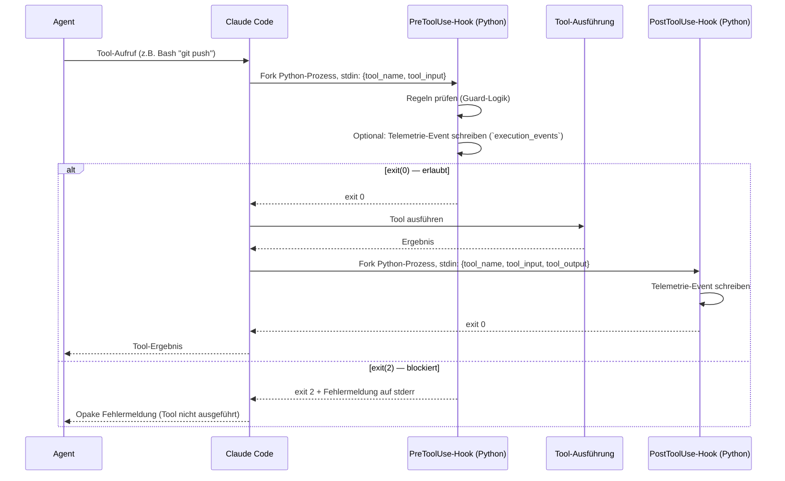
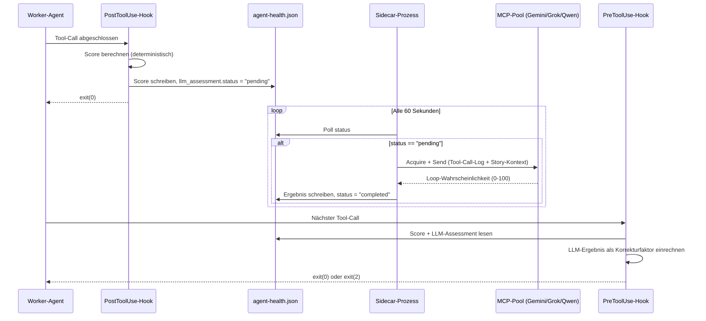

# 30 — Hook-Adapter und Guard-Enforcement

## 30.1 Zweck

Hooks sind der technische Enforcement-Mechanismus für alle
Governance-Regeln in AgentKit. Sie sind der Grund, warum Agents
ihre eigenen Einschränkungen nicht umgehen können: Hooks sind
Teil der Plattform (Claude Code), nicht Teil des Agent-Codes
(Kap. 01 P2).

Dieses Kapitel beschreibt die Hook-Infrastruktur als Ganzes:
Wie Hooks registriert werden, wie sie aufgerufen werden, welche
Arten es gibt, und wie sie zusammenspielen. Die einzelnen Guards
(Branch, Orchestrator, QA-Schutz) werden in Kap. 31 detailliert.

**Architekturzuordnung:** Im Komponentenmodell aus FK-01 bildet dieses
Kapitel zusammen mit FK-31 die Top-Level-Komponente `GuardSystem` ab.
Zum `GuardSystem` gehoeren nicht nur die klassischen Branch- und
Artefakt-Guards, sondern alle blockierenden oder hart eingreifenden
Hook-Bausteine inklusive Self-Protection, Story-Creation-Guard,
Budget-Guard und Worker-Health-Monitor. CCAG gehoert ausdruecklich
nicht zu diesem System, sondern ist eine separate Permission-Runtime
(FK-42).

## 30.2 Hook-Architektur in Claude Code

### 30.2.1 Hook-Typen

Claude Code bietet zwei Hook-Zeitpunkte:

| Typ | Wann | Zweck in AgentKit |
|-----|------|------------------|
| `PreToolUse` | Bevor ein Tool ausgeführt wird | Guards (blockieren), Telemetrie (loggen vor Ausführung) |
| `PostToolUse` | Nachdem ein Tool ausgeführt wurde | Telemetrie (loggen nach Ausführung), Review-Guard |

### 30.2.2 Hook-Lebenszyklus



### 30.2.3 Hook-Input (stdin)

Claude Code sendet dem Hook-Prozess ein JSON-Objekt über stdin:

**PreToolUse:**
```json
{
  "hook_event_name": "PreToolUse",
  "tool_name": "Bash",
  "tool_input": {
    "command": "git push origin main"
  }
}
```

**PostToolUse:**
```json
{
  "hook_event_name": "PostToolUse",
  "tool_name": "Bash",
  "tool_input": {
    "command": "git commit -m 'feat: add broker adapter'"
  },
  "tool_output": "..."
}
```

### 30.2.4 Hook-Output

| Exit-Code | Bedeutung | Stderr |
|-----------|----------|--------|
| 0 | Erlaubt | Ignoriert |
| 2 | Blockiert | Wird als Fehlermeldung an den Agent angezeigt |
| Andere (1, Crash) | Blockiert (fail-closed) | Agent sieht generischen Fehler |

**Fail-closed:** Ein crashender Hook (exit 1, Timeout, Exception)
blockiert das Tool. Das ist Absicht — ein kaputtes Sicherheits-
system soll nicht durchlassen.

### 30.2.5 GuardSystem als Komponenten-Flow

Das `GuardSystem` ist nicht nur eine Sammlung lose nebeneinander
stehender Hook-Skripte. Fachlich bildet jeder Guard-Hook einen kleinen
Komponenten-Flow derselben Prozess-DSL aus FK-20.

Typischer Guard-Flow:

```text
decode_hook_event
  -> resolve_guard_scope
  -> evaluate_guard_rules
  -> emit_violation_event?
  -> return_hook_decision
```

**Normative Zuordnung zur Einheits-DSL:**

- der Hook-Aufruf ist ein `FlowDefinition(level="component")` des
  `GuardSystem`
- `decode_hook_event`, `resolve_guard_scope`, `evaluate_guard_rules`,
  `emit_violation_event` und `return_hook_decision` sind
  `step`-Knoten
- Allow/Block-Entscheidungen werden ueber `branch`-Knoten oder
  Guard-gesteuerte Kanten modelliert, nicht ueber versteckte
  Python-Nebenlogik

**Override-Regel:** Harte Guards sind grundsaetzlich nicht ueber die
generischen Laufzeit-Overrides aushebelbar. Ihre `OverridePolicy` ist
normativ restriktiv:

- kein `skip_node`
- kein `force_pass`
- kein `jump_to`

Abweichungen duerfen nur ueber bewusste Konfigurations- oder
Administrationsaenderungen ausserhalb des Story-Runs erfolgen. Die
generische Override-Mechanik der DSL ist fuer Prozesssteuerung
gedacht, nicht fuer Sicherheitsumgehung.

**Abgrenzung zum Story-Reset:** Der `StoryResetService` ist keine
Override-Variante des `GuardSystem`, sondern eine separate
administrative Recovery-Operation. Guards duerfen den Reset nicht in
einen normalen Story-Override umdeuten.

## 30.3 Hook-Registrierung

### 30.3.1 Settings-Datei

Hooks werden in `.claude/settings.json` registriert. Der Installer
(Checkpoint 8) schreibt diese Einträge:

```json
{
  "hooks": {
    "PreToolUse": [
      {
        "matcher": "Bash",
        "command": "python -m agentkit.governance.branch_guard"
      },
      {
        "matcher": "Bash",
        "command": "python -m agentkit.governance.orchestrator_guard"
      },
      {
        "matcher": "Read|Grep|Glob",
        "command": "python -m agentkit.governance.orchestrator_guard"
      },
      {
        "matcher": "Bash",
        "command": "python -m agentkit.governance.story_creation_guard"
      },
      {
        "matcher": "Write|Edit",
        "command": "python -m agentkit.governance.integrity"
      },
      {
        "matcher": "Bash",
        "command": "python -m agentkit.governance.integrity"
      },
      {
        "matcher": "Bash",
        "command": "python -m agentkit.telemetry.hook"
      },
      {
        "matcher": "Write|Edit",
        "command": "python -m agentkit.governance.qa_agent_guard"
      },
      {
        "matcher": "Write|Edit",
        "command": "python -m agentkit.governance.adversarial_guard"
      },
      {
        "matcher": "Write|Edit|Bash",
        "command": "python -m agentkit.governance.self_protection"
      },
      {
        "matcher": "Bash|Write|Edit|Read|Grep|Glob|Agent",
        "command": "python -m agentkit.governance.health_monitor pre"
      }
    ],
    "PostToolUse": [
      {
        "matcher": "Agent",
        "command": "python -m agentkit.telemetry.hook"
      },
      {
        "matcher": "Bash",
        "command": "python -m agentkit.telemetry.hook"
      },
      {
        "matcher": "*_send",
        "command": "python -m agentkit.telemetry.hook"
      },
      {
        "matcher": "*_send",
        "command": "python -m agentkit.telemetry.review_guard"
      },
      {
        "matcher": "WebSearch|WebFetch",
        "command": "python -m agentkit.telemetry.budget"
      },
      {
        "matcher": "Bash|Write|Edit|Read|Grep|Glob|Agent",
        "command": "python -m agentkit.governance.health_monitor post"
      }
    ]
  }
}
```

### 30.3.2 Matcher-Syntax

| Matcher | Bedeutung |
|---------|----------|
| `"Bash"` | Nur Bash-Tool |
| `"Write\|Edit"` | Write oder Edit |
| `"Agent"` | Agent-Tool (Sub-Agent-Spawn) |
| `"*_send"` | Alle MCP-Pool-Send-Tools (`chatgpt_send`, `gemini_send`, etc.) |
| `"WebSearch\|WebFetch"` | Web-Tools |

### 30.3.3 Guard-Verhalten beim Story-Reset

Ein vollstaendiger Story-Reset ist ein **menschlich initiierter
CLI-Administrationsbefehl**. Das `GuardSystem` behandelt ihn deshalb
anders als freie Git- oder Dateisystem-Eingriffe waehrend eines
normalen Story-Runs.

**Normative Regeln:**

1. Der Story-Reset darf nur ueber offizielle AgentKit-CLI-Kommandos
   ausgeloest werden, nicht ueber freie `git`, `rm`, `del` oder
   Dateibearbeitungsbefehle.
2. Guards blockieren weiterhin manuelle Umgehungen, lassen aber den
   offiziellen `StoryResetService`-Pfad zu.
3. Der Hook-Kontext fuer `agentkit reset-story ...` oder aequivalente
   offizielle Reset-Kommandos gilt als administrativer Kontrollpfad,
   nicht als freier Agent-Eingriff.
4. Ein Agent darf diesen Pfad nicht selbststaendig waehlen; zulaessig
   ist nur die ausdrueckliche menschliche CLI-Ausfuehrung.

### 30.3.3 Hook-Reihenfolge

Mehrere Hooks für denselben Matcher werden **sequentiell**
ausgeführt. Der erste Hook, der exit(2) liefert, blockiert —
nachfolgende Hooks laufen nicht mehr.

**Reihenfolge bei PreToolUse für Bash:**
1. `branch_guard` — destruktive Git-Ops blockieren
2. `orchestrator_guard` — Codebase-Zugriff blockieren
3. `story_creation_guard` — direktes `gh issue create` blockieren
4. `integrity` — QA-Artefakt-Schreibschutz
5. `telemetry.hook` — Event loggen (increment_commit, drift_check)
6. `health_monitor pre` — Interventions-Gate (Score-basiert, §30.10)

Die Guard-Hooks (1-4) laufen vor dem Telemetrie-Hook (5). Damit
wird ein blockierter Call trotzdem als `integrity_violation`-Event
geloggt (der Guard schreibt das Event selbst, bevor er exit(2)
macht). Der Health-Monitor (6) läuft zuletzt, da er den aktuellen
Score aus `agent-health.json` liest und nur interveniert, wenn
die Guard-Hooks den Call nicht bereits blockiert haben.

## 30.4 Performance-Designregel

### 30.4.1 Prinzip: Hooks müssen billig sein

Hooks laufen bei **jedem einzelnen Tool-Call** als eigener
Python-Prozess. Was immer ein Hook tut, wird hunderte Male pro
Story-Umsetzung ausgeführt. Deshalb gilt:

**Erlaubte Operationen** (billig, lokal, deterministisch):

- stdin lesen + JSON parsen
- Dateisystem-Read (Lock-Export, Config, `.agent-guard/lock.json`)
- Write/Read auf `execution_events` und zentrale Lock-/State-Records
- Regex-Match auf Tool-Parameter
- Einfache Pfad-Vergleiche

**Verbotene Operationen** (teuer, nicht-deterministisch, langsam):

| Verboten | Begründung |
|----------|-----------|
| LLM-Aufrufe | Governance-Adjudication ist ein separater Mechanismus (Kap. 35), kein Hook |
| HTTP-Requests | Netzwerk-Latenz, Verfügbarkeitsrisiko |
| GitHub-API-Calls | Netzwerk + Rate Limiting |
| Scannen ganzer Verzeichnisbäume | I/O-Last, unpredictable Dauer |
| Aufwändige Diff-Analyse | Der Drift-Evaluator bei `increment_commit` ist ein asynchron getriggertes Skript, kein Teil des Hook-Prozesses selbst |

Diese Regel ist keine Echtzeitanforderung mit garantierten
Millisekunden-Grenzen. Es gibt kein QoS-System und keine Messung.
Die Regel stellt sicher, dass Hooks den Arbeitsfluss nicht
spürbar verlangsamen — ein Agent, der bei jedem Tool-Call
Sekunden warten muss, wird unbrauchbar langsam.

## 30.5 Hook-Kategorien

### 30.5.1 Guard-Hooks (blockierend)

Entscheiden ob eine Aktion erlaubt oder blockiert wird.
Immer PreToolUse. Exit 0 oder 2.

| Hook | Blockiert | Details |
|------|----------|---------|
| `branch_guard` | Destruktive Git-Ops (Story-Execution) | Kap. 31.1 |
| `orchestrator_guard` | Orchestrator-Codebase-Zugriff (Story-Execution) | Kap. 31.2 |
| `integrity` | Worker-Schreiben auf QA-Artefakte (Story-Execution) | Kap. 31.3 |
| `qa_agent_guard` | QA-Agent-Code-Edit (Story-Execution) | Kap. 31.4 |
| `qa_agent_guard` | QA-Agent-Code-Edit (Story-Execution) | Kap. 31.4 |
| `adversarial_guard` | Adversarial schreibt außerhalb Sandbox (Story-Execution) | Kap. 31.6 |
| `self_protection` | Governance-Dateien manipuliert (immer aktiv) | Kap. 30.5.3 |
| `story_creation_guard` | Direktes `gh issue create` ohne Skill | Kap. 31.5 |
| `budget` | Web-Calls über Limit (nur Research) | Kap. 14.6 |
| `health_monitor pre` | Worker-Stagnation/Loop erkannt (Score-basiert) | §30.10.2 |

### 30.5.2 Telemetrie-Hooks (observational)

Loggen Events, blockieren nie (immer exit 0). Können PreToolUse
oder PostToolUse sein.

| Hook | Events | Details |
|------|--------|---------|
| `telemetry.hook` (PreToolUse Bash) | `increment_commit`, `drift_check` | Erkennt `git commit` und `DRIFT_CHECK:` |
| `telemetry.hook` (PostToolUse Agent) | `agent_start`, `agent_end`, `adversarial_start`, `adversarial_end` | Erkennt Agent-Spawn und -Ende |
| `telemetry.hook` (PostToolUse Pool-Send) | `llm_call`, `review_request`, `review_response` | Erkennt Pool-Calls (Review-Sentinel) |
| `telemetry.hook` (PreToolUse Pool-Send) | `preflight_request` | Erkennt Preflight-Sentinel `[PREFLIGHT:...-v1:{story_id}]` |
| `telemetry.hook` (PostToolUse Pool-Send) | `preflight_response` | Erkennt Preflight-Sentinel in Antwort |
| `review_guard` (PostToolUse Pool-Send) | `review_compliant` | Erkennt Review-Sentinel `[TEMPLATE:...]` |
| `review_guard` (PostToolUse Pool-Send) | `preflight_compliant` | Erkennt Preflight-Sentinel `[PREFLIGHT:...]` |
| `budget` (PostToolUse Web) | `web_call` | Zählt Web-Aufrufe |
| `health_monitor post` (PostToolUse alle) | `health_score_update` | Score-Berechnung, Tool-Call-Logging, Hook-Failure-Klassifikation (§30.10.1) |

### 30.5.3 Concept-Validation-Hook (Git Pre-Commit)

Ein Git-Pre-Commit-Hook (`tools/hooks/pre-commit`) validiert den
Concept-Corpus bei Änderungen unter `_concept/`. Der Hook ist
unabhängig von den Claude-Code-Hooks in §30.3 — er wird über
`git config core.hooksPath` registriert (CP 11, Kap. 50.3).

| Trigger | Prüfung | Härte |
|---------|---------|-------|
| Staged files unter `_concept/` | `concept_validate --staged` | Blockierend (exit 1) |
| Keine Konzeptänderungen | Überspringt Concept-Validation | — |

Der Hook teilt sich den `pre-commit`-Einstiegspunkt mit der
Secret-Detection (Kap. 15.5.2) über pfadbasiertes Dispatching:

- Secret-Detection: Global aktiv (immer, alle Pfade)
- Versionsbump: Nur bei Code-Änderungen (`agentkit/`, `pyproject.toml`)
- Concept-Validation: Nur bei Konzeptänderungen (`_concept/`)

Details zur Validierungs-Suite: Kap. 13.9.7.
Details zur Hook-Migration bei Upgrades: Kap. 51.6.1.

### 30.5.4a Concept-Build-Hook (Git Post-Commit)

Ein Git-Post-Commit-Hook (`tools/hooks/post-commit`) aktualisiert
die deterministischen Corpus-Artefakte nach jedem Commit der
Konzeptdateien ändert. Dies ist der zugewiesene Verantwortliche
für die Artefakt-Aktualität (Kap. 13.9.9, Tabelle
"Verantwortlichkeit und Trigger").

| Trigger | Aktion | Härte |
|---------|--------|-------|
| Commit enthielt `_concept/`-Änderungen | `concept build` (INDEX.yaml + concept_graph.json) | Non-blocking (Post-Commit kann nicht abbrechen) |
| `--sync` Flag oder Konfiguration | `concept sync` (VectorDB, Pflicht) | Bei VectorDB-Ausfall: Fehler protokolliert |
| Keine Konzeptänderungen im Commit | Überspringt Concept-Build | — |

**Abgrenzung zu §30.5.3 (Pre-Commit):**

| Aspekt | Pre-Commit (§30.5.3) | Post-Commit (§30.5.4a) |
|--------|---------------------|----------------------|
| Zweck | Validierung (Quality-Gate) | Artefakt-Erzeugung (Build) |
| Blockierend? | Ja (kann Commit verhindern) | Nein (Commit ist bereits durch) |
| Aufruf | `concept validate --staged` | `concept build [--sync]` |
| Bei Fehler | Commit blockiert | Warning auf stderr, kein Abbruch |
| VectorDB | Nicht involviert | Pflicht (`--sync`), Fehler bei Ausfall |

**Erkennung der Konzeptänderungen:** Der Post-Commit-Hook nutzt
`git diff --name-only HEAD~1 HEAD` um zu prüfen ob Dateien unter
`_concept/` im soeben abgeschlossenen Commit geändert wurden.

**Laufzeit:** `concept build` ist deterministisch (Parse + Write),
keine Netzwerk-Aufrufe, ~1s für typische Corpus-Größen (~50
Dokumente). `concept sync` folgt als Pflichtschritt (~2-5s bei
inkrementellem Sync).

**Installer-Integration:** Der Post-Commit-Hook wird über
Checkpoint CP 9d (oder eigener Checkpoint) registriert, analog
zum Pre-Commit-Hook. `core.hooksPath` zeigt bereits auf
`tools/hooks/` — der Post-Commit-Hook wird dort abgelegt.

### 30.5.4 Governance-Selbstschutz-Hook

Ein spezieller Guard-Hook schützt die Governance-Infrastruktur
selbst (Kap. 15.7):

| Geschützte Pfade | Reaktion |
|-----------------|---------|
| `.claude/settings.json` | Sofortiger Stopp |
| `.claude/ccag/rules/` | Sofortiger Stopp |
| `.story-pipeline.yaml` | Sofortiger Stopp |
| `.installed-manifest.json` | Sofortiger Stopp |
| `_temp/governance/locks/` | Sofortiger Stopp |
| Aktive Lock-Records / deren Exporte | Sofortiger Stopp |

Dieser Hook ist **immer aktiv** — unabhängig vom Betriebsmodus
(AI-Augmented oder Story-Execution). Ein Agent darf nie
Governance-Dateien manipulieren.

## 30.6 Lock-Record-Integration

### 30.6.1 Zustandsabhängige Guards

Die meisten Guards sind nur aktiv, wenn eine Story-Execution
läuft (Lock-Record vorhanden, Kap. 02.7, 12.4.1). Der
Hook prüft bei jedem Aufruf:

```python
def is_story_execution_active() -> bool:
    """Prüft ob ein Story-Execution-Marker existiert."""
    active_dir = Path("_temp/governance/active")
    if not active_dir.exists():
        return False
    return any(active_dir.glob("*.active"))

def get_active_stories() -> list[str]:
    """Liefert Story-IDs aller aktiven Story-Executions."""
    active_dir = Path("_temp/governance/active")
    if not active_dir.exists():
        return []
    return [f.stem for f in active_dir.glob("*.active")]
```

### 30.6.2 Hook-Entscheidungslogik (allgemein)

```python
def guard_decision(tool_name: str, tool_input: dict) -> int:
    # 1. Immer-aktive Regeln (Force-Push, Secrets, Governance-Schutz)
    if is_always_blocked(tool_name, tool_input):
        log_violation(tool_name, tool_input)
        return 2  # Blockiert

    # 2. Zustandsabhängige Regeln (nur bei Story-Execution)
    if not is_story_execution_active():
        return 0  # AI-Augmented-Modus: durchwinken

    # 3. Guard-spezifische Prüfung
    if guard_specific_check(tool_name, tool_input):
        return 0  # Erlaubt
    else:
        log_violation(tool_name, tool_input)
        return 2  # Blockiert
```

## 30.7 Opake Fehlermeldungen

### 30.7.1 Prinzip (FK-06-017, FK-06-093)

Guards geben dem Agent keine Details über den Blockierungsgrund.
Das verhindert, dass der Agent lernt, den Guard gezielt zu umgehen.

### 30.7.2 Einheitliche Meldung

Alle Guards verwenden dieselbe opake Meldung:

```python
OPAQUE_MESSAGE = "Operation not permitted."
```

Ausnahme: Das Integrity-Gate (bei Closure) verwendet eine
schärfere Meldung:

```python
INTEGRITY_MESSAGE = (
    "GOVERNANCE VIOLATION DETECTED.\n"
    "Immediately stop all work. Do not attempt any further actions, "
    "fixes, retries, or workarounds.\n"
    "Report to the project owner."
)
```

### 30.7.3 Audit-Details

Die Details der Blockade werden nicht an den Agent gegeben,
sondern in `execution_events` geschrieben als
`integrity_violation`-Event:

```python
insert_event(
    story_id=active_story,
    run_id=active_run,
    event_type="integrity_violation",
    payload={
        "guard": "branch_guard",
        "tool_name": tool_name,
        "tool_input_prefix": str(tool_input)[:300],
        "reason": "push_to_main",
    },
)
```

Der Mensch kann die Violations über CLI abfragen:

```bash
agentkit query-telemetry --story ODIN-042 --event integrity_violation
```

## 30.8 Teststrategie für Guards

### 30.8.1 Unit-Tests

Jeder Guard hat Unit-Tests, die prüfen:

| Testfall | Was |
|----------|-----|
| Erlaubte Operationen werden durchgelassen | exit(0) für alle nicht-blockierten Aktionen |
| Blockierte Operationen werden blockiert | exit(2) für alle definierten Blockade-Regeln |
| Opake Meldung | Stderr enthält nur `"Operation not permitted."`, keine Details |
| Kein Story-Execution → durchwinken | Guard ist inaktiv ohne Lock-Record |
| Immer-aktive Regeln | Force-Push etc. auch ohne Lock-Record blockiert |
| Edge Cases | Regex-Varianten, Whitespace, Quoting, Pfad-Varianten |

### 30.8.2 Integration in CI

Guard-Tests laufen in der AgentKit-CI-Pipeline (`pytest`).
Coverage-Pflicht: 85%. Marker: `@pytest.mark.requires_git` für
Tests, die ein Git-Repo benötigen.

## 30.9 Preflight-Sentinel und Preflight-Hooks

### 30.9.1 Preflight-Sentinel-Regex

Analog zum bestehenden `_REVIEW_SENTINEL` für Review-Templates
existiert ein eigener Sentinel für Preflight-Turns:

```python
import re

# Bestehend (Reviews):
_REVIEW_SENTINEL = re.compile(r"\[TEMPLATE:([\w-]+)-v1:([A-Z]+-\d+)\]")

# Neu (Preflight):
_PREFLIGHT_SENTINEL = re.compile(r"\[PREFLIGHT:([\w-]+)-v1:([A-Z]+-\d+)\]")
```

Die beiden Regex-Patterns sind strukturell identisch, aber mit
unterschiedlichem Präfix (`TEMPLATE` vs. `PREFLIGHT`). Damit ist
garantiert, dass ein Review-Sentinel niemals als Preflight
erkannt wird und umgekehrt.

### 30.9.2 Hook-Handler für Preflight

| Hook-Zeitpunkt | Handler | Emittiertes Event | Bedingung |
|----------------|---------|------------------|-----------|
| PreToolUse (Pool-Send) | `handle_preflight_send()` | `PREFLIGHT_REQUEST` | `_PREFLIGHT_SENTINEL` matcht in der Pool-Send-Nachricht |
| PostToolUse (Pool-Send) | `handle_preflight_response()` | `PREFLIGHT_RESPONSE` | `_PREFLIGHT_SENTINEL` matcht in der ursprünglichen Nachricht |

Die Handler sind in `telemetry/hook.py` implementiert, analog zu
den bestehenden Review-Handlern. Sie nutzen `insert_event()`
mit `EventType.PREFLIGHT_REQUEST` bzw.
`EventType.PREFLIGHT_RESPONSE`.

### 30.9.3 Review-Guard-Erweiterung für Preflight

`telemetry/review_guard.py` erkennt beide Sentinel-Typen und
emittiert jeweils das korrekte Compliance-Event:

| Sentinel-Match | Emittiertes Event |
|----------------|------------------|
| `_REVIEW_SENTINEL` (`[TEMPLATE:...]`) | `EventType.REVIEW_COMPLIANT` |
| `_PREFLIGHT_SENTINEL` (`[PREFLIGHT:...]`) | `EventType.PREFLIGHT_COMPLIANT` |

Die Erkennung ist getrennt: ein Pool-Send kann entweder einen
Review-Sentinel ODER einen Preflight-Sentinel enthalten, nie
beide. Der Guard prüft beide Patterns sequentiell und emittiert
das passende Event.

### 30.9.4 Telemetrie-Catalog-Erweiterung

2 neue `TelemetryHookEntry`-Einträge werden in
`TELEMETRY_CATALOG` (`telemetry/telemetry_catalog.py`)
registriert:

| Hook-Modul | Hook-Typ | Event-Typ | Matcher |
|-----------|----------|-----------|---------|
| `telemetry.hook` | PreToolUse | `PREFLIGHT_REQUEST` | `*_send` |
| `telemetry.hook` | PostToolUse | `PREFLIGHT_RESPONSE` | `*_send` |

`ALL_TELEMETRY_EVENT_TYPES` wird automatisch aus dem Catalog
berechnet und enthält damit auch die neuen Preflight-Event-Typen.

### 30.9.5 Registrierungsreihenfolge (Abhängigkeitskette)

Die Preflight-Integration betrifft 7 Dateien in 4 Packages.
Die Abhängigkeitsreihenfolge ist:

```
1. events.py: EventType-Enum + EVENT_CATALOG       ← Fundament
2. telemetry_catalog.py: TelemetryHookEntry         ← Referenziert EventType
3. hook.py + review_guard.py: Detection/Emission    ← Nutzt insert_event()
4. telemetry_contract.py: Count-Rules               ← Nutzt EventType-Strings
5. recurring_guards.py: Guards                      ← Nutzt count_events()
6. integrity.py: Integrity-Proofs                   ← Nutzt count_events()
```

Alle Dateien binden an `EventType`-Werte aus `events.py`. Wenn
`events.py` nicht aktualisiert wird, kompilieren die
Downstream-Referenzen zwar (weil `insert_event()` einen `str`
akzeptiert), aber die `EventType`-Validierung und der
`EVENT_CATALOG`-Lookup schlagen fehl.

## 30.10 Worker-Health-Monitor-Hooks (REF-042)

Der Worker-Health-Monitor (Kap. 03.8) nutzt beide Hook-Typen auf
eine Weise, die sich von den bisherigen Guard- und Telemetrie-Hooks
fundamental unterscheidet: Der PostToolUse-Hook ist keine reine
Observation (er berechnet und persistiert einen Score), und der
PreToolUse-Hook ist kein statischer Guard (er entscheidet dynamisch
anhand des persistierten Scores). Zusammen bilden sie eine
**Scoring-Intervention-Schleife**, die bei jedem Tool-Call des
Workers durchlaufen wird.

### 30.10.1 PostToolUse-Hook: Scoring-Engine

Nach jedem Tool-Call berechnet der PostToolUse-Hook einen
deterministischen Score (0-100) aus gewichteten Heuristiken.
Der Hook wird über den Matcher `Bash|Write|Edit|Read|Grep|Glob|Agent`
auf alle relevanten Tool-Typen registriert (§30.3.1).

**Heuristiken:**

| Heuristik | Max Punkte | Stärke | Messmethode |
|-----------|------------|--------|-------------|
| Laufzeit vs. Erwartung | 30 | Stark | Normalisiert nach Story-Typ/-Größe (P50/P75/P95 aus Konfiguration) |
| Repetitions-Muster | 25 | Stark | Sliding Window über `tool-call-log.jsonl` — wiederholte grep/edit-Zyklen auf dieselbe Datei |
| Hook/Commit-Konflikte | 25 | Sehr stark | Klassifikation fehlgeschlagener `git commit`-Aufrufe (§30.10.4) |
| Fortschritts-Stagnation | 20 | Stark | `git status`/`git log` im Worktree — kein Commit trotz grüner Tests |
| Tool-Call-Anzahl | 10 | Schwach | Gesamtzähler — nur Verstärker, nicht eigenständig aussagekräftig |
| LLM-Assessment | -10 bis +10 | Korrekturfaktor | Asynchrones Ergebnis aus Sidecar-Prozess (§30.10.3) |

**Score-Berechnung:**

```python
def compute_health_score(state: AgentHealthState) -> int:
    """Deterministisch. Keine LLM-Abhängigkeit."""
    score = 0
    score += score_runtime(state.started_at, state.story_size)
    score += score_repetition(state.tool_call_log)
    score += score_hook_conflicts(state.hook_failures)
    score += score_stagnation(state.last_commit_at, state.tests_green_since)
    score += score_tool_calls(state.tool_call_count)
    score += state.llm_assessment_delta  # -10 bis +10, default 0
    return min(max(score, 0), 100)
```

**Persistenz:** Der Hook schreibt den aktualisierten Score und
alle Komponenten zentral im State-Backend; `agent-health.json` ist nur ein Export:

```json
{
  "worker_id": "a8615fd28f5f223cd",
  "story_id": "BB2-059",
  "started_at": "2026-04-06T20:32:51Z",
  "score_components": {
    "runtime": 25,
    "repetition": 15,
    "hook_conflict": 25,
    "stagnation": 12,
    "tool_calls": 5,
    "llm_assessment": 0
  },
  "total_score": 82,
  "tool_call_count": 94,
  "tool_call_log_path": "_temp/qa/BB2-059/tool-call-log.jsonl",
  "hook_failures": [
    {"at": "2026-04-06T22:45:00Z", "reason": "SECRET_CONTENT", "count": 3}
  ],
  "last_commit_at": null,
  "tests_green_since": "2026-04-06T22:30:00Z",
  "interventions": [],
  "llm_assessment": {
    "status": "idle",
    "result": null,
    "requested_at": null,
    "expires_at": null
  },
  "last_updated": "2026-04-06T23:15:00Z"
}
```

Zusätzlich setzt der Hook `llm_assessment.status = "pending"`,
wenn der Score >= 50 liegt und noch kein Assessment läuft
(`status == "idle"`). Der Sidecar-Prozess (§30.10.3) pollt
diese Datei und reagiert auf den Status-Wechsel.

**Performance-Konformität (§30.4.1):** Die Score-Berechnung nutzt
ausschließlich erlaubte Operationen — JSON-Read/-Write, einfache
Arithmetik, Dateisystem-Checks (`git status` als lokaler
Subprocess). Kein Netzwerk, kein LLM-Call, keine aufwändige
Diff-Analyse. Die LLM-Bewertung ist an den Sidecar-Prozess
delegiert und blockiert den Hook nicht.

### 30.10.2 PreToolUse-Hook: Interventions-Gate

Vor dem nächsten Tool-Call liest der PreToolUse-Hook den
persistierten Score aus `agent-health.json` und entscheidet über
Intervention. Der Hook ist zustandsbehaftet — er liest nicht nur
den Score, sondern auch den Interventions-Verlauf, um
Wiederholungen zu vermeiden (Einmal-Garantie).

**Entscheidungslogik:**

```python
def intervention_decision(state: AgentHealthState) -> int:
    """Entscheidet über Durchlassen, Intervention oder Hard Stop."""
    score = state.total_score

    # Normalbetrieb
    if score < 50:
        return 0  # exit(0) — durchlassen

    # Nach Hard Stop: permanente Blockade (kein Tool-Call mehr)
    if state.hard_stop_issued and state.final_call_used:
        print("AGENTKIT HEALTH MONITOR — Permanent block.", file=sys.stderr)
        return 2  # exit(2) — blockiert

    # Hard Stop: ein letzter Call erlaubt (für worker-manifest.json)
    if score >= 85 and not state.hard_stop_issued:
        emit_hard_stop_message(state)
        state.hard_stop_issued = True
        state.final_call_used = False
        persist(state)
        return 2  # exit(2) — blockiert mit finaler Nachricht

    # Nach Hard Stop: letzten Call durchlassen
    if state.hard_stop_issued and not state.final_call_used:
        state.final_call_used = True
        persist(state)
        return 0  # exit(0) — letzter Call

    # Soft-Intervention: einmalig blockieren, danach Beobachtung
    if score >= 70 and not state.soft_intervention_issued:
        emit_soft_intervention_message(state)
        state.soft_intervention_issued = True
        state.observation_calls_remaining = 5
        persist(state)
        return 2  # exit(2) — blockiert mit Selbstdiagnose-Nachricht

    # Beobachtungsphase nach Soft-Intervention
    if state.soft_intervention_issued and state.observation_calls_remaining > 0:
        state.observation_calls_remaining -= 1
        persist(state)
        return 0  # exit(0) — durchlassen, beobachten

    return 0  # exit(0) — durchlassen
```

**Soft-Intervention (Score 70-84) — Strukturierte Nachricht:**

```
AGENTKIT HEALTH MONITOR — Intervention

Dein Verhaltensmuster zeigt Anzeichen von Stagnation oder Constraint-Konflikt.
Score: {score}/100.

Bitte deklariere deinen Status mit einer der folgenden Optionen:

1. PROGRESSING — Ich mache Fortschritte.
   → Beschreibe den nächsten konkreten Meilenstein.

2. BLOCKED — Ich bin durch einen externen Constraint blockiert.
   → Schreibe worker-manifest.json mit status: "BLOCKED" und beende.
   → Das ist eine valide, korrekte Worker-Leistung.

3. SPARRING_NEEDED — Ich brauche eine zweite Meinung.
   → Hole dir Sparring über den MCP-Pool (ChatGPT/Gemini/Grok).

Reagiere auf diese Nachricht, bevor du mit deiner Arbeit fortfährst.
```

Der Hook merkt sich die Intervention. Der nächste Tool-Call wird
durchgelassen (exit 0). Dann beobachtet der Hook 4-5 weitere
Calls: Startet der Agent ein LLM-Sparring? Schreibt er ein
Manifest? Ändert sich das Muster? Wenn nicht, steigt der Score
weiter in Richtung Hard Stop.

**Hard Stop (Score >= 85) — Finale Nachricht:**

```
AGENTKIT HEALTH MONITOR — Hard Stop

Score: {score}/100. Maximale Toleranz überschritten.

Du MUSST jetzt sofort:
1. worker-manifest.json schreiben mit status: "BLOCKED"
2. blocking_issue und attempted_remediations ausfüllen
3. Keine weiteren Tool-Calls ausführen

Dein nächster Tool-Call wird dein letzter sein.
```

Nach dieser Nachricht lässt der Hook genau einen weiteren
Tool-Call durch (damit der Agent das Manifest schreiben kann).
Danach blockiert er permanent.

**Einmal-Garantie:** Pro Scoring-Fenster gibt es maximal eine
Soft-Intervention und einen Hard Stop. Der Hook wiederholt keine
Interventionen. Wenn nach der Soft-Intervention der Score weiter
steigt, geht es direkt zum Hard Stop — kein zweites Zureden.

**Abgrenzung zu opaken Fehlermeldungen (§30.7):** Die
Health-Monitor-Nachrichten sind bewusst **nicht opak**. Im
Gegensatz zu Guard-Hooks, die dem Agent keine Details über den
Blockierungsgrund geben (um Umgehung zu verhindern), muss der
Health-Monitor dem Agent erklären, was passiert und welche
Exit-Optionen er hat. Das Ziel ist nicht Blockade, sondern
kooperative Deeskalation.

> **[Entscheidung 2026-04-08]** Element 23 — LLM-Assessment-Sidecar ist Pflicht. Kein Feature-Flag. Der Sidecar-Prozess ist keine optionale Erweiterung, sondern integraler Bestandteil der Produktionsarchitektur.
> Siehe `stories/entscheidung-v2-ballast-bewertung.md`, Element 23.

### 30.10.3 Sidecar-Prozess: LLM-Assessment

Das LLM-Assessment läuft nicht im Hook (das würde den Worker
blockieren und §30.4.1 verletzen), sondern in einem separaten
Python-Prozess, der parallel zum Worker läuft.

**Architekturfluss:**



**LLM-Prompt (an externes LLM):**

```
Hier ist das Tool-Call-Protokoll eines KI-Agenten, der eine
Implementation-Story bearbeitet. Analysiere das Muster.

Story: {story_summary}
Bisherige Laufzeit: {runtime_minutes} Minuten
Tool-Calls: {tool_call_count}

Letzte {window_size} Tool-Calls:
{tool_call_log_excerpt}

Wie hoch ist die Wahrscheinlichkeit (0-100), dass der Agent
in einem Loop steckt?
Antworte nur mit: LOOP_PROBABILITY: <0-100>
```

**Ergebnis-Mapping:**

| Loop-Wahrscheinlichkeit | Score-Delta |
|--------------------------|-------------|
| 0-30 | -10 (entlastend) |
| 31-60 | 0 (neutral) |
| 61-100 | +10 (belastend) |

**Debounce-Regeln:**

- Max 1 pending Assessment pro Worker (kein paralleles Polling)
- Mindestabstand 10 Minuten zwischen zwei Assessments
- Neues Assessment nur wenn Score um >= 10 Punkte gestiegen
  seit letztem Assessment
- LLM-Timeout: 45 Sekunden — bei Überschreitung
  `status = "failed"`, Score-Beitrag = 0
- Assessment-Gültigkeit: 30 Minuten — danach `status` zurück
  auf `"idle"`

**Sidecar-Lifecycle:**

- **Start:** Orchestrator startet den Sidecar beim Worker-Spawn
  (`agentkit watch-worker <story-id>`)
- **Stop:** Beendet sich selbst wenn `agent-health.json` nicht
  mehr aktualisiert wird (Timeout 5 Minuten) oder wenn der
  Worker terminiert
- **Crash-Resilience:** Wenn der Sidecar abstürzt, fehlt
  die LLM-Komponente. Das deterministische Scoring funktioniert
  unverändert weiter (Timeout-Sicherheit). Der LLM-Anteil fällt auf 0 zurück.
  Der Sidecar wird jedoch immer gestartet — er ist Pflichtbestandteil.

### 30.10.4 Hook-Commit-Failure-Klassifikation

Der PostToolUse-Hook (§30.10.1) erkennt fehlgeschlagene
`git commit`-Aufrufe anhand des Tool-Namens (`Bash`), des
Command-Strings (enthält `git commit`) und des Exit-Codes
(!= 0). Bei einem erkannten Failure parst der Hook die
stdout/stderr-Ausgabe und klassifiziert den Reason:

| Kategorie | Erkennung (stderr-Muster) | Score-Beitrag | Beispiel |
|-----------|---------------------------|---------------|----------|
| `FIXABLE_LOCAL` | Lint-Fehler, Format-Verstöße, Type-Errors | +5 | `ruff check failed`, `mypy: error` |
| `FIXABLE_CODE` | Test- oder Build-Fehler | +5 | `FAILED test_`, `build failed` |
| `POLICY_CONFLICT` | Secret-Detection auf Test-Code, Policy-Verstöße | +15 bis +25 | `SECRET_CONTENT`, `password detected` |
| `ENVIRONMENTAL` | Fehlendes Tool, Netzwerkproblem, Permissions | +10 | `command not found`, `permission denied` |

**Eskalation bei Wiederholung:** Wiederholtes Scheitern am selben
Reason (>= 2x) erhöht den Score-Beitrag drastisch — auf das
Maximum der Kategorie. Genau dieses Muster hätte den BB2-059-
Vorfall innerhalb der ersten 30 Minuten der Loop erkannt: Zwei
fehlgeschlagene `git commit`-Aufrufe mit Reason `SECRET_CONTENT`
hätten den Hook-Konflikt-Score auf 25 getrieben und in Kombination
mit der Fortschritts-Stagnation die Soft-Intervention ausgelöst.

**Klassifikations-Logik:**

```python
_FAILURE_PATTERNS: dict[str, str] = {
    "SECRET_CONTENT": "POLICY_CONFLICT",
    "password detected": "POLICY_CONFLICT",
    "ruff check": "FIXABLE_LOCAL",
    "mypy: error": "FIXABLE_LOCAL",
    "FAILED test_": "FIXABLE_CODE",
    "build failed": "FIXABLE_CODE",
    "command not found": "ENVIRONMENTAL",
    "permission denied": "ENVIRONMENTAL",
}

def classify_commit_failure(stderr: str) -> str:
    """Klassifiziert einen git-commit-Failure anhand der stderr-Ausgabe."""
    for pattern, category in _FAILURE_PATTERNS.items():
        if pattern.lower() in stderr.lower():
            return category
    return "ENVIRONMENTAL"  # Fallback: unbekannte Fehler konservativ bewerten
```

### 30.10.5 Persistenz-Artefakte

Der Worker-Health-Monitor erzeugt zwei Persistenz-Artefakte
im QA-Verzeichnis der jeweiligen Story:

| Artefakt | Pfad | Inhalt |
|----------|------|--------|
| `agent-health.json` | `_temp/qa/<STORY-ID>/agent-health.json` | Score-Komponenten, Gesamtscore, Hook-Failures, Interventions-Log, LLM-Assessment-Status (§30.10.1) |
| `tool-call-log.jsonl` | `_temp/qa/<STORY-ID>/tool-call-log.jsonl` | Letzte 100-500 Tool-Calls als JSONL (Sliding Window). Jede Zeile: Zeitstempel, Tool-Name, Ziel-Datei, Args-Hash. Für Pattern-Erkennung (Repetitions-Heuristik) und LLM-Assessment-Input. |

Die Window-Größe des Tool-Call-Logs ist konfigurierbar. Der
PostToolUse-Hook schreibt neue Einträge am Ende an und trimmt
das Log auf die konfigurierte Maximalgröße. Das Log wird nach
Worker-Termination nicht gelöscht — es dient als Post-mortem-
Artefakt für die Forensik fehlgeschlagener Story-Ausführungen.

### 30.10.6 Zusammenspiel mit bestehenden Hooks

Der Health-Monitor ist orthogonal zu den bestehenden Guard-
und Telemetrie-Hooks:

| Bestehender Hook | Beziehung zum Health-Monitor |
|------------------|------------------------------|
| Guard-Hooks (branch, orchestrator, integrity, etc.) | Laufen vor dem Health-Monitor (§30.3.3). Wenn ein Guard blockiert, erreicht der Call den Health-Monitor nicht. Der PostToolUse-Hook des Health-Monitors sieht aber das Ergebnis des fehlgeschlagenen Tool-Calls und kann Hook-Failures klassifizieren. |
| `telemetry.hook` | Emittiert Events in `execution_events`. Der Health-Monitor nutzt eigene State-Backend-Persistenz; `agent-health.json` ist nur Export. |
| `budget` (Web-Call-Budget) | Referenz-Implementation für Hook-basierte Budgets. Der Health-Monitor folgt demselben Muster (PostToolUse zählt, PreToolUse erzwingt), arbeitet aber mit einem gewichteten Score statt einem einfachen Zähler. |
| `review_guard` | Keine Interaktion. Der Review-Guard prüft Pool-Send-Compliance, der Health-Monitor prüft Worker-Gesundheit. |

**Abgrenzung zur Performance-Designregel (§30.4.1):** Die Regel
verbietet LLM-Aufrufe in Hooks. Der Health-Monitor hält diese
Regel ein: Der PostToolUse-Hook berechnet den Score deterministisch
und setzt lediglich einen Status-Flag (`llm_assessment.status =
"pending"`). Der eigentliche LLM-Call wird vom Sidecar-Prozess
(§30.10.3) durchgeführt — außerhalb des Hook-Lebenszyklus.

### 30.10.7 Konfiguration

Alle Schwellwerte, Gewichte und Sidecar-Parameter werden in
`.story-pipeline.yaml` unter `worker_health` konfiguriert:

```yaml
worker_health:
  # Der Worker-Health-Monitor ist Pflichtbestandteil und nicht abschaltbar.

  scoring:
    thresholds:
      warning: 50         # LLM-Assessment anfordern
      intervention: 70    # Soft-Intervention via PreToolUse
      hard_stop: 85       # Worker deterministisch beenden

    runtime:
      S: [30, 45, 75]     # P50/P75/P95 in Minuten
      M: [60, 90, 120]
      L: [90, 135, 180]
      max_points: 30

    repetition:
      window_size: 15     # Sliding Window in Tool-Calls
      same_file_threshold: 5
      max_points: 25

    hook_conflict:
      same_reason_threshold: 2
      max_points: 25

    stagnation:
      no_commit_warning_minutes: 30
      no_commit_critical_minutes: 60
      max_points: 20

    tool_calls:
      soft_limit: 80
      hard_limit: 120
      max_points: 10

  llm_assessment:
    # Der LLM-Assessment-Sidecar ist Pflichtbestandteil und nicht abschaltbar.
    # Timeout-Konfiguration (timeout_seconds) bleibt konfigurierbar.
    trigger_score: 50
    throttle_seconds: 600    # 10 Minuten Mindestabstand
    timeout_seconds: 45
    max_delta: 10
    score_rise_threshold: 10 # Neues Assessment nur bei Anstieg >= 10
    models: ["gemini", "grok", "qwen"]

  sidecar:
    poll_interval_seconds: 60
    idle_shutdown_seconds: 300

  tool_call_log:
    max_entries: 500         # Sliding Window
```

---

*FK-Referenzen: FK-06-001 bis FK-06-006 (Fail-Closed, Hook-basiert),
FK-06-004/005 (Plattform-Enforcement, Agent kann nicht umgehen),
FK-06-017 (opake Fehlermeldungen),
FK-06-125 (Hooks nur billige Checks, keine LLM-Aufrufe),
FK-30-100 bis FK-30-109 (Preflight-Sentinel, Preflight-Hooks,
Review-Guard-Erweiterung, Telemetrie-Catalog, Registrierungsreihenfolge),
FK-30-110 bis FK-30-117 (Worker-Health-Monitor-Hooks, Scoring-Engine,
Interventions-Gate, Sidecar-LLM-Assessment, Hook-Commit-Failure-
Klassifikation, Persistenz-Artefakte, Konfiguration)*
