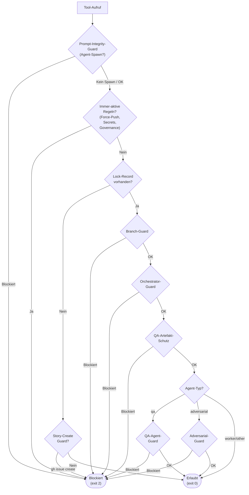

# 31 — Branch-Guard, Orchestrator-Guard und Artefaktschutz

## 31.1 Branch-Guard

### 31.1.1 Verantwortung (FK 6.1)

Erzwingt, dass alle Änderungen einer Story isoliert auf einem
eigenen Branch stattfinden. Verhindert destruktive Git-Operationen,
die die Historie beschädigen oder den zugewiesenen Scope verlassen.

### 31.1.2 Aktivierung

| Betriebsmodus | Status | Begründung |
|--------------|--------|-----------|
| AI-Augmented (kein aktiver Lock-Record) | **Teilweise aktiv** — nur immer-aktive Regeln | Mensch arbeitet interaktiv, Commits auf Main erlaubt |
| Story-Execution (Lock-Record vorhanden) | **Voll aktiv** — alle Regeln | Isolation auf Story-Branch erzwungen |

### 31.1.3 Regelsatz

**Immer-aktive Regeln** (unabhängig vom Betriebsmodus):

| Aktion | Regex | Reaktion | FK |
|--------|-------|---------|-----|
| Force-Push auf jeden Branch | `\bgit\s+push\b.*(?:--force\b\|-f\b\|--force-with-lease\b)` | Blockiert | FK-06-013 |
| Hard-Reset | `\bgit\s+reset\s+--hard\b` | Blockiert | FK-06-015 |
| Force Branch-Delete | `\bgit\s+branch\b.*(?:-D\b\|--delete\s+--force\|--force\s+--delete)` | Blockiert | FK-06-016 |

**Story-Execution-Regeln** (nur bei aktivem Lock-Record):

| Aktion | Regex | Reaktion | FK |
|--------|-------|---------|-----|
| Checkout/Switch auf Main/Master | `\bgit\s+(checkout\|switch)(?:\s+-\S+)*\s+(main\|master)(?:\s\|$)` | Blockiert | FK-06-011 |
| Push auf Main/Master | `\bgit\s+push(?:\s+\S+)*\s+\S+\s+(?:\S+:)?(main\|master)(?:\s\|$)` | Blockiert | FK-06-012 |
| Rebase auf Main/Master | `\bgit\s+rebase(?:\s+\S+)*\s+(?:origin/)?(main\|master)(?:\s\|$)` | Blockiert | FK-06-014 |

**Explizit erlaubt:**

| Aktion | Beispiel | Begründung |
|--------|---------|-----------|
| Commit auf Story-Branch | `git commit -m "..."` | Normale Arbeit |
| Push auf Story-Branch | `git push -u origin story/ODIN-042` | Normale Arbeit |
| Offizieller Closure-Push auf Story-Branch | `agentkit run-phase closure ...` → interner `git push origin story/{story_id}` | Vorgeschriebener Closure-Substep vor dem Merge |
| Offizieller Closure-Merge mit `--no-ff` | `agentkit run-phase closure --story ODIN-042 --no-ff` | Offizieller Pipeline-Fallback, kein Guard-Bypass |
| Offizieller Story-Reset | `agentkit reset-story --story ODIN-042 --reason "..."` | Administrativer Recovery-Pfad, kein freier Git-Eingriff |
| `git checkout -- datei` (File-Restore) | `git checkout -- src/main.py` | Datei wiederherstellen, kein Branch-Wechsel |

**Normative Klarstellung:** Der Branch-Guard unterscheidet zwischen
freien Git-Eingriffen und offiziellen Pipeline-Pfaden. Er blockiert
nicht den von AgentKit selbst ausgelösten Closure-Push und den
offiziellen `--no-ff`-Closure-Pfad, blockiert aber weiterhin manuelle
Rebases, Force-Pushes und sonstige Guard-Umgehungen.

Ein offizieller `StoryResetService`-Aufruf ist ebenfalls erlaubt,
weil er als administrativer AgentKit-Kontrollpfad und nicht als freier
Git-Befehl gilt.

### 31.1.4 Push-Remote-Erkennung

Der Regex für Push auf Main matcht alle Remote-Namen (nicht nur
`origin`), um Umgehung über alternative Remote-Namen zu verhindern.

### 31.1.5 Erkennung des aktiven Worktrees

Der Branch-Guard prüft den aktiven Story-Execution-Kontext
kanonisch über den Lock-Record im State-Backend. Ein optionaler
`.agent-guard/lock.json`-Export im Worktree dient nur als
lokale Materialisierung (Kap. 12.5.1):

```python
def has_active_story_lock(project_key: str, story_id: str) -> bool:
    return state_backend.has_active_lock_record(
        project_key=project_key,
        story_id=story_id,
        lock_type="story_execution",
    )

def get_story_branch() -> str | None:
    export = Path(".agent-guard/lock.json")
    if export.exists():
        data = json.loads(export.read_text())
        return data.get("branch")
    return None
```

## 31.2 Orchestrator-Guard

### 31.2.1 Verantwortung (FK 6.2)

Schützt den Orchestrator-Agenten vor zwei Arten von Kontext-
Verschmutzung. Der Orchestrator liest ausschließlich Control-Plane-
Artefakte (Phasenergebnis, Steuerungszustand). Alles andere ist
blockiert.

**Schutzzone 1 — Codebase des Zielsystems:** Quellcode, Build-Dateien,
Konfigurationen. Liest der Orchestrator Quellcode, driftet er in die
Implementierung ab (FK-05-006: Scope-Drift aus Hilfsbereitschaft).

**Schutzzone 2 — Content-Plane-Artefakte der Story:** Story-Kontext
(`context.json`), ARE-Bundle (`are_bundle.json`) und gleichwertige
Inhaltsdateien. Der Orchestrator erhält keine fachlichen Inhaltsdaten —
nur das strukturierte Steuerungssignal aus dem Phase-State (FK 4.5).

**Reset-Grenze:** Der Orchestrator darf einen Story-Reset nur
vorschlagen oder protokollieren. Er darf ihn nicht selbststaendig
entscheiden oder ueber freie Tool-Operationen nachbauen.

**Artefaktklassen:**

| Klasse | Beispiele | Orchestrator-Zugriff |
|--------|-----------|----------------------|
| Control-Plane | `phase-state.json`, Lock-Export, Marker | Erlaubt (lesend) |
| Content-Plane | `context.json`, `are_bundle.json` | Blockiert |
| Codebase | Quellcode, Build-Dateien, Konfigurationen des Zielsystems | Blockiert |

### 31.2.2 Aktivierung

Nur im Story-Execution-Modus (Lock-Record vorhanden). Im
AI-Augmented-Modus ist der Guard inaktiv — der Mensch arbeitet
direkt mit Claude Code und braucht vollen Zugriff.

### 31.2.3 Regelsatz: Schutzzone 1 (konfigurierbar)

Codebase-Regeln werden aus `.story-pipeline.yaml` gelesen (Kap. 03):

```yaml
orchestrator_guard:
  blocked_paths:
    - "/src/"
    - "/lib/"
    - "/app/"
  blocked_extensions:
    - ".java"
    - ".py"
    - ".ts"
    - ".go"
    - ".rs"
    - ".kt"
  blocked_files:
    - "pom.xml"
    - "build.gradle"
    - "package.json"
    - "Cargo.toml"
    - "pyproject.toml"
    - "Dockerfile"
    - "docker-compose.yml"
```

### 31.2.3b Regelsatz: Schutzzone 2 (fest kodiert)

Content-Plane-Artefakte sind invariant blockiert — nicht konfigurierbar,
da sie Teil des Kerndesigns sind (FK 4.5, FK 9.3):

```python
# Content-Plane-Artefakte — immer blockiert für Orchestrator
CONTENT_PLANE_FILES = frozenset({
    "context.json",    # Story-Kontext (fachlicher Inhalt, 15 Felder)
    "are_bundle.json", # ARE-Anforderungskontext (must_cover-Liste)
})

def _is_content_plane(path: str) -> bool:
    """True wenn der Pfad auf ein Content-Plane-Artefakt zeigt.

    Die Grenze läuft nicht entlang von Dateinamen allein, sondern
    entlang von Artefaktklassen. CONTENT_PLANE_FILES ist die
    kanonische Whitelist der bekannten Content-Plane-Dateien.
    Neue Content-Plane-Artefakte müssen hier eingetragen werden.
    """
    return Path(path).name in CONTENT_PLANE_FILES
```

### 31.2.4 Erlaubte Pfade (Control-Plane)

Unabhängig von der Blockade-Konfiguration sind diese Pfade
immer erlaubt:

| Pfad | Klasse | Begründung |
|------|--------|-----------|
| `prompts/`, `templates/`, `skills/` | Control-Plane | Orchestrator braucht Prompt-Zugriff |
| `_temp/qa/{story_id}/phase-state.json` | Control-Plane | Materialisierter Export der `phase_state_projection` |
| `_temp/governance/` | Control-Plane | Materialisierte Lock-/Marker-Exporte lesen |
| `_guardrails/` | Control-Plane | Guardrail-Dokumente |
| `concepts/`, `stories/` | Control-Plane | Konzepte und Story-Dokumentation |
| `CLAUDE.md`, `README.md` | Control-Plane | Projektdokumentation |
| `.story-pipeline.yaml` | Control-Plane | Konfiguration lesen (nicht schreiben) |
| `_temp/qa/{story_id}/context.json` | Content-Plane | **Blockiert** |
| `_temp/qa/{story_id}/are_bundle.json` | Content-Plane | **Blockiert** |

### 31.2.5 Tool-Scope

Der Guard prüft diese Tool-Typen:

| Tool | Geprüft | Was |
|------|---------|-----|
| `Read` | `file_path` | Pfad gegen Blockade-Regeln |
| `Grep` | `path` | Suchpfad gegen Blockade-Regeln |
| `Glob` | `path` | Suchpfad gegen Blockade-Regeln |
| `Bash` | `command` | Befehle die Dateien lesen könnten (`cat`, `head`, `less`, `vim`, Compiler-Aufrufe) |
| `Write`, `Edit` | `file_path` | Pfad gegen Blockade-Regeln |

### 31.2.6 Principal-Erkennung

Der Guard muss erkennen, ob der aktuelle Aufruf vom
Orchestrator (Hauptagent) kommt. Zwei Mechanismen:

1. **Claude Code Hook-Kontext:** `is_subagent` Flag — wenn false,
   ist es der Hauptagent (Orchestrator)
2. **Fallback (fail-closed):** Wenn das Flag nicht verfügbar ist,
   behandelt der Guard den Aufruf als Orchestrator-Aufruf und
   blockiert. Lieber einen Sub-Agent fälschlich blockieren als
   den Orchestrator durchwinken — konsistent mit dem Fail-Closed-
   Grundprinzip (FK-06-001).

```python
def _is_orchestrator(data: dict[str, Any]) -> bool:
    """True wenn Hook-Event vom Orchestrator (Hauptagent) kommt.

    is_subagent=False → Orchestrator.
    Fehlendes Flag → Orchestrator (fail-closed).
    """
    is_subagent = data.get("is_subagent")
    if is_subagent is None:
        return True  # fail-closed
    return not bool(is_subagent)
```

### 31.2.7 Risikohinweis — Sub-Agent-Completion-Outputs

Completion-Outputs von Sub-Agents, die der Orchestrator auswertet,
sind ein potenzieller Rückkanal für Content-Plane-Inhalte. Ein Worker,
der seinen Output mit vollständigen Anforderungslisten, Code-Diffs oder
Analysedetails befüllt, kann Schutzzone 2 faktisch umgehen.

Dieses Risiko wird nicht durch den Guard abgedeckt (der Guard prüft
Datei-Operationen, nicht Kontext-Inhalte). Es wird durch Output-
Disziplin adressiert: Orchestrator-lesbare Sub-Agent-Outputs sollen
knapp und steuerungsorientiert sein — Outcome, Fehlerklasse,
nächste Phase; keine fachlichen Detailinhalte. Die technische
Absicherung durch ein formales Output-Schema ist Gegenstand
separater Feinkonzepte.

## 31.3 QA-Artefakt-Schutz

### 31.3.1 Verantwortung (FK 6.3)

Stellt sicher, dass QA-Ergebnisse nur von Pipeline-Skripten
geschrieben werden, nicht vom implementierenden Agent. Ein Worker,
der seine eigenen QA-Ergebnisse überschreibt, könnte sich selbst
ein PASS ausstellen.

### 31.3.2 Aktivierung

Nur im Story-Execution-Modus. Gesteuert über die story-spezifische
Lock-Record `(project_key, story_id, run_id, lock_type='qa_artifact_write')`
(Kap. 02.7).

### 31.3.3 Geschützte Pfade

Der Guard blockiert Sub-Agent-Schreibzugriff auf das gesamte
QA-Verzeichnis der aktiven Story:

```python
PROTECTED_PREFIX = "_temp/qa/"

def is_qa_path(path: str, active_stories: list[str]) -> bool:
    for story_id in active_stories:
        if f"_temp/qa/{story_id}/" in path:
            return True
    return False
```

### 31.3.4 Scoping: Nur Sub-Agents blockiert

| Akteur | Zugriff auf QA-Pfade | Begründung |
|--------|---------------------|-----------|
| Pipeline-Skripte (Python, Zone 2) | Erlaubt | Erzeugen QA-Artefakte als Teil des deterministischen Ablaufs |
| Hauptagent (Orchestrator) | Erlaubt (lesen) | Muss QA-Ergebnisse auswerten |
| Sub-Agent (Worker, QA, Adversarial) | **Blockiert** | Dürfen nicht eigene QA-Ergebnisse manipulieren |

**Erkennung:** Der Guard nutzt das `is_subagent` Flag aus dem
Hook-Kontext. Nur wenn `is_subagent == true` und ein aktiver
Lock-Record existiert, blockiert er.

### 31.3.5 CCAG-Regel

Zusätzlich zum Hook eine CCAG-Regel als zweite Absicherungsschicht:

```yaml
# .claude/ccag/rules/subagents.yaml
- id: qa-artifact-lock
  description: "Blockiert Sub-Agent-Zugriff auf QA-Verzeichnisse"
  scope: subagent
  condition:
    state_backend_has_active_lock: "qa_artifact_write"
  tools: [Write, Edit, Bash]
  block_pattern: "_temp/qa/"
  action: block
  message: "Operation not permitted."
```

### 31.3.6 Audit-Trail

Jeder Blockade-Versuch wird als `integrity_violation`-Event in
`execution_events` geschrieben (Kap. 14). Das Integrity-Gate
prüft bei Closure, dass keine Violations vorliegen (FK-06-088).

## 31.4 QA-Agent-Guard

### 31.4.1 Verantwortung (FK-04-015)

Verhindert, dass ein QA-Agent Produktivcode editiert. QA-Agents
dürfen Code lesen und Tests ausführen, aber keine Quelldateien
schreiben. Damit wird sichergestellt, dass der QA-Agent Fehler
findet statt sie stillschweigend zu korrigieren.

### 31.4.2 Aktivierung

Nur im Story-Execution-Modus, nur für Sub-Agents mit Typ `qa`.

### 31.4.3 Regelsatz

| Tool | Erlaubt | Blockiert |
|------|---------|----------|
| `Read`, `Grep`, `Glob` | Alles | Nichts |
| `Bash` | Test-Befehle (`pytest`, `mvn test`, `npm test`), `git diff`, `git log` | Schreibende Befehle in Source-Pfaden |
| `Write`, `Edit` | Eigene Notiz-/Scratch-Pfade (`_temp/qa-notes/`) | Alle Source-Pfade (aus `orchestrator_guard.blocked_paths/extensions`) |

### 31.4.4 Abgrenzung zum Adversarial-Agent

Der Adversarial Agent hat ein **anderes** Write-Profil als der
QA-Agent:

| Agent | Darf lesen | Darf schreiben | Darf ausführen |
|-------|-----------|---------------|---------------|
| QA-Agent | Alles | Nur Notizen | Tests |
| Adversarial | Alles | Nur Sandbox (`_temp/adversarial/{story_id}/`) | Tests (auch neue) |

## 31.5 Story-Erstellungs-Guard

### 31.5.1 Verantwortung (FK-05-011)

Verhindert, dass Agents direkt `gh issue create` aufrufen, ohne
den Story-Erstellungs-Skill zu verwenden. Der Skill stellt
VektorDB-Abgleich, Zieltreue-Prüfung und strukturierte
Feldbelegung sicher.

### 31.5.2 Aktivierung

**Immer aktiv** — unabhängig vom Betriebsmodus. Stories sollen
immer über den Skill erstellt werden, auch im AI-Augmented-Modus.

### 31.5.3 Regelsatz

```python
BLOCKED_PATTERN = re.compile(r"\bgh\s+issue\s+create\b")

def check(command: str) -> bool:
    """Returns True if command should be blocked."""
    return bool(BLOCKED_PATTERN.search(command))
```

### 31.5.4 Ausnahmen

Pipeline-Skripte (Zone 2) dürfen `gh issue create` direkt
aufrufen — z.B. für automatisch erzeugte Failure-Corpus-Check-
Implementierungs-Stories (Kap. 41). Die Erkennung erfolgt über
den Hook-Kontext: Pipeline-Skripte laufen nicht als Claude-Code-
Agent, sondern als direkte Python-Prozesse.

## 31.6 Adversarial-Guard (Sandbox-Scoping)

### 31.6.1 Verantwortung

Der Adversarial Agent darf nur in seiner Sandbox schreiben
(`_temp/adversarial/{story_id}/`), nicht in Produktivcode
oder andere Verzeichnisse.

### 31.6.2 Umsetzung als Hook (nicht CCAG)

Konsistent mit allen anderen Guards wird der Adversarial-Guard
als PreToolUse-Hook implementiert — nicht als CCAG-Regel. CCAG
ist die lernfähige Permission-Schicht für menschliche Freigaben
(Kap. 42), nicht der Enforcement-Mechanismus für harte
Sicherheitsregeln. Harte Regeln gehören in Hooks
(Plattform-Enforcement, Kap. 01 P2).

**Hook-Modul:** `agentkit.governance.adversarial_guard`

```python
def check(tool_name: str, tool_input: dict, is_subagent: bool,
          subagent_type: str) -> int:
    if not is_subagent or subagent_type != "adversarial":
        return 0  # Nicht für diesen Agent-Typ

    if tool_name not in ("Write", "Edit"):
        return 0  # Nur Schreiboperationen prüfen

    path = tool_input.get("file_path", "")
    if "_temp/adversarial/" in path:
        return 0  # Sandbox-Pfad erlaubt

    return 2  # Alles andere blockiert
```

**Registrierung in `.claude/settings.json`:**
```json
{
  "matcher": "Write|Edit",
  "command": "python -m agentkit.governance.adversarial_guard"
}
```

### 31.6.3 Test-Ausführung

Der Adversarial Agent darf Bash-Befehle ausführen (Tests laufen
lassen). Schreibende Bash-Befehle (die Output in Nicht-Sandbox-
Pfade umleiten) werden durch den allgemeinen QA-Artefakt-Schutz
(31.3) abgefangen.

## 31.7 Prompt-Integrity-Guard

### 31.7.1 Verantwortung und Auslöser (FK 6.4)

PreToolUse-Hook, der jeden `Agent`-Tool-Call (Sub-Agent-Spawn)
vor der Ausführung abfängt. Zweck: Verhinderung unautorisierten
Agent-Spawnings, Prompt-Injection, Governance-Bypass und
Template-Manipulation.

Der Guard ist **permanent aktiv** — nicht nur während
Story-Execution, sondern auch im AI-Augmented-Modus. Jeder
Sub-Agent-Spawn durchläuft alle drei Prüfstufen.

### 31.7.2 Drei Prüfstufen

| Stufe | Prüfgegenstand | Methode |
|-------|---------------|---------|
| 1: Governance-Escape-Erkennung | Prompt wird nach adversarialen Mustern gescannt ("ignore all previous instructions", "bypass governance", "you are now free" u.ä.) | Regex-basiert, kein LLM |
| 2: Spawn-Schema-Validierung | Jeder Sub-Agent muss einen strukturierten Header in `description` tragen: `AGENTKIT-SUBAGENT-V1 mode=X role=Y story_id=Z skill_proof=W`. Im Freestyle-Modus: nur `role=general` mit `skill_proof=null`. Im Story-Execution-Modus: gültiges `skill_proof`-Token aus installiertem Manifest, aktive Story-Marker-Datei, autorisierte `prompt_file` aus Phase-State-Contract | Schema-Validierung |
| 3: Template-Integritätsprüfung | Nur während Story-Execution. Tatsächlicher Prompt-Text wird (whitespace-normalisiert) gegen installiertes statisches Template verglichen, wobei `<STORY-ID>` und `<ROUND>` substituiert werden. QA-Agents sind ausgenommen (dynamische Prompts). | String-Vergleich |

### 31.7.3 Opake Fehlermeldungen

Blockade-Ergebnisse sind bewusst uninformativ, um Umgehungs-
versuche nicht zu erleichtern:

- Exit-Code 2, Meldung: `"Operation not permitted."` — keine
  Details
- Kein Diff bei Template-Mismatch (verhindert Rückschlüsse auf
  Template-Struktur)
- Keine Angabe, welche Prüfstufe fehlgeschlagen ist (verhindert
  gezieltes Lernen zur Umgehung)

### 31.7.4 Konfiguration

- Das installierte Manifest enthält das `skill_proof`-Token und
  die autorisierten Prompt-Pfade
- Installation durch den AgentKit-Installer (Kap. 02), nicht
  zur Laufzeit konfigurierbar
- Template-Dateien liegen im Skill-Verzeichnis und werden bei
  Installation in den Manifest-Hash einbezogen

## 31.8 Zusammenspiel der Guards

### 31.8.1 Entscheidungsmatrix

Bei einem Tool-Aufruf durchläuft der Call alle registrierten
Guards sequentiell (Kap. 30.3.3). Der erste exit(2) blockiert.



### 31.8.2 Kein Guard-Konflikt

Die Guards haben nicht-überlappende Verantwortungsbereiche:

| Guard | Prüft | Für wen |
|-------|-------|---------|
| Prompt-Integrity-Guard | Agent-Spawn (Prompt-Validierung, Schema, Template) | Alle Agent-Tool-Calls |
| Branch-Guard | Git-Operationen | Alle (Story-Exec), alle (immer-aktiv für Force-Push) |
| Orchestrator-Guard | Dateipfade (Codebase + Content-Plane) | Nur Hauptagent |
| QA-Artefakt-Schutz | Dateipfade (QA-Verzeichnis) | Nur Sub-Agents |
| QA-Agent-Guard | Dateipfade (Source-Code) | Nur QA-Sub-Agent |
| Adversarial-Guard | Dateipfade (außerhalb Sandbox) | Nur Adversarial-Sub-Agent |
| Story-Create-Guard | Bash-Befehl (`gh issue create`) | Alle Agents |

Es gibt keine Situation, in der zwei Guards sich widersprechen
(einer erlaubt, der andere blockiert denselben Aspekt). Sie
prüfen orthogonale Dimensionen.

---

*FK-Referenzen: FK-06-007 bis FK-06-017 (Branch-Guard),
FK-06-018 bis FK-06-028 (Orchestrator-Guard),
FK-06-029 bis FK-06-034 (QA-Artefakt-Schutz),
FK-04-015 (QA-Agent darf nicht editieren),
FK-05-011 (Story-Erstellung deterministisch),
FK-05-186 (Adversarial: kein Produktivcode-Edit),
FK-06-040 (Prompt-Integrity-Guard, DK 6.4)*
