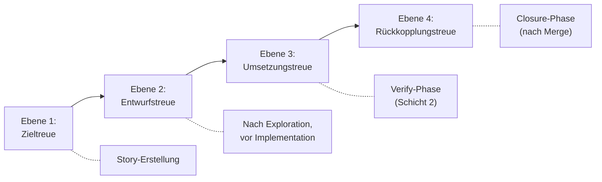

# 32 — Dokumententreue und Conformance-Service

## 32.1 Zweck

Dokumententreue stellt sicher, dass die Arbeit der Agents nicht
von bestehenden Architektur- und Strategieentscheidungen abweicht.
Es ist keine einzelne Prüfung, sondern eine gestufte Kette: Was
geprüft werden kann, hängt davon ab, welcher Gegenstand zu welchem
Zeitpunkt existiert (FK-06-035).

Anders als die Guards (Kap. 30/31) ist Dokumententreue **nicht
deterministisch**, sondern LLM-basiert. Sie erfordert einen
semantischen Abgleich, den kein Algorithmus leisten kann. Deshalb
läuft sie über den StructuredEvaluator (Kap. 11) — ein
deterministisches Python-Skript ruft ein LLM über den Browser-Pool
auf und validiert die Antwort.

**Geltungsbereich:** Nur implementierende Story-Typen (Implementation,
Bugfix). Konzept- und Research-Stories erzeugen
Dokumente, keinen Code — für sie gelten andere, leichtgewichtige
Qualitätskriterien (Kap. 20.2.3). (FK-06-037/038)

## 32.2 Vier Ebenen



| Ebene | Zeitpunkt | Was geprüft wird | Input | FK |
|-------|-----------|-----------------|-------|-----|
| 1. Zieltreue | Story-Erstellung | Passt die Absicht zur Strategie? Kollidiert das Vorhaben mit bestehenden Leitplanken? | Story-Beschreibung, Strategie-/Architekturdokumente | FK-06-056 |
| 2. Entwurfstreue | Nach Exploration, vor Implementation (nur Exploration Mode) | Ist der geplante Lösungsweg mit Architektur und Konzepten vereinbar? | Entwurfsartefakt, Referenzdokumente | FK-06-057 |
| 3. Umsetzungstreue | Nach Implementation, in Verify-Phase | Hat der Worker gebaut, was konzeptionell vorgesehen war? Gibt es undokumentierten Drift? | Code-Diff, Entwurf/Konzept, Handover, Referenzdokumente | FK-06-058 |
| 4. Rückkopplungstreue | Bei Closure (nach Merge) | Müssen bestehende Dokumente aktualisiert werden, damit künftige Prüfungen gegen eine korrekte Wahrheit laufen? | Finaler Change, bestehende Dokumentation | FK-06-059 |

## 32.3 Gemeinsames technisches Pattern

Alle vier Ebenen nutzen dasselbe technische Grundgerüst:

```python
def check_fidelity(
    level: str,                    # "goal" | "design" | "impl" | "feedback"
    evaluator: StructuredEvaluator,
    context: FidelityContext,
) -> FidelityResult:
    """
    1. Referenzdokumente identifizieren (32.4)
    2. Kontext-Bundle zusammenstellen (Kap. 11, arch_references)
    3. StructuredEvaluator aufrufen (1 Check pro Ebene)
    4. Ergebnis: PASS / PASS_WITH_CONCERNS / FAIL
    5. Telemetrie-Event schreiben
    """
    refs = identify_references(level, context)
    result = evaluator.evaluate(
        role="doc_fidelity",
        prompt_template=PROMPT_TEMPLATES[level],
        context={
            "subject": context.subject,         # Was geprüft wird
            "references": refs,                  # Wogegen geprüft wird
            "story_description": context.story,
        },
        expected_checks=[f"{level}_fidelity"],
        story_id=context.story_id,
        run_id=context.run_id,
    )
    return FidelityResult(
        level=level,
        status=result.checks[0].status,
        reason=result.checks[0].reason,
        description=result.checks[0].description,
        references_used=refs,
    )
```

### 32.3.1 Prompt-Templates

| Ebene | Prompt-Template | Kernfrage an das LLM |
|-------|----------------|---------------------|
| Zieltreue | `prompts/doc-fidelity-goal.md` | "Passt diese Story-Absicht zur Strategie? Kollidiert sie mit Leitplanken?" |
| Entwurfstreue | `prompts/doc-fidelity-design.md` | "Ist dieser Lösungsweg mit der bestehenden Architektur vereinbar?" |
| Umsetzungstreue | `prompts/doc-fidelity-impl.md` | "Hat der Worker gebaut, was konzeptionell vorgesehen war? Gibt es undokumentierten Drift?" |
| Rückkopplungstreue | `prompts/doc-fidelity-feedback.md` | "Müssen bestehende Dokumente aktualisiert werden?" |

### 32.3.2 Response-Schema

Alle vier Ebenen nutzen das CheckResult-Schema des
StructuredEvaluator (Kap. 11.4):

```json
{
  "check_id": "design_fidelity",
  "status": "FAIL",
  "reason": "Neuer Service widerspricht Microservice-Schnittgröße aus Architektur-Guideline",
  "description": "Der Entwurf führt einen monolithischen BrokerService ein, der Trading, MarketData und OrderManagement vereint. Die Architektur-Guideline definiert max. 3 Bounded Contexts pro Service."
}
```

## 32.4 Referenzdokument-Identifikation

### 32.4.1 Problem

Die Qualität der Dokumententreue-Prüfung hängt davon ab, welche
Referenzdokumente dem LLM als Kontext mitgegeben werden. Zu
wenige → Konflikte werden übersehen. Zu viele → Kontext-
Verschmutzung, LLM verliert den Fokus.

### 32.4.2 Zwei Quellen

| Quelle | Mechanismus | Stärke |
|--------|-----------|--------|
| **Explizit deklariert** | Worker oder Story-Ersteller benennt Referenzdokumente (im Entwurfsartefakt `konformitaetsaussage.referenzdokumente` oder in Issue-Feldern `Konzept-Referenzen`, `Guardrail-Referenzen`) | Gezielt, keine False Positives |
| **Automatisch ergänzt** | Manifest-Indexer (Kap. 01 P6) identifiziert Dokumente anhand von Story-Metadaten (Modul, Typ) und Dokumenten-Tags | Findet Dokumente, die der Ersteller übersehen hat |

### 32.4.3 Manifest-Indexer

Der Manifest-Indexer scannt die Projektdokumentation und baut
einen Index:

```json
{
  "documents": [
    {
      "path": "concepts/api-design-guidelines.md",
      "scope": "architecture",
      "modules": ["*"],
      "story_types": ["implementation", "bugfix"],
      "sections": [
        {"heading": "REST-Konventionen", "anchor": "rest-konventionen"},
        {"heading": "Versionierung", "anchor": "versionierung"}
      ]
    },
    {
      "path": "concepts/trading-architecture.md",
      "scope": "architecture",
      "modules": ["trading-engine", "broker-client"],
      "story_types": ["*"],
      "sections": [...]
    }
  ]
}
```

**Matching:** Für eine Story mit `module: trading-engine` und
`story_type: implementation` werden alle Dokumente geliefert, deren
`modules` den Wert `trading-engine` oder `*` enthalten UND deren
`story_types` den Wert `implementation` oder `*` enthalten.

### 32.4.4 Pflege des Index

Der Manifest-Index wird **nicht automatisch generiert**. Er wird
als Datei im Projekt gepflegt (z.B. `_guardrails/manifest-index.json`
oder über Tags in den Dokumenten selbst). Der Installer kann
einen initialen Index erzeugen, aber die Pflege obliegt dem
Menschen.

**Kein automatisches Scanning:** Der Index enthält bewusst
kuratierte Einträge. Nicht jedes Markdown im Projekt ist ein
Referenzdokument für die Dokumententreue. Der Mensch entscheidet,
welche Dokumente normativ sind.

## 32.5 Ebene 1: Zieltreue

### 32.5.1 Trigger

Aufgerufen vom Story-Erstellungs-Skill (Kap. 21.5), nach dem
VektorDB-Abgleich.

### 32.5.2 Input

| Input | Quelle |
|-------|--------|
| Story-Beschreibung | Issue-Body (Problemstellung, Lösungsansatz, ACs) |
| Strategie-Dokumente | Manifest-Index gefiltert auf `scope: strategy` |
| Architektur-Dokumente | Manifest-Index gefiltert auf `scope: architecture` |

### 32.5.3 Bei FAIL

Story-Definition muss überarbeitet werden. Zurück zur Konzeption
(Kap. 21.2). Kein automatischer Retry — der Agent muss die Story
inhaltlich anpassen.

## 32.6 Ebene 2: Entwurfstreue

### 32.6.1 Trigger

Aufgerufen vom Phase Runner nach der Exploration-Phase, nachdem
das Entwurfsartefakt eingefroren wurde (Kap. 23.5). Nur im
Exploration Mode.

### 32.6.2 Input

| Input | Quelle |
|-------|--------|
| Entwurfsartefakt | `_temp/qa/{story_id}/entwurfsartefakt.json` (frozen) |
| Vom Worker deklarierte Referenzdokumente | `konformitaetsaussage.referenzdokumente` aus dem Entwurf |
| Vom System ergänzte Referenzdokumente | Manifest-Index gefiltert auf betroffene Module und Story-Typ |
| Story-Beschreibung | `context.json` |

### 32.6.3 Zweite, unabhängige Prüfung

Der Worker hat bereits selbst eine Konformitätsprüfung durchgeführt
(Schritt 5 der Exploration, Kap. 23.3.2). Die Entwurfstreue-Prüfung
ist die **zweite, unabhängige** Prüfung durch ein anderes LLM
(FK-05-087). Das stellt sicher, dass der Worker sich nicht selbst
ein PASS ausstellt.

### 32.6.4 Bei FAIL

Eskalation an Mensch. Pipeline pausiert (`status: ESCALATED`).
Der Mensch muss den Konflikt mit der Architektur klären — z.B.
den Entwurf anpassen, die Architektur-Leitplanken lockern, oder
die Story verwerfen.

### 32.6.5 Gate für freigabepflichtige Entscheidungen

Wenn das Entwurfsartefakt `offene_punkte.freigabe_noetig` mit
nicht-leerer Liste enthält, pausiert die Pipeline auch bei
Entwurfstreue PASS (Kap. 23.5.3). Mensch muss offene Punkte
freigeben, bevor Implementation beginnt.

## 32.7 Ebene 3: Umsetzungstreue

### 32.7.1 Trigger

Läuft als Teil der Verify-Phase (Schicht 2), parallel zu
QA-Bewertung und Semantic Review (Kap. 27.4).

### 32.7.2 Input

| Input | Quelle |
|-------|--------|
| Code-Diff | `git diff` gegen Base-Ref |
| Entwurfsartefakt oder Konzeptquellen | `entwurfsartefakt.json` (Exploration Mode) oder Konzeptdokumente aus `concept_paths` (Execution Mode) |
| Handover-Paket | `handover.json` (insbesondere `drift_log`) |
| Referenzdokumente | Manifest-Index gefiltert |

### 32.7.3 Was geprüft wird

- Hat der Worker gebaut, was konzeptionell vorgesehen war?
- Gibt es undokumentierten Drift (Änderungen, die weder im
  Entwurf stehen noch im `drift_log` begründet sind)?
- Wurden neue Strukturen eingeführt, die nicht deklariert waren?

### 32.7.4 Bei FAIL

Story geht in den Feedback-Loop (Mängelliste an Remediation-
Worker). Bei signifikantem Drift im Exploration Mode: zurück
in die Exploration-Phase (Kap. 20.2.2).

### 32.7.5 Unterschied zu Impact-Violation-Check

| Prüfung | Methode | Was |
|---------|--------|-----|
| Impact-Violation (Kap. 23.8) | Deterministisch (Structural Check, Schicht 1) | Überschreitet der tatsächliche Änderungsumfang den deklarierten Impact? (quantitativ) |
| Umsetzungstreue (diese Ebene) | LLM-basiert (Schicht 2) | Hat der Worker gebaut, was konzeptionell vorgesehen war? (semantisch) |

Beide prüfen Abweichungen, aber auf verschiedenen Ebenen:
Impact-Violation ist quantitativ (wie viele Module, neue APIs),
Umsetzungstreue ist semantisch (passt die Lösung zum Konzept).

## 32.8 Ebene 4: Rückkopplungstreue

### 32.8.1 Trigger

Aufgerufen in der Closure-Phase, nach dem Merge, vor den
Postflight-Gates (Kap. 27.12).

### 32.8.2 Input

| Input | Quelle |
|-------|--------|
| Finaler Change | `git diff` auf Main (nach Merge) |
| Bestehende Dokumentation | Manifest-Index (alle normativen Dokumente) |

### 32.8.3 Was geprüft wird

Müssen bestehende Dokumente aktualisiert werden, damit künftige
Dokumententreue-Prüfungen gegen eine korrekte Wahrheit laufen?
(FK-06-063)

Beispiele:
- Story hat eine neue API eingeführt → API-Design-Guidelines
  müssen um diese API erweitert werden
- Story hat ein Architekturmuster geändert → Architektur-
  Dokumentation ist veraltet
- Story hat eine Konfiguration geändert → Betriebsdokumentation
  muss aktualisiert werden

### 32.8.4 Bei FAIL

**Keine Blockade.** Die Story ist bereits gemergt. Ein FAIL
erzeugt:

1. Eine **Warnung** an den Menschen, welche Dokumente
   aktualisiert werden sollten
2. Einen **Incident im Failure Corpus** (Kap. 41) — automatisch
   erfasst über die Pipeline-Erfassung (FK-10-011). Kategorie:
   `requirements_miss`, Tag: `doc_staleness`. Das Incident wird
   als `INSERT INTO events` in die Telemetrie-DB geschrieben
   und vom Failure-Corpus-Erfassungsmechanismus aufgegriffen.
3. Optional: automatische Erzeugung einer Follow-up-Story
   (Typ: Concept) für die Dokumentations-Aktualisierung

## 32.9 Konzept-Überschreibungsschutz

### 32.9.1 Regel (FK-06-069)

Wenn ein Worker im Execution Mode von einem mitgelieferten Konzept
abweichen will oder muss, muss er:

1. Die Abweichung explizit markieren (im Handover `drift_log`)
2. Eine Begründung liefern
3. Eine erneute Dokumententreue-Prüfung auslösen

### 32.9.2 Erkennung (FK-06-070)

Stillschweigendes Überschreiben eines freigegebenen Konzepts wird
durch die Umsetzungstreue (Ebene 3) erkannt. Das LLM vergleicht
den Code-Diff mit dem Konzept und identifiziert undokumentierten
Drift.

### 32.9.3 Zusätzliche Hook-basierte Erkennung

Die Drift-Erkennung per `increment_commit`-Hook (Kap. 26.3.5)
fängt signifikanten Drift bereits während der Implementation
ab — bevor er in der Verify-Phase erkannt wird. Damit wird
das Problem früher sichtbar und der Worker kann korrigieren,
bevor er das gesamte Handover fertigstellt.

## 32.10 Telemetrie

Jede Dokumententreue-Prüfung erzeugt ein `llm_call`-Event in
der SQLite-DB mit `role: doc_fidelity`:

```sql
INSERT INTO events (story_id, run_id, ts, event_type, pool, role, payload)
VALUES (?, ?, datetime('now'), 'llm_call', 'gemini', 'doc_fidelity',
        '{"level": "design", "status": "PASS"}');
```

Das Integrity-Gate prüft bei Closure, dass für jede relevante
Ebene ein `llm_call` mit `role: doc_fidelity` in der Telemetrie
vorliegt:

| Story-Modus | Erwartete Ebenen |
|------------|-----------------|
| Exploration Mode | Ebene 2 (Entwurfstreue) + Ebene 3 (Umsetzungstreue) + Ebene 4 (Rückkopplungstreue) |
| Execution Mode | Ebene 3 (Umsetzungstreue) + Ebene 4 (Rückkopplungstreue) |
| Story-Erstellung | Ebene 1 (Zieltreue) — wird nicht vom Integrity-Gate geprüft (kein Closure) |

## 32.11 Konfiguration

| Parameter | Config-Pfad | Default |
|-----------|-------------|---------|
| LLM-Rolle für Dokumententreue | `llm_roles.doc_fidelity` | `gemini` |
| Manifest-Index-Pfad | `guardrails_dir` + `manifest-index.json` | `_guardrails/manifest-index.json` |
| Guardrail-Dokumente-Pattern | `guardrails_pattern` | `*.md` |

---

*FK-Referenzen: FK-06-035 bis FK-06-070 (Dokumententreue komplett),
FK-05-083 bis FK-05-089 (Exploration: Selbst-Konformität + Freeze +
unabhängige Prüfung),
FK-05-100 bis FK-05-103 (Drift-Prüfung und erneute Dokumententreue)*