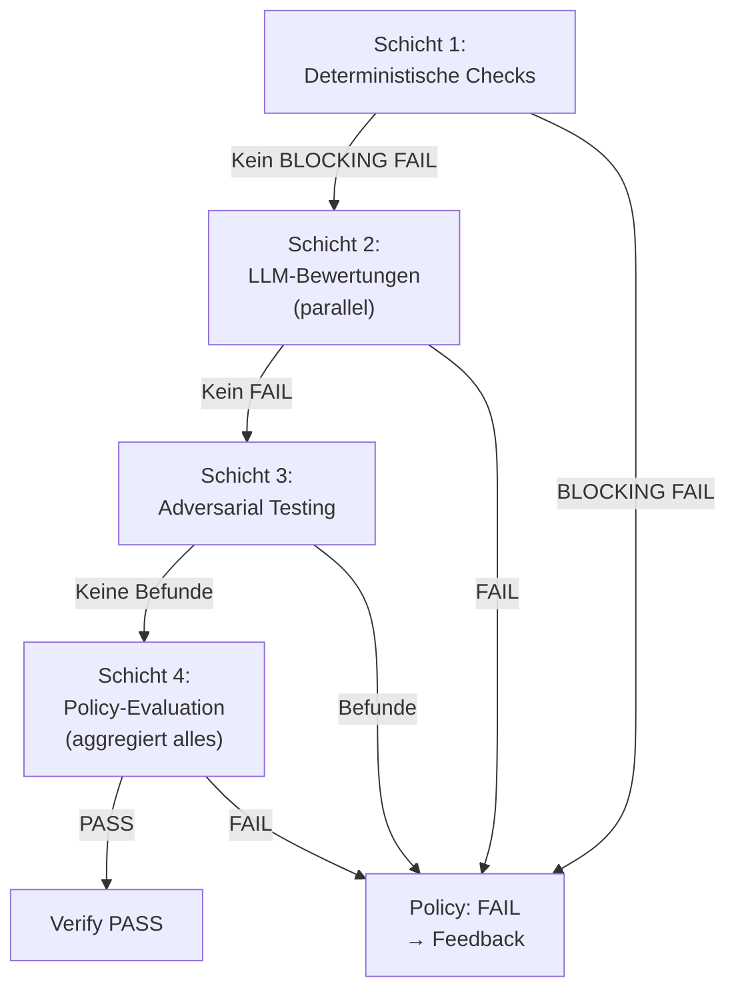

# 33 — Deterministische Checks, Stage-Registry und Policy-Engine

<!-- PROSE-FORMAL: formal.deterministic-checks.entities, formal.deterministic-checks.state-machine, formal.deterministic-checks.commands, formal.deterministic-checks.events, formal.deterministic-checks.invariants, formal.deterministic-checks.scenarios -->

## 33.1 Zweck

Deterministische Checks sind die erste Verteidigungslinie der
Verify-Phase (Schicht 1). Sie laufen als Python-Skripte ohne
LLM-Beteiligung, sind reproduzierbar und kostenlos. Scheitern sie,
werden die nachfolgenden Schichten (LLM-Bewertungen, Adversarial
Testing) gar nicht erst gestartet (FK-07-003).

Die Stage-Registry typisiert die Prüfschritte aller Schichten.
Die Policy-Engine aggregiert die Ergebnisse und entscheidet über
PASS oder FAIL der gesamten Verify-Phase.

**Architekturzuordnung:** `StructuralChecker` und `PolicyEngine` sind
fachlich Subkomponenten der `VerifyPhase`. Die `StageRegistry` ist
dagegen eine eigenstaendige Top-Level-Komponente, weil sie nicht nur
von der Verify-Phase konsumiert wird, sondern auch Ziel der
Pattern-/Check-Promotion aus dem `FailureCorpus` ist.

## 33.2 Stage-Registry

### 33.2.1 Typisiertes Modell (Kap. 02.9)

Jede Stage hat ein typisiertes Profil statt einer freien String-ID:

```python
@dataclass(frozen=True)
class StageDefinition:
    id: str                     # z.B. "structural"
    layer: int                  # Verify-Schicht: 1, 2, 3, 4
    kind: str                   # "deterministic" | "llm_evaluation" | "agent" | "policy"
    applies_to: frozenset[str]  # Story-Typen: {"implementation", "bugfix"}
    blocking: bool              # Blockiert bei FAIL
    trust_class: str | None     # "A", "B", "C" oder None
    producer: str               # Erlaubter Producer-Name
    execution_policy: str       # DSL-Policy des Stage-Aufrufs
    override_policy: str        # normativer Override-Rahmen fuer diese Stage
```

### 33.2.2 Standard-Stages

| ID | Schicht | Kind | Gilt für | Blocking | Producer |
|----|---------|------|----------|----------|----------|
| `structural` | 1 | deterministic | implementation, bugfix | Ja | `qa-structural-check` |
| `impact_violation` | 1 | deterministic | implementation, bugfix | Ja | `qa-structural-check` |
| `recurring_guards` | 1 | deterministic | implementation, bugfix | Ja | `qa-structural-check` |
| `are_gate` | 1 | deterministic | implementation, bugfix | Ja (wenn ARE aktiv) | `qa-are-gate` |
| `qa_review` | 2 | llm_evaluation | implementation, bugfix | Ja | `qa-llm-review` |
| `semantic_review` | 2 | llm_evaluation | implementation, bugfix | Ja | `qa-semantic-review` |
| `doc_fidelity_impl` | 2 | llm_evaluation | implementation, bugfix | Ja | `qa-doc-fidelity` |
| `context_sufficiency` | 2 (Pre-Step) | deterministic | implementation, bugfix | Nein (Warning) | `qa-context-sufficiency` |
| `adversarial` | 3 | agent | implementation, bugfix | Ja | `qa-adversarial` |
| `policy` | 4 | policy | implementation, bugfix | Ja | `qa-policy-engine` |
| `concept_feedback` | — | llm_evaluation | concept | Ja | `qa-concept-feedback` |
| `research_quality` | — | deterministic | research | Nein | `qa-research-check` |

**Policy-Defaults:**

- deterministic Stages: standardmaessig `execution_policy = ALWAYS`
- kosten- oder agentintensive Stages duerfen `UNTIL_SUCCESS` oder
  `SKIP_AFTER_SUCCESS` verwenden, wenn dies explizit in der Registry
  deklariert ist
- `override_policy` ist pro Stage restriktiv zu waehlen; harte
  Layer-1-Stages sind standardmaessig nicht skipbar

### 33.2.3 Einheitliche Namenskonvention: Stage-ID = Dateiname

Die Stage-ID bestimmt den Standardnamen eines materialisierten
Ergebnis-Artefakts. Kanonisch referenziert die Pipeline die Artefakte
ueber `artifact_records`; Dateipfade sind nur Export-/Arbeitskonvention:

| Stage-ID | Artefakt-Datei |
|----------|---------------|
| `structural` | `_temp/qa/{story_id}/structural.json` |
| `qa_review` | `_temp/qa/{story_id}/qa_review.json` |
| `semantic_review` | `_temp/qa/{story_id}/semantic_review.json` |
| `doc_fidelity_impl` | `_temp/qa/{story_id}/doc_fidelity_impl.json` |
| `adversarial` | `_temp/qa/{story_id}/adversarial.json` |
| `context_sufficiency` | `_temp/qa/{story_id}/context_sufficiency.json` |
| `policy` | `_temp/qa/{story_id}/policy.json` |

Die Policy-Engine lädt Artefakte fachlich ueber `ArtifactRecord`
(`artifact_kind = stage.id`). Falls ein Dateiexport materialisiert
wird, gilt `_temp/qa/{story_id}/{stage.id}.json` als Standardpfad —
kein separates Mapping nötig.

**Migration:** Historische Namen wie `qa_review.json`,
`semantic_review.json` oder `decision.json` koennen als Legacy-Exporte
weiterexistieren, sind aber nie die kanonische Referenz. Die Pipeline
arbeitet fachlich gegen `artifact_records(kind = stage.id)`; Exportnamen
sind nur Materialisierungskonvention.

### 33.2.4 Projekt-Overrides

Projekte können über `.story-pipeline.yaml` einzelne Stages
überschreiben (Kap. 03):

```yaml
policy:
  stage_overrides:
    adversarial:
      blocking: false  # Default true → auf non-blocking herabgestuft (z.B. für Pilotphase)
```

Die Stage-Definition selbst (layer, kind, applies_to, producer)
ist nicht überschreibbar — nur `blocking`.

### 33.2.4 Stage-Geltung nach Story-Typ

Die Policy-Engine evaluiert nur Stages, deren `applies_to` den
aktuellen Story-Typ enthält:

```python
def stages_for(self, story_type: str) -> list[StageDefinition]:
    return [s for s in self.stages if story_type in s.applies_to]
```

Konzept- und Research-Stories durchlaufen nur ihre eigenen,
leichtgewichtigen Stages — nicht die Verify-Pipeline.

### 33.2.5 StageRegistry als Komponenten-Flow

Die `StageRegistry` ist nicht nur eine statische Liste, sondern eine
eigene Top-Level-Komponente mit einem komponentenseitigen
`FlowDefinition`. Ihre Aufgabe ist nicht die Ausfuehrung von Checks,
sondern die deterministische Materialisierung eines Stage-Plans fuer
ein konkretes Gate.

Typischer Registry-Flow:

```text
resolve_candidate_stages
  -> filter_by_story_type
  -> apply_project_overrides
  -> materialize_stage_plan
  -> handoff_to_gate_runner
```

**Verantwortungstrennung:**

- `StageRegistry` liest Definitionen und baut daraus einen
  `StageExecutionPlan`
- `GateRunner` fuehrt die Stages gemaess Plan aus
- `PolicyEngine` aggregiert die Resultate gemaess Gate-Vertrag

Damit bleibt die Registry ein planender Owner der Verify-Struktur,
ohne selbst Check-Code auszufuehren.

### 33.2.6 StageExecutionPlan und GateRunner-Schnittstelle

```python
@dataclass(frozen=True)
class StageInvocation:
    stage_id: str
    producer: str
    layer: int
    blocking: bool
    execution_policy: str
    override_policy: str


@dataclass(frozen=True)
class StageExecutionPlan:
    gate_id: str
    flow_id: str
    invocations: tuple[StageInvocation, ...]


class GateRunner(Protocol):
    def run_gate(
        self,
        context: StepExecutionContext,
        plan: StageExecutionPlan,
    ) -> StepResult: ...
```

**Normative Regeln:**

1. Die Reihenfolge der Verify-Stages kommt aus dem
   `StageExecutionPlan`, nicht aus frei verdrahteten Python-`if`s.
2. Stage-bezogene `ExecutionPolicy` und `OverridePolicy` werden von
   der Engine vor der Invocation ausgewertet, nicht im Producer.
3. Promotion aus dem `FailureCorpus` erweitert die `StageRegistry`;
   sie umgeht nicht den Registry-Flow durch direkte Hardcodierung in
   `VerifyPhase`.

## 33.3 Deterministische Checks (Schicht 1)

### 33.3.1 Check-Modell

```python
@dataclass(frozen=True)
class StructuralCheck:
    id: str             # z.B. "artifact.protocol"
    category: str       # artifact, branch, build, test, security, ...
    blocking: bool
    status: str         # PASS, FAIL, SKIP
    severity: str       # BLOCKING, MAJOR, MINOR, INFO
    detail: str         # Menschenlesbare Erklärung
    metadata: dict      # Check-spezifische Zusatzdaten
```

### 33.3.2 Check-Katalog

#### Artefakt-Prüfung

| Check-ID | Was | Severity | FK |
|----------|-----|----------|-----|
| `artifact.protocol` | `protocol.md` existiert, > 50 Bytes | BLOCKING | FK-05-132 |
| `artifact.worker_manifest` | `worker-manifest.json` valides JSON | BLOCKING | FK-05-133 |
| `artifact.manifest_claims` | Deklarierte Dateien existieren auf Disk | BLOCKING | FK-05-134 |
| `artifact.handover` | `handover.json` existiert, Schema-valide | BLOCKING | — |

#### Branch & Completion

| Check-ID | Was | Severity | FK |
|----------|-----|----------|-----|
| `branch.story` | Auf korrektem Branch `story/{story_id}` | BLOCKING | — |
| `branch.commit_trailers` | Story-ID in Commit-Message | BLOCKING | FK-05-139 |
| `completion.commit` | Mindestens 1 Commit seit Base-Ref | BLOCKING | FK-05-135 |
| `completion.push` | Branch auf Remote gepusht | BLOCKING | — |

#### Build & Test

| Check-ID | Was | Severity | FK |
|----------|-----|----------|-----|
| `build.compile` | Build kompiliert erfolgreich | BLOCKING | FK-05-136 |
| `build.test_execution` | Tests grün | BLOCKING | FK-05-137 |
| `test.count` | Mindestens 1 Testdatei im Changeset | MAJOR | FK-05-138 |
| `test.coverage` | Coverage-Report existiert, Schwellenwert erreicht | MAJOR | FK-05-138 |

#### Security

| Check-ID | Was | Severity | FK |
|----------|-----|----------|-----|
| `security.secrets` | Keine `.env`, `.pem`, `.key` etc. im Diff | BLOCKING | FK-05-140 |
| `security.secrets_content` | Keine API-Key-Patterns (`AKIA`, `ghp_`, `sk-`) im Diff-Inhalt | BLOCKING | — |

#### Code-Hygiene

| Check-ID | Was | Severity | FK |
|----------|-----|----------|-----|
| `hygiene.todo_fixme` | Keine TODO/FIXME in geänderten Dateien | MINOR | FK-05-142 |
| `hygiene.disabled_tests` | Keine `@Disabled`/`@Ignore`/`@pytest.mark.skip`/`@unittest.skip` | MINOR | FK-05-141 |
| `hygiene.commented_code` | Keine großen auskommentierten Code-Blöcke | MINOR | — |

#### Impact

| Check-ID | Was | Severity | FK |
|----------|-----|----------|-----|
| `impact.violation` | Tatsächlicher Impact ≤ deklarierter Impact (Kap. 23.8) | BLOCKING | FK-06-065 |

#### Recurring Guards (Telemetrie-basiert)

| Check-ID | Was | Quelle | FK |
|----------|-----|--------|-----|
| `guard.llm_reviews` | Review-Anzahl nach Story-Größe eingehalten | `execution_events`: `COUNT(*) WHERE project_key=? AND story_id=? AND event_type='review_request'` | FK-05-119 bis FK-05-121 |
| `guard.review_compliance` | Alle Reviews über freigegebene Templates | `execution_events`: `COUNT(review_compliant) >= COUNT(review_request)` im Scope `(project_key, story_id, run_id)` | FK-06-087 |
| `guard.no_violations` | Keine Guard-Verletzungen | `execution_events`: `COUNT(*) WHERE project_key=? AND story_id=? AND event_type='integrity_violation'` = 0 | FK-06-088 |
| `guard.multi_llm` | Alle Pflicht-Reviewer aufgerufen | `execution_events`: pro konfigurierter `llm_roles`-Rolle mindestens 1 `llm_call`-Event im Scope `(project_key, story_id, run_id)` | FK-06-091 |

#### Bugfix-spezifisch

| Check-ID | Was | Severity |
|----------|-----|----------|
| `bugfix.reproducer_manifest` | `bugfix-reproducer.json` existiert mit Pflichtfeldern | BLOCKING |
| `bugfix.red_evidence` | Red Phase: Test fehlschlagend (exit != 0) | BLOCKING |
| `bugfix.green_evidence` | Green Phase: Test erfolgreich (exit == 0) | BLOCKING |
| `bugfix.suite_evidence` | Suite Phase: Gesamte Test-Suite grün | BLOCKING |
| `bugfix.red_green_consistency` | Gleicher Befehl, verschiedene Commits | BLOCKING |

### 33.3.3 Build-/Test-Befehle

Die Befehle für `build.compile` und `build.test_execution`
kommen aus `.story-pipeline.yaml` oder aus projekt-spezifischen
Konventionen:

```yaml
# Nicht explizit in der Config — wird aus dem Tech-Stack abgeleitet
# oder über die stage_overrides konfigurierbar
```

**Erkennung:** Der Structural-Check erkennt den Tech-Stack aus
vorhandenen Dateien:

| Datei | Stack | Build-Befehl | Test-Befehl |
|-------|-------|-------------|-------------|
| `pom.xml` | Maven | `mvn compile -q` | `mvn test -q` |
| `build.gradle` | Gradle | `gradle build` | `gradle test` |
| `pyproject.toml` | Python | `ruff check .` | `pytest` |
| `package.json` | Node | `npm run build` | `npm test` |
| `Cargo.toml` | Rust | `cargo build` | `cargo test` |

### 33.3.4 Ergebnis-Artefakt

`_temp/qa/{story_id}/structural.json` (Envelope-Format):

```json
{
  "schema_version": "3.0",
  "story_id": "ODIN-042",
  "run_id": "a1b2...",
  "stage": "qa_structural",
  "producer": { "type": "script", "name": "qa-structural-check" },
  "status": "FAIL",
  "checks": [
    {
      "id": "build.test_execution",
      "category": "build",
      "blocking": true,
      "status": "FAIL",
      "severity": "BLOCKING",
      "detail": "3 tests failed: test_broker_adapter, test_rate_limit, test_auth",
      "metadata": { "exit_code": 1, "failed_tests": 3, "total_tests": 47 }
    }
  ],
  "summary": {
    "total_checks": 18,
    "passed": 17,
    "failed": 1,
    "skipped": 0,
    "blocking_failures": 1,
    "major_failures": 0,
    "minor_failures": 0
  }
}
```

## 33.4 Designprinzip: Prozesswächter vs. domänenspezifische Checks

### 33.4.1 Konzeptuelle Trennung (FK-33-094)

Die Unterscheidung zwischen **wiederkehrenden Prozesswächtern**
und **story-spezifischen Domänen-Checks** ist ein explizites
Designprinzip der Check-Architektur.

Wiederkehrende Prozesswächter (z.B. `guard.llm_reviews`,
`guard.review_compliance`, `guard.no_violations`) sind im Voraus
definierbar und dauerhaft aktiv — sie prüfen den Prozess, nicht
den Inhalt. Story-spezifische Domänen-Checks (z.B. Prüfung auf
korrekte Mandantentrennung für eine spezifische Story) sind
dagegen erst retrospektiv pro Story identifizierbar: Welche
fachlichen Risiken eine konkrete Story birgt, ergibt sich erst
aus ihrem Inhalt.

Diese Trennung darf nicht aufgeweicht werden. Prozesswächter
gehören in die Stage-Registry als dauerhafte Checks. Story-
spezifische Prüfungen können als LLM-Evaluations (Schicht 2)
oder als Adversarial-Testing-Ansatzpunkte (Schicht 3) abgebildet
werden, aber nicht als vordefinierte Structural Checks
(FK-07-009 bis FK-07-014).

## 33.5 Trust-Klassen (FK 7.2)

### 33.5.1 Modell

Nicht jede Datenquelle ist gleich vertrauenswürdig. Trust-Klassen
bestimmen, welche Prüfergebnisse blocking sein dürfen:

| Klasse | Datenquelle | Blocking erlaubt | Beispiele |
|--------|-------------|-----------------|-----------|
| A | Autoritative Systeme (DB, Backend-Health, ARE) | Ja | DB-State-Match, Backend-Health, ARE-Gate |
| B | System-emittierte Daten (Telemetrie, Prozess-Identität) | Ja | Hook-Events, Commit-Historie, Build-Ergebnis |
| C | Vom Worker selbst erzeugte Evidence (Screenshots, API-Logs) | **Nein** | API-Test-Log, Screenshots, Worker-Behauptungen |

### 33.5.2 Kernregel

**Klasse C darf nie blocking sein** (FK-07-008). Der Agent darf
seine eigene Prüfung nicht bestehen können. Wenn ein Structural
Check auf Worker-Evidence basiert, darf er nur `severity: INFO`
oder `severity: MINOR` haben, nie `BLOCKING` oder `MAJOR`.

### 33.5.3 Zuordnung in der Stage-Registry

Die Trust-Klasse ist ein Feld der StageDefinition. Die
Policy-Engine validiert, dass keine Stage mit `trust_class: "C"`
als `blocking: true` konfiguriert ist.

## 33.6 Externe Checks (Stage-Registry-Erweiterung)

### 33.6.1 Plugin-Modell

Die Stage-Registry kann um externe Checks erweitert werden
(FK-05-149: "SonarQube oder vergleichbare statische Analyse über
die konfigurierbare Stage-Registry"):

```yaml
# In .story-pipeline.yaml
policy:
  additional_stages:
    - id: sonarqube
      layer: 1
      kind: deterministic
      applies_to: [implementation, bugfix]
      blocking: false
      producer: sonarqube-check
      command: "python tools/qa/sonarqube_check.py"
```

### 33.6.2 Anforderungen an externe Checks

| Anforderung | Beschreibung |
|-------------|-------------|
| Envelope-Format | Output muss dem Stage-Envelope-Schema entsprechen |
| Producer-Name | Muss mit `producer` in der Stage-Definition übereinstimmen |
| Exit-Code | 0 = erfolgreich gelaufen (Status im JSON), != 0 = Check konnte nicht laufen (FAIL) |
| Timeout | Muss innerhalb des Pipeline-Timeouts abschließen |

## 33.7 Policy-Engine

### 33.7.1 Verantwortung

Die Policy-Engine aggregiert die Ergebnisse aller Verify-Schichten
und fällt die finale Entscheidung: Verify PASS oder FAIL.

### 33.7.2 Evaluationslogik

```python
def evaluate_policy(story_id: str, story_type: str,
                    config: PipelineConfig) -> PolicyResult:
    registry = load_stage_registry(config)
    results = []

    # Nur Stages evaluieren, deren Schicht tatsächlich durchlaufen wurde.
    # Wenn Schicht 1 FAIL → Schicht 2/3 wurden nie gestartet → deren
    # fehlende Artefakte sind kein Fehler, sondern erwartetes Verhalten.
    max_layer_reached = determine_max_layer_reached(story_id)

    for stage in registry.stages_for(story_type):
        if stage.layer > max_layer_reached:
            # Diese Schicht wurde nie erreicht — nicht bewerten
            continue

        artifact = artifact_client.get_artifact_record(
            project_key=project_key,
            story_id=story_id,
            run_id=run_id,
            artifact_kind=stage.id,
        )

        if artifact is None:
            # Fehlendes Artefakt in einer durchlaufenen Schicht = FAIL
            results.append(StageResult(
                stage_id=stage.id,
                status="FAIL",
                blocking=stage.blocking,
                detail="Artifact missing in completed layer",
                producer=stage.producer,
            ))
            continue

        # Producer-Validierung
        if artifact.producer.name != stage.producer:
            results.append(StageResult(
                stage_id=stage.id,
                status="FAIL",
                blocking=True,  # Falscher Producer ist immer blocking
                detail=f"Wrong producer: {artifact.producer.name}, expected {stage.producer}",
                producer=stage.producer,
            ))
            continue

        results.append(StageResult(
            stage_id=stage.id,
            status=artifact.status,
            blocking=stage.blocking,
            detail=getattr(artifact, 'summary', ''),
            producer=stage.producer,
        ))

    # Aggregation
    blocking_failures = sum(1 for r in results if r.blocking and r.status == "FAIL")
    major_failures = sum(1 for r in results if not r.blocking and r.status == "FAIL")

    status = "FAIL" if blocking_failures > 0 else "PASS"
    if major_failures > config.policy.major_threshold:
        status = "FAIL"  # Auch ohne blocking: zu viele Major-Failures

    return PolicyResult(
        status=status,
        stages=results,
        blocking_failures=blocking_failures,
        major_failures=major_failures,
        total_checks=len(results),
    )
```

### 33.7.3 Entscheidungsregeln

| Bedingung | Ergebnis |
|-----------|---------|
| Kein blocking FAIL | PASS |
| Mindestens 1 blocking FAIL | FAIL |
| major_failures > `policy.major_threshold` (Default: 3) | FAIL (auch ohne blocking) |
| Fehlendes Artefakt | FAIL (fail-closed) |
| Falscher Producer | FAIL (immer blocking — Manipulationsversuch) |

### 33.7.4 Context-Sufficiency-Input (FK-33-110)

Die Policy-Engine kennt den kanonischen
`ArtifactRecord(kind="context_sufficiency")` als optionalen Input. Da
`context_sufficiency` in der Stage-Registry als
`blocking: false` (Warning) registriert ist, produziert ein
`sufficiency != "sufficient"` kein FAIL. Stattdessen wird ein
Warning in die Policy-Entscheidung aufgenommen:

```python
# In evaluate_policy() — context_sufficiency ist fail-open:
sufficiency_artifact = artifact_client.get_artifact_record(
    project_key=project_key,
    story_id=story_id,
    run_id=run_id,
    artifact_kind="context_sufficiency",
)
if sufficiency_artifact is not None:
    sufficiency_status = sufficiency_artifact.get("sufficiency", "unknown")
    if sufficiency_status != "sufficient":
        warnings.append(PolicyWarning(
            stage_id="context_sufficiency",
            detail=f"Context sufficiency: {sufficiency_status} "
                   f"— {len(sufficiency_artifact.get('gaps', []))} gaps identified",
            source_artifact="context_sufficiency.json",
        ))
```

**Begründung (fail-open):** Der Context Sufficiency Builder ist
ein deterministischer Pre-Step von Schicht 2 (Kap. 34), kein
eigenständiger Layer. Fehlende oder unvollständige Evidenz ist ein
Hinweis, kein Blocker — die LLM-Bewertungen in Schicht 2 können
trotzdem sinnvoll arbeiten, wenn auch mit eingeschränkter
Kontextbasis. Die Warnings fließen in den kanonischen
Policy-/Verify-Decision-Record ein; optionale Exporte wie
`policy.json` oder `decision.json` bilden das nur materialisiert ab.

### 33.7.5 Ergebnis-Artefakt

Kanonischer Policy-/Verify-Decision-Record (optional materialisiert als
`_temp/qa/{story_id}/policy.json`, Legacy-Export `decision.json`,
Producer `qa-policy-engine`):

```json
{
  "schema_version": "3.0",
  "story_id": "ODIN-042",
  "run_id": "a1b2...",
  "stage": "qa_decision",
  "producer": { "type": "script", "name": "qa-policy-engine" },
  "status": "FAIL",
  "inputs": {
    "structural": { "status": "FAIL", "blocking_failures": 1 },
    "context_sufficiency": { "sufficiency": "partial", "gaps": 2 },
    "qa_review": { "status": "PASS" },
    "semantic_review": { "status": "PASS" },
    "doc_fidelity_impl": { "status": "PASS" },
    "adversarial": { "status": "PASS" }
  },
  "warnings": [
    { "stage_id": "context_sufficiency", "detail": "Context sufficiency: partial — 2 gaps identified" }
  ],
  "rules_applied": [
    { "rule": "blocking_stage_fail", "result": "FAIL", "detail": "structural has 1 blocking failure" }
  ],
  "blocking_failures": 1,
  "major_failures": 0,
  "major_threshold": 3,
  "total_stages": 5
}
```

## 33.8 Schicht-Sequenz und Gate-Logik

### 33.8.1 Sequentielle Schichtabarbeitung

Die vier Schichten laufen sequentiell. Jede Schicht ist ein Gate:



### 33.8.2 Gate-Regeln zwischen Schichten

| Übergang | Gate-Regel |
|----------|-----------|
| Schicht 1 → 2 | Kein BLOCKING-Check in Schicht 1 darf FAIL sein. MAJOR/MINOR-Failures werden gesammelt, blockieren aber nicht. |
| Schicht 2 → 3 | Kein Check in Schicht 2 darf FAIL sein (jeder FAIL blockiert, FK-05-164). PASS_WITH_CONCERNS werden als Ansatzpunkte an Adversarial weitergegeben. |
| Schicht 3 → 4 | Wenn Adversarial Befunde hat: FAIL (Fehler gefunden). Wenn keine Befunde: PASS (Angriffsversuche gescheitert). |
| Schicht 4 | Policy aggregiert alles: blocking_failures, major_threshold. |

## 33.9 Konzept- und Research-Checks

### 33.9.1 Konzept-Story-Checks

Konzept-Stories durchlaufen nicht die Verify-Pipeline, sondern
eigene leichtgewichtige Checks:

| Check-ID | Was | FK |
|----------|-----|-----|
| `concept.structure` | Konzeptdokument hat erwartete Abschnitte | FK-05-047 |
| `concept.completeness` | Alle Pflichtabschnitte nicht leer | FK-05-047 |
| `concept.sparring` | Telemetrie weist Pflicht-Feedback-Loop nach (2 LLMs, Einarbeitung geprüft) | FK-05-047 (erweitert) |
| `concept.vectordb` | VektorDB-Abgleich wurde durchgeführt (wenn verfügbar) | FK-05-042 |

### 33.9.2 Research-Story-Checks

| Check-ID | Was | FK |
|----------|-----|-----|
| `research.structure` | Research-Ergebnis hat erwartete Abschnitte | — |
| `research.sources` | Quellenvielfalt (nicht nur eine Quelle) | FK-05-049 |
| `research.assessment` | Bewertungskriterien dokumentiert | FK-05-049 |

## 33.10 CLI-Integration

### 33.10.1 Structural Checks ausführen

```bash
agentkit structural --story ODIN-042 --config .story-pipeline.yaml
```

### 33.10.2 Policy-Evaluation ausführen

```bash
agentkit policy --story ODIN-042 --config .story-pipeline.yaml
```

### 33.10.3 Stage-Registry anzeigen

```bash
agentkit stages --story-type implementation --config .story-pipeline.yaml
```

Zeigt alle für diesen Story-Typ geltenden Stages mit Layer,
Kind, Blocking-Status und Producer.

---

*FK-Referenzen: FK-05-131 bis FK-05-151 (Schicht 1 komplett),
FK-05-209/210 (Policy-Evaluation, Stage-Registry),
FK-07-001 bis FK-07-003 (deterministische vs. LLM Checks, Gate),
FK-07-004 bis FK-07-008 (Trust-Klassen),
FK-07-009 bis FK-07-014 (Recurring vs. story-spezifisch),
FK-33-110 (Context-Sufficiency-Input in Policy-Engine)*
