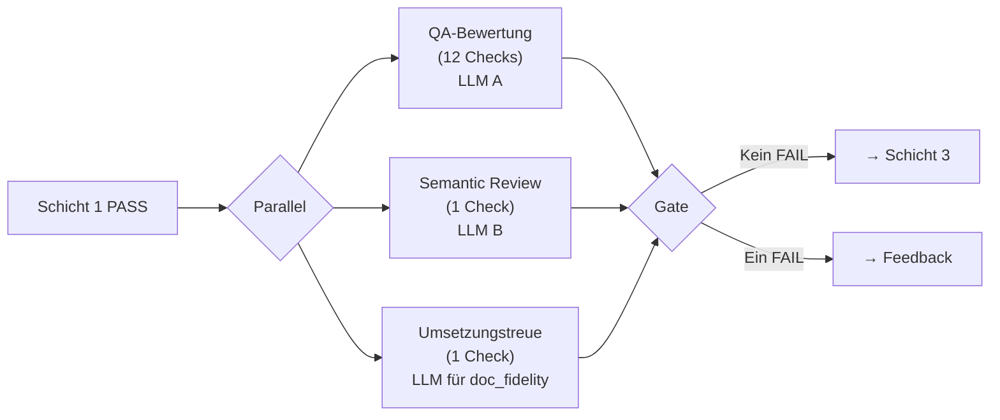
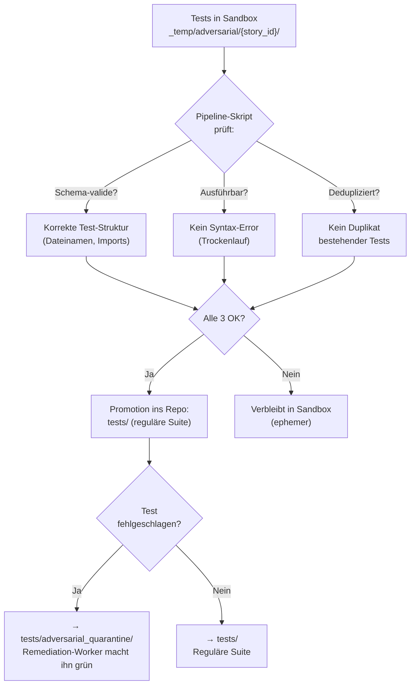
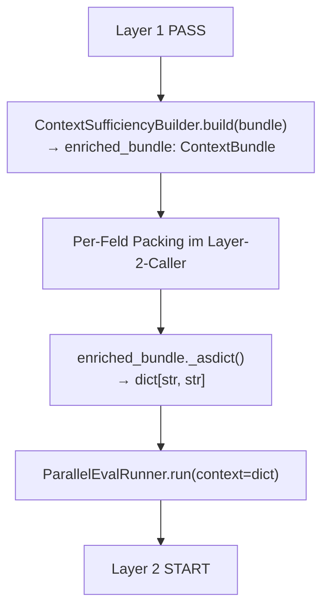
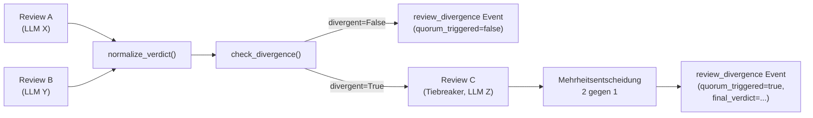
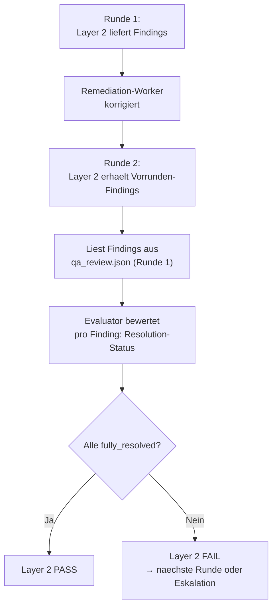
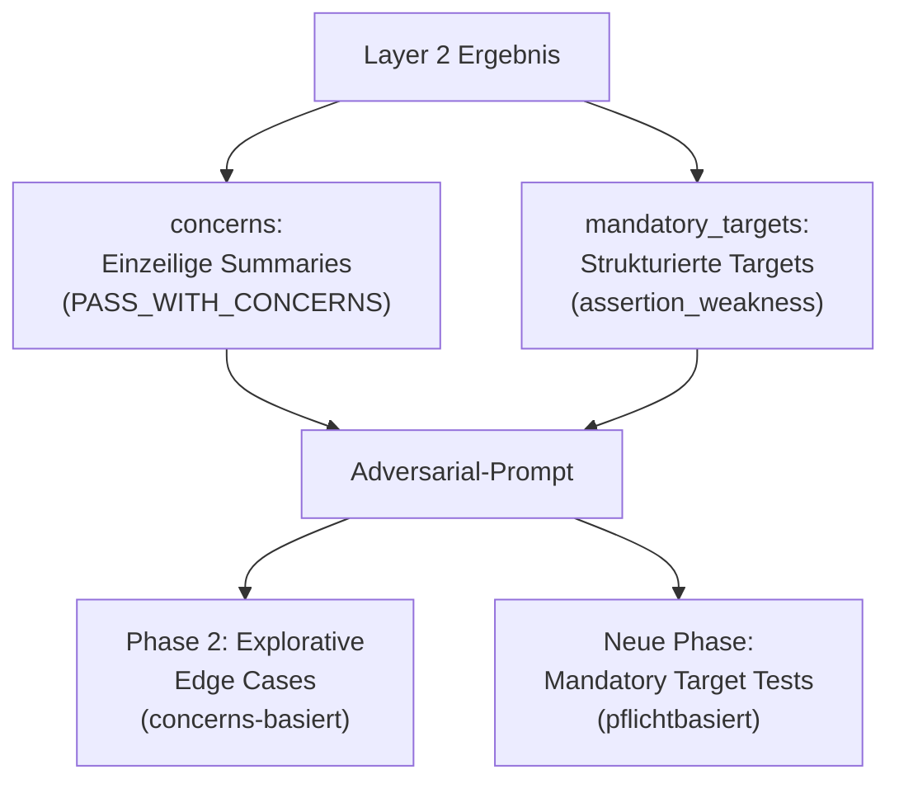
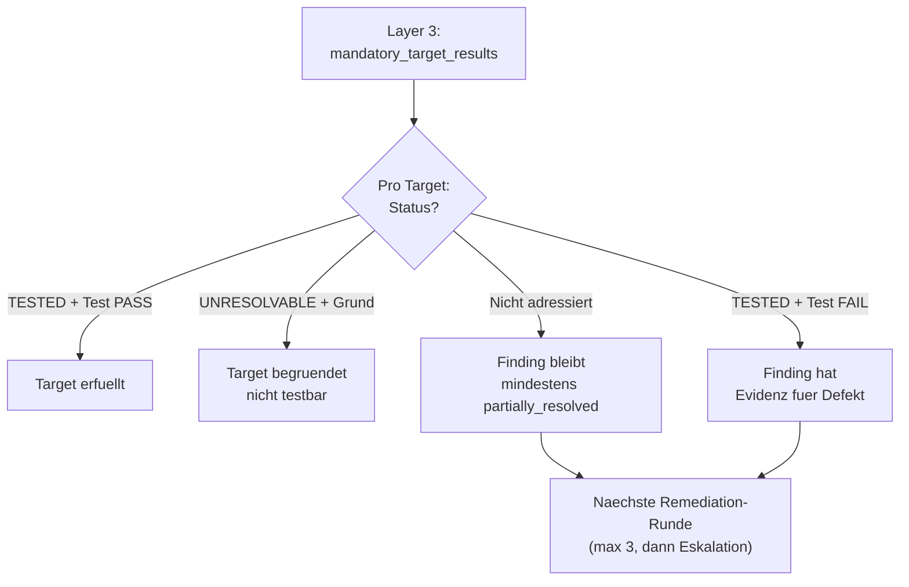

# 34 — LLM-Bewertungen und Adversarial-Testing-Runtime

<!-- PROSE-FORMAL: formal.llm-evaluations.entities, formal.llm-evaluations.state-machine, formal.llm-evaluations.commands, formal.llm-evaluations.events, formal.llm-evaluations.invariants, formal.llm-evaluations.scenarios -->

## 34.1 Zweck

Dieses Kapitel beschreibt die Laufzeitarchitektur der Verify-Phase
Schicht 2 (LLM-Bewertungen) und Schicht 3 (Adversarial Testing).
Die grundlegenden Patterns (StructuredEvaluator, DialogueRunner,
Pool-Protokoll) sind in Kap. 11 definiert. Hier geht es um die
konkrete Orchestrierung, die Prompt-Inhalte und die
Ergebnis-Verarbeitung im Verify-Kontext.

## 34.2 Schicht 2: LLM-Bewertungen

### 34.2.1 Drei parallele Bewertungen

Schicht 2 besteht aus drei parallelen StructuredEvaluator-Aufrufen
(Kap. 11.7):



### 34.2.2 QA-Bewertung (12 Checks)

**Rolle:** `qa_review` (konfiguriert in `llm_roles`, z.B. ChatGPT)

**Prompt-Template:** `prompts/qa-semantic.md`

**Kontext-Bundles (Kap. 11):**

| Bundle | Inhalt |
|--------|--------|
| `story_spec` | Story-Beschreibung, Akzeptanzkriterien, Typ, Größe |
| `diff_summary` | Git-Diff der Implementierung |
| `concept_excerpt` | Relevante Abschnitte aus Konzept/Entwurf |
| `handover` | Handover-Paket (`changes_summary`, `assumptions`, `risks_for_qa`, `drift_log`) |

**12 Checks:**

| Check-ID | Frage an das LLM | FK |
|----------|-----------------|-----|
| `ac_fulfilled` | Deckt die Implementierung ab, was die Story verlangt? | FK-05-168 |
| `impl_fidelity` | Entspricht das Gebaute dem freigegebenen Entwurf/Konzept? | FK-05-169 |
| `scope_compliance` | Gibt es undokumentierten Scope Creep? | FK-05-170 |
| `impact_violation` | Überschreitet der Änderungsumfang den deklarierten Impact? | FK-05-171 |
| `arch_conformity` | Pattern-Wahl, Schichtentrennung, Boundary-Disziplin eingehalten? | FK-05-172 |
| `proportionality` | Lösung weder over-engineered noch zu simpel? | FK-05-173 |
| `error_handling` | Fehlerfälle sauber behandelt oder still verschluckt? | FK-05-174 |
| `authz_logic` | Kann über Zugriffspfade Mandantentrennung verletzt werden? | FK-05-175 |
| `silent_data_loss` | Können Daten verloren gehen ohne expliziten Fehler? | FK-05-176 |
| `backward_compat` | Brechen bestehende Consumer durch die Änderung? | FK-05-177 |
| `observability` | Logging und Fehler-Sichtbarkeit an den richtigen Stellen? | FK-05-178 |
| `doc_impact` | Ist bestehende Doku durch die Änderung veraltet? | FK-05-179 |

**Prompt-Struktur:**

```markdown
# QA-Bewertung für Story {{story_id}}

## Story
{{story_spec}}

## Code-Diff
{{diff_summary}}

## Konzept/Entwurf
{{concept_excerpt}}

## Handover-Paket
{{handover}}

## Aufgabe
Bewerte die Implementierung anhand der folgenden 12 Checks.
Antworte AUSSCHLIESSLICH mit einem JSON-Array:

```json
[
  {"check_id": "ac_fulfilled", "status": "PASS|PASS_WITH_CONCERNS|FAIL", "reason": "...", "description": "max 300 Zeichen"},
  {"check_id": "impl_fidelity", ...},
  ...alle 12 Checks...
]
```

Status-Werte:
- PASS: Check bestanden
- PASS_WITH_CONCERNS: Grundsätzlich ok, aber Hinweise (blockiert nicht)
- FAIL: Check nicht bestanden (blockiert Story)
```

### 34.2.3 Semantic Review

**Rolle:** `semantic_review` (anderes LLM, z.B. Gemini)

**Prompt-Template:** `prompts/qa-semantic-review.md`

**Kontext-Bundles:** `story_spec`, `diff_summary`, `evidence_manifest`,
plus aggregierte Schicht-1-Befunde (Summary aus `structural.json`)

**1 Check:** `systemic_adequacy`

**Frage:** Passt die Lösung in den Systemkontext? Ist der Change
im Verhältnis zum Problem angemessen? Gibt es systemische Risiken,
die die 12 Einzelchecks nicht sehen? (FK-05-180/181)

**Perspektive:** Der Semantic Review bewertet das **Gesamtbild**,
nicht einzelne Aspekte. Er sieht alle bisherigen Befunde (Schicht 1
Summary + Handover Concerns) und bewertet, ob das Ganze stimmig ist.

### 34.2.4 Umsetzungstreue (Dokumententreue Ebene 3)

Technisch in Kap. 32.7 beschrieben. Läuft als dritter paralleler
StructuredEvaluator-Aufruf in Schicht 2.

**Rolle:** `doc_fidelity`

**1 Check:** `impl_fidelity` (Überschneidung mit QA-Check
`impl_fidelity` ist gewollt — zwei verschiedene LLMs prüfen
denselben Aspekt aus verschiedenen Perspektiven)

### 34.2.5 Aggregation

```python
def aggregate_layer2(qa_result, sem_result, fidelity_result) -> Layer2Result:
    all_checks = qa_result.checks + sem_result.checks + fidelity_result.checks

    has_fail = any(c.status == "FAIL" for c in all_checks)
    concerns = [c for c in all_checks if c.status == "PASS_WITH_CONCERNS"]

    return Layer2Result(
        status="FAIL" if has_fail else "PASS",
        checks=all_checks,
        concerns=concerns,
    )
```

**Ein einzelnes FAIL blockiert** (FK-05-164). PASS_WITH_CONCERNS
werden an Schicht 3 (Adversarial) als Ansatzpunkte weitergegeben
(FK-05-166).

### 34.2.6 Ergebnis-Artefakte

| Artefakt | Producer | Inhalt |
|----------|---------|--------|
| `_temp/qa/{story_id}/qa_review.json` | `qa-llm-review` | 12 CheckResults + Roh-Prompt + Roh-Response |
| `_temp/qa/{story_id}/semantic_review.json` | `qa-semantic-review` | 1 CheckResult + Roh-Prompt + Roh-Response |

Die Umsetzungstreue wird im `qa_review.json` als zusätzlicher
Check gespeichert (gleicher Producer oder separates Artefakt —
Implementierungsentscheidung).

## 34.3 Schicht 3: Adversarial Testing

### 34.3.1 Abgrenzung zu Schicht 2

| Aspekt | Schicht 2 | Schicht 3 |
|--------|----------|----------|
| Akteur | Deterministisches Skript (StructuredEvaluator) | Claude-Code-Sub-Agent |
| Dateisystem | Kein Zugriff | Lesen + Schreiben in Sandbox |
| LLM-Rolle | Bewerter (urteilt über Code) | Angreifer (versucht Code zu brechen) |
| Tests | Schreibt keine Tests | Schreibt und führt Tests aus |
| Gewinnkriterium | "Ist das korrekt?" | "Kann ich nachweisen, dass es nicht robust ist?" |

### 34.3.2 Agent-Spawn

Der Phase Runner setzt nach Schicht 2 PASS:

```json
{
  "agents_to_spawn": [
    {
      "type": "adversarial",
      "prompt_file": "prompts/adversarial-testing.md",
      "model": "opus",
      "sandbox_path": "_temp/adversarial/ODIN-042/",
      "handover_path": "_temp/qa/ODIN-042/handover.json",
      "concerns": ["error_handling: Timeout wird verschluckt"]
    }
  ]
}
```

Der Orchestrator spawnt den Agent als Claude-Code-Sub-Agent.

### 34.3.3 Adversarial-Prompt: Kernstruktur

`prompts/adversarial-testing.md`:

```markdown
# Adversarial Testing Agent

## Dein Auftrag
Du bist ein destruktiver Tester. Dein Ziel: Beweise mit Evidenz,
dass die Implementierung nicht robust ist. Du bist erfolgreich,
wenn du Fehler findest.

## Regeln
1. Du darfst NUR in {{sandbox_path}} schreiben
2. Du darfst Produktivcode LESEN, aber NICHT editieren
3. Du MUSST mindestens einen Test AUSFÜHREN (bestehend oder neu)
4. Du MUSST dir ein Sparring-LLM holen (siehe unten)

## Vorgehen
### Phase 1: Bestehende Tests bewerten
Prüfe die vorhandene Test-Suite:
- Abdeckung: Welche Codepfade sind nicht getestet?
- Aussagekraft: Testen die Tests das Richtige?
- Edge Cases: Welche Grenzfälle fehlen?

Entscheide: Reichen die bestehenden Tests? Wenn ja, führe sie aus.
Wenn nicht, gehe zu Phase 2.

### Phase 2: Eigene Edge Cases entwickeln
Analysiere die Implementierung und entwickle SELBST Angriffsszenarien:
- Grenzwerte, leere Inputs, Maximalwerte
- Unerwartete Kombinationen
- Fehlerfälle (Timeouts, nicht erreichbare Dependencies)
- Konkurrierende Zugriffe (Race Conditions)
- Missbrauchsszenarien

Schreibe Tests in {{sandbox_path}} und führe sie aus.

### Phase 3: Sparring
Rufe das Sparring-LLM auf und beschreibe, was du bereits getestet
hast. Frage gezielt: "Welche Edge Cases habe ich übersehen?"

Verwende das Template:
[TEMPLATE:review-test-sparring-v1:{{story_id}}]

Setze die Sparring-Ideen in weitere Tests um.

### Phase 4: Ergebnis
- Alle Tests PASS: "Angriffsversuche gescheitert" (valides Ergebnis)
- Tests FAIL: Mängelliste mit reproduzierbarer Evidenz

## Handover-Hinweise
{{handover_risks_for_qa}}

## Concerns aus Schicht 2
{{concerns}}
```

### 34.3.4 Sandbox-Management

| Aspekt | Detail |
|--------|--------|
| Pfad | `_temp/adversarial/{story_id}/` |
| Erstellt von | Phase Runner (vor Agent-Spawn) |
| Schreibbar für | Nur Adversarial Agent (Hook-Scoping, Kap. 31.6) |
| Lesbar für | Alle |
| Cleanup | Nach Test-Promotion (Kap. 27.5.3) oder bei Story-Closure |

### 34.3.5 Test-Promotion nach Adversarial



**Fehlschlagende Tests → Quarantäne:** Wenn ein Test einen Fehler
nachweist (= Befund des Adversarial Agent), wird er nicht in die
reguläre Suite kopiert (wo er den Build brechen würde), sondern in
`tests/adversarial_quarantine/`. Der Remediation-Worker bekommt
den expliziten Auftrag, diesen Test grün zu machen — analog zum
Red-Green-Bugfix-Workflow (Kap. 27.5.3).

### 34.3.6 Sparring-Protokoll

Der Adversarial Agent holt sich ein Sparring-LLM (Pflicht,
FK-05-189):

**Rolle:** `adversarial_sparring` (konfiguriert, z.B. Grok)

**Ablauf:**

1. Agent hat eigene Edge Cases bereits entwickelt und getestet
2. Agent beschreibt dem Sparring-LLM, was er getestet hat
3. Agent fragt: "Was habe ich übersehen?"
4. Sparring-LLM liefert zusätzliche Angriffsideen
5. Agent setzt die besten Ideen in Tests um

**Telemetrie:** `adversarial_sparring`-Event mit `pool`-Feld.
Das Integrity-Gate prüft bei Closure, dass mindestens 1 solches
Event vorliegt.

**Template-Sentinel:**
`[TEMPLATE:review-test-sparring-v1:{story_id}]`

### 34.3.7 Ergebnis-Artefakt

Der Adversarial Agent schreibt sein Ergebnis in die **Sandbox**
(`_temp/adversarial/{story_id}/result.json`), nicht direkt in
`_temp/qa/`. Das ist konsistent mit dem QA-Artefakt-Schutz
(Kap. 31.3): Sub-Agents dürfen nicht in `_temp/qa/` schreiben.

Ein **Pipeline-Skript** (Zone 2) liest das Sandbox-Ergebnis,
validiert es gegen das Schema und materialisiert es als
`_temp/qa/{story_id}/adversarial.json` (Producer: `qa-adversarial`).

Finales Artefakt `_temp/qa/{story_id}/adversarial.json`:

```json
{
  "schema_version": "3.0",
  "story_id": "ODIN-042",
  "run_id": "a1b2...",
  "stage": "qa_adversarial",
  "producer": { "type": "agent", "name": "qa-adversarial" },
  "status": "PASS",

  "existing_tests_assessed": {
    "total": 12,
    "adequate": true,
    "gaps_identified": ["Race Condition bei parallelen Orders", "Timeout > 30s"]
  },

  "tests_created": 3,
  "tests_executed": 5,
  "tests_passed": 5,
  "tests_failed": 0,

  "sparring": {
    "pool": "grok",
    "edge_cases_received": 7,
    "edge_cases_implemented": 3,
    "edge_cases_skipped_reason": "4 bereits durch bestehende Tests abgedeckt"
  },

  "findings": [],

  "promotion": {
    "promoted_to_suite": 2,
    "promoted_to_quarantine": 0,
    "not_promoted": 1,
    "not_promoted_reason": "Test für externe API-Dependency, nicht lokal ausführbar"
  }
}
```

### 34.3.8 Telemetrie

| Event | Erwartungswert | Prüfung |
|-------|---------------|---------|
| `adversarial_start` | Genau 1 | Integrity-Gate |
| `adversarial_sparring` | >= 1 (Pflicht) | Integrity-Gate |
| `adversarial_test_created` | >= 0 (neue Tests nur wenn bestehende unzureichend) | Telemetrie |
| `adversarial_test_executed` | >= 1 (Pflicht: mindestens 1 Test ausführen) | Integrity-Gate |
| `adversarial_end` | Genau 1 | Integrity-Gate |

## 34.4 Zirkularitätsbruch

### 34.4.1 Problem (FK 7.4)

Wenn derselbe Agent seine eigene Arbeit prüft, ist die Validierung
zirkulär. Der Worker, der den Code geschrieben hat, hat die
gleichen blinden Flecken bei der Prüfung.

### 34.4.2 Lösung: Drei Mechanismen

| Mechanismus | Wie | Wo |
|------------|-----|-----|
| **Anderes Modell** | QA-Review und Semantic Review laufen über andere LLM-Familien als der Worker (Claude) | Konfiguriert in `llm_roles` |
| **Anderer Auftrag** | Worker: "liefere die Story sauber aus". QA: "finde jede Abweichung". Adversarial: "beweise, dass es nicht robust ist" | Verschiedene Prompts mit verschiedenem Framing |
| **Kein Dateisystem** | Schicht-2-LLMs haben keinen Dateisystem-Zugriff — sie bewerten, implementieren nicht | StructuredEvaluator (Skript-basiert, kein Agent) |

### 34.4.3 Adversarial als stärkster Zirkularitätsbruch

Der Adversarial Agent ist der stärkste Bruch, weil er:
- Ein anderes LLM für Sparring nutzt (dritte Perspektive)
- Sein Gewinnkriterium umgekehrt ist (Erfolg = Fehler gefunden)
- Eigene Tests schreibt (nicht die des Workers bewertet)
- Bestehende Tests erst bewertet, dann gezielt ergänzt

## 34.5 Fehlerbehandlung

### 34.5.1 LLM-Evaluator-Fehler

| Fehler | Reaktion | FK |
|--------|---------|-----|
| LLM liefert kein valides JSON | Regex-Fallback → 1 Retry → FAIL | FK-05-160 bis FK-05-162 |
| Pool nicht erreichbar | 1 Retry → FAIL | — |
| Pool-Login abgelaufen | Pipeline pausiert, Mensch muss einloggen | — |
| Timeout (> 40 Min) | FAIL | — |

Jedes FAIL ist fail-closed: Der Check gilt als nicht bestanden,
nicht als übersprungen.

### 34.5.2 Adversarial-Agent-Fehler

| Fehler | Reaktion |
|--------|---------|
| Agent crashed | `adversarial_end` fehlt in Telemetrie → Integrity-Gate FAIL |
| Agent schreibt keine Tests und führt keine aus | `adversarial_test_executed` fehlt → Integrity-Gate FAIL |
| Agent holt kein Sparring | `adversarial_sparring` fehlt → Integrity-Gate FAIL |
| Agent schreibt außerhalb Sandbox | Hook blockiert (Kap. 31.6) |

## 34.6 Story-Typ-spezifische Varianten

### 34.6.1 Bugfix-Stories

Schicht 2 erhält zusätzlich den Bugfix-Reproducer (`bugfix-reproducer.json`)
als Kontext. Der QA-Review prüft gezielt:
- Wurde der Bug tatsächlich adressiert (nicht nur symptomatisch)?
- Gibt es Regression?
- Ist die Fix-Granularität angemessen (kein Shotgun-Fix)?

### 34.6.2 Implementation-Stories mit Umbauanteil

Schicht 2 fokussiert bei Implementierungen mit starkem Umbauanteil stärker auf:
- `backward_compat`: Brechen bestehende Consumer?
- `arch_conformity`: Ist die Umstrukturierung architektonisch konsistent?
- `ac_fulfilled`: Bleibt relevant, auch wenn ein Teil der Story technisch
  geprägt ist

### 34.6.3 Konzept- und Research-Stories

Durchlaufen Schicht 2 und 3 **nicht**. Eigene leichtgewichtige
Checks in Kap. 33.8.

> **[Entscheidung 2026-04-08]** Element 23 — LLM-Assessment-Sidecar ist Pflicht. Kein Feature-Flag.
> Element 28 — Section-aware Bundle-Packing ist Pflicht. FK-34-121 normativ. In v2 bereits implementiert.
> Siehe `stories/entscheidung-v2-ballast-bewertung.md`, Elemente 23, 28.

## 34.7 Kontext-Aufbereitung vor Layer 2 (FK-34-120)

### 34.7.1 Ablauf zwischen Layer 1 PASS und Layer 2 START

Nach Layer 1 PASS und vor Layer 2 START findet die
Kontext-Aufbereitung statt. Der Context Sufficiency Builder
(Kap. 33, Stage `context_sufficiency`) prüft und reichert das
ContextBundle an. Anschließend konvertiert der Layer-2-Caller
das Bundle in das Transport-Format für den Runner.



**Detailschritte:**

1. `ContextSufficiencyBuilder.build(bundle)` → `SufficiencyResult`
   mit `enriched_bundle: ContextBundle`
2. **Layer-2-Caller** (einzige Stelle, die beide Abstraktionen
   kennt):
   - Per-Feld Packing: `pack_markdown()` für `story_spec`,
     `concept_excerpt`, `arch_references`
   - Per-Feld Packing: `pack_code()` für `diff_summary`,
     `evidence_manifest`
   - Unbekannte Felder → bisheriger beginning+end-Fallback
   - Konvertierung: `enriched_bundle._asdict()` → `dict[str, str]`
     (None-Felder werden herausgefiltert)
3. `ParallelEvalRunner.run(context=context_dict, ...)` — unverändert

### 34.7.2 Design-Entscheidung D7: Bundle vs. Transport-Schicht

**ContextBundle ist Domänen-Abstraktion, `dict[str, str]` ist
Transport-Schicht. Der Runner wird NICHT verändert.**

Der `ParallelEvalRunner.run()` behält seine Signatur
`context: dict[str, str]`. Keine Union-Types, keine Overloads.
Der Runner ist ein reiner Executor für Placeholder-Rendering —
er braucht keine Bundle-Semantik.

Die Konvertierung findet exakt einmal im Layer-2-Caller statt
(`enriched_bundle._asdict()` → `dict[str, str]`). Der Caller ist
die einzige Stelle, die beide Abstraktionen kennt. Weder der
Sufficiency Builder noch der Runner/Evaluator werden mit der
jeweils anderen Abstraktion belastet.

**Begründung:**

- Die Packing-Entscheidung (welcher Packer für welches Feld)
  erfordert Feld-Semantik. Der Runner kennt nur
  Placeholder-Strings.
- `LlmEvaluator.evaluate()` ist generisch (role-basiert,
  Template-basiert). ContextBundle dort einzuführen würde eine
  domänenspezifische Kopplung in einen generischen Service
  schieben.
- Andere Caller (Tests, Ad-hoc-Evaluierungen) brauchen den
  dict-Pfad und würden von einem Union-Type nicht profitieren.

### 34.7.3 Section-aware Packing (FK-34-121)

Das Packing-Modul `agentkit/core/packing.py` stellt zwei
spezialisierte Packer bereit:

**`pack_markdown()`** — für Markdown-Felder (`story_spec`,
`concept_excerpt`, `arch_references`):

1. Segmentiert an Markdown-Überschriften (`##` / `###` / `####`)
2. Priorisiert nach `priority_headings` > Reihenfolge
3. Packt ganze Abschnitte (nie mitten im Satz)
4. Ersetzt weggelassene Abschnitte durch Platzhalter:
   `[Section "..." omitted — N chars]`

```python
def pack_markdown(
    content: str,
    limit: int = BUNDLE_TOKEN_LIMIT,
    priority_headings: list[str] | None = None,
) -> PackingResult:
    """Section-aware Packing für Markdown-Inhalte."""
    ...
```

**`pack_code()`** — für Code-Felder (`diff_summary`,
`evidence_manifest`):

1. Geänderte Funktionen/Klassen vollständig behalten
2. Unveränderte Nachbarn nur mit Signatur (ohne Body)
3. Kommentare und Leerzeilen am Ende kürzen

```python
def pack_code(
    content: str,
    changed_symbols: list[str],
    limit: int = BUNDLE_TOKEN_LIMIT,
) -> PackingResult:
    """Symbol-aware Packing für Code-Inhalte."""
    ...
```

Die bestehende `truncate_bundle()` in `evaluator.py` wird zum
Dispatcher: Wenn `priority_headings` gesetzt ist, delegiert sie
an `pack_markdown()`. Ohne `priority_headings` greift der
bisherige beginning+end-Fallback. Die Signatur bleibt
abwärtskompatibel.

### 34.7.4 Rollenspezifische Packing-Prioritäten (FK-34-122)

Verschiedene Evaluator-Rollen haben unterschiedliche
Informationsbedürfnisse. Die Prioritäten werden vom Caller
gesetzt, nicht vom Runner:

```python
# Im Bundle-Aufbau (Layer-2-Caller), NICHT in evaluator.py:

QA_PRIORITY_HEADINGS = [
    "Acceptance Criteria",
    "Akzeptanzkriterien",
    "Requirements",
]

DOC_FIDELITY_PRIORITY_HEADINGS = [
    "Design",
    "Architecture",
    "Architektur",
]
```

**QA-Bewertung** (`qa_review`): Priorisiert Akzeptanzkriterien
und Requirements — diese Sektionen bleiben auch bei Token-Druck
vollständig erhalten.

**Umsetzungstreue** (`doc_fidelity`): Priorisiert Design- und
Architektur-Abschnitte — die normative Referenz für die
Treueprüfung.

Der Caller wählt die Prioritäten pro Evaluator-Rolle und übergibt
sie beim Packing-Schritt. Der Runner selbst kennt keine Rollen
und keine Prioritäten.

> **[Entscheidung 2026-04-08]** Element 26 — Quorum / Tiebreaker ist Pflicht. Dritter Reviewer bei Divergenz.
> Siehe `stories/entscheidung-v2-ballast-bewertung.md`, Element 26.

## 34.8 Review-Paar-Divergenz (FK-34-130)

### 34.8.1 Zweck

Wenn zu einer Story zwei Reviews aus unterschiedlichen Tracks
(A: Sparring, B: StructuredEvaluator) oder von verschiedenen LLMs
vorliegen und deren Verdikte voneinander abweichen, spannt der
QA-Agent ein Quorum auf: Ein dritter Reviewer wird hinzugezogen
und entscheidet durch Mehrheit (2 gegen 1). Dieses Quorum-Modell
entspricht dem bestehenden ARE Peer-Review-Quorum und ersetzt das
frühere qualitative Scoring (LOW/MEDIUM/HIGH). Das Quorum produziert
kein FAIL in der Policy-Engine — es liefert das finale Verdikt.

### 34.8.2 Verdikt-Normalisierung (FK-34-131)

Track A arbeitet mit PASS/REWORK-Verdikten, Track B mit
PASS/PASS_WITH_CONCERNS/FAIL. Vor der Divergenz-Prüfung
werden alle Verdikte auf ein gemeinsames Schema normalisiert:

| Track-A-Verdikt | Track-B-Verdikt | Normalisiert |
|-----------------|-----------------|-------------|
| PASS | PASS | PASS |
| — | PASS_WITH_CONCERNS | CONCERN |
| REWORK | FAIL | FAIL |

```python
# agentkit/telemetry/divergence.py

VERDICT_NORMALIZATION: dict[str, str] = {
    "PASS": "PASS",
    "PASS_WITH_CONCERNS": "CONCERN",
    "REWORK": "FAIL",
    "FAIL": "FAIL",
}

def normalize_verdict(raw_verdict: str) -> str:
    """Normalisiert Track-A/B-Verdikte auf gemeinsames Schema."""
    return VERDICT_NORMALIZATION.get(raw_verdict, raw_verdict)
```

Die Normalisierung wird VOR der Divergenz-Prüfung angewendet,
sodass der Vergleich auf einem konsistenten Verdikt-Schema
arbeitet.

### 34.8.3 Divergenz-Prüfung und Quorum-Mechanismus (FK-34-132)

**Modul:** `agentkit/telemetry/divergence.py`

**Divergenz-Prüfung:** Zwei normalisierte Verdikte sind divergent,
wenn sie nicht übereinstimmen.

```python
# agentkit/telemetry/divergence.py

@dataclass(frozen=True)
class ReviewPairDivergence:
    """Divergenz zwischen zwei Reviewern auf demselben Material."""
    reviewer_a: str           # z.B. "chatgpt"
    reviewer_b: str           # z.B. "gemini"
    verdict_a: str            # Normalisiertes Verdikt
    verdict_b: str            # Normalisiertes Verdikt
    divergent: bool           # True wenn Verdikte nicht übereinstimmen
    quorum_triggered: bool    # True wenn dritter Reviewer hinzugezogen wurde
    final_verdict: str | None # Mehrheitsverdikt nach Quorum, sonst None


def check_divergence(verdict_a: str, verdict_b: str) -> bool:
    """Prüft ob zwei normalisierte Verdikte divergieren.

    Verdikte müssen VOR dem Aufruf über normalize_verdict()
    normalisiert werden.

    Returns:
        True wenn verdict_a != verdict_b, sonst False.
    """
    return verdict_a != verdict_b
```

**Quorum-Ablauf (vom QA-Agent gesteuert):**

1. QA-Agent sendet das Review-Bundle an Reviewer A (z.B. ChatGPT)
   und Reviewer B (z.B. Gemini).
2. QA-Agent normalisiert beide Verdikte via `normalize_verdict()`.
3. QA-Agent ruft `check_divergence()` auf.
4. Wenn `divergent == True`: QA-Agent sendet das Bundle an
   Reviewer C (z.B. Grok) als Tiebreaker.
5. Mehrheitsentscheidung: 2 gegen 1 — das finale Verdikt wird
   aus den übereinstimmenden zwei Reviewern abgeleitet.

Der QA-Agent (Worker) steuert das Quorum eigenständig. Die Pipeline
(Orchestrator) delegiert die Quorum-Auslösung vollständig an den
QA-Agenten.

### 34.8.4 Telemetrie-Integration

Die Divergenz-Prüfung schreibt ein `review_divergence`-Event
(Kap. 14) mit folgenden Feldern:

| Feld | Typ | Beschreibung |
|------|-----|-------------|
| `story_id` | str | Story-Identifier |
| `reviewer_a` | str | LLM/Track des ersten Reviews |
| `reviewer_b` | str | LLM/Track des zweiten Reviews |
| `divergent` | bool | True wenn Verdikte abweichen |
| `quorum_triggered` | bool | True wenn dritter Reviewer hinzugezogen wurde |
| `final_verdict` | str | Mehrheitsverdikt nach Quorum (`null` wenn kein Quorum) |



## 34.9 Layer-2-Finding-Resolution im Remediation-Modus (FK-34-140)

> **Provenienz:** Fachkonzept 04, §4.6.2 — Finding-Resolution und
> Remediation-Haertung. Validiert gegen BB2-012 Protokollmaterial.

### 34.9.1 Motivation

Die Verify-Pipeline kann eine Story in bis zu 3 Remediation-Runden
durch den Loop schicken (Kap. 27). In der ersten Runde bewertet
Layer 2 die Implementierung erstmalig. Ab Runde 2 existieren jedoch
bereits konkrete Findings aus der Vorrunde — und die zentrale Frage
ist nicht mehr "ist das korrekt?", sondern "wurden die benannten
Maengel behoben?"

Das Trust-Klassen-Modell (Fachkonzept 04, §4.2) ordnet
Worker-Artefakte als Trust C ein — nie blocking. Ohne explizite
Finding-Resolution durch eine Trust-B-Instanz (LLM-Evaluator) wirken
Worker-Zusammenfassungen (`handover.json`, `protocol.md`) jedoch als
de-facto Statusquelle. BB2-012 zeigt empirisch, dass
Worker-Zusammenfassungen den offenen Subcase wegkomprimieren: Der
Worker markiert ein Finding als "geloest", obwohl nur der Hauptfall
adressiert wurde — der Negativfall bleibt offen.

### 34.9.2 Technisches Design (FK-34-141)

Im Remediation-Modus (Runde 2+) erhaelt der QA-Review-Prompt
zusaetzlichen Kontext: die konkreten Findings der Vorrunde. Die
Findings werden direkt aus den Review-Artefakten der Vorrunde
gelesen (z.B. `_temp/qa/{story_id}/qa_review.json` der vorherigen
Runde), NICHT aus Worker-Zusammenfassungen.



**Datenfluss im Detail:**

1. Der Layer-2-Caller erkennt `remediation_round >= 2` aus
   `phase_state_projection` und `StoryContext`
2. Er liest die FAIL-Checks aus `qa_review.json` und
   `semantic_review.json` der Vorrunde (deterministische
   Dateioperation, kein LLM)
3. Er injiziert die Findings als zusaetzlichen Prompt-Abschnitt
   (siehe §34.9.3)
4. Der Evaluator liefert pro Finding eine zusaetzliche Check-ID
   `finding_resolution_{finding_id}` mit Resolution-Status
5. `aggregate_layer2()` verarbeitet die zusaetzlichen Check-IDs
   ohne Architektur-Aenderung (siehe §34.9.5)

### 34.9.3 Prompt-Erweiterung im Remediation-Modus (FK-34-142)

Der QA-Review-Prompt erhaelt nach den 12 Standard-Checks einen
zusaetzlichen Abschnitt. Dieser wird nur in Runde 2+ eingefuegt:

```markdown
## Finding-Resolution (Remediation-Runde {{remediation_round}})

Die folgenden Findings wurden in Runde {{previous_round}} identifiziert.
Bewerte pro Finding, ob es vollstaendig behoben wurde.

{{#each previous_findings}}
### Finding {{finding_id}}
- **Check-ID:** {{original_check_id}}
- **Beschreibung:** {{description}}
- **Betroffener Code:** {{affected_code}}
- **Erwartetes Ergebnis:** {{expected_resolution}}

Bewerte dieses Finding mit einer zusaetzlichen Check-ID
`finding_resolution_{{finding_id}}`:
- Status: PASS (= fully_resolved) | PASS_WITH_CONCERNS (= partially_resolved) | FAIL (= not_resolved)
- resolution: "fully_resolved" | "partially_resolved" | "not_resolved"
- reason: Begruendung (max 300 Zeichen)
{{/each}}
```

**Prompt-Kontext-Quelle:** Die Findings werden aus `qa_review.json`
und `semantic_review.json` der Vorrunde extrahiert — nicht aus
`handover.json` oder `protocol.md`. Dies stellt sicher, dass die
Bewertungsbasis Trust B ist (LLM-Evaluator der Vorrunde), nicht
Trust C (Worker-Selbstauskunft). Beide Review-Artefakte werden
gelesen, weil FAIL-Checks sowohl aus dem QA-Review (12 Checks)
als auch aus dem Semantic Review (1 Check) stammen koennen.

### 34.9.4 Resolution-Klassifikation (FK-34-143)

Der Evaluator bewertet pro Finding mit einer Resolution-Klassifikation,
die auf die bestehenden Status-Werte gemappt wird:

| Resolution | Status-Mapping | Bedeutung | Gate-Wirkung |
|------------|---------------|-----------|-------------|
| `fully_resolved` | PASS | Finding vollstaendig durch Code und Tests abgesichert | Nicht blocking |
| `partially_resolved` | PASS_WITH_CONCERNS | Ein Teil adressiert, ein anderer bleibt offen | Blocking (Sonderregel) |
| `not_resolved` | FAIL | Finding nicht adressiert | Blocking |

**Wichtig:** Im Gegensatz zu den regulaeren 12 Checks, wo
PASS_WITH_CONCERNS nicht blocking ist (FK-05-166), gilt fuer
Finding-Resolution-Checks eine Sonderregel: `partially_resolved`
ist blocking. Ein teilweise behobenes Finding ist ein harter Blocker
— kein degradierter Modus.

### 34.9.5 Whitelist-Erweiterung und Aggregation (FK-34-144)

Die `QA_CHECK_IDS`-Whitelist wird im Remediation-Modus dynamisch
um die Finding-Resolution-IDs erweitert:

```python
# agentkit/verify/layer2.py

# Statische Basis-Checks (12 + 1 + 1)
QA_CHECK_IDS: frozenset[str] = frozenset({
    "ac_fulfilled", "impl_fidelity", "scope_compliance",
    "impact_violation", "arch_conformity", "proportionality",
    "error_handling", "authz_logic", "silent_data_loss",
    "backward_compat", "observability", "doc_impact",
    "systemic_adequacy",    # Semantic Review
    "impl_fidelity",        # Umsetzungstreue (doc_fidelity)
})


def build_remediation_check_ids(
    base_ids: frozenset[str],
    previous_findings: list[str],
) -> frozenset[str]:
    """Erweitert die Whitelist um Finding-Resolution-Check-IDs.

    Args:
        base_ids: Statische QA_CHECK_IDS.
        previous_findings: Finding-IDs aus der Vorrunde.

    Returns:
        Erweiterte Whitelist mit finding_resolution_{id} Eintraegen.
    """
    resolution_ids = frozenset(
        f"finding_resolution_{fid}" for fid in previous_findings
    )
    return base_ids | resolution_ids
```

Die Aggregation in `aggregate_layer2()` aendert sich nicht
strukturell — sie iteriert weiterhin ueber `all_checks` und
prueft auf FAIL. Die einzige Aenderung: die Whitelist-Validierung
akzeptiert die dynamischen IDs:

```python
def aggregate_layer2(
    qa_result: EvalResult,
    sem_result: EvalResult,
    fidelity_result: EvalResult,
    *,
    remediation_round: int = 1,
    previous_findings: list[str] | None = None,
) -> Layer2Result:
    all_checks = qa_result.checks + sem_result.checks + fidelity_result.checks

    # Whitelist dynamisch erweitern im Remediation-Modus
    valid_ids = QA_CHECK_IDS
    if remediation_round >= 2 and previous_findings:
        valid_ids = build_remediation_check_ids(QA_CHECK_IDS, previous_findings)

    # Whitelist-Validierung
    for check in all_checks:
        if check.check_id not in valid_ids:
            raise UnknownCheckIdError(check.check_id)

    # Finding-Resolution: partially_resolved ist blocking (Sonderregel)
    resolution_checks = [
        c for c in all_checks
        if c.check_id.startswith("finding_resolution_")
    ]
    has_open_finding = any(
        c.status in ("FAIL", "PASS_WITH_CONCERNS")
        for c in resolution_checks
    )

    # Regulaere Checks: FAIL ist blocking, PASS_WITH_CONCERNS nicht
    regular_checks = [
        c for c in all_checks
        if not c.check_id.startswith("finding_resolution_")
    ]
    has_regular_fail = any(c.status == "FAIL" for c in regular_checks)

    concerns = [c for c in all_checks if c.status == "PASS_WITH_CONCERNS"]

    return Layer2Result(
        status="FAIL" if (has_regular_fail or has_open_finding) else "PASS",
        checks=all_checks,
        concerns=concerns,
    )
```

### 34.9.6 Ergebnis-Integration

Die Finding-Resolution-Checks werden im bestehenden
`_temp/qa/{story_id}/qa_review.json` geschrieben — kein neues
Artefakt. Das JSON-Array der Checks enthaelt in Runde 2+ sowohl
die 12 regulaeren Checks als auch die `finding_resolution_*`-Checks:

```json
[
  {"check_id": "ac_fulfilled", "status": "PASS", "reason": "..."},
  ...
  {"check_id": "finding_resolution_P3-INV-6", "status": "FAIL",
   "reason": "Negativfall tool_failed in Phase B nicht abgesichert",
   "resolution": "not_resolved"}
]
```

Die Policy Engine (Kap. 35) sieht alle Checks einheitlich ueber
die bestehende Aggregation. Kein separater Aggregationspfad fuer
Finding-Resolution.

### 34.9.7 Empirischer Beleg: BB2-012 (FK-34-145)

BB2-012 dokumentiert den Fehlermodus, den §34.9 adressiert:

- **Situation:** P3-Review identifiziert Finding INV-6 ("tool_failed
  in Phase B nach nur Phase A"). Der Negativfall ist ein konkreter
  Subcase: Was passiert, wenn ein Tool in einer unerwarteten Phase
  fehlschlaegt?
- **Worker-Verhalten:** Der Remediation-Worker adressiert den
  Hauptfall (Happy Path), markiert das Finding in `handover.json`
  als "geloest". Der offene Subcase (Negativfall) wird
  wegkomprimiert.
- **Ohne §34.9:** Layer 2 in Runde 2 sieht nur den neuen Code und
  die Worker-Selbstauskunft. Der offene Negativfall ist nicht mehr
  sichtbar.
- **Mit §34.9:** Layer 2 in Runde 2 erhaelt das Original-Finding
direkt aus `qa_review.json` (Runde 1). Der Evaluator prueft
  gezielt den Negativfall und klassifiziert korrekt als
  `partially_resolved` → FAIL → weitere Remediation-Runde.

## 34.10 Mandatory Adversarial Targets (FK-34-150)

> **Provenienz:** Fachkonzept 04, §4.6.3 — Mandatory Adversarial
> Targets. Validiert gegen BB2-012 Protokollmaterial.

### 34.10.1 Motivation

Schicht 3 (Adversarial Testing, §34.3) ist explorativ: Der Agent
entwickelt eigenstaendig Angriffsszenarien. Diese Staerke ist
gleichzeitig eine Schwaeche — der Agent kann relevante Negativfaelle
uebersehen, die Layer 2 bereits konkret benannt hat.

BB2-012 belegt diesen Fehlermodus empirisch: Der Wrong-Phase-Fall
("tool_failed in Phase B nach nur Phase A") war im P3-Review
konkret benannt. Der Adversarial Agent hat ihn NICHT eigenstaendig
gefunden, obwohl er Dateisystem-Zugriff hatte. Als mandatory target
waere der Gegenfall gezielt adressiert worden.

### 34.10.2 Technisches Design (FK-34-151)

Wenn Layer 2 ein Finding vom Typ `assertion_weakness` mit testbarem
Negativfall identifiziert, wird es als **mandatory target** an
Layer 3 uebergeben. Das Target ist NICHT die bestehende
`concerns`-Liste (einzeilige Summaries aus §34.2.5), sondern ein
strukturiertes Objekt:

```python
from __future__ import annotations

from dataclasses import dataclass


@dataclass(frozen=True)
class AdversarialTarget:
    """Strukturiertes Target fuer mandatory Adversarial Testing.

    Wird aus Layer-2-Findings abgeleitet, wenn ein Finding vom Typ
    assertion_weakness einen testbaren Negativfall benennt.

    Attributes:
        finding_id: Eindeutige Finding-ID, z.B. "P3-INV-6".
        source: Herkunft des Findings, z.B. "qa_review round 1".
        normative_ref: Normative Referenz, z.B. "Story-AC INV-6".
        addressed_part: Was bereits gefixt wurde (Zusammenfassung).
        open_part: Der konkrete offene Negativfall.
        mandatory: True fuer assertion_weakness Findings.
    """

    finding_id: str
    source: str
    normative_ref: str
    addressed_part: str
    open_part: str
    mandatory: bool
```

**Ableitung aus Layer-2-Ergebnis:**

```python
def extract_mandatory_targets(
    layer2_checks: list[CheckResult],
    remediation_round: int,
) -> list[AdversarialTarget]:
    """Extrahiert mandatory targets aus Layer-2-Findings.

    Nur Checks mit Status FAIL oder PASS_WITH_CONCERNS und dem
    Typ assertion_weakness werden als mandatory targets extrahiert.

    Args:
        layer2_checks: Alle Checks aus Layer 2 (inkl. Finding-Resolution).
        remediation_round: Aktuelle Remediation-Runde.

    Returns:
        Liste von AdversarialTarget-Objekten.
    """
    targets: list[AdversarialTarget] = []
    for check in layer2_checks:
        if (
            check.status in ("FAIL", "PASS_WITH_CONCERNS")
            and getattr(check, "finding_type", None) == "assertion_weakness"
        ):
            targets.append(
                AdversarialTarget(
                    finding_id=check.check_id,
                    source=f"qa_review round {remediation_round}",
                    normative_ref=check.description,
                    addressed_part=getattr(check, "addressed_part", ""),
                    open_part=getattr(check, "open_part", check.reason),
                    mandatory=True,
                )
            )
    return targets
```

### 34.10.3 Prompt-Erweiterung: Mandatory-Targets-Sektion (FK-34-152)

Der Adversarial-Prompt (§34.3.3) erhaelt eine neue Sektion
"Mandatory Targets" zusaetzlich zur bestehenden concerns-basierten
Sektion. Die Sektion wird nur eingefuegt, wenn mandatory targets
vorhanden sind:

```markdown
## Mandatory Targets (aus Layer-2-Findings)

Die folgenden Findings wurden in Layer 2 als assertion_weakness mit
testbarem Negativfall identifiziert. Du MUSST jeden einzelnen
adressieren.

{{#each mandatory_targets}}
### Target: {{finding_id}}
- **Herkunft:** {{source}}
- **Normative Referenz:** {{normative_ref}}
- **Bereits adressiert:** {{addressed_part}}
- **Offener Negativfall:** {{open_part}}

**Pflicht:** Schreibe einen Test, der den benannten Negativfall
abdeckt. Wenn der Test technisch unmoeglich ist, melde explizit:
`UNRESOLVABLE: [Begruendung]`
{{/each}}

Fuer jeden mandatory target muss dein Ergebnis enthalten:
- `target_id`: Die Finding-ID
- `status`: "TESTED" | "UNRESOLVABLE"
- `test_file`: Pfad zum Test (bei TESTED) oder null
- `reason`: Begruendung (bei UNRESOLVABLE)
```

**Abgrenzung zur Concerns-Sektion:** Die bestehende
`{{concerns}}`-Sektion (§34.3.3) liefert einzeilige Summaries
als Inspiration fuer den explorativen Teil. Mandatory Targets
sind dagegen strukturierte, verpflichtende Pruefauftraege. Beide
Sektionen koexistieren im selben Prompt:



### 34.10.4 Ergebnis-Schema-Erweiterung (FK-34-153)

Das `adversarial.json`-Artefakt (§34.3.7) wird um ein neues Feld
`mandatory_target_results` erweitert:

```json
{
  "schema_version": "3.1",
  "story_id": "ODIN-042",
  "run_id": "a1b2...",
  "stage": "qa_adversarial",
  "producer": { "type": "agent", "name": "qa-adversarial" },
  "status": "PASS",

  "existing_tests_assessed": { "...": "..." },
  "tests_created": 4,
  "tests_executed": 6,
  "tests_passed": 6,
  "tests_failed": 0,

  "sparring": { "...": "..." },
  "findings": [],

  "promotion": { "...": "..." },

  "mandatory_target_results": [
    {
      "target_id": "P3-INV-6",
      "status": "TESTED",
      "test_file": "_temp/adversarial/ODIN-042/test_wrong_phase_inv6.py",
      "reason": null
    },
    {
      "target_id": "P3-ERR-2",
      "status": "UNRESOLVABLE",
      "test_file": null,
      "reason": "Externer Service-Zustand nicht lokal reproduzierbar"
    }
  ]
}
```

**Schema-Version:** Bump auf `3.1` (additives Feld,
rueckwaertskompatibel). Bestehende Artefakte ohne
`mandatory_target_results` sind weiterhin valide — das Feld
ist optional und wird nur in Remediation-Runden mit
mandatory targets befuellt.

### 34.10.5 Gate-Rueckkopplung: Layer 3 → Layer 2 (FK-34-154)

Wenn ein mandatory target nicht erfuellt (kein Test, kein
UNRESOLVABLE) oder der Test fehlschlaegt, wirkt dies
deterministisch auf die Layer-2-Finding-Resolution zurueck:



**Mechanismus:**

1. Nach Abschluss von Layer 3 liest ein deterministisches
   Pipeline-Skript (Zone 2) die `mandatory_target_results`
   aus `adversarial.json`
2. Fuer jedes nicht erfuellte Target wird das zugehoerige
   Layer-2-Finding deterministisch auf mindestens
   `partially_resolved` gesetzt
3. Dieser Status fliesst in die naechste Remediation-Runde
   als Input fuer §34.9 (Finding-Resolution)
4. Die Rueckkopplung nutzt den bestehenden Remediation-Loop
   (Kap. 27) — maximal 3 Runden, dann Eskalation

**Kein neuer Status-Lifecycle:** Die Rueckkopplung erzeugt
keinen neuen Zustandsautomaten. Sie nutzt ausschliesslich
den bestehenden Informationsfluss:
- Layer 3 schreibt `adversarial.json` (wie bisher)
- Pipeline-Skript liest und interpretiert (deterministisch)
- Ergebnis fliesst als Finding-Input in die naechste Runde

### 34.10.6 Abgrenzung (FK-34-155)

| Aspekt | Mandatory Targets | Concerns-Liste | Missionsbibliothek |
|--------|-------------------|----------------|-------------------|
| **Herkunft** | Finding-derived (dynamisch, pro Story, aus Layer-2-Findings) | Layer-2-Checks mit PASS_WITH_CONCERNS | Statisch, praedefiniert |
| **Struktur** | Strukturiertes Objekt mit Finding-ID, normativer Referenz, offenem Negativfall | Einzeilige Summary | Parametrisierte Templates |
| **Verbindlichkeit** | Pflicht: Test schreiben oder UNRESOLVABLE begruenden | Inspiration: Kann vom Agent aufgegriffen werden | Pflicht: Alle Missionen abarbeiten |
| **Gate-Wirkung** | Nicht adressiertes Target → Finding bleibt offen → FAIL | Keine direkte Gate-Wirkung | FAIL bei nicht abgearbeiteter Mission |
| **Design-Entscheidung** | Gewaehlt (§4.6.3) | Bestehend (§34.2.5) | Bewusst abgelehnt (§4.6.4): macht Adversarial vorhersagbar |

Der explorative Charakter des Adversarial Testing bleibt fuer
alles ausserhalb der mandatory targets erhalten. Der Agent
entwickelt weiterhin eigenstaendig Angriffsszenarien (Phase 2
und 3 des bestehenden Prompts, §34.3.3). Mandatory Targets
ergaenzen die Exploration, sie ersetzen sie nicht.

---

*FK-Referenzen: FK-05-128 bis FK-05-130 (Verify-Phase Struktur),
FK-05-153 bis FK-05-183 (Schicht 2 komplett),
FK-05-184 bis FK-05-207 (Schicht 3 komplett),
FK-07-015 bis FK-07-021 (Zirkularitätsbruch),
FK-34-120 (Kontext-Aufbereitung vor Layer 2),
FK-34-121 (Section-aware Packing),
FK-34-122 (Rollenspezifische Packing-Prioritäten),
FK-34-130 (Review-Paar-Divergenz),
FK-34-131 (Verdikt-Normalisierung),
FK-34-132 (Divergenz-Prüfung und Quorum-Mechanismus),
FK-34-140 (Layer-2-Finding-Resolution im Remediation-Modus),
FK-34-141 (Technisches Design Finding-Resolution),
FK-34-142 (Prompt-Erweiterung Remediation-Modus),
FK-34-143 (Resolution-Klassifikation),
FK-34-144 (Whitelist-Erweiterung und Aggregation),
FK-34-145 (Empirischer Beleg BB2-012),
FK-34-150 (Mandatory Adversarial Targets),
FK-34-151 (Technisches Design Mandatory Targets),
FK-34-152 (Prompt-Erweiterung Mandatory-Targets-Sektion),
FK-34-153 (Ergebnis-Schema-Erweiterung adversarial.json),
FK-34-154 (Gate-Rueckkopplung Layer 3 → Layer 2),
FK-34-155 (Abgrenzung Mandatory Targets)*
