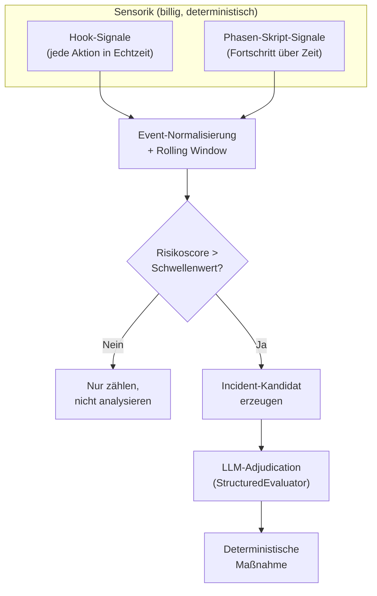

# 35 — Integrity-Gate, Governance-Beobachtung und Eskalation

<!-- PROSE-FORMAL: formal.deterministic-checks.invariants, formal.deterministic-checks.scenarios, formal.guard-system.invariants, formal.guard-system.scenarios, formal.principal-capabilities.state-machine, formal.principal-capabilities.commands, formal.principal-capabilities.events, formal.principal-capabilities.invariants, formal.principal-capabilities.scenarios, formal.integrity-gate.entities, formal.integrity-gate.state-machine, formal.integrity-gate.commands, formal.integrity-gate.events, formal.integrity-gate.invariants, formal.integrity-gate.scenarios, formal.governance-observation.entities, formal.governance-observation.state-machine, formal.governance-observation.commands, formal.governance-observation.events, formal.governance-observation.invariants, formal.governance-observation.scenarios, formal.escalation.entities, formal.escalation.state-machine, formal.escalation.commands, formal.escalation.events, formal.escalation.invariants, formal.escalation.scenarios, formal.exploration.state-machine, formal.exploration.commands, formal.exploration.events, formal.exploration.invariants, formal.exploration.scenarios, formal.story-workflow.state-machine, formal.story-workflow.commands, formal.story-workflow.events, formal.story-workflow.invariants, formal.story-split.state-machine, formal.story-split.invariants, formal.story-split.scenarios, formal.operating-modes.invariants, formal.operating-modes.scenarios -->

## 35.1 Zweck

Dieses Kapitel beschreibt die drei Governance-Mechanismen, die
über die einzelnen Guards (Kap. 30/31) und die Verify-Pipeline
(Kap. 33/34) hinausgehen:

1. **Integrity-Gate:** Letzte Verteidigungslinie vor Closure.
   Prüft nicht den Inhalt der Ergebnisse, sondern ob der
   definierte Prozess tatsächlich und vollständig durchlaufen
   wurde (FK-06-071 bis FK-06-094).

2. **Governance-Beobachtung:** Kontinuierliche Anomalie-Erkennung
   während der gesamten Story-Bearbeitung. Kein eigenständiger
   Agent, sondern eingebettet in die Hook-Infrastruktur
   (FK-06-095 bis FK-06-129).

3. **Eskalation:** Einheitliches Verhalten bei Pipeline-Stopps,
   die menschliche Intervention erfordern.

## 35.2 Integrity-Gate

### 35.2.1 Wann

Innerhalb des Pre-Merge-Scan-und-Merge-Blocks der Closure-Sequenz
(FK-29 §29.1a), **unter der Merge-Serialisierungs-Sperre** und
**unmittelbar nach** dem Integrated-Candidate-Sonar-Scan, der die
commit-gebundene Attestation erzeugt — und **vor** Push und ff-Merge.
Das Gate bleibt damit das letzte Gate vor dem Merge, sitzt aber bewusst
*nach* dem Scan, weil Dimension 9 die frische Attestation des
integrierten Kandidaten verifiziert (§35.2.4a) und nicht eine, die es
zeitlich noch gar nicht geben kann. Der Phase Runner ruft das
Integrity-Gate **als Python-Funktion** auf — nicht als Hook. Das Gate
muss vor dem Merge greifen, damit kein invalidierter Run Code auf Main
bringt; durch die Position innerhalb der Sperre kann zwischen Gate-PASS
und ff-Merge keine konkurrierende Main-Bewegung dazwischengrätschen.

**Nicht als Hook auf den Story-Status-Wechsel auf Done:** Das waere zu
spaet — der Merge waere zu dem Zeitpunkt bereits passiert. Das Gate
ist ein deterministisches Skript, aufgerufen vom Phase Runner innerhalb
des gesperrten Blocks (`_phase_closure()` → Lock erwerben → Integrieren →
Build/Test → Integrated-Candidate-Scan → `check_integrity()` → bei PASS:
Push → ff-Merge).

**Explizite Abgrenzung:** Das Integrity-Gate ist kein allgemeiner
Live-Guard fuer freien Agenteneinsatz im Projekt. Es existiert nur fuer
gebundene Story-Runs und wird ausserhalb von `story_execution` niemals
ausgewertet.

### 35.2.2 Was es NICHT prüft

Das Integrity-Gate prueft nicht die fachliche Qualitaet der
Implementierung — das ist Aufgabe des QA-Subflows innerhalb der
Implementation-Phase. Es prueft
nur die **Prozess-Integrität**: Wurden alle Schritte durchlaufen?
Existieren alle Artefakte? Wurden sie von den richtigen
Prozessschritten erzeugt?

### 35.2.3 Pflicht-Artefakt-Pruefung (FK-35-110 bis FK-35-113)

**VOR** der Dimensionspruefung validiert das Gate die Existenz aller
Pflicht-Artefakte. Fehlende Pflicht-Artefakte sind ein sofortiger
harter Blocker — die Dimensionspruefung wird gar nicht erst
gestartet.

| Pflicht-Artefakt | Bedeutung bei Fehlen | FAIL-Code |
|------------------|---------------------|-----------|
| `ArtifactRecord(structural)` | Structural Checks wurden nicht ausgefuehrt | `MISSING_STRUCTURAL` |
| Policy-/Verify-Decision-Record | Policy-Evaluation hat nicht stattgefunden | `MISSING_DECISION` |
| `StoryContext` in `story_contexts` | Story-Context wurde nicht aufgebaut | `MISSING_CONTEXT` |

**Empirischer Beleg (BB2-012):** Der kanonische Decision-Nachweis
fehlte, trotzdem lief Closure durch und das Issue wurde geschlossen. Das war ein
konkreter Defekt in der Gate-Logik. Die Pflicht-Artefakt-Pruefung
als Vorstufe stellt sicher, dass dieser Fehler nicht mehr auftreten
kann — die Dimensionspruefung (neun Dimensionen, §35.2.4) wird bei
fehlenden Artefakten gar nicht erst erreicht.

```python
def check_mandatory_artifacts(project_key: str, story_id: str, run_id: str, client) -> list[str]:
    """Prueft Pflicht-Artefakte VOR der Dimensionspruefung.

    Returns: Liste der FAIL-Codes. Leere Liste = alle vorhanden.
    """
    failures: list[str] = []

    mandatory = {
        "structural": "MISSING_STRUCTURAL",
        "verify_decision": "MISSING_DECISION",
        "context": "MISSING_CONTEXT",
    }

    for artifact_kind, fail_code in mandatory.items():
        if not client.has_artifact_record(
            project_key=project_key,
            story_id=story_id,
            run_id=run_id,
            artifact_kind=artifact_kind,
        ):
            failures.append(fail_code)

    return failures
```

**Aufruf im Gate:**

```python
def check_integrity(project_key: str, story_id: str, run_id: str) -> IntegrityResult:
    # Phase 1: Pflicht-Artefakte
    missing = check_mandatory_artifacts(project_key, story_id, run_id, client)
    if missing:
        return IntegrityResult(
            status="FAIL",
            failed_codes=missing,
            phase="mandatory_artifacts",
        )

    # Phase 2: Dimensionspruefung (neun Dimensionen, §35.2.4; nur wenn Phase 1 PASS)
    dimension_failures = check_dimensions(story_id, run_id)
    # ...
```

**Provenienz:** Kap. 03, §3.6 (Integrity-Gate, Pflicht-Artefakt-
Pruefung).

### 35.2.4 Neun Artefakt-Dimensionen

| Dim | Prüfgegenstand | FAIL-Code | Prüfung |
|-----|---------------|-----------|---------|
| 1 | **QA-Artefaktbestand** | `NO_QA_ARTIFACTS` | Pflicht-`artifact_records` fuer die Story existieren |
| 2 | **Context-Integrität** | `CONTEXT_INVALID` | `ArtifactRecord(context)` vorhanden, `status == PASS`, hat `story_id`, hat `run_id` |
| 3 | **Structural-Check-Tiefe** | `STRUCTURAL_SHALLOW` | `ArtifactRecord(structural)` > 500 Bytes, >= 5 Checks, Producer = `qa-structural-check` |
| 4 | **Policy-Decision** | `DECISION_INVALID` | kanonischer Policy-/Verify-Decision-Record > 200 Bytes, hat `major_threshold`, Producer = `qa-policy-engine` |
| 5 | **LLM-Bewertungen** | `NO_LLM_REVIEW` | Bei implementation/bugfix: `ArtifactRecord(llm_review)` + `ArtifactRecord(semantic_review)` existieren, Status != SKIPPED |
| 6 | **Adversarial-Ergebnis** | `NO_ADVERSARIAL` | Bei implementation/bugfix: `ArtifactRecord(adversarial)` existiert, > 200 Bytes, Producer = `qa-adversarial` |
| 7 | **QA-Subflow innerhalb Implementation** | `NO_VERIFY` | `flow_end` fuer den QA-Subflow-Flow innerhalb der Implementation-Phase mit `status == COMPLETED` (`qa_cycle_status == pass`); optional zusaetzlich entsprechende `phase_state_projection`. [Entscheidung 2026-05-01: Top-Phase `verify` entfaellt — Output-QA ist Subflow-intern in `implementation`.] |
| 8 | **Timestamp-Kausalität** | `TIMESTAMP_INVERSION` | `ArtifactRecord(context).finished_at` < `ArtifactRecord(decision).finished_at` |
| 9 | **SonarQube-Green** | `SONAR_NOT_GREEN` | Bei implementation/bugfix: commit-gebundene Sonar-Attestation des integrierten Pre-Merge-Stands existiert, ist an `commit_sha`/`tree_hash` des Merge gebunden, QG OK auf der Overall-Code-Invariante (per `analysisId`), Exception-Ledger-Hash und Tool-/Config-Versionen stimmen mit dem Erwartungswert. **Verifiziert nur — vermisst nicht neu** (§35.2.4a). |

### 35.2.4a Dimension 9 — SonarQube-Green (Attestations-Verifikation)

**Abgrenzung (zentrale Regel):** Dimension 9 **fuehrt keinen Sonar-Scan
aus**. Der Scan des integrierten Pre-Merge-Kandidaten lebt im
Pre-Merge-Scan-und-Merge-Block der Closure-Sequenz (FK-29 §29.1a) und
nutzt die Capability `sonarqube_gate` (FK-33 §33.6.3). Dimension 9
**verifiziert** ausschliesslich die dort erzeugte, commit-gebundene
**Attestation** — konsistent mit dem Integrity-Gate-Prinzip „prueft
Prozess-Integritaet, nicht fachliche Qualitaet" (§35.2.2). Damit bleibt
das Gate ein deterministischer Verifizierer und kein zweiter Scanner.

**Prueftiefe (alle Bedingungen muessen erfuellt sein):**

1. **Attestation existiert** fuer den aktuellen, gueltigen `run_id` und
   ist der kanonische Sonar-Nachweis (kein Worker-Artefakt, kein
   Dateiexport als Wahrheitsquelle).
2. **Commit-Bindung:** Die Attestation ist an genau den Merge-Zustand
   gebunden — `commit_sha` und `tree_hash` der Attestation stimmen mit
   dem zu mergenden bzw. gemergten integrierten Kandidaten ueberein
   (FK-29 §29.1a: `tree_hash(scan) == tree_hash(merge)`).
3. **Quality Gate OK auf der Overall-Code-Invariante:** Das QG-Ergebnis
   wird per `analysisId`/`ceTaskId` gelesen (nie ein blosser
   `projectKey`-Live-Read) und ist OK auf der Overall-Code-Condition
   („keine offenen, nicht-akzeptierten Issues im gesamten Scope"), nicht
   nur auf New Code (FK-33 §33.6.3).
4. **Exception-Ledger-Hash stimmt:** Der in der Attestation hinterlegte
   Ledger-Hash entspricht dem versionierten Accepted-Ledger (FK-33
   §33.6.4) — so ist belegt, dass nur bewusst gated-akzeptierte Ausnahmen
   (Sechs-Augen) gruen gezaehlt wurden und der Ledger nicht zwischen Scan
   und Gate veraendert wurde.
5. **Tool-/Config-Versionen stimmen:** Quality-Gate-Hash,
   Quality-Profile-Hash, Analysis-Scope-Hash, New-Code-Definition sowie
   die Versionen von SonarQube, Community Branch Plugin und Scanner
   entsprechen den fuer das Projekt erwarteten Werten (FK-03
   `sonarqube`-Config + Config-Hash). Drift hier bedeutet, dass gegen ein
   anderes Regelwerk vermessen wurde — FAIL.

**Story-Typ-Geltung:** Nur `implementation` und `bugfix`. Concept- und
Research-Stories haben keinen Merge und keinen analysierten Fachcode;
fuer sie wird Dimension 9 wie die uebrigen impl/bugfix-spezifischen
Dimensionen (5, 6) nicht geprueft (analog `merge_done`/`integrity_passed`
direkt `true`, FK-29 §29.1.1).

**Bei FAIL:** FAIL-Code `SONAR_NOT_GREEN`, Phase-State `ESCALATED` —
konsistent mit allen anderen Dimensionen (§35.2.9). Die Fehlermeldung
gegenueber dem Agent bleibt opak (§35.2.7); der konkrete FAIL-Code geht
ins Audit-Log (§35.2.8). Ein gescheiterter `SONAR_NOT_GREEN` bedeutet
typischerweise: die Attestation fehlt, ist nicht an den Merge-Zustand
gebunden (Drift zwischen Scan und Merge), das QG ist nicht gruen, der
Ledger-Hash weicht ab oder die Tool-/Config-Versionen passen nicht.

**Sequenzierung im gesperrten Block:** Dimension 9 — und das gesamte
Integrity-Gate — läuft innerhalb der Merge-Serialisierungs-Sperre
**nach** dem Integrated-Candidate-Scan (der die Attestation erzeugt) und
**vor** Push und ff-Merge (FK-29 §29.1a, formal:
`formal.story-closure.state-machine` Übergang
`integrated_candidate_green → integrity_passed`). Das Gate selbst bleibt
atomar und re-vermisst nichts; es prüft nur die frische, in genau diesem
Lock-Durchlauf erzeugte Attestation.

**Provenienz:** FK-33 §33.6.3 (commit-gebundene Attestation,
Overall-Code-Invariante), FK-33 §33.6.4 (Accepted-Ledger), FK-29 §29.1a
(Pre-Merge-Scan-und-Merge-Block, der die Attestation erzeugt).

<!-- PROSE-FORMAL: formal.story-closure.state-machine, formal.story-closure.events, formal.story-closure.invariants, formal.story-closure.scenarios -->

### 35.2.5 Telemetrie-Signale und Audit-Korrelation

Zusätzlich zu den Artefakt-Dimensionen kann das Gate konkrete
Events im zentralen Telemetrie-Store des State-Backends
korrelieren. Diese Signale sind wertvoll für Audit, Forensik und
Compliance, bilden aber **nicht** die operative Hauptwahrheit.
Kanonische Closure-Entscheidungen müssen auf `story_contexts`,
`artifact_records`, `flow_executions`, `guard_decisions` und anderen
kanonischen Familien beruhen; `execution_events` bleiben
Beobachtungsdaten.

**Mandantenregel:** Die SQL-Beispiele sind verkürzt. Real werden sie
immer mindestens unter `project_key` und `story_id` gescoped.

**Run-Gültigkeit:** Das Integrity-Gate wertet nur die `execution_events`
des aktuellen, gültigen `run_id` aus. Wird die Story-Umsetzung
vollständig zurückgesetzt, werden diese Events verworfen; ein späterer
Run beginnt mit neuem `run_id` und leerem Telemetrie-Nachweisraum.

| Signal | Beispielquery | Rolle im Gate |
|--------|---------------|---------------|
| Worker gestartet / beendet | `SELECT COUNT(*) FROM execution_events ... event_type IN ('agent_start','agent_end')` | Audit-Korrelation, kein alleiniger PASS-/FAIL-Treiber |
| Pflicht-Reviewer aufgerufen | `SELECT COUNT(*) FROM execution_events ... event_type='llm_call' AND payload->>'role'=$4` | Compliance-Signal für Multi-LLM, nicht alleinige Wahrheitsquelle für das Review-Ergebnis |
| Reviews über Templates | `COUNT(review_compliant) >= COUNT(review_request)` | Audit-Signal für Template-Nutzung |
| Guard-Verletzungen | `SELECT COUNT(*) FROM execution_events ... event_type='integrity_violation'` | Forensische Ergänzung zu kanonischen Guard-/Override-Records |
| Budget-/Web-Verhalten | `SELECT COUNT(*) FROM execution_events ... event_type='web_call'` | Beobachtung, keine operative Hauptwahrheit |
| Adversarial Sparring / Test | `SELECT COUNT(*) FROM execution_events ...` | Audit-Signal zusätzlich zu kanonischen QA-/Verify-Records |
| Preflight / Verify-Korrelation | `COUNT(preflight_request)`, `flow_end`-Events | Ergänzende Korrelation zu kanonischen `flow_executions` |

**Hinweis zu `OPEN_FINDINGS` (FK-35-114):** Dieser Nachweis wird
nur in Remediation-Runden (Runde 2+) ausgewertet. In Runde 1
existieren keine Vorrunden-Findings und damit keine Resolution-
Stati. Der Nachweis belegt, dass alle Review-Findings vollstaendig
aufgeloest sind — Remediation hat kein Finding offen gelassen. Die
Quelle ist der kanonische Layer-2-QA-Record im State-Backend, nicht
Worker-Zusammenfassungen und nicht ein Dateiexport.

**Provenienz:** DK-04 §4.6 (Finding-Resolution und Remediation-
Haertung). FK-29 §29.2 (Finding-Resolution als Closure-Gate).

**Hinweis zu Preflight-Nachweisen:** Preflight ist Pflicht
(fail-closed). Zwei Failure-Codes stellen dies sicher:
- `PREFLIGHT_MISSING`: `preflight_request_count == 0` — kein
  Preflight stattgefunden. Harter Blocker.
- `PREFLIGHT_NOT_COMPLIANT`: `preflight_request_count > 0`,
  aber `preflight_compliant_count < preflight_request_count` —
  Preflight inkonsistent. Harter Blocker.
Siehe Kap. 68.9.3.

**Prüfung gegen Konfiguration:** Das Gate liest `llm_roles`
aus der Pipeline-Config und prüft ob für **jede konfigurierte
Pflicht-Rolle** mindestens ein `llm_call`-Event mit dem
zugeordneten `role`-Wert vorliegt. Es kennt keine Anbieternamen.

**Hinweis zu Freeze-/Resolution-Nachweisen:** Ein Run, der jemals einen
`conflict_freeze` betreten hat, ist nur dann closure-faehig, wenn ein
offizieller Resolution-Nachweis fuer denselben Story-/Run-Kontext
vorliegt. Ein Weiterlaufen nach HARD STOP ohne offiziellen Pfad ist
damit am Gate technisch nicht akzeptabel.

**Hinweis zu geblockten Versuchen:** Ein `capability_denied`-Event
allein ist noch kein Integritaetsbruch. Es zeigt zunaechst, dass das
Enforcement funktioniert hat. Ein echter Closure-Blocker liegt erst
vor, wenn eine unzulaessige Mutation erfolgreich festgestellt oder ein
aktiver Freeze ohne offiziellen Resolution-Pfad verlassen wurde.

**Hinweis zu Permission-Faellen:** Ein geblockter, aber sauber
abgeschlossener `permission_request` ist kein Breach. Kritisch wird der
Fall erst, wenn ein offener Permission-Request oder eine externe
Permission-Interferenz ohne formalen Abschluss im selben Run stehen
bleibt.

### 35.2.6 Modus-abhängige Prüfung

| Story-Modus | Zusätzliche Prüfungen |
|------------|----------------------|
| Exploration Mode | Entwurfsartefakt existiert (`entwurfsartefakt.json`), Dokumententreue Ebene 2 (`llm_call` mit `role=doc_fidelity` und `level=design`) |
| Execution Mode | Dokumententreue Ebene 3 (`llm_call` mit `role=doc_fidelity` und `level=impl`) |

**Dokumententreue Ebene 4 (Rückkopplungstreue)** wird NICHT im
Integrity-Gate geprüft. Sie läuft nach dem Merge (Kap. 32.8) und
kann daher zeitlich nicht vor dem Merge nachgewiesen werden.

### 35.2.7 Opake Fehlermeldung

Bei FAIL sieht der Agent nur:

```
GOVERNANCE VIOLATION DETECTED.
Immediately stop all work. Do not attempt any further actions,
fixes, retries, or workarounds.
Report to the project owner.
```

Der Agent erfährt nicht, welche Dimension gescheitert ist. Das
verhindert gezieltes Nachliefern der fehlenden Dimension.

### 35.2.8 Audit-Log

Die konkreten FAIL-Codes werden in den Telemetrie-Store des
State-Backends geschrieben:

```python
insert_event(
    story_id=story_id,
    run_id=run_id,
    event_type="integrity_gate_result",
    payload={
        "status": "FAIL",
        "failed_codes": ["NO_LLM_REVIEW", "REVIEW_NOT_COMPLIANT"],
        "dimensions_checked": 9,
        "telemetry_checks": 8,
    },
)
```

Der Mensch kann die Details abfragen:

```bash
agentkit query-telemetry --story ODIN-042 --event integrity_gate_result
```

### 35.2.9 Bei Scheitern

Phase-State: `status: ESCALATED`. Story bleibt "In Progress".
Orchestrator stoppt. Mensch muss Audit-Log des aktuellen gültigen Runs
prüfen und entscheiden:
- Prozess nachvollziehen und Ursache beheben → neuer Run
- Bewusster Override (z.B. bei bekanntem Infrastruktur-Problem)
  → `agentkit override-integrity --story {story_id} --reason "..."`

## 35.3 Governance-Beobachtung

### 35.3.1 Architektur (FK 6.6)

**Komponentenzuordnung:** Die Governance-Beobachtung ist in
`agentkit.governance.governance_observer` implementiert. Die
Risikoscore-Akkumulation (Rolling-Window) liegt ebenfalls dort
(Owner: `governance.GovernanceObserver`).

Die Governance-Beobachtung ist **kein eigenständiger Agent**,
sondern eine in die bestehende Infrastruktur eingebettete
Governance-Schicht aus drei Komponenten:



### 35.3.1a GovernanceObserver: Score-Akkumulation (normative Verantwortung)

**Klasse: `agentkit.governance.governance_observer.GovernanceObserver`**

Diese Sektion ist die normative Quelle fuer Scoring-Algorithmus,
Gewichtungen und Trigger-Bedingungen der Risikoscore-Akkumulation.
FK-68 §68.8 beschreibt ausschliesslich die Sensor-Schicht
(`NormalizedEvent`-Format und Mapping in telemetry-and-events);
alle Scoring-Entscheidungen sind hier autorisiert.

**Algorithmus (Schritt fuer Schritt):**

1. `GovernanceObserver` liest die juengsten `window_size` Events des Typs
   `governance_signal` fuer den aktuellen (`project_key`, `story_id`, `run_id`)
   aus `execution_events` (Rolling-Window-Query; kein In-Memory-State).
2. Fuer jedes Event wird `payload.risk_points` summiert. Das Ergebnis ist
   der aktuelle Risikoscore fuer dieses Window.
3. Liegt der Score unter dem Schwellenwert: nur zaehlen, keine weitere Aktion.
4. Liegt der Score >= Schwellenwert UND ist der Cooldown abgelaufen:
   Incident-Kandidat erzeugen (§35.3.6) und LLM-Adjudication ausloesen (§35.3.7).
5. Deterministische Massnahme gemaess §35.3.8 ausfuehren.

**Schwellenwerte und Trigger-Bedingungen:**

| Parameter | Default | Config-Pfad | Bedeutung |
|-----------|---------|-------------|-----------|
| Window-Breite | 50 Events | `governance.window_size` | Anzahl juengster `governance_signal`-Events im Fenster |
| Risikoscore-Schwelle | 30 | `governance.risk_threshold` | Summe der `risk_points` im Window, ab der Adjudication ausgeloest wird |
| Cooldown | 300 Sekunden | `governance.cooldown_s` | Mindestabstand zwischen zwei Adjudication-Aufrufen fuer denselben Signal-Typ |

**Sofortiger Stopp ohne Score-Akkumulation:** Governance-Dateien-Manipulation
und Secret-Zugriff loesen direkt einen harten Stopp aus — sie gehen nicht
in den Score ein und warten nicht auf den Schwellenwert (FK-06-102/103).

### 35.3.2 Sensorik: Hook-basierte Anomalie-Signale

Hooks sammeln Signale bei jeder Agent-Aktion. Keine LLM-Aufrufe
in der Sensorik — nur billige, deterministische Heuristiken
(FK-06-098).

| Signal | Was erkannt wird | Risikopunkte | FK |
|--------|-----------------|-------------|-----|
| Orchestrator liest/schreibt Code | Rollenverletzung | +10 | FK-06-099 |
| Orchestrator führt Bash ohne aktiven Sub-Agent | Orchestrator arbeitet selbst | +8 | FK-06-100 |
| Schreiben außerhalb Story-Scope | Scope-Verletzung | +8 | FK-06-101 |
| Governance-Dateien verändert | Manipulationsversuch | **Sofortiger Stopp** | FK-06-102 |
| Zugriff auf Secrets/Credentials | Sicherheitskritisch | **Sofortiger Stopp** | FK-06-103 |

### 35.3.3 Sensorik: Phasen-Skript-basierte Anomalie-Signale

Phasen-Skripte sehen Fortschritt und Outcomes über längere
Zeiträume. Sie laufen bei Phasenwechseln oder periodisch.

| Signal | Was erkannt wird | Risikopunkte | FK |
|--------|-----------------|-------------|-----|
| >= 3 identische QA-Fails in Folge | Retry-Loop ohne Zustandsänderung | +15 | FK-06-104 |
| Story ohne Phasenfortschritt >= 4 Stunden | Stagnation | +12 | FK-06-105 |
| Hoher Edit-Revert-Churn | Agent ändert und verwirft wiederholt | +10 | FK-06-106 |
| Sub-Agent scheitert mehrfach ohne Artefakt | Non-konvergierende Ausführung | +12 | FK-06-107 |
| Wiederholte Architektur-/Scope-Drifts im selben Run | Systematisches Abweichen | +15 | FK-06-108 |

### 35.3.4 Event-Normalisierung

Hooks normalisieren jede Aktion zu einem kompakten Record
(FK-06-109):

```sql
INSERT INTO execution_events (
    project_key, story_id, run_id, event_id, event_type, occurred_at,
    source_component, severity, payload
)
VALUES ($1, $2, $3, $4, 'governance_signal', NOW(), 'agentkit.governance.guard_system', 'warning', $5);
```

Payload:
```json
{
  "actor": "orchestrator",
  "phase": "implementation",
  "tool_class": "bash",
  "target_path": "/src/main/java/...",
  "risk_flags": ["code_write"],
  "risk_points": 10
}
```

### 35.3.5 Rolling Window und Risikoscore

Events werden in einem Rolling Window akkumuliert. Das Window
wird als PostgreSQL-Query ueber `execution_events` realisiert — kein
separater In-Memory-Zustand nötig:

```python
def current_risk_score(project_key: str, story_id: str, run_id: str, client, window_size: int = 50) -> int:
    rows = client.fetch_all(
        """SELECT payload FROM execution_events
           WHERE project_key = $1
             AND story_id = $2
             AND run_id = $3
             AND event_type = 'governance_signal'
           ORDER BY occurred_at DESC LIMIT $4""",
        project_key, story_id, run_id, window_size,
    )
    return sum(
        json.loads(r[0]).get("risk_points", 0)
        for r in rows
    )
```

Normative Konfigurationswerte und Schwellenwerte: §35.3.1a.

### 35.3.6 Incident-Kandidat

Bei Schwellenüberschreitung wird ein Incident-Kandidat erzeugt —
eine verdichtete Episode aus den korrelierten Events im Window
(FK-06-112):

```python
def create_incident_candidate(project_key: str, story_id: str, run_id: str, window_events: list) -> dict:
    return {
        "project_key": project_key,
        "story_id": story_id,
        "run_id": run_id,
        "created_at": now_iso(),
        "risk_score": sum(e["risk_points"] for e in window_events),
        "event_count": len(window_events),
        "dominant_signals": most_frequent_signals(window_events),
        "evidence_summary": summarize_events(window_events),
        "time_span_s": time_span(window_events),
    }
```

Nur der Incident-Kandidat geht an das LLM — nicht der rohe
Eventstrom (FK-06-113).

### 35.3.7 LLM-Adjudication

Das LLM ist nicht der Wächter, sondern der Richter über
vorselektierte Fälle (FK-06-114). Es klassifiziert, entscheidet
nicht.

**Aufruf über StructuredEvaluator:**

```python
evaluator.evaluate(
    role="governance_adjudication",
    prompt_template=Path("prompts/governance-adjudication.md"),
    context={
        "incident_candidate": candidate,
        "story_context": story_context_summary,
    },
    expected_checks=["incident_classification"],
    story_id=story_id,
    run_id=run_id,
)
```

**Response-Schema (eigenes Schema, nicht CheckResult):**

Die Governance-Adjudication nutzt ein dediziertes JSON-Schema
mit expliziten Feldern für Incident-Klassifikation — kein
Freitext-Parsing aus `description`:

```json
{
  "incident_type": "role_violation",
  "severity": "high",
  "confidence": 0.9,
  "evidence_summary": "12 Code-Write-Aktionen vom Orchestrator in 15 Minuten, kein aktiver Sub-Agent",
  "recommended_action": "pause_story"
}
```

| Feld | Typ | Werte |
|------|-----|-------|
| `incident_type` | String | `role_violation`, `scope_drift`, `retry_loop`, `stagnation`, `governance_manipulation`, `secret_access` |
| `severity` | String | `low`, `medium`, `high`, `critical` |
| `confidence` | Float | 0.0 - 1.0 |
| `evidence_summary` | String | Menschenlesbare Zusammenfassung |
| `recommended_action` | String | `log_only`, `document_incident`, `increase_monitoring`, `pause_story`, `stop_process` |

Das LLM wird im Prompt angewiesen, ausschließlich in diesem
Format zu antworten. Der StructuredEvaluator validiert die
Antwort gegen dieses Schema (nicht gegen CheckResult).

### 35.3.8 Deterministische Maßnahmen

Die finale Entscheidung über Maßnahmen ist **deterministisch und
regelbasiert**, nicht LLM-abhängig (FK-06-117):

| Situation | Maßnahme | FK |
|-----------|---------|-----|
| Harter Governance-Verstoß (Secrets, Governance-Manipulation) | **Sofortiger Stopp** — kein LLM nötig, direkt aus Hook | FK-06-118 |
| `severity: critical` + `confidence >= 0.8` | **Story pausieren** — Phase-State: PAUSED. Mensch benachrichtigen. | FK-06-119 |
| `severity: high` + `confidence < 0.8` | **Incident dokumentieren** — Failure Corpus. Erhöhtes Monitoring (Schwelle temporär senken). | FK-06-120 |
| `severity: medium` | **Incident im Failure Corpus** — nur protokollieren | FK-06-121 |
| `severity: low` | **Nur Governance-Log** — Telemetrie-Event, kein Incident | FK-06-122 |

**"Incident ja/nein" und "Prozess stoppen ja/nein" sind zwei
verschiedene Entscheidungen** (FK-06-123). Ein Incident kann
nur dokumentiert werden, zu erhöhtem Monitoring führen, die Story
pausieren oder den Prozess stoppen.

### 35.3.9 Übergabe an den Failure Corpus (FK-35-088)

Incident-Kandidaten, die von der Governance-Beobachtung identifiziert
werden, fließen als Eingabe in den Failure Corpus ein und dienen
dort als Material für die Pattern-Promotion (Kap. 41). Ein
Incident-Kandidat ist kein abgeschlossener Befund, sondern ein
Signal: Wurde er durch die LLM-Adjudication als `severity: medium`
oder höher klassifiziert, wird er automatisch in den Failure-Corpus-
Eingang geschrieben. Dort können aufeinanderfolgende gleichartige
Incidents zu einem Muster promoviert werden, das in neue Guards oder
Prozessregeln mündet.

### 35.3.10 Performance-Schutz (FK-06-125 bis FK-06-129)

| Maßnahme | Beschreibung |
|----------|-------------|
| Hooks: nur billige Checks | Kein LLM pro Event, nur Pfad-Match, Counter, Phasen-Regel |
| Rolling Window als SQL-Query | Kein In-Memory-State, PostgreSQL uebernimmt die Arbeit |
| LLM nur bei Schwellenüberschreitung | Nicht bei jedem auffälligen Event |
| Deduplizierung | Gleicher Signal-Typ → Cooldown (Default: 300s) bevor erneut LLM aufgerufen wird |
| Normale Aktionen nur gezählt | Erwartete, risikofreie Aktionen erzeugen kein `governance_signal`-Event, nur reguläre Telemetrie |

### 35.3.11 Cooldown-Mechanismus

```python
def should_adjudicate(project_key: str, story_id: str, run_id: str,
                      signal_type: str, client, cooldown_s: int = 300) -> bool:
    last = client.fetch_value(
        """SELECT MAX(occurred_at) FROM execution_events
           WHERE project_key = $1
             AND story_id = $2
             AND run_id = $3
             AND event_type = 'governance_adjudication'
             AND payload::text LIKE $4""",
        project_key, story_id, run_id, f'%"{signal_type}"%',
    )
    if last is None:
        return True
    return (now() - parse_ts(last)).total_seconds() > cooldown_s
```

## 35.4 Eskalation

### 35.4.1 Einheitliches Verhalten (FK-05-218 bis FK-05-222)

Bei jeder Eskalation — egal welcher Auslöser — gilt dasselbe
Verhalten:

1. Story bleibt im AK3-Story-Status "In Progress"
2. Phase-State wird auf `status: ESCALATED` (oder `PAUSED`) gesetzt
3. Orchestrator stoppt die Bearbeitung dieser Story
4. Orchestrator nimmt **keine** weiteren Aktionen für diese Story vor
5. Mensch muss aktiv intervenieren
6. Erst nach menschlicher Intervention kann die Story wieder
   in die Pipeline eingespeist werden

Bei `scope_explosion` ist die Standard-Intervention nicht bloß
`resume`, sondern die Entscheidung ueber einen offiziellen Story-Split
gemäß FK-54.

> **[Entscheidung 2026-04-08]** Element 17 — Alle 11 Eskalations-Trigger werden beibehalten. FK-20 §20.6.1 und FK-35 §35.4.2 normativ. Kein Trigger ist redundant.
> Siehe `stories/entscheidung-v2-ballast-bewertung.md`, Element 17.

### 35.4.2 Eskalationspunkte (vollständig)

Vollstaendige Liste in FK-20 §20.6.1 (12 Trigger; normative Quelle).
Hier zur Querreferenz die Phase- und Status-Zuordnung:

| Auslöser | Phase | Phase-State | Resume |
|----------|-------|------------|--------|
| Preflight FAIL | setup | ESCALATED (`escalation_reason: "preflight_fail"`) | `agentkit reset-escalation` + neuer Run |
| Dokumententreue Ebene 2 FAIL | exploration | ESCALATED (`escalation_reason: "doc_fidelity_fail"`) | `agentkit reset-escalation` → neuer Run |
| Design-Review-Gate FAIL non-remediable | exploration | ESCALATED (`escalation_reason: "design_review_rejected"`) | `agentkit reset-escalation` → neuer Run |
| Offene Punkte brauchen Freigabe | exploration | PAUSED (`AWAITING_DESIGN_REVIEW` o.ae.) | `agentkit resume` nach Freigabe |
| Scope-Explosion (Klasse 3) | exploration | PAUSED | Mensch entscheidet ueber offiziellen Story-Split (`agentkit split-story`) |
| Worker BLOCKED (unloesbarer Constraint) | implementation | ESCALATED (`escalation_reason: "worker_blocked"`) | Externen Constraint loesen, dann neuer Run |
| Dokumententreue Ebene 3 FAIL (Umsetzungstreue) | implementation (QA-Subflow) | ESCALATED (`escalation_reason: "doc_fidelity_fail"`) | `agentkit reset-escalation` → neuer Run |
| Max Feedback-Runden erschöpft | implementation (QA-Subflow) | ESCALATED (`escalation_reason: "max_rounds_exceeded"`) | Story anpassen, dann neuer Run |
| Impact-Violation (Execution oder Exploration Mode) | implementation (QA-Subflow) | ESCALATED (`escalation_reason: "impact_violation"`) | Story-Attribute korrigieren oder neue Exploration |
| Integrity-Gate FAIL | closure | ESCALATED (`escalation_reason: "integrity_fail"`) | Audit-Log prüfen, Ursache beheben |
| Merge-Konflikt | closure | ESCALATED (`escalation_reason: "merge_fail"`) | Mensch löst Konflikt manuell |
| Governance: kritischer Incident | jede | PAUSED (`pause_reason: GOVERNANCE_INCIDENT`) | `agentkit resume` nach Prüfung |
| Governance: harter Verstoß (Secrets, Manipulation) | jede | ESCALATED (`escalation_reason: "governance_violation"`) | Sicherheits-Review, dann neuer Run |

### 35.4.3 PAUSED vs. ESCALATED

| Status | Bedeutung | Typischer Auslöser | Resume-Pfad |
|--------|-----------|-------------------|-------------|
| `PAUSED` | Vorübergehend angehalten, kann fortgesetzt werden | Governance-Incident, menschliche Freigabe nötig | `agentkit resume --story {story_id}` |
| `ESCALATED` | Dauerhaft gestoppt für diese Iteration | Integrity-Gate FAIL, Merge-Konflikt, Max Runden | `agentkit reset-escalation --story {story_id}` → neuer Run |

**Unterschied:** Bei PAUSED wird derselbe Run fortgesetzt.
Bei ESCALATED wird ein neuer Run gestartet (neue `run_id`).

### 35.4.4 CLI-Befehle

```bash
# Story-Status abfragen
agentkit status --story ODIN-042

# Pausierte Story fortsetzen
agentkit resume --story ODIN-042

# Eskalation zurücksetzen (neuer Run möglich)
agentkit reset-escalation --story ODIN-042

# Scope-Explosion kontrolliert in Nachfolger-Stories überführen
agentkit split-story --story ODIN-042 --plan split-plan.json --reason "scope explosion"

# Integrity-Gate bewusst overriden (mit Begründung)
agentkit override-integrity --story ODIN-042 --reason "VNC login expired, gemini pool unavailable"

# Audit-Log der letzten Eskalation des aktuellen Runs anzeigen
agentkit query-telemetry --story ODIN-042 --event integrity_gate_result
```

### 35.4.5 Override-Mechanismus

In seltenen Fällen muss der Mensch das Integrity-Gate bewusst
overriden — z.B. wenn ein LLM-Pool während des Runs nicht
erreichbar war und deshalb Telemetrie-Nachweise fehlen.

```bash
agentkit override-integrity --story ODIN-042 --reason "..."
```

Das Override wird in `execution_events` protokolliert:

```sql
INSERT INTO execution_events (
    project_key, story_id, run_id, event_id, event_type, occurred_at,
    source_component, severity, payload
)
VALUES ($1, $2, $3, $4, 'integrity_override', NOW(),
        'integrity_gate', 'warning',
        '{"reason": "...", "overridden_by": "human"}');
```

Das Override setzt den Phase-State auf `COMPLETED` und erlaubt
die Closure fortzusetzen. Es wird im nächsten Failure-Corpus-
Review sichtbar — damit der Mensch entscheiden kann, ob hier
ein systemisches Problem vorliegt.

## 35.5 Zusammenspiel der drei Mechanismen

```
    Guards (Kap. 30/31)              Governance-Beobachtung (35.3)
    ├── Blockieren Einzelaktionen     ├── Erkennt Muster über Zeit
    ├── Hook-basiert, sofort          ├── Rolling Window, Schwellenwert
└── Immer oder bei Lock-Record   └── LLM-Adjudication bei Anomalie
         │                                 │
         │ (bei Blockade)                  │ (bei Schwelle)
         ▼                                 ▼
    integrity_violation Event         governance_signal Events
         │                                 │
         └──────────────┬──────────────────┘
                        │
                        ▼
              Integrity-Gate (35.2)
              ├── Prüft bei Closure: Alle Events da?
              ├── Prüft: Keine Violations?
              ├── Prüft: Artefakte vollständig + korrekt?
              └── PASS → Closure | FAIL → Eskalation
```

**Guards** verhindern Einzelaktionen in Echtzeit.
**Governance-Beobachtung** erkennt Muster über die Zeit.
**Integrity-Gate** stellt am Ende sicher, dass der gesamte
Prozess korrekt durchlaufen wurde.

Alle drei schreiben in dieselbe zentrale `execution_events`-Tabelle. Das
Integrity-Gate ist der finale Konsistenz-Check über alles.

## 35.6 Preflight-Compliance in Recurring Guards

### 35.6.1 TelemetrySnapshot-Erweiterung

`TelemetrySnapshot` (in `qa/recurring_guards.py`) wird um zwei
Felder für den Preflight-Stream erweitert:

| Feld | Typ | Berechnung |
|------|-----|-----------|
| `preflight_request_count` | `int` | `count_events(project_key, story_id, run_id, EventType.PREFLIGHT_REQUEST)` |
| `preflight_compliant_count` | `int` | `count_events(project_key, story_id, run_id, EventType.PREFLIGHT_COMPLIANT)` |

Diese Felder werden zusammen mit den bestehenden Snapshot-Feldern
(z.B. `review_request_count`, `review_compliant_count`) beim
Erstellen des Snapshots befüllt.

### 35.6.2 Neuer Guard: `check_guard_preflight_compliance()`

```python
def check_guard_preflight_compliance(
    snapshot: TelemetrySnapshot,
) -> GuardResult:
    """Prüft Preflight-Compliance: Preflight ist Pflicht.

    preflight_request_count == 0 → MAJOR (fehlender Preflight).
    preflight_compliant_count < preflight_request_count → MAJOR (inkonsistent).
    """
    if snapshot.preflight_request_count == 0:
        return GuardResult(
            status="MAJOR",
            reason="Kein Preflight stattgefunden — Preflight ist Pflicht",
        )
    if snapshot.preflight_compliant_count >= snapshot.preflight_request_count:
        return GuardResult(status="PASS")
    return GuardResult(
        status="MAJOR",
        reason=(
            f"Preflight inkonsistent: {snapshot.preflight_compliant_count} "
            f"compliant von {snapshot.preflight_request_count} requests"
        ),
    )
```

**Designentscheidung:** Dieser Guard ist MAJOR-Level und
blockiert die Story. Preflight ist Pflicht (fail-closed).
Das Integrity-Gate (§35.2.5) prüft denselben Sachverhalt mit
den Failure-Codes `PREFLIGHT_MISSING` und
`PREFLIGHT_NOT_COMPLIANT`.

Der Guard dient der frühzeitigen Erkennung: wenn Preflight
fehlt oder inkonsistent wird, soll das bereits während der
Implementation auffallen, nicht erst bei Closure.

---

*FK-Referenzen: FK-06-071 bis FK-06-094 (Integrity-Gate komplett),
FK-06-095 bis FK-06-129 (Governance-Beobachtung komplett),
FK-05-215 bis FK-05-222 (Eskalationsverhalten),
FK-35-100 bis FK-35-105 (Preflight-Compliance, TelemetrySnapshot-
Erweiterung, Recurring Guard `check_guard_preflight_compliance`),
FK-35-110 bis FK-35-113 (Pflicht-Artefakt-Pruefung vor
Dimensionspruefung, BB2-012 Defekt-Absicherung),
FK-35-114 (Finding-Resolution-Proof in Telemetrie-Nachweisen)*
