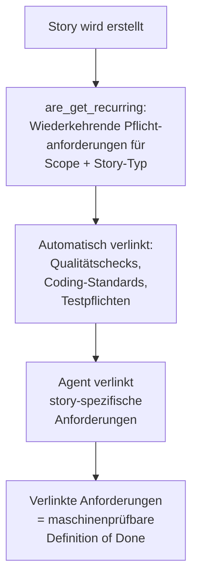

# 40 — ARE-Integration und Anforderungsvollständigkeit

<!-- PROSE-FORMAL: formal.deterministic-checks.entities, formal.deterministic-checks.invariants, formal.deterministic-checks.scenarios -->

## 40.1 Zweck

Die Agent Requirements Engine (ARE) ist eine **optionale** externe
Komponente. Sie verwaltet Anforderungen als typisierte Objekte und
erzwingt Vollständigkeit: Jede als `must_cover` verlinkte
Anforderung muss Evidence haben, bevor eine Story geschlossen
werden kann (FK 9).

ARE ist kein Teil von AgentKit. AgentKit-Code greift ueber den
`AreClient`-Sub (REST-Client) auf die ARE-REST-API zu — kein
direkter Datenbank-Zugriff (Kap. 01). Harness-Agents (Claude Code
oder Codex; FK-30 §30.11) koennen ARE darueber hinaus ueber MCP
ansprechen (Boundary-Control); das ist ein getrennter Aufruf-Pfad
ausserhalb von AgentKit-Code.

**Was ARE erzwingt:** Vollständigkeit, nicht Qualität. Ein Agent
kann Evidence fälschen, aber er kann keine Anforderung ignorieren.
Ob die Evidence den Anspruch tatsächlich erfüllt, bewerten die
QA-Subflow innerhalb der Implementation-Phase und der Mensch (FK-09-005 bis FK-09-010).

**Abgrenzung Vollständigkeit vs. Qualität (FK-40-037):** ARE prüft
ausschließlich das Vorhandensein von Evidence — d.h. ob für jede
`must_cover`-Anforderung ein Nachweis eingereicht wurde. Die
Bewertung, ob dieser Nachweis die Anforderung tatsächlich erfüllt
(inhaltliche Qualität), ist explizit nicht Aufgabe von ARE. Diese
Bewertung verbleibt in der QA-Subflow innerhalb der Implementation-Phase (QA-Bewertung, Semantic
Review) und beim Menschen im GitHub-Review. Diese Trennung ist
beabsichtigt: ARE garantiert Lückenlosigkeit des Prozesses,
nicht die fachliche Korrektheit des Ergebnisses.

> **[Entscheidung 2026-04-08]** Element 21 — ARE-Integration: Beide Modi sind Produktionspfade. ARE deaktiviert: Pipeline laeuft ohne ARE-Gate. ARE aktiviert: ARE-Gate ist Pflicht, ohne ARE-Bestaetigung kein Merge. Installer entscheidet Modus. Kein Fallback, kein Graceful-Degradation.
> Siehe `stories/entscheidung-v2-ballast-bewertung.md`, Element 21.

## 40.2 Aktivierung

```yaml
# .story-pipeline.yaml
features:
  are: false              # Default: deaktiviert

are:
  rest_base_url: "https://are.example.com"  # ARE-REST-API-Basis-URL
```

Wenn `features.are: false`: Die gesamte Top-Surface von
`RequirementsCoverage` ist no-op. Aufrufer-BCs brauchen keinen
Fallback-Code (FK-09-014).

## 40.3 Scope-Zuordnung

### 40.3.1 Zwei Zuordnungstabellen

- Pipeline-Konfiguration (`.story-pipeline.yaml`) pflegt zwei getrennte Mapping-Tabellen:
  - `repositories[].are_scope`: Jedes Code-Repository → genau ein ARE-Scope-String (z.B. `backend`, `frontend`, `agentframework`)
  - `are.module_scope_map`: Jeder Wert des Story-Attributs "Modul" → genau ein ARE-Scope-String
- Root-Repos und reine Dokumentations-Repos ausgenommen — nur Code-Repos brauchen Zuordnung
- Kommaseparierte Multi-Values im Modul-Feld werden in einzelne Tokens aufgeteilt
- Die Tabellen sind Konfigurationszeit-Artefakte (bei Installation/Update gepflegt), keine Laufzeitentscheidungen

### 40.3.2 Konfiguration bei Installation

**Ownership:** Schreib-Owner der Scope-Mapping-Tabellen ist BC
`installation-and-bootstrap` (FK-50, CP 5 / CP 10c). BC
`requirements-and-scope-coverage` ist Lese-Owner: die
`ScopeMapping`-Sub liest die Tabellen zur Laufzeit, schreibt sie
aber nie selbst.

- Installer-Checkpoint (FK 50) validiert: alle Repos haben `are_scope`, alle Modul-Werte haben Mapping
- Delta-Erkennung: nur neue/unmapped Items werden abgefragt
- Interaktiv: nummerierte Auswahl aus verfuegbaren ARE-Scopes (Quelle: ARE-Dimension `scope` via REST oder Fallback auf bereits konfigurierte Scopes)
- Agentisch (non-interactive): Checkpoint gibt `PENDING_SELECTION` zurueck mit strukturierten Metadaten (repos_needing_scopes, modules_needing_mappings, available_scopes). Orchestrierender Agent muss `resolve_pending_scope_mapping(repo_scopes={}, module_scopes={})` aufrufen
- Bereits zugeordnete Eintraege werden bei Updates NICHT erneut abgefragt

### 40.3.3 Scope-Ableitung bei Story-Erstellung

- Zwei-Tier-Priorität:

| Priorität | Quelle | Wann |
|-----------|--------|------|
| 1 (primär) | Participating Repos | Story hat identifizierte betroffene Repos. Jedes Repo über Repo→Scope aufgelöst |
| 2 (Fallback) | Modul-Feld | Keine Participating Repos (z.B. Konzeptarbeit). Modul-Wert über Module→Scope aufgelöst |

- Resultierende Scope-Schlüssel steuern `search_requirements(scope_key=...)` für Auto-Match
- Wenn weder Repos noch Modul: kein Scope, optional `global` Fallback (Projektkonfiguration)

### 40.3.4 Verantwortlichkeiten

- Mensch: Entscheidet Zuordnungen bei Installation, prüft auto-zugeordnete Anforderungen bei Story-Erstellung
- Automation: Scope-Ableitung zur Laufzeit, Anforderungssuche, Applicability-Rule-Evaluierung, automatische Verknüpfung

FK-Referenz: Domain-Konzept 9.2 "Scope-Zuordnung"

## 40.4 ARE-Schnittstellenvertrag

AgentKit-Code kommuniziert mit ARE ausschliesslich ueber den
`AreClient`-Sub (`agentkit.requirements_coverage.are_client`),
der die ARE-REST-API direkt aufruft — analog zum GitHub-REST-Adapter
(FK-12). Es gibt keinen MCP-Wrapper fuer AgentKit-Code.

MCP ist Boundary-Control fuer Harness-Agents (Claude Code oder
Codex; FK-30 §30.11), die ARE direkt ansprechen (z.B. um manuell
Anforderungen zu verlinken). Dieser Pfad ist unabhaengig von
AgentKit-Code und wird hier nicht weiter spezifiziert.

### 40.4.1 REST-Endpunkte (AreClient)

| REST-Methode | Parameter | Rueckgabe | Andock-Punkt |
|--------------|-----------|-----------|-------------|
| `list_requirements(story_id, scope)` | story_id, scope | Liste von Anforderungen mit ID, Typ, `must_cover`-Flag, Beschreibung | 1 (Verlinken) |
| `get_recurring(scope, story_type)` | scope, story_type | Wiederkehrende Pflichtanforderungen fuer diesen Scope/Typ | 1 (Verlinken) |
| `load_context(story_id)` | story_id | `must_cover`-Anforderungen mit Details fuer Worker-Kontext | 2 (Kontext laden) |
| `submit_evidence(story_id, requirement_id, evidence_type, evidence_ref)` | s.o. | Bestaetigung | 3 (Evidence einreichen) |
| `check_gate(story_id)` | story_id | PASS/FAIL + Liste unbelegter Anforderungen | 4 (Gate pruefen) |

### 40.4.2 Anforderungs-Typen (FK-09-002)

| Typ | Beschreibung |
|-----|-------------|
| `regulatory` | Regulatorik-Klauseln |
| `business_rule` | Geschäftsregeln |
| `report_mapping` | Report-Mappings |
| `system` | Systemanforderungen |
| `quality` | Qualitätsanforderungen |

## 40.5 Vier Andock-Punkte

Die vier Andock-Punkte sind Top-Surface-Methoden in
`RequirementsCoverage` (`agentkit.requirements_coverage`), keine
eigenstaendigen Komponenten. Aufrufer-BCs rufen diese Methoden ueber
die Top-Surface auf; die interne Delegation an `AreClient`,
`ScopeMapping` und `AreIntegration` ist ein Implementierungsdetail
des BC.

### 40.5.1 Andock-Punkt 1: Anforderungen verlinken (FK-09-015)

**Wo:** Story-Erstellung (Kap. 21)

**Wer ruft auf:** Pipeline-Skript im Erstellungsprozess

**Was passiert:**



1. `are_get_recurring(scope, story_type)` liefert wiederkehrende
   Pflichtanforderungen
2. Diese werden automatisch mit der Story verknüpft
3. Der Agent verlinkt zusätzlich story-spezifische Anforderungen
   via `are_list_requirements(story_id, scope)`
4. Die Gesamtheit bildet die maschinenprüfbare Definition of Done

### 40.5.2 Andock-Punkt 2: Anforderungskontext laden (FK-09-016)

**Wo:** Setup-Phase (Kap. 22), vor Worker-Start

**Wer ruft auf:** Deterministisches Pipeline-Skript (Setup-Phase)

**Was passiert:**

Das Setup-Skript ruft ARE ab und schreibt den Bundle als eigenständige
Content-Plane-Datei in das QA-Verzeichnis der Story. Der Worker findet
den Bundle beim Start vor — er muss ARE für das initiale Laden nicht
selbst ansprechen. Der Orchestrator-Agent wird nicht einbezogen.

```python
def load_are_bundle(story_id: str, config: PipelineConfig) -> AreBundleResult:
    """Laedt ARE-Bundle und persistiert ihn als Content-Plane-Artefakt.

    Wird durch das Setup-Skript aufgerufen, nicht durch den Orchestrator-Agent.
    Bei Fehler: Setup schreibt status=FAILED in den Phase-State und bricht ab.
    Der Orchestrator-Agent beobachtet nur diesen Zustand -- er laedt nicht nach.
    """
    if not config.features.are:
        return AreBundleResult(status="SKIPPED", requirement_count=0)

    try:
        requirements = are_client.load_context(story_id=story_id)
    except AreClientError as exc:
        return AreBundleResult(status="FAILED", error=str(exc))

    artifact_manager.persist(
        artifact_class=ArtifactClass.QA,
        producer="qa-are-context-loader",
        story_id=story_id,
        filename="are_bundle.json",
        content={
            "schema_version": "1.0",
            "story_id": story_id,
            "fetched_at": now_iso(),
            "must_cover": requirements,
        },
    )

    return AreBundleResult(status="LOADED", requirement_count=len(requirements))
```

**Stopppunkt bei FAILED:**
Gibt `load_are_bundle()` `status=FAILED` zurück, schreibt das Setup-Skript
diesen Status in den Phase-State und bricht die Setup-Phase ab. Der
Orchestrator-Agent liest den Phase-State und sieht `FAILED` — er startet
keinen Worker und beschafft den Bundle nicht eigenständig nach (FK 4.5,
FK 9.3). Der primäre Stopppunkt liegt im Setup-Skript, nicht im
Orchestrator-Agenten.

**Ergebnis im Phase-State (Control-Plane):**
Das Ergebnis wird als strukturiertes Signal in den Phase-State eingetragen.
Der Phase-State ist das maßgebliche Control-Plane-Artefakt, das der
Orchestrator liest — neben weiteren Steuerungs-Artefakten wie
Lock-Record und Marker-Exporte (vgl. FK 31.2):

```json
{
  "are_bundle": {
    "status": "LOADED",
    "requirement_count": 12
  }
}
```

**Artefakt-Klasse:**
`are_bundle.json` ist ein Content-Plane-Artefakt (Kap. 31.2) mit
`ArtifactClass.QA`. Es wird ueber `artifacts.ArtifactManager` (FK-71)
persistiert; Producer: `qa-are-context-loader` (in der Producer-Registry
von BC 8 registriert). Es ist fuer Worker und QA-Agent lesbar, fuer den
Orchestrator-Agenten blockiert. Der Worker weiss dadurch, welche
Anforderungen er adressieren und mit Evidence belegen muss.

### 40.5.3 Andock-Punkt 3: Evidence einreichen (FK-09-017)

**Wo:** Während Implementation + QA-Subflow innerhalb der Implementation-Phase

**Wer ruft auf:** Worker-Agent und QA-Prozess

**Was passiert:**

Der Worker reicht während der Implementierung Evidence pro
Anforderung ein:

```python
are_client.submit_evidence(
    story_id=story_id,
    requirement_id="REQ-042",
    evidence_type="test_report",
    evidence_ref="tests/test_broker_adapter.py::test_rate_limit",
)
```

**Evidence-Typen:**

| Typ | Beschreibung | Beispiel |
|-----|-------------|---------|
| `test_report` | Testreport als Nachweis | Test-Locator |
| `commit_ref` | Commit als Nachweis | Commit-SHA |
| `artifact_ref` | Artefakt als Nachweis | Pfad zu Dokument |
| `manual_note` | Manuelle Notiz | Freitext-Begründung |

Der QA-Agent kann ebenfalls Evidence einreichen (z.B. nach
Adversarial Testing).

### 40.5.4 Andock-Punkt 4: ARE-Gate prüfen (FK-09-018)

**Wo:** QA-Subflow innerhalb der Implementation-Phase, Schicht 1 (deterministische Checks)

**Wer ruft auf:** Deterministisches Pipeline-Skript

**Was passiert:**

```python
def check_gate(story_id: str) -> StageResult:
    result = are_client.check_gate(story_id=story_id)

    if result.status == "PASS":
        return StageResult(stage_id="are_gate", status="PASS", ...)

    uncovered = result.uncovered_requirements
    return StageResult(
        stage_id="are_gate",
        status="FAIL",
        blocking=True,
        detail=f"{len(uncovered)} requirements without evidence: "
               + ", ".join(r.id for r in uncovered),
    )
```

**Ergebnis:** PASS wenn alle `must_cover`-Anforderungen Evidence
haben. FAIL mit Liste der unbelegten Anforderungen wenn nicht.

**Ergebnis-Artefakt:** `_temp/qa/{story_id}/are_gate.json`

## 40.5b Persistenz: `StoryAreLink`-Edge-Tabelle

[Entscheidung 2026-05-04 — Persistenz der Story↔ARE-Verknuepfung]
Die Story-seitige Spiegelung der ARE-Anforderungs-Verknuepfung wird
in der Edge-Tabelle `StoryAreLink` gefuehrt (Anker FK-02 §2.11.4).
Die Tabelle gehoert dem BC `requirements-and-scope-coverage`. ARE
selbst bleibt die Quelle der Wahrheit fuer Anforderungs-Inhalt und
Evidence-Status; AK3 spiegelt nur die Verknuepfung.

### 40.5b.1 Schema (Querverweis)

Die kanonische Modell-Definition liegt in FK-02 §2.11.4:

| Feld | Typ | Rolle |
|------|-----|-------|
| `story_id` | FK | Story (AK3-interne Story-ID, NICHT GitHub-Issue) |
| `are_item_id` | String | externe ARE-Item-Referenz, opak; kein FK-Constraint |
| `kind` | Enum | typisierte Beziehung (`addresses`, `partial`, `derives_from`, `recurring`) |

Eindeutigkeit auf `(story_id, are_item_id, kind)`. Mehrfach-Eintraege
mit unterschiedlichem `kind` fuer dasselbe Story-Item-Paar sind
zulaessig (z. B. `addresses` plus `derives_from`).

### 40.5b.2 Lifecycle

| Phase | Operation | Auslöser |
|-------|-----------|----------|
| **Anlage** | INSERT | Andock-Punkt 1 (§40.5.1, Story-Erstellung): wiederkehrende Pflichtanforderungen werden mit `kind=recurring` verlinkt; story-spezifische Anforderungen mit `kind=addresses` oder `partial`. |
| **Mutation** | UPDATE | nur `kind`-Wechsel (z. B. `addresses` -> `partial`, wenn nachtraeglich erkannt wird, dass die Story die Anforderung nur teilweise abdeckt). `story_id` und `are_item_id` sind immutable. |
| **Loeschung** | DELETE | nur ueber Story-Reset (FK-53) oder Story-Split-Verschiebung (FK-54). Kein automatischer Cleanup beim Story-Abschluss. |
| **Snapshot** | read-only-Projektion | Closure-Phase friert keinen `StoryAreLink`-Snapshot ein — der Eintrag bleibt im aktiven Modell. Audit-Bedarf ist ueber Telemetrie-Events abgedeckt (§40.8). |

### 40.5b.3 Schreibwege (welcher Andock-Punkt schreibt was)

| Andock-Punkt | Liest `StoryAreLink` | Schreibt `StoryAreLink` |
|--------------|----------------------|-------------------------|
| 1 — Anforderungen verlinken (§40.5.1) | nein | **ja** (initiale Anlage; INSERT) |
| 2 — Kontext laden (§40.5.2) | ja (zur Bundle-Komposition) | nein |
| 3 — Evidence einreichen (§40.5.3) | ja (Validierung: Evidence nur fuer verknuepfte ARE-Items zulaessig) | optional `kind`-UPDATE (`addresses` -> `partial`), wenn die Evidence-Einreichung nur Teilabdeckung dokumentiert |
| 4 — ARE-Gate pruefen (§40.5.4) | ja (Soll-Ist-Abgleich: alle verknuepften `must_cover`-Items mit Evidence?) | nein |

`StoryAreLink` ist die **Soll-Sicht** ("welche ARE-Items adressiert
diese Story?"). Die **Ist-Sicht** ("hat jedes davon Evidence?") liegt
in ARE selbst und wird ueber `are_client.check_gate` abgefragt.

### 40.5b.4 Story-Reset und Story-Split

- **Story-Reset (FK-53):** `StoryAreLink`-Eintraege werden NICHT
  geloescht. Beim Re-Run nach Reset bleibt die Anforderungs-Verknuepfung
  bestehen — sie ist Teil des Story-Vertrags, nicht des Run-State.
- **Story-Split (FK-54):** Eintraege koennen zwischen Ausgangs-Story
  und Split-Stories umgehaengt werden. Die Verschiebung erfolgt
  deterministisch ueber den Story-Split-Service; manuelles
  Editieren der Tabelle ist verboten.

### 40.5b.5 Stale-`are_item_id`-Behandlung

Wenn ARE ein Item loescht oder umbenennt, kann ein `StoryAreLink`-
Eintrag stale werden (der `are_item_id`-Verweis zeigt ins Leere). Es
gibt keinen referenziellen Constraint zu ARE. Stale-Eintraege werden
beim Andock-Punkt 4 (Gate-Pruefung) sichtbar — `are_client.check_gate`
meldet das Item als unbekannt; das Gate setzt FAIL mit explizitem
Stale-Hinweis. Der Mensch entscheidet, ob er die Story ent-verlinkt
oder den ARE-Stand korrigiert.

### 40.5b.6 Lese-API-Anker

Die Frontend-Endpunkte `/v1/projects/{project_key}/coverage/stories/{story_id}/acceptance`
und `.../are-evidence` (§40.10) konsumieren ausschliesslich
`StoryAreLink` plus ARE-Live-Status. Sie mutieren die Tabelle nicht.

## 40.6 Fallback ohne ARE (FK-09-019 bis FK-09-022)

Wenn `features.are: false`, ist die gesamte Top-Surface von
`RequirementsCoverage` no-op. Alle vier Andock-Punkte entfallen
vollstaendig — Aufrufer-BCs brauchen keinen Fallback-Code, weil
die Top-Surface-Methoden bei deaktiviertem ARE selbst SKIPPED
zurueckgeben und nichts ausfuehren.

Ohne ARE gibt es keinen maschinellen Vollstaendigkeits-Check auf
Anforderungsebene. Stattdessen:

| Mechanismus | Beschreibung |
|-------------|-------------|
| Statische DoD-Checkliste | Im Story-Attribut `definition_of_done` (FK-21 §21.10) |
| Semantic Review | QA-Bewertung Check `ac_fulfilled` prüft Akzeptanzkriterien |
| Mensch | Bewertet manuell beim Review der Story-Closure |

**AgentKit läuft vollständig ohne ARE** (FK-09-022). Die
Anforderungsvollständigkeit ist ohne ARE weniger robust, aber
funktional: Die QA-Subflow innerhalb der Implementation-Phase prüft Akzeptanzkriterien über den
LLM-Review (Kap. 34.2.2, Check `ac_fulfilled`), und die statische
Checkliste im Story-Attribut dient als menschenlesbare Orientierung.

## 40.7 ARE in der Stage-Registry

Die ARE-Stage wird von BC `verify-system` in der `StageRegistry`
registriert (FK-33). BC `requirements-and-scope-coverage` stellt
ausschliesslich die Gate-Logik bereit (`check_gate` als Top-Surface-Methode);
die Registrierung der `StageDefinition` ist Aufgabe von `verify-system`.

```python
# In verify-system.StageRegistry registriert:
StageDefinition(
    id="are_gate",
    layer=1,
    kind="deterministic",
    applies_to=frozenset({"implementation", "bugfix"}),
    blocking=True,
    trust_class="A",  # ARE ist autoritatives System
    producer="qa-are-gate",
)
```

Die Stage ist nur in der Registry wenn `features.are: true`.
Bei `false` wird sie nicht geladen und nicht evaluiert.

## 40.8 Telemetrie

ARE-Interaktionen werden in `execution_events` geloggt. Die
`EventTypeId`-Werte sind in FK-68 (BC `telemetry-and-events`) als
kanonische Quelle definiert und in der `TelemetryContract` registriert:

| Event | Wann |
|-------|------|
| `are_requirements_linked` | Andock-Punkt 1: Anforderungen verlinkt |
| `are_evidence_submitted` | Andock-Punkt 3: Evidence eingereicht |
| `are_gate_result` | Andock-Punkt 4: Gate-Ergebnis (PASS/FAIL) |

Das Integrity-Gate prueft bei ARE-aktivierten Stories, dass
`are_gate_result` mit `status: PASS` in der Telemetrie vorliegt.

## 40.9 Fehlerbehandlung

| Fehler | Reaktion |
|--------|---------|
| ARE-REST-API nicht erreichbar bei Story-Erstellung | Warnung. Story wird ohne Anforderungsverknuepfung erstellt. |
| ARE-REST-API nicht erreichbar bei Verify (Gate-Check) | ARE-Gate = FAIL (fail-closed). Story kann nicht ohne ARE-Nachweis geschlossen werden, wenn ARE aktiviert ist. |
| Evidence-Einreichung scheitert | Warnung an Worker. Worker muss erneut versuchen. |

**Wichtig:** ARE ist optional, aber wenn aktiviert, ist das Gate
blocking. Man kann ARE nicht "halb" aktivieren — entweder die
Vollständigkeitsgarantie gilt, oder ARE ist aus.

## 40.10 Lese-API fuer das AK3-Frontend (ARE-Bezug)

Neben dem ARE-Adapter (40.4) und den Andock-Punkten (40.5) stellt
`requirements_coverage` zwei **AK3-eigene Lese-Endpunkte** bereit,
ueber die das Frontend pro Story die ARE-Bezuege konsumiert. Sie
liefern die Frontend-Sicht auf die Story↔ARE-Verknuepfung
(Datenmodell-Anker `StoryAreLink`, FK-02 §2.11.4) — getrennt nach
**Soll** (im Inspector-Spezifikations-Tab) und **Ist** (im
Inspector-Ergebnis-Tab).

| REST-Methode | Pfad | Tab | Inhalt |
|--------------|------|-----|--------|
| `GET` | `/v1/projects/{project_key}/coverage/stories/{story_id}/acceptance` | Spezifikation (Soll) | Akzeptanzkriterien und ARE-Anforderungs-Verknuepfungen, die diese Story adressiert |
| `GET` | `/v1/projects/{project_key}/coverage/stories/{story_id}/are-evidence` | Ergebnis (Ist) | ARE-Evidenz pro Story: verlinkte Anforderungen, Coverage-Status, Evidenz-Pfade |

Beide Endpunkte sind read-only und mutieren nichts. Schreibwege auf
ARE-Evidenz laufen ueber Andock-Punkt 3 (40.5.3), nicht ueber diese
Endpunkte. Der offizielle Eintrag im API-Katalog liegt in **FK-91**.

---

*FK-Referenzen: FK-09-001 bis FK-09-022 (ARE komplett)*
