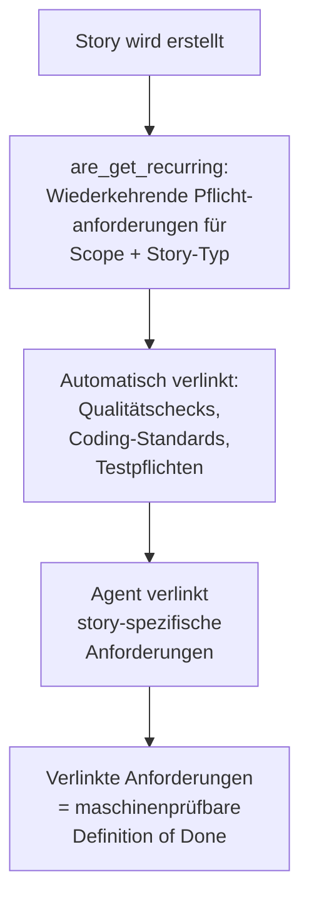

# 40 — ARE-Integration und Anforderungsvollständigkeit

<!-- PROSE-FORMAL: formal.deterministic-checks.entities, formal.deterministic-checks.invariants, formal.deterministic-checks.scenarios -->

## 40.1 Zweck

Die Agent Requirements Engine (ARE) ist eine **optionale** externe
Komponente. Sie verwaltet Anforderungen als typisierte Objekte und
erzwingt Vollständigkeit: Jede als `must_cover` verlinkte
Anforderung muss Evidence haben, bevor eine Story geschlossen
werden kann (FK 9).

ARE ist kein Teil von AgentKit. AgentKit greift ausschließlich
über MCP auf ARE zu — kein direkter Datenbank-Zugriff (Kap. 01).

**Was ARE erzwingt:** Vollständigkeit, nicht Qualität. Ein Agent
kann Evidence fälschen, aber er kann keine Anforderung ignorieren.
Ob die Evidence den Anspruch tatsächlich erfüllt, bewerten die
Verify-Phase und der Mensch (FK-09-005 bis FK-09-010).

**Abgrenzung Vollständigkeit vs. Qualität (FK-40-037):** ARE prüft
ausschließlich das Vorhandensein von Evidence — d.h. ob für jede
`must_cover`-Anforderung ein Nachweis eingereicht wurde. Die
Bewertung, ob dieser Nachweis die Anforderung tatsächlich erfüllt
(inhaltliche Qualität), ist explizit nicht Aufgabe von ARE. Diese
Bewertung verbleibt in der Verify-Phase (QA-Bewertung, Semantic
Review) und beim Menschen im GitHub-Review. Diese Trennung ist
beabsichtigt: ARE garantiert Lückenlosigkeit des Prozesses,
nicht die fachliche Korrektheit des Ergebnisses.

> **[Entscheidung 2026-04-08]** Element 21 — ARE-Integration: Beide Modi sind Produktionspfade. ARE deaktiviert: Pipeline laeuft ohne ARE-Gate. ARE aktiviert: ARE-Gate ist Pflicht, ohne ARE-Bestaetigung kein Merge. Installer entscheidet Modus. Kein Fallback, kein Graceful-Degradation.
> Siehe `stories/entscheidung-v2-ballast-bewertung.md`, Element 21.

## 40.2 Aktivierung

```yaml
# .story-pipeline.yaml
features:
  are: false              # Default: deaktiviert

are:
  mcp_server: "are-server"  # MCP-Server-Name (registriert in .mcp.json)
```

Wenn `features.are: false`: Alle vier Andock-Punkte entfallen
komplett. Kein Fehler, kein Fallback-Code — die Pipeline-Schritte
existieren einfach nicht (FK-09-014).

## 40.3 Scope-Zuordnung

### 40.3.1 Zwei Zuordnungstabellen

- Pipeline-Konfiguration (`.story-pipeline.yaml`) pflegt zwei getrennte Mapping-Tabellen:
  - `repos[].are_scope`: Jedes Code-Repository → genau ein ARE-Scope-String (z.B. `backend`, `frontend`, `agentframework`)
  - `are.module_scope_map`: Jeder GitHub-Project-"Modul"-Feldwert → genau ein ARE-Scope-String
- Root-Repos und reine Dokumentations-Repos ausgenommen — nur Code-Repos brauchen Zuordnung
- Kommaseparierte Multi-Values im Modul-Feld werden in einzelne Tokens aufgeteilt
- Die Tabellen sind Konfigurationszeit-Artefakte (bei Installation/Update gepflegt), keine Laufzeitentscheidungen

### 40.3.2 Konfiguration bei Installation

- Installer-Checkpoint (FK 50) validiert: alle Repos haben `are_scope`, alle Modul-Werte haben Mapping
- Delta-Erkennung: nur neue/unmapped Items werden abgefragt
- Interaktiv: nummerierte Auswahl aus verfügbaren ARE-Scopes (Quelle: ARE-Dimension `scope` via REST oder Fallback auf bereits konfigurierte Scopes)
- Agentisch (non-interactive): Checkpoint gibt `PENDING_SELECTION` zurück mit strukturierten Metadaten (repos_needing_scopes, modules_needing_mappings, available_scopes). Orchestrierender Agent muss `resolve_pending_scope_mapping(repo_scopes={}, module_scopes={})` aufrufen
- Bereits zugeordnete Einträge werden bei Updates NICHT erneut abgefragt

### 40.3.3 Scope-Ableitung bei Story-Erstellung

- Zwei-Tier-Priorität:

| Priorität | Quelle | Wann |
|-----------|--------|------|
| 1 (primär) | Participating Repos | Story hat identifizierte betroffene Repos. Jedes Repo über Repo→Scope aufgelöst |
| 2 (Fallback) | Modul-Feld | Keine Participating Repos (z.B. Konzeptarbeit). Modul-Wert über Module→Scope aufgelöst |

- Resultierende Scope-Schlüssel steuern `search_requirements(scope_key=...)` für Auto-Match
- Wenn weder Repos noch Modul: kein Scope, optional `global` Fallback (Projektkonfiguration)

### 40.3.4 Verantwortlichkeiten

- Mensch: Entscheidet Zuordnungen bei Installation, prüft auto-zugeordnete Anforderungen bei Story-Erstellung
- Automation: Scope-Ableitung zur Laufzeit, Anforderungssuche, Applicability-Rule-Evaluierung, automatische Verknüpfung

FK-Referenz: Domain-Konzept 9.2 "Scope-Zuordnung"

## 40.4 MCP-Schnittstellenvertrag

ARE wird über MCP angebunden. Falls ARE nativ nur REST/FastAPI
spricht, wird ein MCP-Wrapper als Adapter implementiert — analog
zum Weaviate-Wrapper (Kap. 13).

### 40.4.1 MCP-Tools

| Tool | Parameter | Rückgabe | Andock-Punkt |
|------|----------|---------|-------------|
| `are_list_requirements` | `story_id`, `scope` | Liste von Anforderungen mit ID, Typ, `must_cover`-Flag, Beschreibung | 1 (Verlinken) |
| `are_get_recurring` | `scope`, `story_type` | Wiederkehrende Pflichtanforderungen für diesen Scope/Typ | 1 (Verlinken) |
| `are_load_context` | `story_id` | `must_cover`-Anforderungen mit Details für Worker-Kontext | 2 (Kontext laden) |
| `are_submit_evidence` | `story_id`, `requirement_id`, `evidence_type`, `evidence_ref` | Bestätigung | 3 (Evidence einreichen) |
| `are_check_gate` | `story_id` | PASS/FAIL + Liste unbelegter Anforderungen | 4 (Gate prüfen) |

### 40.4.2 Anforderungs-Typen (FK-09-002)

| Typ | Beschreibung |
|-----|-------------|
| `regulatory` | Regulatorik-Klauseln |
| `business_rule` | Geschäftsregeln |
| `report_mapping` | Report-Mappings |
| `system` | Systemanforderungen |
| `quality` | Qualitätsanforderungen |

## 40.5 Vier Andock-Punkte

### 40.5.1 Andock-Punkt 1: Anforderungen verlinken (FK-09-015)

**Wo:** Story-Erstellung (Kap. 21)

**Wer ruft auf:** Pipeline-Skript im Erstellungsprozess

**Was passiert:**



1. `are_get_recurring(scope, story_type)` liefert wiederkehrende
   Pflichtanforderungen
2. Diese werden automatisch mit der Story verknüpft
3. Der Agent verlinkt zusätzlich story-spezifische Anforderungen
   via `are_list_requirements(story_id, scope)`
4. Die Gesamtheit bildet die maschinenprüfbare Definition of Done

### 40.5.2 Andock-Punkt 2: Anforderungskontext laden (FK-09-016)

**Wo:** Setup-Phase (Kap. 22), vor Worker-Start

**Wer ruft auf:** Deterministisches Pipeline-Skript (Setup-Phase)

**Was passiert:**

Das Setup-Skript ruft ARE ab und schreibt den Bundle als eigenständige
Content-Plane-Datei in das QA-Verzeichnis der Story. Der Worker findet
den Bundle beim Start vor — er muss ARE für das initiale Laden nicht
selbst ansprechen. Der Orchestrator-Agent wird nicht einbezogen.

```python
def load_are_bundle(story_id: str, config: PipelineConfig) -> AreBundleResult:
    """Lädt ARE-Bundle und persistiert ihn als Content-Plane-Artefakt.

    Wird durch das Setup-Skript aufgerufen, nicht durch den Orchestrator-Agent.
    Bei Fehler: Setup schreibt status=FAILED in den Phase-State und bricht ab.
    Der Orchestrator-Agent beobachtet nur diesen Zustand — er lädt nicht nach.
    """
    if not config.features.are:
        return AreBundleResult(status="SKIPPED", requirement_count=0)

    try:
        requirements = are_mcp.call("are_load_context", story_id=story_id)
    except AreMcpError as exc:
        return AreBundleResult(status="FAILED", error=str(exc))

    bundle_path = Path(f"_temp/qa/{story_id}/are_bundle.json")
    bundle_path.parent.mkdir(parents=True, exist_ok=True)
    try:
        bundle_path.write_text(json.dumps({
            "schema_version": "1.0",
            "story_id": story_id,
            "fetched_at": now_iso(),
            "must_cover": requirements,
        }, ensure_ascii=False, indent=2))
    except OSError as exc:
        return AreBundleResult(status="FAILED", error=str(exc))

    return AreBundleResult(status="LOADED", requirement_count=len(requirements))
```

**Stopppunkt bei FAILED:**
Gibt `load_are_bundle()` `status=FAILED` zurück, schreibt das Setup-Skript
diesen Status in den Phase-State und bricht die Setup-Phase ab. Der
Orchestrator-Agent liest den Phase-State und sieht `FAILED` — er startet
keinen Worker und beschafft den Bundle nicht eigenständig nach (FK 4.5,
FK 9.3). Der primäre Stopppunkt liegt im Setup-Skript, nicht im
Orchestrator-Agenten.

**Ergebnis im Phase-State (Control-Plane):**
Das Ergebnis wird als strukturiertes Signal in den Phase-State eingetragen.
Der Phase-State ist das maßgebliche Control-Plane-Artefakt, das der
Orchestrator liest — neben weiteren Steuerungs-Artefakten wie
Lock-Record und Marker-Exporte (vgl. FK 31.2):

```json
{
  "are_bundle": {
    "status": "LOADED",
    "requirement_count": 12
  }
}
```

**Artefakt-Klasse:**
`are_bundle.json` ist ein Content-Plane-Artefakt (Kap. 31.2). Es ist
für Worker und QA-Agent lesbar, für den Orchestrator-Agenten blockiert.
Der Worker weiß dadurch, welche Anforderungen er adressieren und mit
Evidence belegen muss.

### 40.5.3 Andock-Punkt 3: Evidence einreichen (FK-09-017)

**Wo:** Während Implementation + Verify-Phase

**Wer ruft auf:** Worker-Agent und QA-Prozess

**Was passiert:**

Der Worker reicht während der Implementierung Evidence pro
Anforderung ein:

```python
are_mcp.call("are_submit_evidence",
    story_id=story_id,
    requirement_id="REQ-042",
    evidence_type="test_report",
    evidence_ref="tests/test_broker_adapter.py::test_rate_limit",
)
```

**Evidence-Typen:**

| Typ | Beschreibung | Beispiel |
|-----|-------------|---------|
| `test_report` | Testreport als Nachweis | Test-Locator |
| `commit_ref` | Commit als Nachweis | Commit-SHA |
| `artifact_ref` | Artefakt als Nachweis | Pfad zu Dokument |
| `manual_note` | Manuelle Notiz | Freitext-Begründung |

Der QA-Agent kann ebenfalls Evidence einreichen (z.B. nach
Adversarial Testing).

### 40.5.4 Andock-Punkt 4: ARE-Gate prüfen (FK-09-018)

**Wo:** Verify-Phase, Schicht 1 (deterministische Checks)

**Wer ruft auf:** Deterministisches Pipeline-Skript

**Was passiert:**

```python
def check_are_gate(story_id: str) -> StageResult:
    result = are_mcp.call("are_check_gate", story_id=story_id)

    if result["status"] == "PASS":
        return StageResult(stage_id="are_gate", status="PASS", ...)

    uncovered = result["uncovered_requirements"]
    return StageResult(
        stage_id="are_gate",
        status="FAIL",
        blocking=True,
        detail=f"{len(uncovered)} requirements without evidence: "
               + ", ".join(r["id"] for r in uncovered),
    )
```

**Ergebnis:** PASS wenn alle `must_cover`-Anforderungen Evidence
haben. FAIL mit Liste der unbelegten Anforderungen wenn nicht.

**Ergebnis-Artefakt:** `_temp/qa/{story_id}/are_gate.json`

## 40.6 Fallback ohne ARE (FK-09-019 bis FK-09-022)

Ohne ARE gibt es keinen maschinellen Vollständigkeits-Check auf
Anforderungsebene. Stattdessen:

| Mechanismus | Beschreibung |
|-------------|-------------|
| Statische DoD-Checkliste | Im Issue-Body unter `## Definition of Done` (Kap. 21.10.1) |
| Semantic Review | QA-Bewertung Check `ac_fulfilled` prüft Akzeptanzkriterien |
| Mensch | Bewertet manuell bei GitHub-Review |

**AgentKit läuft vollständig ohne ARE** (FK-09-022). Die
Anforderungsvollständigkeit ist ohne ARE weniger robust, aber
funktional: Die Verify-Phase prüft Akzeptanzkriterien über den
LLM-Review (Kap. 34.2.2, Check `ac_fulfilled`), und die statische
Checkliste im Issue-Template dient als menschenlesbare Orientierung.

## 40.7 ARE in der Stage-Registry

```python
StageDefinition(
    id="are_gate",
    layer=1,
    kind="deterministic",
    applies_to=frozenset({"implementation", "bugfix"}),
    blocking=True,
    trust_class="A",  # ARE ist autoritatives System
    producer="qa-are-gate",
)
```

Die Stage ist nur in der Registry wenn `features.are: true`.
Bei `false` wird sie nicht geladen und nicht evaluiert.

## 40.8 Telemetrie

ARE-Interaktionen werden in `execution_events` geloggt:

| Event | Wann |
|-------|------|
| `are_requirements_linked` | Andock-Punkt 1: Anforderungen verlinkt |
| `are_evidence_submitted` | Andock-Punkt 3: Evidence eingereicht |
| `are_gate_result` | Andock-Punkt 4: Gate-Ergebnis (PASS/FAIL) |

Das Integrity-Gate prüft bei ARE-aktivierten Stories, dass
`are_gate_result` mit `status: PASS` in der Telemetrie vorliegt.

## 40.9 Fehlerbehandlung

| Fehler | Reaktion |
|--------|---------|
| ARE-MCP-Server nicht erreichbar bei Story-Erstellung | Warnung. Story wird ohne Anforderungsverknüpfung erstellt. |
| ARE-MCP-Server nicht erreichbar bei Verify (Gate-Check) | ARE-Gate = FAIL (fail-closed). Story kann nicht ohne ARE-Nachweis geschlossen werden, wenn ARE aktiviert ist. |
| Evidence-Einreichung scheitert | Warnung an Worker. Worker muss erneut versuchen. |

**Wichtig:** ARE ist optional, aber wenn aktiviert, ist das Gate
blocking. Man kann ARE nicht "halb" aktivieren — entweder die
Vollständigkeitsgarantie gilt, oder ARE ist aus.

---

*FK-Referenzen: FK-09-001 bis FK-09-022 (ARE komplett)*
