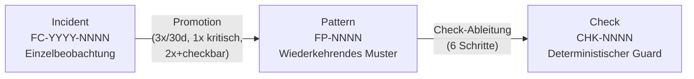
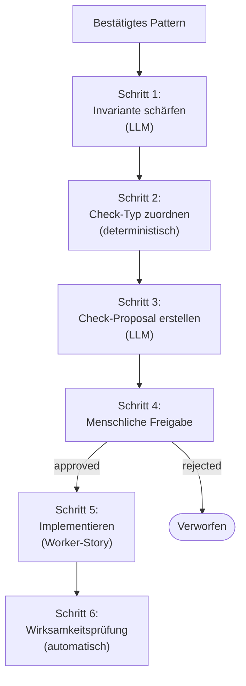

# 41 — Failure Corpus, Pattern-Promotion und Check-Factory

## 41.1 Zweck

LLM-gesteuerte Agents produzieren nicht-deterministische Fehler.
Dieselbe Aufgabe kann beim ersten Mal gelingen und beim zweiten
Mal auf völlig andere Weise scheitern. Der Failure Corpus ist die
methodische Antwort: Stochastisches Fehlverhalten wird in
deterministische Pipeline-Guards überführt (FK 10).

## 41.2 Drei-Ebenen-Modell



| Ebene | Artefakt | Beschreibung |
|-------|----------|-------------|
| **Incident** | Einzelbeobachtung | Konkreter Fehlerfall mit Kontext, Symptom, Evidenz, Klassifikation |
| **Pattern** | Wiederkehrendes Muster | Normalisierte Invariante über mehrere Incidents |
| **Check** | Deterministischer Guard | Regel in der Pipeline, die das Pattern maschinell prüft |

**Nicht aus jedem Incident wird ein Pattern, nicht aus jedem
Pattern wird ein Check.** Das ist gewollt (FK-10-006).

## 41.3 Speicherung

Failure-Corpus-Daten sind **permanent**, nicht temporär.
Speicherort: `.agentkit/failure-corpus/` (Kap. 10.3.1).

**F-41-071 — Konzeptdokument als dauerhaftes Design-Artefakt (FK-10-071):** Das Failure-Corpus-Konzeptdokument muss unter `_concept/failure-corpus-konzept.md` als persistentes Design-Artefakt gepflegt werden. Es beschreibt Zweck, Datenmodell und Betriebsgrundsätze des Corpus und ist verbindliche Grundlage für alle Implementierungs- und Weiterentwicklungsentscheidungen.

```
.agentkit/
└── failure-corpus/
    ├── incidents.jsonl       # Alle Incidents (append-only)
    ├── patterns.jsonl        # Bestätigte Patterns
    └── checks/
        └── CHK-{NNNN}/
            ├── proposal.json # Check-Proposal (Status: draft/approved/rejected)
            ├── fixtures/     # Positive + Negative Test-Fixtures
            └── metrics.json  # Wirksamkeits-Tracking
```

## 41.4 Incident-Erfassung

### 41.4.1 Incident-Schema

```python
class FailureCategory(Enum):
    SCOPE_DRIFT = "scope_drift"
    ARCHITECTURE_VIOLATION = "architecture_violation"
    EVIDENCE_FABRICATION = "evidence_fabrication"
    HALLUCINATION = "hallucination"
    TEST_OMISSION = "test_omission"
    ASSERTION_WEAKNESS = "assertion_weakness"
    UNSAFE_REFACTOR = "unsafe_refactor"
    POLICY_VIOLATION = "policy_violation"
    TOOL_MISUSE = "tool_misuse"
    STATE_DESYNC = "state_desync"
    REQUIREMENTS_MISS = "requirements_miss"
    REVIEW_EVASION = "review_evasion"
```

```json
{
  "id": "FC-2026-0017",
  "timestamp": "2026-03-17T14:00:00+01:00",
  "story_id": "ODIN-042",
  "run_id": "a1b2...",
  "category": "scope_drift",
  "severity": "mittel",
  "phase": "implementation",
  "role": "worker",
  "model": "claude-opus",
  "symptom": "Worker hat Logging-Framework gewechselt, obwohl nur ein Bugfix beauftragt war",
  "evidence": ["commit a1b2c3d: replaced log4j with logback across 12 files"],
  "tags": ["opportunistic_refactor", "bugfix_scope"],
  "impact": "Regression in 3 bestehenden Log-Assertions"
}
```

### 41.4.2 Erfassungsmechanismen (FK-10-007 bis FK-10-014)

| Akteur | Trigger | Schwerpunkt |
|--------|---------|-------------|
| **Governance-Beobachtung** (Kap. 35.3) | Schwellenüberschreitung, LLM-klassifiziert | Anomalien im Agent-Verhalten, Prozessverletzungen |
| **Pipeline** (automatisch) | QA-Gate FAIL, Verify-Failure, Impact-Violation | Harte Trigger, erzeugt Roh-Incident |
| **QA Evaluation** (Kap. 41.4.2a) | Neuartiges Fehlerbild im QA-Check erkannt | Normalisierung und Übergabe als Incident-Kandidat |
| **Adversarial Agent** | Gezielte Provokation | Systemische Schwächen |
| **Rückkopplungstreue FAIL** | Dokumententreue Ebene 4 | Veraltete Dokumentation |
| **Mensch** | Manuelle Eskalation | Produktionsrelevante Vorfälle, neue Fehlertypen |

**F-41-069 — QA Evaluation als Erfassungsakteur (FK-10-069):** Die QA-Evaluation agiert als Capture-Akteur für den Failure Corpus. Erkennt ein QA-Check ein neuartiges Fehlermuster, das bisher nicht im Corpus vertreten ist, normalisiert er den Befund in das Incident-Kandidaten-Format und gibt ihn zur Aufnahme in den Failure Corpus weiter. Damit schliesst die QA-Schicht den Rückkopplungskreis zwischen laufender Qualitätssicherung und der Corpus-Pflege.

### 41.4.3 Aufnahmekriterien (FK-10-015 bis FK-10-017)

Nicht jeder fehlgeschlagene Test wird ein Incident:

| Kriterium | Schwelle |
|-----------|---------|
| Severity | Mindestens "mittel" |
| Merge blockiert | Ja |
| Rework-Zeit | Über 30 Minuten |
| Fehlertyp neu | Noch nicht im Corpus vertreten |

**Ziel:** Unter 20 neue Incidents pro Monat (FK-10-017).

### 41.4.4 Neue Kategorien (FK-10-031)

Neue Top-Level-Kategorien werden nur aufgenommen, wenn mindestens
5 Incidents den Fall belegen und kein bestehender Typ ihn abdeckt.

## 41.5 Pattern-Promotion

### 41.5.1 Promotion-Regeln (FK-10-032 bis FK-10-036)

| Regel | Kriterium |
|-------|----------|
| Wiederholung | Mindestens 3 Incidents gleichen Typs innerhalb 30 Tagen |
| Hohe Schwere | 1 Incident reicht bei produktionsrelevantem oder sicherheitskritischem Impact |
| Günstige Checkbarkeit | 2 Incidents reichen, wenn ein Check mit niedriger False-Positive-Gefahr ableitbar |

### 41.5.2 Automatisches Clustering

Ein periodisches Skript (oder manuell ausgelöst) clustert
Incidents nach Kategorie + Symptom-Ähnlichkeit und schlägt
Pattern-Kandidaten vor:

```bash
agentkit failure-corpus suggest-patterns
```

Output: Liste von Kandidaten mit zugehörigen Incidents,
vorgeschlagenem Invariant-Kandidaten und Promotion-Regel.

### 41.5.3 Menschliche Bestätigung (Pflicht)

**Kein Pattern wird ohne menschliche Bestätigung aktiviert**
(FK-10-035). Der Mensch bestätigt oder verwirft im wöchentlichen
15-Minuten-Review-Slot (FK-10-058).

```bash
agentkit failure-corpus review-patterns
```

Zeigt offene Kandidaten. Mensch entscheidet: bestätigen oder
verwerfen.

### 41.5.4 Pattern-Schema

```json
{
  "id": "FP-0003",
  "status": "confirmed",
  "confirmed_at": "2026-03-20T09:00:00+01:00",
  "confirmed_by": "human",
  "category": "scope_drift",
  "invariant": "Stories vom Typ Bugfix dürfen keine Dateien außerhalb des betroffenen Moduls ändern",
  "incident_refs": ["FC-2026-0012", "FC-2026-0015", "FC-2026-0017"],
  "promotion_rule": "wiederholung",
  "risk_level": "hoch",
  "owner": "team-trading"
}
```

## 41.6 Check-Ableitung (6 Schritte)

### 41.6.1 Übersicht



### 41.6.2 Schritt 1: Invariante schärfen (FK-10-040 bis FK-10-042)

**Wer:** StructuredEvaluator (LLM als Bewertungsfunktion)

**Input:** Bestätigtes Pattern mit Incident-Referenzen und
Invariant-Kandidaten

**Output:** Präzise, deterministische Regel als strukturierter Text

**Beispiel:** Aus "Agent ändert Security-Dateien ohne Security-Story"
wird: "Wenn das Issue-Feld 'Module' nicht 'security' enthält,
dürfen keine Dateien in den Pfaden security/, auth/ oder Dateien
mit 'Permission' oder 'Policy' im Namen verändert werden."

**F-41-070 — Ausgearbeitetes Beispiel: Invariante schärfen (FK-10-070):** Der Schärfungsprozess muss anhand eines konkreten Durchlaufs dokumentiert sein. Ausgangspunkt ist ein vager Pattern-Kandidat wie "Agent überspringt E2E-Tests"; das Ergebnis ist eine deterministische Invariante wie "E2E-Evidenz muss Test-Runner-Exit-Code und Zeitstempel enthalten, andernfalls gilt der E2E-Nachweis als fehlend". Dieser Übergang — von einer Beobachtung zu einer maschinell prüfbaren Bedingung — ist das Kernmuster der Check-Ableitung und muss als Referenzbeispiel in der Dokumentation dauerhaft erhalten bleiben.

### 41.6.3 Schritt 2: Check-Typ zuordnen (FK-10-043 bis FK-10-052)

**Wer:** Deterministisch (kein LLM)

| Fehlerkategorie | Check-Typ |
|-----------------|-----------|
| scope_drift, unsafe_refactor | Changed-File-Policy |
| evidence_fabrication, review_evasion | Artifact-Completeness |
| test_omission, assertion_weakness | Test-Obligation |
| policy_violation, tool_misuse | Sensitive-Path-Guard |
| architecture_violation | Forbidden-Dependency |
| hallucination, state_desync | Fixture-Replay |
| requirements_miss | Artifact-Completeness |

Bei Mehrdeutigkeit: einfachster Typ (FK-10-051).

### 41.6.4 Schritt 3: Check-Proposal erstellen (FK-10-053 bis FK-10-057)

**Wer:** StructuredEvaluator (LLM als Bewertungsfunktion)

**Output:** `checks/CHK-{NNNN}/proposal.json`

```json
{
  "id": "CHK-0012",
  "status": "draft",
  "pattern_ref": "FP-0003",
  "invariant": "Bugfix-Stories: keine Dateien außerhalb des betroffenen Moduls",
  "check_type": "Changed-File-Policy",
  "input_data": ["story_metadaten.module", "changed_files"],
  "pipeline_stage": "structural",
  "pipeline_layer": 1,
  "owner": "team-trading",
  "false_positive_risk": "niedrig",
  "positive_fixtures": [
    {"description": "Bugfix ändert nur betroffenes Modul", "expected": "PASS"},
    {"description": "Bugfix ändert fremdes Modul", "expected": "FAIL"}
  ],
  "negative_fixtures": [
{"description": "Implementation-Story ändert mehrere Module", "expected": "PASS (nicht applicable)"}
  ]
}
```

### 41.6.5 Schritt 4: Menschliche Freigabe (FK-10-058 bis FK-10-060)

Im wöchentlichen Review-Slot:

```bash
agentkit failure-corpus review-checks
```

Mensch sieht offene Proposals und entscheidet: freigeben, anpassen
oder verwerfen. Status wechselt auf `approved` oder `rejected`.

**Das ist die einzige Stelle, an der der Mensch in der
Check-Ableitung aktiv wird** (FK-10-059).

### 41.6.6 Schritt 5: Implementieren (FK-10-061 bis FK-10-071)

Für jeden freigegebenen Proposal wird **automatisch eine Story
vom Typ Implementation** erzeugt:

```python
def create_check_implementation_story(proposal: dict) -> str:
    title = f"[implementation] Implement Failure Corpus Check {proposal['id']}"
    body = f"""
## Problemstellung
Failure Corpus Pattern {proposal['pattern_ref']} hat einen
deterministischen Check identifiziert.

## Lösungsansatz
Check implementieren als Python-Skript, gegen Fixtures testen,
in Stage-Registry registrieren.

## Akzeptanzkriterien
- [ ] Check implementiert als deterministisches Skript
- [ ] Positive Fixtures lösen FAIL aus
- [ ] Negative Fixtures passieren (PASS)
- [ ] Check in Stage-Registry registriert (Layer {proposal['pipeline_layer']})
"""
    return gh_issue_create(title, body, labels=["story"])
```

Die Story durchläuft die reguläre AgentKit-Pipeline (Worker
implementiert, Verify prüft, Closure mergt).

**Pipeline-Stufe nach Check-Typ:**

| Check-Typ | Pipeline-Stufe |
|-----------|---------------|
| Changed-File-Policy | **Pre-Merge** (frühestmöglich, vor Structural Checks) |
| Sensitive-Path-Guard | **Pre-Merge** (frühestmöglich) |
| Artifact-Completeness | Structural Checks (Schicht 1) |
| Test-Obligation | Structural Checks (Schicht 1) |
| Forbidden-Dependency | Structural Checks (Schicht 1) |
| Fixture-Replay | Structural Checks (Schicht 1) |

Status wechselt auf `active`.

### 41.6.7 Schritt 6: Wirksamkeitsprüfung (FK-10-072 bis FK-10-085)

Ein periodisches Skript zählt pro aktivem Check:

```python
def check_effectiveness(check_id: str, days: int = 90) -> dict:
    return {
        "check_id": check_id,
        "period_days": days,
        "true_positives": count_triggers(check_id, days),
        "false_positives": count_overrides(check_id, days),
        "no_findings": count_clean_runs(check_id, days),
    }
```

**Wirksamkeits-Report:** Wird nach 30 Tagen automatisch erzeugt
und im wöchentlichen Review-Slot angezeigt (FK-10-077 bis FK-10-079).

```bash
agentkit failure-corpus effectiveness-report
```

**Auto-Deaktivierung (FK-10-080 bis FK-10-084):**

| Bedingung | Reaktion |
|-----------|---------|
| 90 Tage kein realer Fund UND > 3 False Positives | Automatisch deaktiviert. Mensch wird informiert. |
| Mensch macht Deaktivierung rückgängig | Check wird reaktiviert |
| Pattern-Schweregrad "kritisch" oder "sicherheitskritisch" | **Ausgenommen** von Auto-Deaktivierung. Nur manuell durch Mensch. |

Status wechselt auf `tuned` (angepasst) oder `retired`
(deaktiviert).

## 41.7 Grundprinzip: Kein LLM-Judging als Check

**Wenn ein Check ein LLM braucht, gehört er in den Semantic Review,
nicht in den Failure Corpus** (FK-10-039). Failure-Corpus-Checks
sind ausschließlich deterministisch — Pfad-Matching, Diff-Analyse,
Artefakt-Prüfung. Keine LLM-Aufrufe zur Laufzeit.

LLMs werden nur in Schritt 1 und 3 der Check-Ableitung eingesetzt
(Invariante schärfen, Proposal erstellen) — nicht im Check selbst.

## 41.8 Anti-Patterns (FK-10-086 bis FK-10-093)

| Anti-Pattern | Gegenmassnahme |
|-------------|----------------|
| Alles sammeln | Strikte Aufnahmekriterien, Ziel unter 20/Monat |
| Aus jedem Vorfall sofort Check bauen | Pattern-Promotion erst nach Schwellenkriterien |
| Checks ohne Owner | Jeder Check hat einen Owner für Pflege und Sunset |
| Checks zu spät in der Pipeline | An die früheste deterministische Stelle (Schicht 1) |
| Kein Sunset-Mechanismus | Nutzen-Review nach 30 Tagen, dann alle 90 Tage |
| Failure Corpus als Compliance-Theater | Wöchentlicher 15-Minuten-Review-Slot |

## 41.9 CLI-Befehle

```bash
# Incident manuell erfassen
agentkit failure-corpus add-incident --story ODIN-042 --category scope_drift --severity mittel

# Pattern-Kandidaten anzeigen
agentkit failure-corpus suggest-patterns

# Patterns reviewen (menschliche Bestätigung)
agentkit failure-corpus review-patterns

# Check-Proposals reviewen (menschliche Freigabe)
agentkit failure-corpus review-checks

# Wirksamkeits-Report
agentkit failure-corpus effectiveness-report

# Alle aktiven Checks anzeigen
agentkit failure-corpus list-checks --status active
```

---

*FK-Referenzen: FK-10-001 bis FK-10-093 (Failure Corpus komplett)*
