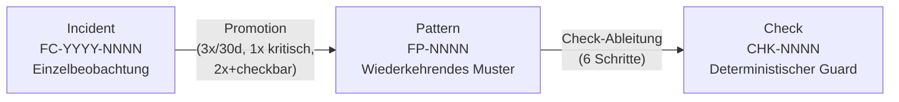

# 41 — Failure Corpus, Pattern-Promotion und Check-Factory

<!-- PROSE-FORMAL: formal.deterministic-checks.invariants, formal.deterministic-checks.scenarios -->

## 41.1 Zweck

LLM-gesteuerte Agents produzieren nicht-deterministische Fehler.
Dieselbe Aufgabe kann beim ersten Mal gelingen und beim zweiten
Mal auf völlig andere Weise scheitern. Der Failure Corpus ist die
methodische Antwort: Stochastisches Fehlverhalten wird in
deterministische Pipeline-Guards überführt (FK 10).

## 41.2 Drei-Ebenen-Modell



| Ebene | Artefakt | Beschreibung |
|-------|----------|-------------|
| **Incident** | Einzelbeobachtung | Konkreter Fehlerfall mit Kontext, Symptom, Evidenz, Klassifikation |
| **Pattern** | Wiederkehrendes Muster | Normalisierte Invariante über mehrere Incidents |
| **Check** | Deterministischer Guard | Regel in der Pipeline, die das Pattern maschinell prüft |

**Nicht aus jedem Incident wird ein Pattern, nicht aus jedem
Pattern wird ein Check.** Das ist gewollt (FK-10-006).

## 41.3 Speicherung und Tabellen-Schemas

Failure-Corpus-Daten sind **permanent**, nicht temporaer.
**Kanonische Wahrheit:** Postgres-Tabellen `fc_incidents`, `fc_patterns`,
`fc_check_proposals` im zentralen State-Backend.
**DB-Owner:** `telemetry-and-events.ProjectionAccessor`
(`agentkit.telemetry.read_models.fc_*`); Schema-Owner ist `failure-corpus`
(dieses Dokument).
**Schreib-Komponente:** `failure_corpus.FailureCorpus` via
`Telemetry.write_projection`.
**Lese-Schnittstelle:** `Telemetry.read_projection` (sub_exposed).

JSONL-Dateien unter `.agentkit/failure-corpus/` sind Legacy-Exporte
und Backfill-Quellen, nicht operative Hauptwahrheit. Regelmaessige
Operationen richten sich ausschliesslich nach den Postgres-Tabellen.

**F-41-071 — Konzeptdokument als dauerhaftes Design-Artefakt (FK-10-071):** Das
Failure-Corpus-Konzeptdokument muss unter `_concept/failure-corpus-konzept.md`
als persistentes Design-Artefakt gepflegt werden. Es beschreibt Zweck,
Datenmodell und Betriebsgrundsaetze des Corpus und ist verbindliche Grundlage
fuer alle Implementierungs- und Weiterentwicklungsentscheidungen.

### 41.3.1 Tabelle `fc_incidents`

**Modul:** `agentkit.telemetry.read_models.fc_incidents`
**Schema-Owner:** failure-corpus
**Writer-Komponente:** `failure_corpus.FailureCorpus`

Pflichtattribute:

- `project_key`
- `incident_id` — Format `FC-YYYY-NNNN`
- `run_id`
- `story_id`
- `category` — Enum-Wert aus `FailureCategory` (§41.4.1)
- `severity` — `niedrig | mittel | hoch | kritisch`
- `phase` — betroffene Pipeline-Phase
- `role` — ausfuehrender Akteur (`worker | qa | governance`)
- `model` — verwendetes LLM-Modell
- `symptom` — Freitextbeschreibung des Fehlerbildes
- `evidence` — Liste von Evidenz-Strings
- `recorded_at`

Optionale Attribute:

- `tags`
- `impact`
- `pattern_ref` — Verweis auf `fc_patterns.pattern_id` nach Clustering

Fachregeln:

- Pro `incident_id` gibt es genau einen Datensatz (append-only).
- `project_key` ist Pflicht; Abfragen sind stets projektgebunden.
- Vollstaendiger Story-Reset loescht alle `fc_incidents`-Zeilen des
  betroffenen `run_id`.

### 41.3.2 Tabelle `fc_patterns`

**Modul:** `agentkit.telemetry.read_models.fc_patterns`
**Schema-Owner:** failure-corpus
**Writer-Komponente:** `failure_corpus.PatternPromotion`

Pflichtattribute:

- `project_key`
- `pattern_id` — Format `FP-NNNN`
- `status` — Enum aus `promotion-status` (§glossary): `candidate |
  accepted | check_proposed | check_active | monitoring | retired`
- `category` — Enum-Wert aus `FailureCategory`
- `invariant` — praezise, deterministische Regelaussage
- `incident_refs` — JSON-Array der zugehoerigen `incident_id`-Werte
- `promotion_rule` — `wiederholung | hohe_schwere | checkbarkeit`
- `risk_level` — `mittel | hoch | kritisch`
- `incident_count` — denormalisierter Zaehler; rebuildbar aus `incident_refs`
- `confirmed_at` — Zeitstempel der menschlichen Bestaetigung
- `confirmed_by` — `human` (kein automatischer Eintrag)

Optionale Attribute:

- `owner`
- `check_ref` — Verweis auf `fc_check_proposals.check_id` nach Ableitung
- `retired_at`

Fachregeln:

- Kein Pattern wechselt in Status `accepted` ohne `confirmed_by = human`.
- `incident_count` muss nach vollstaendigem Story-Reset neu berechnet
  werden, wenn betroffene Incidents entfernt wurden.

### 41.3.3 Tabelle `fc_check_proposals`

**Modul:** `agentkit.telemetry.read_models.fc_check_proposals`
**Schema-Owner:** failure-corpus
**Writer-Komponente:** `failure_corpus.CheckFactory`

Pflichtattribute:

- `project_key`
- `check_id` — Format `CHK-NNNN`
- `status` — Enum aus `promotion-status`: `draft | approved | rejected |
  active | tuned | retired`
- `pattern_ref` — Verweis auf `fc_patterns.pattern_id`
- `invariant` — deterministische Regelaussage (abgeleitet aus Pattern)
- `check_type` — Enum: `Changed-File-Policy | Artifact-Completeness |
  Test-Obligation | Sensitive-Path-Guard | Forbidden-Dependency |
  Fixture-Replay`
- `pipeline_stage` — Ziel-Stage in der Verify-Pipeline
- `pipeline_layer` — Ziel-Layer (1 = Structural, 2 = LLM-Eval, …)
- `owner` — Team-Identifier
- `false_positive_risk` — `niedrig | mittel | hoch`
- `positive_fixtures` — JSON-Array mit `{description, expected}`
- `negative_fixtures` — JSON-Array mit `{description, expected}`
- `created_at`

Optionale Attribute:

- `approved_at`
- `approved_by`
- `rejected_reason`
- `effectiveness_last_checked_at`
- `true_positives_90d`
- `false_positives_90d`

Fachregeln:

- Status-Uebergaenge sind ausschliesslich vorwaertsgerichtet, ausser
  manuellem Rueckruf einer Auto-Deaktivierung (§41.6.7).
- `approved_by` muss `human` sein; automatische Freigaben sind unzulaessig.
- Ein vollstaendiger Story-Reset beruehrt `fc_check_proposals` nicht;
  Check-Lifecycle ist story-unabhaengig.

### 41.3.4 Legacy-Export-Struktur

Die folgende Dateistruktur dient als Export- und Backfill-Quelle.
Operative Abfragen laufen immer ueber die Postgres-Tabellen (§41.3.1–3).

```
.agentkit/
└── failure-corpus/
    ├── incidents.jsonl       # Export aus fc_incidents (append-only)
    ├── patterns.jsonl        # Export aus fc_patterns
    └── checks/
        └── CHK-{NNNN}/
            ├── proposal.json # Export aus fc_check_proposals
            ├── fixtures/     # Positive + Negative Test-Fixtures
            └── metrics.json  # Wirksamkeits-Tracking (read: Telemetry.read_projection)
```

## 41.4 Incident-Erfassung

### 41.4.1 Incident-Schema

```python
class FailureCategory(Enum):
    SCOPE_DRIFT = "scope_drift"
    ARCHITECTURE_VIOLATION = "architecture_violation"
    EVIDENCE_FABRICATION = "evidence_fabrication"
    HALLUCINATION = "hallucination"
    TEST_OMISSION = "test_omission"
    ASSERTION_WEAKNESS = "assertion_weakness"
    UNSAFE_REFACTOR = "unsafe_refactor"
    POLICY_VIOLATION = "policy_violation"
    TOOL_MISUSE = "tool_misuse"
    STATE_DESYNC = "state_desync"
    REQUIREMENTS_MISS = "requirements_miss"
    REVIEW_EVASION = "review_evasion"
```

```json
{
  "id": "FC-2026-0017",
  "timestamp": "2026-03-17T14:00:00+01:00",
  "story_id": "ODIN-042",
  "run_id": "a1b2...",
  "category": "scope_drift",
  "severity": "mittel",
  "phase": "implementation",
  "role": "worker",
  "model": "claude-opus",
  "symptom": "Worker hat Logging-Framework gewechselt, obwohl nur ein Bugfix beauftragt war",
  "evidence": ["commit a1b2c3d: replaced log4j with logback across 12 files"],
  "tags": ["opportunistic_refactor", "bugfix_scope"],
  "impact": "Regression in 3 bestehenden Log-Assertions"
}
```

### 41.4.2 Erfassungsmechanismen (FK-10-007 bis FK-10-014)

| Akteur | Trigger | Schwerpunkt | Aufruf-Schnittstelle |
|--------|---------|-------------|---------------------|
| **Governance-Beobachtung** (`agentkit.governance.governance_observer`, Kap. 35.3) | Schwellenuberschreitung, LLM-klassifiziert | Anomalien im Agent-Verhalten, Prozessverletzungen | `FailureCorpus.record_incident` (Top-Surface) |
| **Pipeline** (automatisch) | QA-Gate FAIL, Verify-Failure, Impact-Violation | Harte Trigger, erzeugt Roh-Incident | `FailureCorpus.record_incident` (Top-Surface) |
| **QA Evaluation** (`verify-system.LlmEvaluator`) | Neuartiges Fehlerbild im QA-Check erkannt | Normalisierung und Uebergabe als Incident-Kandidat | `FailureCorpus.record_incident` (direkt, siehe F-41-069) |
| **Adversarial Agent** | Gezielte Provokation | Systemische Schwaehen | `FailureCorpus.record_incident` (Top-Surface) |
| **Rueckkopplungstreue FAIL** | Dokumententreue Ebene 4 | Veraltete Dokumentation | `FailureCorpus.record_incident` (Top-Surface) |
| **Mensch** | Manuelle Eskalation | Produktionsrelevante Vorfaelle, neue Fehlertypen | CLI-Boundary-Control (§41.9) |

**F-41-069 — QA Evaluation als Erfassungsakteur (FK-10-069):** Die QA-Evaluation
(`verify-system.LlmEvaluator`) agiert als Capture-Akteur fuer den Failure Corpus.
Erkennt ein QA-Check ein neuartiges Fehlermuster, das bisher nicht im Corpus
vertreten ist, normalisiert er den Befund in das Incident-Kandidaten-Format und
ruft `FailureCorpus.record_incident` direkt auf. Der Aufruf erfolgt ohne
Umweg ueber eine Ereignis-Queue — `verify-system` ist dabei aufrufer, nicht
Eigentuemerder Corpus-Logik. Damit schliesst die QA-Schicht den
Rueckkopplungskreis zwischen laufender Qualitaetssicherung und der
Corpus-Pflege.

### 41.4.3 Aufnahmekriterien (FK-10-015 bis FK-10-017)

Nicht jeder fehlgeschlagene Test wird ein Incident:

| Kriterium | Schwelle |
|-----------|---------|
| Severity | Mindestens "mittel" |
| Merge blockiert | Ja |
| Rework-Zeit | Über 30 Minuten |
| Fehlertyp neu | Noch nicht im Corpus vertreten |

**Ziel:** Unter 20 neue Incidents pro Monat (FK-10-017).

### 41.4.4 Neue Kategorien (FK-10-031)

Neue Top-Level-Kategorien werden nur aufgenommen, wenn mindestens
5 Incidents den Fall belegen und kein bestehender Typ ihn abdeckt.

## 41.5 Pattern-Promotion

### 41.5.1 Promotion-Regeln (FK-10-032 bis FK-10-036)

| Regel | Kriterium |
|-------|----------|
| Wiederholung | Mindestens 3 Incidents gleichen Typs innerhalb 30 Tagen |
| Hohe Schwere | 1 Incident reicht bei produktionsrelevantem oder sicherheitskritischem Impact |
| Günstige Checkbarkeit | 2 Incidents reichen, wenn ein Check mit niedriger False-Positive-Gefahr ableitbar |

### 41.5.2 Automatisches Clustering

Ein periodisches Skript (oder manuell ausgelöst) clustert
Incidents nach Kategorie + Symptom-Ähnlichkeit und schlägt
Pattern-Kandidaten vor:

```bash
agentkit failure-corpus suggest-patterns
```

Output: Liste von Kandidaten mit zugehörigen Incidents,
vorgeschlagenem Invariant-Kandidaten und Promotion-Regel.

### 41.5.3 Menschliche Bestätigung (Pflicht)

**Kein Pattern wird ohne menschliche Bestätigung aktiviert**
(FK-10-035). Der Mensch bestätigt oder verwirft im wöchentlichen
15-Minuten-Review-Slot (FK-10-058).

```bash
agentkit failure-corpus review-patterns
```

Zeigt offene Kandidaten. Mensch entscheidet: bestätigen oder
verwerfen.

### 41.5.5 Wirkung von Pattern ohne Check

Ein bestaetigtes Pattern (`status: confirmed`, §41.5.4) ist ein
**reines Lese-Artefakt**: es wirkt **nicht** in der laufenden
Pipeline. Pipeline-Wirkung — also das Blockieren von Stories,
Mutationen oder Closure-Schritten — entsteht **erst durch einen
freigegebenen Check** (siehe §41.6 Check-Ableitung, §41.6.5
menschliche Freigabe).

Das ist die deterministische Leitplanke: ein Pattern dokumentiert,
dass etwas wiederholt schief gegangen ist. Erst wenn der Stratege
einen daraus abgeleiteten Check explizit freigibt, wird die
Pipeline darauf reagieren. Damit bleibt der A-Kern AT-frei und
der Determinismus gewahrt — keine automatisch generierten
Pipeline-Wirkungen ohne menschliche Freigabe.

Optional (zukuenftiger Schritt, nicht v1): bestaetigte Pattern
koennten als kontextueller Hinweis an LLM-Reviewer (Verify-Subflow
Layer 2) gegeben werden — als nicht-blockierende Information, nicht
als deterministischer Check. Heute ist dieser Pfad nicht aktiv.

### 41.5.4 Pattern-Schema

```json
{
  "id": "FP-0003",
  "status": "confirmed",
  "confirmed_at": "2026-03-20T09:00:00+01:00",
  "confirmed_by": "human",
  "category": "scope_drift",
  "invariant": "Stories vom Typ Bugfix dürfen keine Dateien außerhalb des betroffenen Moduls ändern",
  "incident_refs": ["FC-2026-0012", "FC-2026-0015", "FC-2026-0017"],
  "promotion_rule": "wiederholung",
  "risk_level": "hoch",
  "owner": "team-trading"
}
```

## 41.6 Check-Ableitung (6 Schritte)

### 41.6.1 Übersicht


### 41.6.2 Schritt 1: Invariante schaerfen (FK-10-040 bis FK-10-042)

**Wer:** `verify-system.LlmEvaluator`
(`agentkit.verify_system.llm_evaluator.LlmEvaluator`, LLM als Bewertungsfunktion)

**Prompt-Materialisierung:** Das Prompt-Template wird via
`prompt-runtime.PromptRuntime.materialize_prompt`
(`agentkit.prompt_runtime.materialization`) aufgeloest; kein hartkodierter
Prompt-String in `LlmEvaluator`.

**Input:** Bestaetiges Pattern mit Incident-Referenzen und
Invariant-Kandidaten

**Output:** Praezise, deterministische Regel als strukturierter Text

**Beispiel:** Aus "Agent aendert Security-Dateien ohne Security-Story"
wird: "Wenn das Issue-Feld 'Module' nicht 'security' enthaelt,
duerfen keine Dateien in den Pfaden security/, auth/ oder Dateien
mit 'Permission' oder 'Policy' im Namen veraendert werden."

**F-41-070 — Ausgearbeitetes Beispiel: Invariante schaerfen (FK-10-070):**
Der Schaerfungsprozess muss anhand eines konkreten Durchlaufs dokumentiert
sein. Ausgangspunkt ist ein vager Pattern-Kandidat wie "Agent ueberspringt
E2E-Tests"; das Ergebnis ist eine deterministische Invariante wie
"E2E-Evidenz muss Test-Runner-Exit-Code und Zeitstempel enthalten, andernfalls
gilt der E2E-Nachweis als fehlend". Dieser Uebergang — von einer Beobachtung
zu einer maschinell pruefbaren Bedingung — ist das Kernmuster der
Check-Ableitung und muss als Referenzbeispiel in der Dokumentation dauerhaft
erhalten bleiben.

### 41.6.3 Schritt 2: Check-Typ zuordnen (FK-10-043 bis FK-10-052)

**Wer:** Deterministisch (kein LLM)

| Fehlerkategorie | Check-Typ |
|-----------------|-----------|
| scope_drift, unsafe_refactor | Changed-File-Policy |
| evidence_fabrication, review_evasion | Artifact-Completeness |
| test_omission, assertion_weakness | Test-Obligation |
| policy_violation, tool_misuse | Sensitive-Path-Guard |
| architecture_violation | Forbidden-Dependency |
| hallucination, state_desync | Fixture-Replay |
| requirements_miss | Artifact-Completeness |

Bei Mehrdeutigkeit: einfachster Typ (FK-10-051).

### 41.6.4 Schritt 3: Check-Proposal erstellen (FK-10-053 bis FK-10-057)

**Wer:** `verify-system.LlmEvaluator`
(`agentkit.verify_system.llm_evaluator.LlmEvaluator`, LLM als Bewertungsfunktion)

**Prompt-Materialisierung:** Analog §41.6.2 via
`prompt-runtime.PromptRuntime.materialize_prompt`.

**Output:** Persistiert als `fc_check_proposals`-Eintrag (§41.3.3) via
`Telemetry.write_projection`; Export unter `checks/CHK-{NNNN}/proposal.json`.

```json
{
  "id": "CHK-0012",
  "status": "draft",
  "pattern_ref": "FP-0003",
  "invariant": "Bugfix-Stories: keine Dateien außerhalb des betroffenen Moduls",
  "check_type": "Changed-File-Policy",
  "input_data": ["story_metadaten.module", "changed_files"],
  "pipeline_stage": "structural",
  "pipeline_layer": 1,
  "owner": "team-trading",
  "false_positive_risk": "niedrig",
  "positive_fixtures": [
    {"description": "Bugfix ändert nur betroffenes Modul", "expected": "PASS"},
    {"description": "Bugfix ändert fremdes Modul", "expected": "FAIL"}
  ],
  "negative_fixtures": [
{"description": "Implementation-Story ändert mehrere Module", "expected": "PASS (nicht applicable)"}
  ]
}
```

### 41.6.5 Schritt 4: Menschliche Freigabe (FK-10-058 bis FK-10-060)

Im wöchentlichen Review-Slot:

```bash
agentkit failure-corpus review-checks
```

Mensch sieht offene Proposals und entscheidet: freigeben, anpassen
oder verwerfen. Status wechselt auf `approved` oder `rejected`.

**Das ist die einzige Stelle, an der der Mensch in der
Check-Ableitung aktiv wird** (FK-10-059).

### 41.6.6 Schritt 5: Implementieren (FK-10-061 bis FK-10-071)

Fuer jeden freigegebenen Proposal wird **automatisch eine Story vom Typ
Implementation** erzeugt.

**Akteur:** `failure_corpus.CheckFactory`
(`agentkit.failure_corpus.check_factory.CheckFactory`)

**Story-Erzeugung:** `CheckFactory` ruft den `Integrations.github`-Adapter
(`agentkit.integrations.github`) auf, um das GitHub-Issue anzulegen.
`CheckFactory` ist transport-agnostisch; der Adapter abstrahiert den
REST-Aufruf.

**Cross-BC-Beziehung:** Die erzeugte Story wird von `pipeline-framework`
(BC 1, `agentkit.pipeline_engine`) als regulaere Implementation-Story
aufgenommen und durchlaeuft die vollstaendige 4-Phasen-Pipeline (mit QA-Subflow innerhalb Implementation). `failure-corpus`
hat nach der Story-Erzeugung keine weitere Steuerungsverantwortung;
Pipeline-Framework und verify-system uebernehmen ab diesem Punkt.

```python
def create_check_implementation_story(proposal: dict) -> str:
    title = f"[implementation] Implement Failure Corpus Check {proposal['id']}"
    body = f"""
## Problemstellung
Failure Corpus Pattern {proposal['pattern_ref']} hat einen
deterministischen Check identifiziert.

## Loesungsansatz
Check implementieren als Python-Skript, gegen Fixtures testen,
in Stage-Registry registrieren.

## Akzeptanzkriterien
- [ ] Check implementiert als deterministisches Skript
- [ ] Positive Fixtures loesen FAIL aus
- [ ] Negative Fixtures passieren (PASS)
- [ ] Check in Stage-Registry registriert (Layer {proposal['pipeline_layer']})
"""
    return integrations_github.create_issue(title, body, labels=["story"])
```

Die Story durchlaeuft die regulaere AgentKit-Pipeline (Worker
implementiert, Verify prueft, Closure mergt).

**Pipeline-Stufe nach Check-Typ:**

| Check-Typ | Pipeline-Stufe |
|-----------|---------------|
| Changed-File-Policy | **Pre-Merge** (frühestmöglich, vor Structural Checks) |
| Sensitive-Path-Guard | **Pre-Merge** (frühestmöglich) |
| Artifact-Completeness | Structural Checks (Schicht 1) |
| Test-Obligation | Structural Checks (Schicht 1) |
| Forbidden-Dependency | Structural Checks (Schicht 1) |
| Fixture-Replay | Structural Checks (Schicht 1) |

Status wechselt auf `active`.

### 41.6.7 Schritt 6: Wirksamkeitspruefung (FK-10-072 bis FK-10-085)

**Wer:** `failure_corpus.CheckFactory`
(`agentkit.failure_corpus.check_factory.CheckFactory`)

**Datenquelle:** Workflow-Metric-Daten (Tabelle `story_metrics`, Schema-Owner:
`story-closure.PostMergeFinalization`). Lesezugriff ausschliesslich via
`Telemetry.read_projection` (`agentkit.telemetry.projection_accessor`,
sub_exposed). `CheckFactory` schreibt nie direkt in `story_metrics`.

Ein periodisches Skript zaehlt pro aktivem Check:

```python
def check_effectiveness(check_id: str, days: int = 90) -> dict:
    metrics = telemetry.read_projection(
        table="story_metrics",
        filters={"check_ref": check_id},
        since_days=days,
    )
    return {
        "check_id": check_id,
        "period_days": days,
        "true_positives": count_triggers(metrics),
        "false_positives": count_overrides(metrics),
        "no_findings": count_clean_runs(metrics),
    }
```

**Wirksamkeits-Report:** Wird nach 30 Tagen automatisch erzeugt
und im woechentlichen Review-Slot angezeigt (FK-10-077 bis FK-10-079).

Die Effectiveness-Felder (`true_positives_90d`, `false_positives_90d`,
`effectiveness_last_checked_at`) werden via `Telemetry.write_projection`
in `fc_check_proposals` zurueckgeschrieben (§41.3.3).

**Auto-Deaktivierung (FK-10-080 bis FK-10-084):**

| Bedingung | Reaktion |
|-----------|---------|
| 90 Tage kein realer Fund UND > 3 False Positives | Automatisch deaktiviert. Mensch wird informiert. |
| Mensch macht Deaktivierung rueckgaengig | Check wird reaktiviert |
| Pattern-Schweregrad "kritisch" oder "sicherheitskritisch" | **Ausgenommen** von Auto-Deaktivierung. Nur manuell durch Mensch. |

Status wechselt auf `tuned` (angepasst) oder `retired` (deaktiviert).
Rueckruf durch Mensch ist der einzige rueckwaertsgerichtete
Status-Uebergang (vgl. §41.3.3 Fachregeln).

## 41.7 Grundprinzip: Kein LLM-Judging als Check

**Wenn ein Check ein LLM braucht, gehört er in den Semantic Review,
nicht in den Failure Corpus** (FK-10-039). Failure-Corpus-Checks
sind ausschließlich deterministisch — Pfad-Matching, Diff-Analyse,
Artefakt-Prüfung. Keine LLM-Aufrufe zur Laufzeit.

LLMs werden nur in Schritt 1 und 3 der Check-Ableitung eingesetzt
(Invariante schärfen, Proposal erstellen) — nicht im Check selbst.

## 41.8 Anti-Patterns (FK-10-086 bis FK-10-093)

| Anti-Pattern | Gegenmassnahme |
|-------------|----------------|
| Alles sammeln | Strikte Aufnahmekriterien, Ziel unter 20/Monat |
| Aus jedem Vorfall sofort Check bauen | Pattern-Promotion erst nach Schwellenkriterien |
| Checks ohne Owner | Jeder Check hat einen Owner für Pflege und Sunset |
| Checks zu spät in der Pipeline | An die früheste deterministische Stelle (Schicht 1) |
| Kein Sunset-Mechanismus | Nutzen-Review nach 30 Tagen, dann alle 90 Tage |
| Failure Corpus als Compliance-Theater | Wöchentlicher 15-Minuten-Review-Slot |

## 41.9 CLI-Boundary-Control

Die `failure-corpus`-CLI-Befehle sind **Boundary-Controls des aufrufenden
BC** (typischerweise `pipeline-framework` oder ein menschlicher Operator).
`FailureCorpus`, `PatternPromotion` und `CheckFactory` sind
transport-agnostisch; sie kennen keine CLI-Schnittstellen und werden von
einer CLI-Adapter-Schicht (`agentkit.failure_corpus.cli`) aufgerufen, die
lediglich Argumente entgegennimmt und an die Top-Surface delegiert.

**Beispielaufrufe (zur Illustration — normative Schnittstellen sind die
Komponenten-Top-Surfaces in §41.3–41.6):**

```bash
# Incident manuell erfassen
agentkit failure-corpus add-incident --story ODIN-042 --category scope_drift --severity mittel

# Pattern-Kandidaten anzeigen
agentkit failure-corpus suggest-patterns

# Patterns reviewen (menschliche Bestaetigung)
agentkit failure-corpus review-patterns

# Check-Proposals reviewen (menschliche Freigabe)
agentkit failure-corpus review-checks

# Wirksamkeits-Report
agentkit failure-corpus effectiveness-report

# Alle aktiven Checks anzeigen
agentkit failure-corpus list-checks --status active
```

---

*FK-Referenzen: FK-10-001 bis FK-10-093 (Failure Corpus komplett)*
