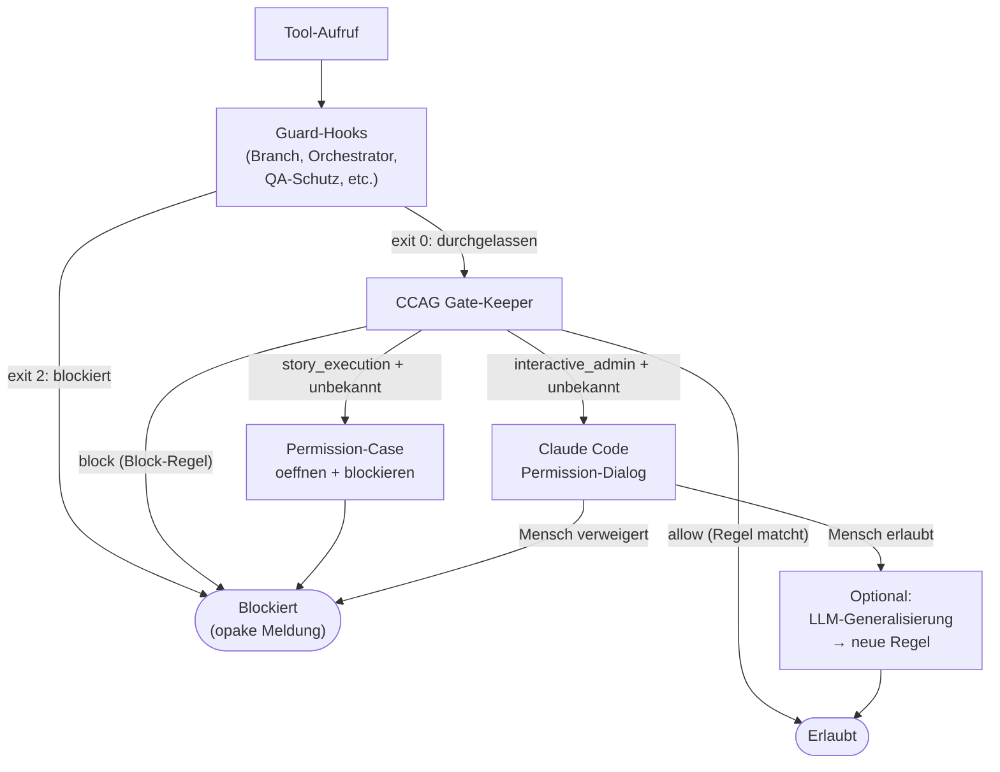

# 42 — CCAG Tool-Governance und Permission-Runtime

<!-- PROSE-FORMAL: formal.principal-capabilities.entities, formal.principal-capabilities.commands, formal.principal-capabilities.events, formal.principal-capabilities.invariants -->

## 42.1 Zweck und Abgrenzung

CCAG (Claude Code Agent Governance) ist die **lernfähige
Permission-Schicht** für Tool-Aufrufe. Sie ergänzt die harten
Guards (Kap. 30/31), ersetzt sie aber nicht (FK-12-018).

| Verantwortung | Guards (Kap. 30/31) | CCAG |
|--------------|--------------------|----|
| Zweck | Harte Sicherheitsregeln erzwingen | Komfortable Tool-Freigaben verwalten |
| Regelquelle | Hook-Code + Lock-Records | YAML-Regeldateien (sessionübergreifend) |
| Lernfähig | Nein (statisch) | Ja (wächst mit jeder Freigabe) |
| Bei Verstoß / unbekannter Freigabe | Opake Fehlermeldung | Im Story-Run: block + Permission-Case, sonst optional Mensch |
| Implementierung | Dedizierte Python-Hooks | CCAG Gate-Keeper-Hook |

**Architekturzuordnung:** `CcagPermissionRuntime` ist im
Komponentenmodell absichtlich eine **eigene** Top-Level-Komponente und
nicht Teil des `GuardSystem`. Der Unterschied ist fachlich, nicht nur
technisch: Guards erzwingen nicht verhandelbare Regeln; CCAG verwaltet
persistente, vom Menschen gelernte Freigaben.

**Capability-Grenze:** Seit FK-55 gilt explizit: CCAG ist kein
Capability-Escalation-System. CCAG darf nur innerhalb eines bereits
erlaubten Capability-Raums erleichtern. Ein harter Deny aus
Principal-/Pfad-/Freeze-Modell bleibt unverhandelbar und wird durch
CCAG weder in `allow` noch in `ask` umgewandelt.

**Liveness-Grenze:** CCAG darf in aktiven Story-Runs keinen Fortschritt
an Claude Codes nativen Permission-Dialog koppeln. Ein unbekannter
Permission-Fall im `story_execution`-Modus fuehrt deshalb nicht zu einem
wartenden Prompt, sondern zu einem sofortigen `block` plus
auditierbarem Permission-Case.

## 42.2 Kernfunktionen

### 42.2.1 Sessionübergreifende Persistenz (FK-12-002 bis FK-12-005)

Jede menschliche Freigabe wird als Regel in YAML gespeichert.
Die Regeln stehen in allen zukünftigen Sessions sofort zur
Verfügung. Über Wochen und Monate wächst ein projektspezifischer
Regelsatz, der häufige Operationen automatisch freigibt.

**Regeldateien:**

```
.claude/ccag/rules/
├── global.yaml          # Für alle Agents (Haupt + Sub)
├── main-agent.yaml      # Nur für den Hauptagenten
├── subagents.yaml       # Nur für Sub-Agents (engere Rechte)
└── approved.yaml        # Automatisch gelernte Regeln
```

### 42.2.2 Parameterbasierte Regeln (FK-12-006 bis FK-12-008)

Regeln matchen nicht nur auf den Tool-Namen, sondern auf beliebige
Parameter: Dateipfade, Befehle, URLs, Flags.

```yaml
# global.yaml
- id: git-push-story-branch
  tool: Bash
  allow_pattern: "git push.*origin story/"
  description: "git push auf Story-Branches erlaubt"

- id: write-in-project
  tool: Write|Edit
  allow_pattern: "file_path:.*/(src|test|docs)/"
  description: "Schreiben in Projektverzeichnissen"

- id: block-force-push
  tool: Bash
  block_pattern: "git push.*--force"
  description: "Force-Push immer verboten"
  priority: high  # Vor allow-Regeln ausgewertet
```

### 42.2.3 Rollenspezifische Scopes (FK-12-012 bis FK-12-015)

Sub-Agents erhalten engere Rechte als der Hauptagent:

```yaml
# subagents.yaml — nur für Sub-Agents
- id: no-write-outside-project
  tool: Write|Edit
  block_pattern: "file_path:(?!.*/(src|test|_temp)/)"
  description: "Sub-Agents dürfen nicht außerhalb des Projekts schreiben"

- id: no-gh-admin
  tool: Bash
  block_pattern: "gh repo|gh org|gh auth"
  description: "Sub-Agents dürfen keine GitHub-Admin-Befehle"
```

### 42.2.4 Regelauswertung

```python
def evaluate_ccag(tool_name: str, tool_input: dict,
                  is_subagent: bool,
                  execution_mode: str) -> str:
    """Returns 'allow', 'block_by_rule', 'unknown_permission', or 'ask_external'."""
    rules = load_rules(is_subagent)

    # 1. Block-Regeln zuerst (hohe Priorität)
    for rule in rules.blocks:
        if matches(rule, tool_name, tool_input):
            return "block_by_rule"

    # 2. Allow-Regeln
    for rule in rules.allows:
        if matches(rule, tool_name, tool_input):
            return "allow"

    # 3. Keine passende Regel
    if execution_mode == "story_execution":
        return "unknown_permission"
    return "ask_external"
```

**Reihenfolge:** Block-Regeln haben Vorrang vor Allow-Regeln.
Keine passende Regel fuehrt nur in explizit interaktiven Modi zu
`ask_external`. Im `story_execution`-Modus wird sofort blockiert.

**Zusatzregel seit FK-55:** `evaluate_ccag()` wird nur aufgerufen,
nachdem das harte Capability-Modell und das storybezogene Freeze-Overlay
bereits `nicht blocked` ergeben haben.

CCAG arbeitet dabei nicht auf rohem Tool-Input allein, sondern auf
einer bereits berechneten Capability-Huelle:

- `principal_type`
- `path_class`
- `operation_class`
- `hard_capability_verdict`
- `freeze_verdict`

Fehlt diese Huelle, ist der CCAG-Aufruf fail-closed unzulaessig.

### 42.2.5 Modus-scharfe Entscheidungsarten

CCAG kennt normativ zwei verschiedene Betriebsarten:

| Modus | Unbekannte Freigabe | Grund |
|------|----------------------|-------|
| `story_execution` | `block` + `permission_request_opened` | aktiver Run darf nicht an Host-UI haengen |
| `interactive_admin` / `ai_augmented` | `ask_external` zulaessig | explizit interaktive Mensch-Sitzung |

**Normative Regel:** In `story_execution` existiert kein synchroner
`ask`-Pfad. Der Hook wartet nie auf Mensch oder Host-UI, sondern
blockiert sofort und erzeugt einen auswertbaren Permission-Fall.

## 42.3 LLM-gestützte Regelgenerierung (FK-12-009 bis FK-12-011)

### 42.3.1 Ablauf

Wenn der Mensch einen neuen Tool-Aufruf freigibt, kann er ein
LLM aufrufen, das den spezifischen Aufruf zu einer
verallgemeinerten Regel generalisiert:

```
Mensch gibt "git push -u origin story/ODIN-042" frei
    │
    ▼
LLM generalisiert: "git push.*origin story/"
    │
    ▼
Mensch sieht Vorschau: "Allow: git push auf alle Story-Branches"
    │
    ├── Akzeptieren → Regel in approved.yaml gespeichert
    └── Anpassen → Mensch editiert Regex → gespeichert
```

**Default-Schnitt:** Die erste positive Entscheidung zu einem offenen
Permission-Case ist nur eine Einzelfallfreigabe bzw. Lease. Eine neue
Dauerregel entsteht erst durch eine bewusste Zusatzentscheidung.

### 42.3.2 Generalisierungsregeln

Das LLM wird angewiesen:
- Story-IDs zu Wildcards generalisieren (`ODIN-042` → `.*`)
- Pfade zu Patterns generalisieren (`src/main/java/com/acme/` → `src/`)
- Flags beizubehalten (wenn `--force` im Original, bleibt es im Pattern)
- Konservativ zu generalisieren (lieber zu eng als zu weit)

**F-42-039 — LLM-gestützte Regelgenerierung aus natürlichsprachlicher Absicht (FK-12-039):** CCAG unterstützt darüber hinaus die initiale Regelgenerierung auf Basis einer natürlichsprachlichen Absicht. Der Mensch beschreibt sein Ziel in freier Sprache (z.B. "Worker soll alle Story-Branches pushen dürfen"), und das System schlägt daraufhin konkrete CCAG-Regeln mit ausgefüllten Feldern `tool`, `allow_pattern`/`block_pattern` und `description` vor. Die Vorschläge werden dem Menschen zur Überprüfung und Freigabe präsentiert; ohne explizite Bestätigung werden keine Regeln gespeichert.

### 42.3.3 Approved.yaml

Automatisch gelernte Regeln landen in `approved.yaml`:

```yaml
# approved.yaml — automatisch gelernt
- id: auto-001
  tool: Bash
  allow_pattern: "git push.*origin story/"
  learned_from: "git push -u origin story/ODIN-042"
  learned_at: "2026-03-17T10:00:00+01:00"
  scope: main-agent
```

## 42.4 Out-of-Band-Propagation und Permission-Faelle (FK-12-016/017)

### 42.4.1 Problem

Wenn ein Sub-Agent tief in einer verschachtelten Ausführung auf
ein Permission-Problem stoest, darf der Story-Run nicht an einem
wartenden Prompt haengen bleiben.

### 42.4.2 Mechanismus

Im `story_execution`-Modus laeuft der Pfad so:

1. Hook erkennt fehlende Freigabe
2. Hook emittiert `permission_request_opened`
3. Hook blockiert den Tool-Call sofort
4. Mensch entscheidet spaeter per `agentkit approve-permission-request`
   oder `agentkit reject-permission-request`
5. Der Run ist damit `PAUSED`; bei TTL-Ablauf ohne Entscheidung wird er
   deterministisch `ESCALATED`
6. Erst ein expliziter Resume-/Folgepfad setzt die Story fort

Eine positive Entscheidung erzeugt zunaechst nur eine Einzelfallfreigabe
oder Lease. Sie startet den Run nicht implizit neu und erzeugt auch
keine Dauerregel ohne separate Promote-Entscheidung.

Im `interactive_admin`- oder `ai_augmented`-Modus darf CCAG dagegen
weiterhin einen nativen Host-Prompt verwenden, allerdings nur als
Komfortmechanismus einer bewusst interaktiven Sitzung.

**Keine Liveness-Abhaengigkeit:** Ein aktiver Story-Run darf nie davon
abhaengen, dass Claude Code, TTY oder Host-UI einen Prompt zeigt oder
der Mensch ihn rechtzeitig beantwortet.

## 42.5 CCAG Gate-Keeper (Hook-Implementierung)

### 42.5.1 Ablauf

```python
def main():
    event = json.loads(sys.stdin.read())
    tool_name = event["tool_name"]
    tool_input = event["tool_input"]
    is_subagent = event.get("is_subagent", False)
    execution_mode = derive_execution_mode_from_local_locks(event)

    # Harte Guards haben Vorrang (eigene Hooks, nicht CCAG)
    # CCAG läuft NACH den Guard-Hooks in der Kette

    decision = evaluate_ccag(tool_name, tool_input, is_subagent, execution_mode)

    if decision == "allow":
        sys.exit(0)
    elif decision == "block_by_rule":
        print("Operation not permitted.", file=sys.stderr)
        sys.exit(2)
    elif decision == "unknown_permission":
        emit_permission_request(event)
        print("Operation not permitted.", file=sys.stderr)
        sys.exit(2)
    else:  # "ask_external"
        # Nur in explizit interaktiven Modi zulaessig
        sys.exit(0)  # Claude Code / Host-UI uebernimmt
```

**Hinweis:** CCAG ersetzt Claude Codes eigenen Permission-Dialog nicht
vollstaendig. Aber fuer `story_execution` ist dieser Dialog kein
autoritativer Fortschrittsmechanismus mehr. Tritt trotzdem ein nativer
Prompt oder anderes Host-Permission-Verhalten auf, wird dies nur ueber
einen separaten Telemetrie-/Supervisor-Pfad oder manuell dokumentiert,
nicht als sichere PreToolUse-Erkenntnis behauptet.

### 42.5.2 Registrierung

```json
{
  "matcher": "Bash|Write|Edit|Read|Grep|Glob|Agent",
  "command": "python -m agentkit.governance.ccag_gatekeeper"
}
```

CCAG läuft als **letzter** PreToolUse-Hook in der Kette — nach
allen Guard-Hooks. Guards haben absolute Priorität, CCAG ist
die komfortable Ergänzung.

## 42.6 Zusammenspiel CCAG und Guards



**Guards sind nicht verhandelbar.** Wenn ein Guard blockiert,
kommt CCAG nie zum Zug. CCAG regelt nur die "graue Zone" —
Operationen, die nicht durch Guards hart blockiert oder erlaubt
sind.

**Zusatz fuer aktive Runs:** Diese "graue Zone" wird im
`story_execution`-Modus nicht per Host-Prompt aufgeloest, sondern per
`permission_request_*`-Folgeprozess ausserhalb des wartenden Tool-Calls.

## 42.7 Konfiguration

In `.story-pipeline.yaml` gibt es keine CCAG-spezifische
Konfiguration. CCAG wird über die YAML-Regeldateien in
`.claude/ccag/rules/` konfiguriert.

Der Installer (Checkpoint 7) deployt initiale Regeldateien
mit projektspezifischen Defaults. Diese können vom Menschen
angepasst werden — Upgrades erkennen nutzerseitige Anpassungen
und erhalten sie (Kap. 51).

---

*FK-Referenzen: FK-12-001 bis FK-12-018 (CCAG komplett)*
