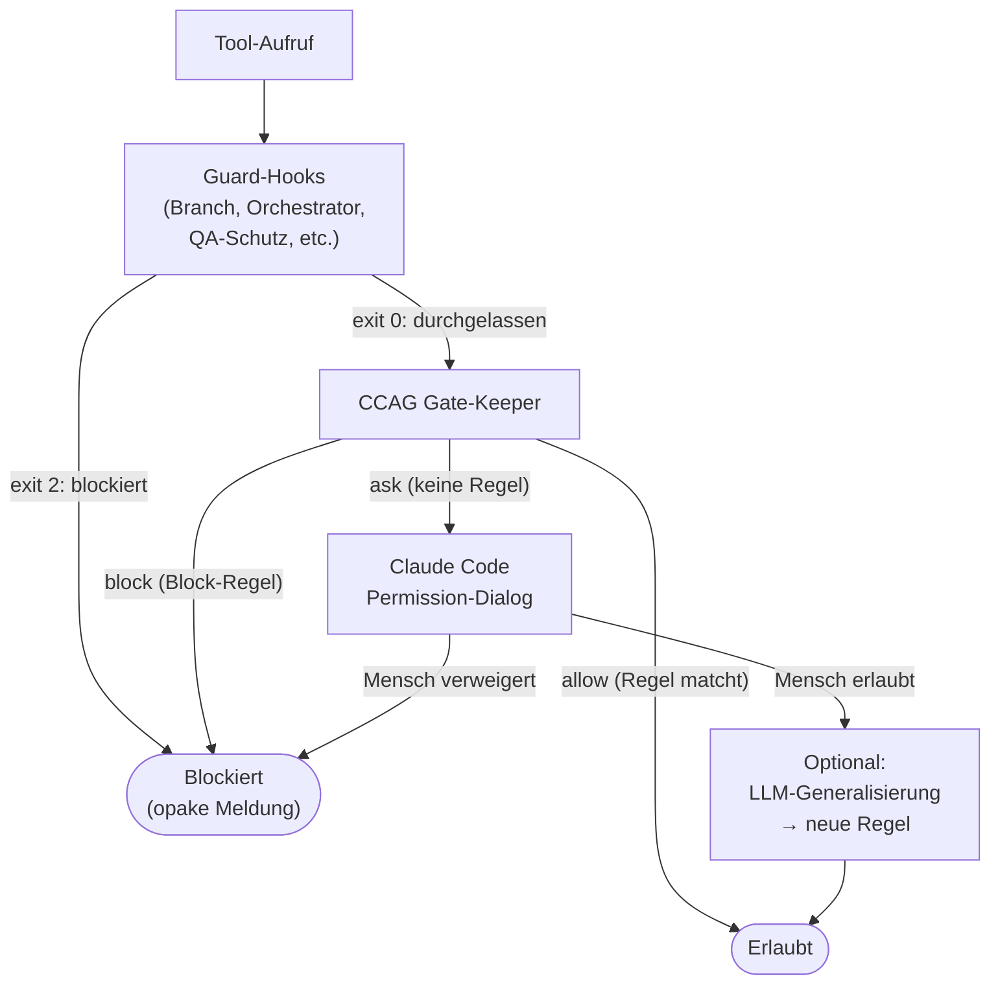

# 42 — CCAG Tool-Governance und Permission-Runtime

## 42.1 Zweck und Abgrenzung

CCAG (Claude Code Agent Governance) ist die **lernfähige
Permission-Schicht** für Tool-Aufrufe. Sie ergänzt die harten
Guards (Kap. 30/31), ersetzt sie aber nicht (FK-12-018).

| Verantwortung | Guards (Kap. 30/31) | CCAG |
|--------------|--------------------|----|
| Zweck | Harte Sicherheitsregeln erzwingen | Komfortable Tool-Freigaben verwalten |
| Regelquelle | Hook-Code + Sperrdateien | YAML-Regeldateien (sessionübergreifend) |
| Lernfähig | Nein (statisch) | Ja (wächst mit jeder Freigabe) |
| Bei Verstoß | Opake Fehlermeldung | Mensch wird gefragt |
| Implementierung | Dedizierte Python-Hooks | CCAG Gate-Keeper-Hook |

## 42.2 Kernfunktionen

### 42.2.1 Sessionübergreifende Persistenz (FK-12-002 bis FK-12-005)

Jede menschliche Freigabe wird als Regel in YAML gespeichert.
Die Regeln stehen in allen zukünftigen Sessions sofort zur
Verfügung. Über Wochen und Monate wächst ein projektspezifischer
Regelsatz, der häufige Operationen automatisch freigibt.

**Regeldateien:**

```
.claude/ccag/rules/
├── global.yaml          # Für alle Agents (Haupt + Sub)
├── main-agent.yaml      # Nur für den Hauptagenten
├── subagents.yaml       # Nur für Sub-Agents (engere Rechte)
└── approved.yaml        # Automatisch gelernte Regeln
```

### 42.2.2 Parameterbasierte Regeln (FK-12-006 bis FK-12-008)

Regeln matchen nicht nur auf den Tool-Namen, sondern auf beliebige
Parameter: Dateipfade, Befehle, URLs, Flags.

```yaml
# global.yaml
- id: git-push-story-branch
  tool: Bash
  allow_pattern: "git push.*origin story/"
  description: "git push auf Story-Branches erlaubt"

- id: write-in-project
  tool: Write|Edit
  allow_pattern: "file_path:.*/(src|test|docs)/"
  description: "Schreiben in Projektverzeichnissen"

- id: block-force-push
  tool: Bash
  block_pattern: "git push.*--force"
  description: "Force-Push immer verboten"
  priority: high  # Vor allow-Regeln ausgewertet
```

### 42.2.3 Rollenspezifische Scopes (FK-12-012 bis FK-12-015)

Sub-Agents erhalten engere Rechte als der Hauptagent:

```yaml
# subagents.yaml — nur für Sub-Agents
- id: no-write-outside-project
  tool: Write|Edit
  block_pattern: "file_path:(?!.*/(src|test|_temp)/)"
  description: "Sub-Agents dürfen nicht außerhalb des Projekts schreiben"

- id: no-gh-admin
  tool: Bash
  block_pattern: "gh repo|gh org|gh auth"
  description: "Sub-Agents dürfen keine GitHub-Admin-Befehle"
```

### 42.2.4 Regelauswertung

```python
def evaluate_ccag(tool_name: str, tool_input: dict,
                  is_subagent: bool) -> str:
    """Returns 'allow', 'block', or 'ask'."""
    rules = load_rules(is_subagent)

    # 1. Block-Regeln zuerst (hohe Priorität)
    for rule in rules.blocks:
        if matches(rule, tool_name, tool_input):
            return "block"

    # 2. Allow-Regeln
    for rule in rules.allows:
        if matches(rule, tool_name, tool_input):
            return "allow"

    # 3. Keine passende Regel → Mensch fragen
    return "ask"
```

**Reihenfolge:** Block-Regeln haben Vorrang vor Allow-Regeln.
Keine passende Regel → Mensch wird gefragt (nicht blockiert,
nicht erlaubt).

## 42.3 LLM-gestützte Regelgenerierung (FK-12-009 bis FK-12-011)

### 42.3.1 Ablauf

Wenn der Mensch einen neuen Tool-Aufruf freigibt, kann er ein
LLM aufrufen, das den spezifischen Aufruf zu einer
verallgemeinerten Regel generalisiert:

```
Mensch gibt "git push -u origin story/ODIN-042" frei
    │
    ▼
LLM generalisiert: "git push.*origin story/"
    │
    ▼
Mensch sieht Vorschau: "Allow: git push auf alle Story-Branches"
    │
    ├── Akzeptieren → Regel in approved.yaml gespeichert
    └── Anpassen → Mensch editiert Regex → gespeichert
```

### 42.3.2 Generalisierungsregeln

Das LLM wird angewiesen:
- Story-IDs zu Wildcards generalisieren (`ODIN-042` → `.*`)
- Pfade zu Patterns generalisieren (`src/main/java/com/acme/` → `src/`)
- Flags beizubehalten (wenn `--force` im Original, bleibt es im Pattern)
- Konservativ zu generalisieren (lieber zu eng als zu weit)

**F-42-039 — LLM-gestützte Regelgenerierung aus natürlichsprachlicher Absicht (FK-12-039):** CCAG unterstützt darüber hinaus die initiale Regelgenerierung auf Basis einer natürlichsprachlichen Absicht. Der Mensch beschreibt sein Ziel in freier Sprache (z.B. "Worker soll alle Story-Branches pushen dürfen"), und das System schlägt daraufhin konkrete CCAG-Regeln mit ausgefüllten Feldern `tool`, `allow_pattern`/`block_pattern` und `description` vor. Die Vorschläge werden dem Menschen zur Überprüfung und Freigabe präsentiert; ohne explizite Bestätigung werden keine Regeln gespeichert.

### 42.3.3 Approved.yaml

Automatisch gelernte Regeln landen in `approved.yaml`:

```yaml
# approved.yaml — automatisch gelernt
- id: auto-001
  tool: Bash
  allow_pattern: "git push.*origin story/"
  learned_from: "git push -u origin story/ODIN-042"
  learned_at: "2026-03-17T10:00:00+01:00"
  scope: main-agent
```

## 42.4 Sofortige Propagation (FK-12-016/017)

### 42.4.1 Problem

Wenn ein Sub-Agent tief in einer verschachtelten Ausführung auf
ein Permission-Problem stößt, sieht der Mensch das sofort in
seiner Konsole — nicht erst wenn der Agent nach Minuten der
Arbeit scheitert.

### 42.4.2 Mechanismus

CCAG läuft als PreToolUse-Hook. Wenn der Hook `"ask"` zurückgibt
(keine passende Regel), blockiert Claude Code den Tool-Call und
fragt den Menschen. Die Freigabe propagiert sofort:

1. Mensch gibt den Tool-Call frei
2. Optional: LLM-Generalisierung → neue Regel in approved.yaml
3. Die Regel ist sofort für **alle laufenden Sessions** verfügbar
   (YAML-Datei wird bei jedem Hook-Aufruf neu gelesen)

**Keine IPC nötig:** Da CCAG die YAML-Dateien bei jedem Hook-Aufruf
liest, ist eine neue Regel sofort wirksam — ohne Nachrichtenaustausch
zwischen Prozessen.

## 42.5 CCAG Gate-Keeper (Hook-Implementierung)

### 42.5.1 Ablauf

```python
def main():
    event = json.loads(sys.stdin.read())
    tool_name = event["tool_name"]
    tool_input = event["tool_input"]
    is_subagent = event.get("is_subagent", False)

    # Harte Guards haben Vorrang (eigene Hooks, nicht CCAG)
    # CCAG läuft NACH den Guard-Hooks in der Kette

    decision = evaluate_ccag(tool_name, tool_input, is_subagent)

    if decision == "allow":
        sys.exit(0)
    elif decision == "block":
        print("Operation not permitted.", file=sys.stderr)
        sys.exit(2)
    else:  # "ask"
        # Claude Code fragt den Menschen
        # (Hook gibt kein exit(2), sondern signalisiert "fragen")
        sys.exit(0)  # Durchlassen — Claude Code's eigener
                      # Permission-Dialog übernimmt
```

**Hinweis:** CCAG ersetzt nicht Claude Codes eigenen Permission-
Dialog. Es ergänzt ihn um persistente, parameterbasierte Regeln.
Wenn CCAG keine passende Regel findet, greift Claude Codes
Standard-Permission-System.

### 42.5.2 Registrierung

```json
{
  "matcher": "Bash|Write|Edit|Read|Grep|Glob|Agent",
  "command": "python -m agentkit.governance.ccag_gatekeeper"
}
```

CCAG läuft als **letzter** PreToolUse-Hook in der Kette — nach
allen Guard-Hooks. Guards haben absolute Priorität, CCAG ist
die komfortable Ergänzung.

## 42.6 Zusammenspiel CCAG und Guards



**Guards sind nicht verhandelbar.** Wenn ein Guard blockiert,
kommt CCAG nie zum Zug. CCAG regelt nur die "graue Zone" —
Operationen, die nicht durch Guards hart blockiert oder erlaubt
sind.

## 42.7 Konfiguration

In `.story-pipeline.yaml` gibt es keine CCAG-spezifische
Konfiguration. CCAG wird über die YAML-Regeldateien in
`.claude/ccag/rules/` konfiguriert.

Der Installer (Checkpoint 7) deployt initiale Regeldateien
mit projektspezifischen Defaults. Diese können vom Menschen
angepasst werden — Upgrades erkennen nutzerseitige Anpassungen
und erhalten sie (Kap. 51).

---

*FK-Referenzen: FK-12-001 bis FK-12-018 (CCAG komplett)*
