# 47 — Request-DSL und Preflight-Turn

## 47.1 Zweck

Die Request-DSL erlaubt einem LLM-Reviewer, vor dem eigentlichen
Review strukturiert fehlende Evidenz anzufordern. Die physische
Erhebung aus Ziel-Worktrees findet gemaess FK-10 §10.2.4a
ausschliesslich am Project Edge statt. Das Backend besitzt weiterhin
die deterministische Konsolidierung, D3, Timeout-Klassifikation und
Bundle-Anwendung.

## 47.2 7 Request-Typen (FK-28-009)

`ReviewerRequest` ist ein geschlossenes Pydantic-v2-Modell mit den
Feldern `type`, `target`, optional `region` und `reason`. Pro
Preflight-Antwort werden hoechstens acht Requests verarbeitet.

| Typ | Target | Erhebung / Aufloesung |
|-----|--------|-----------------------|
| `NEED_FILE` | Pfad oder Glob | Edge meldet Kandidaten; Backend wendet D3 an |
| `NEED_SCHEMA` | Klassen-/Interface-/Typname | Edge durchsucht den lokalen Worktree und meldet Kandidaten |
| `NEED_CALLSITE` | Funktions-/Methodenname | Edge meldet Callsite-Kandidaten |
| `NEED_RUNTIME_BINDING` | Config-Key | Edge meldet Treffer aus YAML, JSON und `.env` |
| `NEED_TEST_EVIDENCE` | typisiertes `pytest`-Kommando | Edge fuehrt argumentweise, `shell=False`, mit hartem Timeout aus |
| `NEED_CONCEPT_SOURCE` | Dokument-Abschnitt | Backend-lokaler Heading-Match nur in `concept/` und `stories/` |
| `NEED_DIFF_EXPANSION` | Datei und Region | AG3-147-Edge-/Adapter-Leseflaeche; Backend konsumiert die Meldung |

Nicht gelistete Test-Runner, Optionen, absolute Pfade,
Pfad-Traversal und Shell-Operatoren werden als
`TEST_COMMAND_REJECTED` klassifiziert und niemals ausgefuehrt.

## 47.3 RequestResolver (Multi-Repo) (FK-28-010)

Der Backend-`RequestResolver` erhaelt keinen Worktree-Pfad. Sein
produktiver Eingang besteht aus den kanonischen Requests und
`VerifyEvidenceObservation`-Meldungen des Project Edge. Kandidaten
tragen `repo_id`, relativen Pfad, Inhalt, Groesse und SHA-256-Bindung.
Der Edge entscheidet nie D3 und erweitert nie selbst das Review-Bundle.

```python
from __future__ import annotations

class RequestResolver:
    def __init__(self, *, story_dir: Path) -> None: ...

    def resolve_all(
        self,
        requests: Sequence[ReviewerRequest],
        observations: Sequence[VerifyEvidenceObservation] = (),
    ) -> list[RequestResult]: ...
```

Fehlt eine Edge-Beobachtung, entsteht der benannte Befund
`EDGE_EVIDENCE_UNAVAILABLE`. Ein abgelaufener Batch erzeugt
`EDGE_EVIDENCE_TIMEOUT`. `NEED_CONCEPT_SOURCE` ist die einzige lokale
Resolver-Leseflaeche; sie bleibt auf den Backend-Konzeptkorpus
begrenzt und wird nie auf Ziel-Worktrees erweitert.

## 47.4 Mehrdeutigkeitsregel (D3) (FK-28-011)

| Treffer | Verhalten |
|---------|-----------|
| genau 1 | `RESOLVED`; der gemeldete Inhalt darf als `SECONDARY_CONTEXT` in das Bundle |
| 2 oder mehr | `UNRESOLVED` mit Kandidatenliste; keine heuristische Auswahl |
| 0 | `UNRESOLVED`; kein Inhalt wird erfunden |

D3 wird ausschliesslich im Backend angewandt. Der Acht-Request-Cap
bleibt auch fuer einen Multi-Repo-Batch verbindlich. Test-Evidenz
wird anhand ihres benannten Edge-Status klassifiziert, nicht anhand
von Dateikandidaten.

## 47.5 Preflight-Turn-Architektur (FK-28-012)

Der Preflight nutzt zwei vorhandene Phase-Yield/Resume-Wartepunkte.
Ein synchrones Warten innerhalb der QA-Anfrage ist verboten, weil
die QA-Anfrage den `(project_key, story_id)`-Claim haelt, den der
Result-POST ebenfalls benoetigt (FK-91 §91.1a Regeln 14/15).

```mermaid
sequenceDiagram
    participant C as Client/Orchestrator
    participant B as Backend Implementation Phase
    participant E as Project Edge
    participant R as Preflight Reviewer
    C->>B: Start/Resume
    B->>B: commission base_collection
    B-->>C: PAUSED (Claim frei)
    C->>E: offene Commands pollen/ausfuehren
    E->>B: Result-POST (terminalisiert nur CommandRecord)
    C->>B: Resume
    B->>B: Bundle aus Edge-Dateien assembliert
    B->>R: einmaliger Preflight je auditiertem attempt
    R-->>B: raw response
    B->>B: response + Requests + Digests atomar checkpointen
    B-->>C: PAUSED (Claim frei)
    C->>E: dynamic_requests ausfuehren
    E->>B: Result-POST (nur CommandRecord)
    C->>B: Resume
    B->>B: D3 + Bundle-Anwendung unter Ownership-Fence
    B->>B: QA-Subflow fortsetzen
```



### 47.5.1 Timing- und Generation-Vertrag

- `collect_verify_evidence` hat die Stufen `base_collection` und
  `dynamic_requests`; beide tragen eine UTC-Deadline.
- Open und vor Deadline bedeutet erneut `PAUSED`; es wird nicht
  geschlafen. Der Client treibt Polling und Resume.
- Nach Deadline terminalisiert Resume das offene CommandRecord als
  `superseded`; dynamische Requests erhalten `TIMEOUT`.
- `batch_id` bindet Run, Implementation-Attempt, Candidate-Digest,
  Stufe und Preflight-Template-Version. `generation` bindet zusaetzlich
  Owner-Session/Epoch beziehungsweise den Preflight-Attempt.
- Der Candidate-Digest bindet Repository-IDs, erwartete gepushte
  Head-SHAs, AG3-147-Change-Inventar und Worker-Hint-Pfade. Der Edge
  erhebt nur bei passendem `HEAD` und sauberem Worktree; einzig die
  von AgentKit selbst erzeugte `.agentkit-story.json`-Markierung ist
  kein Candidate-Inhalt.
- Candidate- oder Ownership-Drift supersedet die alte offene
  Generation unter dem Story-Claim, bevor die neue Generation
  commissioned wird.
- Resultate echoen Batch, Generation, Candidate- und Request-Digest.
  Ein Mismatch terminalisiert das CommandRecord nicht.

### 47.5.2 Crash-sicherer Preflight

Vor dem LLM-Aufruf wird ein terminaler, gefencter
`preflight_attempt`-Audit-Record mit Request-Hash materialisiert. Der
Attempt wird hoechstens einmal gesendet. Raw Response, kanonische
Requests, Request-Digest und Basis-Manifest werden danach gemeinsam
im ausfuehrbaren Stage-B-CommandRecord checkpointed, bevor die Phase
yielded. Ein Crash nach der Antwort, aber vor diesem Checkpoint fuehrt
zu einem neuen auditierten Attempt; der alte Attempt wird nie mit
einem neueren Batch gemischt.

### 47.5.3 Fehlertoleranz

- Parse-Fehler erzeugen `requests=[]` plus WARNING; der Review laeuft
  mit dem Basis-Bundle weiter.
- Nicht erreichbarer Edge beziehungsweise Deadline-Ablauf bleibt als
  `EDGE_EVIDENCE_TIMEOUT`/`UNRESOLVED` im Bundle sichtbar.
- Result-POSTs schreiben weder Bundle noch QA-Projektion. Erst Resume
  wendet terminale Resultate unter dem gebundenen Rule-15-Fence an.
- Story-Exit, Reset, Ex-Owner oder Epoch-Drift verhindern daher jede
  nachtraegliche Bundle-Wirkung.

## 47.6 Prompt-Template: `review-preflight.md` (FK-28-013)

Das registrierte Template `src/agentkit/bundles/internal/prompts/review-preflight.md`
enthaelt den Sentinel
`[PREFLIGHT:review-preflight-v1:{story_id}]`, das Bundle-Manifest und
die am Edge erhobenen, inhaltlich gebundenen Basisdateien. Die Antwort
ist ein JSON-Objekt mit einem `requests`-Array. Der Preflight ist kein
zweiter eigentlicher Review; die Layer-2-Auswertung beginnt erst nach
der gefencten Stage-B-Anwendung.
