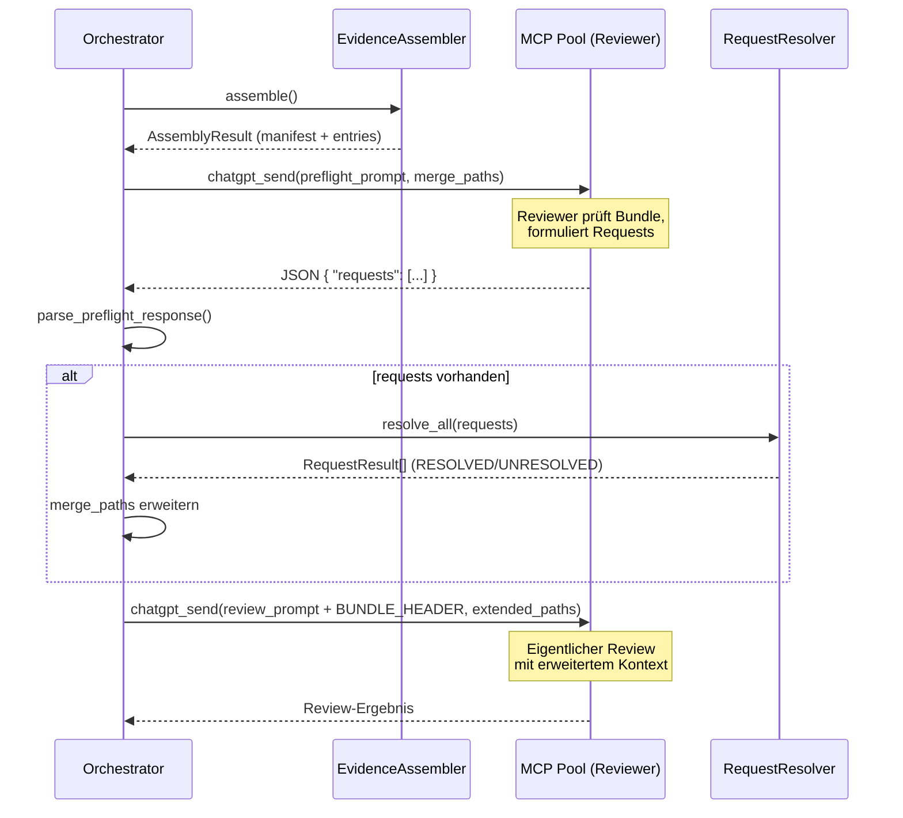

# 47 — Request-DSL und Preflight-Turn

## 47.1 Zweck

Die Request-DSL ist der Mechanismus, über den ein LLM-Reviewer
**vor dem eigentlichen Review** strukturiert fehlende
Informationen anfordern kann. Der Preflight-Turn ist der
Kommunikationsschritt, der diese Anfragen einsammelt, deterministisch
auflöst und das Bundle vor dem Review nachreicht. Beides setzt auf
dem Evidence Assembler (FK-28) auf — Stufe 1 + 2 + 3 sind bereits
durchlaufen, bevor ein Reviewer überhaupt angesprochen wird.

## 47.2 7 Request-Typen (FK-28-009)

Die Request-DSL definiert 7 strukturierte Typen, mit denen ein
Reviewer fehlende Informationen anfordern kann:

```python
# agentkit/evidence/request_types.py
from __future__ import annotations

from enum import StrEnum
from pydantic import BaseModel, Field


class RequestType(StrEnum):
    NEED_FILE = "NEED_FILE"
    NEED_SCHEMA = "NEED_SCHEMA"
    NEED_CALLSITE = "NEED_CALLSITE"
    NEED_RUNTIME_BINDING = "NEED_RUNTIME_BINDING"
    NEED_TEST_EVIDENCE = "NEED_TEST_EVIDENCE"
    NEED_CONCEPT_SOURCE = "NEED_CONCEPT_SOURCE"
    NEED_DIFF_EXPANSION = "NEED_DIFF_EXPANSION"


class ReviewerRequest(BaseModel):
    """Ein einzelner strukturierter Request vom Reviewer."""
    type: RequestType
    target: str = Field(description="Pfad, Symbol, Pattern oder Command")
    region: str | None = Field(
        default=None,
        description="Nur für NEED_DIFF_EXPANSION: Methode oder Codebereich",
    )
    reason: str = Field(description="Warum der Reviewer diese Information braucht")


class RequestResult(BaseModel):
    """Ergebnis der deterministischen Auflösung eines Requests."""
    request: ReviewerRequest
    status: str = Field(description="RESOLVED | UNRESOLVED | TIMEOUT | ERROR")
    content: str | None = Field(default=None, description="Aufgelöster Inhalt")
    file_path: str | None = Field(default=None, description="Pfad der gefundenen Datei")
    duration_ms: int = 0
```

**Request-Typ-Dokumentation:**

| Typ | Target | Auflösung | Timeout |
|-----|--------|-----------|---------|
| `NEED_FILE` | Pfad oder Glob-Pattern | Exakter Match, dann Glob, dann `rg --files` | — |
| `NEED_SCHEMA` | Symbol-Name (Klasse, Interface, Type) | `rg 'class {symbol}\|interface {symbol}\|type {symbol}'` | — |
| `NEED_CALLSITE` | Funktions-/Methodenname | `rg '{symbol}\('` | — |
| `NEED_RUNTIME_BINDING` | Config-Key | `rg '{target}' -g '*.yaml' -g '*.yml' -g '*.json' -g '*.env'` | — |
| `NEED_TEST_EVIDENCE` | Test-Command (z.B. `pytest pfad/`) | `subprocess.run` mit cwd=repo_root | 30s |
| `NEED_CONCEPT_SOURCE` | Dokument-Abschnitt | Heading-Match in `_concept/` und `stories/` | — |
| `NEED_DIFF_EXPANSION` | Datei + Region | `git diff` mit erweitertem Kontext für spezifische Region | — |

## 47.3 RequestResolver (Multi-Repo) (FK-28-010)

Der `RequestResolver` bekommt den vollen `RepoContext`, weil
verschiedene Request-Typen unterschiedliche Context-Felder
benötigen:

| Request-Typ | Benötigte RepoContext-Felder |
|-------------|------------------------------|
| `NEED_DIFF_EXPANSION` | `git` (für `diff_full()`), `git_base_branch` |
| `NEED_FILE` / `NEED_SCHEMA` / `NEED_CALLSITE` | `repo_path`, Priorisierung über `primary_repo_id` |
| `NEED_RUNTIME_BINDING` | `repo_path`, `affected` (nur affected Repos durchsuchen) |
| `NEED_TEST_EVIDENCE` | `repo_path` (als cwd für subprocess) |
| `NEED_CONCEPT_SOURCE` | Nur `story_dir` (repo-unabhängig) |

```python
# agentkit/evidence/request_resolver.py
from __future__ import annotations

import json
import logging
import subprocess
from pathlib import Path

from agentkit.evidence.assembler import RepoContext
from agentkit.evidence.request_types import (
    RequestResult, RequestType, ReviewerRequest,
)

logger = logging.getLogger(__name__)

REQUEST_TIMEOUT_S = 30  # Timeout pro Request
MAX_REQUESTS = 8        # Max 8 Requests pro Reviewer


def parse_preflight_response(raw_response: str) -> list[ReviewerRequest]:
    """Parst die Preflight-Antwort des Reviewers (JSON mit requests-Array).

    Bei Parse-Fehler: leere Liste + WARNING. Der Review läuft dann
    ohne Preflight-Ergänzung weiter.
    """
    try:
        data = json.loads(raw_response)
        raw_requests = data.get("requests", [])
        return [ReviewerRequest(**r) for r in raw_requests[:MAX_REQUESTS]]
    except (json.JSONDecodeError, KeyError, TypeError, ValueError) as exc:
        logger.warning("Preflight-Response konnte nicht geparst werden: %s", exc)
        return []


class RequestResolver:
    """Löst Review-DSL-Requests deterministisch auf.

    Jeder Request-Typ hat eine eigene Auflösungsstrategie.
    Multi-Repo: sucht über alle Repos, Primary-Repo hat Vorrang
    bei Mehrdeutigkeit.

    Args:
        repos: Repo-Set mit vollem RepoContext (Git, Branch, Role, Affected).
        primary_repo_id: ID des primären Repos (Vorrang bei Mehrdeutigkeit).
    """

    def __init__(
        self,
        repos: dict[str, RepoContext],
        primary_repo_id: str,
    ) -> None:
        self._repos = repos
        self._primary_repo_id = primary_repo_id

    def resolve_all(self, requests: list[ReviewerRequest]) -> list[RequestResult]:
        """Löst bis zu MAX_REQUESTS Requests auf."""
        results: list[RequestResult] = []
        for req in requests[:MAX_REQUESTS]:
            result = self._resolve_single(req)
            results.append(result)
        return results

    def _resolve_single(self, req: ReviewerRequest) -> RequestResult:
        """Dispatch auf den passenden Handler."""
        handlers: dict[RequestType, ...] = {
            RequestType.NEED_FILE: self._resolve_file,
            RequestType.NEED_SCHEMA: self._resolve_schema,
            RequestType.NEED_CALLSITE: self._resolve_callsite,
            RequestType.NEED_RUNTIME_BINDING: self._resolve_runtime_binding,
            RequestType.NEED_TEST_EVIDENCE: self._resolve_test_evidence,
            RequestType.NEED_CONCEPT_SOURCE: self._resolve_concept_source,
            RequestType.NEED_DIFF_EXPANSION: self._resolve_diff_expansion,
        }
        handler = handlers.get(req.type)
        if handler is None:
            return RequestResult(
                request=req,
                status="ERROR",
                content=f"Unknown type: {req.type}",
            )
        return handler(req)

    def _resolve_file(self, req: ReviewerRequest) -> RequestResult:
        """Exakter Pfad oder Glob-Pattern → Dateiinhalt.

        Auflösungsreihenfolge:
        1. Exakter Match: repo_root / target (Primary-Repo zuerst)
        2. Glob: repo_root.glob(target)
        3. Fallback: rg --files | grep target
        """
        ...

    def _resolve_schema(self, req: ReviewerRequest) -> RequestResult:
        """Symbol-Name → class/interface/type Definition finden.

        Sucht: rg 'class {symbol}|interface {symbol}|type {symbol}'
        über alle Repos (Primary zuerst).
        """
        ...

    def _resolve_callsite(self, req: ReviewerRequest) -> RequestResult:
        """Symbol-Name → Aufrufer finden.

        Sucht: rg '{symbol}\\(' über alle Repos.
        """
        ...

    def _resolve_runtime_binding(self, req: ReviewerRequest) -> RequestResult:
        """Config-Key → Bindung in YAML/JSON/.env suchen.

        Sucht: rg '{target}' -g '*.yaml' -g '*.yml' -g '*.json' -g '*.env'
        Priorisiert affected=True Repos.
        """
        ...

    def _resolve_test_evidence(self, req: ReviewerRequest) -> RequestResult:
        """Test-Command ausführen und Ergebnis zurückgeben.

        subprocess.run mit timeout=REQUEST_TIMEOUT_S, cwd=repo_root.
        """
        ...

    def _resolve_concept_source(self, req: ReviewerRequest) -> RequestResult:
        """Konzeptdokument-Abschnitt suchen.

        Heading-Match in _concept/ und stories/ per Regex.
        """
        ...

    def _resolve_diff_expansion(self, req: ReviewerRequest) -> RequestResult:
        """Erweiterten Diff-Kontext für eine bestimmte Region.

        Nutzt git.diff_full() mit Kontextzeilen für
        spezifische Datei/Region.
        """
        ...
```

## 47.4 Mehrdeutigkeitsregel (D3) (FK-28-011)

Strikte Auflösungspolitik für alle 7 Request-Typen — kein stilles
Heuristik-Picking bei Mehrdeutigkeit:

| Treffer | Verhalten | Begründung |
|---------|-----------|------------|
| 1 Treffer | `RESOLVED` — Inhalt wird aufgenommen | Eindeutig |
| Mehrere Treffer | `UNRESOLVED` mit Kandidatenliste — Reviewer sieht die Kandidaten, muss selbst entscheiden | Determinismus: der Resolver wählt bei Mehrdeutigkeit NICHT eigenständig aus |
| 0 Treffer | `UNRESOLVED` — kein Inhalt | Datei existiert nicht oder Pattern hat kein Match |

Diese Regel gilt auch für den Import-Resolver (FK-46): Bei
mehreren Kandidaten für denselben Import-Specifier wird der Import
als `UNRESOLVED_DYNAMIC` markiert.

## 47.5 Preflight-Turn-Architektur (FK-28-012)

Der Preflight-Turn ist ein eigenständiger Kommunikationsschritt
zwischen dem Orchestrator und einem LLM-Reviewer **vor** dem
eigentlichen Review. Er läuft NICHT über den bestehenden
`LlmEvaluator`/`StructuredEvaluator` (FK-11), sondern als
direkter MCP-Pool-Call.



**Ablauf im Detail:**

```
1. evidence = EvidenceAssembler(repos, primary_repo_id, ...).assemble()
2. manifest = evidence.manifest
3. preflight_prompt = render_preflight_prompt(manifest)
4. raw_response = chatgpt_send(preflight_prompt, merge_paths=manifest.file_paths)
5. requests = parse_preflight_response(raw_response)
   # Bei Parse-Fehler: requests=[] + WARNING, Review läuft trotzdem weiter
6. IF requests:
     results = RequestResolver(repos, primary_repo_id).resolve_all(requests)
     extended_paths = manifest.file_paths + [
         Path(r.file_path) for r in results if r.status == "RESOLVED"
     ]
7. review_prompt = render_review_prompt(manifest, resolved_requests=results)
8. chatgpt_send(review_prompt, merge_paths=extended_paths)
9. → Reviewer führt Review durch
```

**Fehlertoleranz:**

- Parse-Fehler in der Preflight-Response → `requests=[]` + WARNING.
  Der Review läuft ohne Preflight-Ergänzung weiter.
- Alle Requests UNRESOLVED → Review läuft mit Original-Bundle weiter.
  Der Reviewer wird über die unauflösbaren Requests informiert.
- Timeout bei `NEED_TEST_EVIDENCE` → `status="TIMEOUT"`, andere
  Requests werden trotzdem aufgelöst.

## 47.6 Prompt-Template: `review-preflight.md` (FK-28-013)

Neues Template unter `userstory/prompts/sparring/review-preflight.md`:

```markdown
# Review Preflight — Context Sufficiency Check

Du erhältst ein Review-Bundle mit klassifiziertem Kontext.
Bevor du den eigentlichen Review durchführst, prüfe ob dir
Informationen fehlen, um die Änderungen korrekt bewerten zu können.

{{BUNDLE_MANIFEST_HEADER}}

### Dein Auftrag

Prüfe die angehängten Dateien und beantworte:

1. Hast du genug Kontext, um die Änderungen gegen die Story-Spezifikation
   und die Architektur-Referenzen zu verifizieren?

2. Falls nicht: Formuliere **max 8 strukturierte Requests** im folgenden
   JSON-Format:

\`\`\`json
{
  "requests": [
    {"type": "NEED_FILE", "target": "pfad/oder/pattern", "reason": "Warum"},
    {"type": "NEED_SCHEMA", "target": "SymbolName", "reason": "Warum"},
    {"type": "NEED_CALLSITE", "target": "funktionsname", "reason": "Warum"},
    {"type": "NEED_RUNTIME_BINDING", "target": "config_key", "reason": "Warum"},
    {"type": "NEED_TEST_EVIDENCE", "target": "pytest pfad/", "reason": "Warum"},
    {"type": "NEED_CONCEPT_SOURCE", "target": "Dok-Abschnitt", "reason": "Warum"},
    {"type": "NEED_DIFF_EXPANSION", "target": "datei.py", "region": "methode", "reason": "Warum"}
  ]
}
\`\`\`

3. Falls du genug Kontext hast, antworte mit:

\`\`\`json
{"requests": []}
\`\`\`

**Wichtig:**
- Fordere nur Informationen an, die du NICHT aus den angehängten Dateien
  ableiten kannst.
- Achte auf die Autoritätsklassen: PRIMARY_NORMATIVE-Quellen sind
  die autoritativen Referenzen, WORKER_ASSERTION hat die niedrigste
  Beweiskraft.
```

**Sentinel-Isolation:**

Das Preflight-Template erhält einen **eigenen Sentinel** mit anderem
Präfix als die Review-Templates:

```
[PREFLIGHT:review-preflight-v1:{story_id}]
```

Der bestehende `_REVIEW_SENTINEL`-Regex in `hook.py` und
`review_guard.py` (FK-30) matcht `[TEMPLATE:...]`. Der
Preflight-Sentinel mit `[PREFLIGHT:...]` wird bewusst NICHT von
diesem Regex erfasst. Damit stört der Preflight-Turn nicht die
bestehenden Review-Invarianten (FK-14, FK-35).
