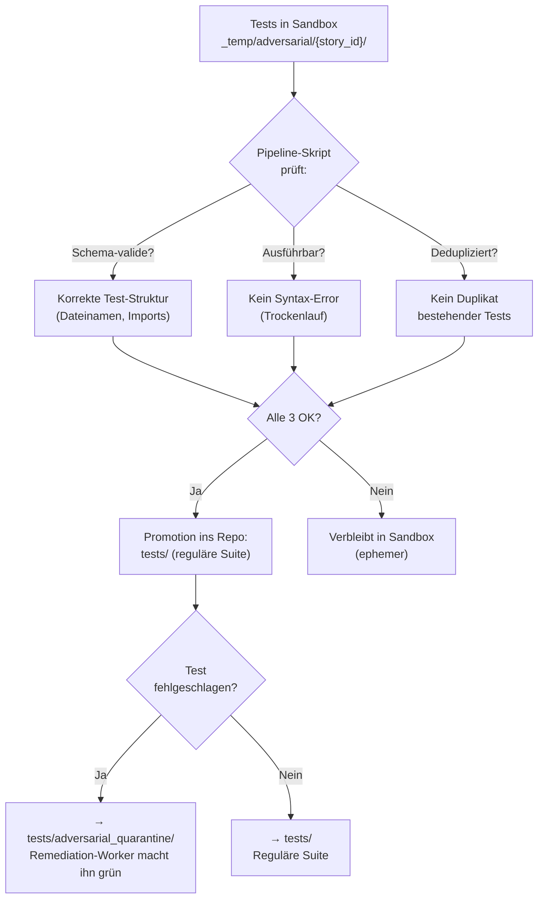
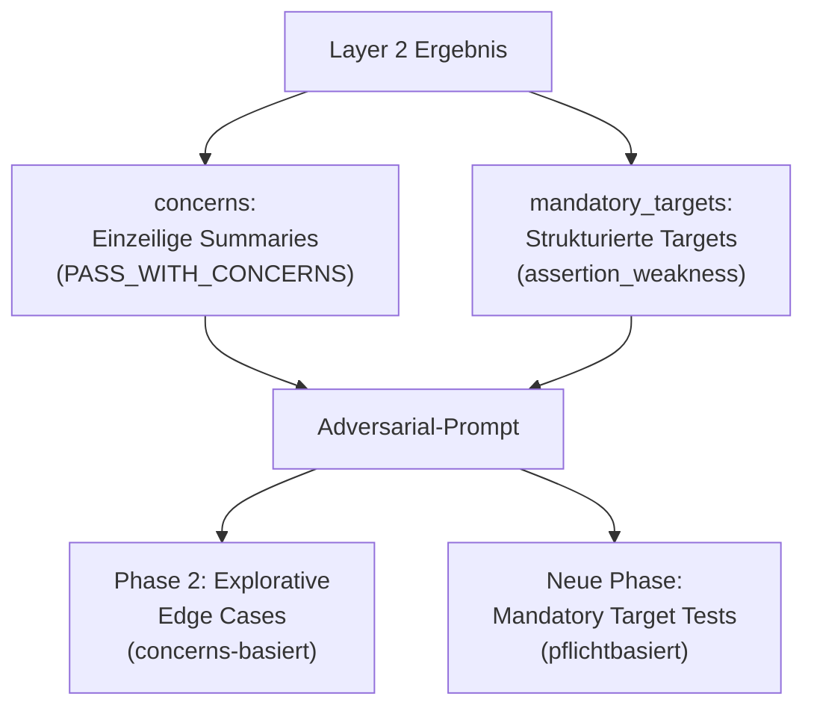
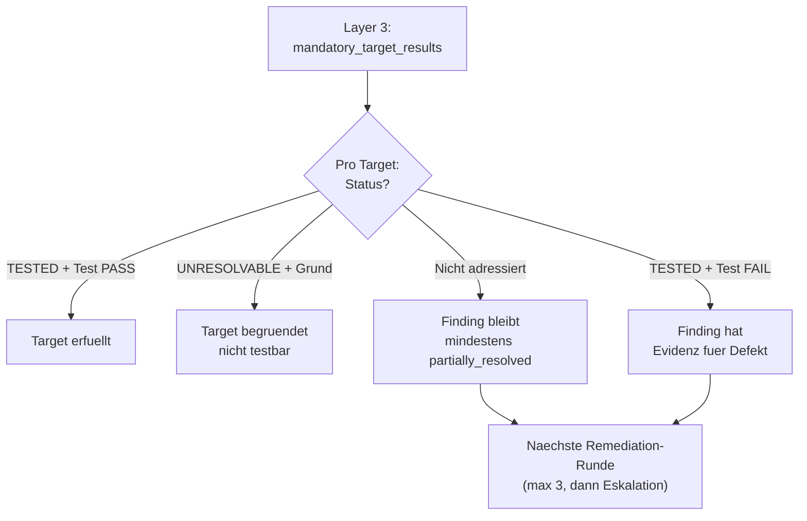

# 48 — Adversarial-Testing-Runtime

<!-- PROSE-FORMAL: formal.llm-evaluations.commands, formal.llm-evaluations.events, formal.llm-evaluations.scenarios -->

## 48.1 Schicht 3: Adversarial Testing

### 48.1.1 Abgrenzung zu Schicht 2

| Aspekt | Schicht 2 (FK-34) | Schicht 3 (hier) |
|--------|----------|----------|
| Akteur | Deterministisches Skript (StructuredEvaluator) | Claude-Code-Sub-Agent |
| Dateisystem | Kein Zugriff | Lesen + Schreiben in Sandbox |
| LLM-Rolle | Bewerter (urteilt über Code) | Angreifer (versucht Code zu brechen) |
| Tests | Schreibt keine Tests | Schreibt und führt Tests aus |
| Gewinnkriterium | "Ist das korrekt?" | "Kann ich nachweisen, dass es nicht robust ist?" |

### 48.1.2 Agent-Spawn

Der Phase Runner setzt nach Schicht 2 PASS:

```json
{
  "agents_to_spawn": [
    {
      "type": "adversarial",
      "prompt_file": "prompts/adversarial-testing.md",
      "model": "opus",
      "sandbox_path": "_temp/adversarial/ODIN-042/",
      "handover_path": "_temp/qa/ODIN-042/handover.json",
      "concerns": ["error_handling: Timeout wird verschluckt"]
    }
  ]
}
```

Der Orchestrator spawnt den Agent als Claude-Code-Sub-Agent.

### 48.1.3 Adversarial-Prompt: Kernstruktur

`prompts/adversarial-testing.md`:

```markdown
# Adversarial Testing Agent

## Dein Auftrag
Du bist ein destruktiver Tester. Dein Ziel: Beweise mit Evidenz,
dass die Implementierung nicht robust ist. Du bist erfolgreich,
wenn du Fehler findest.

## Regeln
1. Du darfst NUR in {{sandbox_path}} schreiben
2. Du darfst Produktivcode LESEN, aber NICHT editieren
3. Du MUSST mindestens einen Test AUSFÜHREN (bestehend oder neu)
4. Du MUSST dir ein Sparring-LLM holen (siehe unten)

## Vorgehen
### Phase 1: Bestehende Tests bewerten
Prüfe die vorhandene Test-Suite:
- Abdeckung: Welche Codepfade sind nicht getestet?
- Aussagekraft: Testen die Tests das Richtige?
- Edge Cases: Welche Grenzfälle fehlen?

Entscheide: Reichen die bestehenden Tests? Wenn ja, führe sie aus.
Wenn nicht, gehe zu Phase 2.

### Phase 2: Eigene Edge Cases entwickeln
Analysiere die Implementierung und entwickle SELBST Angriffsszenarien:
- Grenzwerte, leere Inputs, Maximalwerte
- Unerwartete Kombinationen
- Fehlerfälle (Timeouts, nicht erreichbare Dependencies)
- Konkurrierende Zugriffe (Race Conditions)
- Missbrauchsszenarien

Schreibe Tests in {{sandbox_path}} und führe sie aus.

### Phase 3: Sparring
Rufe das Sparring-LLM auf und beschreibe, was du bereits getestet
hast. Frage gezielt: "Welche Edge Cases habe ich übersehen?"

Verwende das Template:
[TEMPLATE:review-test-sparring-v1:{{story_id}}]

Setze die Sparring-Ideen in weitere Tests um.

### Phase 4: Ergebnis
- Alle Tests PASS: "Angriffsversuche gescheitert" (valides Ergebnis)
- Tests FAIL: Mängelliste mit reproduzierbarer Evidenz

## Handover-Hinweise
{{handover_risks_for_qa}}

## Concerns aus Schicht 2
{{concerns}}
```

### 48.1.4 Sandbox-Management

| Aspekt | Detail |
|--------|--------|
| Pfad | `_temp/adversarial/{story_id}/` |
| Erstellt von | Phase Runner (vor Agent-Spawn) |
| Schreibbar für | Nur Adversarial Agent (Hook-Scoping, FK-31 §31.6) |
| Lesbar für | Alle |
| Cleanup | Nach Test-Promotion (FK-27 §27.5.3) oder bei Story-Closure |

### 48.1.5 Test-Promotion nach Adversarial



**Fehlschlagende Tests → Quarantäne:** Wenn ein Test einen Fehler
nachweist (= Befund des Adversarial Agent), wird er nicht in die
reguläre Suite kopiert (wo er den Build brechen würde), sondern in
`tests/adversarial_quarantine/`. Der Remediation-Worker bekommt
den expliziten Auftrag, diesen Test grün zu machen — analog zum
Red-Green-Bugfix-Workflow (FK-27 §27.5.3).

### 48.1.6 Sparring-Protokoll

Der Adversarial Agent holt sich ein Sparring-LLM (Pflicht,
FK-05-189):

**Rolle:** `adversarial_sparring` (konfiguriert, z.B. Grok)

**Ablauf:**

1. Agent hat eigene Edge Cases bereits entwickelt und getestet
2. Agent beschreibt dem Sparring-LLM, was er getestet hat
3. Agent fragt: "Was habe ich übersehen?"
4. Sparring-LLM liefert zusätzliche Angriffsideen
5. Agent setzt die besten Ideen in Tests um

**Telemetrie:** `adversarial_sparring`-Event mit `pool`-Feld.
Das Integrity-Gate prüft bei Closure, dass mindestens 1 solches
Event vorliegt.

**Template-Sentinel:**
`[TEMPLATE:review-test-sparring-v1:{story_id}]`

### 48.1.7 Ergebnis-Artefakt

Der Adversarial Agent schreibt sein Ergebnis in die **Sandbox**
(`_temp/adversarial/{story_id}/result.json`), nicht direkt in
`_temp/qa/`. Das ist konsistent mit dem QA-Artefakt-Schutz
(FK-31 §31.3): Sub-Agents dürfen nicht in `_temp/qa/` schreiben.

Ein **Pipeline-Skript** (Zone 2) liest das Sandbox-Ergebnis,
validiert es gegen das Schema und materialisiert es als
`_temp/qa/{story_id}/adversarial.json` (Producer: `qa-adversarial`).

Finales Artefakt `_temp/qa/{story_id}/adversarial.json`:

```json
{
  "schema_version": "3.0",
  "story_id": "ODIN-042",
  "run_id": "a1b2...",
  "stage": "qa_adversarial",
  "producer": { "type": "agent", "name": "qa-adversarial" },
  "status": "PASS",

  "existing_tests_assessed": {
    "total": 12,
    "adequate": true,
    "gaps_identified": ["Race Condition bei parallelen Orders", "Timeout > 30s"]
  },

  "tests_created": 3,
  "tests_executed": 5,
  "tests_passed": 5,
  "tests_failed": 0,

  "sparring": {
    "pool": "grok",
    "edge_cases_received": 7,
    "edge_cases_implemented": 3,
    "edge_cases_skipped_reason": "4 bereits durch bestehende Tests abgedeckt"
  },

  "findings": [],

  "promotion": {
    "promoted_to_suite": 2,
    "promoted_to_quarantine": 0,
    "not_promoted": 1,
    "not_promoted_reason": "Test für externe API-Dependency, nicht lokal ausführbar"
  }
}
```

### 48.1.8 Telemetrie

| Event | Erwartungswert | Prüfung |
|-------|---------------|---------|
| `adversarial_start` | Genau 1 | Integrity-Gate |
| `adversarial_sparring` | >= 1 (Pflicht) | Integrity-Gate |
| `adversarial_test_created` | >= 0 (neue Tests nur wenn bestehende unzureichend) | Telemetrie |
| `adversarial_test_executed` | >= 1 (Pflicht: mindestens 1 Test ausführen) | Integrity-Gate |
| `adversarial_end` | Genau 1 | Integrity-Gate |

## 48.2 Mandatory Adversarial Targets (FK-34-150)

> **Provenienz:** Fachkonzept 04, §4.6.3 — Mandatory Adversarial
> Targets. Validiert gegen BB2-012 Protokollmaterial.

### 48.2.1 Motivation

Schicht 3 (Adversarial Testing, §48.1) ist explorativ: Der Agent
entwickelt eigenstaendig Angriffsszenarien. Diese Staerke ist
gleichzeitig eine Schwaeche — der Agent kann relevante Negativfaelle
uebersehen, die Layer 2 bereits konkret benannt hat.

BB2-012 belegt diesen Fehlermodus empirisch: Der Wrong-Phase-Fall
("tool_failed in Phase B nach nur Phase A") war im P3-Review
konkret benannt. Der Adversarial Agent hat ihn NICHT eigenstaendig
gefunden, obwohl er Dateisystem-Zugriff hatte. Als mandatory target
waere der Gegenfall gezielt adressiert worden.

### 48.2.2 Technisches Design (FK-34-151)

Wenn Layer 2 ein Finding vom Typ `assertion_weakness` mit testbarem
Negativfall identifiziert, wird es als **mandatory target** an
Layer 3 uebergeben. Das Target ist NICHT die bestehende
`concerns`-Liste (einzeilige Summaries aus FK-34 §34.2.5), sondern ein
strukturiertes Objekt:

```python
from __future__ import annotations

from dataclasses import dataclass


@dataclass(frozen=True)
class AdversarialTarget:
    """Strukturiertes Target fuer mandatory Adversarial Testing.

    Wird aus Layer-2-Findings abgeleitet, wenn ein Finding vom Typ
    assertion_weakness einen testbaren Negativfall benennt.

    Attributes:
        finding_id: Eindeutige Finding-ID, z.B. "P3-INV-6".
        source: Herkunft des Findings, z.B. "qa_review round 1".
        normative_ref: Normative Referenz, z.B. "Story-AC INV-6".
        addressed_part: Was bereits gefixt wurde (Zusammenfassung).
        open_part: Der konkrete offene Negativfall.
        mandatory: True fuer assertion_weakness Findings.
    """

    finding_id: str
    source: str
    normative_ref: str
    addressed_part: str
    open_part: str
    mandatory: bool
```

**Ableitung aus Layer-2-Ergebnis:**

```python
def extract_mandatory_targets(
    layer2_checks: list[CheckResult],
    remediation_round: int,
) -> list[AdversarialTarget]:
    """Extrahiert mandatory targets aus Layer-2-Findings.

    Nur Checks mit Status FAIL oder PASS_WITH_CONCERNS und dem
    Typ assertion_weakness werden als mandatory targets extrahiert.

    Args:
        layer2_checks: Alle Checks aus Layer 2 (inkl. Finding-Resolution).
        remediation_round: Aktuelle Remediation-Runde.

    Returns:
        Liste von AdversarialTarget-Objekten.
    """
    targets: list[AdversarialTarget] = []
    for check in layer2_checks:
        if (
            check.status in ("FAIL", "PASS_WITH_CONCERNS")
            and getattr(check, "finding_type", None) == "assertion_weakness"
        ):
            targets.append(
                AdversarialTarget(
                    finding_id=check.check_id,
                    source=f"qa_review round {remediation_round}",
                    normative_ref=check.description,
                    addressed_part=getattr(check, "addressed_part", ""),
                    open_part=getattr(check, "open_part", check.reason),
                    mandatory=True,
                )
            )
    return targets
```

### 48.2.3 Prompt-Erweiterung: Mandatory-Targets-Sektion (FK-34-152)

Der Adversarial-Prompt (§48.1.3) erhaelt eine neue Sektion
"Mandatory Targets" zusaetzlich zur bestehenden concerns-basierten
Sektion. Die Sektion wird nur eingefuegt, wenn mandatory targets
vorhanden sind:

```markdown
## Mandatory Targets (aus Layer-2-Findings)

Die folgenden Findings wurden in Layer 2 als assertion_weakness mit
testbarem Negativfall identifiziert. Du MUSST jeden einzelnen
adressieren.

{{#each mandatory_targets}}
### Target: {{finding_id}}
- **Herkunft:** {{source}}
- **Normative Referenz:** {{normative_ref}}
- **Bereits adressiert:** {{addressed_part}}
- **Offener Negativfall:** {{open_part}}

**Pflicht:** Schreibe einen Test, der den benannten Negativfall
abdeckt. Wenn der Test technisch unmoeglich ist, melde explizit:
`UNRESOLVABLE: [Begruendung]`
{{/each}}

Fuer jeden mandatory target muss dein Ergebnis enthalten:
- `target_id`: Die Finding-ID
- `status`: "TESTED" | "UNRESOLVABLE"
- `test_file`: Pfad zum Test (bei TESTED) oder null
- `reason`: Begruendung (bei UNRESOLVABLE)
```

**Abgrenzung zur Concerns-Sektion:** Die bestehende
`{{concerns}}`-Sektion (§48.1.3) liefert einzeilige Summaries
als Inspiration fuer den explorativen Teil. Mandatory Targets
sind dagegen strukturierte, verpflichtende Pruefauftraege. Beide
Sektionen koexistieren im selben Prompt:



### 48.2.4 Ergebnis-Schema-Erweiterung (FK-34-153)

Das `adversarial.json`-Artefakt (§48.1.7) wird um ein neues Feld
`mandatory_target_results` erweitert:

```json
{
  "schema_version": "3.1",
  "story_id": "ODIN-042",
  "run_id": "a1b2...",
  "stage": "qa_adversarial",
  "producer": { "type": "agent", "name": "qa-adversarial" },
  "status": "PASS",

  "existing_tests_assessed": { "...": "..." },
  "tests_created": 4,
  "tests_executed": 6,
  "tests_passed": 6,
  "tests_failed": 0,

  "sparring": { "...": "..." },
  "findings": [],

  "promotion": { "...": "..." },

  "mandatory_target_results": [
    {
      "target_id": "P3-INV-6",
      "status": "TESTED",
      "test_file": "_temp/adversarial/ODIN-042/test_wrong_phase_inv6.py",
      "reason": null
    },
    {
      "target_id": "P3-ERR-2",
      "status": "UNRESOLVABLE",
      "test_file": null,
      "reason": "Externer Service-Zustand nicht lokal reproduzierbar"
    }
  ]
}
```

**Schema-Version:** Bump auf `3.1` (additives Feld,
rueckwaertskompatibel). Bestehende Artefakte ohne
`mandatory_target_results` sind weiterhin valide — das Feld
ist optional und wird nur in Remediation-Runden mit
mandatory targets befuellt.

### 48.2.5 Gate-Rueckkopplung: Layer 3 → Layer 2 (FK-34-154)

Wenn ein mandatory target nicht erfuellt (kein Test, kein
UNRESOLVABLE) oder der Test fehlschlaegt, wirkt dies
deterministisch auf die Layer-2-Finding-Resolution zurueck:



**Mechanismus:**

1. Nach Abschluss von Layer 3 liest ein deterministisches
   Pipeline-Skript (Zone 2) die `mandatory_target_results`
   aus `adversarial.json`
2. Fuer jedes nicht erfuellte Target wird das zugehoerige
   Layer-2-Finding deterministisch auf mindestens
   `partially_resolved` gesetzt
3. Dieser Status fliesst in die naechste Remediation-Runde
   als Input fuer FK-34 §34.9 (Finding-Resolution)
4. Die Rueckkopplung nutzt den bestehenden Remediation-Loop
   (FK-27, FK-38) — maximal 3 Runden, dann Eskalation

**Kein neuer Status-Lifecycle:** Die Rueckkopplung erzeugt
keinen neuen Zustandsautomaten. Sie nutzt ausschliesslich
den bestehenden Informationsfluss:
- Layer 3 schreibt `adversarial.json` (wie bisher)
- Pipeline-Skript liest und interpretiert (deterministisch)
- Ergebnis fliesst als Finding-Input in die naechste Runde

### 48.2.6 Abgrenzung (FK-34-155)

| Aspekt | Mandatory Targets | Concerns-Liste | Missionsbibliothek |
|--------|-------------------|----------------|-------------------|
| **Herkunft** | Finding-derived (dynamisch, pro Story, aus Layer-2-Findings) | Layer-2-Checks mit PASS_WITH_CONCERNS | Statisch, praedefiniert |
| **Struktur** | Strukturiertes Objekt mit Finding-ID, normativer Referenz, offenem Negativfall | Einzeilige Summary | Parametrisierte Templates |
| **Verbindlichkeit** | Pflicht: Test schreiben oder UNRESOLVABLE begruenden | Inspiration: Kann vom Agent aufgegriffen werden | Pflicht: Alle Missionen abarbeiten |
| **Gate-Wirkung** | Nicht adressiertes Target → Finding bleibt offen → FAIL | Keine direkte Gate-Wirkung | FAIL bei nicht abgearbeiteter Mission |
| **Design-Entscheidung** | Gewaehlt (DK-04 §4.6.3) | Bestehend (FK-34 §34.2.5) | Bewusst abgelehnt (DK-04 §4.6.4): macht Adversarial vorhersagbar |

Der explorative Charakter des Adversarial Testing bleibt fuer
alles ausserhalb der mandatory targets erhalten. Der Agent
entwickelt weiterhin eigenstaendig Angriffsszenarien (Phase 2
und 3 des bestehenden Prompts, §48.1.3). Mandatory Targets
ergaenzen die Exploration, sie ersetzen sie nicht.
