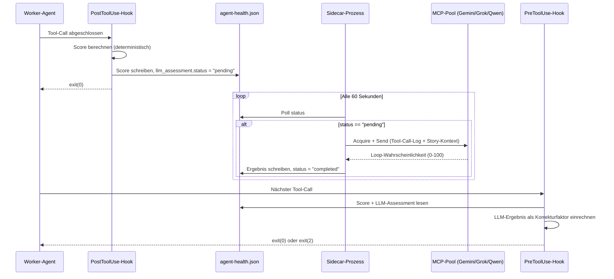

# 49 — Worker-Health-Monitor (Hooks, Sidecar, Interventions-Logik)

<!-- PROSE-FORMAL: formal.guard-system.scenarios -->

## 49.1 Worker-Health-Monitor-Hooks (REF-042)

Der Worker-Health-Monitor (DK-03 §3.8) nutzt beide Hook-Typen auf
eine Weise, die sich von den bisherigen Guard- und Telemetrie-Hooks
fundamental unterscheidet: Der PostToolUse-Hook ist keine reine
Observation (er berechnet und persistiert einen Score), und der
PreToolUse-Hook ist kein statischer Guard (er entscheidet dynamisch
anhand des persistierten Scores). Zusammen bilden sie eine
**Scoring-Intervention-Schleife**, die bei jedem Tool-Call des
Workers durchlaufen wird.

### 49.1.1 PostToolUse-Hook: Scoring-Engine

Nach jedem Tool-Call berechnet der PostToolUse-Hook einen
deterministischen Score (0-100) aus gewichteten Heuristiken.
Der Hook wird über den Matcher `Bash|Write|Edit|Read|Grep|Glob|Agent`
auf alle relevanten Tool-Typen registriert (FK-30 §30.3.1).

**Heuristiken:**

| Heuristik | Max Punkte | Stärke | Messmethode |
|-----------|------------|--------|-------------|
| Laufzeit vs. Erwartung | 30 | Stark | Normalisiert nach Story-Typ/-Größe (P50/P75/P95 aus Konfiguration) |
| Repetitions-Muster | 25 | Stark | Sliding Window über `tool-call-log.jsonl` — wiederholte grep/edit-Zyklen auf dieselbe Datei |
| Hook/Commit-Konflikte | 25 | Sehr stark | Klassifikation fehlgeschlagener `git commit`-Aufrufe (§49.1.4) |
| Fortschritts-Stagnation | 20 | Stark | `git status`/`git log` im Worktree — kein Commit trotz grüner Tests |
| Tool-Call-Anzahl | 10 | Schwach | Gesamtzähler — nur Verstärker, nicht eigenständig aussagekräftig |
| LLM-Assessment | -10 bis +10 | Korrekturfaktor | Asynchrones Ergebnis aus Sidecar-Prozess (§49.1.3) |

**Score-Berechnung:**

```python
def compute_health_score(state: AgentHealthState) -> int:
    """Deterministisch. Keine LLM-Abhängigkeit."""
    score = 0
    score += score_runtime(state.started_at, state.story_size)
    score += score_repetition(state.tool_call_log)
    score += score_hook_conflicts(state.hook_failures)
    score += score_stagnation(state.last_commit_at, state.tests_green_since)
    score += score_tool_calls(state.tool_call_count)
    score += state.llm_assessment_delta  # -10 bis +10, default 0
    return min(max(score, 0), 100)
```

**Persistenz:** Der Hook schreibt den aktualisierten Score und
alle Komponenten zentral im State-Backend; `agent-health.json` ist nur ein Export:

```json
{
  "worker_id": "a8615fd28f5f223cd",
  "story_id": "BB2-059",
  "started_at": "2026-04-06T20:32:51Z",
  "score_components": {
    "runtime": 25,
    "repetition": 15,
    "hook_conflict": 25,
    "stagnation": 12,
    "tool_calls": 5,
    "llm_assessment": 0
  },
  "total_score": 82,
  "tool_call_count": 94,
  "tool_call_log_path": "_temp/qa/BB2-059/tool-call-log.jsonl",
  "hook_failures": [
    {"at": "2026-04-06T22:45:00Z", "reason": "SECRET_CONTENT", "count": 3}
  ],
  "last_commit_at": null,
  "tests_green_since": "2026-04-06T22:30:00Z",
  "interventions": [],
  "llm_assessment": {
    "status": "idle",
    "result": null,
    "requested_at": null,
    "expires_at": null
  },
  "last_updated": "2026-04-06T23:15:00Z"
}
```

Zusätzlich setzt der Hook `llm_assessment.status = "pending"`,
wenn der Score >= 50 liegt und noch kein Assessment läuft
(`status == "idle"`). Der Sidecar-Prozess (§49.1.3) pollt
diese Datei und reagiert auf den Status-Wechsel.

**Performance-Konformität (FK-30 §30.4.1):** Die Score-Berechnung nutzt
ausschließlich erlaubte Operationen — JSON-Read/-Write, einfache
Arithmetik, Dateisystem-Checks (`git status` als lokaler
Subprocess). Kein Netzwerk, kein LLM-Call, keine aufwändige
Diff-Analyse. Die LLM-Bewertung ist an den Sidecar-Prozess
delegiert und blockiert den Hook nicht.

### 49.1.2 PreToolUse-Hook: Interventions-Gate

Vor dem nächsten Tool-Call liest der PreToolUse-Hook den
persistierten Score aus `agent-health.json` und entscheidet über
Intervention. Der Hook ist zustandsbehaftet — er liest nicht nur
den Score, sondern auch den Interventions-Verlauf, um
Wiederholungen zu vermeiden (Einmal-Garantie).

**Entscheidungslogik:**

```python
def intervention_decision(state: AgentHealthState) -> int:
    """Entscheidet über Durchlassen, Intervention oder Hard Stop."""
    score = state.total_score

    # Normalbetrieb
    if score < 50:
        return 0  # exit(0) — durchlassen

    # Nach Hard Stop: permanente Blockade (kein Tool-Call mehr)
    if state.hard_stop_issued and state.final_call_used:
        print("AGENTKIT HEALTH MONITOR — Permanent block.", file=sys.stderr)
        return 2  # exit(2) — blockiert

    # Hard Stop: ein letzter Call erlaubt (für worker-manifest.json)
    if score >= 85 and not state.hard_stop_issued:
        emit_hard_stop_message(state)
        state.hard_stop_issued = True
        state.final_call_used = False
        persist(state)
        return 2  # exit(2) — blockiert mit finaler Nachricht

    # Nach Hard Stop: letzten Call durchlassen
    if state.hard_stop_issued and not state.final_call_used:
        state.final_call_used = True
        persist(state)
        return 0  # exit(0) — letzter Call

    # Soft-Intervention: einmalig blockieren, danach Beobachtung
    if score >= 70 and not state.soft_intervention_issued:
        emit_soft_intervention_message(state)
        state.soft_intervention_issued = True
        state.observation_calls_remaining = 5
        persist(state)
        return 2  # exit(2) — blockiert mit Selbstdiagnose-Nachricht

    # Beobachtungsphase nach Soft-Intervention
    if state.soft_intervention_issued and state.observation_calls_remaining > 0:
        state.observation_calls_remaining -= 1
        persist(state)
        return 0  # exit(0) — durchlassen, beobachten

    return 0  # exit(0) — durchlassen
```

**Soft-Intervention (Score 70-84) — Strukturierte Nachricht:**

```
AGENTKIT HEALTH MONITOR — Intervention

Dein Verhaltensmuster zeigt Anzeichen von Stagnation oder Constraint-Konflikt.
Score: {score}/100.

Bitte deklariere deinen Status mit einer der folgenden Optionen:

1. PROGRESSING — Ich mache Fortschritte.
   → Beschreibe den nächsten konkreten Meilenstein.

2. BLOCKED — Ich bin durch einen externen Constraint blockiert.
   → Schreibe worker-manifest.json mit status: "BLOCKED" und beende.
   → Das ist eine valide, korrekte Worker-Leistung.

3. SPARRING_NEEDED — Ich brauche eine zweite Meinung.
   → Hole dir Sparring über den MCP-Pool (ChatGPT/Gemini/Grok).

Reagiere auf diese Nachricht, bevor du mit deiner Arbeit fortfährst.
```

Der Hook merkt sich die Intervention. Der nächste Tool-Call wird
durchgelassen (exit 0). Dann beobachtet der Hook 4-5 weitere
Calls: Startet der Agent ein LLM-Sparring? Schreibt er ein
Manifest? Ändert sich das Muster? Wenn nicht, steigt der Score
weiter in Richtung Hard Stop.

**Hard Stop (Score >= 85) — Finale Nachricht:**

```
AGENTKIT HEALTH MONITOR — Hard Stop

Score: {score}/100. Maximale Toleranz überschritten.

Du MUSST jetzt sofort:
1. worker-manifest.json schreiben mit status: "BLOCKED"
2. blocking_issue und attempted_remediations ausfüllen
3. Keine weiteren Tool-Calls ausführen

Dein nächster Tool-Call wird dein letzter sein.
```

Nach dieser Nachricht lässt der Hook genau einen weiteren
Tool-Call durch (damit der Agent das Manifest schreiben kann).
Danach blockiert er permanent.

**Einmal-Garantie:** Pro Scoring-Fenster gibt es maximal eine
Soft-Intervention und einen Hard Stop. Der Hook wiederholt keine
Interventionen. Wenn nach der Soft-Intervention der Score weiter
steigt, geht es direkt zum Hard Stop — kein zweites Zureden.

**Abgrenzung zu opaken Fehlermeldungen (FK-30 §30.7):** Die
Health-Monitor-Nachrichten sind bewusst **nicht opak**. Im
Gegensatz zu Guard-Hooks, die dem Agent keine Details über den
Blockierungsgrund geben (um Umgehung zu verhindern), muss der
Health-Monitor dem Agent erklären, was passiert und welche
Exit-Optionen er hat. Das Ziel ist nicht Blockade, sondern
kooperative Deeskalation.

> **[Entscheidung 2026-04-08]** Element 23 — LLM-Assessment-Sidecar ist Pflicht. Kein Feature-Flag. Der Sidecar-Prozess ist keine optionale Erweiterung, sondern integraler Bestandteil der Produktionsarchitektur.
> Siehe `stories/entscheidung-v2-ballast-bewertung.md`, Element 23.

### 49.1.3 Sidecar-Prozess: LLM-Assessment

Das LLM-Assessment läuft nicht im Hook (das würde den Worker
blockieren und FK-30 §30.4.1 verletzen), sondern in einem separaten
Python-Prozess, der parallel zum Worker läuft.

**Architekturfluss:**



**LLM-Prompt (an externes LLM):**

```
Hier ist das Tool-Call-Protokoll eines KI-Agenten, der eine
Implementation-Story bearbeitet. Analysiere das Muster.

Story: {story_summary}
Bisherige Laufzeit: {runtime_minutes} Minuten
Tool-Calls: {tool_call_count}

Letzte {window_size} Tool-Calls:
{tool_call_log_excerpt}

Wie hoch ist die Wahrscheinlichkeit (0-100), dass der Agent
in einem Loop steckt?
Antworte nur mit: LOOP_PROBABILITY: <0-100>
```

**Ergebnis-Mapping:**

| Loop-Wahrscheinlichkeit | Score-Delta |
|--------------------------|-------------|
| 0-30 | -10 (entlastend) |
| 31-60 | 0 (neutral) |
| 61-100 | +10 (belastend) |

**Debounce-Regeln:**

- Max 1 pending Assessment pro Worker (kein paralleles Polling)
- Mindestabstand 10 Minuten zwischen zwei Assessments
- Neues Assessment nur wenn Score um >= 10 Punkte gestiegen
  seit letztem Assessment
- LLM-Timeout: 45 Sekunden — bei Überschreitung
  `status = "failed"`, Score-Beitrag = 0
- Assessment-Gültigkeit: 30 Minuten — danach `status` zurück
  auf `"idle"`

**Sidecar-Lifecycle:**

- **Start:** Orchestrator startet den Sidecar beim Worker-Spawn
  (`agentkit watch-worker <story-id>`)
- **Stop:** Beendet sich selbst wenn `agent-health.json` nicht
  mehr aktualisiert wird (Timeout 5 Minuten) oder wenn der
  Worker terminiert
- **Crash-Resilience:** Wenn der Sidecar abstürzt, fehlt
  die LLM-Komponente. Das deterministische Scoring funktioniert
  unverändert weiter (Timeout-Sicherheit). Der LLM-Anteil fällt auf 0 zurück.
  Der Sidecar wird jedoch immer gestartet — er ist Pflichtbestandteil.

### 49.1.4 Hook-Commit-Failure-Klassifikation

Der PostToolUse-Hook (§49.1.1) erkennt fehlgeschlagene
`git commit`-Aufrufe anhand des Tool-Namens (`Bash`), des
Command-Strings (enthält `git commit`) und des Exit-Codes
(!= 0). Bei einem erkannten Failure parst der Hook die
stdout/stderr-Ausgabe und klassifiziert den Reason:

| Kategorie | Erkennung (stderr-Muster) | Score-Beitrag | Beispiel |
|-----------|---------------------------|---------------|----------|
| `FIXABLE_LOCAL` | Lint-Fehler, Format-Verstöße, Type-Errors | +5 | `ruff check failed`, `mypy: error` |
| `FIXABLE_CODE` | Test- oder Build-Fehler | +5 | `FAILED test_`, `build failed` |
| `POLICY_CONFLICT` | Secret-Detection auf Test-Code, Policy-Verstöße | +15 bis +25 | `SECRET_CONTENT`, `password detected` |
| `ENVIRONMENTAL` | Fehlendes Tool, Netzwerkproblem, Permissions | +10 | `command not found`, `permission denied` |

**Eskalation bei Wiederholung:** Wiederholtes Scheitern am selben
Reason (>= 2x) erhöht den Score-Beitrag drastisch — auf das
Maximum der Kategorie. Genau dieses Muster hätte den BB2-059-
Vorfall innerhalb der ersten 30 Minuten der Loop erkannt: Zwei
fehlgeschlagene `git commit`-Aufrufe mit Reason `SECRET_CONTENT`
hätten den Hook-Konflikt-Score auf 25 getrieben und in Kombination
mit der Fortschritts-Stagnation die Soft-Intervention ausgelöst.

**Klassifikations-Logik:**

```python
_FAILURE_PATTERNS: dict[str, str] = {
    "SECRET_CONTENT": "POLICY_CONFLICT",
    "password detected": "POLICY_CONFLICT",
    "ruff check": "FIXABLE_LOCAL",
    "mypy: error": "FIXABLE_LOCAL",
    "FAILED test_": "FIXABLE_CODE",
    "build failed": "FIXABLE_CODE",
    "command not found": "ENVIRONMENTAL",
    "permission denied": "ENVIRONMENTAL",
}

def classify_commit_failure(stderr: str) -> str:
    """Klassifiziert einen git-commit-Failure anhand der stderr-Ausgabe."""
    for pattern, category in _FAILURE_PATTERNS.items():
        if pattern.lower() in stderr.lower():
            return category
    return "ENVIRONMENTAL"  # Fallback: unbekannte Fehler konservativ bewerten
```

### 49.1.5 Persistenz-Artefakte

Der Worker-Health-Monitor erzeugt zwei Persistenz-Artefakte
im QA-Verzeichnis der jeweiligen Story:

| Artefakt | Pfad | Inhalt |
|----------|------|--------|
| `agent-health.json` | `_temp/qa/<STORY-ID>/agent-health.json` | Score-Komponenten, Gesamtscore, Hook-Failures, Interventions-Log, LLM-Assessment-Status (§49.1.1) |
| `tool-call-log.jsonl` | `_temp/qa/<STORY-ID>/tool-call-log.jsonl` | Letzte 100-500 Tool-Calls als JSONL (Sliding Window). Jede Zeile: Zeitstempel, Tool-Name, Ziel-Datei, Args-Hash. Für Pattern-Erkennung (Repetitions-Heuristik) und LLM-Assessment-Input. |

Die Window-Größe des Tool-Call-Logs ist konfigurierbar. Der
PostToolUse-Hook schreibt neue Einträge am Ende an und trimmt
das Log auf die konfigurierte Maximalgröße. Das Log wird nach
Worker-Termination nicht gelöscht — es dient als Post-mortem-
Artefakt für die Forensik fehlgeschlagener Story-Ausführungen.

### 49.1.6 Zusammenspiel mit bestehenden Hooks

Der Health-Monitor ist orthogonal zu den bestehenden Guard-
und Telemetrie-Hooks:

| Bestehender Hook | Beziehung zum Health-Monitor |
|------------------|------------------------------|
| Guard-Hooks (branch, orchestrator, integrity, etc.) | Laufen vor dem Health-Monitor (FK-30 §30.3.3). Wenn ein Guard blockiert, erreicht der Call den Health-Monitor nicht. Der PostToolUse-Hook des Health-Monitors sieht aber das Ergebnis des fehlgeschlagenen Tool-Calls und kann Hook-Failures klassifizieren. |
| `telemetry.hook` | Emittiert Events in `execution_events`. Der Health-Monitor nutzt eigene State-Backend-Persistenz; `agent-health.json` ist nur Export. |
| `budget` (Web-Call-Budget) | Referenz-Implementation für Hook-basierte Budgets. Der Health-Monitor folgt demselben Muster (PostToolUse zählt, PreToolUse erzwingt), arbeitet aber mit einem gewichteten Score statt einem einfachen Zähler. |
| `review_guard` | Keine Interaktion. Der Review-Guard prüft Pool-Send-Compliance, der Health-Monitor prüft Worker-Gesundheit. |

**Abgrenzung zur Performance-Designregel (FK-30 §30.4.1):** Die Regel
verbietet LLM-Aufrufe in Hooks. Der Health-Monitor hält diese
Regel ein: Der PostToolUse-Hook berechnet den Score deterministisch
und setzt lediglich einen Status-Flag (`llm_assessment.status =
"pending"`). Der eigentliche LLM-Call wird vom Sidecar-Prozess
(§49.1.3) durchgeführt — außerhalb des Hook-Lebenszyklus.

### 49.1.7 Konfiguration

Alle Schwellwerte, Gewichte und Sidecar-Parameter werden in
`.story-pipeline.yaml` unter `worker_health` konfiguriert:

```yaml
worker_health:
  # Der Worker-Health-Monitor ist Pflichtbestandteil und nicht abschaltbar.

  scoring:
    thresholds:
      warning: 50         # LLM-Assessment anfordern
      intervention: 70    # Soft-Intervention via PreToolUse
      hard_stop: 85       # Worker deterministisch beenden

    runtime:
      S: [30, 45, 75]     # P50/P75/P95 in Minuten
      M: [60, 90, 120]
      L: [90, 135, 180]
      max_points: 30

    repetition:
      window_size: 15     # Sliding Window in Tool-Calls
      same_file_threshold: 5
      max_points: 25

    hook_conflict:
      same_reason_threshold: 2
      max_points: 25

    stagnation:
      no_commit_warning_minutes: 30
      no_commit_critical_minutes: 60
      max_points: 20

    tool_calls:
      soft_limit: 80
      hard_limit: 120
      max_points: 10

  llm_assessment:
    # Der LLM-Assessment-Sidecar ist Pflichtbestandteil und nicht abschaltbar.
    # Timeout-Konfiguration (timeout_seconds) bleibt konfigurierbar.
    trigger_score: 50
    throttle_seconds: 600    # 10 Minuten Mindestabstand
    timeout_seconds: 45
    max_delta: 10
    score_rise_threshold: 10 # Neues Assessment nur bei Anstieg >= 10
    models: ["gemini", "grok", "qwen"]

  sidecar:
    poll_interval_seconds: 60
    idle_shutdown_seconds: 300

  tool_call_log:
    max_entries: 500         # Sliding Window
```
