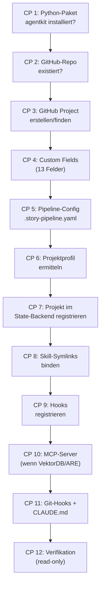

# 50 — Installer, Checkpoint-Engine und Bootstrap

## 50.1 Zweck

<!-- PROSE-FORMAL: formal.installer.entities, formal.installer.invariants, formal.skills-and-bundles.entities, formal.skills-and-bundles.invariants -->

AgentKit wird systemweit installiert und registriert anschließend ein
Zielprojekt über eine Folge idempotenter Checkpoints (FK 11). Das
Zielprojekt erhält lokale Konfiguration und Claude-Code-kompatible
Symlink-Bindungen für Skills, aber keine kopierten AgentKit-
Laufzeitartefakte.

**Architekturzuordnung:** Der Installer ist im Komponentenmodell eine
eigene Top-Level-Komponente. Er ist kein Teil der `PipelineEngine`,
sondern vorgelagerter Bootstrap- und Registrierungsmechanismus für
Projekte, Hooks, Skill-Bindungen und Backend-Registrierung.

## 50.2 Aufruf

<!-- PROSE-FORMAL: formal.installer.commands -->

Der Installer ist transport-agnostisch. CLI-Aufrufe (`agentkit register-project`,
`agentkit verify-project`) sind Boundary-Controls des aufrufenden BC und
werden dort dokumentiert. Beispiel-Aufrufe gehoeren nicht zum Installer-Vertrag.

**Unterstuetzte Ausfuehrungsmodi:**

- Erstregistrierung: Checkpoint-Folge vollstaendig durchlaufen.
- Idempotenter Re-Lauf: Bereits erfuellte Checkpoints werden uebersprungen (SKIPPED).
- Dry-Run (`execution_mode=dry_run`): Checkpoint-Aktionen werden vorgeschaut, aber keine
  Dateien, Backend-State oder Bindungen werden veraendert.
- Verifikation (`execution_mode=verify`): Read-only Pruefung aller Checkpoints.

## 50.3 Zwölf Checkpoints

<!-- PROSE-FORMAL: formal.installer.state-machine, formal.installer.events, formal.installer.scenarios, formal.skills-and-bundles.state-machine, formal.skills-and-bundles.commands, formal.skills-and-bundles.events, formal.skills-and-bundles.scenarios -->



### 50.3.1 Checkpoint-Engine als Komponenten-Flow

Die Checkpoint-Engine des `Installer` wird ueber die Einheits-DSL
modelliert. Jeder Checkpoint ist ein expliziter `step`-Knoten innerhalb
eines `FlowDefinition(level="component", owner="Installer")`.

**Cross-BC-Beziehung:** `FlowDefinition` ist eine DSL-Klasse aus BC
`pipeline-framework` (`agentkit.pipeline_engine.flow_orchestrator`, FK-20).
`installation-and-bootstrap` konsumiert diese Klasse als strukturelle
Wiederverwendung der Einheits-DSL; die Checkpoint-Engine ist kein Teil von
`PipelineEngine` und teilt keinen Laufzeit-State mit ihr.

**Wichtige Konsequenz:**

- Reihenfolge und optionale Aeste der Registrierung gehoeren in den
  Flow-Vertrag
- die Idempotenz einzelner Checkpoints bleibt Aufgabe ihrer Handler
- Profil- und Feature-Entscheidungen (`core` vs. `are`,
  `vectordb` an/aus) werden ueber `branch`-Knoten modelliert, nicht
  ueber verstreute Imperativlogik

Minimaler Installer-Flow:

```text
cp_01_package_check
  -> cp_02_repo_check
  -> cp_03_project_lookup
  -> cp_04_custom_fields
  -> cp_05_pipeline_config
  -> cp_06_profile_resolution
  -> cp_07_backend_registration
  -> cp_08_skill_bindings
  -> cp_09_hook_registration
  -> branch_vectordb_enabled
  -> cp_10_mcp_registration?
  -> branch_are_enabled
  -> cp_10c_are_scope_validation?
  -> cp_11_git_hooks_and_claude
  -> cp_12_verify_registration
```

Die Frage "Checkpoint laeuft erneut oder nicht?" wird damit sauber
geteilt:

- Kontrollfluss: durch die DSL
- Konvergenz/Idempotenz: durch den Checkpoint-Handler

Ein Checkpoint darf also im Flow erneut besucht werden, muss aber
handlerseitig denselben Zielzustand ohne Seiteneffekt-Explosion
herstellen.

### CP 1: Python-Paket

Prüft ob `agentkit` als Python-Paket verfügbar ist:

```python
import agentkit
assert agentkit.__version__
```

**Idempotenz:** Nur Prüfung, keine Aktion.

### CP 2: GitHub-Repo

Prüft ob das Repo existiert und `gh` CLI authentifiziert ist:

```bash
gh repo view {owner}/{repo} --json name
```

**Idempotenz:** Nur Prüfung.

### CP 3: GitHub Project

Sucht ein bestehendes GitHub Project V2 oder erstellt ein neues:

```bash
gh project list --owner {owner} --format json
# Wenn nicht gefunden:
gh project create --owner {owner} --title "AgentKit - {repo}"
```

**Idempotenz:** Erstellt nur wenn nicht vorhanden.

### CP 4: Custom Fields

Stellt sicher, dass alle 13 Custom Fields existieren (Kap. 12.2.1).
Prüft den bestehenden Zustand und erstellt nur fehlende Fields.
Vorhandene Fields werden nicht verändert.

**13 Felder:** Status, Story ID, Story Type, Size, Change Impact,
New Structures, Concept Quality (Pflicht, High/Medium/Low),
QA Rounds, Completed At, Module, Epic, Primary Repo,
Participating Repos.

REF-032 + Remediation: Maturity, External Integrations und
Requires Exploration entfernt; Concept Quality hinzugefügt.

**Idempotenz:** Nur fehlende Fields erstellen.

### CP 5: Pipeline-Config

Erzeugt `.story-pipeline.yaml` wenn nicht vorhanden. Bei
bestehender Datei: prueft `config_version`, migriert bei Bedarf
(Kap. 51).

**ARE-Scope-Mapping:** `installation-and-bootstrap` ist Schreib-Owner
des ARE-Scope-Mappings (`are.module_scope_map` in der Pipeline-Config).
CP 5 initialisiert die Mapping-Struktur; CP 10c ergaenzt fehlende
Eintraege interaktiv. Lese-Zugriff liegt bei BC `requirements-and-scope-coverage`
(FK-40 §40.3.2).

**Idempotenz:** Ueberschreibt nie bestehende Config.

### CP 6: Projektprofil ermitteln

Ermittelt das Projektprofil, aus dem sich die zu bindenden Skills
und Prompt-Varianten ableiten. Zentrale Minimalunterscheidung:

- `core`
- `are`

Die Profilwahl erfolgt bei der Registrierung und nicht zur Laufzeit
innerhalb der Skills.

**Idempotenz:** Bereits ermitteltes Profil wird wiederverwendet,
sofern die Projektkonfiguration unverändert ist.

### CP 7: Projekt im State-Backend registrieren

Legt einen Projekt-Record im zentralen State-Backend an und
hinterlegt:

- Projektkennung
- GitHub-Owner/Repo/Project-ID
- Konfigurations-Digest
- Projektprofil
- zulaessige Bundle-Version

**Ownership:** BC `installation-and-bootstrap` ist Schema-Owner der
`project_registry`-Tabelle. Der Schreib-Adapter ist ein T-Driver
(Persistenz-Infrastruktur); die fachliche Datenstruktur
(`ProjectRegistration`) bleibt in diesem BC definiert. Konsistent mit
dem BC-9-Pattern (telemetry-and-events ownt nur DB-Zugriff, nicht die
fachlichen Schemas der anderen BCs).

**Idempotenz:** Upsert auf Projektkennung; nur Deltas werden geschrieben.

### CP 8: Skill-Symlinks binden

Bindet die projektlokalen Skill-Verzeichnisse unter `.claude/skills/` an die
systemweit installierten, versionierten Bundle-Verzeichnisse.

Der Installer erzeugt Symlinks **nicht direkt**. Er ruft fuer jeden zu
bindenden Skill die Top-Surface des BC `agent-skills` auf:

```python
# Top-Surface BC agent-skills (FK-43)
Skills.bind_skill(skill_name, bundle_root, project_root)
```

Fuer die Prompt-Bundle-Bindung wird die Top-Surface des BC `prompt-runtime`
aufgerufen:

```python
# Top-Surface BC prompt-runtime (FK-44)
PromptRuntime.update_binding(bundle_id, version)
```

Beispiel (konzeptuelle Darstellung):

```text
C:\ProgramData\AgentKit\bundles\4.0.0\are\skills\execute-userstory
T:\repo\.claude\skills\execute-userstory  ->  C:\ProgramData\AgentKit\bundles\4.0.0\are\skills\execute-userstory
```

**Regeln:**
- Der Symlink zeigt auf eine konkrete Bundle-Version, nie auf `latest`.
- Pro Projekt wird nur die profilpassende Skill-Variante gebunden.
- Der Symlink ist Bindungspunkt, nicht Source of Truth.

**Idempotenz:** Bestehende korrekte Symlinks bleiben unveraendert;
falsche oder veraltete Bindungen werden gezielt ersetzt.

### CP 9: Hooks registrieren

Registriert AgentKit-Hooks fuer das Projekt. Der Installer ruft dazu
die Top-Surface des BC `governance-and-guards` auf:

```python
# Top-Surface BC governance-and-guards (FK-30/FK-31)
Governance.register_hooks(hook_definitions)
```

Die JSON-Manipulation an `.claude/settings.json` liegt in
`agentkit.governance.guard_system` (BC 4). Merge-Modus: bestehende
Hooks bleiben erhalten, nur fehlende AgentKit-Hooks werden hinzugefuegt.

**Idempotenz:** `Governance.register_hooks` prueft ob jeder Hook bereits
registriert ist.

Zusaetzlich bindet der Installer die offiziellen lokalen
`Project Edge Client`-Wrapper unter `tools/agentkit/`, damit Agents
keine freien REST-Aufrufe formulieren muessen.

### CP 10: MCP-Server

Nur wenn `features.vectordb: true`. Registriert den
Story-Knowledge-Base MCP-Server in `.mcp.json`:

```json
{
  "mcpServers": {
    "story-knowledge-base": {
      "type": "stdio",
      "command": "python",
      "args": ["{agentkit_path}/userstory/vectordb/mcp_server.py"],
      "env": { ... }
    }
  }
}
```

Auch ARE-MCP-Server wenn `features.are: true`.

**Idempotenz:** Prüft ob Server bereits registriert ist.

### CP 10a: ConceptContext-Properties und Erstindizierung

Nur wenn `features.vectordb: true`. Erweitert die `StoryContext`-
Collection um konzeptspezifische Properties (Kap. 13.9.3):

1. Prüft ob die neuen Properties (`concept_id`, `is_appendix`,
   `parent_concept_id`, `defers_to`, `authority_over`,
   `section_number`, `normative_rules`, `concept_status`)
   in der Collection existieren
2. Fügt fehlende Properties hinzu (Weaviate Schema-Update)
3. Registriert `concept_search` und `concept_sync` Tools im
   bestehenden Story-Knowledge-Base MCP-Server
4. Führt Erstindizierung aller Konzeptdokumente mit gültigem
   Frontmatter durch (`concept_sync(full_reindex=true)`)

**Abhängigkeiten:** CP 10 (MCP-Server muss registriert sein).

**Idempotenz:** Prüft ob Properties bereits existieren. Überspring
bereits indizierte Konzepte (Hash-basiert).

### CP 10b: Concept-Validation-Hook

Registriert den konzeptspezifischen Pre-Commit-Hook (Kap. 13.9.9)
in `tools/hooks/pre-commit`. Der Hook führt bei Änderungen unter
`_concept/` die Validierungs-Suite `concept_validate --staged` aus.

Die bestehende Secret-Detection (Kap. 15.5.2) bleibt global aktiv
und wird durch die pfadbasierte Dispatching-Logik nicht berührt.

**Abhängigkeiten:** CP 11 (Git-Hooks müssen konfiguriert sein).

**Idempotenz:** Prüft ob Dispatching-Logik bereits im Hook
enthalten ist.

### CP 10c: ARE-Scope-Validierung

Nur wenn `features.are: true`.

- Prüft: Alle Code-Repos in `repos[]` haben `are_scope` gesetzt. Alle Modul-Werte aus dem GitHub Project haben Eintrag in `are.module_scope_map`
- Erkennt Deltas automatisch: nur neue/unmapped Items lösen Abfrage aus
- Interaktiver Modus: nummerierte Auswahl aus ARE-Scopes (Quelle: ARE-API `/dimensions/scope` oder Fallback auf bereits konfigurierte Scopes)
- Agentischer Modus: gibt `PENDING_SELECTION` zurück mit Metadaten, orchestrierender Agent muss `resolve_pending_scope_mapping()` aufrufen
- Idempotenz: bereits zugeordnete Items werden nicht erneut abgefragt

**Abhängigkeiten:** CP 5 (Pipeline-Config), CP 4 (Custom Fields), CP 10 (ARE MCP-Server)

**Idempotenz:** Nur fehlende/unmapped Einträge werden abgefragt.

### CP 11: Git-Hooks + CLAUDE.md

Installiert `pre-commit` Hook (Secret-Detection, Kap. 15.5.2)
und `pre-push` Hook:

```bash
# Setzt core.hooksPath auf tools/hooks/
git config core.hooksPath tools/hooks/
```

**Idempotenz:** Prüft ob hooksPath bereits gesetzt ist.

Erzeugt ein Skelett für die `CLAUDE.md`-Datei des Projekts.
**Nur bei Erstinstallation** — wird nie überschrieben, weil
CLAUDE.md ein vom Menschen gepflegtes Dokument ist.

**Idempotenz:** Nur erstellen wenn nicht vorhanden.

### CP 12: Verifikation

Read-only Validierung aller vorherigen Checkpoints:

- Config lesbar und Schema-valide?
- Projektprofil bestimmt?
- Projekt im State-Backend registriert?
- Alle erwarteten Skill-Symlinks vorhanden und korrekt?
- Alle Hooks registriert?
- Alle erwarteten `tools/agentkit/`-Wrapper vorhanden?
- GitHub-Fields vorhanden?
- ARE-Scope-Zuordnung vollständig? (alle Code-Repos haben `are_scope`, alle Modul-Werte gemappt — nur wenn `features.are: true`)

**Ergebnis:** PASS oder Liste von Problemen.

## 50.4 Checkpoint-Ergebnis

```python
@dataclass
class CheckpointResult:
    checkpoint: str     # z.B. "cp_04_github_fields"
    status: str         # PASS, CREATED, UPDATED, SKIPPED, FAILED
    detail: str         # Menschenlesbare Beschreibung
    duration_ms: int    # Ausführungsdauer
```

| Status | Bedeutung |
|--------|----------|
| PASS | Checkpoint war bereits erfüllt, keine Aktion nötig |
| CREATED | Neues Artefakt erstellt |
| UPDATED | Bestehendes Artefakt aktualisiert |
| SKIPPED | Nicht relevant (z.B. VektorDB bei `vectordb: false`) |
| FAILED | Checkpoint gescheitert — Installation abbrechen |

## 50.5 Symlink-Bindung

Der Installer bindet projektlokale Skills ueber die Top-Surface des BC
`agent-skills`. Fuer jeden zu bindenden Skill wird aufgerufen:

```python
# Top-Surface BC agent-skills (agentkit.installer ruft agentkit.skills.Skills auf)
Skills.bind_skill(skill_name, bundle_root, project_root)
```

`Skills.bind_skill` (BC 11, FK-43) ist verantwortlich fuer die
Symlink-Anlage unter `.claude/skills/`. Der Installer erzeugt Symlinks
nicht direkt; er delegiert an die kanonische Schnittstelle des Owner-BC.

Analog dazu wird die Prompt-Bundle-Bindung ueber:

```python
# Top-Surface BC prompt-runtime (agentkit.installer ruft agentkit.prompt_runtime.PromptRuntime auf)
PromptRuntime.update_binding(bundle_id, version)
```

aktualisiert (BC 10, FK-44).

**Fail-closed:** Kann eine erwartete Bindung nicht hergestellt werden,
scheitert die Projektregistrierung. Ein partiell gebundenes Profil ist
nicht zulaessig.

## 50.6 Fehlerbehandlung

| Fehler | Checkpoint | Reaktion |
|--------|-----------|---------|
| `gh` nicht installiert | CP 2 | FAILED, Installation abbrechen |
| `gh` nicht authentifiziert | CP 2 | FAILED, Hinweis auf `gh auth login` |
| Repo nicht gefunden | CP 2 | FAILED |
| GitHub API Rate Limit | CP 3/4 | Retry mit Backoff, dann FAILED |
| Keine Schreibrechte im Projekt | CP 8/9/11 | FAILED |
| State-Backend nicht erreichbar | CP 7 | FAILED |
| Symlink kann nicht angelegt oder aktualisiert werden | CP 8 | FAILED |
| Bestehende Config mit inkompatiblem Schema | CP 5 | Migration versuchen (Kap. 51), bei Scheitern FAILED |

**Bei FAILED:** Alle vorherigen Checkpoints waren erfolgreich und
bleiben erhalten. Der Installer kann nach Problembehebung erneut
gestartet werden — Idempotenz garantiert, dass bereits erledigte
Checkpoints nicht wiederholt werden.

---

*FK-Referenzen: FK-11-001 bis FK-11-009 (Installation komplett)*
